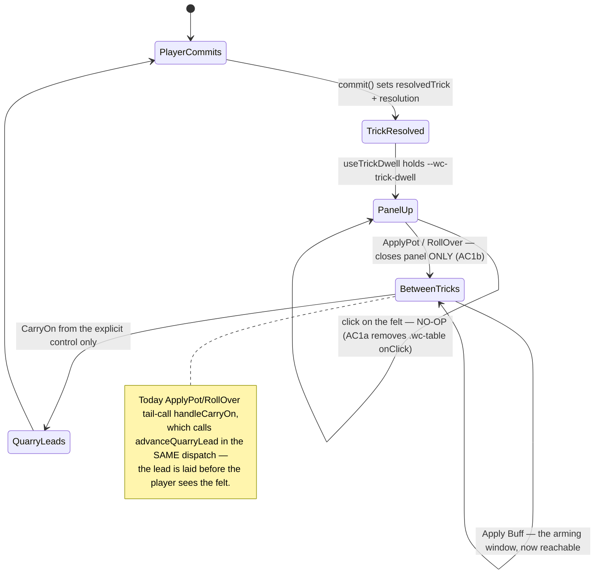

# Plan: Readability and interaction fixes from the first narrated play session

Plan folder: `.claude/contract/DLR-160-play-session-readability-fixes/`
Execution status: see `tasks.md` in this folder.

---

## Part 1 — Alignment

### Task reference

Jira **DLR-160** — *Readability and interaction fixes from the first narrated play session*
(Task, High, labels `playable` / `ui`). Source transcript and screenshots:
`.docs/design/Balatro-Forbidden-Solitaire/the-hunt-play-session-2026-09-02.md`.

The ticket's own framing: not one complaint in the 33-minute session was about a rule. Every
frustration was that something could not be seen, could not be reached, or was lost to a stray
click. The three quotes that set the priority are the lost buff-arming window (*"That's a really
big bug and it's very annoying. That keeps happening. I can't actually play the game."*), the
unreadable resolution screen (*"I actually can't tell why I won this."*), and the false bug report
caused by a tooltip covering the very line that explained the number (*"it only gave me 3 damage.
It should have given me way more. So it looks like a bug."* — the Key-Feeder pays only on a trick
you lose, and he won it).

**Acceptance criteria, verbatim:**

1. **Dismissing the trick-resolution screen cannot advance into the next trick.** The screen is
   dismissed only by its own control; a click anywhere else on it does nothing. After dismissal
   the player still gets the buff-arming window before any card is laid, including when the Quarry
   leads.
2. **The resolution screen states whether the trick carried a skull**, on the card face and in
   words, and names which of the four outcomes it was in the game's own terms — clean win, dodge,
   clean loss, ate the skull — rather than only saying who physically took it.
3. **The resolution breakdown lists the buffs that were armed and did not fire, each with the
   reason** (for example: *Key-Feeder — needed you to lose the trick*), struck through and visually
   distinct from the ones that paid.
4. **A rank's rules tooltip never overlaps the card breakdown panel.** Hovering the Witch, Fox,
   Woodcutter, Swan or Monarch must leave the take-it / don't-take-it lines fully readable.
5. **The resolution screen's type hierarchy is inverted from today's**: the pot (`total × roll`)
   is the largest figure on the screen and the trick's own contribution is subordinate to it.
   Today a contribution of 1 is set roughly three times the size of a pot of 12.
6. **A pot that would kill the Quarry is marked as lethal** on the Apply control.
7. **The trump suit is visible on the resolution screen.**
8. **The buff pile can be filtered by suit**, alongside the existing bronze / silver / gold filter.
9. **The player can review the cards they hold between leaving the shop and starting the next
   fight**, without entering the fight to do it.
10. **The slot machine's strip states each card's tier.**
11. **The card-play transition is slowed enough to be read**, and the resolution screen no longer
    takes the whole viewport. The exact duration and the panel's size are tuning values and belong
    to the developer.
12. **A Fox exchange can be cancelled before it commits.**

**Scope boundaries, verbatim.** In scope: the trick-resolution screen (dismissal, skull and
outcome reporting, buff breakdown, type hierarchy, lethal marking, trump visibility, size); the
buff loadout panel (suit filter, tooltip layering); the shop (reviewing held cards before a fight,
tier on the machine's strip); the Fox exchange prompt (a cancel path); card-play transition timing.
Out of scope: any change to a rule, a reward figure, a price, or a health total; whether buff cards
should still be split by suit at all; the Manage Buffs combine screen; shop pacing and pricing;
restoring the removed telegraph of the Quarry's intent; multiplier cards paying nothing useful in a
hand's first trick.

**Follow-up decisions confirmed interactively, 2026-09-02.** Skills to load during execution
confirmed by the developer as `react-frontend`, `game-ux` and `game-designer`. Two red-lines taken
at the approval gate, both recorded under *Assumptions made*: the carry-on control becomes a real
button rather than a hint line, and the four-outcome verdict is shown on the felt as the cards land
as well as on the resolution panel.

### Restated goal

Twelve interface defects from one recorded play session, across four surfaces, none of them a rule
change. The largest single piece is the trick-resolution screen: it currently replaces the whole
felt, says only who physically took the trick, prints the trick's own one-point contribution three
times the size of the twelve-point pot it is deciding about, and shows nothing about the skull, the
trump suit, whether the pot would already end the fight, or why an armed buff paid nothing. It
becomes a smaller panel that leaves the felt visible, states the outcome in the game's own
four-outcome vocabulary, shows the skull and the decree, marks a lethal pot on the Apply control,
puts the pot at the top of the type hierarchy, and lists the buffs that were armed and missed with
the reason each one missed. Alongside that: the felt stops treating a click anywhere on the table
as "carry on" and stops laying the Quarry's lead automatically when the resolution screen is
dismissed, so the between-tricks arming window the ruleset already grants actually reaches the
player; a rank's tooltip stops covering the breakdown panel it sits on top of; the buff gallery
gains a suit filter beside its tier filter; the player gets a look at their held cards after
leaving the shop and before the fight starts; the slot machine's landed pull states each awarded
card's tier; and the Fox prompt gains a way back out.

### In scope

- **AC1a** — remove the felt's whole-region click-to-carry-on, so only the explicit control
  advances (`.wc-table`'s `onClick` in `WarCouncilTable.tsx`).
- **AC1b** — stop `ApplyPot` / `RollOver` from calling `handleCarryOn`, which today commits the
  Quarry's lead in the same dispatch that closes the resolution screen.
- **AC2** — a four-outcome word plus its one-line reason, shown in **two** places: on the felt's
  trick well the moment the cards land, and on the resolution panel; plus the skull shown on the
  card face and stated in words. (Developer red-line, 2026-09-02 — see Assumptions.)
- **AC3** — a dead-buff list on the resolution panel: every buff armed for the trick that did not
  fire, struck through, with the condition it needed.
- **AC4** — a rank tooltip that never occupies the card-breakdown panel's rectangle.
- **AC5** — the pot as the largest figure; the trick's own contribution subordinate.
- **AC6** — a lethal marking on the Apply control, derived through the same `applyDamage` path the
  action itself uses.
- **AC7** — the decree (trump) suit rendered on the resolution panel.
- **AC8** — a suit filter in the buff gallery, beside `BuffTierFilter`.
- **AC9** — a pre-fight screen between leaving the shop and the first card of the next fight,
  showing the held-buff tray.
- **AC10** — each landed reel window and each award stating the tier that pull awarded it.
- **AC11a** — the resolution surface becomes a panel over the felt rather than a full-viewport
  screen, with its size and placement exposed as tunables the developer sets.
- **AC11b** — the four existing motion tunables (`--wc-flight`, `--wc-trick-dwell`,
  `--wc-beat`, `--wc-resolve-hold`) routed to the developer to retune; no new key.
- **AC12** — a visible cancel control on the Fox prompt, dispatching the existing
  `CancelSelection`.
- Splitting three files that are within fifteen lines of the 400-line budget and are all directly
  in this ticket's path (`src/App.tsx` 399, `WarCouncilTable.tsx` 399, `roundUiState.ts` 384,
  `warCouncilResolve.css` 389).

### Explicitly out of scope

- Any change to a rule, a reward figure, a price, or a health total. In particular the
  activation-window rule is **not** moved — see the audit below, it does not need to be.
- Whether buff cards should still be split by suit at all.
- The Manage Buffs combine screen (`ManageBuffsPanel.tsx`, `manageBuffs.ts`).
- Shop pacing and pricing, including the number of affordable pulls per visit.
- Restoring the Quarry-intent telegraph deleted on DLR-148.
- Multiplier cards paying nothing useful in a hand's first trick.
- Choosing any duration, panel size, font-size bound, or colour. Every one of those is routed to
  the developer under *Risks and judgement calls*.
- Restoring any cut buff family, reward axis, or consumable (`CLAUDE.md` → cut buffs).

### Pattern Reference

The brief supplied no code reference, so these were chosen:

- `.docs/design/Balatro-Forbidden-Solitaire/the-hunt-play-session-2026-09-02.md` — the transcript
  and the four screenshots, the fourth of which is AC3 and AC4 in one frame.
- `.docs/game_rules/the-hunt.md` §7 → *The four outcomes, the streak, and the pot* — the source of
  the four-outcome vocabulary AC2 asks for, and of the pot rule AC5 and AC6 read.
- `.docs/game_rules/the-hunt.md` §4 → *Activating is only available between tricks* — "the same
  window the Swap uses, before a trick's first card is laid". This is the rule AC1b restores
  access to; nothing about it changes.
- `src/app/warCouncil/BuffTierFilter.tsx` — the exact pattern AC8's suit filter follows, including
  its comment about rendering outside the roving-tabindex group.
- `src/app/run/ShopHeld.tsx` — the held-card tray AC9 reuses, already built for exactly this
  question in the shop.
- `src/app/warCouncil/resolutionBeats.ts` — the "derive from what the engine already decided, run
  no rule of its own" discipline that AC3's dead-buff derivation follows.
- `src/app/warCouncil/cardMotionConfig.ts` and `useTrickDwell.ts` — the established
  CSS-custom-property-with-live-reader pattern for a duration tunable, which AC11 reuses rather
  than inventing a config surface.
- `.claude/skills/react-frontend/SKILL.md` and `.claude/skills/game-ux/SKILL.md` for conventions.

### Constraints flagged on the brief

- **AC1 is the most important and the least specified**, and the brief says explicitly: if closing
  it needs the activation-window rule to move, stop and raise it rather than changing it in
  passing. (The audit below establishes that it does not.)
- **AC3 depends on the engine retaining what was armed and did not fire.** The brief says that if
  the information is not retained past resolution it has to be plumbed through.
- **AC5, AC6 and AC11 change a screen DLR-156 shipped a week ago that nobody has seen running** —
  that ticket's record notes its browser pass was skipped. Layout surprises are expected,
  particularly at 640px of viewport height or less, where an overflow is already recorded.
- **AC11's timings and the panel's size are visual judgement** and pause the pipeline.
- Project-wide: two runtime dependencies only; strict TypeScript; no file over 400 lines; no
  `console.log`; Vitest with the `run` subcommand only.

### Assumptions made

- **AC1's second half is a code defect, not a rule question — no rule moves.** `roundReducer.ts`
  lines 118-125 route both `ApplyPot` and `RollOver` through `handleCarryOn`, which calls
  `advanceQuarryLead` in the same dispatch whenever it is the Quarry's turn to lead. The ruleset
  already grants the window (§4: activation is available "before a trick's first card is laid");
  the code simply lays the card before the player is given the chance. The fix is to have those two
  actions close the resolution screen and stop, leaving `quarryToLead` true so the felt shows *They
  are about to lead* with its existing explicit control and an open arming window. **This is the
  single most consequential assumption in the plan** and is repeated under Risks.
- **AC1's first half is the `.wc-table` region click.** `WarCouncilTable.tsx` puts `onClick`
  on the whole `<section className="wc-table">` whenever a trick is held, the Quarry is about to
  lead, or the encounter is over. A stray click anywhere in the play area therefore commits the
  lead. Removing it costs nothing: `TrickWell.tsx` already renders a real, keyboard-reachable
  button for both states, so the explicit control AC1 asks for already exists. Its copy changes
  from *Tap the table to carry on* to something that no longer advertises the removed gesture.
- **AC2's outcome word is derived, never stored.** The four outcomes are a function of
  `winner === PlayerSide.Player` (the mechanical axis) and whether either card in the trick carries
  a skull. A new pure module derives the word; nothing in the engine changes.
- **DEVELOPER RED-LINE, 2026-09-02 — the verdict is shown on the felt too, not only on the panel.**
  *"When the player or CPU plays the card and the trick is resolved let the card move to the
  position, say 'trick won/lost' and a reason why. Like you eat a skull or clean win clean loss."*
  `TrickWell.tsx`'s resolved branch today prints only the mechanical fact — *"You take the trick.
  You take 1."* — which is exactly the half that misleads on a skull trick. It gains the same
  `TRICK_OUTCOME_WORD` and `TRICK_OUTCOME_WHY` the panel uses, from the same pure module, so the
  felt and the panel can never word one trick two ways. This lands during
  `--wc-trick-dwell`, after the card's flight and before the panel appears, which is the beat the
  developer is describing.
- **DEVELOPER RED-LINE, 2026-09-02 — the carry-on control is a real button, not a hint line.**
  `TrickWell.tsx` already renders a `<button>`, but it is classed `wc-table-hint wc-is-carry-on`
  and styled as a line of text advertising the gesture AC1a deletes. Both branches — *Let them
  lead* and the resolved trick's own carry-on — get button chrome and the ≥44px hit area
  `react-frontend` requires, and the copy stops naming a tap on the table.
- **AC3's "reason" is the buff's own condition sentence, not a new negation table.** The dead row
  reads as the buff's name plus what it needed, composed from the existing
  `buffConditionSentence` in `buffLabels.ts`. Authoring a second table of per-family miss reasons
  would be a second reading of `buffFires`, which is the drift `buffProjection.ts`'s docblock
  exists to prevent.
- **AC3's data is already retained.** `resolutionViewFor` in `commitHandlers.ts` is called with
  the pre-commit `RoundUiState`, whose `buffActivation.activatedThisTrick` still holds the armed
  ids and whose `buffActivation.spentThisTrick` plus `offeredBuffs(state)` resolve every id to a
  `Buff`. Nothing needs plumbing through the engine; the armed set minus `firedBuffIds` is the
  dead set.
- **AC4 is fixed by placement, not by suppression.** The breakdown panel is anchored so its bottom
  edge sits on the hovered card's top edge; the tooltip is placed with its bottom edge on the same
  line. They collide by construction, every time, not occasionally. The tooltip will be placed
  above whichever of the two is higher, by publishing the panel's measured top edge through a
  small React context that `CardAbilityTip` reads. The alternative — hiding the tooltip while a
  breakdown is open — was rejected because the rank rule is exactly what a player hovering a Witch
  wants, and AC4 asks for no overlap, not for one of the two to disappear.
- **AC6's lethality is asked of the same code path the action uses.** A pure predicate composes
  `isEncounterResolved(applyDamage(encounter, incomingFromPot(pot)))` so the Quarry's shields and
  the zero floor are inherited rather than restated — the cautionary case `duelHealthBars.ts`
  already documents about `projectedDepletion`.
- **AC9 is a new pre-fight screen, not a change to the shop.** `leaveForNextFight` currently
  advances the run and drops the player straight onto the felt, because `screenFor` returns
  `warCouncil` for any phase once the encounter is live. A new `RunPhase.PreFight`, checked before
  the `!encounterOver` branch exactly as `Start` already is, gives the player a stop where the
  path map and the held tray sit side by side and one control starts the fight. Reusing the
  existing `RunPathScreen` with an optional held-buff region keeps this to one screen component
  rather than two near-identical siblings, which is the argument that file's own docblock makes.
- **AC10 is about the landed pull, not the face-up strip.** A strip symbol is a `BuffTemplate`,
  which carries no tier at all — the tier is decided by `resolvePull` from how the three reels
  matched. So "states each card's tier" is satisfied on the reel windows once they land and on the
  award list, both read off `lastPull.awards` rather than re-deriving the match rule. The
  face-up strip keeps its untiered chips because there is no tier to state there.
- **AC11's panel overlays the felt rather than shrinking inside a full-viewport shell.** The
  developer's own words are *"just put it into the corner somewhere"*, which only means anything
  if the felt is still behind it. `WarCouncilRound.tsx`'s either/or switch becomes "always the
  table, plus the panel when a trick has resolved". The felt is already non-interactive in that
  state (`canAct` is false while `resolvedTrick !== null`), so nothing new needs disabling.
- **AC11's timings need no new code.** All four durations are already CSS custom properties with
  live readers, declared as placeholders. Retuning them is a one-line edit each and belongs to the
  developer.
- **DEVELOPER-TRANSCRIBED VALUE, 2026-09-02 — `--wc-trick-dwell` becomes `1000ms`.** *"Wait a
  second before moving to the resolution screen."* Taken as given rather than routed back, per this
  project's practice on transcribed tuning values. The dwell now carries more than a card settling:
  with the red-lined verdict in the trick well, it is the window in which that line is read, so
  800ms was short for its new job. Still a placeholder — the one-line retune stays available.
- **AC12's cancel is the existing `CancelSelection`.** The reducer already clears `armed` and
  `prompt` together and the Fox is never removed from hand until commit, so the only thing missing
  is a visible control. *Keep the decree* is **not** that control — it declines the exchange but
  still plays the Fox, which is not what the player asked for.
- **Four file splits are in scope because four files in this ticket's path are at the budget.**
  `src/App.tsx` (399), `WarCouncilTable.tsx` (399), `roundUiState.ts` (384) and
  `warCouncilResolve.css` (389) all grow under this work. Per `CLAUDE.md`, a breach is fixed in the
  ticket that causes it.
- **No test environment change is needed.** The `dom` Vitest project already exists and
  `.test.tsx` specs are already collected.

### Config and persisted-shape audit

- **`ResolutionView` — 15 annotated sites across 5 files; `nextPotFloor` (its most distinctive
  required field) — 10 sites across 6 files, 4 of them in specs.** The larger figure is the real
  one. Annotated files: `roundUiState.ts` (the declaration), `commitHandlers.ts` (the sole
  producer, `resolutionViewFor`), `TrickResolutionScreen.tsx` (the sole consumer),
  `__tests__/roundReducer.resolution.test.ts`, `__tests__/TrickResolutionScreen.test.tsx`. The two
  construction sites beyond the producer are both literal fixtures with no type annotation —
  `roundReducer.resolution.test.ts:185` and `TrickResolutionScreen.test.tsx:78` and `:112` (three
  literals, two files). Every new required field on `ResolutionView` must be added to all four
  literals in the same task or `npm run typecheck` fails mid-phase. `cardDamage.ts:134` mentions
  `nextPotFloor` only in a comment and is not a construction site.
- **`AppScreen` is declared twice, and the second copy binds by string.** `src/app/screenFor.ts:25`
  declares the union; `src/app/debugState.ts:17` restates the same seven literals inline as the
  `screen` field's type rather than importing it. Adding `preFight` therefore needs both edits in
  one task, or the debug mirror stops type-checking against what `screenFor` returns.
  `.claude/skills/ai-play-tester/references/round-driver.md` reads `state.app.screen` and compares
  it to `'warCouncil'` in two places; a new value beside the existing seven does not break either
  comparison, but the skill's reference will describe an incomplete screen set until it is updated.
- **`RunPhase` — 35 `RunPhase.` references across `src/`.** Adding `PreFight` is purely additive:
  no existing member is renamed or removed, and `screenFor`'s branch chain is ordered, so the new
  branch is inserted before the `!encounterOver` line rather than replacing anything.
  `src/app/__tests__/screenFor.test.ts` asserts nine `screenFor` cases and gains one.
- **`--wc-flight`, `--wc-trick-dwell`, `--wc-beat`, `--wc-resolve-hold` all already exist** as CSS
  custom properties with live readers (`cardMotionConfig.ts:75`, `useTrickDwell.ts`,
  `useBeatSequence.ts:42`, `useResolveHold.ts`). AC11's timing half is a value change only and adds
  no key. The panel's size and placement need two genuinely new tunables (below).
- **No persisted shape is touched.** Nothing in this ticket writes through `src/persistence/`; no
  `localStorage`/`sessionStorage` global is named anywhere in the file map; `SAVE_SCHEMA_VERSION`
  is untouched. `.claude/rules/save-data-versioning.md`'s six reject conditions are all inert here.
- **CSS class names are the string-bound surface this ticket actually touches.** New classes
  (`.wc-resolve-panel`, `.wc-resolve-outcome`, `.wc-resolve-dead`, `.wc-suit-chip`,
  `.shop-reel-tier`, `.wc-prompt-cancel`, `.run-path-held`) are all new names with zero existing
  hits, so nothing can be orphaned by them. The one class actually removed is `.wc-is-waiting` on
  `.wc-table`, whose only purpose is the cursor affordance for the click AC1a deletes — both sides
  of that pair change in one task.
- **The pure-core boundary is not crossed.** Every new module in this plan lives under
  `src/app/warCouncil/` or `src/app/run/`, which are outside the `src/warCouncil/**` +
  `src/hunt/**` ESLint override. No new import into either protected tree is planned, so the
  existing lint gate covers it with no new grep.
- **File budget, measured with `(Get-Content <path>).Count`, not `Measure-Object -Line`:**
  `src/App.tsx` 399, `WarCouncilTable.tsx` 399, `warCouncilResolve.css` 389,
  `roundUiState.ts` 384, `commitHandlers.ts` 369, `SlotMachinePanel.tsx` 295,
  `warCouncilBuffGallery.css` 272, `roundReducer.ts` 234, `BuffGallery.tsx` 212,
  `TrickResolutionScreen.tsx` 195, `TrickWell.tsx` 188, `AbilityPrompt.tsx` 174,
  `useCardTip.ts` 162, `slotLabels.ts` 141, `SlotReel.tsx` 120, `warCouncilCardTip.css` 91,
  `RunPathScreen.tsx` 56, `screenFor.ts` 40. The first four cannot absorb any addition.

---

## Part 2 — Technical design

### Approach

**The felt stops advancing itself.** Two independent defects produce the single symptom the
developer called unplayable, and both are removed rather than mitigated. The first is
`WarCouncilTable.tsx`'s `onClick` on the whole `.wc-table` section, which fires `handleCarryOn` for
any click landing in the play area while a trick is held or the Quarry is pending; `TrickWell.tsx`
already renders a real button for both of those states, so deleting the region handler leaves a
strictly better interaction rather than an unreachable one. The second is that `ApplyPot` and
`RollOver` in `roundReducer.ts` both tail-call `handleCarryOn`, which advances the Quarry's lead in
the very dispatch that dismisses the resolution panel — so the between-tricks window closes before
the player ever sees the felt. Both actions become "close the panel, change nothing else"; the
existing `CarryOn` action, reached only from the explicit control, keeps sole responsibility for
laying the lead. Nothing in `the-hunt.md` changes: §4 already says activation is available before a
trick's first card is laid, and this is what makes that true in the code. Both of `TrickWell.tsx`'s
carry-on controls stop being styled as hint lines and become buttons with a real hit area, and
their copy stops naming a gesture that no longer exists.

**The verdict is said where the cards land, and again on the panel, from one source.** The
developer's red-line at the approval gate is that the moment worth explaining is the one where the
card arrives in the well — so `TrickWell.tsx`'s resolved branch, which currently prints only *"You
take the trick"*, gains the four-outcome word and its one-line reason during `--wc-trick-dwell`,
before the panel appears. Both surfaces read `TRICK_OUTCOME_WORD` / `TRICK_OUTCOME_WHY` out of the
same pure module and derive the outcome from the same two facts, so a skull trick cannot be worded
one way on the felt and another on the panel — which is precisely the confusion the session
produced.

**The resolution surface becomes a panel that answers the player's question.** Today
`TrickResolutionScreen` replaces the felt entirely, and `WarCouncilRound.tsx` switches between the
two. It becomes an overlay: the table renders unconditionally and the panel mounts beside it, sized
and placed by two new CSS custom properties the developer sets. Its content grows in four ways, and
all four derivations are pure and live in their own modules rather than in the component, because
each has a testable invariant: a **four-outcome word** (`clean win` / `dodge` / `clean loss` / `ate
the skull`) derived from `winner` plus whether either played card is in `skulledCards`; a **dead-buff
list**, the armed ids from `buffActivation.activatedThisTrick` minus `resolution.firedBuffIds`,
resolved to `Buff`s against the same `offeredBuffs + spentThisTrick` union `resolutionViewFor`
already builds, each rendered struck through with its own `buffConditionSentence`; a **lethality
predicate** that asks `isEncounterResolved(applyDamage(encounter, incomingFromPot(pot)))` rather
than comparing two numbers, so shields and the zero floor are inherited; and the **decree card**,
carried straight from `RoundState.decree`. `ResolutionView` gains those inputs and moves to its own
module — `roundUiState.ts` is at 384 of 400 lines and cannot hold the widened interface plus its
docblocks. `resolutionViewFor` stays the sole producer, and it already has everything it needs in
scope: `state.round.skulledCards`, `state.round.decree`, `state.buffActivation`, and the post-fold
encounter available at its call site.

The type hierarchy inverts in CSS alone. `.wc-resolve-big-value` currently carries
`clamp(2.1rem, 6.2vmin, 3.6rem)` for the trick's own contribution while `.wc-resolve-figure-value`
— which renders the pot — declares no `font-size` at all. The pot takes the large treatment and the
impact animation with it, and the contribution drops to a subordinate size. The three bounds
involved are tuning values and are listed for the developer rather than chosen here.

**The tooltip and the breakdown stop fighting over the same rectangle.** Both are anchored to the
top edge of the hovered card: `useBuffBreakdownAnchor` sets the panel's `bottom` from the card's
measured rect, and `useCardTip` sets the bubble's `top` from the same rect, so the bubble's bottom
edge and the panel's bottom edge land on the same line every time. A tiny context published by
`CardBuffBreakdown` carries the panel's measured top edge; `CardAbilityTip` reads it and, when a
panel is open, anchors above that instead of above the card. This is one number crossing one
boundary — smaller than restructuring the panel to absorb the rank rule, and it leaves the panel's
height and content untouched, which matters because the 640px-and-below overflow the brief warns
about is already a known risk on that surface.

**The three smaller surfaces reuse what is already there.** The buff gallery's suit filter is a
sibling of `BuffTierFilter` — the same chip row, the same `aria-pressed` pattern, filtering on the
`BuffRunKind` that `buffGalleryModel.ts` already assigns every stack, and rendered outside the
roving-tabindex `groupRef` for the reason that file's docblock already gives. Composing it with the
existing tier filter means the gallery's local filter state becomes a two-field object rather than
two independent `useState` calls, so "silver Moons" is expressible and the recomputed fence reason
stays correct over the intersection. The slot machine reads each landed reel's tier off
`lastPull.awards` by template id — never by re-deriving `resolvePull`'s match rule — and renders it
as a badge on the window and on each award row. The Fox prompt gains a cancel button wired to the
`onCancel` it is already handed, which `WarCouncilTable.handleCancel` already routes to
`CancelSelection`; the only new thing is that it is visible rather than Escape-only.

**The pre-fight stop is one new phase and one optional region.** `RunPhase.PreFight` is checked in
`screenFor` immediately after `Start` and before the `!encounterOver` branch, because after
`advanceRun` the encounter is live and every later branch is unreachable. `leaveForNextFight` sets
that phase instead of `Verdict`; the screen is `RunPathScreen` with an optional held-buff region
rendering the existing `ShopHeld` tray in read-only form, and its one control starts the fight by
moving to `Verdict`. `debugState.ts` restates the `AppScreen` union inline and must be changed in
the same task, since it binds by string and the compiler will not connect the two.

**File splits, forced by the budget.** `src/App.tsx` is at 399 lines, so the three
`RunPathScreen`-rendering branches move to `src/app/run/PathScreens.tsx` in the same task that adds
the fourth. `WarCouncilTable.tsx` is at 399 but AC1a only deletes from it. `roundUiState.ts` at 384
gives up `ResolutionView` to `resolutionView.ts`, re-exported so no importer moves.
`warCouncilResolve.css` at 389 gives up the panel chrome to `warCouncilResolvePanel.css`.
`TrickResolutionScreen.tsx` at 195 gains the outcome line, the trump mark, the dead list and the
lethal marking, so the breakdown rows move to a sibling `ResolutionBreakdown.tsx`.

### Skills to invoke during execution

- **`react-frontend`** — owns everything under `src/`: component structure, the reducer contract,
  effect cleanup, the 400-line budget, Vitest placement, and the ban on inventing a tunable.
  Governs every task in this plan except the Jira-only and documentation ones.
- **`game-ux`** — owns the game-screen layer: the resolution panel's placement and the no-scroll
  shell it now overlays, tooltip-versus-panel layering, the tap cost of carrying on, the greyscale
  reading of the new outcome and tier badges, and the pre-fight screen's zoning. Governs Phases
  1-5 and 7.
- **`game-designer`** — confirmed by the developer. Scoped narrowly: the AC1 rule question (the
  plan's finding is that no rule moves; this skill is the check on that), and the four-outcome
  wording AC2 puts on screen, which must match `the-hunt.md` §7 rather than invent a synonym.

Rules the executor must Read: `.claude/rules/README.md`, then any file whose topic matches — the
folder currently holds only `save-data-versioning.md`, which this ticket does not trip, but the
scan is the contract. Always read `.claude/workflow/web-project.md` for paths and runners.

No developer override was applied to the classifier's list; `game-designer` was an addition by the
developer, recorded above with its scope.

### Diagram



### Data shapes

#### `src/app/warCouncil/resolutionView.ts` (new — moved out of `roundUiState.ts`, then widened)

```ts
import type { Buff } from '../../hunt'
import type { Card, PlayerSide, TrickCard, TrickResolution } from '../../warCouncil'
import type { ResolutionBeat } from './resolutionBeats'

/** DLR-156's `ResolutionView`, moved here on DLR-160 because `roundUiState.ts` reached its
 *  400-line budget. Re-exported from `roundUiState.ts` so no importer changes. */
export interface ResolutionView {
  readonly cards: readonly TrickCard[]
  readonly winner: PlayerSide
  readonly resolution: TrickResolution
  readonly beats: readonly ResolutionBeat[]
  readonly trickNumber: number
  readonly nextPotFloor: number
  /** DLR-160 AC2 — the cards in THIS trick that carry a skull, filtered from
   *  `RoundState.skulledCards` at the hand-off. Empty on a clean trick. */
  readonly skulledInTrick: readonly Card[]
  /** DLR-160 AC7 — the decree in force as the trick resolved. */
  readonly decree: Card
  /** DLR-160 AC3 — buffs armed for this trick that did not fire, resolved to `Buff`s at the
   *  hand-off from the same `offeredBuffs + spentThisTrick` union the beats use. */
  readonly deadBuffs: readonly Buff[]
  /** DLR-160 AC6 — `true` when applying this pot would end the fight. Derived through
   *  `applyDamage`/`isEncounterResolved`, never by comparing two numbers. */
  readonly potIsLethal: boolean
}
```

#### `src/app/warCouncil/resolutionOutcome.ts` (new — pure)

```ts
/** The four outcomes `the-hunt.md` §7 names, on the OUTCOME axis. Derived from the MECHANICAL
 *  axis (`winner`) crossed with whether the trick carried a skull. */
export const TrickOutcomeKind = {
  CleanWin: 'cleanWin',
  Dodge: 'dodge',
  CleanLoss: 'cleanLoss',
  AteTheSkull: 'ateTheSkull',
} as const
export type TrickOutcomeKind = (typeof TrickOutcomeKind)[keyof typeof TrickOutcomeKind]

export function trickOutcomeKindFor(playerTook: boolean, skullTrick: boolean): TrickOutcomeKind

/** PLACEHOLDER copy, wording from `the-hunt.md` §7 — the developer's to retune. */
export const TRICK_OUTCOME_WORD: Readonly<Record<TrickOutcomeKind, string>>
/** The one-line "why", e.g. "you did not take it, and it carried a skull". */
export const TRICK_OUTCOME_WHY: Readonly<Record<TrickOutcomeKind, string>>
```

#### `src/app/warCouncil/TrickWell.tsx` (modified — the developer's red-line)

```ts
/** The cards in THIS trick that carry a skull, so the well can word the outcome on the same two
 *  facts the panel does. Defaults to `[]`, the pattern `skulledCards`/`primedCards` already set
 *  on this component, so no existing caller breaks. */
readonly skulledInTrick?: readonly Card[]
```

The resolved branch replaces its `{winnerLabel} take the trick.` line with
`TRICK_OUTCOME_WORD[kind]` plus `TRICK_OUTCOME_WHY[kind]`, keeping the existing damage and
Timebomb clauses. Both carry-on buttons drop `wc-table-hint` for a new `.wc-carry-btn` class.

#### `src/app/warCouncil/resolutionLethal.ts` (new — pure)

```ts
import { type EncounterState } from '../../hunt'

/** AC6 — would applying this pot end the fight? Composes the SAME two calls `applyPotAction`
 *  makes, so the Quarry's shields and the zero floor are inherited rather than restated. */
export function potIsLethal(encounter: EncounterState, pot: number): boolean
```

#### `src/app/warCouncil/resolutionDeadBuffs.ts` (new — pure)

```ts
import type { Buff, BuffId } from '../../hunt'

/** AC3 — armed minus fired, resolved against `candidates`. An id with no match is DROPPED,
 *  matching `resolveFired` in `resolutionBeats.ts` and `buffFiredLabels.ts`. */
export function deadBuffsFor(
  armedIds: readonly BuffId[],
  firedIds: readonly BuffId[],
  candidates: readonly Buff[],
): readonly Buff[]

/** The struck-through row's text: the buff's name and the condition it needed, composed from
 *  `buffLabels.ts`'s existing grammar rather than a second per-family table. */
export function deadBuffReasonText(buff: Buff): string
```

#### `src/app/warCouncil/buffSuitFilter.ts` (new — pure) and the gallery's filter state

```ts
import type { BuffRunKind, BuffStack } from './buffGalleryModel'

/** AC8 — the gallery's two filters as ONE value. Two independent `useState` calls would admit
 *  a pair the counts were never recomputed over. */
export interface BuffGalleryFilter {
  readonly tier: BuffTier | 'all'
  readonly run: BuffRunKind | 'all'
}
export const ALL_FILTERS: BuffGalleryFilter

export function matchesFilter(stack: BuffStack, filter: BuffGalleryFilter): boolean
/** Per-run held counts for the chip row, over the stacks the TIER filter already allows. */
export function runCountsFor(
  view: BuffGalleryView,
  tier: BuffTier | 'all',
): Readonly<Record<BuffRunKind | 'all', number>>
```

#### `src/app/warCouncil/BuffSuitFilter.tsx` (new — component)

```ts
interface BuffSuitFilterProps {
  readonly counts: Readonly<Record<BuffRunKind | 'all', number>>
  readonly selected: BuffRunKind | 'all'
  readonly onSelect: (run: BuffRunKind | 'all') => void
}
```

#### `src/app/screenFor.ts` (modified) and `src/app/debugState.ts` (modified)

```ts
export const RunPhase = {
  Start: 'start',
  Verdict: 'verdict',
  Warned: 'warned',
  Shop: 'shop',
  ManageBuffs: 'manageBuffs',
  Map: 'map',
  Vault: 'vault',
  /** DLR-160 AC9 — reached ONLY from `leaveForNextFight`, left ONLY by starting the fight.
   *  Checked before the `!encounterOver` branch, exactly as `Start` is, because the next
   *  encounter is already live by the time this phase is set. */
  PreFight: 'preFight',
} as const

export type AppScreen =
  'start' | 'preFight' | 'map' | 'shop' | 'manageBuffs' | 'vault' | 'verdict' | 'warCouncil'
```

`debugState.ts:17` currently restates those literals inline; it changes to
`screen: AppScreen`, importing the union so the two cannot drift again.

#### `src/app/run/RunPathScreen.tsx` (modified) and `src/app/run/PathScreens.tsx` (new)

```ts
interface RunPathScreenProps {
  readonly title: string
  readonly stages: readonly PathStage[]
  readonly goalText: string
  readonly actionLabel: string
  readonly onAction: () => void
  /** DLR-160 AC9 — the buffs to show in a read-only tray beneath the map. `undefined` on the
   *  start and map screens, which have nothing to review. */
  readonly heldBuffs?: readonly Buff[]
}
```

`PathScreens.tsx` exports one component per branch lifted out of `App.tsx` — `StartScreen`,
`MapScreen`, `PreFightScreen` — each a thin wrapper over `RunPathScreen`, so `App.tsx` returns to
under budget while gaining the fourth branch.

#### `src/app/run/slotTier.ts` (new — pure)

```ts
import type { BuffTemplate, BuffTier, SlotAward } from '../../hunt'

/** AC10 — the tier each landed reel window awarded, by index, read off the pull's own awards
 *  by template id. NEVER re-derives `resolvePull`'s match rule. `null` for a symbol that
 *  awarded nothing, which cannot happen today but is not this function's rule to assume. */
export function reelTiers(
  symbols: readonly BuffTemplate[],
  awards: readonly { readonly template: BuffTemplate; readonly tier: BuffTier }[],
): readonly (BuffTier | null)[]
```

#### `src/app/warCouncil/breakdownRectContext.ts` (new)

```ts
/** AC4 — the card-breakdown panel's measured top edge in viewport coordinates, or `null` when
 *  no panel is open. ONE number crossing ONE boundary, so `CardAbilityTip` can place its bubble
 *  above whichever of the card and the panel is higher. */
export const BreakdownTopContext: React.Context<number | null>
export function useBreakdownTop(): number | null
```

#### Configuration keys

| Key | File | Type / unit | Value |
|---|---|---|---|
| `--wc-resolve-panel-w` | `warCouncilResolvePanel.css` | CSS length | **Developer decision** — the panel's width, AC11 |
| `--wc-resolve-panel-inset` | `warCouncilResolvePanel.css` | CSS length | **Developer decision** — its distance from the viewport corner, AC11 |
| `--wc-flight` | `warCouncilMotion.css` (exists, `380ms`) | ms | **Developer decision** — retune, AC11 |
| `--wc-trick-dwell` | `warCouncilResolve.css` (exists, `800ms`) | ms | **`1000ms` — transcribed from the developer at the approval gate**, 2026-09-02: *"wait a second before moving to the resolution screen"*. Set in this ticket, still a placeholder to retune by playing |
| `--wc-beat` | `warCouncilResolve.css` (exists, `520ms`) | ms | **Developer decision** — retune, AC11 |
| `--wc-resolve-hold` | `warCouncilResolve.css` (exists, `700ms`) | ms | **Developer decision** — retune, AC11 |

The two new keys get a documented placeholder in the same task that adds them, per the config-task
shape; the executor must not invent a considered value for either.

No `package.json`, `tsconfig.json`, `vite.config.ts` or `eslint.config.js` change. No dependency
change. No persisted shape change and no `SAVE_SCHEMA_VERSION` bump.

### Runtime quality notes

- **Purity and adjudication.** Five new pure modules — `resolutionOutcome.ts`,
  `resolutionLethal.ts`, `resolutionDeadBuffs.ts`, `buffSuitFilter.ts`, `slotTier.ts` — each with a
  testable invariant and each tested without a renderer under the `node` project. None imports
  React or touches the DOM. None runs a rule of its own: the outcome word crosses two facts the
  engine already decided, lethality composes the two calls `applyPotAction` makes, the dead set is
  a set difference, and the reel tiers are a lookup into `resolvePull`'s own output. All five live
  under `src/app/`, outside the `src/warCouncil/**` + `src/hunt/**` lint boundary, because all five
  produce or consume user-facing copy.
- **Effects, mount and teardown.** One new effect in the whole plan: `CardBuffBreakdown` publishing
  its measured top edge. It reuses the existing `useLayoutEffect` in `useBuffBreakdownAnchor`,
  which already measures the panel on every anchor change, so no new observer, timer or listener is
  created and nothing new needs cleanup — the context value returns to `null` when the panel
  unmounts, which is the same edge the panel's own render already handles. `useCardTip`'s existing
  listener set is untouched. The resolution panel becoming an overlay changes what is mounted, not
  what runs: `useTrickDwell`, `useBeatSequence` and `useResolveHold` keep their existing effects and
  cleanups, and `useTrickDwell`'s reset-in-cleanup shape is what keeps StrictMode's
  invoke-cleanup-invoke idempotent. The table now stays mounted through a resolution, which means
  `useTableCardMotion` and `useCardMotionDriver` are no longer torn down and remounted at every
  trick — strictly fewer mounts, not more.
- **Hot-path cost.** Nothing here runs per pointer event. The tooltip anchor is still measured once
  per opening plus once per `transitionend`, as `useCardTip`'s docblock requires, and the new
  context value is read during render rather than polled. The gallery's two filters are applied
  once per render over an already-built `BuffGalleryView` — `buildBuffGallery` is still never re-run
  in the component. `reelTiers` is O(reels x awards) over three and at most three. No `memo`,
  `useMemo` or `useCallback` is added anywhere; there is no profiling evidence for any.
- **Determinism and numeric safety.** No `Math.random()` is reachable from anything new; the slot's
  RNG path is untouched. No new division exists, so no epsilon and no guarded divisor are needed —
  `potValue` and `overlapBonusFor` are unchanged. `potIsLethal` is a boolean over two existing
  calls and cannot produce `NaN`. `reelTiers` returns `null` rather than `undefined` for an
  unmatched symbol, so nothing renders the word "undefined".
- **Error paths.** No new async surface, so the four async states do not arise. Nothing new can
  throw: `deadBuffsFor` drops an unresolvable id exactly as `resolveFired` already does rather than
  rendering `undefined`; `reelTiers` returns `null` for the same class of miss; `trickOutcomeKindFor`
  is total over two booleans. Nothing catches an error and returns a success shape. The one
  behaviour deliberately removed — the felt's region click — fails *closed*: after AC1a the only way
  to advance is the explicit control, so a mis-aimed click does nothing at all, which is the
  outcome AC1 asks for.

### Risks and judgement calls

- **AC1b changes when the Quarry's lead is committed, and that is the plan's biggest claim.** The
  reading is that §4's between-tricks window already covers this moment and the code was closing it
  early, so no rule moves. If the developer's intent is instead that the Quarry's lead should land
  automatically and the arming window should re-open *after* it, that is a rule change and the
  brief says to stop. **Confirm this reading before Phase 1 ships.**
- **AC11's panel-over-felt structure is a judgement call read from one sentence of transcript.**
  *"Just put it into the corner somewhere"* is read as "keep the felt visible behind it". If the
  developer meant only "make the content smaller inside the same full-screen shell", the structural
  change in `WarCouncilRound.tsx` is unnecessary and Phase 3 shrinks considerably.
- **Every duration and size on this ticket is the developer's.** `--wc-trick-dwell` is settled at
  `1000ms` by the developer's own words at the gate; `--wc-flight`, `--wc-beat` and
  `--wc-resolve-hold` all exist and still need retuning by playing;
  `--wc-resolve-panel-w` and `--wc-resolve-panel-inset` are new and ship with documented
  placeholders. So do the three font-size bounds AC5's inversion needs. None is chosen here.
- **The four-outcome wording is copy, and copy is the developer's.** `TRICK_OUTCOME_WORD` ships
  `the-hunt.md` §7's own terms as a placeholder; whether *ate the skull* reads well on a panel is a
  judgement only playing settles.
- **The lethal marking's visual treatment is the developer's**, and `game-ux`'s greyscale rule
  applies: it must read without colour, so it needs a word or a glyph and not only a red Apply
  button.
- **AC3's dead rows will lengthen the panel exactly when it is being made smaller.** A trick with
  three armed buffs and one firing produces two struck-through rows in a panel that AC11 is
  shrinking. Whether the dead list needs its own scroll region, a cap, or a collapsed count is a
  layout judgement to make against the real panel, and the 640px-and-below overflow the brief warns
  about is where it will bite first.
- **AC4's fix depends on the breakdown panel's height.** Anchoring the tooltip above the panel
  pushes it further up the viewport; on a short viewport with a tall breakdown the bubble may clip
  the top edge. The existing `clamp()` on the bubble's horizontal placement has no vertical
  equivalent, and adding one is a bound the developer chooses.
- **AC9 adds a screen to the run flow, which is more than "show the cards".** It puts a stop
  between the shop and the fight that did not exist. If the developer would rather the review be
  reachable *from* the fight without a new screen, say so — that is a different and smaller change.
- **AC10's honest reading is that the strip cannot state a tier.** A strip symbol has no tier;
  the tier is decided by the match. The plan puts it on the landed windows and the awards instead.
  If the developer wants something on the face-up strip, the only available fact is the *possible*
  tiers, which is the payout table already printed beside it.
- **Four file splits ride along.** `App.tsx`, `roundUiState.ts` and `warCouncilResolve.css` are all
  within sixteen lines of the blocking budget and all grow here, so each is split in the task that
  grows it. That is per `CLAUDE.md`, but it does widen three diffs that would otherwise be small.
- **Layout can only be judged by running it.** DLR-156 shipped this screen with its browser pass
  skipped, so nothing on it has ever been seen. A `--browser` pass on `/fb-apply` is worth asking
  for on this ticket specifically; without one, every layout question here routes to the developer
  with an explicit interaction to try.
