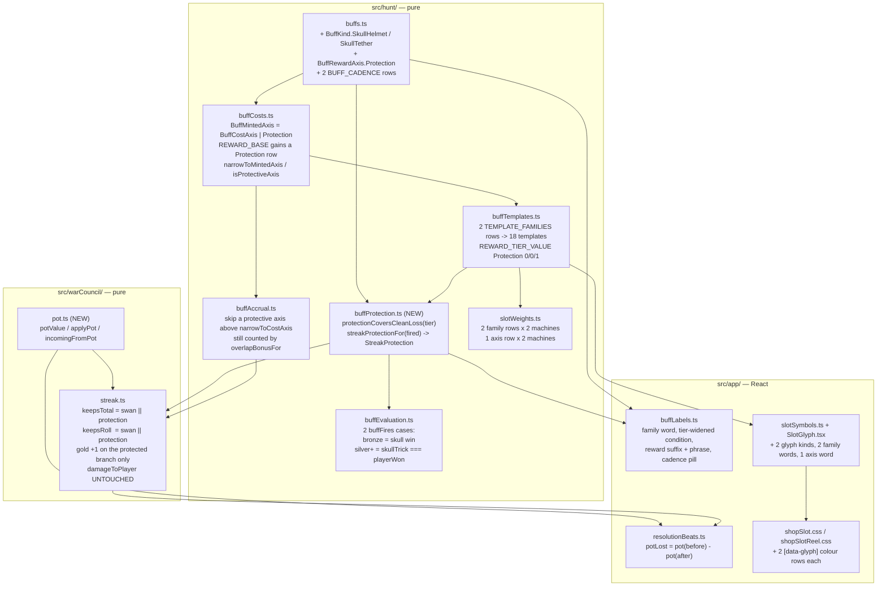

# Plan: Skull Helmet and Skull Tether — two buff cards that protect a streak from a skull you could not dodge

Plan folder: `.claude/contract/DLR-161-skull-helmet-and-skull-tether/`
Execution status: see `tasks.md` in this folder.

---

## Part 1 — Alignment

### Task reference

Jira **DLR-161** (Story, labels `engine` + `playable`), moved `To Do → Planning` on 2026-09-02 at the
start of this run. Design source: `.docs/design/Balatro-Forbidden-Solitaire/ideas.md` → *Skull Helmet
and Skull Tether — two cards that answer the forced skull* (line 1627), which carries the worked
arithmetic and the discarded variants. Session evidence:
`.docs/design/Balatro-Forbidden-Solitaire/the-hunt-play-session-2026-09-02.md`.

Acceptance criteria, verbatim from the ticket:

1. **Two new mintable buff cards exist, Skull Helmet and Skull Tether**, each at bronze, silver and gold. Both are ordinary condition buffs — armed for a trick in the normal between-tricks window, spent when used, dealt by the shop's machine like any other card.
2. **Their condition is the existing "eat a skull with this card" rule** — the trick carried a skull and you took it. That rule is already defined, priced and enforced in `the-hunt.md` §4; it has simply not been dealt since 2026-08-25. Restoring it must not re-enable any of the other seven cut conditions.
3. **Skull Helmet, bronze:** you take the 1 damage, your **total** survives at the value it held, and your roll goes to zero.
4. **Skull Tether, bronze:** you take the 1 damage, your **roll** survives at the value it held, and your total goes to zero.
5. **Silver, both cards:** as bronze, and the card also fires on a **clean loss**, not only on a skull you ate.
6. **Gold, both cards:** as silver, and the surviving figure gains one — the Helmet's total **+1**, the Tether's roll **+1**. These are deliberately unequal in value and that is accepted: at a total of 10, one extra roll is worth 10 and one extra point of damage is worth 1. The Tether's situation is the rarer one.
7. **Neither card ever spares the health.** The 1 damage lands on every rung of both cards. This holds the line the Timebomb exception, the Swan's rungs and the Blast Guard all already hold.
8. **They do not stack.** Arming a second copy of the same card on the same trick has no additional effect, because a total either survives or it does not. The second copy is still spent.
9. **Arming one of each protects both figures**, and the second card fired earns the Overlap Bonus exactly as any other pair would.
10. **A card that was armed and did not fire says so on the resolution screen**, with the reason — the trick carried no skull, or you did not take it.
11. **Both cards appear on the slot machine's strip and in the buff grid** with their condition and their reward stated in the same shape every other card uses.

Scope boundaries and the Dependencies & Risks list from the ticket are carried into *In scope*,
*Explicitly out of scope* and *Risks and judgement calls* below rather than restated here.

### Restated goal

Add two new buff-card families to the pool whose reward is neither damage nor multiplier but
*protection*: when a trick hurts you, one of them keeps your running `total` and the other keeps your
`roll`, so a skull you could not dodge costs you the health without also wiping the streak you had
built. The condition is the game's existing "you took a trick that carried a skull" rule, restored
for these two families only and widened at silver and gold to cover a clean loss as well; gold adds
one to whichever figure survived. The health always lands. Delivering this means widening four narrow
type unions (`MintableConditionKind`, `MintableRewardAxis`, `BuffConditionKind`, and the axis key of
the two reward ladders), threading a genuinely new reward axis through every place that reasons about
"what a card pays", changing the streak's reset path so a protected figure survives it, giving the two
families slot-machine weights, reel glyphs and card copy, and correcting the resolution screen's
"pot lost" figure so it no longer reports a pot that was in fact saved.

### In scope

- Two new `BuffKind` members, `SkullHelmet` and `SkullTether`, with their `BUFF_CADENCE` rows
  (`Event`) and their `CONDITION_MODIFIER` price rows.
- One new `BuffRewardAxis` member, `Protection`, with a `REWARD_BASE` AP-price row and a
  `REWARD_TIER_VALUE` reward ladder of `0 / 0 / 1` (AC6's "+1 at gold" and nothing below it).
- Two new rows in `TEMPLATE_FAMILIES`, taking `BUFF_TEMPLATES` from 16 to 18, with the persisted
  template ids `skullHelmet:protection` and `skullTether:protection`.
- The tier-scaled condition: bronze fires on an eaten skull only; silver and gold fire on any trick
  that hurt the player (an eaten skull *or* a clean loss). Two new cases in `buffFires`' total switch.
- A new pure module `src/hunt/buffProtection.ts` holding the protection derivation — which figures a
  trick's fired buffs save, and by how much — including AC8's non-stacking rule.
- The streak's reset path in `resolveTrickBank`, so a protected `total` or `roll` survives a hurt
  trick and gains gold's `+1`, while `damageToPlayer` is untouched (AC7).
- `resolveFiredBuffs` and `trickBonusFor` skipping a protective buff's axis rather than throwing on
  it, while still counting it toward the Overlap Bonus (AC9).
- Card copy: family words, the tier-widened condition sentence, the reward suffix and the reward
  phrase, plus the cadence word — so the two cards render in the buff grid, the loadout rows and the
  accessible names through the existing components with no new markup (AC11).
- Slot machine: family weights and a Protection axis weight per machine, the two reel/strip family
  words and axis word, two new drawn glyphs, and their colour rows in both glyph stylesheets (AC11).
- The resolution screen's `Hurt` beat reporting the pot **actually** lost rather than the whole
  pre-trick pot, so a saved streak is not narrated as a wiped one.
- Extracting the pot functions out of `src/warCouncil/streak.ts` into `src/warCouncil/pot.ts`, because
  `streak.ts` stands at 390 lines and this ticket's changes cross the 400-line budget.
- Updating the pinned counts in `buffTemplates.test.ts` and `reachability.test.ts`, and adding unit
  coverage for the new predicate, the new condition cases, the protected reset and the corrected
  pot-lost figure.

### Explicitly out of scope

- Restoring any of the other seven cut buff conditions or the two cut reward axes. `BuffKind.Glutton`
  keeps its row and stays unmintable; these two families carry their own predicate.
- Any change to what a skull does, to the rank curve, or to the four outcomes.
- Any change to `chooseCpuCard`, including making the Quarry sometimes hold a skull back.
- Retuning the existing damage or multiplier ladders.
- The Manage Buffs combine screen. Combining already works on `(templateId, tier)` and needs no edit
  for these families to merge.
- Building the "this buff was armed and did not fire" row itself. DLR-160 Task 8
  (`resolutionDeadBuffs.ts`) builds it generically out of `buffName` + `buffConditionSentence`; this
  ticket supplies those two strings for the new families and nothing more — see *Risks*.
- A dedicated card illustration for either card. The buff grid renders from `buffLabels.ts` and
  `buffCardVisuals.ts`'s tier/suit tables; neither needs a per-family artwork entry.

### Pattern Reference

The brief names `src/hunt/buffTemplates.ts` and the `MintableConditionKind` / `MintableRewardAxis`
narrowings as the mechanism. Beyond that, the authoritative in-repo patterns chosen for this plan:

- **DLR-150's Feeder-Momentum restoration** is the exact precedent for "add a row to
  `TEMPLATE_FAMILIES` plus a type widening" — `src/hunt/buffTemplates.ts`'s module docblock.
- **The Swan ladder** (`TrickFacts.swanKeepsMultiplier` / `swanKeepsBank`, `src/warCouncil/streak.ts`)
  is the existing, working shape for "a thing that spares the streak and never the health". The
  protection branch is written as a sibling of it in the same `if (trickHit || timebombResets)` block.
- **`conditionThresholdOf`** (`src/hunt/buffTemplates.ts`) is the precedent for a `(kind, tier)`
  lookup that both the evaluator and the label layer read, rather than a field on `BuffCondition`.
- **`buffProjection.ts`'s docblock discipline** — a preview never re-derives a predicate — governs
  the new pure module: `streakProtectionFor` reads already-fired buffs and states no condition of
  its own.
- `.claude/skills/react-frontend/SKILL.md` and `.claude/skills/game-ux/SKILL.md` for everything under
  `src/app/`, invoked rather than restated.
- Layout and glyph reference for the two new reel marks: `mockup.html` in this folder.

### Constraints flagged on the brief

- **AC7 is a line the ticket says must hold**: the 1 damage lands on every rung. `damageToPlayer` is
  computed before the reset block and this plan does not touch it.
- **AC2's containment**: restoring the eaten-skull rule must not re-enable the other seven cut
  conditions. Handled by giving the two families their own `buffFires` cases rather than adding
  `BuffKind.Glutton` back to `TEMPLATE_FAMILIES`.
- **Determinism**: `src/hunt/` and `src/warCouncil/` are lint-enforced React-free and DOM-free, and
  `src/sim/` is lint-enforced pure. Nothing here calls `Math.random()`; buff ids come from
  `RunState.nextBuffId` as they already do.
- **Save compatibility**: `TemplateGrant.templateId` is persisted by the Vault. This ticket adds two
  new ids and renames none, so no `SAVE_SCHEMA_VERSION` bump is needed — see the audit below.
- **Two runtime dependencies.** Nothing here adds a third.
- **Every figure in the ticket is provisional and unplayed**, and the ticket says so. The stocking
  weights and the AP price base are explicitly the developer's.

### Assumptions made

- **One reward axis, not two.** The ticket's scope line says "a protective reward axis" (singular),
  so `Protection` is a single axis and the *family* (`SkullHelmet` vs `SkullTether`) decides which
  figure it saves — mirroring Taker and Feeder sharing `Magnitude`.
- **The `Protection` reward value is the gold bonus, not the protection itself.** The ladder is
  `bronze 0 / silver 0 / gold 1`, transcribed from AC6. Protection is binary and carried by the fact
  that the buff fired at all; the value is the "+1" on top. A `0` reward value is normally this
  codebase's "plausible zero that type-checks", so `buffProtection.ts`'s docblock says explicitly why
  this one is real.
- **Silver/gold's widened condition is "the trick hurt you".** The union of an eaten skull and a clean
  loss is exactly the set of hurt outcomes, which is `skullTrick === playerWon` in `BuffTrickContext`
  terms. Written that way, with the derivation in a comment, rather than as two ORed clauses.
- **A protective card protects only the trick its own condition fired on.** This is what settles the
  ticket's out-of-scope question about a Timebomb landing on you: a Timebomb-driven reset on a trick
  the player cleanly *won* cannot be protected, because neither card's condition fires there. No
  special case is written for it in either direction.
- **AC8's "no additional effect" is implemented as a max, not a sum.** Two gold Helmets on one trick
  give `+1`, not `+2`; a gold and a bronze give `+1`. Both copies are still spent, which is the
  existing arming behaviour and needs no change.
- **The Swan and a protective card compose rather than conflict.** The reset guard is rewritten as two
  independent "keeps total" / "keeps roll" booleans, each an OR of the Swan's rungs and the
  protection. The rewrite is behaviour-preserving for every existing Swan case; a regression test
  pins that.
- **Gold's `+1` applies only when the protection is what saved the figure.** If a gold Swan already
  spared the streak on the same trick, the Helmet's `+1` is not also added — one save, one bonus.
- **The Overlap Bonus counts a protective card.** AC9 says the pair earns it "exactly as any other
  pair would", so `overlapBonusFor(fired.length)` keeps counting them; only the *axis accrual* skips
  them. On a hurt trick that bonus pays nothing, because DLR-156 made damage per-trick and a hurt
  trick computes none — see *Risks*.
- **`BuffCadence.Event`** for both, like every other per-trick condition family.
- **Reel and card copy is placeholder**, as every string in `slotLabels.ts`, `slotSymbols.ts` and
  `buffLabels.ts` already declares itself to be. This plan proposes `Skull Helmet` / `Skull Tether` as
  the card names, `Helmet` / `Tether` as the short reel words, `Guard` as the reward suffix, and
  `HURT` as the cadence pill word; every one of those is the developer's to overrule at the mockup.
- **`streak.ts` is split by moving the pot, not the trick resolution.** `potValue`, `applyPot`,
  `incomingFromPot` and `PotApplication` are a coherent, separable concept (what a streak is worth
  when cashed) and their only direct importers outside the barrel are two spec files.
- **AC10 is consumed, not built.** DLR-160 is `IN PROGRESS` and its Task 8 builds the generic
  dead-buff row. This contract supplies the two families' name and condition sentence, which is
  everything that mechanism needs. Contingency in *Risks*.
- **The resolution screen's "pot lost" figure is in scope even though no AC names it.** With a Helmet
  firing, the existing `Hurt` beat would state a pot that was not lost. A screen that lies about the
  card's whole point is a defect this ticket creates, so it is fixed here.

### Config and persisted-shape audit

Run against the working tree on 2026-09-02.

- **No key, field or section is renamed or retyped.** Every change is additive: two `BuffKind`
  members, one `BuffRewardAxis` member, two `TEMPLATE_FAMILIES` rows, and new rows in existing
  tables. `Get-ChildItem src -Recurse -Include *.ts,*.tsx | Select-String -Pattern "'strings-and-stations'"`
  is unaffected — this contract touches no file under `src/persistence/`, so
  `.claude/rules/save-data-versioning.md`'s six reject conditions are all trivially met and
  `SAVE_SCHEMA_VERSION` is **not** bumped.
- **Persisted shapes affected: one, additively.** `TemplateGrant.templateId` (`src/hunt/buffTemplates.ts`)
  is persisted by the Vault (DLR-113). This adds two ids, `skullHelmet:protection` and
  `skullTether:protection`, composed by the existing `templateIdFor` grammar `<kind>[:<param>]:<axis>`
  — no call site concatenates a key. An older save cannot contain either id, and `reconcileVault`
  already drops an id this build has no template for, so both directions are safe.
- **Type changes are all widenings of a union, and every widening lands on a total `Record` or a
  total `switch` the compiler enumerates.** Measured, by name:
  - `Record<BuffKind, …>` — **3 non-`Partial` sites**: `BUFF_CADENCE` (`src/hunt/buffs.ts:168`),
    `BUFF_FAMILY_WORD` (`src/app/warCouncil/buffLabels.ts:21`), `BUFF_CONDITION_SENTENCE`
    (`buffLabels.ts:48`). Plus **1 `Partial`** site, `BUFF_EVENT_WORD` (`buffLabels.ts:211`), which
    will not fail to compile and is therefore listed explicitly in a task.
  - `Record<BuffRewardAxis, …>` — **1 site**: `BUFF_REWARD_SUFFIX` (`buffLabels.ts:74`). Plus the
    total `switch` in `buffRewardPhrase` (`buffLabels.ts:123-143`).
  - `Record<BuffCostAxis, …>` — **2 sites**, both re-keyed to the new `BuffMintedAxis`:
    `REWARD_BASE` (`src/hunt/buffCosts.ts:63`) and `REWARD_TIER_VALUE`
    (`src/hunt/buffTemplates.ts:242`).
  - `Record<MintableRewardAxis, …>` — **2 sites**: `SlotAxisWeights` → `SLOT_AXIS_WEIGHTS`'s two
    machine rows (`src/hunt/slotWeights.ts:34,72`) and `AXIS_WORD` (`src/app/run/slotSymbols.ts:55`).
  - `Record<SlotTemplateKind, …>` / `Record<BuffTemplate['kind'], …>` — **2 sites**:
    `SlotFamilyWeights` → `SLOT_FAMILY_WEIGHTS`'s two machine rows (`slotWeights.ts:32,46`) and
    `FAMILY_WORD` (`slotSymbols.ts:45`).
  - `Record<BuffConditionKind, …>` — **1 site**: `CONDITION_MODIFIER` (`buffCosts.ts:72`).
  - Total `switch` over `BuffConditionKind` — **1 site**: `buffFires` (`src/hunt/buffEvaluation.ts:72-95`).
  - Total `switch` over `BuffCostAxis` — **4 sites**, all in the accrual path and all left
    **unwidened**: `accrualCapFor`, `accrueAxisBonus`, `accrueCarry` (`src/hunt/buffAccrual.ts`) and
    `trickBonusFor`'s inner switch. A protective buff is filtered out before it reaches any of them.
- **Construction sites, counted by field rather than by type name** (Step 1.6 check 7). The two
  shapes this contract changes the *meaning* of:
  - `Buff` / `BuffKind`: `Buff: 52 files reference BuffKind.<member>`, but **no construction site
    breaks** — this is a union widening, not a new required field, so every existing literal stays
    valid. The compiler-enforced sites are the 8 total `Record`s and 2 total `switch`es enumerated
    above, and they are the complete list.
  - `TrickFacts`: **unchanged**. The protection is derived inside `resolveTrickBank` from
    `trick.buffs`, which is already required, so none of `TrickFacts`' construction sites move.
    Confirmed by grep: `TrickFacts` has **6 annotated sites** (`streak.ts`, `buffTrickFacts.ts`,
    `playCard.ts` and 3 spec files) and adding no field means **0 construction sites** change. This
    is the deliberate alternative to adding `swanKeepsBank`-style booleans, precisely to avoid the
    11-construction-site failure the planning guide records.
  - `StreakProtection` (new): **1 construction site** (`streakProtectionFor`) plus its `const`
    default, both in the new module.
- **Every consumer of a changed exported constant or predicate is enumerated.**
  `narrowToCostAxis` has **4 call sites** (`buffAccrual.ts:172`, `buffAccrual.ts:218`,
  `buffCosts.ts:159`, and its own declaration). The one in `buffApCost` moves to the new
  `narrowToMintedAxis`; the two in `buffAccrual.ts` keep it and gain a guard above it.
  `potValue` / `applyPot` / `incomingFromPot` / `PotApplication` have **21 referencing files**, of
  which **19 import through the `src/warCouncil/index.ts` barrel** and only **2 import directly from
  `../streak`** (`src/warCouncil/__tests__/streak.test.ts`, `streak.formula.test.ts`). Confirmed by
  `grep -rn "from '.*\/streak'"`, which returned **13 hits** across 13 files, of which those 2 name a
  pot symbol.
- **Names align across the chain.** Template id ↔ `BuffKind` string ↔ `BuffRewardAxis` string ↔
  label table key ↔ slot weight key ↔ CSS `[data-glyph=…]` value. The two glyph values are the only
  ones that bind by string with no compiler check: `shopSlot.css:107-113` and `shopSlotReel.css:114-121`
  currently name `sidestep`, `cheat`, `timebomb` and the three suits, and both files gain the same
  two new values. A task greps both.
- **Architectural boundaries are not crossed.** The new `src/hunt/buffProtection.ts` imports only
  `./buffs`; it holds no React import and touches no DOM global, so it sits inside the existing
  `src/hunt/**` pure-core ESLint override with nothing to add. `src/warCouncil/pot.ts` likewise.
- **Line budget.** `(Get-Content src\warCouncil\streak.ts).Count` = **390**. The reset-block rewrite,
  the new import and its docblock add roughly 20 lines, which crosses the blocking 400-line budget —
  hence the pot extraction, which removes roughly 60 and leaves the file near 350.
  `buffLabels.ts` = **291** and gains roughly 20; `slotWeights.ts` = **204**; `buffCosts.ts` = **169**;
  `buffTemplates.ts` = **318**; `buffAccrual.ts` = **230**; `SlotGlyph.tsx` = **51**. None of those
  approach the budget.

---

## Part 2 — Technical design

### Approach

The shape of this change is set by one observation: the game already has a working mechanism for
"something that spares the streak and never the health" — the Swan ladder — and it lives exactly
where these cards need to act, inside `resolveTrickBank`'s `if (trickHit || timebombResets)` reset
block. The Swan arrives there as two plain booleans on `TrickFacts` (`swanKeepsBank`,
`swanKeepsMultiplier`) handed in by the caller. The obvious move would be to copy that: add two more
booleans to `TrickFacts` and thread them from the round reducer. **This plan deliberately does not do
that**, for two reasons. First, `TrickFacts` is a required-field interface with construction sites in
production code and six spec files, and every added field is a compile break in each of them — the
exact undercount failure the planning guide records. Second, and more importantly, the Swan's booleans
come from a *run permanent* that the caller genuinely knows about, whereas these cards' protection
depends on **which buffs fired on this very trick**, which is decided inside `resolveTrickBank` itself,
after `resolveTrickBuffs` runs. Handing it in would force the caller to evaluate the conditions a
second time — precisely the "second copy of the rules" failure `buffProjection.ts`'s docblock exists to
prevent. So the protection is derived *in place*, from the `fired: readonly Buff[]` array that
`resolveTrickBank` already computes twelve lines above the reset block, through a new pure function.

That function, `streakProtectionFor` in a new `src/hunt/buffProtection.ts`, is the whole of the new
rule and it states no condition of its own: it reads already-fired buffs, asks each one whether its
kind is `SkullHelmet` or `SkullTether`, and folds them into `{ keepsTotal, keepsRoll, totalBonus,
rollBonus }` using `Math.max` on the bonuses — which is how AC8's "they do not stack" is expressed as
arithmetic rather than as a comment. The module also owns `protectionCoversCleanLoss(tier)`, the single
`(kind, tier)` statement of AC5's widening, read by *both* `buffFires` (to decide whether the card
fires on a clean loss) and `buffConditionSentence` (to decide which sentence the card face prints).
One rule, two readers, in the shape `conditionThresholdOf` already established. The alternative —
putting the tier test inline in `buffFires` and re-deriving it in the label layer — is the drift this
codebase repeatedly designs against. The module lives in `src/hunt/` rather than `src/warCouncil/`
because hunt owns what a buff *is* and what it pays; `streak.ts` imports it exactly as it already
imports `resolveTrickBuffs` and `trickBonusFor`.

The reset block itself is rewritten from a nested guard into two independent ones. Today it reads "if
the Swan did not keep the bank, zero the total, and if it also did not keep the multiplier, zero the
roll", which encodes gold-implies-silver as nesting. That nesting cannot express "the roll is protected
but the total is not", which is exactly Skull Tether. So it becomes `keepsTotal = swanKeepsBank ||
protection.keepsTotal` and `keepsRoll = swanKeepsBank || swanKeepsMultiplier || protection.keepsRoll`,
each guarding its own figure, with gold's `+1` added only on the branch where the *protection* is what
saved it. That rewrite is behaviour-identical for every existing Swan case and a regression test pins
each of the four.

The reward axis is the part the ticket warns will need threading, and the audit above confirms it:
`Protection` is a new `BuffRewardAxis` member that must have a `REWARD_TIER_VALUE` ladder (so
`mintFromTemplate` can mint it) and a `REWARD_BASE` AP-price row (so `apCostOf` can price it and
`activatableBuffs` can offer it), but must **not** have a per-hand accrual counter, because it pays
into the streak's reset rather than into a pool. The design splits the one type that currently
conflates those two roles: `BuffCostAxis` keeps its four members and keeps owning the accrual switches
(`accrualCapFor`, `accrueAxisBonus`, `accrueCarry`, `trickBonusFor`), while a new
`BuffMintedAxis = BuffCostAxis | Protection` keys the two ladders and gets its own narrowing function,
`narrowToMintedAxis`, used only by `buffApCost`. The alternative — widening `BuffCostAxis` itself —
would compile-force four accrual switches to grow a `Protection` case that returns "nothing", which is
a plausible zero in four places instead of one honest exclusion in two. Instead the two accrual
functions filter protective buffs out *above* the narrowing, through a named `isProtectiveAxis`
predicate, and keep counting them toward `overlapBonusFor` so AC9 holds.

Everything above `src/hunt/` is then almost entirely table rows, and every one of them is a compile
error until filled — which is the point of the audit. The label layer gains a family word, a condition
sentence (plus a widened variant for silver and gold), a reward suffix, a reward-phrase case and a
cadence pill word; the slot machine gains two family weights per machine, a Protection axis weight per
machine, two short reel words, an axis word, two drawn SVG glyphs and two colour rows in each of the
two glyph stylesheets. The buff grid needs no new markup at all: `BuffCard.tsx` composes from
`buffLabels.ts`, and `buffCardVisuals.ts`'s tables are keyed by tier and suit, neither of which these
families change. The one screen-facing derivation that *is* wrong today is the resolution panel's
`Hurt` beat, which computes the pot lost from the pre-trick streak alone; with a Helmet firing that
figure is a lie, so it becomes the difference between the pre-trick pot and the post-trick pot — a
change that is also correct for the Swan and needs no knowledge of protection.

Finally, `src/warCouncil/streak.ts` stands at 390 lines and this change pushes it past the blocking
400-line budget, so the pot functions (`potValue`, `applyPot`, `incomingFromPot`, `PotApplication`)
move to a new `src/warCouncil/pot.ts` and are re-exported from the same barrel entry, which keeps 19
of their 21 consuming files untouched.

### Skills to invoke during execution

- `react-frontend` — governs every file under `src/`: the pure modules in `src/hunt/` and
  `src/warCouncil/`, the label and beat modules in `src/app/warCouncil/`, the glyph component and the
  two stylesheets in `src/app/run/`. Owns the 400-line budget, the strict-TypeScript floor, the
  Vitest posture and the accessible-name discipline the buff card rows depend on.
- `game-ux` — governs the two screen-facing surfaces this adds: the two new reel/strip glyphs (state
  must read without colour alone; the two new `[data-glyph]` colours sit beside six existing ones) and
  the two new card faces in the buff grid, whose condition and reward must be on the face rather than
  behind hover.
- `game-designer` — confirmed by the developer at the planning gate. Applies to the four figures this
  contract cannot choose: the two families' stocking weights per machine, the Protection axis weight,
  the Protection AP price base, and the `CONDITION_MODIFIER` for the two families. Its standing rule
  is that a tuning value is the developer's; the executor's job is to place a documented placeholder
  and route the value, never to invent one and present it as settled.

Rules to Read: `.claude/rules/save-data-versioning.md` (its reject conditions are met trivially — no
file under `src/persistence/` is touched — but the executor confirms that rather than assuming it).
Workflow reference to Read: `.claude/workflow/web-project.md`.

No developer override was applied; the developer added `game-designer` to the proposed
`react-frontend` + `game-ux` list and declined `implementation-doc-writer`, which runs at
`/fb-apply` time rather than from the contract.

### Diagram



### Data shapes

#### `src/hunt/buffs.ts` — union widenings

```ts
export const BuffKind = {
  // …every existing member unchanged…
  /** DLR-161 — your total survives a trick that hurt you. */
  SkullHelmet: 'skullHelmet',
  /** DLR-161 — your roll survives a trick that hurt you. */
  SkullTether: 'skullTether',
} as const

export const BuffRewardAxis = {
  // …every existing member unchanged…
  /** DLR-161 — the first reward that is neither damage nor multiplier: the card keeps one of the
   *  streak's two figures through a hurt trick. `REWARD_TIER_VALUE`'s figure on this axis is the
   *  GOLD BONUS added to the surviving figure (0/0/1), not the protection itself — the protection
   *  is carried by the buff having fired at all. */
  Protection: 'protection',
} as const

export const BUFF_CADENCE: Readonly<Record<BuffKind, BuffCadence>> = {
  // …unchanged…
  [BuffKind.SkullHelmet]: BuffCadence.Event,
  [BuffKind.SkullTether]: BuffCadence.Event,
}
```

#### `src/hunt/buffCosts.ts` — the axis split

```ts
/** UNCHANGED — the four axes that have a per-hand ACCRUAL counter and an AP price base. */
export type BuffCostAxis =
  | typeof BuffRewardAxis.Magnitude
  | typeof BuffRewardAxis.Coins
  | typeof BuffRewardAxis.ApRefund
  | typeof BuffRewardAxis.Multiplier

/** DLR-161 — every axis a TEMPLATE can be minted on: the four accrual axes plus Protection.
 *  Protection has a price base and a reward ladder but NO accrual counter, because it pays into
 *  the streak's reset rather than into a per-hand pool. */
export type BuffMintedAxis = BuffCostAxis | typeof BuffRewardAxis.Protection

export type BuffConditionKind =
  // …the existing 11…
  | typeof BuffKind.SkullHelmet
  | typeof BuffKind.SkullTether

export const REWARD_BASE: Readonly<Record<BuffMintedAxis, Readonly<Record<BuffTier, number>>>>
// gains: [BuffRewardAxis.Protection]: { bronze: 2, silver: 3, gold: 4 }
//   UNIT: action points, before CONDITION_MODIFIER and the clamp.
//   NOBODY HAS CHOSEN THESE — see "Developer decides or observes".

export const CONDITION_MODIFIER: Readonly<Record<BuffConditionKind, number>>
// gains: [BuffKind.SkullHelmet]: 0, [BuffKind.SkullTether]: 0
//   UNIT: action points. NOBODY HAS CHOSEN THESE.

/** Narrows to the axes the two reward LADDERS are keyed by. Throws rather than defaulting, for
 *  `narrowToCostAxis`'s own stated reason. */
export function narrowToMintedAxis(axis: BuffRewardAxis, contextLabel: string): BuffMintedAxis

/** DLR-161 — an axis that pays by protecting a streak figure, so it contributes to NO per-hand
 *  accrual counter and to NO trick's damage. Checked ABOVE `narrowToCostAxis` rather than by
 *  widening it, so the four accrual switches keep exactly the four cases they can answer. */
export function isProtectiveAxis(
  axis: BuffRewardAxis,
): axis is typeof BuffRewardAxis.Protection
```

#### `src/hunt/buffTemplates.ts` — the two families

```ts
export type MintableConditionKind =
  | typeof BuffKind.Taker
  | typeof BuffKind.Feeder
  | typeof BuffKind.Sidestep
  | typeof BuffKind.SkullHelmet
  | typeof BuffKind.SkullTether

export type MintableRewardAxis =
  | typeof BuffRewardAxis.Magnitude
  | typeof BuffRewardAxis.Multiplier
  | typeof BuffRewardAxis.Protection

export const REWARD_TIER_VALUE: Readonly<
  Record<BuffMintedAxis, Readonly<Record<BuffTier, number>>>
>
// gains: [BuffRewardAxis.Protection]: { bronze: 0, silver: 0, gold: 1 }
//   UNIT: points added to the SURVIVING figure. AC6, transcribed — not a chosen value.

const PROTECTION_ONLY: readonly MintableRewardAxis[] = [BuffRewardAxis.Protection]

const TEMPLATE_FAMILIES: readonly TemplateFamily[] = [
  // …the three existing rows unchanged…
  { kind: BuffKind.SkullHelmet, axes: PROTECTION_ONLY },
  { kind: BuffKind.SkullTether, axes: PROTECTION_ONLY },
]
// BUFF_TEMPLATE_COUNT: 16 -> 18. Ids: 'skullHelmet:protection', 'skullTether:protection',
// composed by the existing templateIdFor grammar; PERSISTED by the Vault.
```

#### `src/hunt/buffProtection.ts` — new module

```ts
/** DLR-161 — which of the streak's two figures a trick's fired buffs save, and by how much. */
export interface StreakProtection {
  /** Skull Helmet fired: `total` survives the reset. */
  readonly keepsTotal: boolean
  /** Skull Tether fired: `roll` survives the reset. */
  readonly keepsRoll: boolean
  /** AC6 — added to the surviving `total`. 0 below gold. UNIT: damage. */
  readonly totalBonus: number
  /** AC6 — added to the surviving `roll`. 0 below gold. UNIT: tricks. */
  readonly rollBonus: number
}

export const NO_STREAK_PROTECTION: StreakProtection

export type BuffProtectiveKind =
  typeof BuffKind.SkullHelmet | typeof BuffKind.SkullTether

export function isProtectiveKind(kind: BuffKind): kind is BuffProtectiveKind

/** AC5 — silver and gold widen the condition from an eaten skull to any trick that hurt you.
 *  THE one statement of it: `buffFires` reads it to decide whether the card fires, and
 *  `buffConditionSentence` reads it to decide which sentence the card face prints. */
export function protectionCoversCleanLoss(tier: BuffTier): boolean

/** AC5's widening for a whole buff — `isProtectiveKind` and `protectionCoversCleanLoss` in one
 *  call, so the label layer asks one question rather than composing two. */
export function conditionIsWidened(buff: Buff): boolean

/** AC8 — protection does not stack. Bonuses fold with `Math.max`, never a sum: two gold Helmets
 *  on one trick add 1, not 2. Both copies are still spent, which is the arming layer's business
 *  and not this function's. */
export function streakProtectionFor(fired: readonly Buff[]): StreakProtection
```

#### `src/hunt/buffEvaluation.ts` — two cases in `buffFires`

```ts
    // DLR-161 AC2/AC5 — bronze fires on an EATEN SKULL only. Silver and gold widen it to any
    // trick that hurt the player, which is the union of a skull win and a clean loss — and that
    // union is exactly `skullTrick === playerWon` on the MECHANICAL axis this context reads.
    case 'skullHelmet':
    case 'skullTether':
      return protectionCoversCleanLoss(buff.tier)
        ? ctx.skullTrick === ctx.playerWon
        : ctx.skullTrick && ctx.playerWon
```

#### `src/warCouncil/pot.ts` — extracted, unchanged in behaviour

```ts
export function potValue(total: number, roll: number): number
export interface PotApplication {
  readonly streak: StreakState
  readonly dealt: number
}
export function applyPot(streak: StreakState): PotApplication
export function incomingFromPot(dealt: number): IncomingDamage
```

#### `src/warCouncil/streak.ts` — the reset block

```ts
  const protection = streakProtectionFor(fired)

  if (trickHit || timebombResets) {
    // DLR-161 — the nested Swan guard becomes two INDEPENDENT guards. The old nesting encoded
    // "gold implies silver" as structure and therefore could not express "the roll survives but
    // the total does not", which is exactly Skull Tether. Behaviour-identical for all four Swan
    // cases; a regression spec pins each.
    const keepsTotal = swanKeepsBank || protection.keepsTotal
    const keepsRoll = swanKeepsBank || swanKeepsMultiplier || protection.keepsRoll

    if (!keepsTotal) total = 0
    // AC6 — the gold bonus is added only where the PROTECTION saved the figure. A Swan that
    // already spared it does not also pay the card's +1: one save, one bonus.
    else if (protection.keepsTotal) total += protection.totalBonus

    if (!keepsRoll) roll = 0
    else if (protection.keepsRoll) roll += protection.rollBonus
  }
```

`damageToPlayer`, `TrickFacts`, `TrickResolution` and `TrickDamage` are **unchanged** — AC7 holds
because nothing in this block touches the health, and no construction site of `TrickFacts` moves.

#### `src/app/warCouncil/buffLabels.ts` — copy

```ts
BUFF_FAMILY_WORD:      [BuffKind.SkullHelmet]: 'Skull Helmet', [BuffKind.SkullTether]: 'Skull Tether'
BUFF_CONDITION_SENTENCE: both -> 'eat a skull with this card'      // the BRONZE reading
BUFF_REWARD_SUFFIX:    [BuffRewardAxis.Protection]: 'Guard'
BUFF_EVENT_WORD:       both -> 'HURT'                              // Partial — no compile guard

/** DLR-161 AC5 — silver and gold print a WIDER sentence than bronze, because they fire on a
 *  clean loss too. A `Partial` beside `BUFF_CONDITION_SENTENCE`, selected by
 *  `conditionIsWidened`, so the tier rule is read from `src/hunt/` and never restated here. */
export const BUFF_WIDENED_CONDITION_SENTENCE: Partial<Readonly<Record<BuffKind, string>>> = {
  [BuffKind.SkullHelmet]: 'eat a skull, or lose a trick',
  [BuffKind.SkullTether]: 'eat a skull, or lose a trick',
}

// buffRewardPhrase gains one case, which reads the KIND because one axis serves two families:
    case BuffRewardAxis.Protection: {
      const figure = buff.kind === BuffKind.SkullTether ? 'roll' : 'total'
      return v > 0 ? `your ${figure} survives, +${v}` : `your ${figure} survives`
    }
```

#### `src/app/run/slotSymbols.ts` and `SlotGlyph.tsx`

```ts
export type SlotGlyph =
  | { readonly kind: 'suit'; readonly suit: BuffTargetSuit }
  | { readonly kind: 'sidestep' }
  | { readonly kind: 'cheat' }
  | { readonly kind: 'timebomb' }
  | { readonly kind: 'skullHelmet' }
  | { readonly kind: 'skullTether' }

export type SlotGlyphKind =
  'sidestep' | 'cheat' | 'timebomb' | 'skullHelmet' | 'skullTether'

const FAMILY_WORD: Readonly<Record<BuffTemplate['kind'], string>>
// gains: SkullHelmet -> 'Helmet', SkullTether -> 'Tether'  (short, for a moving reel window)
const AXIS_WORD: Readonly<Record<MintableRewardAxis, string>>
// gains: [BuffRewardAxis.Protection]: 'Guard'

/** DLR-161 — the suitless condition families' glyphs, as a total switch over the kinds a
 *  condition template can carry, so a sixth family is a compile error here rather than a blank
 *  reel window. Replaces the `suit === undefined ? sidestep : suit` ternary, which silently
 *  assumed Sidestep was the only suitless family. */
function conditionGlyphFor(template: ConditionBuffTemplate): SlotGlyph
```

#### `src/hunt/slotWeights.ts` — stocking

```ts
SLOT_FAMILY_WEIGHTS[Skirmisher]: + [BuffKind.SkullHelmet]: 3, [BuffKind.SkullTether]: 2
SLOT_FAMILY_WEIGHTS[Strongbox]:  + [BuffKind.SkullHelmet]: 1, [BuffKind.SkullTether]: 1
SLOT_AXIS_WEIGHTS[Skirmisher]:   + [BuffRewardAxis.Protection]: 3
SLOT_AXIS_WEIGHTS[Strongbox]:    + [BuffRewardAxis.Protection]: 1
// UNIT: relative weight, >= 0, unitless. Only ratios matter within one machine's table.
// NOBODY HAS CHOSEN THESE — see "Developer decides or observes". The axis weight cancels out of
// `templateWeightFor` for these two families (each has exactly one axis), so it is inert today
// and exists only to keep `SlotAxisWeights` total.
```

#### `src/app/warCouncil/resolutionBeats.ts` — the corrected figure

```ts
    // DLR-161 — the pot ACTUALLY lost, not the whole pre-trick pot. A Skull Helmet or a Swan can
    // carry a figure through the reset, and the old expression reported the full pot as gone on a
    // trick where most of it survived. The difference is computed from the engine's own before and
    // after streaks, so this module still runs no rule of its own.
    const potLost = potValue(before.total, before.roll) - potValue(resolution.total, resolution.roll)
```

No `package.json`, `tsconfig.json`, `vite.config.ts` or `eslint.config.js` change. No new dependency.
No `SAVE_SCHEMA_VERSION` change.

### Runtime quality notes

- **Purity and adjudication.** Everything that decides anything is pure and DOM-free:
  `buffProtection.ts` and `pot.ts` are plain functions over plain values, inside the existing
  `src/hunt/**` and `src/warCouncil/**` lint-enforced no-React, no-DOM overrides. No component decides
  whether a figure survives — `resolveTrickBank` does, and the screen reads the `total` and `roll` it
  reports. Every tunable this touches (the AP price base, the condition modifiers, the four stocking
  weights) is a named table entry in `src/hunt/`, not a literal at a call site; the only figures
  written into code as values are AC6's `0 / 0 / 1` ladder, which is transcribed from the ticket.
- **Effects, mount and teardown.** No effect is added, removed or changed. `SlotGlyph.tsx` is a pure
  presentational SVG component with no state, no effect, no listener and no timer; the two stylesheets
  gain colour declarations only. There is no new module-level mutable state anywhere in the diff —
  `buffProtection.ts`'s only module-scope binding is the frozen `NO_STREAK_PROTECTION` const, so
  StrictMode's double invocation and HMR both have nothing to leak.
- **Hot-path cost.** `streakProtectionFor` runs once per resolved trick over `fired`, an array whose
  length is bounded by the buffs armed for that trick (in practice one to three). It allocates one
  object and does no search beyond a single linear pass, so it is incremental by construction. Nothing
  runs per pointer event and nothing new reaches the reconciler. No memoisation is added, and none is
  warranted: there is no profiling evidence and the work is a handful of comparisons per trick.
- **Determinism and numeric safety.** No `Math.random()` is reachable from anything added; the slot
  weights feed `weightedDrawWithReplacement`, which takes the seeded `Rng` it already takes. There is
  **no division anywhere in the new code**, so no epsilon is needed and no `NaN` can be produced —
  `streakProtectionFor` folds with `Math.max` over integer reward values, and the reset block adds
  integers. The one new *subtraction* is `resolutionBeats`' `potLost`, and both of its terms come
  from `potValue`, which already floors a non-integer, non-positive, `NaN` or infinite input to 0; the
  difference of two guarded non-negative integers is a finite integer, and a protected trick makes it
  smaller rather than negative because the post-trick pot can only be less than or equal to the
  pre-trick one on a hurt trick.
- **Error paths.** `narrowToMintedAxis` throws a `RangeError` on an axis with no ladder, deliberately
  mirroring `narrowToCostAxis` rather than softening it — a template minted on an unpriced axis is a
  construction bug and a silent zero would price it at the clamp floor and look reasonable.
  `isProtectiveAxis` is the *only* softening, and it is an explicit exclusion above the throw rather
  than a swallowed failure: a protective buff genuinely pays into no accrual counter, and the guard
  says so by name. Nothing new catches an exception, nothing returns a default in place of a failure,
  and no async surface is introduced, so the four async states do not arise. `buffFires` stays total
  and stays non-throwing, as its docblock requires — it runs inside a reducer dispatch.

### Risks and judgement calls

- **Four tuning values nobody has chosen, and the ticket says so.** The two families' stocking weights
  per machine (`SLOT_FAMILY_WEIGHTS`), the Protection axis weight per machine (`SLOT_AXIS_WEIGHTS`),
  the Protection AP price base (`REWARD_BASE`), and the two `CONDITION_MODIFIER` entries. The
  placeholders in *Data shapes* copy the shape of neighbouring rows and are marked "NOBODY HAS CHOSEN
  THESE" in code, exactly as DLR-110's Shield row is. `ideas.md` names the stocking question as
  explicitly open — *"what the machine's stocking weights should be, and whether a protective card
  belongs on the same strip as the damage families at all"*. **The developer's call.**
- **Whether gold's `+1` is the right size.** The ticket and `ideas.md` both flag it: the game's own
  ladders run 1/3/5 for damage and 2/3/5 for multiplier, so `+1` sits below what a bronze card pays
  elsewhere. This plan builds AC6 exactly as written; retuning it is one line in `REWARD_TIER_VALUE`.
  **The developer's call, after playing.**
- **AC10 depends on DLR-160, which is `IN PROGRESS` and mid-Phase-1.** Its Task 8 builds
  `resolutionDeadBuffs.ts` generically, out of `buffName` + `buffConditionSentence`, so once it lands
  this ticket's label work satisfies AC10 with no further code. If `/fb-apply` runs this contract
  while `src/app/warCouncil/resolutionDeadBuffs.ts` still does not exist, the correct action is to
  **stop and say so** rather than build a second copy of that mechanism — the two would drift, which
  is the failure that module's own docblock is written against. `tasks.md` opens with a preflight step
  that checks for the file.
- **The Overlap Bonus is arithmetically inert on the trick these cards fire on.** AC9 says the second
  card fired earns it "exactly as any other pair would", and it does — `overlapBonusFor` counts both
  — but DLR-156 made damage per-trick, and a hurt trick computes no damage, so the Momentum point the
  overlap accrues has nothing to multiply on that trick. AC9 is satisfied as written and no code
  makes it more true; flagging it because a player arming both cards may reasonably expect the bonus
  to *show*. Whether that wants a rule change is a design question, not this ticket's.
- **The `Protection` reward value is 0 at bronze and silver.** This codebase treats a plausible zero
  as the bug that type-checks, and `mintFromTemplate` throws on a *missing* ladder but not on a zero
  *entry*. The zero here is real — the protection is the firing, the value is the gold bonus — but it
  is worth a second look at review, and `buffProtection.ts`'s docblock is where that reasoning is
  written down.
- **`streak.ts`'s reset block is being rewritten, and it is load-bearing for four existing Swan
  cases.** The rewrite is a mechanical de-nesting and the plan pins all four with a regression spec,
  but this is the single highest-risk edit in the contract: a transposed `keepsTotal` / `keepsRoll`
  type-checks cleanly and produces plausible numbers.
- **Extracting the pot out of `streak.ts` touches 21 referencing files.** 19 of them import through
  the `src/warCouncil/index.ts` barrel and do not move; only two spec files import directly. The risk
  is low but the blast radius reads large in a diff, and it is here because the 400-line budget is
  blocking, not because the seam was itching.
- **`BUFF_EVENT_WORD` is a `Partial` and will not fail to compile.** If the two families are left out
  of it they silently fall back to the cadence word `WHEN` rather than showing a mechanical word, and
  nothing catches that. A task names it explicitly and a spec asserts both.
- **The two new `[data-glyph]` CSS values bind by string with no compiler check** across two
  stylesheets. A final-verification grep checks both files for both values.
- **Copy is placeholder and is the developer's.** `Skull Helmet` / `Skull Tether` as card names,
  `Helmet` / `Tether` as reel words, `Guard` as the reward suffix, `HURT` as the cadence pill, and the
  two condition sentences. The mockup in this folder is where they are judged.
- **The two glyph drawings are a visual judgement.** `game-ux`'s greyscale test applies: the two new
  marks sit beside six existing ones on the same strip and must be distinguishable from each other and
  from Sidestep without colour. The mockup shows both at reel-window size for that call.
- **These cards make the Quarry's deterministic skull play a reliable counter rather than a bet.** The
  ticket names this and puts the fix — the Quarry sometimes holding a skull back — in its own ticket.
  Nothing here forecloses it.
