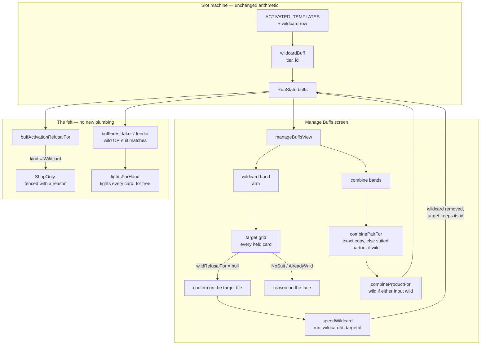

# Plan: The wildcard — spend it on a buff card to take its suit off

Plan folder: `.claude/contract/DLR-162-the-wildcard/`
Execution status: see `tasks.md` in this folder.

---

## Part 1 — Alignment

### Task reference

Jira **DLR-162** — *"The wildcard — spend it on a buff card to take its suit off, so it pays on any trick"* (Story, labels `engine` + `playable`). Moved `To Do → Planning` at the start of this run.

Acceptance criteria, verbatim from the ticket:

1. **A new card exists — the wildcard — dealt by the slot machine like any other card.** It has no condition and no reward; it is a consumable spent on the Manage Buffs screen.
2. **Spending it on a suit-specific buff card removes that card's suit condition.** A Bell-Taker (Blade) becomes a wild Taker (Blade): same family, same reward axis, same tier, but its condition no longer names a suit.
3. **A wild card's condition is satisfied on a trick of any suit**, with its family's requirement otherwise unchanged — a wild Taker still needs you to take the trick, a wild Feeder still needs you to lose it.
4. **The wildcard is consumed; the card it was spent on is not.** One wildcard converts exactly one card.
5. **It can only be spent on a suit-specific card.** Sidestep already asks for no suit, and an already-wild card cannot be converted again — both are refused with the reason stated on the card, the same way every other refusal in the shop works.
6. **A wild card tier-combines with a suited card of the same family and reward axis.** A bronze wild Taker (Blade) and a bronze Bell-Taker (Blade) combine into a silver wild Taker (Blade). This widens the existing combine rule by exactly one clause: the suits may differ when one of the two cards is wild.
7. **Wildness is never lost.** If either input to a combine is wild, the output is wild. There must be no sequence of combines that turns a wild card back into a suited one, so a player cannot accidentally merge a wildcard's value away.
8. **The family and the reward axis still have to match to combine.** A Taker never merges with a Feeder, a Blade never merges with a Momentum. Only the suit is relaxed, and only when one side is wild.
9. **A wild card is visibly wild** — in the buff grid, on the machine's strip, in the loadout, and in the trick breakdown — and its lit-card highlighting covers every card in hand rather than one suit's worth.
10. **The wildcard's stocking weight on the machine is low.** The exact figure is a tuning value and is the developer's.

Scope boundaries, dependencies and risks are as the ticket states them. The design asset the ticket names is `.docs/design/Balatro-Forbidden-Solitaire/ideas.md` → *"The wildcard — a card you spend to take the suit off another card"* (read in full during planning); the session transcript behind it is `.docs/design/Balatro-Forbidden-Solitaire/the-hunt-play-session-2026-09-02.md`. The combine rule this widens is `.docs/game_rules/the-hunt.md` §"Combining two cards" (the four `settled — since DLR-159` rows in its Status register).

Skill list confirmed interactively 2026-09-03: `react-frontend`, `game-ux`, and `game-designer` (the developer added the third).

### Restated goal

Every condition card in the game is locked to one of three suits, so on any given trick most of a player's pile cannot legally pay, and a pile of twenty-one cards reads as clutter rather than as a build. This ticket adds a scarce new card — the wildcard — that the slot machine deals like anything else and that the player spends on the Manage Buffs screen to strip the suit off one card they already own. The stripped card keeps its family, its reward axis and its tier, and from then on its condition is satisfied on a trick of any suit: a wild Taker still has to take the trick, a wild Feeder still has to lose one, but neither cares what was played into it. Wild cards climb the tier ladder by eating ordinary suited cards of the same family and reward, and wildness is absorbing — no sequence of combines can ever turn a wild card back into a suited one. The point is not to delete the aiming decision, which is the biggest measured skill in the game; it is to let the player choose, one scarce card at a time, which parts of their build stop needing to be aimed.

### In scope

- A new `BuffKind.Wildcard` and a new activated template for it, so the slot machine can deal it (AC1), with a stocking weight on both machines' tables whose **value** is the developer's (AC10).
- A wild flag on a buff's condition, and the two `buffFires` cases (Taker, Feeder) reading it so the suit term is skipped when it is set (AC3).
- Spending a wildcard: refusals for a suitless or already-wild target (AC5), the conversion itself keeping family, axis, tier and the target card's identity while consuming the wildcard (AC2, AC4).
- The widened combine rule — a wild pile pairs with a suited card of the same family, reward axis and tier — and the guarantee that the product is wild whenever either input is (AC6, AC7, AC8).
- A wildcard band and a target-selection mode on the Manage Buffs screen: arm the wildcard, pick a target, confirm on the target's own tile, with refused targets carrying their reason on the face.
- Refusing a wildcard on the felt with a reason that says where it *is* spent, so a tile in the loadout's Press run cannot be tapped to no effect.
- Rendering wildness wherever a buff card is rendered: the card name (`Wild Taker (Blade)`), the condition line, a wild mark where the suit mark sits, the loadout's run grouping, and a wildcard glyph on the machine's strip and reel windows (AC9).
- Refusing a *wildcard* pile on the combine screen, so two wildcards can never be merged into one.

### Explicitly out of scope

- **A rarity system.** The machine stocks eight symbols from weights and every symbol on the strip is then equally likely, so a low weight buys near-binary rarity. The ticket says so and says it is not this ticket.
- **Removing the suit from any card by default**, and any change to how many suited template families exist.
- **Anything for Sidestep in compensation** — it is untouched, deliberately.
- **Combining across families or across reward axes.** Only the suit is relaxed, and only when one side is wild.
- **Any change to what the Overlap Bonus pays**, or to the tier reward ladders.
- **Teaching the headless simulator to spend wildcards.** The simulator's policies will see wildcards arrive in the pile and must not crash or mis-report on them, but no policy learns to convert a card; the win-rate consequence of the wildcard is unmeasured and stays so.
- **Re-measuring the machine's family odds** after the pool grows. The ticket names this and notes nobody re-measured when the pool last went from 13 to 16 either.
- **A tier meaning for the wildcard.** A silver wildcard converts one card, exactly as a bronze one does.

### Pattern Reference

The ticket supplied no code references, so these were chosen during planning and are authoritative for this task:

- **`src/hunt/buffCombine.ts` (DLR-159)** — the module the combine widening extends. Its `buffCombineKey` is the codebase's one statement of "the same card", and `src/app/warCouncil/buffGalleryModel.ts`'s `buffStackKey` delegates to it; that delegation must survive.
- **`src/hunt/buffCatalog.ts`'s `cheatBuff` / `timebombBuff`** — the pattern for a new activated card's minting function, and the pattern `mintFromTemplate`'s activated branch delegates to.
- **`src/hunt/buffTemplates.ts`'s `ACTIVATED_TEMPLATES`** — the pattern for adding a dealable card that has no condition and no reward axis.
- **`src/hunt/flask.ts`'s `FlaskRefusal` and `buffCombine.ts`'s `CombineRefusal`** — the pattern for a new refusal: a reason **code** in `src/hunt/`, worded by a total `Record` in the app layer.
- **`src/app/run/CombineGroupCard.tsx` (DLR-159)** — the arm-then-confirm-on-the-tile gesture the wildcard spend reuses, and the tile that gets its card face extracted for a second consumer.
- **`src/app/warCouncil/SuitMark.tsx`** — the pattern for the new wild mark: an `aria-hidden` glyph taking its tint from the surrounding `color`, named by its call site.
- **`.claude/skills/react-frontend/SKILL.md`** and **`.claude/skills/game-ux/SKILL.md`** for conventions; not restated here.

### Constraints flagged on the brief

- **AC7 is the invariant to test hardest.** The ticket says so explicitly: wildness being absorbing is what stops a player destroying a wildcard's value by accident, and it is the kind of property a later refactor of the combine rule can silently break. It "deserves a test that asserts the property, not just the two cases."
- **This widens a rule DLR-159 shipped the day before.** The existing rule and its tests are the thing to extend, not to work around.
- **The stocking weight is a tuning value and is the developer's** (AC10) — the plan adds the key and a documented placeholder, and nothing here chooses the number.
- **`src/hunt/` is lint-enforced pure** — no React, no DOM, no `Math.random()`. Every new engine module obeys it, and every new id comes from `RunState.nextBuffId`.
- **One wildcard seeds an entire wild line**, so what scarcity actually rations is the number of independent wild lines, not the number of wild cards a player ends up holding. Worth knowing before the weight is set; it changes nothing in the code.

### Assumptions made

- **Wildness lives on `BuffCondition` as an optional `wild?: boolean`, not as a field on `Buff`.** It is the *condition* that stops naming a suit, which is what AC2 says, and an optional field on the condition breaks no existing construction site — where a required field on `Buff` would force an edit at every literal that builds one. Confirmed against the audit below: zero forced edits either way for `BuffCondition`, but the semantic home is the condition.
- **Wild cards are minted by transformation, never from a template.** A wild card is by definition not dealable, so giving it a template would put it in the slot machine's candidate pool and in the opening pile's draw, and would change every existing suited template's normalised weight through `FAMILY_AXIS_TOTAL`. Instead a new `mintWildAtTier` reads the same `REWARD_TIER_VALUE` ladder `mintFromTemplate` reads. Consequence: `templateForBuff` returns `undefined` for a wild card, so the combine path must stop going through templates for the wild case — designed for below, not worked around.
- **Wild cards need no persistence work.** `RunState.buffs` and `nextBuffId` are marked "NEVER persisted" in `src/hunt/run.ts`, and the Vault persists only odds boosts and starting grants, both keyed by template id. A wild card therefore never reaches disk, and no `SAVE_SCHEMA_VERSION` bump is needed. Recorded here because that window is only open while it is open.
- **The wild pile owns the wild combine; a suited pile does not offer it.** A wild bronze Taker (Blade) beside a lone Bell-Taker (Blade) makes the *wild* tile ready and leaves the Bell-Taker tile refused. Offering it from both would list one action twice on one screen, and the wild card is the scarce object the player is growing, so it is the one whose tile should read "feed a suited Taker into this".
- **A wild pile prefers a suited partner over a second wild copy.** With two wild bronze Takers and one Bell-Taker in hand, pairing the wild card with the *suited* card leaves the player holding two wild cards where pairing the two wild cards together leaves them holding one. Both produce the same silver wild Taker, so preferring the suited partner is strictly better for the player and costs nothing.
- **Which suited partner gets eaten is not the player's choice.** Every eligible partner differs from every other only in its suit, and the combine discards the suit — so the choice is genuinely without consequence. The lowest id is taken, matching `copiesOf`'s existing ascending-id order, and the confirm face names the card being destroyed so nothing is silent.
- **A wildcard cannot be combined.** Two wildcards merging into one would halve a player's wildcard supply for nothing, which is AC7's own concern wearing a different hat. A third `CombineRefusal` code covers it, worded on the tile like every other refusal.
- **A wildcard keeps whatever tier the reels award it.** Pinning it to bronze would make the pull screen's "1 gold" readout a lie about the card it just handed over. All three tiers convert exactly one card (AC4), so tier is cosmetic on this card — flagged under Risks as a design question, not resolved here.
- **A wildcard is refused on the felt with its own reason code, not with the existing `NoEffectYet`.** That code's copy reads "Not usable yet", which is false of a card that is perfectly usable one screen away. A new `ShopOnly` refusal says where to spend it. This widens `BuffActivationStock` by one required field, whose construction-site cost is counted in the audit.
- **A wild card gets its own run in the loadout grid** (`BuffRunKind.Wild`), rather than falling into `Suitless` beside Sidestep. The grid's runs answer "which of my cards are live on this trick", and a card that is live on every trick is a different answer from one that never cared about suits — this is also the cheapest way to satisfy AC9's "visibly wild in the loadout".
- **The wild mark is one drawing with two hosts.** A new `WildMark` component sits where the suit mark sits on a card face, and the machine's `SlotGlyph` renders the same component for its `wildcard` case rather than carrying a second copy of the path data.
- **The `wild` flag is added to `buffCombineKey`.** No suitless Taker or Feeder can exist today except a wild one, so nothing collides right now — but a key that cannot tell a wild card from a suitless one is a key that stacks them together the moment something else changes.
- **`game-designer` owns no task in this contract.** The developer added it to the skill list; the design is settled in `ideas.md` and the plan cites rather than re-derives it. It is listed in Part 2 so the execution session knows it was deliberately included, and it applies only if a design reading has to be reopened mid-implementation.
- **The wildcard can appear in a run's opening pile.** `startingPile.ts` draws from the same templates on the same weights, so a low weight makes this rare rather than impossible. Left as it falls — an opening wildcard is a fine hand to be dealt.

### Config and persisted-shape audit

- **`buffTargetSuitOf` — the accessor every suit-reading consumer goes through.** 30 hits across `src/**` excluding tests; discounting the declaration (`buffs.ts:132`), the barrel re-export (`index.ts:93`) and the import lines, **16 real call sites** in 11 files: `buffEvaluation.ts:66` (the one that must change), `buffCombine.ts:41`, `buffTemplates.ts:239`, `buffLabels.ts:115` and `:129`, `buffRideLabels.ts:98` and `:106`, `buffGalleryModel.ts:91`, `BuffCard.tsx:47`, `HeldBuffCard.tsx:24`, `CombineGroupCard.tsx:39`, `sim/cardAwarePolicy.ts:60` and `:76`, `sim/skilledPolicy.ts:129`, `sim/playHand.ts:271` and `:300`. Every one of the 16 keeps compiling unchanged — a wild card simply reports `null`, which each already handles. **Seven are behaviourally affected and each is named in a task**: `buffEvaluation.ts:66` (the condition), `buffCombine.ts:41` (the key gains a `wild` segment), `buffLabels.ts:115` (`buffName` gains the `Wild` prefix), `buffGalleryModel.ts:91` (`buffRunOf` gains the Wild run), and the three card faces at `BuffCard.tsx:47`, `HeldBuffCard.tsx:24` and `CombineGroupCard.tsx:39` (the wild mark takes the empty suit slot). Four are correct as they stand and change nothing: `buffLabels.ts:129` already substitutes `'any suit'` for a null suit, `buffRideLabels.ts:98`/`:106` already word a suitless buff without fabricating a suit clash, and `buffTemplates.ts:239` composes an id no template has — which is the design, since a wild card is not dealable. The three `sim/` files are inert (a wild card reads as "not aimed", which is correct) and are listed as read-only verification.
- **`Record<BuffKind, …>` tables — what adding `BuffKind.Wildcard` compile-forces.** 5 hits excluding tests: three total tables that MUST grow a row (`BUFF_CADENCE` in `buffs.ts:178`, `BUFF_FAMILY_WORD` in `buffLabels.ts:22`, `BUFF_CONDITION_SENTENCE` in `buffLabels.ts:52`) and two `Partial` tables that need no row (`BUFF_WIDENED_CONDITION_SENTENCE:82`, `BUFF_EVENT_WORD:241`). Plus `CONSUMABLE_AP_COST` in `buffCosts.ts`, keyed by `BuffConsumableKind` rather than by `BuffKind` — a row there is mandatory because `buffActivationStockFor` calls `apCostOf` eagerly for every card in the gallery, and `buffApCost` throws on an unpriced kind, which would take down the felt.
- **`BuffActivationStock` construction sites — the widening with a real cost.** 1 production builder (`buffActivation.ts:115`, `buffActivationStockFor`) plus a second in the app layer (`roundUiState.ts:366`) that returns the same type. Counting by required field name rather than by type name: `effectLive:` appears 2 times in `buffActivation.ts` and 7 + 1 times in the two spec files; `timebombLive:` appears 5 times in `buffActivation.ts` and 7 + 4 in the same two specs. The specs build one base literal each and spread it, so the **new required field lands in 2 production sites and 2 spec files** — `src/hunt/__tests__/buffActivation.test.ts` and `src/hunt/__tests__/buffActivation.timebombLive.test.ts`, both in the task's file list. Whatever `tsc` reports is the real number; both files are already in scope.
- **`BuffRunKind` — 28 hits excluding tests.** Adding `Wild` compile-forces three total tables: `BUFF_RUN_ORDER` and `RUN_FOR_SUIT`'s sibling `buffRunOf` in `buffGalleryModel.ts`, `RUN_LABEL` in `buffRunLabels.ts`, and `ZERO_RUN_COUNTS` in `buffSuitFilterModel.ts`. `RUN_SUIT` is a `Partial` and needs no row.
- **`SlotGlyphKind` and the `SlotGlyph` union — 2 declarations, both narrow.** `SlotGlyph.tsx:21` (the drawing's string union) and `slotSymbols.ts:22` (the tagged union). `slotSymbols.ts`'s activated branch is a binary `kind === Cheat ? cheat : timebomb`, and `mintFromTemplate`'s activated branch is the same binary — both must become total over `BuffActivatedTemplateKind` or a Wildcard template silently renders and mints as a Timebomb. This is the one place in the ticket where a wrong answer type-checks cleanly.
- **`CombineRefusal` — 2 members, 1 total wording table.** `COMBINE_REFUSAL_MESSAGE` in `manageBuffsLabels.ts` is `Readonly<Record<CombineRefusal, string>>`, so the third code fails to compile there rather than rendering blank on a card face, exactly as its own docblock promises.
- **Persisted shapes: nothing is affected, and this is provable.** `src/hunt/run.ts` marks `RunState.buffs` and `nextBuffId` "NEVER persisted"; `src/persistence/createSaveStore` has one non-test consumer, `src/vault/vaultStore.ts`; `VaultState` holds `balance`, `oddsBoosts` (keyed by `BuffTemplate.id`) and `startingGrants` (`{ templateId, tier }`). A wild card has no template id and is never granted, and the wildcard's own template id (`'wildcard'`, a bare kind string like `'cheat'`) is *new*, so it orphans nothing. **No `SAVE_SCHEMA_VERSION` bump is required**, and no reject condition in `.claude/rules/save-data-versioning.md` is touched: nothing here reads or writes storage, composes a key, or parses a payload.
- **Type-change loss check.** Every type change is additive: a new optional field on `BuffCondition`, three new union members (`BuffKind.Wildcard`, `CombineRefusal.Untiered`, `BuffActivationRefusal.ShopOnly`, plus `BuffRunKind.Wild` and a `SlotGlyph` variant), and one new required field on `BuffActivationStock`. No field changes type, no array becomes an object, no required field becomes optional. Each widened union forces its total `Record` to grow, which is the mechanism this codebase relies on and is enumerated above.
- **Boundary check.** `src/hunt/**` is lint-enforced React-free and DOM-free by the `eslint.config.js` pure-core override. The new `src/hunt/buffWild.ts` imports only `./buffs`, `./buffTemplates`, `./buffCosts` and `./run`, needs no DOM global, and no proposed design puts a React import or a browser global inside that tree. `src/sim/**` is likewise lint-enforced pure and gains no import.
- **Cycle check.** `src/hunt/run.ts` imports `config`, `buffs`, `buffAccrual`, `buffCatalog`, `rankTiers` and does **not** import `buffActivation`, so `buffWild.ts → run.ts` introduces no cycle. The felt-refusal predicate goes in `consumables.ts` instead of `buffWild.ts` precisely because that module is a declared leaf (`./buffs` + `./types` only) and `buffActivation.ts` already imports it.

---

## Part 2 — Technical design

### Approach

The engine change is smaller than the ticket's ten criteria suggest, because two of the hardest-looking criteria fall out of existing structure for free. Wildness is one optional boolean on `BuffCondition` and two `||` terms in `buffFires`: `taker` becomes `ctx.playerWon && (wild || suit matches)` and `feeder` becomes `!ctx.playerWon && (wild || suit matches)`. AC9's "its lit-card highlighting covers every card in hand rather than one suit's worth" then needs no UI work at all — `lightsForHand` derives every card's lit state by calling `projectBuffBranches` per candidate card, which resolves through the same `buffFires`, so a wild card lights the whole hand the moment its condition stops naming a suit. AC3's "family requirement otherwise unchanged" is likewise structural: the suit term is the only thing being skipped, and the `playerWon` term is untouched. `buffConditionSentence` already substitutes `'any suit'` when a card reports no suit, so the wild card's condition line words itself correctly with no new copy.

The one place the engine needs real design is the combine rule, because DLR-159's model is *a pile keyed by `buffCombineKey`*, and AC6 pairs two cards with **different** keys. Rather than replace the pile model — which would take the Manage Buffs screen, the felt's stacking, and `buffStackKey`'s delegation with it — the rule gains a second, looser key beside the exact one. `buffCombineFamilyKey` drops the suit and the wild flag and keeps kind, tier, rank, reward axis and reward value; a new `combinePairFor(buffs, key)` returns the actual two cards a combine would consume, preferring two exact copies for a suited pile and, for a *wild* pile, preferring a suited card sharing the family key over a second wild copy. `combineRefusalFor` and `combineBuffs` are both rewritten over that one function, so the answer the tile shows and the cards the commit destroys cannot disagree. The product comes from a new `combineProductFor(a, b, tier, id)`, which mints through `mintWildAtTier` when either input is wild and through today's `templateForBuff` + `mintFromTemplate` otherwise. That single conditional **is** AC7: the product is wild exactly when an input was, and there is no branch anywhere that can produce a suited card from a wild one. The property test the ticket asks for asserts it over every pair drawn from a mixed pile rather than over the two obvious cases.

The alternative considered and rejected was **generating wild templates** — four of them, Taker and Feeder crossed with Blade and Momentum, with ids like `taker:wild:magnitude` fitting the existing persisted id grammar. It is tempting because it leaves `mintFromTemplate` and `templateForBuff` untouched, so the combine path needs no change at all. It was rejected because `BUFF_TEMPLATES` is the candidate pool for both the reel strip (`slotMachine.ts:108`) and the opening pile (`startingPile.ts:80`), and it is what `familyAxisTotalsFor` normalises family weights over: four new Taker/Feeder templates would dilute every existing suited template's weight, and excluding them at each draw site means maintaining a "dealable subset" that two call sites and a weight table all have to remember to use. A wild card is not a card the machine can deal, so making it look like one to the machine is the wrong shape. Minting by transformation costs one new module and one conditional in the combine product, and leaves the machine's arithmetic bit-for-bit unchanged.

The wildcard itself, by contrast, *is* dealable, so it takes the well-worn activated-card path: a `BuffKind`, a `wildcardBuff` minting function beside `cheatBuff` and `timebombBuff`, a row in `ACTIVATED_TEMPLATES`, a cadence row, a family weight on both machines, a price row, a family word, a condition sentence, and a reel glyph. Two existing binaries have to become total on the way — `mintFromTemplate`'s activated branch and `slotSymbolFace`'s — because both currently read "Cheat or else Timebomb", and a third activated kind flowing through either would mint and render as a Timebomb with no error. Because a wildcard is `BuffCadence.Activated` it will appear in the loadout's Press run, where tapping it must do something honest: a new `ShopOnly` refusal fences it with a line that says where it is actually spent, which is the same fence-with-a-shared-reason machinery the gallery already builds for unusable cards.

On the screen, the spend is the arm-then-confirm-on-the-tile gesture DLR-159 already ships, run twice: arming the wildcard band swaps the two combine bands for a target grid, and arming a target puts the confirmation on that target's own face — what is destroyed (one wildcard), what is made (the same card, wild), and the pile count, with `Combine`'s sibling controls and `Escape` behaving as they do today. Every held card appears in the target grid, and the ones AC5 refuses carry their reason on the face rather than being hidden, because a player who owns four Sidesteps needs to see *why* they cannot be targeted. Two extractions keep the panel inside its budget and stop a fourth copy of the card face appearing: `CombineGroupCard.tsx`'s local `CardFace` moves out to its own module for the new target tile to share, and the band plus the target grid live in their own components rather than inside `ManageBuffsPanel.tsx`, which is at 222 of its 400 lines. All of the screen's arithmetic stays in `manageBuffs.ts`, which is pure and tested without a renderer; the panel gains one piece of ephemeral mode state and no new effect, subscription, timer or observer.

### Skills to invoke during execution

- **`react-frontend`** — owns everything under `src/`: where the pure logic goes versus the hook versus the component, the 400-line budget on the four files this contract grows, the reducer/state discipline, and the Vitest posture (`node` project for the pure modules, `dom` for the panel).
- **`game-ux`** — owns the Manage Buffs screen's new band and target mode: the no-scroll shell it has to keep, where the band sits relative to the two existing bands, the tap count on the spend, the roving-tabindex model across the target grid, and the rule that wildness must read without colour alone.
- **`game-designer`** — developer-selected. It owns **no task** in this contract: the wildcard's design is settled in `ideas.md` and the plan cites it rather than re-deriving it. Invoke it only if a design reading has to be reopened mid-implementation — in which case that is a pause, not a decision to take.

Rules to Read: `.claude/rules/save-data-versioning.md` (scanned; the audit records that nothing here trips a reject condition, and the executor should confirm that still holds if a task grows). Always: `.claude/workflow/web-project.md`.

### Diagram



### Data shapes

#### `src/hunt/buffs.ts`

```ts
export const BuffKind = {
  // …every existing member unchanged…
  /** DLR-162 — spent on the Manage Buffs screen to strip a card's suit condition. No condition
   *  and no reward of its own; refused on the felt by `BuffActivationRefusal.ShopOnly`. */
  Wildcard: 'wildcard',
} as const

export interface BuffCondition {
  readonly kind: string
  readonly target?: BuffTarget
  /** DLR-162 — this condition ignores the suit: it is satisfied on a trick of ANY suit, with the
   *  family's other requirement unchanged. Optional so every existing `BuffCondition` value stays
   *  valid unchanged. Set only by `wildenedBuff` / `mintWildAtTier`; never by a template. */
  readonly wild?: boolean
}

/** Whether this buff's condition ignores the suit. Reads `condition.wild` so no consumer reaches
 *  into the payload, exactly as `buffTargetSuitOf` does for the suit. */
export function buffIsWild(buff: Buff): boolean

export const BUFF_CADENCE: Readonly<Record<BuffKind, BuffCadence>> = {
  // …unchanged…
  [BuffKind.Wildcard]: BuffCadence.Activated,
}
```

#### `src/hunt/buffWild.ts` (new)

```ts
/** Why a wildcard cannot be spent on this card (AC5). A reason CODE, not a sentence —
 *  `src/app/run/manageBuffsLabels.ts` words it, as `COMBINE_REFUSAL_MESSAGE` words the other. */
export const WildRefusal = {
  /** The target names no suit at all — Sidestep, Skull Helmet, Skull Tether, or an activated card. */
  NoSuit: 'noSuit',
  /** The target is already wild; there is no second suit to take off. */
  AlreadyWild: 'alreadyWild',
} as const
export type WildRefusal = (typeof WildRefusal)[keyof typeof WildRefusal]

/** `null` when a wildcard may be spent on `target` right now. */
export function wildRefusalFor(target: Buff): WildRefusal | null

/** Whether `buff` is the spendable wildcard itself (rather than a card made wild by one). */
export function isWildcardCard(buff: Buff): boolean

/** A wild card at `tier`, minted from the same `REWARD_TIER_VALUE` ladder `mintFromTemplate`
 *  reads. THROWS `RangeError` on an axis with no ladder rather than minting a zero-value card —
 *  `mintFromTemplate`'s own discipline. `id` is the caller's; this module never invents one. */
export function mintWildAtTier(
  kind: BuffKind,
  axis: BuffRewardAxis,
  tier: BuffTier,
  id: BuffId,
): Buff

/** `target` with its suit condition removed, KEEPING its id, kind, tier and reward (AC2, AC4). */
export function wildenedBuff(target: Buff): Buff

/** The pile with `wildcardId` removed and `targetId` replaced by its wild self. THROWS a
 *  `RangeError` naming the refusal rather than returning `run` unchanged, exactly as
 *  `combineBuffs` and `buyFromShop` do. `nextBuffId` is NOT advanced — the converted card keeps
 *  its own id, because it is the same card. */
export function spendWildcard(run: RunState, wildcardId: BuffId, targetId: BuffId): RunState
```

#### `src/hunt/buffCatalog.ts`

```ts
/** AC1 — mint a Wildcard at `tier`. No condition and no reward: `ACTIVATED_BUFF_CONDITION` and
 *  the `None` axis at 0, which `buffRewardPhrase` already words as "nothing". Tier is carried
 *  because the reels award one, and converts exactly one card at every tier (AC4). */
export function wildcardBuff(tier: BuffTier, id: BuffId): Buff
```

#### `src/hunt/buffTemplates.ts`

```ts
export type BuffActivatedTemplateKind =
  | typeof BuffKind.Cheat
  | typeof BuffKind.Timebomb
  | typeof BuffKind.Wildcard

export const ACTIVATED_TEMPLATES: readonly ActivatedBuffTemplate[] = [
  { form: 'activated', id: 'cheat', kind: BuffKind.Cheat },
  { form: 'activated', id: 'timebomb', kind: BuffKind.Timebomb },
  // DLR-162 — a bare kind string, like its two siblings; the format is frozen once it ships.
  { form: 'activated', id: 'wildcard', kind: BuffKind.Wildcard },
]

// `mintFromTemplate`'s activated branch becomes a total lookup over the three kinds, replacing
// today's `kind === Cheat ? cheatBuff : timebombBuff` binary:
const ACTIVATED_MINT: Readonly<
  Record<BuffActivatedTemplateKind, (tier: BuffTier, id: BuffId) => Buff>
> = {
  [BuffKind.Cheat]: cheatBuff,
  [BuffKind.Timebomb]: timebombBuff,
  [BuffKind.Wildcard]: wildcardBuff,
}
```

`BUFF_TEMPLATE_COUNT` moves 18 → 19. No condition template is added, so every existing suited template's `templateWeightFor` result is unchanged.

#### `src/hunt/buffCombine.ts`

```ts
export const CombineRefusal = {
  AtMaxTier: 'atMaxTier',
  NoPair: 'noPair',
  /** DLR-162 — a wildcard has nothing that scales, so combining two would halve the player's
   *  supply for no gain. Refused rather than allowed and then regretted. */
  Untiered: 'untiered',
} as const

/** AC6/AC8's "same family and reward axis, suit relaxed" — kind, tier, rank, reward axis and
 *  reward value, with the suit and the wild flag dropped. The LOOSER sibling of
 *  `buffCombineKey`; only a wild pile is allowed to pair on it. */
export function buffCombineFamilyKey(buff: Buff): string

/** The two cards a combine on `key` would actually consume, or `null` when there is no pair.
 *  Exact copies first for any pile; for a WILD pile a suited partner sharing
 *  `buffCombineFamilyKey` is preferred over a second wild copy, because that leaves the player
 *  holding more wild cards for the same product. Lowest ids, so repeated combines are
 *  deterministic. */
export function combinePairFor(buffs: readonly Buff[], key: string): readonly [Buff, Buff] | null

/** The card a pair produces at `tier`, or `null` when neither input resolves to a template and
 *  neither is wild. WILD IF EITHER INPUT IS WILD (AC7) — the one conditional that makes wildness
 *  absorbing, with no other branch able to produce a suited card from a wild one. */
export function combineProductFor(
  a: Buff,
  b: Buff,
  tier: BuffTier,
  id: BuffId,
): Buff | null

// Unchanged signatures, rewritten over the three functions above:
export function buffCombineKey(buff: Buff): string        // + a `wild` segment
export function combineRefusalFor(buffs: readonly Buff[], key: string): CombineRefusal | null
export function combineBuffs(run: RunState, key: string): RunState
```

#### `src/hunt/buffActivation.ts` and `src/hunt/consumables.ts`

```ts
export const BuffActivationRefusal = {
  /** DLR-162 — this card is spent on the Manage Buffs screen, not on the felt. Read FIRST with
   *  `NoEffectYet`, because it is true of the CARD rather than of the felt. */
  ShopOnly: 'shopOnly',
  NoEffectYet: 'noEffectYet',
  // …WindowClosed, TimebombLive, AlreadyActive, InsufficientAp unchanged…
} as const

export interface BuffActivationStock {
  /** DLR-162 — this card can only be spent between fights, on the Manage Buffs screen. */
  readonly shopOnly: boolean
  readonly effectLive: boolean
  // …windowOpen, apPool, apCost, alreadyActive, timebombLive unchanged…
}

// consumables.ts — beside `consumableEffectIsLive`, in the declared leaf module:
/** Whether `buff` is spendable ONLY on the Manage Buffs screen. TRUE for the wildcard and nothing
 *  else. NEVER THROWS: it is read on a render path. */
export function isShopOnlyBuff(buff: Buff): boolean

// buffCosts.ts — a row is mandatory because `buffActivationStockFor` calls `apCostOf` eagerly:
export type BuffConsumableKind = /* …existing eight… */ | typeof BuffKind.Wildcard
// CONSUMABLE_AP_COST[BuffKind.Wildcard] = { bronze: 0, silver: 0, gold: 0 }
// UNREACHABLE by construction — `ShopOnly` refuses ahead of `InsufficientAp`, and no felt path
// spends a wildcard. Zero here is the honest figure for a card that costs no action points,
// not a plausible default: action points left the buff layer on DLR-145.
```

#### `src/app/run/manageBuffs.ts`

```ts
export interface CombineGroup {
  readonly key: string
  readonly buff: Buff
  readonly count: number
  readonly ids: readonly BuffId[]
  readonly refusal: CombineRefusal | null
  readonly produces: Buff | null
  /** DLR-162 — the SECOND card this combine consumes, when it is not another copy of `buff`:
   *  the suited card a wild pile eats. `null` for an ordinary same-card combine. */
  readonly partner: Buff | null
}

/** One tile in the wildcard's target grid. Every held card appears, refused ones included, so a
 *  player can see WHY a card cannot be targeted (AC5). */
export interface WildTargetTile {
  readonly key: string
  readonly buff: Buff
  readonly ids: readonly BuffId[]
  readonly count: number
  readonly refusal: WildRefusal | null
  /** What the target becomes — non-null exactly when `refusal` is null, minted for wording only. */
  readonly produces: Buff | null
}

export interface ManageBuffsView {
  readonly groups: readonly CombineGroup[]
  readonly held: number
  readonly readyCount: number
  /** Every held wildcard's id, ascending. `length` is the band's count; empty means no band. */
  readonly wildcards: readonly BuffId[]
  /** Selectable targets first, then refused ones, each band keeping its tier-descending order. */
  readonly wildTargets: readonly WildTargetTile[]
}

export function manageBuffsView(buffs: readonly Buff[]): ManageBuffsView
```

#### `src/app/run/useManageBuffs.ts`

```ts
export interface ManageBuffsHandle {
  readonly view: ManageBuffsView
  readonly combine: (key: string) => string
  /** DLR-162 — spends the lowest-id held wildcard on `targetId` and returns the converted card's
   *  pile key, so the panel can badge where it landed. */
  readonly spendWild: (targetId: BuffId) => string
}
```

#### `src/app/run/manageBuffsLabels.ts`

```ts
export const COMBINE_REFUSAL_MESSAGE: Readonly<Record<CombineRefusal, string>>
// + [CombineRefusal.Untiered]: 'Every wildcard is the same — combining one would waste it'

/** Total over the union, so a third wild refusal fails to compile here. PLACEHOLDER copy. */
export const WILD_REFUSAL_MESSAGE: Readonly<Record<WildRefusal, string>> = {
  [WildRefusal.NoSuit]: 'No suit to take off',
  [WildRefusal.AlreadyWild]: 'Already wild',
}

export const MANAGE_BUFFS_WILD_BAND = 'Wildcards'
export const MANAGE_BUFFS_WILD_RULE =
  'Spend a wildcard on a suited card to take its suit off. It then pays on any trick.'
export const MANAGE_BUFFS_WILD_SPEND_LABEL = 'Spend a wildcard'
export const MANAGE_BUFFS_WILD_TARGET_BAND = 'Pick a card to make wild'
export const MANAGE_BUFFS_WILD_REFUSED_BAND = 'Cannot be made wild'
export const MANAGE_BUFFS_WILD_COMMIT_LABEL = 'Make wild'

export function wildConfirmDestroyText(tier: BuffTier): string   // '1 × Bronze Wildcard'
export function wildConfirmMakeText(made: Buff): string           // '1 × Bronze Wild Taker (Blade) — +1 damage'
export function wildDoneText(spent: Buff, made: Buff): string     // the role="status" sentence
export function wildTargetTileAccessibleName(
  buff: Buff,
  count: number,
  produces: Buff | null,
  refusal: WildRefusal | null,
): string
export function combineConfirmDestroyPairText(buff: Buff, partner: Buff | null): string
```

#### `src/app/warCouncil/buffLabels.ts`, `buffGalleryModel.ts`, `buffRunLabels.ts`, `buffSuitFilterModel.ts`

```ts
// buffLabels.ts — the naming grammar gains one prefix, applied where the suit prefix would go:
// buffName(wild Taker on Magnitude) === 'Wild Taker (Blade)'
export const BUFF_FAMILY_WORD    // + [BuffKind.Wildcard]: 'Wildcard'
export const BUFF_CONDITION_SENTENCE // + [BuffKind.Wildcard]: 'spend it on a suited card between fights'
export const BUFF_ACTIVATION_REFUSAL_MESSAGE
// + [BuffActivationRefusal.ShopOnly]: 'Spend this on the Manage Buffs screen.'

// buffGalleryModel.ts
export const BuffRunKind = { /* …Bells, Keys, Moons… */ Wild: 'wild', Suitless: 'suitless', Press: 'press' }
export const BUFF_RUN_ORDER  // Bells, Keys, Moons, Wild, Suitless, Press
export function buffRunOf(buff: Buff): BuffRunKind   // wild before the suitless/press split

// buffRunLabels.ts — RUN_LABEL + [BuffRunKind.Wild]: 'Wild'
// buffSuitFilterModel.ts — ZERO_RUN_COUNTS + [BuffRunKind.Wild]: 0
```

#### `src/app/warCouncil/WildMark.tsx` (new), `src/app/run/SlotGlyph.tsx`, `src/app/run/slotSymbols.ts`

```tsx
/** The wild mark, where a suit mark sits. `aria-hidden`, tint from the surrounding `color`,
 *  named by its call site — `SuitMark`'s contract exactly. ONE drawing: `SlotGlyph` renders this
 *  same component for its `wildcard` case rather than carrying a second copy of the paths. */
export function WildMark({ className }: { readonly className?: string }): JSX.Element
```

```ts
export type SlotGlyphKind = 'sidestep' | 'cheat' | 'timebomb' | 'skullHelmet' | 'skullTether' | 'wildcard'
export type SlotGlyph = /* …existing five… */ | { readonly kind: 'wildcard' }
// slotSymbols.ts — the activated branch becomes a total lookup, replacing
// `kind === Cheat ? { kind:'cheat' } : { kind:'timebomb' }`:
const ACTIVATED_GLYPH: Readonly<Record<BuffActivatedTemplateKind, SlotGlyph>>
const FAMILY_WORD // + [BuffKind.Wildcard]: 'Wildcard'
```

#### Configuration — `src/hunt/slotWeights.ts`

```ts
export type SlotTemplateKind = MintableConditionKind | BuffActivatedTemplateKind  // now includes Wildcard

// SLOT_FAMILY_WEIGHTS gains one row per machine. UNIT: relative weight, >= 0, unitless; only
// RATIOS matter within one machine's table.
// [SlotMachineId.Skirmisher]: { …, [BuffKind.Wildcard]: 1 }   // PLACEHOLDER — developer decides
// [SlotMachineId.Strongbox]:  { …, [BuffKind.Wildcard]: 1 }   // PLACEHOLDER — developer decides
```

**AC10's value is a developer decision.** The placeholder `1` is the lowest weight already present in either table (Skirmisher's lowest live figure is Sidestep at 2; Strongbox's rows are all 1) and is chosen only so the total `Record` compiles. `SLOT_AXIS_WEIGHTS` is **not** touched — an activated template has no axis, and `templateWeightFor` takes the `familyWeight / templates-in-family` branch for it.

### Runtime quality notes

- **Purity and adjudication.** Every rule in this ticket lands in `src/hunt/`, which is lint-enforced React-free and DOM-free: the wild flag and its accessor in `buffs.ts`, the condition change in `buffEvaluation.ts`, the spend and its refusals in the new `buffWild.ts`, the widened pairing in `buffCombine.ts`. `src/app/run/manageBuffs.ts` holds the screen's arithmetic and imports no React either — it is tested under the `node` project with no renderer. No component decides whether a card may be wildened, whether a pair may combine, or what a combine produces; each asks. The one tunable this ticket introduces (`SLOT_FAMILY_WEIGHTS`'s wildcard row) is read from the weight table by `templateWeightFor` and appears nowhere else.
- **Effects, mount and teardown.** No new effect, listener, observer, timer, `requestAnimationFrame` or `AbortController` is introduced anywhere. `ManageBuffsPanel.tsx`'s single existing effect — the post-render focus restore — gains the target-mode keys in its ordered request list and keeps its shape: it reads and clears a ref, calls no `setState` from inside itself, creates no subscription, and therefore still has nothing for a cleanup to release. StrictMode's double invocation is safe for the same reason it is safe today: the effect is idempotent DOM focus. No module-level mutable state is added; the new `ACTIVATED_MINT` and `ACTIVATED_GLYPH` lookups are frozen `Record`s derived at module load, like the four such tables already beside them. The panel's new mode state is ordinary `useState` in the component that owns it, cleared on cancel, on commit, and on `Escape`.
- **Hot-path cost.** Nothing here runs per pointer event. The trick-time change is two extra `||` terms inside `buffFires`, evaluated once per buff per candidate card inside the existing `lightsForHand` walk — no new `projectBuffBranches` pass, and the reach counts still come off the already-built `lights` map. `combinePairFor` is called once per pile per render of a between-fights screen and scans the pile once per call, which is the same cost profile `combineRefusalFor` has today over a pile of tens of cards. No memoisation is added, and none is justified without profiling evidence.
- **Determinism and numeric safety.** No `Math.random()` is reachable from anything added: `src/hunt/` is lint-enforced against it, the wildcard's own draw goes through the existing seeded `weightedDrawWithoutReplacement`, and every new id comes from `RunState.nextBuffId` — except the converted card, which deliberately keeps the id it already had, so `nextBuffId` does not advance on a spend and two runs on one seed stay identical. `mintWildAtTier` performs no arithmetic at all: it reads `REWARD_TIER_VALUE[axis][tier]` and throws `RangeError` on an axis with no ladder rather than minting a zero-value card, so no `NaN` and no plausible zero can reach a rendered payoff. No division is added anywhere, and `templateWeightFor`'s existing guarded divisors are untouched because no condition template is added.
- **Error paths.** `spendWildcard` and `combineBuffs` both **throw** `RangeError` naming the refusal rather than returning the run unchanged, matching `buyFromShop` and `pullSlotMachine`: a silent no-op on a destructive action is the failure this tree refuses to allow, and reaching either throw is a driver bug because neither control is armable while its refusal is non-null. Nothing new is `catch`-ed, and no failure is folded into a success shape. On the render side every refusal is a code worded by a total `Record` — `WILD_REFUSAL_MESSAGE`, `COMBINE_REFUSAL_MESSAGE`, `BUFF_ACTIVATION_REFUSAL_MESSAGE` — so a future code renders a compile error rather than a blank card face, and a refused target is rendered as a non-interactive tile carrying its reason rather than as a button that lies. `isShopOnlyBuff` never throws, because it is read on a render path. There is no new async surface, so the four async states do not arise.

### Risks and judgement calls

- **The wildcard's stocking weight is unchosen and is the developer's** (AC10). The plan adds the key with a documented placeholder of `1` on both machines and chooses nothing. Worth reading the ticket's own note first: because wildness is absorbing, one wildcard seeds a whole wild line, so what the weight rations is the number of *independent* wild lines a player can start, not how many wild cards they end up holding.
- **A silver or gold wildcard does exactly what a bronze one does.** The reels award tiers and this card has nothing to scale, so the plan carries the awarded tier and lets it be cosmetic rather than lying to the pull screen about what it just handed over. The alternative — pin every wildcard to bronze — makes a three-of-a-kind readout say "1 gold" while handing over a bronze card. If tier should *mean* something here (a gold wildcard converting two cards, say), that is a design decision and a follow-up ticket, not a default to invent.
- **The wild pile owning the combine is a judgement call.** A player looking at a lone Bell-Taker will see it refused as "nothing to pair it with" while the wild Taker tile beside it offers the combine that would eat that very Bell-Taker. The alternative is offering the same action from both tiles, which lists one action twice. Worth a look once it is running.
- **The auto-picked partner is defensible but unverified in play.** Every eligible suited partner differs only in its suit and the combine discards the suit, so the plan takes the lowest id and names the destroyed card on the confirm face. If the developer wants to choose the fodder explicitly, that is a second target-selection step and a bigger screen change.
- **`src/hunt/index.ts` stands at 388 lines against the 400-line blocking budget.** This contract adds roughly seven export lines to it (the wild refusal union, four functions, the new combine helpers), landing near 395 with no headroom left for the next ticket. Measure with `(Get-Content src\hunt\index.ts).Count`, not `Measure-Object -Line`, which drops blank lines and has hidden a real breach here before. If it breaches, splitting the barrel is the fix and it belongs in this ticket rather than being handed back as a finding.
- **The two activated binaries are the ticket's one silent-failure risk.** `mintFromTemplate`'s `kind === Cheat ? cheatBuff : timebombBuff` and `slotSymbolFace`'s `kind === Cheat ? cheat : timebomb` both type-check perfectly with a third kind flowing through them, and the result is a wildcard that mints and renders as a Timebomb. Both become total lookups keyed by `BuffActivatedTemplateKind` so a fourth activated card is a compile error instead.
- **Adding the wildcard to the pool shifts every existing family's odds on the machine**, exactly as the ticket says, and nobody re-measured when the pool last went from 13 to 16. Out of scope, restated here so the shift is a known consequence rather than a surprise. `slotOdds`'s per-outcome figures are derived, not quoted, so nothing prints a stale number.
- **The simulator will now see wildcards in the pile and cannot spend them.** Its policies read wild cards correctly as "not aimed", and no policy learns the conversion, so a simulated run holding a wildcard is holding a dead card. That makes every future simulated win rate a slight *under*-estimate of the real one. Worth knowing before the next `play-tester` run is read as a measurement of the game with the wildcard in it.
- **Every word on the Manage Buffs screen is placeholder copy** and always was — the ruleset's own Status register says so. The band heading, the rule sentence, the two refusal messages and the wild card's condition line are all this plan's wording and are the developer's to change.
- **The wild mark's shape and the wild card's tint are visual judgements.** The plan encodes wildness in form and words — a distinct glyph where the suit mark sits, and a `Wild` prefix in the card's name — so a greyscale screenshot still reads it and no second colour axis competes with tier's metallic frame or suit's field. Which glyph, and whether it wants a tint at all, is the developer's eye.
- **Whether the whole pile eventually becomes raw material for wild lines** is the end state the ticket says to watch in play, and it is explicitly the developer's call after playing rather than anything this contract decides.
