# Plan: Rewrite the 3, the 5 and the 7 so all three are worth playing — for both sides

Plan folder: `.claude/contract/DLR-163-rewrite-the-3-5-and-7/`
Execution status: see `tasks.md` in this folder.

---

## Part 1 — Alignment

### Task reference

**Jira:** DLR-163 — "Rewrite the 3, the 5 and the 7 so all three are worth playing — for both sides"
(Story, labels `engine` + `playable`). Design source:
`.docs/design/Balatro-Forbidden-Solitaire/ideas.md` → "Rewriting the 3, the 5 and the 7 — making
three named ranks worth playing", developer's design dated 2026-09-03. Session transcript with the
two quoted complaints: `.docs/design/Balatro-Forbidden-Solitaire/the-hunt-play-session-2026-09-02.md`.

**Acceptance criteria, verbatim from the ticket:**

*The 3 — choose the trump suit outright*

1. Playing a 3 lets you name any suit, and that suit becomes trump. Nothing is given up from hand.
   You may decline, and naming the suit already in force is the same as declining.
2. The decree stops being a card at that moment and becomes a placeholder showing the suit. A decree
   of the 5 of Bells switched to Bells reads simply "Bells". The replaced card goes to the resolved
   pile.
3. Timing is unchanged. It resolves the instant the card is played, before the winner is decided, so
   the new trump decides the trick it was played into.
4. The Quarry's 3 does the same, choosing the suit it holds most of, and declining when that suit is
   already trump.

*The 5 — raise the Swap pile and fill it*

5. Playing a 5 adds 1 to your Swap cap and 1 to your remaining Swaps, for the rest of the fight.
   3 of 3 becomes 4 of 4; 0 of 3 becomes 1 of 4. It is never refused for a full pile.
6. The Swap pile highlights, then takes the addition — the player must see where it went.
7. The Quarry's 5 swaps one card, with a 40% chance the drawn card carries a skull. The skull is
   animated as it lands, and obeys the deal's rank restriction: rank 1 never carries a skull.

*The 7 — winning it raises base damage for the fight*

8. A trick you were victorious on that carried a 7 adds +1 base damage for the rest of the fight.
   Base damage is the figure a Whetstone raises, so this stacks with Whetstones on the same axis.
9. Victorious means the outcome axis, not the mechanical one. Taking a trick physically is not
   enough — it has to have banked. Worked, from the developer: the Quarry plays a skulled 7 of
   Bells, you answer with the 9 of Bells and take the trick; you ate the skull, so you get no +1.
10. The Quarry's 7 deals 2 damage instead of 1 on a trick it was victorious on. This is a per-trick
    amount and does not accumulate — the Quarry has no base-damage figure and does not gain one.

*Both sides*

11. All three effects stack within a fight. Winning with three 7s gives +3 base damage; playing two
    5s gives a cap of 5. Everything resets when the fight ends.

*The card faces*

12. The 7 stops being an inert face. It is currently `RankFaceClass.Inert` in `cardFace.ts` with the
    printed "no rule" mark and the rule text *"No effect at all. A named card with no rule
    attached."* It becomes an acting rank with real rule text, and the no-rule mark comes off it.
13. The rule text on all three faces states the new rule, in the same voice the Witch and Monarch
    use.
14. The figure art is reviewed for the 5 and the 7. The Woodcutter's axe was drawn for "draw and
    bury" and the Treasure's per-suit harp / chalice / sword was drawn for a card with no rule.
    Whether either still reads right is a visual judgement and pauses for the developer. The art is
    compositional placeholder in `CardArtSheet.tsx`, so replacing a symbol body needs no layout
    change.

**Ticket scope boundaries, verbatim.** In scope: the three ranks' rules for both sides and the CPU
behaviour in criteria 4, 7 and 10; the decree becoming a suit placeholder and where the replaced
card goes; a per-fight base-damage figure the 7 feeds and a per-fight Swap cap the 5 raises;
skulling a drawn card for the Quarry's 5 only; `RANK_FACE`, the rule text, the no-rule mark, and
the two figure symbols named in criterion 14; updating `the-hunt.md` §5's ability table and every
rule this contradicts. Out of scope: the 1, 9 and 11; the bronze/silver/gold rung ladder for any of
these ranks; a card that raises the Swap pile for the whole run; any change to the skull rank
weights, the deal's skull density, or the four outcomes; rank 8's name collision.

**Follow-up decisions confirmed interactively, 2026-09-03.** Skills to load and hand to the
executor, confirmed by the developer at the classification gate: `react-frontend`, `game-ux`,
`implementation-doc-writer`, `game-designer`.

### Restated goal

Three of the deck's eleven ranks are dead cards. The 3 costs you a card you wanted, so you decline
it every time; the 5 is a worse Swap than the Swap button, so it gets thrown away on sight; the 7 has
never had a rule at all. This contract replaces the printed rule of each with one the player would
choose to play, gives each a mirrored effect in the Quarry's hand so it is not inert on that side of
the table, and reworks the two surfaces those rules need — the decree plate, which must be able to
show a bare suit with no card behind it, and the Swap pile, which must show a cap that can grow. It
also fixes the 7's face, which currently prints "no rule" on a card that will have one, and rewrites
the ruleset's ability table plus the two settled rules this contradicts.

The second, quieter goal is measurement. Both the 3 and the 5 currently open a choice prompt the
headless simulator has no answer for, so every figure this project has measured has played around
the two strongest levers in the deck. After this change the 3's prompt has an obvious heuristic and
the 5's prompt is gone entirely, so the simulator can finally see both.

### In scope

- **The 3.** Playing it opens a choice of the three suits plus decline; the named suit becomes trump
  immediately, before the winner is decided; the decree card is replaced by a suit-only placeholder
  and the card it replaced goes to the spent pile; naming the current trump is a decline. The Quarry
  picks the suit it holds most of and declines when that suit is already trump.
- **The 5.** For the player it costs no choice at all and adds one to both the Swap cap and the Swaps
  remaining, for the rest of the fight, never refused. The Swap control shows both figures and marks
  the moment the addition lands. For the Quarry it swaps one held card, and the drawn card carries a
  skull 40% of the time, subject to the same "never rank 1" restriction the deal obeys; the Quarry's
  suit-shape readout marks the moment the skulled count climbs.
- **The 7.** A trick that carried a 7 and that the player was victorious on (outcome axis, not
  mechanical) adds one to a per-fight base-damage figure that feeds the same term a Whetstone does.
  A trick that carried a 7 and that hurt the player costs 2 health instead of 1. Both stack within a
  fight and both reset at the fight boundary.
- **The state that carries all this.** Two new per-fight run figures with `discardsRemaining`'s exact
  contract — the Swap cap bonus and the fight's earned base-damage bonus — seeded by `startRun`,
  reset by `advanceRun`, owned by the hand and handed back through `WarCouncilRoundResult`.
- **The decree becoming nullable**, and every reader of it.
- **The card faces and copy.** Rank 7 becomes an acting face and loses the no-rule mark; the printed
  rule text for 3, 5 and 7 is rewritten; the prompt copy for the 3 is rewritten from "give a card"
  to "name a suit".
- **The simulator's prompt-free predicates**, so the 5 stops being excluded from play as a card the
  policies cannot answer for.
- **Two file-budget breaches the work causes.** `commitHandlers.ts` (399 lines) and `App.tsx` (399
  lines) are both at the 400-line ceiling and both must grow; each is split in the task that grows
  it.
- **`.docs/game_rules/the-hunt.md`**, through the `implementation-doc-writer` skill — §5's ability
  table, §5's "a drawn card is never skulled" rule, and §8's "damage to the player, per event: 1,
  every time" rule.

### Explicitly out of scope

- The Swan (1), the Witch (9) and the Monarch (11) — untouched, including their tier ladders.
- Any silver or gold rung for the Fox, the Woodcutter or the Treasure. §5's ladder rows for all
  three are `[not built]` and stay that way; this replaces bronze only.
- A card or shop item that raises the Swap pile for a whole run rather than a fight.
- Any change to `SKULL_RANK_WEIGHTS`, `SKULL_DENSITY`, or the four-outcome table.
- Rank 8's three-way name collision.
- Replacing the axe or the harp/chalice/sword figure art. Criterion 14 makes this a visual judgement
  and it pauses for the developer; nothing in `CardArtSheet.tsx` is edited by this contract.
- Rebalancing the difficulty shift the ticket's own Dependencies section predicts. This contract
  ships the rules and makes them measurable; whether the Quarry got too strong is a later decision
  the developer takes after the simulator has run, and no tuning value moves here to pre-empt it.
- Teaching the simulator's policies to *choose well* with the new 3. The engine's own Quarry
  heuristic is inherited, which is what makes the ranks playable in a simulated run; a policy that
  reasons about which trump it wants is separate work.

### Pattern Reference

The brief names three code sites directly and they are authoritative: `src/app/warCouncil/cardFace.ts`
(`RANK_FACE`), `src/app/warCouncil/cardRuleText.ts` (`RANK_RULE_TEXT` and `NO_RULE_MARK_LABEL`), and
`src/app/warCouncil/CardArtSheet.tsx` (the figure symbol bodies). It also names `chooseCpuFoxChoice`
as "very close to" what the Quarry's new 3 needs.

The brief supplied no pattern for the state work, so these were chosen here:

- **`RunState.discardsRemaining`** (`src/hunt/run.ts`) is the model for both new per-fight figures.
  Its docblock states the exact contract wanted: seeded by `startRun`, reset by `advanceRun`, carried
  through `recordEncounter`'s spread, owned by the hand for the hand's life, handed back through
  `WarCouncilRoundResult`, never persisted.
- **`TrickFacts.baseDamageBonus`** (`src/warCouncil/streak.ts`) is the model for the new
  `treasureTrick` fact: a plain fact handed in, never a run figure the streak module reads for
  itself.
- **`playOptions`** (`src/app/warCouncil/commitHandlers.ts`) is the single assembly all three readers
  of a trick's options share — the player's commit, the Quarry's follow, and the hand fan's damage
  preview. The 7's fight bonus joins the base-damage term there, so the preview inherits it with no
  arithmetic of its own.
- **`applyDiscard`** (`src/warCouncil/discard.ts`) is the model for the Quarry's swap: draw through
  `drawCards`, put the swapped card on the bottom of whatever pile the draw left.
- **`skullableCards`** (`src/warCouncil/skulls.ts`) is the single owner of "which ranks may carry a
  skull". The Quarry's 5 asks it rather than restating "never rank 1".
- Layout and interaction for the two changed surfaces: `mockup.html` in this folder.

### Constraints flagged on the brief

- **Determinism.** `src/warCouncil/` and `src/hunt/` are lint-enforced pure — no React, no DOM, no
  `Math.random()`. The Quarry's 40% skull roll is the first randomness `playCard` has ever needed,
  and it must be reproducible from a seed or `src/sim/`'s measurements and every seeded spec stop
  being repeatable.
- **The rank-1 restriction.** AC7 requires the minted skull to obey the deal's rule that rank 1 never
  carries one. `skullWeights.ts`'s comment is explicit that this rule is expressed as `1: 0` in the
  curve and nowhere else, so the new code must consult the curve rather than restate the rule.
- **Two settled rules break.** The ticket names both: §8's "damage to the player, per event: 1, every
  time" and §5's "a drawn card is never skulled". Both must be rewritten in `the-hunt.md`, not
  excepted.
- **One rule quietly simplifies.** With the decree able to become a placeholder, no card is ever moved
  onto it, so the case of a skulled card sitting on the decree and carrying its skull through a
  change of hands stops arising. `skulls.ts`'s `trickIsSkulled` docblock and `timebomb.ts`'s
  `trickIsPrimed` docblock both cite that path as their justification; both need their reasoning
  rewritten, and the plan confirms nothing else depended on it.
- **Criterion 14 is the developer's.** Whether the axe and the treasure figures still read right is a
  visual judgement and pauses.
- **Two runtime dependencies.** Nothing here needs a third.

### Assumptions made

- **Whose 7 counts is settled ownership-blind: the trick carried a 7, whoever played it.** The design
  leaves this open and says so; AC8's own wording is "a trick you were victorious on **that carried
  a 7**", and AC10's mirror is "on a trick it was victorious on". Exactly one side is victorious on
  the outcome axis every trick, so an ownership-blind reading is total and needs no extra rule, where
  an ownership-sensitive one needs a second fact threaded through the streak module and leaves the
  case "the Quarry's clean 7, which you dodged" undecided. The developer's worked example still comes
  out the same: the player ate the skull, so the *Quarry* was victorious and gets its 2 damage — the
  player gets no +1 either way.
- **The +1 applies from the next trick, not to the trick that earned it.** "For the rest of the
  fight" reads forward. Applying it to its own trick would need the streak module to compute a bonus
  from a fact about the trick it is resolving, which is circular against the existing
  `baseDamageBonus` term.
- **The Quarry's 5 skulls a card in the Quarry's own hand.** The design leaves open whether it can
  mint a skull onto a card the player later draws. The Quarry's swap draws into its own hand, so the
  skull lands there; `skulledCards` stays a card-identity list, so nothing special happens if that
  card ever changes hands. This is the narrower reading and the one AC7's own wording ("the drawn
  card carries a skull") supports.
- **The Quarry's 5 swaps its lowest-ranked held card.** Unspecified. This mirrors the retired
  `chooseCpuWoodcutterChoice`'s stated "keep your best cards" default exactly, so the Quarry's
  behaviour with the card does not change character.
- **The 40% roll is drawn from the round's own `drawSeed`, mixed with `tricksPlayed`.** This keeps
  `playCard` pure and free of a new `rng` parameter at every call site, and gives one reproducible
  value per trick. `drawSeed` is read but not advanced by the roll, so a seeded encounter reproduces
  its minted skulls exactly as it already reproduces its reshuffles.
- **The player's 5 opens no prompt at all**, so `playCard` rejects any choice offered with a rank 5
  and the felt no longer arms a prompt for it. AC5 describes an effect with nothing to choose.
- **The Swap pile's bump is applied in the app layer, from a rule stated once in `src/hunt/`.** The
  Swap budget is run state and the card engine has never seen it; a rule function in `src/hunt/`
  keeps the arithmetic unit-testable and out of the reducer, and `commit` is the single place a
  player's card is committed.
- **The decree placeholder is `decree: Card | null` with `trumpSuit` supplying the label.**
  `trumpSuit` already exists and is already what the plate's chip renders; a null decree is exactly
  "there is no card, read the suit". The alternative — a discriminated union of card-or-suit — adds a
  shape for a state that carries no information the round does not already hold.
- **The Swap control reads "N of M".** AC5 states both figures ("3 of 3 becomes 4 of 4") and the
  control currently prints only "N left", so the cap has to become visible. The exact wording is
  copy and is the developer's — see Risks.
- **AC7's "animated as it lands" is satisfied on the Quarry's suit-shape readout**, not on the
  Quarry's hand. The Quarry's cards are face-down and a skull landing on one is invisible; the
  readout is where the player can already see the Quarry's skulled count per suit, so that row is
  where the change is marked. Whether the treatment is right is the developer's — see Risks.
- **Rank 7 keeps its three per-suit figures** (harp / chalice / sword) when it becomes an acting
  face. `RankFace.figure` already accepts a per-suit record and `printedRects` already branches on
  `figure !== null` rather than on the face class, so the class change alone is enough; criterion 14
  is a separate visual review that does not block this.
- **The simulator's Fox exclusion stays and its Woodcutter exclusion goes.** After this change a 5
  carries no prompt, so the policies' "prefer prompt-free cards" filters must stop excluding it; the
  3 still carries one, and the policies still inherit the engine's own choice when it names the same
  card, exactly as they do today.
- **`the-hunt.md` is updated through `implementation-doc-writer`, never by hand** — `CLAUDE.md` is
  explicit that this file is never hand-edited, and the skill owns both the ability table and the two
  settled rules that break.

### Config and persisted-shape audit

- **Nothing this contract touches is persisted.** `Get-ChildItem src -Recurse -Include *.ts,*.tsx |
  Select-String -Pattern "'strings-and-stations'"` returns hits only in `src/persistence/config.ts`,
  and every `RunState` field this plan adds sits beside fields whose own docblocks say "NEVER
  persisted, exactly as `coins` above". `SAVE_SCHEMA_VERSION` therefore does not move, and no
  `.claude/rules/save-data-versioning.md` reject condition is engaged: no `localStorage` call, no
  key composition, no envelope change, no `as T` cast on a parsed payload.
- **`decree` — 72 references across 51 files, 35 of them `decree:` construction sites (26 in tests).**
  Widening `RoundState.decree` from `Card` to `Card | null` breaks no construction site (`Card` stays
  assignable) and breaks only readers. The readers outside tests are exactly 13:
  `src/warCouncil/abilities.ts` (rewritten), `src/warCouncil/encounterDeck.ts:53` (`closeHand`),
  `src/warCouncil/deal.ts:36-44` (writes it, unaffected), `src/app/warCouncil/cardPlacement.ts:93`,
  `src/app/warCouncil/commitHandlers.ts:188`, `src/app/warCouncil/resolutionView.ts:26`,
  `src/app/warCouncil/roundControlsProps.ts:119,122,204`, `src/app/warCouncil/FeltRail.tsx:22,61`,
  `src/app/warCouncil/DecreePile.tsx`, `src/app/warCouncil/AbilityPrompt.tsx` (rewritten),
  `src/app/warCouncil/TrickResolutionScreen.tsx` (comment only), and
  `src/sim/skilledCardPlay.ts:24` (comment only). Every one is in a task's `**Files:**` block.
- **`TrickFacts` — 24 annotated sites, 7 full construction sites (2 production, 5 test helpers).**
  Grepping the type name finds annotations; grepping the required field `swanKeepsBank:` finds 22
  hits, of which the *whole-literal* sites are `src/warCouncil/playCard.ts`,
  `src/app/warCouncil/cardDamage.ts:103`, and the `facts()` / `Partial<TrickFacts>` helpers in
  `streak.test.ts`, `streak.buffs.test.ts`, `streak.formula.test.ts`, `streak.integration.test.ts`
  and `rankTiers.resolution.test.ts`. The 94 `resolveTrickBank(` call sites all pass through one of
  those helpers. Adding a required `treasureTrick` therefore costs 7 edits, not 94 — but the larger
  figure is the one the tasks cover: all 7 are named.
- **`TrickResolution` — 45 annotated sites, 19 `timebombTarget:` construction sites (17 in tests).**
  The 2 production sites are `src/warCouncil/streak.ts`'s single `return` literal and
  `src/app/warCouncil/__tests__` fixtures; the new `treasureBonusEarned` field is written in
  `streak.ts` and read in `commitHandlers.ts`. Test fixtures that build a `TrickResolution` by hand
  are enumerated by the compiler on the first `npm run typecheck` and are in Task 12's file block.
- **`RunState` — 145 annotated sites, 7 `whetstones:` construction sites.** The two new per-fight
  fields are added to the `startRun` literal, `advanceRun`'s reset, and `runTransitions.ts`'s
  `recordEncounter` spread. Every other `RunState` value in the codebase is built by spreading one of
  those, so 7 is the real number.
- **`RoundUiSeed` / `WarCouncilRoundResult` — 23 and 21 annotated sites; 57 `discardsRemaining:`
  hits across `src/`.** Both new figures follow `feederCarry`'s and `streak`'s precedent on the mount
  props — **optional with a documented default** — so no existing seed fixture or mount site is
  touched. On `WarCouncilRoundResult` they are **required**, following `feederCarry`'s stated reason,
  and `roundResultFor` is the single construction site (`roundResult.ts`'s own docblock: "Three
  construction sites become one").
- **`AbilityChoiceKind` / `IllegalMoveReason` are string-bound and both change.**
  `AbilityChoiceKind.` has 31 hits across 9 files (11 production, 20 test).
  `InvalidFoxExchangeCard` and `InvalidWoodcutterDiscard` are removed; their only non-test readers
  are `src/warCouncil/types.ts:150-151`, `src/warCouncil/playCard.ts:68,87` and
  `src/app/warCouncil/labels.ts:87-88` — that last one is the string-to-copy map, and a removed key
  there is a compile error rather than a silent gap because the map is a total `Record` over the
  union.
- **`CardRank.Fox` / `.Woodcutter` / `.Treasure` — 13 non-test references.** Six of them are the
  prompt-arming and prompt-free branches this contract rewrites
  (`roundReducer.ts:170`, `WarCouncilTable.tsx:216-217`, `roundControlsProps.ts:206`,
  `AbilityPrompt.tsx:51`, `playCard.ts:62,74`, `cpuPlayer.ts:108,111`) and three are the simulator's
  own filters (`baselinePolicy.ts:232`, `cardAwarePolicy.ts:87`, `skilledCardPlay.ts:176`). All are
  in a task's file block. `CardRank.Treasure` has **zero** non-test references today, which is the
  measurable form of "the 7 has never had a rule".
- **The pure-core boundary is not crossed.** The new engine work stays in `src/warCouncil/`, imports
  `createSeededRng`/`mixSeed` from `src/hunt/` exactly as `encounterDeck.ts` already does, and
  touches no DOM global and no React import. The new rule function for the Swap pile lives in
  `src/hunt/`, which is under the same ESLint override.
- **Four new configuration keys, all transcribed from the ticket, none invented** — see Data shapes.
  None is renamed, retyped or removed, so no existing key's hit count is at risk.
- **No `data-testid`, CSS class name, or SVG/`aria-*` id is renamed.** New CSS classes are added for
  the Swap highlight and the suit-shape mark; nothing existing changes name.

---

## Part 2 — Technical design

### Approach

The contract is three independent rule changes plus the state that carries two of them past the end
of a hand, so it is built rank by rank rather than layer by layer. Each rank's phase leaves the
project type-checking with that rank's rule live end to end, which means a phase boundary is a real
stopping point rather than a half-migrated engine.

**The 3 is the only one that changes a shape.** Today `applyFoxExchange` swaps a hand card into
`RoundState.decree` and hands the old decree back into the hand; the new rule takes nothing and gives
nothing, so the decree card has no destination except the spent pile — which is what AC2 asks for.
That makes `decree` nullable, and a nullable decree is the right shape rather than a discriminated
union because `trumpSuit` already sits beside it and is already what the plate renders as a chip: a
`null` decree means "there is no card here, read the suit". The alternative considered and rejected
was a `Decree = { kind: 'card', card } | { kind: 'suit', suit }` union, which encodes the same two
states in a shape that can disagree with `trumpSuit` — two sources for one fact, in a codebase whose
whole discipline is the opposite. `closeHand` gains a single conditional so an already-spent decree
is not spent twice, and `deckCycle.test.ts`'s all-33-conserved invariant is what proves that right.
The choice itself becomes `AbilityChoiceKind.NameTrump { suit }` / `DeclineTrump`, and "naming the
suit already in force is the same as declining" is enforced in the reducer function rather than in
the prompt, so the engine and the felt cannot disagree about it.

**The 5 splits across the two sides of the table, and the split is the interesting part.** For the
player it is not a card rule at all — it changes a run figure, and run figures are not something
`src/warCouncil/` has ever been allowed to see. So `playCard` does nothing for a player's 5 beyond
playing it, and the Swap-pile bump happens in `commit`, the single place a player's card is
committed, from a pure `swapPileAfterWoodcutter` in `src/hunt/` that owns the "never refused for a
full pile" arithmetic and is unit-testable with no renderer. For the Quarry it *is* a card rule, and
it lands in `abilities.ts` as `applyQuarrySwap`: draw one through `drawCards` (the single draw
primitive, so a mid-hand reshuffle is inherited), put the swapped card on the bottom, then roll once
against `QUARRY_SWAP_SKULL_CHANCE` and, on a hit, append the drawn card to `skulledCards` if
`skullableCards` says its rank may carry one. The roll's randomness is the design problem here:
`playCard` is pure and takes no generator, and threading one in would touch every call site in the
codebase. Instead the roll reads `RoundState.drawSeed` — which already exists precisely to make
mid-hand randomness reproducible — mixed with `tricksPlayed`, so each trick gets its own stable
value and a seeded encounter reproduces its minted skulls exactly as it reproduces its reshuffles.
`drawSeed` is read, not advanced, so nothing about the existing reshuffle sequence moves.

**The 7 is the smallest change and the one that touches the most careful code.** Both halves are
facts about the trick, so both are derived in `playCard` from the completed trick and handed to
`resolveTrickBank` as one new `TrickFacts.treasureTrick` — the same "a plain fact handed in, never a
run figure read" contract `baseDamageBonus` and `swanKeepsBank` already document. Inside
`resolveTrickBank` the fact does two things and only two: on a hurt trick it selects
`QUARRY_TREASURE_DAMAGE` instead of `DAMAGE_PER_HIT`, and on a banked trick it sets
`treasureBonusEarned` on the resolution so the app layer can climb the fight's figure. Deriving the
bonus *inside* the streak module and applying it to the same trick was rejected: the bonus feeds
`base`, which is computed from `TrickFacts.baseDamageBonus`, so a same-trick application would make
the term depend on a fact about its own trick — circular, and contrary to AC8's "for the rest of the
fight". Because the fight's earned bonus is summed into `baseDamageBonus` inside `playOptions`, and
`playOptions` is the single assembly the player's commit, the Quarry's follow and the hand fan's
damage preview all read, the preview inherits the 7's effect with no arithmetic of its own — which is
`cardDamage.ts`'s whole anti-drift argument.

**Both per-fight figures follow `discardsRemaining` exactly**, and that is a deliberate copy rather
than a new pattern: `RunState.discardCapBonus` and `RunState.treasureDamageBonus`, seeded by
`startRun`, reset by `advanceRun`, carried through `recordEncounter`'s spread, mirrored into
`RoundUiState` at mount as **optional** props with documented defaults (following `feederCarry` and
`streak`, so no existing seed fixture moves), and handed back on `WarCouncilRoundResult` as
**required** fields so the compiler enumerates the construction sites. `roundResultFor` is the single
construction site on that side, which is what `roundResult.ts` was extracted to guarantee.

**Two files must be split in the tasks that grow them.** `commitHandlers.ts` stands at 399 of its
400-line budget and gains the Swap bump, the 7's accumulation, and a nullable decree read;
`applyPotAction` and `rollOverAction` move to a new `potHandlers.ts`, which is the natural seam —
they are the resolution screen's two choices, self-contained, and `roundReducer.ts` is their only
caller. `App.tsx` stands at 399 and gains two props and two result fields; `handleBuy`,
`handleDrinkFlask`, `leaveForNextFight` and `handleContinue` move into a `useRunTransitions` hook
under `src/app/run/`, which is where every other run-screen hook already lives. Both splits are pure
moves with no behaviour change, done in the same task as the growth per the project's rule that a
400-line breach is fixed in-ticket rather than reported.

### Skills to invoke during execution

- **`react-frontend`** — every task under `src/`. Owns the MUST/NEVER contract, the 400-line budget
  and how it is measured, the reducer discipline, effect cleanup, and the Vitest posture. Invoke it
  via the `Skill` tool; do not work from a summary.
- **`game-ux`** — the three changed player surfaces: the 3's suit-choice prompt replacing the Fox
  exchange row (roving tabindex over four controls, `Escape` to back out, confirmation on the
  object), the decree plate rendering a bare suit, and the Swap control gaining a cap plus the
  moment the addition lands. Owns the "no panel that has nothing to say", "state reads without
  colour or motion alone", and "count the taps on the most repeated action" floors this touches.
- **`implementation-doc-writer`** — `.docs/implementation/` for `war-council/`, `hunt/`, `app/` and
  `sim/`, and `.docs/game_rules/the-hunt.md` §5 and §8. This file is never hand-edited; the skill is
  the only route.
- **`game-designer`** — confirmed by the developer. Its role here is narrow and it must not re-open a
  settled design: read `ideas.md`'s "Rewriting the 3, the 5 and the 7" and `hybrid-design.md` §9
  before the ruleset pass, so the two rules that break are rewritten against the reasoning that
  justified them rather than merely edited.

Rules and workflow the executor must Read: `.claude/workflow/web-project.md` (paths, runners, the
`(Get-Content <path>).Count` line measure, the `vitest run` and no-`npm run dev` constraints) and
`.claude/rules/save-data-versioning.md` (scanned; no reject condition is engaged — nothing here is
persisted, and that is recorded in the audit above).

No developer override was applied beyond adding `game-designer`, which the classifier had proposed
declining.

### Diagram

```mermaid
flowchart TD
  subgraph engine["src/warCouncil/ — pure, seeded"]
    PC["playCard(state, side, card, choice)"]
    PC -->|"rank 3"| NT["applyNameTrump<br/>decree → null, spentPile += old,<br/>trumpSuit = named"]
    PC -->|"rank 5, Quarry only"| QS["applyQuarrySwap<br/>drawCards(1), bottom the swapped card,<br/>roll drawSeed⊕tricksPlayed vs 0.4<br/>→ skulledCards += drawn (if skullable)"]
    PC -->|"rank 5, player"| NOOP["no engine effect"]
    PC --> RT["resolveTrickBank(before, facts)"]
    RT -->|"treasureTrick && hurt"| D2["damageToPlayer = QUARRY_TREASURE_DAMAGE"]
    RT -->|"treasureTrick && banked"| TB["resolution.treasureBonusEarned = true"]
  end

  subgraph app["src/app/warCouncil/ — the felt"]
    CM["commit()"]
    CM --> PC
    NOOP -.->|"player played a 5"| SW["swapPileAfterWoodcutter()<br/>discardsRemaining +1, discardCapBonus +1"]
    TB -.-> ACC["treasureDamageBonus += TREASURE_BASE_DAMAGE_STEP"]
    ACC --> PO["playOptions(): baseDamageBonus =<br/>whetstones + treasureDamageBonus"]
    PO --> PC
  end

  subgraph run["src/hunt/ — the run, per fight"]
    SW --> RR["roundResultFor()"]
    ACC --> RR
    RR --> RE["recordEncounter() → RunState"]
    RE --> AR["advanceRun(): both reset to 0"]
  end

  AR -.->|"next fight"| CM
```



### Data shapes

#### Configuration — four new keys, all transcribed from the ticket

```ts
// src/hunt/config.ts

/** DLR-163 AC8 — what one Treasure trick the player banked adds to the fight's base damage.
 *  UNIT: damage per banked Treasure trick. Feeds the SAME term a Whetstone raises. */
export const TREASURE_BASE_DAMAGE_STEP: Damage = 1

/** DLR-163 AC10 — damage to the player from a hurt trick that carried a Treasure, REPLACING
 *  `DAMAGE_PER_HIT` rather than adding to it. UNIT: damage per event. This is the constant that
 *  retires the-hunt.md §8's "1, every time". */
export const QUARRY_TREASURE_DAMAGE: Damage = 2

/** DLR-163 AC5 — what one Woodcutter the player plays adds to BOTH the Swap cap and the Swaps
 *  remaining. UNIT: Swap actions, per Woodcutter played, for the rest of the fight. */
export const WOODCUTTER_SWAP_STEP = 1

/** DLR-163 AC7 — the chance the card the Quarry's Woodcutter draws carries a skull. A PROPORTION
 *  in 0..1, exactly like `SKULL_DENSITY`, NOT a 0..100 percentage. Independent of `SKULL_DENSITY`,
 *  which is a property of the DEAL; this one mints mid-hand. */
export const QUARRY_SWAP_SKULL_CHANCE = 0.4
```

#### `src/warCouncil/types.ts`

```ts
export interface RoundState {
  // …unchanged fields…
  /** DLR-163 AC2 — the decree card, or `null` once a Fox has replaced it with a bare suit.
   *  `null` does NOT mean "no trump": `trumpSuit` beside this is always live, and a `null`
   *  decree means the plate shows that suit with no card behind it. The replaced card is in
   *  `spentPile` from the instant it is replaced, so `closeHand` must not spend it twice. */
  readonly decree: Card | null
}

export const AbilityChoiceKind = {
  /** DLR-163 AC1 — replaces `FoxExchange`. Naming the suit already in force is accepted and
   *  behaves exactly as `DeclineTrump`. */
  NameTrump: 'nameTrump',
  /** DLR-163 AC1 — replaces `FoxDecline`. */
  DeclineTrump: 'declineTrump',
} as const

export type AbilityChoice =
  | { readonly kind: typeof AbilityChoiceKind.NameTrump; readonly suit: Suit }
  | { readonly kind: typeof AbilityChoiceKind.DeclineTrump }

// REMOVED from AbilityChoiceKind: WoodcutterDiscard (the 5 takes no choice at all now).
// REMOVED from IllegalMoveReason: InvalidFoxExchangeCard, InvalidWoodcutterDiscard.
// KEPT: MissingAbilityChoice (a 3 played with no choice), UnexpectedAbilityChoice (a choice
// offered with any rank but 3, which now includes the 5).
```

#### `src/warCouncil/abilities.ts`

```ts
/** DLR-163 AC1/AC2/AC3 — replaces `applyFoxExchange`. Nothing leaves the hand. The old decree
 *  card, when there was one, goes to the spent pile. Naming the suit already in force returns
 *  the state UNCHANGED, which is what makes AC1's "the same as declining" true in code. */
export function applyNameTrump(state: RoundState, suit: Suit): RoundState

/** DLR-163 AC7 — the QUARRY'S Woodcutter only. Swaps `swapped` for one drawn card through the
 *  single draw primitive, bottoms the swapped card, and mints a skull onto the drawn card on a
 *  hit against `QUARRY_SWAP_SKULL_CHANCE`, subject to `skullableCards`. Pure and seeded: the
 *  roll reads `state.drawSeed` mixed with `state.tricksPlayed` and does not advance it. */
export function applyQuarrySwap(state: RoundState, swapped: Card): RoundState

// REMOVED: applyFoxExchange, applyWoodcutterDraw.
```

#### `src/warCouncil/streak.ts`

```ts
export interface TrickFacts {
  // …unchanged fields…
  /** DLR-163 AC8/AC10 — a Treasure was played into this trick, by EITHER side. A plain FACT
   *  handed in, exactly as `baseDamageBonus` and `swanKeepsBank` are: this module must not
   *  learn whose card it was, and AC8/AC10 do not depend on it. REQUIRED, not optional, so the
   *  compiler enumerates all seven construction sites. */
  readonly treasureTrick: boolean
}

export interface TrickResolution extends StreakState {
  // …unchanged fields…
  /** DLR-163 AC8 — this trick BANKED and carried a Treasure, so the fight's base-damage figure
   *  owes `TREASURE_BASE_DAMAGE_STEP`. Reported OUT rather than applied here: the figure is run
   *  state and this module has never been allowed to see one. */
  readonly treasureBonusEarned: boolean
}
```

#### `src/hunt/` — the two per-fight figures and the Swap rule

```ts
// src/hunt/run.ts
export interface RunState {
  // …unchanged fields…
  /** DLR-163 AC5/AC11 — Swaps added to this FIGHT's cap by Woodcutters played. Carried across
   *  every hand within a fight and reset by `advanceRun`, exactly as `discardsRemaining` is.
   *  A COUNT of steps, not a total: `DISCARDS_PER_FIGHT + discardCapBonus` is the cap.
   *  NEVER persisted, exactly as `coins`. */
  readonly discardCapBonus: number
  /** DLR-163 AC8/AC11 — base damage earned this FIGHT by banking Treasure tricks. Summed with
   *  `baseDamageBonusFor(run)`'s run-permanent Whetstone figure at `playOptions`, never merged
   *  into it: a Whetstone is run-permanent and this dies at the fight boundary. Reset by
   *  `advanceRun`. NEVER persisted, exactly as `coins`. */
  readonly treasureDamageBonus: number
}

/** DLR-163 AC5 — THE statement of what one played Woodcutter does to the Swap pile. Both figures
 *  climb by `WOODCUTTER_SWAP_STEP`, so a full pile is never refused (3 of 3 → 4 of 4) and an
 *  empty one is filled by exactly the step (0 of 3 → 1 of 4). */
export interface SwapPile {
  readonly discardsRemaining: number
  readonly discardCapBonus: number
}
export function swapPileAfterWoodcutter(pile: SwapPile): SwapPile

/** DLR-163 AC5 — the cap the Swap control prints, stated once so the control and any refusal
 *  cannot disagree. */
export function swapCapFor(discardCapBonus: number): number
```

```ts
// src/hunt/runTransitions.ts — recordEncounter gains two OPTIONAL trailing parameters,
// following `feederCarry` and `streak`'s precedent so all existing call sites are unchanged.
export function recordEncounter(
  run: RunState,
  encounter: EncounterState,
  blastGuardHeld: boolean,
  discardsRemaining: number,
  unplayedCards: number | null,
  buffCoinsEarned?: Coins,
  buffs?: readonly Buff[],
  feederCarry?: BuffCarry,
  streak?: StreakState,
  /** DLR-163 AC5 — defaults to `run.discardCapBonus`. `advanceRun`, not this, resets it. */
  discardCapBonus?: number,
  /** DLR-163 AC8 — defaults to `run.treasureDamageBonus`. Same contract. */
  treasureDamageBonus?: number,
): RunState

// advanceRun's returned literal gains: discardCapBonus: 0, treasureDamageBonus: 0
// startRun's returned literal gains the same two.
```

#### The mount contract

```ts
// src/app/warCouncilMount.ts
export interface WarCouncilMountProps {
  // …unchanged…
  /** DLR-163 AC5 — the fight's Swap cap bonus at the START of this hand. OPTIONAL and defaulted
   *  to 0, following `feederCarry` and `streak`, so every existing mount site and seed fixture
   *  reproduces today's game. */
  readonly discardCapBonus?: number
  /** DLR-163 AC8 — base damage earned this fight so far, at the START of this hand. OPTIONAL and
   *  defaulted to 0, for `discardCapBonus`'s stated reason. */
  readonly treasureDamageBonus?: number
}

export interface WarCouncilRoundResult {
  // …unchanged…
  /** DLR-163 AC5 — the fight's Swap cap bonus after this hand. REQUIRED, following
   *  `feederCarry`, so the compiler enumerates every construction site. */
  readonly discardCapBonus: number
  /** DLR-163 AC8 — base damage earned this fight after this hand. REQUIRED, as above. */
  readonly treasureDamageBonus: number
}
```

#### Component props

```ts
// src/app/warCouncil/AbilityPrompt.tsx — the Fox branch is replaced outright.
interface AbilityPromptProps {
  readonly card: Card
  /** DLR-163 AC1 — the suit currently in force. Naming it is a decline, and the prompt marks
   *  the row so the player is not offered a change that does nothing. */
  readonly trumpSuit: Suit
  readonly onChoose: (choice: AbilityChoice) => void
  readonly onCancel: () => void
}
// REMOVED props: decree, hand, drawnCard, primedCards — the Woodcutter branch is gone and the
// Fox branch no longer offers hand cards.

// src/app/warCouncil/DecreePile.tsx
interface DecreePileProps {
  readonly decree: Card | null
  readonly trumpSuit: Suit
  readonly drawPileCount: number
  readonly primed?: boolean
}

// src/app/warCouncil/ActionBar.tsx
interface ActionBarProps {
  // …unchanged…
  readonly discardsRemaining: number
  /** DLR-163 AC5/AC6 — the cap the "N of M" readout prints, from `swapCapFor`. */
  readonly swapCap: number
  /** DLR-163 AC6 — the cap climbed on the last committed card, so the control marks where the
   *  addition went. Cleared on the next commit. */
  readonly swapJustRaised: boolean
}

// src/app/warCouncil/QuarryShape.tsx
interface QuarryShapeProps {
  readonly shape: readonly SuitShape[]
  readonly leadSuit?: Suit
  /** DLR-163 AC7 — the suit whose skulled count climbed on the last resolved trick, or `null`.
   *  The row marks the arrival, which is where a skull minted onto a face-down Quarry card is
   *  actually visible to the player. */
  readonly skullArrivedIn: Suit | null
}
```

#### `src/app/warCouncil/cardFace.ts` and `cardRuleText.ts`

```ts
// RANK_FACE[7] changes faceClass only; its three per-suit figures are unchanged.
7: {
  faceClass: RankFaceClass.Act,          // was RankFaceClass.Inert (AC12)
  name: 'Treasure',
  figure: { bells: 'harp', keys: 'chalice', moons: 'sword' },
},

// RANK_RULE_TEXT — three rows rewritten (AC13). PLACEHOLDER copy in the sense this project's
// copy always is: the wording is the developer's.
3: 'On playing it, you may name any suit; that suit becomes the new trump suit and the decree becomes a marker showing it. You give up nothing. You may decline.',
5: 'On playing it, your Swap pile gains one — both the cap and the Swaps you have left — for the rest of the fight.',
7: 'A trick you were victorious on that carried a Treasure adds 1 to your base damage for the rest of the fight. A trick that hurt you and carried one costs 2 health instead of 1.',
```

`NO_RULE_MARK_LABEL` stays exported and stays applied to rank 8, which is still an unnamed plain
card. `printedRects` needs no change: it pushes `noRuleMark` only for `RankFaceClass.Inert`, so
flipping rank 7 to `Act` removes the mark by construction (AC12).

#### New files

- `src/app/warCouncil/potHandlers.ts` — `applyPotAction` and `rollOverAction`, moved verbatim out of
  `commitHandlers.ts` to keep that file inside its 400-line budget. Pure move, no behaviour change.
- `src/app/run/useRunTransitions.ts` — `handleBuy`, `handleDrinkFlask`, `leaveForNextFight` and
  `handleContinue` as one `use*` hook, moved out of `App.tsx` for the same reason. Pure move.

No `package.json`, `tsconfig.json`, `vite.config.ts` or `eslint.config.js` change. No new dependency.

### Runtime quality notes

- **Purity and adjudication.** Every new rule lands in a pure module: `applyNameTrump` and
  `applyQuarrySwap` in `src/warCouncil/abilities.ts`, the two `TrickFacts`/`TrickResolution` terms in
  `src/warCouncil/streak.ts`, `swapPileAfterWoodcutter` and `swapCapFor` in `src/hunt/`. All are
  unit-testable with no renderer, and all are covered by the lint-enforced pure-core override —
  neither tree gains a React import or a DOM global. The app layer decides nothing: `commit` reads
  `resolution.treasureBonusEarned` and `card.rank === CardRank.Woodcutter` and calls the rule
  functions; the components read plain numbers and booleans. Every tunable is a named export in
  `src/hunt/config.ts`; no literal `2`, `0.4` or `1` appears in a branch.
- **Effects, mount and teardown.** No new effect, listener, observer, timer,
  `requestAnimationFrame` or `AbortController` is created by this contract. AC6's Swap highlight and
  AC7's suit-shape mark are **rendered from state, not scheduled** — `swapJustRaised` and
  `skullArrivedIn` are derived from the last commit and cleared by the next one, so a CSS transition
  carries the motion and no timeout has to be cancelled. That is deliberate: a `setTimeout`-driven
  flash would need cleanup, would double-fire under StrictMode's development double-mount, and would
  leave the mark stuck if the component unmounted mid-flash. `AbilityPrompt`'s existing
  `attachGroup` callback ref and its focus guard are kept verbatim; the suit rows replace the hand
  rows inside the same roving-tabindex group. No module-level mutable state is added.
- **Hot-path cost.** Nothing here runs per pointer event. `applyQuarrySwap` runs once per Quarry
  Woodcutter — at most six times a hand — and does one `drawCards`, one array filter over an
  eleven-entry weight table, and one seeded `rng()` call. `swapPileAfterWoodcutter` is two additions.
  The 7's fact is a two-element `.some()` over the completed trick, which is the same shape as the
  existing `trickIsSkulled` and `trickIsPrimed` calls beside it. No memoisation is added and none is
  justified.
- **Determinism and numeric safety.** `Math.random()` is unreachable from every new code path:
  `applyQuarrySwap` builds its generator with `createSeededRng(mixSeed(state.drawSeed,
  state.tricksPlayed))`, the same primitives `drawCards` already uses, and consumes exactly one value
  so the roll cannot depend on how many times it was called. `drawSeed` is read and not written, so
  the existing reshuffle sequence for a given seed is bit-identical after this change — which is what
  makes `deckCycle.test.ts` and every seeded simulator run still comparable. There is no division
  anywhere in the new arithmetic, so no epsilon is needed and no `NaN` is producible: the four new
  constants are integers or an exactly-representable literal, `QUARRY_TREASURE_DAMAGE` replaces
  `DAMAGE_PER_HIT` in a term that is already integer, and `swapPileAfterWoodcutter` adds a constant
  to a count. `resolveTrickBank`'s existing `safeBonus` guard already floors a non-integer or
  non-positive `baseDamageBonus` to 0, so the fight's accumulated figure inherits that protection at
  the point it feeds `base`.
- **Error paths.** `applyNameTrump` on a suit already in force returns the state unchanged rather
  than throwing — that is AC1's rule, not a swallowed failure. `applyQuarrySwap` follows
  `applyWoodcutterDraw`'s documented posture on an exhausted deck: `drawCards` returns fewer cards
  than asked and the hand shrinks by one, which is unreachable in real play with 6+6 committed to the
  two hands and is documented rather than guarded, so no new throw enters a reducer path. Removing
  `InvalidFoxExchangeCard` and `InvalidWoodcutterDiscard` removes two reject reasons and adds none;
  `MissingAbilityChoice` still names the one remaining refusal (a 3 played with no choice) and
  `UnexpectedAbilityChoice` now also covers a choice offered with a 5, so no illegal move can commit
  without a named reason. Nothing is caught into a success shape and no default is returned from a
  `catch`. There is no new async surface, so the four async states do not arise.

### Risks and judgement calls

- **The difficulty shift, which the ticket raises and this plan does not resolve.** The player gains a
  free trump change, an extra Swap and more base damage — and damage is the resource a run has two to
  six times more of than it needs by fight 2. The Quarry gains a free trump change, doubled damage on
  a 7, and a mid-hand skull generator running at 40% against a deal density of 30%; both of its gains
  land on health, which is the only thing runs die to. This contract ships the rules and makes them
  measurable rather than pre-balancing them, per the developer's standing "ship rough, then tune by
  feel". **The cheapest thing that would settle it** is a simulator run over the same seeds before
  and after, comparing the run win rate (currently about a quarter) and the mean fights survived.
  That is the developer's call to commission and act on, not this contract's.
- **Four tuning values are transcribed from the ticket, not chosen here** — `TREASURE_BASE_DAMAGE_STEP`
  (1), `QUARRY_TREASURE_DAMAGE` (2), `WOODCUTTER_SWAP_STEP` (1) and `QUARRY_SWAP_SKULL_CHANCE` (0.4).
  Each is exactly the figure the acceptance criteria state. Confirm them at the gate; if any is meant
  as a placeholder rather than a decision, say so and it becomes a value the plan routes rather than
  transcribes.
- **Whose 7 counts was open in the design and is settled here ownership-blind.** A trick that carried
  a 7 pays whichever side was victorious on the outcome axis, regardless of who played it. The
  consequence worth checking before approving: **your own clean 7, won cleanly, pays you +1; and the
  Quarry's clean 7 that you took cleanly also pays you +1.** If the intent was that only your own
  card pays you, say so — it costs one extra fact threaded through the streak module and leaves
  "their 7, dodged" needing a separate ruling.
- **The Quarry's 5 mints a skull only into its own hand.** Also open in the design. The wider reading
  — that it can skull a card the player will later draw — would need the skull to attach to a card in
  the draw pile, which changes what `skulledCards` means from "cards the Quarry was dealt" to "cards
  anywhere that are skulled", and reaches the player's own refill. Narrow is the safer default and is
  what AC7's wording supports, but the choice is the developer's.
- **The Swap control's wording.** It prints "3 left" today and must print both figures. The plan
  assumes "3 of 3"; the exact copy is the developer's, as is whether the cap belongs on the control's
  face at all or beside it. The mockup shows one option.
- **How the two new moments are marked.** AC6 asks the Swap pile to "highlight, then take the
  addition" and AC7 asks the minted skull to be "animated as it lands". A skull landing on a
  face-down Quarry card is invisible, so the plan marks it on the Quarry's suit-shape readout row
  instead — that is a design reading, not a transcription, and if the intent was something the player
  sees on the table it needs a different surface. Both treatments' duration, easing and colour are
  the developer's; the mockup proposes one of each and neither is a decision.
- **Rank 7 keeps its harp / chalice / sword art and the Woodcutter keeps its axe.** Criterion 14
  makes reviewing both a visual judgement and it pauses for the developer. Nothing in
  `CardArtSheet.tsx` is edited here; if either figure should change, that is a follow-up.
- **Removing the Woodcutter's prompt removes a decision the player currently has.** Backing out of a
  Woodcutter prompt without playing the card is reachable today and is a documented rule
  (`the-hunt.md` §5, "Opening the choice does not commit the card"). After this change a 5 commits on
  the second tap like any plain card, which is what AC5 implies but does not say. That rule's
  wording has to change and the change is a real loss of an escape hatch — worth confirming.
- **The 3's prompt no longer shows the hand.** Today the Fox prompt renders every hand card as a
  choice; the new one renders three suit buttons plus decline. That is a large reduction in the
  prompt's footprint and the felt's layout around it may want revisiting — the mockup shows the
  prompt at its new size, and whether it still reads right in place is a judgement.
- **Whether the run's difficulty change should also move `the-hunt.md`'s Known tensions.** The
  ruleset pass will append the difficulty shift as a recorded tension rather than resolve it, which
  is the skill's own discipline. Flagged so it is not read as the contract failing to balance
  something it was asked to balance.
