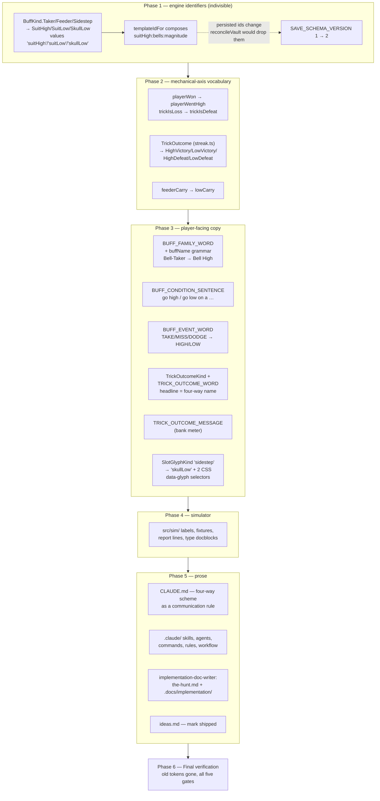

# Plan: Vocabulary rename — Victory/Defeat name the outcome, High/Low name the act

Plan folder: `.claude/contract/DLR-165-vocabulary-rename-victory-defeat-high-low/`
Execution status: see `tasks.md` in this folder.

---

## Part 1 — Alignment

### Task reference

**Jira:** DLR-165 — *Vocabulary rename: Victory/Defeat name the outcome, High/Low name the act*
(Task, priority High, labels `playable` + `ui`). Moved `To Do → Planning` at the start of this run.

**Acceptance criteria, verbatim from the ticket:**

1. **Victory** and **Defeat** are the only words used for the outcome. A Victory adds the trick's damage to the running total and climbs the streak by one; a Defeat costs 1 health, zeroes the total and the streak, and pays the Quarry nothing. The words replace every player-facing use of win/won/lose/lost/loss to mean an outcome.
2. **High** and **Low** are the only words used for the mechanical act. Going high means the player physically took the cards; going low means they did not.
3. The two combine into exactly four trick names, and each resolution is reported as one of them: **High Victory** (took a clean trick), **Low Victory** (the dodge — did not take a skulled trick), **High Defeat** (ate the skull — took a skulled trick), **Low Defeat** (the clean loss — did not take a clean trick).
4. The resolution screen's headline is the four-way name, replacing the current headline. Where it reads *Dodge* today it reads **Low Victory**. The existing flavour sentence beneath it is kept ("they took it, and it carried a skull — so it banks, and costs you nothing") — flavour words survive as subtitle prose, never as the load-bearing label.
5. No buff card's text names Victory or Defeat. Every condition card's text is phrased on the High/Low axis only. This is the rule that stops the two vocabularies re-merging: the moment a card can be read as being about the outcome, the original confusion is back.
6. **The card names change, not just their rule text.** The three condition families are renamed on the new scheme in their display names and their identifiers alike: Bell-Taker → **Bell High**, Bell-Feeder → **Bell Low**, Sidestep → **Skull Low**, and the same for the Keys and Moons rows. Rule text becomes "Go high on a Bells trick", "Go low on a Bells trick", "Go low on a skull". The live mintable pool then reads as three suits crossed with high/low, plus skull-low — the name states the condition, so a card no longer has to be learned separately from what it does. Taker, Feeder and Sidestep are retired as names and appear nowhere in the shipped game.
7. Sidestep's printed text is corrected as part of the rename. It currently reads "…with this card", a leftover from an unbuilt Apply-to-card category; no buff attaches to a card, and "Go low on a skull" is the first text the card has had that is actually true.
8. `.docs/game_rules/the-hunt.md` uses the new vocabulary throughout, including its four-outcome table, and is regenerated by the `implementation-doc-writer` skill rather than edited by hand. The same goes for every affected file under `.docs/implementation/`.
9. `CLAUDE.md` states the vocabulary as a communication rule, binding on prose and not only on shipped strings. Its current "Win and lose mean two different things" section is replaced by a statement of the four-way scheme, and the replacement says explicitly that these are the words to use in conversation with the developer, in a plan, in a ticket, in an agent dispatch prompt and in a reviewer finding — that "win a trick" is never an acceptable way to describe a Low Victory, and that a sentence about a trick names one of the four outcomes or says high/low. The note that the rename is banked and not built is removed.
10. `.claude/` is swept for the old vocabulary. Every skill, agent, command and rule file that uses win/lose to mean an outcome, or names Taker/Feeder/Sidestep, is corrected. This is what stops the pipeline from regenerating the old words into new docs after the code has moved on. Contract folders under `.claude/contract/archive/` are records of what was true when written and are left alone.
11. `SAVE_SCHEMA_VERSION` is bumped to 2 in the same task as the identifier rename — see Dependencies & Risks for why this is mandatory rather than optional.
12. `npm run typecheck`, `npm run lint`, `npm run format:check`, the full Vitest suite and `npm run build` are all green. Existing tests that assert on the old label strings are updated, not deleted.

**Scope boundaries, verbatim.** In scope: the four-way outcome naming and the resolution headline; buff family names, card rule text, and the `BuffKind` identifiers and their serialised string values; every player-facing string that names an outcome or a mechanical act (resolution breakdown, buff gallery, manage-buffs screen, slot strip, bank/pot meter); the simulator's own labels and any test fixture asserting on the old strings; `SAVE_SCHEMA_VERSION` and the Vault's handling of the version change; `.docs/game_rules/the-hunt.md`, the affected `.docs/implementation/` module docs, `CLAUDE.md`, and the `.claude/` sweep in AC10.

Out of scope, verbatim: the Feeder carry mechanic; restoring any cut condition family, reward axis or consumable; the pre-commit hover string that tells the player whether a card goes high or low; any change to how a trick actually resolves — "Every outcome must be mechanically identical before and after; only the words change."

**Design source.** `.docs/design/Balatro-Forbidden-Solitaire/ideas.md` → *"The Feeder carry, and a High/Low vocabulary that stops describing the wrong axis"* → *"The vocabulary — Victory / Defeat, with High and Low naming the act"* (revised 2026-09-03, lines 1512–1600). It carries the four-way table, the family renames, the card text, and the note that "high" means winning the contest including trump, not the higher numeral.

**Follow-up decisions confirmed interactively, 2026-09-03.** Skill list confirmed by the developer as `react-frontend`, `implementation-doc-writer`, `game-ux`, `game-designer` — all four ticked, none removed. Ticking `game-designer` brings `.docs/design/…/ideas.md` into scope for marking the banked vocabulary section as shipped.

### Restated goal

The game currently uses "win" and "lose" for two different facts, and a skull pulls them apart: whether the player physically took the cards, and whether the trick was good for them. This ticket gives each fact its own words. Victory and Defeat name the outcome and nothing else; High and Low name the physical act and are the only words a buff card may use. Every trick then has one unambiguous four-way name — High Victory, Low Victory, High Defeat, Low Defeat — and the resolution screen's headline becomes that name rather than today's *Clean win / Dodge / Clean loss / Ate the skull*. The three live condition families are renamed to state their own condition (Bell High, Bell Low, Skull Low), in their display names and in their `BuffKind` identifiers alike, which changes ids the Vault has already written to disk and so forces `SAVE_SCHEMA_VERSION` to 2 in the same task. Nothing about how a trick resolves changes: the same tricks bank, the same tricks hurt, the same cards fire on the same predicates. The words change, and then `CLAUDE.md`, `.docs/`, and `.claude/`'s own tooling are swept so the pipeline stops regenerating the old vocabulary into new documents.

### In scope

- Renaming `BuffKind.Taker` → `SuitHigh`, `BuffKind.Feeder` → `SuitLow`, `BuffKind.Sidestep` → `SkullLow`, with their serialised string values, and every reference across `src/`.
- Bumping `SAVE_SCHEMA_VERSION` from 1 to 2 in the same task, and updating `vaultStore.ts`'s docblock which currently asserts the version has never been bumped.
- Renaming the four-outcome vocabulary in both places it is declared: `TrickOutcome` in `src/warCouncil/streak.ts` and `TrickOutcomeKind` in `src/app/warCouncil/resolutionOutcome.ts`, to `HighVictory` / `LowVictory` / `HighDefeat` / `LowDefeat`, values included.
- Renaming the mechanical-axis field `playerWon` → `playerWentHigh` and the derived `trickIsLoss` → `trickIsDefeat`, without changing a single predicate.
- Renaming the run-level field `feederCarry` → `lowCarry` and the sim's `feederCarryIn` / `feederCarryOut` counterparts.
- The card display-name grammar: `Bell-Taker (Momentum)` → `Bell High (Momentum)`, driven by `BUFF_FAMILY_WORD` and `buffName` in `src/app/warCouncil/buffLabels.ts`.
- The card condition sentences: `BUFF_CONDITION_SENTENCE` and `BUFF_WIDENED_CONDITION_SENTENCE` re-phrased onto the High/Low axis for every row, including Sidestep's false "…with this card" (AC7) and the two DLR-161 protective families.
- The mechanical pill words `BUFF_EVENT_WORD` (`TAKE` / `MISS` / `DODGE` → `HIGH` / `LOW` / `LOW`).
- The resolution headline copy — `TRICK_OUTCOME_WORD` becomes the four-way name; `TRICK_OUTCOME_WHY` flavour prose is kept (AC4).
- `TRICK_OUTCOME_MESSAGE` in `src/app/warCouncil/labels.ts`, the bank/pot meter's second copy of outcome wording.
- The slot-machine glyph identifier `'sidestep'` → `'skullLow'` across `slotSymbols.ts`, `SlotGlyph.tsx`, and the two `data-glyph` CSS selectors that bind to it by string.
- The simulator's labels, fixtures, report lines and type docblocks in `src/sim/`.
- Every test fixture and assertion in the 48 spec files that names the old vocabulary — updated, never deleted (AC12).
- `CLAUDE.md`'s "Win and lose mean two different things" section, replaced by the four-way scheme stated as a communication rule (AC9).
- The `.claude/` sweep of AC10, over skills, agents, commands, rules and workflow files.
- `.docs/game_rules/the-hunt.md` and every affected `.docs/implementation/` file, regenerated through the `implementation-doc-writer` skill (AC8).
- Marking the banked vocabulary section in `.docs/design/…/ideas.md` as shipped by DLR-165.

### Explicitly out of scope

- **The Feeder carry mechanic.** Note it is already built (DLR-150, `BuffCarry` in `src/hunt/buffAccrual.ts` plus `feederCarryAfter` in `src/hunt/runCarry.ts`) — the ticket's out-of-scope note describes it as unbuilt future work, which is stale. This plan renames its identifiers and changes nothing about what it pays.
- Restoring any cut condition family, reward axis or consumable.
- The pre-commit hover string that would tell a player whether the card they are about to play goes high or low.
- Any change to a predicate, a payout, a tier ladder, or a resolution rule.
- Collapsing the two duplicate four-outcome enums (`TrickOutcome` and `TrickOutcomeKind`) into one. They stay two declarations; see Risks.
- Contract folders under `.claude/contract/` — both the archive (AC10 excludes it explicitly) and the 40 unarchived completed contracts, which are the same kind of historical record. AC10's sweep names skills, agents, commands and rules only.
- `.docs/design/…/v1-buff-card-list.md`, `hybrid-design.md`, `version-6-developer-idea.md` and the play-session notes — retired or historical design records, not shipped copy.

### Pattern Reference

The brief names `src/vault/vaultState.ts` (`oddsBoosts` keys and `templateId` on each grant), `templateIdFor` in `src/hunt/buffTemplates.ts`, and `.claude/rules/save-data-versioning.md` reject condition 4 as the persistence hazard — all three verified present. It names `.docs/design/…/ideas.md`'s vocabulary subsection as the specification for the four-way table, the family renames and the card text; that section is cited rather than re-derived throughout this plan.

The brief names two documents as **superseded and not to be used as the source for card text**: `.docs/design/Balatro-Forbidden-Solitaire/v1-buff-card-list.md` and `.claude/contract/DLR-147-full-ui-pass/mockup-buff-gallery.html`. Both are honoured — the card text in Data shapes comes from `ideas.md` only.

For the code conventions themselves, follow `.claude/skills/react-frontend/SKILL.md`; for the resolution headline as a game surface, `.claude/skills/game-ux/SKILL.md`; for the doc regeneration, `.claude/skills/implementation-doc-writer/SKILL.md`.

### Constraints flagged on the brief

- **Save compatibility is the named hazard.** Renaming `BuffKind` values changes `templateIdFor`'s composed ids, which the Vault has already persisted. `reconcileVault` silently drops an unresolvable id, so without the version bump the developer's saved boosts and grants vanish with no message. The bump to 2 must land in the same task as the identifier rename. Resetting the Vault once is explicitly accepted and preferred to a migration map, which would keep the dead vocabulary alive in code.
- **No mechanical change whatsoever.** "Every outcome must be mechanically identical before and after; only the words change." In particular the two predicates the brief calls out by name must survive byte-for-byte in meaning: the Low family stays `!playerWon && suit matches` with no skull term, and Skull Low stays `skullTrick && !playerWon`.
- **A partial rename is worse than no rename.** The brief's own test: a grep for the old family names, and for win/lose used to mean an outcome, returns nothing outside the retired design documents and the contract archive at the end.
- **"High" is not the higher rank.** A trump 3 takes a trick over an 11 Bells. The ticket must at minimum not state the wrong definition anywhere; the teaching hover that would fix it properly is out of scope.
- **Two runtime dependencies is the ceiling** (`react`, `react-dom`) — this ticket adds none.
- All five gates green: `typecheck`, `lint`, `format:check`, full Vitest, `build`.

### Assumptions made

- **`BuffKind` member names are `SuitHigh` / `SuitLow` / `SkullLow`, not bare `High` / `Low`.** The ticket names the *cards* Bell High and Bell Low but does not name the enum members. `BuffKind.High` read inside `buffFires` collides with "the higher card"; `SuitHigh` says the family is the suit-parameterised one and pairs cleanly with the suitless `SkullLow`. Serialised values follow: `'suitHigh'`, `'suitLow'`, `'skullLow'`, giving template ids like `suitHigh:bells:magnitude`.
- **`playerWon` is renamed to `playerWentHigh`.** The brief calls this "desirable and low-risk" without mandating it; leaving it named `playerWon` would keep the exact word the ticket exists to retire on the field every buff condition reads. Seven non-test files and 136 total references.
- **Both four-outcome enums are renamed, not just the UI one.** AC3 and AC4 only require the *reported* name to change, which is `TrickOutcomeKind` in `src/app/warCouncil/resolutionOutcome.ts`. But `TrickOutcome` in `src/warCouncil/streak.ts` declares the same four rows as `CleanWin` / `Dodge` / `CleanLoss` / `SkullWin`, and leaving them is precisely the two-vocabularies-in-play state the brief names as worse than either alone. Both are renamed; neither is deleted or merged.
- **The two DLR-161 protective families get new condition text, but keep their names.** `Skull Helmet` and `Skull Tether` do not use outcome words, so AC6 does not touch them. Their *text* does: bronze reads "eat a skull with this card" — the same false "with this card" AC7 corrects on Sidestep — and the widened silver/gold text reads "eat a skull, or lose a trick", which names the outcome axis and so breaks AC5. Both are re-phrased onto the High/Low axis.
- **The eight cut, unconstructible families are re-texted too.** Mark of the *R*, Glutton, Hoarder and the rest keep rows in `BUFF_CONDITION_SENTENCE` saying "win a trick with a {rank}". No player can reach them, so they are not player-facing — but they sit in the table the sweep must clear, and leaving them is how the old vocabulary comes back when a family is restored. Their `BuffKind` member names are **not** changed; only their condition sentences.
- **`feederCarry` is renamed to `lowCarry`.** The run-level field, its sim counterparts, and `feederCarryAfter`. `RunState` is not persisted — the Vault is the only save store in the codebase — so this rename carries no save risk.
- **Contract folders under `.claude/contract/` are left alone, archived or not.** AC10 names "every skill, agent, command and rule file" and exempts the archive as a historical record. The 40 unarchived completed contracts are the same kind of record and are exempted on the same reasoning. Only `.claude/skills/`, `.claude/agents/`, `.claude/commands/`, `.claude/rules/`, `.claude/workflow/` and `.claude/sprint-runs/` are swept.
- **`CLAUDE.md`'s stale "16 templates" figure is corrected to 18 in passing.** The cut-buffs section names Taker, Feeder and Sidestep and must be edited for AC10 anyway; while it is open, its template count is verifiably wrong — DLR-161 added Skull Helmet and Skull Tether, and `buffTemplates.ts`'s own docblock says 18. Correcting a wrong number on a line already being rewritten is cheaper than leaving it, but it is called out here rather than done silently.
- **The flavour sentences under the headline are kept verbatim** (AC4 says so explicitly for `TRICK_OUTCOME_WHY`). `TRICK_OUTCOME_MESSAGE`, the bank meter's separate copy, is *not* covered by AC4 and does currently say "Clean trick lost" — it is re-worded to lead with the four-way name.
- **The `data-glyph` CSS value is renamed with its TypeScript union.** `'sidestep'` binds by string across `SlotGlyphKind`, `slotSymbols.ts`, `SlotGlyph.tsx` and two `.css` files; `web-project.md`'s correctness traps require both sides change in the same task.
- **`ideas.md`'s banked vocabulary section is annotated, not rewritten.** A dated line saying DLR-165 shipped it, so the design record stays a record. Its Feeder-carry subsection is untouched.

### Config and persisted-shape audit

- **`SAVE_SCHEMA_VERSION`** — 9 hits across `src/`: the declaration in `src/persistence/config.ts:22`, the re-export in `src/persistence/index.ts:1`, two reads in `src/persistence/saveStore.ts` (`:64` docblock, `:103` default), one docblock assertion in `src/vault/vaultStore.ts:15` that reads *"`SAVE_SCHEMA_VERSION` is NOT bumped here — this is the first shape ever written, at version 1"* (this becomes false and is in scope), and 4 test references (`saveStore.test.ts:2,87,121`; `vaultStore.test.ts:6,64,74,94`). Every one is in a task's file list.
- **The only save store in the codebase is the Vault.** `createSaveStore` has exactly one production call site, `src/vault/vaultStore.ts:34`, keyed `VAULT_SAVE_SECTION` through `saveKeyFor`. `RunState`, `EncounterState`, and every UI seed are in-memory only. So the persisted surface this rename touches is exactly two fields on `VaultState`: the **keys** of `oddsBoosts` (`Readonly<Record<string, number>>`, `vaultState.ts:19`) and `templateId` on each entry of `startingGrants` (`vaultState.ts:21`, validated at `:59-60`). Both hold `templateIdFor`-composed strings such as `taker:bells:magnitude`.
- **`reconcileVault` silently drops what it cannot resolve** — `vaultState.ts:97-116` looks each id up through `templateById` and skips it, counting into `droppedCount`. Without the version bump every saved boost and grant becomes unresolvable at once and disappears with no message; with the bump, `saveStore` returns `SaveReadOutcome.VersionMismatch` and the default. This is `.claude/rules/save-data-versioning.md` reject condition 4, and the bump ships in the same task as the rename.
- **Type-loss check.** No type widens or narrows. `BuffKind`'s member *names* and string *values* change; the union's arity, its `as const` shape, and every consuming `Record<BuffKind, …>` keyed table stay exactly as wide. `TrickOutcome` and `TrickOutcomeKind` likewise keep four members each. No field becomes optional, no array becomes an object, no `number` becomes a `string`.
- **Construction-site counts, by field rather than by type name** — `BuffKind`: **145** qualified references to the three renamed members (`BuffKind.Taker|Feeder|Sidestep`) plus **30** raw string-literal construction sites (`'taker'`/`'feeder'`/`'sidestep'`) and **55** composed-id literals (`taker:`/`feeder:`/`sidestep:` prefixes, overwhelmingly in specs and Vault fixtures) — 230 sites in total, spread over 93 files (45 non-test, 48 test). `TrickOutcome`: **71** qualified references. `TrickOutcomeKind`: **16**. Display-name literals (`Bell-Taker`, `Key-Feeder`, `Moon-Taker`, …): **41**. `playerWon`: **136**. The larger figure in each pair is what the tasks cover, and the full 93-file list is enumerated in the `tasks.md` file map.
- **Name-chain alignment.** The chain is `BuffKind` member → serialised value → `templateIdFor`-composed id → persisted `oddsBoosts` key and `TemplateGrant.templateId` → `BUFF_FAMILY_WORD` / `BUFF_CONDITION_SENTENCE` / `BUFF_EVENT_WORD` rows → `buffName` output → test assertion strings. All eight links change in one task per surface; the `Record<BuffKind, …>` keying means the compiler catches a missed table row, but **not** a missed string literal in a spec — which is why the literal counts above are quoted separately.
- **The one string-bound surface the compiler cannot see** is `data-glyph='sidestep'`, which appears once in `src/app/run/shopSlot.css:107` and once in `src/app/run/shopSlotReel.css:114`, matched against `SlotGlyphKind` in `src/app/run/SlotGlyph.tsx:21` and produced by `slotSymbols.ts:78`. Renaming the union member without the two CSS selectors type-checks cleanly and silently unstyles the glyph.
- **Architectural boundary.** The pure-core ESLint override covers `src/warCouncil/**` and `src/hunt/**`. This plan adds no import and no global to either tree — it renames identifiers already there — so the boundary is unaffected. `src/app/warCouncil/resolutionOutcome.ts` stays where it is: it holds user-facing copy and correctly lives under `src/app/`.
- **`.claude/` sweep surface.** 15 files outside `.claude/contract/` use win/lose to mean an outcome or name the old families: `agents/implementer.md`, `commands/fb-plan.md`, `commands/fb-report.md`, `skills/ai-play-tester/SKILL.md` + its `references/round-driver.md` and `references/strategy-engine.md`, `skills/game-designer/SKILL.md`, `skills/game-ux/references/feedback-to-redesign.md` + `references/full-viewport-layout.md` + `references/figma-mcp.md`, `skills/implementation-doc-writer/SKILL.md`, `skills/play-tester/SKILL.md` + `references/sim-architecture.md`, `skills/react-frontend/references/engineering-standards.md`, `skills/skill-creator/references/type-patterns.md`, `workflow/web-project.md`, and `sprint-runs/2026-08-23-sprint/log.md`. Each hit is read in context: several are generic English ("a lost update", "win the argument") and are left alone; only game-vocabulary uses are corrected.
- **`.docs/` surface.** 40 files name the old families. 24 are under `.docs/implementation/` and 1 is `.docs/game_rules/the-hunt.md` — all regenerated by `implementation-doc-writer` (AC8), never hand-edited. 1 is `.docs/design/…/ideas.md`, annotated. The rest are retired or historical design records and play-session notes, left alone.

---

## Part 2 — Technical design

### Approach

The change has one shape everywhere: a name moves, and nothing computes differently. The discipline that makes it safe is that the renames land **innermost first**, so at every phase boundary the compiler has already found the callers. `src/hunt/` declares `BuffKind`; `src/warCouncil/` declares `TrickOutcome` and reads `playerWon`; `src/app/` holds every user-facing string; `src/sim/` holds a parallel vocabulary of its own. Renaming the declaration first means `npm run typecheck` enumerates the work rather than the planner having to, for every reference the compiler can see. That is most of them but deliberately not all — the 30 raw string literals, the 55 composed-id literals, the 41 display-name literals and the two `data-glyph` selectors are invisible to `tsc`, which is exactly why the audit counted them separately and why each phase closes with a recursive `Select-String` proving the old token is gone from that tree.

The alternative shape — a repo-wide find-and-replace in one pass — was rejected on two grounds. It cannot distinguish `Feeder` the family from `feederCarry` the mechanic (which is renamed for a different reason, on a different axis, and could equally have been left), nor `win` the outcome from `win` in ordinary English prose across fifteen `.claude/` files. And it produces one commit where nothing type-checks until the last edit lands, which removes every intermediate phase boundary this pipeline depends on.

**Phase 1 is the persistence-critical one and is deliberately indivisible.** `.claude/rules/save-data-versioning.md` reject condition 4 requires the `SAVE_SCHEMA_VERSION` bump in the same task as the incompatible shape change, and the shape change here is the `BuffKind` string values, because `templateIdFor` composes the persisted id straight out of them. So one task changes `BuffKind`, the `MintableConditionKind` narrowing, every `buffFires` case, the version constant, and `vaultStore.ts`'s now-false docblock together. Splitting them would leave a boundary where the app compiles and silently eats the developer's Vault. The three renamed members carry the same `Record<BuffKind, …>` keying they always did, so `CONDITION_MODIFIER`, `BUFF_CADENCE`, `BUFF_FAMILY_WORD` and the rest fail to compile until each names the new member — the compiler is doing the enumeration, and that is the reason to key those tables over the closed union in the first place.

**The copy layer is where judgement lives, and it is concentrated in three tables.** `BUFF_FAMILY_WORD` supplies the family half of a name, `BUFF_CONDITION_SENTENCE` (with `BUFF_WIDENED_CONDITION_SENTENCE` for the two protective tiers) supplies the rule text, and `buffName` composes them. That composition is where the one real grammar change sits: today it builds `Bell-Taker` by singularising the suit and joining with a hyphen; the new scheme is `Bell High`, a space. Everything downstream — the gallery, the manage-buffs rows, the slot strip chips, the fired-buff sentences, the resolution breakdown, the accessible names — already composes through `buffName` and `buffConditionSentence` and needs no edit of its own. That is why a rename touching 93 files has only a handful of *authoring* decisions in it; the rest is references and assertions.

The resolution headline (AC4) is a separate, smaller table. `TRICK_OUTCOME_WORD` in `src/app/warCouncil/resolutionOutcome.ts` becomes the four-way name and `TRICK_OUTCOME_WHY` — the flavour sentence AC4 explicitly preserves — is untouched. `TrickWell.tsx` renders both today and keeps rendering both. The one thing to watch is length: "Ate the skull" is 13 characters and "High Defeat" is 11, so the longest label shrinks, but `Clean win` (9) grows to `High Victory` (12) in the same slot. Whether that still reads at a glance in the space it has is a `game-ux` question with a right answer, so it goes to QA on a browser pass rather than to the developer — the mockup in this folder shows the four labels in a facsimile of that slot so the developer can judge the *feel* of the four-way name replacing a colour word.

**The docs are regenerated, not edited.** AC8 is explicit that `.docs/game_rules/the-hunt.md` and `.docs/implementation/` go through the `implementation-doc-writer` skill. That skill's own workflow already handles exactly this case — its Step 1 requires grepping every module doc for a vocabulary term the contract renamed, not only the touched module's, which is the mechanism that catches the 24 affected implementation files. `the-hunt.md` §7 owns the four-outcome table and its Status register names the constants; both move. `CLAUDE.md` and the `.claude/` sweep are ordinary prose edits and are hand-written, because no skill owns them.

### Skills to invoke during execution

- **`react-frontend`** — owns everything under `src/`: the `BuffKind` rename and its 230 construction sites, the label tables, the `buffName` grammar, `TrickWell`'s headline, the slot glyph union, the persistence version bump, and every spec updated alongside. Its 400-line file budget and its `Record<ClosedUnion, …>` keying convention are what make the compiler enumerate this rename rather than the reviewer.
- **`game-ux`** — owns the resolution headline and the buff card face as game surfaces: whether the four-way name reads at a glance in the slot `Dodge` occupies, and whether the longer `High Victory` still fits the card and chip widths at both viewports. Also owns `mockup.html` in this folder.
- **`implementation-doc-writer`** — owns AC8 in full: `.docs/game_rules/the-hunt.md` (its §7 four-outcome table, its Status register paths, its markers) and every affected file under `.docs/implementation/`. These are regenerated by the skill and never hand-edited.
- **`game-designer`** — owns `.docs/design/`, and here only the one annotation marking `ideas.md`'s banked vocabulary section as shipped by DLR-165. It does not re-open the design.

Rule files the executor must Read: `.claude/rules/save-data-versioning.md` (its reject condition 4 is what makes Phase 1's task shape mandatory). Workflow reference: `.claude/workflow/web-project.md` — in particular its warning that `Select-String -Path` does not recurse, which every "the old token is gone" check in this contract depends on.

No developer override was applied; all four proposed skills were confirmed.

### Diagram



### Data shapes

#### `src/hunt/buffs.ts` — the three renamed `BuffKind` members

```ts
export const BuffKind = {
  // …unchanged members…
  /** Renamed from `Taker` by DLR-165. The card is "Bell High"; the condition is the MECHANICAL
   *  axis — the player physically took the cards. Value change is BREAKING for persisted
   *  template ids; see SAVE_SCHEMA_VERSION. */
  SuitHigh: 'suitHigh',
  /** Renamed from `Feeder` by DLR-165. The card is "Bell Low". */
  SuitLow: 'suitLow',
  /** Renamed from `Sidestep` by DLR-165. The card is "Skull Low". */
  SkullLow: 'skullLow',
  // …every other member, name and value UNCHANGED…
} as const
export type BuffKind = (typeof BuffKind)[keyof typeof BuffKind]
```

Arity unchanged: the union keeps every member it has today. `MintableConditionKind` in `src/hunt/buffTemplates.ts` narrows to `SuitHigh | SuitLow | SkullLow | SkullHelmet | SkullTether` — the same five families, renamed.

#### `src/persistence/config.ts` — the version bump

```ts
/** DLR-165 — bumped 1 → 2. The `BuffKind` values that `templateIdFor` composes persisted template
 *  ids from were renamed (`taker:` → `suitHigh:`, `feeder:` → `suitLow:`, `sidestep:` → `skullLow:`),
 *  so every id already on disk is unresolvable. `reconcileVault` would drop each one silently;
 *  the bump makes `saveStore` return `SaveReadOutcome.VersionMismatch` and the default instead.
 *  This RESETS the Vault once, which is deliberate — see `.claude/rules/save-data-versioning.md`. */
export const SAVE_SCHEMA_VERSION = 2
```

Not a tuning value: `2` is the only correct successor to `1` and the ticket names it in AC11.

#### `src/warCouncil/streak.ts` — the engine's four outcomes

```ts
/** §3.2's four rows, renamed by DLR-165 onto the two-axis scheme: the first word is the
 *  MECHANICAL act (High = the player took the cards), the second is the OUTCOME (Victory = banks,
 *  Defeat = hurts). */
export const TrickOutcome = {
  HighVictory: 'highVictory', // was CleanWin  — took a clean trick
  LowVictory: 'lowVictory',   // was Dodge     — did not take a skulled trick
  LowDefeat: 'lowDefeat',     // was CleanLoss — did not take a clean trick
  HighDefeat: 'highDefeat',   // was SkullWin  — took a skulled trick
} as const
export type TrickOutcome = (typeof TrickOutcome)[keyof typeof TrickOutcome]
```

#### `src/app/warCouncil/resolutionOutcome.ts` — the reported name (AC3, AC4)

```ts
export const TrickOutcomeKind = {
  HighVictory: 'highVictory',
  LowVictory: 'lowVictory',
  LowDefeat: 'lowDefeat',
  HighDefeat: 'highDefeat',
} as const
export type TrickOutcomeKind = (typeof TrickOutcomeKind)[keyof typeof TrickOutcomeKind]

export function trickOutcomeKindFor(playerWentHigh: boolean, skullTrick: boolean): TrickOutcomeKind {
  if (playerWentHigh) return skullTrick ? TrickOutcomeKind.HighDefeat : TrickOutcomeKind.HighVictory
  return skullTrick ? TrickOutcomeKind.LowVictory : TrickOutcomeKind.LowDefeat
}

/** AC3/AC4 — the headline. The four-way name is now the load-bearing label. */
export const TRICK_OUTCOME_WORD: Readonly<Record<TrickOutcomeKind, string>> = {
  [TrickOutcomeKind.HighVictory]: 'High Victory',
  [TrickOutcomeKind.LowVictory]: 'Low Victory',
  [TrickOutcomeKind.LowDefeat]: 'Low Defeat',
  [TrickOutcomeKind.HighDefeat]: 'High Defeat',
}

/** AC4 — the flavour sentence is KEPT verbatim. Only its keys are renamed. */
export const TRICK_OUTCOME_WHY: Readonly<Record<TrickOutcomeKind, string>> = {
  [TrickOutcomeKind.HighVictory]: 'you took it, and it carried no skull — so it banks',
  [TrickOutcomeKind.LowVictory]:
    'they took it, and it carried a skull — so it banks, and costs you nothing',
  [TrickOutcomeKind.LowDefeat]: 'they took it, and it carried no skull — your streak resets',
  [TrickOutcomeKind.HighDefeat]: 'you took it, and it carried a skull — your streak resets',
}
```

#### `src/app/warCouncil/buffLabels.ts` — the name and text tables

```ts
export const BUFF_FAMILY_WORD: Readonly<Record<BuffKind, string>> = {
  [BuffKind.SuitHigh]: 'High',
  [BuffKind.SuitLow]: 'Low',
  /** Suitless, so `buffName` prints the family word alone — it carries its own "Skull". */
  [BuffKind.SkullLow]: 'Skull Low',
  // …every other row unchanged…
}

export const BUFF_CONDITION_SENTENCE: Readonly<Record<BuffKind, string>> = {
  [BuffKind.SuitHigh]: 'go high on a {suit} trick',
  [BuffKind.SuitLow]: 'go low on a {suit} trick',
  [BuffKind.SkullLow]: 'go low on a skull',
  // AC5 — the two DLR-161 protective families move onto the High/Low axis, and lose the false
  // "with this card" that AC7 corrects on Skull Low.
  [BuffKind.SkullHelmet]: 'go high on a skull',
  [BuffKind.SkullTether]: 'go high on a skull',
  // The eight CUT families keep their member names and gain High/Low text, so the table holds no
  // outcome vocabulary for a future restoration to inherit.
  [BuffKind.MarkOfRank]: 'go high on a trick with a {rank}',
  [BuffKind.Glutton]: 'go high on a skull',
  // …the remaining six cut families and the activated/consumable rows…
}

/** AC5 — the widened silver/gold reading. "eat a skull, or lose a trick" named the OUTCOME axis. */
export const BUFF_WIDENED_CONDITION_SENTENCE: Partial<Readonly<Record<BuffKind, string>>> = {
  [BuffKind.SkullHelmet]: 'go high on a skull, or low on a clean trick',
  [BuffKind.SkullTether]: 'go high on a skull, or low on a clean trick',
}

/** AC2 — the mechanical pill. `HURT` on the two protective families names the outcome axis; the
 *  word for them is a DEVELOPER DECISION, see Risks. The placeholder below is `SKULL`. */
export const BUFF_EVENT_WORD: Partial<Readonly<Record<BuffKind, string>>> = {
  [BuffKind.SuitHigh]: 'HIGH',
  [BuffKind.SuitLow]: 'LOW',
  [BuffKind.SkullLow]: 'LOW',
  [BuffKind.SkullHelmet]: 'SKULL',
  [BuffKind.SkullTether]: 'SKULL',
}
```

`buffName`'s grammar change — the only structural edit in the copy layer:

```ts
/** `Bell High (Momentum)` / `Skull Low (Blade)` / `Cheat (Free Rein)`. DLR-165 replaced the
 *  hyphenated `Bell-Taker` join with a space: the family word is now an adjective phrase
 *  ("High"), not a noun ("Taker"), so a hyphen reads wrong. */
export function buffName(buff: Buff): string {
  const suit = buffTargetSuitOf(buff)
  const rank = buffTargetRankOf(buff)
  const family = BUFF_FAMILY_WORD[buff.kind]
  const head =
    rank !== null
      ? `${family} ${rank}`
      : suit !== null
        ? `${SUIT_WORD[suit].replace(/s$/, '')} ${family}`
        : family
  return `${head} (${BUFF_REWARD_SUFFIX[buff.reward.axis]})`
}
```

#### `src/app/warCouncil/labels.ts` — the bank meter's outcome copy

```ts
/** DLR-165 — leads with the four-way name, then the consequence. Placeholder copy; the wording
 *  is the developer's. */
export const TRICK_OUTCOME_MESSAGE: Readonly<Record<TrickOutcome, string>> = {
  [TrickOutcome.HighVictory]: 'High Victory. The streak climbs.',
  [TrickOutcome.LowVictory]: 'Low Victory. The skull passed you by — the streak climbs.',
  [TrickOutcome.LowDefeat]: 'Low Defeat. 1 damage — the streak is lost.',
  [TrickOutcome.HighDefeat]: 'High Defeat. You took the skull. 1 damage — the streak is lost.',
}
```

#### `src/app/run/SlotGlyph.tsx` and its two stylesheets — the string-bound union

```ts
export type SlotGlyphKind = 'skullLow' | 'cheat' | 'timebomb' | 'skullHelmet' | 'skullTether'
```

```css
/* src/app/run/shopSlot.css:107 and src/app/run/shopSlotReel.css:114 */
.shop-strip-chip-glyph[data-glyph='skullLow'],
.shop-reel-glyph[data-glyph='skullLow'],
```

`SlotSymbol`'s variant in `src/app/run/slotSymbols.ts` moves from `{ readonly kind: 'sidestep' }` to `{ readonly kind: 'skullLow' }`, and `SLOT_FAMILY_WORD`'s three rows move to `'High'` / `'Low'` / `'Skull Low'`.

#### Renamed fields — no shape change

| Old | New | Where declared | Persisted? |
|---|---|---|---|
| `playerWon` | `playerWentHigh` | `BuffTrickContext` in `src/hunt/buffEvaluation.ts` | no |
| `trickIsLoss` | `trickIsDefeat` | local, `src/hunt/buffAccrual.ts` | no |
| `feederCarry` | `lowCarry` | `RunState` in `src/hunt/run.ts:164` | no |
| `feederCarryAfter` | `lowCarryAfter` | `src/hunt/runCarry.ts:27` | no |
| `feederCarryIn` / `feederCarryOut` | `lowCarryIn` / `lowCarryOut` | `src/sim/types.ts:299,303` | no |

No `package.json`, `tsconfig.json`, `vite.config.ts` or `eslint.config.js` change. No new dependency. No new configuration key.

### Runtime quality notes

- **Purity and adjudication.** Nothing moves across a module boundary. `src/hunt/` and `src/warCouncil/` stay DOM-free and React-free — this contract adds no import to either, only renames identifiers already declared there. Every user-facing string stays under `src/app/`, which is the existing rule (`voluntaryCashOut.ts`'s docblock states it and `resolutionLabels.ts` follows it); in particular `resolutionOutcome.ts` and `buffLabels.ts` are not moved. No component gains a decision: `TrickWell` and `TrickResolutionScreen` keep reading `trickOutcomeKindFor`'s answer rather than re-deriving one. No literal moves out of a configuration constant; `SAVE_SCHEMA_VERSION` stays the single declaration it is.
- **Effects, mount and teardown.** Trivial — no concerns. No effect, listener, observer, timer, `requestAnimationFrame`, `AbortController` or pointer capture is added, removed, or has its dependency array changed. No module-level mutable state is introduced. The one nuance worth stating is that the persisted-version bump changes behaviour on *first read after deploy* rather than on mount: `createSaveStore` returns `VersionMismatch` plus the default `EMPTY_VAULT`, once, and the next write stamps version 2 — an idempotent path that a second mount repeats harmlessly.
- **Hot-path cost.** Trivial — no concerns. `buffName` and `buffConditionSentence` run per rendered card, not per pointer event, and both keep their existing cost: two table lookups plus, in `buffName`, one `String.prototype.replace` that was already there. The grammar change swaps a hyphen for a space in the same template literal and allocates no more than it did. No collection is re-scanned and no search is introduced.
- **Determinism and numeric safety.** No arithmetic changes at all — no divisor, no epsilon, no ratio, so `NaN` has no new path to a rendered value. Determinism is unaffected: `src/hunt/` mints ids from `RunState.nextBuffId` and `Math.random()` remains unreachable from it, which the pure-core lint override already enforces. The one determinism-adjacent risk is the *seeded* simulator — `src/sim/` renames labels and fixture identifiers only, and must not touch a weight, a policy branch, or a draw order, so a given seed produces the same run before and after. Phase 4's verification asserts exactly that.
- **Error paths.** The one real error path is the Vault read, and this contract makes it *more* honest rather than less: today a renamed id would deserialise into a shape-valid `VaultState` with entries silently dropped by `reconcileVault`, which is the "silent success" shape `react-frontend` forbids; after the bump, `saveStore` returns the named `SaveReadOutcome.VersionMismatch` alongside the default. No `catch` is added, none returns a success shape, and no failure is swallowed. Nothing new is thrown, no new async surface exists, and the four async states do not apply — there is no async surface in this contract.

### Risks and judgement calls

- **The `BuffKind` member names are a naming call.** `SuitHigh` / `SuitLow` / `SkullLow` versus bare `High` / `Low` / `SkullLow`. The plan takes the former because `BuffKind.High` inside `buffFires` reads as "the higher card" and collides with the very ambiguity the ticket is removing. Serialised values follow (`'suitHigh'`), and so do template ids (`suitHigh:bells:magnitude`). Say if the bare form is preferred — it is one edit at the top of Phase 1 and free before implementation starts.
- **Three cards will be called Skull-something.** After the rename the pool contains **Skull Low**, **Skull Helmet** and **Skull Tether**. Skull Low fires when the player goes low on a skull; the other two fire when they go high on one. They are opposites sharing a first word, which is the same kind of near-collision the ticket exists to remove — one layer up. Not fixable inside this ticket without renaming DLR-161's cards, which is a design decision.
- **The mechanical pill word for Skull Helmet and Skull Tether has no right answer, and the wording is yours.** They read `HURT` today, which names the outcome axis and so breaks AC5's spirit. Bronze fires on a High Defeat, silver and gold on any Defeat — so no single High/Low word covers both tiers. The plan's placeholder is `SKULL`, which is accurate at bronze and merely incomplete at silver/gold, with the card's own condition sentence carrying the difference. `HIGH` would be wrong at silver/gold; keeping `HURT` would be the one surviving outcome word on a card face.
- **`TRICK_OUTCOME_MESSAGE`'s new wording is copy judgement.** The four sentences in Data shapes are placeholders in the same sense every string on these screens is. They lead with the four-way name because that is what AC1 requires of the bank meter; the sentence after it is yours to retune.
- **Whether "High Victory" reads at a glance in the slot "Dodge" occupies is a QA question with a right answer, but whether it *feels* right is yours.** The longest new label is 12 characters against `Ate the skull`'s 13, so nothing grows overall — but `Clean win` (9) becomes `High Victory` (12) in the same headline. QA checks it does not wrap or clip at both viewports; the mockup in this folder is there for the feel of a two-word structural name replacing a colour word.
- **The plan renames both four-outcome enums but does not merge them.** After this ticket `TrickOutcome` (`src/warCouncil/streak.ts`) and `TrickOutcomeKind` (`src/app/warCouncil/resolutionOutcome.ts`) are four-member unions with identical members and identical string values, declared twice. That duplication predates this ticket and merging them is a refactor, not a rename — out of scope under "only the words change", and worth its own ticket.
- **Two things the ticket says are stale, and neither changes the work.** It says the Feeder carry is out of scope as future work — it shipped on DLR-150 and is live in `src/hunt/buffAccrual.ts`; this plan renames its identifiers and touches nothing it pays. And it says the pool "stays at 16 templates" — DLR-161 took it to 18. `CLAUDE.md` repeats the 16 figure on a line this contract must edit anyway, and the plan corrects it to 18 while there. Say if you would rather that correction be a separate ticket.
- **Bumping `SAVE_SCHEMA_VERSION` wipes your Vault once.** Balance, odds boosts and starting grants all reset on the first load after this ships. The ticket names this as accepted and deliberate; flagging it here because it is the one visible consequence of the change and it happens without a prompt.
- **The `.claude/` sweep is a judgement pass, not a substitution.** Fifteen files use win/lose, and many uses are ordinary English ("a lost update", "you win the argument") that must be left alone. Each hit is read in context. The risk is over-correction turning a readable sentence into jargon, and the reviewer should check for that specifically.
- **The eight cut families' condition text is re-written even though no player can see it.** Defensible either way: leaving it is dead copy with the retired vocabulary in it, and rewriting it means authoring placeholder text for cards nobody has agreed to restore. The plan rewrites, so the closing sweep returns genuinely clean.
- **Nothing in this contract needs a tuning value.** No number is chosen, no threshold moves, no ladder is retuned. `SAVE_SCHEMA_VERSION = 2` is the only new literal and it is the mandated successor to 1, not a choice.
