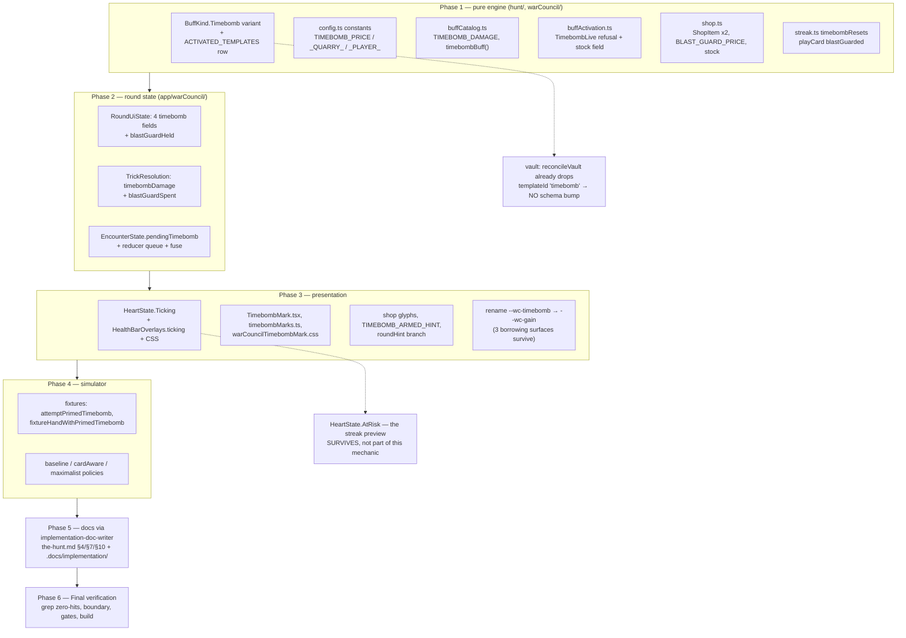

# Plan: Remove Timebomb and the Blast Guard, and all the delayed-damage machinery behind both

Plan folder: `.claude/contract/DLR-166-remove-timebomb-and-blast-guard/`
Execution status: see `tasks.md` in this folder.

---

## Part 1 — Alignment

### Task reference

Jira **DLR-166** — "Remove Timebomb and the Blast Guard, and all the delayed-damage machinery behind both". Task, High, labels `ui` + `playable`, sprint 134 ("Shop"), no parent epic. Blocks **DLR-167** (the Curse card that replaces it).

Its ten acceptance criteria, verbatim in substance:

1. `BuffKind.Timebomb` and every mechanism keyed to it are **deleted**, not merely dropped from a template list or given a zero weight. The variant no longer exists in the type, so a Timebomb is unconstructible rather than unreachable.
2. The Blast Guard is deleted from the shop's price table and shelf, its purchase refusals, the health bar, and every persisted shape that names it. If a persisted shape changes incompatibly, `SAVE_SCHEMA_VERSION` is bumped **in the same task**, per `.claude/rules/save-data-versioning.md`.
3. The delayed-damage machinery is deleted: the fuse and its config, the pending-damage queue on the round reducer, the booked/at-risk heart states that exist only to preview a Timebomb hit, and the `TimebombLive` activation refusal.
4. The resolution ordering that existed only so a Timebomb hit could beat a payout is removed, and the trick resolution screen shows no term for it.
5. No file under `src/` names `Timebomb`, `timebomb`, `Blast Guard`, `blastGuard` or `BLAST_GUARD` — in code **or** in a docblock — except where a docblock is deliberately recording project history. The final report states the grep command run and the resulting count.
6. The headless simulator no longer models a Timebomb, and no simulator policy chooses to arm one. `src/sim/` stays lint-clean and pure.
7. Every dedicated file goes rather than being emptied: `TimebombMark.tsx`, `timebombMarks.ts`, `warCouncilTimebombMark.css`, `src/warCouncil/timebomb.ts`, and the nine dedicated test files.
8. `npm run typecheck`, `npm run lint`, `npm run format:check`, `npm test` and `npm run build` all pass. Test counts are reported, not asserted.
9. No file left over 400 lines as a result of the edits.
10. `.docs/game_rules/the-hunt.md` and the affected folders under `.docs/implementation/` are brought up to date **by the `implementation-doc-writer` skill, never by hand**.

**Follow-up decisions confirmed interactively, 2026-09-03:** the developer confirmed the Timebomb was a misread brief (they wanted a card that skulls one of the player's own cards); that the Blast Guard goes with it; that Sidestep is kept separate and its wording corrected on DLR-167, not here; and the skill list for execution — `react-frontend`, `implementation-doc-writer`, `game-ux`.

### Restated goal

Delete the Timebomb and the Blast Guard from the game outright, along with every mechanism that exists only to serve them: the two-trick fuse, the pending-damage queue carried on the encounter, the "ticking heart" preview on the health bar, the one-Timebomb-at-a-time activation refusal, the shop shelf entries and prices for both, the streak-reset and payout-fold ordering that let a Timebomb hit beat a cash-out, and the simulator policies and fixtures that drive them. This is a **purely subtractive** contract — it adds no mechanic and changes no rule that survives the deletion. It leaves the codebase in the state DLR-167 needs in order to build **Curse**, the card the Timebomb was meant to be, without its defects hiding under a ~180-file removal diff.

### In scope

- Deleting the `BuffKind.Timebomb` variant and its `ACTIVATED_TEMPLATES` row, so a Timebomb becomes unconstructible rather than unreachable.
- Deleting the `ShopItem.Timebomb` and `ShopItem.BlastGuard` union variants, their prices, their shelf placement, their purchase refusals, and their glyphs.
- Deleting the Timebomb fields from the round state (`timebombArmedDamage`, `primedTimebombDamage`, `timebombFuseRemaining`, `timebombBuff`), from the trick resolution (`timebombDamage`), and from the encounter (`pendingTimebomb`).
- Deleting `blastGuardHeld` from the round state and the shop stock, `blastGuarded` from the play-card options and the streak inputs, and `blastGuardSpent` from the trick resolution.
- Deleting `BuffActivationRefusal.TimebombLive` and the `timebombLive` field on `BuffActivationStock`, including its ordering comment in the refusal enum.
- Deleting `HeartState.Ticking` and the `ticking` overlay on `HealthBarOverlays`, **keeping `HeartState.AtRisk`**, which is the streak preview and is not part of this mechanic.
- Deleting the streak's `timebombResets` gate and the `blastGuardSpent` fold in `streak.ts`.
- Deleting the four dedicated source files and the **eleven** dedicated test files. (AC7 says "nine" — the ticket undercounted; the measured figure is eleven, enumerated under Data shapes.)
- Deleting the Timebomb-only CSS rules, and **renaming** the `--wc-timebomb` / `--wc-timebomb-edge` colour tokens rather than deleting them (see Assumptions).
- Deleting the Timebomb copy constant `TIMEBOMB_ARMED_HINT` and its branch in `roundHint.ts`.
- Deleting the simulator's Timebomb fixtures (`fixtureHandWithPrimedTimebomb`, `attemptPrimedTimebomb`) and the Timebomb behaviour in `baselinePolicy`, `cardAwarePolicy` and `maximalistPolicy`.
- Updating `.docs/game_rules/the-hunt.md` and `.docs/implementation/` through the `implementation-doc-writer` skill.

### Explicitly out of scope

- **The Curse card** — DLR-167. Nothing in this contract introduces a replacement mechanic.
- **Sidestep's wording correction** — also DLR-167. Sidestep's description, its `DODGE` card face and its condition are untouched here.
- **Cheat**, which stays exactly as it is. It is the shape Curse will copy, and touching it here would put the pattern DLR-167 needs at risk.
- **The eight cut buff condition families and two cut reward axes.** They are deliberately retained-but-unmintable and get the opposite treatment from the Timebomb; they must not be touched, and must not be quietly restored while adjacent code is edited.
- **`HeartState.AtRisk` and the streak preview.** Named explicitly because the audit found `AtRisk` and `Ticking` sit adjacent in the same map and deleting the wrong one silently removes a feature this contract has no business touching.
- Any retuning of Sidestep, Skull Helmet or Skull Tether.
- The Victory/Defeat and High/Low vocabulary rename (DLR-165).
- **Rebuilding a card-in-hand targeting surface.** The Timebomb's is deleted here; DLR-167 rebuilds one for Curse, recovering the pattern from git history.

### Pattern Reference

The brief supplies no code pattern, because a deletion has none to follow. The references chosen here:

- **`.claude/rules/save-data-versioning.md`** — governs AC2's schema-bump clause. Read and applied; see the audit.
- **`src/vault/vaultState.ts`'s `reconcileVault`** — the existing, designed migration path for a persisted `templateId` that no longer resolves. This contract relies on it rather than inventing a migration.
- **`.claude/workflow/web-project.md`** — owns every `Run:` command, and its warning that `Select-String -Path` does not recurse governs every verification grep in `tasks.md`.
- **`react-frontend`, `game-ux`, `implementation-doc-writer`** — loaded during planning; see Part 2.

### Constraints flagged on the brief

- **Purely subtractive.** The diff must add no mechanic. This is the reason the ticket was split from DLR-167 at all, and a reviewer should treat any added behaviour as out of contract.
- **Deleted, not merely unreachable.** AC1 is explicit that the type variant goes, in deliberate contrast to the eight cut condition families. "Removed from a template list" is not sufficient.
- **The pure-core boundary holds.** `src/warCouncil/**` and `src/hunt/**` are lint-enforced DOM-free and React-free; `src/sim/**` is lint-enforced pure. Deletion must not disturb the `eslint.config.js` override blocks, whose ordering is load-bearing (a regression there shipped once already, on DLR-106).
- **No file over 400 lines.** Trivially satisfied — every touched file only shrinks — but stated so it is checked rather than assumed.
- **`npm run format:check` fails on pre-existing files** unrelated to this contract. Gate on `npx prettier --check` scoped to the changed files; never run `npm run format`, which rewrites ~59 design documents.

### Assumptions made

- **`--wc-timebomb` and `--wc-timebomb-edge` are renamed, not deleted.** The audit found the token is doing double duty: three surfaces borrow it as a palette colour with no connection to the mechanic — the won-verdict headline in `run.css`, the feeder carry-out row in `warCouncilBankMeter.css`, and the buff card's payoff-gain chip in `warCouncilBuffCard.css`. Deleting the token would silently unstyle three unrelated surfaces. The plan renames it to `--wc-gain` / `--wc-gain-edge`, which describes what it now means everywhere it survives. **The name itself is a copy judgement and is routed to the developer** in Risks.
- **No `SAVE_SCHEMA_VERSION` bump.** The only persisted value naming the mechanic is the template id string `'timebomb'`, reachable through `VaultState.startingGrants` and `.oddsBoosts`. `reconcileVault` already drops any entry whose `templateId` does not resolve through `templateById` and counts it in `droppedCount`. That is the designed migration path, it needs no code change, and the payload shape itself is unchanged — so reject condition 4 of `save-data-versioning.md` is not tripped. Confirmed by reading `src/vault/vaultState.ts`, not inferred.
- **`HeartState.AtRisk` survives; `HeartState.Ticking` goes.** The docblock is explicit that `Ticking` was added on DLR-101 for booked Timebomb specifically, "rather than reusing `atRisk`", and that `AtRisk` is the streak preview from a different ticket's AC3. Deleting `AtRisk` would be a scope breach.
- **`ShopItem` narrows rather than being replaced.** Removing two variants from the `as const` map shrinks the union, and `buyFromShop` is documented as total over `ShopItem`, so every exhaustive `switch` shrinks with it. This is a compiler-visible change and needs no runtime guard.
- **The nine dedicated test files are deleted outright, not rewritten.** Each covers only Timebomb behaviour that no longer exists; a rewritten shell would assert nothing. Tests that cover Timebomb *among other things* are edited in place instead.
- **Phase ordering runs engine-first, then UI, then sim, then docs.** Deleting a field from `RoundUiState` before its readers would leave a phase boundary that does not type-check, so each shape and all of its readers move in one task, per the mandatory config-change task shape.
- **No new test is written.** This is a deletion; the behaviour it removes has no successor to assert. The suite shrinks, and the reported count is expected to fall — that is the correct outcome, not a coverage regression.
- **Docblock history is preserved where it is deliberately historical.** AC5 carves out docblocks recording project history. The plan reads each surviving mention rather than blanket-deleting, and `the-hunt.md`'s own dated change notes are the ruleset's record of what changed — the doc skill decides what stays.

### Config and persisted-shape audit

Performed with `grep -rn` over `src/` including `__tests__`, on 2026-09-03. Counts are lines unless stated.

- **`BuffKind.Timebomb`** — **45 sites across 22 files.** The variant itself is declared in `src/hunt/buffs.ts` and the `ACTIVATED_TEMPLATES` row (`id: 'timebomb'`) in `src/hunt/buffTemplates.ts:122`.
- **Configuration constants in `src/hunt/config.ts`** — `TIMEBOMB_PRICE` (line 257), `TIMEBOMB_QUARRY_DAMAGE = 4` (269), `TIMEBOMB_PLAYER_DAMAGE = 2` (270). Usage across `src/`: `TIMEBOMB_QUARRY_DAMAGE` **34**, `TIMEBOMB_PLAYER_DAMAGE` **33**, `TIMEBOMB_DAMAGE` **71**, `TIMEBOMB_TIER_MULTIPLIER` **7**, `TIMEBOMB_FUSE_TRICKS` **14**. Every one is a site this contract deletes; none is new or dead.
- **`BLAST_GUARD_PRICE`** — **14 sites.** Blast Guard identifiers by distinct name: `blastGuardHeld` **150**, `blastGuardHeldFixture` **32** (a test helper), `blastGuardSpent` **26**, `blastGuarded` **24**, bare `blastGuard` **1** (the `ShopItem` value string). Total `blastGuard`-prefixed lines: **191** across **82 files**.
- **`ShopItem` union** — **394 sites** for the type overall; `ShopItem.Timebomb` **28**, `ShopItem.BlastGuard` **27**. Both variants are declared in `src/hunt/shop.ts:15-16`. `ShopStock.blastGuardHeld` is at `shop.ts:97` and its refusal at `shop.ts:247`. Removing two variants **narrows** the union — every exhaustive `switch` over `ShopItem` must shrink, and the compiler surfaces each one.
- **Construction sites vs annotated sites (Step 1.6 check 7).** The two counts differ, exactly as the check warns, and the larger is the real number:
  - `BuffActivationStock`: **9 annotated sites, 16 construction sites** (11 of them in `__tests__`), counted by the distinctive required field `timebombLive:`. Because this is a *removal* of a required field, the excess-property check fires on every literal that still passes it — so all 16 must change in one task.
  - `RoundUiState` fields: `timebombArmedDamage` **40 sites** (23 in tests), `timebombFuseRemaining` **31** (12 in tests), `primedTimebombDamage` **12** (2 in tests). `RoundUiState` is annotated at **276 sites** and `RoundUiSeed` at **23**.
  - `EncounterState.pendingTimebomb`: **55 sites**, 28 of them in tests.
- **Persisted shapes — nothing needs a schema bump.** `grep -rni "timebomb|blastguard" src/persistence src/vault` returns **0 hits**. The only persisted value naming the mechanic is the template id string `'timebomb'` stored inside `VaultState.startingGrants[].templateId` and `.oddsBoosts` keys. `reconcileVault` (`src/vault/vaultState.ts:95-118`) already resolves every `templateId` through `templateById` and drops what does not resolve, counting it in `droppedCount`. The persisted **shape** is unchanged; only a value stops resolving, which the existing domain pass handles by design. `SAVE_SCHEMA_VERSION` stays at **1**.
- **String-bound surfaces outside the compiler's view.** `HeartState`'s values are written into the DOM as `data-state` and matched by attribute selectors in `warCouncilHealthBars.css`, so deleting `HeartState.Ticking` must delete `--wc-hp-ticking-fill`, `--wc-hp-ticking-opacity`, `--wc-hp-shield-ticking-opacity` and their selectors in the same task. Shop glyphs bind by `[data-glyph='timebomb']` in `shopSlot.css:112` and `shopSlotReel.css:119`. **12 CSS files** name `timebomb`, `ticking` or `blastguard`.
- **The colour token is shared and must not be deleted.** `--wc-timebomb` (`warCouncil.css:70`, `#8fb04e`) and `--wc-timebomb-edge` (line 71) are consumed by three surfaces unrelated to the mechanic: `run.css:70` (`.run-verdict[data-verdict='won'] .run-headline`), `warCouncilBankMeter.css:133,135,139` (`.wc-bank-carry-out`, the feeder carry row), and `warCouncilBuffCard.css:304` (`.wc-buffcard-payoff-gain`). Verified by reading each call site, not by counting.
- **Line-count budget.** Every file this contract edits only shrinks. Current counts, all under 400: `roundUiState.ts` **373**, `buffActivation.ts` **335**, `sim/fixtures.ts` **292**, `shop.ts` **281**, `roundReducer.ts` **257**, `duelHealthBars.ts` **252**, `buffCatalog.ts` **207**, `WarCouncilRound.tsx` **145**.
- **Total removal surface.** **182 files** under `src/` name Timebomb or the Blast Guard — 104 in `app/`, 46 in `hunt/`, 16 in `sim/`, 15 in `warCouncil/`, plus `App.tsx`. **98** are tests, **84** are source.

---

## Part 2 — Technical design

### Approach

The shape of this contract is dictated by one property of the codebase: the Timebomb is not a self-contained feature behind an interface, it is **a set of fields threaded through five shared shapes** — `RoundUiState`, `TrickResolution`, `EncounterState`, `BuffActivationStock` and `HealthBarOverlays` — plus two union variants (`BuffKind.Timebomb`, and the pair on `ShopItem`). Deleting a field from a shape is a compiler-visible change that breaks every reader and every object literal at once. That makes the natural unit of work **one shape and all of its readers per task**, which is also what the mandatory config-change task shape requires, and it is why the phases below are organised by shape rather than by module.

The alternative shape — **deprecate first, delete later**: leave the fields in place, stop writing them, then remove them in a follow-up — was considered and rejected. It is the standard move when a shape crosses a process boundary and readers cannot be updated atomically. Here nothing crosses a process boundary: the whole codebase is one TypeScript compilation, every reader is in the same diff, and the compiler finds all of them. Deprecating would double the work, leave a phase where the app compiles but the fields are lies, and produce exactly the "type compiling with no behaviour behind it" state AC1 exists to prevent. The second alternative — **one giant deletion pass, then fix whatever the compiler complains about** — was rejected because with 182 files it produces a phase boundary where nothing type-checks and no partial progress is verifiable; the phases below each end green.

Ordering runs **inward-out**: the deepest shapes first, so each later phase deletes readers that are already the only thing left referring to a field. Phase 1 takes the pure engine (`src/warCouncil/`, `src/hunt/`) — the `BuffKind` variant, the config constants, the catalogue, the activation refusal, the shop union, the streak gate, and `playCard`'s `blastGuarded` option. Phase 2 takes the round state and its reducer and handlers, which is the largest single surface. Phase 3 takes the remaining presentational layer — the health bar's `Ticking` state and its CSS, the shop glyphs, the hint copy, the dedicated mark component, and the colour-token rename. Phase 4 takes the simulator, which depends on everything above and nothing depends on it. Phase 5 is documentation through the doc skill. Phase 6 is final verification.

The **logic-versus-presentation split is inherited, not chosen**: `src/warCouncil/` and `src/hunt/` are already lint-enforced pure, and every deletion in Phases 1 and 2's engine half stays inside that boundary. Nothing in this contract moves logic across it, and the boundary grep in Final verification confirms the `eslint.config.js` override blocks were not disturbed — their *ordering* is load-bearing, since ESLint flat config replaces rather than merges same-key options, a regression that shipped once on DLR-106.

The one place this contract makes a **decision rather than a deletion** is the shared colour token. `--wc-timebomb` is consumed by three surfaces that have nothing to do with the mechanic, so the plan renames it to `--wc-gain` and deletes only the Timebomb-specific rules that use it. This is the single change in the contract that is not purely subtractive, and it is here because the alternative — deleting the token — silently unstyles a won-verdict headline, a carry-out row and a payoff chip, which would be a defect introduced by a cleanup.

### Skills to invoke during execution

- **`react-frontend`** — governs every task under `src/`, which is all of Phases 1–4. Owns the MUST/NEVER contract, the strict-TypeScript posture, the 400-line budget, and the Vitest conventions. The executor invokes it via the `Skill` tool rather than working from a summary.
- **`implementation-doc-writer`** — owns Phase 5 in full: `.docs/implementation/` per-module docs and `.docs/game_rules/the-hunt.md`. AC10 requires these be updated by this skill and never by hand. Its cross-module stale-reference check is the load-bearing part here, since this contract deletes vocabulary (`Timebomb`, `Blast Guard`, `ticking heart`, `fuse`) that docs for *untouched* modules may still name.
- **`game-ux`** — governs Phase 3's presentational deletions. Owns the question the mockup exists to answer: whether the felt rail and the health bar still read correctly once a control and a heart state are removed. Its "do not render a panel that has nothing to say" rule is the relevant one — a leftover empty frame where the Timebomb plate was would be a new defect.

Rules the executor must Read: **`.claude/rules/save-data-versioning.md`** (Phase 1's shop/vault work — the audit concluded no bump is needed, and the executor must confirm that conclusion rather than inherit it). Always: **`.claude/workflow/web-project.md`** for every `Run:` command and every verification grep's form.

No developer override was applied; the developer confirmed all three proposed skills unchanged.

### Diagram



### Data shapes

Every change below is a **removal**. No type is added and no signature gains a parameter.

#### `src/hunt/buffs.ts`

```ts
// BuffKind loses one variant. `as const` object map (erasableSyntaxOnly is on).
export const BuffKind = {
  // …Taker, Feeder, Sidestep, SkullHelmet, SkullTether, Cheat…
  Timebomb: 'timebomb',   // ← DELETED
} as const
// BUFF_CADENCE loses its [BuffKind.Timebomb] row.
```

#### `src/hunt/buffTemplates.ts`

```ts
export const ACTIVATED_TEMPLATES: readonly ActivatedBuffTemplate[] = [
  { form: 'activated', id: 'cheat', kind: BuffKind.Cheat },
  { form: 'activated', id: 'timebomb', kind: BuffKind.Timebomb },  // ← DELETED
]
// BUFF_TEMPLATE_COUNT falls from 18 to 17. The persisted id string 'timebomb'
// stops resolving through templateById — handled by reconcileVault, no bump.
```

#### `src/hunt/config.ts` — three constants deleted

```ts
export const TIMEBOMB_PRICE: Coins = 2            // ← DELETED (line 257)
export const TIMEBOMB_QUARRY_DAMAGE: Damage = 4   // ← DELETED (line 269)
export const TIMEBOMB_PLAYER_DAMAGE: Damage = 2   // ← DELETED (line 270)
export const BLAST_GUARD_PRICE: Coins = /* … */   // ← DELETED
export const TIMEBOMB_FUSE_TRICKS: number = /* … */ // ← DELETED
```

#### `src/hunt/buffCatalog.ts` — the whole Timebomb block

```ts
export type TimebombDamage = Readonly<Record<DuelSide, Damage>>        // ← DELETED
export const TIMEBOMB_TIER_MULTIPLIER: Readonly<Record<BuffTier, number>> // ← DELETED
export const TIMEBOMB_DAMAGE: Readonly<Record<BuffTier, TimebombDamage>>  // ← DELETED
export function timebombBuff(tier: BuffTier, id: BuffId): Buff            // ← DELETED
export function timebombDamageOf(buff: Buff): TimebombDamage              // ← DELETED
function timebombRow(tier: BuffTier): TimebombDamage                      // ← DELETED
```

#### `src/hunt/buffActivation.ts`

```ts
export const BuffActivationRefusal = {
  NoEffectYet: 'noEffectYet',
  WindowClosed: 'windowClosed',
  TimebombLive: 'timebombLive',   // ← DELETED, with its ordering docblock
  AlreadyActive: 'alreadyActive',
  InsufficientAp: 'insufficientAp',
} as const

export interface BuffActivationStock {
  readonly effectLive: boolean
  readonly windowOpen: boolean
  readonly apPool: ActionPoints
  readonly apCost: ActionPoints
  readonly alreadyActive: boolean
  readonly timebombLive: boolean   // ← DELETED — 16 construction sites
}

// These three lose their trailing `timebombLive` parameter (all defaulted to false):
export function buffActivationStockFor(state, buff, windowOpen): BuffActivationStock
export function activateBuff(state, buff, windowOpen): /* … */
export function activateFromPile(state, buff, windowOpen): /* … */
// REVOCABLE_ACTIVATED (or equivalent) loses its BuffKind.Timebomb member.
```

#### `src/hunt/shop.ts`

```ts
export const ShopItem = {
  Timebomb: 'timebomb',       // ← DELETED (line 15)
  BlastGuard: 'blastGuard',   // ← DELETED (line 16)
  // …surviving items…
} as const   // union NARROWS — every exhaustive switch over ShopItem shrinks

export interface ShopStock {
  readonly blastGuardHeld: boolean   // ← DELETED (line 97)
}
// shop.ts:247's `item === ShopItem.BlastGuard && stock.blastGuardHeld` refusal ← DELETED
```

#### `src/warCouncil/streak.ts`, `legalMoves.ts`, `playCard.ts`

```ts
// streak.ts
readonly blastGuardSpent: boolean   // ← DELETED (line 73, on the resolution)
readonly blastGuarded: boolean      // ← DELETED (line 105, on the trick input)
readonly timebombToPlayer: Damage   // ← DELETED
const timebombResets = trick.timebombToPlayer > 0 && !trick.blastGuarded  // ← DELETED (224)
if (trickHit || timebombResets) { … }  // ← becomes `if (trickHit) { … }` (296)
blastGuardSpent: trick.timebombToPlayer > 0 && trick.blastGuarded,       // ← DELETED (349)

// legalMoves.ts:51 and playCard.ts:130
readonly blastGuarded?: boolean     // ← DELETED from the options object
```

#### `src/app/warCouncil/roundUiState.ts`

```ts
export interface RoundUiState {
  readonly timebombArmedDamage: TimebombDamage | null   // ← DELETED (82)  — 40 sites
  readonly primedTimebombDamage: TimebombDamage | null  // ← DELETED (86)  — 12 sites
  readonly timebombFuseRemaining: number                // ← DELETED (99)  — 31 sites
  readonly timebombBuff: Buff | null                    // ← DELETED (109)
  readonly blastGuardHeld: boolean                      // ← DELETED (113) — 150 sites
}
export function timebombArmed(state: RoundUiState): boolean     // ← DELETED (247)
export function timebombFuseLive(state: RoundUiState): boolean  // ← DELETED (253)

// TrickResolution (same file, line 49)
readonly timebombDamage: TimebombDamage | null   // ← DELETED
```

#### `src/app/warCouncil/duelHealthBars.ts`

```ts
export const HeartState = {
  Whole: 'whole',
  AtRisk: 'atRisk',    // ← SURVIVES — the streak preview, a different feature
  Ticking: 'ticking',  // ← DELETED — 15 sites; DLR-101's booked-Timebomb heart
  Breaking: 'breaking',
  Broken: 'broken',
} as const   // values are DOM-bound as data-state; CSS selectors change with it

export interface HealthBarOverlays {
  readonly breaking?: Readonly<Record<DuelSide, Damage>>   // ← SURVIVES
  readonly ticking?: Readonly<Record<DuelSide, Damage>>    // ← DELETED
  readonly shield?: Health                                 // ← SURVIVES
}
```

#### `src/app/warCouncil/labels.ts` and `roundHint.ts`

```ts
export const TIMEBOMB_ARMED_HINT = /* … */   // ← DELETED (labels.ts:223)
if (ui.timebombArmedDamage !== null) return TIMEBOMB_ARMED_HINT  // ← DELETED (roundHint.ts:34)
```

#### CSS custom properties — the one rename

```css
/* src/app/warCouncil/warCouncil.css:70-71 — RENAMED, not deleted.
   Three surfaces borrow this as a palette colour with no link to the mechanic.
   The NAME is a developer decision — see Risks. */
--wc-timebomb: #8fb04e;        →  --wc-gain: #8fb04e;
--wc-timebomb-edge: #5c7a2e;   →  --wc-gain-edge: #5c7a2e;

/* Consumers that KEEP the token under its new name: */
/*   run.css:70                    .run-verdict[data-verdict='won'] .run-headline */
/*   warCouncilBankMeter.css:133,135,139   .wc-bank-carry-out */
/*   warCouncilBuffCard.css:304     .wc-buffcard-payoff-gain */

/* Rules DELETED outright (Timebomb-specific): */
/*   warCouncilHand.css:126-127     .wc-fan.wc-is-marking */
/*   shopSlot.css:112-113           [data-glyph='timebomb'] */
/*   shopSlotReel.css:119-120       [data-glyph='timebomb'] */
/*   warCouncilHealthBars.css:42-49 --wc-hp-ticking-fill / -opacity / -shield-ticking-opacity */
/*   warCouncilTimebombMark.css     whole file */
```

#### Files deleted outright

`src/app/warCouncil/TimebombMark.tsx`, `src/app/warCouncil/timebombMarks.ts`, `src/app/warCouncil/warCouncilTimebombMark.css`, `src/warCouncil/timebomb.ts`, and **eleven** test files (AC7 says nine; the measured count is eleven): `roundReducer.timebomb.test.ts`, `roundReducer.timebombQueue.test.ts`, `timebombFuse.test.ts`, `TimebombMark.test.tsx`, `WarCouncilRound.timebomb.test.tsx`, `WarCouncilRound.timebombRevoke.test.tsx`, `buffActivation.timebombLive.test.ts`, `hunt/__tests__/timebomb.test.ts`, `hunt/__tests__/timebombFuseConfig.test.ts`, `warCouncil/__tests__/playCard.timebomb.test.ts`, `warCouncil/__tests__/timebomb.test.ts`.

**No `package.json`, `tsconfig.json`, `vite.config.ts` or `eslint.config.js` change.** No dependency added or removed. `SAVE_SCHEMA_VERSION` stays at `1`.

### Runtime quality notes

- **Purity and adjudication:** Nothing crosses the pure-core boundary. Every Phase 1 deletion is inside `src/hunt/` or `src/warCouncil/`, both already lint-enforced React-free and DOM-free; every Phase 3 deletion is inside `src/app/`. No logic moves between the two. The one risk is not a purity breach but a **config-ordering** one: `eslint.config.js` holds two `no-restricted-globals` blocks whose order is load-bearing, because flat config replaces rather than merges same-key options — the second block's `ignores` for `src/warCouncil/**` and `src/hunt/**` exist solely to stop it overwriting the first block's full DOM ban. This contract does not edit that file, and Final verification confirms it was not touched.
- **Effects, mount and teardown:** No effect is added. `TimebombMark.tsx` is deleted whole, which removes whatever it registered along with it — the executor confirms no `useEffect` in a *surviving* component held a subscription keyed to a deleted field, since a cleanup left behind referencing a removed prop is a compile error rather than a silent leak. No listener, observer, timer, `requestAnimationFrame` or `AbortController` is created or orphaned. StrictMode double-invocation is unaffected: the deletion removes state, it does not add a non-idempotent effect. No module-level mutable state is introduced or left behind.
- **Hot-path cost:** Strictly improved and not measured, because nothing here needs measurement to be safe. The trick-resolution path loses the `timebombResets` branch and the fold that let a Timebomb hit reduce a payout; the health-bar render loses one clamp and one overlay pass per side. No memoisation is added — per `react-frontend`, none may be added without profiling evidence, and no such evidence exists or is needed.
- **Determinism and numeric safety:** The simulator is seeded and must stay reproducible. Deleting `attemptPrimedTimebomb` changes how many times the fixture builders draw from the seeded generator, so **seeded fixture values will shift** — any simulator test asserting a specific outcome for a specific seed may legitimately change, and that is a fixture update, not a defect. No `Math.random()` is introduced. No new division is added; the two divisors this contract removes (the payout fold's reduction, the health-bar clamp) can only reduce `NaN` exposure, never increase it. Guarded divisors elsewhere are untouched.
- **Error paths:** No `catch` is added or altered, and no failure is turned into a success shape. The one error-adjacent path is the vault's: a stored `TemplateGrant` naming `'timebomb'` now fails to resolve, and `reconcileVault` already handles that by dropping the entry and **counting it in `droppedCount`** — a named, reported outcome rather than a silent one, which is what `save-data-versioning.md` reject condition 6 demands. The `BuffActivationRefusal` union narrows by one member; every remaining refusal still names a specific reason, and no refusal becomes unreachable-but-declared. There is no new async surface, so the four async states do not arise.

### Risks and judgement calls

- **The colour token's new name is a copy judgement and is the developer's.** The plan proposes `--wc-gain` / `--wc-gain-edge` for `#8fb04e`, because all three surviving consumers are "a good thing happened" surfaces — a won verdict, a feeder carry, a payoff chip. If the developer prefers a purely descriptive name (`--wc-olive`) or a different semantic one, say so at the gate; it is a one-line change in `warCouncil.css` plus its six consumers, and it is cheap now and annoying later.
- **The renaming decision itself is worth sanity-checking.** The alternative is to delete the token and give each of the three borrowing surfaces its own literal or its own token. That is more churn, and it silently forks one colour into three that will drift. The plan takes the rename; if the developer would rather those three surfaces get distinct colours, that is a design change and belongs in its own ticket, not here.
- **`HeartState.AtRisk` versus `Ticking` is the single most dangerous line in this contract.** They sit adjacent in the same `as const` map, both were introduced by DLR-101-era work, and only one is Timebomb. Deleting the wrong one removes the streak preview with no test failure that names it. The plan is explicit, and Final verification greps for `HeartState.AtRisk` expecting **non-zero** hits — an inverted check, deliberately.
- **Seeded simulator fixtures will shift.** Removing `attemptPrimedTimebomb`'s draws from the seeded sequence changes what later fixtures produce for the same seed. Expect some `src/sim/` assertions to need new expected values. The judgement call is that this is a **fixture update, not a behaviour regression** — but the executor must confirm each shifted value by reasoning about the seed path rather than pasting whatever the new run printed, and must say so in the report.
- **The suite will shrink and the test count will fall.** Eleven dedicated test files are deleted. A falling count is the correct outcome here; it must not be read as a coverage regression, and it must not be "fixed" by writing replacement tests for behaviour that no longer exists.
- **The docblock carve-out in AC5 needs judgement.** Some surviving docblocks name the Timebomb while recording *why* a design is what it is — `buffTemplates.ts`'s history of the pool being pared, for instance. The plan's reading is that a docblock recording project history stays and a docblock describing live behaviour goes, with `the-hunt.md`'s dated notes as the ruleset's own record. If the developer wants a harder line — zero mentions anywhere, history included — that changes Phase 5's shape and should be said at the gate.
- **Behaviour only judgeable by running the app** — the felt rail with the Timebomb plate gone, and the health bar with the ticking heart gone. QA can confirm the app renders, the console is clean and no control is orphaned; whether the rail now looks unbalanced with a gap where the plate was, and whether the health bar reads right without the third heart state, is the developer's eye. The mockup in this folder is what that judgement is made against before any code is written.
- **No tuning value is required by this contract.** It deletes five constants and introduces none, so there is no unchosen number to route. Stated explicitly so its absence is not mistaken for an omission.
