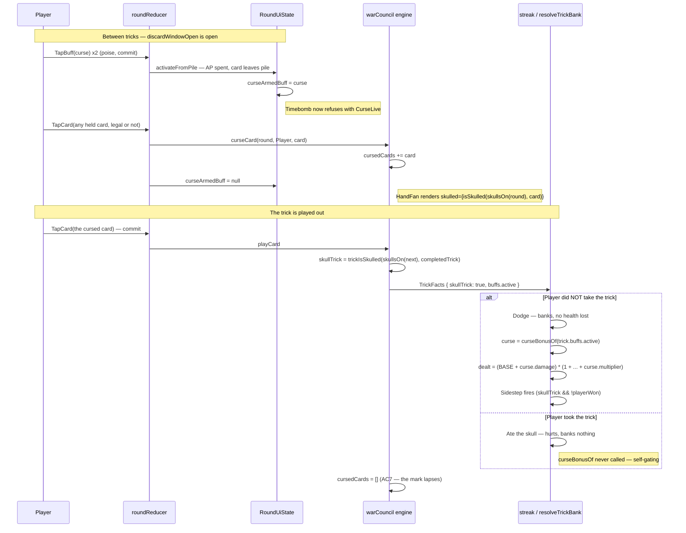

# Plan: Curse — an activated buff card that puts a skull on one of your own cards

Plan folder: `.claude/contract/DLR-167-curse-skull-your-own-card/`
Execution status: see `tasks.md` in this folder.

---

## Part 1 — Alignment

### Task reference

Jira **DLR-167** — *"Curse — an activated buff card that puts a skull on one of your own cards"* (Story, labels `playable` / `ui`). Moved `To Do → Planning` at the start of this run.

**Problem statement, verbatim from the ticket:**

> Skulls are only ever dealt to the Quarry, so the player has no way to create one. A skull inverts what winning a trick is worth: a trick with a skull in it is one you want to **lose**, because losing it is a **dodge** — it banks, and costs no health.
>
> **Curse** gives the player that lever. Activate it, tap one of your own cards, and that card carries a skull. Since a trick is a skull trick if _any_ card played into it is skulled, playing that card turns the trick into one you want to lose — so a card you were going to throw away becomes a trick that banks.
>
> This is the card the Timebomb was meant to be. It replaces the Timebomb, which is removed in DLR-166.
>
> Curse also gives **Sidestep** something to build around: Sidestep's condition is already "a skull trick you did not take", so a Curse-made dodge fires it automatically. The two combo, which is why Sidestep is being kept separate rather than repurposed into this card.

**Acceptance criteria, verbatim:**

1. **A new activated buff card, Curse**, minted from the slot machine exactly as Taker and Feeder are — a row in `TEMPLATE_FAMILIES` plus the type widening on the mintable kinds. It is **not** a shop purchase and **not** a carried charge, which is what the Timebomb was.
2. **Activated in the buff window that already exists** — the between-tricks window `discardWindowOpen` already opens, before any card is laid into the trick. **No new timing gate is built.** It carries a tiered action-point cost from the existing cost table, like every other activated card.
3. **Activating Curse then tapping a card in hand marks that card with a skull.** Marking is not a move, so a card that would be **illegal to play** may still be marked — the same allowance the Timebomb's priming had.
4. **The marked card shows the full skull card face in the player's hand**, identically to a skulled Quarry card: the skull replaces the card's picture, and the rank and suit stay readable in the corner because the trick is still won on those.
5. **The skull makes the trick a skull trick through the rule that already exists** — "a trick is a skull trick if any card played into it is skulled" — with no separate branch and no new outcome. Lose that trick and it is a **dodge**: it banks, and no health is lost. Win it and the skull is **eaten**, with the usual cost.
6. **Tier rewards: bronze +1 damage; silver +2 damage; gold +2 damage and +1 multiplier.** These feed the cursed trick's own damage terms, which is what makes the reward self-gating — a trick that hurts you banks nothing, so no separate "only on a dodge" condition is needed or written.
7. **The mark lasts for the coming trick and lapses at that trick's resolution.** It does not persist on an unplayed card into the next trick.
8. **Curse is spent on use and cannot be taken back off the trick**, matching Cheat — putting a skull on a card has already changed the felt. It still appears in the "riding this trick" list, saying so.
9. **Sidestep fires on a Curse-made dodge.** Owning both pays both, and a test covers exactly that combination.
10. **Sidestep's wording is corrected.** Its description no longer reads "dodge a skull with this card" — no buff attaches to a card; a buff rides the trick and is checked when that trick resolves. Its card face no longer reads `DODGE`, which collides both with the card's own name and with "dodge" as the name of a trick outcome.
11. `npm run typecheck`, `npm run lint`, `npm run format:check`, `npm test` and `npm run build` all pass; new behaviour is covered by tests, and component tests query by accessible role and label.
12. `.docs/game_rules/the-hunt.md` and the affected folders under `.docs/implementation/` are updated **by the** `implementation-doc-writer` skill, never by hand — a new rule in section 4 for Curse, and the skull-source claim in section 3 corrected, since skulls are no longer dealt only to the Quarry.

**Scope boundaries, verbatim.** In scope: the Curse card (template, tiers, activation, the skull mark, the skull card face in hand); rebuilding a card-in-hand targeting surface for it; correcting Sidestep's description and its card face text; the simulator learning Curse. Out of scope: renaming Sidestep itself; the DLR-165 vocabulary rename; retuning the tier figures; restoring any cut condition family or reward axis; any change to how the Quarry's own skulls are dealt or weighted.

**Developer decisions taken interactively, 2026-09-03:**

- **Sequencing (asked and answered at the start of this run):** DLR-167 is written as blocked by DLR-166, but DLR-166 is in `Planning` with an **empty contract folder** — no `plan.md`, no `tasks.md` — and the Timebomb is fully present on disk. The developer chose **build Curse now, alongside the Timebomb**. Curse copies the live targeting surface rather than recovering a deleted one from git history; the two cards coexist and each refuses while the other is armed; DLR-166 later deletes the Timebomb half and Curse's stands alone.
- **Skills confirmed:** `react-frontend` and `game-ux`. `implementation-doc-writer` was **unticked**, and correctly so — AC12 is still satisfied, because `CLAUDE.md` makes that skill a standing step of every `/fb-apply` run rather than something a plan schedules.

### Restated goal

Give the player a card that creates a skull, which today only the Quarry ever gets. Curse is drawn from the slot machine like any other card and activated in the ordinary between-tricks window; activating it re-points the next tap on a card in your hand so that the tap marks that card rather than plays it. The marked card then shows the same full skull face a skulled Quarry card shows, and because the engine already decides "this is a skull trick" by asking whether *any* card in the trick is skulled, playing the marked card flips that trick's meaning with no new rule and no new outcome: losing it becomes a dodge that banks and costs no health. The card pays a tiered damage bonus — and at gold a multiplier point as well — into that same trick's own damage figures, so the reward only ever arrives on a trick that banks. The mark is for the coming trick alone and lapses when that trick resolves, played or not. Alongside this, Sidestep's printed copy is corrected: it currently claims to attach to a card, which no buff in this game does.

### In scope

- A new `BuffKind.Curse`, cadence `Activated`, present in all three total `Record<BuffKind, …>` maps.
- A `curse` activated template in `ACTIVATED_TEMPLATES` so the slot machine can mint it at bronze / silver / gold, plus the `BuffActivatedTemplateKind` widening that makes it constructible.
- `curseBuff(tier, id)` in `buffCatalog.ts`, and a `CURSE_REWARD` tier table carrying Curse's **two** figures (damage, multiplier) — the shape `TIMEBOMB_DAMAGE` already establishes for a card with two figures.
- An AP price row for Curse in the existing `CONSUMABLE_AP_COST` table (AC2 — "from the existing cost table").
- Curse is single-use and non-revocable: a row in `ACTIVATED_CARD_SINGLE_USE`, and deliberate **absence** from `REVOCABLE_BUFF_KINDS` (AC8).
- A new `cursedCards: readonly Card[]` field on `RoundState`, with a `src/warCouncil/curse.ts` module (`isCursed`, `curseCard`, `uncurseCard`, `skullsOn`) mirroring `timebomb.ts`'s deliberate separation.
- The union read: every call site whose question is *"is this a skull trick"* or *"does this card show a skull"* reads `skullsOn(round)` instead of `round.skulledCards`, so AC4 and AC5 are one statement rather than fourteen.
- The lapse (AC7) as an engine invariant: `playCard` clears `cursedCards` when a trick resolves, after that trick's `skullTrick` is computed.
- Curse's two figures reaching the trick's damage terms by being **derived inside `resolveTrickBank`** from the buffs already riding that trick (`trick.buffs.active`), beside the existing `trickBonusFor(fired, …)` and `streakProtectionFor(fired)` derivations.
- The targeting surface: a `curseArmedBuff` field on `RoundUiState`, a `curseArmed` predicate, a `curseTapped` branch in `handleTapCard`, and mutual refusal between Curse and the Timebomb.
- `HandFan` learning the player's skulls so a cursed card renders the existing `skulled` card face (AC4). `HandFan` does not receive skull state today — this is the one genuinely new prop thread.
- Curse's rows in `BUFF_FAMILY_WORD` and `BUFF_CONDITION_SENTENCE`, and its payoff on the card face.
- Sidestep's copy correction (AC10) — its condition sentence and its `BUFF_EVENT_WORD` entry.
- The simulator learning Curse, so it can be measured.
- Tests: the mint, the tier figures, the mark, the skull-trick flip, the lapse, the Sidestep-on-a-Curse-dodge combination (AC9), the AP refusal, non-revocability, and the card face in hand queried by accessible role and label.

### Explicitly out of scope

- **Removing the Timebomb, the Blast Guard, or any delayed-damage machinery** — that is DLR-166's whole content, and this plan deliberately leaves all of it running.
- **Renaming Sidestep.** AC10 corrects its wording only; the ticket rules the rename out explicitly.
- **The Victory/Defeat and High/Low vocabulary rename** (DLR-165), which will rewrite the same Sidestep copy later.
- **Retuning any tier figure or price.** AC6's figures ship as specified; the ticket says they get tuned by playing.
- **Restoring any of the eight cut condition families or the two cut reward axes.**
- **Any change to how the Quarry's skulls are dealt or weighted across ranks.**
- **Generalising the Timebomb's and Curse's arming into one shared "a hand tap is claimed" concept.** Tempting, but DLR-166 deletes one of the two halves, so the generalisation would be built and then immediately halved.
- **Widening `BuffReward` to carry two values.** DLR-105 defers that deliberately; `CURSE_REWARD` follows `TIMEBOMB_DAMAGE`'s precedent instead.

### Pattern Reference

The brief names its own patterns and they are all live on disk:

- **The Timebomb's targeting surface** — `src/app/warCouncil/roundReducer.ts`'s `primeTapped` (its three guards and its "legality is deliberately NOT checked" note), `handleTapCard`'s ordering, `HandFan`'s `timebombArmed` prop, and `roundUiState.ts`'s `timebombArmed` / `timebombLive` predicates. The brief expected these to need recovering from git; they do not.
- **A two-figure activated card** — `TIMEBOMB_DAMAGE` and `timebombDamageOf` in `src/hunt/buffCatalog.ts`.
- **A separate per-card marker list** — `src/warCouncil/timebomb.ts` in full, including its docblock on why it shares no helper with `skulls.ts`.
- **The skull card face** — `src/app/warCouncil/PlayingCard.tsx`'s `skulled` branch and its `wc-is-skulled` class, which already hides the art window and keeps the corner index. AC4 needs no new rendering, only the state reaching the hand.
- **The plain-value trick seam** — `TrickFacts.baseDamageBonus` in `src/warCouncil/streak.ts` and its docblock ("a plain value handed in, never a run figure read").
- **A recent card-adding ticket end to end** — DLR-161 (Skull Helmet / Skull Tether), which is the closest precedent for widening the mintable pool and threading a new reward through.
- `.claude/skills/react-frontend/SKILL.md` and `.claude/skills/game-ux/SKILL.md` for conventions; not restated here.

### Constraints flagged on the brief

- **No new timing gate** (AC2) — Curse activates in `discardWindowOpen`'s existing window, and its AP price comes from the existing table.
- **No separate branch and no new outcome** (AC5) — the skull must flow through `trickIsSkulled`, not around it.
- **No explicit "only on a dodge" condition** (AC6) — the reward is self-gating by feeding the trick's own damage terms.
- **Marking is not a move** (AC3) — an illegal card is a legal target.
- **`src/hunt/` and `src/warCouncil/` are lint-enforced pure** — no React import, no DOM global. `eslint.config.js` enforces it; the Curse module and the tier tables all sit inside that boundary.
- **`src/sim/` is lint-enforced pure** and must learn Curse.
- **Determinism** — nothing in `src/hunt/` may call `Math.random()`; buff ids come from `RunState.nextBuffId`.
- **Tier figures are transcribed, not chosen** (AC6), and the ticket forbids retuning them here.
- **Component tests query by accessible role and label** (AC11).
- **400-line file budget**, measured with `(Get-Content <path>).Count` per `web-project.md`, which overrides `CLAUDE.md`'s `Measure-Object` form.

### Assumptions made

1. **Curse is an `ActivatedBuffTemplate`, not a `TEMPLATE_FAMILIES` row.** AC1 says "a row in `TEMPLATE_FAMILIES` plus the type widening on the mintable kinds", but `TEMPLATE_FAMILIES` generates **condition** templates — rows crossed by suit and reward axis, evaluated by `buffFires`. Curse is activated and has neither. The structurally equivalent thing for an activated card is a row in `ACTIVATED_TEMPLATES` plus widening `BuffActivatedTemplateKind`, which is exactly how Cheat and Timebomb are minted from the same slot machine. *Rationale: AC1's intent — "minted from the slot machine, not a shop purchase, not a carried charge" — is satisfied; only the table's name in the AC is wrong.* **This is the one place the plan does not do literally what an AC says, so it is the first thing to red-line if the reading is wrong.*
2. **Curse's two figures live in a `CURSE_REWARD` tier table, and `buff.reward` carries the damage half.** `BuffReward` is deliberately one axis and one value, and DLR-105 defers widening it. `TIMEBOMB_DAMAGE` already sets the precedent for a card whose payoff is a pair. *Rationale: the alternative is a type change the codebase has twice declined to make, for a single card.*
3. **Curse's damage and multiplier are DERIVED inside `resolveTrickBank` from `trick.buffs.active`, not handed in on `TrickFacts` and not routed through `BuffBonusAccrual`.** *Revised after the approval gate, 2026-09-03, with the developer's agreement.* The accrual is the hand's *running* total and carries across tricks, and `firedBuffs` excludes every `Activated` card from it by design — so that path is wrong. A new `TrickFacts` field was the plan's first answer and is also wrong, on two counts: it would need adding at ~49 construction sites, and it cuts against the decision already documented **in this exact function** for `streakProtectionFor` — "derived HERE, from the buffs this trick actually fired, rather than handed in on `TrickFacts` … passing it in would force the caller to evaluate the conditions a second time". The buffs riding the trick are already in scope at the point the damage is computed. *Rationale: one derivation, in the place the codebase has already argued this class of figure belongs, and no mechanical edit to 49 unrelated sites.*
4. **A new `cursedCards` list on `RoundState`, not an append to `skulledCards`.** `skulledCards`' own docblock states the invariant "written once by `dealRound` … so a skull cannot appear or vanish mid-hand", and AC7 requires exactly the vanishing that invariant forbids. A second list also makes the lapse trivially correct: you cannot tell a dealt skull from a Curse skull inside one list. *Rationale: preserves a documented engine invariant and makes AC7 a one-line clear.*
5. **The union is read through one new `skullsOn(round)` helper, and the readers are converted.** With two lists, every existing `round.skulledCards` reader is a place the skull could silently fail to show or fail to count. One helper plus a converted reader set is greppable and provable; fourteen ad-hoc unions are not. *Rationale: this is the single highest-risk part of the change, and it is contained by making it mechanical.*
6. **Two readers deliberately keep reading `skulledCards` alone: `cpuPlayer.ts`'s card choice and `suitShape`'s Quarry-shape readout.** Both reason about *the Quarry's own dealt skulls* — what the Quarry knows, and what the player is shown about the Quarry's hand. A skull the player just put on their own card is neither. *Rationale: the union would be harmless here today (both filter to the Quarry's hand) but wrong in meaning, and a future hand-swap path would make it wrong in fact.*
7. **The lapse is done in `playCard`, at trick resolution, by clearing the whole list.** This covers both branches of AC7 — the cursed card was played, or it was not — with no fuse counter and no per-card bookkeeping. *Rationale: the Timebomb needed a fuse because its mark lasted several tricks; Curse's lasts exactly one, so the simpler mechanism is also the correct one.*
8. **Curse and the Timebomb refuse each other while either is armed**, reusing the existing `TimebombLive` refusal shape with a Curse sibling. *Rationale: both re-point the next hand tap, and allowing both armed at once makes that tap ambiguous — `handleToggleLoadout`'s own stated rule.*
9. **Curse is non-revocable by being absent from `REVOCABLE_BUFF_KINDS`** (AC8), which is the existing mechanism and needs no new code. It still appears in the riding list, which `buffRideModel` already builds from `activatedThisTrick`.
10. **Sidestep's corrected copy** reads `'a skull trick you do not take'` for its condition sentence and `'SKULL LOSS'` for its event word. AC10 states what the copy must **stop** saying, not what it must start saying; these follow the mechanical-axis vocabulary `BUFF_EVENT_WORD`'s own docblock mandates. **Copy is the developer's call** — flagged in Risks, not treated as settled.
11. **The simulator learns Curse as an available activation in the buff window**, mirroring how `fixtures.ts` drives a Timebomb through `TapBuff` twice; it is not given a new judgement policy. *Rationale: "so it can be measured" is the ticket's stated goal; teaching a policy *when* to Curse is a tuning question the ticket does not ask for.*

### Config and persisted-shape audit

Run against the live tree on 2026-09-03. Every count below is quoted from what the command printed.

- **`Record<BuffKind, …>` total maps — exactly 3, plus 1 test.** `grep -rn "Record<BuffKind" src/ --include=*.ts --include=*.tsx | grep -v Partial` returned 4 hits: `src/hunt/buffs.ts:178` (`BUFF_CADENCE`), `src/app/warCouncil/buffLabels.ts:22` (`BUFF_FAMILY_WORD`), `src/app/warCouncil/buffLabels.ts:52` (`BUFF_CONDITION_SENTENCE`), and `src/hunt/__tests__/buffs.test.ts:175` (a comment, not a map). Adding `BuffKind.Curse` **fails to compile at all three maps**, which is the designed behaviour — all three are in one task's file list.
- **Persisted shape — `ACTIVATED_TEMPLATES` ids are on disk and the format is frozen.** `ConditionBuffTemplate.id`'s docblock records that DLR-113 persists template ids in the Vault, and `ActivatedBuffTemplate`'s says `'cheat'` and `'timebomb'` "are frozen the moment they ship". Adding `'curse'` is **additive** — a new id, no rename — so no `SAVE_SCHEMA_VERSION` bump is required and no saved grant is orphaned. `reconcileVault` already drops an unresolvable id rather than corrupting, which covers a save written by this build and read by an older one. `.claude/rules/save-data-versioning.md`'s six reject conditions are checked below and none is tripped: no `localStorage` call outside `browserStorage.ts`, no hand-composed key, no bare payload, no incompatible shape change, no `as T` cast, no swallowed read failure.
- **`RoundState` full construction sites — 21, against 64 files that merely name the type.** `grep -rn "drawSeed:" src/ --include=*.ts --include=*.tsx | grep -v readonly` returned **21** — `drawSeed` is a required field nothing overrides partially, so it is the honest proxy for a complete literal. By contrast `grep -rl "RoundState" src/` returned **64 files**, and `grep -rn "skulledCards:"` returned **45 lines** (inflated by `Partial<RoundState>` overrides in `stateWith(…)` helpers). **21 is the real number**, and adding a required `cursedCards` field breaks every one of them at `tsc`. All 21 belong in one task's file list; most are a single base literal per test file, several of which are reached through `makeRound` (`src/app/warCouncil/__tests__/roundFixture.ts`) and `stateWith` (per-file helpers), so the edit is one line each.
- **`.skulledCards` readers — 26 lines, 20 outside tests.** `grep -rn "\.skulledCards" src/` returned **26**. The 20 non-test hits break down as: **13 to convert** to `skullsOn` (`buffRideModel.ts:115,117`; `cardDamage.ts:104`; `commitHandlers.ts:186`; `roundControlsProps.ts:126,183,190,216`; `trickConsequenceModel.ts:146`; `playCard.ts:125`; `sim/playHand.ts:200`; `sim/skilledCardPlay.ts:153,302,310`), **6 deliberately left alone** (Assumption 6 — `WarCouncilTable.tsx:154`, `sim/skilledCardPlay.ts:81,267,283`, `cpuPlayer.ts:66`, and `deal.ts`'s write), and **1 a docblock reference** (`resolutionView.ts:23`). The count of 13 + 6 + 1 = 20 matches the 20 non-test hits printed.
- **`TrickFacts` — 49 construction sites, and the plan touches NONE of them.** `grep -rn "baseDamageBonus:" src/ | grep -v readonly` returned **49**. That number is why the plan's first design — a new required `curseBonus` field on `TrickFacts` — was dropped after the approval gate in favour of deriving the figure inside `resolveTrickBank` from `trick.buffs.active`, which is already in scope there. This is the Step 1.6 check-7 finding that actually changed the design rather than merely sizing a task.
- **No string-bound name is renamed by this plan.** Every identifier it introduces (`curse`, `cursedCards`, `curseBonus`, `CurseLive`) is new. `grep -rn "cursedCards\|BuffKind.Curse\|curseBonus" src/` returns **0 hits** — nothing to collide with. No `data-testid`, CSS class, or `aria-*` id is renamed; `wc-is-skulled` is reused unchanged, which is the point of AC4.
- **Boundary greps clean.** `src/hunt/**` and `src/warCouncil/**` are lint-enforced React-free and DOM-free (`eslint.config.js`, per `web-project.md` → Architectural boundaries). Every new pure artefact — `curse.ts`, `CURSE_REWARD`, `curseBonusOf`, the `CONSUMABLE_AP_COST` row — sits inside that boundary and imports nothing from `react` or the DOM. `src/sim/**` likewise.

---

## Part 2 — Technical design

### Approach

The change has a **pure engine half** and a **felt half**, and the whole design is arranged so the engine half carries every rule and the felt half carries only "which card did you tap".

**The engine half.** `RoundState` gains `cursedCards: readonly Card[]`, and a new `src/warCouncil/curse.ts` owns it — `isCursed`, `curseCard`, `uncurseCard`, and the union reader `skullsOn(round)`. That module is a deliberate sibling of `timebomb.ts`, which opens with the note that two markers sharing a helper is how they stop being separate; Curse and the dealt skull are the opposite case — they are the *same* marker from two sources, so `skullsOn` is where they are made one, once, and `isSkulled` / `trickIsSkulled` keep their existing plain-list signatures untouched. Every call site whose question is "is this a skull trick" or "does this card show a skull" is converted to pass `skullsOn(round)`; the six sites that reason specifically about the *Quarry's dealt* skulls keep reading `skulledCards` and gain a one-line comment saying why. AC5 then needs no code at all: `playCard.ts:125` already computes `skullTrick: trickIsSkulled(…, completedTrick)`, and once it reads the union, a cursed player card flips the trick with no new branch, no new outcome, and no change to `trickOutcomeFor`. AC7 is one line in the same place — `playCard` clears `cursedCards` on the state it returns after the trick resolves, which covers "the cursed card was played" and "it never was" identically and needs no fuse counter.

The alternative shapes were both rejected for stated reasons. **Appending to `skulledCards`** would make AC5 and AC4 free but breaks that field's own documented invariant ("a skull cannot appear or vanish mid-hand") and, worse, makes AC7 unimplementable — inside one list there is no way to tell a dealt skull from a Curse skull, so nothing knows what to lift. **Keeping the mark on `RoundUiState`** would spare all 21 `RoundState` literals, but the engine is what decides `skullTrick`, so the app layer would have to hand the fact down into `playCard` on every call — reintroducing exactly the two-sources-of-truth split `buffTrickFactsFor` exists to prevent.

**The reward.** AC6 gives Curse two figures at gold, and `BuffReward` is deliberately one axis and one value. Rather than widen it — a type change DLR-105 defers on purpose — Curse follows the `TIMEBOMB_DAMAGE` precedent: a `CURSE_REWARD: Record<BuffTier, CurseBonus>` table in `buffCatalog.ts`, with `buff.reward` carrying the damage half as its headline figure and `curseRewardOf(buff)` returning the pair, throwing on a non-Curse for the same reason `timebombDamageOf` does. Those two figures are then **derived where the trick's damage is computed**, not handed in: `resolveTrickBank` already holds `trick.buffs.active` — the buffs activated for this trick, which is exactly what a riding Curse is — and already derives two comparable figures from it locally, `trickBonusFor(fired, false)` and `streakProtectionFor(fired)`. A new `curseBonusOf(active)` joins them, and the banked branch becomes `base = BASE_DAMAGE + safeBonus(trick.baseDamageBonus) + safeBonus(curse.damage)` with `buffMult = 1 + bonus.multiplierBonus + bonus.overlapBonus + safeBonus(curse.multiplier)`. AC6's self-gating then falls out for free: only a **banked** trick computes `dealt` at all, so a Curse played into a trick that hurts you pays nothing, with no "only on a dodge" condition written anywhere.

Two alternatives were rejected, and the second only after the approval gate. Routing Curse through **`BuffBonusAccrual`** fails because that accrual is the *hand's running* total and would carry a one-trick bonus into later tricks, and because `firedBuffs` excludes every `Activated` card from it by design. Handing it in on a new **`TrickFacts.curseBonus`** field — this plan's own first answer — fails for the reason `streakProtectionFor`'s docblock gives three lines above the fold: a figure that depends on the buffs riding the trick, when those buffs are already in scope here, must not be passed in, because the caller would have to evaluate them a second time. It would also have required adding the field at ~49 construction sites for no gain.

**The felt half.** Activation is entirely existing machinery: Curse is an `ActivatedBuffTemplate`, priced in `CONSUMABLE_AP_COST`, activated through the same two-tap loadout row every other card uses, single-use via `ACTIVATED_CARD_SINGLE_USE`, and non-revocable simply by *not* appearing in `REVOCABLE_BUFF_KINDS` — AC8 is an omission, not a feature. The one genuinely new thing is targeting. `RoundUiState` gains `curseArmedBuff: Buff | null`; `curseArmed(state)` is its predicate; `handleTapCard` gains a `curseTapped` branch placed beside the Timebomb's, sharing its two load-bearing properties — it is **not** `canAct`-gated (the window can be open when the player is not next to move) and it deliberately **does not check legality**, because marking is not a move. Curse and the Timebomb refuse each other through a `CurseLive` sibling of the existing `TimebombLive` refusal, since both re-point the same tap. When DLR-166 removes the Timebomb, its half of every one of these pairs deletes cleanly and Curse's stands alone — which is why the two are built as parallel narrow paths rather than generalised into one shared concept that would immediately be halved.

**The card face (AC4).** Nothing new is rendered. `PlayingCard` already takes `skulled` and already hides the art window while keeping the corner index — its own comment says the skull replaces the art precisely so "the trick is still won on those". The gap is that `HandFan` has never been told about skulls at all: it receives `primedCards` but not `skulledCards`, because until now the player could never hold one. So `HandFan` gains a `skulledCards` prop threaded from `roundControlsProps`, passing `skullsOn(ui.round)`, and sets `skulled={isSkulled(skulledCards, card)}` on each card. Per `game-ux`, the state must read without colour or motion alone — it does, because the skull is a shape that replaces the artwork, and it is on the card's own face rather than behind hover. The tap cost of the most repeated action is unchanged: arming Curse is two taps in the loadout panel (poise, commit) exactly like every other card, and marking is one tap on the card itself, with the confirmation on the object rather than at a distant button.

### Skills to invoke during execution

- **`react-frontend`** — owns everything under `src/`: the reducer branch and its guards, the `RoundUiState` field, the `HandFan` prop thread, the pure tier tables and predicates, the 400-line budget, and the Vitest posture. Confirmed by the developer.
- **`game-ux`** — owns the targeting interaction and the card face in hand: the tap count on arming and marking, that the skull reads without colour alone, that nothing a decision needs sits behind hover, and that `HandFan`'s roving tabindex still admits a card that is illegal to play but legal to mark. Confirmed by the developer.

**Developer override, recorded:** `implementation-doc-writer` was offered and **unticked**. AC12 is nonetheless satisfied — `CLAUDE.md` makes that skill a standing step of every `/fb-apply` run ("updated on every `/fb-apply` run, never by hand"), so it is not a plan-scheduled task. `game-designer` was offered and declined, correctly: no tier figure is being chosen here.

**Rule files the executor must Read:** `.claude/rules/README.md` and `.claude/rules/save-data-versioning.md` (the template-id persistence question the audit clears above).
**Always:** `.claude/workflow/web-project.md`.

### Diagram



### Data shapes

#### `src/hunt/buffs.ts`

```ts
export const BuffKind = {
  // …existing members unchanged…
  /** DLR-167 — the player's own skull. An Activated card: no trigger, so no `buffFires` case. */
  Curse: 'curse',
} as const

export const BUFF_CADENCE: Readonly<Record<BuffKind, BuffCadence>> = {
  // …existing rows unchanged…
  [BuffKind.Curse]: BuffCadence.Activated,
}
```

#### `src/hunt/buffCatalog.ts`

```ts
/** Curse's two figures at one tier. A PAIR, not one number, for `TimebombDamage`'s stated reason:
 *  `BuffReward` is deliberately one axis and one value (DLR-105), and widening it for one card is
 *  a type change this codebase has twice declined to make.
 *  UNIT: `damage` in damage points added to the cursed trick's base; `multiplier` in multiplier
 *  points added to that trick's `buffMult`. */
export interface CurseBonus {
  readonly damage: number
  readonly multiplier: number
}

/** DLR-167 AC6, TRANSCRIBED verbatim ("bronze +1 damage; silver +2 damage; gold +2 damage and
 *  +1 multiplier"), not chosen here. The ticket forbids retuning these in this contract. */
export const CURSE_REWARD: Readonly<Record<BuffTier, CurseBonus>> = {
  [BuffTier.Bronze]: { damage: 1, multiplier: 0 },
  [BuffTier.Silver]: { damage: 2, multiplier: 0 },
  [BuffTier.Gold]: { damage: 2, multiplier: 1 },
}

export function curseBuff(tier: BuffTier, id: BuffId): Buff
/** THROWS on a buff of any other kind, exactly as `timebombDamageOf` does and for its reason. */
export function curseRewardOf(buff: Buff): CurseBonus
```

`curseBuff` mints `{ id, kind: BuffKind.Curse, tier, condition: ACTIVATED_BUFF_CONDITION, reward: { axis: BuffRewardAxis.Magnitude, value: CURSE_REWARD[tier].damage } }` — the damage half as the headline figure, mirroring `timebombBuff` carrying the Quarry half.

#### `src/hunt/buffTemplates.ts`

```ts
export type BuffActivatedTemplateKind =
  | typeof BuffKind.Cheat
  | typeof BuffKind.Timebomb
  | typeof BuffKind.Curse   // DLR-167 — the widening that makes Curse constructible

export const ACTIVATED_TEMPLATES: readonly ActivatedBuffTemplate[] = [
  { form: 'activated', id: 'cheat', kind: BuffKind.Cheat },
  { form: 'activated', id: 'timebomb', kind: BuffKind.Timebomb },
  // PERSISTED id — additive, never renamed. See plan.md Part 1 → audit.
  { form: 'activated', id: 'curse', kind: BuffKind.Curse },
]
```

`mintFromTemplate`'s activated branch becomes a three-way narrowing over `template.kind` rather than a `Cheat ? … : …` ternary, so a fourth activated kind fails to compile there rather than silently minting a Timebomb. `BUFF_TEMPLATE_COUNT` moves **18 → 19**.

#### `src/hunt/buffCosts.ts` and `src/hunt/consumables.ts`

```ts
export type BuffConsumableKind = /* …existing eight… */ | typeof BuffKind.Curse

// AC2 — "a tiered action-point cost from the existing cost table". These three figures are a
// DEVELOPER DECISION; see Risks and judgement calls.
export const CONSUMABLE_AP_COST = {
  // …existing rows unchanged…
  [BuffKind.Curse]: { [BuffTier.Bronze]: 2, [BuffTier.Silver]: 3, [BuffTier.Gold]: 4 },
}

export type ActivatedItemKind = /* …Cheat | Timebomb | Shield… */ | typeof BuffKind.Curse
export const ACTIVATED_CARD_SINGLE_USE = {
  // …existing rows unchanged…
  [BuffKind.Curse]: true,   // AC8 — spent on use
}
```

Curse is **deliberately not added** to `REVOCABLE_BUFF_KINDS` in `buffActivation.ts` — that absence is AC8's "cannot be taken back off the trick".

#### `src/hunt/buffActivation.ts`

```ts
export const BuffActivationRefusal = {
  // …existing members unchanged…
  /** DLR-167 — a Curse is armed and waiting for a hand card. Refuses a Timebomb (and a second
   *  Curse) for `TimebombLive`'s reason: both re-point the next hand tap, and two armed at once
   *  makes that tap ambiguous. */
  CurseLive: 'curseLive',
} as const

export interface BuffActivationStock {
  // …existing fields unchanged…
  readonly curseLive: boolean
}
```

Refusal order becomes `NoEffectYet → WindowClosed → TimebombLive → CurseLive → AlreadyActive → InsufficientAp`.

#### `src/warCouncil/types.ts`

```ts
export interface RoundState {
  // …existing fields unchanged…
  /** DLR-167 AC3/AC7 — cards the player has cursed for the COMING TRICK. Unlike `skulledCards`
   *  above, which is written once by `dealRound`, this list is written mid-hand by `curseCard`
   *  and CLEARED by `playCard` at every trick's resolution — the mark is for one trick and lapses
   *  whether or not the card was played. `skullsOn` is the ONE place this and `skulledCards` are
   *  read as one; nothing else unions them. */
  readonly cursedCards: readonly Card[]
}
```

#### `src/warCouncil/curse.ts` (new)

```ts
export function isCursed(cursedCards: readonly Card[], card: Card): boolean
/** THROWS when the card is not in `side`'s hand or is already cursed — `primeCard`'s discipline
 *  and its reason: the reducer guards both before calling, because a reducer must not throw. */
export function curseCard(state: RoundState, side: PlayerSide, card: Card): RoundState
/** `curseCard`'s mirror. THROWS when the card is not cursed. */
export function uncurseCard(state: RoundState, card: Card): RoundState
/** AC4/AC5 — every card that SHOWS A SKULL and makes a trick a skull trick, from both sources.
 *  THE single union; `isSkulled` and `trickIsSkulled` keep their plain-list signatures and are
 *  called with this. Readers that mean "the Quarry's own dealt skulls" — `cpuPlayer`'s choice and
 *  `suitShape`'s readout — deliberately do NOT call this. */
export function skullsOn(state: Pick<RoundState, 'skulledCards' | 'cursedCards'>): readonly Card[]
```

#### `src/hunt/buffAccrual.ts`

```ts
/** DLR-167 AC6 — the two figures the Curses riding THIS trick pay into it, summed. Reads the
 *  ACTIVATED set, not the fired set: a Curse is `BuffCadence.Activated` and so is excluded from
 *  `firedBuffs` by design, and its payoff is owed for the trick it was activated for rather than
 *  for a condition coming true. Returns a zero pair when no Curse is riding — a real answer, and
 *  the only honest zero here, since "no Curse" genuinely pays nothing. */
export function curseBonusOf(active: readonly Buff[]): CurseBonus
```

#### `src/warCouncil/streak.ts`

**No `TrickFacts` change.** `resolveTrickBank`'s banked branch gains two terms, derived locally from the `trick.buffs.active` it already holds — beside the existing `trickBonusFor(fired, false)` and `streakProtectionFor(fired)`:

```ts
const curse = trick.buffs === null ? EMPTY_CURSE_BONUS : curseBonusOf(trick.buffs.active)
const base = BASE_DAMAGE + safeBonus(trick.baseDamageBonus) + safeBonus(curse.damage)
const buffMult = 1 + bonus.multiplierBonus + bonus.overlapBonus + safeBonus(curse.multiplier)
// `dealt` is unchanged in shape: (base + bonus.flatDamageBonus) * buffMult
```

`TrickDamage`'s existing `base` and `buffMult` fields therefore already carry Curse's contribution to the resolution screen with no new field there either.

#### `src/app/warCouncil/roundUiState.ts`

```ts
export interface RoundUiState {
  // …existing fields unchanged…
  /** DLR-167 AC3 — the Curse that has been PAID FOR and is waiting for a hand card, or `null`.
   *  Mirrors `timebombArmedDamage`'s role; holds the `Buff` itself because `curseRewardOf` needs
   *  the tier when the cursed trick resolves. */
  readonly curseArmedBuff: Buff | null
}

export function curseArmed(state: RoundUiState): boolean   // curseArmedBuff !== null
export function curseLive(state: RoundUiState): boolean    // curseArmed || cursedCards.length > 0
```

#### `src/app/warCouncil/HandFan.tsx`

```ts
interface HandFanProps {
  // …existing props unchanged…
  /** DLR-167 AC4 — the cards in this hand that show a skull, from `skullsOn(round)`. Passed
   *  rather than derived, exactly as `primedCards` and `legal` are. */
  readonly skulledCards: readonly Card[]
  /** DLR-167 AC3 — a Curse is armed, so a hand-card tap MARKS rather than plays, and every held
   *  card is a valid target INCLUDING one illegal to play. Mirrors `timebombArmed`. */
  readonly curseArmed: boolean
}
```

#### Copy

```ts
// buffLabels.ts
BUFF_FAMILY_WORD[BuffKind.Curse] = 'Curse'
BUFF_CONDITION_SENTENCE[BuffKind.Curse] = 'put a skull on a card in your hand'
// AC10 — no buff attaches to a card; a buff rides the trick. DEVELOPER COPY CALL, see Risks.
BUFF_CONDITION_SENTENCE[BuffKind.Sidestep] = 'a skull trick you do not take'
BUFF_EVENT_WORD[BuffKind.Sidestep] = 'SKULL LOSS'   // was 'DODGE'
```

No `package.json`, `tsconfig.json`, `vite.config.ts`, or `eslint.config.js` change. No new dependency. No `SAVE_SCHEMA_VERSION` bump (the audit above establishes the template-id addition is additive).

### Runtime quality notes

- **Purity and adjudication.** Everything that decides anything is pure and DOM-free: `curse.ts`, `CURSE_REWARD`, `curseRewardOf`, the AP row, the refusal order, and `resolveTrickBank`'s fold all sit inside the lint-enforced `src/warCouncil/**` and `src/hunt/**` boundary, and each is unit-testable with no renderer. No component decides anything — `HandFan` receives `skulledCards` and `curseArmed` as answers and computes neither, matching how it already takes `legal` from the engine rather than comparing suits. Every figure Curse pays is read from `CURSE_REWARD`, never a literal at a call site; the three AP prices are named constants routed to the developer rather than invented as inline numbers.
- **Effects, mount and teardown.** **No effect, listener, observer, timer, `requestAnimationFrame`, or `AbortController` is added by this plan.** The whole change is reducer transitions and render-from-props: `HandFan` uses no lifecycle effect of any kind today and gains none, and `curseArmedBuff` lives in reducer state, not in a ref or module scope. StrictMode double-invocation is therefore inert here — there is nothing non-idempotent to run twice — and there is no module-level mutable state to reset. `PlayingCard`'s existing `useId` is untouched.
- **Hot-path cost.** `skullsOn` allocates one concatenated array per call, and its callers run **once per trick resolution or once per render**, not per pointer event. The one per-card path is `HandFan`'s `isSkulled(skulledCards, card)` inside the existing map — an array scan over a hand of at most six against a list of at most a handful, identical in shape to the `isPrimed` call already sitting on the same line. `cursedCards` holds at most one card in practice. No memoisation is added and none is justified: there is no profiling evidence, and `react-frontend` forbids speculative `useMemo`.
- **Determinism and numeric safety.** Nothing here calls `Math.random()`; Curse's id comes from `RunState.nextBuffId` like every other minted buff, and `CURSE_REWARD` is a static table, so a seeded run stays reproducible. **No division is introduced anywhere**, so no `NaN` can reach a rendered value from this change. Every figure is a small integer and every product in `resolveTrickBank` stays exact. `safeBonus` — the existing clamp that floors a non-positive bonus at 0 — is applied to both Curse figures, so a mistyped negative in the tier table cannot subtract from a trick's damage.
- **Error paths.** `curseCard` and `uncurseCard` **throw** on a card not in hand / already cursed / not cursed, matching `primeCard`'s stated discipline — a silent no-op would let the player spend a card for a mark that was never made. The reducer guards both conditions **before** calling, because a throw during an event handler unmounts the tree, and on a failed guard it clears `curseArmedBuff` rather than half-applying, so the player is never left armed with no visible cause. `curseRewardOf` throws on a non-Curse rather than returning a plausible small integer, for `timebombDamageOf`'s reason. A refused activation is refused **by a named reason code** (`CurseLive`) that reaches the row's disabled state through the same single `buffActivationRefusalFor` both the guard and the UI read, so an invalid activation cannot commit and its rejection names why. **No new async surface is introduced**, so the four async states do not arise; nothing catches an error into a success shape.

### Risks and judgement calls

- **Curse is added to `ACTIVATED_TEMPLATES`, not `TEMPLATE_FAMILIES`, contradicting AC1's literal wording.** `TEMPLATE_FAMILIES` generates condition cards crossed by suit and reward axis and evaluated by `buffFires`; Curse is activated and has neither. This is the one deliberate departure from an AC in the plan — red-line it here if the reading is wrong.
- **The three action-point prices for Curse are a tuning value nobody has chosen.** AC2 says "from the existing cost table", but that table has no Curse row and `apCostOf` throws on an unpriced kind, so a row is forced by the type system — the choice can only be made visibly or invisibly. The plan proposes `{ bronze: 2, silver: 3, gold: 4 }`, copied from Shield's ladder shape, and flags it as **the developer's number**. Note the tension worth pricing against: unlike every other card, a misread Curse costs the card, the points **and** the whole streak at once.
- **Sidestep's replacement copy is a developer call.** AC10 says what the wording must stop saying, not what it should start saying. The plan proposes `'a skull trick you do not take'` and `SKULL LOSS`; both are visual/copy judgement, and DLR-165 will rewrite them again.
- **Building alongside a live Timebomb creates a merge surface with DLR-166.** Confirmed by the developer at the top of this run, and the design minimises the cost — every Curse/Timebomb pair is two parallel narrow paths, so DLR-166 deletes one side of each rather than untangling a shared abstraction. The residue DLR-166 will need to remove is small and named: the `TimebombLive` refusal, `timebombArmed`/`timebombLive`, and the Timebomb branch of `handleTapCard`.
- **Twenty-one `RoundState` literals break at once when `cursedCards` becomes required.** This is the plan's largest mechanical risk and the audit's headline number. It is contained by being one task with all 21 files listed, and the phase does not close until `npm run typecheck` is clean — but a miscount here is a phase boundary where the app does not compile, so the executor should trust `tsc`'s list over the plan's.
- **Six `skulledCards` readers are deliberately left un-unioned.** If that call is wrong, the symptom is subtle: the Quarry would start reasoning about a skull the player just created, or the Quarry-shape readout would count a player's card. The plan's reading is that both are about the Quarry's *dealt* skulls. Worth a sanity-check at the gate.
- **Only judgeable by playing:** whether the skull face on a card you are holding reads as *yours* rather than as a card you have somehow been dealt; whether arming Curse and then tapping a card feels like one action or two; whether the "wasted Curse" case the ticket flags — cursing into a trick whose Quarry card was already skulled — reads as friction or as a feel-bad. QA can confirm the mark appears, the trick flips to a dodge, and the console is clean; none of the three above has a right answer it can check.
