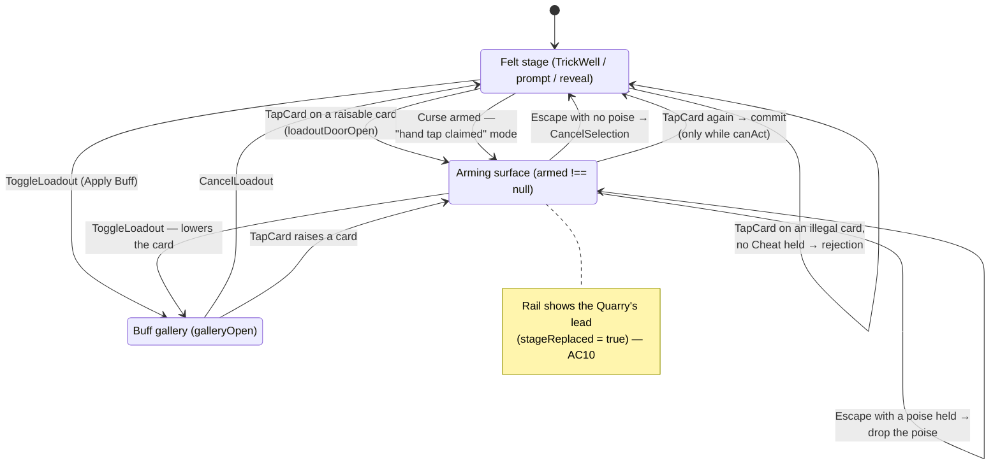

# Plan: Arm buffs from the card you are about to play

Plan folder: `.claude/contract/DLR-174/`
Execution status: see `tasks.md` in this folder.

---

## Part 1 — Alignment

### Task reference

Jira **DLR-174** — "Arm buffs from the card you are about to play" (Story, under epic DLR-147 "Full UI pass"), labels `playable`, `ui`. Moved `To Do → Planning` at the start of this run.

**Problem statement (verbatim from the ticket):**

> Arming a buff and choosing a card are two unrelated acts. The player opens Apply Buff, reads a list of every buff they hold, and decides which to arm — with no reference to the card they are about to play. Because a buff is armed for the trick and checked when that trick resolves, most of that list is irrelevant to whatever card the player has in mind: a Bells Suit High buff cannot pay if they are about to play a Moons card. The player does that filtering in their head, every trick, from card text alone.
>
> It also costs more taps than it should. Playing a card with a buff on it is five taps today — open Apply Buff, poise, arm, close, then two on the card — and the arming half happens without the card in view.
>
> The proposal inverts the order. The player picks the card first; the surface then shows only the buffs that could actually pay on that card, with that card's live win/lose figures above them. The cost falls to four taps, and — the load-bearing property — **playing a card with no buff still costs exactly two**. The surface appears on the raise tap the player was already making, so it is free unless used. If it ever adds a tap to the plain case, the design has failed.

**User story:** As a player choosing what to play, I want to select a card and see only the buffs that could pay if I play it, so that arming is a decision about this trick rather than a memory test across my whole holding.

**Acceptance criteria (verbatim, numbered as the ticket numbers them):**

1. Tapping a card in hand raises it and opens the arming surface in the felt-stage region — the same region `BuffGallery` already occupies when it replaces the stage. The selected card renders as a thumbnail pinned at the head of that surface, so it is unambiguous which card the list is filtered against.
2. The surface lists only buffs whose condition could still come true if the selected card is played this trick, and omits every buff that could not. A Bells card lists the Bells cards; it does not list the Moons or Keys equivalents. The filter is derived from `projectBuffBranches` in `src/warCouncil/buffProjection.ts` — the function the existing hand lights already use — never from a second table of conditions.
3. "Could pay" includes "might pay". While the player leads, the Quarry's card is face down, so a skull-reading buff lands in the projection's indeterminate set; it is listed and marked as possibly firing. Reporting nothing for a buff that may well pay reads as "this buff is dead" at the exact moment the player is deciding.
4. The head of the surface shows the selected card's win/lose damage with everything currently armed folded in, and those figures update the moment a buff is armed or taken back off. The hand's own per-card W/L readouts and the pot's "this trick adds" figure update in the same transition.
5. Arming stays gated on the existing window rule, unchanged: `buffActivationWindowOpen` in `src/app/warCouncil/roundUiState.ts` gives Cheat the `canAct` window and every other card the `discardWindowOpen` (between-tricks) one. Between tricks the surface offers the full filtered set; once the Quarry has led it offers a held Cheat and nothing else, and says so on its face.
6. Because arming closes before the Quarry's lead is visible, no skull-condition buff can be armed in response to seeing a skull on the table. Verify this is enforced by the window the surface reads, not by convention.
7. Tapping an off-suit card after the Quarry has led, **while holding a Cheat**, is a lock rather than a refusal. The surface offers that Cheat and states that arming it makes the card playable; arming it widens the legal set and the card becomes tappable to play. This is the case the ticket exists for and it must not be collapsed into the refusal below.
8. Tapping an off-suit card after the Quarry has led while holding **no** Cheat gives a rejection animation on the card and puts "No valid cards to play" in the surface's head, with the reason (follow-suit binds while you hold the led suit) and the remedy (a Cheat breaks it, and you are not holding one).
9. An illegal card must therefore stop being a `disabled` button in `HandFan`. A disabled button cannot be clicked, cannot take focus, and cannot refuse — so it can neither shake nor be reached by keyboard. It becomes enabled-but-refusing, and the roving tabindex's focusability predicate widens to match.
10. While the surface holds the felt stage, the Quarry's led card is shown on the felt rail, so the player can see the lead they are answering. `feltRailProps` already does exactly this for the open gallery (`trick: galleryOpen ? ui.round.currentTrick : null`); this reads that same seam rather than adding a second one.
11. While a **Curse** is armed, a hand tap marks a card and the arming surface does not open. The surface states that the tap is claimed and that one tap ends the mode — the mode is announced in words, never signalled by the surface merely being empty.
12. Arming from the surface keeps the existing two-tap shape and its misclick guard, the panel stays open so more than one buff can be armed for the same trick, and an armed buff can still be taken back off before the card is committed. A "riding this trick" strip at the foot lists what is armed with a remove control per row, and renders nothing at all when nothing is riding.
13. Keyboard: the buff list is one roving-tabindex group, arrow keys move within it, Enter/Space activates. `Escape` unwinds one level — it drops an unspent poise first, and clears the card selection on the second press. The hand keeps its own roving tabindex.
14. Every state is distinguishable without colour or motion alone (armed and poised differ in frame and badge as well as tone; the window statement differs by border style), and the greyscale screenshot is actually taken.

**Design assets:** the ticket records a developer annotation over the live fight screen (2026-09-04) and an interactive HTML mockup built and driven in a browser in the same session. That mockup is already on disk at `.claude/contract/DLR-174/mockup.html` (48KB, four states, live win/lose propagation, checked at 1920×960 and 1366×720). It is carried forward as this contract's layout reference and cited by the tasks that build each surface.

**Developer decides (from the ticket):** the buff-card size bound on this surface; the rejection animation's duration; whether listing a skull-reading buff on every card while the player leads (AC3) reveals more than intended.

### Restated goal

Today the player arms a buff and chooses a card as two disconnected acts: the Apply Buff button opens a gallery of everything they hold, they arm from it blind, close it, and only then pick a card. This ticket inverts that order. Tapping a card in hand raises it *and* replaces the felt stage with a small arming surface: the raised card pinned at its head with that card's live win/lose figures, and beneath it only those buffs that could still pay if this card is played this trick — including the ones that *might* pay, because while the player leads the Quarry's card is face down and a skull-reading buff genuinely has not been ruled out. Arming from that surface uses the same two-tap poise-then-confirm shape the gallery already has, the surface stays open so several buffs can ride one trick, and a second tap on the card plays it. A plain card with no buff therefore still costs exactly two taps, which is the property the whole design is judged on.

Three states hang off the same surface. Between tricks it offers the full filtered set. Once the Quarry has led it offers a held Cheat and nothing else and says so on its face — and if the tapped card is off-suit, that Cheat becomes a *lock* the player can pay to open rather than a refusal, which is the case the ticket exists for. With no Cheat in hand, the same tap gives a rejection on the card and a stated reason on the surface, which forces an illegal hand card to stop being a `disabled` button and become an enabled-but-refusing one that the keyboard can reach. A fourth state is the Curse: while one is armed the hand tap is already claimed for marking, so the surface says that in words rather than being merely empty.

No rule about when a buff may be armed, what a buff pays, or how a trick resolves changes anywhere in this ticket.

### In scope

- A new pure view-model, `src/app/warCouncil/armingSurfaceModel.ts`, answering "could this **held** buff pay if I play this card" by projecting through `projectBuffBranches` with the candidate buff appended to the active set — never a second table of conditions (AC2, AC3).
- A new `ArmingSurface.tsx` component rendering that model in the felt-stage region: head thumbnail + win/lose slip + window statement, the filtered buff list as one roving-tabindex group, and the riding strip at its foot (AC1, AC4, AC12, AC13).
- The stage-precedence rule that decides between the arming surface, the existing `BuffGallery`, and the existing `FeltStage` branch chain, plus the reducer changes that make a raise open the surface (AC1, AC11).
- Widening *raising* a card — not playing one — to the `loadoutDoorOpen` window, so the surface is reachable in the Quarry-to-lead gap where arming is already legal today (AC5).
- The Cheat lock path (AC7) and the no-Cheat refusal path with its rejection on the card and stated reason on the surface (AC8).
- Making an illegal hand card enabled-but-refusing in `HandFan`/`PlayingCard`, and widening the fan's focusability predicate to match (AC9).
- Showing the Quarry's led card on the felt rail while the arming surface holds the stage, through `feltRailProps`' existing seam (AC10).
- The Curse lock-out and its stated mode on the surface (AC11).
- Splitting `WarCouncilTable.tsx` (351 lines against a 400-line budget) so the added stage branch does not breach it — fixed in-ticket, not reported.
- The decision on retaining or retiring the existing Apply Buff gallery, settled in Assumptions below and open to red-line at the gate.
- Vitest coverage: the pure filter model without a renderer under the `node` project; the surface's keyboard model, the four states, and the enabled-but-refusing card under the `dom` project.
- Greyscale and no-page-scroll verification at named viewport sizes (AC14).

### Explicitly out of scope

- Changing which buffs exist, what they pay, or when their conditions fire. `src/hunt/buffTemplates.ts`, `buffEvaluation.ts` and `buffProjection.ts` are read, never edited.
- Changing the arming window itself. Between-tricks with Cheat as the standing exception stays exactly as `buffActivationWindowOpen` states it, and `the-hunt.md`'s note that the Cheat exception is deliberate needs no change.
- Any change to trick resolution, the pot, or Apply damage.
- Restoring any cut buff family, reward axis, or consumable. The mockup shows cut cards deliberately (to load-test the grid); the real surface renders only what `offeredBuffs` returns.
- Deleting `BuffGallery.tsx` and its filter components. See Assumptions — retiring the gallery is judged as its own piece of work under the parent epic, not smuggled in here.
- Re-opening AC3's information-design question. The ticket routes that to `game-designer` if it turns out wrong; this plan builds AC3 as written and flags it.
- Any persistence change. Nothing this ticket touches is written to storage.

### Pattern Reference

The brief names three code references and they are authoritative:

- `projectBuffBranches` in `src/warCouncil/buffProjection.ts` — the sole source of "could this buff fire". Its own docblock states the rule this plan inherits: *"It contains NO switch over `BuffConditionKind`… a parallel table here would silently never fire a new family."*
- `buffActivationWindowOpen` in `src/app/warCouncil/roundUiState.ts` — the sole reading of the arming window, Cheat's `canAct` exception included. Read, not moved.
- `feltRailProps` in `src/app/warCouncil/roundControlsProps.ts` — the existing seam that puts the trick on the rail while something else holds the stage (`trick: galleryOpen ? ui.round.currentTrick : null`).

Chosen by this plan as the nearest existing equivalents to copy:

- `src/app/warCouncil/buffRideModel.ts` — the pure model the new `armingSurfaceModel.ts` is modelled on, and the source of `rideInputFor`, `skullReadingFor` and the exported `projectionHasBuff`. Same file shape, same "this module performs no rule arithmetic" discipline.
- `src/app/warCouncil/buffGalleryModel.ts` + `BuffCard.tsx` — the `BuffStack` shape and card rendering the new surface reuses verbatim, so a buff card looks and behaves identically in both surfaces.
- `src/app/warCouncil/BuffGallery.tsx` — the roving-tabindex-over-buff-cards pattern, the `Escape` ladder, and the `onClick` stop-propagation precaution.
- `src/app/warCouncil/roundControlsProps.ts` — where the surface's prop assembler goes, matching `buffGalleryProps` and `feltStageProps`.
- `.claude/contract/DLR-174/mockup.html` — layout, information density, copy, and the four states, already browser-checked by the developer.
- `.claude/skills/react-frontend/SKILL.md` and `.claude/skills/game-ux/SKILL.md` for conventions; not restated here.

### Constraints flagged on the brief

- **The two-tap floor is the pass/fail property.** "Playing a card with no buff still costs exactly two… If it ever adds a tap to the plain case, the design has failed." The design below meets it: raise (tap 1, surface opens) → play (tap 2). Arming costs two more, for four total.
- **The filter must derive from `projectBuffBranches`, never a second condition table.** Getting it subtly wrong is worse than no filter, because a hidden buff reads as a buff the player does not hold.
- **The Low family pays on both a Low Victory and a Low Defeat**, so Suit Low's filter must not be narrowed to good outcomes. This falls out for free from projecting both branches and unioning all four fired/mayFire sets — the plan adds no outcome-quality term anywhere.
- **The Curse owns the hand tap**, resolved in the Curse's favour, consistent with how `curseLive` already locks out the Swap and further activations.
- **`WarCouncilTable.tsx` is at 351 of 400 lines** — expect a split, fix it in-ticket rather than reporting it.
- Two runtime dependencies only; no third is needed or proposed.
- Full-viewport, no page scroll, `dvh`/`svh`, `overflow: hidden`, roving tabindex over any collection past about five siblings — the `game-ux` hard floor.

### Assumptions made

1. **The arming surface has no new `RoundUiState` field: it opens whenever `ui.armed !== null` (or a Curse is armed) and the felt-stage door is open.** *Rationale:* `armed` already means "this card is raised", which is exactly AC1's trigger, and adding a field would put "raised but no surface" and "surface but no raised card" into the state space. It also avoids widening `RoundUiSeed`, which has **72 construction sites** across the suite and the simulator (audit below).
2. **The poise is shared, not duplicated: `ui.loadout` becomes the poise holder for whichever surface is showing, and raising a card sets `loadout: { poised: null }` alongside `armed`.** *Rationale:* both surfaces dispatch the same `TapBuff` action into the same `handleTapBuff`, so there is exactly one commit path, one misclick guard and one `Escape` ladder. A second poise field would be a second reading of "which buff is half-armed".
3. **`loadoutOpen(ui)` stops standing for "the gallery is showing".** A new predicate `galleryOpen(state)` in `roundUiState.ts` owns that (`loadout !== null && loadoutDoorOpen && !armingSurfaceOpen`), and `ActionBar`'s `aria-pressed` reads it. *Rationale:* one owner for "which surface holds the stage", read by the rail, the stage and the bar, so the three cannot disagree — the same argument `cheatArmed` and `discardStock` already make.
4. **A card may be *raised* whenever `loadoutDoorOpen(state)` holds; it may only be *played* when `canAct(state)` holds.** *Rationale:* AC5 says "between tricks the surface offers the full filtered set", and roughly half of all between-tricks moments are the Quarry-to-lead gap, where `canAct` is false because the Quarry is next to move but arming is already legal today through the gallery. `loadoutDoorOpen` is the existing, already-justified predicate for "reaching for the drawer is not a move" (its own docblock argues exactly this); raising a card is the same kind of free act. Without this widening the ticket would *remove* arming reach from half the tricks. **No arming window moves** — `buffActivationWindowOpen` is untouched, so AC6 still holds structurally.
5. **The existing `BuffGallery` is retained, not retired, and becomes the secondary "show me everything" route reached from the Apply Buff button.** *Rationale:* it is the only surface that shows the whole pool with its tier and suit filters, which a player needs to plan across tricks rather than only for this one; and retiring it means deleting six components plus a model plus CSS and rewriting the seven specs that reach `getByRole('dialog', { name: 'Your buffs' })` — a deletion pass that would swamp this ticket's real diff and make it unreviewable. DLR-147, the parent epic, owns the arming-panel pass and can retire it there with full-screen context. **This is the ticket's stated open decision and the first thing to red-line at the gate if you disagree.**
6. **Pressing Apply Buff while a card is raised lowers the card and opens the gallery** (`ToggleLoadout` clears `armed`). *Rationale:* follows from 5 — the button consistently means "show me everything", swapping the filtered surface for the full one, rather than producing an ambiguous both-open state.
7. **Activated-cadence cards (Cheat, the wildcard, Curse) are always listed when their window is open, and are never run through the condition filter.** *Rationale:* they have no condition — `buffFires` returns false for every Activated kind by design, so filtering them on "could it pay" would silently hide all three, including the Cheat that AC7's whole lock path depends on. Read through `BUFF_CADENCE[buff.kind] === BuffCadence.Activated`, never a hard-coded list of kinds, so restoring a consumable needs no edit here.
8. **A row whose refusal is `WindowClosed` is omitted from the surface entirely; every other refusal keeps its row, disabled, with its reason.** *Rationale:* this is what makes AC5's "once the Quarry has led it offers a held Cheat and nothing else" fall out of the existing window predicate rather than from a special case — Cheat's window is `canAct`, everything else's is `discardWindowOpen`. An `InsufficientAp` card, by contrast, is one the player could have used, and hiding it would read as not holding it.
9. **`illegal` on `PlayingCard` becomes purely presentational, and a new optional `disabled` prop carries "cannot be tapped at all".** *Rationale:* AC9 requires an illegal card to be clickable and focusable, but a card during the Quarry's turn or mid-flight must still be inert. Two facts, two props. Additive and optional, so none of the **46 `PlayingCard` construction sites** break.
10. **The riding strip moves into the arming surface's foot when the surface is open, and stays in `BuffRideZone` when it is not** — one `BuffRidingList` component, one `RidingBuffRow[]` source, one mount point chosen by a ternary. *Rationale:* AC12 and the mockup both put it in the surface's foot, but deleting it from the ride zone would hide what is riding whenever no card is raised. Rendering it twice would be the drift this codebase's every model exists to prevent.
11. **The rejection on an illegal tap reuses the existing `ui.rejection` field and `ILLEGAL_MOVE_MESSAGE`**, set to `IllegalMoveReason.MustFollowLeadSuit` (or `MustFollowMonarch` where the Monarch rule is what binds), rather than a new "rejected" transient. *Rationale:* `HandFan` already renders `rejected={ui.rejection !== null}` and `roundHint.ts` already prioritises the rejection message; AC8's copy is a reason the codebase already owns. The animation *duration* is a developer decision (routed to Risks).
12. **The surface's copy follows `mockup.html` verbatim** where the mockup states it ("No valid cards to play", "Follow-suit binds", "Cheat only", "Hand tap claimed", "One tap ends this", "Nothing pays on this card"). *Rationale:* it is the developer's own authored copy, already read on screen; re-authoring it would be an unreviewed change of voice.
13. **The new model is a pure module under `src/app/warCouncil/`, not under `src/warCouncil/`.** *Rationale:* it reads `RoundUiState` (a felt-UI shape), exactly as `buffRideModel.ts` and `cardDamage.ts` do. It imports no React and no DOM, so it is testable under the `node` Vitest project — but it is not engine code and must not enter the lint-enforced pure-core tree.
14. **AC4's head figures reuse `cardDamagePreview(ui, card)` and its `winPot` unchanged.** *Rationale:* that function already folds every armed buff in through `buffTrickFactsFor(visible, remainingHand, options.buffs)` and already feeds the hand's per-card readouts and the pot card, so "those figures update in the same transition" is already true and needs no new derivation — only a second reader.
15. **No new tuning value is invented.** The three the ticket names (buff-card size bound, rejection duration, the AC3 information call) are routed to the developer below; the plan adds the CSS custom property and the keyframe that read them, with the current mockup values carried across as documented placeholders.

### Config and persisted-shape audit

- **Persisted shapes: none touched.** Everything this ticket changes lives in `RoundUiState`, which `roundUiState.ts` documents as *"the hand's OWN transient — dies on remount, never touches `RunState`"* for `loadout`, `armed`, `discardSelection` and `curseArmedBuff` alike. `src/persistence/` and `src/vault/` are not in the file map. `SAVE_SCHEMA_VERSION` is not bumped and must not be. No reject condition in `.claude/rules/save-data-versioning.md` is reachable — no `localStorage`/`sessionStorage` reference, no `saveKeyFor` call, no envelope, no parsed payload.
- **`RoundUiState` / `RoundUiSeed`: no field added, no field retyped, no field removed.** This was deliberate (Assumption 1) precisely because of the construction-site count: `RoundUiSeed` / `createRoundUiState` names **72 sites across 32 files** (`grep -rc "createRoundUiState\|RoundUiSeed" src` summed: 4 in production — `roundUiSeed.ts` 6, `roundUiState.ts` 3, `buffRoundState.ts` 2, `WarCouncilRound.tsx` 2 — plus `src/sim/` at 8 and 62 across `__tests__`). Zero of those change.
- **`FeltRailOptions.galleryOpen` → `stageReplaced` (rename).** `grep -rn "galleryOpen" src` returns **4 hits**: `roundControlsProps.ts:115` (the field), `:118` (the destructure), `:125` (the read), and `WarCouncilTable.tsx:306` (the only call site). No test names it. All four change in one task.
- **`PlayingCard`: one new optional prop, zero breaking sites.** Annotated: `PlayingCardProps` at `PlayingCard.tsx:12`. Construction: **46 sites** — `DecreePile.tsx` 1, `FeltRail.tsx` 1, `HandFan.tsx` 1, `TrickWell.tsx` 2, `__tests__/CardAbilityTip.test.tsx` 17, `__tests__/PlayingCard.test.tsx` 23, `__tests__/WarCouncilRound.buffRide.test.tsx` 1. Because `disabled` is optional and defaults to `false`, and `illegal` keeps its name and type, none of the 46 need an edit; only `HandFan.tsx` (the sole `illegal=` passer, confirmed by `grep -rn "illegal=" src --include=*.tsx`) changes what it passes.
- **`HandFanProps`: one new required prop is unavoidable** (the fan must be told whether the tapped-illegal path is live). Annotated: 1 (`HandFan.tsx:11`). Construction: **3 sites** — `BuffRideZone.tsx:53`, `__tests__/HandFan.test.tsx`, `__tests__/MotionAnchors.test.tsx`. All three are in the file map. The larger count here is 3, and 3 is what the tasks cover.
- **`BuffStack` is reused, not changed.** 41 references across 12 files (`src/app/run/` 25, `src/app/warCouncil/` 16). The new surface consumes the shape and adds nothing to it, so all 41 are untouched — the new per-row facts (`mayFire`, `unlocksCard`) live on a new `ArmingRow` wrapper instead of widening `BuffStack`, precisely to keep `src/app/run/`'s shop and Manage Buffs screens out of this diff.
- **String-bound names checked.** `role="dialog"` + `aria-label={LOADOUT_PANEL_LABEL}` ("Your buffs") is reached by **7 spec files**; the gallery keeps both unchanged, and the new surface takes its own distinct accessible name so no existing query becomes ambiguous. No `data-testid` is added. No CSS class is renamed — `warCouncilArming.css` is a new file and every selector in it is new.
- **Architectural boundary holds.** The new model imports `Card`, `Buff` and `projectBuffBranches` and nothing from `react`; it lives under `src/app/`, which the pure-core ESLint override does not cover, but it must still stay renderer-free so its spec runs under the `node` project. `src/warCouncil/**` and `src/hunt/**` are read-only in this contract, so the `no-restricted-imports`/`no-restricted-globals` override on those trees cannot be tripped.
- **`src/sim/playHandWindows.ts` is a real consumer of the changed reducer semantics** — it dispatches `ToggleLoadout`, `TapBuff`, `CancelLoadout` and `TapCard` directly and reads `loadoutOpen(ui)` at **4 sites** (`:128`, `:133`, `:181`, `:196`). Assumptions 2 and 6 change what `loadoutOpen` is true of, so the simulator is in the file map and its two drivers are re-checked in the same task, not left to `npm test` to discover.

---

## Part 2 — Technical design

### Approach

The change has three layers and the plan keeps them strictly apart, because the one thing that could quietly go wrong here is the filter, and the filter must be provable without a renderer.

**The pure layer** is one new module, `src/app/warCouncil/armingSurfaceModel.ts`, and it is written as a sibling of `buffRideModel.ts` under exactly the same discipline: it performs no condition arithmetic and contains no `switch` over `BuffConditionKind`. The one question it answers — *could this **held** buff pay if I play this card?* — is answered by taking the projection input `rideInputFor(state)` already builds, appending the candidate buff to its `active` list, calling `projectBuffBranches(input, card)`, and asking the already-exported `projectionHasBuff` whether the candidate appears in any of the four fired/mayFire sets. That is the "projecting with the candidate appended to the active set" the ticket's own risk note describes, and it is why AC3 and the Low-family caveat need no code of their own: `mayFire` *is* the indeterminate set, and unioning both branches means a Suit Low card counts whether the branch is a Low Victory or a Low Defeat. The alternative — a lookup from `BuffConditionKind` to "which suits/ranks satisfy it" — was rejected outright: it is the second condition table `buffProjection.ts`'s docblock exists to forbid, and a family restored later would silently never appear on this surface.

Two things sit beside that call rather than inside it. Activated-cadence cards have no condition at all, so they bypass the projection entirely and are listed whenever their window is open — without that carve-out `buffFires`' deliberate `false` for Activated kinds would hide the Cheat the whole AC7 lock path depends on. And the window itself is not this module's to decide: every row's availability comes from `loadoutRefusalFor(state, buff)`, the existing single statement of "can this be activated right now", with `WindowClosed` rows dropped and every other refusal kept and disabled. That is what makes AC5's "once the Quarry has led it offers a held Cheat and nothing else" a consequence of `buffActivationWindowOpen` rather than a special case written twice — and it is what makes AC6 structurally true rather than conventionally true, which the tasks verify with a spec that arms nothing after a lead.

**The state layer** adds no field to `RoundUiState`. The surface is open when a card is raised, which `ui.armed` already means, so the reducer work is small and mostly about precedence: `handleTapCard` raises a card in the wider `loadoutDoorOpen` window rather than only under `canAct` (raising is free, playing is not — the same distinction `loadoutDoorOpen`'s own docblock already draws for opening the drawer), sets `loadout: { poised: null }` alongside `armed` so the shared poise holder is live, and on a card that is illegal *and* not unlockable by a held Cheat refuses instead — setting `ui.rejection` so the existing shake and the existing `ILLEGAL_MOVE_MESSAGE` copy both fire. `commit` and its rejection branch gain `loadout: null` so a played card does not leave the gallery popping open behind it. A new predicate `galleryOpen(state)` becomes the single owner of "which surface holds the stage", read by the rail's `stageReplaced`, by the stage ternary, and by the action bar's `aria-pressed`, so those three cannot drift. The alternative — a dedicated `arming: { card, poised } | null` field — was rejected because it makes "raised but no surface" expressible, duplicates the poise, and would widen `RoundUiSeed` across 72 construction sites for nothing.

**The view layer** is `ArmingSurface.tsx` plus a `armingSurfaceProps` assembler in `roundControlsProps.ts`, following `BuffGallery` and `buffGalleryProps` line for line: the component renders a view it never builds, its buff list is one `useRovingTabIndex` group over native `<button>` children (`BuffCard`, reused unchanged so a card looks identical in both surfaces), and its `Escape` handler drops a poise if one is held and otherwise dispatches `CancelSelection` to clear the card — AC13's one-level unwind. Its head reads `cardDamagePreview(ui, ui.armed)`, which already folds armed buffs in through the same `buffTrickFactsFor` the commit uses, so AC4's "updates the moment a buff is armed" is a re-render, not a new derivation. `HandFan` stops sending `illegal` to `PlayingCard`'s `disabled`: `illegal` goes back to being the grey styling it looks like, a new optional `disabled` carries "cannot be tapped at all" (`!interactive`), and `isFocusable` widens to every card while the fan is interactive — which is AC9 in three lines rather than a rewrite. `WarCouncilTable.tsx` is at 351 of 400 lines and gains a branch, so the whole `<section className="wc-table">` block moves into a new `FeltRegion.tsx` in the same change; that is a pure move of existing markup plus the one new ternary, and it is what keeps the file under budget.

The riding strip is the one place the plan deviates from a literal reading of the mockup, and does so deliberately: `BuffRidingList` is mounted in the arming surface's foot while the surface is open and in `BuffRideZone` while it is not — one component, one `RidingBuffRow[]`, one mount point picked by a ternary — because deleting it from the ride zone would hide what is riding whenever no card happens to be raised, and rendering it in both places is the duplication every model in this module exists to prevent.

### Skills to invoke during execution

- `react-frontend` — owns everything under `src/`: the reducer discipline, the 400-line budget (`WarCouncilTable.tsx` splits in this ticket), effect cleanup, the no-speculative-memoisation rule, and the Vitest posture that puts the new pure model under the `node` project and the surface under `dom`.
- `game-ux` — owns the game-screen layer this surface lives in: the felt stage staying inside the no-scroll viewport shell, the two-tap floor on the most repeated action, the roving tabindex over the buff list and the hand, every state readable without colour or motion alone, and the greyscale screenshot actually being taken. Its rule against rendering a panel with nothing to say is why AC12's strip renders nothing when nothing rides, and its rule that an absence is not a signal is why AC11 states the Curse mode in words.
- `implementation-doc-writer` — owns `.docs/implementation/app/` and `.docs/game_rules/the-hunt.md` after the reviewers go green. Named here at the developer's request; `/fb-apply` invokes it at the end of the run. **Note for that pass: no rule changes in this ticket**, so `the-hunt.md`'s rule text should not move — only the implementation doc gains the new surface.
- `game-designer` — **not invoked during execution.** Named here because the developer ticked it, and its relevance is the AC3 question in Risks below: whether listing a skull-reading buff on every card while the player leads reveals more than intended. That is an information-design call the ticket explicitly routes away from this ticket; if the built surface turns out to leak, it becomes a `game-designer` conversation and a follow-up ticket, not a patch here.

Rules to Read: `.claude/rules/README.md` and `.claude/rules/save-data-versioning.md` (scanned — no persisted shape is touched, so nothing in it binds, but the executor should confirm that rather than assume it). Always: `.claude/workflow/web-project.md`.

Developer override: none — the developer confirmed all four proposed skills unchanged.

### Diagram



### Data shapes

#### New pure model — `src/app/warCouncil/armingSurfaceModel.ts`

```ts
import type { Buff } from '../../hunt'
import type { Card } from '../../warCouncil'
import type { BuffStack } from './buffGalleryModel'
import type { CardDamagePreview } from './cardDamage'
import type { RidingBuffRow } from './buffRideModel'

/** Which of AC5's two windows the surface is in — printed on its face, and differing by
 *  border style as well as tone (AC14). Derived from `buffActivationWindowOpen`, never
 *  from a second reading of the trick's length. */
export const ArmingWindow = {
  BetweenTricks: 'betweenTricks',
  CheatOnly: 'cheatOnly',
} as const
export type ArmingWindow = (typeof ArmingWindow)[keyof typeof ArmingWindow]

/** The surface's four states. `NoValidCards` is AC8; `CurseClaimed` is AC11. */
export const ArmingMode = {
  Card: 'card',
  NoValidCards: 'noValidCards',
  CurseClaimed: 'curseClaimed',
} as const
export type ArmingMode = (typeof ArmingMode)[keyof typeof ArmingMode]

/** One row. Wraps `BuffStack` rather than widening it, so `src/app/run/`'s 25 references
 *  to that shape are untouched. */
export interface ArmingRow {
  readonly stack: BuffStack
  /** AC3 — appears only in the projection's `mayFire` set for this card, never in `fired`.
   *  Rendered as "may fire", never as a figure. */
  readonly mayFire: boolean
  /** AC7 — arming this row widens the legal set so the raised card becomes playable.
   *  True only for a held Cheat over a card that is currently illegal. */
  readonly unlocksCard: boolean
}

export interface ArmingSurfaceView {
  readonly mode: ArmingMode
  /** The raised card, or `null` in `CurseClaimed` mode. */
  readonly card: Card | null
  /** AC2 — only buffs that could still pay on `card`. Empty is a legitimate state
   *  ("Nothing pays on this card"), distinct from `NoValidCards`. */
  readonly rows: readonly ArmingRow[]
  readonly window: ArmingWindow
  /** AC4 — reused from `cardDamagePreview`, never re-derived. `null` in `CurseClaimed`. */
  readonly damage: CardDamagePreview | null
  /** AC12 — the same rows `BuffRideZone` renders when the surface is closed. */
  readonly riding: readonly RidingBuffRow[]
  /** AC8 — the reason and the remedy, `null` outside `NoValidCards` mode. */
  readonly refusal: { readonly reason: string; readonly remedy: string } | null
}

/** THE filter. Projects with `candidate` appended to `rideInputFor(state).active` and asks
 *  `projectionHasBuff`. Returns `null` when the buff cannot pay on this card at all.
 *  Activated-cadence cards (`BUFF_CADENCE[buff.kind] === BuffCadence.Activated`) bypass the
 *  projection entirely — they carry no condition, so `buffFires` is `false` for all of them
 *  by design and running them through this would hide Cheat, the wildcard and Curse.
 *  Pure: reads no clock, no random source, no global; never mutates `state`. */
export function armingReachOf(
  state: RoundUiState,
  card: Card,
  candidate: Buff,
): { readonly fires: boolean; readonly mayFire: boolean } | null

/** Assembles the whole view. `legal` and `riding` are passed in rather than re-derived, so
 *  `projectBuffBranches` is called once per (card, candidate buff) pair and never twice for
 *  the same question — `buffRideModel.ts`'s own call-count discipline. */
export function buildArmingSurface(options: {
  readonly ui: RoundUiState
  readonly legal: readonly Card[]
  readonly offered: readonly Buff[]
  readonly riding: readonly RidingBuffRow[]
}): ArmingSurfaceView
```

#### New component — `src/app/warCouncil/ArmingSurface.tsx`

```ts
export interface ArmingSurfaceProps {
  readonly view: ArmingSurfaceView
  readonly poised: BuffId | null
  /** True while a buff card's activation flight is airborne — disables the riding strip's
   *  remove controls, exactly as `BuffRideZone` already passes it. */
  readonly removeDisabled: boolean
  readonly onTapBuff: (id: BuffId) => void
  readonly onCancelPoise: () => void
  /** AC13 — `Escape`'s second press: clears the card selection. */
  readonly onCancelSelection: () => void
  readonly onRemoveBuff: (id: BuffId) => void
}
```

#### New assembler — added to `src/app/warCouncil/roundControlsProps.ts`

```ts
export interface ArmingSurfaceOptions {
  readonly ui: RoundUiState
  readonly dispatch: (action: RoundUiAction) => void
  readonly offered: readonly Buff[]
  readonly legal: readonly Card[]
  readonly riding: readonly RidingBuffRow[]
  readonly removeDisabled: boolean
  readonly onRemoveBuff: (id: BuffId) => void
}
export function armingSurfaceProps(options: ArmingSurfaceOptions): ArmingSurfaceProps
```

#### New predicates — added to `src/app/warCouncil/roundUiState.ts`

```ts
/** AC1/AC11 — the arming surface holds the stage. A raised card, or an armed Curse whose
 *  claimed-hand-tap mode must be stated in words (AC11). Gated on `loadoutDoorOpen` so the
 *  fault, held-reveal, prompt and round-over stage branches all still win. */
export function armingSurfaceOpen(state: RoundUiState): boolean

/** THE one statement of "the gallery holds the stage", replacing the two-term expression
 *  `WarCouncilTable.tsx:307` inlines today. The arming surface wins when both could show. */
export function galleryOpen(state: RoundUiState): boolean

/** A card may be RAISED here — free, commits nothing, and deliberately wider than `canAct`
 *  so the Quarry-to-lead gap (where arming is already legal) is reachable. Playing still
 *  requires `canAct`; see `handleTapCard`. */
export function cardRaiseWindowOpen(state: RoundUiState): boolean // = loadoutDoorOpen(state)

/** AC7 — a held Cheat that could be armed right now, so an illegal card is a lock rather
 *  than a refusal. `null` when no such Cheat is held or its window is shut. */
export function unlockingCheat(state: RoundUiState): Buff | null
```

#### Modified shapes

```ts
// PlayingCard.tsx — `illegal` becomes purely presentational; `disabled` is new, optional,
// and defaults to false, so all 46 construction sites keep compiling.
readonly illegal?: boolean   // unchanged type — now class-only, no longer feeds `disabled`
readonly disabled?: boolean  // NEW — "cannot be tapped at all" (condensed || disabled)

// HandFan.tsx — one new REQUIRED prop; 3 construction sites, all in the file map.
readonly refusing: boolean   // AC9 — illegal cards are enabled-but-refusing this window

// roundControlsProps.ts — field RENAME, 4 hits, all in one task.
export interface FeltRailOptions {
  readonly ui: RoundUiState
  readonly stageReplaced: boolean   // WAS `galleryOpen` — now true for either surface (AC10)
}
```

#### Configuration and tunables

Two new CSS custom properties in `src/app/warCouncil/warCouncilArming.css`. Both carry the mockup's current value as a documented placeholder and **both values are the developer's to choose**:

| Property | Type / unit | Placeholder | What it trades off |
|---|---|---|---|
| `--wc-arming-card-w` | `clamp()` over felt height | mockup's current bound | Buff-card size on this surface. The mockup keys it off felt height rather than viewport width, since the felt is the container that actually constrains it — retune against a measurement. |
| `--wc-arming-reject-ms` | milliseconds | mockup's current value | The rejection animation's duration. Too short and the shake is not read; too long and it delays the retry. |

No `package.json`, `tsconfig.json`, `vite.config.ts` or `eslint.config.js` change. No new dependency.

### Runtime quality notes

- **Purity and adjudication.** `armingSurfaceModel.ts` imports no React and touches no DOM, so its spec runs under the `node` Vitest project with no renderer — which is the point, because the filter is the one thing here that can be subtly and invisibly wrong. It decides no rule: firing comes from `projectBuffBranches`, availability from `loadoutRefusalFor`, the window from `buffActivationWindowOpen`, the damage figures from `cardDamagePreview`, the riding rows from `ridingRowsFor`. `ArmingSurface.tsx` renders a view it never builds, matching `BuffGallery`. The two tunables are CSS custom properties, not literals in a component.
- **Effects, mount and teardown.** The surface introduces **no `useEffect`, no timer, no listener, no observer, no `requestAnimationFrame`, and no `AbortController`** — its only local state is the roving tabindex's `focusedIndex` (already inside `useRovingTabIndex`, which moves focus imperatively in its keydown handler rather than from an effect) and, unlike `BuffGallery`, it holds no filter state at all. So there is nothing to clean up and StrictMode's double mount is a no-op. The rejection animation is a CSS keyframe keyed off `ui.rejection`, not a JS timer, so it needs no cancellation and cannot strand if the felt unmounts mid-shake. The existing buff-card flight (`useBuffCardMotion`, already cleaned up in `buffRideProps.ts`) is reused unchanged; the surface mounting and unmounting under it is the same lifecycle `BuffGallery` already has. No module-level mutable state is added anywhere.
- **Hot-path cost.** The expensive call is `projectBuffBranches`, and the plan bounds it explicitly. Today `lightsForHand` calls it once per legal card (≤ 8). The surface adds one call per *offered buff* for the *single* raised card — bounded by the pile size, and only while a card is raised, which is not a pointer-frequency event. `buildArmingSurface` takes `legal` and `riding` as parameters rather than recomputing them, so `lightsForHand` is not run a second time per render — the same call-count discipline `buffBreakdownModel.ts` documents. Nothing here runs per pointer move, nothing allocates in a hover handler, and no `memo`/`useMemo`/`useCallback` is added: there is no profiling evidence for any, and the `react-frontend` skill forbids speculative memoisation.
- **Determinism and numeric safety.** No `Math.random()` and no clock is reachable from any new code — `projectBuffBranches` is documented pure and this module adds no source of its own, so the simulator's seeded runs stay reproducible. No new division is introduced, so no new `NaN` path exists; `cardDamagePreview` already returns `null` (rather than a confident `0 / 0`) once the encounter resolves or the hand is over, and the surface renders no damage slip when it does, rather than rendering a zero. No epsilon is needed — every comparison here is on integers and enum members.
- **Error paths.** Nothing new throws and nothing new is caught. The two engine functions that throw by design — `activateBuff` on a refused activation and `deactivateFromPile` on a non-revocable buff — are reached only through `handleTapBuff` and `handleRemoveBuff`, which already ask their refusal predicate first; the surface uses the *same* `loadoutRefusalFor` for its row states, so a row the player can press cannot fail the reducer's re-check. An id the surface cannot resolve back to a `Buff` is skipped, matching `activatedBuffs`' stated "never throw from a render-reachable path" discipline. An illegal tap produces a *named* rejection (`ui.rejection` set to a specific `IllegalMoveReason`, printed through `ILLEGAL_MOVE_MESSAGE`) — never a silent no-op, which is AC8's whole complaint. There is no async surface anywhere in this change, so the four async states do not apply.

### Risks and judgement calls

- **Retaining the gallery is the ticket's own open decision and the first thing to check.** Assumption 5 keeps `BuffGallery` as the "show me everything" route behind the Apply Buff button, on the grounds that retiring it deletes six components and rewrites seven specs and belongs to the parent epic. If you want it gone in this ticket, say so at the gate — it roughly doubles the diff and changes the task list, and it is cheaper to decide now than after `tasks.md` exists.
- **Widening the raise window to `loadoutDoorOpen` (Assumption 4) is the one behavioural change beyond the ticket's literal text.** Without it, half of all between-tricks moments — the Quarry-to-lead gap — become unreachable for arming, which would be a regression the ticket does not ask for. It moves no *arming* window and cannot affect AC6. But it does mean a hand card becomes tappable in a moment where today it is inert; if that reads wrong in play, the fallback is to keep the gallery as the gap's only route and drop the widening.
- **Pressing Apply Buff while a card is raised lowers the card** (Assumption 6). That is a small, arguable interaction choice — the alternative is for the button to be disabled while the surface is open, which is one fewer thing to explain but also one more dead control.
- **Two tuning values are unchosen and must not be invented.** The buff-card size bound on this surface (the mockup keys it off felt height, not viewport width — retune against a measurement) and the rejection animation's duration. The tasks add the CSS custom properties with the mockup's current values as documented placeholders and route both to you.
- **AC3's information call is yours, and it is a design question, not a UI one.** While the player leads, a skull-reading buff (Skull Low) lands in the projection's indeterminate set and is therefore listed on *every* card as "may fire". That is correct by the ticket's own reasoning — reporting nothing for a buff that may well pay reads as "this buff is dead". It also tells the player, on every card, that the Quarry's face-down lead is not yet ruled out either way, which is information the game withholds elsewhere. If that turns out to reveal more than intended it goes to `game-designer` and a follow-up ticket, not a patch here.
- **The filter is the correctness risk, and getting it subtly wrong is worse than no filter** — a hidden buff reads as a buff the player does not hold. The mitigation is structural (one derivation, through `projectBuffBranches`, with no condition table anywhere) and it is pinned by specs that are worth reading at review: a Bells Suit High buff must appear for a Bells card and be absent for a Moons card; a Suit Low buff must appear on both the Low Victory and the Low Defeat branch; Skull Low must appear as "may fire" while leading and resolve to fired-or-absent once the Quarry's card is on the table; and Cheat, the wildcard and Curse must appear whenever their window is open despite having no condition at all.
- **`ui.loadout` changes meaning** (Assumption 2: it is now the shared poise holder rather than "the gallery is open"). `src/sim/playHandWindows.ts` reads `loadoutOpen` at four sites and drives the reducer directly, so its two drivers are re-checked in the same task rather than left for the suite to find. If a simulator run's buff-activation counts shift, that is a defect in this change, not a tuning artefact.
- **Only a browser can settle whether the felt still fits.** jsdom has no layout engine, so no Vitest test can prove the stage does not scroll with the surface in it. The Final verification phase names the viewport sizes to check (1920×960 and 1366×720, the two the developer already checked the mockup at) and asks for the greyscale pass, and this is a **`--browser` candidate**: run `/fb-apply DLR-174 --browser` if you want QA to check it rather than doing it yourself. Whether the interaction *feels* right is yours either way.
- **`WarCouncilTable.tsx` splits in this ticket.** It is at 351 of 400 lines and gains a branch, so the `<section className="wc-table">` block moves to a new `FeltRegion.tsx`. That is a pure move plus one ternary, but it means the diff touches more of that file than the feature strictly needs — deliberately, per the project's "fix the breach in-ticket" rule.
