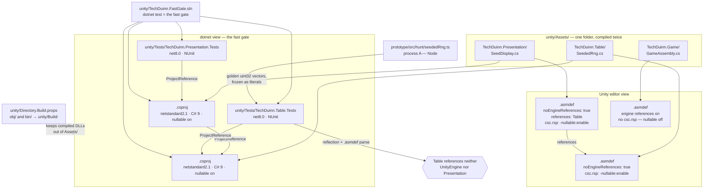

# Plan: Unity assembly scaffold, the seeded PRNG, and the first fast gate

Plan folder: `.claude/contract/DLR-176-unity-assembly-scaffold-and-seeded-prng/`
Execution status: see `tasks.md` in this folder.

---

## Part 1 — Alignment

### Task reference

Jira **DLR-176** — "Unity assembly scaffold, the seeded PRNG, and the first fast gate". Task under epic DLR-175 ("The Long Wake — Unity vertical slice"). Label `infra`. Moved `To Do → Planning` at the start of this run.

**Problem statement (verbatim):**

> `unity/` is a Unity 6 project with a sample scene and no game code, no assembly definitions, and no gate that has ever been run. Every rules ticket after this one needs somewhere to put a rule that a test can reach without opening the editor, and needs a random source it is allowed to use. Without this ticket each of them invents its own incompatible shape.
>
> `.claude/workflow/unity-project.md` also states plainly that no Unity project exists on disk, which stopped being true when the project was created. That file is the single owner of the Unity layout and commands, so correcting it belongs here, in the ticket that first makes its contents real.

**User story (verbatim):**

> As the developer, I want the Unity project's assemblies and its fast gate to exist and actually run, so that every rule built after this can be written and tested in seconds without entering Play mode.

**Acceptance criteria (verbatim):**

1. Three assembly definitions exist under `unity/`: `TechDuinn.Table` (engine-free — cards, tricks, outcomes, the pot), `TechDuinn.Presentation` (engine-free — view models), and `TechDuinn.Game` (references UnityEngine — MonoBehaviours and scene wiring). The four assemblies this epic does not need — `Passage`, `Data`, `Persistence`, `Simulation` — are not created; they belong to the epics that need them.
2. `TechDuinn.Table` and `TechDuinn.Presentation` reference no UnityEngine assembly, and each carries a plain `.csproj` alongside its `.asmdef` pointed at the same source folder, per `.claude/workflow/unity-project.md`.
3. Nullable reference types are enabled for the two engine-free assemblies and disabled for `TechDuinn.Game`.
4. `TechDuinn.Presentation` may reference `TechDuinn.Table`; the reverse is impossible, and a test or a build failure demonstrates that it is.
5. A seeded pseudo-random number generator lives in `TechDuinn.Table`, uses neither `UnityEngine.Random` nor `System.Random`, and produces the identical sequence from the identical seed across separate processes — proved by a test, not asserted.
6. `dotnet test` runs over the engine-free assemblies from a documented command and passes, with at least the PRNG's tests in it. The exact command and its real output are recorded on the ticket.
7. `.claude/workflow/unity-project.md` is corrected against the project that actually exists: the "no Unity project exists on disk" framing is gone, the assemblies it lists match what was created plus a note on which are deferred, and the fast-gate command is the one that was really run.

**Scope boundaries (verbatim):**

> **In scope:** assembly definitions and their `.csproj` siblings; the seeded PRNG and its tests; the first real run of the fast gate; correcting `.claude/workflow/unity-project.md`.
>
> **Out of scope:** any game rule, any card, any scene content, any Unity package addition, the four deferred assemblies.

**Dependencies and risks (verbatim):**

> * **Adding a Unity package is developer-owned** and this ticket should need none. If one turns out to be required, stop and ask rather than adding it.
> * The `.asmdef` + `.csproj` dual setup is the only thing making the fast gate possible. If it cannot be made to work, say so plainly rather than falling back to editor-mode tests and reporting a pass.
> * Nothing about the seeded PRNG's algorithm is prescribed beyond determinism and the two banned sources. Porting the prototype's own generator is the obvious route and keeps a later seed-for-seed comparison open.

**Follow-up decisions confirmed interactively, 2026-09-05:**

- **The machine has no .NET SDK** — only the .NET 6 *runtime* (`C:\Program Files\dotnet\`, with an empty `sdk\` folder). `dotnet test` cannot run at all today. The developer chose: **install the .NET 8 LTS SDK** and plan the gate to actually run. The two engine-free source projects target `netstandard2.1` so nothing compiles that Unity 6's Mono runtime cannot; the test projects target `net8.0`.
- **Skills confirmed:** `unity-programmer` only. `implementation-doc-writer` was offered and declined — `.docs/implementation/` is left to the usual post-apply pass.

### Restated goal

Turn `unity/` from an empty Unity 6 project into one with a real, testable code layout and a gate that has actually been run. Three assembly definitions get created — two engine-free (`TechDuinn.Table`, `TechDuinn.Presentation`) and one that references the engine (`TechDuinn.Game`) — each engine-free one carrying a hand-written `.csproj` next to its `.asmdef` over the same source folder, so the same files are a Unity assembly when the editor opens them and a plain class library when `dotnet test` does. Into `TechDuinn.Table` goes the game's only sanctioned random source: a port of the prototype's mulberry32 generator, written so a seed recorded today reproduces after the Mono-to-CoreCLR cutover, and pinned by golden values generated from the prototype itself rather than from the port. Then the fast gate is run for real, its output recorded, and the two documents that currently claim no Unity project exists — `.claude/workflow/unity-project.md` and the paragraph in `CLAUDE.md` that repeats it — are corrected against what is now on disk.

### In scope

- Three assembly definitions under `unity/Assets/`: `TechDuinn.Table`, `TechDuinn.Presentation`, `TechDuinn.Game`, each with the reference set and `noEngineReferences` flag its role requires.
- A hand-written `.csproj` beside the `.asmdef` for each of the two engine-free assemblies, globbing the same folder, targeting `netstandard2.1` with nullable reference types on and `LangVersion` pinned to 9.0.
- A `csc.rsp` beside each engine-free `.asmdef` carrying `-nullable:enable`, so nullable is on in the *Unity* half of the dual setup too and not only in the `.csproj` half.
- A `unity/Directory.Build.props` that redirects every MSBuild `obj/` and `bin/` out of `Assets/` and into the already-ignored `unity/Build/`.
- Two `.gitignore` corrections in `unity/.gitignore`: un-ignore the hand-written fast-gate solution, and add unanchored `obj/`/`bin/` patterns as a second line of defence.
- A `unity/TechDuinn.FastGate.sln` listing the two engine-free projects and their two test projects — the single argument the documented fast-gate command takes.
- `SeededRng` in `TechDuinn.Table`: a `readonly struct` port of the prototype's mulberry32, integer-only, with `MixSeed` and `DealSeedFor` alongside it.
- Golden test vectors for the PRNG **generated from `prototype/src/hunt/seededRng.ts`**, frozen as literals in the C# test, so the assertion is cross-process, cross-runtime and cross-language rather than self-fulfilling.
- `SeedDisplay` in `TechDuinn.Presentation` — one genuine pure view-model function over a `SeededRng`, so the `Presentation → Table` reference is exercised by real code rather than by a marker type.
- A boundary test asserting, by reflection over the built assemblies and by reading the `.asmdef` files, that `TechDuinn.Table` references neither `UnityEngine` nor `TechDuinn.Presentation`, and that the reverse edge exists.
- Two test projects, `TechDuinn.Table.Tests` and `TechDuinn.Presentation.Tests`, under `unity/Tests/` — outside `Assets/` so Unity never tries to import NUnit and the test adapter.
- Running `dotnet test` for real and recording the exact command and its real output on DLR-176 as a comment.
- Correcting `.claude/workflow/unity-project.md`, and the two other places that repeat its now-false claim: the Unity paragraph in `CLAUDE.md` and `unity/README.md`.

### Explicitly out of scope

- Any game rule, card, suit, rank, trick, outcome or pot arithmetic. `TechDuinn.Table` ships with the PRNG and nothing else.
- Any scene content, prefab, or edit to `SampleScene.unity`.
- Any Unity package addition or removal — `unity/Packages/manifest.json` is untouched.
- The four deferred assemblies: `TechDuinn.Passage`, `TechDuinn.Data`, `TechDuinn.Persistence`, `TechDuinn.Simulation`.
- Any Unity editor-mode or Play-mode test, and any batch-mode build. The fast gate is `dotnet test` and nothing else runs in this ticket.
- Any change to `prototype/src/`. The prototype is read from to generate golden vectors; it is not edited.
- A `.docs/implementation/` module doc. `implementation-doc-writer` was declined for this ticket.
- Installing the .NET SDK. That is the developer's, and it happens before `/fb-apply`.

### Pattern Reference

The brief names `.claude/workflow/unity-project.md` for the dual `.asmdef` + `.csproj` setup, which in turn cites `prototype/.docs/implementation/unity-port-architecture.md`. Both were read. The specific sources this plan follows rather than re-derives:

- **§2** — the per-assembly reference table and the four boundary rules. `Table` references nothing; `Presentation` may reference `Table`; `Presentation` is engine-free too.
- **§2.1** — the dual `.csproj` design and its rationale, and *"nullable reference types on per assembly, starting with `Table`, `Passage`, `Presentation` and `Simulation`… leave it off in `Data` and `Game`"*.
- **§10** — the determinism contract: `UnityEngine.Random` and `System.Random` both banned in a rules path, *"port the prototype's own small PRNG (`seededRng.ts`) … with an explicit algorithm, so a seed recorded today reproduces after the cutover"*, and *"seeds are values in state, never fields on a service"*.
- **§20.2** — *"`Table` and `Passage` should do integer arithmetic only, with percentages as integers and the rounding direction stated at every division."*
- **`prototype/src/hunt/seededRng.ts`** — the algorithm being ported, and the source of the golden vectors.
- **`.claude/skills/unity-programmer/SKILL.md`** — the MUST/NEVER contract, the four Unity traps, and the version table (Mono and C# 9 today; CoreCLR and C# 14 at 6.8).

### Constraints flagged on the brief

- **No Unity package may be added.** If one turns out to be needed, stop and ask. This plan needs none — `unity/Packages/manifest.json` is not in any task's file map.
- **The dual `.asmdef` + `.csproj` setup is load-bearing.** If it cannot be made to work, say so plainly rather than falling back to editor-mode tests and reporting a pass. There is no fallback path in this plan and none may be invented mid-phase.
- **Determinism is the point of the PRNG**, and it must survive the Mono-to-CoreCLR cutover — which is exactly why `System.Random` is banned rather than merely discouraged.
- **A seed-for-seed comparison against the prototype must stay open later.** That is why the port matches the prototype's arithmetic exactly, bit for bit, rather than being "an equivalent generator".

### Assumptions made

- **Source folders live under `unity/Assets/`, not directly under `unity/`.** `unity-project.md` currently draws the layout as `unity/TechDuinn.Table/`, which cannot work — Unity only compiles code under `Assets/` or inside a package, so an `.asmdef` at `unity/TechDuinn.Table/` would never be seen by the editor. The real path is `unity/Assets/TechDuinn.Table/`. This is precisely the kind of drift acceptance criterion 7 exists to correct, and correcting it is a task here.
- **The PRNG is a `readonly struct` implementing `IEquatable<SeededRng>`, not a `readonly record struct`.** §10 asks for a record struct; record structs are C# 10 and Unity 6's Mono compiler is pinned to C# 9, so the asmdef half of the dual setup would not compile. A `readonly struct` with hand-written equality is the shape that is correct on both runtimes, which is what `unity-programmer` asks for where they differ. The file carries a comment saying it becomes a record struct after the 6.8 cutover.
- **`LangVersion` is pinned to `9.0` in the two engine-free `.csproj` files.** Without the pin, `dotnet test` would happily compile C# 12 that Unity then rejects — the dual setup's one real failure mode. The pin makes the `.csproj` half strictly no more permissive than the `.asmdef` half. It also means block namespaces, not file-scoped ones.
- **The engine-free projects target `netstandard2.1`; the test projects target `net8.0`.** `ProjectSettings.asset` has `apiCompatibilityLevel: 6`, which is Unity's .NET Standard 2.1 level, so `netstandard2.1` is exactly the surface Unity will allow. A test project has to target a runnable framework, hence `net8.0` against the SDK the developer is installing.
- **Nullable is enabled in Unity via a `csc.rsp` file beside each engine-free `.asmdef`.** An `.asmdef` has no nullable field, so setting `<Nullable>enable</Nullable>` in the `.csproj` alone would satisfy criterion 3 in the `dotnet` half and silently miss it in the Unity half. `csc.rsp` with `-nullable:enable` is Unity's per-assembly mechanism. `TechDuinn.Game` gets no `csc.rsp`, which leaves nullable off there as criterion 3 requires.
- **MSBuild output is redirected out of `Assets/` by a `unity/Directory.Build.props`.** A `.csproj` sitting inside `Assets/` would otherwise write `bin/…/TechDuinn.Table.dll` inside the Unity project, where the editor would import it as a managed plugin and clash with the assembly the `.asmdef` already compiles from the same sources. Redirecting to `unity/Build/` — a path `unity/.gitignore` already ignores — removes the whole class of problem. `Directory.Build.props` is the right home because it is imported before the SDK props, which is the only point early enough for `BaseIntermediateOutputPath` to affect restore.
- **`.asmdef` references are written by name, not by GUID.** GUIDs come from `.meta` files Unity has not generated yet, so a hand-written GUID reference would be a guess. Unity accepts name references and may rewrite them to GUIDs on save — which is why the boundary test asserts on `references` being *empty* and on `noEngineReferences`, both of which survive that rewrite, rather than on the literal name strings.
- **`TechDuinn.Presentation` and `TechDuinn.Game` each get one small real type rather than being empty.** Unity warns on an `.asmdef` with no scripts, and an empty `TechDuinn.Presentation` cannot demonstrate criterion 4's reference edge. `Presentation` gets `SeedDisplay`, a genuine pure view-model function over a `SeededRng` — which is exactly what §2 says the assembly is for. `Game` gets a plain non-`MonoBehaviour` static class documenting the assembly's purpose, because inventing a composition root the epic has not designed would be scope creep.
- **Golden vectors are generated from the prototype, not from the port.** Freezing values the C# implementation itself produced would prove only that it agrees with itself. Generating them by running the prototype's own mulberry32 body under Node, then asserting them from a `dotnet test` process, makes criterion 5's cross-process claim literally true and simultaneously pins the port to the oracle for the later seed-for-seed comparison.
- **The bounded-integer helper uses multiply-shift, not modulo.** `NextBelow(bound)` computes `(ulong)value * bound >> 32`, which is bit-for-bit what the prototype's `Math.floor(rng() * n)` evaluates to. Modulo would be a different sequence and would silently break the oracle comparison. It is also integer-only, satisfying §20.2 — the prototype's float division by 2³² is deliberately *not* ported.
- **Two test projects, one per engine-free assembly, rather than one shared project.** It costs one extra `.csproj` now and establishes the shape every later rules ticket copies.
- **Test projects live at `unity/Tests/`, outside `Assets/`.** NUnit and the test adapter arrive as NuGet packages; inside `Assets/` Unity would try to import them and would collide with its own bundled `com.unity.test-framework` NUnit.
- **`CLAUDE.md` and `unity/README.md` are corrected alongside `unity-project.md`.** Criterion 7 names only `unity-project.md`, but both of the others restate the same claim in their own words and both become false the moment this ticket lands — `CLAUDE.md` says "no gate has ever been run against it", and `unity/README.md` says "Deliberately empty… nothing here yet". Leaving them is exactly the drift the single-source-of-truth rule exists to prevent.
- **Three NuGet test packages are introduced**, pinned: `Microsoft.NET.Test.Sdk` 17.11.1, `NUnit` 4.2.2, `NUnit3TestAdapter` 4.6.0. NUnit rather than xUnit because it is what Unity's own test framework uses, keeping the door open to running the same test files in the editor later. These are a new dependency and are raised for approval at the gate.

### Config and persisted-shape audit

The task persists nothing and touches no configuration key, but it does introduce a set of names that bind by string — assembly names, `.asmdef` `name` fields, `.csproj` `AssemblyName`s, namespaces, and paths in three documents — so the audit ran on those.

- **`TechDuinn.Table` across the repository's markdown: 12 hits in 4 files** — `.claude/contract/2026-09-04-restructure-repo-for-unity-port/tasks.md` (1), `.claude/contract/DLR-175-epic-breakdown/tasks.md` (6), `.claude/workflow/unity-project.md` (3), `prototype/.docs/implementation/unity-port-architecture.md` (2). Of these only `unity-project.md` is a live reference this ticket must keep true; the two contract folders are historical records of planning runs and are left alone, and the architecture document under `prototype/.docs/` is frozen reference by `CLAUDE.md`'s own rule. Recorded so a later rename knows where to look.
- **`.cs` files under `unity/Assets/`: 0.** Nothing exists to rename or break. Every name this ticket introduces is new, so there are no existing call sites — the audit's usual "every hit is a site the plan must change" clause has nothing to bite on.
- **`.asmdef`, `.csproj` and `.sln` files under `unity/` (excluding `Library/`): 0.** The scaffold is genuinely from zero. `unity/unity.slnx` exists but is an empty `<Solution></Solution>` stub and is git-ignored by `/*.slnx`; it is not touched.
- **Persisted shapes: none.** Nothing in this ticket writes to disk at runtime, so `.claude/rules/save-data-versioning.md` has no reject condition that can fire here. Recorded explicitly because that rule's own "when to enforce" section asks for it: **as of this ticket the Unity project persists nothing at all**, so the window for choosing a save envelope shape is still fully open, and `TechDuinn.Persistence` is one of the four deferred assemblies.
- **Type changes: none.** No existing type is retyped, widened, narrowed, or made optional.
- **Construction sites (Step 1.6 check 7):** `SeededRng` — **0 annotated sites, 0 construction sites** before this ticket; after it, 1 annotated site (`SeedDisplay`'s parameter) and construction sites only inside the two test projects and `SeededRng.FromSeed` itself. `SeedDisplay` — 0 and 0 before; 1 test file after. Both counts are zero going in because neither type exists, which is the honest reading of this check for a from-scratch scaffold.
- **String-bound surfaces that would fail silently if mismatched, and the tasks that keep them aligned:** the `.asmdef` `name` field ↔ the `.csproj` `AssemblyName` ↔ the folder name ↔ the `RootNamespace` ↔ the namespace declared in each `.cs` file ↔ the `ProjectReference` paths in the two test projects ↔ the four project paths inside `TechDuinn.FastGate.sln` ↔ the `!/TechDuinn.FastGate.sln` negation in `unity/.gitignore`. A mismatch in any one of these produces either a silently-unbuilt project or a solution the gate command cannot open, and none of it is caught by a compiler. Every one of these is written in a single task per assembly rather than spread across phases, and the Final verification phase greps the solution's project paths against what is on disk.
- **`unity/.gitignore` interaction, checked against the real file:** `/[Oo]bj/`, `/[Bb]uild/` and `/*.sln` are all anchored with a leading slash, so they match only at the root of `unity/`. Two consequences the plan acts on — a `bin/` or `obj/` created inside `Assets/` would **not** be ignored and would be committed (and imported by Unity as a plugin), and a hand-written `unity/TechDuinn.FastGate.sln` **would** be ignored by `/*.sln` and silently never committed. The file's own comment already anticipates the second problem — *"the four hand-written .csproj files for the engine-free assemblies live in subfolders and must stay tracked"* — but stops at `.csproj` and does not cover the solution.

---

## Part 2 — Technical design

### Approach

The whole ticket hangs on one structural idea from §2.1: the same folder of `.cs` files is compiled twice, by two different toolchains, and both must agree. Unity compiles it because an `.asmdef` sits in the folder; `dotnet` compiles it because a `.csproj` sits in the same folder and globs the same `**/*.cs`. The plan's job is to make those two views strictly consistent, and every non-obvious decision below falls out of that.

Consistency runs in two directions and each needs its own mechanism. **The `.csproj` must not be more permissive than Unity**, or `dotnet test` goes green on code the editor then rejects — hence `LangVersion 9.0` and `netstandard2.1`, matching Mono's C# 9 and the project's `apiCompatibilityLevel: 6`. **Unity must not be less strict than the `.csproj`**, or criterion 3's nullable requirement is half-met — an `.asmdef` has no nullable switch, so a `csc.rsp` carrying `-nullable:enable` goes beside each engine-free `.asmdef` and `TechDuinn.Game` deliberately gets none. The third mechanism is spatial: MSBuild wants to write `obj/` and `bin/` next to the project file, which here is *inside* `Assets/`, where Unity would import the resulting DLL as a managed plugin and end up with two copies of every type. A `unity/Directory.Build.props` redirects both to `unity/Build/`, which the existing `.gitignore` already covers. The alternative — putting the `.csproj` files outside `Assets/` and pointing `<Compile Include>` back at the source folders — avoids that problem but contradicts criterion 2's word "alongside", and hides the coupling in a glob path instead of expressing it as co-location. The `Directory.Build.props` route keeps the AC and costs one four-line file.

The PRNG is a straight port with three deliberate divergences from the prototype, each forced by a rule this project has already written down. It is a **`readonly struct`** rather than the `readonly record struct` §10 names, because record structs are C# 10 and Unity's Mono compiler is C# 9 — `unity-programmer` says to write the shape that is correct on both runtimes and this is it, with a comment marking it for conversion after the 6.8 cutover. It **returns its successor** rather than mutating — `SeededRng Next(out uint value)` — which is what makes §10's "seeds are values in state, never fields on a service" structurally true rather than a convention, and which is what lets a later `RoundState` carry a `drawSeed` field that serialises. And it **exposes no float**: the prototype's final `/ 4294967296` is dropped, and the bounded helper is `(ulong)value * bound >> 32`, which is the integer identity of the prototype's `Math.floor(rng() * n)` and therefore preserves the sequence exactly while satisfying §20.2's integer-only rule. Modulo would have been the obvious bounded-integer choice and is the wrong one here: it produces a different sequence and would quietly cost the seed-for-seed comparison against the oracle.

Criterion 5's phrase "across separate processes" is what shapes the test. A test that runs two generators in one process and compares them proves nothing about a runtime change, and freezing values the C# port itself produced proves only self-agreement. Instead the golden vectors are produced by **process A** — Node, running the six lines copied verbatim out of `prototype/src/hunt/seededRng.ts` — and asserted by **process B**, the `dotnet test` host, on every run thereafter. That is genuinely cross-process, and it is additionally cross-runtime and cross-language, so it pins the port to the oracle and will fail loudly if the CoreCLR cutover ever changes the arithmetic. Criterion 4's "the reverse is impossible" is proved twice over from `TechDuinn.Table.Tests`: by reflection over the built assembly, asserting `TechDuinn.Table`'s referenced-assembly list contains neither `UnityEngine` nor `TechDuinn.Presentation`; and by parsing the three `.asmdef` files copied into the test output, asserting `Table`'s `references` array is empty and its `noEngineReferences` is `true`. The reflection half is the strong proof — it reads what the compiler actually emitted — and the `.asmdef` half is what catches someone adding a reference in the editor's inspector later.

`TechDuinn.Presentation` needs to hold something real, both because Unity warns on a script-less `.asmdef` and because an empty assembly cannot exercise the reference edge criterion 4 asks for. It gets `SeedDisplay.ShortCode`, a pure function from a `SeededRng` to the eight-character hex string a debug overlay would show — which is exactly §2's description of what `Presentation` is for, is testable without a renderer, and takes a `Table` type as its parameter so the edge is load-bearing rather than decorative.

### Skills to invoke during execution

- `unity-programmer` — owns everything under `unity/`. Governs the assembly layout and the engine-free boundary, the ban on `System.Random` in a rules path, the "write the shape correct on both runtimes" rule that decides `readonly struct` over `readonly record struct`, the C# 9 language ceiling, and the 400-line file limit.
- `management-jira` — owns commenting on and transitioning DLR tickets. Criterion 6 requires the exact fast-gate command and its real output to be recorded on DLR-176, which is a Jira comment.
- `none — documentation` for the three document-correction tasks (`.claude/workflow/unity-project.md`, `CLAUDE.md`, `unity/README.md`). No skill owns the workflow reference files; `CLAUDE.md`'s single-source-of-truth table names `unity-project.md` as its own owner.

Files the executor must Read before starting:

- `.claude/workflow/unity-project.md` — the file being corrected, and the current statement of the layout and boundaries.
- `.claude/rules/README.md` and `.claude/rules/save-data-versioning.md` — scanned; no reject condition can fire, since nothing here persists. Read anyway so the executor can confirm that rather than assume it.
- `prototype/.docs/implementation/unity-port-architecture.md` §2, §2.1, §10, §20.2 — the specification for every boundary and determinism decision below.
- `prototype/src/hunt/seededRng.ts` — the algorithm being ported and the source of the golden vectors.

No developer override was applied to the skill list; `implementation-doc-writer` was offered at the classification step and declined.

### Diagram



### Data shapes

#### `TechDuinn.Table` — `unity/Assets/TechDuinn.Table/SeededRng.cs`

Block namespace, not file-scoped — file-scoped namespaces are C# 10 and this assembly is pinned to C# 9.

```csharp
namespace TechDuinn.Table
{
    /// <summary>
    /// The only randomness source a rules assembly may reach for. mulberry32, ported bit-for-bit
    /// from prototype/src/hunt/seededRng.ts so a seed replays identically in both implementations.
    /// A readonly struct rather than the readonly record struct architecture §10 asks for: record
    /// structs are C# 10 and Unity 6's Mono compiler is C# 9. Convert after the 6.8 CoreCLR cutover.
    /// </summary>
    public readonly struct SeededRng : System.IEquatable<SeededRng>
    {
        /// <summary>The generator's whole state. A value, never a field on a service (§10).</summary>
        public uint State { get; }

        private SeededRng(uint state);

        /// <summary>A generator positioned at <paramref name="seed"/>.</summary>
        public static SeededRng FromSeed(uint seed);

        /// <summary>
        /// The next raw 32-bit output, and the generator that follows this one. No float is ever
        /// produced: the prototype's trailing division by 2^32 is deliberately not ported (§20.2).
        /// </summary>
        public SeededRng Next(out uint value);

        /// <summary>
        /// A value in [0, <paramref name="exclusiveBound"/>), and the generator that follows.
        /// Computed as (ulong)raw * bound >> 32 — the integer identity of the prototype's
        /// Math.floor(rng() * n), so the two implementations agree exactly. Throws
        /// <see cref="System.ArgumentOutOfRangeException"/> when the bound is not positive.
        /// </summary>
        public SeededRng NextBelow(int exclusiveBound, out int value);

        public bool Equals(SeededRng other);
        public override bool Equals(object? obj);
        public override int GetHashCode();
        public static bool operator ==(SeededRng left, SeededRng right);
        public static bool operator !=(SeededRng left, SeededRng right);
    }

    /// <summary>Seed composition. Ported from the same prototype module.</summary>
    public static class Seeds
    {
        /// <summary>
        /// Fold integers into one 32-bit seed, order-sensitive. FNV-1a with a shift-xor finaliser,
        /// matching the prototype's mixSeed exactly.
        /// </summary>
        public static uint MixSeed(params int[] parts);

        /// <summary>
        /// The seed for one hand's deal, and for the reshuffle that happens under the same
        /// generator. Unique per hand of a run.
        /// </summary>
        public static uint DealSeedFor(uint runSeed, int encounterIndex, int handOfFight);
    }
}
```

#### `TechDuinn.Presentation` — `unity/Assets/TechDuinn.Presentation/SeedDisplay.cs`

```csharp
namespace TechDuinn.Presentation
{
    /// <summary>
    /// A view model over the rules' generator. Exists so TechDuinn.Presentation holds real work
    /// rather than a marker, and so its one-way reference on TechDuinn.Table is load-bearing.
    /// </summary>
    public static class SeedDisplay
    {
        /// <summary>
        /// The eight-character uppercase hex code a debug overlay shows for a generator's position.
        /// Pure; no allocation beyond the returned string.
        /// </summary>
        public static string ShortCode(TechDuinn.Table.SeededRng rng);
    }
}
```

#### `TechDuinn.Game` — `unity/Assets/TechDuinn.Game/GameAssembly.cs`

```csharp
namespace TechDuinn.Game
{
    /// <summary>
    /// Placeholder so the assembly compiles and Unity does not warn on a script-less .asmdef.
    /// TechDuinn.Game holds MonoBehaviours, prefabs, input, animation, audio, scene wiring and the
    /// composition root (architecture §2); none of that exists yet and this ticket does not add it.
    /// Deliberately not a MonoBehaviour and deliberately carrying no magic methods.
    /// </summary>
    internal static class GameAssembly
    {
        internal const string Purpose = "Scene wiring and MonoBehaviours. Nothing built yet.";
    }
}
```

#### Assembly definition files

`unity/Assets/TechDuinn.Table/TechDuinn.Table.asmdef`:

```json
{
  "name": "TechDuinn.Table",
  "rootNamespace": "TechDuinn.Table",
  "references": [],
  "includePlatforms": [],
  "excludePlatforms": [],
  "allowUnsafeCode": false,
  "overrideReferences": false,
  "precompiledReferences": [],
  "autoReferenced": false,
  "defineConstraints": [],
  "versionDefines": [],
  "noEngineReferences": true
}
```

`unity/Assets/TechDuinn.Presentation/TechDuinn.Presentation.asmdef` — identical but `"name": "TechDuinn.Presentation"`, `"rootNamespace": "TechDuinn.Presentation"`, `"references": ["TechDuinn.Table"]`.

`unity/Assets/TechDuinn.Game/TechDuinn.Game.asmdef` — `"name": "TechDuinn.Game"`, `"rootNamespace": "TechDuinn.Game"`, `"references": ["TechDuinn.Table", "TechDuinn.Presentation"]`, `"autoReferenced": true`, `"noEngineReferences": false`.

#### `csc.rsp` — nullable in the Unity half

`unity/Assets/TechDuinn.Table/csc.rsp` and `unity/Assets/TechDuinn.Presentation/csc.rsp`, each one line:

```
-nullable:enable
```

`TechDuinn.Game` gets no `csc.rsp`, which is what leaves nullable disabled there.

#### `unity/Directory.Build.props`

```xml
<Project>
  <PropertyGroup>
    <!-- The engine-free .csproj files sit inside Assets/ beside their .asmdef (architecture §2.1).
         Left at MSBuild's defaults they would write obj/ and bin/ there, and Unity would import the
         resulting DLL as a managed plugin, clashing with the assembly the .asmdef compiles from the
         same sources. unity/Build/ is already git-ignored. -->
    <BaseIntermediateOutputPath>$(MSBuildThisFileDirectory)Build\obj\$(MSBuildProjectName)\</BaseIntermediateOutputPath>
    <BaseOutputPath>$(MSBuildThisFileDirectory)Build\bin\$(MSBuildProjectName)\</BaseOutputPath>
  </PropertyGroup>
</Project>
```

#### The engine-free `.csproj` shape

`unity/Assets/TechDuinn.Table/TechDuinn.Table.csproj`:

```xml
<Project Sdk="Microsoft.NET.Sdk">
  <PropertyGroup>
    <TargetFramework>netstandard2.1</TargetFramework>
    <AssemblyName>TechDuinn.Table</AssemblyName>
    <RootNamespace>TechDuinn.Table</RootNamespace>
    <Nullable>enable</Nullable>
    <!-- Unity 6's Mono compiler is C# 9. Pinned so dotnet test can never go green on syntax the
         editor will reject — the dual .asmdef/.csproj setup's one real failure mode. -->
    <LangVersion>9.0</LangVersion>
    <TreatWarningsAsErrors>true</TreatWarningsAsErrors>
    <GenerateAssemblyInfo>true</GenerateAssemblyInfo>
  </PropertyGroup>
</Project>
```

`TechDuinn.Presentation.csproj` is the same with its own name and namespace, plus:

```xml
  <ItemGroup>
    <ProjectReference Include="..\TechDuinn.Table\TechDuinn.Table.csproj" />
  </ItemGroup>
```

#### The test-project shape

`unity/Tests/TechDuinn.Table.Tests/TechDuinn.Table.Tests.csproj`:

```xml
<Project Sdk="Microsoft.NET.Sdk">
  <PropertyGroup>
    <TargetFramework>net8.0</TargetFramework>
    <Nullable>enable</Nullable>
    <IsPackable>false</IsPackable>
  </PropertyGroup>
  <ItemGroup>
    <PackageReference Include="Microsoft.NET.Test.Sdk" Version="17.11.1" />
    <PackageReference Include="NUnit" Version="4.2.2" />
    <PackageReference Include="NUnit3TestAdapter" Version="4.6.0" />
  </ItemGroup>
  <ItemGroup>
    <ProjectReference Include="..\..\Assets\TechDuinn.Table\TechDuinn.Table.csproj" />
    <ProjectReference Include="..\..\Assets\TechDuinn.Presentation\TechDuinn.Presentation.csproj" />
  </ItemGroup>
  <ItemGroup>
    <!-- Copied so the boundary test can read what the editor will read. -->
    <None Include="..\..\Assets\TechDuinn.Table\TechDuinn.Table.asmdef" LinkBase="Asmdefs" CopyToOutputDirectory="PreserveNewest" />
    <None Include="..\..\Assets\TechDuinn.Presentation\TechDuinn.Presentation.asmdef" LinkBase="Asmdefs" CopyToOutputDirectory="PreserveNewest" />
    <None Include="..\..\Assets\TechDuinn.Game\TechDuinn.Game.asmdef" LinkBase="Asmdefs" CopyToOutputDirectory="PreserveNewest" />
  </ItemGroup>
</Project>
```

`TechDuinn.Presentation.Tests.csproj` is the same minus the `None` items, referencing only `TechDuinn.Presentation.csproj`.

The `TechDuinn.Presentation` project reference in the *Table* test project is there for one reason: the boundary test reflects over `TechDuinn.Presentation`'s referenced-assembly list to assert the forward edge exists.

#### New dependencies

Three NuGet packages, all test-only, all pinned, none shipped in the game: `Microsoft.NET.Test.Sdk` 17.11.1, `NUnit` 4.2.2, `NUnit3TestAdapter` 4.6.0. No Unity package is added; `unity/Packages/manifest.json` is not touched.

#### `unity/.gitignore` additions

```gitignore
# MSBuild output for the hand-written .csproj files. Unanchored, unlike the /[Oo]bj/ above: these
# projects live inside Assets/, and a compiled DLL left there is imported by Unity as a managed
# plugin and clashes with the assembly the .asmdef compiles from the same sources.
# Directory.Build.props already redirects both out to unity/Build/; these are the second line.
[Oo]bj/
[Bb]in/

# ...but the fast gate's solution is hand-written and must stay tracked, and /*.sln above would
# otherwise swallow it.
!/TechDuinn.FastGate.sln
```

#### Configuration keys and tunables

No tunable value is introduced. The pinned package versions and `LangVersion 9.0` are compatibility facts, not design choices, and are stated above rather than routed to the developer.

### Runtime quality notes

- **Purity and adjudication:** every line of production code this ticket writes is in an engine-free assembly and is a pure function of its inputs. `SeededRng` allocates nothing and touches no static; `Seeds.MixSeed` and `Seeds.DealSeedFor` are pure; `SeedDisplay.ShortCode` allocates only its returned string. There is no `MonoBehaviour` and no `ScriptableObject` in the ticket, so the "component decides logic it should only ask about" failure mode has nothing to attach to. `GameAssembly` in `TechDuinn.Game` holds one `const` and no behaviour.
- **Effects, mount and teardown:** no effect, no listener, no timer, no coroutine, no `Awaitable`, no `IDisposable`, no scene object. `unity-programmer`'s Fast-Enter-Play-Mode trap is the one that could bite a scaffold, and this design closes it structurally rather than by discipline: **there is no mutable static field anywhere in the ticket.** `SeededRng` is a value type that returns its successor instead of mutating, so there is no shared generator to go stale between Play sessions — which is exactly why §10 wants seeds carried in state. `GameAssembly.Purpose` is a `const`, compiled into its use sites, so it is not a static field at all and needs no `[RuntimeInitializeOnLoadMethod]` reset.
- **Hot-path cost:** `Next` is five integer operations on a stack value and allocates nothing — it is safe in a per-frame path, which matters because the deal and reshuffle will eventually run under one. `NextBelow` adds one 64-bit multiply and a shift. `SeedDisplay.ShortCode` allocates a string and is a debug-overlay function, not a per-frame one; it is documented as such. No LINQ appears in production code. The `params int[] parts` on `MixSeed` allocates an array per call — acceptable and deliberate, because seed composition happens once per hand, not per frame; the comment on it says so.
- **Determinism and numeric safety:** neither `UnityEngine.Random` nor `System.Random` appears anywhere, and in the two engine-free assemblies `UnityEngine.Random` is structurally unreachable — `noEngineReferences: true` in the `.asmdef` and no framework reference in the `.csproj` mean it will not compile. `System.Random` has no such structural barrier, so the Final verification phase greps for it explicitly. All arithmetic is `uint`/`ulong` inside `unchecked`, per §20.2 — no float is produced or consumed, so no epsilon is needed and no `NaN` can exist to reach a rendered value. There is exactly one division-shaped operation, `NextBelow`'s `>> 32`, which is a shift and truncates toward zero by construction; the doc comment states that, matching §20.2's "the rounding direction stated at every division". Reproducibility is asserted against golden vectors generated by a different process, a different runtime and a different language.
- **Error paths:** `NextBelow` throws `ArgumentOutOfRangeException` on a bound of zero or less rather than returning a silently wrong value — a bound of zero would otherwise yield 0 and look plausible forever. Nothing in the ticket catches an exception, so there is no swallow-into-a-success-shape path to get wrong. There is no async surface, no I/O at runtime, and no configuration load. The one place a failure must be visible rather than absorbed is the gate itself: if `dotnet restore` or `dotnet test` fails, the task reports what it printed and stops — the brief is explicit that falling back to editor-mode tests and reporting a pass is not acceptable.

### Risks and judgement calls

- **The .NET 8 SDK must be installed before `/fb-apply` runs.** The machine currently has only the .NET 6 runtime, with an empty `sdk\` folder. The developer confirmed the install at the planning gate; it has not happened yet. `winget install Microsoft.DotNet.SDK.8` in a fresh terminal, then `dotnet --list-sdks` should print an `8.0.x` line. Without it every task in Phase 2 onward fails at the first command.
- **`dotnet restore` needs network access** to pull the three NuGet packages the first time. On a machine behind a proxy or offline this fails before any test runs, and it will look like a project-file defect when it is not.
- **The three NuGet packages are a new dependency and want approval.** `Microsoft.NET.Test.Sdk` 17.11.1, `NUnit` 4.2.2, `NUnit3TestAdapter` 4.6.0. NUnit over xUnit is a judgement call made for Unity compatibility — Unity's own test framework is NUnit-based, so the same test files could later run in the editor. If you would rather standardise on xUnit, say so at the gate; it changes three lines and the test attributes.
- **Only the developer can generate and commit the `.meta` files.** Unity creates a `.meta` for every new file and folder on import, and an agent cannot make the editor do that. After `/fb-apply` finishes you must open the project once, let it import, confirm the console shows no compile errors for the three new assemblies, and commit the generated `.meta` files. Until that happens the scaffold is correct on disk but incomplete in Unity's eyes. **This is the ticket's one unavoidable eyes-on step.**
- **`readonly struct` instead of the `readonly record struct` the architecture document names.** Forced by Unity 6's C# 9 ceiling; the file says so and marks it for conversion after 6.8. Flagged because it is a documented decision being deviated from, and that is yours to wave through rather than mine.
- **Source folders land at `unity/Assets/TechDuinn.Table/`, not `unity/TechDuinn.Table/`** as `unity-project.md` currently draws them. The document is wrong — Unity cannot see code outside `Assets/` — and correcting it is a task here. Worth a look, because it changes what every later ticket's file paths look like.
- **`csc.rsp` is the mechanism for criterion 3's nullable requirement on the Unity side**, and it is the least-known piece of this plan. If it turns out Unity 6000.5 has changed how per-assembly compiler options are supplied, the executor must say so rather than quietly satisfying nullable only in the `.csproj`.
- **The golden vectors depend on a verbatim copy of six lines out of `prototype/src/hunt/seededRng.ts`.** The task names the exact function and requires a copy rather than a re-implementation. If someone retypes the arithmetic instead, the vectors will be self-consistent and wrong, and the port will be pinned to a generator the prototype does not have. This is the single most fragile step in the ticket.
- **`CLAUDE.md` and `unity/README.md` are being edited although criterion 7 names only `unity-project.md`.** Both restate the same claim and both become false. If you would rather keep the diff to exactly what the AC names, drop tasks 12 and 13 — but the two files will then be wrong.
- **`TechDuinn.Game` gets a placeholder type rather than a composition root.** A composition root is real design work this epic has not done, and inventing one here would prejudge it. The placeholder exists only so Unity does not warn on a script-less `.asmdef`; the first `TechDuinn.Game` ticket deletes it.
- **`TreatWarningsAsErrors` is on in the engine-free projects.** It is the right default for a rules assembly, but it means a nullable warning fails the gate rather than logging. If that proves too sharp on a scaffold with almost no code in it, it is one line to relax — the value judgement is yours.
