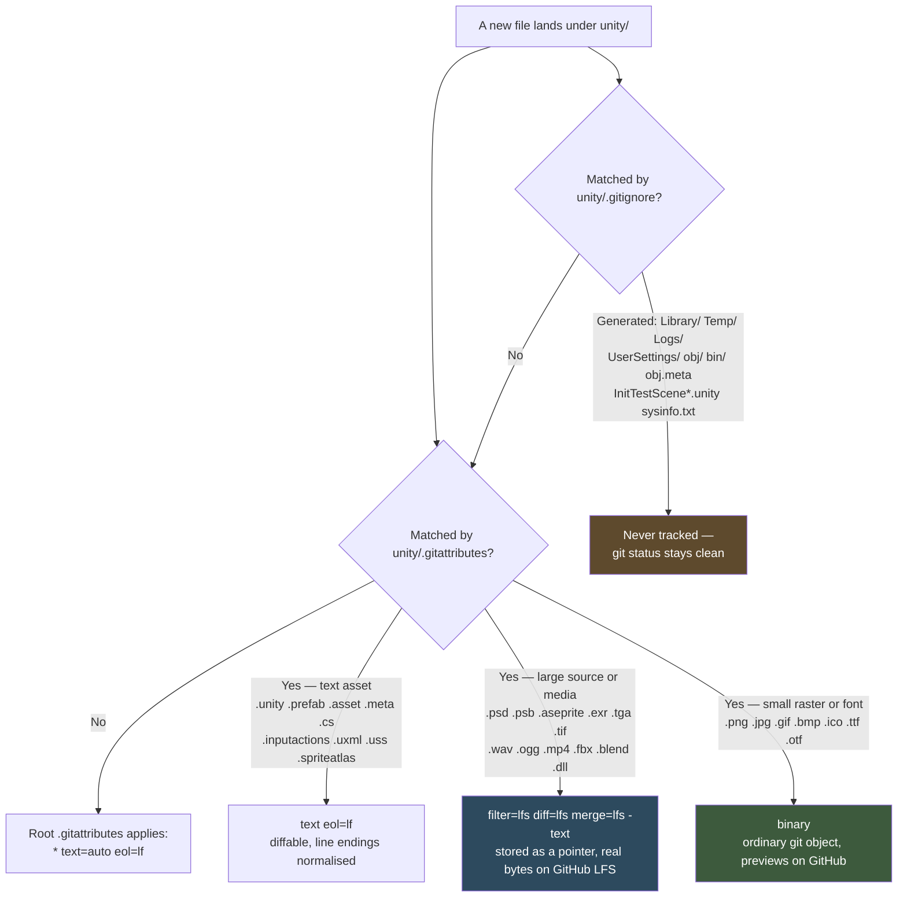

# Plan: Git, Unity serialization, and LFS before the first binary asset lands

Plan folder: `.claude/contract/DLR-177-git-unity-serialization-and-lfs/`
Execution status: see `tasks.md` in this folder.

---

## Part 1 — Alignment

### Task reference

Jira **DLR-177** — "Git, Unity serialization, and LFS before the first binary asset lands"
(Task, `infra`, Highest, under epic DLR-175 "The Long Wake — Unity vertical slice").

**Problem statement (verbatim):** `unity/` currently holds only text assets, which is the last
moment this is cheap. This epic carries a full art track — card faces, a character sprite, a room
background — so binary assets are coming, and a Unity project that acquires them before its git
configuration is right needs a history rewrite to fix it. `.claude/workflow/unity-project.md` names
this as developer-owned work precisely because retrofitting LFS after sprites are in history is a
repository rewrite, not a commit.

**Acceptance criteria (verbatim):**

1. Unity's asset serialization is set to Force Text, and the setting is committed.
2. `.meta` files are committed rather than ignored, and a Unity-appropriate `.gitignore` covers
   `Library/`, `Temp/`, `Logs/`, `Obj/` and `UserSettings/` — verified by `git status` being clean
   after an editor launch.
3. Whether to use Git LFS, and for which extensions, is put to the developer as an explicit
   question with the trade-off stated; their answer is implemented and recorded on the ticket. If
   the answer is "not yet", that is recorded too, along with what it will cost to add later.
4. A `.gitattributes` exists covering line endings for Unity text assets, and the LFS patterns if
   the developer chose LFS.
5. `git status` in `unity/` after opening and closing the editor shows no unexpected tracked churn.

**Scope boundaries (verbatim).** In scope: serialization mode, `.gitignore`, `.gitattributes`, the
LFS decision and its implementation, and verifying the working tree stays clean across an editor
launch. Out of scope: any code, any asset, any CI configuration, rewriting existing history.

**Dependencies and risks (verbatim).** The LFS choice is a developer decision, not this ticket's —
flag and wait rather than picking. The three art tickets all produce binary art and all land after
this. Git is not on PATH in PowerShell on this machine; use the Bash tool. Opening the editor to
verify the tree stays clean requires the developer.

**Follow-up decisions confirmed interactively — 2026-09-05:**

- **The LFS question of AC3 was put to the developer in this planning session, with the storage,
  bandwidth, preview and clone-time trade-offs stated, and answered.** The answer is
  **"LFS, narrowed to the large source and media formats only."** Small raster art — `.png`,
  `.jpg`, `.gif`, `.bmp`, `.ico` — and fonts stay in ordinary git so a sprite still previews and
  diffs in GitHub's web UI and does not consume the LFS bandwidth allowance on every clone and CI
  checkout. Layered art sources, audio, video, 3D and native binaries go to LFS. Recorded on the
  ticket by a task in this contract.

### Restated goal

Get the repository's git configuration right for a Unity project *now*, while `unity/` still holds
nothing but text, so that the epic's art track can land without ever needing a history rewrite. In
practice that means auditing what is already on disk — and a real audit found most of it already
correct — then closing the genuine gaps: narrowing the LFS pattern list to what the developer
actually chose rather than the 28-extension list that was committed without ever asking them,
covering the Unity text-asset and binary extensions the current `.gitattributes` misses, plugging
the `.gitignore` holes that would otherwise show up as untracked droppings after a play-mode test
run, and recording the LFS decision where the project can find it again. Serialization mode and
`.meta` visibility are already correct and this contract verifies and records them rather than
changing them.

### In scope

- Narrow the Git LFS pattern list in `unity/.gitattributes` to the developer's chosen set, and
  declare the deliberately-excluded binary formats as plain-git `binary` in the same file, so the
  boundary is visible in the file that owns it.
- Extend `unity/.gitattributes` to cover the Unity YAML and UI text-asset extensions it currently
  omits, so they are explicitly `text eol=lf` rather than relying on the root file's `text=auto`
  heuristic.
- Close the `unity/.gitignore` gaps: Unity's play-mode test scene scaffolding, Addressables build
  output, the `.meta` files Unity writes beside the ignored `obj/` and `bin/` folders inside
  `Assets/`, and the usual crash and diagnostic droppings.
- Verify and record — not change — that `m_SerializationMode: 2` (Force Text) is committed in
  `unity/ProjectSettings/EditorSettings.asset` (AC1) and that
  `unity/ProjectSettings/VersionControlSettings.asset` carries `m_Mode: Visible Meta Files` so
  `.meta` files are committed (AC2).
- Record the LFS decision and its rationale in `unity/README.md`, so a future contributor adding a
  new asset type knows which side of the line it falls on.
- Update the "Developer-owned work" bullet in `.claude/workflow/unity-project.md` that currently
  names this setup as outstanding, so the single source of truth stops describing settled work as
  pending.
- Post the LFS decision, its trade-off and its rationale as a comment on DLR-177 (AC3's "recorded
  on the ticket").
- Verify with `git check-attr` that every changed pattern resolves the way the plan intends, and
  that `git status` is clean.

### Explicitly out of scope

- **Any code.** No C#, no TypeScript. This contract writes no source file in `unity/Assets/` or
  `prototype/src/`.
- **Any asset.** No sprite, no audio, no prefab, no scene.
- **Any CI configuration.** `.github/workflows/ci.yml` checks out without `lfs: true`; that is
  noted under Risks for a later ticket, and deliberately not changed here.
- **Rewriting existing history.** Nothing is migrated, nothing is force-pushed. The whole point of
  the ticket is that no rewrite is needed *because* zero binaries are in `unity/`'s history.
- **The prototype's own `.gitattributes` and image handling.** `prototype/` images are already in
  plain git history and stay there; the root `.gitattributes` is not touched.
- **`m_LineEndingsForNewScripts`.** Currently `0` (OS Native, so CRLF on Windows). Deliberately
  left alone — see Risks.
- **Committing or pushing.** The executor decides when to commit; this plan prescribes no git
  commit.
- **AC5's editor-launch check.** Opening and closing the Unity editor and judging whether any
  resulting change is expected is the developer's, per `.claude/workflow/unity-project.md` →
  Developer-owned work.

### Pattern Reference

- `unity/.gitattributes` and `unity/.gitignore` as they stand — the existing files are the pattern;
  their anchoring conventions and comment style are followed, not replaced.
- `prototype/.docs/implementation/unity-port-architecture.md` §20.3 — the source of the "set git up
  before the first binary asset lands" requirement the ticket is built on.
- `.claude/workflow/unity-project.md` → Developer-owned work — names this setup as the developer's,
  and is the file whose bullet this contract updates.
- Unity's own published `.gitignore` template — the reference for which generated paths a Unity
  project must ignore. Used as a checklist against the existing file, not copied over it.

### Constraints flagged on the brief

- **The LFS choice is the developer's and must not be picked by an agent.** Satisfied: it was put
  to them explicitly in this planning session and answered. The implementation below carries out
  their answer and nothing else.
- **Git is not on `PATH` in PowerShell on this machine.** Every git command in `tasks.md` is
  written for the **Bash** tool, never PowerShell. This also matches the standing memory on this
  box.
- **The three art tickets land after this one.** If this ticket stalls, that is to be said on the
  art tickets rather than committing sprites past it. It has not stalled — the blocking question is
  answered.
- **The editor holds a project lock and an agent cannot judge editor-generated churn.** AC5 is
  routed to the developer with the exact check to run.

### Assumptions made

- **"Only the huge files" resolves to a concrete extension list, and this is that list.** LFS:
  `.psd .psb .aseprite .ase .exr .hdr .tif .tiff .tga .wav .flac .aif .aiff .mp3 .ogg .mp4 .mov
  .webm .fbx .blend .dll .pdb .so .dylib .bundle .unitypackage`. Plain git, marked `binary`:
  `.png .jpg .jpeg .gif .bmp .ico .ttf .otf`. Rationale: the line the developer drew is "megabytes
  each, and never diffs usefully" — layered art sources, uncompressed or float imagery, audio,
  video, 3D and native binaries — versus "small, and worth previewing on GitHub".
- **`.tga` is on the LFS side despite being a raster image.** It is routinely stored uncompressed,
  so a single 1024×1024 TGA is about 4 MB — an order of magnitude away from a pixel-art PNG.
  Flagged here because it is the one raster extension that crosses the line.
- **`.dll` and `.pdb` are on the LFS side.** `unity/.gitignore` already ignores build output, so a
  tracked DLL is a deliberately-vendored third-party plugin — a binary blob of hundreds of
  kilobytes to megabytes that never diffs and is replaced wholesale on every update. That is the
  classic repository bloater, so it goes to LFS.
- **Fonts (`.ttf`, `.otf`) stay in plain git.** Typically well under a megabyte, and changed
  approximately never, so they cost the repository nothing. Flagged because a CJK font would break
  this reasoning; this game has none.
- **The deliberately-excluded binary formats are restated as `binary` inside
  `unity/.gitattributes` rather than left to inherit from the root file.** Two of them (`.bmp`,
  and the fonts) have no root entry at all and would fall through to `* text=auto eol=lf`, relying
  on git's NUL-byte heuristic. More importantly, a reader of `unity/.gitattributes` needs to see
  the whole LFS boundary in one file rather than infer the excluded half from an absence.
- **The new Unity text-asset extensions are trimmed to what a 2D card game will plausibly hold.**
  `.inputactions .uxml .uss .spriteatlas .spriteatlasv2 .mask .overrideController .preset .mixer
  .renderTexture .cubemap .physicMaterial .lighting .signal .playable` — not the full Unity
  extension roster, which would add a dozen 3D-only entries that this project will never write.
- **Serialization mode and `.meta` visibility are verified, not set.** Both are already correct on
  disk (measured below). AC1 and AC2 ask that the setting be *committed*, and it is; a task that
  rewrote a correct value would be churn.
- **This contract warrants no reviewer dispatch.** Its file map contains no `prototype/src/` file
  and no C# file — it is git configuration, one Unity settings file read, and documentation. The
  `code-evaluator`, `defender` and `qa` agents review React and TypeScript against
  `react-frontend`'s standards and have nothing to evaluate here. Flagged so `/fb-apply` does not
  burn a review round proving that.
- **`unity/README.md` is the right home for the "which files go to LFS" note.** It already exists
  and is tracked, it sits beside the two files the rule governs, and a contributor adding an asset
  is in that directory. The alternative — a new `.claude/rules/` file — was rejected because the
  rule governs one directory rather than crossing workflows, which is the test
  `.claude/rules/README.md` sets for that folder.

### Config and persisted-shape audit

This task has no application configuration and no persisted save shape, but it is almost entirely
**string-bound surface**: every line of a `.gitattributes` or `.gitignore` is a glob that binds by
string and is checked by no compiler. Audited on 2026-09-05 with `git`, run through the Bash tool.

- **Nothing in `unity/` is currently tracked as a binary, so no pattern change can renormalise
  anything.** `git ls-files unity/ | grep -iE "\.(png|jpg|jpeg|psd|wav|mp3|ogg|ttf|otf|fbx|dll|tga|exr)$"`
  returned **0 hits**. This is the fact the whole ticket rests on, and it is confirmed rather than
  assumed. Moving `*.png` off LFS therefore changes no stored object and requires no
  `git add --renormalize`.
- **Git LFS is installed and live on this machine and this repository, but holds nothing.**
  `git lfs version` → `git-lfs/3.7.1`. `git config --get filter.lfs.clean` → `git-lfs clean -- %f`.
  `.git/hooks/` contains `post-checkout`, `post-commit`, `post-merge`, `pre-push` — LFS's four.
  `git lfs env` resolves `Endpoint=https://github.com/amazerbeam/string-railway.git/info/lfs`.
  `git lfs ls-files` returned **0 files**. There is no `.lfsconfig` and none is needed, since the
  endpoint derives from `origin`.
- **AC1 is already satisfied on disk.** `unity/ProjectSettings/EditorSettings.asset` line 7 reads
  `m_SerializationMode: 2` — Force Text — and the file is tracked
  (`git ls-files unity/ProjectSettings/` lists all 26 settings assets plus `ProjectVersion.txt`).
- **AC2's `.meta` half is already satisfied on disk.**
  `unity/ProjectSettings/VersionControlSettings.asset` reads `m_Mode: Visible Meta Files`, and
  `git ls-files unity/ | grep -c "\.meta$"` returns **24** tracked `.meta` files.
- **AC2's `.gitignore` half is already satisfied for the five named paths.**
  `git status --porcelain --ignored=matching -uall unity/` shows `unity/Library/`, `unity/Temp/`,
  `unity/Logs/`, `unity/UserSettings/`, `unity/Build/`, `unity/.vscode/`, `unity/unity.slnx` and
  the three Unity-generated root `.csproj` files as ignored, and `git status --porcelain unity/`
  returns **empty** — no untracked and no modified files. `Obj/` is covered twice, anchored as
  `/[Oo]bj/` and unanchored as `[Oo]bj/`.
- **The hand-written project files survive the ignore patterns.** `git ls-files` confirms all four
  engine-free `.csproj` files are tracked (`unity/Assets/TechDuinn.Table/`,
  `unity/Assets/TechDuinn.Presentation/`, `unity/Tests/TechDuinn.Table.Tests/`,
  `unity/Tests/TechDuinn.Presentation.Tests/`) along with `unity/TechDuinn.FastGate.sln`, which the
  `!/TechDuinn.FastGate.sln` negation rescues from `/*.sln`. **No pattern added by this contract
  may break that**, which is why the new `.gitignore` entries are all either anchored or
  extension-specific.
- **Attribute resolution measured before the change, with `git check-attr -a` on representative
  paths.** `unity/Assets/foo.png` → `filter: lfs, diff: lfs, merge: lfs, text: unset` (and
  `binary: set`, inherited from the root file's `*.png binary`). `unity/Assets/foo.ttf` →
  `filter: lfs`. `unity/Assets/Scenes/SampleScene.unity` → `text: set, eol: lf`.
  `unity/Assets/foo.png.meta` → `text: set, eol: lf`. **Two real gaps surfaced:**
  `unity/Assets/foo.aseprite` → `text: auto, eol: lf` — an Aseprite source would land in plain git
  under a text heuristic, and the epic's art track is exactly where one would come from; and
  `unity/Assets/foo.spriteatlas` → `text: auto` rather than an explicit `text eol=lf`.
- **The root `.gitattributes` is not touched and its interaction is understood.** Its
  `* text=auto eol=lf` and `*.png binary` lines apply to `unity/` only where
  `unity/.gitattributes` is silent; git resolves the deeper file first. The prototype's own images
  keep resolving to `binary: set, diff: unset, merge: unset` — measured on `prototype/foo.png` —
  and are unaffected by anything here.
- **Persisted shapes: none.** Nothing in this contract reads or writes a save file, `localStorage`,
  or any stored record. `.claude/rules/save-data-versioning.md` was read and does not apply — its
  six reject conditions are all about `prototype/src/persistence/`, which this contract does not
  touch. `.claude/rules/` contains exactly one rule file besides its README.

---

## Part 2 — Technical design

### Approach

The shape of this work is unusual and worth stating plainly: **most of it is already done, and the
honest deliverable is an audit that says so plus a short list of real gaps closed.** DLR-176 and the
earlier "Unity version 0" commit already wrote a `unity/.gitignore` and a `unity/.gitattributes`,
already set Force Text serialization, and already left `.meta` files visible and committed. A plan
that ignored that and rewrote all four surfaces from a template would churn correct files, risk
breaking the carefully-anchored negations that keep the four hand-written `.csproj` files and the
fast-gate solution tracked, and produce a diff nobody can review. So the design is subtractive and
surgical: measure what resolves correctly today, change only what does not.

The one genuinely open question was AC3's, and it was the ticket's whole reason for existing. The
existing `unity/.gitattributes` routes 28 extensions to LFS — a decision made without the developer
ever being asked, which is precisely what AC3 forbids. It was put to them in this planning session
with the trade-off stated, and their answer narrows LFS to the large source and media formats. The
implementation is a rewrite of that file's LFS block into two blocks: the LFS set, and an explicit
`binary` set naming the formats deliberately left in plain git. Splitting it into two labelled
blocks rather than simply deleting lines is the point — the *absence* of `*.png filter=lfs` records
nothing, whereas `*.png binary` under a comment saying why records a decision. The alternative
considered was leaving the excluded formats to inherit the root `.gitattributes`; rejected because
`.bmp` and the fonts have no root entry and would fall to git's `text=auto` NUL-byte heuristic, and
because a reader would have to open two files in two directories to reconstruct one rule.

Because zero binaries are tracked under `unity/` — measured, not assumed — narrowing LFS is free.
No stored object changes, no `git add --renormalize` is needed, and no history is touched. That is
the entire window the ticket was written to catch, and it is still open.

The remaining two changes are gap-closing against the measured `git check-attr` output and against
Unity's own published ignore template. `unity/.gitattributes` gains the Unity YAML and UI-toolkit
extensions it omits — `.inputactions`, `.uxml`, `.uss`, `.spriteatlas`, `.mask`,
`.overrideController` and their neighbours — so they are explicitly `text eol=lf` rather than
heuristically so. `unity/.gitignore` gains the entries whose absence surfaces as untracked
droppings after a play-mode test run or an MSBuild invocation: `InitTestScene*.unity`, the
Addressables `StreamingAssets/aa` output, `sysinfo.txt`, `*.stackdump`, and — the subtle one —
`obj.meta` and `bin.meta`, because Unity writes a `.meta` beside every folder inside `Assets/`
including the `obj/` and `bin/` folders the file already ignores, leaving an orphan `.meta` that
`git status` reports and nothing explains. Every new pattern is either anchored with a leading
slash or extension-specific, so none of them can reach the tracked `.csproj` files or the fast-gate
solution.

Finally the decision is recorded in three places, each answering a different question: a note in
`unity/README.md` for the contributor about to add an asset and wondering which side of the line it
falls on; the "Developer-owned work" bullet in `.claude/workflow/unity-project.md`, which currently
tells every agent that this setup is outstanding and would keep saying so; and a comment on
DLR-177 itself, which is what AC3 literally asks for. There is no pure module and no component here
— this contract writes no code at all.

### Skills to invoke during execution

- `none — repository and editor configuration, no code.` This contract writes no C# and no
  TypeScript. Its file map is two git configuration files, one Unity settings file read for
  verification only, and three documentation surfaces. `unity-programmer` owns how to write Unity
  C# and has nothing to say about a `.gitattributes` glob; naming it would send the executor to
  load a document about allocation-free hot paths and the CoreCLR cutover in order to edit an
  ignore pattern. `react-frontend` is a category error here — nothing under `prototype/src/` is
  touched.

**Files the executor must Read before starting:** `.claude/workflow/unity-project.md` (the Unity
layout, runners and developer-owned work — and the file this contract edits),
`.claude/rules/README.md` (scanned; `save-data-versioning.md` read and confirmed not applicable),
and `prototype/.docs/implementation/unity-port-architecture.md` §20.3 (the source of the
requirement).

**Developer override:** the developer was offered `unity-programmer` alongside `none` and the
question was withdrawn in favour of resolving the LFS decision, which was the blocking one. `none`
is the planner's call, justified above; the executor should raise it rather than silently proceed
if any task turns out to need C#.

### Diagram



### Data shapes

No TypeScript, no C#, no configuration key, no persisted shape. **No type, config, or contract
changes.** The artefacts this contract changes are git attribute and ignore patterns, which have no
type. They are given in full below because they *are* the deliverable — a pattern is exact or it is
wrong, and there is no compiler to catch the difference.

#### `unity/.gitattributes` — the LFS block, after narrowing

The 28-extension block is replaced by two labelled blocks. **On LFS** (26 patterns):

```
*.psd *.psb *.aseprite *.ase *.exr *.hdr *.tif *.tiff *.tga
*.wav *.flac *.aif *.aiff *.mp3 *.ogg
*.mp4 *.mov *.webm
*.fbx *.blend
*.dll *.pdb *.so *.dylib *.bundle
*.unitypackage
```

each written as `<pattern>  filter=lfs diff=lfs merge=lfs -text`.

**Deliberately not on LFS**, declared `binary` in the same file (8 patterns):

```
*.png *.jpg *.jpeg *.gif *.bmp *.ico *.ttf *.otf
```

Net movement against the current file: `.png .jpg .jpeg .gif .bmp .ico .ttf .otf` leave LFS;
`.aseprite .ase .flac .webm .so .dylib .bundle` join it.

#### `unity/.gitattributes` — the text-asset block, after extension

Existing entries are unchanged. Added, each as `<pattern>  text eol=lf`:

```
*.overrideController *.physicMaterial *.mask *.preset *.mixer
*.renderTexture *.cubemap *.lighting *.signal *.playable
*.spriteatlas *.spriteatlasv2 *.inputactions *.uxml *.uss
```

#### `unity/.gitignore` — added entries

Existing entries are unchanged; nothing is removed. Appended, grouped under comments:

```
/[Aa]ssets/InitTestScene*.unity
/[Aa]ssets/InitTestScene*.unity.meta
/[Aa]ssets/[Ss]treamingAssets/aa.meta
/[Aa]ssets/[Ss]treamingAssets/aa/*
[Oo]bj.meta
[Bb]in.meta
sysinfo.txt
*.stackdump
/[Ee]xportedObj/
/.consulo/
*.pidb.meta
*.mdb.meta
```

`[Oo]bj.meta` and `[Bb]in.meta` are deliberately **unanchored**, matching the reasoning already in
the file for `[Oo]bj/` and `[Bb]in/`: those folders appear inside `Assets/`, and Unity writes a
sibling `.meta` for each.

#### Values read for verification, never written

`unity/ProjectSettings/EditorSettings.asset` → `m_SerializationMode: 2` (Force Text).
`unity/ProjectSettings/VersionControlSettings.asset` → `m_Mode: Visible Meta Files`.

### Runtime quality notes

- **Purity and adjudication:** Not applicable — no code, no module, no component, no runtime
  behaviour. The nearest analogue is that the LFS boundary is stated once, in
  `unity/.gitattributes`, and explained once, in `unity/README.md`, rather than restated in each.
- **Effects, mount and teardown:** Not applicable — no React, no Unity `MonoBehaviour`, no
  lifecycle. The one lifecycle-shaped concern is the Unity editor's: opening it regenerates
  `Library/`, `Temp/`, `Logs/` and the root `.csproj` files, and the ignore patterns must absorb
  all of that. That is AC5, and it is verified by the developer launching the editor.
- **Hot-path cost:** Not applicable. Attribute lookup happens at `git add` and `git checkout` time
  on a repository with fewer than a thousand tracked files.
- **Determinism and numeric safety:** No arithmetic, no seed, no random source. The determinism-
  adjacent risk is different in kind and is handled: a `.gitattributes` change can silently
  renormalise already-tracked files, which is why the audit measured that **zero** binaries are
  tracked under `unity/` before planning any pattern movement.
- **Error paths:** The failure mode here is silence — a wrong glob fails by matching nothing, with
  no error, and only surfaces months later as a bloated clone or an orphan `.meta` in
  `git status`. That is why every changed pattern is verified in Phase 3 by `git check-attr -a` on
  a representative path with the expected resolution written out, rather than by reading the file
  back. A second failure mode is over-matching: a new ignore pattern swallowing one of the four
  tracked hand-written `.csproj` files or `TechDuinn.FastGate.sln`, which Phase 3 checks explicitly
  with `git check-ignore`.

### Risks and judgement calls

- **The LFS extension split is the planner's reading of "only the huge files", not the developer's
  enumeration.** They chose the principle; the 26/8 split above is derived from it. Three
  placements are worth a glance before approving: `.tga` and `.dll`/`.pdb` on the LFS side, and
  fonts on the plain-git side. Each is argued in Assumptions; any of them can be moved at the gate
  for the cost of one line.
- **`.gitignore` correctness cannot be fully proven without launching the editor.** The plan
  verifies that no *tracked* file becomes ignored and that `git status` is clean now. Whether the
  editor generates something still unignored is AC5, and it is the developer's — an agent cannot
  judge whether an editor-generated change is expected.
- **`m_LineEndingsForNewScripts` is left at `0` (OS Native) deliberately.** With `*.cs text eol=lf`
  in force, git normalises on commit and writes LF on checkout, so no churn reaches `git status`
  either way and the setting is cosmetic. Changing it would also mean writing a Unity enum value
  into a settings YAML from outside the editor, where a wrong integer is silent. Raised because it
  is a plausible thing to expect this ticket to have done, and it is a deliberate non-change rather
  than an oversight.
- **CI does not check out LFS.** `.github/workflows/ci.yml` uses `actions/checkout@v5` with no
  `lfs: true`, so once an LFS-tracked file exists, CI would receive a pointer file rather than the
  asset. The ticket puts CI configuration explicitly out of scope, so this contract does not touch
  it — but it will need a ticket before any CI job depends on a Unity asset. Flagged rather than
  fixed.
- **Anyone cloning this repository must have Git LFS installed.** Already true on this machine
  (3.7.1, hooks in place). It becomes a real constraint the moment a `.psd` or a `.wav` lands, and
  it is the reason the `unity/README.md` note exists.
- **No reviewer dispatch is warranted on `/fb-apply`.** The file map has no `prototype/src/` file
  and no C# file. Confirm this reading at the gate, since it changes how the apply run is
  dispatched.
- **This contract's verification is `git`, not a test suite.** There is no `npm test` and no
  `dotnet test` step, because nothing this contract changes is reachable from either gate. Phase 3
  runs `git check-attr`, `git check-ignore` and `git status` instead. Stated plainly so the absence
  of a suite run is read as a deliberate scope fact rather than an omission.
