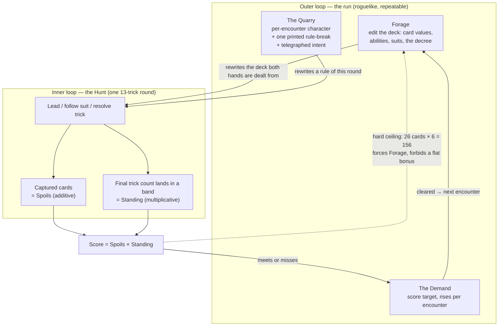

# Plan: Design — Balatro × Forbidden Solitaire treatment of The Fox in the Forest

Plan folder: `.claude/contract/DLR-44-balatro-forbidden-solitaire-fox-design/`
Execution status: see `tasks.md` in this folder.

---

## Part 1 — Alignment

### Task reference

**DLR-44** — "Design: Balatro × Forbidden Solitaire treatment of The Fox in the Forest"
(Task, Medium, project `DLR` / "DeLorean 1.21", created 2026-08-09, unparented).
<https://amazerbeam.atlassian.net/browse/DLR-44>

**Given constraint (decided, not re-opened):** the opponent is a **CPU**. Single-player. No PvP,
hotseat, or online multiplayer.

**Acceptance criteria, verbatim:**

1. A design document exists under `.docs/design/Balatro-Forbidden-Solitaire/` describing a single,
   specific game — not a menu of options. Where a genuine fork exists, it names the chosen branch and
   states the discarded one in one line.
2. The document states the **core equation or shared object** the whole design rests on, in the sense
   of Balatro's `Score = Chips × Mult`, and shows that every proposed component is an intervention on
   it.
3. It answers the **conversion question** explicitly: `forbidden-solitaire.md` §4 argues that any
   exchange rate between layers ("trick points become X") turns the card game into a toll booth, and
   that the fix is a shared object both layers manipulate. The design must state what its shared
   object is, or defend the exchange rate it chose instead.
4. It states **what the outer loop rewrites about the inner loop's input** — the Cook loop test from
   `balatro.md` §2.6. A hybrid where the outer loop only hands the inner loop a number fails this
   criterion.
5. It defines **what the CPU opponent is, in fiction and in mechanics**. The opponent being a CPU is
   given (see Given constraints); what the design must settle is which of the two parents' models it
   follows — a _neutral skilled trick-taker_ that simply plays well, or a _per-encounter character_
   with its own identity, deck, and telegraphed intent in the manner of Forbidden Solitaire's
   enemies, which is also the cheapest vehicle for the rule-breaking escalation in criterion 6. It
   must also say whether the CPU is bound by the same rules as the player, and how much of its state
   the player can see.
6. It names the **escalation structure** — how difficulty rises across a run — and says whether
   escalation happens by raising a requirement, by breaking a rule (Balatro's boss blinds, Forbidden
   Solitaire's tableau-attacking enemies), or both.
7. It picks a position on the **catch-up problem** flagged as load-bearing in `balatro.md` Part 3:
   gentler curve, explicit comeback mechanic, or sub-run checkpointing — and names the consequence.
8. It states the **run length and depth budget** (roguelike-repeatable vs linear-narrative), since
   `balatro.md` §2.8 and `forbidden-solitaire.md` §10 both argue this single choice decides which
   critique the game receives.
9. It identifies which parts of the Fox in the Forest ruleset are **kept, modified, or dropped** —
   trump/decree, the follow-suit rule, the special-card abilities, and the trick-count scoring curve
   — with a reason per change rather than a bare list. The trick-count curve needs particular
   attention: its "too few _or_ too many tricks is bad" shape is tuned for a symmetric 2-player
   contest, and a CPU opponent inside a run structure may not preserve that symmetry.
10. It ends with a **smallest-testable-slice** section: the minimum playable thing that would prove or
    kill the concept, small enough to be a plausible `/fb-plan` brief.
11. The document is critiqued against `.docs/design/old-design/design-principles.md` before it is
    called finished, and any framework it fails is either fixed or acknowledged in the document.

**Risks the ticket flagged:** the design becoming a survey rather than a design; a CPU opponent making
the trick-taker's tension the design's responsibility (Fox in the Forest gets its drama from reading a
live opponent); the naming question against `CLAUDE.md`'s War Council / Vanguard pointer.

**Relates to DLR-18** (Prototype: single-city War Council → Vanguard battle loop) — a *different*
transformation of the same base game. Alternatives, not sequential work. DLR-26 under that epic is a
War Council CPU heuristic card player; if that direction proceeds, the two CPUs are candidates for
shared work.

No spec was consumed from `.claude/contract/specs/`; the ticket is the whole brief.

### Restated goal

Write one design document, under `.docs/design/Balatro-Forbidden-Solitaire/`, that commits to a single
specific single-player game: The Fox in the Forest's two-player trick-taking round used as the inner
loop of a Balatro-shaped run, with a Forbidden-Solitaire-shaped CPU opponent that edits the round's
rules rather than trading numbers with it. The document must name one core equation and show every
component as an intervention on it, name the object the two layers share instead of an exchange rate,
settle the CPU's model and visibility, settle escalation, catch-up and run length, account for every
Fox in the Forest rule it keeps, bends or drops, and close with a slice small enough to be the next
`/fb-plan` brief. It is prose and arithmetic, not code — the deliverable is the argument, and the
document is finished only once it has been run against the project's own critique checklist and either
passes or says plainly where it doesn't.

### In scope

- One new markdown document under `.docs/design/Balatro-Forbidden-Solitaire/` — `hybrid-design.md` —
  that commits to a single game (AC 1).
- A stated core equation, with every proposed component shown as an intervention on one of its terms
  (AC 2).
- The shared object named, and the absence of an exchange rate between layers demonstrated (AC 3).
- An explicit statement of what the outer loop rewrites about the inner loop's *input* (AC 4).
- The CPU opponent defined in fiction and mechanics: which parent's model, whether it is bound by the
  player's rules, and exactly what of its state is visible (AC 5).
- The escalation structure — requirement, rule-break, or both (AC 6).
- A chosen position on catch-up, with its consequence named, and the two discarded branches named in
  one line each (AC 7).
- Run length and depth budget, roguelike-repeatable vs linear-narrative (AC 8).
- A kept / modified / dropped audit of the Fox in the Forest ruleset — decree and trump, follow-suit,
  the odd-rank abilities, the trick-count curve, the 21-point match, and the three expansion modules —
  with a reason per line, and specific attention to whether the non-monotonic trick curve survives the
  loss of a scoring opponent (AC 9).
- A smallest-testable-slice section sized as a plausible `/fb-plan` brief (AC 10).
- A critique pass against `.docs/design/old-design/design-principles.md` §6, folded into the document,
  with any framework the design fails either fixed or acknowledged in place (AC 11).
- First-pass tuning values where the design is illegible without them, in one clearly-marked block,
  each carrying the measurement that would settle it.
- A stated position on whether this direction supersedes, coexists with, or is independent of DLR-18,
  and whether the card layer inherits the name "War Council" or is named afresh.

### Explicitly out of scope

- Any code under `src/`. No engine, no component, no test.
- The CPU's **implementation** — heuristics, search, PIMC, difficulty tiers, card-selection algorithm.
  A later engineering ticket.
- An implementation plan or `tasks.md` for the *game*. This contract's `tasks.md` builds the document;
  building the game is a separate `/fb-plan` once the design is accepted.
- Art direction, visual identity, UI mockups, and screen layout.
- Platform and target decisions — DLR-39 owns those.
- Re-transcribing the parent games' rules. `balatro.md`, `forbidden-solitaire.md` and
  `fox-in-the-forest.md` already hold them; the single-source-of-truth rule says cite, don't restate.
- Editing `CLAUDE.md`, `.docs/design/old-design/*`, or the two reference documents. The naming
  question is *answered in the new document*; propagating that answer into `CLAUDE.md`'s naming
  pointer is a follow-up the developer authorises separately (see Risks).
- Creating the missing parent epic for this direction. The ticket records that gap; opening work is
  not `/fb-plan`'s job.

### Pattern Reference

The brief supplies its own references and they are authoritative:

- `.docs/design/Balatro-Forbidden-Solitaire/balatro.md` — what Balatro does. Load-bearing sections for
  this design: §1.1 the core equation, §1.5 the ante curve, §1.6 the boss-blind enumeration, §2.3 (20
  of 23 bosses attack an *input*, not the score), §2.4 the catch-up problem, §2.6 the shared-object
  coupling test, Part 3 the open questions.
- `.docs/design/Balatro-Forbidden-Solitaire/forbidden-solitaire.md` — §4 the clear *is* the damage and
  the no-exchange-rate argument, §5 enemies attack the board, §6 passive economy vs active tools, §10
  the load-bearing ranking, §12 the four open questions.
- `.docs/game_rules/fox-in-the-forest.md` — the base game. The trick-count table, the odd-rank ability
  reference, the decree/trump rule, the follow-suit rule, the three expansion modules.
- `.docs/design/old-design/design-principles.md` — the frameworks and the §6 critique checklist. Note
  the path: `.claude/skills/game-designer/SKILL.md` still points at `.docs/design/design-principles.md`,
  which does not exist. The ticket's path is the correct one.

Secondary, for the DLR-18 relationship question only — read, not restated:

- `.docs/design/old-design/hybrid-concept.md` and `.docs/design/old-design/skirmish-board-replacement.md`
  — the Vanguard direction this design must position itself against.
- `src/warCouncil/` — an existing, tested Fox in the Forest rules engine (deck, deal, legal moves,
  abilities, trick resolution, scoring, a CPU player). **Read only, to size AC 10 honestly.** No file
  under `src/` is touched by this contract.

Method comes from `.claude/skills/game-designer/SKILL.md`: enumerate before reasoning, quantify
against a benchmark, separate flavour justification from structural justification, trace coupling both
ways, prefer fixes built from pieces that already exist, and close on what would prove the design
wrong.

### Constraints flagged on the brief

- **CPU opponent, single-player.** Decided. The design does not re-open it.
- **The deliverable is a document, not code.** Nothing under `src/` changes.
- **One specific game, not a menu.** AC 1 exists because both reference documents deliberately end in
  open questions, and repeating those options back is the named failure mode. Where a fork is real,
  the document picks a branch and buries the other in one line.
- **Do not restate the parent games' rules.** Cite the section; the single-source-of-truth rule in
  `CLAUDE.md` owns this.
- **First-pass tuning values are wanted, not forbidden.** The ticket puts "rough tuning values where
  they are needed to make the design legible, clearly marked as first-pass and revisable" *in scope*.
  This is narrower than it looks — see Assumptions.
- **The critique is part of the deliverable, not a review step.** AC 11 requires the document to have
  been run against the checklist before it is called finished, with failures acknowledged in place.

### Assumptions made

Every bullet here is a decision the brief did not make. The design spine is deliberately concrete so
this section is red-linable at the gate rather than discovered mid-execution.

- **The document is one file, `hybrid-design.md`, in the named folder.** Rationale: AC 1 asks for "a
  design document", the folder already separates research (`balatro.md`, `forbidden-solitaire.md`)
  from everything else, and a name that does not encode the in-fiction naming survives a naming
  red-line without a rename.
- **The core equation is `Score = Spoils × Standing`.** *Spoils* is the summed value of the cards you
  capture in tricks; *Standing* is a multiplier read off the trick-count band you finish in. Rationale:
  Knizia's method (design the scoring first, find the one principle that reshapes every decision) plus
  Balatro's two-growth-class structure, and both terms are read directly off the trick record the base
  game already produces. Fox in the Forest's most distinctive property — winning too many tricks is
  bad — becomes the *multiplicative* term, so greed is punished by the arithmetic rather than by a
  bolted-on rule.
- **The multiplier values are the base game's own printed table, reused unchanged.** Humble (0–3) ×6,
  Defeated (4/5/6) ×1/×2/×3, Victorious (7–9) ×6, Greedy (10–13) ×0. Rationale: zero new numbers
  invented, and the game-designer skill's instruction to fix with pieces that already exist. The ×0 is
  the one value most likely to be wrong — routed to Risks, not decided here.
- **The shared object is the deck-and-decree, not a currency.** The outer loop edits the 33-card deck
  the round is dealt from and the decree card that sets trump; the inner loop plays and captures those
  same physical cards. Rationale: AC 3 demands a shared object or a defended exchange rate, and Fox in
  the Forest already has one — the deck is shared, the decree sits on top of it, and the Fox (3)
  already exchanges it. No conversion number exists anywhere in the design.
- **The additive term has a hard structural ceiling, and that ceiling is the escalation lesson.** A
  13-trick round caps captured cards at 26. With plain cards the score cannot exceed `26 × 6 = 156`
  regardless of skill, so a rising requirement cannot be met by winning more tricks past a point — it
  must be met by making cards *worth* more, which only deck editing does. Rationale: this delivers
  Balatro's growth-class lesson (`balatro.md` §2.1) with zero rules added, and it is AC 4's answer as
  a side effect.
- **The CPU follows the per-encounter-character model, and the characters are the deck's own odd-rank
  cards.** You face the Monarch, the Witch, the Woodcutter, the Fox, the Swan; each encounter's
  rule-break is that character's printed ability turned on the whole round. Rationale: AC 5 names this
  fork and notes the character model is the cheapest vehicle for AC 6's rule-breaking escalation; and
  Fox in the Forest already ships the cast, so the escalation vocabulary costs nothing to teach
  (Rosewater's resonance — a rule that matches what the theme implies needs less explaining).
- **The CPU is bound by the player's rules, with one printed exception per character.** Wehrle's
  asymmetry rule — balance a strong position with a readable liability rather than by shaving numbers.
- **Visibility: the CPU's hand is hidden, its intent for the coming trick is telegraphed, its trick
  count is public (as in the base game), and its printed exception is on screen at all times.**
  Rationale: Forbidden Solitaire §5/§10.5 — telegraphed intent converts the opponent from output
  randomness into input randomness, which is what makes a board-attacking opponent interesting rather
  than merely punishing. The hidden hand is the one thing preserving the base game's read-the-opponent
  drama, which the ticket names as the headline risk.
- **Escalation is both: a rising Demand *and* a per-encounter rule-break.** Rationale: AC 6 permits
  either or both, and `balatro.md` §2.7 shows target multiplier and broken rule are independent dials
  that most designs wrongly conflate.
- **Run structure is roguelike-repeatable and short, not linear-narrative.** Rationale: AC 8 forces the
  choice, and `balatro.md` §2.4 is explicit that Balatro's slippery slope is only tolerable because a
  run is short and restarting is free. A narrative spine would inherit the slope and discard the
  answer.
- **Catch-up position: cheap restart plus the Humble lane as a bounded second route — not a gentler
  curve and not sub-run checkpointing.** Rationale: the base game's 0–3 band already pays ×6, so a
  low-capture, high-value build is a real alternative lane rather than a consolation. Its consequence
  is stated honestly in Part 2 — this is a *second lane*, not a comeback mechanic, and the design
  still inherits the "run is dead before the player can tell" problem.
- **Fox in the Forest's expansion modules: goal cards dropped, poison 8s kept, special-card vocabulary
  kept.** Rationale: goal cards are a second scoring channel that competes with the equation, which AC
  2 forbids; poison is a negative-value card, i.e. an intervention on Spoils, and doubles as the
  opponent's "curse a card" device from Forbidden Solitaire §5; the *unsuited* concept from the special
  cards is the cheapest existing vocabulary for deck edits.
- **The 21-point match is dropped and replaced by the run.** Rationale: match-to-21 is the ending
  condition of a symmetric two-player contest, which no longer exists once the opponent does not score.
- **In-fiction naming: the layer is named afresh, not inherited from "War Council".** Proposed
  vocabulary — the round is **the Hunt**, the opponent is **the Quarry**, the score target is **the
  Demand**, the multiplier band is **Standing**, the additive term is **Spoils**. Rationale: `CLAUDE.md`
  defines War Council as the Fox in the Forest layer *of the Vanguard hybrid*, carrying that direction's
  framing with it; reusing the name would assert a relationship the design does not want. **Naming is
  the developer's call** — this is a default to red-line, not a decision.
- **Position on DLR-18: independent alternative, neither superseding nor depending.** Rationale: the
  ticket calls them "alternative directions, not sequential work". The document says so plainly and
  notes that a trick-taking CPU is shared work with DLR-26 either way.
- **First-pass numbers live in one clearly-marked block, each with its settling measurement.** The
  ticket puts rough tuning values in scope; the `game-designer` skill forbids presenting a tuning value
  as a conclusion. Both hold if the numbers appear as *illustrative and undecided*, with the cheapest
  measurement that would settle each. No number in the document is presented as chosen.
- **The critique (AC 11) is a section of the document, not a separate file.** AC 11 says failures are
  "acknowledged in the document", which requires it to live there.

### Config and persisted-shape audit

Skipped for the configuration and persisted-state checks — this contract writes one markdown document
and touches no configuration key, no `localStorage` key, no persisted shape, no exported constant map,
no reason code, no `data-testid`, and no CSS class. Nothing under `src/` is read or written, so checks
1–4 and 6 of Step 1.6 have no surface to run against.

Check 5 (names align across the chain) *does* have a surface here, because this document is bound into
the repo's cross-reference graph by string paths. Verified on disk:

- `.docs/design/Balatro-Forbidden-Solitaire/` exists and holds exactly 2 files — `balatro.md`,
  `forbidden-solitaire.md`. The new file is the third; no collision with `hybrid-design.md`.
- `.docs/design/old-design/design-principles.md` exists (579 lines). **`.docs/design/design-principles.md`
  does not** — 0 hits. Both `CLAUDE.md` ("Game design frameworks, designer research, the critique
  checklist → `.docs/design/design-principles.md`") and `.claude/skills/game-designer/SKILL.md` (8
  matching lines) point at the non-existent path. The document must cite the real path; **fixing the
  stale pointers is out of this contract's scope and is raised in Risks as a `/fb-issue`.**
- `CLAUDE.md`'s naming pointer cites `.docs/design/skirmish-board-replacement.md`; the file is actually
  at `.docs/design/old-design/skirmish-board-replacement.md`. Same class of drift, same disposition.
- `CLAUDE.md` states the repository is an "empty prototype scaffold" with "no application code". It is
  not: `src/` holds 142 files including a complete `src/warCouncil/` rules engine and a `src/vanguard/`
  board engine, and `.claude/contract/` held 16 prior contract folders before this one. Raised in
  Risks — a stale project
  description is the single most likely way a later executor mis-sizes AC 10's slice.
- Jira project key: `CLAUDE.md` and `plan-resolution.md` both say the project is `SCRUM`; the live
  project is `DLR` ("DeLorean 1.21"), same six-status workflow. Slug grammar accepts `DLR-44` unchanged.
- `.prettierignore` does **not** exclude `.docs/`, so the new file is inside Prettier's scope. Per
  `.claude/workflow/web-project.md`, repo-wide `format:check` already fails on pre-existing `.docs/**`
  files, so this contract gates on `npx prettier --check` scoped to the one file it creates.
- `.claude/rules/` holds only `README.md` — no rule files exist, so no reject condition applies.

---

## Part 2 — Technical design

### Approach

**The spine.** The design's one equation is `Score = Spoils × Standing`, evaluated once at the end of
each 13-trick round. *Spoils* is the summed value of the cards you captured — additive, and the term
that rewards winning tricks. *Standing* is a multiplier read off the band your final trick count lands
in, taken unchanged from the base game's printed end-of-round table: Humble (0–3) ×6, Defeated (4/5/6)
×1/×2/×3, Victorious (7–9) ×6, Greedy (10–13) ×0. Fox in the Forest's signature property — that
winning *too many* tricks is as bad as winning too few — stops being a lookup table bolted onto the
round and becomes the multiplicative term of the equation, so overreach is punished by the arithmetic
itself. That is Knizia's self-limiting scoring system (find the one principle that reshapes every
decision, and let the system punish greed rather than a rule doing it), and it is the reason this
equation is worth building on rather than inventing a fresh one.

**Why this is not an exchange rate (AC 3).** The alternative most hybrids reach for is "trick points
become resource", which `forbidden-solitaire.md` §4 identifies as the toll-booth signature and which
the base game's own co-op sequel, *Fox in the Forest Duet*, already tried — it converts trick outcomes
into movement on a separate track and reviewed at 2.5/5 for generating no tension
(`design-principles.md` §7). This design has no conversion number anywhere, because both terms are
read off the same object: the pile of cards in front of you. The cards you captured *are* Spoils; the
count of the tricks those cards came in *is* Standing. The shared object is the deck-and-decree — the
outer loop edits the 33-card deck the hand is dealt from and the decree card that sets trump, and the
inner loop plays and captures those same cards. Fox in the Forest already treats the deck as shared
state (both hands come from it, the decree sits on top of it, the Woodcutter draws from it, the Fox
exchanges it), so the object is not invented for the hybrid — it was already the thing both players
were touching.

**Why the outer loop rewrites an input rather than handing over a number (AC 4).** This falls out of
the arithmetic rather than needing a rule. A round is 13 tricks, so at most 26 cards can be captured;
with plain cards the score is capped at `26 × 6 = 156` no matter how well the round is played. A
Demand that rises past that ceiling therefore *cannot* be met by winning more tricks — only by making
cards worth more, which only deck editing does. So the between-encounter layer's job is structurally
forced to be "change what is in the deck and what the cards do", not "add a bonus". That is Cook's
loop test (each outer loop must change the conditions of the inner one, or it is a wrapper rather than
a loop) passed by construction, and it reproduces Balatro's growth-class lesson — the additive build is
arithmetically dead at a predictable point and the game never says so — with zero rules added. The
alternative shape considered and discarded: a Balatro-style shop selling flat score bonuses. It fails
the same ceiling test, because a bonus that is added rather than multiplied into card value is just a
larger constant against an exponential requirement.

**The opponent, and why it is a character (AC 5, AC 6).** The Quarry is a per-encounter character
rather than a neutral strong player, and the characters are the odd-rank cards the base game already
prints — the Monarch, the Witch, the Woodcutter, the Fox, the Swan. Each encounter turns that
character's printed ability on for the entire round rather than for the one card, which is Balatro's
escalation-by-rule-break sourced entirely from existing vocabulary: facing the Monarch, your
highest-or-lowest constraint applies every time you follow; facing the Fox, the decree moves under
you. `balatro.md` §2.3 is the reason this is the right shape — 20 of Balatro's 23 boss blinds attack an
*input* to the engine rather than the score, which is why a boss reads as a test of your specific build
rather than a difficulty spike. The neutral-strong-player branch is discarded in one line: it can only
escalate by playing better, which is a difficulty slider, not a design. The Quarry is bound by the
player's rules with one printed exception each (Wehrle's asymmetry-by-readable-liability), its hand is
hidden, its next-trick intent is telegraphed (Forbidden Solitaire §5 — this converts the opponent from
a die roll after you commit into information you plan around), and its trick count is public exactly as
the base game already makes it. Escalation is both dials at once: the Demand rises per encounter and
the rule-break changes per encounter, kept independent because `balatro.md` §2.7 shows that conflating
them is the common mistake.

**Structure of the work.** The document is built in the order the criteria depend on each other, not in
the order they are numbered: the equation and the shared object first (everything else is an
intervention on them and cannot be written before they exist), then the run — opponent, escalation,
catch-up, length — then the ruleset delta, which is only decidable once the run structure is known,
then the slice and the critique. The critique is written last and folded into the document in place,
because AC 11 requires failures acknowledged rather than filed elsewhere. The keep/modify/drop audit
(AC 9) is deliberately a late task: whether the trick curve survives is a question about the run, and
answering it early would mean guessing.

### Skills to invoke during execution

- `game-designer` — owns anything under `.docs/design/`, and owns the method this document must be
  written by: enumerate before reasoning, quantify against a benchmark, separate flavour justification
  from structural justification, trace coupling both ways, prefer fixes made of existing pieces, score
  proposals by rules added, and close on what would prove the design wrong. It also owns the AC 11
  critique pass and the report template. Note the skill's own pointer to `.docs/design/design-principles.md`
  is stale — read `.docs/design/old-design/design-principles.md`.

No other skill applies. `react-frontend` is deliberately absent: this contract writes no TypeScript and
touches nothing under `src/`. `game-ux` is deliberately absent: UI, layout, and mockups are out of
scope on the ticket, and AC 5's visibility question is answered as a *design* statement of what the
player knows, not as a screen.

**Developer override applied at the Step 1.5c gate:** the proposed list offered `game-ux`,
`react-frontend`, and `management-jira` as extras; the developer selected `game-designer` only. Recorded
so the execution session does not re-add them.

Rules files the executor must read: **none** — `.claude/rules/` contains only its `README.md`.
Always read `.claude/workflow/web-project.md` for paths and runner commands.

### Diagram

### Data shapes

No type, config, or contract changes. This contract creates one markdown file and modifies no code,
no configuration, and no persisted shape.

What follows is the normative outline the tasks build against — section names here are the section
names tasks must produce, so the two files stay consistent.

#### File created

`.docs/design/Balatro-Forbidden-Solitaire/hybrid-design.md`

#### Document section map

| Section | Satisfies | Owns |
|---|---|---|
| `# <title>` + framing paragraph | AC 1 | What this document is, and that it commits |
| `## 1. The equation` | AC 2 | `Score = Spoils × Standing`; the term definitions; the component table |
| `## 2. The shared object` | AC 3 | Deck-and-decree; why no exchange rate exists; the Duet counterexample |
| `## 3. What the run rewrites` | AC 4 | The 156 ceiling arithmetic; the Forage layer; Cook's loop test |
| `## 4. The Quarry` | AC 5 | Fiction, mechanics, the printed exception, the visibility table |
| `## 5. Escalation` | AC 6 | The Demand curve and the per-character rule-break, as independent dials |
| `## 6. Catch-up` | AC 7 | Chosen position, the two discarded branches, the consequence |
| `## 7. Run length and depth budget` | AC 8 | Roguelike-repeatable; the discarded narrative branch; the depth argument |
| `## 8. The ruleset: kept, modified, dropped` | AC 9 | Per-rule table with a reason per line; the trick-curve asymmetry argument |
| `## 9. First-pass values` | in-scope bullet | Every number, marked undecided, each with its settling measurement |
| `## 10. Relationship to the Vanguard direction` | ticket risk | Independent alternative; the shared-CPU note; the naming position |
| `## 11. Smallest testable slice` | AC 10 | The minimum playable thing, sized as a `/fb-plan` brief |
| `## 12. Critique` | AC 11 | Run against `design-principles.md` §6; failures acknowledged in place |

#### Vocabulary the document defines (first-pass, developer red-lines)

| Term | Is | Note |
|---|---|---|
| **the Hunt** | one 13-trick round | replaces "War Council" for this direction |
| **the Quarry** | the CPU opponent for one encounter | a character from the deck's odd ranks |
| **Spoils** | summed value of cards captured | the additive term |
| **Standing** | multiplier from the trick-count band | the multiplicative term |
| **the Demand** | the encounter's score target | rises per encounter |
| **Forage** | the between-encounter deck edit | the outer loop's only verb |

#### Numbers the document may state, and their status

All illustrative and undecided, confined to `## 9. First-pass values`:

- Standing multipliers — ×6 / ×1 / ×2 / ×3 / ×6 / ×0, taken verbatim from the base game's printed
  table. Not invented; the ×0 is flagged as the most likely to be wrong.
- The plain-card Spoils ceiling — `26 × 6 = 156`. Arithmetic, not tuning; it is derived from the
  13-trick round and the printed table.
- Encounters per run, the Demand curve's shape and base, and the Forage budget — **undecided**. Each
  stated as a range with the measurement that would settle it, never as a chosen value.

### Runtime quality notes

- **Purity and adjudication:** No code is produced, so there is no module placement or DOM boundary to
  get wrong. The document's analogue is the single-source-of-truth rule: every rule of a parent game is
  cited to its owning file rather than restated, so the design cannot drift from the rules it is built
  on. A restated rule is this contract's version of a hard-coded tunable.
- **Effects, mount and teardown:** Not applicable — no component, effect, listener, timer, observer, or
  module-level state is created. Nothing to clean up.
- **Hot-path cost:** Not applicable — nothing executes.
- **Determinism and numeric safety:** No runtime arithmetic, but the document's own arithmetic is
  load-bearing and must be shown rather than asserted. Every quantitative claim — the 156 ceiling, the
  band enumeration, any worked comparison between a Humble build and a Victorious one — is written with
  its working visible so the developer can check it. The `game-designer` skill forbids a balance claim
  without arithmetic or a published benchmark, and the enumeration instruction applies directly: with 14
  possible trick splits, the outcome space is small enough to list rather than reason about.
- **Error paths:** The failure mode this contract must guard is the one the ticket names — the document
  becoming a survey. The guard is structural: AC 1 requires a chosen branch with the discarded one named
  in one line, and every task that reaches a fork produces exactly that shape. A section that lists
  options without choosing is a failed task, not a stylistic preference. The second guard is the AC 11
  critique: a framework the design fails must be acknowledged in place, never quietly dropped.

### Risks and judgement calls

- **The whole spine is a proposal, and this is the section to red-line.** `Score = Spoils × Standing`,
  the deck-and-decree as shared object, the Quarry-as-deck-character, roguelike run length, and the
  catch-up position are all decisions the brief left open and this plan made so the gate is meaningful.
  If the equation is wrong, everything downstream of it changes — reject it here, not after the document
  is written.
- **Standing ×0 for the Greedy band is the most suspect number in the design.** It zeroes an entire
  round's play, which is a harder punishment than the base game's (where 0 points still leaves your
  running total intact and the opponent's 6 is the real cost). It may need to be a small positive
  multiplier. **Developer decision** — the document states it as first-pass with the measurement that
  would settle it.
- **Encounters per run, the Demand curve, and the Forage budget are unchosen tuning values.** The design
  is legible without them if the *shape* is stated; the values are not this plan's to pick and are not
  picked. **Developer decisions.**
- **Naming is a copy judgement and is entirely the developer's.** "the Hunt / the Quarry / Spoils /
  Standing / the Demand / Forage" is a coherent first pass chosen so it does not collide with the
  Vanguard vocabulary (Muster, the Clash, the Breach), but a name is a feel call. Related: if the
  developer accepts naming afresh, `CLAUDE.md`'s naming pointer needs a follow-up edit to stop implying
  War Council covers every Fox in the Forest layer in the repo. **That edit is out of scope here** —
  flagged for a separate `/fb-issue` or a one-line change the developer makes directly.
- **The catch-up position is the design's weakest claim and the plan says so.** The Humble lane is a
  second *strategy*, not a comeback *mechanic* — it does nothing for a player whose deck is already too
  weak for either lane. The design therefore inherits `balatro.md` §2.4's real problem verbatim: a run
  can be arithmetically dead several encounters before the player can tell. The document must either
  accept that with the short-run justification or add a still-winnable signal, and the choice has a
  visible cost either way. **Worth the developer's attention at the gate.**
- **The ticket's headline risk is not fully answered by this spine.** Fox in the Forest's drama comes
  from reading a live opponent; a CPU that is merely competent risks making the card layer feel like a
  slot machine with extra steps. Telegraphed intent plus a hidden hand plus a readable printed exception
  is the design's answer, but whether it *works* is a feel question that only playing settles — which
  is exactly why AC 10's slice exists. **Cannot be resolved on paper; it is the thing to test first.**
- **AC 10's slice will be sized against `src/warCouncil/`, which already exists.** That engine already
  implements the deck, deal, legal moves, abilities, trick resolution, scoring, and a CPU player, so the
  honest minimum slice is much smaller than a from-scratch reading would suggest. If the developer wants
  the slice sized as though nothing exists — for instance because this direction would start a clean
  prototype — say so at the gate, because it materially changes that section.
- **`CLAUDE.md` is substantially stale and the executor will read it.** It describes this repository as
  an empty scaffold with no application code; there are 142 files under `src/`, two complete engines,
  and 16 prior contract folders. It also points at two documentation paths that do not exist and names the
  Jira project as `SCRUM` when it is `DLR`. None of that is in scope to fix here, and all of it is
  likely to mislead. **Recommend a `/fb-issue` after this contract**; flagged rather than silently
  corrected because `CLAUDE.md` is the developer's file.
- **The design must position itself against DLR-18 without re-litigating it.** The plan's default is
  "independent alternative, neither supersedes". If the developer's actual intent is that this
  supersedes the Vanguard direction, that changes section 10 and possibly the naming decision.
  **Confirm at the gate.**
