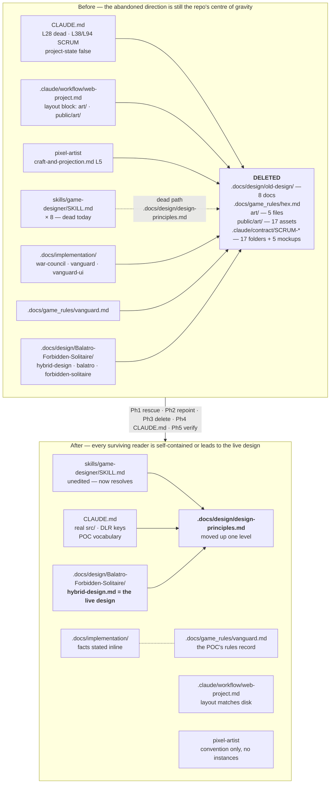

# Plan: Retire the old-design documentation now that hybrid-design.md is the live design

Plan folder: `.claude/contract/DLR-45-retire-old-design-documentation/`
Execution status: see `tasks.md` in this folder.

---

## Part 1 — Alignment

### Task reference

**Jira:** `DLR-45` — *Retire the old-design documentation now that hybrid-design.md is the live design* (Task, Medium, project `DLR` / "DeLorean 1.21"). Moved `To Do → Planning` at the start of this run.

**Developer instructions added at invocation and during planning (2026-08-09), all three overriding the ticket as written:**

1. *"add to the plan to skip and code checks or tests as this is not a coding task"* — no `npm run typecheck` / `lint` / `test` / `build` step is planned. Interacts with the ticket's AC 6; see Assumptions and Risks.
2. *"This include clean up of mock ups and any art"* — confirmed at the planning gate as **delete all of `art/` and `public/art/`**. The ticket did not scope art at all beyond naming `art/ART_BIBLE.md` as a decision.
3. *"and the SCRUM files in `.claude/contract`"* — confirmed at the planning gate as **delete all 16 `SCRUM-*` contract folders outright** (not archive them). The ticket explicitly placed `.claude/contract/` out of scope; this override reverses that. The 5 `mockup.html` files live inside those folders and go with them, which is also how instruction 2's "mock ups" is satisfied.

**Acceptance criteria, verbatim from the ticket:**

1. The eight superseded documents under `.docs/design/old-design/` are deleted: `claude-civil-war.md`, `concept-critique.md`, `deck-as-army.md`, `hybrid-concept.md`, `ideas-and-concepts.md`, `reskin.md`, `skirmish-board-replacement.md`, `us-civil-war-game-framing.md`.
2. `design-principles.md` is preserved and moved from `.docs/design/old-design/` to `.docs/design/design-principles.md`. It is a general design-framework reference, not old-design content, and the live design cites it in fourteen places.
3. `.docs/game_rules/hex.md` is deleted — Hex is the parent game of the board layer the new design does not have.
4. A repository-wide search for the deleted filenames, excluding `.claude/contract/`, returns zero hits. The known reference sites are listed under Scope below.
5. The `game-designer` skill's eight references to `.docs/design/design-principles.md` resolve after the move. They are dead today, pointing at a path that does not exist.
6. `npm run typecheck`, `npm run lint`, `npm test` and `npm run build` are unchanged and green, and `git status` shows no modification under `src/`. This is the check that the POC was not touched.
7. `CLAUDE.md`'s "Project state — read this first" section describes what is actually on disk. It currently opens "This is a Vite + React 19 + TypeScript prototype scaffold with no application code" and states that `src/` holds three files plus one placeholder spec. `src/` in fact holds 142 source files across six modules — `app/`, `battle/`, `vanguard/`, `warCouncil/`, `styles/`, `__tests__/` — and 54 test files. The section's closing instruction not to describe an architecture "the next prototype has not chosen" is equally false and goes with it. Verify by counting: the file's description of `src/` matches `ls src` and the file counts above.
8. **Every** `SCRUM` reference in `CLAUDE.md` reads `DLR`. Two sites: line 38, the Jira status vocabulary row naming "the `SCRUM` status model"; and line 94, the slug-grammar example `SCRUM-8-scaffold-vite-app`. The project key was renamed — the live board issues `DLR-*` keys and the project is `DLR` ("DeLorean 1.21"). Verify with `grep -n SCRUM CLAUDE.md` returning zero hits.

**Ticket's three named developer decisions** (Dependencies & Risks section) — the fate of `.docs/game_rules/vanguard.md`, of `CLAUDE.md`'s "Game naming" section, and of `art/ART_BIBLE.md`. The third is settled by developer instruction 2 (deleted with the rest of `art/`). The first two are carried into Risks with the ticket's own recommended default, so execution does not stall.

### Restated goal

The repository's live design is `.docs/design/Balatro-Forbidden-Solitaire/hybrid-design.md`, but the abandoned Fox-in-the-Forest × Hex / US Civil War direction is still all over the working tree — roughly 4,000 lines of design documentation, a Civil War art bible with its renderers and generated sprites, and 16 contract folders from the POC build — and the repo's own top-level entry points route a reader into that material before the live design. This ticket removes it: eight documents under `.docs/design/old-design/`, `.docs/game_rules/hex.md`, all of `art/` and `public/art/`, and all 16 `SCRUM-*` folders under `.claude/contract/` with their five mockups. It rescues `design-principles.md` out of the doomed folder to `.docs/design/design-principles.md` — which also repairs eight already-dead pointers in the `game-designer` skill and one in `CLAUDE.md` for free — repairs every surviving reference into the deleted material, and corrects `CLAUDE.md`'s project-state section and its stale `SCRUM` project key. Nothing under `src/` is touched: the POC code and its implementation record stay exactly as they are, and only the dangling links *out of* the implementation docs are repaired.

### In scope

- Move `.docs/design/old-design/design-principles.md` → `.docs/design/design-principles.md`, repair its two internal links to soon-deleted siblings (lines 8 and 314), and repoint the nine *path* references to it in the three `.docs/design/Balatro-Forbidden-Solitaire/` documents — including deleting the now-obsolete "note the path" caveat at `hybrid-design.md:20-23`.
- Repair every surviving reference to deleted material at the audited sites: `.docs/game_rules/vanguard.md` (2), `.docs/implementation/vanguard.md` (5), `.docs/implementation/war-council.md` (2), `.docs/implementation/vanguard-ui.md` (1), `.claude/lessons/2026-08-08-game-designer-plain-language.md` (1), `.claude/workflow/web-project.md` (the layout block's `art/` and `public/art/` entries plus the `public/art/` trap bullet), `.claude/skills/pixel-artist/references/craft-and-projection.md` (1).
- Delete the eight superseded documents under `.docs/design/old-design/`, plus `.docs/game_rules/hex.md`, and remove the emptied `old-design/` directory.
- Delete all of `art/` (`ART_BIBLE.md`, `palette.mjs`, `karvann.mjs`, `karvann-side.mjs`, `war-council-colour.mjs`) and all of `public/art/` (17 generated PNG / JSON / SVG files).
- Delete all 16 `SCRUM-*` folders (53 files) under `.claude/contract/`, including the five `mockup.html` files inside `SCRUM-28`, `SCRUM-29`, `SCRUM-30`, `SCRUM-31`, and `SCRUM-40`.
- Correct `CLAUDE.md`: rewrite "Project state — read this first" to describe the real `src/` (AC 7); remove both `SCRUM` occurrences (AC 8); repoint the "Game naming" section's dead `skirmish-board-replacement.md` pointer at line 28 and reframe that section as the retained POC's vocabulary.
- Verification by grep and `git status`, per developer instruction 1.
- Write `pr-description.md` into this plan folder.

### Explicitly out of scope

- **Anything under `src/`.** The POC stays exactly as it is, including its five in-code comments that name deleted documents (see the audit). No `src/` file appears in any task's `**Files:**` block.
- **All Jira issues.** The 27 old-direction issues (DLR-17, DLR-18 and children, DLR-39) and the 15 String Railway issues (DLR-1 to DLR-16) are untouched. The DLR workflow has no `Cancelled` status, so this is a separate manual decision in the Jira UI.
- **`.claude/contract/DLR-44-…`, `archive/`, and `specs/`.** DLR-44 is the build record of the *live* design and references `old-design/` paths in 15 places; those stay as historical fact, exactly as the ticket reasoned about the SCRUM folders. `archive/` and `specs/` are empty and are reserved names.
- **`.claude/skills/management-jira/SKILL.md`**, which says `SCRUM` throughout and owns the status model. A skill fix — recommend a separate `/fb-issue`. See Risks for how this plan avoids minting a dangling pointer in the meantime.
- **`.claude/skills/pixel-artist/SKILL.md` and `references/renderer.md`.** Audited: their `art/` and `public/art/` references are the skill's own *stated convention* for where art would live (`SKILL.md:128` — "This skill adds one tree, and the paths below are its convention"), not pointers to the files being deleted. They stay correct with the tree empty. Only `references/craft-and-projection.md:5`, which *asserts* `art/palette.mjs` holds this project's chosen values, is repaired.
- **`.claude/skills/game-designer/SKILL.md`.** Audited: all eight of its `design-principles.md` references already read `.docs/design/design-principles.md` and become correct by the move alone. AC 5 is satisfied with zero edits to that file.
- **The stale `SCRUM-NN` ticket-key citations throughout `.docs/implementation/*.md`.** They cite issue keys, not paths. AC 8 is scoped to `CLAUDE.md` only; a project-wide key migration is separate work.
- **`.docs/implementation/*.md` as documents.** They describe shipped POC code and stay; only their dangling links are repaired.
- **`.docs/game_rules/fox-in-the-forest.md`.** Fox in the Forest is a parent game of the *live* design (`hybrid-design.md` cites it nine times) — not old-direction material, not touched.
- **String Railway documentation.** None remains; it went with the code removal on 2026-08-01. Recorded so it is not re-investigated.
- Rewriting the *substance* of any surviving document. Link repair, plus the specific `CLAUDE.md` sections named in AC 7 / AC 8, only.

### Pattern Reference

None supplied as code. The ticket supplies the authoritative reference-site list under *Scope Boundaries → In scope*, and this plan's audit verifies it against disk and corrects it in three places. `.docs/design/Balatro-Forbidden-Solitaire/hybrid-design.md` is the live design and the destination every repointed reference should lead a reader toward. `.claude/workflow/web-project.md` owns the repo layout and is therefore the file that must absorb the `art/` deletion.

### Constraints flagged on the brief

- **`src/` is untouchable.** Enforced by AC 6's `git status` check and by the out-of-scope statement. The ticket's single hardest constraint, and the one the art and contract deletions must be shown not to violate.
- **No code checks or tests** — developer instruction 1. No `typecheck`, `lint`, `test`, or `build` step is planned.
- **`design-principles.md` must survive** — it is inside the folder being removed and is the most-cited surviving reference in the repo.
- **`.claude/contract/DLR-44-…` is untouchable**, along with the pipeline machinery in `.claude/commands/` and `.claude/agents/`.
- Two dependencies only (`react`, `react-dom`); this ticket adds none and touches no `package.json`.

### Assumptions made

- **AC 4's exclusion list is widened from `.claude/contract/` to `.claude/contract/` *and* `src/`.** The audit found five live references to deleted filenames inside `src/` (comments in `cpuPlayer.ts` ×2, `musterConversion.ts`, `vanguard.css`, `hexLayout.test.ts`). AC 4 as literally written and the "anything under `src/`" out-of-scope statement cannot both be satisfied. The out-of-scope statement is explicit and AC 6 makes it mechanically verifiable, so it wins. Carried into Risks.
- **AC 6 is satisfied by `git status --porcelain src` alone, not by the four npm gates** (developer instruction 1). AC 6's stated purpose is "the check that the POC was not touched", and a clean `git status` under `src/` proves that directly where a green build proves it indirectly. Confirmed safe by audit: nothing under `src/` or `index.html` references `art/`, `public/art/`, or any generated `.png`, so removing them changes no compilation or test input. Carried into Risks.
- **Deleting `public/art/` is safe for the build even though `public/` is copied verbatim into `dist/`.** Vite copies whatever is there; removing files yields a smaller `dist/` and no error. `public/favicon.svg` — the only other entry — is untouched.
- **All of `art/` goes, including `palette.mjs`.** Developer instruction 2 said "any art", and the gate answer was "delete all of it". `palette.mjs` is the Civil War ramp set, not a project-neutral utility; the `pixel-artist` skill carries its own generic renderer at `.claude/skills/pixel-artist/scripts/pixelart.mjs`, which is untouched, so the capability to make art survives the removal of this project's old-direction art.
- **The 16 `SCRUM-*` contract folders are deleted, not archived**, per the gate answer. Everything in them is recoverable from git history — nothing was force-pushed and no history was rewritten.
- **`.docs/game_rules/vanguard.md` is kept and reframed**, per the ticket's own recommendation, as the retained POC's rules record; its two links to `skirmish-board-replacement.md` are rewritten rather than followed into deletion.
- **`CLAUDE.md`'s "Game naming" section is kept and retargeted**, per the ticket's own recommendation, as the retained POC's vocabulary. AC 7 rewrites only the project-state section, so this section survives and needs its own treatment for its dead pointer at line 28.
- **`CLAUDE.md` line 38 is reworded to stop naming the skill's section by title**, rather than having `SCRUM` swapped for `DLR` in place. Renaming it to "*The DLR status model*" would satisfy AC 8's grep while minting a pointer to a section heading that does not exist, because `management-jira/SKILL.md` is out of scope and still says `SCRUM`. Rewording satisfies AC 8 honestly.
- **`.claude/workflow/web-project.md`'s layout block also gets its stale `src/` sub-tree corrected**, not just its `art/` entries removed. The art deletion forces an edit to that fenced block regardless, and the block's `src/` lines carry exactly the falsehood AC 7 exists to kill ("`App.tsx  main.tsx  placeholder component`"). Leaving a knowingly-false sibling line inside a block being edited is worse than the three extra lines of diff. This is a small deliberate scope addition; the rest of `web-project.md` is untouched.
- **Repointing means rewriting to be self-contained, not redirecting to `hybrid-design.md`.** The deleted documents' claims are old-direction claims; sending a reader from an implementation doc to the live design would misattribute them. Each site instead states the fact it was citing and notes that the source was retired on DLR-45.
- **Emptied directories are removed** (`old-design/`, `art/`, `public/art/`). Git does not track empty directories, so this is working-tree tidiness only.
- **Skill list is `none` by developer override** — see Part 2.

### Config and persisted-shape audit

The task touches no configuration key, no persisted or stored shape, no exported constant map, no reason code, and no `data-testid` or CSS class name. `package.json`, `tsconfig.json`, `vite.config.ts`, and `eslint.config.js` are untouched. Checks 1-4 and 6 do not apply. Check 5 — name alignment across a string-bound chain — applies in the equally string-bound form of *documentation and asset cross-references*, audited in full:

- **The nine deleted documents (`claude-civil-war.md`, `concept-critique.md`, `deck-as-army.md`, `hybrid-concept.md`, `ideas-and-concepts.md`, `reskin.md`, `skirmish-board-replacement.md`, `us-civil-war-game-framing.md`, `hex.md`) — references from files that survive.** Excluding `.claude/contract/`, the deleted files' own cross-links, and `art/` (itself deleted): **11 hits across 5 files.** `.docs/game_rules/vanguard.md` (2: lines 8, 81) · `.docs/implementation/vanguard.md` (5: lines 14, 181, 296, 369, 388) · `.docs/implementation/war-council.md` (2: lines 234, 239) · `.docs/implementation/vanguard-ui.md` (1: line 475) · `.claude/lessons/2026-08-08-game-designer-plain-language.md` (1: line 5) · `CLAUDE.md` (1: line 28). Every one is in a task. A further 4 hits sat in `art/ART_BIBLE.md` (3) and `art/war-council-colour.mjs` (1); those files are now deleted rather than repaired.
- **`design-principles.md` — path references that must be repointed.** **9 hits across 3 files**, all in `.docs/design/Balatro-Forbidden-Solitaire/`: `balatro.md` lines 7, 274, 514 (`.docs/design/old-design/design-principles.md`) · `forbidden-solitaire.md` lines 14, 383 (`../old-design/design-principles.md`) · `hybrid-design.md` lines 20, 22, 986. The remaining ~15 citations of the form `` `design-principles.md` §N `` are bare filenames with no path and stay valid unchanged.
- **`design-principles.md` — path references that become correct by the move, with zero edits.** **10 hits across 3 files**: `.claude/skills/game-designer/SKILL.md` lines 11, 18, 33, 151, 172, 195, 201, 208 (**8 hits — this is AC 5, and it needs no edit**) · `.claude/lessons/2026-08-08-game-designer-plain-language.md` line 44 · `CLAUDE.md` line 41 (the owner-table row). All already read `.docs/design/design-principles.md`.
- **`design-principles.md`'s own two internal links to deleted siblings.** Confirmed: line 8 (`concept-critique.md`) and line 314 (`skirmish-board-replacement.md`). Both repaired in the same task as the move.
- **`art/` and `public/art/` consumers.** `grep` across `src/`, `index.html`, and `public/` for `art/`, `.png`, `ART_BIBLE`, and `karvann` returns **zero hits** — the POC renders none of this art. Outside those trees, **12 hits across 4 files**: `.claude/skills/pixel-artist/SKILL.md` (5: lines 50, 63, 134, 140, 148, plus 157 and 190) and `references/renderer.md` (5) state the skill's own path *convention* and stay correct with the tree empty; `references/craft-and-projection.md` line 5 *asserts* `art/palette.mjs` holds this project's values and is repaired; `.claude/workflow/web-project.md` lines 21-26 (layout block) and line 38 (the `public/art/` trap bullet) describe the tree as existing and are repaired.
- **`.claude/contract/SCRUM-*` folder-path references.** Outside `.claude/contract/` itself: **zero** references to any specific `SCRUM-*` folder. `.claude/agents/`, `.claude/commands/`, and `.claude/workflow/plan-resolution.md` reference `.claude/contract/<slug>/` generically (the pipeline machinery) and are unaffected. `.claude/skills/jira-epic-decomposition/SKILL.md:197` names `.claude/contract/SCRUM-18-epic-breakdown/tasks.md` as an illustrative example of a folder that does not exist today either — left alone as a skill fix, noted as a follow-up.
- **`src/` references to deleted filenames — 5 hits across 4 files**, all in comments: `src/vanguard/cpuPlayer.ts` lines 63 and 142, `src/vanguard/musterConversion.ts` line 7, `src/app/vanguard/vanguard.css` line 27, `src/app/vanguard/__tests__/hexLayout.test.ts` line 31. **Left untouched** — see Assumptions and Risks.
- **`SCRUM` in `CLAUDE.md` — 2 hits**, lines 38 and 94, exactly as AC 8 states. Confirmed by `grep -n SCRUM CLAUDE.md`.
- **AC 7's file counts verified against disk.** `ls src` returns `__tests__ app App.tsx battle main.tsx styles vanguard warCouncil` — the six modules the ticket names, plus `App.tsx` and `main.tsx` at the root. `find src -type f \( -name '*.ts' -o -name '*.tsx' -o -name '*.css' \) | wc -l` → **142**. `find src -type f \( -name '*.test.ts' -o -name '*.test.tsx' \) | wc -l` → **54**. Both ticket figures are correct.
- **Three corrections to the ticket's own reference-site list.** (a) `art/palette.mjs` has **zero** references to any deleted document — its only `.md` reference is to `./ART_BIBLE.md`. The ticket's "`art/palette.mjs` and `art/war-council-colour.mjs` (2)" was really `art/ART_BIBLE.md` (3) and `art/war-council-colour.mjs` (1); both are now moot, since those files are deleted. (b) The lessons file has **2** design-doc references, not 1 — but only line 5 needs an edit; line 44 becomes correct by the move. (c) The ticket does not list `.docs/game_rules/vanguard.md`'s 2 references in its repair list, only in its decisions list; they are required by AC 4 if that file is kept, and are planned.

---

## Part 2 — Technical design

### Approach

This is a documentation and asset graph-repair, and the shape that makes it safe is **repair every reader before deleting anything**. The alternative — delete first and chase the breakage — was rejected because the audit's reference sites are the only record of what pointed where; once the targets are gone, a repair pass has nothing to check itself against and a missed site is invisible until a future reader trips on it. So the phases run: rescue and repoint `design-principles.md` (Phase 1), rewrite every reference into the doomed material (Phase 2), delete (Phase 3), correct `CLAUDE.md` (Phase 4), verify (Phase 5). Every boundary before Phase 3 leaves the repo strictly *less* broken than it started, because most of these links are already dead today.

The `design-principles.md` move is deliberately Phase 1 and separate from the deletions, because it is the one change with a *positive* return that is independent of everything else: eight references in `.claude/skills/game-designer/SKILL.md` and one in `CLAUDE.md`'s owner table already point at `.docs/design/design-principles.md` and are dead today. Moving the file repairs them with zero edits — AC 5 is satisfied by the `git mv` alone. The nine references that must actually change are all in the three `Balatro-Forbidden-Solitaire/` documents, which reach the file through the `old-design/` path.

Repointing a reference to *deleted* material is the one place this ticket needs judgement rather than mechanics, and the rule is: **state the fact, drop the pointer, note the retirement.** An implementation doc citing `skirmish-board-replacement.md`'s gap-free-connection rule is documenting why shipped POC code behaves as it does; redirecting that citation at `hybrid-design.md` would attribute an old-direction rule to the live design, and deleting the sentence would lose the reason the code is the way it is. Rewriting it to assert the rule directly, with a note that the source was retired on DLR-45, keeps the implementation record honest and self-contained — which is also what makes the deletion safe to do at all.

The two developer-added deletions turned out cheaper than they look, and the audit is what establishes that. The art tree has **no consumer**: `src/`, `index.html`, and `public/` contain zero references to `art/`, `public/art/`, or any generated `.png`, so removing 5 source files and 17 generated assets cannot affect what the POC renders, what TypeScript compiles, or what Vitest runs. Its only readers are documentation: `.claude/workflow/web-project.md`, which owns the repo layout and must lose the tree from its layout block and its `public/art/` trap bullet, and one asserting line in the `pixel-artist` skill's `craft-and-projection.md`. The rest of `pixel-artist` describes where art *would* live as its own convention and stays correct against an empty tree — deleting this project's art does not delete the ability to make more. The 16 `SCRUM-*` contract folders are likewise referenced by nothing outside `.claude/contract/`; the pipeline's commands and agents address `.claude/contract/<slug>/` generically, so removing instances breaks no machinery. The five mockups are inside those folders and need no separate handling.

`CLAUDE.md` gets three independent edits that share a file: the project-state rewrite (AC 7), the two `SCRUM` corrections (AC 8), and the "Game naming" section's dead pointer plus its reframing as retained-POC vocabulary. They are one task because they are one file and `CLAUDE.md` must not be left half-corrected at a phase boundary — a reader picking it up between two of these edits would find a file that contradicts itself. Line 41's `design-principles.md` row needs no edit; it becomes correct in Phase 1.

Verification is greps and `git status`, per developer instruction 1. That instruction and AC 6 pull in different directions, and the resolution is stated in Assumptions: `git status --porcelain src` returning no output is a *direct* proof that the POC was not touched where a green build is an indirect one. The audit confirms no task in this contract names a file that TypeScript, ESLint, Vite, or Vitest reads.

### Skills to invoke during execution

- `none` — the developer selected "None — plain file edits" at the Step 1.5 classification gate. **Developer override:** the classifier proposed `game-designer` (owner of `.docs/design/`) and `implementation-doc-writer` (owner of `.docs/implementation/`); the developer declined both, on the grounds that this ticket deletes and repoints documents rather than authoring or critiquing them. `react-frontend` correctly does not apply — no file under `src/` is touched by any task.

Files the executor must Read: `.claude/workflow/web-project.md` (paths, runners, and the developer-owned-work list — and a file this contract also edits). `.claude/rules/` holds only its `README.md` — scanned, nothing applies.

### Diagram

### Data shapes

No type, config, or contract changes. No TypeScript file is created, modified, or deleted; `package.json`, `tsconfig.json`, `vite.config.ts`, and `eslint.config.js` are untouched, and no dependency changes. Every edited file is markdown. The only non-markdown files in the diff are deletions: four `.mjs` art definitions and 17 generated `.png` / `.json` / `.svg` assets, none of which any source file reads.

The file-system shape changes are:

| Change | Path |
|---|---|
| Move | `.docs/design/old-design/design-principles.md` → `.docs/design/design-principles.md` |
| Delete | `.docs/design/old-design/{claude-civil-war, concept-critique, deck-as-army, hybrid-concept, ideas-and-concepts, reskin, skirmish-board-replacement, us-civil-war-game-framing}.md` — 8 files |
| Delete | `.docs/game_rules/hex.md` |
| Delete | `art/{ART_BIBLE.md, palette.mjs, karvann.mjs, karvann-side.mjs, war-council-colour.mjs}` — 5 files |
| Delete | `public/art/` — 17 generated assets (7 `proof-*.svg`, 5 `*.png`, 5 `*.json`) |
| Delete | `.claude/contract/SCRUM-{19,20,21,22,23,24,25,26,27,28,29,30,31,34,37,40}-*` — 16 folders, 53 files, including 5 `mockup.html` |
| Remove (now empty) | `.docs/design/old-design/`, `art/`, `public/art/` |
| Create | `.claude/contract/DLR-45-retire-old-design-documentation/pr-description.md` |

### Runtime quality notes

- **Purity and adjudication:** Not applicable — no code is written, no logic is placed, no tunable is read. The analogous concern is *single source of truth*, and the plan honours it: `design-principles.md` remains the one owner of the design frameworks; `.claude/workflow/web-project.md` remains the one owner of the repo layout and is therefore edited at the point the layout changes rather than worked around; and each repointed site states the fact it needs rather than duplicating a retired document's argument.
- **Effects, mount and teardown:** Not applicable — no React, no effects, no listeners, no timers, no module-level state. Nothing in this contract executes. The four `.mjs` renderers being deleted are never invoked by `npm run build`; they were only ever run explicitly.
- **Hot-path cost:** Not applicable — nothing runs. The nearest analogue is reader cost, which this ticket exists to cut: `CLAUDE.md` currently routes every agent into ~4,000 lines of abandoned material before it reaches the live design.
- **Determinism and numeric safety:** Not applicable — no arithmetic, no seeding, no division, no epsilon.
- **Error paths:** Three failure modes, each with a Phase 5 check. **A missed dangling reference** — caught by greps asserting zero hits for every deleted filename and for `art/`/`public/art/` outside `.claude/contract/`, `src/`, and the `pixel-artist` skill's convention block. **Collateral damage to `src/`** — caught by `git status --porcelain src` returning no output. **An over-broad delete** — caught by confirming `.docs/game_rules/{fox-in-the-forest,vanguard}.md`, `.docs/design/design-principles.md`, `public/favicon.svg`, and `.claude/contract/{DLR-44-…,archive,specs}` all still exist. A delete step that reports "file not found" must stop the phase rather than be waved through as already-done, since it means the audit's path was wrong.

### Risks and judgement calls

- **The two developer-added deletions are the largest and least-reversible part of this contract, and neither was in the ticket.** 16 contract folders (53 files), 5 art sources, 17 generated assets. All of it is recoverable from git history — nothing was force-pushed, no branch deleted, no history rewritten — but the working tree loses the POC's entire build record while the POC code itself stays. Worth one more look before approving; archiving the contract folders instead of deleting them is still a one-line change to Phase 3.
- **AC 4 and the "`src/` is untouchable" rule are in direct conflict, and the plan sides with `src/`.** Five comments under `src/` name `skirmish-board-replacement.md` and `concept-critique.md`. Phase 5's grep excludes `src/` as well as `.claude/contract/`. Literal AC-4 compliance would require editing those five comments, which puts a modification under `src/` and breaks AC 6 — the two cannot both be had.
- **AC 6's four npm gates are not planned**, per your "skip code checks or tests" instruction; `git status --porcelain src` stands in for them. This is the plan's most consequential reading of an instruction. The argument that it is safe is the audit: nothing under `src/`, `index.html`, or `public/` reads any file this contract deletes or edits. If you want the four gates back as belt-and-braces, they are one line in Phase 5.
- **`.claude/workflow/web-project.md`'s layout block gains a correction the ticket never asked for** — its `src/` sub-tree still describes the empty scaffold. The art deletion forces an edit to that block anyway; correcting the false sibling lines while inside it is the plan's call, not the ticket's. Say the word and it stays wrong until a later ticket.
- **`.docs/game_rules/vanguard.md` and `CLAUDE.md`'s "Game naming" section are kept and reframed** per the ticket's own recommendations. Flagged because the ticket routed both to you explicitly. Both are one-line reversals if you want them deleted instead.
- **`CLAUDE.md` line 38 is reworded rather than `SCRUM`-swapped**, to avoid pointing at a section title (`*The SCRUM status model*`) that still says `SCRUM` inside the out-of-scope `management-jira` skill. This satisfies AC 8's grep honestly. The follow-up `/fb-issue` on `management-jira/SKILL.md` — which also covers `jira-epic-decomposition/SKILL.md:197`'s `SCRUM-18` example — remains the real fix and is called out in `pr-description.md`.
- **The repoint style is "state the fact, drop the pointer, note the retirement".** Each of the 11 surviving sites gets a specific rewrite in `tasks.md`, and each is a small editorial judgement about what the original sentence was actually asserting. These are the lines most worth skimming in `tasks.md` before approving.
- **The 27 old-direction Jira issues stay open on the board** and will keep describing the abandoned direction after this ticket closes. The ticket puts them out of scope and notes the DLR workflow has no `Cancelled` status. A decision left standing, not one this plan makes.
- **Nothing here is judgeable only by running the app**, and there is no tuning value, no ambiguous rule reading, and no new dependency. The only thing worth your eyes is reading `CLAUDE.md` and `.claude/workflow/web-project.md` top-to-bottom afterwards and confirming they describe the repository you actually have.
