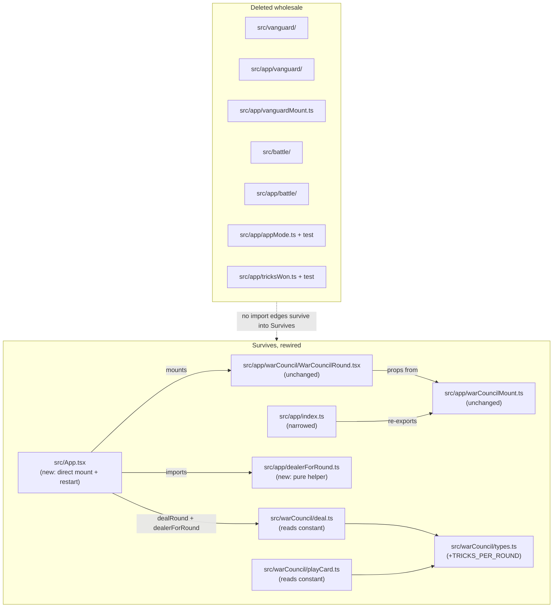

# Plan: Strip the Vanguard and battle-loop layers back to the War Council core

Plan folder: `.claude/contract/DLR-47-strip-vanguard-battle-to-war-council-core/`
Execution status: see `tasks.md` in this folder.

---

## Part 1 — Alignment

### Task reference

**DLR-47** — "Strip the Vanguard and battle-loop layers back to the War Council core," child of epic
DLR-46 ("The Hunt — playable run prototype"). Verbatim acceptance criteria from the ticket:

1. These paths no longer exist: `src/vanguard/`, `src/app/vanguard/`, `src/app/vanguardMount.ts`,
   `src/battle/`, `src/app/battle/`, `src/app/appMode.ts`, `src/app/__tests__/appMode.test.ts`.
2. `src/App.tsx` mounts a single War Council round directly — it deals a fresh round via
   `src/warCouncil/deal.ts` and renders `src/app/warCouncil/WarCouncilRound.tsx` — and `npm run dev`
   opens a playable 13-trick round with no console error.
3. `src/app/tricksWon.ts` and its test are deleted. `TRICKS_PER_ROUND` is consolidated into
   `src/warCouncil/` as a single exported constant and the two places that currently assert 13
   inline (`src/warCouncil/playCard.ts`, `src/warCouncil/deal.ts`) read it. `isValidTricksWon` is
   deleted outright — its only consumers were the Vanguard trick-entry form and match reducer.
4. `src/app/index.ts` re-exports only what survives; no export in it resolves to a deleted file.
5. `.docs/implementation/vanguard.md`, `vanguard-ui.md`, `battle.md`, and `battle-ui.md` are
   deleted; `.docs/implementation/README.md`'s module table lists only surviving modules and its
   closing prose no longer describes a battle loop; `.docs/implementation/app.md` no longer
   documents `AppMode`, the trick-count validator, or the Vanguard mount contract.
6. `.docs/game_rules/vanguard.md` is deleted.
7. `CLAUDE.md`'s "Game naming — the retained POC's vocabulary" section is removed, and its "Project
   state" section's file/module counts are corrected to what is actually on disk after this ticket.
   Adding §10's new Hunt vocabulary to `CLAUDE.md` is explicitly NOT part of this ticket.
8. `npm run typecheck`, `npm run lint`, `npm run format:check`, `npm test`, and `npm run build` are
   all green, and CI (`.github/workflows/ci.yml`) passes on the branch. Report the test count before
   and after so the drop is visible and attributable to deletion only.
9. No file under `src/warCouncil/` or `src/app/warCouncil/` changes behaviour. The only permitted
   edits there are the `TRICKS_PER_ROUND` consolidation in AC 3 and import-path fixes.

**Out of scope** (verbatim): any new Hunt behaviour; adding §10's Hunt vocabulary to `CLAUDE.md`;
refactoring/renaming/restructuring `src/warCouncil/` beyond AC 3 and AC 9; deleting
`src/styles/global.css` or War Council CSS; rewriting git history.

**Risk called out on the brief:** "over-deletion" — `src/app/warCouncil/` (nine components, six test
files) is the UI this epic keeps; a grep-for-`battle` sweep must not delete `roundReducer.ts`
comments that happen to mention the word. AC 9 is the guard. The brief also states the default
behaviour for `App.tsx`'s round-complete callback: "the default is a plain 'round over, deal again'
restart, replaced by the real run loop in T9/T10" — this is prescriptive, not an assumption this
plan is making.

**Pre-deletion commit for recoverability:** `10cbe53976e4f0a8582fd792b74db88efba6b082` (HEAD at
planning time, branch `Balatro-Forbidden-Solitaire`) — every deleted file is recoverable via
`git show 10cbe53976e4f0a8582fd792b74db88efba6b082:<path>` per `CLAUDE.md`'s recovery instructions.

### Restated goal

Delete everything in `src/` that belonged to the retired hex-board/battle-loop design direction —
the Vanguard engine and its UI, the battle-loop orchestrator and its UI, and the small App-shell
scaffolding built only to bridge War Council into that loop (`AppMode`, the trick-count validator,
`vanguardMount.ts`) — and rewire `src/App.tsx` to mount a standalone War Council round directly, so
every later ticket in the DLR-46 epic (which extends `src/warCouncil/`'s state shape) builds on one
game instead of maintaining a second one it doesn't touch. Consolidate the duplicated
`TRICKS_PER_ROUND` literal into one export inside `src/warCouncil/` as part of the same pass. Retire
the four implementation docs and the Vanguard rules doc that describe the deleted code, and correct
`CLAUDE.md`'s stale vocabulary section and file counts. Confirm the five verification gates and CI
are still green afterward, with before/after test counts reported.

### In scope

- Deleting `src/vanguard/`, `src/app/vanguard/`, `src/app/vanguardMount.ts`, `src/battle/`,
  `src/app/battle/`, `src/app/appMode.ts`, `src/app/__tests__/appMode.test.ts`,
  `src/app/tricksWon.ts`, `src/app/__tests__/tricksWon.test.ts`.
- Rewriting `src/App.tsx` to mount `WarCouncilRound` directly, dealing via `dealRound` and
  restarting with a fresh deal (alternating dealer) on `onComplete`.
- Rewriting `src/app/index.ts` so every export resolves to a surviving file.
- Consolidating `TRICKS_PER_ROUND` into `src/warCouncil/types.ts`, updating `deal.ts` and
  `playCard.ts` to read it.
- Deleting `.docs/implementation/vanguard.md`, `vanguard-ui.md`, `battle.md`, `battle-ui.md`, and
  `.docs/game_rules/vanguard.md`; rewriting `.docs/implementation/README.md`'s module table and
  closing prose, and `.docs/implementation/app.md`'s stale sections.
- Removing `CLAUDE.md`'s "Game naming" section and correcting its file/module counts.
- Confirming all five gates and CI pass; reporting before/after test counts.

### Explicitly out of scope

- Any new Hunt mechanic (Spoils, Standing, the Demand, Forage, the telegraph) — all later DLR-46
  tickets.
- Adding §10's Hunt vocabulary to `CLAUDE.md`.
- Any behavioural change to `src/warCouncil/` or `src/app/warCouncil/` beyond the
  `TRICKS_PER_ROUND` consolidation and import-path fixes (AC 9).
- Deleting `src/styles/global.css` or any War Council CSS.
- Rewriting git history — everything removed stays recoverable via `git show`.
- Building the real multi-round run loop (score persistence across rounds, a Muster-equivalent, a
  win condition) — the brief names this as T9/T10's job; `App.tsx`'s "deal again" restart here is
  explicitly a placeholder.
- Deciding who deals round 1 as a permanent rule — flagged under Risks, not silently invented.

### Pattern Reference

- `src/app/warCouncilMount.ts` (`WarCouncilMountProps`, `WarCouncilRoundResult`) — the contract
  `App.tsx` mounts against; unchanged by this ticket.
- `src/app/warCouncil/WarCouncilRound.tsx` — the mount being wired directly into `App.tsx`.
- `src/warCouncil/deal.ts` and `src/warCouncil/types.ts` — the deal function and the module's
  existing constant/type home, used as the destination for `TRICKS_PER_ROUND`.
- The deleted `src/app/battle/dealerForRound.ts` and its test
  (`src/app/battle/__tests__/dealerForRound.test.ts`) — a round-parity dealer-alternation helper
  this plan re-derives in miniature for `App.tsx`'s restart, without resurrecting
  `WAR_COUNCIL_FIRST_DEALER` from the deleted `src/battle/config.ts`.
- `.docs/implementation/app.md` §"`App.tsx` is now a five-line mount" — documents the pre-SCRUM-34
  dev-host shape (local `dealRound` call, direct `WarCouncilRound` mount) that this ticket's
  `App.tsx` design returns to, minus the `AppMode` switch.
- `.claude/skills/implementation-doc-writer/SKILL.md` — governs every `.docs/implementation/` edit.

### Constraints flagged on the brief

- AC 9 is a hard boundary: no behavioural change under `src/warCouncil/` or `src/app/warCouncil/`
  beyond the named consolidation and import fixes. The Implementer must diff-review every touched
  file in those trees against this constraint.
- AC 8 requires reporting the test count before and after, "so the drop is visible and attributable
  to deletion only" — a regression hidden inside the expected drop is exactly what this exists to
  catch.
- Recoverability: no `git push --force`, no branch deletion, no history rewrite. Plain deletions and
  commits only.
- The over-deletion risk named on the brief: a word-level grep for `battle` must not catch
  `roundReducer.ts` prose that merely uses the word in a comment.

### Assumptions made

- **`App.tsx`'s restart alternates the dealer by round parity**, mirroring the deleted
  `dealerForRound.ts`'s logic (round 1 = first dealer, then alternate), rather than dealing every
  restart from the same fixed dealer. *Rationale:* `.docs/game_rules/fox-in-the-forest.md` states
  the dealer alternates every round as a core rule; the deleted orchestrator already implemented
  this; reproducing it in miniature costs one pure helper and keeps the placeholder's behaviour
  closer to the eventual real rule than a constant dealer would.
- **The dealer-alternation helper is extracted to its own pure file**,
  `src/app/dealerForRound.ts`, rather than inlined in `App.tsx`. *Rationale:* it has a genuine
  testable invariant (parity-based alternation), and `react-frontend`'s skill prefers a pure module
  for anything with a testable invariant over untestable logic buried in a component.
- **The first-round dealer default carries forward the exact placeholder the deleted
  `src/battle/config.ts` shipped** (`PlayerSide.Player`), keeping its "developer decision, not a
  design fact" framing verbatim in the new file's comment, rather than re-litigating a choice that
  was already made and shipped. *Rationale:* per project memory, transcribed/shipped placeholder
  defaults for undecided tuning are pre-approved to carry forward rather than re-blocking the
  pipeline — see Risks for the explicit flag anyway, since it is genuinely undecided.
- **`App.tsx` holds two `useState` slots (`round`, `dealt`) rather than a reducer.** *Rationale:*
  `react-frontend`'s MUST rule requires a reducer for non-trivial state; two co-varying primitives
  updated together in one handler, with no branching transition logic, does not clear that bar —
  matching `WarCouncilRound.tsx`'s own precedent of keeping trivial local state as plain hooks and
  reserving `useReducer` for the round's actual multi-way transition logic.
- **`eslint.config.js`'s pure-core override glob drops `'src/vanguard/**/*.{ts,tsx}'`.** *Rationale:*
  AC 1 deletes `src/vanguard/` entirely; leaving the glob in place is dead configuration pointing at
  a path that no longer exists, and `.claude/skills/react-frontend/SKILL.md` documents this exact
  override as scoped to whichever trees currently need the pure-core boundary — `src/vanguard/` no
  longer does, because it no longer exists.
- **`.claude/workflow/web-project.md`'s stale file/module counts and its Layout tree's `battle/` and
  `vanguard/` entries are corrected as part of this ticket**, even though only `CLAUDE.md` is named
  in AC 7. *Rationale:* `CLAUDE.md`'s own single-source-of-truth table names
  `web-project.md` as the sole owner of "where code lives" facts — leaving it stale while fixing
  `CLAUDE.md` would recreate the exact "restated in five files, updated in four" defect this
  project's conventions exist to prevent, and the very next `/fb-plan` run reads that file first.
  Flagged under Risks in case the developer wants this split into a follow-up instead.
- **`war-council.md` and `war-council-ui.md` get their dead cross-references to `vanguard.md` /
  `battle.md` fixed, not their substantive content rewritten.** *Rationale:* AC 5 does not name
  these two docs, and AC 9's "no behaviour change" boundary combined with the brief's own
  over-deletion warning argues for a minimal, surgical touch — but leaving a Markdown link pointing
  at a file this same ticket deletes is a broken reference the moment this ticket lands. Only the
  specific sentences citing the deleted docs are adjusted (past-tense, no dangling link); no
  mechanic description is removed or reworded.
- **`App.tsx`'s `onComplete` handler ignores the completed round's `WarCouncilRoundResult`** (score,
  final state) rather than displaying or logging it. *Rationale:* the brief's own risk note frames
  this callback's only job here as "a plain 'round over, deal again' restart" — there is no score
  display, Muster conversion, or match-level state left to feed once `src/battle/` and
  `src/vanguard/` are gone, and building one is explicitly T9/T10's job.

### Config and persisted-shape audit

- **`TRICKS_PER_ROUND` rename target (moving from `src/app/tricksWon.ts` to
  `src/warCouncil/types.ts`).** Grep for `TRICKS_PER_ROUND` across `src/`: 8 hits total —
  `src/app/tricksWon.ts` (definition + 2 uses), `src/app/index.ts` (re-export),
  `src/app/vanguard/TrickEntryForm.tsx` (import + 4 uses), `src/app/__tests__/tricksWon.test.ts`
  (import + 2 uses). Every hit outside `tricksWon.ts` itself lives inside a file this plan already
  deletes (`src/app/index.ts` is rewritten, not deleted, but its `TRICKS_PER_ROUND` re-export line
  is simply dropped) — **zero surviving readers need updating to the new import path**, because the
  only two call sites the ticket names as needing to *read* the new constant
  (`src/warCouncil/playCard.ts`'s `tricksPlayed === 13` and `src/warCouncil/deal.ts`'s
  `slice(0, 13)` / `slice(13, 26)`) currently hard-code the literal `13` rather than importing the
  old constant at all. Confirmed by grep: neither file currently imports from `tricksWon.ts`.
- **`isValidTricksWon` consumers.** Grep for `isValidTricksWon`: 4 hits — its own definition
  (`tricksWon.ts`), `src/app/index.ts`'s re-export, `src/app/vanguard/matchReducer.ts`'s call site,
  and `src/app/__tests__/tricksWon.test.ts`'s test. All three non-definition hits are inside files
  this plan deletes or rewrites; zero survivors depend on it.
- **`AppMode` consumers.** Grep for `AppMode`: `src/app/appMode.ts` (definition),
  `src/app/index.ts` (re-export), `src/app/__tests__/appMode.test.ts` (test). Per
  `.docs/implementation/app.md`'s own Deferred section, "nothing in the running app reads it any
  more" — confirmed, zero runtime consumers exist today, so deleting it changes no running
  behaviour.
- **`src/app/index.ts` exports.** Of its five export lines, four resolve to files this plan deletes
  (`appMode.ts`, `tricksWon.ts`, `vanguardMount.ts`); only the `warCouncilMount.ts` line
  (`WarCouncilMountProps`, `WarCouncilRoundResult`) survives. No external consumer of `src/app`'s
  barrel exists outside the deleted trees and `App.tsx` (which imports the mount directly by path
  today, not via the barrel, per `app.md`'s documented case-collision workaround) — so narrowing the
  barrel breaks nothing on the surviving side.
- **Nothing under `src/warCouncil/` or `src/app/warCouncil/` is persisted** (no `localStorage`, no
  save file) — confirmed by the `no-restricted-globals` ESLint override already barring
  `localStorage`/`sessionStorage` from `src/warCouncil/`, and no such usage exists under
  `src/app/warCouncil/` either (grep: zero hits for `localStorage|sessionStorage` in that tree).
  This is a cheap window and stays open after this ticket.
- **Architectural boundary check.** `eslint.config.js`'s pure-core override currently scopes
  `src/warCouncil/**` and `src/vanguard/**`. After deletion the `src/vanguard/**` half of that glob
  points at nothing; the design in this plan drops it explicitly (see Assumptions) rather than
  leaving a dead entry. `src/warCouncil/**`'s half of the override is untouched — AC 9 requires it
  stay in force with zero behavioural change.

---

## Part 2 — Technical design

### Approach

This is almost entirely subtractive. Seven filesystem subtrees/files come out
(`src/vanguard/`, `src/app/vanguard/`, `src/app/vanguardMount.ts`, `src/battle/`, `src/app/battle/`,
`src/app/appMode.ts` + its test, `src/app/tricksWon.ts` + its test), and the audit above establishes
that every one of them has zero surviving consumers once the others are also deleted — so there is
no phase-ordering hazard where deleting one breaks a survivor that still imports it; the entire
deletion set can be removed as a single atomic phase and the project still type-checks against it
zero, because nothing outside the set imports into it.

The one piece of genuinely new logic is `App.tsx`'s replacement content, and it is deliberately
small: a two-`useState` component (current round number, the currently dealt `RoundState`) plus one
extracted pure helper, `dealerForRound` (round → `PlayerSide`, alternating by parity from a
placeholder first-dealer constant). The helper is pure and — per the brief's explicit steer that
this restart behaviour is a placeholder pending T9/T10's real run loop — deliberately does nothing
with the completed round's score or final state beyond triggering the next deal. It lives in
`src/app/dealerForRound.ts` rather than inside `App.tsx` itself, for the same reason the deleted
`src/app/battle/dealerForRound.ts` was its own file: it has a testable invariant (parity
alternation) that a plain top-level component helper would leave untested without a renderer.
`App.tsx` itself stays a thin orchestration component — no reducer, because two co-varying primitive
values updated together by a single handler with no internal branching does not meet the "non-trivial
state" bar the project's MUST rule sets for reducers.

`TRICKS_PER_ROUND`'s consolidation is a rename-and-centralise, not a behaviour change: it moves from
the doomed `src/app/tricksWon.ts` into `src/warCouncil/types.ts` alongside that module's other
shared constants (`Suit`, `RANKS`, `CardRank`, `RoundPhase`, …), is re-exported from
`src/warCouncil/index.ts` the same way those are, and the two call sites the ticket names
(`deal.ts`'s hand-size slices, `playCard.ts`'s round-completion check) switch from the bare literal
`13` to the named import. Every existing assertion in `deal.test.ts` and `playCard.test.ts` still
expects `13` as a raw number — those don't change, and their continuing to pass unmodified after the
substitution is the actual proof the consolidation didn't alter behaviour, which is what AC 9
requires for `playCard.ts` (deal.ts is not under the AC 9 boundary text, but is held to the same
standard by AC 3).

Documentation work is a straightforward mirror of the code deletions: four whole files go
(`vanguard.md`, `vanguard-ui.md`, `battle.md`, `battle-ui.md`, plus `.docs/game_rules/vanguard.md`),
`README.md`'s module table drops the four corresponding rows and its closing prose stops describing
`BattleHost`'s sequencing, and `app.md` loses the sections describing `AppMode`,
`isValidTricksWon`/`TricksWon`/`TRICKS_PER_ROUND`'s old home, `vanguardMount.ts`'s types, and the
battle-host mount narrative — replaced with a short section describing the new direct
`App.tsx` → `WarCouncilRound` mount. `war-council.md` and `war-council-ui.md` keep their substance
but lose the handful of sentences that would otherwise link to a file this same ticket deletes.
`CLAUDE.md` loses its "Game naming" section outright (the vocabulary it defines belonged to the
deleted modules) and gets its file/module counts in "Project state" corrected to match the
post-deletion tree; `.claude/workflow/web-project.md` gets the same count/tree correction for the
reason given in Assumptions — it is the single named owner of that fact.

### Skills to invoke during execution

- `react-frontend` — owns `App.tsx`, `src/app/index.ts`, `src/app/dealerForRound.ts`,
  `src/warCouncil/types.ts` / `deal.ts` / `playCard.ts`, and every deletion under `src/`. Applies to
  every code-touching task in this plan.
- `implementation-doc-writer` — owns every edit under `.docs/implementation/`: the four file
  deletions, the `README.md` table/prose rewrite, and `app.md`'s rewrite.
- `game-ux` — considered and dropped by explicit developer choice at the Step 1.5 skill-confirmation
  gate. No new layout or interaction surface is introduced; `App.tsx` only decides what happens
  between rounds (immediate re-deal), which is orchestration, not screen layout.
- Also Read: `.claude/workflow/web-project.md` (runner commands, layout, correctness traps) and
  `.claude/rules/README.md` (scanned; folder is empty, no rule file applies to this ticket).

### Diagram



### Data shapes

#### `src/warCouncil/types.ts` — new export

```ts
// Alongside the module's existing shared constants (Suit, RANKS, CardRank, RoundPhase, …).
// Consolidates the round-length literal previously duplicated as a bare `13` in playCard.ts
// and deal.ts, and separately declared in the now-deleted src/app/tricksWon.ts.
export const TRICKS_PER_ROUND = 13
```

Re-exported from `src/warCouncil/index.ts` alongside the module's other value exports:
`export { TRICKS_PER_ROUND, /* existing: */ AbilityChoiceKind, CardRank, currentTurn, IllegalMoveReason, otherSide, PlayerSide, RoundPhase, Suit } from './types'`.

#### `src/warCouncil/deal.ts` — modified call sites

```ts
// Before: shuffled.slice(0, 13) / shuffled.slice(13, 26) / shuffled.slice(26)
// After:
const playerHand = shuffled.slice(0, TRICKS_PER_ROUND)
const cpuHand = shuffled.slice(TRICKS_PER_ROUND, TRICKS_PER_ROUND * 2)
const remaining = shuffled.slice(TRICKS_PER_ROUND * 2)
```

#### `src/warCouncil/playCard.ts` — modified call site

```ts
// Before: const phase = tricksPlayed === 13 ? RoundPhase.Complete : RoundPhase.AwaitingLead
// After:
const phase = tricksPlayed === TRICKS_PER_ROUND ? RoundPhase.Complete : RoundPhase.AwaitingLead
```

#### `src/app/dealerForRound.ts` — new file

```ts
import { otherSide, PlayerSide } from '../warCouncil'

// Configuration: no stated default in the brief or design docs for who deals round 1 —
// placeholder pending developer confirmation (see plan.md Part 1 -> Risks and judgement calls).
// Carries forward the exact value the deleted src/battle/config.ts shipped.
const FIRST_DEALER: PlayerSide = PlayerSide.Player

/** Round 1 uses FIRST_DEALER; every later round alternates by parity alone. App.tsx's restart
 * is a placeholder ahead of the real run loop (T9/T10) and tracks no state across rounds beyond
 * this alternation. */
export function dealerForRound(round: number): PlayerSide {
  const usesFirstDealer = (round - 1) % 2 === 0
  return usesFirstDealer ? FIRST_DEALER : otherSide(FIRST_DEALER)
}
```

#### `src/App.tsx` — full replacement

```tsx
import { useState } from 'react'
import { dealRound, type WarCouncilState } from './warCouncil'
import type { WarCouncilRoundResult } from './app/warCouncilMount'
import WarCouncilRound from './app/warCouncil/WarCouncilRound'
import { dealerForRound } from './app/dealerForRound'

function App() {
  const [round, setRound] = useState(1)
  const [dealt, setDealt] = useState<WarCouncilState>(() =>
    dealRound(dealerForRound(1), Math.random),
  )

  function handleComplete(_result: WarCouncilRoundResult) {
    const next = round + 1
    setRound(next)
    setDealt(dealRound(dealerForRound(next), Math.random))
  }

  return <WarCouncilRound key={round} initialState={dealt} onComplete={handleComplete} />
}

export default App
```

`_result` is intentionally unread — see Part 1 → Assumptions for why the placeholder restart ignores
the completed round's score/final state.

#### `src/app/index.ts` — full replacement

```ts
export type { WarCouncilMountProps, WarCouncilRoundResult } from './warCouncilMount'
```

#### `eslint.config.js` — modified glob (config change, no new key)

```js
// Before: files: ['src/warCouncil/**/*.{ts,tsx}', 'src/vanguard/**/*.{ts,tsx}'],
// After:
files: ['src/warCouncil/**/*.{ts,tsx}'],
```

No other field in that block changes — `no-restricted-imports` and `no-restricted-globals` stay
exactly as they are, still enforced against `src/warCouncil/**` per AC 9.

No persisted-shape, storage-key, or reason-code changes — confirmed in the Step 1.6 audit above.

### Runtime quality notes

- **Purity and adjudication:** `dealerForRound` is pure and DOM-free, matching its deleted
  predecessor. `App.tsx` makes no rule decision of its own — it only calls `dealRound` and
  `dealerForRound`, both owned by `src/warCouncil`/`src/app`. `FIRST_DEALER` is a named, commented
  placeholder constant rather than a bare literal, flagged as a developer decision the same way its
  predecessor was.
- **Effects, mount and teardown:** `App.tsx` introduces no effect, no listener, no timer, no
  observer — identical to `WarCouncilRound.tsx`'s own documented "no effect anywhere in this
  component." StrictMode's double-invocation is safe because both state initializers
  (`useState(() => dealRound(...))`) and `handleComplete` are pure/idempotent with respect to being
  called twice for the same inputs — a double-fire produces an equally valid, just discarded, extra
  deal, never a leaked resource. No module-level mutable state is introduced anywhere in this plan.
- **Hot-path cost:** Nothing here runs per pointer event — `App.tsx`'s only work happens once per
  round transition (13-trick cadence at most), not per interaction. `dealRound` is bounded work over
  a fixed 33-card deck, called once per round exactly as it already was.
- **Determinism and numeric safety:** `dealRound(dealer, Math.random)` matches the existing
  production call pattern (no seeded-RNG requirement stated on this brief, same as the code being
  replaced). `dealerForRound`'s parity arithmetic has no divide-by-zero or degenerate-input path —
  `round` only ever increments from 1 via `App.tsx`'s own handler, never supplied externally.
- **Error paths:** No new async surface, no new error path — `WarCouncilRound`'s existing
  `cpuFault` handling is unchanged (AC 9). Deletion of `isValidTricksWon` removes the one existing
  validation gate in this area, but its only reason to exist was gating the now-deleted manual
  trick-entry harness; no surviving code path constructs an unvalidated `TricksWon` value, so no
  validation gap opens on the surviving side.

### Risks and judgement calls

- **First-round dealer default (`FIRST_DEALER = PlayerSide.Player`) is carried forward from the
  deleted `src/battle/config.ts`, not freshly chosen.** It was already a flagged, undecided
  placeholder there. Confirm at approval whether to keep it, flip it, or make it random — this plan
  defaults to "keep the shipped value" rather than reopening an already-placeholder decision.
- **Whether `App.tsx`'s restart should alternate the dealer at all, vs. always dealing from the same
  side**, is this plan's own design call (see Assumptions) rather than something the brief states
  outright. Low-risk either way since T9/T10 replaces this whole mechanism, but worth a sanity check
  since it's new code, not a preserved behaviour.
- **`.claude/workflow/web-project.md`'s stale counts/tree are corrected here rather than deferred to
  a follow-up**, even though AC 7 only names `CLAUDE.md`. If the developer would rather keep this
  ticket narrowly scoped to exactly the named files, say so and this plan drops that task — but
  leaving it stale contradicts the project's own single-source-of-truth convention the moment this
  ticket lands.
- **`war-council.md` / `war-council-ui.md` get minimal reference fixes, not a full pass.** If the
  developer wants those docs left completely untouched (accepting a dangling link to a deleted file
  until a later ticket), say so and this plan drops that sub-task from Phase 3.
- **Whether `App.tsx` deserves its own component test** (rendering the mount, or driving
  `dealerForRound` directly) is a judgement call this plan resolves by testing `dealerForRound` as a
  pure unit (cheap, real coverage of the one piece of new logic) and relying on QA's
  `chrome-devtools`-driven check of AC 2's "opens a playable 13-trick round with no console error"
  for the mount itself, rather than adding a heavier `App.test.tsx` that would need to drive a full
  13-trick round through the DOM to prove anything beyond what a render smoke-test already shows.
  Flagging in case the developer wants a render-level smoke test added anyway.
- **Total file count trimmed is ~91** (142 → 51 source files, 54 → 18 test files by direct count of
  the deletion set), larger than the brief's own "~70" estimate. This is expected — the brief's
  estimate undercounts `src/vanguard/`'s and `src/app/vanguard/`'s test files — but worth surfacing
  since AC 8 asks for the before/after count to be reported precisely: baseline measured at planning
  time is **54 test files, 410 tests total** (Vitest `node` project: 44 files / 359 tests; `dom`
  project: 10 files / 51 tests).
