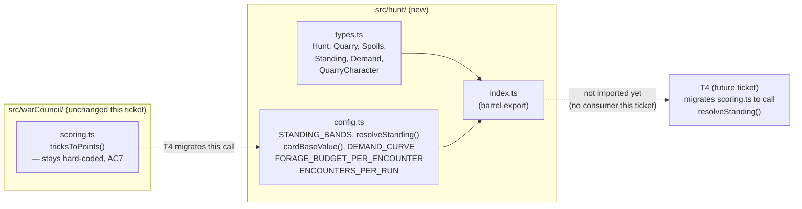

# Plan: Hunt configuration module and Hunt domain types

Plan folder: `.claude/contract/DLR-48-hunt-config-and-domain-types/`
Execution status: see `tasks.md` in this folder.

---

## Part 1 — Alignment

### Task reference

**Jira: DLR-48 — "Hunt configuration module and Hunt domain types"**, project DLR ("DeLorean 1.21"), Task, priority Highest. Full acceptance criteria (verbatim from the ticket):

1. A configuration module exists (`src/hunt/config.ts` or equivalent under a new `src/hunt/` module) exporting, as named constants with a one-line comment each citing its §9 row: the Standing band table (boundaries **and** multipliers), card base values, the Demand curve (base and growth), the Forage budget per encounter, and encounters per run.
2. The Standing table is a data structure of `{ minTricks, maxTricks, name, multiplier }` — band _boundaries_ and band _values_ separately editable, because §1 fixes the boundaries and §9 reopens the values.
3. Provisional values are set to: Standing ×6 / ×1 / ×2 / ×3 / ×6 / ×0 (Humble / Defeated 4,5,6 / Victorious / Greedy), card base value = **printed rank**, Forage budget = **4**, encounters per run = **5**. Each carries a comment marking it provisional and naming §9's stated measurement. These are placeholders, not decisions.
4. A Hunt types file exports the §10 vocabulary as types: `Hunt`, `Quarry`, `Spoils`, `Standing`, `Demand`, plus `QuarryCharacter` as a union of the five odd-rank characters. No `Snare` type — §3's in-round layer is blocked and out of scope for this epic.
5. A single exported function resolves a trick count to its Standing band and multiplier by reading the table, and is the only place in `src/` that does so.
6. Vitest coverage proves: every trick count 0–13 resolves to exactly one band; the table has no gap and no overlap across 0–13; and changing a multiplier in the config changes the resolved value with no other edit.
7. Nothing in this ticket changes runtime behaviour of the existing round — `scoring.ts`'s `tricksToPoints` is migrated to read the table in T4, not here.
8. `npm run typecheck`, `npm run lint`, and the scoped Vitest run are green.

In scope: one configuration module holding every §9 value named above; one types file holding §10's vocabulary; the band-resolution function and its tests.
Out of scope (per ticket): applying any of these values to gameplay (T3 Spoils, T4 Standing/Demand, T11 Forage); a settings UI or any runtime config editor; persisting config to disk or `localStorage`; §3's in-round edit layer (Snare).
Blocked by T1 (DLR-47) — confirmed complete (`.claude/contract/DLR-47-strip-vanguard-battle-to-war-council-core/tasks.md` → `Status: COMPLETE`); `src/warCouncil/` is the single game module this adds alongside.
Design source: `.docs/design/Balatro-Forbidden-Solitaire/hybrid-design.md` §9 (value table + measurements), §10 (vocabulary), §1 (band boundaries), §3 (ceiling/ceiling-dependency argument for card base value), §6 (Humble-dominance proof), §11 (says the Standing table "has to be true from the first commit").

### Restated goal

Give every downstream Hunt ticket one place to read tunable numbers from, and one place the Hunt/run vocabulary is typed, so that no later ticket invents an incompatible shape or a second copy of the Standing table. Concretely: a new `src/hunt/` module holding (a) a configuration file with the Standing band table, the card-value rule, the Demand curve shape, the Forage budget, and the encounters-per-run count, each read from a single exported resolver where applicable, and (b) a types file holding the five §10 vocabulary terms plus `QuarryCharacter`. Nothing wires these into the running game this ticket — `scoring.ts` keeps its own hard-coded table until T4 migrates it, by the ticket's own AC7.

### In scope

- `src/hunt/config.ts` (or split across `src/hunt/config.ts` + a co-located module) exporting: the Standing band table, a card-base-value rule/function, the Demand curve shape, the Forage budget constant, the encounters-per-run constant — each with a one-line comment citing its §9 row.
- `src/hunt/types.ts` exporting `Hunt`, `Quarry`, `Spoils`, `Standing`, `Demand`, `QuarryCharacter`.
- One exported function (`resolveStanding`) that maps a trick count to its Standing band by reading the table — the only new lookup point for this data.
- `src/hunt/index.ts` barrel export, matching `src/warCouncil/index.ts`'s existing pattern.
- Vitest coverage for the resolver: full 0–13 coverage, gap/overlap check, and a mutation test proving the function reads the table rather than embedding its own copy.
- Extending the existing pure-core ESLint boundary (currently scoped to `src/warCouncil/**` in `eslint.config.js`) to also cover `src/hunt/**`, since this is exactly the "meaningful non-UI logic with invariants worth unit-testing" moment the `react-frontend` skill names as the trigger to establish it — and here the boundary already exists on disk, so this is a one-line extension, not new machinery.
- Correcting `.claude/workflow/web-project.md` → "Architectural boundaries", which currently states no boundary is enforced; that is stale relative to the `src/warCouncil/**` ESLint block already on disk (predates this plan). Fixed at the source per `CLAUDE.md`'s single-source-of-truth rule, in the same task that extends the boundary to `src/hunt/**`.

### Explicitly out of scope

- Changing `src/warCouncil/scoring.ts`'s `tricksToPoints` or any other runtime behaviour of the current round (AC7 — that migration is T4).
- Wiring `Spoils` to actual card capture, `Standing`/`Demand` to a running score check, or `Forage` to a deck edit (T3, T4, T11).
- A settings UI, debug panel, or any runtime way to edit configuration (edited in source, page reloaded — sufficient for a prototype).
- Persisting configuration to disk or `localStorage`.
- The `Snare` in-round edit layer — explicitly blocked, no type or stub for it.
- Choosing the Demand curve's actual base/growth numbers — §9 marks this row "Undecided," AC3 supplies no provisional value for it (unlike the other four rows), and inventing one here would be exactly the mistake DoD 8 and §9 exist to prevent. See Risks.
- Renaming or touching Jira/CI/build tooling beyond the one `eslint.config.js` line and the one stale doc line named above.

### Pattern Reference

- `src/warCouncil/types.ts` — the `as const` object-plus-derived-union pattern for a fixed named set (`Suit`, `PlayerSide`, `RoundPhase`, `CardRank`), used verbatim for `QuarryCharacter` and the Standing band's `name` field. `erasableSyntaxOnly` is on, so no TS `enum`.
- `src/warCouncil/scoring.ts` + `src/warCouncil/__tests__/scoring.test.ts` — the exact band values this ticket transcribes into config, and the `it.each` parametrized-table test style to mirror for `resolveStanding`'s 0–13 coverage.
- `src/warCouncil/index.ts` — the type-export/value-export barrel split to copy for `src/hunt/index.ts`.
- `eslint.config.js` lines 23–58 — the pure-core boundary block already enforced for `src/warCouncil/**`; extend its `files` array rather than pasting a second copy.

### Constraints flagged on the brief

- DoD 8 (cited in the ticket's Problem Statement): a search of `src/` must find no hard-coded Standing multiplier, Demand value, or Forage budget outside this config module. This ticket's own scoring.ts stays hard-coded per AC7 — the constraint targets everything written *after* this ticket, and T16 verifies it by search across the whole epic.
- §11: "the configurable band table has to be true from the first commit" — the resolver must read `STANDING_BANDS`, never re-embed the six numbers.
- No new runtime dependency (none needed here).
- File size budget: `.claude/skills/react-frontend/SKILL.md` — any file >400 lines is blocking; not a real risk at this size but stated for completeness.

### Assumptions made

- **`src/hunt/` is the module name.** The ticket says "`src/hunt/config.ts` or equivalent under a new `src/hunt/` module" — `src/hunt/` is used literally, matching the design doc's own framing of "the Hunt" as the round and giving downstream tickets (T3–T13) an unambiguous import path. *Confirmed by the brief itself, not a red-line-worthy guess.*
- **`resolveStanding` and `STANDING_BANDS` live in `config.ts` alongside the other four config values**, rather than a separate `standing.ts`. Rationale: `scoring.ts` already co-locates its table (`tricksToPoints`) with the function reading it, and the combined file is well under the 400-line budget (~60 lines). Splitting further would separate a table from its only reader for no benefit.
- **`resolveStanding` takes the table as an optional second parameter, defaulting to `STANDING_BANDS`.** This is what makes AC6's "changing a multiplier changes the resolved value with no other edit" independently testable without mutating the shared exported const between tests (module-level mutable state is a named trap in both `CLAUDE.md` and the `react-frontend` skill).
- **AC5's "the only place in `src/` that does so" is read as scoped to the resolution logic this ticket introduces, not retroactively to `scoring.ts`'s existing `tricksToPoints`.** AC7 explicitly keeps `tricksToPoints` hard-coded and unmigrated until T4, so the two ACs would contradict each other under a literal repo-wide reading. Flagged for the developer to confirm at the approval gate.
- **Card base value is modelled as a pure function `cardBaseValue(rank: number): number`, not a lookup table**, since AC3 fixes the rule to "printed rank" (i.e. `rank`), and eleven identical `{rank: rank}` table rows would be pure duplication for zero behavioural difference from the formula. The one-line §9-citing comment lives on the function.
- **The Demand curve is modelled as `{ base: number | null; growthPerEncounter: number | null }`, both starting `null`.** §9 marks this row "Undecided" and AC3 supplies no provisional value for it (unlike the other four rows) — inventing a number here is exactly what the ticket's own Problem Statement (quoting §9: "no number in it is a chosen value") forbids. `null` over a fake numeric default because a fake number is silently usable in arithmetic (the project's own `NaN`-propagation trap, generalised to "any unset tunable"); `null` fails loudly the moment a consumer reads it without a guard. Routed to the developer in Risks.
- **`Hunt` and `Quarry` are given minimal interface shapes** (`Hunt { quarry, demand }`, `Quarry { character }`) rather than left as bare type aliases, since §10 describes both as *things with content* ("the CPU opponent for one encounter," "one 13-trick round") rather than *measurements* the way `Spoils`/`Standing`/`Demand` are. §10 is a glossary, not a type spec, so this shape is this plan's own reading — flagged for developer red-line since it is the one piece of "vocabulary as types" genuinely invented rather than transcribed.
- **`StandingBandName` (`Humble`/`Defeated`/`Victorious`/`Greedy`) is defined in `config.ts`, not in the §10 types file**, since it is not one of AC4's five listed vocabulary terms — it is a value of the Standing table's `name` field, scoped to that table.
- **The pure-core ESLint boundary is extended to `src/hunt/**` in this ticket**, even though the brief doesn't ask for it. Rationale: the `react-frontend` skill names "the moment there is meaningful non-UI logic... worth establishing before the first component imports a helper" as the trigger, and that moment is now — `src/hunt/` is pure config, types, and one resolver, with zero React. The mechanism already exists on disk for `src/warCouncil/**`, so this is a one-array-entry extension, not new tooling. Flagged in Risks as an easy line to cut if the developer wants a narrower ticket.

### Config and persisted-shape audit

- **Every new identifier this plan introduces was checked for existing hits** — `Select-String`-equivalent grep across `src/` for `STANDING_BANDS`, `FORAGE_BUDGET_PER_ENCOUNTER`, `ENCOUNTERS_PER_RUN`, `DEMAND_CURVE`, `resolveStanding`, `cardBaseValue`, `StandingBand`: **0 hits for all six** — confirmed new, nothing to migrate.
- **`Hunt`, `Quarry`, `Spoils`, `Standing`, `Demand`, `QuarryCharacter`**: grepped across `src/` — **0 hits** for all six. No naming collision with anything already exported.
- **Nothing is persisted.** Grepped `src/` for `localStorage`/`sessionStorage` — **0 hits** anywhere in the codebase. This ticket adds no persisted or stored shape, and there is nothing existing to invalidate.
- **No type is being renamed, retyped, or removed** — every export in this plan is new. No loss-of-information case (`number→string`, array→object, required→optional, union widening) applies.
- **No existing exported constant or predicate changes.** `scoring.ts`'s `tricksToPoints` and `scoreRound` are read-only reference material for this plan (their six values are transcribed into `STANDING_BANDS`) and are not edited — confirmed by AC7.
- **Architectural boundary**: the pure-core ESLint block already exists for `src/warCouncil/**` (`eslint.config.js:23-58`) — contrary to `.claude/workflow/web-project.md`'s current "no enforced boundary yet" text, which this plan corrects in the same task that extends the block's `files` array to include `src/hunt/**`. `src/hunt/` as designed imports nothing from `react`/`react-dom` and touches no DOM global, so the boundary holds by construction; Final verification re-greps it.

---

## Part 2 — Technical design

### Approach

`src/hunt/` is added as a second pure-logic module alongside `src/warCouncil/`, structured the same way: a `types.ts` for shapes, a `config.ts` for tunable data plus the one function that reads it, and an `index.ts` barrel re-exporting both — mirroring `src/warCouncil/index.ts`'s existing type/value export split. Everything in the new module is a plain TypeScript value or pure function; nothing imports React or touches the DOM, and nothing calls into `src/warCouncil/`, `src/app/`, or vice versa — this ticket's whole job is to exist as a target for *later* tickets (T3–T6) to import from, not to wire anything live.

`config.ts` holds five exports, one per §9 row named in AC1: `STANDING_BANDS` (an array of `{minTricks, maxTricks, name, multiplier}` rows, transcribed from `scoring.ts`'s existing bands) plus `resolveStanding(tricks, table = STANDING_BANDS)` as the one function that reads it; `cardBaseValue(rank)`, a one-line pure function encoding "value = printed rank" per AC3; `DEMAND_CURVE`, a `{base, growthPerEncounter}` object left `null`/`null` because §9 states this row is undecided and AC3 supplies no number for it (see Risks — this is the one place this ticket must *not* invent a value, per `CLAUDE.md`'s rule that a tuning value is never an assumption); and the two standalone constants `FORAGE_BUDGET_PER_ENCOUNTER = 4` and `ENCOUNTERS_PER_RUN = 5`, both provisional numbers the ticket itself supplies in AC3. `resolveStanding` is deliberately given the table as an optional parameter rather than closing over the module-level const directly — that is what lets AC6's third requirement ("changing a multiplier changes the resolved value with no other edit") be demonstrated in a test without mutating shared module state between tests, which both `CLAUDE.md` and the `react-frontend` skill flag as a correctness trap (module-level mutable state survives HMR and leaks between tests).

`types.ts` holds the six AC4 exports as either type aliases (`Spoils`, `Standing`, `Demand` — each `number`, since §10 describes them as measurements with no further structure) or minimal interfaces (`Quarry { character: QuarryCharacter }`, `Hunt { quarry: Quarry; demand: Demand }` — since §10 describes these two as things with content, not bare numbers) plus the `QuarryCharacter` const-object union (`Swan | Fox | Woodcutter | Witch | Monarch`), following the exact `as const` pattern `CardRank` already uses one file over in `src/warCouncil/types.ts`. No `Snare` type is added, matching AC4's explicit exclusion.

The one piece of toolchain work is extending `eslint.config.js`'s existing pure-core block (currently `files: ['src/warCouncil/**/*.{ts,tsx}']`) to also list `src/hunt/**/*.{ts,tsx}`, and correcting the one paragraph in `.claude/workflow/web-project.md` that currently claims no such boundary exists. Both are one-line, low-risk changes riding along with the module that newly qualifies for the boundary — the `react-frontend` skill calls this exact situation (a fresh pure-logic tree with testable invariants) the right moment to establish it, and the mechanism is already proven code, not new tooling.

### Skills to invoke during execution

- `react-frontend` — governs everything under `src/`: the `as const` union pattern (no `enum`, `erasableSyntaxOnly` is on), the file-order convention (imports → constants → component/function → helpers → export), the 400-line file budget, "never hard-code a value that belongs in configuration" (the whole point of this ticket), and the Vitest posture (pure logic tested without a renderer, specs beside the logic they test).
- No developer override — this is the only skill the classification matched, and it is the normal case for TypeScript work in this repo.

Also read (not invoked as a `Skill` call, but load-bearing for execution): `.claude/workflow/web-project.md` (runner commands, the `src/warCouncil/**` boundary precedent this plan extends, the correctness traps this plan cites) and `.claude/rules/README.md` (scanned — currently empty, no project-wide rule file applies to this ticket).

### Diagram



### Data shapes

#### `src/hunt/types.ts`

```ts
export const QuarryCharacter = {
  Swan: 'swan',
  Fox: 'fox',
  Woodcutter: 'woodcutter',
  Witch: 'witch',
  Monarch: 'monarch',
} as const
export type QuarryCharacter = (typeof QuarryCharacter)[keyof typeof QuarryCharacter]

export interface Quarry {
  readonly character: QuarryCharacter
}

export type Spoils = number
export type Standing = number
export type Demand = number

export interface Hunt {
  readonly quarry: Quarry
  readonly demand: Demand
}
```

#### `src/hunt/config.ts`

```ts
export const StandingBandName = {
  Humble: 'humble',
  Defeated: 'defeated',
  Victorious: 'victorious',
  Greedy: 'greedy',
} as const
export type StandingBandName = (typeof StandingBandName)[keyof typeof StandingBandName]

export interface StandingBand {
  readonly minTricks: number
  readonly maxTricks: number
  readonly name: StandingBandName
  readonly multiplier: number
}

// §9 "Standing multipliers" — provisional, transcribed from the printed table.
// Undecided per §9/§6: at these values Victorious dominates Humble by
// construction; §6 computes the break-even at ×18. Band *boundaries* are
// fixed by §1 — only the multiplier column is a live decision.
export const STANDING_BANDS: readonly StandingBand[] = [
  { minTricks: 0, maxTricks: 3, name: StandingBandName.Humble, multiplier: 6 },
  { minTricks: 4, maxTricks: 4, name: StandingBandName.Defeated, multiplier: 1 },
  { minTricks: 5, maxTricks: 5, name: StandingBandName.Defeated, multiplier: 2 },
  { minTricks: 6, maxTricks: 6, name: StandingBandName.Defeated, multiplier: 3 },
  { minTricks: 7, maxTricks: 9, name: StandingBandName.Victorious, multiplier: 6 },
  { minTricks: 10, maxTricks: 13, name: StandingBandName.Greedy, multiplier: 0 },
]

export function resolveStanding(
  tricks: number,
  table: readonly StandingBand[] = STANDING_BANDS,
): StandingBand

// §9 "Card base values" — provisional: a card's value is its printed rank,
// not flat 1 (§3, §9 — flat 1 collapses Spoils×Standing to the
// single-variable function 2k×f(k); rank weighting keeps the two terms independent).
export function cardBaseValue(rank: number): number

export interface DemandCurve {
  readonly base: number | null
  readonly growthPerEncounter: number | null
}

// §9 "Demand base and growth rate" — shape only, undecided. Both fields stay
// null until the developer sets them (see Risks below); a consumer must not
// coerce null to 0.
export const DEMAND_CURVE: DemandCurve

// §9 "Forage budget per encounter" — decided, provisional (2026-08-09 per ticket AC3): 4 edits.
export const FORAGE_BUDGET_PER_ENCOUNTER: number // = 4

// §9 "Encounters per run" — undecided in §9 itself; AC3 sets a provisional 5
// so the prototype is playable.
export const ENCOUNTERS_PER_RUN: number // = 5
```

#### `src/hunt/index.ts`

Barrel export only — re-exports every symbol above, split into `export type {...}` / `export {...}` groups exactly as `src/warCouncil/index.ts` already does. No new shapes.

#### `eslint.config.js` (config change)

`files: ['src/warCouncil/**/*.{ts,tsx}']` → `files: ['src/warCouncil/**/*.{ts,tsx}', 'src/hunt/**/*.{ts,tsx}']` on the existing pure-core rule block (lines 23–58). No new rule content.

#### No persisted-shape change

Nothing in this ticket is written to `localStorage`, a save file, or any other persisted store — confirmed by the Step 1.6 audit above.

### Runtime quality notes

- **Purity and adjudication:** the entire `src/hunt/` module is pure — no component decides Standing or Demand logic itself; everything here is a plain function or constant a future component/hook will only ever *call*. Every tunable (Standing multipliers, card base value rule, Forage budget, encounters per run) is read from `config.ts`, never inlined at a call site — there are no call sites yet, which is the point.
- **Effects, mount and teardown:** not applicable — no component, no effect, no listener, no timer anywhere in this ticket's diff.
- **Hot-path cost:** `resolveStanding` does a linear scan of a 6-row array — irrelevant cost, and it isn't called from a render or pointer-event path in this ticket (nothing calls it yet). No memoisation needed or added.
- **Determinism and numeric safety:** no `Math.random()` anywhere in this module. No division exists anywhere in `config.ts`, so there is no `NaN`-from-zero-divisor risk. The one numeric-safety decision this ticket makes is `DEMAND_CURVE`'s fields staying `number | null` rather than a fabricated default — the generalised form of the project's `NaN`-propagation trap: an invented placeholder number would be silently usable in arithmetic later; `null` is not.
- **Error paths:** `resolveStanding` throws a `RangeError` for a trick count outside 0–13 (there is always exactly one matching band inside that range by construction, per AC6, so an out-of-range call is a caller bug, not a data gap — it should be loud, not swallowed into a default band). No async surface exists in this ticket, so the four async states don't apply.

### Risks and judgement calls

- **The Demand curve's actual `base` and `growthPerEncounter` values are undecided and this plan does not choose them.** §9 marks the row "Undecided," AC3 gives provisional numbers for the other four rows but not this one, and the design doc states plainly "no number in this section is a chosen value." The plan exports the key (`DEMAND_CURVE`) with both fields `null` and a comment explaining why. **Developer decision**, not before this ticket ships but before any ticket (T9) builds the curve on it.
- **AC5 ("the only place in `src/` that does so") vs. AC7 ("nothing in this ticket changes... `scoring.ts`'s `tricksToPoints` is migrated... in T4, not here") read as in tension under a literal whole-repo reading**, since `scoring.ts` already performs the identical trick-count → multiplier lookup and this ticket leaves it untouched. This plan resolves the tension by reading AC5 as scoped to the *new* resolution logic this ticket adds. Flagging for explicit developer confirmation rather than assuming silently.
- **Extending the pure-core ESLint boundary to `src/hunt/**` is this plan's own addition, not something the ticket text asks for.** It is cheap (one array entry, mechanism already proven for `src/warCouncil/**`) and directly matches what the `react-frontend` skill says to do at this exact moment. If the developer would rather keep this ticket narrower and defer the boundary, it's a one-line task to drop.
- **`Hunt` and `Quarry` are given small interface shapes rather than left unstructured**, since §10 is a glossary table, not a type spec — this is the one piece of "vocabulary as types" that is this plan's own reading rather than a transcription. Worth a specific look at the approval gate since T3–T6 will build directly on whatever shape ships here.
- **Whether `cardBaseValue` should be a function or a literal per-rank lookup table** — this plan chose a function (`rank => rank`) since AC3 fixes the rule to printed rank and a table would be eleven duplicate rows. If a future ticket needs to support the flat-value alternative §3/§9 discuss as a fork, that's a shape change for whichever ticket adopts it, not this one.
- **No dependency, UI, or app-running judgement call exists in this ticket** — it is pure, isolated TypeScript with no consumer yet, so there's nothing here that can only be judged by running the app.
