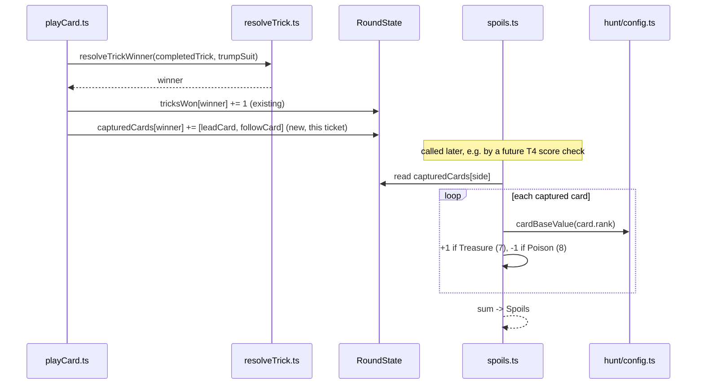

# Plan: Spoils — sum the value of captured cards

Plan folder: `.claude/contract/DLR-49-spoils-captured-card-value/`
Execution status: see `tasks.md` in this folder.

---

## Part 1 — Alignment

### Task reference

**Jira: DLR-49 — "Spoils: sum the value of captured cards"**, project DLR ("DeLorean 1.21"), Story, priority Highest, child of DLR-46. Full acceptance criteria (verbatim from the ticket):

1. `RoundState` retains the captured cards per side — a per-side list of the `Card`s taken in tricks that side won — alongside the existing `tricksWon` count, which is unchanged.
2. `playCard.ts` appends both cards of a resolved trick to the winner's captured list, in trick order, every trick.
3. A `spoils(state, side)` function returns the summed value of that side's captured cards, reading each card's base value from **T2's config**, never from a literal.
4. Poison 8s subtract and Treasure 7s add, per `fox-in-the-forest.md` and §1's component table: the trick's winner loses 1 per Poison in the trick and gains 1 per Treasure in it. Both are folded into `spoils`, not into a second number.
5. Invariant test: across a full 13-trick round, the two sides' captured lists together hold exactly 26 cards, with no card appearing twice and none missing.
6. Test: under a flat card value of 1, `spoils(state, side) === 2 × tricksWon[side]` — §3's stated identity, which is the cheapest proof the summation is correct.
7. Test: under the config's rank-weighted default, a hand-built round with a known capture set produces the hand-computed Spoils, including the Poison and Treasure adjustments.
8. Scoped Vitest run and `npm run typecheck` are green. No existing War Council test is weakened to accommodate the new field.

**Scope Boundaries (verbatim):** In scope — retaining captured cards in `RoundState`; the `spoils` function and Poison/Treasure adjustment; tests for the above. Out of scope — Standing, the Demand, `Score = Spoils × Standing` (T4); displaying Spoils on screen (T7); negative card values (§6 exit b, undecided in §9); Forage edits to card value (T11).

**Dependencies (verbatim):** Blocked by T2 (DLR-48) — confirmed `Status: COMPLETE` (`.claude/contract/DLR-48-hunt-config-and-domain-types/tasks.md`); reads card base values from `src/hunt/config.ts`. Blocks T4 (multiplies Spoils by Standing) and T7 (displays it). **Default taken (from the ticket itself):** captured cards are stored as a flat per-side list rather than grouped by trick — reversible, grouping can be added later without changing `spoils`'s signature.

**Design source:** `.docs/design/Balatro-Forbidden-Solitaire/hybrid-design.md` §1 (component table — Treasure/Poison as Spoils interventions), §3 (the `Spoils = 2k` identity), §11 (Spoils named as new work). `.docs/game_rules/fox-in-the-forest.md` → "Abilities" table (rank 7 = Treasure, rank 8 = Poison) and "Poison cards".

### Restated goal

Give the round engine a way to compute a score from the cards a side has actually captured, instead of only counting tricks. Concretely: `RoundState` grows a `capturedCards` field that `playCard.ts` fills in as tricks resolve, and a new pure function `spoils(state, side)` sums those cards' values — each read from T2's `cardBaseValue`, not a literal — with Poison (rank 8) subtracting 1 and Treasure (rank 7) adding 1 per card captured. Nothing in this ticket multiplies Spoils by Standing, checks it against a Demand, or displays it; it produces one correct number from one already-existing engine event (a trick resolving) and proves that number correct three ways (the 26-card invariant, the flat-value identity, and a hand-computed example with both adjustments).

### In scope

- `RoundState` (`src/warCouncil/types.ts`) grows a `capturedCards: Readonly<Record<PlayerSide, readonly Card[]>>` field alongside `tricksWon`.
- `playCard.ts`'s trick-resolution branch appends the trick's two cards, in trick order (lead card, then follow card), to the winner's `capturedCards` list.
- Every existing constructor of a `RoundState` literal (`dealRound` and every test fixture) initializes `capturedCards` to `{ player: [], cpu: [] }`.
- A new pure function `spoils(state, side)` in `src/warCouncil/spoils.ts`, exported from `src/warCouncil/index.ts`, that sums `cardBaseValue(card.rank)` over `state.capturedCards[side]`, with a +1/-1 adjustment per Treasure/Poison card captured.
- `CardRank` (`src/warCouncil/types.ts`) grows two named members, `Treasure: 7` and `Poison: 8`, so `spoils` never keys off a bare numeric literal.
- Tests: the AC2 single-trick append, the AC5 26-card round invariant, the AC6 flat-value identity, and the AC7 rank-weighted hand-computed example with both adjustments.

### Explicitly out of scope

- Standing, the Demand, or `Score = Spoils × Standing` (T4, DLR-46's next child ticket).
- Displaying Spoils anywhere in `src/app/` (T7). `src/app/warCouncil/labels.ts`'s `RANK_NAME` map is not extended with "Treasure"/"Poison" labels — that is presentation, and belongs to whichever ticket actually renders a card's name.
- Negative card values in general (§6 exit b) — undecided in §9 and explicitly out of the epic's scope. Poison's -1 is a fixed per-capture adjustment folded into `spoils`, not a change to `cardBaseValue` or to any card's stored value.
- Forage edits to card value (T11).
- Migrating `scoring.ts`'s `tricksToPoints`/`scoreRound` to read `src/hunt/config.ts` — that migration is T4's, per DLR-48's own AC7, and this ticket does not touch `scoring.ts`.
- Grouping captured cards by trick (a per-trick replay view) — the ticket's own "Default taken" fixes a flat per-side list.

### Pattern Reference

- `src/hunt/config.ts` → `cardBaseValue(rank)` — the T2 config function this ticket's `spoils` must read from, never re-deriving a card's value itself.
- `src/hunt/config.ts` → `resolveStanding(tricks, table = STANDING_BANDS)` — the injectable-second-argument pattern this plan reuses for `spoils`'s `cardValue` parameter, for the same reason DLR-48 gave it: testing an identity under an alternate value function without mutating shared module state.
- `src/warCouncil/types.ts` → `CardRank` — the `as const` named-rank pattern this plan extends with `Treasure`/`Poison` rather than introducing a second table.
- `src/warCouncil/playCard.ts` lines 88-99 — the exact trick-resolution branch this ticket's append logic lands beside, mirroring how `tricksWon` is already updated there.
- `src/warCouncil/__tests__/playCard.test.ts` lines 130-166, 169-219 — the existing single-trick and full-round test fixtures this plan extends rather than duplicates.
- `src/hunt/__tests__/config.test.ts` — the `it.each` / hand-computed assertion style to mirror for `spoils.test.ts`.

### Constraints flagged on the brief

- AC3: `spoils` must read card values from T2's config, "never from a literal" — no re-implementation of "value = rank" inside `spoils.ts`.
- AC4: Poison/Treasure "folded into `spoils`, not into a second number" — no second exported value, no separate `PlayerSide` record for adjustments.
- AC8: "No existing War Council test is weakened to accommodate the new field" — every fixture edit in this plan is additive (one new field on an object literal); no existing assertion is loosened, removed, or switched to a weaker matcher.
- No new runtime dependency; no config value in this ticket is undecided — `cardBaseValue` already ships with a decided provisional rule (T2), and Poison/Treasure's ±1 is fixed by the design doc and the base rules, not a developer-chosen tunable.

### Assumptions made

- **`CardRank` gains `Treasure: 7` and `Poison: 8`, extending the existing named-rank object rather than using bare `7`/`8` literals in `spoils.ts`.** The object's own comment already states the project's rule ("referenced by name... rather than as a bare numeric literal"); `fox-in-the-forest.md`'s ability table lists Poison and Treasure in the same row-set as the five ranks already named there, so this reads as the same concept, not a new one. The comment is updated from "the five odd ranks" (now inaccurate — Poison is even, and the set is seven) to "every rank with a named ability or scoring rule," with a note distinguishing Treasure/Poison as scoring interventions rather than play-time triggers. *Flagged for developer red-line — cheap to revert to inline literals in `spoils.ts` if preferred.*
- **`spoils` takes an optional third parameter, `cardValue: (rank: number) => number = cardBaseValue`, beyond AC3's literal two-argument signature.** This mirrors `resolveStanding`'s injectable `table` parameter from DLR-48, for the identical reason: AC6 needs "spoils under a flat card value of 1" independently testable, and the real `cardBaseValue` cannot itself be swapped without either mutating shared config (a named correctness trap in both `CLAUDE.md` and the `react-frontend` skill) or constraining the test to the three rank-1 cards that actually exist in a 33-card deck — too few to build a multi-trick fixture. The two-argument call (`spoils(state, side)`) still works unchanged for every non-test caller. *Flagged for developer red-line, same reasoning as DLR-48's `resolveStanding` precedent.*
- **Captured-card order is trick order — the lead card, then the follow card — regardless of which side led.** This is a direct reading of AC2's own wording ("in trick order"), not an invented choice, so it is recorded here for traceability rather than as a red-line item.
- **`spoils.ts` is a new file beside `scoring.ts` in `src/warCouncil/`, not added to `scoring.ts` itself.** `scoring.ts` is `tricksToPoints`/`scoreRound` — the Standing term, explicitly out of scope here (T4) — and keeping Spoils in its own file avoids coupling a T1-ticket change to a T4-owned file before T4 exists.
- **`spoils.ts` imports `cardBaseValue` and the `Spoils` type from `src/hunt` via `../hunt`.** This is the first cross-import between the two pure-logic trees (`src/warCouncil/**` and `src/hunt/**`); confirmed safe against `eslint.config.js`'s pure-core boundary, which restricts React/DOM imports only, not intra-`src` imports between two already-pure trees.

### Config and persisted-shape audit

- **`capturedCards`, `spoils`, `Treasure`, `Poison` (as `CardRank` members) — grepped across `src/`: 0 hits for all four.** All new; nothing to migrate, no naming collision with an existing export.
- **`Spoils` (the type) already exists** — `src/hunt/types.ts` (`export type Spoils = number`) and its barrel re-export `src/hunt/index.ts`. This plan's `spoils` function reuses that type as its return type rather than declaring a second one.
- **Every `RoundState` literal construction site was found by name** — grepped `tricksWon:\s*\{` across `src/`: **7 hits across 7 files** (`src/warCouncil/deal.ts`, `src/warCouncil/__tests__/types.test.ts`, `src/warCouncil/__tests__/playCard.test.ts`, `src/warCouncil/__tests__/legalMoves.test.ts`, `src/warCouncil/__tests__/abilities.test.ts`, `src/warCouncil/__tests__/cpuPlayer.test.ts`, `src/app/warCouncil/__tests__/roundFixture.ts`). Every hit is a factory function building a full `RoundState`/`WarCouncilState` object literal, and every one of the 7 needs a `capturedCards: { player: [], cpu: [] }` line added — the interface change makes the field required, so the TypeScript compiler enforces all 7 in the same task rather than letting one slip through silently.
- **This is a type-checked shape change, not a string-bound one** — `RoundState` is a TypeScript interface, so a missed constructor fails `npm run typecheck` loudly rather than silently producing `undefined`. The Step 1.6 "name-bound surface outside the type checker's view" risk (the reason this audit exists at all) does not apply to `capturedCards` itself; it does apply to the two `CardRank` literals below.
- **`CardRank.Treasure`/`CardRank.Poison`, once added, are consumed only inside `spoils.ts`** — no exhaustive `switch`, no `Record<CardRank, ...>` lookup anywhere in `src/` iterates over every `CardRank` member (confirmed by grepping every existing `CardRank` usage: `legalMoves.ts`, `resolveTrick.ts`, `abilities.ts`, `cpuPlayer.ts`, `playCard.ts`, `src/app/warCouncil/labels.ts`'s `RANK_NAME`, all key off specific named members, none iterate the whole object) — so adding two members cannot break an existing exhaustiveness check.
- **Nothing is persisted.** Grepped `src/` for `localStorage`/`sessionStorage`: **0 hits.** This ticket adds no persisted or stored shape, and there is nothing existing to invalidate.
- **No type is renamed, retyped, or removed.** `tricksWon` is explicitly unchanged (AC1). `capturedCards` is additive. No loss-of-information case (`number → string`, array → object, required → optional, union widening) applies.
- **Architectural boundary**: `src/warCouncil/**` and `src/hunt/**` both carry the pure-core ESLint block (`eslint.config.js`, extended to both in DLR-48). `spoils.ts` imports only `cardBaseValue`/`Spoils` from `../hunt` and named exports from `./types` — no `react`, no DOM global. Final verification re-greps both trees.

---

## Part 2 — Technical design

### Approach

The change has two independent pure-logic slices, sequenced so the codebase type-checks at every phase boundary. **Phase 1** widens `RoundState`'s shape and threads the new field through `playCard.ts`'s existing trick-resolution branch — the same branch that already updates `tricksWon` when `resolveTrickWinner` returns a winner, so `capturedCards` is updated in the same object-literal return, using the same `winner` value, with no new control flow. Every one of the 7 places that constructs a full `RoundState` literal (one production site, `dealRound`; six test-fixture factories) must gain the new required field in the same task as the interface change, per the project's mandatory shape-change task ordering — otherwise the phase boundary would leave the tree failing `npm run typecheck`.

**Phase 2** adds the actual scoring: a new pure function `spoils(state, side, cardValue = cardBaseValue)` in a new file, `src/warCouncil/spoils.ts`, that reduces over `state.capturedCards[side]`, summing `cardValue(card.rank)` and folding in a per-card ±1 for Treasure/Poison. This is deliberately a plain reduction over already-captured data, not a second pass over trick history — `capturedCards` is the single source of truth Phase 1 built, so `spoils` has nothing to recompute and nothing to get out of sync with `tricksWon`. The optional `cardValue` parameter exists purely for AC6's testability requirement (see Assumptions) and defaults to the real `cardBaseValue` for every non-test call.

Both phases stay entirely inside `src/warCouncil/` (plus the one new cross-import into `src/hunt/`'s config) — no React import, no DOM access, and no component or hook touches this ticket at all, so the whole diff is unit-testable without a renderer. `CardRank` gains two named members (`Treasure`, `Poison`) so `spoils.ts` never compares `card.rank` against a bare `7` or `8`, matching the project's existing "no literal for a rank that carries a rule" convention.

### Skills to invoke during execution

- `react-frontend` — governs everything under `src/`: the `as const` named-set pattern (extended here for `CardRank`), the file-order convention, the 400-line file budget (all touched files stay well under it), "never hard-code a value that belongs in configuration" (why `spoils` reads `cardBaseValue` rather than re-deriving it), and the Vitest posture (pure logic tested without a renderer, specs beside the logic they test).
- No developer override — this is the only skill the classification matched (pure logic under `src/warCouncil/`, no UI surface), and it is the normal case for TypeScript work in this repo.

Also read (not invoked as a `Skill` call, but load-bearing for execution): `.claude/workflow/web-project.md` (runner commands, the `src/warCouncil/**`/`src/hunt/**` pure-core boundary this plan's new cross-import must respect, the correctness traps cited above) and `.claude/rules/README.md` (scanned — currently empty, no project-wide rule file applies to this ticket).

### Diagram



### Data shapes

#### `src/warCouncil/types.ts`

```ts
export const CardRank = {
  Swan: 1,
  Fox: 3,
  Woodcutter: 5,
  Treasure: 7,
  Poison: 8,
  Witch: 9,
  Monarch: 11,
} as const

export interface RoundState {
  readonly dealer: PlayerSide
  readonly hands: Readonly<Record<PlayerSide, readonly Card[]>>
  readonly drawPile: readonly Card[]
  readonly decree: Card
  readonly trumpSuit: Suit
  readonly tricksWon: Readonly<Record<PlayerSide, number>>
  readonly capturedCards: Readonly<Record<PlayerSide, readonly Card[]>> // new
  readonly currentTrick: readonly TrickCard[]
  readonly leader: PlayerSide
  readonly tricksPlayed: number
  readonly phase: RoundPhase
}
```

#### `src/warCouncil/spoils.ts` (new file)

```ts
import { cardBaseValue, type Spoils } from '../hunt'
import { CardRank, type PlayerSide, type RoundState } from './types'

export function spoils(
  state: RoundState,
  side: PlayerSide,
  cardValue: (rank: number) => number = cardBaseValue,
): Spoils
```

Behaviour: `state.capturedCards[side].reduce(...)`, summing `cardValue(card.rank)` per card, +1 per card where `card.rank === CardRank.Treasure`, -1 per card where `card.rank === CardRank.Poison`.

#### `src/warCouncil/playCard.ts` (trick-resolution branch, no new exported shape)

The existing `PlayCardResult`'s `ok: true` branch return value gains one new key, `capturedCards`, alongside its existing `tricksWon` key — both computed from the same `winner`.

#### `src/warCouncil/index.ts` (barrel, one new export)

```ts
export { spoils } from './spoils'
```

#### No persisted-shape change

Nothing in this ticket is written to `localStorage`, a save file, or any other persisted store — confirmed by the Config and persisted-shape audit above.

### Runtime quality notes

- **Purity and adjudication:** `spoils.ts` and the `playCard.ts` append logic are both plain, DOM-free TypeScript — no component decides Spoils itself; a future consumer only ever calls `spoils(state, side)`. The one tunable this ticket touches, card base value, is read from `src/hunt/config.ts`'s `cardBaseValue`, never re-inlined. The Treasure/Poison ±1 is a fixed rule from the design doc and the base rules, not a developer-chosen tunable, so it is a literal `1`/`-1` inside `spoils.ts` rather than a configuration entry — no ticket, this one included, asks for that adjustment to be retunable.
- **Effects, mount and teardown:** not applicable — no component, no effect, no listener, no timer anywhere in this ticket's diff.
- **Hot-path cost:** `spoils` does one linear pass over a side's captured list, which is bounded at 13 cards for the life of a round (one trick's two cards, up to 13 times). Irrelevant cost, and nothing in this ticket calls it from a render or pointer-event path — there is no consumer yet (T4/T7 add the first ones). No memoisation needed or added.
- **Determinism and numeric safety:** no `Math.random()` anywhere in this diff. No division exists in `spoils.ts`, so there is no `NaN`-from-zero-divisor risk. `spoils`'s reduce starts from `0` and only ever adds finite integers (`cardValue(card.rank)` is `rank` by default, always 1-11; the ±1 adjustment is a literal), so the result is always a finite number.
- **Error paths:** `spoils` has no failure mode to guard — it reads an always-present, always-array `state.capturedCards[side]` (guaranteed by Phase 1's shape change; every `RoundState` has it, initialized empty, from the moment `dealRound` or a test fixture constructs it) and reduces over it; an empty list correctly sums to `0`. `playCard.ts`'s existing rejection paths (`IllegalMoveReason` cases) are untouched — this ticket's only change to `playCard.ts` is inside the already-successful trick-resolution branch, so no new error path is introduced or needs testing. No async surface exists in this ticket, so the four async states don't apply.

### Risks and judgement calls

- **`CardRank` gains `Treasure`/`Poison` as named members, extending an object whose own comment previously said "the five odd ranks."** This is this plan's own reading of "referenced by name, not a bare literal" extended to two ranks that carry a scoring rule rather than a play-time trigger. Cheap to revert to bare `7`/`8` literals inside `spoils.ts` alone if the developer would rather keep `CardRank` scoped to play-time abilities only.
- **`spoils` takes an optional third `cardValue` parameter beyond AC3's literal `spoils(state, side)` signature**, mirroring DLR-48's `resolveStanding(tricks, table?)` precedent, to make AC6's flat-value identity independently testable without mutating `src/hunt/config.ts`'s shared `cardBaseValue`. Every real call site still works with two arguments. Flagged for the same reason DLR-48 flagged its own precedent — worth a specific look since it is a signature choice this plan made, not one the ticket dictated.
- **Whether Poison/Treasure's ±1 should itself later become a configuration value (like the Standing multipliers or the Forage budget) is not decided here.** Nothing in DLR-49's brief or in `hybrid-design.md` §9 lists it as a live/undecided number the way the Standing bands or the Demand curve are — the base rules and §1's component table state it as a fixed rule, not a tunable. Left as a literal in `spoils.ts`; a future ticket can promote it to `src/hunt/config.ts` if that changes.
- **No dependency, UI, or app-running judgement call exists in this ticket** — it is pure, isolated TypeScript with no consumer yet (T4/T7 build on this), so there is nothing here that can only be judged by running the app.
