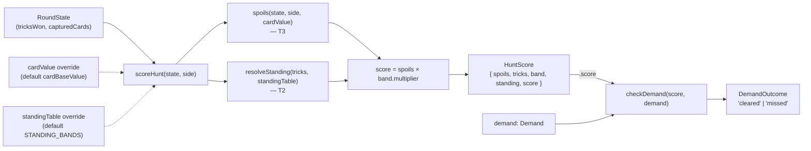

# Plan: Standing from the band table, and Score = Spoils × Standing against the Demand

Plan folder: `.claude/contract/DLR-50-score-spoils-x-standing-demand/`
Execution status: see `tasks.md` in this folder.

---

## Part 1 — Alignment

### Task reference

**DLR-50** — "Standing from the band table, and Score = Spoils x Standing against the Demand" (Story, Highest priority, project DLR "DeLorean 1.21").

Acceptance criteria, verbatim from the ticket:

1. `scoring.ts` reads the Standing band and multiplier from **T2's resolver**. No multiplier literal survives anywhere in `src/`.
2. A `scoreHunt(state, side)` function returns `{ spoils, tricks, band, standing, score }` where `score === spoils × standing`, computed once — not accumulated per trick.
3. A `checkDemand(score, demand)` function returns a cleared/missed result. The Demand is passed in; this ticket does not decide, store, or advance it — that is T9's run state.
4. Test: the full `2k × f(k)` table from §3 reproduces exactly under a flat card value of 1 — all fourteen values of `k`, `k=9` peaking at 108 and `k=10..13` scoring 0.
5. Test: raising the Humble multiplier to ×18 in config makes `k=3` also score 108 under flat values — §6's computed break-even — with no code change outside config.
6. Test: Greedy (×0) zeroes a round with maximal Spoils.
7. Test: `checkDemand` is exclusive-or-inclusive at the boundary in exactly one stated way — a score exactly equal to the Demand **clears** it. Stated as a default, documented in the summary.
8. Nothing in this ticket assumes a run, an encounter index, or more than one Demand.
9. Scoped Vitest run, `npm run typecheck`, and `npm run lint` are green.

In scope, per the ticket: migrating `tricksToPoints` to the config-read band resolver; `scoreHunt` and `checkDemand`; the §3 table as a regression test.

Out of scope, per the ticket: the Demand curve across encounters (T9); showing score, band, or Demand on screen (T7); scoring the Quarry (§8 — only the player's side is scored); any surplus-Spoils reward for overshooting the Demand (§12).

Dependencies: **Blocked by T2 (DLR-48)** and **T3 (DLR-49)**, both `Status: COMPLETE` on disk and confirmed present — `src/hunt/config.ts`'s `resolveStanding`/`STANDING_BANDS`/`cardBaseValue` (T2) and `src/warCouncil/spoils.ts`'s `spoils(state, side, cardValue?)` (T3). **Blocks T7.**

Design citations: hybrid-design.md §1 (the equation), §3 (the `2k × f(k)` table and the 108 ceiling), §6 (the ×18 Humble break-even), §8 (only the player's side scores — the Quarry does not), §9 (Standing multipliers row, still undecided at the values, decided at the boundaries), §11 (the Demand as "pure arithmetic; no new game state beyond one number").

### Restated goal

Give a Hunt an outcome. Today `scoring.ts`'s `tricksToPoints` hard-codes the six printed Standing multipliers as an if-chain instead of reading them from T2's `resolveStanding`, and there is no function anywhere that computes `Spoils × Standing` for a round or checks that score against a target. This task migrates `tricksToPoints` onto `resolveStanding` so the multiplier table has exactly one owner, adds a pure `scoreHunt(state, side)` that computes a round's Spoils, Standing band, and score once from a `RoundState`, and adds a pure `checkDemand(score, demand)` that says whether that score clears a passed-in target. It does not decide what the Demand's value is, store one, or touch anything a player sees — it only makes the Hunt's outcome computable.

### In scope

- Migrating `tricksToPoints` in `src/warCouncil/scoring.ts` to call `resolveStanding` for its multiplier instead of its own if-chain, with its existing signature and return value (a multiplier, numerically identical to today's output under the default `STANDING_BANDS`) unchanged so its one existing caller (`scoreRound`, consumed by `WarCouncilRound.tsx`/`RoundOverPanel.tsx`) keeps working untouched.
- A new `scoreHunt(state, side, cardValue?, standingTable?)` in `src/warCouncil/scoring.ts` returning `{ spoils, tricks, band, standing, score }`, computed once from `state.tricksWon[side]` and `spoils(state, side, cardValue)` — never accumulated per trick.
- A new `checkDemand(score, demand)` in `src/warCouncil/scoring.ts` returning a `DemandOutcome` (`'cleared' | 'missed'`), with `score >= demand` clearing.
- A new `Score` type alias in `src/hunt/types.ts`, alongside the existing `Spoils`/`Standing`/`Demand` aliases, so `HuntScore.score` and `checkDemand`'s first parameter both name what they are rather than being a bare `number`.
- Exporting `scoreHunt`, `checkDemand`, `HuntScore`, `DemandOutcome`, and `Score` from `src/warCouncil/index.ts` (the type) / `src/hunt/index.ts` (the `Score` alias) so a later ticket (T7, T9) can import them the same way every other engine export is consumed.
- Regression tests in `src/warCouncil/__tests__/scoring.test.ts`: the full 14-row §3 table at flat card value 1 (AC4), the ×18 Humble break-even via an injected `standingTable` override with no non-test code change (AC5), Greedy zeroing a round with non-trivial Spoils (AC6), and `checkDemand`'s inclusive boundary in both directions (AC7).

### Explicitly out of scope

- Deciding, storing, or advancing a Demand across encounters — that is T9's run state (§9's Demand base/growth rate row is still `null`/`null` in `DEMAND_CURVE`, and this ticket does not touch it).
- Any UI change — `RoundOverPanel.tsx`, `WarCouncilRound.tsx`, or any other component. `scoreRound`/`tricksToPoints`'s existing signature and numeric output are preserved specifically so no consumer needs touching; T7 owns surfacing `scoreHunt`/`checkDemand` on screen.
- Scoring the Quarry, or computing a second `HuntScore` for the CPU side. `scoreHunt` takes a `side` because the type accepts either `PlayerSide`, but nothing in this ticket calls it for `PlayerSide.Cpu`, and no test asserts a Quarry score.
- Choosing or changing any Standing multiplier value, the Humble-vs-Victorious tuning question, or the Demand's actual base/growth numbers. AC5's ×18 override is a test fixture proving the table is live, not a change to `STANDING_BANDS`.
- Any reward, bonus, or different code path for exceeding the Demand once cleared (§12's "no stated consequence for surplus Spoils" — explicitly flagged as out of scope by the ticket itself).
- Renaming `tricksToPoints`/`scoreRound`, or removing them, despite `tricksToPoints` now returning what is conceptually a Standing multiplier rather than a "score" — the two UI consumers read it as a per-side "points" column today and this ticket does not touch that surface (see Assumptions).

### Pattern Reference

- `src/hunt/config.ts`'s `resolveStanding(tricks, table = STANDING_BANDS)` — the resolver this ticket must call, and the injectable-table pattern (`table` defaults to the real config, a test passes a mutated copy) that AC5 reuses verbatim.
- `src/warCouncil/spoils.ts`'s `spoils(state, side, cardValue = cardBaseValue)` — T3's function, called directly by `scoreHunt`, and the injectable-`cardValue` pattern AC4/AC6 reuse verbatim (a test passes `() => 1` for the flat-value identity).
- `src/hunt/__tests__/config.test.ts`'s "changes the resolved value when a multiplier changes in the table, with no other edit" test — the exact shape AC5 follows: mutate a copy of `STANDING_BANDS`, pass it in, assert the original is untouched.
- `src/warCouncil/__tests__/spoils.test.ts`'s local `stateWithCaptured` helper — the pattern this ticket's tests follow for building a minimal-but-complete `RoundState` fixture, rather than depending on `src/app/warCouncil/__tests__/roundFixture.ts` (a fixture that lives in the UI module, not the engine's own test tree).
- `src/warCouncil/types.ts`'s `IllegalMoveReason`/`PlayCardResult` — the `as const` object-map-plus-union-type shape (required by `erasableSyntaxOnly`, no native `enum`) that `DemandOutcome` follows.

### Constraints flagged on the brief

- AC2's computed-once requirement: `scoreHunt` must read `state.tricksWon[side]` and `state.capturedCards[side]` from a single, already-final `RoundState` snapshot — it must not be called per trick or accumulate across calls. There is no state or memoisation inside `scoreHunt`; every call is a fresh, independent computation from the state passed in.
- AC1's "no multiplier literal survives anywhere in `src/`" is read as: no *other* file may hard-code the Standing values. `STANDING_BANDS` in `src/hunt/config.ts` remains the one authoritative table (T2's, unmodified) — it is the definition the AC requires everything else to read from, not a literal the AC asks this ticket to remove.
- AC8: `scoreHunt`/`checkDemand` take a `RoundState` and a bare `Demand`/`score` respectively — no run object, no encounter index, no `DemandCurve` read. `DEMAND_CURVE` (T2's, still `{ base: null, growthPerEncounter: null }`) is not touched or read by this ticket.
- AC9: the verification commands are scoped Vitest plus `npm run typecheck` and `npm run lint`, per `.claude/workflow/web-project.md` — no `npm test` (unfiltered) and no `npm run build` inside this ticket's own tasks; those stay QA's, at Final verification.

### Assumptions made

- **`scoreHunt`/`checkDemand` live inside the existing `src/warCouncil/scoring.ts`, not a new file.** The ticket's problem statement, both migration ACs, and both new-function ACs are all framed around `scoring.ts` by name; nothing in the brief asks for a new module, and `checkDemand` is small enough (one comparison) that a dedicated file would be ceremony over substance. *Rationale: least structural change that still satisfies "scoring.ts reads the Standing band... from T2's resolver" literally.*
- **`tricksToPoints` and `scoreRound` are kept, migrated in place, not removed or renamed.** The brief's problem statement says `tricksToPoints` "must be migrated," not replaced, and its only two callers are `WarCouncilRound.tsx`/`RoundOverPanel.tsx` via `scoreRound` — both explicitly out of scope (T7 owns the screen). Migrating the internals to call `resolveStanding` while keeping the signature identical satisfies AC1 without a UI-touching ripple. *Rationale: "Explicitly out of scope: Showing score, band, or Demand on screen — T7" forecloses touching those two components; the only way to honor that and still land AC1 is an internals-only migration.*
- **A new `Score` type alias (`export type Score = number`) is added to `src/hunt/types.ts`.** Not named in any AC, but `Spoils`, `Standing`, and `Demand` are all already `number` aliases documented as "the ranges of §1's equation" in that file — `HuntScore.score` and `checkDemand`'s first parameter are the same equation's result and its comparison target, and leaving them as bare `number` while their two operands are named types would be an inconsistency the file itself doesn't have anywhere else. *Rationale: matches an established in-file pattern; zero behavioural effect (a type alias for `number` erases at compile time).*
- **`scoreHunt` takes optional `cardValue` and `standingTable` parameters, defaulting to `cardBaseValue` and `STANDING_BANDS`**, even though the ticket's AC2 states the signature as `scoreHunt(state, side)`. AC4/AC5/AC6 cannot be written as stated without a way to override the card-value rule (flat 1) and the Standing table (×18 Humble) from a test, and both `spoils()` (T3) and `resolveStanding()` (T2) already expose exactly this injectable-parameter shape for exactly this reason. Calling `scoreHunt(state, side)` with no further arguments still works and still means "score under the real, live config." *Rationale: the two-arg call the AC names is preserved; the two extra parameters are additive defaults, not a signature the AC's two-arg call breaks — mirrors T2/T3's own precedent rather than inventing a new one.*
- **`checkDemand`'s result is an `as const` string-literal union (`DemandOutcome`), not a boolean.** `IllegalMoveReason`/`PlayCardResult` already establish the project's shape for a small closed result set (`erasableSyntaxOnly` forbids native `enum`), and a boolean would need its own doc comment to say which value means what — a named `'cleared' | 'missed'` reads at the call site without one. *Rationale: matches `src/warCouncil/types.ts`'s existing convention for exactly this shape of value.*
- **Tests live in the existing `src/warCouncil/__tests__/scoring.test.ts`**, extended with new `describe` blocks, rather than a new test file — the functions under test are added to `scoring.ts`, not a new module, so the "tests sit beside the logic" rule points at the file that already exists. *Rationale: no new file to test a function added to an existing one.*
- **The AC6 "maximal Spoils" fixture uses 26 captured cards of rank 11 (Monarch, no Treasure/Poison adjustment) for `tricksWon.player = 13`**, giving `spoils = 286` under the rank-weighted default — chosen because it is the single highest-value card rank in the deck (`RANKS` tops out at 11) with no special-cased scoring adjustment to reason about, so the test reads as "even a very large, unambiguous Spoils total is zeroed" rather than needing to justify a specific "true maximum." *Rationale: AC6 asks for "maximal," not "the proven theoretical maximum," and a same-rank fixture keeps the arithmetic legible in the test itself.*

### Config and persisted-shape audit

- **Standing-multiplier literal search across `src/`**: `Select-String`-equivalent grep for the trick-count if-chain (`tricks <= 3`, `tricks === 4`, `tricks === 5`, `tricks === 6`, `tricks <= 9`) returns **1 hit — `src/warCouncil/scoring.ts`** (`tricksToPoints`'s own body). That is the one site AC1 requires migrated; no other file duplicates the band boundaries or multiplier values as literals. `src/hunt/config.ts`'s `STANDING_BANDS` itself is the authoritative table this ticket reads from, not a literal it removes.
- **Existing consumers of the functions this ticket touches**: `tricksToPoints`/`scoreRound` grep returns **6 files** — `src/warCouncil/index.ts` (re-export), `src/hunt/config.ts` (an unrelated doc-comment mention, not a call), `src/warCouncil/scoring.ts` (definition), `src/warCouncil/__tests__/scoring.test.ts` (existing tests), `src/app/warCouncil/WarCouncilRound.tsx` and `src/app/warCouncil/RoundOverPanel.tsx` (the two UI consumers). The two UI files are the reason `tricksToPoints`/`scoreRound`'s signature and numeric output must stay unchanged — see Assumptions.
- **`scoreHunt`/`checkDemand`/`Demand` grep**: **0 hits outside `src/hunt/`** before this ticket (only `src/hunt/types.ts`'s `Demand` type alias and `src/hunt/config.ts`'s `DemandCurve`/`DEMAND_CURVE` exist today). `scoreHunt` and `checkDemand` are net-new names — nothing to migrate, no existing caller to break.
- **Persisted shape**: nothing in this repo persists a `RoundState`, a score, or a Demand today (no `localStorage`, no save file) — confirmed by the same grep pattern used in DLR-48/DLR-49's own audits turning up no hits here either. This ticket adds no persisted field, so there is no migration or replay concern to state.
- **Type-change loss check**: no existing type is renamed, retyped, narrowed, or widened. `Score` is a wholly new `number` alias; `HuntScore` and `DemandOutcome` are wholly new shapes. Nothing an existing consumer already reads changes shape.
- **Architectural boundary**: `src/warCouncil/**` and `src/hunt/**` are both inside the pure-core ESLint boundary (`eslint.config.js`, per `.claude/workflow/web-project.md` → Architectural boundaries). `scoreHunt`/`checkDemand` add no React import and no DOM/browser global — both are pure functions over plain data, consistent with every other export already in those two trees.

---

## Part 2 — Technical design

### Approach

The change is a small, additive extension of `src/warCouncil/scoring.ts`, plus one new type alias in `src/hunt/types.ts`, with no new files and no touched component. `tricksToPoints`'s five-branch if-chain is replaced by a single call to `resolveStanding(tricks).multiplier` — the function keeps its name, its `(tricks: number) => number` signature, and (under the live `STANDING_BANDS`) its exact numeric output, so its one caller chain (`scoreRound` → `WarCouncilRound.tsx`/`RoundOverPanel.tsx`) needs no change. This is the smallest change that satisfies AC1's "no multiplier literal survives" without pulling T7's screen work into this ticket.

`scoreHunt(state, side, cardValue?, standingTable?)` is the new entry point that actually implements §1's equation for a finished round. It reads `state.tricksWon[side]` for the trick count, calls T3's `spoils(state, side, cardValue)` for the additive term, calls T2's `resolveStanding(tricks, standingTable)` for the multiplicative term and its band, and multiplies the two once to produce `score`. All five fields of the returned `HuntScore` — `spoils`, `tricks`, `band`, `standing`, `score` — come from that one pass over the already-final `state`; there is no accumulator, no loop over tricks, and no mutation. This is what "computed once, not accumulated per trick" (AC2) means structurally: the function's only inputs are a `RoundState` snapshot and two optional override functions/tables, and its only output is a fresh object built from those in one expression.

`checkDemand(score, demand)` is a one-line comparison with no dependency on `scoreHunt`, `RoundState`, or anything engine-shaped — it exists so a caller can compose `checkDemand(scoreHunt(state, side).score, demand)` without either function needing to know about the other. Keeping the two functions independent (rather than folding the Demand check into `scoreHunt` itself) is the shape the ticket's own AC3 asks for ("The Demand is passed in; this ticket does not decide, store, or advance it") and it is also what makes AC7's boundary test cheap to write in isolation from any `RoundState` fixture.

Both new functions, and the migrated `tricksToPoints`, stay inside `src/warCouncil/scoring.ts` rather than moving to a new file — see Assumptions for why. All of it is pure logic with a testable invariant (a fixed input always produces the same `HuntScore`/`DemandOutcome`), so per `react-frontend`'s testing posture it is tested with plain function-in/value-out assertions and no renderer, in the file's existing `__tests__/scoring.test.ts`.

### Skills to invoke during execution

- `react-frontend` — governs everything under `src/`, including this pure-TypeScript addition; specifically its rule against hard-coding a configuration-owned value (the reason `tricksToPoints` is migrated at all) and its testing posture for pure logic (function-in/value-out, no renderer, tests beside the logic).
- No developer override — the classifier matched exactly one skill and the work is pure logic with no UI surface, so the `AskUserQuestion` confirmation in Step 1.5c was skipped per that step's own rule.

Rules read: `.claude/rules/README.md` — empty index, no topic-scoped rule file applies. Always: `.claude/workflow/web-project.md` (runner commands, the pure-core architectural boundary, correctness traps).

### Diagram



### Data shapes

#### `src/hunt/types.ts` — new type alias

```ts
/** The equation's result — Spoils × Standing, checked against the Demand (§1). */
export type Score = number
```

Exported from `src/hunt/index.ts` alongside the existing `Spoils`/`Standing`/`Demand` type exports.

#### `src/warCouncil/scoring.ts` — migrated function

```ts
// Before: five-branch if-chain hard-coding the printed multipliers.
// After: single call to T2's resolver — the one place these values live.
export function tricksToPoints(tricks: number): number {
  return resolveStanding(tricks).multiplier
}
```

Signature and return type are unchanged (`(tricks: number) => number`); only the body changes. `scoreRound`'s signature and behaviour are therefore also unchanged.

#### `src/warCouncil/scoring.ts` — new exports

```ts
import {
  cardBaseValue,
  resolveStanding,
  STANDING_BANDS,
  type Demand,
  type Score,
  type Spoils,
  type Standing,
  type StandingBand,
} from '../hunt'
import { spoils } from './spoils'
import type { PlayerSide, RoundState } from './types'

/** One round's finished outcome — every field derived once from a final `RoundState` (§1, AC2). */
export interface HuntScore {
  readonly spoils: Spoils
  readonly tricks: number
  readonly band: StandingBand
  readonly standing: Standing
  readonly score: Score
}

/**
 * Computes §1's equation once for `side`, from `state`'s already-final
 * `tricksWon`/`capturedCards` — never accumulated per trick. `cardValue` and
 * `standingTable` default to the live config (T2/T3) and exist so a test can
 * hold one axis flat while varying the other, mirroring `spoils`'s and
 * `resolveStanding`'s own injectable-parameter pattern.
 */
export function scoreHunt(
  state: RoundState,
  side: PlayerSide,
  cardValue: (rank: number) => number = cardBaseValue,
  standingTable: readonly StandingBand[] = STANDING_BANDS,
): HuntScore {
  const tricks = state.tricksWon[side]
  const band = resolveStanding(tricks, standingTable)
  const spoilsValue = spoils(state, side, cardValue)
  return {
    spoils: spoilsValue,
    tricks,
    band,
    standing: band.multiplier,
    score: spoilsValue * band.multiplier,
  }
}

/** A closed result for comparing a computed score against the Demand — AC7's
 *  boundary default lives here: equal to the Demand clears it. */
export const DemandOutcome = {
  Cleared: 'cleared',
  Missed: 'missed',
} as const
export type DemandOutcome = (typeof DemandOutcome)[keyof typeof DemandOutcome]

/** §11: "pure arithmetic; no new game state beyond one number." Does not
 *  decide, store, or advance `demand` — that is T9's run state. */
export function checkDemand(score: Score, demand: Demand): DemandOutcome {
  return score >= demand ? DemandOutcome.Cleared : DemandOutcome.Missed
}
```

#### `src/warCouncil/index.ts` — new re-exports

```ts
export { scoreHunt, checkDemand, DemandOutcome } from './scoring'
export type { HuntScore } from './scoring'
```

`DemandOutcome` needs only the one line: `scoring.ts` declares it as a merged `export const DemandOutcome = {...} as const` plus `export type DemandOutcome = ...` on the same name (exactly `IllegalMoveReason`'s shape in `src/warCouncil/types.ts`), and `index.ts` already re-exports `IllegalMoveReason`, `PlayerSide`, and `RoundPhase` the same single-line way — one `export { X } from './types'` carries both the value and the type binding through, with no separate `export type { X }` needed. `HuntScore` is a plain interface with no value counterpart, so it takes the ordinary `export type` line alongside `AbilityChoice`/`Card`/`PlayCardResult`/`RoundState`/`TrickCard`.

No `package.json`, `tsconfig.json`, `vite.config.ts`, or ESLint change. No persisted or stored shape affected (per the Step 1.6 audit).

### Runtime quality notes

- **Purity and adjudication:** `scoreHunt` and `checkDemand` are both pure — no DOM, no React, no I/O, inside the already-enforced `src/warCouncil/**` pure-core ESLint boundary. Neither function decides a rule value on its own authority: the Standing multiplier comes from `resolveStanding`'s table, the card value comes from `cardBaseValue` (or a caller-supplied override), and the Demand comparison operator (`>=`) is the one documented default from AC7, not an invented one.
- **Effects, mount and teardown:** None. This is synchronous pure logic with no listener, timer, observer, or subscription of any kind — nothing to clean up, nothing StrictMode's double-invocation can break.
- **Hot-path cost:** `scoreHunt` runs once per side at round end (per AC2 — never per trick), over a `capturedCards[side]` array bounded at 26 entries by the fixed 13-trick round (`TRICKS_PER_ROUND`). `spoils`'s `reduce` and `resolveStanding`'s linear scan over six bands are both O(26) and O(6) worst case — not a hot path, no memoisation needed or added.
- **Determinism and numeric safety:** No `Math.random()` anywhere in this call graph. `score = spoils × standing` has no division, so no `NaN`/zero-divisor guard is needed. `resolveStanding` already throws a `RangeError` for a trick count outside 0–13 (T2's existing guard) rather than silently returning `undefined`; `scoreHunt` does not swallow that — an out-of-range `tricksWon` value propagates as a thrown error, which is correct, since a `RoundState` with `tricksWon[side]` outside 0–13 is itself invalid.
- **Error paths:** No new error path is introduced beyond `resolveStanding`'s existing `RangeError`, which `scoreHunt` does not catch — a malformed `RoundState` fails loudly rather than producing a silently wrong score. `checkDemand` has no failure mode: both parameters are plain numbers and every input maps to exactly one of the two `DemandOutcome` values, so there is no third/default case to omit.

### Risks and judgement calls

- **Keeping `tricksToPoints`/`scoreRound` in their current UI-facing shape, unrenamed, while their internals now express a different concept (a Standing multiplier rather than a "score").** This is a deliberate scope call (see Assumptions) to avoid touching `WarCouncilRound.tsx`/`RoundOverPanel.tsx`, which the ticket marks out of scope. It does mean the UI's "Points" column will keep showing the Standing multiplier, not `Spoils × Standing`, until T7 lands — worth confirming that reading is acceptable for however long T7 is scheduled after this ticket.
- **The `Score` type alias is not named anywhere in the ticket's ACs.** It is additive and has zero runtime effect (erased at compile time), but it is a naming choice the developer may want to red-line — e.g. if a future ticket prefers `score` to stay a bare `number` throughout.
- **`scoreHunt`'s two extra optional parameters (`cardValue`, `standingTable`) beyond the AC2-stated `scoreHunt(state, side)`.** Needed to make AC4/AC5/AC6 testable at all without a config-mutation test pattern the codebase has deliberately avoided elsewhere (T2/T3 both use exactly this injectable-parameter shape instead). Flagged in case the developer would rather AC4/AC5 be satisfied a different way — e.g. temporarily swapping `STANDING_BANDS`' module-level contents in a test, which `react-frontend`'s "no module-level mutable state without an explicit reset" rule argues against.
- **AC6's "maximal Spoils" fixture (26 rank-11 cards, `spoils = 286`) is a judgement call on what "maximal" means for a test, not a proven upper bound.** No behaviour depends on it being the true maximum — the assertion is only that Greedy's ×0 zeroes a large, unambiguous Spoils total — but the developer may prefer a different illustrative number.
- **No tuning value is introduced by this ticket.** `STANDING_BANDS`' multiplier values remain T2's and are not touched; AC5's ×18 exists only inside a test fixture. There is nothing here for the developer to choose before `/fb-apply` runs.
- **Whether `RoundState`'s `tricksWon[side]` can ever legitimately be outside 0–13 at the point `scoreHunt` is called.** This ticket assumes not (the round engine already fixes `TRICKS_PER_ROUND = 13`), and relies on `resolveStanding`'s existing `RangeError` rather than adding a second guard. Worth a quick sanity check against `playCard.ts`/`resolveTrick.ts`'s invariants if that assumption ever turns out to be wrong — but re-deriving that guarantee is out of scope for this ticket, which only consumes `RoundState`, not produces it.
