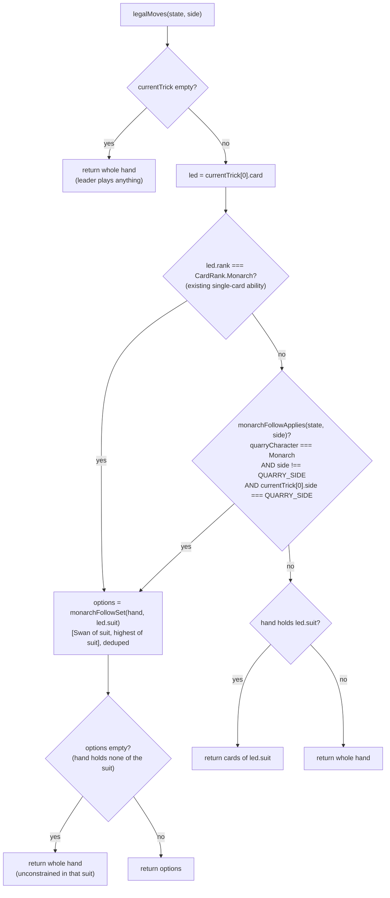

# Plan: The Quarry's round-long rule-break — the mechanism, plus the Monarch

Plan folder: `.claude/contract/DLR-51-quarry-round-long-rule-break-monarch/`
Execution status: see `tasks.md` in this folder.

---

## Part 1 — Alignment

### Task reference

**DLR-51** — "The Quarry's round-long rule-break: the mechanism, plus the Monarch" (Story, Highest, label `engine`, parent epic DLR-46). Acceptance criteria, verbatim:

1. A round-long rule-break is a first-class part of round state — one `QuarryCharacter` per Hunt, set at deal time, applying for all 13 tricks, never toggling mid-round.
2. `legalMoves.ts` consults the active rule-break when generating legal moves, and the existing single-card abilities in `abilities.ts` are unchanged — the round-long version is an additional condition, not a replacement.
3. **The Monarch (11)** is implemented: its follow constraint fires every time the Quarry leads a suit the player holds, for the whole round — a player holding cards of the lead suit must play their Swan (1) of that suit or their highest card of it. Per §4, the liability is real: a player who has already shed both cards of a suit is unconstrained in it.
4. Test: with the Monarch active, a hand holding the Swan and the highest card of the lead suit yields exactly those two as legal; shedding both makes every card of that suit legal again.
5. Test: with no character active, `legalMoves` returns exactly what it returns today — the existing legal-move test suite passes unchanged.
6. Test: the rule-break constrains the **player**, and the existing CPU (`cpuPlayer.ts`) continues to play only legal moves under it, across a full simulated round, without stalling or throwing.
7. The character and its rule-break are exposed as data — a name and a one-sentence player-facing description — so T7 can display it without restating the rule in the UI layer.
8. Any numeric aspect of a rule-break reads from **T2's config**; nothing tunable is inline.
9. Scoped Vitest run, `npm run typecheck`, and `npm run lint` are green.

Ticket scope boundaries and its `Dependencies & Risks` section are reproduced in *In scope*, *Explicitly out of scope*, and *Risks and judgement calls* below. Design sources it names: `hybrid-design.md` §4 (the cast, the Monarch worked example, the visibility table), §5 (the five inputs the Quarry attacks), §11 (named as new engine logic), and `.docs/game_rules/fox-in-the-forest.md` → Suit card reference (rank 11).

**Dependency status, checked on disk (2026-08-10):** the ticket is *Blocked by T2 (DLR-48)*. DLR-48 has landed — `src/hunt/config.ts` and `src/hunt/types.ts` exist and `.claude/contract/DLR-48-hunt-config-and-domain-types/tasks.md` reads `Status: COMPLETE`. `QuarryCharacter` and `Quarry` already exist in `src/hunt/types.ts` from that ticket. The block is cleared.

### Restated goal

Give a Hunt one Quarry character whose printed ability is on for the whole round instead of for the single card that prints it, and implement exactly one of the five — the Monarch — end to end in the engine. Concretely: `RoundState` gains one optional field naming the active character, `dealRound` sets it once and nothing else ever writes it, and `legalMoves` gains one additional condition — when the Quarry leads a suit the player holds and the Monarch is the active character, the player's follow options narrow to their Swan of that suit or their highest card of it, exactly as the base single-card Monarch rule already narrows them. The single-card abilities in `abilities.ts` are untouched; the round-long path reuses the same narrowing the single-card path already performs, so the two can never disagree. Alongside the mechanism, the character ships as display data (a name and one player-facing sentence) for T7 to render. No UI file changes, no CPU strategy change, and no scheduling of which character appears when.

### In scope

- One optional field on `RoundState` naming the active round-long character, written once at deal time by `dealRound` and carried unchanged through all 13 tricks (AC 1).
- `legalMoves.ts` consulting that field as an **additional** narrowing condition alongside the existing single-card Monarch check, with `abilities.ts` untouched (AC 2).
- The Monarch's round-long follow constraint: it fires on every Quarry lead of a suit the constrained side holds, narrowing to {Swan of the suit, highest of the suit}, deduplicated when those are the same card (AC 3).
- A dedicated pure module holding the rule-break's applicability predicate and its follow set, consulted by both `legalMoves.ts` and `playCard.ts`'s rejection-reason branch so the legal set and the reason code cannot drift apart.
- Tests: the Monarch's narrowing and its release when the suit is exhausted (AC 4); no-character behaviour identical to today, with the existing `legalMoves` spec passing unmodified (AC 5); a seeded full-13-trick simulation with the Monarch active proving the constrained side never faces an empty legal set and the CPU never plays illegally (AC 6).
- Character display data — name plus a one-sentence player-facing description — exported for T7 (AC 7).
- Both new symbols re-exported from the module barrels (`src/hunt/index.ts`, `src/warCouncil/index.ts`) so T7 consumes them without reaching into a module's internals.

### Explicitly out of scope

- **The other four characters (Witch, Woodcutter, Fox, Swan) — T13.** Neither their enforcement nor their description copy. §11: "which of the five is not load-bearing for the test."
- **Choosing which character appears in which encounter — T9's run scheduling.** `dealRound`'s new parameter stays optional and every current caller keeps passing nothing, so no round in the app has a character active when this ticket closes.
- **Displaying the rule-break on screen — T7.** No file under `src/app/**` is touched. `IllegalMoveReason.MustFollowMonarch` and its UI copy in `src/app/warCouncil/labels.ts:33` already exist, so nothing in the UI layer needs to change even for the rejection path.
- **Any CPU strategy change.** The Quarry remains `cpuPlayer.ts`'s existing heuristic — legal moves only, prefers winning a trick cheaply. No search, no evaluation function, no difficulty tiers, no learning (§4's explicit rejection of "a neutral strong player" as a difficulty slider).
- **Any change to `src/hunt/config.ts`.** See *Config and persisted-shape audit* — the Monarch's rule-break has no numeric aspect to configure.
- Reworking `abilities.ts`, `resolveTrick.ts`, `scoring.ts`, or `spoils.ts`.
- The intent telegraph (§11's fourth new item) — a separate ticket.

### Pattern Reference

Supplied by the brief: `src/warCouncil/legalMoves.ts` (the constraint to extend), `src/warCouncil/abilities.ts` (must stay unchanged), `src/warCouncil/cpuPlayer.ts` (must keep playing legal moves), and T2's `src/hunt/config.ts` as the home of anything tunable. Specification: `hybrid-design.md` §4's Monarch worked example (lines 432–437) and §11's statement of what is new (lines 930–934); the base ability is `.docs/game_rules/fox-in-the-forest.md` line 99 — "When you **lead** this: if your opponent has a card of this suit, they must play either the **Swan (1)** of this suit or their **highest-ranked** card of this suit."

Code-shape references chosen here, none having been named in the brief:

- `src/warCouncil/legalMoves.ts:13-22` — the existing single-card Monarch narrowing. The round-long path reuses this exact set construction, including its `[swan, highest]` ordering and its dedup, rather than restating it.
- `src/warCouncil/__tests__/cpuPlayer.test.ts:197-249` — the existing seeded `lcg` + `while (state.phase !== RoundPhase.Complete)` full-round harness with its runaway-loop guard. AC 6's simulation copies that shape rather than inventing a second one.
- `src/hunt/config.ts` — the house style for a spec-cited data table: an `as const` map plus a lookup function, each entry carrying the § it was transcribed from.
- `.claude/skills/react-frontend/SKILL.md` for everything else.

### Constraints flagged on the brief

- **The pure-core boundary.** Both `src/warCouncil/**` and `src/hunt/**` are covered by the ESLint purity override at `eslint.config.js:24` — no React import, no DOM global. Every file this ticket touches is inside it.
- **AC 5 is a compatibility constraint, not just a test.** The existing `src/warCouncil/__tests__/legalMoves.test.ts` must pass **unmodified**. That forbids any change to `legalMoves`' signature and any *required* addition to `RoundState`, because that spec builds `RoundState` literals by hand.
- **AC 8 — nothing tunable inline.** Any numeric aspect reads from `src/hunt/config.ts`.
- **AC 6 is a hard-defect gate.** A round-long constraint that ever yields zero legal moves is a defect, not a tuning problem; it must be proven by simulation rather than argued.
- **Determinism.** The existing engine takes `rng: () => number` as a parameter and reaches no `Math.random()`; the new simulation test seeds its own `lcg`, so it is reproducible.
- **Two runtime dependencies.** Nothing here adds a third.

### Assumptions made

- **The field is named `quarryCharacter` and holds a bare `QuarryCharacter`, not the `Quarry` wrapper object.** AC 1 says "one `QuarryCharacter` per Hunt". `Quarry` (`src/hunt/types.ts:11`) currently wraps a single `character` field and belongs to the run/Hunt layer that T9 and T5 own; embedding it in `RoundState` would put a Hunt-level type inside a trick-level one for no gain today.
- **The field is optional (`quarryCharacter?: QuarryCharacter`), and absent means "no character active".** Forced by AC 5: 10 hand-built `RoundState` literals live in test files and fixtures, and a required field breaks all 10 at compile time, which is precisely the "existing suite passes unchanged" that AC 5 forbids. Counted in the audit below.
- **The constrained side is the player, identified as "not the Quarry", with the Quarry being `PlayerSide.Cpu`.** AC 3 and AC 6 both scope the rule-break to the player, and `src/hunt/types.ts:10` defines the Quarry as "The CPU opponent for one encounter". The predicate is written as `side !== QUARRY_SIDE` against a named constant rather than a bare `=== PlayerSide.Player`, so T13 and T9 inherit one place to change if the Quarry ever plays the other seat.
- **"Their highest card of it" is recomputed from the hand at the moment of the follow, not fixed at deal time.** This is the reading with real consequences and it is called out in Risks. It matches the base rule's own wording (`fox-in-the-forest.md` line 99, evaluated when the trick is played), matches §11's "reuses the same functions' shape", and needs no new state. Under it, AC 4's second clause — "shedding both makes every card of that suit legal again" — is satisfied when the shed pair *was* the hand's whole holding in that suit, which is how the AC 4 test is written; a hand retaining middle cards of the suit stays narrowed to its new highest. A second test pins that consequence explicitly so the reading is documented in code rather than implied.
- **The narrowing is factored into one shared function used by both the single-card and round-long paths**, rather than duplicated. Two copies of "Swan or highest, deduplicated" is the exact shape that drifts, and `playCard.ts`'s reason-code branch needs the same predicate.
- **The applicability predicate and the follow set live in a new `src/warCouncil/quarryRuleBreak.ts`, not inline in `legalMoves.ts`.** `legalMoves.ts` is 26 lines today; the round-long layer is a distinct concern with its own tests, and T13 adds four more characters to whatever file holds it. Keeping it separate stops `legalMoves.ts` growing a per-character switch.
- **Character display data lives in a new `src/hunt/quarryCharacters.ts`, keyed by `QuarryCharacter`, typed `Partial<Record<...>>` with the Monarch as its only entry.** `QuarryCharacter` is hunt's type, so its display data belongs beside it; `Partial` is the honest shape while four characters are unimplemented, and it makes T13's gap visible in the type rather than hidden behind four descriptions of rules no code enforces.
- **`QuarryCharacterInfo` carries no printed-rank field.** `CardRank` lives in `src/warCouncil/types.ts`, and `src/hunt` imports nothing from `src/warCouncil` today (verified — zero import hits). Adding a rank to the hunt-side data would either create the first reverse edge or duplicate the rank literal. The Monarch's round-long rule does not read rank 11 at all; it reads `CardRank.Swan`, on the warCouncil side.
- **The description sentence is transcribed from §4, not invented.** It is copy, so its wording is the developer's to red-line — routed to Risks rather than treated as settled.
- **No `src/app/**` file changes.** The ticket is labelled `engine` and not `playable`; `dealRound`'s callers in `App.tsx` keep passing two arguments, so no round in the running app has a character active when this closes. That is expected, not an omission.

### Config and persisted-shape audit

- **Configuration keys renamed, retyped, or removed: none — `src/hunt/config.ts` is not touched.** AC 8 is satisfied vacuously for the Monarch: its rule-break has no numeric aspect. Its two constrained cards are its Swan, read via the existing named constant `CardRank.Swan` (`src/warCouncil/types.ts:17`), and a derived maximum with no threshold. `Select-String` for the ticket's candidate literals confirms the intent: the plan introduces no bare `1` or `11` rank literal, and Task 9's grep enforces it. Zero new config keys, zero renames.
- **Persisted shapes affected: none — nothing is persisted anywhere.** `Select-String` for `localStorage|sessionStorage` across `src/**` returns **0 hits**; both are also on `eslint.config.js`'s restricted-globals list for these two trees. `RoundState` lives only in React state (`src/App.tsx:9`, `src/App.tsx:20`, `src/app/warCouncil/roundReducer.ts`) and dies with the page, so adding a field invalidates no stored record and needs no migration. **The cheap window is still open, recorded here as of 2026-08-10** — the first ticket that persists a `RoundState` closes it, and from then on `quarryCharacter`'s optionality becomes a save-compatibility concern.
- **Type changes are additive only — no loss case applies.** `RoundState` gains one **optional** field; `dealRound` gains one **optional** third parameter. No `number`→`string`, no array→object, no required→optional on an existing field, and no widened union forcing a new `switch` case. `tsconfig.app.json` does **not** set `exactOptionalPropertyTypes`, so `deal.ts` may write `quarryCharacter` unconditionally without a conditional-spread dance. The matching runtime trap is also clear: `Select-String` for `toStrictEqual` across `src/**` returns **0 hits**, and `toEqual` treats an `undefined`-valued property as absent, so writing the key unconditionally cannot break the 8 whole-state assertions in `__tests__/deal.test.ts`. Any future spec reaching for `toStrictEqual` on a `RoundState` would need the key omitted instead. Full `RoundState` literal construction sites, all of which must keep compiling: **11 total** — 1 production (`src/warCouncil/deal.ts:24`) and 10 in specs/fixtures (`__tests__/types.test.ts:16`, `__tests__/spoils.test.ts:20`, `__tests__/playCard.test.ts:28`, `__tests__/abilities.test.ts:26`, `__tests__/scoring.test.ts:33`, `__tests__/cpuPlayer.test.ts:35`, `__tests__/legalMoves.test.ts:20`, `src/app/warCouncil/__tests__/WarCouncilRound.test.tsx:60`, `src/app/warCouncil/__tests__/roundReducer.test.ts:74`, `src/app/warCouncil/__tests__/roundFixture.ts:40`). A required field breaks all 10 — the direct evidence for the optionality assumption above.
- **Consumers of every changed exported function, counted.** `legalMoves` — **4 call sites**: `src/warCouncil/playCard.ts:36`, `src/warCouncil/cpuPlayer.ts:37`, `src/app/warCouncil/WarCouncilRound.tsx:50`, `src/app/warCouncil/roundReducer.ts:198`. All pass `(state, side)`; because the active character is read off `state` rather than passed in, **zero call sites change**, and the two UI call sites become character-aware for free when T9 starts setting the field. `dealRound` — **13 call sites**: `src/App.tsx:9`, `src/App.tsx:20`, `__tests__/playCard.test.ts:187`, `__tests__/cpuPlayer.test.ts:209`, `__tests__/cpuPlayer.test.ts:231`, and 8 in `__tests__/deal.test.ts` (lines 15, 23, 31, 36, 37, 41, 50, 51). Every one passes two arguments, so an optional third leaves all 13 compiling untouched. `QuarryCharacter` — **4 hits**, all definitional (`src/hunt/types.ts:1`, `:8`, `:12`, `src/hunt/index.ts:2`); DLR-51 is its first production consumer.
- **String-bound names align, and no new one is introduced.** `IllegalMoveReason.MustFollowMonarch` already exists: **3 hits** — declaration `src/warCouncil/types.ts:92`, producer `src/warCouncil/playCard.ts:43`, UI copy `src/app/warCouncil/labels.ts:33`. This ticket widens *when* that reason fires and adds no reason code, so the reason-code ↔ label chain needs no edit and `src/app/**` stays out of the diff. No `data-testid`, CSS class, or `aria-*` id is in play — no `.tsx` file is touched.
- **The architectural boundary is not crossed, and no import cycle is created.** `eslint.config.js:24` applies the purity override to `src/warCouncil/**` *and* `src/hunt/**`, so both new modules are born inside it and neither imports React or touches a DOM global. The `warCouncil → hunt` edge is already established (`src/warCouncil/spoils.ts:1`, `src/warCouncil/scoring.ts:10`, plus `__tests__/scoring.test.ts:4`); the reverse edge does **not** exist — `Select-String` for `warCouncil` under `src/hunt/` returns **1 hit and it is a prose comment** (`src/hunt/config.ts:32`), not an import. So `import type { QuarryCharacter } from '../hunt'` in `src/warCouncil/types.ts` extends an existing one-way edge, and `verbatimModuleSyntax: true` means the type-only import is erased entirely at build time.

---

## Part 2 — Technical design

### Approach

**The character rides on `RoundState`, not on `legalMoves`' signature.** The alternative — `legalMoves(state, side, character?)` — was rejected for two concrete reasons. First, AC 5 requires the existing `legalMoves` spec to pass unmodified, and a third parameter is survivable but every future consumer then has to remember to thread the character through; the two UI call sites (`WarCouncilRound.tsx:50`, `roundReducer.ts:198`) would each need to learn about it, which is a change to files this ticket has no business in. Second, AC 1 asks for the rule-break to be "a first-class part of round state … never toggling mid-round", and state is where that invariant is cheap: `RoundState` is fully `readonly`, `playCard` rebuilds it by spreading (`{ ...state, … }` at `playCard.ts:48`, `:85`, `:102`) and `abilities.ts` does the same, so a field written once by `dealRound` propagates through all 13 tricks with no code added and no way for a consumer to pass a different character halfway through. The field is optional purely so the 10 hand-built `RoundState` literals in the existing specs keep compiling.

**The narrowing is extracted once and consulted twice.** A new pure module, `src/warCouncil/quarryRuleBreak.ts`, holds two functions and one named constant. `monarchFollowSet(hand, suit)` returns the base Monarch option set — the Swan of the suit and the highest card of the suit, in that order, deduplicated when they are the same card, and empty when the hand holds none of that suit. This is lifted verbatim in behaviour from `legalMoves.ts:13-22`, so the single-card path keeps its exact current output including array order, which two existing assertions depend on (`legalMoves.test.ts:66-69`, `:80`). `monarchFollowApplies(state, side)` is the round-long predicate: the active character is the Monarch, the side being asked is not the Quarry, and the current trick has a lead played *by* the Quarry. `legalMoves` then reads `if (led.rank === CardRank.Monarch || monarchFollowApplies(state, side))` — an added disjunct, which is literally AC 2's "an additional condition, not a replacement". `abilities.ts` is not opened at all; the Swan next-leader rule, the Fox exchange, and the Woodcutter draw are untouched, which is why the round-long layer cannot regress them.

**Why the same predicate has to reach `playCard`.** `playCard.ts:38-45` rejects an illegal follow with one of two reason codes, and it decides between them by re-deriving whether a Monarch was led. With a round-long Monarch active, a rejected follow is a *Monarch* rejection even though the led card is an ordinary card, so that branch has to consult the same predicate rather than the led card's rank — otherwise the engine narrows the legal set for one reason and explains it with another. Calling `monarchFollowApplies` there keeps one source of truth for "was the Monarch constraint in force", and because `IllegalMoveReason.MustFollowMonarch` and its UI copy already exist, this costs no new reason code and no UI edit.

**The display data is data, in `src/hunt/`, with no behaviour attached.** `src/hunt/quarryCharacters.ts` exports a `Partial<Record<QuarryCharacter, QuarryCharacterInfo>>` holding the Monarch's name and its one player-facing sentence, plus a `quarryCharacterInfo(character)` accessor returning `QuarryCharacterInfo | undefined`. `Partial` is deliberate: four characters have no enforcement yet, and a total `Record` would force this ticket to write four descriptions of rules nothing implements — T13's job, and a lie on screen if T7 rendered one early. The accessor returning `undefined` rather than throwing means an unimplemented character degrades to base rules and a missing panel, never a crash mid-round. All logic in this ticket is pure and DOM-free by construction: three modules under two trees the ESLint purity override already covers, every function taking values in and returning values out, and every new behaviour with a testable invariant tested without a renderer.

### Skills to invoke during execution

- `react-frontend` — owns everything under `src/`: strict-TypeScript conventions, the `as const` map form required by `erasableSyntaxOnly`, `import type` under `verbatimModuleSyntax`, pure-module placement, the ≤400-line file budget measured not estimated, and the Vitest posture (pure logic tested with no renderer, specs under `src/**/__tests__/`). Confirmed by the developer at the Step 1.5 gate as the only skill for this ticket.
- Developer override at that gate: `game-designer` and `implementation-doc-writer` were offered and **declined** — the Monarch's rule reading is implemented as DLR-51 states it rather than re-argued against §4, and `.docs/implementation/` is updated by `/fb-apply`'s own post-gate step rather than by a task in this contract.
- Shared rules: `.claude/rules/` contains only `README.md` — Glob returned no rule files, so there is no reject condition to plan against. Re-scan at execution time rather than trusting this line.
- The executor must also Read `.claude/workflow/web-project.md` — it owns every path and `Run:` command used in `tasks.md`.

### Diagram



### Data shapes

#### New — `src/hunt/quarryCharacters.ts`

```ts
import { QuarryCharacter } from './types'

/** Display data for one Quarry character — §4's cast. Player-facing text only; the
 *  rule-break itself is enforced in src/warCouncil/quarryRuleBreak.ts. */
export interface QuarryCharacterInfo {
  readonly character: QuarryCharacter
  readonly name: string
  /** One sentence, player-facing, addressed to the player — §4's worked example. */
  readonly description: string
}

/** Partial by design: only the Monarch's rule-break is enforced (DLR-51). The other
 *  four characters of §4's cast are T13's, and an entry here without enforcement in
 *  quarryRuleBreak.ts would put a rule on screen that no code applies. */
export const QUARRY_CHARACTERS: Readonly<Partial<Record<QuarryCharacter, QuarryCharacterInfo>>>

/** undefined for a character whose rule-break is not implemented yet — callers show
 *  no panel rather than crashing mid-round. */
export function quarryCharacterInfo(character: QuarryCharacter): QuarryCharacterInfo | undefined
```

The Monarch's entry, transcribed from §4 lines 432–437 (**wording is a developer red-line** — see Risks):

```ts
{
  character: QuarryCharacter.Monarch,
  name: 'The Monarch',
  description:
    'Every time the Monarch leads a suit you hold, you must play your Swan of that suit or your highest card of it.',
}
```

#### Modified — `src/warCouncil/types.ts`

```ts
import type { QuarryCharacter } from '../hunt'

export interface RoundState {
  // …every existing field unchanged…
  /** The active round-long rule-break (§4). Written once by dealRound and carried by
   *  every state spread; absent means no character is active and the base rules apply
   *  unchanged. Optional so the specs' hand-built RoundState literals still compile. */
  readonly quarryCharacter?: QuarryCharacter
}
```

No other change to this file. `IllegalMoveReason` gains no member.

#### Modified — `src/warCouncil/deal.ts`

```ts
export function dealRound(
  dealer: PlayerSide,
  rng: () => number,
  quarryCharacter?: QuarryCharacter,
): RoundState
```

Third parameter optional; the returned literal sets `quarryCharacter` directly (safe — `exactOptionalPropertyTypes` is not enabled). All 13 existing call sites keep working untouched.

#### New — `src/warCouncil/quarryRuleBreak.ts`

```ts
import type { QuarryCharacter } from '../hunt'
import type { Card, PlayerSide, RoundState, Suit } from './types'

/** The seat the Quarry plays (src/hunt/types.ts: "The CPU opponent for one
 *  encounter"). Named so T9/T13 have one place to change. */
export const QUARRY_SIDE: PlayerSide

/** The base Monarch follow set: the Swan of `suit` then the highest card of `suit`,
 *  deduplicated when they are the same card. Empty when `hand` holds none of `suit` —
 *  the caller reads empty as "unconstrained", not as "no legal move". */
export function monarchFollowSet(hand: readonly Card[], suit: Suit): readonly Card[]

/** True when the active round-long rule-break narrows `side`'s follow options on the
 *  current trick: the Monarch is active, `side` is not the Quarry, and the Quarry led. */
export function monarchFollowApplies(state: RoundState, side: PlayerSide): boolean
```

#### Modified — `src/warCouncil/legalMoves.ts`

Signature unchanged — `legalMoves(state: RoundState, side: PlayerSide): readonly Card[]`. The single-card Monarch branch's inline set construction is replaced by a `monarchFollowSet` call, and its condition gains the `|| monarchFollowApplies(state, side)` disjunct.

#### Modified — `src/warCouncil/playCard.ts`

Signature unchanged. The `monarchLed` local at lines 38-39 becomes a `monarchConstrained` local that ORs the existing led-rank check with `monarchFollowApplies(state, side)`.

#### Modified — barrels

```ts
// src/hunt/index.ts — added
export type { QuarryCharacterInfo } from './quarryCharacters'
export { QUARRY_CHARACTERS, quarryCharacterInfo } from './quarryCharacters'

// src/warCouncil/index.ts — added
export { QUARRY_SIDE, monarchFollowApplies, monarchFollowSet } from './quarryRuleBreak'
```

No `package.json`, `tsconfig`, `vite.config.ts`, or `eslint.config.js` change: no new dependency, no new script, and both new files land under globs the purity override already matches.

### Runtime quality notes

- **Purity and adjudication.** All three modules are pure functions over values, in two trees the ESLint override at `eslint.config.js:24` already forbids React and DOM globals in. No component decides anything: `legalMoves` remains the sole authority on what may be played and `playCard` the sole authority on whether a play commits, and the UI's two `legalMoves` call sites become character-aware without learning the rule. Nothing tunable is inline — the Monarch's rule-break has no number in it, its Swan is `CardRank.Swan`, and `src/hunt/config.ts` is not touched (AC 8).
- **Effects, mount and teardown.** No effects, no listeners, observers, timers, `requestAnimationFrame`, or `AbortController` — no React file is opened. No module-level mutable state is introduced: `QUARRY_CHARACTERS` and `QUARRY_SIDE` are frozen-by-convention `const` bindings never written after definition, so nothing survives HMR or leaks between tests in a file, and StrictMode's double mount is not reachable from this diff.
- **Hot-path cost.** `legalMoves` runs once per turn, not per pointer event — 26 turns a round. The added work is one `state.quarryCharacter` comparison and two side comparisons on the non-Monarch path, and on the constrained path the same single `hand.filter` + `reduce` over ≤13 cards the single-card path already performed. Nothing new allocates per event, nothing scans a whole collection repeatedly, and no memoisation is added — there is no measured problem to justify one.
- **Determinism and numeric safety.** No `Math.random()` is introduced anywhere; `dealRound` keeps taking `rng: () => number` and AC 6's simulation seeds the existing `lcg` helper, so a failure reproduces from its seed. No division and no float comparison is added, so there is no epsilon to name and no divisor to guard — `NaN` cannot reach a rendered value from this diff. Card identity continues to go through `sameCard`, an exact `suit`/`rank` equality, not arithmetic.
- **Error paths.** The one genuine failure mode is an empty legal-move set, which would stall a round; the design makes it unreachable — `monarchFollowSet` returns empty only when the hand holds none of the led suit, and every caller reads empty as "return the whole hand", so a side that has a card at all always has a legal one. AC 6's seeded 13-trick simulation asserts a non-empty set at every constrained turn rather than trusting that argument. An illegal play still cannot commit: `playCard` returns `{ ok: false, reason }` naming `MustFollowMonarch` specifically when the Monarch constraint was in force, never a generic failure and never a success shape. `quarryCharacterInfo` returns `undefined` for an unimplemented character — an honest absence a caller must handle, not a fabricated default and not a swallowed error. No `try`/`catch` and no async surface is introduced, so the four async states do not arise.

### Risks and judgement calls

- **"Their highest card of it" — recomputed live, or fixed at deal time?** The plan recomputes from the current hand (matching `fox-in-the-forest.md` line 99 and the existing single-card implementation). The consequence: shedding your Swan and your top card of a suit does **not** free that suit while you still hold middle cards of it — the constraint just narrows to your new highest. §4's liability sentence ("a player who sheds their Swan or their highest card of a suit early neutralises the Monarch's bite") then means *the constraint stops costing you your best card*, not *the constraint stops applying*. The fixed-at-deal alternative would literally free the suit once both original cards are gone, but it needs per-suit constrained-card state on `RoundState` that nothing can derive after the cards are played. **This is the ticket's one substantive rule reading — red-line it here if the design intends the fixed-at-deal version, because it changes the state shape, not just a branch.** Both readings satisfy AC 4 as written; they differ only when middle cards of the suit remain, which the plan pins with its own explicit test.
- **The Monarch's player-facing sentence is copy, and copy is yours.** Proposed: *"Every time the Monarch leads a suit you hold, you must play your Swan of that suit or your highest card of it."* Transcribed from §4 rather than invented, but it is the sentence T7 will put on screen all round, so the wording is a developer call — including whether it should name the liability.
- **`Partial<Record<...>>` for the character data means an unimplemented character silently no-ops.** If someone adds a description in T13 without enforcement in `quarryRuleBreak.ts`, the round shows a rule that does not apply. The `Partial` makes the gap visible to a reader and to TypeScript's `undefined`, but it does not prevent that mistake — T13 owns closing it, and its plan should say so.
- **Nothing in the running app exercises this when the ticket closes.** `dealRound`'s callers keep passing two arguments because character scheduling is T9's, so the Monarch is provable only under Vitest until T7 and T9 land. That is the correct reading of the `engine`-not-`playable` label, but it means there is no "open the app and see it" step here — worth confirming you expect that.
- **`monarchFollowApplies` hardcodes the Quarry as `PlayerSide.Cpu`.** True today by definition (`src/hunt/types.ts:10`) and isolated behind the `QUARRY_SIDE` constant. If a future mode ever seats the Quarry as the player, that constant is the single edit — but it is a genuine assumption baked into the engine, not a derived fact.
- **The working tree carries DLR-50's uncommitted changes.** `git status` shows `src/warCouncil/scoring.ts`, `src/warCouncil/index.ts`, `src/hunt/*`, and their specs modified, with `.claude/contract/DLR-50-score-spoils-x-standing-demand/` untracked and its `tasks.md` at `Status: COMPLETE`. DLR-51 edits `src/warCouncil/index.ts` and `src/hunt/index.ts`, both of which DLR-50 already touched. Nothing conflicts — the additions are disjoint export lines — but this contract will be built on top of an uncommitted tree, so decide whether to commit DLR-50 first.
- **Scope check on `playCard.ts`.** No AC names it; the plan changes it anyway, because leaving it alone means a round-long Monarch rejection reports `MustFollowLeadSuit`. Included as an in-scope defect rather than deferred — say if you would rather it were a separate ticket.
