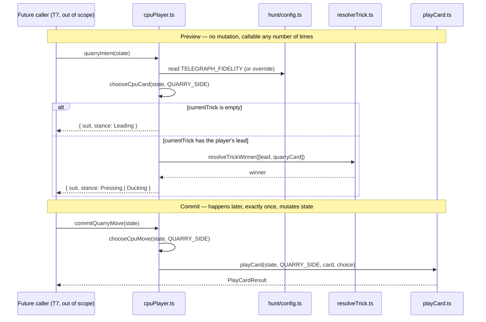

# Plan: The intent telegraph — split the CPU's move into intent and commit

Plan folder: `.claude/contract/DLR-52-intent-telegraph-cpu-split/`
Execution status: see `tasks.md` in this folder.

---

## Part 1 — Alignment

### Task reference

**Jira: DLR-52 — "The intent telegraph: split the CPU's move into intent and commit"**, project DLR ("DeLorean 1.21"), Story, priority Highest, labels `engine`. Same ticket appears verbatim as **T6** in `.claude/contract/DLR-46-epic-breakdown/tasks.md`. Full acceptance criteria (verbatim from the ticket):

1. The CPU's move selection is split into two steps: a pure `quarryIntent(state)` that computes and returns what the Quarry will do without mutating state, and a commit step that plays it.
2. The intent is stable — computing it twice on the same state returns the same move — so it can be rendered, re-rendered under StrictMode's double-invoke, and then committed without changing.
3. The intent is available for both cases: when the Quarry leads a trick, and when the Quarry follows the player's lead.
4. The telegraph exposes intent at a **stated fidelity**, not the raw card. Default taken: the Quarry's intent is surfaced as its *shape* — lead suit and whether it is pressing to win or ducking — not the exact card, because §4's table keeps the Quarry's hand hidden and naming the card would reveal a card from it. Documented in the summary; the fidelity constant lives in **T2's config** so it can be widened or narrowed without a code change.
5. Committing plays exactly the move the intent described — a test proves intent and committed move never disagree across a full simulated round.
6. The existing `cpuPlayer.ts` behaviour is preserved: the same move is chosen as before the split, proven by running the existing CPU test suite unchanged.
7. The split introduces no timer, no `setTimeout`, and no effect — the intent is derived from state, per the existing round's effect-free design.
8. Scoped Vitest run, `npm run typecheck`, and `npm run lint` are green.

**Blocked by T2 (DLR-48)** — confirmed complete: `src/hunt/config.ts`, `src/hunt/types.ts`, `src/hunt/index.ts` all exist on disk and are tested. **Blocks T7** (the Hunt screen, out of scope here).

### Restated goal

Today `chooseCpuMove` computes and plays the Quarry's move in a single call — there is no point between "the Quarry decided" and "the Quarry's card is on the table" where a UI could show what it's about to do. This ticket adds a second, purely-derived entry point, `quarryIntent(state)`, that answers "what will the Quarry do next" — expressed only as the intended card's suit and whether that play presses to win or ducks, never the exact card — without playing it. A separate, additive commit step (`commitQuarryMove`) still plays the move exactly as `chooseCpuMove` + `playCard` do today, unchanged. Nothing about what the CPU chooses changes; this is a restructuring that gives a future screen (T7) something to render before the Quarry's card actually lands.

### In scope

- A pure `quarryIntent(state: RoundState): QuarryIntent` in `src/warCouncil/cpuPlayer.ts`, covering both the leading and the following case, computed from the Quarry's fixed seat (`QUARRY_SIDE`).
- The intent's shape: suit plus a three-way stance (`Leading` / `Pressing` / `Ducking`), gated by a new fidelity constant read from `src/hunt/config.ts` (T2's config), per AC4.
- A `commitQuarryMove(state: RoundState): PlayCardResult` in `cpuPlayer.ts` — additive only, wrapping the existing `chooseCpuMove` + `playCard` call sequence with no change to either.
- Tests: stability (AC2), both lead/follow cases (AC3), the fidelity constant genuinely narrowing/widening the shape with no other code change (AC4), intent/commit agreement across a full simulated round (AC5), and confirmation that the existing `cpuPlayer.test.ts` suite is untouched and still green (AC6).

### Explicitly out of scope

- Rendering the telegraph on screen, or any pacing/animation of the reveal — both are T7/T15.
- Changing what the CPU chooses. `chooseCpuCard`, `chooseCpuFoxChoice`, `chooseCpuWoodcutterChoice`, and `chooseCpuMove` are not edited by this plan.
- Revealing the Quarry's hand, its card count by suit, or the exact card it intends to play — §4's table keeps all three hidden; this ticket only ever exposes shape.
- The other four Quarry characters (T13) and any round-long rule-break logic (T5/DLR-51, already shipped and untouched here).
- Any `.tsx`, component, or UI work — this ticket has no rendering surface.

### Pattern Reference

- `src/warCouncil/cpuPlayer.ts` — `chooseCpuCard`'s existing `state.currentTrick.length === 0` (leading) vs. non-empty (following) branch is the exact discriminant `quarryIntent` reuses; `CpuMove` living directly in this file (not a separate types module) is the precedent for where `QuarryIntent`/`QuarryIntentStance` are added.
- `src/warCouncil/quarryRuleBreak.ts` — `QUARRY_SIDE` (`PlayerSide.Cpu`), the existing named constant for "the seat the Quarry plays," reused rather than re-derived; also the precedent for a `src/warCouncil/` module importing a Hunt-scoped concept from `../hunt`.
- `src/hunt/config.ts` + `resolveStanding(tricks, table = STANDING_BANDS)` (DLR-48) — the optional-parameter-defaulting-to-the-module-const pattern, mirrored by `quarryIntent`'s optional fidelity parameter so a test can prove the config is live without mutating shared module state between tests.
- `src/hunt/__tests__/config.test.ts` → `'changes the resolved value when a multiplier changes in the table, with no other edit'` — the exact "prove the config is genuinely live" test shape this plan's AC4 test mirrors.
- `src/warCouncil/__tests__/cpuPlayer.test.ts` → `'chooseCpuMove — simulated full rounds (AC4)'` and `src/warCouncil/__tests__/quarryRuleBreak.test.ts` → the DLR-51 Monarch simulated-round `describe` block — both are the seeded-`lcg` + `it.each` full-13-trick-round simulation pattern this plan's AC5 test follows.
- `src/warCouncil/resolveTrick.ts` → `resolveTrickWinner` — reused, unchanged, to derive whether the Quarry's intended follow card would win (`Pressing`) or not (`Ducking`).
- `.claude/skills/react-frontend/references/engineering-standards.md` → "Exhaustiveness checking" (added this session) — the `never`-guard pattern for a `switch` over `QuarryIntentStance`, directly applicable to any consumer that renders per-stance text later.

### Constraints flagged on the brief

- **DoD 6** (from the epic): the intent must be visible before the player commits, every trick. This ticket only makes that possible (the split); T7 is what actually renders it.
- **AC6 is read literally**: "the existing CPU test suite" means `src/warCouncil/__tests__/cpuPlayer.test.ts` is not modified at all in this plan — new coverage goes in a new file (see Assumptions).
- **AC7**: no `setTimeout`, no effect, anywhere in this diff — everything added is a plain function call chain.
- **AC4**: the fidelity constant is explicitly required to live in T2's config (`src/hunt/config.ts`), not inline in `cpuPlayer.ts`.
- No new runtime dependency — none needed.
- 400-line file budget (`react-frontend` skill) — `cpuPlayer.ts` is 88 lines today; this plan's additions keep it well under the limit (see Risks for the estimate).

### Assumptions made

- **New identifiers live in `src/warCouncil/cpuPlayer.ts`, not a new file.** `CpuMove` already lives directly in `cpuPlayer.ts` rather than in `types.ts` or a separate module — `QuarryIntent`, `QuarryIntentStance`, `quarryIntent`, and `commitQuarryMove` follow the same precedent, since they are all about *how the CPU's move is derived and revealed*, the file's existing single responsibility.
- **The fidelity constant is a real two-value enum (`TelegraphFidelity.Suit` / `TelegraphFidelity.SuitAndStance`) in `src/hunt/config.ts`, not a single fixed constant with no branch.** AC4 requires the fidelity to be "widened or narrowed without a code change" — a constant with nothing to switch on cannot make that claim true, and the DLR-48 precedent (`resolveStanding`'s table override, and the AC5 "changes the resolved value... with no other edit" test) already established that "provably live" means a second value that changes real output. Default is `SuitAndStance`, per AC4's stated default. **Confirmed default reading, flagged for developer sanity-check as the one piece of design this plan invents rather than transcribes** — see Risks.
- **`QuarryIntent` is `{ suit: Suit; stance?: QuarryIntentStance }`**, with `stance` *omitted* (not present, not `null`) when fidelity is `Suit`-only — so narrowing the fidelity genuinely narrows the wire shape a caller sees, not just zeroes a field.
- **`QuarryIntentStance` is three-way — `Leading` / `Pressing` / `Ducking` — not a boolean "pressing" flag.** A lead has no defined winner yet (there is nothing to press against or duck), so collapsing it into press/duck would be either undefined or misleading. `Leading` is its own state, matching `chooseCpuCard`'s own `currentTrick.length === 0` branch.
- **`commitQuarryMove(state): PlayCardResult` is a new, additive wrapper** around the existing `chooseCpuMove(state, QUARRY_SIDE)` + `playCard(state, QUARRY_SIDE, move.card, move.choice)` sequence. `chooseCpuMove`, `chooseCpuCard`, and `playCard` themselves are not touched anywhere in this plan — this is what makes AC6 ("existing behaviour preserved... proven by running the existing test suite unchanged") true by construction rather than by re-verification.
- **`quarryIntent` takes no `side` parameter** — it always computes for `QUARRY_SIDE`. The ticket's own AC1 writes the signature as `quarryIntent(state)`, and `quarryRuleBreak.ts` already establishes "the Quarry" as a fixed seat rather than a general two-player concept.
- **New tests live in a new file, `src/warCouncil/__tests__/quarryIntent.test.ts`**, not appended to `cpuPlayer.test.ts` (currently 316 lines). Two reasons: AC6's safest reading is that the existing suite file is literally untouched, and appending the AC2/AC3/AC4/AC5 coverage there would push it toward the 400-line file budget.
- **No developer-facing skill confirmation gate was run for this plan.** Classification (Step 1.5) matched exactly one skill, `react-frontend` — the normal case for TypeScript work in this repo — and the developer has previously indicated a preference for direct action over a batched `AskUserQuestion` confirmation on a single obvious match. Stated here rather than silently skipped.

### Config and persisted-shape audit

- **Every new identifier grepped across `src/`**: `quarryIntent`, `QuarryIntent`, `QuarryIntentStance`, `commitQuarryMove`, `TelegraphFidelity`, `TELEGRAPH_FIDELITY` — **0 hits for all six**. All confirmed new, nothing to migrate.
- **Nothing is persisted.** Grepped `src/` for `localStorage`/`sessionStorage` — **0 hits**. This plan adds no persisted or stored shape.
- **No existing exported constant, function, or type is renamed, retyped, or removed.** `chooseCpuMove`, `chooseCpuCard`, `chooseCpuFoxChoice`, `chooseCpuWoodcutterChoice`, and `playCard` keep their exact current signatures — AC6 requires this, and the plan's own design (an additive wrapper, not a rewrite) makes it true by construction.
- **`RoundState` is unchanged.** `quarryIntent` only reads it; no new field is added to the round's own state shape.
- **Architectural boundary.** `src/warCouncil/**` and `src/hunt/**` are both inside the pure-core ESLint boundary (`eslint.config.js`, extended to `src/hunt/**` in DLR-48). Every symbol this plan adds is a plain TypeScript function or `as const` object reading `RoundState`/config — no React import, no DOM global. Final verification re-greps it per the boundary check in `.claude/workflow/web-project.md`.

---

## Part 2 — Technical design

### Approach

The split this ticket asks for already exists at the boundary between `chooseCpuCard` (pure — computes a card, no mutation) and `playCard` (the only function in `src/warCouncil/` that actually mutates round state). `quarryIntent` is a thin projection over that existing seam: it calls the same `chooseCpuCard(state, QUARRY_SIDE)` the commit path already calls, then derives a telegraph-safe shape from the result — the card's `suit`, plus a stance derived by re-running `resolveTrickWinner` against the current trick exactly the way `chooseCpuCard`'s own internal "would this win" filter already does. Nothing about card selection is duplicated logic with room to drift; it is the same pure function, read twice, at two different points in time (once to preview, once — separately, by `commitQuarryMove` — to actually play). Because `chooseCpuCard` is deterministic and `quarryIntent` performs no mutation and reads no external state, AC2's stability requirement (same state in, same intent out, safe under StrictMode's double-invoke) holds without any extra work to prove it beyond a direct test.

The fidelity gate is a second, independent piece of config-driven logic: `TelegraphFidelity` (a `Suit` / `SuitAndStance` `as const` union, `erasableSyntaxOnly`-compatible) and `TELEGRAPH_FIDELITY` live in `src/hunt/config.ts`, mirroring the shape `resolveStanding` already established in the same file — a module-level default plus an optional per-call override parameter, so a test can prove the config genuinely drives the output without mutating shared module state between test cases (the exact trap `CLAUDE.md` and `react-frontend` both name). `quarryIntent` reads `TELEGRAPH_FIDELITY` (or its override) once per call and either returns `{ suit }` alone or `{ suit, stance }`, never the card itself — the raw `Card` computed by `chooseCpuCard` never leaves `quarryIntent`'s own scope.

`commitQuarryMove` is the "commit step that plays it" AC1 asks for, named and exported so a future caller (T7) does not have to know `QUARRY_SIDE` plumbing to invoke it. It is a pure pass-through: `chooseCpuMove(state, QUARRY_SIDE)` then `playCard(state, QUARRY_SIDE, move.card, move.choice)`, returning whatever `playCard` returns unchanged. Neither `chooseCpuMove` nor `playCard` is modified anywhere in this plan, which is what makes AC6 ("existing `cpuPlayer.ts` behaviour is preserved... proven by running the existing CPU test suite unchanged") true without needing to re-derive or re-verify anything about the existing heuristic — the existing suite passes because nothing it exercises changed.

### Skills to invoke during execution

- `react-frontend` — governs everything under `src/`: the `as const` union pattern for `TelegraphFidelity`/`QuarryIntentStance` (`erasableSyntaxOnly` forbids `enum`), the 400-line file budget for `cpuPlayer.ts` and `config.ts`, "never hard-code a value that belongs in configuration" (directly the reason `TELEGRAPH_FIDELITY` lives in `hunt/config.ts` and not inline), the pure-logic-tested-without-a-renderer posture for every new test, and its `references/engineering-standards.md` → "Exhaustiveness checking" section (added this session) for the `never`-guard pattern any future `switch` over `QuarryIntentStance` should use.
- No developer override. Classification matched exactly one skill — the normal case for TypeScript engine work in this repo — confirmed inline rather than via a separate `AskUserQuestion` call (see Assumptions).

Also read (not invoked as a `Skill` call, but load-bearing for execution): `.claude/workflow/web-project.md` (runner commands, the `src/warCouncil/**`/`src/hunt/**` pure-core boundary, the correctness traps this plan cites) and `.claude/rules/README.md` (scanned — currently empty, no project-wide rule file applies).

### Diagram



### Data shapes

#### `src/warCouncil/cpuPlayer.ts` (additions)

```ts
export const QuarryIntentStance = {
  Leading: 'leading',
  Pressing: 'pressing',
  Ducking: 'ducking',
} as const
export type QuarryIntentStance = (typeof QuarryIntentStance)[keyof typeof QuarryIntentStance]

export interface QuarryIntent {
  readonly suit: Suit
  // Omitted, not `undefined`-valued, when the configured fidelity is Suit-only —
  // narrowing the fidelity narrows the shape a caller actually receives (DLR-52 AC4).
  readonly stance?: QuarryIntentStance
}

/**
 * The telegraph's read of the Quarry's next move — never the card itself (§4's hidden-hand
 * table). Pure: reads `state` and the configured fidelity, mutates nothing, safe to call any
 * number of times including under StrictMode's double-invoke (DLR-52 AC2).
 */
export function quarryIntent(
  state: RoundState,
  fidelity: TelegraphFidelity = TELEGRAPH_FIDELITY,
): QuarryIntent

/**
 * The commit step DLR-52 AC1 names — plays exactly the move `quarryIntent` described, by
 * calling the existing, unmodified `chooseCpuMove` + `playCard` sequence. Named so a caller
 * doesn't need to know `QUARRY_SIDE` to invoke it.
 */
export function commitQuarryMove(state: RoundState): PlayCardResult
```

`Suit`, `RoundState`, and `PlayCardResult` are existing imports from `./types`; `TelegraphFidelity` and `TELEGRAPH_FIDELITY` are new imports from `../hunt`.

#### `src/hunt/config.ts` (addition)

```ts
export const TelegraphFidelity = {
  Suit: 'suit', // narrowest — only the lead suit is telegraphed
  SuitAndStance: 'suitAndStance', // §4's stated default — suit plus pressing/ducking
} as const
export type TelegraphFidelity = (typeof TelegraphFidelity)[keyof typeof TelegraphFidelity]

// §4's visibility table / DLR-52 AC4 — the Quarry's next-trick intent is telegraphed at this
// fidelity, never as the exact card, so §4's hidden-hand row is never violated. Conservative
// default named at the DLR-52 planning gate; the single value most likely to move after T8's
// playtest (DLR-52 Risks).
export const TELEGRAPH_FIDELITY: TelegraphFidelity = TelegraphFidelity.SuitAndStance
```

#### `src/hunt/index.ts` (barrel additions)

```ts
export type { TelegraphFidelity } from './config'
export { TelegraphFidelity, TELEGRAPH_FIDELITY } from './config'
```

#### `src/warCouncil/index.ts` (barrel additions)

```ts
export { quarryIntent, commitQuarryMove, QuarryIntentStance } from './cpuPlayer'
export type { QuarryIntent } from './cpuPlayer'
```

#### No persisted-shape change

Nothing in this ticket is written to `localStorage`, a save file, or any other persisted store — confirmed by the Step 1.6 audit above.

### Runtime quality notes

- **Purity and adjudication:** `quarryIntent` and `commitQuarryMove` are both plain functions over `RoundState` and config — no component decides CPU-move or telegraph logic; a future UI only ever calls these two functions and renders their return values. The fidelity is read from `src/hunt/config.ts`, never hard-coded in `cpuPlayer.ts`.
- **Effects, mount and teardown:** not applicable. No component, hook, effect, listener, or timer exists anywhere in this plan's diff — AC7 is satisfied by construction, not by care taken at a call site.
- **Hot-path cost:** `quarryIntent` runs `chooseCpuCard` once (already the exact cost `chooseCpuMove` pays every CPU turn today) plus, when following, one `resolveTrickWinner` call — the same call `chooseCpuCard`'s own winners-filter already performs internally. At most 13 calls per round (once per trick). No memoisation needed or added.
- **Determinism and numeric safety:** no `Math.random()` anywhere in this plan's diff. No division exists in either new function, so there is no `NaN`-from-zero-divisor risk. `quarryIntent`'s only "correctness under repetition" requirement is AC2's stability, which holds because both `chooseCpuCard` and `resolveTrickWinner` are already pure and already exercised by the existing suite.
- **Error paths:** `quarryIntent` has no error path of its own — it inherits `chooseCpuCard`'s existing invariant (legal moves are never empty, already proven by the existing Monarch/DLR-51 simulated-round tests) rather than re-guarding it. `commitQuarryMove` returns whatever `playCard` returns, including its `{ ok: false, reason }` shape, unchanged and unswallowed — a genuine illegal-move bug surfaces as `ok: false`, not as a silently-succeeded no-op.

### Risks and judgement calls

- **The fidelity's default reading (suit + three-way stance) is this plan's own transcription of AC4's prose, not a literal type spec** — AC4 describes it in English ("lead suit and whether it is pressing to win or ducking"), and this plan turns that into `{ suit, stance? }` with a three-way `QuarryIntentStance`. Worth a specific look at the approval gate, since T7 will render directly off this shape.
- **Building `TelegraphFidelity` as a real, working two-value enum (rather than a single fixed constant with a comment) is more code than the bare minimum this ticket needs today.** It's what makes AC4's "widened or narrowed without a code change" claim literally provable in a test — matching the DLR-48/T4 "prove config is live" precedent — but if the developer would rather ship the single-fidelity version now and add the second value only when T8's playtest actually asks for it, that's a smaller, one-task change to make instead.
- **File placement** (`cpuPlayer.ts` for the intent/commit functions, `hunt/config.ts` for the fidelity constant) is this plan's own reading of "follow the nearest existing precedent," not stated in the brief. Cheap to move if the developer disagrees.
- **No dependency, UI, or app-running judgement call exists in this ticket** — it is pure, isolated TypeScript with a new test file as its only new artefact beyond `cpuPlayer.ts`/`hunt/config.ts`, verified entirely by `npm run typecheck`, `npm run lint`, and a scoped Vitest run.
