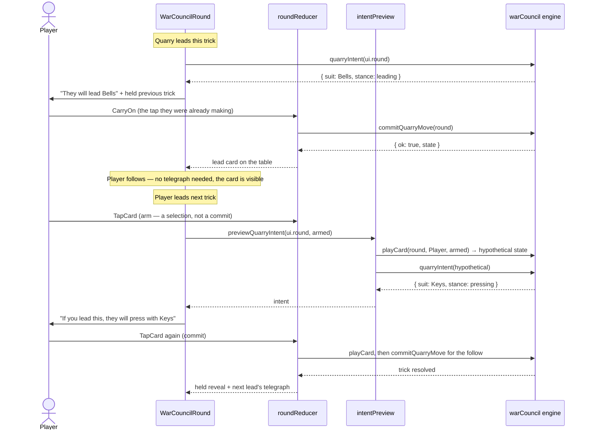

# Plan: The Hunt screen — play a full 13-trick Hunt against a telegraphing Quarry

Plan folder: `.claude/contract/DLR-53-hunt-screen/`
Execution status: see `tasks.md` in this folder.

---

## Part 1 — Alignment

### Task reference

**DLR-53** — "The Hunt screen: play a full 13-trick Hunt against a telegraphing Quarry" (Story, Highest, labels `ui` + `playable`, parent epic **DLR-46**). Status moved `To Do → Planning` at the start of this run.

**Acceptance criteria, verbatim from the ticket:**

1. A Hunt screen renders a full 13-trick round end to end, playable with mouse and keyboard, and reaching a cleared or missed outcome.
2. Persistently visible during play, per §4's visibility table: the current Demand; running Spoils; current trick count and the Standing band it currently sits in; the Quarry's trick count; the Quarry's character and its round-long rule-break in plain language.
3. The Quarry's next-trick intent is shown **before the player commits, every trick** — both when the Quarry leads and when it follows (DoD 6).
4. The end-of-Hunt panel shows the score as its parts — `Spoils × Standing = Score` — then the Demand and a cleared/missed verdict. The arithmetic is shown, not just the result, because §1's whole claim is that the equation is legible.
5. Full-viewport, no-scroll, per `game-ux`'s `references/full-viewport-layout.md`. The page body never scrolls at any supported viewport size.
6. Component tests query by accessible role and label. The telegraph, the Demand, the band, and the rule-break each have an accessible name a screen reader reaches.
7. Every number on screen derives from T2's config through T3/T4's functions. No layout constant, multiplier, or Demand value is hard-coded in a component.
8. Functional defaults are shipped and **visual judgement is explicitly deferred to T15** — the screen must be legible and complete, not finished-looking.
9. `npm run typecheck`, `npm run lint`, and the scoped Vitest run are green, and the screen has been driven in a real browser with no console error.

**Scope boundaries, verbatim:** in scope — the Hunt screen and its persistent status surfaces; the intent telegraph's presentation; the end-of-Hunt scoring panel with the equation shown as parts; extending `src/app/warCouncil/` rather than rebuilding it. Out of scope — the run (T9/T10), Forage (T11/T12), visual polish (T15), the other four Quarry characters (T13), revealing anything §4's table marks hidden.

**Design sources cited, not restated:** `.docs/design/Balatro-Forbidden-Solitaire/hybrid-design.md` §1 (the equation and its two growth classes), §4 (the Quarry, the two worked examples, and the visibility table), §11 (what the smallest testable slice is and what it is not).

**Upstream tickets whose output this consumes:** DLR-49 (`spoils`), DLR-50 (`scoreHunt`, `checkDemand`, `DemandOutcome`, `HuntScore`), DLR-51 (`quarryCharacter` on `RoundState`, `monarchFollowApplies`, `QUARRY_CHARACTERS`), DLR-52 (`quarryIntent`, `commitQuarryMove`, `QuarryIntentStance`, `TELEGRAPH_FIDELITY`).

### Restated goal

Turn the existing War Council round renderer into the Hunt screen: the same 13-trick felt, plus the five things §4's visibility table promises are on screen — the Demand being chased, the player's running Spoils, the trick count and the Standing band it sits in, the Quarry's trick count, and the Quarry's character with its round-long rule-break in plain language — plus the intent telegraph shown before every commit, and an end-of-Hunt panel that shows `Spoils × Standing = Score` as arithmetic before it shows the cleared/missed verdict. Nothing new is computed here: every number is read from `src/hunt/`'s config through the four engine functions T3–T6 already shipped, none of which currently has a single UI consumer. The screen must be legible and complete; making it look good is T15's.

### In scope

- A `hunt: Hunt` prop threaded through `WarCouncilMountProps` into the round mount, built in `App.tsx` from config — the screen's single source for the Demand and the Quarry's character.
- Two new config keys in `src/hunt/config.ts`: the slice's one fixed Demand, and the slice's Quarry character.
- A persistent **Hunt ledger** in the existing top status band: Demand, running Spoils, the Standing band's name and multiplier, and the live product.
- A persistent **Quarry dossier** zone: the character's name and its round-long rule-break sentence, read from `quarryCharacterInfo`.
- The **intent telegraph**, rendered at both of §4's decision points and with an accessible name — see Approach for the two cases and how each is reached.
- A pure `previewQuarryIntent` module: what the Quarry would do if the player led the card they currently have armed. This is what makes AC3 true for the follow case.
- A reducer change that stops auto-committing the Quarry's **lead**, so the lead is telegraphed before it lands rather than after.
- The end-of-Hunt panel rewritten in place from a tricks/points tally into `Spoils × Standing = Score`, then the Demand, then cleared/missed.
- A shell grid gaining one zone for the dossier and telegraph, with its CSS in a third stylesheet.
- Component tests querying by role and accessible name for the telegraph, the Demand, the band, and the rule-break; a pure unit test for the preview module; reducer tests for the telegraph-then-commit lead flow.

### Explicitly out of scope

- **The run.** No encounter progression, no Demand curve, no victory/defeat screen, no persistence. `DEMAND_CURVE` stays `{ base: null, growthPerEncounter: null }` and this plan does not touch it — the slice takes one fixed Demand and T9/T10 own the curve.
- **The other four Quarry characters.** Only the Monarch's rule-break is enforced (DLR-51), so `QUARRY_CHARACTERS` gains no entries here; putting a rule on screen that no code applies is the exact failure that file's own comment warns against.
- **Forage, the shop, deck editing** — T11/T12.
- **Visual polish, motion, colour work, copy tone** — T15, per AC8. This plan reuses the established `--wc-*` token palette and adds no new colours.
- **Revealing anything §4 marks hidden.** The Quarry's hand stays hidden; the telegraph stays at `TELEGRAPH_FIDELITY` (suit + stance) and never names the card.
- **Changing `WarCouncilRoundResult`.** T9 will want the `HuntScore` and outcome in the completion payload; adding it now would be speculative shape for an unwritten consumer.
- **Migrating `tricksToPoints` onto `resolveStanding`** — DLR-48 AC7 left that to a future ticket and it is not needed for anything on this screen.

### Pattern Reference

Supplied by the brief: **extend `src/app/warCouncil/`, do not rebuild it.** Concretely, the existing files are the pattern for their successors:

- `src/app/warCouncil/RoundStatusBand.tsx` — the edge-anchored status band; the Hunt ledger mounts inside it.
- `src/app/warCouncil/TrickWell.tsx` — the three-branch felt renderer and its `wc-table-hint wc-is-carry-on` control; the Quarry-to-lead state is a fourth branch in the same shape.
- `src/app/warCouncil/RoundOverPanel.tsx` — the end panel and its `wc-decline` finish control; rewritten in place.
- `src/app/warCouncil/labels.ts` — where every engine-value-to-copy map lives (`SUIT_NAME`, `RANK_NAME`, `ILLEGAL_MOVE_MESSAGE`); the stance, band, and outcome maps join it rather than starting a new file.
- `src/app/warCouncil/roundReducer.ts` — the pure `(state, action) => state` reducer and its `advanceCpu` helper.
- `src/app/warCouncil/warCouncilCards.css` — the precedent for splitting a stylesheet at the 400-line budget; `warCouncilHunt.css` follows it.
- `src/hunt/config.ts` — the comment convention for a config key (§ citation, decided/undecided, who owns the value).

Skills: `.claude/skills/react-frontend/SKILL.md` and `.claude/skills/game-ux/SKILL.md` + its `references/full-viewport-layout.md`.

### Constraints flagged on the brief

- **File size is a named risk.** The 400-line limit is blocking; measure with `(Get-Content <file> | Measure-Object -Line).Lines`, and split into child components rather than growing the round component. `warCouncil.css` is already at **366 lines**, so it has ~34 lines of headroom — this is the file most at risk, not `WarCouncilRound.tsx` (174).
- **Information density is a named risk.** §4 makes six things simultaneously visible; if they cannot be laid out without scrolling at a normal viewport, that is a finding to raise, not something to work around with a scroll pane.
- **No hard-coded number on screen** (AC7) — every multiplier, band boundary, and Demand comes from `src/hunt/config.ts` through T3/T4's functions.
- **Nothing §4 marks hidden may be revealed.** The telegraph is suit + stance, never the card.
- **Two runtime dependencies only.** Nothing here needs a third.
- **Visual judgement is deferred, not solicited** (AC8) — this ticket must not block on aesthetic sign-off.
- **Accessibility is an acceptance criterion, not a nicety** (AC6) — the telegraph, Demand, band, and rule-break each need a name a screen reader reaches.

### Assumptions made

- **New Hunt components live in `src/app/warCouncil/`, and `WarCouncilRound.tsx` remains the mount.** The brief says extend that folder; a parallel `src/app/hunt/` screen module would be the "rebuild" it rules out. The file keeps its name because renaming it would touch `App.tsx`, `src/app/index.ts`, and two test files for no behavioural gain.
- **`WarCouncilMountProps` gains a required `hunt: Hunt` rather than separate `demand`/`quarry` props.** `Hunt` already exists in `src/hunt/types.ts` as exactly `{ quarry, demand }` and is the domain's own name for this pairing. Required, not optional — an optional Demand would let a caller silently render a Hunt with nothing to clear.
- **The Quarry's *lead* is telegraphed by holding it un-committed; the Quarry's *follow* is telegraphed speculatively against the player's armed card.** These are the only two shapes AC3's "before the player commits" can take, because a follow is a function of the lead and does not exist until the lead is chosen. Detailed in Approach; the speculative half is the plan's most consequential reading and is raised in Risks.
- **The telegraph is derived on every render, never stored in reducer state.** `quarryIntent` is documented pure and StrictMode-safe by DLR-52, and it self-guards by returning `null` when it is not the Quarry's turn — so a derived call is correct in every reachable state and a stored copy could only go stale.
- **The player's running Spoils is shown; the Quarry's is not.** §4's table makes "your running Spoils" open and says nothing about the Quarry's. Showing it would be an unasked-for reveal.
- **The Standing chip shows the band's name *and* its multiplier** (e.g. "Victorious ×6"). AC2 asks for "the Standing band it currently sits in"; the multiplier is what makes the band mean anything against the Demand, and §1's legibility claim is the reason the whole screen exists.
- **The live product (`Spoils × Standing`) is shown during play, not only at the end.** AC2 does not ask for it and AC4 asks for it at the end. It is one derived number from two values already on screen, and it is what turns four separate readouts into §1's equation. Called out here so it can be red-lined as scope if unwanted.
- **The slice's Quarry is the Monarch, and that is not a tuning value.** DLR-51 enforces exactly one rule-break and `QUARRY_CHARACTERS` holds exactly one entry; §11 says which of the five is not load-bearing. The config key exists so T13 has one place to change, but its value today is forced by what is implemented.
- **`RoundOverPanel.tsx` is rewritten in place rather than superseded by a new `HuntOverPanel.tsx`.** Leaving the old tally component on disk unreferenced is dead code; the brief's "extend, don't rebuild" reads as modifying it.
- **New CSS goes in a new `warCouncilHunt.css`, imported by `WarCouncilRound.tsx` alongside the existing two.** `warCouncil.css` at 366 lines cannot absorb a new zone plus a ledger, a dossier, a telegraph, and an equation panel without breaching 400. This mirrors the split that already produced `warCouncilCards.css`.
- **The dossier and telegraph occupy one new grid zone, not two.** Two new rails plus band, table, and hand would not survive AC5 at a short viewport. One zone holding both, edge-anchored per `game-ux`, keeps the play area intact.
- **Trick 1 costs one extra tap when the Quarry leads it.** With the lead held for telegraphing there is no prior trick to carry on from, so the player taps once to let the Quarry open. Every subsequent Quarry lead is folded onto the carry-on tap the player was already making, so the per-trick tap count is unchanged at 3.
- **`previewQuarryIntent` returns `null` for a Fox or a Woodcutter.** Those ranks need an `AbilityChoice` before `playCard` will accept them, so no hypothetical state exists until the ability prompt is answered. The telegraph is absent rather than wrong for those two cards.

### Config and persisted-shape audit

- **New config keys — `FIXED_DEMAND`, `SLICE_QUARRY_CHARACTER`.** `grep -rn "FIXED_DEMAND\|SLICE_QUARRY" src/` → **0 hits**. Both are genuinely new; nothing to rename and no stale reader.
- **Nothing is persisted anywhere.** `grep -rn "localStorage\|sessionStorage\|indexedDB" src/` → **0 hits**. No save file, no stored log, no replay. **Recording this explicitly because it is a cheap window that is currently wide open** — this plan adds no persistence, so a future save-format ticket still inherits a clean slate.
- **`DEMAND_CURVE` is untouched.** 5 hits — `config.ts:63` (the declaration), `index.ts:10` (the re-export), and 3 in `config.test.ts:7,67,69-70` asserting both fields are `null`. This plan adds `FIXED_DEMAND` beside it rather than filling it in; those three assertions must still pass unchanged, which is the check that the run's curve was not quietly started here.
- **`WarCouncilMountProps` gains a required field — a required→required *addition*, so every construction site breaks at compile time.** Consumers found: `src/app/warCouncil/WarCouncilRound.tsx:39` (destructures it), `src/App.tsx:23` (the only production construction site), `src/app/index.ts:1` (a type re-export, no change needed), and `src/app/warCouncil/__tests__/WarCouncilRound.test.tsx` (renders the mount). `src/app/warCouncil/__tests__/roundFixture.ts` builds `RoundState`, not props, but is the natural home for the shared `Hunt` fixture. All four code sites are named in a task's `**Files:**` block. This is the safe direction of change: TypeScript catches every miss.
- **`RoundOverPanelProps` changes shape, not just gains fields** — `score: Record<PlayerSide, number>` (from `scoreRound`) is replaced by `huntScore: HuntScore` (from `scoreHunt`). One consumer: `WarCouncilRound.tsx:100-106`. `scoreRound` and `tricksToPoints` stay exported and stay used by `WarCouncilRound.tsx:76`'s `onComplete` payload, so nothing is orphaned.
- **`RoundUiState` gains no field.** The telegraph is derived. The reducer's *behaviour* changes (`createRoundUiState` no longer advances the Quarry; `handleCarryOn` commits it) — `roundReducer.test.ts` (164 lines) asserts the current behaviour and is in the same task as the change.
- **String-bound names.** New CSS classes all take the established `wc-` prefix and are declared only in the new `warCouncilHunt.css` plus the components that use them — no existing selector is renamed, so no stylesheet/component pair can drift. No `data-testid` values exist in this codebase (tests query by role) and none are introduced. The accessible names AC6 requires are the string-bound surface that matters here, and each is asserted in a component test in the same task that renders it.
- **Architectural boundary.** `eslint.config.js` enforces no-React/no-DOM on `src/warCouncil/**` and `src/hunt/**`. This plan adds to `src/hunt/config.ts` (two `as const`-style constants, no imports beyond `./types`) and adds **no** file to either tree — the new pure module `intentPreview.ts` deliberately sits in `src/app/warCouncil/` because "what would they do if I led this" is a UI-layer question composed from two engine calls, not an engine rule. It is still React-free and DOM-free and is tested with no renderer.

---

## Part 2 — Technical design

### Approach

**The screen is the existing round renderer plus one zone and one ledger; the hard part is the telegraph.** Everything in AC2 is a read of state that already exists — `spoils(round, Player)`, `resolveStanding(tricksWon.player)`, `round.tricksWon`, `quarryCharacterInfo(round.quarryCharacter)` — so the four persistent readouts are presentational components fed derived values, with no new state and no new arithmetic. The Demand and the Quarry's character arrive as one `hunt: Hunt` prop, built once in `App.tsx` from two new config keys and threaded through the existing `WarCouncilMountProps`. That keeps AC7 structurally true rather than merely observed: a component that never sees a literal cannot hard-code one.

**AC3 is the design work, because "before the player commits, every trick" means two different things depending on who leads.** `quarryIntent(state)` is pure and returns `null` unless it is currently the Quarry's turn, which splits the round into exactly two cases:

- **The Quarry leads.** Today `roundReducer.ts` commits that lead the instant it can — inside `createRoundUiState` for trick 1, and inside `handleCarryOn` for every later trick. By the time anything renders, the card is already on the table and the telegraph has been overtaken by the truth it was meant to preview. The fix is to stop auto-committing the lead: `createRoundUiState` returns the deal untouched, and `handleCarryOn` clears the held trick *and then* commits the Quarry via `commitQuarryMove` — the function DLR-52 built for exactly this split. In the render before that commit, `currentTurn` is the Quarry and `currentTrick` is empty, so `quarryIntent(ui.round)` returns the lead intent with no extra state. The player reads "They will lead Bells", taps carry-on, the lead lands, and they follow. Crucially the telegraph shows *alongside* the previous trick's held reveal, so it costs no extra tap — only trick 1 has no prior trick to fold onto.
- **The Quarry follows.** A follow is a function of the lead, so it does not exist until the player has chosen one. Waiting until the player commits and *then* telegraphing would make the telegraph a post-hoc caption — precisely the "die roll resolved after you commit" that `forbidden-solitaire.md` §5/§10.5 says telegraphing exists to eliminate, and which §4's table cites as its justification. So the telegraph runs against the card the player currently has **armed** — the first of the existing two-tap arm-then-confirm interaction, which is a selection, not a commitment. `previewQuarryIntent(round, card)` plays the card into a throwaway state via the pure `playCard` and asks `quarryIntent` about the result. The player arms a card, reads "They will press with Keys", and either taps again to commit or arms a different card.

The alternatives were considered and rejected by name. **Telegraphing the follow only after the lead commits** is the smaller change and needs no new module, but it fails AC3's literal wording and reduces the telegraph to a caption. **Storing the intent in `RoundUiState`** as a `pendingIntent` field would work but adds a field that can only ever go stale relative to `ui.round`, and `quarryIntent`'s own doc comment says it is safe to call any number of times including under StrictMode's double-invoke — a derived call is both simpler and more obviously correct. **Adding a dedicated "let them lead" button** was rejected on `game-ux`'s interaction-cost floor: it would add a fourth tap to a three-tap loop repeated thirteen times a round, where folding the commit onto the existing carry-on control adds none.

**Placement follows `game-ux`'s zoning, and the pure/impure split follows `react-frontend`.** The shell stays one full-viewport `grid` with `overflow: hidden` and `dvh` sizing; it gains a `dossier` zone beside the table holding the Quarry's name, its rule-break sentence, and the telegraph, so the telegraph sits adjacent to the felt where the decision is made rather than in the far corner. The Hunt ledger goes inside the existing edge-anchored status band next to the trick counts, because the Standing band is read off the player's trick count and the two belong in one glance. All new selectors live in a third stylesheet, `warCouncilHunt.css`, since `warCouncil.css` at 366 lines cannot take a new zone without breaching the 400-line limit. On the code side, `previewQuarryIntent` is a pure module with a node-project unit test and no renderer; the ledger, dossier, telegraph, and end panel are presentational components that compute nothing beyond formatting; and the only behaviour change lives in the reducer, where it is already covered by `(state, action) => state` tests.

### Skills to invoke during execution

- **`react-frontend`** — owns everything under `src/`: the new components' shape and file order, the reducer change, the 400-line budget (measured, not estimated), the strict-TypeScript floor, and the Vitest posture. The MUST/NEVER contract applies to every task in this plan.
- **`game-ux`** — owns the game-screen layer: the full-viewport no-scroll shell and its `dvh`/`overflow: hidden`/safe-area rules, the zoning of six simultaneously-visible readouts, the tap count on the most-repeated action, keyboard reachability of the new carry-on state, and the rule that no state is signalled by colour alone. Read its `references/full-viewport-layout.md` before touching the shell grid.

Developer override at the Step 1.5 gate: `game-designer` was offered for the intent-telegraph reading and **declined** — the reading is decided by the developer at this plan's approval gate instead (see Risks), not worked through against the design frameworks.

Also required reading for the executor: `.claude/workflow/web-project.md` (paths, runners, the Vitest `run`-subcommand and cold-cache traps). `.claude/rules/` was scanned and is empty apart from its README — no project-wide rule applies.

### Diagram



### Data shapes

#### New config keys — `src/hunt/config.ts`

```ts
import { QuarryCharacter, type Demand } from './types'

// §11 "one fixed Demand": the slice checks Score against a single target rather
// than a curve. DEMAND_CURVE stays null-valued — the curve is T9's run state.
// UNIT: score points, compared against `Spoils × Standing` by `checkDemand`.
// VALUE: a developer decision (see plan.md Risks); the literal below is the
// placeholder recorded at the DLR-53 approval gate, not a derived constant.
export const FIXED_DEMAND: Demand = /* developer decision */ 220

// §11 "any single character is sufficient". Not a tuning value: DLR-51 enforces
// only the Monarch's rule-break and QUARRY_CHARACTERS holds only its copy, so
// this is forced by what is implemented until T13 adds the other four. Exists as
// a key so T13 has exactly one place to change.
export const SLICE_QUARRY_CHARACTER: QuarryCharacter = QuarryCharacter.Monarch
```

Both re-exported from `src/hunt/index.ts`.

#### Mount contract — `src/app/warCouncilMount.ts`

```ts
import type { Hunt } from '../hunt'

export interface WarCouncilMountProps {
  readonly initialState: WarCouncilState
  readonly hunt: Hunt // { quarry: { character }, demand } — the encounter's Demand and Quarry
  readonly onComplete: (result: WarCouncilRoundResult) => void
}
```

`WarCouncilRoundResult` is unchanged.

#### New pure module — `src/app/warCouncil/intentPreview.ts`

```ts
/**
 * The Quarry's intent for the trick the player is *about* to lead — what
 * `quarryIntent` would say once `card` has been led. Pure: builds a throwaway
 * state via `playCard` and never mutates `round`.
 *
 * Returns null when there is no answer to give: `playCard` rejected the card
 * (illegal, or a Fox/Woodcutter awaiting its AbilityChoice — no hypothetical
 * state exists until the prompt is answered), or the resulting state is not the
 * Quarry's turn (the player won the trick and leads again).
 */
export function previewQuarryIntent(
  round: WarCouncilState,
  card: Card,
  fidelity?: TelegraphFidelity,
): QuarryIntent | null
```

#### New presentational components — `src/app/warCouncil/`

```ts
// HuntLedger.tsx — mounted inside RoundStatusBand
interface HuntLedgerProps {
  readonly demand: Demand
  readonly spoils: Spoils
  readonly band: StandingBand // from resolveStanding(tricksWon.player)
}

// QuarryDossier.tsx — the new grid zone; renders nothing when info is undefined
interface QuarryDossierProps {
  readonly info: QuarryCharacterInfo | undefined // from quarryCharacterInfo()
  readonly tricksWon: number // the Quarry's, per §4's public-trick-count row
}

// IntentTelegraph.tsx — beneath the dossier
interface IntentTelegraphProps {
  readonly intent: QuarryIntent | null // null renders the "nothing to read" line
  readonly speculative: boolean // true when derived from an armed card, not a live turn
}
```

#### Changed component props

```ts
// RoundStatusBand.tsx — gains the ledger's three inputs
interface RoundStatusBandProps {
  readonly tricksWon: Readonly<Record<PlayerSide, number>>
  readonly tricksPlayed: number
  readonly opponentHandCount: number
  readonly roundComplete: boolean
  readonly demand: Demand
  readonly spoils: Spoils
  readonly band: StandingBand
}

// TrickWell.tsx — gains the fourth branch's flag
interface TrickWellProps {
  readonly currentTrick: readonly TrickCard[]
  readonly resolvedTrick: ResolvedTrick | null
  readonly quarryToLead: boolean // telegraph shown, lead not yet committed
  readonly onCarryOn: () => void
}

// RoundOverPanel.tsx — `score` replaced by the equation's parts
interface RoundOverPanelProps {
  readonly tricksWon: Readonly<Record<PlayerSide, number>>
  readonly huntScore: HuntScore // { spoils, tricks, band, standing, score }
  readonly demand: Demand
  readonly outcome: DemandOutcome // 'cleared' | 'missed'
  readonly onFinish: () => void
}
```

#### New copy maps — appended to `src/app/warCouncil/labels.ts`

```ts
export const STANCE_PHRASE: Readonly<Record<QuarryIntentStance, string>>
// leading → 'lead', pressing → 'press with', ducking → 'duck with'

export const STANDING_BAND_NAME: Readonly<Record<StandingBandName, string>>
// humble → 'Humble', defeated → 'Defeated', victorious → 'Victorious', greedy → 'Greedy'

export const DEMAND_OUTCOME_VERDICT: Readonly<Record<DemandOutcome, string>>
// cleared → 'Demand cleared', missed → 'Demand missed'

/** The telegraph's accessible name — AC6. */
export function intentAccessibleName(intent: QuarryIntent | null, speculative: boolean): string
```

#### Reducer — behaviour change only, no shape change

`RoundUiState`, `RoundUiAction`, and `RoundUiActionKind` are unchanged. `createRoundUiState` no longer calls `advanceCpu`; `handleCarryOn` no longer early-returns when `resolvedTrick === null`, and commits the Quarry's turn through `commitQuarryMove` when one is pending.

#### CSS

New file `src/app/warCouncil/warCouncilHunt.css` — selectors under the existing `wc-` prefix: `.wc-ledger`, `.wc-ledger-cell`, `.wc-dossier`, `.wc-dossier-rule`, `.wc-telegraph`, `.wc-telegraph-empty`, `.wc-equation`, `.wc-equation-part`, `.wc-verdict`, `.wc-is-cleared`, `.wc-is-missed`. `warCouncil.css`'s `.wc-shell` grid gains a `dossier` area. **No new colour tokens** — AC8 defers that to T15; the existing `--wc-*` palette covers every state, with form (border weight, a badge) carrying state alongside colour per `game-ux`.

No `package.json`, `tsconfig.json`, `vite.config.ts`, or ESLint change. No new dependency.

### Runtime quality notes

- **Purity and adjudication.** `previewQuarryIntent` is a pure function of `(round, card)` with no React import and no DOM access, unit-tested with no renderer; the four new components compute nothing beyond formatting a value handed to them. No component decides a rule: the legal set stays `legalMoves`'s, the stance stays `quarryIntent`'s, the band stays `resolveStanding`'s, the verdict stays `checkDemand`'s. Every number on screen originates in `src/hunt/config.ts` — the components never see a literal, which is what makes AC7 structural rather than observed.
- **Effects, mount and teardown.** **This plan adds no effect, no listener, no observer, no timer, and no `requestAnimationFrame`** — `WarCouncilRound.tsx`'s own doc comment records that the component has no effect anywhere and that every transition is a tap, a keypress, or a callback, and this change preserves that. The one lifecycle consequence to get right is StrictMode: `createRoundUiState` is a lazy `useReducer` initialiser that React double-invokes in development, and **removing its `advanceCpu` call makes it strictly more idempotent than it is today** — it becomes a pure restructuring of its argument. `quarryIntent` and `previewQuarryIntent` are called during render and are documented pure, so a double-invoke recomputes identical values. There is no module-level mutable state in any file this plan touches, and none is introduced. `App.tsx` keys the mount on `round`, so a completed Hunt remounts with fresh reducer state and nothing survives.
- **Hot-path cost.** There is no pointer-move or animation-frame path here; the highest-frequency event is a card tap. `previewQuarryIntent` runs once per render while a card is armed and costs one `playCard` plus one `chooseCpuCard` over a hand of at most 13 cards — bounded, allocating one throwaway `RoundState`, and orders of magnitude cheaper than the render it accompanies. `spoils` reduces over at most 26 captured cards per render. Both are whole-collection rather than incremental, which is correct at these sizes; **no `useMemo` is added, because there is no profiling evidence and `react-frontend` forbids speculative memoisation.**
- **Determinism and numeric safety.** No `Math.random()` is added. The existing single seed path is `App.tsx`'s `dealRound(dealerForRound(n), Math.random)`, which this plan leaves alone; every function it introduces is a pure read of an already-dealt state. **No division is performed anywhere in this change**, so no epsilon is needed and no divisor needs guarding — the only arithmetic is `spoils × standing`, a product of two integers. The one genuine numeric hazard is a `FIXED_DEMAND` left as `null`/`undefined`: `checkDemand` would then compare against `undefined` and return `Missed` for every Hunt with no error. The config key is therefore typed `Demand` (a `number`), which makes `null` a compile error rather than a silent wrong verdict.
- **Error paths.** `previewQuarryIntent` returns `null` on a rejected `playCard` — an absent telegraph line, not a fabricated one, and never a swallowed error dressed as success. `QuarryDossier` renders nothing when `quarryCharacterInfo` returns `undefined`, which is that function's documented contract for an unimplemented character, so a future T13 mid-state shows no panel rather than crashing. The existing `cpuFault` branch — which surfaces an engine rejection of the CPU's own move as a visible `role="alert"` rather than retrying — must survive the reducer change and now also covers `commitQuarryMove`'s two documented rejection reasons (`RoundComplete`, `NotYourTurn`), each of which is a bug if reached and is shown as one. Illegal player moves keep their existing named reason through `ILLEGAL_MOVE_MESSAGE`. There is no async surface in this change — no promise, no fetch, no timer — so the four async states do not arise.

### Risks and judgement calls

- **The one number nobody has chosen: `FIXED_DEMAND`.** §9 leaves the Demand base undecided and `DEMAND_CURVE.base` is `null` on purpose. At the printed multipliers and rank-valued cards, a Hunt scores roughly `12k × f(k)` for `k` tricks won — ≈216 at 3 tricks (Humble ×6), 48 at 4, 120 at 5, 216 at 6 (Defeated ×3), ≈504 at 7 and ≈648 at 9 (Victorious ×6), and 0 at 10+ (Greedy). A Demand near **220** puts both the Humble-3 and Defeated-6 lines on a knife edge and makes Victorious comfortable, which is the most informative first playtest; a Demand near **500** makes only Victorious clear. **220 is written into the plan as a documented placeholder so the screen is playable, and the real value is yours.** This is the decision most likely to change what T8's kill-criterion playtest measures.
- **The speculative follow telegraph is the plan's most consequential reading, and it is a design call.** Previewing the Quarry's response to the armed card is what makes AC3 literally true for the follow case, and `forbidden-solitaire.md` §5/§10.5 — the citation §4's own visibility table rests on — is explicit that telegraphing exists so the opponent is not "a die roll resolved after you commit". But it also lets a player arm each card in turn and read off a stance for each, which is more inference about the Quarry's hand than §4's hidden-hand row contemplates. Three positions, and the choice is yours: **(a)** ship it as planned; **(b)** ship the lead telegraph only and show the follow telegraph after the player's lead commits, accepting a partial miss on AC3; **(c)** ship it but gate it behind the existing `TELEGRAPH_FIDELITY` config so the preview can be narrowed to suit-only without a code change. The plan implements **(a)**; **(c)** is a small addition on top if you want the dial.
- **The live in-play product (`Spoils × Standing`) is an addition to AC2, not a requirement of it.** It is one derived number and it is what makes the four readouts legible as §1's equation rather than as four unrelated numbers — but if you want the screen to show only what AC2 lists, say so and it comes out.
- **Information density against AC5 is the risk the ticket itself names, and it cannot be settled on paper.** Six readouts plus a 13-card hand plus the felt, with no scroll, at every supported viewport. The mockup in this folder is where you judge whether the arrangement survives; QA will confirm no page scroll at named viewport sizes in a real browser. If it genuinely does not fit, the ticket's own instruction is to raise it as a finding rather than reach for a scroll pane.
- **Trick 1 costs one extra tap when the Quarry leads it.** Unavoidable once the lead is held for telegraphing — there is no prior trick to fold the commit onto. Every other trick is unchanged at 3 taps. Worth confirming the opening tap does not read as a stall.
- **Card and panel size bounds for the new zone are tuning values.** The existing `--wc-card-w: clamp(2.9rem, 6.2vmin, 4.3rem)` pattern is followed and the dossier zone's width bound will be written in the same `clamp()` shape, but the specific min/max are yours to retune — flagged rather than blocked, per `game-ux`.
- **Whether the telegraph reads as information you plan around or as noise is the epic's headline question, and only playing answers it.** QA can confirm the telegraph renders, names the right suit and stance, and appears before every commit. It cannot tell you whether reading it changes the card you play — that is T8's kill criterion, and it is yours.
- **`RoundOverPanel.tsx`'s rewrite drops the two-side points tally** (`scoreRound`'s per-side output) in favour of the player's equation, because §1's equation is a one-sided claim and the Quarry has no Demand to clear. The Quarry's *trick* count stays in the tally. Confirm that losing the opponent's points row is right.
