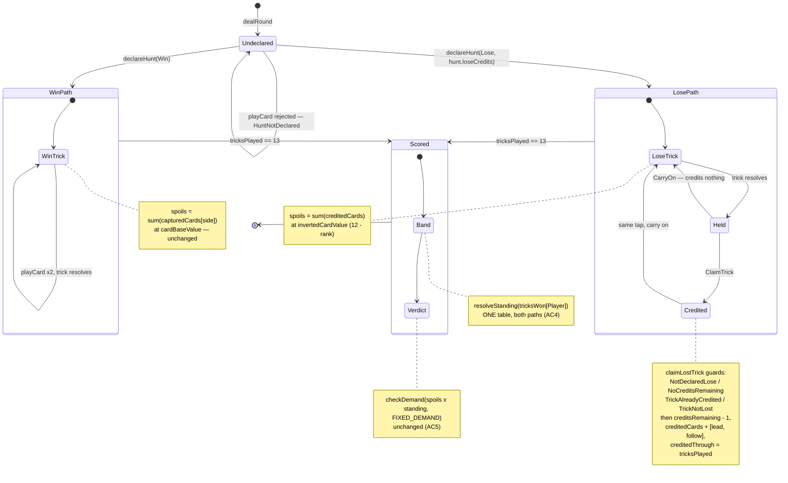

# Plan: Win/Lose declare with capped Lose-credits, in the single-Hunt slice

Plan folder: `.claude/contract/DLR-63-declare-win-lose-with-lose-credits/`
Execution status: see `tasks.md` in this folder.

---

## Part 1 — Alignment

_(The shared understanding of what this task is doing. Restate it in your own words — this is how the developer confirms the brief was read correctly before any design happens. Mismatch here = stop and fix.)_

### Task reference

Jira **DLR-63** — "Win/Lose declare with capped Lose-credits, in the single-Hunt slice" (Story, High, labels `ui` + `playable`, parent epic DLR-46). Read from the live ticket 2026-08-11.

**Problem statement (verbatim):**

> Playtesting the smallest testable slice (`hybrid-design.md` §11) showed a Hunt has no legible goal to plan toward — no equivalent of picking a poker hand off a dealt hand in Balatro's fresh ante. Declaring Win or Lose off the dealt hand, before play starts, restores that decision; capping the number of "Lose credits" (mirroring Balatro's limited discards) avoids the degenerate always-lose-everything outcome an unlimited version would produce.

**User story (verbatim):**

> As a player, I want to look at my dealt hand and declare whether I'm playing to win tricks or lose them, so that I have a real, informed decision to plan the round around instead of an invisible target.

**Acceptance criteria (verbatim):**

1. Before the first trick, the player sees their full dealt 13-card hand and declares Win or Lose for that Hunt.
2. Win declared: card values and trick capture work exactly as the slice currently implements them.
3. Lose declared: a card's value inverts (rank `r` scores as `12 − r`); the player holds a capped number of Lose-credits, each spendable on one trick they lose, crediting that trick's inverted values to Spoils. A trick lost with no credit left, or a trick won while declared Lose, credits nothing.
4. Both declarations resolve Standing from the same existing band table (`tricksToPoints`) — no second multiplier curve.
5. At Hunt end, `Score = Spoils × Standing` is checked against the fixed Demand exactly as today, regardless of declared path.
6. The player's hand displays sorted by suit, then by rank within each suit, rather than in dealt order.
7. Each card's suit icon is positioned in the bottom-left corner of the card, and the card carries a colored border matching its suit.

**Scope boundaries (verbatim):**

> **In scope:** the declare step, value inversion, the capped credit spend, Standing unchanged, hand sort order, and the card-face suit border/icon placement — all inside the existing single-Hunt slice.
> **Out of scope:** run structure, Forage, escalating Demand, a per-run (rather than per-Hunt) credit variant.

**Dependencies & risks (verbatim):**

> Lose-credit count is an undecided tuning value, the developer's to set once playable. Open question carried from design review: the credit cap stops the in-Hunt runaway, but doesn't yet prove declaring Lose can't dominate declaring Win at the meta level — check once real numbers exist.

**Design assets:** N/A. The ticket states the mechanic is not yet written into `hybrid-design.md`, so the ticket's own AC text is the specification for the declare/invert/credit rules; `hybrid-design.md` §1/§3/§9/§11 remains the specification for everything the ticket says is unchanged (Standing, the Demand, the equation).

### Restated goal

Right now a Hunt opens with the player holding thirteen cards and no stated target beyond "clear a Demand somehow" — the trick count that pays is invisible until the band table is consulted at the end. This ticket puts one decision at the front of the round: look at the dealt hand and declare **Win** or **Lose**. Declaring Win leaves the slice behaving exactly as it does today. Declaring Lose flips what a card is worth (rank `r` becomes `12 − r`, so the low cards become the fat ones) and hands the player a small, capped pool of **Lose-credits**; each credit can be spent on one trick the player loses, crediting that lost trick's two cards at their inverted values to Spoils. Losing a trick with no credit left, and winning a trick while declared Lose, both credit nothing. Standing still comes from the one existing band table for both paths, and the end-of-Hunt `Score = Spoils × Standing` check against the fixed Demand is untouched. Alongside that, two card-presentation fixes the same playtest surfaced: the hand renders sorted by suit then by rank instead of in dealt order, and each card face moves its suit icon to the bottom-left corner and gains a border in its suit's colour.

### In scope

- A **declare step** gating the first trick: the full dealt thirteen-card hand is visible and the player picks Win or Lose, once, for that Hunt.
- A **declaration record on round state** — the chosen path, the remaining Lose-credit count, and the cards credited so far — written by a new engine entry point and carried by every existing state spread.
- **Inverted card value** as a named `src/hunt/config.ts` function (`12 − rank`), used only on the Lose path.
- `spoils` **reading the declaration**: unchanged capture-pile sum on Win or undeclared; the credited-card sum at inverted value on Lose.
- A **credit spend** engine entry point that adjudicates one lost trick against the remaining credits, rejects a second claim on the same trick, and rejects a claim on a trick the player won.
- A **new `src/hunt/config.ts` key for the credit cap**, named and documented here, its value routed to the developer.
- The credit decision **offered on the existing resolved-trick reveal**, so it costs no extra tap.
- A **Lose-credit readout** on the Hunt screen, so the remaining count is never hover-only or invisible.
- **Hand sorted for display** by suit (the engine's own `ALL_SUITS` order) then ascending rank, with the fan's geometry and roving tabindex following the sorted order.
- **Card face**: suit icon repositioned to the bottom-left corner, plus a suit-coloured border.
- Vitest coverage for every new pure function and engine guard, plus component coverage for the declare gate, the claim control, and the sorted hand order.
- An `AC4`/`AC5` regression guard: Standing and the Demand check are proven unchanged across both declared paths.

### Explicitly out of scope

- **Run structure, Forage, an escalating Demand, and a per-run credit variant** — all four named out of scope on the ticket. `DEMAND_CURVE` stays `{ base: null, growthPerEncounter: null }` and `FIXED_DEMAND` stays the single target.
- **A second multiplier curve for the Lose path.** AC4 forbids it: `STANDING_BANDS` / `resolveStanding` / `tricksToPoints` keep their single table and are not re-tuned here.
- **Re-tuning the Humble ×6 or Greedy ×0 multipliers.** §6/§9 flag both as live decisions and the Lose path lands squarely in Humble, so this plan will make that tension visible — but changing a multiplier is its own ticket.
- **Whether declaring Lose dominates declaring Win at the meta level.** The ticket explicitly carries this as an open question to check once real numbers exist; nothing here attempts to balance it.
- **Card art, a visual polish pass, or new colour tokens.** AC7's icon position and suit border are structural card-face changes; the palette stays the existing `--wc-bells` / `--wc-keys` / `--wc-moons` tokens.
- **A CPU that plays differently against a declared-Lose player.** `cpuPlayer.ts` and `quarryIntent` are untouched — the Quarry does not read the declaration.
- **Scoring the Quarry under a declaration.** `spoils(state, Cpu)` keeps its base-value capture-pile behaviour; the design scores only the player (§8).
- **The four unimplemented Quarry characters** and the stale `MustFollowMonarch` copy — both live follow-ups recorded in `.docs/implementation/`, neither in this ticket's diff.
- **Persistence, save/replay, or undo** of the declaration. Nothing in this repo stores state yet.

### Pattern Reference

The brief supplied no code reference, so these were chosen and are recorded here:

- **The injectable-second-argument pattern** — `src/hunt/config.ts`'s `resolveStanding(tricks, table = STANDING_BANDS)` and `src/warCouncil/spoils.ts`'s `spoils(state, side, cardValue = cardBaseValue)`. Every new pure function that reads config follows it, so a test can hold one axis flat without mutating shared module state.
- **The optional-field precedent for widening `RoundState`** — `src/warCouncil/types.ts`'s `quarryCharacter?: QuarryCharacter` (DLR-51), deliberately optional so hand-built `RoundState` literals in specs still compile. The new declaration field takes the same shape for the same reason.
- **The reducer-shaped guarded entry point** — `src/warCouncil/playCard.ts`'s `{ ok: true, state } | { ok: false, reason }` result with a closed `as const` reason map. Both new engine entry points take that shape.
- **The named-reason-code + display-copy split** — `IllegalMoveReason` in `src/warCouncil/types.ts` paired with `ILLEGAL_MOVE_MESSAGE` in `src/app/warCouncil/labels.ts`.
- **The derived-not-stored render rule** — `src/app/warCouncil/WarCouncilRound.tsx:63-85`, where `runningSpoils`, `band`, and `intent` are all derived every render rather than held in `RoundUiState`. The claim-available check follows it.
- **The zone component shape** — `HuntLedger.tsx` / `QuarryDossier.tsx` / `IntentTelegraph.tsx` (DLR-53): a default export consumed only by `WarCouncilRound.tsx`, formatting props and computing no rule.
- **`.claude/skills/react-frontend/SKILL.md`** and **`.claude/skills/game-ux/SKILL.md`** for conventions; **`.claude/workflow/web-project.md`** for paths and runners.
- **Specification citations:** the ticket's AC1–AC7 for the declare/invert/credit rules; `hybrid-design.md` §1 (the equation), §3 (the ceiling and the flat-vs-rank card-value fork), §6 (the Humble-lane dominance argument the Lose path lands in), §9 (the undecided-value rows), §11 (the slice's boundary).

### Constraints flagged on the brief

- **The Lose-credit count is explicitly the developer's to set once playable.** The ticket says so in `Dependencies & Risks`. This plan names the key and documents a placeholder with the arithmetic behind it; it does not settle the value.
- **AC4 is a hard "no second curve" constraint.** One band table, both paths.
- **AC5 is a hard "unchanged end check" constraint.** `scoreHunt` × `checkDemand` against `FIXED_DEMAND`, same as today.
- **AC2 is a behaviour-preservation constraint.** A Win-declared Hunt must be byte-for-byte the current slice's behaviour, which makes the existing suite the regression guard.
- **The `playable` label is a commitment.** Closing this ticket must leave the developer able to open the app and exercise the declare step and the credit spend by hand.
- **The pure-core boundary** (`eslint.config.js`, scoping `no-restricted-imports` / `no-restricted-globals` to `src/warCouncil/**` and `src/hunt/**`) applies to every engine and config file this ticket touches.
- **`.claude/skills/game-ux/SKILL.md`'s no-scroll floor.** The Hunt screen already broke once at phone width when a readout was added to `.wc-status` (DLR-53's first review round). Any new readout must be checked in a real browser at named sizes.

### Assumptions made

- **The credit spend is a player choice, not automatic.** AC3 says each credit is "spendable on one trick they lose" and the problem statement cites Balatro's *discards*, which are player-chosen. Auto-spending on the first `n` losses would leave the cap generating no decisions at all — the first `n` lost tricks consume the pool regardless of what is in them — which defeats the ticket's own stated purpose of restoring a decision. **This is the single most consequential assumption in the plan and the one to red-line first.** Recorded again under Risks.
- **The claim decision is folded onto the existing carry-on tap.** A lost trick already stops on a held reveal with one "Tap the table to carry on" control; when a claim is available that becomes two controls (claim, or let it go). Tap count per trick is therefore unchanged, per `game-ux`'s tap-cost rule. Chosen over a separate confirm step or a post-round batch claim.
- **Treasure (+1) and Poison (−1) keep their existing per-card adjustment on credited cards.** AC3 specifies the rank inversion and says nothing about the two scoring cards. §1's component table treats both as interventions on Spoils, and a credited trick is a Spoils event, so the same ±1 folding applies. The alternative — dropping the adjustment on the Lose path — would make the Poison 8 (inverted value 4, adjusted 3) silently better on one path than the other for no stated reason.
- **The rank-inversion pivot is `12`, held as a named constant, not derived.** AC3 states `12 − r` outright, and `12` is `max(RANKS) + 1` for the 1–11 deck. It is named in `src/hunt/config.ts` rather than inlined so a future deck-size change has one place to look — but it is **not** a tuning value and is not routed to the developer.
- **The declaration lives on `RoundState`, not in `RoundUiState`.** Credits are spent per trick during play and the credited set determines Spoils, so this is engine state a reducer must not own. Chosen over holding it in the UI reducer (which would put a scoring rule in `src/app/`) and over threading it through the `Hunt` prop (which cannot change mid-round).
- **`RoundState`'s new field is optional, one nested object.** `declaration?: DeclarationState` keeps all twenty-one files holding a hand-built `RoundState` literal compiling and gives readers one absence check, following `quarryCharacter?`'s precedent exactly. Absent means undeclared.
- **Undeclared behaves as Win for scoring purposes.** `spoils` and `scoreHunt` must stay callable against the existing fixtures, none of which will declare. This is what makes AC2 provable by the existing suite rather than by new tests.
- **The credit cap reaches the engine through the `Hunt` prop**, as `hunt.loseCredits`, mirroring how `hunt.demand` already reaches the screen from `src/hunt/config.ts`. This keeps DLR-53's structural property intact — no component sees a numeric literal standing in for a tunable.
- **Hand sort order groups suits by how many cards are held in each, longest suit leftmost, then ascending rank within a suit — developer-confirmed at the Part 1 gate, 2026-08-11.** AC6 says "sorted by suit, then by rank" without naming either direction; the developer's red-line settled the suit axis as "the amount in the suit, biggest to smallest, left to right". Ties in holding size fall back to `ALL_SUITS` order (Bells, Keys, Moons), so the comparator is total and the sort is deterministic rather than dependent on `Array.prototype.sort` stability across engines. Ascending rank within a suit matches `RANKS` and is the one axis still a free visual call.
- **The hand therefore re-orders as it is played, and that is accepted.** Holding size shrinks as cards leave, so a suit can lose its leftmost position mid-round. This is what a physical player's hand does, and card positions already shift today whenever a card is removed — but it does mean position is not stable across tricks. Recorded under Risks rather than mitigated.
- **The sort is a display concern, applied at the render boundary in `src/app/warCouncil/`, not in the engine.** Sorting `RoundState.hands` would change what `dealRound` returns and what every engine spec asserts, for a purely presentational reason. The sort function is React-free and DOM-free so it runs in the cheap `node` Vitest project.
- **The declare gate renders in the existing `table` grid zone**, over the felt, with the hand fan visible below it and non-interactive. AC1 requires the full dealt hand to be visible while declaring, and the fan is already the thing that shows it — a separate full-screen modal would hide it.
- **The claim rejection reasons are their own closed union, not new `IllegalMoveReason` members.** `ILLEGAL_MOVE_MESSAGE` is an exhaustive `Record<IllegalMoveReason, string>` rendered as a *hand-card* rejection hint; a claim rejection is never that, and widening the union would force nine unrelated copy strings to grow a case each.
- **Nothing in the diff is persisted, so no migration exists.** Confirmed by the audit below.

### Config and persisted-shape audit

Performed against the real files with `Grep`/`Read` on 2026-08-11.

- **`spoils` — the one function whose meaning changes — has exactly 7 hits across 3 files.** `src/warCouncil/spoils.ts:10` (the definition), `src/warCouncil/scoring.ts:48` (inside `scoreHunt`), `src/app/warCouncil/WarCouncilRound.tsx:65` (the running-Spoils readout), and 4 assertion sites in `src/warCouncil/__tests__/spoils.test.ts`. All three production sites and the spec are named in a task's `**Files:**` block; no consumer is missed.
- **`capturedCards` — the field the Lose path stops reading — has 26 hits across 17 files**, of which only 4 are production: `src/warCouncil/types.ts` (the declaration), `src/warCouncil/deal.ts` (initialised empty), `src/warCouncil/playCard.ts` (appended on trick resolution, 4 of those hits), and `src/warCouncil/spoils.ts` (read). The remaining 22 are hand-built `RoundState` literals in specs and `src/app/warCouncil/__tests__/roundFixture.ts`. **This count is the whole argument for making the new field optional** — required would break all 22.
- **`resolveStanding` / `tricksToPoints` — AC4's "no second curve" — have 9 and 4 production/spec hits respectively and are not modified.** `resolveStanding` is called at `src/hunt/config.ts:37` (definition), `src/warCouncil/scoring.ts:15` and `:47`, `src/app/warCouncil/WarCouncilRound.tsx:66`, plus specs. Every one keeps its current signature and its current table. A task in Final verification greps to prove no second band table was introduced.
- **`cardBaseValue` has 8 hits**: definition at `src/hunt/config.ts:52`, barrel re-export at `src/hunt/index.ts:9`, default parameter at `src/warCouncil/spoils.ts:13` and `src/warCouncil/scoring.ts:43`, and 3 spec sites. It is **not** retyped or renamed — the new `invertedCardValue` sits beside it with the identical `(rank: number) => number` signature, so it drops into the same injectable parameter.
- **`Hunt` gains a required field, and every construction site is enumerated: exactly 3.** `src/App.tsx:10` (`const HUNT: Hunt`), `src/app/warCouncil/__tests__/roundFixture.ts:50` (`huntFixture`), and two spread-overrides of `huntFixture` at `src/app/warCouncil/__tests__/WarCouncilRound.test.tsx:272` and `:291` which inherit the new field from the spread. `src/app/warCouncilMount.ts:8` declares the prop. Required rather than optional is deliberate and follows `demand`'s own reasoning: every site breaks at compile time rather than one silently rendering `undefined` credits.
- **Nothing is persisted anywhere — the cheap window is still open, and this is the record that it was open here.** `Grep` for `localStorage|sessionStorage|indexedDB|JSON.parse|JSON.stringify` across `src/**` returns **zero hits**. `RoundState` is an in-memory shape only, so widening it needs no migration and invalidates no stored record. A later persistence ticket will be the first to close this window.
- **Type-loss check: no existing type narrows or widens.** The only shape change is *additive* — one optional field on `RoundState`, one required field on `Hunt`, two new exported functions, two new closed reason unions, and one new config constant. No `number` becomes `string`, no array becomes an object, no required field becomes optional, and no existing union is widened. The one union that *would* have been widened — `IllegalMoveReason`, which `ILLEGAL_MOVE_MESSAGE` exhausts across 48 hits in 10 files — is deliberately left alone (see Assumptions).
- **String-bound surfaces touched, both sides named.** AC7 changes the card face: `wc-card-suit` (2 hits — `PlayingCard.tsx:64`, `warCouncilCards.css:89`), `wc-suit-${card.suit}` (`PlayingCard.tsx:40` against `warCouncilCards.css:109/112/115`), and `wc-card-pip` (`PlayingCard.tsx:65`, `warCouncilCards.css:97/105`). The three SVG `<symbol>` ids (`s-bells`/`s-keys`/`s-moons`) are **not** renamed — only the mark's position and the card's border change, so `SUIT_SYMBOL_ID` in `SuitMark.tsx` is untouched. `data-testid` has zero hits in `src/` and this ticket adds none; every new control is queried by accessible role and name.
- **Architectural boundary confirmed not crossed.** The declaration state, the inverted value, the credit adjudication, and the hand sort are all React-free and DOM-free. The two engine entry points go in `src/warCouncil/`, the config in `src/hunt/` — both already inside the ESLint pure-core override's `files` array, so no override edit is needed. The hand sort deliberately sits in `src/app/warCouncil/` (a display concern), matching `intentPreview.ts`'s precedent of a React-free module outside the lint-enforced tree.

---

## Part 2 — Technical design

### Approach

The shape follows from one observation: **a Lose-credit is spent mid-round and the set of credited cards determines the score, so the declaration cannot live in the UI reducer.** `src/app/warCouncil/` is under a standing rule that it re-implements no game rule — `legalMoves` decides what is tappable, `playCard` decides what commits, `scoreHunt` decides the score. A reducer that tracked "which lost tricks did I credit" would be adjudicating a scoring rule. So the declaration becomes engine state: `RoundState` gains one optional `declaration?: DeclarationState` field carrying the chosen path, the remaining credits, the credited cards, and a `creditedThrough` watermark. Optional, one nested object, following `quarryCharacter?`'s precedent — the audit found 22 hand-built `RoundState` literals in specs, and a required field would break every one of them for no gain.

Two new guarded entry points join `playCard` as engine mutators, each shaped as `{ ok: true, state } | { ok: false, reason }` with its own closed `as const` reason map. `declareHunt(state, path, loseCredits)` writes the declaration once, rejecting `AlreadyDeclared` and `HuntUnderway`. `claimLostTrick(state, trick)` spends one credit, rejecting `NotDeclaredLose`, `NoCreditsRemaining`, `TrickAlreadyCredited`, and `TrickNotLost`. That last guard is the interesting one, and it is what keeps the caller honest without the UI deciding anything: **the engine verifies the supplied trick is the ordered tail of `capturedCards[QUARRY_SIDE]`.** `playCard` appends exactly `[lead, follow]` to the winner's pile on every resolved trick, so if those two cards are the last two entries of the *Quarry's* pile, the Quarry won that trick — read off the engine's own recorded outcome. This is deliberately *not* a re-run of `resolveTrickWinner`, which would be wrong: the Fox can mutate `trumpSuit` inside the very trick being resolved, so `state.trumpSuit` after the fact is not necessarily the suit that decided it. Paired with the `creditedThrough` watermark (`tricksPlayed` at the last spend, so a second claim on the same trick is a rejection rather than a double-credit), the four guards make the operation idempotent and self-adjudicating.

`spoils` then becomes a two-branch function instead of a one-branch one, and this is the only existing behaviour that changes. Undeclared or Win-declared: the current reduce over `capturedCards[side]` at `cardBaseValue`, untouched — which is what makes AC2 provable by the *existing* suite rather than by new tests. Lose-declared and `side` is the player: a reduce over `declaration.creditedCards` at `invertedCardValue`, with the same Treasure/Poison ±1 folding. Because `scoreHunt` already delegates to `spoils` and reads `tricksWon` for the band, AC4 and AC5 hold **by construction, not by discipline** — the multiplicative term never learns the declaration exists, and `checkDemand` still receives one number and one Demand. `invertedCardValue` is a new `src/hunt/config.ts` function with `cardBaseValue`'s exact `(rank: number) => number` signature, so it drops straight into `spoils`'s existing injectable third parameter — no new plumbing, and a test can prove the inversion in isolation.

The alternative shapes were considered and rejected. **Auto-spending credits on the first `n` losses** was rejected because it makes the cap generate zero decisions, which is precisely what the ticket exists to fix. **Declaring the claim before playing the card** would be a stronger commitment mechanic, but AC3's "spendable on one trick they lose" reads as a decision taken about a trick already lost. **A post-round batch claim** ("pick your best `n` lost tricks at the end") deletes the in-round tension entirely and turns the credit into arithmetic. **Storing the credited set in `RoundUiState`** puts a scoring rule in the presentation layer. **A second Standing table for the Lose path** is forbidden outright by AC4.

On the presentation side, three changes, none of which introduces a new rule. The **declare gate** is a new zone component rendered in the existing `table` grid area, chosen as the first branch of `WarCouncilRound.tsx`'s `felt` cascade so it precedes every other state — the hand fan stays mounted and visible below it, non-interactive, which is how AC1's "sees their full dealt 13-card hand" is satisfied without a modal that would hide the very thing being judged. The **claim control** is a second button inside `TrickWell`'s existing resolved-trick branch, shown only when the claim is genuinely available; the decision folds onto the carry-on tap the player was already making, so the most-repeated action's tap count is unchanged at three per trick. The **remaining-credit count** renders as a conditional cell in `HuntLedger`, which is the readout that already carries the equation's live terms — with the caveat that `.wc-status` overflowed once before when a cell was added there, so the narrow/short media query gets the same `flex-wrap` treatment and QA measures it in a browser. The **hand sort** is a pure `sortHandForDisplay(hand)` in `src/app/warCouncil/`, applied once in the mount before the fan and the ability prompt receive it, so `fanPlacement`'s indices and `useRovingTabIndex`'s tab-stop index automatically agree with what is on screen. **AC7's card face** is `PlayingCard.tsx` plus `warCouncilCards.css`: the suit mark moves to an absolutely-positioned bottom-left corner and the card gains a suit-coloured border, reusing the existing `--wc-bells`/`--wc-keys`/`--wc-moons` tokens through the `color` the `.wc-suit-*` classes already set. No new colour token, and the exact border width and mark offset are transcribed from the approved mockup.

### Skills to invoke during execution

- **`react-frontend`** — owns everything under `src/`: the `RoundState` widening and the two engine entry points, the `src/hunt/config.ts` additions, the reducer's two new actions, the declare-gate and claim components, the display-sort module, and every Vitest spec. Confirmed by the developer at the classification gate.
- **`game-ux`** — owns the game-screen layer: where the declare gate sits in the no-scroll shell without pushing the play area, the tap cost of the per-trick claim decision (which must stay at today's count), the sorted hand's roving tabindex staying one widget rather than thirteen tab stops, and keeping the new credit readout out of hover-only territory. Confirmed by the developer at the classification gate.

Developer override: none applied — the classification proposed `react-frontend`, `game-ux`, and optionally `game-designer`; the developer confirmed the first two and left `game-designer` off, which matches the plan's position that the ticket already settles the mechanic.

Rule files the executor must Read: **none** — `.claude/rules/` was scanned via `Glob .claude/rules/*.md` and contains only `README.md` with an empty index. Re-scan rather than assuming that holds.

Always Read: **`.claude/workflow/web-project.md`** (paths, runners, correctness traps).

### Diagram



### Data shapes

#### `src/hunt/types.ts` — additions

```ts
/** DLR-63 AC1: the path declared off the dealt hand, before the first trick. */
export const HuntDeclaration = {
  Win: 'win',
  Lose: 'lose',
} as const
export type HuntDeclaration = (typeof HuntDeclaration)[keyof typeof HuntDeclaration]
```

#### `src/hunt/types.ts` — modification to `Hunt`

```ts
export interface Hunt {
  readonly quarry: Quarry
  readonly demand: Demand
  /**
   * DLR-63 AC3: the capped pool a Lose declaration hands the player. Required for the
   * same reason `demand` is — an optional count would let a caller render a Lose path
   * with `undefined` credits and no error anywhere.
   */
  readonly loseCredits: number
}
```

#### `src/hunt/config.ts` — additions

```ts
// DLR-63 AC3's `12 − r`. NOT a tuning value: 12 is max(RANKS) + 1 for the 1–11 deck,
// so the inversion is symmetric (rank 1 ↔ 11). Named rather than inlined so a future
// deck-size change has exactly one place to look.
export const RANK_INVERSION_PIVOT = 12

/**
 * DLR-63 AC3 — a card's value on the Lose path. Same `(rank: number) => number`
 * signature as `cardBaseValue`, so it drops into `spoils`'s injectable third parameter
 * with no new plumbing.
 */
export function invertedCardValue(rank: number): number {
  return RANK_INVERSION_PIVOT - rank
}

// DLR-63 AC3 "a capped number of Lose-credits".
// UNIT: credits per Hunt — each spendable on exactly one lost trick.
// VALUE: a DEVELOPER DECISION (see plan.md → Risks). The placeholder below is derived
// arithmetic offered for review, not a chosen value: against FIXED_DEMAND (220) and
// STANDING_BANDS' Humble ×6, a credited trick is worth 2 × the inverted values of its
// cards, so ~12 Spoils on an average trick and up to 22 on a two-Swan trick. Clearing
// 220 therefore needs roughly 220 / (6 × 12) ≈ 3 average credited tricks, or 2 in the
// best case. 3 sits at that break-even; it is the number most likely to move after the
// first playtest.
export const LOSE_CREDITS_PER_HUNT = 3
```

#### `src/warCouncil/types.ts` — additions

```ts
/**
 * DLR-63: the declaration made before the first trick, plus the Lose path's bookkeeping.
 * One object rather than three fields so a reader has exactly one absence check.
 */
export interface DeclarationState {
  readonly path: HuntDeclaration
  /** Credits not yet spent. Always `0` when `path` is `Win`. */
  readonly creditsRemaining: number
  /** Cards credited to the player's Spoils from lost tricks. Always empty when `path` is `Win`. */
  readonly creditedCards: readonly Card[]
  /**
   * `tricksPlayed` at the moment the most recent credit was spent. A credit may only be
   * spent on the trick that just resolved and `tricksPlayed` strictly increases, so this
   * makes a second claim on one trick a rejection rather than a double-credit.
   */
  readonly creditedThrough: number
}
```

#### `src/warCouncil/types.ts` — modification to `RoundState`

```ts
export interface RoundState {
  // …every existing field unchanged…
  /**
   * DLR-63 AC1/AC3. Written by `declareHunt`, updated only by `claimLostTrick`, and
   * carried by every existing state spread. Optional — absent means undeclared, which
   * is the pre-DLR-63 shape every existing spec fixture holds, and which `spoils`
   * treats identically to a Win declaration (AC2).
   */
  readonly declaration?: DeclarationState
}
```

#### `src/warCouncil/declareHunt.ts` — new file

```ts
export const DeclareRejection = {
  AlreadyDeclared: 'alreadyDeclared',
  HuntUnderway: 'huntUnderway',
} as const
export type DeclareRejection = (typeof DeclareRejection)[keyof typeof DeclareRejection]

export type DeclareResult =
  | { readonly ok: true; readonly state: RoundState }
  | { readonly ok: false; readonly reason: DeclareRejection }

/** AC1: writes the declaration once, before the first card is played. */
export function declareHunt(
  state: RoundState,
  path: HuntDeclaration,
  loseCredits: number,
): DeclareResult
```

#### `src/warCouncil/claimLostTrick.ts` — new file

```ts
export const ClaimRejection = {
  NotDeclaredLose: 'notDeclaredLose',
  NoCreditsRemaining: 'noCreditsRemaining',
  TrickAlreadyCredited: 'trickAlreadyCredited',
  TrickNotLost: 'trickNotLost',
} as const
export type ClaimRejection = (typeof ClaimRejection)[keyof typeof ClaimRejection]

export type ClaimResult =
  | { readonly ok: true; readonly state: RoundState }
  | { readonly ok: false; readonly reason: ClaimRejection }

/**
 * AC3: spends one Lose-credit on a trick the player lost, crediting its two cards to
 * `declaration.creditedCards`. `trick` is verified to be the ordered tail of
 * `capturedCards[QUARRY_SIDE]` — `playCard` appends exactly `[lead, follow]` to the
 * winner's pile, so that tail IS the just-lost trick, read off the engine's own recorded
 * outcome rather than re-resolved (the Fox can mutate `trumpSuit` inside the very trick
 * being resolved, so a re-run of `resolveTrickWinner` would be unsound).
 */
export function claimLostTrick(
  state: RoundState,
  trick: readonly [TrickCard, TrickCard],
): ClaimResult

/** Pure predicate the UI derives its claim control from, so the offer and the guard agree. */
export function canClaimLostTrick(
  state: RoundState,
  trick: readonly [TrickCard, TrickCard],
): boolean
```

#### `src/warCouncil/spoils.ts` — modified signature

```ts
export function spoils(
  state: RoundState,
  side: PlayerSide,
  cardValue: (rank: number) => number = cardBaseValue,
  inverted: (rank: number) => number = invertedCardValue,
): Spoils
```

The two trailing parameters keep the existing injectable-argument pattern. Branch: `state.declaration?.path === HuntDeclaration.Lose && side === PlayerSide.Player` reduces over `state.declaration.creditedCards` at `inverted`; every other case reduces over `state.capturedCards[side]` at `cardValue`, exactly as today. Treasure `+1` / Poison `−1` folding is shared by both branches.

#### `src/warCouncil/playCard.ts` — one added guard

```ts
// AC1: no card may be played before the Hunt is declared.
HuntNotDeclared: 'huntNotDeclared'   // added to IllegalMoveReason
```

This is the **one** new `IllegalMoveReason` member, and it forces exactly one new entry in `ILLEGAL_MOVE_MESSAGE` (`src/app/warCouncil/labels.ts`). The claim/declare rejections stay in their own unions for the reason stated in Assumptions. Structurally unreachable through the shipped UI (the declare gate blocks the fan), carried as a guard against a future caller.

#### `src/app/warCouncil/handOrder.ts` — new file

```ts
/**
 * AC6 — display order only, in three keys (developer-confirmed 2026-08-11):
 *   1. holding size DESCENDING — the suit you hold most of sits leftmost
 *   2. `ALL_SUITS` order (Bells, Keys, Moons) as the tie-break, so the comparator is
 *      total and the result does not depend on sort stability
 *   3. rank ASCENDING within a suit
 * A copy, never a mutation: `RoundState.hands` keeps its dealt order, because sorting it
 * would change what `dealRound` returns for a purely presentational reason.
 */
export function sortHandForDisplay(hand: readonly Card[]): readonly Card[]
```

Holding size is counted from the `hand` argument alone, so the function stays a pure function of its input and re-orders correctly as the hand shrinks.

#### `src/app/warCouncil/roundReducer.ts` — additions

```ts
export const RoundUiActionKind = {
  // …TapCard, ChooseAbility, CancelSelection, CarryOn unchanged…
  Declare: 'declare',
  ClaimTrick: 'claimTrick',
} as const

export type RoundUiAction =
  // …existing four unchanged…
  | {
      readonly kind: typeof RoundUiActionKind.Declare
      readonly path: HuntDeclaration
      readonly loseCredits: number
    }
  | { readonly kind: typeof RoundUiActionKind.ClaimTrick }
```

`RoundUiState` gains **no field.** `Declare` calls `declareHunt` and, on `ok`, replaces `round`; on rejection it returns state unchanged (both rejections are structurally unreachable from the gate, which only renders while undeclared). `ClaimTrick` calls `claimLostTrick` with `state.resolvedTrick.cards`, then falls through to the existing `handleCarryOn` body — one transition, one tap. Claim availability is **derived** every render from `canClaimLostTrick`, never stored, following `WarCouncilRound.tsx:63-85`'s existing rule.

#### `src/app/warCouncil/DeclareGate.tsx` — new component

```ts
interface DeclareGateProps {
  readonly hand: readonly Card[] // sorted, for the count and the inverted-value preview
  readonly demand: Demand
  readonly loseCredits: number
  readonly onDeclare: (path: HuntDeclaration) => void
}
```

#### `src/app/warCouncil/TrickWell.tsx` — modified props

```ts
interface TrickWellProps {
  readonly currentTrick: readonly TrickCard[]
  readonly resolvedTrick: ResolvedTrick | null
  readonly quarryToLead: boolean
  readonly claimable: boolean // AC3 — derived by the mount from canClaimLostTrick
  readonly creditsRemaining: number
  readonly onCarryOn: () => void
  readonly onClaim: () => void
}
```

#### `src/app/warCouncil/HuntLedger.tsx` — modified props

```ts
interface HuntLedgerProps {
  readonly demand: Demand
  readonly spoils: Spoils
  readonly band: StandingBand
  /** `null` on the Win path and while undeclared — the cell renders only under Lose. */
  readonly declaration: DeclarationState | null
}
```

#### `src/app/warCouncil/labels.ts` — additions

```ts
export const HUNT_DECLARATION_NAME: Readonly<Record<HuntDeclaration, string>>
export const DECLARE_REJECTION_MESSAGE: Readonly<Record<DeclareRejection, string>>
export const CLAIM_REJECTION_MESSAGE: Readonly<Record<ClaimRejection, string>>
// plus one new entry in the existing ILLEGAL_MOVE_MESSAGE for HuntNotDeclared
```

#### CSS — new selectors in `src/app/warCouncil/warCouncilHunt.css`

`.wc-declare`, `.wc-declare-choices`, `.wc-declare-option`, `.wc-declare-option.wc-is-lose`, `.wc-ledger-cell.wc-is-credits`. Card-face changes in `src/app/warCouncil/warCouncilCards.css`: `.wc-card` gains a suit-coloured border, `.wc-card-suit` moves to an absolutely-positioned bottom-left corner. All values transcribed from the approved `mockup.html`; no new colour token.

#### No change

No `package.json` dependency or script change. No `tsconfig.json`, `vite.config.ts`, or `eslint.config.js` change — `src/warCouncil/**` and `src/hunt/**` are already inside the pure-core override's `files` array. `STANDING_BANDS`, `resolveStanding`, `tricksToPoints`, `scoreRound`, `checkDemand`, `DEMAND_CURVE`, `FIXED_DEMAND`, `cardBaseValue`, `cpuPlayer.ts`, and `quarryIntent` are all untouched. Nothing is persisted, so there is no stored shape to migrate.

### Runtime quality notes

- **Purity and adjudication.** Every rule this ticket adds is a pure function in the lint-enforced pure core: `invertedCardValue` and `LOSE_CREDITS_PER_HUNT` in `src/hunt/config.ts`, `declareHunt` and `claimLostTrick`/`canClaimLostTrick` in `src/warCouncil/`, and the two-branch `spoils`. No component decides anything: `DeclareGate` calls back with a path and formats copy, `TrickWell` renders a button whose availability the engine's own `canClaimLostTrick` decided, and `HuntLedger` reads `declaration.creditsRemaining` rather than counting anything. The one deliberate exception to the pure-tree location is `handOrder.ts`, which sits in `src/app/warCouncil/` because display order is not a rule — the same call `intentPreview.ts` already makes, React-free and DOM-free but review-enforced rather than lint-enforced. Both tunables (`LOSE_CREDITS_PER_HUNT`, and `FIXED_DEMAND` which it is calibrated against) are read from `src/hunt/config.ts` and reach components only through the `Hunt` prop, so DLR-53's "no component sees a numeric literal standing in for a tunable" property survives intact.
- **Effects, mount and teardown.** `src/app/warCouncil/` has **no `useEffect` or `useLayoutEffect` anywhere** and this ticket adds none — a Final-verification grep re-proves it. Every new transition is a click handler: `DeclareGate`'s two buttons, `TrickWell`'s claim button. There is therefore no listener, observer, timer, `requestAnimationFrame`, or `AbortController` to release, and no pointer capture to release on `pointercancel`. `createRoundUiState` stays a pure restructuring of `initialState` with no engine call, so StrictMode's double-invocation of the lazy `useReducer` initialiser recomputes an identical value; the reducer and both new engine entry points are pure, so a doubled dispatch cannot double-credit even setting the `creditedThrough` guard aside. No module-level mutable state is introduced anywhere in the diff.
- **Hot-path cost.** The per-render additions are `sortHandForDisplay` (a copy-and-sort over at most 13 cards, comparing a 3-entry suit index then a rank) and `canClaimLostTrick` (a bounded tail comparison of exactly 2 cards against the last 2 entries of a pile capped at 26). `spoils` keeps its existing single reduce, now over at most 26 credited cards instead of 26 captured ones. Everything is bounded by the 33-card deck and none of it is per-pointer-event work — the heaviest tap is still one `legalMoves` plus one `playCard`. **No `memo`, `useMemo`, or `useCallback`** is added: there is no profiling evidence for any, and `react-frontend` forbids speculative memoisation. Nothing high-frequency is kept off the reconciler because nothing high-frequency exists here.
- **Determinism and numeric safety.** No `Math.random()` is introduced anywhere; the only existing call is `src/App.tsx:18/29`'s injection into `dealRound`, which is untouched. `invertedCardValue` performs a subtraction with no divisor, so it cannot produce `NaN` or `Infinity` — and because `RANKS` is 1–11 and `RANK_INVERSION_PIVOT` is 12, its output is bounded 1–11 with no zero and no negative. There is no epsilon and no division anywhere in the diff: `spoils` sums, `scoreHunt` multiplies, `checkDemand` compares. `creditsRemaining` is guarded `> 0` before the decrement, so it cannot go negative, and it is never used as a divisor. `LOSE_CREDITS_PER_HUNT` is typed `number` with a real value, not `number | null`, so no consumer can coerce a `null` to `0` — the trap `DEMAND_CURVE`'s comment already warns about.
- **Error paths.** Both new entry points return a named rejection rather than throwing, matching `playCard`, and neither returns a partially-mutated state — on rejection the input's `round` comes back by reference, so an invalid claim simply cannot commit. Each of the six rejection reasons names a specific cause (`AlreadyDeclared`, `HuntUnderway`, `NotDeclaredLose`, `NoCreditsRemaining`, `TrickAlreadyCredited`, `TrickNotLost`), so no failure is swallowed into a success shape and no `catch { return DEFAULTS }` exists. `playCard`'s new `HuntNotDeclared` reason is the engine's answer to a card played before declaring; it maps to one new `ILLEGAL_MOVE_MESSAGE` string and surfaces in the existing `aria-live="polite"` hint region the same way every other rejection does. The reducer treats a declare or claim rejection as a no-op returning the input state, which is correct because both are structurally unreachable through the shipped UI — the gate only renders while undeclared, and the claim button only renders when `canClaimLostTrick` already said yes. No new async surface is introduced, so there are no four async states to cover; nothing in this repo makes a network call.

### Risks and judgement calls

- **The Lose-credit count is unchosen and is the developer's.** `LOSE_CREDITS_PER_HUNT` ships as a documented placeholder of **3**, derived rather than felt: against `FIXED_DEMAND = 220` and Humble ×6, an average credited trick is worth about 12 Spoils (two cards at a mean inverted value of 6), so `220 / (6 × 12) ≈ 3`; a best-case two-Swan trick is worth 22, which clears 220 in 2. The number is the one most likely to move after the first playtest. **What to watch:** whether the player ever ends a Hunt holding an unspent credit, or regrets a spend. If neither ever happens, 3 is too many.
- **Player-chosen credit spend vs. automatic — the biggest red-line in this plan.** AC3's "spendable" plus the problem statement's citation of Balatro's discards both point at a choice, and auto-spend would make the cap generate no decisions at all. But the AC's other sentence — "a trick lost with no credit left … credits nothing" — reads slightly more naturally under auto-spend. If the intent was auto-spend, the plan shrinks: `TrickWell`'s claim button and the `ClaimTrick` action disappear and `playCard` spends the credit itself on trick resolution. Say so now, not after Phase 3.
- **The Lose path lands squarely in Humble, and §6 says Humble is a dominated band at ×6.** Losing tricks means a low `k`, so a committed Lose player is scored at Humble ×6 — the exact band `hybrid-design.md` §6 proves is dominated by Victorious and computes an ×18 break-even for. This ticket does not touch a multiplier (AC4 forbids it), so the honest expectation is that **declaring Lose will look weak in the first playtest for a reason that is not this ticket's fault.** The ticket's own carried question — whether Lose can dominate Win at the meta level — may turn out to have the opposite answer. Worth knowing before reading the playtest as a verdict on the mechanic.
- **Rank direction within a suit is still a visual call; the suit axis is settled.** The developer confirmed longest-suit-first at the Part 1 gate, so that axis is decided. Ascending rank within a suit remains a chosen default — one line in `sortHandForDisplay`. Descending would put the high cards leftmost, which reads better on the Win path; ascending puts the *valuable* cards leftmost under Lose, since low ranks invert to high values. Judge it in the app.
- **The longest-suit-first rule makes card position unstable across tricks.** As cards leave the hand, holding sizes change and a suit can lose its leftmost slot mid-round — so a card the player located by position on trick 4 may sit elsewhere on trick 5. This matches a physical hand and positions already shift today when a card is removed, but it is a real feel question: whether the re-order reads as the hand tidying itself or as the cards moving under your finger is only answerable by playing. If it grates, the fallback is fixed `ALL_SUITS` order, which is the same one line.
- **AC7's card face cannot be settled on paper.** Border width, the mark's corner offset, and whether the suit-coloured border reads as decoration or as information at the current `--wc-card-w` `clamp(2.9rem, 6.2vmin, 4.3rem)` are all visual judgements. The mockup carries a transcribable default; the developer approves or red-lines it at the gate.
- **The new credit readout is the second cell added to `.wc-status`, and the first one broke the layout.** DLR-53's first review round shipped a `HuntLedger` that pushed the Demand cell entirely off-screen at phone width, with every component test passing, because `.wc-shell`'s `overflow: hidden` turns an overflow bug into an invisibility bug. jsdom has no layout engine, so **no Vitest test can catch a repeat.** QA must measure the credit cell's `getBoundingClientRect()` against the viewport at named sizes, not just assert no scrollbar.
- **The `TrickNotLost` guard reads the capture-pile tail rather than re-resolving the trick.** This is correct — the Fox can mutate `trumpSuit` inside the trick being resolved, so `resolveTrickWinner(trick, state.trumpSuit)` after the fact would be unsound — but it depends on `playCard` appending exactly `[lead, follow]` to the winner's pile on every path. That is true today (`playCard.ts:99-102`) and the spec asserts it, but a future change to `playCard`'s capture accounting invalidates the guard. Worth a comment at both ends, which the tasks specify.
- **`Hunt` gaining a required field is a deliberate compile-time break.** Three construction sites break at once (`src/App.tsx:10`, `roundFixture.ts:50`, and by inheritance the two `huntFixture` spreads). Optional would let a caller render a Lose path with `undefined` credits and no error — the same reasoning that made `demand` required.
- **Two files are near the 400-line budget before this ticket adds to them.** `WarCouncilRound.tsx` is at 225 lines and `roundReducer.ts` at 237; `warCouncilHunt.css` is at 268 and gains a new surface. The tasks measure each with `(Get-Content <file> | Measure-Object -Line).Lines` and extract rather than estimate. If `WarCouncilRound.tsx` crosses, the felt cascade is the natural extraction.
- **The declare gate adds one tap at the start of every Hunt, on top of the "Let them lead" tap trick 1 already costs.** `.docs/implementation/war-council-ui/README.md` already flags that opening tap as an unjudged question of whether it reads as a stall; this makes it two taps before the first card. Whether that opening feels like a decision or a speed bump is a feel judgement only the developer can make.
- **`spoils(state, Cpu)` under a Lose declaration keeps its base-value capture-pile meaning.** Nothing scores the Quarry (§8) and no caller asks for it, but the asymmetry is real and is documented rather than hidden.
