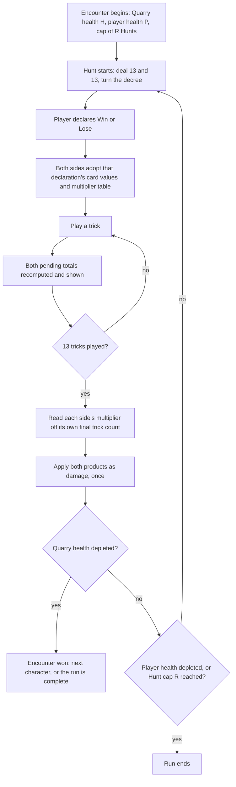

# Plan: Rewrite hybrid-design.md to the duel direction — both sides deal damage, health replaces the Demand

Plan folder: `.claude/contract/DLR-64-rewrite-hybrid-design-to-duel-direction/`
Execution status: see `tasks.md` in this folder. **`tasks.md` does not exist yet** — this plan has not
reached the Step 1.5 approval gate in its current form.

---

## Part 1 — Alignment

### Task reference

**Jira:** DLR-64 — *Rewrite hybrid-design.md to the duel direction: both sides score, health replaces the Demand*. Type Task, priority Highest, label `design`, status moved `To Do → Planning` by this command on 2026-08-11.

**Problem statement, from the ticket.** The live design document `.docs/design/Balatro-Forbidden-Solitaire/hybrid-design.md` describes a game that is no longer the one being built. In it the Quarry has no score, no health and no failure state; a Hunt is checked once against a rising Demand; and clearing the fifth Demand wins the run. The direction agreed on 2026-08-11 changes all three: **both sides deal damage using the same equation, both have health, and a Hunt's output is damage.** Until that is written down, nothing downstream can be planned — DLR-46's nine unstarted children were scoped against the old win condition, and the new epic cannot be decomposed against a design that only exists in conversation.

A second, pre-existing gap closes in the same pass: **the Win/Lose declaration is not in `hybrid-design.md` at all.** It was designed and built on DLR-63, after this document was written, so `the-hunt.md §3` and the implementation docs describe it but nothing records why it exists.

**Acceptance criteria, verbatim:**

1. A new opening section states the direction in one page: both sides score `Spoils × Standing`, both hold health, a Hunt's score is damage, and damage is applied once at the end of the Hunt. Every later section is readable against it.
2. Section 8's line "the Quarry does not score" is reversed, and the reversal carries the reason the original position was taken and what it cost — the document's existing house style of naming a fork and burying the discarded branch in a line. The old reasoning is converted, not deleted.
3. Section 5 replaces the rising Demand with Quarry health plus a cap on Hunts per encounter, and states why the cap exists: it is the dial that prices the fast-costly lane against the slow-safe one.
4. Section 6 is rewritten. It currently opens "this is the design's weakest claim" and proves the Humble lane is dominated. Both change: with the Quarry scoring, a player at 0 to 3 tricks pushes the Quarry into Greedy and takes zero damage, so Humble becomes the zero-damage lane. Pending damage supplies a second catch-up route, since no round is decided until the final trick.
5. Section 7's recorded gap "a run has no defeated opponent" is marked resolved, and the run shape is stated as four characters plus a boss — five encounters, the no-repeat length — with the encounter order randomised.
6. The boss's escalation is specified as an attack on the deck. Section 5 lists five inputs the base game exposes and works examples for four; deck contents is the unattacked fifth, and it is the only escalation that tests what a run's Forage actually built.
7. The Win/Lose declaration is documented, with the Lose path stated in its new form: cards the Quarry captures count as the player's Spoils at inverted value. The three-credit mechanic and its four guards are recorded as replaced, with the arithmetic that motivated it (six cards against eighteen).
8. Section 9 gains a row per newly undecided value — Quarry health, player health, Hunts per encounter — each with the measurement that would settle it, and no value chosen in the document.
9. Section 11's smallest testable slice is rescoped to the new first question: the Quarry scoring with both pending totals on screen, compared at the end of one Hunt.
10. Section 12's critique is re-run. Problem 1 (Standing as a dominant strategy) and Problem 3 (Quarry repeats) close with the reason; Problem 2 (a run dead before the player can tell) is restated, since health makes the decline visible but a multi-Hunt encounter makes it longer.
11. Two rejected ideas are recorded with their reasons so they are not re-proposed: the per-trick combo bonus, and a shop with money and permanent cross-run power upgrades.
12. `npm run format:check` passes — the document is prose, but the repository formats Markdown.

**Follow-up decisions confirmed interactively, 2026-08-11 (first pass):**

- **Section numbering is preserved.** AC 1's new opening section lands as an **un-numbered** section between the "Read alongside" block and `## 1. The equation`. `§1`–`§12` keep their current numbers. Confirmed at the Step 1.5 gate against the alternative of numbering it `§1` and renumbering the rest, which would silently invalidate 148 `§N` citations across eight live files.
- **Skills: `game-designer` and `implementation-doc-writer`**, both confirmed at the Step 1.5 gate. `implementation-doc-writer` is a developer addition to the planner's proposal — see Assumptions for how its scope is read against the ticket's own out-of-scope list.

#### Decisions taken in the design session, 2026-08-11 (second pass) — the scoring model

The direction was worked through interactively after the first plan draft. **Six things are now decided
by the developer and are inputs to the rewrite, not open questions in it.** They supersede parts of the
acceptance criteria above, which are quoted verbatim and therefore still carry the earlier reading —
see the AC-drift table that follows.

**1. `Spoils` as a named term is retired.** There is no score and no comparator. Each side sums the
value of the cards its declaration points it at, multiplies by the band its final trick count landed
in, and that product is **damage** to the other side's health.

**2. Card value is the printed rank, and the Lose path inverts it.**

| Declaration | A card of rank `r` is worth |
| ----------- | -------------------------- |
| Win         | `r` — so 1 through 11      |
| Lose        | `12 − r` — so 11 down to 1 |

This **closes §9's card-value fork at printed rank.** The flat-value-1 branch is retired: the Lose
path's inversion has no meaning under a flat value, so the direction decides the fork rather than
leaving it open. §9's row becomes Decided with the reason, and every figure in the document computed
at flat value 1 is void rather than needing a regime label.

**3. Two multiplier tables, one per declaration.** The values are the developer's, given verbatim:

| Final trick count | **Win** path | **Lose** path |
| ----------------- | ------------ | ------------- |
| 0–3               | ×1           | ×0.5          |
| 4                 | ×2           | ×5            |
| 5                 | ×3           | ×5            |
| 6                 | ×4           | ×5            |
| 7                 | ×5           | ×4            |
| 8                 | ×5           | ×3            |
| 9                 | ×5           | ×2            |
| 10–13             | ×0.5         | ×1            |

**These two tables are exact complements**: the Lose value at `k` equals the Win value at `13 − k`, at
every one of the fourteen trick splits, with no exceptions. That property is load-bearing for
everything below and the rewrite must state it as a property rather than leave it to be noticed. Note
that the **band boundaries are still the base game's** — `{0–3} {4} {5} {6} {7–9} {10–13}` — with the
Lose path reading that same boundary set in mirror, so §8's "bands preserved verbatim" claim survives
in a modified form.

**4. On the Lose path you are paid for the cards the Quarry captured**, at inverted value — the
developer's phrasing was *"the cards the CPU wins are basically won by the player."* This replaces the
three-Lose-credit mechanic and its four guards outright.

**5. The Quarry is on the same path as the player.** It follows the player's declaration; it never
declares for itself. **This is a rule with a reason and the reason must be written down**, because a
later reader will see a missing symmetry and try to "fix" it: a Quarry that declared for itself would
pick the path suiting its own hand, its hand is the complement of the player's, so the two sides would
land on opposite paths — and on opposite paths the two mirrored tables and the two mirrored value
schemes cancel exactly, netting zero damage in every split at average card values. Free declaration
for both sides deletes the game.

**6. Damage is applied once, at the end of the thirteenth trick.** Unchanged from the first pass, and
still forced rather than chosen: the multiplier is read off the *final* trick count, so it is
undetermined until the last trick.

##### The resulting arithmetic — the enumeration the rewrite carries

All fourteen splits, at **printed rank, average rank 6** (so a trick's two cards are worth ~12). Both
sides on the same table, per decision 5.

| Player `k` | Quarry `k` | **Win declared:** player deals / Quarry deals / net | **Lose declared:** player deals / Quarry deals / net |
| ---------- | ---------- | -------------------------------------------------- | ---------------------------------------------------- |
| 0          | 13         | 0 / 78 / **−78**                                    | 78 / 0 / **+78**                                     |
| 1          | 12         | 12 / 72 / −60                                       | 72 / 12 / +60                                        |
| 2          | 11         | 24 / 66 / −42                                       | 66 / 24 / +42                                        |
| 3          | 10         | 36 / 60 / −24                                       | 60 / 36 / +24                                        |
| 4          | 9          | 96 / 540 / **−444**                                 | 540 / 96 / **+444**                                  |
| 5          | 8          | 180 / 480 / −300                                    | 480 / 180 / +300                                     |
| 6          | 7          | 288 / 420 / −132                                    | 420 / 288 / +132                                     |
| 7          | 6          | 420 / 288 / +132                                    | 288 / 420 / −132                                     |
| 8          | 5          | 480 / 180 / +300                                    | 180 / 480 / −300                                     |
| 9          | 4          | 540 / 96 / **+444**                                 | 96 / 540 / **−444**                                  |
| 10         | 3          | 60 / 36 / +24                                       | 36 / 60 / −24                                        |
| 11         | 2          | 66 / 24 / +42                                       | 24 / 66 / −42                                        |
| 12         | 1          | 72 / 12 / +60                                       | 12 / 72 / −60                                        |
| 13         | 0          | 78 / 0 / **+78**                                    | 0 / 78 / **−78**                                     |

Six facts fall out, and each one replaces a claim the document currently makes:

- **The net is perfectly antisymmetric** — `Net(k) = −Net(13 − k)` — and the Lose column is the exact
  negative of the Win column. Neither side holds a structural edge, and **no split in this table comes
  out even**. State that as a property of the tables *at average card values*, which is what it is:
  antisymmetry alone does not forbid a zero (it permits a zero *pair*, at `k` and `13 − k`
  together), and the odd round length only rules out a single self-paired split. **A real deal can
  tie**, because actual pile sums diverge from the mean — so the document should say "the tables give
  every split a winner at average values" and record the tie as reachable in play, not claim every
  Hunt has a winner.
- **The ceiling is 540 per side per Hunt** at average card values, at `k = 9` on Win and `k = 4` on
  Lose; **765 in a best-case pile** (the eighteen fattest cards, `Σ = 153`, at ×5). The maximum net
  swing is **±444**. Every figure keyed to the old 108 or to a `×6` multiplier is void.
- **A Hunt puts between 78 and 708 damage on the table**, both bars combined — 708 at the 6/7
  boundary, and **78 to 96 across the extremes** (`k = 0` → 78, `k = 1` → 84, `k = 2` → 90, `k = 3` →
  96, mirrored at 10–13). So the stall ratio the cap exists to bound is **7.4× to 9.1×**, not a flat
  20×. This is the figure health totals must be scaled against, and it is not derivable from the
  one-sided numbers the document currently carries.
- **The curve is no longer bimodal.** The Win path has one peak at 7–9 and the Lose path one peak at
  4–6. There are no two bands sharing a top multiplier, so the whole Humble-dominance problem is
  **dissolved by construction** rather than argued away — §6's superset proof becomes a historical
  note, not a live finding.
- **Overreaching in your declared direction is nearly harmless; there is one disaster and one slow
  leak.** Overreach costs almost nothing (declare Win and sweep all 13 → still +78; declare Lose and
  take none → +78). The **disaster** is being pushed across the line you declared against into the
  opponent's peak band — declare Win, land on 4, and the swing is 444 against you, which at 1,350 health
  is a loss on Hunt 3. The **slow leak** is undershooting all the way past the opponent's peak into
  their tail: declare Win and land on 0–3 and you are only −24 a Hunt, but it is still a loss, taking
  18–23 Hunts to arrive. So "the extremes are harmless" is true of the extreme you aimed at and false of
  the one you did not — state both, because a document claiming both extremes are safe would be wrong in
  the direction that costs a player a 195-trick session. Either way the Quarry's round-long rule-break
  gains a single precise job for the first time: *push the player across the 6/7 line*.
- **The two declarations ask for adjacent middle bands** — Win wants 7–9, Lose wants 4–6 — so the
  declaration is a pre-commitment to which side of the 6/7 line you will land on, made with your hand
  visible and the Quarry's character on screen.

##### The finding the session produced that the ticket does not cover

**The declaration is a free option and it is the design's largest open balance question.** Card
strength is an asset on the Win path and a liability on the Lose path, and the player chooses which
regime applies *after seeing their hand*. The Quarry cannot choose (decision 5), so a correct read
leaves it fighting its own cards: a strong hand on the Lose path is dragged up to 8–9 tricks, where the
Lose table pays it ×3 or ×2 instead of the ×5 it needs, and follow-suit is what prevents it from
dumping tricks to escape. Worked: player on a weak hand declares Lose and lands on 5 tricks — deals
480, takes 180, **+300 for holding the worse hand.**

Two things keep it honest and both belong in the document:

- **The option is only worth what the read is worth.** What makes a hand good at Win (high cards,
  trump length) is not the opposite of what makes it good at Lose (low cards, short suits). A hand of
  middling ranks is bad at both — it cannot steer to either band — and that is most hands. The
  interesting case is the common one: commit before trick one without knowing which side of 6/7 you
  will land on.
- **The character roster is already the counterweight**, and nothing in the document notices it. The
  **Monarch** forces the player to play their Swan or their highest card of a led suit, which *forces
  trick wins* — it is an anti-Lose tool that shoves the player past 6. The **Swan** forces the lowest
  card when void, so the player cannot trump in and sheds tricks — an anti-Win tool that drags them
  below 7. Two of five characters already punish one declaration each, at zero new rules. That leaves
  a real gap to record: **which declaration do the Woodcutter, the Fox and the Witch punish?** If the
  answer is "neither," that is a design hole worth stating rather than a detail.

**Two cheap levers are named and neither is chosen**, both reusing existing pieces: declaring **before
the decree is turned** (trump is the biggest single factor in whether a trick count can be steered, so
this cuts read quality at zero rules — a sequencing change to a built step), and sorting the character
roster so each one punishes a declaration.

##### AC drift — where the verbatim criteria now say the wrong thing

The ACs are quoted verbatim above and are not edited here. This table is the plan's reading of each,
and **it is the developer's to confirm or overturn at the gate.** Where an AC's stated *reasoning* is
void, the plan follows the decisions above and flags it; the ticket text should be updated in Jira to
match whatever is confirmed.

| AC | What it says | Status under the agreed model |
| --- | --- | --- |
| 1 | "both sides score `Spoils × Standing`" | **Reworded.** No score, no `Spoils`. Both sides deal damage from card value × band. The opening section states the two tables, the two value schemes, and the same-path rule. |
| 2 | Reverse "the Quarry does not score" | **Holds.** Also now covers §8's *"the 21-point match: dropped… a symmetric contest no longer exists"* — that reason is void, the contest is back, and a race to deplete two bars is match-to-21 with the sign flipped. |
| 3 | The cap "prices the fast-costly lane against the slow-safe one" | **Reasoning void** — that framing was the Humble-vs-Victorious one and those lanes no longer exist. The cap's real job under these tables is **bounding the low-stakes extremes**: a Hunt landing at 0–3 or 10–13 puts 78–96 damage on the table against 708 at the 6/7 boundary, so an encounter spent there progresses **7.4× to 9.1×** slower in both directions. That is the stall the cap prevents, and it is what the document should say. |
| 4 | Humble becomes "the zero-damage lane" via the Quarry's Greedy ×0 | **Void.** There is no Greedy ×0 and no zero-damage band: 0–3 pays ×1 on Win and ×0.5 on Lose, and the opposite side pays ×0.5 or ×1 there, so both extremes deal 36–96 per side. §6 is rewritten around the real structure — one failure mode (crossing your declared line), extremes nearly harmless, and the free-option finding above as its new top problem. |
| 5 | Run shape: four characters plus a boss, order randomised | **Holds unchanged.** |
| 6 | The boss attacks deck contents | **Holds**, with one candidate to weigh beside it: the character that best punishes a *correct* declaration read is also a natural boss. Both are design readings; the choice is the developer's. |
| 7 | Lose path = the Quarry's captures at inverted value; the credit cap retired | **Holds**, but its motivating arithmetic changes. "Six cards against eighteen" was computed against a fixed Demand of 220 and a ×6 table. Restate from the enumeration above. |
| 8 | Three new §9 rows | **Expanded to six** — see Data shapes. Also: two rows *leave* §9 as Decided (card value, the multipliers) and one is deleted outright (the Demand curve). |
| 9 | Slice = the Quarry scoring, both pending totals on screen | **Holds, and narrows to a named deliverable**: one fight against the Monarch Quarry, two health bars, repeated Hunts until one empties. Its first question is whether the **declaration** is a live read. See the third-pass decisions for what is in and out. |
| 10 | Problem 1 and 3 close; Problem 2 restated | **Holds, different reasons.** Problem 1 closes because the two tables remove any single dominant band, not because the Quarry scores. Problem 2 stays live. A new problem is ranked first: the declaration free option. |
| 11 | Record the combo bonus and the shop as rejected | **Holds unchanged.** |
| 12 | Formatting | **Holds unchanged** — see Risks for how it is narrowed. |

#### Decisions taken in the design session, 2026-08-11 (third pass) — the deliverable narrows to one fight

The developer narrowed what gets built to **one encounter against one Quarry character, both sides
holding a health bar, played until a bar empties** — no run, no Forage, no escalation, no second
character. The stated purpose is *"to see how that feels."* Six further rules settled, and two things
deliberately deferred.

**1. One encounter, so health persistence across a run is moot.** Two bars, one fight. §9's "ratio"
framing collapses to two numbers for a single encounter.

**2. The Treasure (7) and Poison (8) modifiers are removed.** Rank 7 keeps its identity as a named card
but has no effect for now; rank 8's `−1` goes. **The consequence is a simplification worth stating
outright in §1: the additive term is now exactly the printed ranks of the cards on your side, with no
modifier of any kind.** The arithmetic supports the call — at ×5 a ±1 card modifier moves a Hunt by 5
damage out of 540, under 1%, so both rules were paying rules budget for a rounding error.

**3. Overkill is wasted, and deliberately unresolved.** Damage past a depleted bar does nothing for
now; the developer's note is that it may later pay out as cash or similar. Recorded as deferred, not as
designed.

**4. A draw goes to the Quarry.** If both bars empty on the same Hunt, the player loses. This completes
§5's end-of-encounter condition, which previously had a reachable gap.

**5. The declaration is made pre-Hunt, after the player is dealt their cards** — as currently built.
§9's open row on timing closes, and the "declare before the decree is turned" lever is recorded as a
discarded branch with its reason rather than left as an option. *(One residual ambiguity: the decree is
turned during setup, so "after the cards are dealt" sits either side of the decree turn. Read here as
**as built** — the decree is visible when you declare. Say if you meant before it.)*

**6. The band names stand.** §10 records the Lose-path mismatch as known and does not rename.

##### What the one-fight slice needs, and what it does not

**In:** the deal; the **Monarch** Quarry, the only built character; **a Quarry that plays for band
position rather than for tricks** (see below — confirmed in scope, 2026-08-11); the declaration after
the deal; both multiplier tables; card value = printed rank with no modifiers; damage applied once at
the thirteenth trick in both directions; pending damage shown on both bars; repeated Hunts until a bar
empties; a draw going to the Quarry.

**Out:** Forage, the run, escalation, the other four characters, overkill — and **the Hunt cap.**

**The CPU must play for band position, and the built one does not.** The shipped CPU favours winning a
trick cheaply over winning it expensively — it maximises tricks. Under these tables that is close to
the worst available policy for it, on either declaration:

| Player declares | A trick-maximising Quarry lands near | Its multiplier | It deals |
| --------------- | ------------------------------------ | -------------- | -------- |
| Win             | its own `k = 10–13`                   | ×0.5           | ~36–78   |
| Lose            | its own `k = 10–13`, so the player's pile is thin too | ×1 | ~24–72 |

Against a competent player's 420–540 that is a 6:1 fight the Quarry loses without contesting anything,
and it makes the slice unable to answer its own question: a Quarry that never plays toward a band never
threatens the 6/7 line the declaration commits you to, so *"is the declaration a live read"* would be
measured against an opponent that cannot make it a hard one. `ideas.md` flagged this in *The Quarry
deals damage too* — *"a CPU that knows when to dump a trick is a materially harder opponent to build
than the one that slice assumed"* — and the cost is real: it is the slice's largest engineering item and
the document should say so rather than list the Monarch as though the existing CPU were sufficient.
**Confirmed in scope for the slice by the developer at the 2026-08-11 gate**, against the cheaper
alternative of shipping on the built CPU and recording the question as unanswerable, which was rejected
because the first playtest would then measure health tuning instead of the declaration.

**The cap is out for a reason worth writing into §5.** Both bars drain every Hunt, so a single
encounter self-terminates; the cap is a run-pacing device and there is no run. More usefully, **the
slice is what tells you whether a cap is needed at all**: if the fight stalls because Hunts keep landing
at the extremes — 78–96 damage on the table against 708 at the 6/7 boundary, a 7.4× to 9.1× slowdown —
that observation is the evidence that a cap is required, and it costs nothing to collect. The cap moves
from a value to be chosen into a question the slice answers.

**Three numbers were needed to ship it, and two are now decided.** `H = P = 1,350` (developer, 2026-08-11).
**One number is left: the ×0.5 rounding rule** — and the next paragraph shows it can be dissolved rather
than decided. Everything else is settled or outside the slice, with the one exception that the
band-position CPU above is an engineering item rather than a number.

**What 1,350 does, stated because both properties are consequences rather than preferences.** First,
**equal bars put the win/lose boundary exactly on the 6/7 line** the declaration commits to: 7 tricks a
Hunt wins on Hunt 4 with 486 of 1,350 left, and 6 tricks loses on Hunt 4. That is the design's single
failure mode made into the encounter's own decision boundary, and it follows from `P = H` rather than
from the number — worth writing into §5 as a property. Second, **1,350 puts the fast lane at 3–4 Hunts**:
`1,350 / 540 = 2.5`, so 8 or 9 tricks a Hunt kills the bar on Hunt 3 and 7 tricks on Hunt 4. That is why
it was chosen over a smaller bar — the slice exists *"to see how that feels"*, and the declaration has to
be made three or four times to read as a repeated decision rather than a pair. `ideas.md`'s fight-length
entry illustrates at 1,620 for the same reason ("three perfect Hunts' worth"); 1,350 sits in the same
band with a shorter tail — 18–23 Hunts rather than 21–27.

**The remaining number can be dissolved rather than decided.** Doubling every entry in both tables
removes the fraction entirely, at zero design cost and with identical ratios:

| Final trick count | Win, as stated | Win, doubled | Lose, as stated | Lose, doubled |
| ----------------- | -------------- | ------------ | --------------- | ------------- |
| 0–3               | ×1             | ×2           | ×0.5            | ×1            |
| 4                 | ×2             | ×4           | ×5              | ×10           |
| 5                 | ×3             | ×6           | ×5              | ×10           |
| 6                 | ×4             | ×8           | ×5              | ×10           |
| 7                 | ×5             | ×10          | ×4              | ×8            |
| 8                 | ×5             | ×10          | ×3              | ×6            |
| 9                 | ×5             | ×10          | ×2              | ×4            |
| 10–13             | ×0.5           | ×1           | ×1              | ×2            |

Every multiplier becomes an integer, no card sum can ever produce half-point damage, the exact
complementarity is preserved, and health totals simply double (the ceiling reads 1,080 rather than 540).
**This is a presentation of the same table, not a change to it**, so it is offered rather than taken —
but it turns one of the three blocking numbers into a non-question. The developer's call at the gate.

##### The Lose path's two sides — confirmed

**On the Lose path the capture piles swap both ways: the player counts the Quarry's pile, the Quarry
counts the player's, both at inverted value.** Confirmed by the developer, 2026-08-11, as the direct
consequence of the same-path rule. This closes the last open input to the enumeration — every figure in
this plan is computed under it, and the slice can ship with the declaration in it.

Two consequences the rewrite states rather than leaving to be noticed:

- **Each pile is counted exactly once, by the other side.** The alternative reading — both sides
  counting the Quarry's pile — pays one pile out twice and inverts the incentive at the edge: a player
  who declares Lose and wins **zero** tricks, executing the plan perfectly, would finish 78 behind
  instead of 78 ahead. Recorded as the discarded branch, per the house style.
- **On the Lose path, every trick you win is material handed to the opponent.** This is what gives
  winning a trick a cost on that path, and it is therefore the reason the Lose table peaks at 4–6 rather
  than at 0–3: taking a trick lowers your own multiplier *and* raises the opponent's damage, so the peak
  sits where those two costs are still worth paying. The table's shape is a consequence of the rule, not
  a tuning choice on top of it — which is exactly the property §1's house style asks a section to
  demonstrate.

### Restated goal

Rewrite the live design document so it argues for the game actually being built: a duel in which the
player declares Win or Lose before the first card, both sides then read the **same** declaration's card
values and multiplier table, each side's product is damage dealt to the other's health, and the whole
of it lands once when the thirteenth trick resolves. The shared deck-and-decree survives untouched as
the one shared object. What changes is that the Demand stops existing, `Spoils` stops being a term,
the transcribed single multiplier table becomes two designed and mirrored ones, and the opponent
acquires a stake in the outcome.

The rewrite must **convert** the document's existing self-criticism rather than overwrite it — but with
one correction to the first plan's framing, because the premise moved differently than that draft
assumed. §8's proof that the mirrored-band tension dies with a non-scoring opponent is *validated* by
the direction and its conclusion flips. §6's proof that the Humble lane is dominated is **retired, not
reversed**: the new tables have no two bands sharing a top multiplier, so the problem is dissolved by
construction and the proof becomes a historical note explaining why the multiplier table stopped being
a transcription. §12's three ranked problems are re-run, and a new one — the declaration free option —
ranks above all three.

Alongside it, close the pre-existing gap that the Win/Lose declaration has no entry in the document
that owns "why this rule?", and state its Lose path in its new uncapped form. Finally, reconcile
`ideas.md`: every entry that becomes design moves to its Promoted section behind a pointer, every entry
whose arithmetic the new tables invalidate is marked superseded rather than promoted, and the findings
from this session are recorded so the repository does not end up with two live accounts of one
direction.

### In scope

- `.docs/design/Balatro-Forbidden-Solitaire/hybrid-design.md` — the rewrite:
  - a new **un-numbered** opening section stating the direction (AC 1): the two value schemes, the two
    mirrored tables, the same-path rule with its reason, health both sides, damage once at trick 13
  - **§1** — the component table's Demand row is **deleted** rather than converted (it was the one
    entry that was not an intervention on a term); its **Treasure and Poison rows are also deleted**,
    and the additive term is restated as the printed ranks alone, with no modifier of any kind; the
    `Spoils` term is retired; a `###` subsection documenting the declaration, both tables, the mirror
    property, and the new Lose path (AC 7); the per-trick combo bonus recorded as a discarded branch
    (AC 11)
  - **§3** — **newly in scope, and it is the largest single change.** The `2k × f(k)` table, the
    `max = 108 at k = 9` derivation, the "naive product 26 × 6 = 156" paragraph, the "the curve is
    bimodal" finding, "What the 108 is contingent on", and "The one dependency, stated" are all void
    and are replaced by the new ceiling (540 typical / 765 best case at `k = 9` Win) and by the
    single-peak-per-path shape. The Cook's-loop argument for Forage survives unchanged. **The Forage
    variance analysis survives but its conclusion reverses** — see the Forage item below.
  - **§5** — the rising Demand replaced by Quarry health plus the cap, with the cap's real
    justification (bounding the low-stakes extremes, 80 against 708); the Quarry's job restated as
    *push the player across the 6/7 line*; the boss's escalation specified as an attack on deck
    contents, the fifth and unattacked base-game input (AC 3, AC 6)
  - **§6** — rewritten: the Humble-dominance proof retired as a historical note, the one real failure
    mode stated (crossing your declared line), the extremes recorded as nearly harmless, and the
    declaration free option installed as the section's live problem with its two named mitigations
    (AC 4, as re-read)
  - **§7** — the "a run has no defeated opponent" gap marked resolved; run shape stated as four
    characters plus a boss over five encounters with the order randomised; the banked-progress open
    item resolved against *power* and left open for *options* (AC 5, AC 11)
  - **§8** — "the Quarry does not score" reversed with its original reasoning converted; the 21-point
    match row's void reason corrected to restored-in-a-new-form; the fourteen-row trick-curve table
    rebuilt against the two tables, with its conclusion restated — the mirror is now **graded** rather
    than binary, so no split simply zeroes one side (AC 2)
  - **§9** — the multiplier row and the card-value row move to **Decided** with their reasons; the
    Demand row is deleted; six new rows for what is genuinely open (Data shapes) with **no value
    chosen** (AC 8)
  - **§10** — `Spoils` and `the Demand` removed; rows added for the terms the direction introduces,
    marked first-pass and the developer's to red-line. The band **names** need attention: Humble /
    Defeated / Victorious / Greedy describe the Win path and misdescribe the Lose path, where 4–6 (the
    base game's "Defeated") is the peak.
  - **§11** — the slice rewritten as **one fight against the Monarch Quarry**: two health bars, the
    declaration after the deal, both tables, damage once at trick 13 both ways, pending damage on both
    bars, repeated Hunts until a bar empties, a draw going to the Quarry, and **a Quarry that plays for
    band position rather than for tricks** — named as the slice's largest engineering item, with the
    arithmetic showing why the built trick-maximising CPU makes the slice's own question unanswerable.
    Forage, the run, escalation, the other four characters, overkill and the cap are all stated as out,
    each with its reason — and the cap's reason is that the slice is what decides whether a cap is
    needed (AC 9). The kill criterion is restated against the new question: not "does a CPU opponent
    stay interesting" but **"is the declaration a live read, and does the Monarch make it a hard one."**
  - **§12** — the critique re-run against `design-principles.md §6`: the declaration free option ranked
    first, Problem 1 and Problem 3 closed with reasons, Problem 2 restated, and the middling-hand
    question recorded as a feel question (AC 10)
- `.docs/design/Balatro-Forbidden-Solitaire/ideas.md` — the reconciliation, per Data shapes: entries
  that became design move to **Promoted**; entries whose arithmetic the new tables invalidate move to
  **Superseded-in-place** with a pointer rather than being promoted; the shop entry moves to
  **Rejected**; new entries record this session's findings
- Formatting: `npx prettier --write` then `--check` on those two files (AC 12, as narrowed)

### Explicitly out of scope

- `.docs/game_rules/the-hunt.md` — it documents the rules as they currently stand and **none of this
  is built**. It updates when the code does, not before. Note that the drift is now larger than it was:
  the ruleset's Standing table, its `cardBaseValue` fork, its Demand of 220, and its three-credit Lose
  path are all superseded by this direction. That is expected and correct — the ruleset is not a
  roadmap.
- All code under `src/`. This ticket ships no behaviour change.
- `.docs/implementation/` — it records what the code does, and the code has not moved.
- **§2 and §4 of `hybrid-design.md`.** §2's shared-object and toll-booth argument is strengthened by
  the direction and needs no edit. §4's Quarry model survives; the one thing it gains — which
  declaration each character punishes — is recorded in §6 as an open gap rather than answered by
  editing §4.
- **Choosing any tuning value.** The developer chose the health totals (1,350 each) and the declaration's
  timing during the design session, so those are inputs the document records rather than decisions it
  makes. The ×0.5 rounding rule and the Hunt cap are still open and the document routes both to §9. The
  contract chooses nothing.
- Repo-wide Prettier remediation. 21 files unrelated to this contract already fail
  `npm run format:check`; `.claude/workflow/web-project.md` forbids fixing them as a side effect.
- Decomposing the new epic, and closing DLR-46. Both depend on this one.
- The `ideas.md` entries no criterion touches (Forage-as-a-draft, Overkill heals, the parked pattern
  reading of "combo"). They stay where they are.

### Pattern Reference

- **The design session of 2026-08-11**, recorded in this plan's *Decisions taken in the design session*
  section. It is the authority for the two tables, the card-value schemes, the same-path rule, and the
  enumeration. **The rewrite derives its numbers from that section, and that section derives them from
  the tables the developer stated** — nothing is recomputed a second time, and nothing is carried from
  a pre-session source without checking its frame.
- **`.docs/design/Balatro-Forbidden-Solitaire/ideas.md`** — named on the brief as "the substantive
  input to this ticket". It still supplies the *arguments* (why health is not a toll booth, why the run
  is four plus a boss, what a deck attack risks) but **its arithmetic is largely superseded**: its
  net-damage enumeration, its 936-vs-918 Lose-path comparison, its `H/648` and `H/216` lane rates, and
  its ×18→×30 break-evens were all computed at a single ×6-family table, several against a fixed Demand
  of 220. Superseded figures are marked as such, not promoted.
- **`.docs/game_rules/the-hunt.md`** — the current ruleset, for what is actually built. §3 is the
  source for the declaration's built procedure (AC 7) and the Status register for what enforces it.
- **`.docs/design/design-principles.md`** — §6's fourteen-check critique checklist is what AC 10's
  re-run is run against. The frameworks it owns are cited, never restated.
- **`hybrid-design.md` itself is its own style reference.** Its stated house rule: "every genuine fork
  below names the branch this design takes and buries the discarded one in a single line."

### Constraints flagged on the brief

- **Convert the reasoning, do not delete it** — with the one correction stated in the Restated goal:
  §6's proof is *retired* as a historical note because its premise dissolved, while §8's is *validated*
  and its conclusion flips. Both are recorded; neither is silently dropped.
- **Two documents must not disagree.** Hence the `ideas.md` reconciliation is in scope, and hence
  superseded arithmetic is marked rather than left sitting as a live account.
- **No tuning value is chosen in the document.** §9 carries the row and the measurement.
- **`npm run format:check` must pass** — narrowed per Risks.
- **Nothing is built.** No acceptance criterion implies a code change.
- **The same-path rule must be written with its reason.** It looks like a missing symmetry and is not;
  see decision 5.

### Assumptions made

- **The new opening section is un-numbered.** Confirmed at the first Step 1.5 gate. Numbering it `§1`
  would renumber every section and invalidate 148 `§N` citations across eight live files.
- **AC 7's declaration content lands as a `###` subsection inside §1.** §1 owns what the additive term
  sums over, and the declaration changes exactly that — which pile it reads and at what value.
  **Placement is the developer's to red-line.**
- **No longer an assumption:** whether the Quarry counts the player's pile on the Lose path was an
  inference at the second pass and was **confirmed by the developer on 2026-08-11** — the piles swap both
  ways. Kept here as an audit trail rather than a live assumption; see *The Lose path's two sides* above.
  Every figure in the enumeration rests on it.
- **Every arithmetic figure in the rewrite is computed at printed rank, average rank 6**, and says so.
  The flat-value-1 regime is retired by decision 2, so the two-regime hazard the first plan draft
  guarded against no longer exists — figures computed at flat value are simply void and are removed
  rather than relabelled.
- **`implementation-doc-writer` is loaded for its boundary rules, not to edit its documents.** It owns
  `the-hunt.md` and `.docs/implementation/`, both out of scope, so its role is the three-doc split: no
  restated procedure and no function or file names in `hybrid-design.md`, plus the rule-change check
  that confirms `the-hunt.md` correctly stays untouched. **If the developer meant `the-hunt.md` should
  move in this pass, that is a scope change** and contradicts the ticket's own out-of-scope reasoning.
- **The band names are flagged, not fixed.** Humble / Defeated / Victorious / Greedy are the base
  game's names for the base game's *values*. Under two tables they misdescribe the Lose path. §10
  records the problem and marks it the developer's, per that section's existing rule that naming is a
  copy judgement.

### Config and persisted-shape audit

This contract touches no configuration key, no persisted shape, no exported constant, and no
`data-testid`. It touches one string-bound surface that behaves exactly like one, and that is what this
audit covers: **`§N` cross-references are text, so a section renumber type-checks and lints cleanly
while silently pointing every citation at the wrong argument.**

1. **Every referrer to `hybrid-design.md` was found by name.** `Grep "hybrid-design"` returns **28
   files**. Twenty are archived or in-flight contract folders and are historical records. The **eight
   live referrers**, with their `§N` citation counts:

   | File | `§N` citations |
   |---|---|
   | `.docs/design/Balatro-Forbidden-Solitaire/balatro-play-notes.md` | 53 |
   | `.docs/design/Balatro-Forbidden-Solitaire/ideas.md` | 52 |
   | `.docs/game_rules/the-hunt.md` | 30 |
   | `.docs/design/design-principles.md` | 10 |
   | `.docs/implementation/war-council/scoring.md` | 3 |
   | `src/warCouncil/types.ts` | 2 |
   | `CLAUDE.md` | 2 |
   | `.docs/implementation/war-council/declaration-and-lose-path.md` | 1 |

   **148 citations total.** Seven of those eight are out of scope, so the response is to make the
   rename unnecessary: **`§1`–`§12` keep their numbers**, and Phase 4 greps the twelve headings to
   prove it. `ideas.md` is the one referrer this contract edits, and its citations are checked in the
   same pass.

2. **Nothing is persisted by this contract.** Two Markdown documents change and no code reads either.

3. **No type change, because no type is touched.** The only "type" analogue is the section-numbering
   scheme, deliberately held constant per check 1.

4. **Consumers of the arithmetic this rewrite invalidates, enumerated — and the count went up.** The
   figures now void are the **108 ceiling**, the **156 naive product**, the whole `×6 / ×1 ×2 ×3 / ×6 /
   ×0` multiplier family, the **×18 Humble break-even**, and every net-damage figure in the 648/936/816
   family. `Grep "108"` across `.docs/**` finds live hits in `hybrid-design.md` (§3, §5, §6, §9) and
   `ideas.md`. `Grep "×18"` / `"918"` / `"648"` finds `hybrid-design.md`, `ideas.md`, and —
   **importantly** — `the-hunt.md`'s Standing table, its Known-tensions block, and
   `.docs/implementation/war-council/scoring.md`. Those three are **out of scope and will be left
   stating superseded numbers.** That is correct (they describe built code and current rules, both of
   which are unchanged) but it must be recorded as a known, deliberate divergence rather than
   discovered later as a defect. Phase 4 records it rather than fixing it.

5. **Names align across the chain, with two live mismatches found and handled differently.**
   `the-hunt.md §7` and `hybrid-design.md §1` state the same single Standing table and agree with each
   other; both are superseded by the two-table model, and only the design doc changes here.
   `the-hunt.md`'s Known-tensions entry *"No card is worth declining, so §6's exit (b) has no
   foothold"* stays true — a Poison 8 is worth 7 on Win and 3 on Lose, still positive — but its
   *significance* drops, because exit (b) existed to break the superset argument and the superset
   argument is retired. §6 records that rather than correcting a sentence that no longer carries
   weight.

6. **No architectural boundary applies.** The pure-core ESLint boundary covers `src/warCouncil/**` and
   `src/hunt/**`; this contract touches neither. Phase 4 proves the working tree holds no `src/`
   change.

---

## Part 2 — Technical design

### Approach

The work is a prose rewrite with an arithmetic spine, and the spine changed shape between the first
plan draft and this one. That draft's central method was *"the rewrite derives its numbers from
`ideas.md` rather than recomputing them, so the two documents cannot disagree."* **That method has been
withdrawn, and the reason it failed is worth recording because it is the contract's main correctness
risk.** Carrying a number protects against two files disagreeing; it does not protect against a number
that was correct about the old question being imported as an answer to a new one. `ideas.md`'s
Lose-path comparison — 936 against 918, "the two paths become competitive" — is arithmetically right
against a fixed Demand of 220 and wrong under two-sided damage, where the comparison is nets. So the
rule for this rewrite is: **every figure is derived from the two tables the developer stated, and any
figure carried from an earlier document has its frame checked before it is reused.** The enumeration in
Part 1 is the single source; nothing is computed twice.

The structural decision that shapes everything else is unchanged: **section numbers are frozen.** The
audit found 148 `§N` citations across eight live files, seven out of scope. So AC 1's opening section is
un-numbered, AC 7's declaration content becomes a `###` inside `§1`, and Phase 4 asserts the twelve
headings are byte-identical in their numbering.

The second decision is **how the reversals are written, and there are now three distinct kinds.** The
first draft treated all of them as "the proof is still valid, the premise moved." That is true of one
of them and not the others:

- **§8 is validated and flipped.** Its fourteen-row enumeration proves the mirrored-band tension is a
  property of a symmetric contest. The arithmetic is untouched; the contest is back; the conclusion
  goes from "half the table is read by nobody" to "the tug is restored." Written exactly as the first
  draft planned.
- **§6 is retired, not reversed.** Its superset proof — a nine-trick pile contains a three-trick pile,
  so the band sharing a top multiplier is dominated — depended on two bands *sharing* a top
  multiplier. The two new tables have one peak each. So the proof does not flip and it is not wrong;
  its subject stopped existing. It is kept as the historical note that explains why the multiplier
  table stopped being a transcription and became designed, which is the most useful thing it can now
  do.
- **§3 is void and replaced.** Its ceiling derivation, its bimodality finding, and its flat-value
  dependency are all consequences of a rule the direction decided the other way. There is no
  conversion available; the arguments are removed and the new ceiling derived from the new tables.

Three shapes follow from the direction and are stated in the rewrite because the arithmetic forces
them. **Damage lands once at trick 13**, because the multiplier is read off the final count — which is
what makes a visible pending total free rather than a new mechanic. **The cap bounds the low-stakes
extremes**, not the difference between a fast lane and a slow one: a Hunt at the 6/7 boundary puts 708
damage on the table and one at an extreme puts 78–96, so an encounter spent at the extremes moves either
bar 7.4× to 9.1× more slowly, and that stall is the thing a cap exists to end. **And the same-path rule is
load-bearing rather than incidental** — the two tables' exact complementarity means opposite paths
cancel to zero net in all fourteen splits, so a Quarry that declared for itself would delete the game.
All of health, the cap, and the rounding rule are values, so all go to §9 and none is chosen here.

Finally, `implementation-doc-writer`'s three-doc boundary is an active constraint on what may be
written. No procedure is restated (that is `the-hunt.md`'s job) and no function or file name appears in
the argument. AC 7 is where this bites hardest, because the declaration is *built* — so the temptation
is to describe how it works. The document's job is to record why it exists, why the credit cap was
chosen, and the arithmetic that now retires it.

### Skills to invoke during execution

- **`game-designer`** — owns `.docs/design/`, and this contract's entire diff lives there. It supplies
  the critique method AC 10 re-runs (`design-principles.md §6`'s fourteen checks, ranked by severity ×
  likelihood, every finding carrying evidence and a falsifier), the rule that every framework and
  precedent is unpacked in plain language on first use, and the standing prohibition on choosing a
  tuning value — which is what keeps §9's rows honest. Its Method §1 (*enumerate before you reason*) is
  why this plan carries a fourteen-row table rather than a claim about a band, and Method §2 is why the
  free-option finding is stated with a worked hand rather than as a concern.
- **`implementation-doc-writer`** — *developer addition at the Step 1.5 gate.* It owns the three-document
  split, so it governs the boundary this rewrite must respect: `hybrid-design.md` carries argument and
  cites `the-hunt.md` for procedure, never the reverse, and its prose names no function or file. It
  also supplies the rule-change check Phase 4 records — the ticket ships no code, so no rule changed,
  and that outcome is stated rather than left as a silent absence.
- **`react-frontend`** — deliberately **not** loaded. No file under `src/` is in any task's file list.

Also read before executing: **`.claude/workflow/web-project.md`** — it owns the runner table, and the
rule that `npm run format:check` currently fails on pre-existing `.docs/**` files, so a contract gates
on `npx prettier --check` scoped to the files it changed.

`.claude/rules/` was scanned (Glob `.claude/rules/*.md`) and contains only its `README.md` — no rule
file applies.

### Diagram

One encounter under the **full** model — not the slice. It carries the cap `R` and the run, both of
which the third-pass decisions put outside the first fight: in the slice, node `A` has no `R`, node `L`
tests player health alone, and `K` and `M` both end the fight rather than advancing or ending a run. The
full model is drawn because it is what §5 and §7 document; the slice is the subset §11 scopes.

It shows where the declaration sits, why damage lands only at trick 13, and the three ways an encounter
ends.

Node `D` is the rule a later reader will try to remove — see decision 5 for why it cannot be. The loop
from `L` back to `B` is what the cap bounds, and what it is bounding is the case where every Hunt lands
at an extreme and neither bar moves.

### Data shapes

No TypeScript, no configuration key, and no persisted shape changes. The structural contract is the
document's own shape, stated here because Phase 4 asserts it.

#### `hybrid-design.md` — heading inventory after the rewrite

| Heading | Level | Status after this contract |
|---|---|---|
| `# The Hunt: a Balatro × Forbidden Solitaire treatment of The Fox in the Forest` | `#` | unchanged |
| *(the "Read alongside" block)* | prose | unchanged |
| `## The direction: both sides deal damage, both hold health` | `##`, **un-numbered** | **new** (AC 1) |
| `## 1. The equation` | `##` | modified — component table, `Spoils` retired, plus one new `###` |
| `### The declaration, the two tables, and what each side is paid for` | `###` | **new** (AC 7) |
| `## 2. The shared object` | `##` | unchanged |
| `## 3. What the run rewrites` | `##` | **rewritten** — ceiling, curve shape, and the Forage conclusion |
| `## 4. The Quarry` | `##` | unchanged |
| `## 5. Escalation` | `##` | rewritten (AC 3, AC 6) |
| `## 6. Catch-up` | `##` | rewritten (AC 4, as re-read) |
| `## 7. Run length and depth budget` | `##` | modified (AC 5, AC 11) |
| `## 8. The ruleset: kept, modified, dropped` | `##` | modified (AC 2) |
| `## 9. First-pass values` | `##` | modified — two rows to Decided, one deleted, six new |
| `## 10. Vocabulary` | `##` | modified — two rows removed, new rows, band names flagged |
| `## 11. Smallest testable slice` | `##` | rewritten (AC 9) |
| `## 12. Critique` | `##` | rewritten (AC 10) |

**The invariant:** the twelve numbered `##` headings keep their numbers and their titles. Any heading
added inside a numbered section is a `###` or deeper. Phase 4 asserts both.

#### `hybrid-design.md` — §3's replaced figures

| Claim in §3 today | Replaced by |
|---|---|
| `Spoils = 2k` at plain card value | Card value is printed rank (decision 2); a trick's two cards are worth ~12 at average rank 6 |
| The `2k × f(k)` fourteen-column table | The two-table enumeration in Part 1 |
| `max(2k × f(k)) = 18 × 6 = 108, at k = 9` | **540 per side per Hunt** at average values, **765** best case, at `k = 9` on Win and `k = 4` on Lose |
| "The naive product `26 × 6 = 156` is not reachable" | Void — removed, not corrected |
| "The curve is bimodal" — two peaks at `k=3` and `k=9` | **One peak per path**: 7–9 on Win, 4–6 on Lose |
| "a Demand that rises past 108 cannot be met by winning more tricks" | Void — there is no Demand. The equivalent force is that a bigger health bar cannot be met by winning more tricks, because 7–9 is the Win ceiling and 10+ collapses to ×0.5 |
| "The one dependency, stated" — flat value vs printed rank | Resolved at printed rank (decision 2); recorded as decided with its reason |
| "Standing is a gate, not a term you can build" | **Survives unchanged** |
| The Cook's-loop argument for Forage as the outer verb | **Survives unchanged** |
| "a value edit in the Quarry's hand is not a loss — arguably the best case" | **Reversed.** Under two-sided damage a card is worth its value to whoever's pile it lands in, so a Foraged card in the Quarry's pile is damage aimed at the player. And because any captured card can end up on either side, **no value edit is safe** — every one becomes a bet on capture rather than a raise to your own ceiling. The 39 / 39 / 21 percentages survive; the conclusion drawn from them does not. |
| *(new, unasked)* | **How a Forage value edit interacts with the Lose path's inversion is unspecified.** If a card is edited to value 20, is its inverted value `12 − 20`? Or does inversion read printed rank regardless of edits? The two readings differ enormously and neither is decided. Routed to §9. |

#### `hybrid-design.md` — vocabulary changes to §10

Removed: **Spoils**, **the Demand**. Added, each first-pass and the developer's to red-line:

| Term | Is |
|---|---|
| **health** | the total each side's damage depletes; the Demand with memory |
| **damage** | a side's card value × its multiplier for the Hunt, applied to the other side once at the end |
| **pending damage** | the damage a Hunt has accumulated so far, shown but not yet applied |
| **the declaration** | the player's pre-first-trick choice of Win or Lose, which sets the card values and the multiplier table **for both sides** |
| **the line** | the 6/7 trick boundary the declaration commits you to a side of |
| **the cap** | the maximum number of Hunts one encounter may run |
| **the boss** | the fifth and final encounter, whose escalation attacks deck contents |

**Flagged, not fixed:** Humble / Defeated / Victorious / Greedy name the base game's *values*. Under two
tables they describe the Win path and misdescribe the Lose path, where 4–6 — the base game's
"Defeated" — is the peak. Whether the bands keep one name set, gain two, or lose their names is a copy
judgement and the developer's.

#### `hybrid-design.md` — §9 after the rewrite

**Two rows leave as Decided, one is deleted, six are new. No new row carries a number.**

| Value | Status | Note or settling measurement |
|---|---|---|
| Card base value | **Decided — printed rank** (2026-08-11) | Closed by the direction: the Lose path's `12 − r` inversion has no meaning at flat value 1. Was this document's highest-leverage open fork. |
| The multipliers | **Decided — two mirrored tables** (2026-08-11) | Values in the opening section. Record that they are now *designed*, not transcribed, and that the exact complementarity is load-bearing per the same-path rule. |
| Demand base and growth rate | **Deleted** | There is no Demand. The row goes rather than becoming Undecided. |
| Quarry health `H` | **Decided — 1,350** (2026-08-11) | Developer's value, chosen so the fast lane is 3–4 Hunts rather than 2 — the declaration has to be made several times for the slice to say anything about it. `ideas.md`'s *Fight length is symmetric about the middle* entry owns the arithmetic and illustrates at 1,620; §9 cites that entry and states the lengths **at 1,350** rather than restating its table. At 1,350 the fast band (4–9 tricks) resolves in **3–4 Hunts** and the tail (0–3, 10–13) in **18–23**. Every structural finding in that entry survives unchanged — the antisymmetry, the bimodality with nothing between, and the slowest line sitting at 10 tricks (23 Hunts) rather than 13 (18). |
| Player health `P` | **Decided — 1,350** (2026-08-11) | Developer's value, equal to `H`. The equality is what puts the win/lose boundary **exactly on the 6/7 line** the declaration commits to: 7 tricks a Hunt wins on Hunt 4 with 486 left, 6 tricks loses on Hunt 4. That is the design's single failure mode made into the encounter's own decision boundary, and it is a consequence of `P = H` rather than of the number — so the property survives any later rescaling of health, which is worth stating in §5 so a future tuning pass does not break it by accident. |
| Rounding of the ×0.5 bands | **Undecided — or dissolved, developer's choice** | ×0.5 produces half-point damage on any odd card sum, so as stated the rule needs a rounding direction. **Doubling every entry in both tables removes the question entirely** — all multipliers become integers, ratios and complementarity are preserved, health totals double, and the ceiling reads 1,080 instead of 540. That is a presentation of the same table, not a change to it. Decide whether it rounds and which way, or double and delete the row. |
| Hunts per encounter — the cap `R` | **Deferred — a session-length guard, and the slice measures whether it is needed** | Worked in full in `ideas.md` → *Fight length is symmetric about the middle, and bimodal*; §5 and §9 cite it rather than restating it. In short: outcomes inside 4–9 tricks resolve fast, everything outside takes an order of magnitude longer, and there is nothing between — the extremes put 78–96 damage on the table against 708 at the 6/7 boundary, a 7.4× to 9.1× slowdown. So session length is a step function of whether the player lands in the middle band, not a dial. **Restated at the decided `H = 1,350`** (that entry illustrates at 1,620): the fast band resolves in **3–4 Hunts** and the tail in **18–23**, up to 299 tricks. The top end (10–13 tricks) is additionally **unloseable**, taking 0–36 a Hunt. That is an unbounded tail rather than a dominant strategy — landing 10+ needs the cards, not the intent — so the cap is insurance on length. If it is needed, its value is derivable: above `H / 540` and well below `H / 78`, biased low — **at 1,350 that is above 2.5 and well under 17.3, so 3 to 5.** |
| A Quarry that plays for band position | **Not a value — an in-scope deliverable** (2026-08-11) | Recorded here so the slice's cost is visible next to its numbers. The built CPU maximises tricks, which lands it in 10–13 on either declaration and has it deal 24–78 against a competent player's 420–540. It is the slice's largest engineering item; without it, *"is the declaration a live read"* is measured against an opponent that cannot make it a hard one. |
| Treasure (7) and Poison (8) modifiers | **Decided — removed** (2026-08-11) | Rank 7 keeps its identity and does nothing for now; rank 8's `−1` goes. At ×5 a ±1 modifier moves a Hunt by 5 out of 540 — under 1% — so both were paying rules budget for a rounding error. The additive term is now the printed ranks alone, with no modifier of any kind. |
| When the declaration is made | **Decided — pre-Hunt, after the deal** (2026-08-11) | As currently built. "Declare before the decree is turned" is recorded as a discarded branch with its reason, per the house style. |
| Simultaneous depletion | **Decided — the player loses** (2026-08-11) | Stated in §5 so the end-of-encounter condition is complete. |
| Overkill past a depleted bar | **Deferred** | Wasted for now; may later pay out as cash or similar. Recorded so the surplus question stays findable rather than looking designed. |
| Forage value edits under inversion | **Deferred — no Forage in the slice** | Whether `12 − r` reads the printed rank or the edited value. The two readings differ by the whole size of an edit; it blocks Forage, not the first fight. |
| What each side counts on the Lose path | **Decided — the piles swap both ways** (2026-08-11) | You count the Quarry's pile, it counts yours, both inverted. Closes the last input to the enumeration; the discarded branch (both sides counting the Quarry's pile) is recorded with its edge-case reason. |

#### `ideas.md` — the reconciliation, entry by entry

| Entry | Currently under | Moves to | Note |
|---|---|---|---|
| Health replaces the Demand | Worth costing | **Promoted** | → `§5` and the opening section. Its `ceil(H / damage per Hunt)` session-length argument survives; its 108/36 figures do not. |
| The Quarry deals damage too | Worth costing | **Promoted** | → the opening section and `§8`. Its argument is validated; its "exactly one side scores ×6" evidence becomes the graded mirror. |
| Pending damage, shown on the health bar | Worth costing | **Promoted** | → the opening section, `§6`, `§11`. Its band-crossing illustration needs recomputing at the new tables. |
| Four characters and a boss | Worth costing | **Promoted** | → `§5`, `§7`. Unaffected by the table change. |
| Poison as the declared Lose path's damage source | Worth costing | **Promoted, arithmetic superseded** | → `§1`'s declaration subsection. The *mechanism* is adopted. Its 918 / 936 / 378 / 216 table and its "the two paths become competitive" conclusion were computed against a Demand of 220 and are void; the entry is marked so nobody reuses them. |
| The full net-damage enumeration, with two-sided damage | Worth costing | **Superseded in place** | Not promoted. Its three findings rest on the single ×6-family table. Finding 1 (Humble rescued) is void — there is no Humble lane. Finding 2 (the valley is near-lethal) is void — 4–6 is the Lose path's *peak*. Finding 3 (there is finally an endgame) **survives in a new form** and is promoted separately as the one-failure-mode finding in `§6`. |
| Money, a shop, and permanent cross-run upgrades | Raw | **Rejected** | → `§3`'s discarded branch, `§7`'s banked-progress item. Note its "Planets, not Jokers" idea — levelling a Standing band — is now closer to reachable, since the multipliers are designed rather than transcribed; recorded, not adopted. |
| The combo bonus | Rejected | stays **Rejected** | Gains a pointer to `§1`'s discarded branch. Its ×18→×30 break-even arithmetic is void and is marked. |
| Superseded reading — poison as incoming damage on player health | as-is | **stays parked, note added** | Player health is now design; its specific mechanism is not. Its blocking finding — uniform poison is arithmetically a no-op — is still live. |
| Forage as a draft · Overkill heals · the pattern reading of "combo" | as-is | **unmoved** | No criterion promotes them. |
| *(new)* The declaration as a free option | — | **new, Worth costing** | The session's largest finding: card strength is an asset on Win and a liability on Lose and the player chooses after seeing their hand. Carries the worked hand, the two mitigations, and the measurement. |
| *(new)* The character roster as declaration counterweight | — | **new, Worth costing** | Monarch = anti-Lose, Swan = anti-Win, three characters unassigned. Zero new rules. |
| *(new)* Declaring before the decree is turned | — | **new, Raw** | A sequencing change to a built step that cuts read quality at zero rules. |
| *(new, already written)* Fight length is symmetric about the middle, and bimodal | — | **written to Worth costing, 2026-08-11 — needs one annotation** | The only entry in this table that already exists on disk, added during the design session because it is about building the fight rather than about the document. It owns the fight-length arithmetic and the cap's derived range; §5 and §9 cite it rather than restating it. **The annotation this contract owes it:** the entry illustrates at `P = H = 1,620` and says outright that 1,620 is *"not a proposed value"* — health has since been **decided at 1,350**, so its counts rescale. The fast band stays **3–4 Hunts** (which is why 1,350 was chosen), the tail shortens from 21–27 to **18–23**, and the derived cap range 4–10 becomes **3–5**. Every structural finding survives unchanged, including that the slowest line is 10 tricks rather than 13; only the counts move. Annotating it is the difference between a parked finding and a file stating a superseded number as though it were current. |

No entry is deleted. That is the file's own stated rule: *"Move entries down rather than deleting them."*

#### No other artefact changes

No `package.json` script, no dependency, no `src/` file, no test file. The only command this contract
runs is Prettier, already a devDependency at `^3.9.6` with its configuration in `.prettierrc.json`.

### Runtime quality notes

- **Purity and adjudication:** the code analogue is the three-document boundary and it is the live
  constraint. `hybrid-design.md` owns *why*; `the-hunt.md` owns *what the rules are*;
  `.docs/implementation/` owns *what the code does*. The rewrite restates no procedure and names no
  function or file. AC 7 is where this is easiest to breach, because the declaration is built and
  describing how it works would duplicate `the-hunt.md §3`. Its entry cites that section and argues
  only the why. Equally, no tunable is chosen in prose: all six live values sit in §9 as rows with
  measurements.
- **Effects, mount and teardown:** not applicable — no code, no effect, no listener, no timer, no
  module state. Recorded rather than skipped so the absence is deliberate.
- **Hot-path cost:** not applicable. The reader-side analogue is that `hybrid-design.md` is already
  1,107 lines and this contract both grows it (a new opening section, a new `###`, six §9 rows) and
  shrinks it (§3's void derivations, §6's retired proof). The mitigation is that the un-numbered
  opening section is explicitly one page and every later section is readable against it. There is no
  line budget on documentation — the project's 400-line rule governs code.
- **Determinism and numeric safety:** this dimension genuinely applies and it is the rewrite's main
  correctness risk, though the risk changed shape. The first plan draft guarded against a document
  mixing two card-value regimes; decision 2 retires one of them, so that hazard is gone and figures
  computed at flat value are simply removed. **What replaces it is frame drift**: `ideas.md` holds a
  full set of figures that are correct against a fixed Demand and wrong against two-sided damage, and
  they are quotable, plausible, and already written down. Every figure in the rewrite is derived from
  Part 1's enumeration; anything resembling an `ideas.md` number is checked against it before it is
  used; and Phase 4 greps for the void figures (`108`, `156`, `918`, `648`, `936`, `816`, `×18`, `×6`,
  `220`) to confirm none survives in `hybrid-design.md` except where explicitly labelled as a retired
  figure.
- **Error paths:** the failure mode for a documentation contract is a citation pointing at the wrong
  argument, and it is silent — nothing lints a `§N`. Phase 4 guards it four ways: assert the twelve
  numbered headings are unchanged; assert `ideas.md`'s Promoted and Superseded pointers resolve to
  sections that exist; assert no out-of-scope file changed; and **record** the deliberate divergence in
  `the-hunt.md` and `.docs/implementation/war-council/scoring.md`, which will continue to state
  superseded numbers because they describe unchanged code. The Prettier check is the only hard gate
  available and is run scoped to the two changed files.

### Risks and judgement calls

- **The three decisions at the top of this section are the developer's, and two of them contradict the
  first plan draft.** That draft assumed §9's card-value fork stayed open and that the multipliers
  stayed Undecided. Both are now closed by the direction. **If either reading is wrong, say so at the
  gate** — the rewrite is built on top of them and they are not recoverable cheaply once §3 and §6 are
  rewritten against them.
- **§3 has come into scope and it is the largest single change in the contract.** The ticket scopes the
  rewrite to "sections 1 and 5 through 12" and puts §1–§4 down as surviving substantially intact. That
  is no longer true of §3: its ceiling, its curve-shape finding, its flat-value dependency, and its
  Forage conclusion are all void or reversed. Leaving it out would leave the document deriving a 108
  ceiling that the same document contradicts four sections later. **This is a scope increase against
  the ticket and needs explicit sign-off.**
- **AC 3, AC 4 and part of AC 1 as written cannot be executed** — see the AC-drift table. Each has a
  stated reading in this plan. The Jira ticket text should be updated to match whatever is confirmed,
  or the plan will be the only record that the criteria were re-read rather than missed.
- **AC 12 as written cannot pass, and the plan narrows it.** `npm run format:check` fails today on
  **23 files**, of which **21 are unrelated** to this contract. `.claude/workflow/web-project.md`
  forbids fixing that as a side effect. The plan gates on `npx prettier --check` over the two files
  this contract changes. **Both of those files fail Prettier today**, so there is real formatting work:
  cosmetic (`*emphasis*` → `_emphasis_`, table-column padding), measured at 74 changed lines in
  `hybrid-design.md` and 167 in `ideas.md`. The `ideas.md` reformat will make its diff noisier than the
  reconciliation alone.
- **One number still gates the first fight**: how ×0.5 rounds on an odd card sum — and doubling both
  tables dissolves it rather than deciding it. Health was set to **1,350 each** on 2026-08-11, and the
  Lose path's two sides were confirmed the same day, so the enumeration rests on settled readings
  throughout.
- **How one-sided the fight feels depends on where in 7–9 the player lands, not on the health number.**
  Incoming damage on the Win path runs 96 at `k = 9`, 180 at `k = 8`, 288 at `k = 7` — ratios of 5.6 : 1,
  2.7 : 1 and **1.46 : 1**. At 1,350 a player reliably landing 9 wins on Hunt 3 with 1,158 of 1,350
  intact; one landing 7 wins on Hunt 4 with **486**, and one landing 6 loses on Hunt 4. So the same bars
  give a rout, a real fight, or a loss depending only on the Monarch's pressure — which is exactly the
  thing being measured. Worth knowing in advance so a lopsided first playtest is read as CPU pressure
  rather than as wrong health.
- **Removing the Treasure and the Poison leaves the deck with no card worth declining, permanently
  rather than incidentally.** Card value is now printed rank with no modifier, so every captured card is
  a gain. That closes §6's exit (b) (Forage setting a value below zero) as having no existing foothold
  at all, and it closes `the-hunt.md`'s Known-tension on the same point. Both are recorded as retired
  with the reason rather than left looking open.
- **The declaration free option is the design's largest unresolved balance question and this contract
  does not resolve it.** It records the finding, the worked hand, the two mitigations, and the
  measurement. Both mitigations are cheap and both are the developer's. If neither is taken, the
  document ships with a top-ranked problem that has a known answer nobody chose — which is honest but
  should be a decision rather than an omission.
- **The `the-hunt.md` divergence is now large and deliberate.** The ruleset states a single ×6-family
  Standing table, a Demand of 220, and a three-credit Lose path — all superseded. It is correct for it
  to stay untouched (it documents built code) but the gap between design and ruleset is much wider
  after this contract than before, and the next implementation ticket inherits all of it.
- **`implementation-doc-writer` was ticked and its two documents are out of scope.** The plan reads
  that as "load it for its boundary rules." If the intent was to update the ruleset in this pass, that
  is a scope change on top of the §3 one.
- **AC 7's placement is the one structural choice the ticket does not dictate.** The declaration lands
  in a `###` under §1 because §1 owns what the additive term reads. A reader might expect it under §8.
  Cross-referenced either way; the primary home is a judgement call.
- **The boss's deck attack: a design reading, not a tuning value, and therefore stated in the
  document.** The plan specifies it as suppressing a subset of the player's Forage edits for that Hunt,
  with removing cards outright buried as the discarded branch. `ideas.md` flags the risk on the whole
  idea: *"A deck attack can read as theft rather than a test."* AC 6 forces the category; the specific
  form is the developer's to red-line — and there is now a second candidate to weigh beside it, the
  character that best punishes a correct declaration read.
- **The band names may need to change and the plan does not change them.** §10 flags that Humble /
  Defeated / Victorious / Greedy misdescribe the Lose path. Renaming them is a copy judgement and it
  would ripple into `the-hunt.md` and the built config's `STANDING_BANDS`, so it is raised rather than
  taken.
- **The middling-hand question is a feel question and cannot be settled here.** Most hands cannot
  steer to either band, so the declaration is often a commitment made without a read. Whether that
  reads as tension or as a coin flip is exactly the kind of judgement `CLAUDE.md` reserves for the
  developer, and §12 records it as such.
- **No behaviour is verifiable by running the app.** This contract ships no code, so there is nothing
  for QA to drive. The developer's review is of the prose: whether the reversals read as conversions
  rather than overwrites, whether the three kinds of reversal are distinguished, and whether one page
  states the direction clearly enough that the next epic can be decomposed against it.
