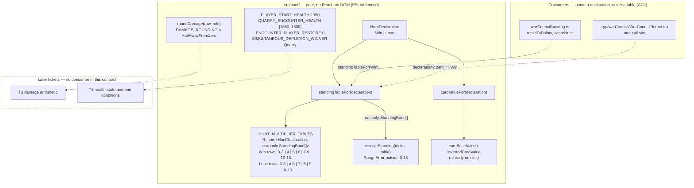

# Plan: Scoring, health and rounding configuration — two mirrored tables as data

Plan folder: `.claude/contract/DLR-66-scoring-health-and-rounding-config/`
Execution status: see `tasks.md` in this folder.

---

## Part 1 — Alignment

### Task reference

[DLR-66](https://amazerbeam.atlassian.net/browse/DLR-66) — _Scoring, health and rounding
configuration: two mirrored tables as data_. Task, priority **Highest**, label `engine`, parent epic
[DLR-65](https://amazerbeam.atlassian.net/browse/DLR-65). Status was already `Planning` when this run
started, so no transition was needed at Step 0.5.

**Acceptance criteria, verbatim from the ticket:**

1. `HUNT_MULTIPLIER_TABLES` exports one `StandingBand[]` per `HuntDeclaration`. The shipped default
   is Win `0–3 ×1, 4 ×2, 5 ×3, 6 ×4, 7–9 ×5, 10–13 ×0.5` and Lose `0–3 ×0.5, 4–6 ×5, 7 ×4, 8 ×3,
   9 ×2, 10–13 ×1`. **Band boundaries are per-table row data, never an `if` branch or a shared
   boundary set** — the two tables' boundaries genuinely differ, which is the whole reason this AC is
   written this way.
2. `resolveStanding` resolves against a caller-supplied table, keeping DLR-48's injectable-table
   pattern, and continues to throw a `RangeError` outside 0–13. A declaration-aware accessor returns
   the right table for a declaration; no consumer outside this module names a table by identifier.
3. A test asserts the **complementarity invariant** `Lose(k) = Win(13 − k)` at all fourteen splits,
   over whatever pair is configured — so a future hand-edit that breaks it fails loudly rather than
   quietly deleting the same-path rule (epic Deliverable 3).
4. A test swaps in the epic's alternative pair — Win `0–3 ×1, 4 ×2, 5 ×3, 6 ×4, 7 ×5, 8 ×5, 9 ×5,
   10–13 ×6`, Lose `0–3 ×6, 4–6 ×5, 7 ×4, 8 ×3, 9 ×2, 10–13 ×1` — and asserts the resolved
   multipliers change accordingly, **with the Lose side's different boundaries**, and that the real
   exports are unaffected. This is the proof the swap is a one-file edit (epic DoD 5).
5. `PLAYER_START_HEALTH` (`1350`), the per-encounter Quarry health sequence (`[1350, 1600]`), and
   `ENCOUNTER_PLAYER_RESTORE` (`0`) are named exports, each with a comment citing its source: §9
   Decided 2026-08-11 for the first, new-to-this-epic for the other two.
6. `cardValueFor(declaration)` returns `cardBaseValue` on Win and `invertedCardValue` on Lose, both
   already on disk, both `(rank: number) => number`. No modifier of any kind is applied — no Treasure
   `+1`, no Poison `−1` (§1).
7. `DAMAGE_ROUNDING` names the rounding rule for the ×0.5 bands and `roundDamage` applies it. The
   default is **half away from zero**; the alternative — doubling both tables and both health totals
   — is expressible by editing this module alone. A test covers an odd card sum under a ×0.5 band in
   both settings.
8. `SIMULTANEOUS_DEPLETION_WINNER` names the §5/§9 ruling (the Quarry) as data rather than a
   hardcoded branch in a later ticket.
9. `STANDING_BANDS` no longer exists as a single-table export, and a grep over `src/` finds no band
   boundary or multiplier as a literal outside this module.
10. `npm run typecheck`, `npm run lint`, `npm run format:check` and the scoped Vitest run pass.

**Scope boundaries, verbatim:** in scope are `src/hunt/config.ts`, `src/hunt/types.ts`,
`src/hunt/index.ts`, `src/hunt/__tests__/config.test.ts`; whatever mechanical edit
`src/warCouncil/scoring.ts` and its callers need to keep compiling against the new `resolveStanding`
shape — signature adaptation only, no behaviour change; and splitting `config.ts` if it passes 400
lines, measured with `(Get-Content <file>).Count`, **not** `Measure-Object -Line`. Out of scope are
damage arithmetic (T3), the pile swap (T4), health state (T5), every UI file; deleting
`FIXED_DEMAND`, `DEMAND_CURVE`, `LOSE_CREDITS_PER_HUNT` or the credit mechanism (T2 owns that); and
any in-app tuning UI.

**Developer instruction added at this run's `/fb-plan` invocation (2026-08-12):** this is the first
ticket of the redesign, so the contract must explicitly carry the `implementation-doc-writer`
requirement — `.docs/implementation/` must be brought up to date at the end of `/fb-apply`. Recorded
as Task 8 in Phase 3. `/fb-apply` Step 6.5 already mandates that invocation on every run with no
exception; the task is belt-and-braces on an existing guarantee, and names the specific docs this
contract staleness-hits so the skill has a starting point rather than a blank sweep.

**Design sources cited, not re-derived:**
`.docs/design/Balatro-Forbidden-Solitaire/hybrid-design.md` — _The direction: both sides deal damage,
both hold health_ (the two tables, both health totals, the complementarity property), §1 and its
`### The declaration, the two tables, and what each side is paid for` subsection (the equation, why
the Lose table peaks at 4–6, the removal of Treasure/Poison modifiers), §5 (the end-of-encounter
conditions and the simultaneous-depletion ruling), §9 (the Decided/Undecided/Deferred register).
`.claude/contract/DLR-65-epic-breakdown/tasks.md` → T1 and its _Decisions this breakdown states as
reversible defaults_ table.

### Restated goal

Replace the single transcribed Standing table in `src/hunt/config.ts` with the duel direction's
**two mirrored multiplier tables**, one per declaration, whose band boundaries genuinely differ
between the two — and add, in the same module, the two health totals, the per-declaration card-value
accessor, the ×0.5 rounding rule, and the simultaneous-depletion ruling, all as named data with
cited sources. `resolveStanding` stops defaulting to "the" table and takes one from a caller, with a
declaration-aware accessor supplying it, so no consumer outside `src/hunt/` ever names a table.
Nothing consumes damage or health yet — this ticket only makes every number the rest of DLR-65 needs
exist in one file, provably swappable in a single edit, with the complementarity invariant guarded
by a test that fails loudly if a future hand-edit breaks it.

### In scope

- `HUNT_MULTIPLIER_TABLES` — one six-row `readonly StandingBand[]` per `HuntDeclaration`, band
  boundaries carried as per-row `minTricks`/`maxTricks` data, with the Win and Lose row splits
  differing (Win groups 7–9, Lose groups 4–6).
- `standingTableFor(declaration)` — the declaration-aware accessor, and `resolveStanding(tricks,
  table)` with the table now a **required** parameter, still throwing `RangeError` outside 0–13.
- `cardValueFor(declaration)` returning the existing `cardBaseValue` / `invertedCardValue`.
- `DamageRounding` (closed union), `DAMAGE_ROUNDING` (default half away from zero), and
  `roundDamage(raw, rule)`.
- `PLAYER_START_HEALTH`, `QUARRY_ENCOUNTER_HEALTH`, `quarryHealthForEncounter(index)`,
  `ENCOUNTER_PLAYER_RESTORE`, `SIMULTANEOUS_DEPLETION_WINNER`, and the `DuelSide` / `Health`
  vocabulary they need in `src/hunt/types.ts`.
- Deletion of `STANDING_BANDS` as an export, and the barrel update in `src/hunt/index.ts`.
- Tests in `src/hunt/__tests__/config.test.ts` for: the shipped default pair (the AC1 transcription),
  the complementarity invariant across all fourteen splits (AC3), the alternative-pair swap with its
  different Lose boundaries (AC4), the rounding rule under both settings (AC7), full 0–13 coverage
  with no gap or overlap in **both** tables, `RangeError` outside the range, `cardValueFor`, and the
  health/depletion constants.
- Mechanical call-site adaptation, no behaviour redesign, in `src/warCouncil/scoring.ts`,
  `src/warCouncil/__tests__/scoring.test.ts`, `src/app/warCouncil/WarCouncilRound.tsx` (one call),
  and `src/app/warCouncil/__tests__/HuntLedger.test.tsx` (five calls) — each of which today calls
  `resolveStanding` with one argument or imports `STANDING_BANDS`.
- Bringing `.docs/implementation/hunt/` and `.docs/game_rules/the-hunt.md` up to date at the end of
  `/fb-apply`, via the `implementation-doc-writer` skill.

### Explicitly out of scope

- Any damage arithmetic — computing `card value × Standing`, applying it to a health bar, or wiring
  `roundDamage` into a scoring path. T3 owns that; this ticket only exports the function.
- The Lose path's pile swap (T4), health state and end conditions (T5), the two-encounter sequence
  (T8), and the band-position CPU (T7).
- Deleting `FIXED_DEMAND`, `DEMAND_CURVE`, `LOSE_CREDITS_PER_HUNT`, `checkDemand`, `scoreRound`,
  `tricksToPoints`, or the credit mechanism — T2 owns the retirement, deliberately separated so this
  diff stays additive and reviewable. They keep working here unchanged.
- Any UI redesign. Two `.tsx` files are touched, in both cases only to pass the table argument the
  new `resolveStanding` signature requires. No layout, copy, control, or component shape changes.
- Renaming the four `StandingBandName` values. §10 records the Humble/Defeated/Victorious/Greedy
  names misdescribing the Lose path as a copy judgement that is the developer's; the epic breakdown
  parks it with T12.
- Doubling the tables and health totals. Shipped as the *alternative* the rounding rule makes
  expressible, not as the default.
- Any in-app tuning UI, any persistence, and any new dependency.

### Pattern Reference

The ticket names the existing shape directly, and it is followed rather than replaced:

- **`src/hunt/config.ts` as it stands** — the house pattern for a tunable: an `as const` object union
  beside its constant (`TelegraphFidelity` / `TELEGRAPH_FIDELITY`), a comment on each export citing
  its §-source and stating unit, status, and whose decision the value is.
- **DLR-48's injectable-table pattern** — `resolveStanding(tricks, table)` and `spoils(state, side,
  cardValue, inverted)`. AC2 explicitly says to keep it; the only change is that the table stops
  having a default.
- **`.docs/implementation/hunt/scoring-tunables.md`** — the existing documentation shape the
  `implementation-doc-writer` skill will extend.
- **`.claude/skills/react-frontend/SKILL.md`** for everything under `src/`.
- Behaviour is cited, never re-derived: the two tables and both health totals come from
  hybrid-design's direction section and §9; the simultaneous-depletion ruling from §5; the removal of
  the Treasure/Poison modifiers from §1 and §9.

### Constraints flagged on the brief

- **Band boundaries must be per-row data.** AC1 forbids an `if` branch or a shared boundary set —
  the two tables' boundaries differ and that difference is the point. This constrains the shape of
  every test as well as the tables.
- **No consumer outside `src/hunt/` may name a table by identifier** (AC2). Consumers name a
  *declaration*; the module resolves the table.
- **The rounding decision is taken here as a stated default, not deferred** (ticket → Dependencies &
  Risks). §9 records it Undecided; the epic says it cannot be deferred past phase 2.
- **Measure file length with `(Get-Content <file>).Count`, not `Measure-Object -Line`** — the ticket
  says so explicitly, and `.docs/implementation/hunt/README.md` records that the prescribed form
  undercounts by the blank-line count and hid a real 400-line breach on DLR-63.
- **Additive, reviewable diff.** T2's deletions are deliberately excluded so this ticket's diff can
  be read as an addition plus one table replacement.
- **Not playable.** Closing this leaves nothing new to exercise by hand; the exports have no consumer
  until T3. QA's browser pass can only confirm the app still runs and the console is clean.
- Two runtime dependencies stays two. No new dependency is needed or proposed.

### Assumptions made

- **`resolveStanding`'s `table` parameter becomes required rather than defaulting to the Win table.**
  AC2 says "caller-supplied" and AC9 says no single-table export survives; a default would recreate
  "the" table under a new name and let a Lose-path caller silently score off Win. Cost is seven
  call-site edits, all mechanical, all enumerated in the audit below.
- **`scoreHunt` and `tricksToPoints` keep their current arity and default to the Win table
  explicitly** — `standingTableFor(HuntDeclaration.Win)` rather than a bare constant. This is the
  minimum that keeps every existing caller compiling, which is what "signature adaptation only" asks
  for. Both functions are on T2's retirement list anyway, so investing more in them is waste.
- **The pre-declaration UI readout reads the Win table.** `WarCouncilRound.tsx:71` derives a band
  before the player has declared, so it passes `ui.round.declaration?.path ?? HuntDeclaration.Win`.
  Named as a fallback at the call site rather than hidden in a default. Flagged in Risks — the
  readout's numbers change either way, because the shipped table changed.
- **`DamageRounding` is a two-value closed union: `HalfAwayFromZero` and `None`.** AC7 names one
  rule and one alternative; under the doubled-table presentation every multiplier is an integer, so
  the alternative needs no rounding at all. Two values are exactly the two states AC7 describes.
- **`roundDamage` throws a `RangeError` on a non-finite input.** Mirrors `resolveStanding`'s existing
  posture — a corrupt number is a caller bug, not something to round into a health bar. Guards
  `web-project.md`'s named `NaN`-propagation trap at the one place a fractional multiplier is
  introduced.
- **The Quarry health sequence is exported as `QUARRY_ENCOUNTER_HEALTH: readonly Health[]` with a
  `quarryHealthForEncounter(index)` accessor that throws outside range**, rather than a fixed
  two-tuple. The length is data, so a third encounter is a one-line edit; the accessor is what stops
  an out-of-range index handing T5 an `undefined` health that becomes `NaN` on the first subtraction.
- **`DuelSide` is a new `player | quarry` union in `src/hunt/types.ts`**, distinct from
  `src/warCouncil/types.ts`'s `PlayerSide` (`player | cpu`). `src/hunt/` cannot import from
  `src/warCouncil/` without a cycle — `warCouncil` already imports `hunt` — and §10's vocabulary
  names the opponent the Quarry. Flagged in Risks: T5 must map the two.
- **`StandingBand` and `StandingBandName` stay in `config.ts`.** The ticket lists `types.ts` in
  scope, which `DuelSide` and `Health` satisfy. Moving the band types would churn every importer for
  no gain and would break this file's own precedent, where `TelegraphFidelity`'s union sits beside
  its constant.
- **Band *names* need no change.** Both new tables' name groupings are still the base game's printed
  groups — Humble 0–3, Defeated 4/5/6, Victorious 7/8/9, Greedy 10–13 — which §1 says are taken
  unchanged. Only the multiplier row splits differ, so every row maps to an existing name and
  `STANDING_BAND_NAME` in `src/app/warCouncil/labels.ts` needs no edit.
- **AC9's grep is read as covering production source, not test fixtures.** A test that derives its
  expected multiplier from the code under test asserts nothing. The AC1 transcription therefore lives
  once, in `src/hunt/__tests__/config.test.ts`; `src/warCouncil/__tests__/scoring.test.ts` stops
  re-transcribing it and becomes table-driven; and the verification grep is stated concretely as
  "zero `minTricks`/`maxTricks` outside `src/hunt/`" plus "`STANDING_BANDS` unresolvable anywhere".
- **`LOSE_CREDITS_PER_HUNT`'s comment gets a one-line honesty edit**, because it currently derives
  its placeholder from "`STANDING_BANDS`' Humble ×6" — an export that will not exist and a figure §1
  declares void. The constant itself is untouched; T2 deletes it.
- Confirmed by the developer at this run's Step 1.5 gate: skills are `react-frontend` and
  `implementation-doc-writer`; `game-designer` and `game-ux` were offered and declined.

### Config and persisted-shape audit

Run against the real files with `grep`/`Read` on 2026-08-12. Every count below is a live hit count,
not an estimate.

- **`STANDING_BANDS` — 12 hits across 5 files**, all of which this contract changes:
  `src/hunt/config.ts` (4 — the export, two doc-comment mentions, and the `LOSE_CREDITS_PER_HUNT`
  derivation comment), `src/hunt/index.ts` (1 — the barrel), `src/hunt/__tests__/config.test.ts` (3),
  `src/warCouncil/scoring.ts` (2 — the import and `scoreHunt`'s default parameter), and
  `src/warCouncil/__tests__/scoring.test.ts` (2 — the import and the ×18 injected-table fixture).
  **Zero hits under `src/app/`** — no UI file names the table, which is what makes AC9 reachable
  without a UI redesign.
- **`resolveStanding` called with one argument — 13 hits, 7 outside the file being rewritten.**
  `src/warCouncil/scoring.ts:15`; `src/app/warCouncil/WarCouncilRound.tsx:71`;
  `src/app/warCouncil/__tests__/HuntLedger.test.tsx:19, 29, 38, 47, 55`. The remaining 6 are in
  `src/hunt/__tests__/config.test.ts`, which is rewritten wholesale. Every one appears in a task's
  `**Files:**` block.
- **Fixtures that hard-code a retired multiplier — 5 blocks in `scoring.test.ts`, all must change.**
  `:38–52` (14 `tricksToPoints` expectations on the ×6-family table), `:70–84` (14 `scoreHunt` score
  expectations), `:94–99` (the "k=9 peaks at 108, the §3 ceiling" assertion, which §1 declares void
  along with every figure keyed to the old 108 ceiling — deleted, not adapted), `:102–117` (the ×18
  Humble break-even, whose motivating argument §6 retires), and `:119–133` (`expect(result.standing)
  .toBe(0)` at k=13, which the Win table's ×0.5 no longer satisfies).
  Plus `src/app/warCouncil/__tests__/HuntLedger.test.tsx:19–34` — a stale `// Victorious ×6` comment,
  a `multiplier 6` label assertion, a `Score so far: 288` product, and an
  `expect(band.multiplier).toBe(0)` that no shipped band satisfies any more (the lowest multiplier in
  either new table is ×0.5).
- **Type changes and what they cost.** `resolveStanding`'s second parameter goes optional →
  **required**: a widening that the compiler catches at every one of the 13 call sites, which is why
  it is safe. `STANDING_BANDS: readonly StandingBand[]` is replaced by
  `HUNT_MULTIPLIER_TABLES: Readonly<Record<HuntDeclaration, readonly StandingBand[]>>` — an array →
  keyed-record change, so no index access survives; there is none today outside `.map`/`.filter` in
  tests. `StandingBand`'s own field shape is **unchanged** (`minTricks`, `maxTricks`, `name`,
  `multiplier`), so `HuntLedger.tsx`, `RoundStatusBand.tsx`, and `labels.ts` need no edit. No field
  becomes optional and no union widens, so no `switch` needs a new case.
- **`multiplier` becomes fractional for the first time.** Both tables carry a ×0.5 band, so
  `band.multiplier` is no longer integral. `HuntLedger.tsx:24` computes `spoils * band.multiplier`
  and renders it — that product can now display as e.g. `6.5`. No divisor is introduced anywhere, so
  no `NaN` path is created; `roundDamage` is the one place fractions are resolved and it is not wired
  into the ledger by this ticket. Flagged in Risks.
- **Nothing is persisted.** A grep for `localStorage`, `sessionStorage`, `indexedDB`, `JSON.parse`,
  and `JSON.stringify` across production `src/` returns **zero hits**. There is no save file, no
  stored log, and no undo/replay deriving from stored records, so no migration is needed and no
  stored shape is invalidated. **This window is open now and closes the moment T5 or T8 persists an
  encounter's health** — recorded here so a later change knows it inherited a clean slate.
- **Architectural boundary holds.** `eslint.config.js` enforces no-React / no-DOM on
  `src/hunt/**` and `src/warCouncil/**`. Every export added here is plain TypeScript arithmetic and
  data with no global reference, so the boundary is not approached, let alone crossed. Verified again
  by grep in Final verification.
- **File-size headroom.** `src/hunt/config.ts` is **127** lines today (`wc -l`; the ticket's
  `(Get-Content <file>).Count` is the PowerShell equivalent). The net addition is roughly +110 lines
  — two six-row tables with comments, four accessors, the rounding pair, four health/ruling
  constants — against the ~12-line `STANDING_BANDS` block removed, landing near **240**. Comfortably
  under 400, so **no split is planned**; the count is verified rather than assumed in Final
  verification, and the split contingency is named in Risks.

---

## Part 2 — Technical design

### Approach

Everything lands in `src/hunt/`, which is already the pure, DOM-free, ESLint-fenced tunables module
and already the only place in `src/` that performs a Standing lookup. Nothing here needs React, a
hook, or a component — it is data plus five small total functions, so it is unit-testable with no
renderer, which is where `react-frontend`'s "prefer a pure module for anything with a testable
invariant" points. The one `.tsx` edit in this contract passes an argument; it decides nothing.

The central shape decision is **how the two tables are keyed**. `HUNT_MULTIPLIER_TABLES` is a
`Readonly<Record<HuntDeclaration, readonly StandingBand[]>>` — one array per declaration, each row
carrying its own `minTricks`/`maxTricks`. That is what makes AC1's "band boundaries are per-table row
data" literally true: the Win array groups `7–9` in a single row while the Lose array groups `4–6`,
and no code anywhere knows that. The alternative shapes were both rejected for the same reason.
A shared boundary list with two multiplier columns (`{ min, max, win, lose }`) is more compact and
reads well — but it makes the boundaries *shared by construction*, which is precisely the property
AC1 exists to forbid, and it would have to be torn up the first time the developer tries a Lose table
that splits differently. A single table with an `if (declaration === Lose)` fixup was rejected on the
same ground plus a second: it puts a rule in a branch instead of in data, and the whole ticket exists
so a table swap is an edit to data.

`resolveStanding`'s second parameter becomes **required**. Today it defaults to `STANDING_BANDS`, and
with `STANDING_BANDS` gone the tempting move is to re-point that default at the Win table. That would
be quietly wrong: a Lose-path caller who forgets the argument would score off the Win table and get a
plausible number, with nothing failing. Making it required turns every such omission into a compile
error, and the compiler then hands the executor the exact list of call sites — 13 of them, 7 outside
the file being rewritten anyway. `standingTableFor(declaration)` is the accessor AC2 asks for, so
consumers name a declaration and never a table; `cardValueFor(declaration)` is its exact counterpart
on the additive term, returning the `cardBaseValue` / `invertedCardValue` pair already on disk with
their identical `(rank: number) => number` signature. Those two accessors are the module's whole
public story: *give me a declaration, I will tell you both terms of §1's equation.*

The rounding pair is deliberately kept **inert**. `DAMAGE_ROUNDING` names the rule and `roundDamage`
applies it, but nothing in this contract calls `roundDamage` — T3 owns the arithmetic that will. That
is what keeps this ticket's diff additive, and it is also why `roundDamage` takes its rule as a
defaulted parameter rather than closing over the constant: a test can prove both settings without
mutating module state, the same trick `resolveStanding`'s injectable table already uses. Half away
from zero is `Math.sign(raw) * Math.round(Math.abs(raw))`, not bare `Math.round` — JavaScript's
`Math.round` breaks ties toward `+∞`, so `Math.round(-0.5)` is `-0` and the rule would be
"half toward positive infinity" wearing the wrong name. Damage should never be negative, but the
function is written to be correct rather than to rely on that.

The health, restore, and depletion constants are the cheapest part and the most important to comment
correctly: §9's register distinguishes Decided-and-dated from new-to-this-epic, and AC5 asks the
comments to carry that distinction so a later reader knows which numbers have a developer's name on
them. `SIMULTANEOUS_DEPLETION_WINNER` exists purely so T5 reads a ruling instead of hard-coding a
branch — §5 states it in one clause and it would otherwise become an unattributed `if`.

### Skills to invoke during execution

- `react-frontend` — governs everything under `src/`: module placement, the no-hard-coded-tunable
  rule, strict TypeScript, the 400-line budget, and the Vitest posture (pure logic tested with no
  renderer). Invoke it before the first edit; do not work from a summary.
- `implementation-doc-writer` — owns `.docs/implementation/` and `.docs/game_rules/the-hunt.md`.
  Invoked once at the end of `/fb-apply` (its Step 6.5), after review concludes. Task 8 names it
  explicitly at the developer's request, since this is the first ticket of the redesign and the hunt
  module's existing docs describe a table this contract deletes.

Also read before execution: `.claude/workflow/web-project.md` (paths, runners, correctness traps).
`.claude/rules/` was scanned — Glob `.claude/rules/*.md` returns only `README.md`, whose own index is
empty, so no shared rule applies. No developer override was applied to the skill list; `game-designer`
and `game-ux` were offered at the Step 1.5 gate and declined.

### Diagram



### Data shapes

#### Added to `src/hunt/types.ts`

```ts
/**
 * §5/§10 — the two combatants in the duel. Deliberately NOT `src/warCouncil/`'s
 * `PlayerSide` ('player' | 'cpu'): that union names the engine's two seats at a trick,
 * this one names the two sides that hold health. `src/hunt/` cannot import from
 * `src/warCouncil/` without a cycle (warCouncil already imports hunt), and §10's
 * vocabulary calls the opponent the Quarry.
 */
export const DuelSide = {
  Player: 'player',
  Quarry: 'quarry',
} as const
export type DuelSide = (typeof DuelSide)[keyof typeof DuelSide]

/** A side's remaining health — the pool damage depletes, replacing the rising Demand (§5). */
export type Health = number
```

#### Replacing `STANDING_BANDS` in `src/hunt/config.ts`

`StandingBand` and `StandingBandName` are **unchanged** and stay in `config.ts`.

```ts
/**
 * The direction section's two mirrored tables — one per declaration, both sides reading
 * whichever is in force. Decided 2026-08-11 (§9 "The multipliers"): designed, not
 * transcribed, and capped at ×5 on either path.
 *
 * The two tables' BAND BOUNDARIES genuinely differ — Win groups 7–9 in one row, Lose
 * groups 4–6 — which is why boundaries are per-row data here and never a shared list or
 * an `if`. §1 derives why the Lose table peaks at 4–6.
 *
 * Their defining property is exact complementarity: Lose(k) = Win(13 − k) at all fourteen
 * splits. That is load-bearing, not decorative — it is what makes the same-path rule hold,
 * and __tests__/config.test.ts asserts it over whatever pair is configured here.
 */
export const HUNT_MULTIPLIER_TABLES: Readonly<Record<HuntDeclaration, readonly StandingBand[]>> = {
  [HuntDeclaration.Win]: [
    { minTricks: 0, maxTricks: 3, name: StandingBandName.Humble, multiplier: 1 },
    { minTricks: 4, maxTricks: 4, name: StandingBandName.Defeated, multiplier: 2 },
    { minTricks: 5, maxTricks: 5, name: StandingBandName.Defeated, multiplier: 3 },
    { minTricks: 6, maxTricks: 6, name: StandingBandName.Defeated, multiplier: 4 },
    { minTricks: 7, maxTricks: 9, name: StandingBandName.Victorious, multiplier: 5 },
    { minTricks: 10, maxTricks: 13, name: StandingBandName.Greedy, multiplier: 0.5 },
  ],
  [HuntDeclaration.Lose]: [
    { minTricks: 0, maxTricks: 3, name: StandingBandName.Humble, multiplier: 0.5 },
    { minTricks: 4, maxTricks: 6, name: StandingBandName.Defeated, multiplier: 5 },
    { minTricks: 7, maxTricks: 7, name: StandingBandName.Victorious, multiplier: 4 },
    { minTricks: 8, maxTricks: 8, name: StandingBandName.Victorious, multiplier: 3 },
    { minTricks: 9, maxTricks: 9, name: StandingBandName.Victorious, multiplier: 2 },
    { minTricks: 10, maxTricks: 13, name: StandingBandName.Greedy, multiplier: 1 },
  ],
}

/** AC2's declaration-aware accessor — the only way a consumer outside this module gets a
 *  table. Nothing outside `src/hunt/` names `HUNT_MULTIPLIER_TABLES` or a table identifier. */
export function standingTableFor(declaration: HuntDeclaration): readonly StandingBand[]

/** `table` is REQUIRED (was optional, defaulting to the retired single table): with two
 *  tables in play a default would let a Lose-path caller silently score off Win. Still
 *  throws `RangeError` outside 0–13 — a corrupt trick count is a caller bug, not a data gap. */
export function resolveStanding(tricks: number, table: readonly StandingBand[]): StandingBand
```

#### The per-declaration card-value accessor (AC6)

```ts
/**
 * §1's additive term, per declaration: printed rank on Win, `12 − r` on Lose. Both
 * functions already exist and are unchanged. NO modifier of any kind is applied — the
 * Treasure `+1` and Poison `−1` are Decided-removed (§1, §9 2026-08-11), so anything that
 * still folds them in is stale (`src/warCouncil/spoils.ts`'s `sumCards` — T3/T4's to fix).
 */
export function cardValueFor(declaration: HuntDeclaration): (rank: number) => number
```

#### The rounding rule (AC7)

```ts
/** The two settings AC7 names. `None` is the doubled-table presentation: double every
 *  multiplier in both tables and both health totals and every product is an integer, so
 *  there is nothing left to round (§9 "Rounding of the ×0.5 bands"). */
export const DamageRounding = {
  HalfAwayFromZero: 'halfAwayFromZero',
  None: 'none',
} as const
export type DamageRounding = (typeof DamageRounding)[keyof typeof DamageRounding]

/** §9 records this row Undecided and offers the doubling dissolution; the epic says it
 *  cannot be deferred past phase 2. DEVELOPER'S TO OVERTURN — switching to the doubled
 *  presentation is this constant plus both tables plus both health totals, all in this file. */
export const DAMAGE_ROUNDING: DamageRounding = DamageRounding.HalfAwayFromZero

/**
 * Applies the rule to one side's raw `card value × Standing`. Not called anywhere in this
 * ticket — T3 owns the arithmetic. `Math.sign(raw) * Math.round(Math.abs(raw))`, never bare
 * `Math.round`: JS breaks ties toward +∞, so `Math.round(-0.5)` is `-0` and the rule would
 * not be the one it is named after. Throws `RangeError` on a non-finite input, mirroring
 * `resolveStanding` — a NaN rounded into a health bar renders nothing and logs nothing.
 */
export function roundDamage(raw: number, rule: DamageRounding = DAMAGE_ROUNDING): number
```

#### Health, restore, and the depletion ruling (AC5, AC8)

```ts
/** §9 "Player health P" — DECIDED 2026-08-11, the developer's value. Equal to the Quarry's
 *  first-encounter health by design: `P = H` is what puts the win/lose boundary exactly on
 *  the 6/7 line the declaration commits to, and that property survives any rescaling. */
export const PLAYER_START_HEALTH: Health = 1350

/** Per-encounter Quarry health, in order. NEW TO DLR-65 — §9 decides only the 1,350 of the
 *  first bar; the 1,600 second encounter is the epic's, and which character carries it is an
 *  assumption (the Monarch, the only one with round-long enforcement on disk). A `readonly
 *  Health[]` rather than a fixed pair so a third encounter is one more entry. */
export const QUARRY_ENCOUNTER_HEALTH: readonly Health[] = [1350, 1600]

/** Throws `RangeError` rather than returning `undefined`: an out-of-range index would
 *  otherwise become `NaN` on T5's first subtraction and vanish from the health bar with no
 *  error anywhere. Same posture as `resolveStanding`. */
export function quarryHealthForEncounter(index: number): Health

/** Health restored to the player entering the next encounter. NEW TO DLR-65 — the epic
 *  states no restore, and the breakdown names this the most likely thing to change, so it
 *  exists as a tunable precisely so testing a restore is a one-line edit. */
export const ENCOUNTER_PLAYER_RESTORE: Health = 0

/** §5 / §9 "Simultaneous depletion" — DECIDED 2026-08-11: both bars empty on the same Hunt
 *  and the player loses. Data, so T5 reads a ruling instead of hard-coding an unattributed
 *  branch. */
export const SIMULTANEOUS_DEPLETION_WINNER: DuelSide = DuelSide.Quarry
```

#### Mechanical signature adaptation in `src/warCouncil/scoring.ts`

No behaviour redesign; both functions are on T2's retirement list. The Win default is named at the
call site rather than hidden in a module constant.

```ts
export function tricksToPoints(tricks: number): number  // body: resolveStanding(tricks, standingTableFor(HuntDeclaration.Win)).multiplier

export function scoreHunt(
  state: RoundState,
  side: PlayerSide,
  cardValue: (rank: number) => number = cardBaseValue,
  standingTable: readonly StandingBand[] = standingTableFor(HuntDeclaration.Win),
): HuntScore   // HuntScore is unchanged
```

#### Barrel changes in `src/hunt/index.ts`

Removed from the value export list: `STANDING_BANDS`. Added to it: `HUNT_MULTIPLIER_TABLES`,
`standingTableFor`, `cardValueFor`, `DamageRounding`, `DAMAGE_ROUNDING`, `roundDamage`,
`PLAYER_START_HEALTH`, `QUARRY_ENCOUNTER_HEALTH`, `quarryHealthForEncounter`,
`ENCOUNTER_PLAYER_RESTORE`, `SIMULTANEOUS_DEPLETION_WINNER`, `DuelSide`. Added to the type export
list: `Health`. Per the file's documented rule, a name that is both an `as const` object and its own
derived type (`DamageRounding`, `DuelSide`) appears **only** on the value line — listing it on both
raises `TS2300: Duplicate identifier` under `verbatimModuleSyntax`.

#### No changes

No `package.json`, `tsconfig.json`, `vite.config.ts`, or `eslint.config.js` change. No new script, no
new dependency, no new config file. `StandingBand`, `StandingBandName`, `HuntScore`, `Hunt`,
`cardBaseValue`, `invertedCardValue`, `RANK_INVERSION_PIVOT`, and every DLR-48/53 constant keep their
current shape.

### Runtime quality notes

- **Purity and adjudication.** Every added export is data or a total function over numbers and a
  string union — no React import, no DOM global, nothing that could approach the ESLint fence on
  `src/hunt/**`. No component decides anything: `WarCouncilRound.tsx` gains an argument, not a rule,
  and the `?? HuntDeclaration.Win` fallback it names is a display choice for the pre-declaration
  state, not a scoring decision (nothing scores before a declaration). No tunable is inlined — both
  tables, both health totals, the restore, the rounding rule, and the depletion ruling are all named
  constants in one file, which is the entire point of the ticket.
- **Effects, mount and teardown.** No effect is added, changed, or removed anywhere in this contract.
  No listener, observer, timer, `requestAnimationFrame`, or `AbortController` is created, so there is
  no cleanup to write and nothing for StrictMode's development double-invocation to break.
  `WarCouncilRound` has no effect at all today and still will not. No module-level mutable state is
  introduced — every new export is `const` data or a pure function, so nothing survives HMR or leaks
  between tests in one file, and `resolveStanding`'s injectable table means a test proves table
  behaviour without mutating shared state.
- **Hot-path cost.** `resolveStanding` still linear-scans a six-row array; both new tables are six
  rows, so the bound is unchanged. `standingTableFor` and `cardValueFor` are single property reads.
  `WarCouncilRound` derives its band once per render from already-final state and now allocates
  nothing extra — `standingTableFor` returns a reference to a module constant, it does not build an
  array. Nothing runs per pointer event. No memoisation is added and none is warranted; the existing
  comment at `WarCouncilRound.tsx:69` already records why.
- **Determinism and numeric safety.** No `Math.random()` and no seed path is touched. No epsilon is
  needed: `roundDamage` compares nothing and the multipliers are exact binary fractions (0.5, and
  integers), so `spoils * 0.5` is exactly representable and no float-comparison test is fragile.
  **No division is introduced anywhere in this contract** — the one classic `NaN` source stays absent.
  The two guards that matter are `resolveStanding`'s existing `RangeError` outside 0–13, and the two
  new throws (`quarryHealthForEncounter` on an out-of-range index, `roundDamage` on a non-finite
  input), both of which exist so a bad number fails loudly instead of rendering as nothing.
- **Error paths.** Three functions throw `RangeError` and nothing catches: `resolveStanding` (kept),
  `quarryHealthForEncounter` (new), `roundDamage` (new). Each message names the offending value.
  Nothing swallows a failure into a success shape, there is no `catch` anywhere in the diff, and no
  default stands in for a missing table now that the parameter is required. No async surface is added
  or touched, so the four async states do not arise. The one user-visible consequence is the ledger's
  numbers changing because the shipped table changed — expected, and covered in Risks.

### Risks and judgement calls

- **The multiplier tables and both health totals are the developer's to overturn, and a swap is a
  design change wearing tuning clothes.** The shipped pair is transcribed verbatim from AC1 and the
  design's direction section, so nothing here is invented — but the ticket's own risk note is worth
  restating: the alternative pair moves both peaks to the extremes and reverses the Knizia property
  §1 is built on. This contract makes the experiment cheap; it does not make it neutral.
- **The rounding rule is shipped as a stated default, not deferred.** Half away from zero, with
  health at 1,350 / 1,600. §9 records the row Undecided and offers the doubling dissolution instead.
  If you prefer doubling, that is a single-file edit — both tables, both health totals, and
  `DAMAGE_ROUNDING` → `None` — plus a fixture update. **Yours to overturn, cheaply, at any point.**
- **Two `.tsx` files are touched despite "every UI file" being out of scope**, because making
  `resolveStanding`'s table required makes the repo not compile otherwise, and AC10 requires
  `typecheck` to pass. Both edits are one argument each. Say so if you would rather keep the UI
  untouched — the alternative is a defaulted table parameter, which reintroduces exactly the silent
  wrong-table failure the required parameter exists to prevent.
- **The pre-declaration status band now reads the Win table.** `WarCouncilRound.tsx` derives a band
  before the player declares, and passes `declaration?.path ?? HuntDeclaration.Win`. This is a
  display default nobody has chosen; it is only visible in the seconds before the declaration gate is
  answered, and T6 replaces this readout with health bars.
- **The on-screen numbers change, and one of them can now show a `.5`.** The status band's Standing
  cell will read e.g. "Humble ×1" where it read "Humble ×6", and `HuntLedger` computes
  `spoils × multiplier` with no rounding — under a ×0.5 band an odd Spoils total renders as `6.5`.
  `roundDamage` deliberately is not wired in here (T3 owns damage) and the whole Spoils/Score/Demand
  readout is T2's to retire. **A judgement call if you want it hidden sooner** — otherwise it is a
  two-ticket window.
- **`DuelSide` is a second side-vocabulary alongside `warCouncil`'s `PlayerSide`.** Justified — the
  import direction forbids reuse and §10 names the Quarry — but T5 will have to map
  `DuelSide.Quarry` ↔ `PlayerSide.Cpu`, and if that mapping shows up in more than one place a later
  ticket should unify them. Flagged rather than pre-solved.
- **Five fixture blocks in `src/warCouncil/__tests__/scoring.test.ts` are rewritten, and one
  assertion is deleted.** "k=9 peaks at 108, the §3 ceiling" is void — §1 says every figure keyed to
  the old 108 ceiling is — and DLR-50's ×18 Humble break-even fixture is reworked into a plain
  table-injection proof, because §6 retires the Humble-dominance argument the ×18 number came from.
  The coverage that survives is the same coverage; only the retired arithmetic goes.
- **`config.ts` is projected at ~240 lines and no split is planned.** If the executor's measured
  count exceeds 400, the split is `src/hunt/standingTables.ts` for the table pair and its accessor,
  re-exported through the barrel — but on the current arithmetic that will not fire.
- **Nothing is playable at the end of this.** The exports have no consumer until T3, so QA's browser
  pass can only confirm the app still loads, still plays a Hunt, and has a clean console. There is no
  feel question here for you to answer, which is unusual for this pipeline and worth saying plainly.
- **No tuning value is invented by this contract.** Every number shipped is transcribed from AC1,
  AC5, AC7, or §9 with its source cited in a comment. There is no unchosen value for you to supply
  before execution can start.
