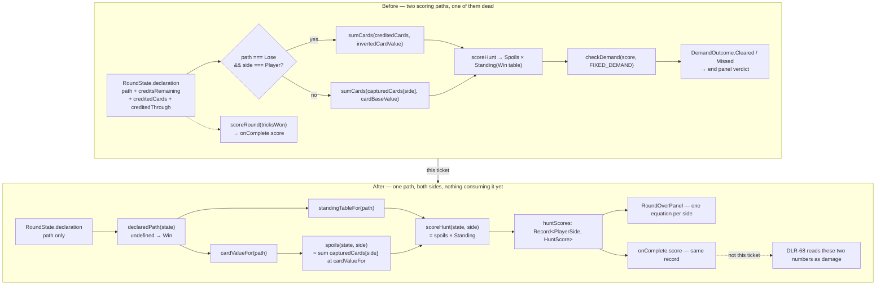

# Plan: Retire the Demand comparison and the capped Lose-credit mechanic

Plan folder: `.claude/contract/DLR-67-retire-demand-and-lose-credits/`
Execution status: see `tasks.md` in this folder.

---

## Part 1 — Alignment

### Task reference

**Jira: DLR-67** — *Retire the Demand comparison and the capped Lose-credit mechanic* (Task, Highest, labels `engine` + `playable`, parent epic DLR-65). Breakdown worklist: `.claude/contract/DLR-65-epic-breakdown/tasks.md` → T2.

Acceptance criteria, verbatim:

1. `checkDemand`, `DemandOutcome`, `scoreRound`, `tricksToPoints`, `FIXED_DEMAND`, `DEMAND_CURVE`, `DemandCurve`, the `Demand` type alias and `Hunt.demand` are gone from `src/`. A grep for each name returns zero hits outside git history.
2. `claimLostTrick`, `canClaimLostTrick`, `ClaimRejection`, `ClaimResult`, `creditedTrickWorth`, `LOSE_CREDITS_PER_HUNT` and `Hunt.loseCredits` are gone. `DeclarationState` loses `creditsRemaining`, `creditedCards` and `creditedThrough`, keeping `path`.
3. `RoundUiAction` loses its `ClaimTrick` member; the claim control, the ledger's credits cell, and `CLAIM_REJECTION_MESSAGE` are removed from `src/app/warCouncil/`.
4. `spoils` becomes single-branch again: each side's own captured cards, valued by the declaration's own scheme via DLR-66's `cardValueFor`. **This is a deliberate interim** — the pile-swap ticket replaces it. It is stated here so the interim is a chosen, coherent state rather than an accident.
5. The declare gate still gates the first trick and still writes the declaration once; `declareHunt` keeps its two guards (`AlreadyDeclared`, `HuntUnderway`) and stops taking a credit pool.
6. Every test that asserted a credit guard, a Demand verdict, or a `tricksToPoints` band is deleted or rewritten — not skipped, not left asserting a removed behaviour.
7. The app still runs: a Hunt is playable start to finish, the end panel shows `card value × Standing` for both sides with no target and no verdict, and no screen references a Demand or a credit.
8. `npm run typecheck`, `npm run lint`, `npm run format:check` and the scoped Vitest runs pass.

**Blocked by DLR-66** — `.claude/contract/DLR-66-scoring-health-and-rounding-config/tasks.md` reads `Status: COMPLETE`, and `cardValueFor` is on disk at `src/hunt/config.ts:114`. The dependency is satisfied.

Design sources cited rather than restated: `.docs/design/Balatro-Forbidden-Solitaire/hybrid-design.md` §1 (lines 37–43 card value, 195–206 "the three-credit mechanic and its four guards are replaced, not tuned") and §9 (lines 147–155 the deleted Demand / Treasure / Poison rows, line 1076 "the Demand base and growth rate row is deleted").

### Restated goal

Delete two whole mechanics that the duel direction has superseded, in one reviewable pass, and leave the app playable on a single coherent scoring path. The **Demand** goes entirely: its config constants, its type alias, its comparator, the trick-count-to-points helpers that only fed it, and every screen element that displayed a target or a cleared/missed verdict. The **capped Lose-credit mechanic** goes entirely: its module, its four rejection guards, its watermark, the three bookkeeping fields on `DeclarationState`, its reducer action, and its on-screen claim control. What survives is the declaration itself — still gating the first trick, still written once — and a single-branch `spoils` in which each side is paid for its own captured cards at the value scheme the declaration puts in force. The end-of-Hunt panel stops asking "did you clear a target" and instead states `card value × Standing` for both sides, which is the number the next ticket turns into damage.

### In scope

- **Engine — Demand:** delete `checkDemand`, `DemandOutcome`, `scoreRound` and `tricksToPoints` from `src/warCouncil/scoring.ts`; drop them from `src/warCouncil/index.ts`. Keep `scoreHunt` and `HuntScore`, re-defaulting `scoreHunt`'s two injectable terms off the state's own declaration.
- **Engine — credits:** delete `src/warCouncil/claimLostTrick.ts` and its spec outright; narrow `DeclarationState` to `{ path }`; reduce `declareHunt` to two parameters; delete `creditedTrickWorth` and the Lose branch from `src/warCouncil/spoils.ts`.
- **Engine — the undeclared default, stated once:** add `declaredPath(state)` to `src/warCouncil/types.ts` beside `currentTurn`, so the "undeclared reads as Win" rule lives in one place instead of the three inline `?? HuntDeclaration.Win` readings on disk today.
- **Config:** delete `FIXED_DEMAND`, `DEMAND_CURVE`, `DemandCurve` and `LOSE_CREDITS_PER_HUNT` from `src/hunt/config.ts`; delete the `Demand` alias, `Hunt.demand` and `Hunt.loseCredits` from `src/hunt/types.ts`; drop all six names from `src/hunt/index.ts`.
- **Screen:** remove the ledger's Demand cell and credits cell, the trick well's claim control and claim-worth preview, the end panel's Demand line and cleared/missed verdict, `DEMAND_OUTCOME_VERDICT` and `CLAIM_REJECTION_MESSAGE` from `labels.ts`, the `ClaimTrick` action from `roundReducer.ts`, and the matching CSS blocks.
- **Screen — the one addition AC7 requires:** `RoundOverPanel` renders `card value × Standing = total` for **both** sides, replacing the one-sided equation plus verdict.
- **Mount contract:** `Hunt` narrows to `{ quarry }`; `WarCouncilRoundResult.score` is renamed to `damage`, keeping its `Record<PlayerSide, number>` shape, and is now built from `scoreHunt` per side rather than from the deleted `scoreRound`.
- **Rename Score → Damage** (developer decision at the approval gate, 2026-08-12): the `Score` type alias becomes `Damage`, `HuntScore` becomes `HuntDamage` with its `score` field becoming `damage`, and the two on-screen readouts and their `aria-label`s read "Damage" instead of "Score". Deliberately **not** renamed: `scoreHunt` (DLR-68 AC1 replaces it with `huntDamage(finalState)` and changes its signature at the same time), the `Spoils` term (DLR-68 renames it to `cardValue`), and every `wc-score-*` CSS class (see the audit — they belong to the trick counter).
- **Tests:** delete `claimLostTrick.test.ts`; rewrite `scoring.test.ts`, `spoils.test.ts`, `declareHunt.test.ts`, `config.test.ts`, `HuntLedger.test.tsx`, `TrickWell.test.tsx`, `roundReducer.test.ts`, `WarCouncilRound.test.tsx`, `labels.test.ts`, `DeclareGate.test.tsx`; strip the three dead `DeclarationState` fields from the fixtures in `cpuPlayer.test.ts`, `playCard.test.ts`, `quarryIntent.test.ts`, `intentPreview.test.ts` and `roundFixture.ts`.

### Explicitly out of scope

- Two-sided damage, the pile swap, health, health bars, pending damage, encounter sequencing — DLR-68 and later. This ticket only removes and leaves the arithmetic unconsumed.
- Renaming `Spoils` / `Score` as terms. §1 retires "Spoils" as a named term, but the readouts rewrite is DLR-72's; renaming here would collide with it for no gain.
- The stale `ILLEGAL_MOVE_MESSAGE[MustFollowMonarch]` copy — a known live defect recorded in `.docs/implementation/war-council-ui/README.md`, and a developer copy call.
- `CardRank.Treasure` and `CardRank.Poison` as named ranks. §1 line 152 keeps rank 7's identity as a named card; only the scoring modifiers go (see Assumptions).
- The `.docs/implementation/**` and `.docs/game_rules/the-hunt.md` updates. Those are `implementation-doc-writer`'s, run by `/fb-apply` after the gates go green — never hand-edited here.

### Pattern Reference

Supplied by the brief: `.docs/implementation/war-council/declaration-and-lose-path.md` and `.docs/implementation/war-council-ui/declare-gate-and-claim.md` describe exactly what is being deleted, and are the fastest way to confirm nothing was missed.

Chosen here, because the brief named no code pattern for the parts that survive:

- **`src/hunt/config.ts:60-81`** — `standingTableFor` / `resolveStanding`. The injectable-parameter-with-a-live-default pattern that `scoreHunt` and `spoils` already follow, and that this plan preserves rather than replaces.
- **`src/warCouncil/types.ts:107-109`** — `currentTurn`. The precedent for a small pure derivation over `RoundState` living in `types.ts`; `declaredPath` is placed beside it for the same reason.
- **`src/warCouncil/declareHunt.ts`** — the named-rejection result shape survives untouched; only its third parameter goes.
- **`.claude/skills/react-frontend/SKILL.md`** and **`.claude/skills/game-ux/SKILL.md`** for everything under `src/` and for the two screen surfaces that change shape.

### Constraints flagged on the brief

- **"This ticket only removes."** The single addition is the end panel's second equation, which AC7 requires by name. Nothing else may grow.
- **The interim is deliberate.** AC4 states that single-branch `spoils` is a chosen coherent state, not an accident, and that the pile swap replaces it. The plan must not "improve" it toward the pile swap.
- **`playable`, honestly so.** AC7 requires a Hunt playable start to finish after this change, with no screen referencing a Demand or a credit.
- **Recoverability is via git, not via the ticket.** `CLAUDE.md`'s `git show <commit>:<path>` note covers the deletions; no compatibility shim, no deprecated re-export, no commented-out code left behind.
- **Zero-hit greps are the acceptance test.** AC1 and AC2 are stated as grep results, so the Final verification phase asserts them as such.
- **AC8 names `npm run format:check`, which currently fails on files this ticket never touches.** `.claude/workflow/web-project.md` records that the repo-wide check fails on pre-existing `.docs/**` files. The contract therefore gates on `npx prettier --check` scoped to the files it actually changed, and runs the repo-wide check once for the record without treating a pre-existing failure as this ticket's.

### Assumptions made

- **`RoundStatusBand.tsx` and `DeclareGate.tsx` are in scope, though the ticket's In-scope screen list omits them.** Both import `type Demand` and `DeclareGate` takes `demand` and `loseCredits` props; AC1 and AC2 delete those names, so neither file can compile unchanged. Treated as a gap in the ticket's file list, not a scope expansion.
- **`src/warCouncil/playCard.ts:106-108` is in scope for a comment-only edit.** It points the reader at `isQuarryPileTail` in `claimLostTrick.ts`, a file this ticket deletes. A comment citing a deleted module is a stale pointer, so the reference goes with it.
- **The Treasure `+1` / Poison `−1` fold in `spoils.ts:10` is removed.** §1 line 39–40 states "No modifier of any kind touches either value — no Treasure `+1`, no Poison `−1`", §9 lines 152–155 delete both rows with the arithmetic, and `cardValueFor`'s own docblock (`src/hunt/config.ts:111-113`) already records them as Decided-removed. Keeping the fold would make `spoils` contradict the exact function AC4 tells it to use. **This is the plan's most consequential reading and the one to red-line first** — see Risks.
- **Undeclared reads as the Win scheme.** `WarCouncilRound.tsx:76` already does this inline for the readout band. `declaredPath` makes it the single stated rule, used by `spoils`, `scoreHunt` and the band alike.
- **The declaration governs *both* sides' value scheme and Standing table.** `HUNT_MULTIPLIER_TABLES`' docblock (`src/hunt/config.ts:19-20`) says "both sides reading whichever is in force", so `spoils(state, 'cpu')` uses the same `cardValueFor(declaredPath(state))` as the player's. This is what makes the end panel's two equations comparable.
- **`WarCouncilRoundResult` keeps its `Record<PlayerSide, number>` shape but its field is renamed `score` → `damage`** — **confirmed by the developer at the approval gate, 2026-08-12.** It is the same quantity the panel renders, and DLR-68's own AC1 (`.claude/contract/DLR-65-epic-breakdown/tasks.md` T3) already names the field `damage`, so this adopts the epic's vocabulary one ticket early rather than inventing one.
- **The rename stops at the term, not at the function.** `scoreHunt` keeps its name because DLR-68 AC1 replaces it outright with `huntDamage(finalState)` returning both sides at once — renaming it here would be churn applied twice. `Spoils` likewise stays, because DLR-68 renames that field to `cardValue`. The result: for one ticket, `scoreHunt` returns a `HuntDamage`. That mild inconsistency is the cost of not pre-empting the next ticket's signature change, and it is deliberate.
- **`scoreHunt` keeps its two injectable parameters** rather than collapsing to one `declaration` argument. Their defaults become declaration-derived (TypeScript permits a later parameter's default to reference an earlier one, so `state` is in scope), which preserves the existing hold-one-axis-flat test pattern that `scoring.test.ts` relies on.
- **`Score` and `Spoils` type aliases survive**; only their docblocks lose the phrase "checked against the Demand". Renaming is DLR-72's.
- **`src/warCouncil/__tests__/zzsim.test.ts` is not planned for.** It appears in this session's opening `git status` as untracked but is absent from disk now (confirmed by `Glob src/warCouncil/__tests__/*.ts` and a direct read that returned "No such file or directory"). If it reappears before execution, it references `cardValueFor` and `declareHunt` and will need the same fixture edits as its siblings.
- **The end panel's second equation is a mirror of the first, not a new visual language.** Same `.wc-equation` markup, one instance per side, each labelled. Settled by the mockup rather than by prose.

### Config and persisted-shape audit

Performed against the real files with `Grep`/`Read`; counts are exact occurrence counts across `src/**`.

- **Nothing is persisted anywhere.** There is no save file, no stored log, no `localStorage` write, and no serialisation of `RoundState`, `Hunt` or `DeclarationState` in `src/`. `Hunt` is built at module scope in `App.tsx:10-14` and `RoundState` lives only in a `useReducer`. **This is the cheap window, and it is open** — narrowing `DeclarationState` from four fields to one invalidates no stored record. Recording that here is what lets a later change know the window has closed.
- **Every configuration key being removed, found by name.** `FIXED_DEMAND` — **10 hits** (`hunt/config.ts:201,247`; `hunt/index.ts:17`; `hunt/__tests__/config.test.ts:14,200,202,203`; `App.tsx:2,12`; `app/warCouncil/__tests__/roundFixture.ts:49`). `DEMAND_CURVE` — **7 hits** (`hunt/config.ts:216,242`; `hunt/index.ts:12`; `hunt/__tests__/config.test.ts:9,173,175,176`). `DemandCurve` — **3 hits** (`hunt/config.ts:207,216`; `hunt/index.ts:4`). `LOSE_CREDITS_PER_HUNT` — **6 hits** (`hunt/config.ts:205`; `hunt/index.ts:21`; `App.tsx:2,13`; `warCouncil/declareHunt.ts:21`; `app/warCouncil/__tests__/roundFixture.ts:49`). Every hit is claimed by a task below; none is new or dead.
- **Every exported engine symbol being removed, found by name.** `checkDemand` 12 · `DemandOutcome` 21 · `scoreRound` 7 · `tricksToPoints` 10 · `claimLostTrick` 27 · `canClaimLostTrick` 14 · `ClaimRejection` 26 · `ClaimResult` 3 · `creditedTrickWorth` 6 · `CLAIM_REJECTION_MESSAGE` 3 · `ClaimTrick` 7. The `Demand` type alias resolves to **48** word-boundary hits across 19 files and lowercase `demand` to **50** across 15 — the two largest surfaces in the change, and the reason the config-and-readers rule below forces them into single tasks.
- **Type changes and what is lost.** `DeclarationState` goes from four required fields to one — a **narrowing**, so every construction site must drop three fields (23 `creditedCards` hits, 39 `creditsRemaining`, 17 `creditedThrough`, spread across 11 spec files plus 4 engine modules) and no reader can be left expecting them. `Hunt` goes from three required fields to one, same shape of change, 2 construction sites (`App.tsx:10`, `roundFixture.ts:51`). `declareHunt` loses its third parameter — an **arity change**, which the compiler catches at all 6 non-test call sites. `spoils` loses its fourth parameter and `scoreHunt`'s defaults change value without changing type, which the compiler does **not** catch: that is why the rewritten `scoring.test.ts` and `spoils.test.ts` must assert against `cardValueFor`/`standingTableFor` rather than against hand-written numbers.
- **Consumers of each changed predicate, counted.** `spoils` — **57** lowercase hits; the non-test callers are `scoring.ts:49` (inside `scoreHunt`) and `WarCouncilRound.tsx:70`, both rewritten in the same task as the function. `scoreHunt` — 2 non-test callers (`WarCouncilRound.tsx:177`, and `index.ts:25`'s re-export). `canClaimLostTrick` — 3 non-test callers (`roundReducer.ts:178,187`, `WarCouncilRound.tsx:89`), all deleted.
- **The `Score` → `Damage` rename, counted, with the one name that must NOT move.** `Score` (capitalised, word-boundary) — **17 hits** across 8 files: `hunt/types.ts:25` (the alias), `hunt/index.ts:1` (the export), `warCouncil/scoring.ts:7,31,69`, `HuntLedger.tsx:55,57`, `RoundOverPanel.tsx:14,34,62,64`, `HuntLedger.test.tsx:28,37`, `WarCouncilRound.test.tsx:305,318,338`, plus `hunt/config.ts:241` (a comment deleted with `FIXED_DEMAND`). Lowercase `score` — **40 hits**, and this is the trap: **11 of them are `wc-score` / `wc-score-cell` / `wc-score-side` / `wc-score-value` at `RoundStatusBand.tsx:52-63`, styled at `warCouncil.css:113-154` and referenced in a comment at `warCouncilHunt.css:275` — and those belong to the TRICKS-WON counter, not to the Score cell.** They are string-bound in both directions, so a blanket rename type-checks cleanly and silently unstyles the trick counter. They stay. The actual Score cell binds to `.wc-ledger-key`/`.wc-ledger-value`, so its rename is copy-only with zero CSS churn. A further 4 lowercase hits are unrelated English (`DeclareGate.tsx:36` "Cards score their printed rank", `App.tsx:23`, `hunt/config.ts:68`, `hunt/types.ts:21`), and 6 more are deleted outright with `checkDemand`.
- **`Damage` collides with nothing.** `src/hunt/config.ts` already carries `DamageRounding`, `DAMAGE_ROUNDING` and `roundDamage`; a `Damage` type alias is a distinct identifier from all three and sits naturally beside `Health` in `src/hunt/types.ts`.
- **String-bound names align across the chain.** The CSS classes bound only by string are `.wc-ledger-cell.wc-is-demand` (`warCouncilHunt.css:34`, written at `HuntLedger.tsx:64`), `.wc-ledger-cell.wc-is-credits` and `.wc-is-spent` (`warCouncilHunt.css:46,51,56`, written at `HuntLedger.tsx:74`), `.wc-verdict.wc-is-cleared` / `.wc-is-missed` (`warCouncilHunt.css:239,244`, written at `RoundOverPanel.tsx:73`), and `.wc-claim-worth` / `.wc-claim-row` / `.wc-claim` (`TrickWell.tsx:87,90,91`). Each pair is deleted in one task so no orphan selector or classless element survives. The `aria-label` strings four component tests bind to — `'The Demand: 220'`, `'Lose-credits remaining: 2'`, `'Score so far: 240'` — are string-bound in exactly the same way and change in the same task as the markup.
- **The architectural boundary holds.** `eslint.config.js` enforces no-React / no-DOM on `src/warCouncil/**` and `src/hunt/**`. Every engine edit here is a deletion or a signature narrowing; `declaredPath` is a pure `RoundState → HuntDeclaration` function with no import beyond `../hunt`, which `types.ts` already imports from. Nothing in the design requires a DOM global or a React import inside either tree. The Final verification phase greps to prove it.

---

## Part 2 — Technical design

### Approach

The change is a **deletion with one seam**, and the seam is where the two mechanics were entangled: `spoils` currently branches on `declaration.path === Lose && side === Player` to sum `declaration.creditedCards` instead of the capture pile. Removing the credit mechanic collapses that branch, and AC4 says what it collapses *to* — each side's own capture pile, valued by `cardValueFor(declaredPath(state))`. That one line is the whole interim, and everything else in the engine falls out of it: with no credited cards there is no `creditedTrickWorth`, no `creditedThrough` watermark, no four-guard `rejectionFor`, and `DeclarationState` has nothing left but `path`.

The alternative shape considered and rejected was **staging the two mechanics as separate phases** — Demand first, credits second — so each half type-checks alone. It does not work: `DeclareGate` renders both a Demand line and a credit count from the same `Hunt` object, `HuntLedger` renders a Demand cell and a credits cell side by side, and `roundFixture.ts` builds one `Hunt` literal carrying both. Splitting them leaves a phase boundary where half the props are gone and half remain, which is precisely the "silently broken at a phase boundary" state the config-change rule forbids. So the two mechanics are separated by *layer* instead: **Phase 1 takes the engine and config down to their new shapes with their specs, Phase 2 makes the screen match.** Phase 1 ends type-clean in `src/warCouncil/` and `src/hunt/` and deliberately red in `src/app/`, which is honest — the app layer is downstream of an engine signature change and cannot be otherwise. Phase 2 ends the whole project type-clean. This is stated in each phase's framing so an executor stopping mid-contract knows what they are looking at.

`declaredPath(state)` is the one thing added to the engine, and it exists because the "undeclared reads as Win" default is about to be needed in three places at once — `spoils`'s value scheme, `scoreHunt`'s table, and the status band's live readout — where today it is written inline once (`WarCouncilRound.tsx:76`) and implied twice by parameter defaults that hard-code the Win table. Three inline `?? HuntDeclaration.Win` readings is three places for the rule to drift. It goes in `src/warCouncil/types.ts` beside `currentTurn`, which is the existing precedent for a pure derived reading of `RoundState`, and it stays pure so the `src/warCouncil/**` boundary is untouched.

On the screen side, three components lose props and one gains a shape. `HuntLedger` drops `demand` and `declaration` and renders three cells instead of five. `TrickWell` drops `claimable`, `creditsRemaining` and `onClaim` and loses a whole branch — after this, a resolved trick always offers the same single carry-on control, which removes a two-button/one-button fork from the most repeated moment in the round. `DeclareGate` drops both props and needs new copy for its Lose option and its foot line, since both quoted a number that no longer exists. `RoundOverPanel` is the one that grows: AC7 requires `card value × Standing` for both sides, so its `huntScore: HuntScore` prop becomes `huntDamage: Readonly<Record<PlayerSide, HuntDamage>>` and it renders the same `.wc-equation` group twice, labelled per side, with the verdict paragraph gone. `WarCouncilRound` derives that record once per render from `scoreHunt` per side — bounded work over at most 26 cards and a six-row table scan, matching the file's existing stated no-memo posture — and feeds the same record to both the panel and `onComplete`'s `damage`, so the number the player reads and the number the mount reports cannot diverge.

Riding along with that is the developer's gate decision to **rename `Score` to `Damage`**. It is a rename, not a behaviour change — the same product of the same two terms — but it is the kind that type-checks cleanly while breaking things the compiler cannot see, so it is planned as a single-task change covering the alias, the interface, both readouts, both `aria-label` strings and the four specs that bind to them. The audit found the one name that must hold still: `wc-score-*` styles the **trick counter**, not the Damage cell, and a blanket rename would unstyle it silently. The rename stops deliberately short of `scoreHunt` and `Spoils`, both of which DLR-68 replaces outright — doing them here would be churn applied twice. That derivation also lets the component drop its separate `spoils` and `resolveStanding` calls, and with them its imports of `HuntDeclaration`, `resolveStanding`, `standingTableFor` and `spoils`.

All engine logic stays in pure modules under `src/warCouncil/` and `src/hunt/`, testable with no renderer; the only component-tested behaviour is what is genuinely presentational — which cells the ledger renders, which controls the trick well offers, and what the end panel reads out. Per `game-ux`, no layout claim is asserted in jsdom: the no-scroll check at named viewport sizes is QA's, driving the real app.

### Skills to invoke during execution

- **`react-frontend`** — owns everything under `src/`: the engine deletions and signature narrowings, the config-key removals, the four `.tsx` edits, the CSS, and every Vitest rewrite. Confirmed by the developer.
- **`game-ux`** — owns the two game surfaces that change shape: `RoundOverPanel` (two equations where there was one plus a verdict) and `TrickWell` (a two-control fork collapsing to one). Its hard floor governs the ≥44px controls that survive, the no-scroll shell at the new panel height, and the rule that no tuning value — panel size bound, spacing, colour — is invented. Confirmed by the developer.

No developer override was applied; the confirmed list matches the classification. `game-designer` was offered and declined — the design is settled in `hybrid-design.md` §1/§9 and is cited, not re-argued.

Also read before execution: **`.claude/workflow/web-project.md`** (paths, runners, the correctness traps). **`.claude/rules/`** is empty — `Glob .claude/rules/*.md` returns only `README.md`, whose index reads "*(empty — no rules written yet)*", so no rule file constrains this plan.

### Diagram



### Data shapes

#### Deleted outright

```ts
// src/warCouncil/scoring.ts
export function tricksToPoints(tricks: number): number
export function scoreRound(tricksWon: Readonly<Record<PlayerSide, number>>): Record<PlayerSide, number>
export const DemandOutcome: { Cleared: 'cleared'; Missed: 'missed' }
export type DemandOutcome
export function checkDemand(score: Score, demand: Demand): DemandOutcome

// src/warCouncil/claimLostTrick.ts — whole file deleted
export const ClaimRejection: { NotDeclaredLose; NoCreditsRemaining; TrickAlreadyCredited; TrickNotLost }
export type ClaimRejection
export type ClaimResult
export function claimLostTrick(state: RoundState, trick: readonly [TrickCard, TrickCard]): ClaimResult
export function canClaimLostTrick(state: RoundState, trick: readonly [TrickCard, TrickCard]): boolean

// src/warCouncil/spoils.ts
export function creditedTrickWorth(cards: readonly Card[], inverted?: (rank: number) => number): Spoils
function sumCards(cards: readonly Card[], value: (rank: number) => number): Spoils  // inlined into spoils

// src/hunt/types.ts
export type Demand = number
export type Score = number           // renamed, not deleted — see Renamed below

// src/hunt/config.ts
export interface DemandCurve { readonly base: number | null; readonly growthPerEncounter: number | null }
export const DEMAND_CURVE: DemandCurve
export const FIXED_DEMAND: Demand
export const LOSE_CREDITS_PER_HUNT: number

// src/app/warCouncil/labels.ts
export const DEMAND_OUTCOME_VERDICT: Readonly<Record<DemandOutcome, string>>
export const CLAIM_REJECTION_MESSAGE: Readonly<Record<ClaimRejection, string>>
```

#### Added

```ts
// src/warCouncil/types.ts — beside `currentTurn`, the existing precedent for a pure
// derived reading of RoundState. Requires changing the existing type-only import of
// HuntDeclaration from '../hunt' to a value import.
/**
 * The value scheme and Standing table in force. An undeclared round reads as Win: nothing
 * has scored yet, and the readouts need a table to display before the player declares. The
 * single statement of that default — `spoils`, `scoreHunt` and the status band all read it
 * here rather than each writing `?? HuntDeclaration.Win`.
 */
export function declaredPath(state: RoundState): HuntDeclaration
```

#### Renamed — Score → Damage

Developer decision at the approval gate, 2026-08-12. Adopts §1's vocabulary table ("**damage** — a side's card value × its Standing for the Hunt, applied to the other side once at the end", `hybrid-design.md` line 1095) and DLR-68's own AC1 field name, one ticket early.

```ts
// src/hunt/types.ts — replaces `export type Score = number`
/** A side's card value × its Standing for one Hunt — what depletes the other side's
 *  health (§1's vocabulary table). Nothing applies it yet; DLR-68 owns that. */
export type Damage = number

// src/warCouncil/scoring.ts — `HuntScore` becomes `HuntDamage`, `score` becomes `damage`
export interface HuntDamage {
  readonly spoils: Spoils            // DLR-68 renames this to `cardValue`; not this ticket
  readonly tricks: number
  readonly band: StandingBand
  readonly standing: Standing
  readonly damage: Damage            // was: score: Score
}

// src/app/warCouncilMount.ts
export interface WarCouncilRoundResult {
  readonly finalState: WarCouncilState
  readonly damage: Readonly<Record<PlayerSide, number>>   // was: score
}
```

**Not renamed, deliberately:** `scoreHunt` (DLR-68 AC1 replaces it with `huntDamage(finalState)` and changes its signature in the same move), the `Spoils` alias and field (DLR-68 renames it to `cardValue`), and every `wc-score-*` CSS class — those style the trick counter, not the Damage cell, and moving them would silently unstyle it. `src/hunt/index.ts` exports `Damage` in place of `Score`.

#### Narrowed

```ts
// src/warCouncil/types.ts
export interface DeclarationState {
  readonly path: HuntDeclaration
}                                    // was: + creditsRemaining, creditedCards, creditedThrough

// src/hunt/types.ts
export interface Hunt {
  readonly quarry: Quarry
}                                    // was: + demand: Demand, loseCredits: number

// src/warCouncil/declareHunt.ts
export function declareHunt(state: RoundState, path: HuntDeclaration): DeclareResult
                                     // was: (state, path, loseCredits: number)
                                     // DeclareRejection and DeclareResult unchanged

// src/warCouncil/spoils.ts — single branch, no ±1 fold (see Risks)
export function spoils(
  state: RoundState,
  side: PlayerSide,
  cardValue: (rank: number) => number = cardValueFor(declaredPath(state)),
): Spoils
                                     // was: (state, side, cardValue = cardBaseValue,
                                     //       inverted = invertedCardValue)

// src/warCouncil/scoring.ts — HuntScore unchanged; both defaults now declaration-derived
export function scoreHunt(
  state: RoundState,
  side: PlayerSide,
  cardValue: (rank: number) => number = cardValueFor(declaredPath(state)),
  standingTable: readonly StandingBand[] = standingTableFor(declaredPath(state)),
): HuntDamage
                                     // was: cardValue = cardBaseValue,
                                     //      standingTable = standingTableFor(HuntDeclaration.Win),
                                     //      returning HuntScore
```

#### Component props

```ts
// src/app/warCouncil/HuntLedger.tsx
interface HuntLedgerProps {
  readonly spoils: Spoils
  readonly band: StandingBand
}                                    // was: + demand: Demand, declaration: DeclarationState | null

// src/app/warCouncil/RoundStatusBand.tsx
interface RoundStatusBandProps {
  readonly tricksWon: Readonly<Record<PlayerSide, number>>
  readonly tricksPlayed: number
  readonly opponentHandCount: number
  readonly roundComplete: boolean
  readonly spoils: Spoils
  readonly band: StandingBand
}                                    // was: + demand: Demand, declaration: DeclarationState | null

// src/app/warCouncil/DeclareGate.tsx
interface DeclareGateProps {
  readonly onDeclare: (path: HuntDeclaration) => void
}                                    // was: + demand: Demand, loseCredits: number

// src/app/warCouncil/TrickWell.tsx
interface TrickWellProps {
  readonly currentTrick: readonly TrickCard[]
  readonly resolvedTrick: ResolvedTrick | null
  readonly quarryToLead: boolean
  readonly onCarryOn: () => void
}                                    // was: + claimable: boolean, creditsRemaining: number,
                                     //        onClaim: () => void

// src/app/warCouncil/RoundOverPanel.tsx — the one shape that grows (AC7)
interface RoundOverPanelProps {
  readonly tricksWon: Readonly<Record<PlayerSide, number>>
  readonly huntDamage: Readonly<Record<PlayerSide, HuntDamage>>
  readonly onFinish: () => void
}                                    // was: huntScore: HuntScore, demand: Demand,
                                     //      outcome: DemandOutcome, onFinish
```

#### Reducer

```ts
// src/app/warCouncil/roundReducer.ts
export const RoundUiActionKind = {
  TapCard: 'tapCard',
  ChooseAbility: 'chooseAbility',
  CancelSelection: 'cancelSelection',
  CarryOn: 'carryOn',
  Declare: 'declare',
} as const                           // was: + ClaimTrick: 'claimTrick'

export type RoundUiAction =
  | { readonly kind: typeof RoundUiActionKind.TapCard; readonly card: Card }
  | { readonly kind: typeof RoundUiActionKind.ChooseAbility; readonly choice: AbilityChoice }
  | { readonly kind: typeof RoundUiActionKind.CancelSelection }
  | { readonly kind: typeof RoundUiActionKind.CarryOn }
  | { readonly kind: typeof RoundUiActionKind.Declare; readonly path: HuntDeclaration }
                                     // Declare loses `loseCredits`; the ClaimTrick member
                                     // and `handleClaimTrick` are deleted.
```

#### Mount contract

```ts
// src/app/warCouncilMount.ts — same Record shape, field renamed; `hunt`'s docblock loses
// its Demand justification. `damage` is now built per side from `scoreHunt`.
export interface WarCouncilRoundResult {
  readonly finalState: WarCouncilState
  readonly damage: Readonly<Record<PlayerSide, number>>
}
```

#### Barrel exports

`src/warCouncil/index.ts` drops `scoreRound`, `tricksToPoints`, `checkDemand`, `DemandOutcome`, `creditedTrickWorth`, and both `claimLostTrick.ts` export lines; it adds `declaredPath` and re-exports `HuntDamage` in place of `HuntScore`. `src/hunt/index.ts` drops `Demand`, `DemandCurve`, `DEMAND_CURVE`, `FIXED_DEMAND` and `LOSE_CREDITS_PER_HUNT`, and exports `Damage` in place of `Score`.

#### Configuration

**No configuration key is added and no tuning value is needed.** This ticket only deletes constants (`FIXED_DEMAND`, `DEMAND_CURVE`, `LOSE_CREDITS_PER_HUNT`). Every surviving tunable in `src/hunt/config.ts` — the two multiplier tables, `DAMAGE_ROUNDING`, `PLAYER_START_HEALTH`, `QUARRY_ENCOUNTER_HEALTH`, `ENCOUNTER_PLAYER_RESTORE`, `SIMULTANEOUS_DEPLETION_WINNER`, `FORAGE_BUDGET_PER_ENCOUNTER`, `ENCOUNTERS_PER_RUN`, `TELEGRAPH_FIDELITY`, `SLICE_QUARRY_CHARACTER` — is untouched.

#### Copy that must change

Three strings quote a number that ceases to exist. They are written into the plan so the executor does not invent them, and they are the developer's to overturn (see Risks):

| Where | Now | Proposed |
|---|---|---|
| `DeclareGate.tsx:47-50` (Lose option body) | "Cards invert — a 1 scores 11. You get **{loseCredits} credits**, each claiming one trick you lose." | "Cards invert — a 1 scores 11. Every trick you take still adds both its cards to your **Spoils**, at those inverted values." |
| `DeclareGate.tsx:53-55` (foot) | "Standing still comes from your trick count either way, and the Demand is still {demand}." | "Standing still comes from your trick count either way — but the two paths band it differently." |
| `RoundOverPanel.tsx:69-75` (detail + verdict) | "{tricks} tricks — {band}. The Demand was {demand}." then "Demand cleared / missed" | Per side: "{tricks} tricks — {band}." No verdict line. |
| `HuntLedger.tsx:55,57` (third cell) | key "Score", `aria-label` "Score so far: {n}" | key "**Damage**", `aria-label` "**Damage so far: {n}**" |
| `RoundOverPanel.tsx:34,62,64` (equation) | group `aria-label` "Spoils times Standing equals Score"; key "Score"; value `aria-label` "Score: {n}" | "Spoils times Standing equals **Damage**"; key "**Damage**"; "**Damage: {n}**" — one group per side, each named for its side |

The last two rows are the `Score` → `Damage` rename reaching the screen. The matching `getByLabelText` assertions at `HuntLedger.test.tsx:28,37` and `WarCouncilRound.test.tsx:318,338` bind to these strings and change in the same task.

### Runtime quality notes

- **Purity and adjudication.** Everything decided here is decided in `src/warCouncil/` and `src/hunt/`, both DOM-free and React-free under the existing `eslint.config.js` override. `declaredPath` is a pure `RoundState → HuntDeclaration` read. `spoils` and `scoreHunt` resolve their own value scheme and table from config accessors — `cardValueFor` and `standingTableFor` — so no multiplier, no band boundary and no rank-inversion pivot is written at a call site. The four components adjudicate nothing after this change: `HuntLedger` multiplies two numbers it is handed, `RoundOverPanel` formats a record it is handed, `TrickWell` renders what it is given, and `DeclareGate` reads `invertedCardValue(CardRank.Swan)` rather than a hand-written 11. `WarCouncilRound` decides only *which* branch of the felt cascade renders, which it already did.
- **Effects, mount and teardown.** There is no effect anywhere in this tree today (`WarCouncilRound.tsx:50-52` states this explicitly) and this change adds none — no listener, no observer, no timer, no `requestAnimationFrame`, no `AbortController`, so there is no cleanup to write and nothing to release on `pointercancel`. The single piece of state is the `useReducer`, whose lazy initialiser `createRoundUiState` is a pure restructuring of `initialState` and stays one; StrictMode's double-invocation recomputes an identical value. Deleting the `ClaimTrick` case removes a transition, not a subscription. There is no module-level mutable state in any file this plan touches — `HUNT` in `App.tsx:10` is a frozen-by-convention `const` object literal built from configuration and holds no per-round state, and narrowing it to `{ quarry }` keeps that true. A second mount re-runs the same pure initialiser against the same props.
- **Hot-path cost.** Nothing here runs per pointer event; the felt's controls are discrete taps. The per-render derivations grow by one: `huntScores` calls `scoreHunt` twice instead of `spoils` once plus `resolveStanding` once. Each `scoreHunt` reduces over that side's capture pile — at most 26 cards in a 13-trick round, and the two piles together are exactly `2 × tricksPlayed` cards — and scans a six-row table with `Array.find`. Both bounds are structural, not incidental. That is the same bounded-work argument the file already makes at `WarCouncilRound.tsx:68-69` for `runningSpoils`, so the existing no-memo posture holds and **no `memo`/`useMemo`/`useCallback` is added** — there is no profiling evidence and the skill forbids adding it speculatively. `TrickWell` gets cheaper: `creditedTrickWorth` no longer maps and reduces the held trick's cards every render.
- **Determinism and numeric safety.** The only `Math.random()` in the tree is `App.tsx:19`'s seed for `dealRound`, which this change does not touch and which nothing reproducible reads. No division is introduced anywhere, so no divisor needs guarding and no new `NaN` path exists: `spoils` is a sum over a possibly-empty array with an initial `0` (an empty pile returns `0`, not `NaN`), and `scoreHunt`'s product is two finite numbers. No epsilon is needed — every value here is an integer or a half-step from a configured multiplier, and nothing compares floats for equality. The one real numeric hazard is inherited, not new: `resolveStanding` throws `RangeError` outside 0–13 rather than returning `undefined`, and `HuntLedger` renders `spoils * band.multiplier` where a `0` multiplier must read as `0` and not blank — the existing spec at `HuntLedger.test.tsx:31-39` guards that and is retained through the rewrite.
- **Error paths.** Nothing is swallowed and nothing new can throw. `declareHunt` keeps both named rejections (`AlreadyDeclared`, `HuntUnderway`) returning `{ ok: false, reason }` — an invalid declaration still cannot commit and still names its reason (AC5). `handleDeclare` still returns the input state by reference on a rejection rather than partially applying it. `playCard`'s `IllegalMoveReason` set and `ILLEGAL_MOVE_MESSAGE` are untouched, so an illegal move still names a specific reason. Deleting `ClaimRejection` deletes four reason codes along with the only action that could produce them — no code is orphaned and no message map is left keyed on a dead union. `cpuFault` still surfaces a corrupt CPU turn in an `role="alert"` rather than retrying. There is no `catch` in the diff, no config load to guard, and **no async surface anywhere in this tree** — nothing fetches, so the four async states do not arise.

### Risks and judgement calls

- **Removing the Treasure `+1` / Poison `−1` fold from `spoils` — the one to check first.** The plan removes it, on the strength of §1 line 39–40 ("No modifier of any kind touches either value"), §9 lines 152–155 (both rows deleted, with the ×5 arithmetic), and `cardValueFor`'s own docblock at `src/hunt/config.ts:111-113` already recording them as Decided-removed. **But DLR-67's own AC6 does not name the Treasure/Poison tests among those to rewrite**, while `spoils.test.ts` has two describe blocks asserting the fold and `scoring.test.ts` builds a `NEUTRAL_RANKS` fixture specifically to dodge it — which reads as a ticket that did not expect this to move. The plan treats that as an oversight rather than an instruction, because leaving the fold makes `spoils` contradict the exact function AC4 tells it to call. **If you want the fold kept, say so at the gate**: it is one task's change (`spoils.ts` keeps its `sumCards` reduce, and the two `spoils.test.ts` describe blocks survive with their `creditedCards` fixtures rewritten to capture piles) and nothing else in the plan moves.
- **Copy on the declare gate and the end panel is yours.** Three strings quote a number that stops existing, so silence is not an option — the proposed replacements are in Data shapes → *Copy that must change*, written so the executor invents nothing. The Lose option's new body is the honest description of the **interim**, not of the pile swap that lands next ticket, which means it will read as slightly wrong to anyone who has read §1. That is a real tension and it is the price of shipping the interim as a coherent state.
- **The ticket's In-scope screen list is missing two files.** `RoundStatusBand.tsx` and `DeclareGate.tsx` both bind to names AC1/AC2 delete and cannot compile unchanged; `playCard.ts` carries a comment pointing at a file this ticket deletes. The plan treats all three as in scope by necessity. Flag it if you would rather the comment stayed as a historical note.
- **The end panel's two-sided equation is the only thing added, and it is where design judgement lives.** AC7 says "for both sides" but not how. The mockup settles it — two mirrored `.wc-equation` groups, one per side, with the winner of the trick count marked. Whether that reads as a comparison or as two unrelated sums, and whether the panel still fits at a short viewport with the second equation added, are yours to judge in the running app; QA will confirm the panel renders and does not scroll, but not whether it *lands*.
- **`TrickWell` loses a branch, and the round's most repeated moment changes shape.** Today a resolved lost trick under a Lose declaration offers two controls ("Claim these — N credits left" / "Let it go"); after this it always offers one ("Tap the table to carry on"). That is thirteen fewer forks per round and, per `game-ux`, a strictly lower interaction cost — but it also means the Lose path currently has no decision of its own between tricks. That is expected for the interim (the pile swap gives it back), and worth knowing before you play it.
- **Score → Damage: decided at the gate, and the trap it carries.** You called it, and the epic backs it — DLR-68's AC1 already names the field `damage`. The risk is not the decision, it is the mechanism: **`wc-score` / `wc-score-cell` / `wc-score-side` / `wc-score-value` style the trick counter, not the Damage cell** (11 hits, `RoundStatusBand.tsx:52-63` + `warCouncil.css:113-154`). A find-and-replace over `score` type-checks perfectly and silently unstyles the trick counter, because CSS class names bind by string in both directions. The plan pins them as must-not-move and the Final verification phase greps to prove they survived. Worth knowing this is where the change can go wrong quietly.
- **The rename stops short of `scoreHunt` and `Spoils`**, so for one ticket a function called `scoreHunt` returns a `HuntDamage` whose first field is still `spoils`. DLR-68 replaces both names as part of a signature change it owns; doing them here means doing them twice. Say so if you would rather take the full vocabulary sweep now and let DLR-68 inherit a clean surface.
- **This is the largest single deletion in the epic and it is recoverable only from git.** ~350 lines of engine, screen and spec code go. `CLAUDE.md`'s `git show <commit>:<path>` note covers restoration, and §1's argument against the credit mechanic is explicit, so the risk is low — but if the pile swap turns out wrong, the credit mechanic comes back from history, not from this ticket.
- **No tuning value is needed by this work.** Stated positively so the gate is not left wondering: every constant in the diff is deleted, none is added, and no number in the change is a developer's to choose. The three decisions above are a rule reading, a copy call, and a layout call — not tunables.
