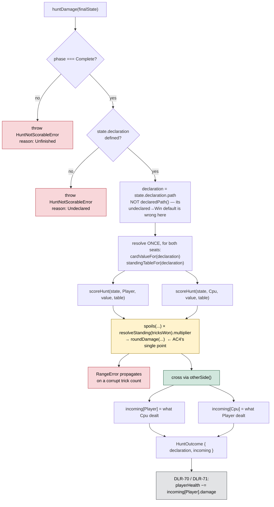

# Plan: Two-sided damage — card value × Standing, both directions, once at trick 13

Plan folder: `.claude/contract/DLR-68-two-sided-damage/`
Execution status: see `tasks.md` in this folder.

---

## Part 1 — Alignment

*(The shared understanding of what this task is doing. Restate it in your own words — this is how the developer confirms you read the brief correctly before any design happens. Mismatch here = stop and fix.)*

### Task reference

**Jira:** [DLR-68](https://amazerbeam.atlassian.net/browse/DLR-68) — "Two-sided damage: card value x Standing, both directions, once at trick 13". Story, Highest, label `engine`, parent epic DLR-65. Breakdown worklist entry: `.claude/contract/DLR-65-epic-breakdown/tasks.md` → T3 (lines 383–450), which is verbatim identical to the ticket.

**Acceptance criteria, verbatim from the ticket:**

1. A `huntDamage(finalState)` entry point returns both sides' damage for one finished Hunt, each as `{ cardValue, tricks, band, standing, damage }`, computed once from a final `RoundState` and never accumulated per trick.
2. Both sides read the multiplier table for **whichever declaration the player made**. The Quarry never declares for itself, and there is no code path by which it could (§1).
3. Each side's damage is applied to the **other** side's health. The direction is asserted by test, not left to a caller's convention.
4. Damage rounds through DLR-66's `roundDamage` at exactly one point, so a ×0.5 band on an odd card sum cannot produce a fractional health value.
5. `huntDamage` throws or rejects — never silently returns zero — on an unfinished Hunt or an undeclared one. A corrupt trick count still surfaces `resolveStanding`'s `RangeError` rather than being scored as 0.
6. A test asserts the antisymmetry property `Net(k) = −Net(13 − k)` at average card values, over the configured table pair.
7. Vitest covers both declarations at the fourteen splits at average card values, against §8's enumeration. **Note:** the Lose column is only correct once the pile-swap ticket lands — this ticket's fixtures assert the Win column in full and the Lose column against own-pile valuation, and the pile-swap ticket updates them. Stated so the handover is explicit rather than discovered.
8. Nothing in `src/warCouncil/` holds a multiplier, a band boundary, or a health total as a literal.
9. `npm run typecheck`, `npm run lint`, `npm run format:check` and the scoped Vitest runs pass.

**Scope boundaries, verbatim:** In scope — a new damage module under `src/warCouncil/` (`damage.ts` or the reshaped `scoring.ts`), `src/warCouncil/spoils.ts`, `types.ts`, `index.ts`, and their tests. Out of scope — the pile swap, health totals and bars, pending-damage display, and any UI file. Overkill past a depleted bar (§9 Deferred).

**Design assets cited by the brief:** `.docs/design/Balatro-Forbidden-Solitaire/hybrid-design.md` — the direction section (lines 30–77), §1 (lines 80–215), §3 (the ceiling), §8's fourteen-split enumeration (lines 996–1021).

**Follow-up decisions confirmed interactively, 2026-08-12:**

- **The `spoils` → `cardValue` field rename in AC1 is withdrawn by the developer.** Asked whether AC1's rename should be allowed to touch the three `.tsx` read sites it breaks, the developer ruled: *"spoils is an ok name to code with for a prototype and if we want to change the UI later I can."* `HuntDamage` keeps its `spoils` field. See Assumptions made for the full consequence chain.
- **Skills confirmed:** `react-frontend` and `game-designer`, both ticked at the Step 1.5c gate.
- **The on-screen word "Spoils" stays.** The developer owns UI copy and has left it as-is; the four visible occurrences in `DeclareGate.tsx`, `HuntLedger.tsx` and `RoundOverPanel.tsx` are untouched by this ticket.
- **SCOPE WIDENED — the Standing bracket strip is added to the HUD.** The developer supplied an annotated screenshot of the running app with a six-cell bracket strip pasted into the top bar between `SPOILS ×` and `DAMAGE`, each cell reading `<trick range> | ×<multiplier>`, colour-graded by how good the bracket is, with a `▲ YOU` marker under the bracket the player currently occupies — then instructed *"add to the plan"*. This makes DLR-68 a **UI ticket**, which it was not: `game-ux` joins the skill list, `.tsx` and CSS files enter the file map, and an interactive mockup is required before `tasks.md` stands. The widening is recorded here as the developer's explicit instruction, given after being told the consequence.
- **One consequence of the widening, stated because it reverses a premise.** Keeping `HuntDamage.spoils` was justified partly by "no UI file may be touched". That argument no longer holds — UI files are now in scope, so the `cardValue` rename would cost three mechanical lines. The rename is still **not** done, on the developer's independent preference (*"spoils is an ok name to code with for a prototype"*), which stands on its own. The choice is now free rather than forced; if the developer wants AC1 met literally, it is cheap in this contract.

### Restated goal

Today only one side of a Hunt is ever scored: `scoreHunt(state, side)` can compute for either seat, but nothing ever calls it for the Quarry with the intent of hurting the player, and nothing decides which health bar a number lands on. This ticket adds the single engine entry point that closes that — `huntDamage(finalState)` takes one finished `RoundState`, computes `card value × Standing` for **both** seats off the **one** declaration the player made, rounds each product through DLR-66's `roundDamage`, and returns the pair keyed by the side each figure is **applied to**, so the direction is carried by the data rather than trusted to whoever calls it next. It refuses to answer at all — by throwing, not by returning zero — for a Hunt that has not finished or was never declared. Nothing renders any of it; DLR-71 owns the health bars. What this ticket delivers is the arithmetic, the direction, the guards, and a Vitest enumeration of all fourteen trick splits against both configured tables so the design doc's published table and the code cannot drift apart silently.

### In scope

- `huntDamage(finalState: RoundState): HuntOutcome` in the reshaped `src/warCouncil/scoring.ts` — one entry point, both sides, computed once from the final state (AC1).
- Both sides resolved off the single `state.declaration.path`, with the same `cardValueFor` and `standingTableFor` pair passed to each seat (AC2).
- `HuntOutcome.incoming` keyed by the side the damage **depletes**, built through `otherSide()` so the crossing is visible in the code and assertable in a test (AC3).
- `roundDamage` applied at exactly one expression, inside `scoreHunt`'s `damage` field, so every `HuntDamage` in the system means "rounded, applicable damage" (AC4).
- Two guards that throw before any arithmetic runs: Hunt unfinished (`phase !== RoundPhase.Complete`) and Hunt undeclared (`state.declaration === undefined`), each carrying a machine-checkable reason code (AC5).
- A corrupt per-side trick count left to propagate `resolveStanding`'s existing `RangeError` — explicitly *not* caught, defaulted, or clamped (AC5).
- A derived antisymmetry test proving `Net(k) = −Net(13 − k)` over whatever table pair `HUNT_MULTIPLIER_TABLES` currently holds (AC6).
- A transcribed fourteen-split enumeration fixture for both declarations — the Win column against §8 in full, the Lose column against interim own-pile valuation with the handover to DLR-69 stated in the file (AC7).
- Barrel exports for the new entry point, its outcome type, and its rejection vocabulary (`src/warCouncil/index.ts`).
- A docblock correction in `src/warCouncil/spoils.ts`, which currently attributes the pile swap to DLR-68 when DLR-69 owns it.
- A docblock note on `declaredPath` in `src/warCouncil/types.ts` recording that `huntDamage` deliberately bypasses its undeclared-reads-as-Win default.

**Added by the developer's scope widening, 2026-08-12 — the Standing bracket strip:**

- `StandingStrip.tsx` — a new component rendering one cell per configured band row, each showing that row's trick range and multiplier, replacing `HuntLedger`'s single `Standing` cell in the top bar.
- `standingHeat.ts` — a pure helper ranking a band's multiplier among the table's distinct multipliers, so "how good is this bracket" is **derived from the configured table** rather than written as a per-band colour list. Correct under both declarations and any retune.
- The current-bracket marker, encoded in form as well as colour (a `YOU` label plus a border treatment), satisfying `game-ux`'s "state reads without motion or colour alone".
- A collapse rule at the existing `@media (max-width: 44rem), (max-height: 34rem)` breakpoint: below it, the strip is `display: none` and today's proven single `Standing` cell renders instead.
- Threading the configured table from `WarCouncilRound` → `RoundStatusBand` → `HuntLedger` → `StandingStrip`.
- Component and unit tests: heat ranking under both tables, the marker landing on the right cell, and the accessible labelling.

### Explicitly out of scope

- **The Lose path's pile swap** — DLR-69 (T4). `spoils` keeps summing each side's *own* pile. This is the chosen interim DLR-67 already documented, not an oversight, and it is why AC7's Lose column is not §8's Lose column.
- **Health totals, health bars, damage application, and the end conditions** — DLR-70 and DLR-71. `huntDamage` returns numbers; nothing subtracts them from anything. `PLAYER_START_HEALTH` and `QUARRY_ENCOUNTER_HEALTH` are read by nothing in this ticket.
- **Pending-damage display** — DLR-71.
- **~~Any UI file~~ — WITHDRAWN by the developer's scope widening, 2026-08-12.** UI files are now in scope, but only for the Standing bracket strip and the plumbing that feeds it. What remains out: the health bars, the pending-damage display, the end panel, the declare gate, `RoundOverPanel`, `DeclareGate`, the `HuntLedger` duplicated-equation defect, and the on-screen word "Spoils".
- **Reworking the top bar's layout beyond inserting the strip.** The opponent plate, the three-cell scoreboard, and the `Spoils × … = Damage` structure keep their present shape and position.
- **Fixing DLR-67's blocked declare-gate overflow** at 680×520 / 700×544. Different component, different ticket, still DLR-67's to close.
- **Overkill past a depleted bar** — §9 Deferred.
- **Renaming the `Spoils` type, the `spoils()` function, or the on-screen word.** Developer decision, 2026-08-12.
- **Updating `.docs/game_rules/the-hunt.md` or `.docs/implementation/`.** `implementation-doc-writer` owns both and `/fb-apply` runs it; never hand-edited from a task step. The design-doc rewrite is DLR-77.
- **Fixing `HuntLedger.tsx`'s duplicated `spoils * band.multiplier`.** A real defect, raised under Risks, owned by a UI ticket.

### Pattern Reference

The brief supplied no code reference beyond naming the module and the entry point, so the references below were chosen from the nearest existing equivalents on disk, per the `react-frontend` MUST *"Read the nearest existing equivalent before writing."*

- **`src/warCouncil/scoring.ts` (50 lines)** — the module being reshaped. Its existing `scoreHunt` already carries the injectable `cardValue` / `standingTable` parameter pattern and the DLR-67 docblock that names this ticket's work; `huntDamage` is built on top of it rather than beside it.
- **`src/hunt/config.ts:75–81, 149–154, 176–184`** — the house error posture for this exact area: `resolveStanding`, `roundDamage` and `quarryHealthForEncounter` all `throw new RangeError(...)` with a template message rather than returning a sentinel. The stated reason at line 173 is the one this ticket inherits: an out-of-range value *"would otherwise become `NaN` on the first subtraction and vanish from a health bar with no error logged anywhere."*
- **`src/warCouncil/declareHunt.ts:4–12`** — the house shape for a closed set of rejection reasons (`DeclareRejection` as an `as const` map plus a derived type). `HuntNotScorable` copies this shape exactly.
- **`src/warCouncil/types.ts:124–141`** — `IllegalMoveReason`, the second instance of that same reason-code pattern.
- **`src/warCouncil/__tests__/scoring.test.ts:13–36`** — the `huntState()` / `fillerCards()` fixture builders the new specs extend rather than reinvent.
- **`src/hunt/__tests__/config.test.ts:225–253`** — the existing `roundDamage` spec, including its `HalfAwayFromZero` tie cases; the AC4 test asserts integration, not the rounding rule itself, which is already covered there.
- **Specification citations, not re-derived:** the equation and the same-path rule from `hybrid-design.md` §1 (lines 80–120, 173–214); the two tables and the Quarry-never-declares rule from the direction section (lines 34–36, 46–59, 67–72); the fourteen-split enumeration from §8 (lines 996–1021).
- **`react-frontend`/`SKILL.md`** for everything else under `src/`.

**For the Standing bracket strip** — the developer supplied an annotated screenshot with a strip pasted into the top bar, and then stated plainly that it was *"a crude mock up"* and that the design should come from `game-ux`. So the screenshot is authoritative for **intent only** — a readout of all six brackets, in the top bar, showing which one the player currently occupies. It is **not** authoritative for form: the six equal text cells, the two-row grid with five empty cells, and the colour-only value encoding are all superseded by the design in Part 2 → Approach. The code references chosen for it:

- **`src/app/warCouncil/HuntLedger.tsx` (59 lines)** — the component being extended. Its existing `wc-ledger-cell wc-is-band` cell is what the strip replaces, and its per-cell `aria-label` convention (each visible value is a bare number whose meaning lives in a separate key element) is the pattern the strip's labels follow.
- **`src/app/warCouncil/RoundStatusBand.tsx` (64 lines)** — the top band that owns `HuntLedger`; the `table` prop threads through here.
- **`src/app/warCouncil/warCouncilHunt.css:1-60`** — `.wc-ledger`, `.wc-ledger-cell`, `.wc-ledger-key`, `.wc-ledger-value`, `.wc-ledger-op` and the `--wc-*` custom properties (`--wc-chamber-lift`, `--wc-brass-dim`, `--wc-parchment`, `--wc-chalk-dim`, `--wc-serif`). The strip's styling extends this token set rather than introducing a parallel one.
- **`src/app/warCouncil/warCouncilHunt.css` → `@media (max-width: 44rem), (max-height: 34rem)`** — authoritative on the narrow-viewport problem, and the reason the strip collapses rather than wraps. Its own comment records that `.wc-status`'s three children already exceed the viewport at that width and that `.wc-ledger` needed `flex-wrap: wrap` for the same reason.
- **`src/app/warCouncil/labels.ts`** — where display copy for this module already lives (`STANDING_BAND_NAME`); the marker's label goes here, not inline.
- **`game-ux`/`SKILL.md`** plus `references/full-viewport-layout.md` for the no-scroll shell rules the strip must not break.

### Constraints flagged on the brief

- **Damage must be forced, not chosen.** Stated twice — in the ticket's Problem Statement and in the direction section (lines 63–65): the multiplier is read off the *final* trick count, so no total can be applied or even known before the thirteenth trick resolves. This is why the entry point takes a finished state and refuses an unfinished one, rather than exposing a running total.
- **The Quarry's own declaration is a rule, not a missing symmetry.** Flagged on the ticket as a risk aimed at future reviewers: §1 (lines 67–72) proves that a freely-declaring Quarry nets zero damage at every one of the fourteen splits at average values, because the two tables are exact complements. *"Free declaration for both sides deletes the game."* Any reviewer tempted to add a per-side declaration must read that paragraph first.
- **Blocked by DLR-66 and DLR-67.** Both dependencies are satisfied — see the audit below.
- **AC8: no multiplier, band boundary, or health total as a literal in `src/warCouncil/`.** Already true and must stay true.
- **Not playable.** The ticket says so explicitly: *"The numbers exist but nothing shows them until the health-bar ticket."* QA cannot functionally verify two-sided damage in a browser this ticket; the engine specs are the verification.
- **`npm run format:check` is named in AC9** but is known to fail repo-wide on pre-existing `.docs/**` files no current contract has touched (`.claude/workflow/web-project.md` → Hard constraints on runners). The contract gates on `npx prettier --check` scoped to the files it changed, and reports the repo-wide result without trying to fix it.

### Assumptions made

- **`HuntDamage` keeps its `spoils` field; AC1's `cardValue` rename is not implemented.** *Developer decision, 2026-08-12 — confirmed, not an inference.* The consequence chain matters and is recorded so it is not re-litigated: the rename would have broken three read sites in two `.tsx` files (`RoundOverPanel.tsx:89,90` and `WarCouncilRound.tsx:190`), which AC9's typecheck gate would then fail, which would force this ticket to modify UI files that its own Scope Boundaries put out of scope. Keeping `spoils` is the only one of the three options that satisfies both the typecheck gate and the no-UI boundary. A reviewer reading AC1 literally will flag the field name — that flag is answered here.
- **The module is the reshaped `scoring.ts`, not a new `damage.ts`.** The brief permits either explicitly. Reshaping keeps `scoreHunt`'s three existing call sites in `WarCouncilRound.tsx` compiling untouched, which is what holds the no-UI boundary; a new file plus a `scoreHunt` rename would have reintroduced the UI churn the developer's ruling just removed. The file is 50 lines today and lands near 130 — well inside budget.
- **`scoreHunt` keeps its name and its signature.** Same reason. It becomes the documented per-seat helper that `huntDamage` calls twice; the mid-round UI ledger keeps calling it directly, which is the only reason it must remain exported.
- **`huntDamage` throws rather than returning a discriminated result.** AC5 permits either. Throwing is chosen because a result union lets a caller ignore the failure and carry on — the precise outcome AC5 forbids ("never silently returns zero") — and because AC5 separately requires `resolveStanding`'s `RangeError` to keep propagating, so an exception path exists regardless and a result union would have to wrap it or leak it. Reflected in Part 2 → Approach and Error paths.
- **The thrown error is a named `Error` subclass carrying a reason code from a closed set.** This is the **first `class` anywhere in `src/`** and the first non-`RangeError` throw, so it is a deliberate deviation from the nearest equivalent, taken because AC5 distinguishes three failure modes (unfinished / undeclared / corrupt trick count) and a test must assert *which* fired without matching a message string. The reason-code half copies `DeclareRejection` exactly. Raised again under Risks as the one structural choice worth a second look.
- **"Unfinished" is `phase !== RoundPhase.Complete`, not a count derived from `tricksWon`.** `playCard.ts:113` writes `RoundPhase.Complete` iff `tricksPlayed === TRICKS_PER_ROUND`, so `phase` is the authoritative field and the two cannot disagree through the normal path. Guarding on `phase` rather than on `tricksWon` is also what leaves AC5's corrupt-trick-count case reachable: a state can be legitimately Complete and still hold a nonsense per-side count, which is exactly the case that must reach `resolveStanding` and throw.
- **`HuntOutcome` exposes one keyed view, not two.** The record is keyed by the side the damage is **applied to** (`incoming`), because that is the read the next ticket performs — `playerHealth -= outcome.incoming[Player].damage`. A second `dealt` view keyed by the dealer was considered and dropped: two keyings of the same two objects is exactly the second-source-of-truth this project's single-source rule exists to prevent, and a caller wanting "what the player dealt" reads `incoming[Cpu]` correctly.
- **`HuntOutcome` carries the resolved `declaration`.** Cheap, and it makes AC2's "both sides read one declaration" a property of the returned value rather than something a reader has to infer from two matching `band` objects.
- **`roundDamage` is applied inside `scoreHunt`, not inside `huntDamage`.** Both satisfy "exactly one point". Placing it in `scoreHunt` means every `HuntDamage` value in the program has the same meaning; placing it in `huntDamage` would leave `scoreHunt`'s `damage` field unrounded and `huntDamage`'s rounded — one type, two meanings. The visible consequence on the existing end panel is raised under Risks.
- **The enumeration fixture uses cards of rank 6 throughout.** §8's table is computed at *"printed rank, average rank 6 — a trick's two cards worth roughly 12 between them"*. Rank 6 is the fixed point of the inversion (`12 − 6 = 6`), so `2k` cards of rank 6 give exactly `12k` under **both** value schemes with no injection needed — which is what lets `huntDamage(finalState)`, whose signature takes only a state, be tested against the design table directly.
- **The enumeration lives in its own spec file.** `scoring.test.ts` is 113 lines and this ticket adds guards, direction, AC2 and rounding to it; folding twenty-eight transcribed rows in as well would push one file toward the 400-line blocking threshold and mix "the function behaves" with "the design doc still matches config". Two files, two questions.
- **`src/warCouncil/types.ts` takes a comment-only change.** The brief lists it in scope but no type in it needs to change: `RoundState`, `DeclarationState` and `PlayerSide` are already the right shapes. The one thing worth writing down there is that `declaredPath`'s undeclared-reads-as-Win default is deliberately *not* the path `huntDamage` takes.
- **No new configuration key is added to `src/hunt/config.ts`, and the engine work needs no tuning value.** Every number the arithmetic multiplies already lives there. The Standing track does introduce visual values — see the last bullet.

**Assumptions for the Standing track (all added 2026-08-12):**

- **The track replaces `HuntLedger`'s `Standing` cell rather than sitting beside it.** Both show the same fact — which band your trick count is in — and rendering both permanently would state it twice in a bar the CSS already documents as over-full. The `Spoils × … = Damage` structure is preserved with the track in the middle slot.
- **Value is encoded as segment height first, colour second.** `game-ux` requires state to read without colour alone, and `warCouncilHunt.css`'s own header records that no new colour token may be introduced. Height carries the multiplier, so the ramp and the cliff are shapes; the existing `--wc-brass` / `--wc-alarm` tokens then mark only the peak, the cliff, and the current bracket.
- **Segment width is the bracket's trick span, making the x-axis trick count.** A row of six equal cells encodes the brackets as a list; proportional widths make position on the track mean something, which is what lets a single pip say where you are.
- **One pip per trick inside each bracket.** *Developer's request, 2026-08-12.* Without them a flat bracket loses real information: across 0-3 the multiplier is frozen at ×1 while card value climbs 0 → 12 → 24 → 36, and the bar cannot show that. The current trick's pip carries a full-height rule and a brass foot.
- **The pips are nested inside each segment, not laid across the track as one row.** The segment row has five flex gaps and a 14-pip row would have thirteen; those do not divide the same width, so a track-wide row drifts out of alignment with the bracket edges — worst at the two ends, which is exactly where the pips were asked for. Nesting makes alignment exact regardless of gap sizes.
- **There is no separate needle element.** It was in the first mockup and was removed: it had the same gap-misalignment problem against the pips, and two markers for one position is one too many. The current pip does both the precise and the glanceable job.
- **Segment geometry comes from a pure helper, not from the component.** `standingSegments(table, tricks)` returns the spans, height ratios, peak/cliff flags and the current pip index, so all of it is unit-testable with no renderer. The component only maps that array to markup.
- **Below the existing `@media (max-width: 44rem), (max-height: 34rem)` breakpoint the track collapses to today's single `Standing` cell**, via CSS `display: none` on one or the other — no `matchMedia`, no resize listener, and therefore no effect and no cleanup. `HuntLedger` renders both and the stylesheet picks; `display: none` also removes the hidden one from the accessibility tree.
- **The two readouts take deliberately different accessible labels.** The track says `Standing track: <band>, multiplier <n>, at <k> of 13 tricks won`; the compact cell keeps its existing `Standing band: <band>, multiplier <n>`. jsdom applies no CSS, so both are in the accessibility tree during a component test — identical labels would make `getByLabelText(/Standing band/)` match twice and throw.
- **The track's visual values are the developer's and are placeholders in the mockup:** the three fill colours, the `clamp()` width and the height, the minimum-height floor that keeps a ×0.5 bar visible, and the pip opacity. The floor is applied in CSS as `min-height` rather than clamped in TypeScript, so every one of these lives in the stylesheet with the other visual values and none is invented in a `.ts` file.

### Config and persisted-shape audit

Run against the real files with `Grep` and `Get-ChildItem`, per Step 1.6.

- **Renamed keys: none, as a result of the developer's ruling.** The audit was run against the rename AC1 originally asked for and is recorded because it is what makes the ruling's consequence concrete: `\.spoils\b` returns **5 hits in 4 files** — `src/app/warCouncil/RoundOverPanel.tsx:89` and `:90`, `src/app/warCouncil/WarCouncilRound.tsx:190`, and `src/warCouncil/__tests__/scoring.test.ts:45` and `:79`. Three of the five are in UI files this ticket may not touch. `scoreHunt` returns **20 occurrences across 6 files** (`WarCouncilRound.tsx` ×3, `scoring.test.ts` ×13, plus one each in `RoundOverPanel.tsx`, `index.ts`, `scoring.ts`, `types.ts`), three of them in a UI file. Neither name is renamed, so all 25 sites are left alone.
- **New names introduced, all with zero pre-existing hits — confirmed new, not colliding:** `huntDamage` as an *export* (the string appears 8× today but every one is the local `const huntDamage` and its prop in `WarCouncilRound.tsx`/`RoundOverPanel.tsx`, never an import from the engine — a shadowing hazard for the next ticket, raised under Risks), `HuntOutcome`, `HuntNotScorable`, `HuntNotScorableError`, and the two reason-code string values `'unfinished'` and `'undeclared'`.
- **Nothing is persisted anywhere in this project.** `localStorage`, `sessionStorage`, `JSON.parse` and `JSON.stringify` return **zero hits across all of `src/`**. No save file, no stored log, no replay, no undo stack derives from `RoundState`. Recording this explicitly because it is the cheap window CLAUDE.md's audit step exists to date-stamp: `HuntOutcome` and `HuntNotScorable` can be reshaped freely today with no migration, and the first ticket that persists a Hunt closes that window.
- **Type changes are additive only.** `HuntDamage` gains nothing and loses nothing. `HuntOutcome` and `HuntNotScorable` are new. No `number` → `string`, no array → object, no required → optional, and no widened union forcing an existing `switch` to grow a case. The one behavioural change to an existing shape is that `HuntDamage.damage` becomes rounded — same type, narrower value set (integers only), no consumer signature affected.
- **Consumers of changed exported behaviour, enumerated.** `scoreHunt` gains rounding on its `damage` field. Its production consumers are exactly `src/app/warCouncil/WarCouncilRound.tsx:70` and `:71`, feeding `RoundOverPanel` (`.damage`, `.spoils`, `.band`) and `RoundStatusBand`/`HuntLedger` (`.spoils`, `.band`). Its test consumer is `scoring.test.ts` — all three of its existing `damage` assertions (`2 * k * band.multiplier` at k=0…13, `6 * 18`, `26 * CardRank.Monarch * standing`) yield integers under both tables, so rounding is the identity on every one and no existing assertion changes. Verified by hand: the only ×0.5 bands multiply even card-value sums in those fixtures.
- **AC8 verified clean before the work starts.** `grep -rn '0\.5\|1350\|1600\|multiplier: \|minTricks\|maxTricks' src/warCouncil/ --include=*.ts` excluding `__tests__` returns **zero hits**. The only `13` in non-test `src/warCouncil/*.ts` is the definition of `TRICKS_PER_ROUND` itself (`types.ts:30`) and the comment above it. The single `0.5` anywhere under `src/warCouncil/` is in `__tests__/shuffle.test.ts`, unrelated to multipliers. AC8 therefore holds today; the risk this ticket introduces is the *fixture*, addressed in the next bullet.
- **Names align across the chain**, checked end to end: `HUNT_MULTIPLIER_TABLES` → `standingTableFor(declaration)` → `resolveStanding(tricks, table)` → `band.multiplier` → `HuntDamage.standing`; and `cardValueFor(declaration)` → `spoils(state, side, cardValue)` → `HuntDamage.spoils`. `HuntDeclaration.Win`/`.Lose` key the tables and the value schemes identically. `roundDamage` currently has **zero production callers** — it is exported from `src/hunt/index.ts:21` and exercised only by `config.test.ts`. This ticket becomes its first caller, which is precisely what DLR-66's own docblock at `config.ts:139` anticipated.
- **The architectural boundary holds and is not crossed by this design.** `grep -rn "from 'react'|\bwindow\.|\bdocument\.|localStorage" src/warCouncil/ src/hunt/` returns **zero hits**. Everything this ticket adds is pure TypeScript inside `src/warCouncil/`, which `eslint.config.js` guards with the `no-restricted-imports` + `no-restricted-globals` override; no part of the design needs a DOM global or a React import.
- **One tension between two ACs, resolved deliberately.** AC8 forbids a multiplier literal in `src/warCouncil/`; AC7 requires the fourteen splits asserted *against §8's enumeration*, which is a table of literal damage totals. These are reconciled by keeping the two artefacts separate: the AC6 antisymmetry spec derives every expectation from `standingTableFor(...)` so it survives any table swap, while the AC7 enumeration spec transcribes §8's published figures as a frozen fixture whose whole job is to fail loudly if config and the design doc diverge. The fixture is a transcription of a design document, clearly commented as such, and holds no multiplier — only products the doc publishes. Stated here so a reviewer reads it as the intended design rather than an AC8 breach.

**Dependency state, verified rather than assumed** — the brief says this ticket is blocked by two others:

- **DLR-66 is `COMPLETE`.** Both tables, `standingTableFor`, `resolveStanding`'s required-table signature, `cardValueFor`, `DAMAGE_ROUNDING` and `roundDamage` are all on disk in `src/hunt/config.ts`. Nothing this ticket needs is missing.
- **DLR-67's `tasks.md` reads `Status: BLOCKED`, and it does not block this ticket.** Read in full: all 16 acceptance-relevant tasks landed, every gate passed (`495/495` tests, typecheck, lint, scoped prettier, build), and the sole open defect is AC7b — a CSS overflow regression on the declare gate at 680×520 and 700×544, in `warCouncilHunt.css`. The dependency DLR-68 actually has on DLR-67 is *"the Demand comparison it replaces must be gone first"*, and it is: `Demand`, `DEMAND_CURVE`, `FIXED_DEMAND`, `checkDemand` and `LOSE_CREDITS_PER_HUNT` return zero hits across `src/`, `HuntScore` is already `HuntDamage`, and `DeclarationState` is already narrowed to `{ path }`. The open defect is in a UI stylesheet this ticket cannot touch. **Consequence for execution:** the working tree carries a known short-viewport CSS defect that is not this contract's, and QA must not report it as a regression introduced here.

---

## Part 2 — Technical design

### Approach

The shape is deliberately small: one new function, one new outcome type, one new rejection vocabulary, and two new specs. Everything the arithmetic needs already exists — DLR-66 put the two tables, the two value schemes and the rounding rule in `src/hunt/config.ts`, and DLR-67 already narrowed `scoreHunt` to derive both of its terms from the state's own declaration. What is genuinely missing is not a calculation but a **decision the code has never made**: which health bar each of the two numbers lands on. That is the whole content of this ticket, and it is why the design puts its weight on the shape of the *return value* rather than on the computation.

`scoreHunt(state, side, cardValue?, standingTable?)` stays exactly as it is, with one change — its `damage` field is wrapped in `roundDamage`. It remains the per-seat helper: it answers "what is this seat's `card value × Standing`", it keeps its injectable parameters so a test can hold one axis flat while varying the other, and it keeps its three existing call sites in the mid-round UI ledger compiling untouched. Rounding goes here rather than one level up so that `HuntDamage.damage` has exactly one meaning everywhere in the program — rounded, applicable damage — instead of meaning one thing when it came from `scoreHunt` and another when it came from `huntDamage`. That satisfies AC4's "exactly one point" while keeping the type honest.

`huntDamage(finalState)` is the new entry point and does four things in a fixed order. It **guards** first: `phase !== RoundPhase.Complete` throws `Unfinished`, then `declaration === undefined` throws `Undeclared`. Both guards run before any arithmetic, so a caller cannot get a partially-computed answer. Critically, the declaration is read **directly off `state.declaration`, not through `declaredPath()`** — `declaredPath` exists to give the mid-round readouts a table to display before the player declares, and it does that by defaulting an undeclared round to Win. That default is right for a readout and catastrophic here: routed through it, an undeclared Hunt would score cleanly off the Win table and deal real damage that no rule authorised, which is exactly the silent-zero-shaped failure AC5 exists to forbid. Second, it **resolves the pair once** — `cardValueFor(declaration)` and `standingTableFor(declaration)` — and passes the same two values into both `scoreHunt` calls. This is AC2 made structural rather than tested: there is one declaration in the state, it is read once, and both seats are handed the identical pair, so the Quarry reading a different table is not a bug that could occur and be caught, it is a state the code cannot express. Third, it **crosses the two results** into `incoming`, keyed by the side each figure depletes, using `otherSide()` so the crossing reads as the rule it is. Fourth, it returns the resolved declaration alongside, so a consumer can label the outcome without re-deriving it.

The direction deserves its own paragraph because AC3 is the criterion most easily satisfied in appearance and missed in substance. A `Record<PlayerSide, HuntDamage>` keyed by *dealer* is the obvious shape and it is the wrong one: every consumer then has to remember to invert, and the first one that forgets subtracts the player's own damage from the player's own health — a bug that type-checks, runs, and produces plausible-looking numbers forever. Keying by *target* moves that inversion into the engine, performed once, in a function whose test asserts it. The next ticket's read becomes `playerHealth -= outcome.incoming[PlayerSide.Player].damage`, which is correct on its face and wrong only if someone actively rewrites it. The test that pins this uses **deliberately asymmetric trick counts** — player 9, Quarry 4 — so that `incoming[Cpu].tricks === 9` can only be true if the Quarry's incoming damage was computed from the *player's* nine tricks. With a symmetric fixture the assertion would pass under either keying and prove nothing.

Everything here is pure TypeScript inside `src/warCouncil/`, under the existing ESLint purity override — no React, no DOM, no storage, no randomness. There is no component, no hook, no effect, and no state: `huntDamage` is a total function of one `RoundState`, so all of it is unit-testable with plain function-in/value-out assertions in the `node` Vitest project and none of it needs a renderer. The one thing the ticket cannot verify by running the app is anything at all — nothing renders these numbers until DLR-71, which the ticket states plainly.

**The Standing track** (added by the developer's scope widening) is a separate concern that shares no code with the above — it reads `standingTableFor(declaredPath(state))`, never `huntDamage`. Its design problem is not arithmetic but encoding: the top bar had one cell saying *"Defeated ×3"*, which tells a player where they are and nothing about where they could go. The track shows the whole configured table as a profile — **x-axis is trick count, so each bracket is as wide as its trick span, and height is the multiplier** — so the ramp through 4-5-6 and the cliff at 10 are shapes rather than six numerals to compare. That choice does double duty: it satisfies `game-ux`'s requirement that state read without colour alone, and it respects `warCouncilHunt.css`'s standing rule that no new colour token be introduced, because height carries the value and the existing `--wc-brass` / `--wc-alarm` tokens only mark the peak, the cliff and the current bracket. Each bracket is then pipped once per trick it covers, because in a flat bracket — 0-3 at ×1, 10-13 at ×0.5 — the multiplier never moves while card value climbs, and the bar alone cannot say which of those four tricks you are on.

The track's structure splits the same way the engine work does: **`standingSegments(table, tricks)` is a pure helper** returning each row's span, height ratio, peak/cliff flags and current pip index, and `StandingTrack.tsx` only maps that array to markup. All the logic worth testing is therefore testable with no renderer, in the `node` Vitest project, and the component test is left to assert what is genuinely presentational — that the marker lands on the right pip and that the readout is labelled. Two further choices are worth naming because both avoid machinery rather than adding it. The narrow-viewport collapse is **pure CSS**: `HuntLedger` renders the track and the old compact cell together and the existing `@media (max-width: 44rem), (max-height: 34rem)` block shows exactly one, so there is no `matchMedia`, no resize listener, no effect, and nothing to clean up. And the pips are **nested inside their segment** rather than laid across the track as one row, because the segment row has five flex gaps where a 14-pip row would have thirteen — they do not divide the same width, so a track-wide row drifts out of register with the bracket edges precisely at the two ends.

The two engine specs answer two different questions and are therefore two files. `scoring.test.ts` grows to cover behaviour: the guards and their reason codes, the corrupt-trick-count propagation, the direction crossing, AC2's shared table, and AC4's rounding at a genuinely fractional product. `huntEnumeration.test.ts` is new and covers agreement with the design document: all fourteen splits under both declarations, plus AC6's antisymmetry. Those last two are deliberately different in kind — the antisymmetry assertions **derive** every expected figure from `standingTableFor(...)`, so they hold under any table pair the developer swaps in, while the enumeration assertions **transcribe** §8's published numbers as frozen literals, so they fail the moment config and the doc disagree. One is a property; the other is a canary. Collapsing them into one spec would lose whichever guarantee the shared fixture didn't happen to provide.

### Skills to invoke during execution

- **`react-frontend`** — owns everything under `src/`. Governs the strict-TypeScript shape of `HuntOutcome` and the `as const` reason-code map (`erasableSyntaxOnly` is on in both `tsconfig.app.json:23` and `tsconfig.node.json:20`, so **no `enum`, no `namespace`, and no constructor parameter properties** — the error class must declare and assign its `reason` field explicitly). Also owns the pure-module placement, the ≤400-line file budget, and the Vitest posture: pure logic tested without a renderer, specs under `src/**/__tests__/`, `.test.ts` files collected by the `node` project per `vite.config.ts`.
- **`game-ux`** — added by the 2026-08-12 scope widening; owns the Standing track. Its hard floor governs the parts most likely to go wrong here: status anchored to an edge rather than drifting toward the centre and cramping the play area, nothing a decision needs hidden behind hover (every bracket and multiplier is on the face of the track, always), state distinguishable without colour or motion alone, and the no-scroll shell — which is the live risk, since `warCouncilHunt.css` already documents the status band overflowing at 44rem. It also owns the verification limit: **jsdom has no layout engine, so no Vitest test can prove the bar does not scroll.** That check belongs to QA driving the app at named viewport sizes.
- **`game-designer`** — confirmed by the developer at the Step 1.5c gate. Owns the reading of `hybrid-design.md` §8's enumeration and the antisymmetry property: whether the transcribed figures and the `Net(k) = −Net(13 − k)` claim are being read correctly off the design document, and whether the interim own-pile Lose column is a coherent state to ship for one ticket rather than a broken one. Its "enumerate before you reason" method is what the AC7 fixture operationalises. It decides no tuning value — there is none in this ticket.

Also read before execution: **`.claude/workflow/web-project.md`** (paths, the runner table, and the four non-defect failure modes — watch-mode hangs, `Select-String` non-recursion, the cold-cache `dom`-project worker timeout, and the pre-existing repo-wide `format:check` failure).

**Shared rules:** `.claude/rules/` was scanned via Glob and contains only `README.md` — no rule files exist, so no reject conditions apply. Re-scan rather than assuming that holds.

No developer override was applied to the skill list; both proposed skills were confirmed as proposed.

### Diagram



### Data shapes

All in `src/warCouncil/scoring.ts` unless stated. No configuration key is added, no persisted shape exists to change, and no `package.json` change is required.

#### Unchanged — stated because AC1 asked for a change that the developer withdrew

```ts
/** UNCHANGED. The `spoils` field is deliberately NOT renamed to `cardValue`:
 *  developer decision, 2026-08-12. See plan.md Part 1 → Assumptions made. */
export interface HuntDamage {
  readonly spoils: Spoils
  readonly tricks: number
  readonly band: StandingBand
  readonly standing: Standing
  readonly damage: Damage
}
```

#### New — the outcome type

```ts
export interface HuntOutcome {
  /** The one declaration both sides were scored under (AC2). */
  readonly declaration: HuntDeclaration
  /**
   * Keyed by the side the damage is APPLIED TO, never by the side that dealt it (AC3).
   * `incoming[PlayerSide.Player]` is what the Quarry dealt and what depletes the player's
   * health. The crossing is performed once, here, so no consumer has to remember it.
   */
  readonly incoming: Readonly<Record<PlayerSide, HuntDamage>>
}
```

#### New — the rejection vocabulary

```ts
/** Closed set, shaped exactly like `DeclareRejection` (declareHunt.ts:4-8)
 *  and `IllegalMoveReason` (types.ts:124-135). */
export const HuntNotScorable = {
  Unfinished: 'unfinished',
  Undeclared: 'undeclared',
} as const
export type HuntNotScorable = (typeof HuntNotScorable)[keyof typeof HuntNotScorable]

/**
 * The first `Error` subclass in `src/` — a deliberate deviation, justified in
 * plan.md Part 1 → Assumptions made. `reason` is declared and assigned explicitly
 * rather than as a constructor parameter property: `erasableSyntaxOnly` is on.
 */
export class HuntNotScorableError extends Error {
  readonly reason: HuntNotScorable

  constructor(reason: HuntNotScorable, message: string) {
    super(message)
    this.name = 'HuntNotScorableError'
    this.reason = reason
  }
}
```

#### New — the entry point

```ts
export function huntDamage(finalState: RoundState): HuntOutcome
```

#### Modified — one expression inside an existing signature

```ts
// src/warCouncil/scoring.ts — scoreHunt's signature is UNCHANGED.
// The `damage` field only:
//   before:  damage: spoilsValue * band.multiplier
//   after:   damage: roundDamage(spoilsValue * band.multiplier)   // AC4's single point
```

#### Modified — barrel exports

```ts
// src/warCouncil/index.ts — added alongside the existing scoreHunt / HuntDamage lines:
export { huntDamage, HuntNotScorable, HuntNotScorableError } from './scoring'
export type { HuntOutcome } from './scoring'
```

#### Comment-only — no shape change

- `src/warCouncil/spoils.ts:11-13` — the docblock says *"DLR-68's pile swap replaces this own-pile reading"*. The pile swap is **DLR-69** (`.claude/contract/DLR-65-epic-breakdown/tasks.md:167`). Correct the key.
- `src/warCouncil/types.ts:102-110` — `declaredPath`'s docblock gains a sentence recording that `huntDamage` deliberately bypasses this default and throws on an undeclared round instead.

#### Test fixture — §8's enumeration, transcribed

Rank 6 cards throughout; `12 − 6 = 6`, so `2k` cards give exactly `12k` under both value schemes. Damage as `[playerDeals, quarryDeals]`; every figure is an integer, so `roundDamage` is the identity across the whole table and this fixture is not covertly testing rounding.

```ts
// Win: matches hybrid-design.md §8 (lines 1003-1016) exactly, all fourteen rows.
const WIN_SPLITS: readonly (readonly [k: number, player: number, quarry: number])[] = [
  [0, 0, 78], [1, 12, 72], [2, 24, 66], [3, 36, 60],
  [4, 96, 540], [5, 180, 480], [6, 288, 420],
  [7, 420, 288], [8, 480, 180], [9, 540, 96],
  [10, 60, 36], [11, 66, 24], [12, 72, 12], [13, 78, 0],
]

// Lose: INTERIM — own-pile valuation, NOT §8's Lose column, because the pile swap is
// DLR-69. §8 line 1003 gives 78/0 at k=0; own-pile gives 0/156. DLR-69 replaces this
// array with §8's column. Flagged by AC7 so the handover is explicit.
const LOSE_SPLITS_OWN_PILE: readonly (readonly [k: number, player: number, quarry: number])[] = [
  [0, 0, 156], [1, 6, 144], [2, 12, 132], [3, 18, 120],
  [4, 240, 216], [5, 300, 288], [6, 360, 336],
  [7, 336, 360], [8, 288, 300], [9, 216, 240],
  [10, 120, 18], [11, 132, 12], [12, 144, 6], [13, 156, 0],
]
```

#### New — the Standing track's pure helper

```ts
// src/app/warCouncil/standingSegments.ts
import type { StandingBand } from '../../hunt'

/** One bracket of the configured table, prepared for rendering. */
export interface TrackSegment {
  readonly band: StandingBand
  /** `maxTricks − minTricks + 1` — the segment's flex-grow, making the x-axis trick count. */
  readonly span: number
  /** The multiplier as a percentage of the table's largest. The minimum-height floor that
   *  keeps a ×0.5 bar visible is applied in CSS, not here, so no visual value lives in TS. */
  readonly heightPct: number
  /** Highest / lowest multiplier in the configured table — derived, never a named band. */
  readonly isPeak: boolean
  readonly isCliff: boolean
  readonly isCurrent: boolean
  /** 0-based index of the current trick's pip within this segment, or `null` if not here. */
  readonly currentPipIndex: number | null
}

export function standingSegments(
  table: readonly StandingBand[],
  tricks: number,
): readonly TrackSegment[]
```

#### New — the Standing track component

```ts
// src/app/warCouncil/StandingTrack.tsx
interface StandingTrackProps {
  readonly table: readonly StandingBand[]
  readonly tricks: number
}
// Return type left inferred, matching HuntLedger and RoundStatusBand — React 19's types do
// not expose a global JSX namespace, so an explicit `JSX.Element` annotation would not resolve.
export default function StandingTrack({ table, tricks }: StandingTrackProps)
```

#### Modified — two props threaded through, one label added

```ts
// src/app/warCouncil/HuntLedger.tsx — gains `table` and `tricks`; keeps `spoils` and `band`
// so the compact cell still renders below the breakpoint.
interface HuntLedgerProps {
  readonly spoils: Spoils
  readonly band: StandingBand
  readonly table: readonly StandingBand[]
  readonly tricks: number
}

// src/app/warCouncil/RoundStatusBand.tsx — gains `table`; `tricks` is already available to it
// as tricksWon[PlayerSide.Player].
interface RoundStatusBandProps {
  // …existing fields unchanged…
  readonly table: readonly StandingBand[]
}

// src/app/warCouncil/labels.ts — added
export const STANDING_TRACK_LABEL = 'Standing track'
```

`WarCouncilRound.tsx` supplies the table with `standingTableFor(declaredPath(ui.round))` — the same helper pair the engine uses, so the track cannot display a different table from the one that will score the Hunt.

#### CSS — new class names, no new colour token

`.wc-track`, `.wc-track-seg`, `.wc-track-mult`, `.wc-track-pips`, `.wc-track-pip`, `.wc-track-ticks`, `.wc-track-tick`, plus the state classes `.wc-is-peak`, `.wc-is-cliff`, `.wc-is-current`, `.wc-is-here`. All colours resolve from the existing `--wc-*` tokens defined in `warCouncil.css`. Added to `warCouncilHunt.css`, whose current length must be checked against the 400-line budget first — see Risks.

### Runtime quality notes

**The Standing track**, addressed against the same five dimensions:

- **Purity and adjudication.** `standingSegments` is pure — a total function of a table and a trick count, no DOM, no React, unit-testable with no renderer. `StandingTrack.tsx` decides nothing: it maps that array to markup. The component writes **no multiplier and no band boundary** — the trick-range labels come from `band.minTricks`/`band.maxTricks`, the heights from the multiplier ratio, and peak/cliff from the table's own extremes, so retuning `src/hunt/config.ts` redraws the track including at a different row count. Every visual value lives in CSS, not TypeScript.
- **Effects, mount and teardown.** **No effect is added anywhere.** The narrow-viewport collapse is pure CSS `display: none`, deliberately chosen over `matchMedia` or a resize listener precisely so there is nothing to release — no listener, no observer, no timer, no `requestAnimationFrame`. StrictMode double-invocation is therefore not reachable, a second mount renders identically from the same props, and no module-level mutable state is introduced.
- **Hot-path cost.** The track re-renders when the player's trick count changes — **once per trick, thirteen times a Hunt** — not per pointer event. Nothing here is on a drag or scroll path. Each render allocates one array of at most six `TrackSegment` objects and renders at most 6 segments + 14 pips + 6 tick labels; `standingSegments` is one pass over the table plus one `Math.max`. No memoisation is added: there is no profiling evidence, which `react-frontend` requires before reaching for `useMemo`.
- **Determinism and numeric safety.** No randomness. One division — `multiplier / maxMultiplier` — whose divisor is the largest multiplier in the configured table, so it is guarded by requiring a non-empty table: `standingSegments` throws on an empty table rather than dividing by `-Infinity` and emitting `NaN` into a `height` style, which would silently collapse every bar to nothing with no error logged. That is the same posture as `resolveStanding`, and it is the one real `NaN` route the track has.
- **Error paths.** A trick count outside any configured bracket yields `isCurrent: false` on every segment and `currentPipIndex: null` — the track renders with no marker rather than throwing, because this is a readout drawn every render including before the first trick, and a mid-Hunt throw would blank the whole screen. That is deliberately *not* the engine's posture: `huntDamage` throws on bad state because it commits damage, while the track only displays. Both behaviours are asserted. An empty table throws, as above.

- **Purity and adjudication.** All of it is pure. `huntDamage` is a total function of one `RoundState` with no I/O, no clock, no randomness, and no mutation of its argument — it reads `phase`, `declaration`, `tricksWon` and `capturedCards` and returns a fresh object. It sits in `src/warCouncil/`, inside the ESLint purity override, and imports only from `../hunt` and its own siblings. No component decides anything: the one adjudication this ticket adds — which bar a number depletes — is made in the engine and handed to the UI already crossed. Every multiplier, band boundary and value scheme is read from `src/hunt/config.ts` through `standingTableFor` / `cardValueFor` / `roundDamage`; the new code holds no numeric literal at all.
- **Effects, mount and teardown.** None. No component, no hook, no effect, no listener, no observer, no timer, no `requestAnimationFrame`, no `AbortController`, and nothing to clean up. No module-level mutable state is introduced — the two new module-scope bindings are `HuntNotScorable` (a frozen-by-convention `as const` map) and the `HuntNotScorableError` class, both immutable, so there is nothing to leak across HMR or between tests in one file and no reset to write. StrictMode double-invocation is not reachable: nothing this ticket adds runs in a React lifecycle. A second mount re-runs `scoreHunt` from the same state and gets the same answer, because the function is pure.
- **Hot-path cost.** `huntDamage` runs **once per Hunt**, at the thirteenth trick — the ticket's central constraint is that it *cannot* run earlier. Nothing here is on a pointer path. Its cost is two `spoils` reductions over at most 26 captured cards total plus two `Array.find` scans over a six-row table: bounded, tiny, and constant per Hunt. The pre-existing per-render `scoreHunt` calls in `WarCouncilRound.tsx:70-71` are untouched and unchanged in cost; `roundDamage` adds one `Math.sign` and one `Math.round` to each. No memoisation is added and none is warranted — there is no profiling evidence and no measured problem, which the `react-frontend` NEVER list requires before reaching for `useMemo`.
- **Determinism and numeric safety.** Fully deterministic: no `Math.random()` is reachable from `huntDamage` or anything it calls (`spoils`, `resolveStanding`, `roundDamage`, `cardValueFor` are all pure arithmetic; the only `Math.random` in the project is behind `shuffle`'s injected RNG, which is nowhere on this path). **No epsilon is needed and none is introduced** — the only non-integers in the system are the ×0.5 multipliers, and `0.5` is exactly representable in binary floating point, so `sum * 0.5` is exact for any integer sum and no tolerance comparison arises. **No division exists anywhere on this path**, so there is no divisor to guard and `NaN` cannot be produced by this code. The one way a non-finite value could still arrive is a corrupt `capturedCards` rank making `spoilsValue` non-finite, and `roundDamage` already throws `RangeError` on exactly that (`config.ts:150-152`) rather than passing a `NaN` through to a health bar where it would render nothing and log nothing. Rounding is `HalfAwayFromZero` via `Math.sign(raw) * Math.round(Math.abs(raw))`, not bare `Math.round`, so the rule is symmetric about zero — already covered by `config.test.ts:247-248` and not re-tested here.
- **Error paths.** Three failures, three distinct outcomes, nothing swallowed. An **unfinished** Hunt throws `HuntNotScorableError` with `reason: 'unfinished'`; an **undeclared** one throws with `reason: 'undeclared'`; a **corrupt per-side trick count** propagates `resolveStanding`'s existing `RangeError` untouched — deliberately not caught, not clamped, not defaulted to a band. All three guards run to a throw rather than to a zero, which is AC5's explicit requirement and the `react-frontend` NEVER rule against swallowing an error into a success shape: a `damage: 0` return is indistinguishable from a legitimately scoreless Hunt and would be applied to a health bar as real, authorised damage of zero. Nothing is logged — no `console.*` is added anywhere, and the thrown error carries the reason and a template message naming the offending value, which is strictly more information than a log line at a call site that has no context. There is **no async surface in this ticket**, so the four async states do not apply; every function added is synchronous and total.

### Risks and judgement calls

- **AC1's field name is not met as written, by the developer's own ruling.** `HuntDamage.spoils` stays. This is recorded in Part 1 twice on purpose, because a reviewer diffing against the ticket will read it as an omission. If the ruling is reversed, the cost is not one line: three read sites in two `.tsx` files change, and this ticket then modifies UI files its Scope Boundaries forbid. **Developer's to confirm at this gate.**
- **The first `class` in `src/`, and the first non-`RangeError` throw.** `HuntNotScorableError` deviates from the three existing throws in `src/hunt/config.ts`, all of which are bare `RangeError`s. The alternative — a `DeclareResult`-style discriminated union — was rejected because it lets a caller ignore the failure (the thing AC5 forbids) and because `resolveStanding`'s `RangeError` propagates regardless, so a union would either have to wrap it or leak an exception past a total-looking result type. If you'd rather stay classless, the fallback is two distinguishable built-ins plus message matching, which is a brittle string-bound surface. **Worth a second look.**
- **`roundDamage` changes numbers already on screen, without touching a UI file.** `scoreHunt` feeds the live end panel. After AC4, a Hunt whose card value is odd in a ×0.5 band will display a rounded product — so `RoundOverPanel` can read `49 × 0.5 = 25` rather than `24.5`, an equation that looks arithmetically wrong to a player reading it. It is correct behaviour and the right place for the rounding, but the *display* consequence is a copy/UI judgement that DLR-71 owns. **Only judgeable by looking at it.**
- **`HuntLedger.tsx:20` computes `spoils * band.multiplier` itself** instead of reading the engine's `damage`, duplicating the equation inside a component. After AC4 that preview is unrounded while the engine's figure is rounded, so the mid-round ledger and the end panel can disagree by 0.5. Out of scope (UI file), and a genuine defect worth its own ticket — the fix is to pass the engine's already-computed `damage` down rather than to re-derive it. **Recommend filing.**
- **A local `const huntDamage` already exists in `WarCouncilRound.tsx:69`** and is passed as a prop named `huntDamage` to `RoundOverPanel`. Once the engine exports a function of the same name, that file has a shadowing hazard: the next ticket to import `huntDamage` there gets a collision or, worse, silently reads the local. Renaming the local is a UI edit this ticket may not make. **Flagged for DLR-70/DLR-71, which restructure that component anyway.**
- **The AC7 Lose column is knowingly not §8's Lose column.** Own-pile valuation gives `0 / 156` at `k=0` where §8 publishes `78 / 0` — the sign of the whole column inverts once DLR-69 swaps the piles. The fixture is committed with that stated in a comment, and DLR-69 replaces the array. The risk is a reader treating the interim table as the design's intent. AC7 anticipates this; the comment is the mitigation.
- **The enumeration fixture is a canary that will fail if you retune the tables.** `src/hunt/config.ts:32-35` explicitly invites swapping the whole pair. Doing so breaks 28 transcribed assertions in `huntEnumeration.test.ts` — by design, since the point is to catch config drifting from the design doc. Worth knowing that a table retune is a two-file change: config plus this fixture, and then DLR-77 for the doc. **Your call whether that coupling is wanted; the alternative is deriving the fixture too, which would make it assert nothing about §8.**
- **AC9 names `npm run format:check`, which fails repo-wide today** on pre-existing `.docs/**` files (`web-project.md` → Hard constraints on runners). The contract gates on `npx prettier --check` scoped to the files it changed and reports the repo-wide result without repairing it. **Not a defect introduced here.**
- **The working tree carries DLR-67's open CSS defect.** DLR-67 is `BLOCKED` on a declare-gate overflow regression at 680×520 and 700×544. Nothing in this contract touches CSS or any `.tsx` file, so QA must not attribute it here — but it does mean the app is not currently clean at short viewports, and a QA pass that drives the browser will meet it. **Pre-existing; DLR-67's to close.**
- **The engine half is not playable or observable.** The ticket says so: *"The numbers exist but nothing shows them until the health-bar ticket."* There is no browser check that can confirm two-sided damage works, so the Vitest enumeration *is* its verification. The Standing track, by contrast, is fully observable, so QA does have real functional work on this contract now.

**Risks introduced by the Standing track:**

- **The single biggest risk: the status band already overflows at 44rem, and this widens what sits in it.** `warCouncilHunt.css`'s own breakpoint comment records that `.wc-status`'s three children exceed the viewport at that width and that `.wc-ledger` needed `flex-wrap: wrap` for the same reason — and this is the same breakpoint DLR-67 is currently **blocked** inside. The mitigation is the CSS collapse to the compact cell, so below the breakpoint the bar contains no more than it does today. **This must be verified in a real browser at named viewport sizes, including 680×520 and 700×544 where DLR-67's defect lives, and jsdom cannot verify it.** If it still overflows, the fallback is to shrink the track's `clamp()` lower bound or raise the collapse threshold — both developer values.
- **Six visual values are placeholders, not choices.** The three fill colours (`#4a3d22` current, `#3c4a33` peak, `#3a2724` cliff — all mixed from existing tokens, no new token added), the track's `clamp()` width and its height, the `min-height` floor that keeps a ×0.5 bar visible, and the pip opacity. **Every one is the developer's**, and the mockup's values were invented for the mockup only.
- **The ×0.5 bar is nearly invisible at an honest scale**, which is why a `min-height` floor exists at all. On the Lose path 0-3 is that sliver and its pips stand taller than the bar itself — legible, but a look worth the developer's eye rather than mine. The alternative is a non-linear height scale, which would make the cliff less dramatic and misrepresent the ratio.
- **`warCouncilHunt.css` is 305 lines against a 400-line budget** its own header says the shell sheet already hit. The track's rules land it near 365 — inside budget but with little room, and the file has already been split twice for this reason (`warCouncilDeclare.css` was carved out of it). Measure before and after; if it crosses, the split is a fifth stylesheet, not a squeeze.
- **`HuntLedger` now renders two readouts of the same fact**, with CSS choosing one. In jsdom both are in the accessibility tree, which is why their labels differ deliberately. The risk is a future contributor "tidying" the duplicate away without noticing the breakpoint does the choosing.
- **`HuntLedger.test.tsx` must change** — `HuntLedger` gains two required props, so the existing spec will not compile until updated. That is a test-file edit forced by a prop change, not a behaviour change.
- **The strip has no keyboard interaction, deliberately.** It is a readout, not a control — nothing to focus, nothing to activate, so `game-ux`'s roving-tabindex rule does not apply. Worth stating so a reviewer does not read the absence as an omission.
