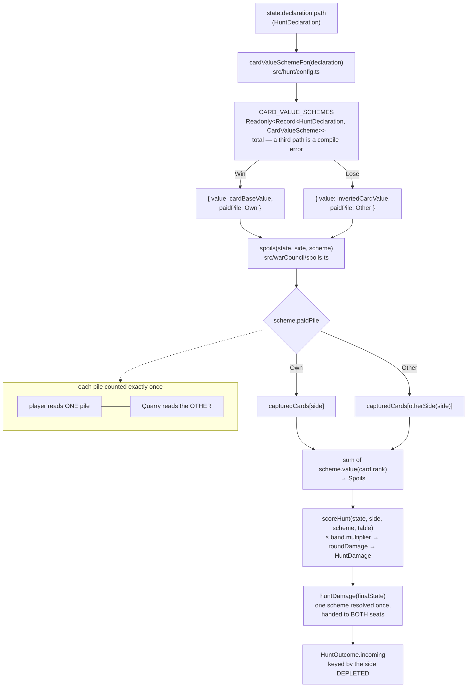

# Plan: The Lose path's pile swap and the two card-value schemes

Plan folder: `.claude/contract/DLR-69-lose-path-pile-swap/`
Execution status: see `tasks.md` in this folder.

---

## Part 1 — Alignment

_(The shared understanding of what this task is doing. Restate it in your own words — this is how the developer confirms the brief was read correctly before any design happens. Mismatch here = stop and fix.)_

### Task reference

**Jira: DLR-69** — "The Lose path's pile swap and the two card-value schemes" (Story, `engine` label, parent epic DLR-65). Status moved `To Do → Planning` at the start of this run.

**Problem statement, verbatim from the ticket:**

> On the Lose path the two capture piles swap **both ways**: the player is paid for the cards the Quarry captured, at inverted value, and the Quarry is paid for the cards the player captured, at inverted value — each pile counted exactly once, by the side that did not win it. DLR-67 left `spoils` valuing each side's own pile as a deliberate interim; this ticket closes it.
>
> §1 records the discarded branch and its reason, and the reason is the edge case that matters: if both sides counted the Quarry's pile, a player who declares Lose and wins zero tricks — executing the plan as well as it can be executed — would finish 78 _behind_ instead of 78 ahead.

**Acceptance criteria, verbatim:**

1. On Win, each side's card value is the sum of its **own** captured cards at printed rank.
2. On Lose, each side's card value is the sum of the **other** side's captured cards at `12 − r`. Each pile is counted exactly once, by the side that did not win it.
3. No modifier of any kind touches either value — no Treasure `+1`, no Poison `−1`. A grep confirms no `CardRank.Treasure` / `CardRank.Poison` branch survives in the value path (§1).
4. The full fourteen-split enumeration from §8 passes under **both** declarations at average card values (a trick's two cards worth ~12), including the four flagged rows: `k = 0` → −78 / +78, `k = 4` → −444 / +444, `k = 9` → +444 / −444, `k = 13` → +78 / −78. This is epic DoD 4.
5. The `k = 0` Lose edge case is asserted explicitly as `+78` to the player — the discarded branch's own falsifier.
6. A test asserts the two card-value schemes are exhaustive over the declaration union, so a third declared path could not silently fall through to a default.
7. `npm run typecheck`, `npm run lint`, `npm run format:check` and the scoped Vitest runs pass.

**Scope boundaries, verbatim:**

> **In scope:** `src/warCouncil/spoils.ts`, the damage module from DLR-68, `types.ts`, `index.ts`, and their tests — including updating DLR-68's provisional Lose-column fixtures to the swapped values.
>
> **Out of scope:** Forage and the deferred "Forage value edits under inversion" question (§9) — there is no Forage in this epic. Health, bars, sequencing, and every UI file.

**Dependencies & risks, verbatim:**

> - **Blocked by DLR-68**, whose Lose-column fixtures this ticket rewrites. The handover is named in DLR-68's AC7 so neither ticket assumes the other's numbers.
> - `invertedCardValue`'s pivot is not a tuning value. `RANK_INVERSION_PIVOT = 12` is `max(RANKS) + 1` for the 1–11 deck, which is what makes the inversion its own mirror and keeps every output inside 1–11. Do not treat it as a knob (`.docs/implementation/hunt/scoring-tunables.md`).
> - **Not playable.** Engine-only; verified by Vitest.

**Design assets named on the ticket:** `.docs/design/Balatro-Forbidden-Solitaire/hybrid-design.md` — the direction section (lines 42–44, the pile swap), §1's declaration subsection (lines 186–214: why the Lose table peaks at 4–6, derived from the swap; and the discarded both-count-the-Quarry's-pile branch), §8's enumeration (lines 1001–1021), §9 line 1074 (Decided 2026-08-11 — the piles swap both ways). Breakdown worklist `.claude/contract/DLR-65-epic-breakdown/tasks.md` (T4).

**Dependency confirmed live, 2026-08-12:** DLR-68's contract at `.claude/contract/DLR-68-two-sided-damage/tasks.md` reads `Status: COMPLETE`, and its damage module is on disk as `src/warCouncil/scoring.ts` (`huntDamage`, `HuntOutcome`, `HuntNotScorableError`). The interim fixture this ticket rewrites is `LOSE_SPLITS_OWN_PILE` at `src/warCouncil/__tests__/huntEnumeration.test.ts:64-79`, labelled in its own comment as DLR-69's to replace. The block is not blocked.

### Restated goal

Close the last interim in §1's equation. Today `spoils` sums whichever pile belongs to the side being scored, under whichever value scheme the declaration puts in force — so on Lose both sides get their own pile at inverted value, which §8's published table says is the wrong pile. This ticket makes the pile a second axis of the declaration alongside the value function: on Win a side is paid for its **own** capture pile at printed rank; on Lose a side is paid for the **other** side's pile at `12 − r`. The two axes stop being separable — a single declaration-keyed "card-value scheme" carries both, so no caller can read the Lose value function against the Win pile, which is precisely the half-applied state the interim leaves reachable today. The evidence that it landed is §8's Lose column passing in full, all fourteen rows, with the `k = 0` row asserted as `+78` to the player rather than the `−78` the discarded branch produces. Engine only — nothing renders, nothing is played, and Vitest is the whole verification story.

### In scope

- A declaration-keyed **card-value scheme** in `src/hunt/config.ts` binding the two axes together: the value function (`cardBaseValue` on Win, `invertedCardValue` on Lose) and which pile a side is paid for (`own` on Win, `other` on Lose), as a total `Record<HuntDeclaration, …>` rather than a ternary, plus a `cardValueSchemeFor` accessor and a re-export from `src/hunt/index.ts`.
- `src/warCouncil/spoils.ts` resolves the pile through `otherSide` when the scheme says `other`, and sums that pile through the scheme's value function. Its third parameter changes from an injectable value function to an injectable scheme.
- `src/warCouncil/scoring.ts` (DLR-68's damage module) threads the scheme instead of a bare value function through `scoreHunt` and `huntDamage`, so both seats are still resolved once from one declaration.
- `src/warCouncil/index.ts` re-exports whatever new names cross the module boundary.
- `src/warCouncil/__tests__/huntEnumeration.test.ts`: `LOSE_SPLITS_OWN_PILE` is replaced by §8's transcribed Lose column, all fourteen rows, with the four flagged rows carried as published (AC4), and `k = 0` asserted explicitly as `+78` net to the player (AC5).
- `src/hunt/__tests__/config.test.ts`: the exhaustiveness test over `Object.values(HuntDeclaration)` — every declaration resolves to a defined value function *and* a defined paid pile, so a third path cannot fall through (AC6).
- `src/warCouncil/__tests__/spoils.test.ts`: the `describe` block that currently asserts "values each side's own pile through `cardValueFor(%s)`" is rewritten to assert own-pile on Win and other-pile on Lose, and the flat-value and Treasure/Poison blocks are re-fitted to the new signature.
- `src/warCouncil/__tests__/scoring.test.ts`: the five `scoreHunt` call sites that inject a value function are re-fitted to inject a scheme, and the DLR-67 both-defaults fixture gains a non-empty Quarry pile so its Lose case stops being vacuous.
- AC3's grep, as a Final-verification step: no `CardRank.Treasure` / `CardRank.Poison` branch in the value path's source files.

### Explicitly out of scope

- **Every UI file.** No `.tsx` file is edited. `WarCouncilRound.tsx:72-73` calls `scoreHunt(ui.round, side)` with no injected arguments and keeps compiling unchanged; the numbers it displays on a Lose-declared Hunt change, which is the intended effect of the ticket rather than a defect. See Risks for the one piece of on-screen copy the swap contradicts.
- **Health, bars, and sequencing.** `PLAYER_START_HEALTH`, `QUARRY_ENCOUNTER_HEALTH`, `quarryHealthForEncounter`, `ENCOUNTER_PLAYER_RESTORE`, and `SIMULTANEOUS_DEPLETION_WINNER` are untouched. Nothing applies damage to a bar in this ticket.
- **Forage**, and §9's deferred "Forage value edits under inversion" question. There is no Forage in this epic.
- **Retuning either multiplier table.** `HUNT_MULTIPLIER_TABLES` is read, never edited. §8's figures are products of those tables; if they were retuned the transcribed fixture would fail, which is the fixture's stated purpose.
- **Changing `RANK_INVERSION_PIVOT`.** Not a tuning value, per the ticket.
- **Renaming `spoils` to `cardValue`.** DLR-68 AC1 asked for that rename and the developer withdrew it on 2026-08-12 (`src/warCouncil/scoring.ts:28-30`); the three read sites are `.tsx` files this ticket may not touch, so the rename would breach the same scope boundary here that it breached there.
- **The `Spoils` type name and the on-screen "Spoils" wording.** Retired as a design term in §1; kept in code and copy for the prototype, per that same withdrawn-rename note.

### Pattern Reference

The brief names the specification rather than a code pattern, so the citations are:

- **`hybrid-design.md` lines 42–44** — the rule itself: "you are paid for the cards **the Quarry** captured, at inverted value, and the Quarry is paid for the cards **you** captured, at inverted value. Each pile is counted exactly once, by the side that did not win it."
- **`hybrid-design.md` lines 208–214** — the discarded branch and the `k = 0` falsifier AC5 operationalises.
- **`hybrid-design.md` lines 1001–1021** — §8's fourteen-row table; the Lose column is transcribed verbatim into the fixture, not derived.
- **`.docs/game_rules/the-hunt.md:274-281`** — the current ruleset entry, which states the own-pile reading and carries the blockquote marking the pile swap `[not built]`. This ticket is what flips it.

Code patterns chosen from what is already on disk (the brief supplied none):

- **`standingTableFor` / `resolveStanding` in `src/hunt/config.ts:60-81`** — the declaration-keyed-accessor-plus-injectable-parameter shape. `cardValueSchemeFor` is the third sibling of `standingTableFor` and `cardValueFor`, and `spoils`'s new third parameter keeps `resolveStanding`'s injectable-for-tests posture.
- **`HUNT_MULTIPLIER_TABLES` at `src/hunt/config.ts:36-53`** — the `Readonly<Record<HuntDeclaration, …>>` shape, where per-declaration facts that genuinely differ are data rows rather than an `if` branch (DLR-66 AC1's reasoning). The scheme record follows it.
- **`huntDamage`'s single resolution of both terms, `src/warCouncil/scoring.ts:149-156`** — the declaration is read once and handed to both seats, so "the Quarry read a different table" is a state the code cannot express. The scheme is threaded the same way, for the same reason.
- **`otherSide` at `src/warCouncil/types.ts:43-45`** — already the codebase's one statement of "the other seat", and already used by `huntDamage` to cross the damage. The pile swap is the same crossing on the other axis.
- **`react-frontend`/`SKILL.md`** for the strict-TypeScript shape (`as const` object map, no `enum` — `erasableSyntaxOnly` is on) and the Vitest posture.

### Constraints flagged on the brief

- **Each pile counted exactly once** (AC2, §1 line 214). The load-bearing invariant. Double-counting the Quarry's pile is the discarded branch, and it inverts the sign at `k = 0`.
- **No modifier of any kind touches either value** (AC3). No Treasure `+1`, no Poison `−1`, verified by grep over the value path.
- **`RANK_INVERSION_PIVOT = 12` is not a tuning value** — it is `max(RANKS) + 1`, which is what makes the inversion its own inverse and keeps every output in 1–11. Not to be exposed as a knob.
- **Both sides read the one declaration** (§1, `hybrid-design.md` lines 67–72). Structural, not incidental: free declaration for both sides makes the mirrored tables cancel and nets zero damage in all fourteen splits.
- **The four flagged rows are published figures** and must appear as published: `k = 0` → +78/0, `k = 4` → 540/96, `k = 9` → 96/540, `k = 13` → 0/78 on the Lose path.
- **Not playable.** Engine-only, Vitest-verified. No QA browser pass is possible or required for the change itself.
- **The purity boundary** on `src/warCouncil/**` and `src/hunt/**` (`eslint.config.js:24`) — no React import, no DOM global. Nothing in this design needs either.
- **Two runtime dependencies.** No new dependency is required.

### Assumptions made

- **`types.ts` / `index.ts` on the ticket's in-scope list mean `src/warCouncil/`'s** — the list qualifies `src/warCouncil/spoils.ts` in full and then names the two bare, and `src/warCouncil/` is the module under discussion. `src/warCouncil/types.ts` in fact needs **no edit** (see the audit); `src/warCouncil/index.ts` needs one only if a new name crosses the module boundary.
- **`src/hunt/config.ts`, `src/hunt/index.ts` and `src/hunt/__tests__/config.test.ts` are a necessary in-scope extension** beyond the ticket's literal list. AC6 asks that "the two card-value schemes are exhaustive over the declaration union, so a third declared path could not silently fall through to a default", and the value axis lives in `cardValueFor` at `src/hunt/config.ts:114-116` as `declaration === Lose ? inverted : base` — a ternary whose third path silently gets `cardBaseValue`. AC6 cannot be honoured without converting that to a total record, and the pile axis has to live beside it or the declaration→value mapping exists in two files. **Flagged in Risks for the developer to overturn** — the alternative, keeping the pile axis in `src/warCouncil/spoils.ts`, stays inside the literal boundary at the cost of leaving AC6 half-satisfied on the value axis.
- **The pile axis belongs in `src/hunt/`, not `src/warCouncil/`.** `src/hunt/` is the Hunt configuration module and already owns both other things the declaration decides (`standingTableFor`, `cardValueFor`); "which pile" is the third. `PaidPile` is `'own' | 'other'` — relative to a side, so it needs no `PlayerSide` import and does not breach `src/hunt/types.ts:26-32`'s no-warCouncil-import rule. `src/warCouncil/spoils.ts` keeps the *resolution* — turning `other` into a concrete seat via `otherSide` — because that needs `PlayerSide`.
- **`spoils`'s and `scoreHunt`'s injectable third parameter becomes the scheme, not a bare value function.** This is the assumption that closes a live trap rather than a cosmetic one: if the pile were read internally from `declaredPath(state)` while the value function stayed injectable, `spoils(state, side, cardValueFor(Lose))` against an undeclared state would silently produce inverted values over the *own* pile — the exact interim this ticket retires, reachable by a caller passing half the scheme. Bundling them makes that unrepresentable. The injectable-for-tests affordance is preserved, which the alternative (inject a bare `declaration`) would have removed.
- **`CARD_VALUE_SCHEMES` is module-private, not exported.** `HUNT_MULTIPLIER_TABLES` is exported but its own comment (`config.ts:55-58`) says nothing outside `src/hunt/` may name it. The new record does not repeat that half-measure: the accessor is the only way in, and the AC6 exhaustiveness test reaches it through `cardValueSchemeFor`, which is a stronger test than reading the record directly because it tests what consumers actually call.
- **`cardValueFor` survives, redefined off the record.** It has three consumers outside the value path — `src/app/warCouncil/DeclareGate.tsx` reads `invertedCardValue` directly, and `src/hunt/__tests__/config.test.ts:151-163` plus `src/warCouncil/__tests__/spoils.test.ts` name `cardValueFor`. Deleting it would touch a `.tsx` file the scope boundary forbids.
- **The pile-selection ternary inside `spoils` stays a ternary**, not a second total record. `PaidPile` is a two-member union declared in the same neighbourhood as its only reader, unlike `HuntDeclaration`, which is a domain type consumed across three modules; AC6 scopes exhaustiveness to "the declaration union". Flagged in Risks.
- **AC4's enumeration stays in `huntEnumeration.test.ts` at average rank 6**, and rank 6 stays the fixture's card. §8's frame is average rank 6, and 6 is the fixed point of the inversion (`12 − 6 = 6`), so a pile is worth the same under both value schemes — which is what lets a `huntDamage(state)` call with no injected function be checked against the design table. Under the swap the *value* still matches across schemes and only the *pile* differs, so the fixture's existing comment needs a correction, not a rewrite.
- **DLR-68's `Net(k) = −Net(13 − k)` antisymmetry property test (`huntEnumeration.test.ts:99-120`) survives the swap unchanged.** Derived, not transcribed: with `Lose(k) = Win(13 − k)` and the swap, `net_Lose(k) = 12(13−k)·W(13−k) − 12k·W(k) = −net_Win(k)`, and each column is separately antisymmetric. Verified against all seven mirror pairs by hand at planning time; no edit planned.
- **No `Spoils` type change.** `Spoils` is `number` (`src/hunt/types.ts:16`) and still means "the summed value of the pile this side is paid for". Its doc comment says "cards captured", which the swap makes imprecise — a comment edit, not a type change.

### Config and persisted-shape audit

Run against the real files with recursive `grep`; counts are actual.

- **`cardValueFor` — every hit accounted for.** 19 hits across 7 files: `src/hunt/config.ts` (1 — the definition), `src/hunt/index.ts` (1 — the re-export), `src/hunt/__tests__/config.test.ts` (4), `src/warCouncil/scoring.ts` (3), `src/warCouncil/spoils.ts` (3, two of them prose in the doc comment), `src/warCouncil/__tests__/scoring.test.ts` (3), `src/warCouncil/__tests__/spoils.test.ts` (4). Every one of those seven files appears in a task's `**Files:**` block. `cardValueFor` is **not** removed or retyped — it is redefined off the new record and keeps its `(declaration) => (rank) => number` signature — so no consumer outside the value path breaks.
- **`invertedCardValue` / `cardBaseValue` / `RANK_INVERSION_PIVOT` — unchanged, and deliberately so.** `invertedCardValue` has hits in `src/app/warCouncil/DeclareGate.tsx:2,16,46` and `src/app/warCouncil/__tests__/DeclareGate.test.tsx:4,24,27`, both out-of-scope UI files. Because the two functions keep their names, signatures and bodies, those six hits need no edit — which is what makes the scope boundary holdable.
- **New names collide with nothing.** `grep -rn "PaidPile\|CardValueScheme\|cardValueSchemeFor"` across `src/` and `.docs/` returns **zero hits**. The one existing name being removed, `LOSE_SPLITS_OWN_PILE`, has exactly **2 hits**, both in `src/warCouncil/__tests__/huntEnumeration.test.ts` (lines 64 and 83), both inside the task that replaces it.
- **Type changes, and what is lost.** Two signature changes, both a narrowing of an optional parameter's type: `spoils`'s third parameter `(rank: number) => number` → `CardValueScheme`, and `scoreHunt`'s third parameter the same. Not a widening and not a required→optional flip — both stay defaulted, so every call site that omits them keeps compiling. The five call sites that *supply* them are all in-scope test files (`scoring.test.ts:44,60,64,94-99`, `spoils.test.ts:46`) and every one is in a task. **No call site outside a test supplies either argument** — verified: `src/app/warCouncil/WarCouncilRound.tsx:72-73` calls `scoreHunt(ui.round, side)` with two arguments, and nothing else in `src/app/` calls `spoils` or `scoreHunt` at all. The compiler catches any miss: a function is not assignable to `CardValueScheme`.
- **Nothing is persisted.** `grep -rn "localStorage\|sessionStorage\|indexedDB\|JSON.parse\|JSON.stringify" src/` returns **zero hits** — no save file, no stored log, no replay, no undo derived from stored state. Recording it here explicitly because that window is still open: a future ticket that persists a Hunt result will be the first to inherit a migration problem from a change like this one, and this one has none.
- **No string-bound surface.** No configuration key is renamed, added, or removed; no `data-testid`, CSS class, `aria-*` id, or reason code is touched. `HuntNotScorable`'s two reason codes (`unfinished`, `undeclared`) are read but not changed. Nothing in this diff binds by string outside the compiler's view.
- **`CardRank.Treasure` / `CardRank.Poison` — 3 hits, all in one test, none a branch.** All three are in `src/warCouncil/__tests__/spoils.test.ts` (lines 60, 61, 67), and they are the fixture and assertion proving no modifier applies. **Zero hits in any value-path source file** — `src/hunt/config.ts`, `src/warCouncil/spoils.ts`, `src/warCouncil/scoring.ts`. AC3 is already true on disk and the Final-verification grep is a regression guard, not a fix.
- **The purity boundary holds.** `grep -rn "from 'react'\|window\.\|document\." src/warCouncil/ src/hunt/` returns **zero hits** today, and the design adds no React import and no DOM global — `PaidPile` is two string literals and the pile resolution is `otherSide`, which is already in the pure tree. The boundary is lint-enforced at `eslint.config.js:24` over `src/warCouncil/**` and `src/hunt/**`, so `npm run lint` is the check.
- **Name alignment across the chain.** `HuntDeclaration` (`src/hunt/types.ts:43-47`) ↔ the new `Record<HuntDeclaration, CardValueScheme>` ↔ `cardValueSchemeFor` ↔ `spoils`/`scoreHunt`/`huntDamage` ↔ the test fixtures. Every link is compiler-checked: a third `HuntDeclaration` member makes the record a missing-key error rather than a silent default, which is AC6's structural half. `noUncheckedIndexedAccess` is **not** set in `tsconfig.app.json`, so indexing a total `Record` with a `HuntDeclaration` yields `CardValueScheme` and not `CardValueScheme | undefined` — the AC6 runtime test is what guards a cast or a widened union past the compiler.

---

## Part 2 — Technical design

### Approach

The change is small and the risk is entirely in one place: the two things the declaration decides about card value — *what a rank is worth* and *whose pile you are paid for* — must never be resolvable independently. Today only the first exists, as `cardValueFor(declaration)`, and `spoils` reads the second implicitly by always summing `capturedCards[side]`. Adding the second axis as another free parameter would create a genuinely bad state: `spoils(state, side, cardValueFor(Lose))` against a state whose own declaration is absent or Win would apply inverted values to the own pile, which is exactly the interim §1 retires, reachable by a caller who supplied half the answer and let the other half default from a different source. So the two axes are bound into one **`CardValueScheme`** — `{ value, paidPile }` — resolved from a declaration by a single accessor, and that scheme is what travels through `spoils` and `scoreHunt` in place of the bare value function.

The scheme's home is `src/hunt/config.ts`, beside the two accessors that already answer the declaration's other questions. It is a `Readonly<Record<HuntDeclaration, CardValueScheme>>`, module-private, reached through `cardValueSchemeFor`. Making it a total record rather than a ternary is what satisfies AC6 structurally: a third `HuntDeclaration` member becomes a missing-property compile error instead of silently inheriting `cardBaseValue`, which is what the current `declaration === Lose ? inverted : base` would do. `cardValueFor` is then redefined as `CARD_VALUE_SCHEMES[declaration].value` so the declaration→value mapping exists exactly once, and its three out-of-scope consumers — chiefly `DeclareGate.tsx` — keep compiling untouched. This is the one place the plan reaches past the ticket's literal file list, and Risks says so.

`src/warCouncil/spoils.ts` does the half that needs a seat rather than a relative direction: `paidPile === PaidPile.Other ? otherSide(side) : side`, then a sum of that pile through `scheme.value`. `otherSide` is already the codebase's single statement of "the other seat" and `huntDamage` already uses it to cross the damage; the pile swap is the same crossing on the other axis, which is why "each pile counted exactly once" needs no counter, no set, and no bookkeeping — it is a consequence of each side reading exactly one pile and the two sides reading different ones. `src/warCouncil/scoring.ts` changes by two lines of type and one line of resolution: `huntDamage` resolves `cardValueSchemeFor(declaration)` once and hands the same object to both seats, preserving DLR-68's structural guarantee that the Quarry cannot read a different scheme. All of it stays pure — no React, no DOM, no new dependency — and all of it is unit-testable with no renderer, which is where every AC is verified.

**Two alternatives, both rejected, because the road not taken is the more useful half of this section.** First, **inject a bare `declaration`** instead of a scheme: `spoils(state, side, declaration = declaredPath(state))`. Simpler, and it makes mixing impossible by construction rather than by discipline — but it deletes an affordance the codebase deliberately built and documents ("overridable only for tests, mirroring `resolveStanding`'s injectable-table pattern"). Three existing specs hold card value flat at `() => 1` to isolate the multiplier axis; under a declaration parameter they would have to be rebuilt on rank-1 card fixtures, and no test could ever hold value flat while varying the pile. The scheme keeps both axes injectable while making them inseparable, which is strictly more capable for the same size. Second, **keep the pile axis in `src/warCouncil/spoils.ts`** and leave `cardValueFor` alone: strictly inside the ticket's literal scope, but it puts the declaration→pile mapping in one module and the declaration→value mapping in another, and it leaves AC6's "could not silently fall through to a default" true of the pile axis and false of the value axis — half an acceptance criterion, in the file the criterion is about.

The test work is where the ticket's evidence actually lives, and it is mostly rewriting, not adding. `huntEnumeration.test.ts`'s `LOSE_SPLITS_OWN_PILE` is deleted and replaced by §8's transcribed Lose column; the four flagged rows appear as published, and the `k = 0` row gets its own explicit assertion naming `+78` and citing the discarded branch, so the falsifier is a named test rather than one row of an `it.each`. The Lose column was checked row by row against the tables and the swap during planning and all fourteen agree with `hybrid-design.md:1003-1016` — the fixture is transcribed, and the arithmetic was reproduced only to confirm the transcription is the one the code will produce. `spoils.test.ts`'s own-pile `describe` block inverts. `scoring.test.ts`'s five injecting call sites re-fit, and its DLR-67 both-defaults fixture gains a Quarry pile so the Lose case is no longer vacuously zero. `config.test.ts` gains AC6's exhaustiveness test over `Object.values(HuntDeclaration)`.

### Skills to invoke during execution

- **`react-frontend`** — owns everything under `src/`. Governs the `as const` object-map form for `PaidPile` (**no `enum`, no `namespace`** — `erasableSyntaxOnly` is on in `tsconfig.app.json:23`), the strict-TypeScript shape of `CardValueScheme` and the `Readonly<Record<…>>`, the pure-module placement inside the `src/warCouncil/**` + `src/hunt/**` boundary, the ≤400-line file budget, and the Vitest posture — pure logic tested with no renderer, specs under `src/**/__tests__/`, `.test.ts` collected by the `node` project per `vite.config.ts`. Its "read the nearest existing equivalent first" rule points at `standingTableFor` / `HUNT_MULTIPLIER_TABLES`, which is where every shape in this plan came from.
- **`game-designer`** — owns the reading of the design document, which is the only place this ticket can go wrong in a way the compiler cannot see. Specifically: whether §8's Lose column is being transcribed correctly (all fourteen rows, the four flagged ones as published), and whether `k = 0 → +78` is genuinely the discarded branch's falsifier rather than a number that happens to appear in the table. Its "enumerate before you reason" method is what AC4's fixture operationalises. It decides no tuning value — there is none in this ticket, and `RANK_INVERSION_PIVOT` is explicitly not one.
- **`implementation-doc-writer`** — confirmed by the developer at the Step 1.5c gate. Owns `.docs/implementation/` and `.docs/game_rules/the-hunt.md`. This contract **does** change a game rule, so its Step 1 check is a yes, not a formality: `the-hunt.md:274-281` currently states "Each side's Spoils is the sum of the cards in its own capture pile" and carries a blockquote marking the pile swap `[not built]`. That marker flips and that prose inverts. `.docs/implementation/hunt/scoring-tunables.md:53` and `:90` and `.docs/implementation/war-council/scoring.md` also describe the own-pile reading. `/fb-apply` invokes this skill at the end of the run; it is listed here so the execution session knows the doc work is expected rather than optional.
- **`game-ux`** — **developer override, added at the Step 1.5c gate.** It was not proposed: this ticket edits no `.tsx` file and renders nothing, and the scope boundary puts "every UI file" out. Honest scope for it here: nothing. Its one applicable line is the verification limit it owns — no Vitest test can prove anything about layout — which is moot when nothing lays out. Worth one use: if the executor finds itself about to edit a `.tsx` file, that is the signal the scope boundary has been breached, and this skill's presence in the list is the reminder to stop and raise it rather than proceed.

Also read before execution: **`.claude/workflow/web-project.md`** — paths, the runner table, and the four non-defect failure modes: Vitest watch-mode hangs (always `vitest run`), `Select-String -Path` not recursing (`**` matches exactly one directory level — use `Get-ChildItem -Recurse | Select-String` for anything spanning more than one directory), the cold-cache `dom`-project worker timeout, and the pre-existing repo-wide `format:check` failure on `.docs/**` (gate on `npx prettier --check` scoped to this contract's files).

**Shared rules:** `.claude/rules/` was scanned and contains only `README.md` — no rule files exist, so no reject conditions apply. Re-scan rather than assuming that still holds.

**Developer override note:** the Step 1.5c gate proposed `react-frontend` and `game-designer`; the developer additionally ticked `implementation-doc-writer` and `game-ux`. Both are recorded above with the scope each actually has.

### Diagram



### Data shapes

#### `src/hunt/config.ts` — new

```ts
/**
 * Whose capture pile a side is paid for, stated RELATIVE to that side so this union needs no
 * `PlayerSide` and `src/hunt/` stays free of any `src/warCouncil/` import (types.ts:26-32).
 * Resolving `Other` into a concrete seat is `src/warCouncil/spoils.ts`'s job, via `otherSide`.
 */
export const PaidPile = {
  Own: 'own',
  Other: 'other',
} as const
export type PaidPile = (typeof PaidPile)[keyof typeof PaidPile]

/**
 * The two halves of §1's card-value rule, bound so neither can be read without the other.
 * Deliberately not two parameters: a caller who injected `cardValueFor(Lose)` while the pile
 * defaulted from an undeclared state would get inverted values over the OWN pile — the exact
 * interim DLR-69 retires, produced by a caller supplying half the scheme.
 */
export interface CardValueScheme {
  readonly value: (rank: number) => number
  readonly paidPile: PaidPile
}

/**
 * §1's card-value rule as data, per declaration. A total `Record`, not a ternary: a third
 * `HuntDeclaration` member is a missing-property compile error rather than a silent fall
 * through to `cardBaseValue` and the own pile (DLR-69 AC6).
 *
 * Module-private. `HUNT_MULTIPLIER_TABLES` is exported and then documented as unusable outside
 * `src/hunt/`; this record does not repeat that half-measure — `cardValueSchemeFor` is the only
 * way in, and the AC6 test reaches it through the accessor.
 */
const CARD_VALUE_SCHEMES: Readonly<Record<HuntDeclaration, CardValueScheme>> = {
  [HuntDeclaration.Win]: { value: cardBaseValue, paidPile: PaidPile.Own },
  [HuntDeclaration.Lose]: { value: invertedCardValue, paidPile: PaidPile.Other },
}

/** The third sibling of `standingTableFor` and `cardValueFor`: name a declaration, get both
 *  halves of the card-value rule as one inseparable object. */
export function cardValueSchemeFor(declaration: HuntDeclaration): CardValueScheme {
  return CARD_VALUE_SCHEMES[declaration]
}
```

#### `src/hunt/config.ts` — changed

```ts
// WAS: return declaration === HuntDeclaration.Lose ? invertedCardValue : cardBaseValue
// Signature and behaviour unchanged for both existing declarations; now derived from the record
// so the declaration -> value mapping exists exactly once, and a third path cannot default.
export function cardValueFor(declaration: HuntDeclaration): (rank: number) => number {
  return CARD_VALUE_SCHEMES[declaration].value
}
```

#### `src/hunt/index.ts` — added to the existing `./config` export block

```ts
export type { CardValueScheme } from './config'
export { PaidPile, cardValueSchemeFor } from './config'
```

#### `src/warCouncil/spoils.ts` — changed signature

```ts
// WAS: cardValue: (rank: number) => number = cardValueFor(declaredPath(state))
export function spoils(
  state: RoundState,
  side: PlayerSide,
  scheme: CardValueScheme = cardValueSchemeFor(declaredPath(state)),
): Spoils
```

#### `src/warCouncil/scoring.ts` — changed signature

```ts
// WAS: cardValue: (rank: number) => number = cardValueFor(declaredPath(state))
export function scoreHunt(
  state: RoundState,
  side: PlayerSide,
  scheme: CardValueScheme = cardValueSchemeFor(declaredPath(state)),
  standingTable: readonly StandingBand[] = standingTableFor(declaredPath(state)),
): HuntDamage
```

`huntDamage`'s signature is unchanged (`(finalState: RoundState) => HuntOutcome`); its body resolves `cardValueSchemeFor(declaration)` in place of `cardValueFor(declaration)` and passes it to both `scoreHunt` calls. `HuntDamage`, `HuntOutcome`, `HuntNotScorable`, and `HuntNotScorableError` are unchanged.

#### `src/warCouncil/index.ts` — re-export

No new `src/warCouncil` name is created, so nothing is added. `spoils` and `scoreHunt` are already exported (`index.ts:26,30`) and their exported *names* do not change; a consumer that wanted to supply the new third argument would import `CardValueScheme` from `../hunt`, which `src/hunt/index.ts` now provides. **If execution finds a consumer that needs it re-exported through `src/warCouncil/index.ts`, that is a one-line addition in Task 3** — the audit found none.

#### Unchanged, listed so nothing is assumed to have moved

`Spoils = number`, `Standing = number`, `Damage = number` (`src/hunt/types.ts:16,19,24`); `HuntDeclaration` (`:43-47`); `RANK_INVERSION_PIVOT = 12`, `cardBaseValue`, `invertedCardValue`, `HUNT_MULTIPLIER_TABLES`, `standingTableFor`, `resolveStanding`, `roundDamage`, and every health constant in `src/hunt/config.ts`; `DeclarationState`, `RoundState`, `declaredPath`, `otherSide`, `PlayerSide`, `TRICKS_PER_ROUND`, `CardRank` in `src/warCouncil/types.ts`.

#### Test fixture — `src/warCouncil/__tests__/huntEnumeration.test.ts`

```ts
// TRANSCRIBED from hybrid-design.md §8, lines 1003-1016, Lose column — all fourteen rows.
// Replaces DLR-68's interim LOSE_SPLITS_OWN_PILE (DLR-68 AC7's named handover).
// `[k, damage the player deals, damage the Quarry deals]`.
const LOSE_SPLITS: readonly Split[] = [
  [0, 78, 0],
  [1, 72, 12],
  [2, 66, 24],
  [3, 60, 36],
  [4, 540, 96],
  [5, 480, 180],
  [6, 420, 288],
  [7, 288, 420],
  [8, 180, 480],
  [9, 96, 540],
  [10, 36, 60],
  [11, 24, 66],
  [12, 12, 72],
  [13, 0, 78],
]
```

No `package.json`, `tsconfig`, `vite.config.ts`, or `eslint.config.js` change. **No new configuration key, and therefore no unchosen tuning value anywhere in this contract.**

### Runtime quality notes

- **Purity and adjudication.** Every file in the diff is inside the lint-enforced pure core (`eslint.config.js:24` over `src/warCouncil/**` and `src/hunt/**`). No React import, no DOM global, no `Math.random()`, no I/O — `PaidPile` is two string literals and the pile resolution is `otherSide`, already in the pure tree. The split of authority is deliberate: `src/hunt/` states the rule as data (which value function, which pile, per declaration) and decides nothing about seats; `src/warCouncil/spoils.ts` resolves a relative pile into a concrete seat and decides nothing about the rule. No component decides any of it — `WarCouncilRound.tsx` asks `scoreHunt` and formats the answer. Nothing here is a tunable, so there is nothing to read from configuration that is not already read from it.
- **Effects, mount and teardown.** Nothing applies. No effect, listener, observer, timer, `requestAnimationFrame`, `AbortController`, or pointer capture is created, and no component is edited. StrictMode double-invocation is not reachable: every function in the diff is a pure function of its arguments called during render or in a test, never in an effect. **No module-level mutable state is introduced** — `CARD_VALUE_SCHEMES` is a `const` holding a frozen-by-convention `Readonly<Record<…>>` of object literals whose `value` fields are references to two existing top-level function declarations; nothing writes to it, so there is nothing to reset between tests in a file or across an HMR update. `src/hunt/config.ts` already holds a dozen such module-level `const`s on exactly this basis.
- **Hot-path cost.** No pointer event, no per-frame work, no high-frequency value. `spoils` is one `reduce` over at most 26 cards, called twice per finished Hunt from `huntDamage` and twice per render from `WarCouncilRound.tsx:72-73`. The swap does not change the cost class: it changes *which* array of ≤26 is reduced, not how many reductions happen or how long each is. `cardValueSchemeFor` is a single record index returning a shared object — it allocates nothing per call, which is why the record holds pre-built scheme objects rather than constructing `{ value: cardValueFor(d), paidPile: … }` on each call. Nothing is memoised and nothing needs to be; no profiling evidence exists and none is claimed.
- **Determinism and numeric safety.** Fully deterministic — no `Math.random()` is reachable from anything in the diff, and no seed is involved. **Nothing divides**, so no epsilon is needed and no guarded divisor exists to get wrong; the arithmetic is one `+` per card and one `*` per side. `NaN` is reachable in exactly one way, and it is closed: a `card.rank` that is not a number would poison the sum and then the product, and `roundDamage` (`src/hunt/config.ts:149-154`) throws `RangeError` on a non-finite input rather than letting it reach a health bar — which is the existing guard this change sits behind and does not weaken. The `×0.5` bands produce a genuine half-integer, which is exactly what `roundDamage`'s `Math.sign(raw) * Math.round(Math.abs(raw))` exists for, and every one of §8's twenty-eight figures is an integer, so the AC4 fixture is not covertly testing rounding.
- **Error paths.** Nothing new throws and nothing new catches — **there is no `try`/`catch` anywhere in the diff**, so there is no path on which a failure could be swallowed into a success shape. The two existing refusals are preserved exactly: `huntDamage` throws `HuntNotScorableError(Unfinished | Undeclared)` rather than returning `damage: 0`, because a zero is indistinguishable from a legitimately scoreless Hunt and would be applied to a bar as authorised damage; and `resolveStanding` throws `RangeError` on a trick count outside 0–13. Both are re-asserted by existing specs (`scoring.test.ts:146-186`) that this contract does not touch, and the swap creates no new refusal — an undeclared round still reads as Win through `declaredPath` for the *readouts* and still throws in `huntDamage` for *scoring*, unchanged. No async surface is introduced, so the four async states do not arise. AC6's runtime exhaustiveness assertion is the one new failure mode surfaced, and it fails as a test rather than at runtime, which is the point of having it.

### Risks and judgement calls

- **The one real scope decision: `src/hunt/config.ts` is edited, and the ticket's file list does not name it.** AC6 asks that no third declared path could silently fall through to a default, and the value axis's fall-through lives in `cardValueFor`'s ternary in that file. Three ways to go, and this is the developer's call: **(a)** as planned — extend to `src/hunt/config.ts` + `index.ts` + `__tests__/config.test.ts`, satisfying AC6 on both axes with one record; **(b)** keep everything in `src/warCouncil/spoils.ts`, honouring the literal boundary but leaving AC6 true of the pile axis and false of the value axis, and putting the two halves of one rule in two modules; **(c)** duplicate the declaration→value mapping into a warCouncil-side record, which stays in scope and creates a second source of truth for "printed rank on Win, `12 − r` on Lose" that will drift. The plan takes **(a)** and rejects **(c)** outright.
- **On-screen copy the swap makes factually wrong, in a file this ticket may not touch.** `src/app/warCouncil/DeclareGate.tsx:46-47` currently reads: "Cards invert — a 1 scores 11. Every trick you take still adds both its cards to **your** Spoils, at those inverted values." Under the swap a trick you take adds its cards to the **Quarry's** value, not yours — the sentence states the opposite of the rule, and it is the sentence a player reads at the moment they choose the path. Every UI file is out of scope, so DLR-69 cannot fix it. Three options: accept a wrong sentence in the prototype until the UI ticket lands; widen this ticket by one file for a copy-only edit; or file a follow-up now. **The developer's call, and the copy itself is theirs to write either way.** `HuntLedger.tsx:34-37`'s "Running Spoils" and `RoundOverPanel.tsx:87-90`'s "Spoils" labels are neutral enough to survive — they name the additive term without claiming whose cards it came from — but on a Lose-declared Hunt they will now display the Quarry's pile value under the player's heading, which is a *judgement* call about whether the readout reads honestly and can only be answered by playing it.
- **`spoils`'s and `scoreHunt`'s third parameter changes type, which is a small public-API break.** Both stay defaulted so every omitting call site is unaffected, and the compiler catches every supplying one (a function is not assignable to `CardValueScheme`). The audit found all five supplying call sites and all five are in-scope tests. Worth a sanity-check that binding the axes together is the shape wanted, versus the simpler `spoils(state, side, declaration)` — which is genuinely tidier but removes the ability to hold card value flat while varying anything else, and would force three existing specs onto rank-1 card fixtures.
- **The pile-selection ternary in `spoils` is not exhaustive over `PaidPile`.** A hypothetical third `PaidPile` member would fall through to the own pile. Deliberate: `PaidPile` is a two-member union declared beside its only reader, AC6 scopes exhaustiveness to the *declaration* union, and a `Record<PaidPile, (side) => PlayerSide>` of functions reads worse than the ternary for no gain the compiler cannot already give. Say so if you want the record anyway.
- **The AC4 fixture is transcribed, so a table retune breaks it — by design.** §8's twenty-eight figures are products of `HUNT_MULTIPLIER_TABLES`. If the developer retunes either table, this fixture fails, and that is its stated job (it is the canary; `Net(k) = −Net(13 − k)` is the property that survives retuning). Worth knowing before a future tuning pass reads a red suite as a defect.
- **`scoring.test.ts:86-105`'s Lose case is currently vacuous under the swap and the plan changes its fixture.** Its state has `cpu: []`, so post-swap the Lose branch scores the player off an empty pile — 0, and the test still passes because both the explicit and defaulted calls agree on 0. Giving the Quarry a pile makes it prove something. This is a test-strengthening judgement, not an AC; call it out if you would rather the fixture stay as DLR-67 left it.
- **Nothing here can be judged by playing, and nothing needs QA in a browser.** The ticket says "Not playable. Engine-only; verified by Vitest", and that is accurate: no surface changes, so there is no interaction feel, no layout, and no viewport question. The only developer-owned items in this contract are the two scope/copy calls above — **there is no unchosen tuning value anywhere in it**, and `RANK_INVERSION_PIVOT` is explicitly not one.
- **`the-hunt.md` and three implementation docs go stale the moment this lands.** `.docs/game_rules/the-hunt.md:274-281` states the own-pile reading and marks the pile swap `[not built]`; `.docs/implementation/hunt/scoring-tunables.md:53,90` and `.docs/implementation/war-council/scoring.md` describe the interim. `/fb-apply` invokes `implementation-doc-writer` at the end of the run, which owns all four — flagged here so a green suite is not mistaken for a finished ticket.
