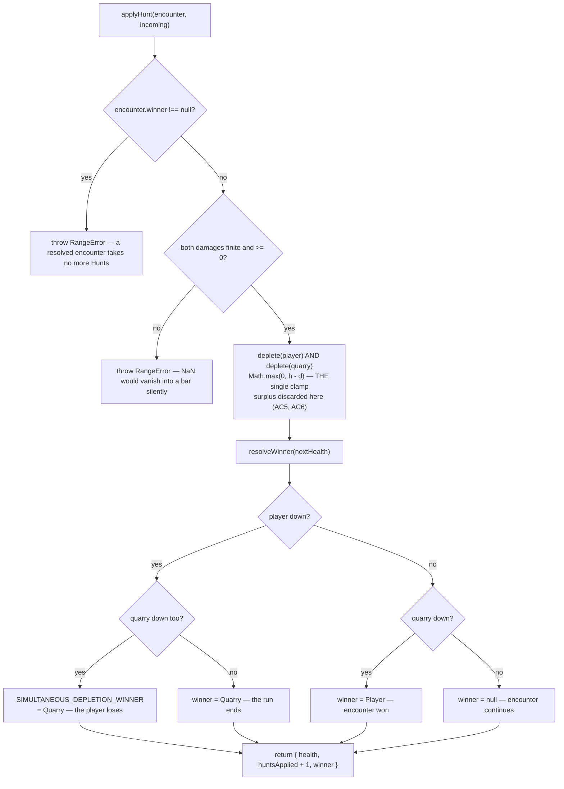

# Plan: Encounter state — two health bars, damage application, and the end conditions

Plan folder: `.claude/contract/DLR-70-encounter-state-health-and-end-conditions/`
Execution status: see `tasks.md` in this folder.

---

## Part 1 — Alignment

### Task reference

[DLR-70](https://amazerbeam.atlassian.net/browse/DLR-70) — _Encounter state: two health bars, damage application, and the end conditions_ · Story · High · label `engine` · parent epic [DLR-65](https://amazerbeam.atlassian.net/browse/DLR-65) · T5 of `.claude/contract/DLR-65-epic-breakdown/tasks.md`.

**Acceptance criteria, verbatim:**

1. An encounter state holds both sides' current health, initialised from DLR-66's configured totals, and an applied-Hunt count.
2. Applying a finished Hunt's `huntDamage` reduces each side's health by the _other_ side's damage, once, at the end of the thirteenth trick — never per trick.
3. **Pending damage** is derivable at any point mid-Hunt for both sides, from the tricks captured so far, as the same equation evaluated early. It is shown but not applied, and it is one function — not a second arithmetic path that could drift from the applied total (epic DoD 7).
4. The encounter resolves the moment a bar reaches zero or below: the Quarry's alone → won; the player's alone → the run ends; **both on the same Hunt → the player loses** (§5, §9, via DLR-66's `SIMULTANEOUS_DEPLETION_WINNER`).
5. Surplus damage past a depleted bar is **discarded**, not carried and not converted (§9 Deferred). Asserted by test so the discard is a chosen rule rather than an accident of arithmetic.
6. Health never renders or reports as negative; the underlying value clamps at zero at exactly one place.
7. There is **no** Hunt cap. An encounter runs as many Hunts as it takes, by choice — the stall is the evidence a cap is needed (§11).
8. Vitest covers: a fast-band encounter resolving in 3–4 Hunts at 7–9 tricks; a tail encounter running 18–23 Hunts at 0–3 or 10–13 tricks; the exact-simultaneous-depletion case; and the `P = H` boundary property at the 6/7 line — 7 tricks a Hunt wins on Hunt 4 with 486 left, 6 tricks loses on Hunt 4.
9. `npm run typecheck`, `npm run lint`, `npm run format:check` and the scoped Vitest runs pass.

**Scope boundaries, verbatim.** In scope: a new encounter module under `src/hunt/` (pure, inside the lint-enforced no-React boundary), `src/hunt/types.ts`, `index.ts`, and tests. Out of scope: the health bars on screen, the two-encounter sequence and carry-over, the CPU, and the Hunts-per-encounter cap `R`.

**Dependency, resolved.** The ticket is "Blocked by DLR-68 for `huntDamage`". `.claude/contract/DLR-68-two-sided-damage/tasks.md` reads `Status: COMPLETE`, and `huntDamage` is on disk at `src/warCouncil/scoring.ts:137`. The block is cleared.

**Follow-up decision confirmed interactively (2026-08-12).** AC3's pending damage needs §1's equation evaluated against a mid-Hunt `RoundState`, which `src/hunt/` cannot reach. The developer approved extending the file map into `src/warCouncil/scoring.ts` to add a pending-damage entry point sharing `huntDamage`'s exact code path, rather than leaving AC3 to the UI ticket or to a hand-rolled crossing at the call site.

### Restated goal

An encounter is a sequence of Hunts fought until one health bar empties, and nothing in this repository currently holds state that outlives a single `RoundState`. This ticket builds the pure arithmetic core of that sequence: a small immutable `EncounterState` holding both sides' health and the count of Hunts applied, a single `applyHunt` transition that subtracts each side's incoming damage once and resolves the encounter the instant a bar hits zero, and a single clamp point that makes surplus damage vanish rather than accumulate as negative health. Alongside it, the same §1 equation that produces the applied total is given a second, guard-free entry point so a mid-Hunt readout can show pending damage without a second arithmetic path existing anywhere in the program. Nothing renders — this is engine work verified entirely by Vitest, and the health bars, the encounter sequence, the CPU, and the Hunt cap all belong to later tickets.

### In scope

- A new pure module `src/hunt/encounter.ts` holding `startEncounter`, `applyHunt`, and `isEncounterResolved`, with the zero-clamp and the winner resolution each stated exactly once inside it.
- `EncounterState` and `IncomingDamage` added to `src/hunt/types.ts`, and both plus the three functions re-exported from `src/hunt/index.ts`.
- Initialisation from DLR-66's shipped configuration — `quarryHealthForEncounter(index)` and `PLAYER_START_HEALTH` — rather than from literals (AC1).
- Winner resolution reading `SIMULTANEOUS_DEPLETION_WINNER` for the both-bars-empty case, so the ruling is data, not an unexplained `if` (AC4).
- `pendingHuntDamage(state)` added to `src/warCouncil/scoring.ts`, returning the same `HuntOutcome` shape from the same private helper `huntDamage` calls, with the phase guard omitted and undeclared returning `null` (AC3).
- `duelSideDamage(outcome)` added to `src/warCouncil/scoring.ts` — the one `PlayerSide` → `DuelSide` adapter, preserving `incoming`'s applied-to keying, so no caller re-derives the crossing.
- Vitest coverage of all four AC8 scenarios plus the AC5 discard, the AC6 non-negativity property, and an AC3 no-drift assertion that `pendingHuntDamage` deep-equals `huntDamage` on a finished Hunt.

### Explicitly out of scope

- Any `.tsx` file, any CSS, and any rendering of health — the bars are DLR-71 (T6).
- The two-encounter sequence, `ENCOUNTER_PLAYER_RESTORE`, and carry-over between encounters — DLR-73 (T8). `startEncounter` takes an encounter index but sequences nothing.
- A Hunts-per-encounter cap `R`. AC7 states there is deliberately none; no cap key is added and none is read.
- Any change to the CPU, to `scoreHunt`'s arithmetic, to the multiplier tables, or to any tuning value in `src/hunt/config.ts`.
- Wiring the encounter into `src/App.tsx` or `WarCouncilRound.tsx`. Nothing in the app calls the new module when this ticket closes; that is DLR-71's job and is why the ticket is not labelled `playable`.
- Overkill conversion (cash or otherwise). §9 records it Deferred; AC5 requires the discard be asserted, not designed away.

### Pattern Reference

- **`src/warCouncil/scoring.ts`** — the immediate sibling and the shape to match: an interface documenting *why* its keying is what it is, injectable terms defaulted from a single accessor, and a guard that throws rather than returning a plausible zero. `huntDamage:137-171` is the function this plan refactors behind.
- **`src/hunt/config.ts:225-233`** (`quarryHealthForEncounter`) — the house guard posture for the pure tree: a bare `RangeError` on a caller bug, with the comment stating the `NaN`-into-a-health-bar failure mode it exists to prevent. `startEncounter` and `applyHunt` follow it.
- **`src/app/warCouncil/standingSegments.ts:18-29`** — the opposite posture, and the precedent for `pendingHuntDamage` returning rather than throwing: a readout drawn on every render must not blank the screen, which is explicitly contrasted there against `huntDamage`, "which throws because it commits damage".
- **`src/warCouncil/__tests__/huntEnumeration.test.ts`** — the all-rank-6 fixture convention (mean of ranks 1–11 is exactly 6) that makes a trick worth 12 and the enumeration figures fall out cleanly. This plan's damage numbers use the same convention.
- **`.claude/skills/react-frontend/SKILL.md`** — invoked, and the authority on conventions; not restated here.

### Constraints flagged on the brief

- **The pure-core boundary.** `src/hunt/**` and `src/warCouncil/**` are covered by the `no-restricted-imports` / `no-restricted-globals` override in `eslint.config.js:23-55`. No React, no DOM global, in any file this plan touches.
- **`src/hunt/` may not import `src/warCouncil/`.** Not lint-enforced, but stated at `src/hunt/types.ts:26-32`: warCouncil already imports hunt, so the reverse edge is a cycle. This constraint is what shapes the whole design.
- **`erasableSyntaxOnly` is on** — no `enum`, no constructor parameter properties. New named sets use the `as const` object-map form.
- **Determinism.** Nothing here reaches `Math.random()`; the encounter module is pure arithmetic over numbers and the tests need no seed. The AC8 tail scenario is a bounded loop, not a simulation — see Approach.
- **Two runtime dependencies.** Nothing in this plan adds a third.
- **AC8's stated figures are the acceptance test**, not illustrations: 3–4 Hunts in the fast band, 18–23 in the tail, and the 486-remaining figure at the 6/7 boundary. They are reproduced arithmetically in Data shapes and one of them needs a reading confirmed — see Risks.

### Assumptions made

- **`EncounterState` and `IncomingDamage` go in `src/hunt/types.ts`, the behaviour in `src/hunt/encounter.ts`.** The ticket names `types.ts` in scope, `Health` and `DuelSide` already live there, and DLR-73's run module will need `EncounterState` without needing `applyHunt`. The alternative — co-locating both with the functions, as `scoring.ts` does with `HuntOutcome` — is equally house-style; this split follows the ticket's own file list.
- **The resolution is modelled as `winner: DuelSide | null`, not a three-value outcome enum.** AC4 names three cases but only two results, and `SIMULTANEOUS_DEPLETION_WINNER` is already *typed* `DuelSide` and *named* winner — so the tie case becomes a direct read of the constant rather than a mapping onto a second vocabulary. `winner === DuelSide.Player` is the encounter won; `DuelSide.Quarry` is the run ending.
- **`applyHunt` takes plain `IncomingDamage` numbers, not a `HuntOutcome`.** Forced by the no-cycle rule — `HuntOutcome` is keyed by `PlayerSide`, which lives in warCouncil. `duelSideDamage` is the adapter, and it lives on the warCouncil side because that is the side that may import hunt.
- **`pendingHuntDamage` returns `null` for an undeclared Hunt rather than defaulting to Win via `declaredPath`.** The Win default is right for the Standing track, which shows *which table is in force*; it is wrong for a damage figure, because showing a number no declaration authorises is the same error `huntDamage`'s `Undeclared` guard exists to prevent. Nothing to show is the honest answer.
- **`applyHunt` on an already-resolved encounter throws `RangeError`.** AC7 removes the *cap*, not the terminal state. A silent no-op would let a caller's loop spin forever with `huntsApplied` frozen; a throw names the caller bug. Matches `quarryHealthForEncounter`'s posture.
- **Damage is guarded as finite and non-negative, not as an integer.** `DAMAGE_ROUNDING` has a `None` setting under which a ×0.5 band legitimately produces a half-point total, so an integer guard would break a supported configuration. Non-finite is guarded because `NaN` in a health bar renders nothing and logs nothing.
- **`isEncounterResolved` is `winner !== null`, exported rather than left to callers.** One statement of what "resolved" means, so DLR-71's render guard and DLR-73's loop condition cannot disagree.
- **AC8's four scenarios are tested with hand-computed damage constants, not by simulating tricks.** The tail case is then 23 arithmetic steps rather than 299 simulated tricks, which retires the ticket's own "long-running simulation" risk. The constants' derivation is shown in Data shapes and re-derived in a comment in the spec.
- **`ENCOUNTER_PLAYER_RESTORE` is not read by this ticket.** It applies *between* encounters, which is DLR-73's scope. Naming it here would put a second reader on a key whose semantics that ticket has not yet fixed.

### Config and persisted-shape audit

- **`PLAYER_START_HEALTH`** — 5 hits across `src/**`, in exactly three files: `src/hunt/config.ts` (declaration), `src/hunt/index.ts` (re-export), `src/hunt/__tests__/config.test.ts`. **No reader outside `src/hunt/` exists yet**; `src/hunt/encounter.ts` becomes the first. No rename, no retype.
- **`quarryHealthForEncounter`** — 7 hits, same three files. **`QUARRY_ENCOUNTER_HEALTH`** — 7 hits, same three files. Both consumed as-is; the plan adds a caller, not a change.
- **`SIMULTANEOUS_DEPLETION_WINNER`** — 4 hits: `config.ts:244` (declaration), `index.ts:28` (re-export), `config.test.ts:28,328` (asserts it is `DuelSide.Quarry`). `encounter.ts` becomes its first production reader. The existing config test stays the single assertion of its *value*; the encounter spec asserts the *rule* by comparing against the constant, so the two cannot drift.
- **`ENCOUNTER_PLAYER_RESTORE`** — 5 hits, same three files. Deliberately untouched (out of scope, DLR-73).
- **`DuelSide`** — 7 hits, all inside `src/hunt/`. This plan puts its first uses in `src/warCouncil/` (`duelSideDamage`) and in `src/hunt/encounter.ts`. Import direction is legal: warCouncil already imports hunt at `scoring.ts:1-12` and `types.ts:1`.
- **Nothing is persisted.** `Select-String` across `src/**` for `localStorage`, `sessionStorage`, `JSON.parse`, and `JSON.stringify` returns **0 hits**. There is no save file, no stored log, and no replay source, so no migration is possible or needed. **Recording that the window is open:** `EncounterState`'s shape is free to change at zero cost today; the first thing that serialises it closes that window, and this note is what a later change should look for.
- **New names, zero existing hits** — `EncounterState`, `IncomingDamage`, `startEncounter`, `applyHunt`, `isEncounterResolved`, `pendingHuntDamage`, `duelSideDamage` all return 0 hits across `src/**`. Every one is new; none collides.
- **Type changes: none.** No existing type is widened, narrowed, or re-keyed. `HuntOutcome` and `HuntDamage` keep their exact shapes and their `PlayerSide` keying — `pendingHuntDamage` returns `HuntOutcome | null`, a new signature on a new function, not a change to `huntDamage`'s. Its 3 hits (`scoring.ts:83,137`, `index.ts:27`) are unaffected.
- **No string-bound surface.** No `data-testid`, no CSS class, no `aria-*` id, no reason-code string is added or renamed — the new reason for refusal reuses `RangeError`, consistent with the rest of `src/hunt/`.
- **Boundary check.** `Get-ChildItem src\hunt -Recurse -Include *.ts | Select-String -Pattern "from 'react'|\bwindow\.|\bdocument\.|localStorage"` returns zero hits today and the design requires no DOM global or React import in either tree, so the override at `eslint.config.js:23-55` needs no change. Task 8 re-runs it recursively — `Select-String -Path` alone would miss `__tests__/` one level down.

---

## Part 2 — Technical design

### Approach

The encounter is modelled as a plain immutable value with one transition. `EncounterState` holds `health` keyed by `DuelSide`, a `huntsApplied` counter, and `winner: DuelSide | null`; `applyHunt(encounter, incoming)` returns a new one. Every field is derived, nothing accumulates in place, and there is no module-level mutable state — which makes the whole module trivially safe under the HMR and cross-test leakage traps `web-project.md` names, and makes a "preview this Hunt" call in DLR-71 the *same function* run against a copy rather than a parallel projection routine.

The design's shape is forced by one constraint: **`src/hunt/` cannot import `src/warCouncil/`**. `huntDamage` returns a `HuntOutcome` keyed by `PlayerSide`, a warCouncil type, so the encounter module cannot accept one. The alternative considered and rejected was moving the encounter module into `src/warCouncil/` where it could accept `HuntOutcome` directly — rejected because health, `DuelSide`, and every configured total already live in `src/hunt/`, and moving the module would drag the domain vocabulary across the boundary in the wrong direction. Instead `applyHunt` takes `IncomingDamage` — two numbers keyed by `DuelSide`, using `incoming`'s existing applied-to convention — and `duelSideDamage(outcome)` in `src/warCouncil/scoring.ts` is the single adapter that performs the `PlayerSide` → `DuelSide` translation. Putting the adapter on the warCouncil side is what keeps the import edge one-directional; putting it anywhere else, or leaving each caller to write `outcome.incoming[PlayerSide.Cpu].damage` by hand, reintroduces exactly the invert-it-yourself mistake `HuntOutcome`'s doc comment says the `incoming` keying exists to make unrepresentable.

Inside `applyHunt`, three things happen in a fixed order and each is stated once. A private `deplete(current, damage)` returns `Math.max(0, current - damage)` — **the single clamp**, and therefore also the single place surplus damage is discarded. AC5 and AC6 are the same line of code seen from two directions, which is why the discard is asserted rather than merely allowed: the spec applies 5,000 damage to a 1,350 bar and asserts the resulting state is *identical* to the one produced by applying exactly 1,350, so overkill demonstrably leaves no trace anywhere. A private `resolveWinner(health)` then reads both bars and returns `SIMULTANEOUS_DEPLETION_WINNER` when both are down, `DuelSide.Player` when only the Quarry's is, `DuelSide.Quarry` when only the player's is, and `null` otherwise — the config constant is read, not paraphrased into an `if (bothDown) return 'quarry'`, so §9's dated ruling stays attributable from the code. Both bars are depleted before either is inspected, which is what makes the simultaneous case reachable at all; inspecting after the first subtraction would resolve the encounter early and the tie would be unreachable.

AC3 is handled by refactoring rather than by adding arithmetic. `huntDamage`'s body — resolve the scheme and table once from the declaration, score both seats, cross the results — is extracted verbatim into a module-private `outcomeFor(state, declaration)`. `huntDamage` keeps both of its guards and calls it; `pendingHuntDamage(state)` reads `state.declaration?.path`, returns `null` if undeclared, and calls the same helper with no phase guard. There is therefore literally one arithmetic path, and the claim is proven rather than asserted: the spec builds a finished, declared `RoundState` and requires `pendingHuntDamage(s)` to deep-equal `huntDamage(s)`. That test is the actual guarantee against DoD 7's drift — a future edit to the equation that touched only one path would fail it. The rejected alternative was relaxing `huntDamage`'s own phase guard and letting one function serve both; rejected because DLR-68's AC5 tests require that throw, and because the guard is the thing standing between an unfinished Hunt and real damage.

All new logic is pure and unit-testable with no renderer, which is where the react-frontend skill says logic with an invariant belongs. No component, no hook, and no `.tsx` file is touched. AC8's four scenarios are driven by hand-computed damage constants rather than by playing tricks, so the 23-Hunt tail case is a 23-iteration loop over integer subtraction — this retires the ticket's stated risk that the tail test would be a long-running seeded simulation, because with damage as an input there is nothing to simulate.

### Skills to invoke during execution

- `react-frontend` — owns everything under `src/`: module placement, the configuration-driven-values rule, the 400-line budget, and the Vitest posture for pure logic tested without a renderer. Confirmed at the Step 1.5 gate.
- The developer declined `game-designer`. §9 records every rule this ticket implements as **Decided** and dated, so the plan cites those rulings rather than re-deriving them.

Files the executor must Read: `.claude/workflow/web-project.md` (runners, the `Select-String` recursion trap, the `(Get-Content).Count` line-count rule). `.claude/rules/` was scanned and holds only its `README.md` — no rule file applies.

### Diagram



Both bars are depleted in one step **before** either is inspected. Resolving after the first subtraction would make the simultaneous case unreachable, and AC4's tie ruling would be dead code.

### Data shapes

#### Added to `src/hunt/types.ts`

```ts
/**
 * One Hunt's damage, keyed by the side it is APPLIED TO — never by the side that dealt it.
 * The same convention as `HuntOutcome.incoming` in src/warCouncil/scoring.ts, carried across
 * the module boundary deliberately so the crossing is performed exactly once, there.
 */
export type IncomingDamage = Readonly<Record<DuelSide, Damage>>

/**
 * A sequence of Hunts fought until a bar empties (§5). Immutable — `applyHunt` returns a new
 * one — so a caller can preview a Hunt by applying it to a copy rather than projecting health
 * through a second arithmetic path.
 */
export interface EncounterState {
  readonly health: Readonly<Record<DuelSide, Health>>
  /** How many Hunts have been applied. Not a cap — AC7 states there deliberately is none. */
  readonly huntsApplied: number
  /** `null` while the encounter is live. `Player` = won; `Quarry` = the run ends (§5). */
  readonly winner: DuelSide | null
}
```

#### New file `src/hunt/encounter.ts`

```ts
export function startEncounter(
  encounterIndex: number,
  playerHealth: Health = PLAYER_START_HEALTH,
): EncounterState

export function applyHunt(encounter: EncounterState, incoming: IncomingDamage): EncounterState

export function isEncounterResolved(encounter: EncounterState): boolean

// module-private — the single clamp point (AC5, AC6)
function deplete(current: Health, damage: Damage): Health

// module-private — reads SIMULTANEOUS_DEPLETION_WINNER for the tie (AC4)
function resolveWinner(health: Readonly<Record<DuelSide, Health>>): DuelSide | null
```

`startEncounter` throws `RangeError` on a non-finite or non-positive `playerHealth`; the Quarry's total comes from `quarryHealthForEncounter(encounterIndex)`, which already throws on a bad index. `applyHunt` throws `RangeError` when `encounter.winner !== null`, or when either damage is non-finite or negative.

#### Added to `src/warCouncil/scoring.ts`

```ts
// module-private — the ONE arithmetic path. `huntDamage` and `pendingHuntDamage` both call it.
function outcomeFor(state: RoundState, declaration: HuntDeclaration): HuntOutcome

/**
 * AC3 — the same equation evaluated early. No phase guard: this is a readout drawn every
 * trick. `null` when undeclared, because a damage figure no declaration authorises is the
 * error `huntDamage`'s Undeclared guard exists to prevent — unlike the Standing track, which
 * shows which table is in force and may default via `declaredPath`.
 */
export function pendingHuntDamage(state: RoundState): HuntOutcome | null

/** The one PlayerSide -> DuelSide adapter. Preserves `incoming`'s applied-to keying. */
export function duelSideDamage(outcome: HuntOutcome): IncomingDamage
```

`huntDamage`'s exported signature is **unchanged**: `(finalState: RoundState) => HuntOutcome`, both guards intact.

#### Exports added

`src/hunt/index.ts` — types `EncounterState`, `IncomingDamage`; values `startEncounter`, `applyHunt`, `isEncounterResolved`.
`src/warCouncil/index.ts` — values `pendingHuntDamage`, `duelSideDamage`.

#### Configuration

**No new configuration key, and no tuning value to choose.** Every number this ticket needs already exists in `src/hunt/config.ts` as a DLR-66 key: `PLAYER_START_HEALTH` (1350), `QUARRY_ENCOUNTER_HEALTH` (`[1350, 1600]`) via `quarryHealthForEncounter`, and `SIMULTANEOUS_DEPLETION_WINNER` (`DuelSide.Quarry`). `ENCOUNTER_PLAYER_RESTORE` is deliberately not read (DLR-73).

#### AC8's figures, derived

Fixture convention: every captured card is rank 6 — the exact mean of ranks 1–11 — as in `huntEnumeration.test.ts`. A trick captures two cards, so `k` tricks is `12k` of card value. Win table: `0–3 ×1, 4 ×2, 5 ×3, 6 ×4, 7–9 ×5, 10–13 ×0.5`. Both sides read the declared table (DLR-68 AC2), and the two trick counts sum to 13.

| Player tricks | Player deals | Quarry deals | Quarry bar (1350) | Player bar (1350) | Result |
|---|---|---|---|---|---|
| 9 | `108×5 = 540` | `48×2 = 96` | 3 Hunts | 1062 left | **won, Hunt 3** |
| 8 | `96×5 = 480` | `60×3 = 180` | 3 Hunts | 810 left | **won, Hunt 3** |
| 7 | `84×5 = 420` | `72×4 = 288` | 4 Hunts | **486 entering H4**, 198 after | **won, Hunt 4** |
| 6 | `72×4 = 288` | `84×5 = 420` | 198 left | 4 Hunts | **lost, Hunt 4** |
| 10 | `120×0.5 = 60` | `36×1 = 36` | 23 Hunts | 522 left | **won, Hunt 23** |
| 13 | `156×0.5 = 78` | `0×1 = 0` | 18 Hunts | 1350 left | **won, Hunt 18** |

The 7-trick row reproduces §5's "708 damage on the table at the 6/7 boundary" (`420 + 288`), and the 10/13 rows reproduce §9's "the slowest line sitting at 10 tricks (23 Hunts) rather than 13 (18)". Fast band 3–4 Hunts ✓; tail 18–23 ✓.

### Runtime quality notes

- **Purity and adjudication.** Every line added is pure TypeScript inside the lint-enforced no-React tree; no component decides anything. All three health numbers and the tie ruling are read from `src/hunt/config.ts` — no literal `1350`, `1600`, or `'quarry'` appears in `encounter.ts`. Task 8 greps for exactly those literals to prove it. The only numeric literal in the module is `0`, in the clamp and the counter's start, neither of which is a tunable.
- **Effects, mount and teardown.** No effects, no listeners, no timers, no `requestAnimationFrame`, no `AbortController`, no component — nothing in this ticket mounts. No module-level mutable state exists in either new or modified file, so nothing survives HMR or leaks between tests in a file; StrictMode double-invocation is not reachable. Trivial by construction, and the construction is the point.
- **Hot-path cost.** `pendingHuntDamage` is the only function on a per-trick path, and it does exactly what `huntDamage` already does once per Hunt: two `resolveStanding` scans of a 6-row table and two `spoils` reductions over at most 26 captured cards. That is per-trick, not per-pointer-event, and it allocates two small objects. No memoisation is added — the react-frontend skill requires profiling evidence and there is none, nor any reason to expect a problem at this size. `applyHunt` is O(1).
- **Determinism and numeric safety.** No `Math.random()` is reachable from anything added; the module is arithmetic over supplied numbers and the specs need no seed. **No division exists anywhere in the new code**, so the `NaN`-from-a-zero-denominator trap has no surface here — but `NaN` can still arrive from a caller, and `NaN - x` is `NaN` while `Math.max(0, NaN)` is `NaN`, which would render as an empty bar with nothing logged. `applyHunt` therefore rejects non-finite damage with a `RangeError` before the subtraction, and `startEncounter` rejects a non-finite or non-positive `playerHealth`. No epsilon is needed: the clamp compares against exact `0`, and with `DAMAGE_ROUNDING = HalfAwayFromZero` all damage is integral. Under the `None` setting a ×0.5 band yields exact halves, which are exactly representable in binary floating point, so `<= 0` remains exact there too.
- **Error paths.** Four throws, all `RangeError`, matching `src/hunt/config.ts`'s existing posture for caller bugs: resolved-encounter re-application, non-finite damage, negative damage, invalid starting health. Nothing is caught, nothing is swallowed into a success shape, and there is no `catch { return DEFAULTS }` anywhere. `pendingHuntDamage` is the one non-throwing path and it returns `null` rather than a zero-valued `HuntOutcome` — a `damage: 0` return is indistinguishable from a legitimately scoreless Hunt, which is DLR-68 AC5's own stated reason for refusing. No async surface is added, so the four async states do not arise.

### Risks and judgement calls

- **AC8's "wins on Hunt 4 with 486 left" needs one reading confirmed.** 486 is the player's health *entering* Hunt 4 (`1350 − 3×288`). Because both bars deplete simultaneously, the player has **198** at the moment the Quarry's bar empties on Hunt 4. Both figures are correct about different instants and §9 does not say which it means. The spec will assert **both** — 486 after three applications, 198 and `winner === Player` after the fourth — so the AC's literal number appears and the code's actual output is pinned. If the developer intended 486 to be the post-victory figure, the arithmetic disagrees and it is §9's wording that wants amending, not the code.
- **Extending the file map into `src/warCouncil/scoring.ts`.** Confirmed by the developer at the Step 1.5 gate, recorded here because it is the plan's most visible deviation from the ticket's stated In-scope list. Cost: ~30 lines on a 171-line file, one internal refactor with no signature change, and DLR-68's existing scoring specs act as the regression net.
- **`winner: DuelSide | null` versus a named outcome union.** A `EncounterOutcome = 'won' | 'lost' | 'live'` reads more directly at a UI call site, which is DLR-71's concern and not yet written. The chosen shape wins on a stronger ground — `SIMULTANEOUS_DEPLETION_WINNER` is already typed `DuelSide`, so the tie is a read rather than a translation — but if DLR-71 finds `winner` awkward to render, adding a derived helper there is cheaper than changing this type now, while nothing serialises it.
- **`Health` and `Damage` are both bare `number` aliases**, so nothing stops a caller passing one where the other belongs. Branding them would catch it at compile time and would also churn every existing `HuntDamage` consumer, which is out of scope. Flagged as a known soft spot, not fixed here.
- **`applyHunt` throwing on a resolved encounter is a design reading, not a rule.** No section says what happens if you fight on after a bar empties, because nothing should. If the developer would rather it no-op so a UI can call it idempotently, that is a one-line change and worth saying now.
- **Nothing is playable when this closes**, as the ticket states. There is no behaviour to judge by running the app and no developer observation to make — verification is Vitest and the static gates. The first thing worth playing is DLR-71's health bars, and §6 already flags the feel question waiting there: four figures moving every trick may read as tension or as noise.
- **No tuning value is left unchosen.** Every number is a shipped DLR-66 key. Recorded explicitly so the absence of a "Developer decides" arithmetic entry is visible as a finding rather than an omission.
