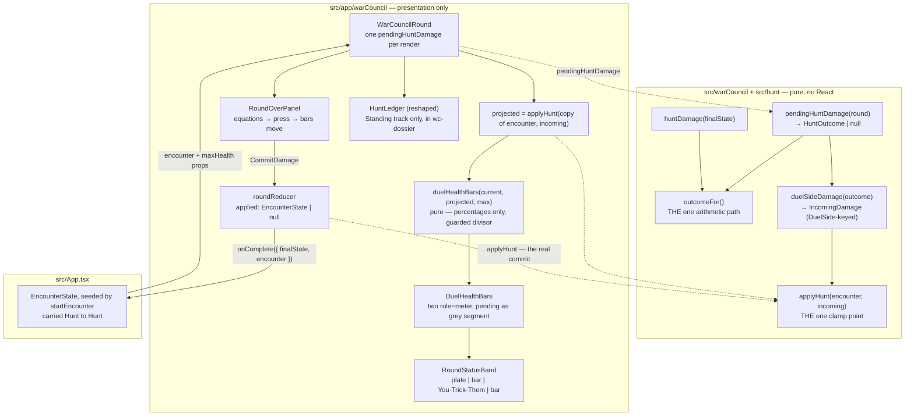

# Plan: Two health bars with live pending damage, every trick

Plan folder: `.claude/contract/DLR-71-two-health-bars-with-pending-damage/`
Execution status: see `tasks.md` in this folder.

---

## Part 1 — Alignment

_(The shared understanding of what this task is doing. Restate it in your own words — this is how the
developer confirms the brief was read correctly before any design happens. Mismatch here = stop and
fix.)_

### Task reference

**Jira: [DLR-71](https://amazerbeam.atlassian.net/browse/DLR-71)** — _"Two health bars with live
pending damage, every trick"_. Story under epic **DLR-65**. Labels `ui`, `playable`.

**Developer's brief, verbatim (2026-08-12):**

> https://amazerbeam.atlassian.net/browse/DLR-71 With the UI chagnes we'll need a mock up. &
> 'e:\Game Dev\StringsAndStations\.docs\design\Balatro-Forbidden-Solitaire\ideas.md' this file
> contaisn an idea for how the change the UI

The named `ideas.md` entry is **"Tekken-style health bar placement — both bars top of screen,
mirrored"** (2026-08-12, Worth costing). It proposes no rule and changes no number; it proposes an
_arrangement_ and makes three arguments about it, all three of which this plan answers in Part 2 →
Approach. Its **one borrowable detail** is load-bearing here: pending damage as the fighting-game
**recoverable "grey" segment** — _"damage recorded but not yet permanent, drawn by lightness on the
same bar rather than as a second widget, and allowed to shrink."_

**Acceptance criteria, pasted so this folder stands alone after `/clear`:**

1. Both sides' health bars are on screen for the whole Hunt, each showing current health against its
   configured maximum.
2. Each bar carries its side's **pending** damage, updated after every trick resolves, and the
   pending figure at trick 13 **equals** the damage actually applied — the same function, not a
   parallel calculation (epic DoD 7).
3. Pending damage is visibly not-yet-applied — a player must be able to tell the difference between
   health lost and health at risk.
4. The end-of-Hunt panel shows both sides' `card value × Standing = damage` as arithmetic, then both
   bars moving.
5. No component holds a numeric literal standing in for a multiplier, a band boundary, a health
   total, or a rounding rule. Every number arrives already derived, per this module's existing
   invariant (`.docs/implementation/war-council-ui/README.md`).
6. The screen still obeys the module's standing constraints: full-viewport and non-scrolling, no
   `useEffect`/`useLayoutEffect` anywhere, no `memo`/`useMemo`/`useCallback`, no hex colour in any
   `.tsx`, no `vh`/`vw` unit, every visual value a named CSS custom property.
7. Component tests query by accessible role and label. A screen-reader user can read both bars'
   current and pending values.
8. The net-only fallback §6 names is reachable as a one-line change, not a rewrite — recorded in the
   ticket's summary, not built as a toggle.
9. `npm run typecheck`, `npm run lint`, `npm run format:check` and the scoped Vitest runs pass, and
   the layout is checked in a real browser at 1920×1080, 1366×768, 1024×640 and phone portrait.

**Dependency status, checked on disk 2026-08-12:**

| Blocker    | Contract status                | What this plan can rely on                                                                                                                                         |
| ---------- | ------------------------------ | ------------------------------------------------------------------------------------------------------------------------------------------------------------------ |
| **DLR-70** | `COMPLETE`                     | `startEncounter`, `applyHunt`, `isEncounterResolved`, `EncounterState`, `IncomingDamage`, `pendingHuntDamage`, `duelSideDamage` — all shipped and exported. Ready.   |
| **DLR-67** | `BLOCKED` — functional AC done | The readouts DLR-71 replaces **are gone**. What remains open is a short-viewport clipping defect in `.wc-table-inner`, which this plan must fix — see Risks below.   |

### Restated goal

Replace the Hunt screen's player-only scoring readout with the duel's actual state: **two health
bars, one per side, arranged as an opposed mirrored pair across the top of the screen**, each drawing
its own **pending damage** as a lighter segment carved out of its own current health — the
fighting-game recoverable-damage grammar the developer's `ideas.md` entry points at. The pending
figure is read from DLR-70's `pendingHuntDamage`, the same function that produces the damage actually
applied, so the number the player watches climb through thirteen tricks _is_ the number that lands;
it cannot drift because there is no second arithmetic path to drift from. At the end of the Hunt the
existing two-equation panel states both sides' `Spoils × Standing = Damage`, the player presses once,
and both bars visibly move as `applyHunt` commits the damage to a real `EncounterState` that App now
owns and carries from Hunt to Hunt. The player-only Spoils and Damage cells retire — the bars carry
those numbers now — and the Standing track moves to the dossier column to make room.

### In scope

- A pure `duelHealthBars` geometry helper beside the components, converting current / projected /
  maximum health into render-ready percentages, unit-tested with no renderer.
- A `DuelHealthBars` component: the mirrored opposed pair, each side one bar carrying its own pending
  segment, each an ARIA `meter` whose accessible text names both the current and the pending figure.
- Its own stylesheet, `warCouncilHealthBars.css` (the sixth — `warCouncilHunt.css` is at 307 lines
  and cannot absorb a full bar surface under the 400-line budget).
- `RoundStatusBand` reshaped: the mirrored pair flanks the existing `You · Trick · Them` trio,
  Tekken-fashion, and the band stops carrying `spoils`/`band`.
- `HuntLedger` reshaped to the **Standing readout only** — its `Spoils` cell, its two operators and
  its `Damage` cell retire — and remounted in the `wc-dossier` column.
- `RoundOverPanel` gains the AC4 second stage: equations, then one press, then both bars moving,
  driven by a new reducer transition and a CSS width transition (no effect).
- `roundReducer` gains `applied: EncounterState | null` and a `CommitDamage` action that calls
  `applyHunt` — the single clamp point, never re-implemented.
- `WarCouncilRound` derives one `pendingHuntDamage` per render and stops calling `scoreHunt` twice;
  it projects post-Hunt health by applying the pending damage to a **copy** of the encounter, exactly
  as DLR-70's `applyHunt` docblock instructs.
- `WarCouncilMountProps` gains `encounter` and `maxHealth`; `WarCouncilRoundResult.damage` is
  replaced by the post-Hunt `encounter`, so a Hunt cannot be applied twice.
- `App.tsx` owns the `EncounterState` across Hunts, seeded from `startEncounter`, and stops dealing a
  new round once the encounter resolves.
- The one-line fix to `.wc-table-inner`'s short-viewport clipping, without which AC9 cannot pass at
  1024×640 or phone portrait and DLR-67 stays blocked.
- Component and unit tests for every behaviour above; the four named-viewport browser checks.

### Explicitly out of scope

- **The encounter-transition and run-outcome screens**, and `ENCOUNTER_PLAYER_RESTORE` — DLR-73's.
  When this encounter resolves, the existing end panel states the outcome in place and stops offering
  a next round. That is a terminal state on a panel that already exists, not a new screen.
- **Sequencing the two encounters.** `App.tsx` holds one encounter index; DLR-73 replaces it with the
  loop.
- **The visual polish pass** — palette, bar height, the exact lightness of the pending segment, the
  transition duration. This ticket ships a stated functional default and the ticket says so outright.
- **A net-only toggle.** AC8 asks that the fallback be _cheap_, not that it be built. Part 2 makes it
  one line and the PR description records where.
- **`StandingTrack.tsx` and `warCouncilStandingTrack.css`** — untouched. `HuntLedger` keeps its
  `wc-ledger-*` class family precisely so the track's own sheet needs no edit (see the audit).
- **Renaming `spoils` to `cardValue`.** Withdrawn by the developer on DLR-68 and still withdrawn.
- **Fixing the six copy defects the module doc already records** (the stale `MustFollowMonarch`
  string, the declare gate's now-wrong Lose sentence). Copy is the developer's and none of it is on
  this ticket's surfaces.

### Pattern Reference

Supplied by the brief:

- **`.docs/design/Balatro-Forbidden-Solitaire/ideas.md`** → _Tekken-style health bar placement_ (the
  mirrored arrangement, the three consequences, the recoverable-grey-segment detail) and _A fight
  timer that pays out_ → Finding 3's health-remaining table, which is where the illustrative figures
  in the mockup come from.
- **`hybrid-design.md` §6 → _Pending damage, the catch-up route the equation already pays for_** —
  the rule this ticket renders: damage accumulates visibly, lands only at trick 13, and no Hunt is
  decided until the last trick. Also the source of the four-figures risk and the net-only fallback.
- **`hybrid-design.md` §6 → _The real structure: one disaster, one slow leak_** — why the bars must
  make a 444-damage swing legible.
- **`.docs/implementation/war-council-ui/README.md`** — AC5's invariant, cited by the ticket.
- **`.docs/implementation/war-council-ui/layout-and-styling.md`** — the shell grid, the five-sheet
  split and the 400-line history that caused each one, and the `.wc-status` overflow defect this
  ticket must not repeat.
- **`.claude/skills/game-ux/references/full-viewport-layout.md`**.

Chosen here, and named because the brief left them open:

- **`standingSegments.ts` + `StandingTrack.tsx` (DLR-68)** is the structural template for the new
  work: pure geometry in a sibling `.ts` module tested in the cheap `node` project, a component that
  only formats, a `wc-sr-only` accessible equivalent, and a narrow-viewport collapse done in CSS with
  no `matchMedia` and nothing to clean up. `duelHealthBars` + `DuelHealthBars` copies that shape
  exactly.
- **`RoundOverPanel`'s internal `SideEquation`** is the template for the bar pair's internal per-side
  sub-component — one file, one default export, a private helper for the repeated side.

### Constraints flagged on the brief

- **AC2 is the hard one and it is structural, not a promise.** The pending figure and the applied
  damage must be _the same function_. DLR-70 already made that true — `pendingHuntDamage` and
  `huntDamage` both delegate to the private `outcomeFor`, and `scoring.test.ts` asserts they agree
  exactly on a finished Hunt. This plan's job is to not introduce a third path.
- **AC5/AC6 are the module's standing invariants**, grep-verified every contract: no numeric literal
  for a multiplier, band boundary, health total or rounding rule; no `useEffect`/`useLayoutEffect`;
  no `memo`/`useMemo`/`useCallback`; no hex colour in `.tsx`; no `vh`/`vw`; every visual value a named
  custom property.
- **Full-viewport, non-scrolling, at four named sizes** — and `jsdom` cannot prove it. The module doc
  records this class of defect being caught **three times** by a real browser with every component
  test passing. It is QA's, in a browser, at the named sizes.
- **Two runtime dependencies.** Nothing here needs a third, and none is proposed.
- **The 400-line file budget, measured with `(Get-Content <path>).Count`** — never
  `Measure-Object -Line`, which drops blank lines and has already hidden a real breach on this exact
  stylesheet family.

### Assumptions made

- **One bar per side, with pending drawn _on_ that bar — not two bars and two separate pending
  figures.** `ideas.md`'s borrowable detail asks for exactly this, and it is also the cheapest answer
  to §6's own four-figures risk: two widgets move instead of four, and "health lost" versus "health
  at risk" becomes a difference in one bar's own lightness rather than a comparison across two
  readouts. AC3 is satisfied by form, not colour.
- **The pending segment is carved _out of_ current health, and shrinks.** `secure + pending` always
  equals `health / max`, so the filled length is current health and never grows — a tenth trick
  collapsing pending from 540 to 60 shows as the grey shrinking back into solid, which is the
  established grammar `ideas.md` cites.
- **The mirrored pair takes the existing `status` row rather than a new grid row**, flanking the
  `You · Trick · Them` trio, with each bar depleting _toward the centre_. This costs zero new
  vertical space in a no-scroll shell — the cost `ideas.md` names as the real one — and putting the
  trick counter between two opposed bars is the fighting-game arrangement rather than an approximation
  of it.
- **The Standing track moves to the `wc-dossier` column** to pay for the room. It is the band's
  widest child and the least time-critical: the track says which _table_ is in force, which changes
  once a Hunt, while the bars change every trick. Its existing narrow-viewport collapse to the compact
  cell is unaffected.
- **`HuntLedger` is reshaped, not retired.** The ticket sanctions either. Reshaping keeps the
  `wc-ledger-cell.wc-is-compact` element and therefore leaves `StandingTrack.tsx` and
  `warCouncilStandingTrack.css` — both outside this ticket's file list — entirely untouched. Retiring
  it would have forced a string-bound class rename across a sheet this ticket may not open.
- **AC4's "both bars moving" is a two-stage panel, one extra press per Hunt.** Stage one: equations,
  bars still at pre-Hunt health with their pending segments. Stage two, after one press: `applyHunt`
  commits, the bars re-render at the new health, and a CSS `width` transition makes the movement
  visible. Without a second stage the bars would only move after the screen has already changed, so
  the player never sees it. One press, 3–4 times an encounter, is the cheapest thing that satisfies
  AC4; whether it reads as a beat or a speed bump is a feel question, routed below.
- **The commit lives in the reducer, calling `applyHunt`** — never a component subtracting numbers.
  `applyHunt` is DLR-70's single clamp point and its own docblock names DLR-71 as the caller that must
  not write a second projection routine.
- **App owns the `EncounterState` and carries it across Hunts within the one encounter.** AC1's
  "current health" and AC4's "bars moving" are both meaningless if health resets every Hunt. This is
  Hunt-to-Hunt continuity inside a single encounter, which is what makes the screen playable;
  encounter-to-encounter sequencing stays DLR-73's.
- **`WarCouncilRoundResult.damage` becomes `encounter`.** The audit found one producer and zero
  consumers, so the change is free — and handing up the already-applied state instead of the raw
  damage makes double-application unexpressible rather than merely unlikely.
- **A sixth stylesheet.** `warCouncilHunt.css` is at 307 lines; a two-bar surface with its pending
  segment, lethal state, transitions, reduced-motion suppression and narrow-viewport block lands
  around 150. This is the same forced split that produced the fourth and fifth sheets, and the module
  doc records the pattern.
- **`SLICE_ENCOUNTER_INDEX = 0` in `App.tsx`**, beside the existing `SLICE_QUARRY_CHARACTER`. It is an
  array index into `QUARRY_ENCOUNTER_HEALTH`, not a multiplier, boundary, health total or rounding
  rule, so AC5's ban does not reach it — and inventing a config key for it would pre-empt DLR-73,
  which owns the loop that replaces it.
- **Both bars use `role="meter"`** with `aria-valuenow`/`min`/`max` and an `aria-valuetext` sentence
  carrying both figures. `meter` is the ARIA role for a bounded reading that is not a task's progress,
  and `getByRole('meter')` is directly queryable, which is what AC7 asks for.
- **Confirmed by the developer at the skill gate (2026-08-12):** `game-designer` loads alongside
  `react-frontend` and `game-ux`. Its bearing here is narrow but real — the `ideas.md` entry is an
  un-costed proposal, and Part 2 is where its three consequences are answered rather than adopted
  unread.

### Config and persisted-shape audit

Real counts, from `Grep`/`Select-String` over `src/**` on 2026-08-12.

- **`WarCouncilRoundResult.damage` → `encounter` (the type change with the widest blast radius).**
  `WarCouncilRoundResult` — **4 hits**: `src/app/index.ts:1` (type re-export), `warCouncilMount.ts:8`
  and `:11` (declaration), `src/App.tsx:18` (a comment). `damage:` as a produced field — **1 site**,
  `WarCouncilRound.tsx:124`. **Consumers: zero.** `App.tsx:23`'s `handleComplete` takes no parameter
  at all and its comment says the result is deliberately unread. So this is a **1-producer,
  0-consumer** change: the shape is safe to replace outright, and the type is `Record<PlayerSide,
  number>` → `EncounterState`, which is a widening from two numbers to a state object and therefore
  loses nothing.
- **`scoreHunt` (the call this plan removes from the UI).** **25 hits** total; only **3 are live UI
  call sites** — `WarCouncilRound.tsx:12` (import), `:72` and `:73` (the two calls). The other 22 are
  the engine's own definition, its barrel export, `scoring.test.ts`, and two comments. Replacing the
  two UI calls with one `pendingHuntDamage` touches no engine file and no engine test.
- **`HuntLedger` — 10 hits** across 3 files: `HuntLedger.tsx` (2, its own props and signature),
  `RoundStatusBand.tsx:3` and `:63` (import and mount), `__tests__/HuntLedger.test.tsx` (6). All four
  files are in this ticket's scope; the mount moves from `RoundStatusBand.tsx` to
  `WarCouncilRound.tsx`.
- **`wc-ledger*` class family — 24 hits** across 3 files, and **this is the finding that shaped the
  design**: 12 in `HuntLedger.tsx`, 9 in `warCouncilHunt.css`, and **3 in
  `warCouncilStandingTrack.css`** — lines 136 and 167 are `.wc-ledger-cell.wc-is-compact`, the
  Standing track's own narrow-viewport fallback, and line 156 is a comment naming `.wc-ledger`. That
  sheet is **outside this ticket's file list**. Retiring the class family would have silently deleted
  the narrow-viewport Standing readout, since CSS binds by string and nothing type-checks it —
  so the plan keeps `.wc-ledger`, `.wc-ledger-cell`, `.wc-ledger-key` and `.wc-ledger-value` and
  deletes only `.wc-ledger-op`, whose two operators go with the Spoils and Damage cells.
- **`spoils=` / `band=` as passed props — 6 hits each**, all inside the
  `WarCouncilRound → RoundStatusBand → HuntLedger` chain plus `HuntLedger.test.tsx`. Every one is in
  a task's `Files:` block. Dropping both props from `RoundStatusBand` therefore has no reader outside
  that chain.
- **Nothing is persisted, still.** No `localStorage`, no save file, no stored log, no serialised
  `EncounterState` anywhere in `src/` — the module doc records this and it is still true, so
  `WarCouncilRoundResult`'s shape change needs no migration and invalidates no stored record. **That
  window is open now and closes the moment a persistence ticket lands**; recorded here so a later
  change knows this one was free and its own will not be.
- **Every number the bars need is already a shipped DLR-66 config key** — `PLAYER_START_HEALTH` (17
  hits), `QUARRY_ENCOUNTER_HEALTH` / `quarryHealthForEncounter` (20 hits),
  `SIMULTANEOUS_DEPLETION_WINNER`, `DAMAGE_ROUNDING` / `roundDamage`. **No new configuration key is
  added by this plan and no tuning value is unchosen** on the arithmetic side. The unchosen values are
  all visual, and they are the polish ticket's — listed under Risks so their absence is visible rather
  than an omission.
- **Names align across the chain.** `DuelSide` (64 hits) is the vocabulary the bars key on;
  `PlayerSide` is the engine's seat at a trick. `duelSideDamage` is the **one** crossing between them
  and it already exists — the plan calls it rather than indexing `incoming[PlayerSide.Cpu]` by hand,
  which is the typo DLR-70's docblock says would type-check and produce plausible numbers forever.
- **The architectural boundary is not crossed.** Every new file lands under `src/app/warCouncil/`.
  `duelHealthBars.ts` imports types from `src/hunt` only, touches no DOM global and imports no React,
  so it runs in the cheap `node` Vitest project — the same call `standingSegments.ts` and
  `handOrder.ts` already make. `eslint.config.js`'s pure-core override covers `src/warCouncil/**` and
  `src/hunt/**`; neither gains a React import.

---

## Part 2 — Technical design

### Approach

**The shape of the change is: one derivation replaces two, and one widget replaces four readouts.**
Today `WarCouncilRound` calls `scoreHunt` twice and hands the player's half to a status-band ledger
that then computes `spoils * band.multiplier` **itself** — a second arithmetic path that bypasses
`roundDamage` and is exactly what AC2 forbids. It is not currently wrong only because
`DAMAGE_ROUNDING` happens to be a no-op on integer products. That goes. In its place
`WarCouncilRound` makes **one** call to DLR-70's `pendingHuntDamage(ui.round)`, which returns `null`
while undeclared and otherwise the same `HuntOutcome` that `huntDamage` returns on a finished Hunt,
because both delegate to the private `outcomeFor`. `duelSideDamage` crosses that outcome from the
engine's `PlayerSide` seats to the duel's `DuelSide` bars — the one crossing, already written — and
the result is fed to `applyHunt` against a **copy** of the encounter to get each side's projected
post-Hunt health. DLR-70's own docblock asks for precisely this: _"That is what lets a caller preview
a Hunt by applying it to a copy, rather than DLR-71 writing a second projection routine that could
drift from this one."_ So the clamp at zero, the overkill discard and the rounding are each performed
in exactly one place in the program, and the bar's projected figure is the applied figure by
construction. AC2 needs no test to hold, though it gets one.

**The rendering split is pure-geometry-plus-formatter, copying DLR-68's Standing track exactly.**
`duelHealthBars.ts` is a React-free, DOM-free sibling module that takes three health records —
current, projected, maximum — and returns one `HealthBarView` per side: the secure percentage, the
pending percentage, the pending figure, and a `lethal` flag. It performs no damage arithmetic and no
clamping; `applyHunt` did both before the numbers arrived. Its only division is by `max`, which it
refuses when non-positive rather than emitting a `NaN` — a `NaN` width collapses a bar silently and
logs nothing, which is the same reasoning `standingSegments` uses for an empty table, and the reason
the guard is on the divisor rather than on the symptom. Because it is pure it is tested in the cheap
`node` project with no renderer, which is where the interesting assertions live: that
`secure + pending` equals `health / max` exactly, that a shrinking pending total shrinks the segment,
and that a lethal pending total fills the bar rather than overflowing it. `DuelHealthBars.tsx` then
only formats — the same division of labour that lets `RoundOverPanel` claim it "computes nothing".

The alternative worth naming is **two figures per side, printed as numerals beside two plain bars** —
four moving numbers, which is literally what §6 warns about: _"whether that reads as tension or as
noise is a feel question."_ The `ideas.md` entry supplies the answer the design document does not: the
fighting-game **recoverable grey segment**, pending drawn by lightness on the same bar and allowed to
shrink. Two widgets move rather than four, and AC3's "health lost versus health at risk" becomes a
distinction _within_ one bar instead of a comparison _across_ two readouts. That also keeps AC8 honest
at a structural level rather than a promised one: `duelHealthBars` returns an **array** of views, so
the net-only fallback is a one-line change inside that function — return a single view whose pending
is the net — and the component renders whatever length it is handed.

**On the arrangement, and the `ideas.md` entry's own objection to it.** That entry argues the prime
top slot should go to the fastest-moving number, and that health is the slowest: health changes once
a Hunt, 3–4 times in a fast-band encounter, while pending changes every trick, 39–52 times. The
objection is correct and this design answers it by **collapsing the distinction** — pending is drawn
on the health bar, so the widget in the prime slot _is_ the thing that moves. The entry's second
argument, that two adjacent bars carry the fight's _rate_ where §6's net-bar fallback shows only
position, is why the fallback stays a fallback and not the default. Its third, that `P = H` makes the
mirror readable as a length comparison rather than a subtraction, holds at the shipped configuration
(`PLAYER_START_HEALTH` 1350, `QUARRY_ENCOUNTER_HEALTH[0]` 1350) and is why each bar is drawn against
its **own** maximum rather than a shared scale — the equality is a config fact the bars read, not one
they assume.

**Layout: the pair takes the existing `status` row and pays for it by moving the Standing track.** The
band becomes `[opponent plate] [player bar] [You · Trick · Them] [quarry bar]`, each bar depleting
toward the centre — the quarry's track is `flex-direction: row-reverse`, which is the whole of the
mirror. This costs **zero** new vertical space in a `100dvh` no-scroll grid, which is the cost
`ideas.md` names as the real one and which `game-ux` cares about most. The Standing track, the band's
widest child, moves into the `wc-dossier` column beside the Quarry's card and the intent telegraph;
it says which _table_ is in force, which changes once a Hunt, so it is the right thing to demote out
of the per-trick zone. `HuntLedger` is reshaped to carry only that track and its existing compact-cell
fallback, keeping the `wc-ledger-*` class names so the track's own stylesheet — outside this ticket's
scope — needs no edit. The status band's documented failure mode is over-fullness at phone width
(`.wc-status` measured 744px against a 500px viewport on DLR-53), so the narrow-viewport block keeps
`flex-wrap: wrap` and the bars carry `min-width: 0` and `flex: 1 1 <basis>` so they compress before
they push.

**The commit is a reducer transition, and the movement is a CSS transition.** `RoundUiState` gains
`applied: EncounterState | null`, and `CommitDamage` carries the live `encounter` plus the
`IncomingDamage` and calls `applyHunt` in the reducer — where the engine calls already live, and never
in a component. The reducer guards `state.applied !== null` and `isEncounterResolved(encounter)` and
returns state unchanged rather than letting `applyHunt`'s `RangeError` escape from an event handler
and unmount the tree; the panel only renders the control while `applied === null`, so both guards are
belt-and-braces rather than live paths. Because `applied` is state and the bar's fill is a `width`
driven by a custom property, the movement AC4 asks for is a plain CSS `transition` on a declarative
re-render — **no effect, no timer, nothing to clean up**, and suppressed under
`prefers-reduced-motion` like the module's two existing animations. Once `applied` is set, the bars
read from it with zero pending, and `onComplete` hands the already-applied `EncounterState` up to App
so no caller can apply the same Hunt twice.

**The DLR-67 defect is a dependency, not scope creep.** DLR-67 is `BLOCKED` on `.wc-table-inner`:
`justify-content: center` on an `overflow-y: auto` container clips symmetrically and `scrollTop`
cannot go negative, so the declare gate's own heading is unreachable at 680×520 and 700×544. This
ticket makes the end panel **taller** — two equations plus two bars plus a control — and AC9 gates on
1024×640 and phone portrait. Shipping AC9 without fixing it is not possible, so the plan takes the
resolution the module doc already names: `align-items: flex-start`, so `scrollTop: 0` shows the true
top of content. One line, in a sheet already in scope, verified by QA at both measured sizes.

### Skills to invoke during execution

- **`react-frontend`** — owns everything under `src/`: the single-reducer rule that puts `applied` and
  `CommitDamage` in `roundReducer` rather than a second `useState`, the no-`memo` and
  no-hard-coded-tunable contract, the 400-line budget that forces the sixth stylesheet, and the
  two-project Vitest split that decides `duelHealthBars.test.ts` is a `node` spec and
  `DuelHealthBars.test.tsx` a `jsdom` one.
- **`game-ux`** — owns the game-screen layer: the `100dvh`/`overflow: hidden` shell the bars must not
  grow, status anchored to an edge rather than drifting toward the centre, state readable without
  colour or motion alone (which is why the pending segment is a lightness _and_ an edge, and the
  lethal state a form change), and the tap count on the most repeated action — the bars add none per
  trick and one per Hunt.
- **`game-designer`** — added by the developer at the gate. Its use here is bounded: `ideas.md`'s
  Tekken entry is a `Worth costing` proposal, not a decision, and this skill's method is what makes
  Part 2 answer its three stated consequences and its own objection rather than adopt it unread. It
  decides no tuning value and adds no rule.

Also read before starting: **`.claude/workflow/web-project.md`** (paths, runners, and the
`Select-String` non-recursion and `Measure-Object` undercount traps, both of which have already
produced false greens on this stylesheet family). **`.claude/rules/`** contains only its `README.md`
— scanned 2026-08-12, no rule file applies; re-scan rather than trusting this line.

No developer override was applied to the list; the developer **added** `game-designer` to the two
proposed.

### Diagram



### Data shapes

#### New — `src/app/warCouncil/duelHealthBars.ts` (pure, `node` project)

```ts
import type { Damage, DuelSide, Health } from '../../hunt'

/** One side's bar, ready to render. Percentages are of that side's OWN maximum, so the two
 *  bars stay comparable by length only while `P = H` holds in config — a fact they read,
 *  never assume. */
export interface HealthBarView {
  readonly side: DuelSide
  /** Health that survives this Hunt — the solid part of the bar. */
  readonly secure: Health
  /** Health at risk but not yet lost — the lighter segment, carved out of `secure + pending`. */
  readonly pending: Damage
  readonly current: Health
  readonly max: Health
  /** `secure / max × 100`. */
  readonly securePct: number
  /** `pending / max × 100`. `securePct + pendingPct === current / max × 100`, exactly. */
  readonly pendingPct: number
  /** Pending damage would empty this bar. A form change, not a colour change (AC3, game-ux). */
  readonly lethal: boolean
}

/**
 * Converts three health records into render geometry. Performs NO damage arithmetic and NO
 * clamping — `applyHunt` did both before `projected` arrived, which is what keeps AC2's
 * single-function guarantee intact.
 *
 * Throws on a non-positive or non-finite `max`: the only division here is by `max`, and a
 * `NaN` width collapses a bar with nothing logged anywhere.
 *
 * Returns an ARRAY, which is what makes AC8's net-only fallback a one-line change here rather
 * than a rewrite in the component.
 */
export function duelHealthBars(
  current: Readonly<Record<DuelSide, Health>>,
  projected: Readonly<Record<DuelSide, Health>>,
  max: Readonly<Record<DuelSide, Health>>,
): readonly HealthBarView[]
```

#### New — `src/app/warCouncil/DuelHealthBars.tsx`

```tsx
interface DuelHealthBarsProps {
  readonly bars: readonly HealthBarView[]
  /** Rendered BETWEEN the two opposed bars — the `You · Trick · Them` trio, which is the
   *  fighting-game centre slot. The mirror's geometry (which bar anchors left, which right)
   *  therefore lives entirely in this component rather than being reassembled by its caller. */
  readonly centre: ReactNode
}
export default function DuelHealthBars({ bars, centre }: DuelHealthBarsProps): ReactNode
// private: function SideBar({ view }: { view: HealthBarView }): ReactNode
```

Each side renders one `role="meter"` with `aria-label={HEALTH_BAR_LABEL[view.side]}`,
`aria-valuemin={0}`, `aria-valuemax={view.max}`, `aria-valuenow={view.current}`, and
`aria-valuetext={healthBarValueText(view)}`. The fill and the pending segment are set as two inline
CSS custom properties carrying ready-made percentage strings — `--wc-hp-secure` and `--wc-hp-pending`
— never an inline `width`, for the reason `layout-and-styling.md` records about `HandFan`: an inline
style property outranks an external rule and would make the stylesheet's transition and states
unreachable.

#### Modified — `src/app/warCouncil/labels.ts`

```ts
export const HEALTH_BAR_LABEL: Readonly<Record<DuelSide, string>>
// { player: 'Your health', quarry: 'The Quarry’s health' }

/** The one sentence carrying both figures a screen-reader user needs (AC7). */
export function healthBarValueText(view: HealthBarView): string
// '1062 of 1350. 288 at risk this Hunt.'  /  '…  Nothing at risk yet.'  /  '… Lethal this Hunt.'

export const APPLY_DAMAGE_LABEL: string // 'Apply the damage'
export const FINISH_ROUND_LABEL: string // 'Finish the round' — the existing string, named
export const ENCOUNTER_OUTCOME: Readonly<Record<DuelSide, string>>
// winner-keyed terminal copy for the resolved encounter
```

#### Modified — `src/app/warCouncil/roundReducer.ts`

```ts
export interface RoundUiState {
  // …unchanged six fields…
  /** `null` until the player commits the finished Hunt's damage. Set by `CommitDamage`, which
   *  calls `applyHunt` — this module never subtracts a health value itself. */
  readonly applied: EncounterState | null
}

export const RoundUiActionKind = {
  /* …five existing… */ CommitDamage: 'commitDamage',
} as const

export type RoundUiAction =
  // …five existing…
  | {
      readonly kind: typeof RoundUiActionKind.CommitDamage
      readonly encounter: EncounterState
      readonly incoming: IncomingDamage
    }

export function createRoundUiState(initialState: WarCouncilState): RoundUiState // gains applied: null
```

#### Modified — `src/app/warCouncilMount.ts`

```ts
export interface WarCouncilMountProps {
  readonly initialState: WarCouncilState
  readonly hunt: Hunt
  /** The live encounter this Hunt is fought inside. Health only changes at trick 13, so this is
   *  constant for the whole round. */
  readonly encounter: EncounterState
  /** Each side's configured maximum, for the bar's denominator. Not derivable from
   *  `EncounterState`, which carries current health only. */
  readonly maxHealth: Readonly<Record<DuelSide, Health>>
  readonly onComplete: (result: WarCouncilRoundResult) => void
}

export interface WarCouncilRoundResult {
  readonly finalState: WarCouncilState // phase === RoundPhase.Complete
  /** The encounter AFTER this Hunt's damage was applied — the state the player just watched
   *  land. Replaces DLR-67's `damage: Record<PlayerSide, number>`, which had one producer and
   *  no consumer: handing up the applied state makes double application unexpressible. */
  readonly encounter: EncounterState
}
```

#### Modified — component props

```ts
// RoundStatusBand: loses `spoils`, `band`, `table`; gains `bars`.
interface RoundStatusBandProps {
  readonly tricksWon: Readonly<Record<PlayerSide, number>>
  readonly tricksPlayed: number
  readonly opponentHandCount: number
  readonly roundComplete: boolean
  readonly bars: readonly HealthBarView[]
}

// HuntLedger: loses `spoils`. The Standing readout only.
interface HuntLedgerProps {
  readonly band: StandingBand
  readonly table: readonly StandingBand[]
  readonly tricks: number
}

// RoundOverPanel: gains the two-stage commit.
interface RoundOverPanelProps {
  readonly tricksWon: Readonly<Record<PlayerSide, number>>
  readonly huntDamage: Readonly<Record<PlayerSide, HuntDamage>>
  readonly applied: EncounterState | null
  readonly onApply: () => void
  readonly onFinish: () => void
}
```

#### New — `src/app/warCouncil/warCouncilHealthBars.css`

The sixth sheet, imported from `WarCouncilRound.tsx` **after** `warCouncilHunt.css`. New named custom
properties only, defined in `warCouncil.css`'s existing `:root` block alongside the palette it already
owns: `--wc-hp-track`, `--wc-hp-secure-fill`, `--wc-hp-pending-fill`, `--wc-hp-lethal-edge`,
`--wc-hp-height`, `--wc-hp-move-ms`. **Every one of those six values is the developer's** — see Risks.
Carries its own copy of the `@media (max-width: 44rem), (max-height: 34rem)` breakpoint, the same
documented duplication `warCouncilStandingTrack.css` already makes; the value now lives in three files
and that is the split's one real drift risk.

#### No change

`src/hunt/**` and `src/warCouncil/**` are untouched. No configuration key is added, renamed, retyped
or removed. No dependency changes, no `package.json` change, no script change.

### Runtime quality notes

- **Purity and adjudication.** `duelHealthBars.ts` imports three types from `src/hunt` and nothing
  else — no React, no DOM global — so it runs in the `node` project beside `standingSegments.ts` and
  `handOrder.ts`. It computes percentages and a boolean; it performs no damage arithmetic, no clamp
  and no rounding, because `applyHunt` and `roundDamage` already did each exactly once. No component
  decides anything: `pendingHuntDamage` decides what pending _is_, `applyHunt` decides what lands,
  `resolveStanding` decides the band, and `HuntLedger` — which today computes
  `spoils * band.multiplier` and thereby bypasses `roundDamage` — stops computing anything at all.
  Every visual value is a named custom property; every game number arrives derived from
  `src/hunt/config.ts`.
- **Effects, mount and teardown.** **No effect is added, because none is needed** — the module has
  none and AC6 forbids one. The bars are a pure function of props; the movement is a CSS `transition`
  on a declarative re-render; the narrow-viewport collapse is a media query, so there is no
  `matchMedia`, no resize listener, no `requestAnimationFrame` and nothing to clean up. `applied`
  lives in the existing `useReducer`, so StrictMode's double-invocation of the lazy initialiser
  recomputes an identical value exactly as it does today — `createRoundUiState` stays a pure
  restructuring, gaining one `null`. No module-level mutable state is introduced. A second mount
  re-derives everything from props.
- **Hot-path cost.** Per trick the added work is one `pendingHuntDamage` — which reduces over at most
  26 captured cards and scans a six-row table — one `applyHunt` against a copy (two subtractions and
  two comparisons), and one `duelHealthBars` over two sides. Bounded by the 33-card deck, and it
  **replaces** two `scoreHunt` calls with one `outcomeFor`, so the net per-render cost goes _down_.
  Nothing runs per pointer-move; there is no drag, scroll or resize path here. No `memo`, `useMemo` or
  `useCallback`, and no profiling evidence that would justify one.
- **Determinism and numeric safety.** No randomness is reachable from any of it —
  `App.tsx`'s `Math.random` seeds `dealRound` and is untouched. The **only division in the new code is
  by `max`**, and `duelHealthBars` refuses a non-positive or non-finite `max` with a `RangeError`
  rather than emitting a `NaN` percentage, which would collapse a bar to nothing with no error
  anywhere; `PLAYER_START_HEALTH` and both `QUARRY_ENCOUNTER_HEALTH` entries are positive, so the
  guard is a guard, not a live path. No epsilon is needed: `DAMAGE_ROUNDING` is
  `HalfAwayFromZero` and `roundDamage` is applied once inside `scoreHunt`, so every `HuntDamage` this
  plan touches is already an integer under the shipped configuration — and the plan compares no
  floats. Clamping at zero happens only in `applyHunt`.
- **Error paths.** Three guarded, one deliberately loud. (1) `pendingHuntDamage` returns `null` while
  undeclared — the bars render with zero pending and the accessible text says "Nothing at risk yet",
  which is honest; a zero-valued outcome would be indistinguishable from a scoreless Hunt, which is
  DLR-68 AC5's own reasoning. (2) `applyHunt` throws on an already-resolved encounter, so the
  `CommitDamage` reducer branch checks `state.applied !== null` and `isEncounterResolved(encounter)`
  and returns state unchanged — a throw escaping an event handler would unmount the tree, and the
  panel only renders the control while `applied === null`, so neither guard is a live path. (3) App
  stops dealing a new round once `isEncounterResolved`, so `applyHunt` is never reached in a state it
  refuses. Nothing is swallowed into a success shape: `duelHealthBars` throws on a bad `max` rather
  than returning zeroed geometry, the existing `cpuFault` branch still shows an engine rejection
  instead of hiding it, and there is no `catch` anywhere in the diff. No new async surface, so the
  four async states do not arise.

### Risks and judgement calls

- **Six visual values are unchosen and they are the developer's** — `--wc-hp-track`,
  `--wc-hp-secure-fill`, `--wc-hp-pending-fill`, `--wc-hp-lethal-edge`, `--wc-hp-height` and
  `--wc-hp-move-ms` (the bar-movement duration). The tasks ship documented placeholders drawn from the
  existing palette tokens and route every value here; **no task invents one.** The polish ticket owns
  them, per this ticket's own scope boundary.
- **Whether the mirrored pair in the status row reads as tension or as clutter is a feel question and
  the pause condition §6 names.** The mockup is where to judge the arrangement before code is written.
  The measurement §6 asks for: can a playtester say who is ahead, and tell a fast Hunt from a stalling
  one, from the bars alone? If they manage the first and not the second, the net-bar fallback is free
  to take.
- **Moving the Standing track out of the status band into the dossier column is the single biggest
  layout judgement in this plan.** The dossier is `minmax(10rem, 17vw)` — about 326px at 1920 — for a
  14-pip profile that has never been drawn that narrow. If it reads cramped, the alternatives are a
  new `auto` grid row for the bars (costing vertical space in a no-scroll shell) or accepting the
  compact cell at all widths. Judge it in the mockup.
- **One extra press per Hunt.** AC4's "then both bars moving" needs a second stage or the movement
  happens off-screen. That is 3–4 extra presses in a fast-band encounter, on top of the two the module
  doc already flags as unjudged at the start of every round (the declare gate, then "Let them lead").
  Whether the apply beat earns its press is the developer's.
- **This plan fixes DLR-67's open blocking defect, and that is a scope decision to sanction
  explicitly.** `align-items: flex-start` on `.wc-table-inner` inside the existing short-viewport
  media query makes the declare gate's heading reachable again — but it also **top-aligns the felt's
  content** at 680×520 and 700×544 instead of centring it, which is a visible change at those sizes.
  The alternative the module doc names is scoping the stretch/scroll to the end-panel state alone,
  which is more CSS and leaves centring intact. Taking the one-line fix is the plan's default; the
  visual consequence is the developer's to accept or reject.
- **`WarCouncilRoundResult.damage` → `encounter` is a deliberate contract change** to a type exported
  from `src/app/index.ts`. The audit found 1 producer and 0 consumers so it is free today, but it is a
  narrowing of what the mount reports: a future caller wanting the raw per-side damage would read it
  off `pendingHuntDamage` rather than off the result. Say so if that is the wrong trade.
- **App now carries health across Hunts inside one encounter**, which the ticket does not explicitly
  ask for and DLR-73 does not explicitly own. Without it AC1's "current health" is a constant and
  AC4's bars move once and reset, so the plan takes it. If the developer would rather DLR-73 own all
  encounter continuity, this reduces to a single-Hunt preview and AC4 gets weaker.
- **The resolved-encounter terminal state is minimal by design and its copy is unwritten.** When a bar
  empties, the end panel states the outcome and stops offering a next round rather than routing to an
  outcome screen — that screen is DLR-73's. `ENCOUNTER_OUTCOME`'s two strings are placeholders and the
  wording is the developer's.
- **`SLICE_ENCOUNTER_INDEX = 0` is a placeholder in `App.tsx`, not a config key.** It is an array index
  into `QUARRY_ENCOUNTER_HEALTH` and DLR-73 replaces it with the encounter loop. Flagged rather than
  promoted to `src/hunt/config.ts`, which would pre-empt that ticket.
- **The `@media (max-width: 44rem), (max-height: 34rem)` breakpoint value will live in three
  stylesheets** once `warCouncilHealthBars.css` lands. That is the documented cost of the 400-line
  split and it is a three-file edit if the threshold is ever tuned. Consolidating it is its own
  ticket, not this one's.
- **`jsdom` cannot prove AC6's no-scroll claim or AC1's "on screen for the whole Hunt".** This class
  of defect has been caught by a real browser three times on this screen with every component test
  passing. QA drives the four named sizes; nothing in the suite substitutes.
- **`roundReducer.test.ts` is at 324 lines and `WarCouncilRound.test.tsx` at 371.** Both are inside
  the 400-line budget now and both gain assertions. The tasks measure with `(Get-Content <path>).Count`
  and carve a sibling spec rather than compressing, which is the resolution this stylesheet family's
  own history says works.
