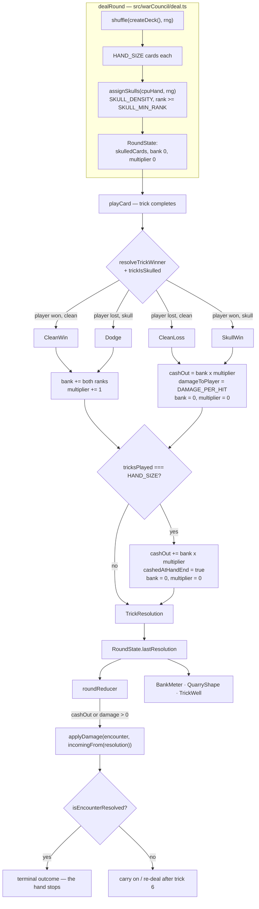

# Plan: The Hunt — skull-and-bank redesign

Plan folder: `.claude/contract/DLR-80-skull-and-bank-redesign/`
Execution status: see `tasks.md` in this folder.

---

## Part 1 — Alignment

### Task reference

**Jira DLR-80** — *The Hunt — skull-and-bank redesign: six-trick hands, dodge the skulls, cash the streak* (Story, parent epic DLR-65, labels `engine` / `playable`, priority Highest). Moved `To Do → Planning` at the start of this run.

**The spec named by the ticket:** `.docs/design/Balatro-Forbidden-Solitaire/the-hunt-play-test-2-feedback.md` — §3 the design, §4 what is deleted, §5 the numbers, §6 open questions, §7 discarded branches, §8 what to watch. Read in full during planning. Everything below cites it rather than restating its reasoning.

**Acceptance criteria, verbatim from the ticket:**

1. A hand deals **6 cards to each side** and is **6 tricks long**, then re-deals. Follow-suit, trump/decree, trick resolution and "winner leads next" are unchanged from the base game.
2. Roughly **30% of the CPU's cards carry a skull**, and **no skull is ever on rank 1**. The proportion is a named configuration value, not a literal at its point of use.
3. **Skulls are visible to the player before they commit a card** — a player can see which of the CPU's cards are skulled without seeing their ranks.
4. **Win a clean trick** (no skull) → both cards' ranks are added to the player's **bank**, and the **multiplier** increments.
5. **Lose a skull trick** (the dodge) → identical to AC4: both cards to the bank, multiplier increments, no damage.
6. **Lose a clean trick** → the player takes **1 damage**, the bank **cashes out** (`bank × multiplier` applied to CPU health), and bank and multiplier both reset to zero.
7. **Win a skull trick** → identical to AC6.
8. The bank **cashes out at the end of the sixth trick** at the current multiplier, then resets.
9. The **multiplier is the number of tricks taken in a row** (clean wins and dodges both count) and resets to zero on any damage taken.
10. **Player health starts at 25.** Every damage event is exactly 1. The encounter ends when either health total reaches zero.
11. The **shape readout** shows, per suit, how many cards the CPU holds and how many of those are skulled — and never reveals a rank.
12. The **CPU plays skulls adversarially**: it prefers to play a skulled card into a trick it is losing, so the player is the one who wins it.
13. The following are **removed from** `src/`, not deferred, with no dead references left behind: the Win/Lose declaration and its gate, both Standing multiplier tables and the four bands, rank inversion (`12 − rank`), the Lose-path pile swap and `CardValueScheme`, Spoils and the capture piles, damage rounding, pending damage, and end-of-Hunt damage application.
14. `npm run typecheck`, `npm run lint`, `npm run format:check`, `npm test` and `npm run build` all pass.

**Interactive decisions confirmed during planning (2026-08-13):** the developer confirmed the execution skill list as `react-frontend`, `game-ux`, `game-designer`, `implementation-doc-writer` — all four, including the two this planner flagged as probably unnecessary. The consequence for `implementation-doc-writer` is worked through in *Assumptions made* and *Risks and judgement calls*.

### Restated goal

Rip out the layer of scoring machinery that sat on top of Fox in the Forest and replace it with one legible loop. A hand becomes six cards and six tricks instead of thirteen, and it re-deals until the encounter resolves. Roughly a third of the CPU's cards carry a visible skull, never on a rank 1, and the skull inverts the trick: on a clean trick you want to win, on a skull trick you want to lose. Taking a trick — a clean win or a dodged skull — adds both cards' ranks to a bank that only ever climbs and increments a streak multiplier. Taking damage — losing a clean trick or winning a skull trick — costs exactly 1 health, cashes `bank × multiplier` into the Quarry's health, and resets both to zero; the same cash-out fires automatically at the end of the sixth trick. The player sees the CPU's hand *shape* — cards and skulls per suit, never a rank — so a low skull is a planning problem rather than an ambush with no defence, and the CPU dumps its skulls into tricks it is losing so the mechanic has teeth. Everything the old direction needed to make that work — the declaration, both multiplier tables, rank inversion, the pile swap, Spoils, capture piles, rounding, pending damage, end-of-Hunt application — is deleted from `src/`, not deferred.

### In scope

- Six-card, six-trick hands that re-deal until the encounter resolves; follow-suit, trump/decree, trick resolution and "winner leads next" untouched.
- Skull generation on the CPU's dealt hand at a named density, excluding rank 1; the skull carried on `RoundState` and readable by the engine, the CPU and the UI.
- The four-outcome resolution table (AC4–AC7) as a pure, unit-tested module.
- The bank, the streak multiplier, the damage cash-out, and the forced cash-out at the end of the sixth trick (AC8).
- Damage applied **per trick**, mid-hand, to both health bars, with the encounter resolving the moment either bar reaches zero — including mid-hand.
- Player health 25; exactly 1 damage per damage event; a plainly-labelled placeholder for the Quarry's health with the real figure routed to the developer.
- The per-suit shape-and-skull readout (AC11), and a skull mark on a skulled card once it is face up on the table (AC3's second half).
- A bank/multiplier readout the player can watch climb, replacing the Standing track in the screen's information budget.
- The CPU's AC12 skull-dumping rule, in `chooseCpuCard`.
- Deletion of every item in AC13 from `src/`, with the surviving tests rewritten rather than deleted where the behaviour survives.
- All five gates green (AC14).

### Explicitly out of scope

- **Forage and the shop**, and therefore player-held skulls.
- **The second encounter, the run, encounter sequencing, and outcome screens** — one encounter, one CPU. `QUARRY_ENCOUNTER_HEALTH` collapses to one entry.
- **The band-position CPU** from DLR-65 — the band it played toward no longer exists.
- **Reworking the odd-card abilities for six-card hands.** The Fox, Witch, Woodcutter, Swan and Monarch keep their current behaviour verbatim; many six-card hands will contain none of them, and that is accepted for this build (§6 Q2).
- **Giving Treasure (7) and Poison (8) a job**, and renaming rank 8 now that "Poison" is misleading (§6 Q3).
- **A player-triggered cash-out button** — the automatic cash-out is the simple case (`ideas.md` → Raw).
- **Rewriting `hybrid-design.md`** — game-designer territory, explicitly deferred by the ticket until the design has been played.
- **Triaging DLR-72 → DLR-78 and rewriting DLR-65's epic description.** Both are named in the ticket's Dependencies & Risks as needing separate handling; neither is a code change and neither is planned here.
- **Any new runtime dependency.** The two-dependency budget is untouched.

### Pattern Reference

The brief supplies the design spec but no code pattern reference, so these are the ones chosen here — all of them existing shapes in this repository, followed rather than invented:

- **`.docs/design/Balatro-Forbidden-Solitaire/the-hunt-play-test-2-feedback.md`** — the specification. §3.1 hand size, §3.2 the four-outcome table, §3.3 the bank/multiplier/cash-out and the worked hand, §3.4 skulls and the never-rank-1 rule, §3.5 the shape readout, §4 the deletion list, §5 the numbers.
- **`src/warCouncil/resolveTrick.ts` and `src/warCouncil/legalMoves.ts`** — the shape a new pure engine module takes: one exported function, no state, no React, unit-tested beside itself under `src/warCouncil/__tests__/`.
- **`src/hunt/config.ts`'s existing tunable idiom** — a named `export const` carrying its unit, its design citation, and whose decision the value is, with an injectable defaulted parameter (`resolveStanding`'s `table`, `startEncounter`'s `playerHealth`) so a spec can vary it without mutating module state. The new skull and hand-size keys follow it exactly.
- **`src/hunt/encounter.ts`'s `applyHunt`** — the single clamp point, the `assertApplicable` NaN guard, and the "returns a new state, never mutates" property. The renamed `applyDamage` keeps all three.
- **`src/app/warCouncil/roundReducer.ts`** — the `(state, action) => state` reducer that owns every transition on the screen, and the `CpuFault` posture of surfacing an engine rejection rather than swallowing it.
- **`src/app/warCouncil/HuntLedger.tsx` + `StandingTrack.tsx`** — the dossier-column readout being replaced; the new shape and bank readouts take their slot and their "computes nothing, formats what it is handed" posture.
- **`.claude/skills/react-frontend/SKILL.md`** and **`.claude/skills/game-ux/SKILL.md`** for conventions; not restated here.

### Constraints flagged on the brief

- **Determinism.** `dealRound` already takes an injected `rng: () => number` and `App.tsx` passes `Math.random`. Skull assignment must take the same injected rng and must not reach `Math.random` itself, so a seeded deal stays reproducible and every skull spec is deterministic.
- **CPU health must not be invented** (Dependencies & Risks). The ticket authorises a *plainly-labelled placeholder* and requires the real figure to come from the first play session.
- **Skull rank distribution is open** (§6 Q1). Only "never rank 1" is settled. Uniform-among-eligible is the placeholder; skewing low or high is untested and is the developer's call after playing.
- **The two-runtime-dependency limit** stands; nothing here needs a third.
- **AC13 requires deletion, not deferral, with no dead references.** A retired symbol left exported "for a future caller" fails this.
- **AC2 requires the skull proportion to be a named configuration value**, not a literal at its point of use. The same standard is applied to hand size, player health and the per-hit damage.
- **AC14 makes `format:check` a gate.** `web-project.md` records that the repo-wide `npm run format:check` currently fails on pre-existing `.docs/**` files no contract has touched — so the contract gates on `npx prettier --check` scoped to the files it changed, runs the repo-wide form, and reports both. The pre-existing failure is not "fixed" as a side effect.
- **Accessibility:** the shape readout and the bank readout must read without colour or motion alone, and the skull must be a form (a glyph plus an accessible name), not a colour.

### Assumptions made

- **A trick is a skull trick iff any card played into it is skulled.** The spec puts skulls only on the CPU's cards, so in practice this means "the CPU's card in this trick is skulled" — but the CPU's Fox can exchange a skulled card into the decree and the player's Fox can later take that decree into hand, so a player-held skull is expressible in one hand. "Any card in the trick" is the rule that survives that path without a special case. *Rationale: the alternative — "the CPU's card is skulled" — would silently drop the skull the moment it changed hands, and the spec's inversion is about the trick, not the seat.*
- **Skulls are assigned to the CPU's six dealt cards only, and never to a card drawn later.** A Woodcutter draw from the draw pile arrives unskulled. *Rationale: §3.4 says "roughly 30% of the CPU's cards", which is a property of the deal; skulling the draw pile would make density unstable and is a design change the spec does not ask for.*
- **The skulled count is `Math.round(HAND_SIZE × SKULL_DENSITY)` = 2 of 6, selected uniformly at random from the eligible (rank ≥ 2) cards in the dealt hand.** *Rationale: 2/6 is 33%, which is §5's "roughly 30%"; uniform is the null hypothesis §6 Q1 says is untested, and both the density and the distribution stay injectable parameters so testing a skew is a one-line change.*
- **`HAND_SIZE` is one constant serving both hand size and trick count.** §3.1 states "six cards each, six tricks" and they cannot differ — every card is played. *Rationale: two constants that must be equal is a bug waiting for one of them to be edited.*
- **The end-of-hand cash-out is folded into the sixth trick's resolution rather than being a second event.** On trick 6 exactly one of the two cash-outs is ever non-zero: a damage trick resets bank and multiplier to zero, so the subsequent hand-end cash of `0 × 0` is zero; a taken trick leaves a bank to cash. *Rationale: one damage application per trick keeps `applyDamage`'s already-resolved guard from needing a second special case, and the resolution still records which of AC6/AC7 or AC8 fired.*
- **Damage is applied by the reducer as each trick resolves, and the reducer therefore owns the live `EncounterState`.** The prop seeds it; the reducer carries it; `onComplete` hands it back. *Rationale: AC6 and AC8 make the cash-out automatic and mid-hand, so the current "apply once at trick 13 via a button" structure cannot express it. Keeping `EncounterState` in the parent while damage lands mid-hand would need a second write path and would drift.*
- **The encounter resolving mid-hand stops the hand.** The player cannot act, and the terminal outcome renders in place of the felt. *Rationale: AC10 says the encounter ends when either total reaches zero, and `applyDamage` throws on an already-resolved encounter — playing on would either crash or apply damage no rule authorises.*
- **`applyHunt` is renamed `applyDamage` and `EncounterState.huntsApplied` becomes `damageEventsApplied`.** *Rationale: the function is now called several times a hand; a name and a counter that say "Hunt" would be actively wrong, and AC13 retires "end-of-Hunt damage application" as a concept.*
- **`scoring.ts` is deleted whole**, and `TrickResolution` carries the `PlayerSide → DuelSide` crossing that `duelSideDamage` used to own, performed once in one function. *Rationale: every other export of that module (`scoreHunt`, `huntDamage`, `pendingHuntDamage`, `HuntNotScorable`) is an AC13 deletion, and leaving the file for one function would leave the retired vocabulary in the barrel.*
- **`capturedCards` is removed from `RoundState` entirely**, not kept as a record of play. *Rationale: AC13 names "Spoils and the capture piles"; the bank replaces the only thing they fed.*
- **`tricksWon` stays.** *Rationale: it is base-game bookkeeping, the status band's You/Them counters read it, and nothing in AC13 retires it.*
- **The CPU's lead is unchanged** — AC12's rule applies only when the CPU is following. *Rationale: the ticket names AC12 as "the minimum CPU change", and a lead-time skull-avoidance rule is a second behaviour with its own feel consequences. Flagged in Risks.*
- **The bank/multiplier readout takes the Standing track's place in the dossier column, and the running "what this streak would cash for" figure sits with it rather than on the health bars.** *Rationale: the health bars' pending segment was the non-monotonic readout §1 blames for the failure; the bank only ever climbs, so it is safe to show, but it is a different number in a different place and reusing the bars' pending machinery would carry the old shape forward.*
- **`implementation-doc-writer` updates `.docs/implementation/**` and `.docs/game_rules/the-hunt.md`, both through `/fb-apply`'s own unconditional Step 6.5 invocation, not as a task in `tasks.md`.** The ticket defers the rules-doc rewrite; the skill the developer ticked mandates it whenever a rule changes, and every rule in this game changes here. *Rationale: the two instructions conflict and the developer's tick is the later signal — but the conflict is real, so it is raised in Risks rather than resolved silently. `hybrid-design.md` stays untouched either way; it is `game-designer`'s file and its rewrite is deferred by the ticket.*

### Config and persisted-shape audit

Performed against the files on disk with `grep -rIo` over `src/**` (`.ts`, `.tsx`, `.css`); counts are total identifier occurrences and the number of files they sit in.

- **Nothing is persisted anywhere.** `grep -rn "localStorage\|sessionStorage\|indexedDB" src vite.config.ts` returns **zero hits** outside `eslint.config.js`'s denylist. There is no save file, no stored log, no replay. Every shape below can therefore change with no migration and no stored-record invalidation. **Recording that this window is still open is the point of this bullet** — the next contract that adds persistence closes it.
- **`data-testid` count is zero** (`grep -rn "data-testid" src | wc -l` → `0`). Every component spec queries by accessible role and label, so the string-bound surface at risk is CSS class names and `aria-label` copy, not test ids.
- **The AC13 deletion set, by hit count.** Declaration cluster: `HuntDeclaration` **132 hits / 27 files**, `declareHunt` **33 / 11**, `DeclarationState` **12 / 7**, `declaredPath` **17 / 6**. Standing cluster: `resolveStanding` **56 / 11**, `standingTableFor` **31 / 11**, `StandingBand` **24 / 9**, `HUNT_MULTIPLIER_TABLES` **8 / 3**. Card-value cluster: `spoils`/`Spoils` **44 / 11** and **27 / 12**, `capturedCards` **31 / 19**, `cardValueSchemeFor` **19 / 6**, `invertedCardValue` **23 / 6**, `PaidPile` **18 / 6**, `cardValueFor` **14 / 5**, `cardBaseValue` **11 / 4**, `CardValueScheme` **11 / 5**, `RANK_INVERSION_PIVOT` **7 / 4**. Damage cluster: `huntDamage` **48 / 10**, `scoreHunt` **22 / 6**, `roundDamage` **19 / 8**, `DamageRounding` **16 / 3**, `pendingHuntDamage` **13 / 5**, `duelSideDamage` **14 / 8**, `HuntNotScorable` **12 / 3**, `DAMAGE_ROUNDING` **6 / 4**. Every hit sits inside the union of files listed in `tasks.md`'s File map; none is new or dead.
- **`TRICKS_PER_ROUND` has 17 hits across 7 files** and is being replaced by `HAND_SIZE` in `src/hunt/config.ts`. **A bare literal `13` also exists outside it**, at `src/app/warCouncil/RoundStatusBand.tsx:33` (`Math.min(tricksPlayed + …, 13)`) — a hard-coded tunable at its point of use, and an in-scope defect the same task fixes by reading `HAND_SIZE`. `src/app/warCouncilMount.ts:8`'s docblock also states "Health only changes at trick 13", which becomes false and is rewritten in the same task.
- **Type changes and what they cost.** `PLAYER_START_HEALTH: Health` stays `number`, value `1350 → 25` — no consumer breaks, but `duelHealthBars`'s denominator changes scale by ~54×, so any spec asserting a bar percentage against 1350 must be rewritten (`src/app/warCouncil/__tests__/duelHealthBars.test.ts`, `WarCouncilRound.duelHealthBars.test.tsx`). `QUARRY_ENCOUNTER_HEALTH: readonly Health[]` keeps its array type and drops from two entries to one — `quarryHealthForEncounter`'s `RangeError` on an out-of-range index is what turns a stale `encounterIndex: 1` into a loud failure rather than `undefined`, so the accessor is kept unchanged. `RoundState.declaration?: DeclarationState` and `RoundState.capturedCards` are **removed**, which is a required→absent change: every one of the 19 files naming `capturedCards` is a hand-built `RoundState` literal or a reader, and each must lose the field in the same task or fail to type-check. `IllegalMoveReason` **loses** the `HuntNotDeclared` member — a narrowed union, so `ILLEGAL_MOVE_MESSAGE`'s total `Record` in `labels.ts` becomes an excess-property error rather than a silent gap, which is the failure mode we want.
- **Exported constant maps and their consumers, counted.** `ILLEGAL_MOVE_MESSAGE` (`labels.ts:38`) — 1 consumer, `WarCouncilRound.tsx:296` via `deriveHint`; loses one key. `STANDING_BAND_NAME` (`labels.ts:61`) — 2 consumers, `HuntLedger.tsx:28` and `RoundOverPanel.tsx:114`, both deleted or rewritten; the map goes. `HUNT_DECLARATION_NAME` and `DECLARE_REJECTION_MESSAGE` — 1 consumer each, `DeclareGate.tsx`, deleted; both maps go. `HEALTH_BAR_LABEL` and `ENCOUNTER_OUTCOME` — survive unchanged. `healthBarValueText` (`labels.ts:87`) — its "Nothing at risk yet" branch reads a `pending` figure that no longer exists and is rewritten.
- **CSS class names, which bind by string and are invisible to the compiler.** Two stylesheets are deleted whole: `warCouncilDeclare.css` (7 selectors, all `.wc-declare*`, sole consumer `DeclareGate.tsx`) and `warCouncilStandingTrack.css` (9 selectors, consumers `StandingTrack.tsx` and `HuntLedger.tsx`). **`.wc-sr-only` is defined in `warCouncilStandingTrack.css:140` and used at `StandingTrack.tsx:72` only** — verified by grep, exactly those two hits — so deleting the file takes the project's only screen-reader-only utility with it; if the new shape readout needs one it must be re-homed in `warCouncil.css` in the same task, not left dangling. `warCouncilHunt.css` loses `.wc-ledger*` (4), `.wc-equation*` (5), `.wc-side*` (3) and `.wc-verdict-detail`; `warCouncilCards.css` loses `.wc-declare-option`.
- **Name alignment across the chain.** The new keys `HAND_SIZE`, `SKULL_DENSITY`, `SKULL_MIN_RANK`, `DAMAGE_PER_HIT` and `QUARRY_ENCOUNTER_HEALTH[0]` each need to agree across: the constant in `src/hunt/config.ts`, its re-export in `src/hunt/index.ts`, the engine reader, any UI copy quoting the number, and the specs. Only `SKULL_MIN_RANK` has no UI consumer. **No on-screen copy currently quotes a number that changes** — the health totals are rendered from `maxHealth`, not written as literals — so the copy half of this chain is clean, and the task that adds each key adds its re-export in the same edit.
- **Architectural boundary.** `eslint.config.js` enforces the pure-core boundary on `src/warCouncil/**` and `src/hunt/**` via `no-restricted-imports` + `no-restricted-globals`. Every new engine module (`skulls.ts`, `bank.ts`) lands inside that boundary and needs no React and no DOM global: skull assignment takes the injected `rng`, and the bank is arithmetic over two cards. The design requires nothing that would cross it, and the `files` array needs no change.

---

## Part 2 — Technical design

### Approach

The change is one substitution made in three places, and the shape of the plan follows the fact that the middle place cannot be split. **The engine gains two new pure modules and loses three; the app screen loses two readouts and gains two; and the seam between them — `RoundState`, the reducer, and where damage is applied — changes in a way that cannot type-check halfway.** So Phase 1 is purely additive, Phase 2 performs the cut-over across engine *and* app together, and Phase 3 builds the readouts that make the new rules legible.

**What goes in pure, unit-testable modules, and why.** All four outcomes, the bank arithmetic, the multiplier, the cash-out and the skull rules are invariants with exact answers, so they go in `src/warCouncil/` behind the existing ESLint purity boundary and are tested with plain function-in/value-out specs and no renderer. Two new files: `skulls.ts` (assignment, the never-rank-1 exclusion, the `isSkulled` predicate, the per-suit shape, and the skull-trick test) and `bank.ts` (the four-outcome table, `resolveTrickBank`, and the one `PlayerSide → DuelSide` crossing). `playCard.ts` calls both when a trick completes and writes the result onto `RoundState.lastResolution`; it decides nothing itself. The alternative — computing the outcome in the reducer from a before/after `RoundState` diff, which is how `deriveResolvedTrick` currently derives the trick winner — was rejected: it would put the game's central rule in a `.tsx`-adjacent file where it needs a fabricated state pair to test, and it would make the outcome a *second* derivation that could disagree with the bank the engine already updated.

**Why the end-of-hand cash-out folds into the sixth trick.** AC8 reads as a second event, and modelling it as one would mean two `applyDamage` calls on trick 6, an ordering question, and a guard for "the first one already resolved the encounter". It is not a second event in practice: a damage trick resets bank and multiplier to zero, so AC8's cash of `0 × 0` is zero, and a taken trick leaves exactly one bank to cash. So `resolveTrickBank` takes a `finalTrick` flag and returns one resolution carrying one `cashOut` figure plus a `cashedAtHandEnd` boolean saying which rule fired — one damage application per trick, no ordering, and the UI can still say *why*.

**Why the reducer takes ownership of `EncounterState`.** Today damage exists as a projection (`pendingHuntDamage`) that the player commits once, with a button, at the end of thirteen tricks; `App.tsx` holds the encounter and `roundReducer` holds a nullable `applied` copy. AC6 and AC8 make the cash-out automatic and mid-hand, so that structure has no expression for "the bank cashed on trick 3 and again on trick 6". The reducer therefore carries the live `EncounterState`, seeded from the prop by `createRoundUiState`, updated by `applyDamage` on each resolution that carries a non-zero figure, and handed back through `onComplete`. `applyDamage` (the renamed `applyHunt`) keeps its single clamp point, its NaN guard and its immutability, so a bar still cannot go negative and there is still exactly one place surplus damage is discarded. The rejected alternative — keeping the encounter in `App.tsx` and calling up on every trick — would put a second write path beside the reducer's own, which is precisely the drift `applyHunt`'s docblock warns about. A consequence worth stating: the encounter can now resolve **mid-hand**, so `canAct` gains an `isEncounterResolved` check and the felt renders the terminal outcome in place of the trick well.

**Why the deletions cannot be staged behind the additions.** `src/warCouncil/scoring.ts` imports six symbols from `src/hunt/config.ts` that AC13 deletes; `WarCouncilRound.tsx` imports `pendingHuntDamage`, `declaredPath`, `standingTableFor` and `resolveStanding`; `playCard.ts` guards on `state.declaration`. Deleting the config surface without rewriting those consumers leaves the project failing `tsc -b`, and rewriting the consumers first would need the round to declare itself automatically — an interim state that exists for one phase and is then deleted. So Phase 2 does both sides at once, task by task, and the *phase* boundary is the type-checking point rather than each task within it. That is a deliberate, stated cost of a ticket whose AC13 is a deletion list.

**On the screen.** The dossier column currently holds the Quarry dossier, the Standing ledger and the intent telegraph. The ledger and the track are deleted and their slot is taken by two new components: `QuarryShape` (AC11 — per suit, cards held and how many are skulled, never a rank) and `BankMeter` (the bank, the multiplier, and `bank × multiplier` as the figure this streak would cash for). `PlayingCard` gains a `skulled` prop so a skulled card carries a glyph and an accessible name once it is face up in the trick well — that is AC3's second half, and it is what makes a resolved trick explain itself. The health bars' *pending* segment is retired with `pendingHuntDamage`: it was the non-monotonic readout §1 blames, and the bank replaces it with a number that only climbs. Layout, sizes and glyph choice are settled by `mockup.html` in this folder and by the developer, not here.

### Skills to invoke during execution

- **`react-frontend`** — owns everything under `src/`: the two new pure engine modules, the reducer restructure, every `.tsx` edit and deletion, the 400-line budget, the config-not-literals rule, and the Vitest posture (pure logic tested without a renderer; components queried by role and label).
- **`game-ux`** — owns the game-screen layer: where the shape readout and the bank meter sit, keeping the six-card hand and both readouts inside a no-scroll `dvh`/`svh` viewport, the tap cost of playing a card (unchanged two-tap-on-the-card), and never putting anything a decision needs behind hover. The skull mark and the shape readout must read without colour alone.
- **`game-designer`** — owns `.docs/design/`. Confirmed by the developer. It is **not** licence to redesign: the play-test-2 doc is the settled spec for this ticket. Its job here is to keep §6's open questions (skull rank distribution, CPU health, the slippery-slope brake) framed as open rather than quietly answered, and it must not edit `hybrid-design.md`, whose rewrite the ticket defers.
- **`implementation-doc-writer`** — owns `.docs/implementation/**` and `.docs/game_rules/the-hunt.md`. Confirmed by the developer. Invoked by `/fb-apply`'s own Step 6.5, unconditionally, at the end of the run — **not** as a task in `tasks.md`. Note the conflict with the ticket's own deferral of the rules-doc rewrite, raised in Risks.

Files the executor must Read: **`.claude/workflow/web-project.md`** (paths, runners, and the `Select-String` recursion and `Measure-Object -Line` traps). **`.claude/rules/`** is empty — `ls .claude/rules/` returns `README.md` only — so there is no rule file to read and no reject condition to satisfy; re-scan rather than trusting this line.

No developer override was applied to the proposed list; the developer added `game-designer` and `implementation-doc-writer` to the two proposed, and the scope consequences of each are recorded above.

### Diagram



### Data shapes

#### New configuration keys — `src/hunt/config.ts`

```ts
// §3.1/§5 — six cards each, six tricks. ONE constant: every card dealt is played, so hand size
// and trick count cannot differ. SETTLED (§5). UNIT: cards per side, and therefore tricks per hand.
export const HAND_SIZE = 6

// §5 "Skull density, first CPU" — roughly 30% of the CPU's dealt cards. SETTLED as a proportion;
// the resulting count is Math.round(HAND_SIZE * SKULL_DENSITY) = 2 of 6.
// UNIT: proportion of the CPU's dealt hand, 0..1.
export const SKULL_DENSITY = 0.3

// §3.4 "never rank 1", stated as the lowest rank a skull may sit on. SETTLED. A skulled 1 cannot
// lose a trick, so no amount of foreknowledge helps. The distribution ACROSS eligible ranks is
// §6 Q1's open question — uniform today, and `assignSkulls` takes it as a parameter so a skew is
// a change at one call site. UNIT: rank.
export const SKULL_MIN_RANK = 2

// §5 "Damage to the player" — 1, every time (AC10). SETTLED. UNIT: health points per damage event.
export const DAMAGE_PER_HIT: Damage = 1

// §5 — SETTLED, replaces DLR-66's 1,350. UNIT: health points.
export const PLAYER_START_HEALTH: Health = 25

// PLACEHOLDER — the developer's to set from the first play session (§5: "Take the figure from one
// play, not from this document"). The ticket authorises a plainly-labelled placeholder and forbids
// deriving one. Arithmetic behind this number, stated so it can be argued with rather than trusted:
// §5 puts the player at 2-4 health lost per hand, so 25 health is ~8 hands; §3.3's worked hand
// deals 173 but wins five of six tricks, and a hand that trades evenly deals perhaps a third of
// that. Eight hands at ~125 is ~1,000. NOT a derivation — an anchor.
// One entry, not two: the second encounter is out of scope for DLR-80.
// UNIT: health points for encounter 0.
export const QUARRY_ENCOUNTER_HEALTH: readonly Health[] = [1000]
```

#### Deleted from `src/hunt/config.ts`

`StandingBandName`, `StandingBand`, `HUNT_MULTIPLIER_TABLES`, `standingTableFor`, `resolveStanding`, `cardBaseValue`, `RANK_INVERSION_PIVOT`, `invertedCardValue`, `PaidPile`, `CardValueScheme`, `CARD_VALUE_SCHEMES`, `cardValueSchemeFor`, `cardValueFor`, `DamageRounding`, `DAMAGE_ROUNDING`, `roundDamage`.

Retained unchanged: `FORAGE_BUDGET_PER_ENCOUNTER`, `ENCOUNTERS_PER_RUN`, `TelegraphFidelity`, `TELEGRAPH_FIDELITY`, `SLICE_QUARRY_CHARACTER`, `ENCOUNTER_PLAYER_RESTORE`, `SIMULTANEOUS_DEPLETION_WINNER`, `quarryHealthForEncounter`.

#### `src/hunt/types.ts`

```ts
// DELETED: HuntDeclaration, Spoils, Standing.
// CHANGED:
export interface EncounterState {
  readonly health: Readonly<Record<DuelSide, Health>>
  /** Renamed from `huntsApplied`. Damage now lands several times a hand (AC6, AC8), so a
   *  Hunt-shaped counter would be wrong on its face. NOT a cap. */
  readonly damageEventsApplied: number
  readonly winner: DuelSide | null
}
// UNCHANGED: QuarryCharacter, Quarry, Damage, DuelSide, Health, IncomingDamage, Hunt.
```

#### `src/hunt/encounter.ts`

```ts
/** Renamed from `applyHunt`. One damage event — a per-trick cash-out, a hit, or both — applied
 *  once. `incoming` is already keyed by the side it depletes. Still THE single clamp point, still
 *  returns a new state, still refuses a non-finite or negative figure. */
export function applyDamage(encounter: EncounterState, incoming: IncomingDamage): EncounterState

// startEncounter and isEncounterResolved keep their signatures verbatim.
```

#### New module — `src/warCouncil/skulls.ts`

```ts
export interface SuitShape {
  readonly suit: Suit
  readonly held: number
  readonly skulled: number
}

/** The cards in `hand` a skull may sit on — §3.4's never-rank-1 rule, as a filter. */
export function skullableCards(hand: readonly Card[], minRank?: number): readonly Card[]

/** AC2. Selects `Math.round(hand.length * density)` cards uniformly from the skullable ones,
 *  clamped to how many exist. Draws from the INJECTED rng via `shuffle` — never `Math.random` —
 *  so a seeded deal is reproducible. `density` and `minRank` default from config and stay
 *  parameters so §6 Q1's skew can be tested without mutating module state. */
export function assignSkulls(
  hand: readonly Card[],
  rng: () => number,
  density?: number,
  minRank?: number,
): readonly Card[]

/** Membership by suit+rank, which is unique across the 33-card deck. */
export function isSkulled(skulledCards: readonly Card[], card: Card): boolean

/** AC11 — one entry per suit, cards held and how many are skulled, never a rank. Called with
 *  `state.hands[PlayerSide.Cpu]` and `state.skulledCards`. */
export function suitShape(
  hand: readonly Card[],
  skulledCards: readonly Card[],
): readonly SuitShape[]

/** AC5/AC7's discriminator: true iff ANY card played into the trick is skulled. */
export function trickIsSkulled(
  skulledCards: readonly Card[],
  trick: readonly TrickCard[],
): boolean

// NOTE: these three take the skull list and the hand directly rather than a `RoundState`.
// Taking `RoundState` would make this module uncompilable until `RoundState.skulledCards`
// exists, which collapses the additive first phase — and a function over the data it actually
// reads needs no fabricated state to test, which is what this plan's Approach asks for.
```

#### New module — `src/warCouncil/bank.ts`

```ts
export const TrickOutcome = {
  CleanWin: 'cleanWin',   // AC4 — take
  Dodge: 'dodge',         // AC5 — take
  CleanLoss: 'cleanLoss', // AC6 — hit
  SkullWin: 'skullWin',   // AC7 — hit
} as const
export type TrickOutcome = (typeof TrickOutcome)[keyof typeof TrickOutcome]

export interface BankState {
  readonly bank: number
  readonly multiplier: number
}

export interface TrickResolution extends BankState {
  readonly outcome: TrickOutcome
  /** Ranks added to the bank by this trick — both cards on a take, 0 on a hit. */
  readonly bankAdded: number
  /** Damage dealt to the Quarry by this trick: an AC6/AC7 cash-out, an AC8 hand-end cash-out,
   *  or 0. Exactly one of the two can be non-zero on trick 6 — a hit resets the bank to 0, so
   *  AC8's cash of `0 × 0` is 0. */
  readonly cashOut: number
  /** 0 or DAMAGE_PER_HIT. */
  readonly damageToPlayer: number
  /** Which rule produced `cashOut` — AC8's forced cash rather than AC6/AC7's. Display only. */
  readonly cashedAtHandEnd: boolean
}

/** §3.2's table, as a total function of the two booleans. */
export function trickOutcomeFor(playerWon: boolean, skullTrick: boolean): TrickOutcome

/** Whether an outcome takes the trick (AC4/AC5) rather than taking damage (AC6/AC7). */
export function isTaken(outcome: TrickOutcome): boolean

/** The whole game, in one pure function. `finalTrick` folds AC8's forced cash-out in. */
export function resolveTrickBank(
  before: BankState,
  trickCards: readonly [TrickCard, TrickCard],
  playerWon: boolean,
  skullTrick: boolean,
  finalTrick: boolean,
): TrickResolution

/** THE one `PlayerSide → DuelSide` crossing, replacing `duelSideDamage`. Keyed by the side the
 *  damage is APPLIED TO: the player eats `damageToPlayer`, the Quarry eats `cashOut`. */
export function incomingFrom(resolution: TrickResolution): IncomingDamage
```

#### `src/warCouncil/types.ts`

```ts
export interface RoundState {
  readonly dealer: PlayerSide
  readonly hands: Readonly<Record<PlayerSide, readonly Card[]>>
  readonly drawPile: readonly Card[]
  readonly decree: Card
  readonly trumpSuit: Suit
  readonly tricksWon: Readonly<Record<PlayerSide, number>>
  /** NEW — the CPU's dealt cards carrying a skull (AC2). Written once by `dealRound`. */
  readonly skulledCards: readonly Card[]
  /** NEW — AC4/AC5's running total. Only ever climbs until it cashes. */
  readonly bank: number
  /** NEW — AC9's streak. Resets to 0 on any damage taken. */
  readonly multiplier: number
  /** NEW — the resolution of the trick that just completed; `null` after a lead and on a fresh
   *  deal. The reducer reads it to apply damage; the UI reads it to say what happened. */
  readonly lastResolution: TrickResolution | null
  readonly currentTrick: readonly TrickCard[]
  readonly leader: PlayerSide
  readonly tricksPlayed: number
  readonly phase: RoundPhase
  readonly quarryCharacter?: QuarryCharacter
}
// DELETED: capturedCards, declaration, DeclarationState, declaredPath, TRICKS_PER_ROUND.
// IllegalMoveReason LOSES its `HuntNotDeclared` member; every other member is unchanged.
```

#### `src/warCouncil/deal.ts`

```ts
export function dealRound(
  dealer: PlayerSide,
  rng: () => number,
  quarryCharacter?: QuarryCharacter,
): RoundState
// Slices HAND_SIZE rather than TRICKS_PER_ROUND; calls assignSkulls(cpuHand, rng);
// seeds bank 0, multiplier 0, lastResolution null; no longer seeds capturedCards.
// Deck arithmetic: 33 cards − 6 − 6 = 21; decree takes 1, drawPile holds 20.
```

#### `src/warCouncil/cpuPlayer.ts` — AC12

```ts
/** Following, in priority order:
 *    1. AC12 — among legal cards that would LOSE the trick, the lowest skulled one, if any.
 *    2. unchanged — the lowest legal card that would WIN.
 *    3. unchanged — the lowest legal card.
 *  Leading is unchanged (lowest legal card); see Risks. */
export function chooseCpuCard(state: RoundState, side: PlayerSide): Card
```

#### `src/app/warCouncil/roundReducer.ts`

```ts
export interface RoundUiState {
  readonly round: WarCouncilState
  readonly armed: Card | null
  readonly prompt: Card | null
  readonly resolvedTrick: ResolvedTrick | null
  readonly rejection: IllegalMoveReason | null
  readonly cpuFault: CpuFault | null
  /** REPLACES `applied: EncounterState | null`. Never null: seeded from the prop and updated in
   *  place by `applyDamage` as each trick resolves (AC6, AC8). */
  readonly encounter: EncounterState
}

export interface ResolvedTrick {
  readonly cards: readonly TrickCard[]
  readonly winner: PlayerSide
  /** NEW — what the trick did to the bank and both bars. */
  readonly resolution: TrickResolution
}

export function createRoundUiState(seed: {
  readonly round: WarCouncilState
  readonly encounter: EncounterState
}): RoundUiState

// RoundUiActionKind LOSES `Declare` and `CommitDamage`; TapCard, ChooseAbility,
// CancelSelection and CarryOn are unchanged.
```

#### `src/app/warCouncilMount.ts`

```ts
export interface WarCouncilMountProps {
  readonly initialState: WarCouncilState
  readonly hunt: Hunt
  /** Seeds the reducer's own copy; damage now lands per trick rather than at trick 13. */
  readonly encounter: EncounterState
  readonly maxHealth: Readonly<Record<DuelSide, Health>>
  readonly onComplete: (result: WarCouncilRoundResult) => void
}
export interface WarCouncilRoundResult {
  readonly finalState: WarCouncilState
  /** The encounter after every damage event this hand produced. */
  readonly encounter: EncounterState
}
```

#### New components

```tsx
// src/app/warCouncil/QuarryShape.tsx — AC11
interface QuarryShapeProps { readonly shape: readonly SuitShape[] }

// src/app/warCouncil/BankMeter.tsx — AC4/AC5/AC8/AC9 made legible
interface BankMeterProps {
  readonly bank: number
  readonly multiplier: number
  /** The last trick's resolution, so the meter can say what just happened. `null` on a fresh
   *  deal and after a lead. */
  readonly lastResolution: TrickResolution | null
}

// src/app/warCouncil/PlayingCard.tsx — one added prop
interface PlayingCardProps { /* …existing… */ readonly skulled?: boolean }
```

#### New display copy — `src/app/warCouncil/labels.ts`

```ts
export const TRICK_OUTCOME_MESSAGE: Readonly<Record<TrickOutcome, string>>
export const SKULL_MARK_LABEL = 'Skull'
export const BANK_LABEL = 'Bank'
export const MULTIPLIER_LABEL = 'Streak'
export function quarryShapeText(shape: readonly SuitShape[]): string
// DELETED: STANDING_BAND_NAME, STANDING_TRACK_LABEL, HUNT_DECLARATION_NAME,
// DECLARE_REJECTION_MESSAGE, ILLEGAL_MOVE_MESSAGE's HuntNotDeclared key.
// REWRITTEN: healthBarValueText — no `pending` figure exists any more.
```

#### `package.json`, `tsconfig.json`, `vite.config.ts`, `eslint.config.js`

No change. No dependency added or removed; no script added; the pure-core `files` array already covers both new engine modules.

### Runtime quality notes

- **Purity and adjudication.** Every rule in AC1–AC12 lands in `src/warCouncil/` or `src/hunt/`, behind the existing ESLint boundary — `skulls.ts` and `bank.ts` import only types and config, and neither touches React or a DOM global. No component decides an outcome: `WarCouncilRound` reads `ui.round.lastResolution` and `quarryShape(ui.round)` and formats them. `RoundStatusBand`'s current `Math.min(…, 13)` literal is replaced by a read of `HAND_SIZE`, which is the one hard-coded tunable the audit found in a component. Every number this ticket introduces — hand size, skull density, the skull rank floor, per-hit damage, both health totals — is a named key in `src/hunt/config.ts`.
- **Effects, mount and teardown.** There is **no `useEffect` anywhere in `src/app/warCouncil/`** and this change adds none: every transition is a tap, a keypress, or a callback from one of the felt's own controls. There is therefore no listener, observer, timer, `requestAnimationFrame` or `AbortController` to release, and nothing to clean up. `useReducer`'s lazy initialiser stays a pure restructuring of its seed, so StrictMode's development double-invocation recomputes an identical value — the property the current `createRoundUiState` has and the widened two-field seed must keep. There is no module-level mutable state in either new engine module: `assignSkulls` allocates its own array per call and reads its rng from the argument, so nothing survives between tests in one file. On a second mount, `App.tsx`'s `key={round}` still forces a fresh reducer, and the encounter arrives from the parent's state rather than from anything the unmounted tree held.
- **Hot-path cost.** The interaction is a tap, not a drag — there is no per-pointer-event path in this screen at all, so there is nothing to keep off the reconciler. The per-render derivations are bounded by the hand: `quarryShape` is one pass over at most six cards across three suits; `isSkulled` and `trickIsSkulled` are membership tests over a two-element skull list; `resolveTrickBank` is a fixed number of additions over exactly two cards. `legalMoves` is already called every render over a six-card hand rather than thirteen, so this change makes the render cheaper, not dearer. **No `memo`, `useMemo` or `useCallback` is added** — there is no profiling evidence, and the collections are too small to want one.
- **Determinism and numeric safety.** `assignSkulls` takes the same injected `rng: () => number` that `dealRound` already threads through to `shuffle`; `Math.random` appears exactly once in the program, at `App.tsx:40`, and is not reachable from anything the specs assert on. **There is no division anywhere in the new arithmetic**, so the classic `NaN` source is absent: the bank is a sum of integer ranks, the multiplier is an increment, and the cash-out is one multiplication of two non-negative integers — no epsilon is needed and none is invented. The one division that survives is `duelHealthBars`'s bar percentage, whose denominator is `maxHealth`, read from config and guarded by `quarryHealthForEncounter`'s `RangeError` — and it is being re-verified against the new totals (25 / placeholder) in the task that changes them. `applyDamage` keeps `assertApplicable`, which refuses a non-finite or negative figure before the subtraction rather than letting a `NaN` render as an empty bar and log nothing.
- **Error paths.** `playCard` keeps returning a typed `PlayCardResult` rejection naming a specific `IllegalMoveReason`, so an invalid action still cannot commit; the union loses only `HuntNotDeclared`, whose rule no longer exists. The reducer keeps `CpuFault` — an engine rejection of the CPU's own move stops play and is shown as a bug rather than retried or swallowed. `applyDamage` still throws a `RangeError` on an already-resolved encounter, and the reducer guards `isEncounterResolved` before calling it rather than catching the throw, because a throw inside a reducer during an event handler unmounts the tree. Nothing catches into a success shape and nothing returns a defaulted config on failure. **There is no async surface in this change** — no promise, no fetch, no timer — so the four async states do not arise; if that ever changes, it changes elsewhere.

### Risks and judgement calls

- **CPU health is a placeholder and the ticket says it must be.** `QUARRY_ENCOUNTER_HEALTH = [1000]` is an anchor, not a derivation: §5 puts the player at 2–4 health lost a hand, so 25 health is roughly eight hands, and eight hands at a guessed ~125 dealt per hand lands near 1,000. **The real figure is the developer's, taken from the first play session** (§8's third measurement: record your biggest cash-out each hand). If it is badly wrong the encounter is either over in two hands or a grind, and neither tells you anything about the six tricks — which is what the play-test is actually for.
- **Skull rank distribution is uniform among ranks 2–11, and §6 Q1 says that is untested.** Low skulls are ambushes and high skulls are announcements, so a low skew makes the game harder in a way the shape readout partly answers, and a high skew makes it gentler. `assignSkulls` takes the distribution as a parameter so testing a skew is a one-line change — but which way to skew is the developer's after playing, not a value to pick here.
- **The CPU's *lead* is unchanged, so it will sometimes lead a skull and be trivially dodged.** AC12 is explicitly "the minimum CPU change", so avoiding a skulled lead is deliberately not planned. It is the obvious next CPU improvement and it will show up immediately in §8's first measurement (count the tricks you deliberately dodge) as *free* dodges that were not decisions. Worth watching before adding it.
- **The bank meter's placement and the skull glyph are layout and visual calls.** `mockup.html` in this folder proposes both; the sizes, the glyph, the colours, and how long a resolved trick stays on screen are the developer's, and `game-ux` explicitly declines to pick them.
- **The skull-trick rule is stated as "any card in the trick is skulled", which admits a player-held skull via a two-step Fox exchange.** Rare, but expressible in one hand. The alternative reading — "the CPU's card is skulled" — would drop the skull the moment it changed hands. If the developer would rather the skull die with the exchange, that is a one-line change in `trickIsSkulled` and it should be said now.
- **Damage now lands mid-hand, so the encounter can end on trick 3.** The hand stops and the terminal outcome renders in place of the felt. This is the honest reading of AC10, but it means a hand can be cut off in the middle — which will feel abrupt, and is exactly the sort of thing only playing settles.
- **`implementation-doc-writer` versus the ticket's own deferral.** The ticket says updating `.docs/game_rules/the-hunt.md` is "deliberately not in this ticket"; the skill the developer ticked mandates updating it whenever a rule changes, and this contract changes every rule in the game. The plan follows the developer's tick — `/fb-apply`'s Step 6.5 will rewrite the ruleset — but if the intent was to leave the rules doc contradicting the code until after the play-test, say so before `/fb-apply` runs. `hybrid-design.md` is untouched either way.
- **AC13 forces a large single contract.** Phase 2 rewrites the engine and the app together because the retired symbols have 27 files' worth of consumers and no interim state type-checks. That phase is the risky one; its tasks are ordered so the engine is coherent before the app is rewired, but the *phase* boundary is the type-checking point, not each task inside it. A stop mid-Phase-2 leaves a broken build, and the framing paragraph in `tasks.md` says so.
- **`.wc-sr-only` dies with `warCouncilStandingTrack.css`.** It is the project's only screen-reader-only utility (two hits, both in the deleted pair). If the shape readout wants one it must be re-homed into `warCouncil.css` in the same task rather than left as a class with no rule — a CSS class that binds by string and resolves to nothing is exactly the silent failure the audit exists to catch.
- **Health-bar specs assert against 1,350.** Dropping the player to 25 changes every percentage in `duelHealthBars.test.ts` and `WarCouncilRound.duelHealthBars.test.tsx`. Those rewrites are planned, but a bar that reads sensibly at 1,350 may read badly at 25 — nine discrete steps of 1 health each, not a smooth drain. Whether that wants a different bar treatment is a visual call after seeing it.
- **Rank 8 is still called "Poison" and now means nothing at all**, since the skull is a separate marker (§6 Q3). Out of scope by the ticket, but the name is actively misleading beside a skull mechanic, and it will read as a bug in the play-test.
