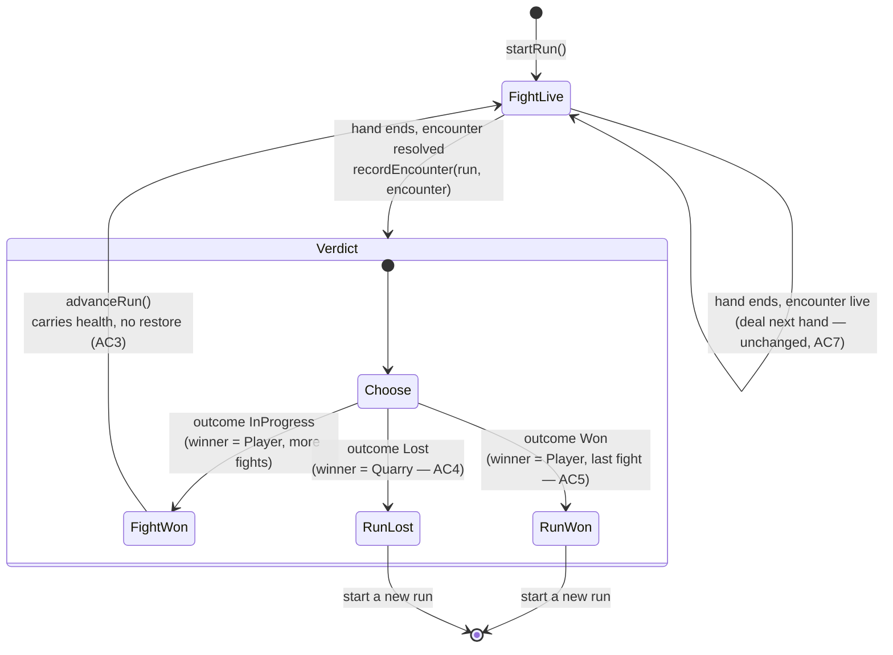

# Plan: Play fights in sequence on one carried health bar

Plan folder: `.claude/contract/DLR-82-play-fights-in-sequence-on-one-health-bar/`
Execution status: see `tasks.md` in this folder.

---

## Part 1 — Alignment

*(The shared understanding of what this task is doing. Restate it in your own words — this is how the developer confirms you read the brief correctly before any design happens. Mismatch here = stop and fix.)*

### Task reference

**Jira: DLR-82 — "Play fights in sequence on one carried health bar"** (Story, `engine` + `playable`, parent epic DLR-81 "Run slice — sequenced fights, a spendable charge, and a shop").

Problem statement, verbatim from the ticket:

> The app plays one encounter and stops. Winning states an outcome and offers nothing further, so there is no run — and without a run there is nothing for a shop to prepare you for and no reason for any upgrade to matter. This is the foundation the rest of the epic sits on, and it is worth playing on its own before anything is bought or sold.

User story:

> As a player, I want to win a fight and be taken straight into a tougher one on the health I have left, so that the fight I just played has consequences for the next one.

Acceptance criteria, verbatim:

1. A run holds an ordered list of enemy health values read from configuration, with at least three entries that are not all the same.
2. Winning an encounter advances the run to the next Quarry rather than ending the session; the outcome panel offers a way to continue.
3. Player health is carried into the next fight at the value it ended the previous one — it is not reset, and nothing restores it.
4. Player health reaching zero at any point ends the run, and no further fight is offered.
5. Winning the final fight in the sequence ends the run as a win, distinguishably from winning an intermediate fight.
6. The player can see which fight of the run they are on.
7. Existing behaviour inside a single encounter is unchanged — hands re-deal, damage lands per trick, and the bank and multiplier work exactly as they do today.

Scope boundaries, verbatim — **in scope:** run state holding the encounter sequence and the player's carried health; a configured rising enemy-health curve with at least three fights; the transition from a won encounter into the next one, and the screen state that offers it; run-lost and run-won end states. **Out of scope:** any currency, shop, item or purchase; healing, restore between fights, or the flask; five stages, stage gimmicks and the boss (this is a flat sequence of fights); any change to enemy damage per hit, which stays at 1; different Quarry behaviour per fight — every opponent plays the same, only its health differs.

Dependencies and risks, verbatim:

> `ENCOUNTERS_PER_RUN` and `QUARRY_ENCOUNTER_HEALTH` already exist in `src/hunt/config.ts` with no consumer, and `ENCOUNTER_PLAYER_RESTORE` exists but is deliberately left unread by this story. Health already survives hand-to-hand inside an encounter via the state carried in `src/App.tsx`, so the work is extending that across one more boundary rather than building carry-over from nothing.
>
> Risk worth knowing before playing: on current numbers a fight costs the player roughly four health and they start with ten, so a three-fight run is expected to be lost around the third fight. That is the arithmetic working, not a bug — it is the gap the later stories and the flask exist to close. Do not respond to it by raising starting health.

**Developer's added brief, typed at invocation (2026-08-15), verbatim:**

> Also some feed back the player didn't know when she beat the opponit or lose so a nice YOU WIN would be good. Nice and clear

This is play-session feedback and is treated as such (see Assumptions made → *Reading the feedback*). It is in scope for this ticket because AC2, AC4 and AC5 all require an outcome surface anyway, and the observed failure is exactly that today's terminal state is a small `<p role="status">` sentence inside a table panel with no control on it — a dead end the player cannot read as "you won" or act on.

### Restated goal

Turn the app's single encounter into a **run**: an ordered sequence of at least three Quarries, each with its own configured health, fought one after another on a single player health bar that is never restored. Winning a fight takes the player into the next one with the health they finished on; losing at any point ends the run there and offers no further fight; winning the last fight ends the run as a win that reads plainly differently from winning an intermediate one. The player can see which fight of the run they are on at all times, and — the developer's play-session note — the moment a fight or the run resolves, the screen says so **loudly and unambiguously**: a full-screen verdict with a headline, not a sentence in a table. Nothing about how a single hand plays changes.

### In scope

- A new pure module `src/hunt/run.ts` holding `RunState` — the encounter sequence position, the live `EncounterState`, and the derived run outcome — plus its transitions (`startRun`, `recordEncounter`, `canAdvanceRun`, `advanceRun`), fully unit-tested with no renderer.
- `QUARRY_ENCOUNTER_HEALTH` in `src/hunt/config.ts` widened from `[10]` to a rising curve of at least three entries that are not all equal (AC1), with the specific values routed to the developer as a tuning decision.
- `ENCOUNTERS_PER_RUN` re-derived from `QUARRY_ENCOUNTER_HEALTH.length` so run length has exactly one source of truth (it is currently a free-standing `5` against a one-entry array).
- `src/App.tsx` rewritten as the run driver: it owns `RunState`, deals hands within an encounter as it does today, and switches to the run-outcome screen when an encounter resolves.
- A new full-viewport `RunOutcomePanel` under `src/app/run/` rendering three distinguishable verdicts — **fight won (more to come)**, **run won**, **run lost** — each with a large headline, the run position, the carried health, a **tricks-taken bar row** for the deciding hand, and exactly one forward control.
- A run-position readout in the existing status band (AC6), supplied to the mount as a pre-formatted string so the card layer stays ignorant of the run.
- **Deletion of the felt's terminal hand panel** (developer decision at the 2026-08-15 approval gate): a resolved encounter no longer renders a tally table and an outcome sentence on the felt. The tap that clears the deciding trick carries the player straight to the verdict screen, and the tricks-taken figures move onto that screen. This removes `RoundOverPanel`'s `winner` branch, its `winner` prop, and `ENCOUNTER_OUTCOME`.
- Updates to every existing spec that asserts against the changed config values, the changed mount props, or the deleted terminal panel.

### Explicitly out of scope

- Currency, shop, items, purchases — the rest of epic DLR-81.
- Healing, between-fight restore, and the flask. `ENCOUNTER_PLAYER_RESTORE` stays exported and **deliberately unread**; this plan does not wire it in, per the ticket.
- Stages, stage gimmicks, and a boss. This is a flat sequence.
- Any change to `DAMAGE_PER_HIT`, the bank, the multiplier, the skull curve, the telegraph, or anything inside `src/warCouncil/`.
- Per-fight Quarry behaviour or a per-fight character. `SLICE_QUARRY_CHARACTER` stays a single label for every opponent in the run.
- Raising `PLAYER_START_HEALTH` to make a three-fight run survivable. The ticket explicitly forbids this response.
- Persisting a run across a page reload.
- Retuning the health-bar colours, the panel typography, or any existing visual token.

### Pattern Reference

The brief names `src/hunt/config.ts` and `src/App.tsx` directly; both are authoritative here. Beyond those, chosen from the code as it stands:

- **`src/hunt/encounter.ts`** is the pattern for `src/hunt/run.ts` — a pure module of immutable state plus named transitions that return new state, guarding illegal input with `RangeError` rather than returning `undefined`, and reading every number from `config.ts`. `run.ts` is the same shape one level up.
- **`src/app/warCouncil/`** is the pattern for the new `src/app/run/` folder: a component, a sibling `labels.ts` owning every user-visible string, a scoped `.css` file, and specs under `__tests__/`.
- **`src/app/warCouncil/RoundOverPanel.tsx`** is the pattern for `RunOutcomePanel` — a component that computes nothing and renders what it is handed.
- **`src/app/warCouncil/warCouncil.css`'s `.wc-shell`** is the full-viewport grid pattern the run screen must match (`100dvh`, `overflow: hidden`, safe-area insets, `clamp()` sizing).
- `.claude/skills/react-frontend/SKILL.md` and `.claude/skills/game-ux/SKILL.md` for conventions — not restated here.

Cited specifications rather than re-derived: AC1–AC7 above; `src/hunt/encounter.ts`'s existing rulings on clamping, overkill and `SIMULTANEOUS_DEPLETION_WINNER`, which this plan does not touch.

### Constraints flagged on the brief

- **AC7 is the hard constraint**: existing single-encounter behaviour must be unchanged. Everything inside `src/warCouncil/` and `src/app/warCouncil/roundReducer.ts` is off-limits; the only edits to `src/app/warCouncil/` are a pass-through prop and a control on the terminal panel.
- **`ENCOUNTER_PLAYER_RESTORE` must stay unread.** The ticket says so explicitly. A final-verification grep confirms it.
- **Do not raise `PLAYER_START_HEALTH`** in response to the run being hard. The ticket names this as the wrong reaction and predicts a loss around fight three as correct arithmetic.
- **Two runtime dependencies only** (`react`, `react-dom`). This plan adds none.
- **No `100vh` / `100vw`** anywhere in the new CSS — `game-ux`'s hard floor and the existing shell's own convention.
- **400-line file budget**, measured with `(Get-Content <path>).Count` — not `Measure-Object -Line`, which drops blank lines and hid a real breach on DLR-63.

### Assumptions made

- **Run length is `QUARRY_ENCOUNTER_HEALTH.length`, and `ENCOUNTERS_PER_RUN` becomes a derived alias of it.** AC1 makes the array the authority. Leaving a free-standing `ENCOUNTERS_PER_RUN = 5` beside a three-entry array is two sources of truth for the same fact and would throw a `RangeError` from `quarryHealthForEncounter(3)` the moment anything trusted the constant. Deriving it keeps the name the epic references without the drift.
- **The health curve's *shape* is rising and its *values* are the developer's.** AC1 requires ≥3 entries, not all equal; it does not name numbers. The plan writes a documented placeholder and routes the values to the gate (see Risks). This is not an invented tuning value — it is a placeholder with the decision surfaced.
- **`RunState` owns the live `EncounterState` rather than duplicating player health beside it.** A `playerHealth` field on the run alongside `encounter.health[Player]` is two copies of one number that drift the first time one is updated without the other; the carried value is read out of the encounter that just ended.
- **Advancing to the next fight is an explicit player action, not automatic.** AC2 says the outcome panel *offers a way to continue*, which requires a control. It also gives the verdict somewhere to be read before the felt changes underneath the player.
- **The felt's terminal hand panel is deleted rather than given a control — CONFIRMED BY THE DEVELOPER at the 2026-08-15 approval gate.** The first draft kept the existing tally panel on a resolved encounter and added a forward control to it, costing two taps to reach the next fight. The developer's ruling is to remove that screen and fold its figures into the verdict. So: when the encounter resolves, the felt shows the deciding trick and the tap that clears it reports straight up to the run layer. One tap, and the trick that ended the fight is now actually seen — today it is skipped, because the terminal panel is checked ahead of the resolved-trick reveal.
- **The verdict's tricks-taken bars are grouped, not chronological.** The developer asked for "a bar for each, green for taken and red for lost". The engine records `tricksWon` as two counts and keeps **no per-trick winner sequence**, so the bars render as *N* taken followed by *M* lost. Play order would require adding a history array to `src/warCouncil/`, which AC7 puts out of bounds. Flagged in Risks.
- **The bars show the deciding hand's tricks, not the whole fight's.** `WarCouncilRoundResult.finalState.tricksWon` is per-hand, and nothing accumulates tricks across the several hands a fight takes. The deciding hand is the one whose figures exist.
- **The tricks row appears on all three verdicts, not only the win.** The developer named the win screen; the data and the panel are identical in all three, and suppressing it on a loss would be a special case with no stated reason. Flagged in Risks so it can be narrowed.
- **The run verdict is a separate full-screen surface owned by `App`, not a branch inside `WarCouncilRound`.** `WarCouncilRound` implements a card-layer contract and knows nothing about runs; threading run state through it to render a run verdict would make the card layer depend on the run layer for one screen. `App` already owns the run, so it owns the screen. This keeps AC7's "unchanged encounter behaviour" true by construction.
- **The card layer learns the run position as a pre-formatted string (`runLabel`), not as a `RunState`.** Same reason: the string is presentation the run layer already owns, and a `runLabel: string` prop cannot grow into a second run-state consumer.
- **The hand counter stays monotonic across the whole run.** It is React's remount `key` and it feeds `dealerForRound`'s parity, so continuing to count keeps the dealer alternating naturally across a fight boundary and keeps every key distinct. Resetting it per fight would restart the dealer alternation with no stated reason to.
- **A run-lost and a run-won screen each offer "start a new run".** *Not stated by any AC* — AC4 only says no further *fight* is offered, which a restart is not. Without it the player hits a dead screen and must reload the browser to play again, on a ticket labelled `playable`. Flagged in Risks so the developer can strike it; striking it costs one control and one handler.
- **Reading the feedback** (per `game-ux`, observation separated from prescribed fix): the *observation* is "the player did not know when she beat the opponent or lost". The *prescribed fix* is "a nice YOU WIN". The observation is taken as authoritative; the prescription is treated as a clue. The failure is **signs and feedback** on the terminal state of the felt zone, hit once per fight (three-plus times a run). Today's terminal state is one `<p role="status">` line inside a tally table, with no control and no change of surface — visually near-identical to the ordinary between-hands panel. The fix taken is a change of *channel* (a distinct full-screen surface with a headline) rather than only a change of *wording*, because rewording a sentence in the same place would not fix "did not notice it".
- **Copy is placeholder and the developer's.** Every new string lands in a `labels.ts` beside its component, exactly as `ENCOUNTER_OUTCOME` already is, marked as the developer's to rewrite.
- **The verdict copy stays generic and does NOT name the Quarry — CONFIRMED BY THE DEVELOPER at the 2026-08-15 approval gate.** `FIGHT WON` / `YOU WIN` / `YOU LOSE` and `Next fight`, not `Aoife defeated` / `Fight Cillian`. The reason is that the roster does not exist yet: `SLICE_QUARRY_CHARACTER` names **one** character for the whole run and `QUARRY_CHARACTERS` holds **one** of five entries, so naming the Quarry here would print "The Monarch" on every fight of the run — and `quarryCharacterInfo` returns `undefined` for the other four, so name-based copy would need a fallback that is exercised the moment the roster grows. **DLR-85** owns the roster (Aoife, Cillian, Niamh, …) and its AC8 already specifies the named continue button. A note was added to **DLR-85's** description at this gate naming `RunOutcomePanel.tsx`, `runLabels.ts` (`RUN_HEADLINE`, `NEXT_FIGHT_LABEL`) and the `runLabel` band readout as surfaces it must update in step, so the map and the verdict cannot ship one named and one anonymous. **The executor must not name the Quarry on any surface in this ticket.**

### Config and persisted-shape audit

Performed against the working tree with `Grep` on 2026-08-15. Counts are matched lines, not files.

- **`QUARRY_ENCOUNTER_HEALTH` — 10 hits across 5 files.** `src/hunt/config.ts:24,32,35`; `src/hunt/index.ts:21`; `src/hunt/__tests__/config.test.ts:9,87`; `src/hunt/__tests__/encounter.test.ts:6,85,143`; `src/hunt/encounter.ts:17` (docblock). The **type does not change** — it stays `readonly Health[]`; only its length and contents do. The only hits that must change in the same task are `config.ts:24` (the values) and `config.test.ts:87` (`expect(QUARRY_ENCOUNTER_HEALTH).toHaveLength(1)` and `expect(() => quarryHealthForEncounter(1)).toThrow(RangeError)` — both false the instant the array grows). `encounter.test.ts` indexes `[0]` only and stays green. `encounter.ts:17`'s docblock names "DLR-73's" for the sequencing this ticket now does; corrected in the same task as a stale-comment fix.
- **`ENCOUNTERS_PER_RUN` — 4 hits across 3 files.** `src/hunt/config.ts:58`; `src/hunt/index.ts:16`; `src/hunt/__tests__/config.test.ts:4,28`. **Zero production consumers** — the ticket says so and the grep confirms it: the only reader is its own test asserting `toBe(5)`. Retyping it as `QUARRY_ENCOUNTER_HEALTH.length` therefore changes exactly one assertion, in the same task.
- **`quarryHealthForEncounter` — ~40 hits across 12 files.** Signature, parameter type and return type are all **unchanged**, and its `RangeError` contract is unchanged; only the range of indices that do not throw widens. No call site needs editing. `src/App.tsx:33` is the exception and it is deleted, not edited — `MAX_HEALTH` stops being a module constant because the Quarry's maximum now varies per fight.
- **`ENCOUNTER_PLAYER_RESTORE` — 4 hits across 3 files.** `src/hunt/config.ts:45`; `src/hunt/index.ts:23`; `src/hunt/__tests__/config.test.ts:11,53`. Deliberately **unread by production code** and this plan keeps it that way; Final verification greps `src/` outside `hunt/` for the name and expects zero hits.
- **`SLICE_ENCOUNTER_INDEX` — 3 hits, all in `src/App.tsx` (:22, :33, :41).** A module-local constant with no external reader; deleted wholesale by the run driver that replaces it.
- **Persisted shapes: nothing is persisted.** `localStorage`, `sessionStorage`, `indexedDB` and `JSON.parse` return **zero hits across all of `src/`**. There is no save file, no stored log, and no replay. Recording that explicitly, per the audit's own instruction: **the window is open** — a run can be reshaped freely today, and this ticket does not close it. The first ticket that persists a run inherits the obligation to version `RunState`.
- **Type changes and their loss:** none is lossy. `QUARRY_ENCOUNTER_HEALTH` gains elements at the same element type. `ENCOUNTERS_PER_RUN` goes from a literal `5` to a `number` derived from `.length` — TypeScript widens the inferred type from `5` to `number`, which no consumer depends on (there are none). `WarCouncilMountProps` gains a **required** `runLabel: string`; required-not-optional is deliberate so the compiler enumerates the three construction sites rather than letting one silently render an empty band. Those three are `WarCouncilRound.test.tsx:23-31`, `WarCouncilRound.duelHealthBars.test.tsx:32-38` and `:152-158`, plus `src/App.tsx` — all in the same task.
- **Names bound by string:** the new CSS class names (`run-*`), the new accessible names on the run panel's controls, and the run-panel headline copy. All are new, so nothing is being renamed and there is no old reader to strand.
- **Names bound by string that are DELETED** (the developer's gate ruling removing the terminal hand panel). `ENCOUNTER_OUTCOME` — **3 hits across 2 files**: `src/app/warCouncil/labels.ts:85` (the declaration), `src/app/warCouncil/RoundOverPanel.tsx:3` (the import) and `:69` (the only render). Zero readers survive its branch, so it is deleted, not orphaned. The CSS class `.wc-terminal` — **2 hits across 2 files**: `RoundOverPanel.tsx:68` and `warCouncilHealthBars.css:101`; the rule is deleted with its only user. Three existing assertions in `RoundOverPanel.test.tsx` go with the branch — `:27-29` (the `winner`-dependent heading), `:45-49` and `:51-55` (the two terminal-outcome cases). The `winner` prop is removed from `RoundOverPanelProps` entirely, so the compiler flags the one production call site that still passes it (`WarCouncilRound.tsx:212`) rather than leaving a silently ignored prop.
- **Architectural boundary:** `src/hunt/**` is lint-enforced pure (no React import, no DOM global, per `eslint.config.js`'s `no-restricted-imports` / `no-restricted-globals` override). `src/hunt/run.ts` sits inside it and the design keeps it there — it imports only `./config`, `./types` and `./encounter`, holds no JSX, and touches no global. All presentation for the run lives in `src/app/run/`, outside the boundary. Final verification greps the tree.

---

## Part 2 — Technical design

### Approach

The work splits cleanly into three layers, and the split is the whole design: a **pure run module** that holds every rule, a **run driver** in `App.tsx` that is a state machine with no arithmetic in it, and a **run verdict screen** that renders what it is handed. Everything with an invariant worth testing lands in the first layer and is unit-tested with no renderer.

`src/hunt/run.ts` introduces `RunState` — `{ encounterIndex, encounterCount, encounter, outcome }` — where `encounter` is the existing `EncounterState` and `outcome` is a three-value `as const` map (`InProgress` / `Won` / `Lost`). It holds **no separate player-health field**: the carried health is `encounter.health[DuelSide.Player]`, and `advanceRun` reads it out of the encounter that just ended and hands it straight to `startEncounter(nextIndex, carried)`, which already takes player health as an injectable parameter. That parameter is why AC3 is nearly free — the carry-over path already exists and has never had a second caller. Four transitions: `startRun()` builds fight 0 at `PLAYER_START_HEALTH`; `recordEncounter(run, encounter)` adopts the encounter a hand reported upward and re-derives `outcome`; `canAdvanceRun(run)` is the single statement of "the Quarry is down and there is another fight"; `advanceRun(run)` produces the next fight or throws. The outcome derivation is three lines and is the one place AC4 and AC5 are decided — `winner === Quarry` is `Lost` regardless of position, `winner === Player` on the last index is `Won`, and `winner === Player` anywhere else stays `InProgress` with the run awaiting the player's continue. Run *length* comes from `QUARRY_ENCOUNTER_HEALTH.length` rather than from `ENCOUNTERS_PER_RUN`, and `ENCOUNTERS_PER_RUN` is redefined as an alias of that length so the two cannot disagree.

The alternative considered and rejected was **putting the sequence inside `EncounterState`** — an `encounterIndex` field on the existing shape, with `applyDamage` advancing it. That collapses two lifetimes into one type: `EncounterState` is handed down into the reducer and mutated per trick, and giving it a run-level field means every reducer transition is nominally able to advance the run. Keeping them separate means the card layer physically cannot end a run, which is what makes AC7 provable rather than merely intended. A second rejected option was **deriving the run entirely from a list of finished encounters** (an append-only log); it is elegant and it is what a replay would want, but nothing is persisted and nothing replays today, so it buys an abstraction with no consumer.

`App.tsx` becomes the driver and stays small. It holds four pieces of state — `run`, the monotonic hand counter, the dealt round, and the deciding hand's trick split (`TrickTally`, captured from the result that resolved the encounter, so the verdict can show it) — and switches on `run`: while the encounter is live it renders `WarCouncilRound` exactly as today; when `handleComplete` reports a resolved encounter it renders `RunOutcomePanel` instead. `maxHealth` stops being a module-level constant (the Quarry's maximum now varies per fight) and is derived per render from `run.encounterIndex`; the player's half stays `PLAYER_START_HEALTH`, which is the bar's denominator, not its current value — this is the one place a stale maximum would silently mis-draw a bar, so it is derived from the same index the encounter was started from. There is no effect anywhere in `App`: every transition is a callback from a control, so there is nothing to clean up and StrictMode's double mount only re-runs two pure lazy initialisers.

The verdict screen is the developer's feedback, and it is a **change of channel, not of wording**. `src/app/run/RunOutcomePanel.tsx` is its own full-viewport surface — the same `100dvh` / `overflow: hidden` / safe-area shell the felt uses, per `game-ux`'s hard floor — with a headline sized to be unmissable, a supporting line naming the run position and the health carried, a tricks-taken bar row, and exactly one control. Three states, distinguishable without relying on colour or motion alone (different headline text, different rule form above it, different supporting line, different control label): fight won with more to come, run won, run lost. The panel computes nothing; `App` hands it the outcome, the position, the carried health, the two trick counts and the two handlers, and every string comes from a sibling `runLabels.ts` marked as the developer's to rewrite. The tricks row is the developer's gate ruling — a bar per trick, taken and lost — and because red-vs-green alone fails `game-ux`'s no-colour-only floor, a lost bar is also hatched and outlined where a taken bar is solid, and the row carries a text count for a reader who sees neither.

**The felt's terminal hand panel is deleted, not extended** — the second half of that ruling. Today `WarCouncilRound` checks `encounterOver` *ahead of* `resolvedTrick`, so the trick that ends a fight never gets its reveal and the player lands on a tally table with no control: the dead end that produced the feedback. Removing that branch inverts both problems at once. The deciding trick now shows in `TrickWell` like any other, and the tap that clears it hits `handleCarryOn`, whose **existing** first line is already `if (encounterOver) { onComplete(...) }` — so the report upward needs no new code path and, critically, **no effect**: it stays a user tap, not a `useEffect` that StrictMode would fire twice. One tap replaces two. The one gap this opens is an encounter resolving with nothing held and the hand not complete, where no branch would carry a tap; the fix is to widen the felt's existing click target (`wc-is-waiting` and the `onClick` on `.wc-table`) to include `encounterOver`, so any tap anywhere reports up. `RoundOverPanel` loses its `winner` prop and reverts to what it now solely is — the between-hands tally — and `ENCOUNTER_OUTCOME` and `.wc-terminal` are deleted with the branch that was their only reader.

AC6's "which fight am I on" goes into the existing status band, which is already the edge-anchored HUD `game-ux` wants status in, threaded through `WarCouncilMountProps` as a pre-formatted `runLabel: string` so the card layer never sees a `RunState`.

### Skills to invoke during execution

- `react-frontend` — owns everything under `src/`: `src/hunt/run.ts`'s shape and purity, `App.tsx`'s state ownership, the new components, the 400-line budget, and Vitest placement (pure logic tested without a renderer; component tests by accessible role and label). Note its live constraint on `vite.config.ts`: the `node` project collects `*.test.ts` and the `dom` project collects `*.test.tsx` — a spec's extension decides its environment, so `run.test.ts` must stay DOM-free and `RunOutcomePanel.test.tsx` must be `.tsx`.
- `game-ux` — owns the run verdict as a *game screen*: the full-viewport no-scroll shell, where the run-position readout is anchored, the tap cost of continuing, and the rule that a state must read without colour or motion alone. Also owns the method used on the developer's play-session note in Part 1 → Assumptions made.

Developer override at the Step 1.5c gate: `game-designer` and `implementation-doc-writer` were offered and **not** ticked. The curve's shape is transcribed from AC1 rather than designed, and `implementation-doc-writer` runs at `/fb-apply` close-out rather than as a task skill.

Also read before executing: `.claude/workflow/web-project.md` (paths, runners, and the `Select-String` recursion and `Measure-Object` traps). `.claude/rules/` was scanned — it contains only `README.md`, so **no rule files apply**.

### Diagram



### Data shapes

#### New — `src/hunt/run.ts`

```ts
import { PLAYER_START_HEALTH, QUARRY_ENCOUNTER_HEALTH } from './config'
import { startEncounter } from './encounter'
import { DuelSide, type EncounterState, type Health } from './types'

/** How a run has ended, or that it has not. `InProgress` covers both "the fight is still being
 *  played" and "the fight is won and the next one is waiting on the player" — the difference is
 *  `encounter.winner`, not a fourth outcome, so there is one place a run can be over. */
export const RunOutcome = {
  InProgress: 'inProgress',
  Won: 'won',
  Lost: 'lost',
} as const
export type RunOutcome = (typeof RunOutcome)[keyof typeof RunOutcome]

/**
 * One run: a position in the configured encounter sequence plus the encounter being fought at
 * that position. Holds NO separate player-health field — the carried figure is
 * `encounter.health[DuelSide.Player]`, and a second copy beside it is a number that drifts.
 */
export interface RunState {
  /** 0-based index into `QUARRY_ENCOUNTER_HEALTH`. */
  readonly encounterIndex: number
  /** `QUARRY_ENCOUNTER_HEALTH.length`, carried on the state so a renderer needs no config import. */
  readonly encounterCount: number
  readonly encounter: EncounterState
  readonly outcome: RunOutcome
}

export function startRun(playerHealth?: Health): RunState
export function recordEncounter(run: RunState, encounter: EncounterState): RunState
export function canAdvanceRun(run: RunState): boolean
export function advanceRun(run: RunState): RunState
```

`startRun` defaults `playerHealth` to `PLAYER_START_HEALTH` — the same injectable-parameter pattern `startEncounter` already uses, so a spec varies it without touching module state. `advanceRun` throws a `RangeError` when `canAdvanceRun` is false, matching `applyDamage`'s existing refusal style rather than returning the run unchanged.

#### Modified — `src/hunt/config.ts`

```ts
// AC1 — at least three entries, rising, not all the same. PLACEHOLDER VALUES: the shape is the
// ticket's, the numbers are the DEVELOPER'S (see plan.md Part 2 -> Risks and judgement calls).
// UNIT: health points, one entry per encounter, indexed 0..n-1.
export const QUARRY_ENCOUNTER_HEALTH: readonly Health[] = [10, 14, 18]

// §9 "Encounters per run" — DERIVED, not chosen. The array above is the single source of truth
// for run length (AC1); a free-standing number beside it is the second source that drifts, and a
// value larger than the array is a RangeError from `quarryHealthForEncounter` waiting to happen.
export const ENCOUNTERS_PER_RUN = QUARRY_ENCOUNTER_HEALTH.length
```

`Health`, `Damage`, `EncounterState`, `DuelSide`, `IncomingDamage`, `Hunt` and `Quarry` in `src/hunt/types.ts` are **unchanged**. `startEncounter`, `applyDamage`, `isEncounterResolved` and `quarryHealthForEncounter` keep their exact signatures.

#### Modified — `src/hunt/index.ts`

```ts
export type { RunState } from './run'
export { RunOutcome, startRun, recordEncounter, canAdvanceRun, advanceRun } from './run'
```

#### Modified — `src/app/warCouncilMount.ts`

```ts
export interface WarCouncilMountProps {
  readonly initialState: WarCouncilState
  readonly hunt: Hunt
  readonly encounter: EncounterState
  readonly maxHealth: Readonly<Record<DuelSide, Health>>
  /** AC6 — which fight of the run this is, already worded by the run layer. A STRING, not a
   *  `RunState`: the card layer renders the run's position and must not be able to read or
   *  change it. Required rather than optional so the compiler enumerates every mount site. */
  readonly runLabel: string
  readonly onComplete: (result: WarCouncilRoundResult) => void
}
```

`WarCouncilRoundResult` is unchanged.

#### New — `src/app/run/runLabels.ts`

```ts
import { RunOutcome } from '../../hunt'

/** AC6's readout for the status band. 0-based index in, 1-based fight number out. */
export function runProgressText(encounterIndex: number, encounterCount: number): string

/** The verdict headline. `fightWon` is the fourth case the RunOutcome union does not carry:
 *  outcome `InProgress` with the Quarry down. Placeholder copy — the wording is the developer's. */
export const RUN_HEADLINE: Readonly<Record<RunOutcome | 'fightWon', string>> = {
  fightWon: 'FIGHT WON',
  [RunOutcome.Won]: 'YOU WIN',
  [RunOutcome.Lost]: 'YOU LOSE',
  [RunOutcome.InProgress]: 'FIGHT WON', // unreachable in practice; kept total for the Record
}

export const NEXT_FIGHT_LABEL = 'Next fight'
export const NEW_RUN_LABEL = 'Start a new run'
export const TRICKS_TAKEN_LABEL = 'Tricks taken'

/** The supporting line under the headline — run position and the health being carried. */
export function runVerdictDetail(
  outcome: RunOutcome,
  encounterIndex: number,
  encounterCount: number,
  carriedHealth: Health,
): string

/** The tricks row's own sentence, for a reader who sees neither the bars nor their colour.
 *  `game-ux`: a state must not depend on colour alone. */
export function tricksTakenText(taken: number, lost: number): string
```

#### New — `src/app/run/RunOutcomePanel.tsx`

```tsx
/** The deciding hand's trick split, as two counts. The engine keeps NO per-trick winner
 *  sequence (`WarCouncilState` carries `tricksWon` as a Record of two numbers), so the bars are
 *  grouped — `taken` solid bars then `lost` hatched bars — not in play order. */
export interface TrickTally {
  readonly taken: number
  readonly lost: number
}

interface RunOutcomePanelProps {
  readonly outcome: RunOutcome
  readonly encounterIndex: number
  readonly encounterCount: number
  readonly carriedHealth: Health
  readonly tricks: TrickTally
  /** `true` when the Quarry is down and another fight remains — the only state offering
   *  `onNextFight`. Handed in rather than derived so this component computes nothing. */
  readonly canContinue: boolean
  readonly onNextFight: () => void
  readonly onNewRun: () => void
}
```

`App` builds `tricks` from the result it already receives — `{ taken: finalState.tricksWon[PlayerSide.Player], lost: finalState.tricksWon[PlayerSide.Cpu] }` — which is why `App` must hold the last `WarCouncilRoundResult`'s `finalState` alongside the run.

#### Modified — `src/app/warCouncil/RoundOverPanel.tsx`

The `winner` branch is **deleted**, and with it the `winner` prop. The component reverts to the between-hands tally it now solely is:

```ts
interface RoundOverPanelProps {
  readonly tricksWon: Readonly<Record<PlayerSide, number>>
  readonly handSummary: HandSummary
  readonly onFinish: () => void
}
```

The heading becomes the constant `'The hand is over'`. `ENCOUNTER_OUTCOME` is **removed** from `src/app/warCouncil/labels.ts` and the `.wc-terminal` rule from `warCouncilHealthBars.css`; both had this branch as their only reader. `FINISH_ROUND_LABEL` is unchanged and no new label is added here.

#### Modified — `src/app/warCouncil/WarCouncilRound.tsx`

No prop or type change beyond `runLabel` passing through to the band. Two behavioural edits, both in the render chain:

- the `if (encounterOver)` branch that rendered `RoundOverPanel` with a `winner` is **removed**, so a resolved encounter falls through to the deciding trick's own `TrickWell` reveal;
- the felt's existing waiting affordance widens to cover it — `wc-is-waiting` and the `onClick` on `.wc-table` become `ui.resolvedTrick || quarryToLead || encounterOver`, so a tap always has somewhere to land.

`handleCarryOn`, `interactive`, `encounterOver` and `handSummary` are **unchanged**: `handleCarryOn` already tests `encounterOver` first and calls `onComplete`, and `interactive` already excludes it so no card can be played into a finished fight.

#### Modified — `src/app/warCouncil/RoundStatusBand.tsx`

```ts
interface RoundStatusBandProps {
  readonly tricksWon: Readonly<Record<PlayerSide, number>>
  readonly tricksPlayed: number
  readonly opponentHandCount: number
  readonly roundComplete: boolean
  readonly bars: readonly HealthBarView[]
  /** AC6 — rendered verbatim, edge-anchored beside the opponent plate. */
  readonly runLabel: string
}
```

#### New CSS class names — `src/app/run/run.css`

`.run-shell` (the `100dvh` / `overflow: hidden` / safe-area grid), `.run-verdict`, `.run-rule`, `.run-headline`, `.run-detail`, `.run-carry`, `.run-tricks`, `.run-trick` (with a `.is-lost` modifier), `.run-actions`. Sizes bound with `clamp()`; the `clamp()` bounds and any new colour are the developer's, so the sheet reuses the existing `--wc-*` tokens from `warCouncil.css` rather than introducing new ones — a taken trick is `--wc-poison` and solid, a lost trick is `--wc-alarm`, hatched, and outlined, so the two differ in form as well as hue.

#### `package.json`, `tsconfig.json`, `vite.config.ts`, `eslint.config.js`

**No changes.** No new dependency, no new script, no new Vitest project — `run.test.ts` lands in the existing `node` project and the two new `.test.tsx` specs in the existing `dom` project.

### Runtime quality notes

- **Purity and adjudication:** every run rule lives in `src/hunt/run.ts`, inside the lint-enforced pure-core boundary — no React import, no DOM global, no JSX, imports limited to `./config`, `./types` and `./encounter`. It is unit-tested with plain function-in/value-out assertions under the `node` Vitest project. `RunOutcomePanel` and `RoundOverPanel` decide nothing: `canContinue` and `outcome` arrive as props, so a component cannot disagree with `canAdvanceRun` about whether a run is over. `App.tsx` calls the transitions and switches on the result; it performs no health arithmetic and no index arithmetic of its own. Every number — starting health, each Quarry's health, run length — is read from `config.ts`; the only literal in the new code is the `0` seeding the first encounter index, which is a position, not a tunable.
- **Effects, mount and teardown:** **no `useEffect` is added anywhere.** `App` has none today and gains none — every transition is a click handler on a control. There is therefore no listener, observer, timer, `requestAnimationFrame`, `AbortController` or pointer capture introduced, and nothing to release. `useState`'s two lazy initialisers (`startRun()` and the first `dealRound`) are pure, so StrictMode's development double-invocation recomputes identical values; `dealRound` takes `Math.random` and will produce a different deal on the second invocation, but React discards the second initialiser's result, which is exactly today's behaviour and unchanged by this ticket. There is **no module-level mutable state**: `HUNT` stays a frozen-by-convention constant, and `MAX_HEALTH` stops being module-level precisely because it is no longer constant across a run. The remount `key` stays the monotonic hand counter, so a new fight remounts `WarCouncilRound` and its reducer re-seeds from the new encounter rather than carrying the previous fight's `openingEncounter` baseline.
- **Hot-path cost:** nothing here is on a pointer path. The run transitions fire once per hand at most, and each allocates one small object. `runProgressText` is called once per render of the status band and does string interpolation over two integers. No memoisation is added — there is no profiling evidence for any, and per `react-frontend` none may be added without it. No collection is scanned per event; `QUARRY_ENCOUNTER_HEALTH` is indexed, never searched.
- **Determinism and numeric safety:** the deal's randomness is unchanged — `App` still passes `Math.random` to `dealRound`, exactly as today, and this ticket introduces no new random source and no seed path. **There is no division anywhere in the new code**, so no epsilon is needed and the classic `NaN` source is absent. The two arithmetic operations are `encounterIndex + 1` and reading `encounter.health[Player]`, and both are guarded upstream: `advanceRun` refuses unless `canAdvanceRun`, and `startEncounter` already throws a `RangeError` on a non-finite or non-positive player health, so a poisoned carry cannot start a fight. `quarryHealthForEncounter` already throws rather than returning `undefined` for an out-of-range index — the guard that stops a bad index becoming a `NaN` bar with nothing logged. The health-bar denominators come from the same index the encounter was started from, so a bar's maximum cannot disagree with its opening value.
- **Error paths:** `advanceRun` on a run that cannot advance throws a `RangeError` naming the index and the outcome — it does **not** return the run unchanged, which would present a stuck screen as success. `startRun` propagates `startEncounter`'s and `quarryHealthForEncounter`'s existing `RangeError`s rather than catching them, so a mis-configured `QUARRY_ENCOUNTER_HEALTH` (an empty array, a zero entry) fails loudly at startup instead of rendering an empty bar. Nothing is caught and converted into a default. There is **no new async surface** — no fetch, no timer, no promise — so the four async states do not arise. Every user-facing failure state is a run outcome, not an error: `Lost` is a game state with its own screen, not an exception.

### Risks and judgement calls

- **The health curve's values are the developer's, and unchosen.** `[10, 14, 18]` is a documented placeholder satisfying AC1's letter (three entries, rising, not all equal) and nothing more. The ticket's own arithmetic predicts a loss around fight three at these numbers and says that is correct — so the decision is whether to ship those, or a gentler ramp, or more than three fights. Whatever is chosen goes in `config.ts` as data; the code reads `.length` and does not care.
- **`ENCOUNTERS_PER_RUN` stops being an independently settable `5`.** It becomes an alias of the array's length. If the developer wants it to remain a separately chosen number — a run shorter than the configured curve, taking the first N entries — say so at this gate, because that is a different design (the run would slice the array) and it changes `run.ts`'s `encounterCount`.
- **A run-lost / run-won screen offering "start a new run" is an assumption, not an AC.** It is the difference between a playtestable build and one that needs a browser reload between runs. Strike it if it belongs to a later ticket.
- **Deleting the felt's terminal panel is the developer's own gate ruling, and it removes a screen that exists today.** Recorded here as a decision rather than an assumption. Two consequences worth confirming: the deciding trick now gets a reveal beat it has never had (today it is skipped — `WarCouncilRound.tsx:174-185`'s comment says so explicitly), and the hand tally that panel showed — health lost, health dealt to the Quarry — is **not** carried onto the verdict screen; only the trick split is. If those two figures are wanted on the verdict, say so and they join `TrickTally`.
- **The tricks bars are grouped, not chronological, because the data does not exist.** `WarCouncilState` carries `tricksWon` as two counts and no per-trick winner history, so the row is *N* solid then *M* hatched. Rendering them in play order means adding a history array to `src/warCouncil/`, which AC7 puts out of bounds for this ticket — it is a clean follow-up if the order matters.
- **The tricks row is shown on all three verdicts.** The developer named the win screen; the panel and the data are identical in all three. Narrow it to the wins if a loss screen should be barer.
- **Red/green alone is not enough** and the plan does not rely on it: a lost trick is hatched and outlined as well as red, and the row carries a text count. This is `game-ux`'s hard floor, not a preference — but the exact hues are the developer's, and the plan reuses `--wc-poison` and `--wc-alarm` rather than picking new ones.
- **All new copy is placeholder.** `FIGHT WON` / `YOU WIN` / `YOU LOSE`, `Tricks taken`, `Next fight`, `Start a new run`, and the supporting detail line. The developer asked for "a nice YOU WIN — nice and clear"; these are that, rendered as a headline, but the words are theirs to set.
- **The verdict headline's size, weight and colour are unchosen.** The plan reuses the existing `--wc-*` tokens rather than inventing new ones, and bounds the headline with `clamp()`, but the bounds themselves are tuning values. Whether it actually reads as unmissable is a judgement call that can only be made by playing.
- **Whether the run screen is a full surface or an overlay over the frozen felt** is a feel question. The plan takes the full surface, because the observation was "she did not notice"; an overlay keeps context but competes with the felt for attention.
- **`ENCOUNTER_PLAYER_RESTORE` stays at `0` and unread.** The ticket demands it and Final verification greps for it. If a run at the chosen curve proves unplayable, the flask and the restore are the later stories' answer — not this ticket's.
- **No spec drives a full run end-to-end through real card play.** Winning three fights through the reducer requires a fixed deck and dozens of scripted taps per fight, and it would pin the CPU's play rather than the run's rules. Instead: `run.ts` is exhaustively unit-tested (every transition, every outcome boundary, the carry, the refusal), `RunOutcomePanel` is component-tested by role and label, and **the end-to-end run — win a fight, continue, see health carried, reach a verdict — is QA's, driven in a real browser.** Flagged here so it is a stated choice and not a gap.
