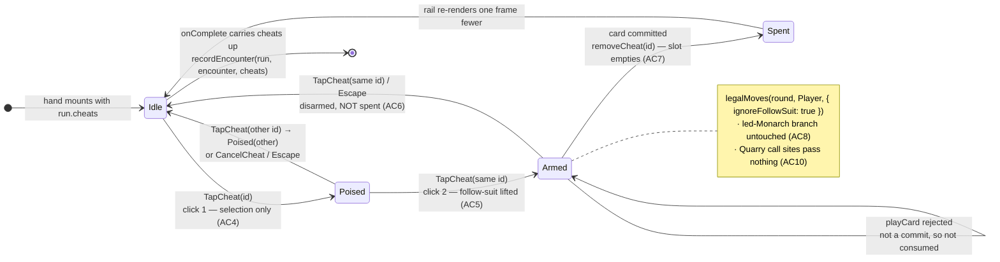

# Plan: Hold Cheat cards in two slots and play one to ignore follow-suit

Plan folder: `.claude/contract/DLR-83-hold-cheat-cards-in-two-slots/`
Execution status: see `tasks.md` in this folder.

---

## Part 1 — Alignment

*(The shared understanding of what this task is doing. Restate it in your own words — this is how the developer confirms you read the brief correctly before any design happens. Mismatch here = stop and fix.)*

### Task reference

**Jira: DLR-83 — "Hold Cheat cards in two slots and play one to ignore follow-suit"** (Story, labels `ui` + `playable`, parent epic DLR-81 "Run slice — sequenced fights, a spendable charge, and a shop"). Transitioned `To Do → Planning` at the start of this run.

Problem statement, verbatim:

> The worst tricks to lose are the ones the player had no legal way to refuse — most often when the Quarry cannot follow suit and hands over a skull at any rank, which no amount of skull rank-weighting can reach. It is recorded twice as a known unfairness and nothing answers it.
>
> It is also the single most valuable thing a shop could sell. Every trick not lost works on both ends at once: one less point of health spent, and a longer streak, which pays quadratically. So the item that answers the grievance is the same item that makes a run last longer and the same item that makes a hand more interesting to play.
>
> This story builds the Cheat card and its slots, and grants cards for free so they can be played with. Selling them is DLR-84.

User story:

> As a player, I want to hold Cheat cards in a couple of slots and play one during a hand, so that I can play a card follow-suit would otherwise forbid and refuse a trick I would have been forced to take.

The shape, as specified by the developer, verbatim:

> The player has **two slots**, shown as two empty card frames. A Cheat card occupies one slot. During a hand, **clicking a held Cheat card twice** plays it: the next card the player commits ignores the follow-suit rule, and the Cheat card is then **gone**. One use, one card, one slot freed.

Acceptance criteria, verbatim:

1. The player has exactly two Cheat slots, visible during a hand whether they are filled or empty.
2. A slot holds at most one Cheat card; a full pair of slots cannot take a third.
3. Cards are granted at the start of a run from configuration, and slot contents carry across fights within a run.
4. Playing a held Cheat card takes two clicks on it — the first arms it, the second commits — so it can never be spent by a single misclick.
5. While a Cheat is armed, the player may play any card in hand that follow-suit would otherwise forbid, and the state is visible — it is obvious that the next card played is the one the Cheat covers.
6. The player can disarm an armed Cheat without spending it, before committing a card.
7. Committing a card while a Cheat is armed consumes that Cheat card and empties its slot.
8. The Cheat covers follow-suit only. The led-Monarch narrowing still binds, and every other rule is unchanged.
9. With both slots empty, legal play is exactly what it is today.
10. The Quarry gains nothing from this — it follows suit exactly as it does now, and holds no Cheats.

Scope boundaries, verbatim — **in scope:** two Cheat slots held in run state, carried across fights; the Cheat card as a held, consumable object rather than a counter; arm / disarm / commit, on double click, with the armed state visible; a bypass path through the follow-suit constraint, used only when an armed Cheat is committed; cards granted at the start of a run from configuration. **Out of scope:** buying Cheats, the coin, and the shop screen (DLR-84); healing; more than two slots and any second kind of card that could occupy one; slots or cards persisting between runs; giving the boss or any Quarry the same ability; any change to the bank, the multiplier, or damage.

Dependencies and risks, verbatim:

> Blocked by DLR-82 — slot contents are run-level state, so run state has to exist first.
>
> Follow-suit is enforced in one place (`src/warCouncil/legalMoves.ts`), so the rules half is small; the slots, the armed state and the double-click are the substantial half, which is why this is labelled `ui`.
>
> **Two slots is a cap, and a useful one.** It bounds how much trick-avoidance a player can carry into any hand. The skull is the only thing stopping "take every trick" from being correct, so unlimited Cheats would remove the game's only inversion. Two is nowhere near that line — the cap is what keeps it that way.
>
> The question the play session answers is whether holding a Cheat changes how a hand is played before it is spent. If it is only ever spent reflexively on the first illegal-looking moment, the interesting version is one where holding it has visible value and the decision is _when_, not _whether_.

Design assets, verbatim:

> Developer's specification, 2026-08-15: two slots drawn as empty card frames, a bought Cheat stored in one, two clicks to play it, consumed on use.

**Blocking dependency status, verified on disk 2026-08-16:** DLR-82 is implemented. `src/hunt/run.ts` exists with `RunState`, `startRun`, `recordEncounter`, `canAdvanceRun`, `advanceRun`; `src/App.tsx` is the run driver; `src/app/run/` holds `RunOutcomePanel`. Nothing in this plan is blocked.

### Restated goal

Give the player two Cheat slots that live on the run, not on the hand — so what is in them survives a fight boundary exactly the way carried health does — and render them as two card frames on the felt during every hand, filled or empty. A Cheat is a held object with its own identity, not a counter. Two clicks on a held Cheat arm it (the first click only selects, so a single misclick can never spend it); while it is armed the follow-suit constraint is lifted for the player and the hand fan visibly opens up, so the player can refuse a trick they would otherwise have been forced to take. The next card they commit consumes that Cheat and empties its slot. A third click on the armed Cheat gives it back unspent. The led-Monarch narrowing is untouched, the Quarry is untouched, and with both slots empty the game plays exactly as it does today. Cards are granted at run start from a configuration key; nothing here buys, sells, or heals.

### In scope

- A new pure module `src/hunt/cheats.ts` holding `CheatCard`, `CheatCardId`, and the slot rules — `grantCheats`, `addCheat`, `removeCheat`, `hasCheat` — with the two-slot cap enforced in that module and nowhere else (AC2), unit-tested with no renderer.
- Two new configuration keys in `src/hunt/config.ts`: `CHEAT_SLOT_COUNT` (AC1/AC2) and `RUN_STARTING_CHEATS` (AC3), both exported through `src/hunt/index.ts`.
- `RunState` in `src/hunt/run.ts` gains `cheats` and `nextCheatId`; `startRun` grants from configuration, `advanceRun` carries them across the fight boundary (AC3), and `recordEncounter` takes the hand's surviving cheats as a required third argument so a spend cannot be dropped on the way up.
- An optional `LegalMoveOptions` parameter on `legalMoves` and on `playCard` in `src/warCouncil/` that lifts the follow-suit narrowing only — the Monarch branch is a separate, untouched branch (AC8) — passed by the player's path alone so the Quarry's call sites provably never see it (AC10).
- `RoundUiState` in `src/app/warCouncil/roundReducer.ts` gains the hand's live `cheats` and a single `cheatSelection` field carrying both the poised and armed stages; two new actions, `TapCheat` and `CancelCheat`, implement AC4, AC6 and AC7.
- A new `src/app/warCouncil/CheatSlots.tsx` rendering exactly `CHEAT_SLOT_COUNT` frames, filled from the head of the list (AC1), with the poised and armed states distinguishable in form as well as colour — mounted **on the felt directly beneath the decree pile**, as the second register of one felt-left plate.
- `WarCouncilMountProps` gains `cheats`; `WarCouncilRoundResult` gains `cheats`, mirroring exactly how `encounter` already flows down as an opening figure and back up as a final one.
- `WarCouncilRound.tsx` widens the player's legal set while a Cheat is armed, adds a hint-cascade case for the armed state, and wraps `DecreePile` and `CheatSlots` in a shared `.wc-felt-rail` column on the felt.
- Copy for the rail in `src/app/warCouncil/labels.ts`, marked placeholder as the file's existing strings are.
- Updates to every existing spec whose fixture constructs mount props, a reducer seed, or a `RunState`.

### Explicitly out of scope

- Buying a Cheat, the coin, and the shop screen — DLR-84. This plan adds `addCheat` and `nextCheatId` because the slot cap has to be stated once and ids have to be unique, but no purchase path, no price, and no shop surface.
- Healing, `ENCOUNTER_PLAYER_RESTORE`, and the flask. Untouched and still unread by production code.
- A third slot, a second kind of card, or any per-Quarry variation in what a slot may hold.
- Persisting cheats across a page reload or between runs. `startRun` re-grants from configuration; nothing is stored.
- Giving the Quarry, a boss, or any CPU path a Cheat or a follow-suit bypass.
- Any change to the bank, the multiplier, damage, the skull curve, the telegraph, the health bars, or the run verdict screen.
- Any change to the Monarch follow set or to `monarchFollowSet`.
- Retuning existing colours, typography, or `clamp()` bounds.

### Pattern Reference

The brief names `src/warCouncil/legalMoves.ts` directly as the single place follow-suit is enforced; verified — `legalMoves` has exactly three non-test callers (`playCard.ts:38`, `cpuPlayer.ts:51`, `roundReducer.ts:249,277`) plus the player's own set at `WarCouncilRound.tsx:91`. Beyond that, chosen from the code as it stands:

- **`src/hunt/run.ts`** is the pattern for `src/hunt/cheats.ts` — a pure module of immutable state plus named transitions returning new state, refusing illegal input with a `RangeError` that names the offending figure rather than returning `undefined`, reading every number from `config.ts`.
- **The `encounter` prop / `WarCouncilRoundResult.encounter` round trip** (`src/app/warCouncilMount.ts:8-9, 30-34`) is the exact pattern `cheats` follows: an opening figure handed down, owned by the reducer for the life of the hand, handed back as a final figure. `warCouncilMount.ts`'s own docblock states the contract and this plan does not invent a second one.
- **`RoundUiState.armed`** (`roundReducer.ts:32`) is the pattern for the Cheat's own two-stage selection — tap once to lift, tap again to commit, on the object itself. `game-ux`'s tap-cost rule names this explicitly, and the Cheat reuses the same interaction language rather than inventing a second one.
- **`src/app/warCouncil/RoundStatusBand.tsx:1`** is the precedent for a card-layer component importing a constant straight from `../../hunt` (`HAND_SIZE`); `CheatSlots.tsx` imports `CHEAT_SLOT_COUNT` the same way rather than taking it as a prop.
- **`DecreePile.tsx` and `.wc-pile`** (`warCouncil.css:249-258`) are the pattern the Cheat slots join and match: a felt-left column of card-sized frames under `.wc-plate-label` captions, sitting in `.wc-table`'s left spacer column (`grid-column: 1; justify-self: start; align-self: center`) so the trick stays centred. `DecreePile`'s own docblock states why it lives on the felt rather than in a corner plate — "trump is the most-consulted value in a trick-taking game and a corner is where it gets occluded" — and the same reasoning carries the Cheats.
- `.claude/skills/react-frontend/SKILL.md` and `.claude/skills/game-ux/SKILL.md` for conventions — not restated here.

Cited rather than re-derived: AC1–AC10 above; `legalMoves`'s own docblock on the Monarch follow set and DLR-81's deletion of the round-long narrowing; `warCouncilMount.ts`'s statement that `finalState.phase` is not a reliable "encounter over" signal.

### Constraints flagged on the brief

- **AC8 and AC10 are the hard rule constraints.** The Cheat lifts follow-suit and nothing else. The Monarch branch and the Quarry's own legality are provably untouched, and the plan's Final verification greps for that rather than asserting it.
- **AC9** — with no cheats held, behaviour must be byte-identical to today. The bypass is an optional parameter that defaults to off, so the no-cheat path is the existing code path unchanged.
- **Two slots is a cap the ticket defends at length**, not a number to widen. `CHEAT_SLOT_COUNT` exists as a key so the cap is stated once, not so it is easy to raise.
- **Two runtime dependencies only** (`react`, `react-dom`). This plan adds none.
- **No `100vh` / `100vw`** anywhere in the new CSS — `game-ux`'s hard floor and the existing shell's own convention.
- **400-line file budget**, measured with `(Get-Content <path>).Count` — *not* `Measure-Object -Line`, which drops blank lines and hid a real breach on DLR-63. Three files are close and all three are measured explicitly in Final verification: `WarCouncilRound.tsx` at **308**, `roundReducer.ts` at **285**, and — the tight one — **`warCouncil.css` at 398, two lines under the limit**, which is why every new rule lands in a new sheet and that file takes a net deletion only.
- **Interactive controls ≥44×44px.** The slot frames are drawn at the condensed plate size, so the hit area is padded rather than the frame enlarged.

### Assumptions made

- **A Cheat is `{ id }` and nothing else.** The ticket says "a held, consumable object rather than a counter" but names no other property. An id gives a stable React key, makes "this specific card was spent" unambiguous, and gives DLR-84 something to attach a price or a kind to without reshaping the field. No `kind`, no `name`, no price is added — that is DLR-84's.
- **Slots are modelled as a capped list, not a fixed-length array with holes.** `readonly CheatCard[]` capped at `CHEAT_SLOT_COUNT`, rendered as `CHEAT_SLOT_COUNT` frames filled from the head. Every Cheat is identical, so which physical slot holds one carries no information, and a `(CheatCard | null)[]` would add hole-bookkeeping to every transition to model a distinction the player cannot observe. AC1's "visible whether filled or empty" and AC2's cap are both satisfied; AC7's "empties its slot" is a removal.
- **Ids are minted from a monotonic `nextCheatId` on the run, starting at 1.** Determinism matters — `src/hunt/` is lint-enforced DOM-free and nothing there may reach `Math.random()`. A counter also stops DLR-84's mid-run purchase from re-issuing an id already spent, which would silently collide as a React key. Flagged in Risks as the one piece of forward-looking machinery here.
- **The cheat's arm state lives in `roundReducer`, not on the run.** It is a within-hand selection with exactly the lifetime of `ui.armed`, it is cleared by a remount, and putting it on `RunState` would make a run-level type carry a UI transient. The *cards* are run state; the *arming* is not.
- **The spend reaches the run through `WarCouncilRoundResult`, not through a callback.** A reducer cannot call a prop, and the codebase already solved this exact problem for `encounter`: down as an opening figure, owned by the reducer, back up as a final one. Mid-hand the rail renders from reducer state, so the slot empties immediately on screen; `App` adopts at hand end. `onComplete` fires at the end of every hand, so no spend can be stranded.
- **`recordEncounter` takes `cheats` as a required third parameter** rather than a separate `setRunCheats` transition. Two transitions that must both be called to adopt one hand's outcome is one that will eventually be forgotten; a required parameter makes the compiler enumerate the four call sites instead.
- **The bypass is an options parameter on `legalMoves`/`playCard`, not a field on `RoundState`.** A field on `RoundState` would be visible to `chooseCpuMove`'s own `legalMoves` call and would make AC10 a matter of care rather than of construction. As a parameter, the Quarry's three call sites simply do not pass it, and a grep proves it.
- **The Cheat is consumed whenever a card is committed while it is armed — even if that card was legal anyway (AC7, literally).** No "was it actually needed" check. A conditional consume would make the cost of arming invisible until after the fact, and it would put a legality judgement in the reducer that `legalMoves` already owns.
- **A rejected `playCard` does not consume the Cheat.** AC7 says *committing* a card consumes it; a rejection is not a commit. The armed state survives so the player can try another card.
- **A third click on the armed Cheat disarms it (AC6), and `Escape` on the rail does the same.** AC6 requires a disarm path and names none. Reusing the same control the player already has their pointer on is `game-ux`'s "confirmation on the object" rule read in reverse, and it costs no new control. `Escape` is the keyboard equivalent already used by `useRovingTabIndex` for the hand.
- **Disarming clears a poised hand card that the narrowing has just made illegal.** Otherwise the player is left holding a selection that will be rejected on its next tap, with no visible cause. The check is `containsCard(legalMoves(round, Player), armed)` — existing helpers, no new rule.
- **The slots sit on the felt directly beneath the decree pile, as one plate — DEVELOPER'S RED-LINE at the 2026-08-16 gate.** The first draft put them in the hand zone's left edge; the developer's ruling is "make the cheat closer to the deck… they are too far and don't look connected". So `DecreePile` and `CheatSlots` share a `.wc-felt-rail` column in `.wc-table`'s left spacer, separated by a hairline rather than by whitespace, at matching frame widths under matching `.wc-plate-label` captions. This is the better read anyway: `.wc-pile` is already a vertical stack of card-sized things with captions, and the Cheat is a *table* resource like the decree rather than part of the hand. **Consequence: `warCouncilHand.css` is no longer touched at all** and `.wc-hand` stays the unused rule it is today.
- **The slots are side by side, not stacked.** The felt-left column is height-constrained between the band and the hand, and the decree pile already occupies most of it; a row of two also reads as "a pair of slots" where a vertical stack reads as a list. Their own token `--wc-cheat-slot-w` is sized slightly under `--wc-plate-card-w` so the pair's overall width lines up with the pile above it.
- **The rail stops click propagation.** `.wc-table` carries an `onClick` that fires `handleCarryOn` whenever the felt is waiting (`WarCouncilRound.tsx:271-273`), and the slots now live inside it — so without `stopPropagation` on the rail, arming a Cheat while a trick reveal is held would *also* clear the reveal and commit the Quarry's lead. One handler on the rail wrapper, not one per button.
- **The slot frames are condensed relative to hand cards**, at `2/3` aspect to match `.wc-pile-back`. `game-ux`: cards outside the hand are condensed and the fan keeps visual precedence. The hit area is padded to ≥2.75rem so the ≥44px floor holds at the small end of the clamp.
- **`RUN_STARTING_CHEATS` gets a documented placeholder of `2`.** The ticket says cards are "granted for free so they can be played with" and AC3 requires the grant come from configuration, but names no number. `2` fills both slots so the mechanic is actually exercisable in a play session. The value itself is routed to the gate (see Risks) — the plan does not treat it as settled.
- **`CHEAT_SLOT_COUNT = 2` is transcribed, not chosen.** AC1 and AC2 both say "exactly two" and the Dependencies section defends the cap at length. It is a key so the number is stated once, not because the value is open.
- **All new copy is placeholder**, marked as such in `labels.ts` exactly as `FINISH_ROUND_LABEL` and `TRICK_OUTCOME_MESSAGE` already are.
- **No end-to-end spec drives a full cheated trick through real card play.** Forcing a void-suit position through the real deal needs a fixed deck and would pin the CPU's play rather than the rule. Instead the rule is unit-tested at `legalMoves`/`playCard`, the transitions at `roundReducer`, the rail by role and label, and the whole loop is QA's in a real browser.

### Config and persisted-shape audit

Performed against the working tree with `grep -rn` on 2026-08-16. Counts are matched lines across `src/**`, not files.

- **`CHEAT_SLOT_COUNT` and `RUN_STARTING_CHEATS` — 0 hits each.** Both are new. `cheat` case-insensitively across `src/` and `.docs/` returns **3 hits, all in `.docs/design/…/ideas.md`** (lines 93, 1358, 1366) and all about a boss's "cheat tool" in a retired design paragraph — no code, no stylesheet, and no copy binds either name today, so nothing is being renamed and no reader can be stranded.
- **`legalMoves` — 37 hits across 11 files.** Non-test callers: `playCard.ts:38` (player and Quarry), `cpuPlayer.ts:51` (Quarry only), `roundReducer.ts:249` and `:277` (Quarry only), `WarCouncilRound.tsx:91` (player only). The signature gains a **trailing optional** parameter, so **no existing call site needs editing** and none of the six test files that import it break. Exactly two sites gain the argument: `WarCouncilRound.tsx:91` and `roundReducer.ts`'s `commit`. The three Quarry sites are left untouched, which is what makes AC10 structural.
- **`playCard` — 59 hits across 14 files.** Signature gains a **fifth, optional** parameter after the existing optional `choice`. Every existing call site — including all four `__tests__` files that exercise it — compiles unchanged. One production site passes the new argument: `roundReducer.ts`'s `commit`.
- **`recordEncounter` — 17 hits across 4 files** (`src/hunt/run.ts`, `src/hunt/index.ts`, `src/App.tsx`, `src/hunt/__tests__/run.test.ts`). This is the one **breaking** signature change in the plan: a required third parameter. Required rather than optional deliberately — an optional `cheats` would let `App` silently drop a spend and the run would quietly refill the slot. The compiler enumerates every site; all are in the one task that makes the change.
- **`startRun` — 19 hits / `advanceRun` — 12 / `canAdvanceRun` — 12**, across the same four files. **No signature changes.** `startRun` gains behaviour (it grants cheats); `advanceRun` carries them for free through its existing `...run` spread; `canAdvanceRun` is untouched. `run.test.ts` gains assertions rather than edits.
- **`WarCouncilMountProps` — 7 hits across 4 files** (`src/app/index.ts`, `src/app/warCouncilMount.ts`, `src/app/warCouncil/WarCouncilRound.tsx`, `src/app/warCouncil/__tests__/WarCouncilRound.test.tsx`). Adding a **required** `cheats` follows the `runLabel` precedent DLR-82 set and for the same reason: the compiler must enumerate every mount site rather than let one render an empty rail. Construction sites the compiler will flag are `src/App.tsx` and the fixtures in `WarCouncilRound.test.tsx` and `WarCouncilRound.duelHealthBars.test.tsx` (which has two, at the shapes DLR-82 recorded).
- **`WarCouncilRoundResult` — 5 hits across 3 files** (`src/App.tsx`, `src/app/index.ts`, `src/app/warCouncilMount.ts`). Gains a required `cheats`. Both producers are in `WarCouncilRound.tsx`'s `handleCarryOn` (two `onComplete` calls, `:177` and `:185`); the sole consumer is `App.handleComplete`. `onComplete` — 33 hits across 6 files — has its shape asserted in two `.test.tsx` fixtures, which the same task updates.
- **`RoundUiSeed` / `createRoundUiState` — 9 hits across 4 files**: `roundReducer.ts` (declaration + initialiser), `WarCouncilRound.tsx` (the `useReducer` seed), and the fixtures in `roundReducer.test.ts` (5) and `roundReducer.bank.test.ts` (2). The seed gains `cheats`; every one of those sites is named in the task that changes it.
- **`IllegalMoveReason` — 51 hits across the tree; `MustFollowLeadSuit` — 5 hits** (`types.ts:106` declaration, `playCard.ts:48` producer, `labels.ts:47` copy, `playCard.test.ts:74` and `roundReducer.test.ts:216` assertions). **No reason code is added, removed, or renamed.** The bypass widens the legal set *before* the rejection branch is reached, so `MustFollowLeadSuit` simply stops being produced for a cheated play — its wording, its key, and both assertions stand.
- **Type changes and their loss:** none is lossy. `RunState` gains two required fields, so every construction site is enumerated by the compiler (all are inside `run.ts` plus its spec). `legalMoves` and `playCard` widen by an optional trailing parameter — a strictly backward-compatible change. `recordEncounter`, `WarCouncilMountProps` and `WarCouncilRoundResult` gain required members, which is the deliberate loud form. No `number → string`, no array → object, no required → optional, and no union widened such that a `switch` must grow a case.
- **Persisted shapes: still nothing is persisted.** `localStorage`, `sessionStorage`, `indexedDB` and `JSON.parse` return **zero hits across all of `src/`** — re-verified this run. There is no save file, no stored log, no replay. DLR-82 recorded that this window is open; **it stays open.** This ticket adds `cheats` and `nextCheatId` to `RunState` without persisting either, so the first ticket that persists a run inherits the obligation to version the whole shape including these.
- **Names bound by string:** the new CSS class names (`wc-cheat-*`, `wc-felt-rail`, `wc-felt-rail-split`) and the new accessible names and placeholder copy on the slot buttons. All are new, so nothing is renamed and no stylesheet selector is stranded. The one **pre-existing** selector this plan edits is **`.wc-pile`** — declared once at `warCouncil.css:249` and used once at `DecreePile.tsx:24`, a 1:1 pair. It keeps its name and its children; only three positioning properties move up to the new `.wc-felt-rail` wrapper, so no consumer changes. `.wc-hand` (`warCouncilHand.css:7`, **zero consumers**) is deliberately left alone after the gate red-line moved the slots to the felt — this ticket neither uses nor deletes it, which is the same state it was in before.
- **Architectural boundary:** `src/hunt/**` and `src/warCouncil/**` are lint-enforced pure (no React import, no DOM global, per `eslint.config.js`'s `no-restricted-imports` / `no-restricted-globals` override). `src/hunt/cheats.ts` sits inside it and stays there — it imports only `./config` and holds no JSX. `legalMoves.ts` and `playCard.ts` gain a plain interface and no import. All presentation lives in `src/app/warCouncil/`, outside the boundary. Final verification greps both trees.

---

## Part 2 — Technical design

### Approach

The design turns on one observation from the brief: **follow-suit is enforced in exactly one function**, and every caller of that function is either unambiguously the player's or unambiguously the Quarry's. So the rules half of this ticket is an optional parameter. `legalMoves(state, side, options?)` gains `LegalMoveOptions = { ignoreFollowSuit?: boolean }`; when it is set, the `else` branch that narrows to `cardsOfSuit(hand, led.suit)` returns the whole hand instead. The `if (led.rank === CardRank.Monarch)` branch above it is a *different branch* and is not reached in that case, so AC8 holds by construction rather than by a guard someone could later delete. `playCard` takes the same options and threads them into its own `legalMoves` call, so the legal set and the rejection reason cannot disagree — the invariant `playCard.ts:40-49` already comments on. The parameter is trailing and optional, which is why **not one existing call site changes**: with no cheat armed the code path is byte-identical to today, and that is AC9.

AC10 is the mirror of the same fact. The Quarry reaches `legalMoves` at `cpuPlayer.ts:51` and `roundReducer.ts:249,277`, and reaches `playCard` at `roundReducer.ts:255` and through `commitQuarryMove`. None of those five sites is given an argument to pass, so the Quarry cannot be handed a bypass without someone editing a line that has no reason to be edited — and Final verification greps for exactly that. The alternative considered and rejected was **a `followSuitWaived` flag on `RoundState`**: it reads more naturally at the call sites, but `chooseCpuMove` calls `legalMoves(state, side)` on the same state object, so the flag would reach the Quarry automatically and AC10 would become a matter of remembering to clear it.

The state half splits across three lifetimes, and getting that split right is the rest of the design. **The cards are run state** — `src/hunt/cheats.ts` owns `CheatCard`, the two-slot cap, and the four transitions; `RunState` holds `cheats` and a monotonic `nextCheatId`; `startRun` grants `RUN_STARTING_CHEATS` and `advanceRun` carries them across the fight boundary through its existing spread, which is AC3 for free. **The arming is hand state** — it has exactly the lifetime of `ui.armed`, dies on remount, and would be a UI transient sitting on a domain type if it went on the run. It lives in `RoundUiState` as one field, `cheatSelection: { id, stage } | null`, rather than two nullable fields, because two nullables admit the invalid pair "poised *and* armed" and one discriminated field does not. **The bridge between the two is the existing `encounter` round trip**: `WarCouncilMountProps.cheats` is the opening figure, the reducer owns it for the life of the hand, and `WarCouncilRoundResult.cheats` is the final one. `warCouncilMount.ts` already documents that contract for `encounter`; this adds a second passenger to it rather than inventing a callback a reducer could not call anyway. Mid-hand the rail renders from reducer state, so a spent slot empties on screen immediately; `App.handleComplete` adopts at hand end via `recordEncounter(run, encounter, cheats)`.

`roundReducer` gains two actions. `TapCheat` is a four-way transition on one id — nothing selected becomes poised; poised on the same id becomes armed (AC4's two clicks, both on the object, per `game-ux`); armed on the same id becomes nothing (AC6); a tap on a *different* id poises that one. `CancelCheat` clears the selection and, because disarming re-narrows the legal set, also clears `ui.armed` when that card has just become illegal — otherwise the player holds a selection that will be rejected on its next tap with no visible cause. Consumption is a two-line addition inside the existing `commit`: it reads whether the selection is armed, passes `{ ignoreFollowSuit: true }` to `playCard`, and on success removes that card from `state.cheats`. On a rejection it changes nothing, so a refused play does not eat the Cheat.

The screen work lands **on the felt, joined to the deck** — the developer's red-line at the approval gate ("make the cheat closer to the deck… they are too far and don't look connected"). `.wc-table` is already a three-column grid whose left spacer column holds `.wc-pile`: the decree card, two decorative backs, a trump chip and the draw-pile count, stacked vertically under `.wc-plate-label` captions and pinned `justify-self: start` so the trick stays centred. `CheatSlots` becomes the second register of that same plate. `DecreePile` and `CheatSlots` are wrapped in a new `.wc-felt-rail` column which takes over `.wc-pile`'s three positioning properties (`grid-column`, `justify-self`, `align-self`), and a hairline `.wc-felt-rail-split` separates the registers so they read as one object with two parts rather than two objects that happen to be near each other. The slots sit side by side rather than stacked — the felt column is height-constrained and the pile already occupies most of it — at a `2/3` aspect matching `.wc-pile-back`, under a `Cheats` caption in the same style as `Decree`. **`warCouncilHand.css` is not touched at all**, and `.wc-hand` stays the unused rule it is today.

One correctness detail falls out of that move and must not be missed: `.wc-table` carries an `onClick` that fires `handleCarryOn` whenever the felt is waiting (`WarCouncilRound.tsx:271-273`). The slots now live *inside* that element, so a click on a slot would bubble into it — arming a Cheat while a trick reveal is held would also clear the reveal and commit the Quarry's lead. `.wc-cheat-rail` therefore carries `onClick={(e) => e.stopPropagation()}` on the wrapper, one handler rather than one per button.

`CheatSlots.tsx` renders exactly `CHEAT_SLOT_COUNT` frames filled from the head of the list — a filled slot is a `<button>` with `aria-pressed` reflecting the armed stage, an empty slot a non-interactive framed `<span>` with its own accessible name. Two or fewer controls means no roving tabindex is warranted (`game-ux` sets that threshold at about five); plain tab stops with `Escape` to cancel is the right shape, and `Escape` is assertable in a component test where layout is not. Three signals carry AC5's "obvious", none of them colour alone: the armed slot gains a solid brass frame, a lift and a corner notch where the poised slot gets a dashed edge, the hint line reads the armed state, and — the strongest of the three — the fan's greyed-out illegal cards simply stop being grey, because `WarCouncilRound.tsx:91`'s `legal` is now computed with the bypass on.

### Skills to invoke during execution

- `react-frontend` — owns everything under `src/`: `src/hunt/cheats.ts`'s shape and its purity inside the lint-enforced boundary, the reducer's two new actions and the single-field selection shape, `CheatSlots.tsx`, the 400-line budget (`WarCouncilRound.tsx` at 308 and `roundReducer.ts` at 285 both grow), and Vitest placement. Note the live constraint in `vite.config.ts`: the `node` project collects `*.test.ts` and the `dom` project collects `*.test.tsx`, so a spec's extension decides its environment — `cheats.test.ts` must stay DOM-free and `CheatSlots.test.tsx` must be `.tsx`.
- `game-ux` — owns the rail as part of a game screen: whether two more frames fit in the felt-left column of the no-scroll `100dvh` shell without crowding the decree pile or the trick, the tap cost of the double click and its placement on the object rather than at a distant button, the ≥44px hit area under a condensed frame, and the rule that empty, held, poised and armed must be distinguishable without colour or motion alone.

No developer override was applied at the Step 1.5c gate — both proposed skills were ticked. `game-designer` was offered and **not** ticked: the ticket's open question about *when* a Cheat is spent is explicitly deferred to a play session, so shaping it here would be designing something the brief defers.

Also read before executing: `.claude/workflow/web-project.md` (paths, runners, and the `Select-String` recursion and `Measure-Object` traps). `.claude/rules/` was scanned this run — it contains only `README.md`, so **no rule files apply**.

### Diagram



### Data shapes

#### New — `src/hunt/cheats.ts`

```ts
import { CHEAT_SLOT_COUNT } from './config'

/** A Cheat's identity. Minted from `RunState.nextCheatId`, never from `Math.random()` —
 *  `src/hunt/` is lint-enforced DOM-free and must stay deterministic. */
export type CheatCardId = number

/**
 * One held Cheat. An OBJECT, not a counter (DLR-83 scope): it carries an identity so a spend
 * names a specific card, so React has a stable key, and so DLR-84 has somewhere to attach a
 * price without reshaping the field. It deliberately carries nothing else — no kind, no name,
 * no cost. Those are DLR-84's.
 */
export interface CheatCard {
  readonly id: CheatCardId
}

/**
 * AC3 — the run's opening grant. Throws rather than clamping: a `RUN_STARTING_CHEATS` above the
 * slot cap is a configuration mistake, and silently handing back fewer cards than the key asks
 * for hides it until someone counts the frames on screen.
 */
export function grantCheats(count: number, firstId: CheatCardId): readonly CheatCard[]

/**
 * AC2 — THE single statement of the two-slot cap. Throws when the slots are full, rather than
 * returning the list unchanged: a silent no-op would let DLR-84 take payment for a card that
 * was never added.
 */
export function addCheat(cheats: readonly CheatCard[], card: CheatCard): readonly CheatCard[]

/** AC7 — the spend. Throws when `id` is not held, so a double-consume is a loud bug rather than
 *  a no-op that leaves the slot looking correct. */
export function removeCheat(cheats: readonly CheatCard[], id: CheatCardId): readonly CheatCard[]

/** Whether `id` is still held — read by the reducer before honouring a stale selection. */
export function hasCheat(cheats: readonly CheatCard[], id: CheatCardId): boolean
```

#### Modified — `src/hunt/config.ts`

```ts
// DLR-83 AC1/AC2 — exactly two slots. TRANSCRIBED FROM THE TICKET, not chosen: the ticket's
// Dependencies section defends the cap at length ("the skull is the only thing stopping 'take
// every trick' from being correct, so unlimited Cheats would remove the game's only inversion").
// A key so the number is stated once, NOT so it is easy to raise.
// UNIT: slots available to the player, for the whole run.
export const CHEAT_SLOT_COUNT = 2

// DLR-83 AC3 — how many Cheats a run opens with. PLACEHOLDER VALUE: the ticket requires the
// grant come from configuration and says cards are granted free "so they can be played with",
// but names no number. 2 fills both slots so the mechanic is exercisable in a play session.
// THE VALUE IS THE DEVELOPER'S — see plan.md Part 2 -> Risks and judgement calls.
// Must be 0..CHEAT_SLOT_COUNT; `grantCheats` throws outside that range rather than clamping.
// UNIT: Cheat cards granted once, at the start of a run.
export const RUN_STARTING_CHEATS = 2
```

Every other key in `config.ts` is unchanged, including `ENCOUNTER_PLAYER_RESTORE`, which stays at `0` and unread.

#### Modified — `src/hunt/run.ts`

```ts
export interface RunState {
  readonly encounterIndex: number
  readonly encounterCount: number
  readonly encounter: EncounterState
  readonly outcome: RunOutcome
  /** AC3 — held Cheats, capped at `CHEAT_SLOT_COUNT` by `cheats.ts` and carried across every
   *  fight boundary. Run state, not hand state: `advanceRun` passes it through untouched. */
  readonly cheats: readonly CheatCard[]
  /** The next id to mint. Monotonic and never reused, so DLR-84's mid-run purchase cannot
   *  re-issue the id of a card already spent — which would collide as a React key. */
  readonly nextCheatId: CheatCardId
}

// startRun: unchanged signature. Now also `cheats: grantCheats(RUN_STARTING_CHEATS, 1)` and
// `nextCheatId: RUN_STARTING_CHEATS + 1`.
export function startRun(playerHealth?: Health): RunState

/** BREAKING (DLR-83): `cheats` is now required. The hand owns the cheats for its lifetime and
 *  hands the survivors back through `WarCouncilRoundResult`; making this a parameter rather than
 *  a second transition means a spend cannot be adopted only half way. */
export function recordEncounter(
  run: RunState,
  encounter: EncounterState,
  cheats: readonly CheatCard[],
): RunState

// canAdvanceRun: UNCHANGED.
// advanceRun: UNCHANGED signature and body — `...run` already carries `cheats` and
// `nextCheatId` into the next fight, which is AC3.
```

#### Modified — `src/hunt/index.ts`

```ts
export type { CheatCard, CheatCardId } from './cheats'
export { grantCheats, addCheat, removeCheat, hasCheat } from './cheats'
export { CHEAT_SLOT_COUNT, RUN_STARTING_CHEATS } from './config'
```

#### Modified — `src/warCouncil/legalMoves.ts`

```ts
/**
 * AC8 — the ONLY thing a Cheat lifts is the follow-suit narrowing. `legalMoves` reaches the
 * follow-suit branch only when the led card is not a Monarch, so the Monarch follow set is a
 * different branch and is untouched by construction, not by a guard.
 *
 * AC10 — an OPTIONS parameter rather than a field on `RoundState` deliberately: the Quarry's
 * three call sites (`cpuPlayer.ts`, and `roundReducer`'s two lead/follow advances) simply pass
 * nothing, so the Quarry cannot be handed a bypass without editing a line that has no reason
 * to change.
 */
export interface LegalMoveOptions {
  readonly ignoreFollowSuit?: boolean
}

export function legalMoves(
  state: RoundState,
  side: PlayerSide,
  options?: LegalMoveOptions,
): readonly Card[]
```

`monarchFollowSet` is **unchanged** — same signature, same body, same docblock.

#### Modified — `src/warCouncil/playCard.ts`

```ts
export function playCard(
  state: RoundState,
  side: PlayerSide,
  card: Card,
  choice?: AbilityChoice,
  options?: LegalMoveOptions,
): PlayCardResult
```

The single body change is `const legal = legalMoves(state, side, options)`. The `monarchConstrained` rejection-reason branch below it is **unchanged**: no `IllegalMoveReason` is added, removed, or renamed, and `MustFollowLeadSuit` simply stops being produced for a cheated play.

#### Modified — `src/warCouncil/index.ts`

```ts
export type { LegalMoveOptions } from './legalMoves'
```

#### Modified — `src/app/warCouncilMount.ts`

```ts
export interface WarCouncilMountProps {
  // …unchanged members…
  /** AC1/AC3 — the run's held Cheats at the START of this hand. Same contract as `encounter`
   *  above: an opening figure the reducer owns for the life of the hand and hands back through
   *  `WarCouncilRoundResult.cheats`. Required, not optional, so the compiler enumerates every
   *  mount site rather than letting one render an empty rail. */
  readonly cheats: readonly CheatCard[]
}

export interface WarCouncilRoundResult {
  // …unchanged members…
  /** AC7 — the Cheats still held after this hand. One fewer than it started with for each
   *  Cheat spent; the run adopts it through `recordEncounter`'s third parameter. */
  readonly cheats: readonly CheatCard[]
}
```

#### Modified — `src/app/warCouncil/roundReducer.ts`

```ts
export const CheatStage = {
  /** One click — a selection, no rule effect. AC4's guard against a single misclick. */
  Poised: 'poised',
  /** Two clicks — follow-suit is lifted for the next committed card. AC5. */
  Armed: 'armed',
} as const
export type CheatStage = (typeof CheatStage)[keyof typeof CheatStage]

/** ONE field, not two nullables: `poised` and `armed` are stages of a single selection, and two
 *  nullable fields would admit the invalid pair "poised AND armed". */
export interface CheatSelection {
  readonly id: CheatCardId
  readonly stage: CheatStage
}

export interface RoundUiState {
  // …unchanged members…
  /** The Cheats this hand holds. Seeded from the mount's prop, decremented in place when one is
   *  spent, and handed back up through `onComplete` — exactly `encounter`'s own round trip. */
  readonly cheats: readonly CheatCard[]
  readonly cheatSelection: CheatSelection | null
}

export interface RoundUiSeed {
  readonly round: WarCouncilState
  readonly encounter: EncounterState
  readonly cheats: readonly CheatCard[]
}

export const RoundUiActionKind = {
  // …unchanged members…
  TapCheat: 'tapCheat',
  CancelCheat: 'cancelCheat',
} as const

export type RoundUiAction =
  // …unchanged variants…
  | { readonly kind: typeof RoundUiActionKind.TapCheat; readonly id: CheatCardId }
  | { readonly kind: typeof RoundUiActionKind.CancelCheat }

/** `true` when the next committed card should ignore follow-suit. Exported so the mount computes
 *  its `legal` set from the SAME predicate the reducer commits with — two readings of "is the
 *  Cheat armed" is exactly how a fan and a rejection reason drift apart. */
export function cheatArmed(state: RoundUiState): boolean
```

`createRoundUiState` seeds `cheats: seed.cheats` and `cheatSelection: null`. It stays a pure restructuring of its seed, so StrictMode's double-invocation still recomputes an identical value.

#### New — `src/app/warCouncil/CheatSlots.tsx`

```tsx
interface CheatSlotsProps {
  /** Rendered into the first `CHEAT_SLOT_COUNT` frames, head first. Never longer than the cap —
   *  `cheats.ts` enforces that; this component asserts nothing and computes nothing. */
  readonly cheats: readonly CheatCard[]
  readonly selection: CheatSelection | null
  /** `false` while a trick reveal is held, a prompt is open, the hand is over or the encounter
   *  has resolved — the same gate `interactive` applies to the fan, so a Cheat cannot be armed
   *  into a moment where no card can be played. */
  readonly interactive: boolean
  readonly onTap: (id: CheatCardId) => void
  readonly onCancel: () => void
}
```

The rail wrapper carries `onClick={(e) => e.stopPropagation()}` and `onKeyDown` for `Escape`. The `stopPropagation` is **load-bearing, not defensive**: `CheatSlots` mounts inside `.wc-table`, which fires `handleCarryOn` on click whenever the felt is waiting, so without it a tap on a slot would clear a held trick reveal and commit the Quarry's lead as a side effect of arming a Cheat.

#### Modified — `src/app/warCouncil/labels.ts`

```ts
/** The Cheat rail's copy. PLACEHOLDER — the wording is the developer's, exactly as
 *  `FINISH_ROUND_LABEL` and `TRICK_OUTCOME_MESSAGE` above are. */
export const CHEAT_RAIL_LABEL = 'Cheats'
export const CHEAT_EMPTY_SLOT_LABEL = 'Empty Cheat slot'
export const CHEAT_ARMED_HINT = 'Cheat armed — play any card in your hand'
export const CHEAT_POISED_HINT = 'Tap the Cheat again to arm it'

/** One slot's accessible name. `stage` is `null` for a held-but-unselected Cheat. */
export function cheatAccessibleName(stage: CheatStage | null): string
```

#### Modified — `src/app/warCouncil/WarCouncilRound.tsx`

No prop change beyond `cheats` arriving and flowing into the reducer seed. Four edits:

- the `useReducer` seed becomes `{ round: initialState, encounter, cheats }`;
- `const legal = legalMoves(ui.round, PlayerSide.Player, cheatArmed(ui) ? { ignoreFollowSuit: true } : undefined)`;
- both `onComplete(...)` calls in `handleCarryOn` gain `cheats: ui.cheats`;
- `DecreePile` is wrapped with `CheatSlots` in the felt-left plate, replacing the bare `<DecreePile …/>` at `:275-279`:

```tsx
<div className="wc-felt-rail">
  <DecreePile decree={…} trumpSuit={…} drawPileCount={…} />
  <div className="wc-felt-rail-split" aria-hidden="true" />
  <CheatSlots
    cheats={ui.cheats}
    selection={ui.cheatSelection}
    interactive={interactive}
    onTap={(id) => dispatch({ kind: RoundUiActionKind.TapCheat, id })}
    onCancel={() => dispatch({ kind: RoundUiActionKind.CancelCheat })}
  />
</div>
```

`deriveHint` gains one case, inserted immediately after the existing `ui.armed` case and before `quarryToLead`, returning `CHEAT_ARMED_HINT` or `CHEAT_POISED_HINT`.

#### Modified — `src/app/warCouncil/warCouncil.css`

**`warCouncil.css` is at 398 lines against a 400-line blocking budget** — measured with `(Get-Content …).Count`, not `Measure-Object -Line`. It therefore takes a **net deletion only**: `.wc-pile` gives up its three positioning properties and its padding to the new wrapper, and every new rule and the new token go into `warCouncilCheats.css` instead. This is the whole change to the file, and it takes it to ~394 lines:

```css
.wc-pile {
  /* grid-column, justify-self, align-self and padding MOVE to `.wc-felt-rail`, declared in
     warCouncilCheats.css — this file is 2 lines under the 400-line budget and cannot take
     a new block. Nothing else about the pile changes and it renders identically. */
  display: flex;
  flex-direction: column;
  align-items: center;
  gap: clamp(0.2rem, 0.7vmin, 0.4rem);
}
```

**`warCouncilHand.css` is NOT modified.** `.wc-hand` stays the unused rule it is today; the hand zone's layout is untouched by this ticket.

#### New — `src/app/warCouncil/warCouncilCheats.css`

Carries the felt-left plate *and* the slots, because `warCouncil.css` has no room (above). Imported from the mount alongside the four existing sheets.

```css
/* The felt-left plate: the decree pile and the Cheat slots as ONE object, not two near
   each other (developer's red-line, 2026-08-16). Takes the three positioning properties
   `.wc-pile` used to carry itself, so the trick stays centred in `.wc-table`'s middle column. */
.wc-felt-rail {
  grid-column: 1;
  justify-self: start;
  align-self: center;
  display: flex;
  flex-direction: column;
  align-items: center;
  gap: clamp(0.35rem, 1.2vmin, 0.7rem);
  padding: clamp(0.5rem, 2vmin, 1.5rem);
}

/* The hairline that makes the two registers read as one plate rather than two objects. */
.wc-felt-rail-split {
  width: 78%;
  height: 1px;
  background: linear-gradient(90deg, #ffffff00, #ffffff26, #ffffff00);
}

/* DLR-83 — the Cheat slot's frame, sized just under the decree pile's card so the pair of
   slots lines up with it. Declared here rather than in warCouncil.css's `:root` for the
   budget reason above; a custom property resolves the same from any loaded sheet.
   PLACEHOLDER BOUNDS: the developer's to retune. */
:root {
  --wc-cheat-slot-w: clamp(2rem, 4vmin, 2.8rem);
}
```

Plus `.wc-cheat-rail`, `.wc-cheat-slots`, `.wc-cheat-stage`, and `.wc-cheat-slot` with its `.is-empty` / `.is-held` / `.is-poised` / `.is-armed` modifiers. The rail reuses the existing `.wc-plate-label` for its caption rather than declaring its own, so `Cheats` matches `Decree` and `N in the pile` exactly — which is half of what makes the plate read as one object. **No new hue is introduced**: a held-but-unselected slot is a plain `--wc-brass-dim` edge, a poised slot a dashed `--wc-brass` edge with a small lift, an armed slot a solid `--wc-brass` edge with a larger lift and a filled corner notch, an empty slot a faint dashed `--wc-chalk-dim` frame. All four differ in **form** as well as tone, so greyscale still tells them apart. Every `clamp()` bound is the developer's to retune.

#### Modified — `src/App.tsx`

`handleComplete` becomes `recordEncounter(run, result.encounter, result.cheats)`; the mount gains `cheats={run.cheats}`. No new state, no new effect.

#### `package.json`, `tsconfig.json`, `vite.config.ts`, `eslint.config.js`

**No changes.** No new dependency, no new script, no new Vitest project — `cheats.test.ts` lands in the existing `node` project and `CheatSlots.test.tsx` in the existing `dom` project.

### Runtime quality notes

- **Purity and adjudication:** the two-slot cap, the grant, and the spend live in `src/hunt/cheats.ts`, inside the lint-enforced pure-core boundary — no React import, no DOM global, no JSX, importing only `./config`. The follow-suit bypass lives in `src/warCouncil/legalMoves.ts`, also inside that boundary. `CheatSlots.tsx` decides nothing: it is handed the list and the selection and renders frames. The reducer never re-derives legality — it passes `options` to `playCard` and lets `legalMoves` answer, and the mount reads the same exported `cheatArmed(ui)` predicate the reducer commits with, so the fan's greying and the rejection reason cannot disagree. Both new numbers (`CHEAT_SLOT_COUNT`, `RUN_STARTING_CHEATS`) are configuration keys; the only literals in the new code are `1` as the first minted id and `0` as the empty-list base, both positions rather than tunables.
- **Effects, mount and teardown:** **no `useEffect` is added anywhere.** `App` has none and gains none; `WarCouncilRound` has none and gains none; `CheatSlots` is a pure render with two callbacks. So no listener, observer, timer, `requestAnimationFrame`, `AbortController` or pointer capture is introduced and there is nothing to release. `Escape` is handled by an `onKeyDown` on the rail element — a React prop, not an `addEventListener`, so it unmounts with the node. `createRoundUiState` stays a pure restructuring of its seed, so StrictMode's development double-invocation recomputes an identical value including the new fields. No module-level mutable state is added: the id counter lives on `RunState`, not in a module `let`, precisely so it cannot survive HMR or leak between tests in one file. The remount `key` is still the monotonic hand counter, so each hand re-seeds `cheats` from the run's current list rather than carrying the previous hand's.
- **Hot-path cost:** nothing here is on a pointer-move path. `TapCheat` fires at most a handful of times a hand. `removeCheat` filters a list whose length is bounded by `CHEAT_SLOT_COUNT` — 2 — so the "is this search bounded" question is answered by the cap itself. `legalMoves` with the bypass does strictly *less* work than without it: it returns `hand` directly instead of calling `cardsOfSuit`. `CheatSlots` renders at most two frames plus the empty ones. No memoisation is added — there is no profiling evidence for any, and `react-frontend` forbids it without.
- **Determinism and numeric safety:** ids come from `RunState.nextCheatId`, a plain integer counter — **no `Math.random()` is reachable from `src/hunt/`**, which the lint boundary and Final verification both check. The deal's own randomness is unchanged. **There is no division anywhere in the new code**, so no epsilon is needed and the classic `NaN` path is absent. `grantCheats` rejects a non-integer, negative, or over-cap `count` with a `RangeError` naming the value and the cap, so a mis-typed `RUN_STARTING_CHEATS` fails at startup rather than rendering a rail whose frame count silently disagrees with its list length.
- **Error paths:** `grantCheats`, `addCheat` and `removeCheat` all throw a `RangeError` naming the offending figure rather than returning the list unchanged — a silent no-op on `addCheat` is how DLR-84 would take payment for a card never added, and a silent no-op on `removeCheat` is how a Cheat gets spent twice while the slot still looks right. Nothing is caught and converted into a default; there is no `catch { return [] }` anywhere in the new code. The reducer is the one place that must *not* throw — a throw inside a reducer during an event handler unmounts the tree, which is why `roundReducer.ts:179` already guards rather than catches — so `TapCheat` checks `hasCheat` before honouring a selection and `commit` only calls `removeCheat` for an id it has just confirmed is armed and held. There is **no new async surface** — no fetch, no timer, no promise — so the four async states do not arise.

### Risks and judgement calls

- **`RUN_STARTING_CHEATS` is the developer's, and unchosen.** `2` is a documented placeholder that fills both slots so the mechanic is actually exercisable. `1` makes the "when do I spend it" question sharper from the first fight, which is precisely the question the ticket says a play session must answer; `0` would satisfy AC3's letter and make the ticket unplayable. Whatever is chosen is data — the code reads the key and does not care.
- **`recordEncounter` gains a required third parameter, which breaks DLR-82's just-shipped API.** The alternative is a separate `setRunCheats` transition that `App` must remember to call beside `recordEncounter`. Required-and-breaking is the deliberate choice because the compiler then enumerates all four sites; say so at this gate if you would rather keep DLR-82's signature stable and take the second transition.
- **`nextCheatId` is forward-looking machinery.** Nothing in *this* ticket increments it past the opening grant — DLR-84's purchase is what needs it. It is one field and it stops a spent id being re-issued as a colliding React key, but strike it if you would rather DLR-84 introduce it.
- **The Cheat is consumed even when the card played was legal anyway (AC7 taken literally).** This is the reading that keeps the reducer out of the legality business, but it means an armed Cheat plus a careless tap costs a card. The alternative — consume only when the bypass was actually needed — makes arming free and turns "always arm first" into the correct play. Flagged because it is a rule reading, not a code detail.
- **The slots joining the deck is the developer's own gate ruling, recorded as a decision rather than an assumption.** It costs the Cheat its adjacency to the hand: arming one is now a trip to the felt-left plate and back to the fan, where the first draft had it beside the cards. That is the developer's call and the connectedness they asked for is worth more than the travel, but it is the thing to watch in a play session — if arming feels like a detour, the answer is a second affordance in the hand zone rather than moving the plate back.
- **The felt-left column is height-constrained and the pile already fills most of it.** The slots go side by side under a hairline for that reason, at `--wc-cheat-slot-w` sized just under the pile's card so the pair lines up with it. Whether the plate still breathes at a short laptop viewport — where `warCouncilHunt.css:338-349` already documents the felt's height as tight — is a browser check, not a test.
- **The hit area is padded to reach the 44px floor.** At the small end of the clamp the frame is ~32px wide against a `min-width: 2.75rem`, so the button's padding is doing real work and the target extends past the visible frame. Whether that feels right, or whether the frames should simply be drawn larger, is a real-viewport judgement.
- **Every `clamp()` bound and the `--wc-cheat-slot-w` token are unchosen tuning values.** The plan reuses the existing `--wc-brass` / `--wc-brass-dim` / `--wc-chalk-dim` tokens rather than introducing a hue, but the slot's size bounds and the hairline's weight are the developer's.
- **`.wc-pile` gives up three positioning properties to `.wc-felt-rail`.** A pure move — the pile renders identically — but it edits a rule DLR-53 wrote and a reviewer should see it as deliberate rather than as drift. The alternative, giving `.wc-cheat-rail` its own `grid-column: 1`, puts two separately-positioned items in one grid cell and does not stack them.
- **All new copy is placeholder** — `Cheats`, `Empty Cheat slot`, `Cheat armed — play any card in your hand`, `Tap the Cheat again to arm it`. The hint wording in particular is what tells the player AC5's state, so it is worth reading on screen rather than in a diff.
- **Three files sit near the 400-line blocking budget, and `warCouncil.css` at 398 is the binding one.** That is why the felt-left plate's rules and the new token live in `warCouncilCheats.css` rather than beside `.wc-pile` where they would read most naturally, and why `warCouncil.css` takes a net deletion. `WarCouncilRound.tsx` (308) and `roundReducer.ts` (285) both have room, and extracting `CheatSlots` is what keeps the mount's growth to roughly 25 lines. If either overruns, the split to make is `deriveHint` out of `WarCouncilRound.tsx` into a sibling module — not an `eslint-disable` and not a bigger budget. Final verification measures all four with `(Get-Content <path>).Count`.
- **Whether holding a Cheat changes how a hand is played before it is spent is the ticket's own open question, and this plan does not answer it.** The build makes the holding visible (two frames always on screen) but gives it no mechanical value while held. If a play session shows it is spent reflexively on the first illegal-looking moment, that is a design follow-up for `game-designer`, not a defect in this ticket.
- **No spec drives a cheated trick through real card play end to end.** Producing a genuine void-suit position from the real deal needs a fixed deck and would pin the CPU's choices rather than the rule. Coverage is instead: `cheats.ts` and `legalMoves`/`playCard` unit-tested exhaustively with hand-built states, `roundReducer` tested on the arm/disarm/commit transitions, `CheatSlots` component-tested by role and label including `Escape`, and **the whole loop — arm a Cheat, watch the fan open, play a forbidden card, see the slot empty and stay empty into the next fight — is QA's, driven in a real browser.** Stated here so it is a choice, not a gap.
- **jsdom has no layout engine, so no test can prove the rail does not push the fan off a short viewport.** That is QA's browser check at named viewport sizes, per `game-ux`'s stated limit.
