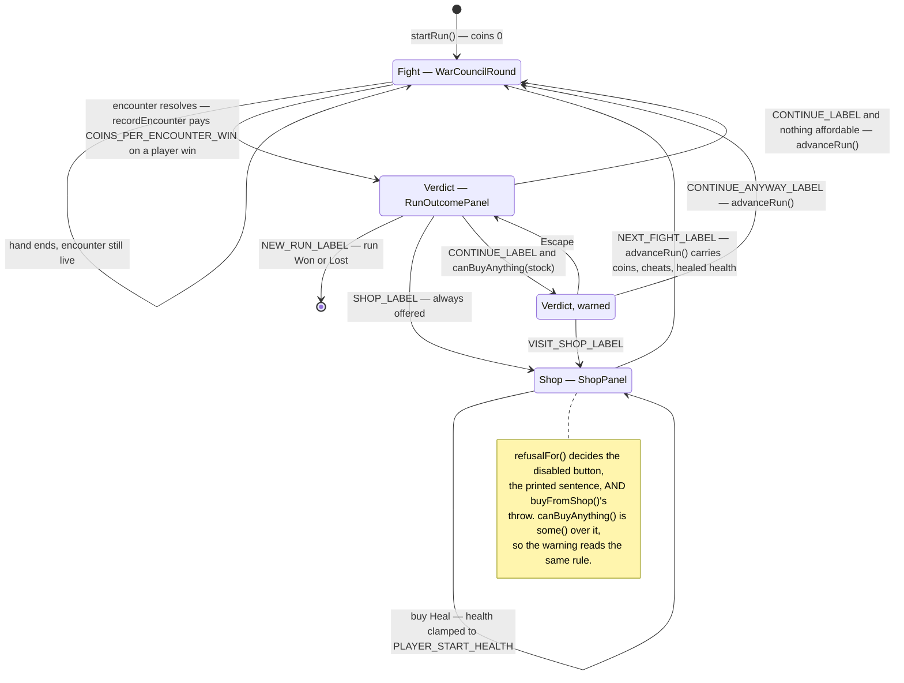

# Plan: Earn coins and buy a Cheat card or a heal between fights

Plan folder: `.claude/contract/DLR-84-earn-coins-and-buy-a-cheat-or-a-heal/`
Execution status: see `tasks.md` in this folder.

---

## Part 1 — Alignment

### Task reference

Jira **DLR-84** — *Earn coins and buy a Cheat card or a heal between fights* (Story, under epic DLR-81 *Run slice — sequenced fights, a spendable charge, and a shop*). Labels: `playable`, `ui`.

**The shape, as specified by the developer (2026-08-15):** beating an opponent pays 1 coin. The shop sells two things, 1 coin each — a **Cheat** (a card, stored in one of the player's two DLR-83 slots, spent later during a hand) and a **Heal** (restores 4 health, applied immediately on purchase, never stored, never occupying a slot). There is no flask and no healing anywhere else in the game; the shop is the only place health comes back.

**Acceptance criteria, verbatim:**

1. Beating an opponent pays the player 1 coin, by a value read from configuration.
2. The coins held are visible, and carry across the whole run.
3. A screen appears between fights offering exactly two purchases, Cheat and Heal, priced from configuration.
4. Buying Heal restores 4 health immediately and cannot take the player above their maximum; overheal is discarded.
5. Buying Cheat places a Cheat card into a free slot.
6. Cheat cannot be bought with both slots full, and the screen says why rather than failing silently.
7. Neither can be bought without the coins to pay, and the price is deducted on purchase.
8. The player can buy nothing and continue, and can buy more than once in a visit if they hold the coins.
9. Leaving the screen starts the next fight, with any purchase already in effect.
10. The screen states which opponent is coming next, and shows the player's health and coins while they choose.

**Scope boundaries from the ticket — out of scope:** a flask, rest sites, or healing from any other source; any third item, a price curve, rerolls, or a rotating shelf; any item touching the bank, the multiplier, or skull density; coins or purchases persisting between runs; any payout basis beyond beating an opponent (overkill, health remaining, a share of every cash-out are all deliberately not built here).

**Recorded from the ticket's Dependencies & Risks, and carried into this plan unchanged:**

- Blocked by **DLR-82** (the between-fight moment) and **DLR-83** (the Cheat card and its slots). Both are `COMPLETE` on disk — `src/hunt/run.ts`, `src/app/run/RunOutcomePanel.tsx`, `src/hunt/cheats.ts`, `src/app/warCouncil/CheatSlots.tsx` all exist.
- **Overlaps DLR-85**, which occupies the same moment between fights. "Whether that is one screen or two is a decision to settle before the second of them is planned." DLR-84 is planned first, so this plan settles it — see Assumptions made.
- **Expect players to default to Heal.** A heal is a guaranteed 4 health against a fight that costs about 4; a Cheat is worth about 1 health directly and more only when it saves a long streak. That is a pricing question, not a flaw. **If the player buys Heal every single visit, the Cheat is mispriced, not uninteresting.** Both prices are configuration so the answer is a one-line change.
- **Nothing in this shop may reduce skull density**, ever. The skull is the game's only inversion.

### Restated goal

Give the run an economy with exactly one decision in it. `RunState` gains a coin balance that starts at zero, is paid `COINS_PER_ENCOUNTER_WIN` at the single moment a fight is won, and carries unchanged across every fight boundary for the rest of the run. After a won fight the verdict offers **two** forward controls — `Continue`, straight to the next fight, and `Shop`, into a screen of its own. The shop is a new full-viewport surface offering the two things a coin buys — a Cheat card into a free slot, or 4 health restored immediately and clamped to the player's maximum — each priced from configuration, each refusable with a stated reason on the face of the screen rather than a silent no-op. The player may buy nothing, or buy repeatedly while they can pay, and the button that leaves the shop starts the next fight with every purchase already in effect. Because the shop is opt-in, `Continue` is guarded: pressed while the player still holds a coin that could buy something, it warns and offers the shop or the fight rather than silently walking past a purchase. The coin balance is on screen during the fight as well as on the shop, because "carries across the whole run" is only observable if the number is visible while the run is being played.

### In scope

- A `coins` field on `RunState`, seeded to 0 by `startRun` and carried through `advanceRun` and `recordEncounter` untouched except by the payout and by purchases.
- The payout: `recordEncounter` credits `COINS_PER_ENCOUNTER_WIN` at the one moment an adopted encounter resolves in the player's favour, and nowhere else.
- A new pure module `src/hunt/shop.ts` holding the two-item catalogue, the price lookup, and the single refusal predicate every caller reads.
- `buyFromShop` in `src/hunt/run.ts`: deduct the price, then either mint a Cheat into a free slot or raise player health by `HEAL_HEALTH_RESTORED` clamped to `PLAYER_START_HEALTH`.
- Four new configuration keys — `COINS_PER_ENCOUNTER_WIN`, `CHEAT_PRICE`, `HEAL_PRICE`, `HEAL_HEALTH_RESTORED` — and a `Coins` type.
- A new shop screen of its own, `src/app/run/ShopPanel.tsx`, with its copy in `src/app/run/shopLabels.ts` and its rules in `src/app/run/shop.css`: who is coming next, the player's health and coins, the two priced purchases, a refusal sentence under any purchase that cannot be made, and one control that leaves for the next fight.
- **Two forward controls on the run verdict** when a fight is won and another remains — `Continue` and `Shop` — plus the unspent-coin warning `Continue` raises when at least one purchase is currently affordable, offering the shop or the fight.
- A new predicate `canBuyAnything` in `src/hunt/shop.ts`, the single statement of "there is something worth stopping for" that the warning fires on.
- The run driver in `src/App.tsx` gaining a between-fights phase with three states — verdict, warned, shop — over the existing fight/verdict switch.
- A coins readout on the felt's status band, so the balance is visible during a hand.
- Vitest coverage for the shop rules, the payout, the clamp, the refusals, and the screen's controls and refusal copy.

### Explicitly out of scope

- Every "out of scope" bullet the ticket lists, reproduced above — no flask, no third item, no price curve, no rerolls, no rotating shelf, no cross-run persistence, no payout basis other than beating an opponent.
- **DLR-85's start screen and run map.** This plan builds the shop as the host DLR-85's map will later mount into, reached by the verdict's `Shop` control; it draws no path, names no roster, and adds no start screen.
- **The opponent roster.** AC10 is satisfied from the existing single-entry `QUARRY_CHARACTERS`, so the screen names "The Monarch" on every fight until DLR-85 lands real names. Not a defect of this ticket.
- Any change to what a Cheat *does* in a hand — DLR-83 owns arming and spending, and this plan does not touch `roundReducer.ts`, `legalMoves.ts`, or `CheatSlots.tsx`.
- Any change to skull density, the bank, the multiplier, or damage arithmetic.
- Retuning `QUARRY_ENCOUNTER_HEALTH` or `PLAYER_START_HEALTH` in response to the new healing. The heal changes the run's survivability and the right response is a play session, not a pre-emptive rebalance.

### Pattern Reference

The brief supplied no code reference. The references chosen here, all already on disk:

- **`src/hunt/cheats.ts`** — the shape for a small pure rules module in `src/hunt/`: an `as const` object union, functions that throw a `RangeError` naming the reason rather than returning a silently unchanged value, one function owning one rule.
- **`src/hunt/run.ts`** — the shape for a `RunState` transition: pure, spread-and-replace, guarded by a predicate that is exported so a screen and the transition cannot disagree (`canAdvanceRun`).
- **`src/app/run/RunOutcomePanel.tsx` + `src/app/run/runLabels.ts` + `src/app/run/run.css`** — the exact three-file shape this ticket's screen copies: a component that *computes nothing* and takes every figure as a prop, a sibling copy module owning every user-visible string, and a `.run-shell` full-viewport grid.
- **`src/app/warCouncil/CheatSlots.tsx`** — the precedent for a small group of controls below the roving-tabindex threshold rendered as plain tab stops with an `Escape` handler.
- **`src/app/warCouncilMount.ts` → `runLabel`** — the precedent for handing the card layer an already-decided run figure rather than `RunState` itself.
- `.claude/skills/react-frontend/SKILL.md` and `.claude/skills/game-ux/SKILL.md` for conventions; `.claude/workflow/web-project.md` for paths and runners.

### Constraints flagged on the brief

- **Prices and the payout are the developer's and are already chosen** (Design Assets, 2026-08-15): 1 coin per win, 1 coin per item, 4 health per heal. They are transcribed into configuration, not invented, and the plan must keep them a one-line change.
- **The pure-core boundary is lint-enforced** on `src/hunt/**` — no React import, no DOM global (`eslint.config.js`). `src/hunt/shop.ts` must stay inside it, and no `Math.random()` may enter it.
- **Nothing in the shop may reduce skull density.** No key, no item, no code path.
- **DLR-85 must inherit a coherent between-fight moment**, not a screen it has to fight for space with.
- **`game-ux`'s hard floor**: `100dvh`/`100svh` never `100vh`, `100%` never `100vw`, `overflow: hidden`, safe-area insets, state distinguishable without colour or motion alone, nothing a decision needs behind hover.
- Two runtime dependencies only. This plan adds none.

### Assumptions made

- **The shop is a screen of its own, reached by choice, and the verdict offers two forward controls.** CONFIRMED by the developer at the 2026-08-16 planning gate, overriding this plan's first draft (which put the shop on the path as a mandatory step): *"Should see 2 buttons Continue / Shop. If someone clicks Continue with money to spend, warn them and give them the option to go to the shop or continue. Then the shop needs to be its own screen."* So the verdict shows `Continue` and `Shop` side by side whenever a fight is won and another remains, and the shop is never forced.
- **The warning fires on affordability, not on a non-zero balance.** `Continue` raises the warning when `canBuyAnything(shopStockFor(run))` is true — at least one item is currently purchasable. Rationale: a player holding a coin with both slots full and full health has nothing to stop for, and a warning that cannot be acted on is noise. The developer's wording was "money to spend", and money you cannot spend is not money to spend.
- **The warning is a state of the verdict, held by the driver.** `App.tsx` gains a three-state `between` phase (verdict / warned / shop) rather than the panel holding its own boolean. Rationale: `RunOutcomePanel` derives nothing today and the driver already owns which screen shows; a second state owner for the same moment is the copy that drifts.
- **The DLR-84/DLR-85 overlap is settled: DLR-85 mounts its run map into `ShopPanel.tsx`.** DLR-84 is planned first, so per both tickets it makes the call. With the shop now optional, DLR-85 inherits a screen the player chooses to enter, and its AC9 ("the map is reachable between fights") is satisfied by the same `Shop` control — which that ticket may widen or re-label. Nothing here forces a fourth screen.
- **`NEXT_FIGHT_LABEL` is re-sited, not renamed.** `'Next fight'` moves to the shop's leave button, where it is literally true (AC9). The verdict gets `CONTINUE_LABEL` and `SHOP_LABEL`, and the warning gets `VISIT_SHOP_LABEL` and `CONTINUE_ANYWAY_LABEL`. Rationale: the value and type are unchanged, so this is cheaper than a rename across its 9 hits.
- **Buying a Heal at full health is refused with a stated reason, not sold and discarded.** The ticket only names slots-full (AC6) and coins (AC7) as refusals, and AC4's clamp covers the partial case (8/10 health + 4 → 10, 2 discarded). Refusing the *fully* wasted purchase follows AC6's "says why rather than failing silently" and stops the screen taking a coin for provably nothing. Rationale for flagging: this is a rule the ticket did not state.
- **Refusal order is item-specific first, coins second.** With both slots full *and* no coins, the screen says the slots are full — the reason that will still be true when the coin arrives. Rationale: the more durable reason is the more useful one.
- **`recordEncounter` is the single payout point**, not the driver and not `advanceRun`. Rationale: it is already the one place `outcomeFor` decides a fight was won, it already refuses a finished run, and the driver stops calling it for an encounter once that encounter resolves — so the credit lands exactly once by construction.
- **The heal writes into the resolved encounter's player health.** `run.ts`'s own docblock states the carried figure *is* `encounter.health[DuelSide.Player]` and that a second copy beside it is the number that drifts; `advanceRun` seeds the next fight from it. It deliberately does not go through `applyDamage`, which refuses a resolved encounter — a restore is not a damage event.
- **`buyFromShop` does not require the run to be between fights.** The screen decides when it mounts; the transition stays a plain run-state operation. Rationale: adding a `canAdvanceRun` guard to a purchase couples the economy to today's single mounting point for no gain.
- **AC2's "visible" includes during a fight.** Coins get a plate on the felt's status band alongside the existing `Run` plate, threaded as a number through `WarCouncilMountProps`. Rationale: "carry across the whole run" is unobservable if the number only exists on screens the player passes through.
- **The screen names the opponent from `quarryCharacterInfo(SLICE_QUARRY_CHARACTER)`** — the same source `QuarryDossier` already reads — and prints the same name every fight until DLR-85 lands the roster. Rationale: satisfying AC10 without inventing a roster this ticket does not own.
- **`ShopPanel` computes nothing**, exactly as `RunOutcomePanel` computes nothing: refusals arrive as a prop derived by the driver from `shop.ts`'s own predicate, so the greyed button and the thrown `RangeError` can never disagree.
- **Copy is placeholder**, marked as such in `shopLabels.ts` exactly as `runLabels.ts` and `warCouncil/labels.ts` mark theirs. The wording is the developer's.

### Config and persisted-shape audit

Run against the real files with `Grep`/`Read` before designing.

- **Nothing is persisted.** There is no `localStorage`, no save file, no stored log anywhere in `src/` — grep for `localStorage|sessionStorage|indexedDB` over `src/**` returns **0 hits**, and `eslint.config.js` bans those globals inside `src/hunt/**` outright. `RunState` lives only in `App.tsx`'s `useState` and dies on reload. **This window is still open**, and this plan does not close it: adding `coins` to `RunState` needs no migration today, and the first ticket that persists a run inherits the obligation.
- **All four new configuration keys are genuinely new.** Case-insensitive grep for `\bcoins?\b|COINS?_|\bshop\b|SHOP_|ShopItem|HEAL_|healPlayer` across `src/**` returns **1 hit**, and it is prose: `src/hunt/config.ts:19`, a comment reading "the answer is the shop and the flask in later stories". No code, no test, no CSS class binds any of these names today. Nothing is renamed, retyped, or removed.
- **One existing constant is re-sited, and one prop is renamed.** `NEXT_FIGHT_LABEL` has **9 hits across 4 files**: `src/app/run/runLabels.ts:58` (declaration), `src/app/run/RunOutcomePanel.tsx:5,97`, `src/app/run/__tests__/RunOutcomePanel.test.tsx:6,22,36,84`, `src/app/run/__tests__/runLabels.test.ts:5,63`. Its value and type are unchanged; its *consumer* moves from `RunOutcomePanel` to `ShopPanel`, and the verdict takes the new `CONTINUE_LABEL` / `SHOP_LABEL` pair. The `onNextFight` prop is renamed to `onContinue` — **4 hits across 3 files**: `src/App.tsx:108`, `src/app/run/RunOutcomePanel.tsx:35,60,96`, `src/app/run/__tests__/RunOutcomePanel.test.tsx:15,75,80,85`. TypeScript catches every one, and all four files sit in a single task's `**Files:**` block.
- **Type changes are additive only.** `RunState` gains a required `coins: Coins` field — every construction site must supply it, and there are exactly **two**: `startRun` (`src/hunt/run.ts:51`) and the spreads inside `recordEncounter`/`advanceRun`, which carry it automatically. `src/hunt/__tests__/run.test.ts` builds runs only through `startRun`, so no fixture hand-rolls the shape. `WarCouncilMountProps` gains a required `coins: Coins`; the compiler enumerates its mount sites, of which there are **four**: `src/App.tsx:115`, `src/app/warCouncil/__tests__/WarCouncilRound.test.tsx:39`, and three JSX mounts in `src/app/warCouncil/__tests__/WarCouncilRound.duelHealthBars.test.tsx:44,168,205`. No widening of an existing union, no `number`→`string`, no required→optional.
- **Every consumer of a changed exported predicate is enumerated.** `refusalFor` and `priceOf` are new and have exactly **two** consumers each by design: `buyFromShop` (which throws on a non-null refusal) and `App.tsx` (which derives the disabled state). `canBuyAnything` has exactly **one**, `App.tsx`'s `handleContinue`, and is itself defined as `some()` over `refusalFor` rather than as a second reading of the rules. That is the anti-drift arrangement — one predicate, a bounded set of readers, no rule stated twice.
- **String-bound names align.** New CSS classes (`.shop-*`) exist only in `src/app/run/shop.css` and `src/app/run/ShopPanel.tsx`; the existing `.run-shell` and `.run-btn` are reused unchanged from `src/app/run/run.css`. New felt class `.wc-coins` is added to `src/app/warCouncil/warCouncil.css` beside `.wc-run` at line 148, the file that already owns the status band's rules. No `data-testid` is introduced — every component test queries by role and accessible name, per `react-frontend`.
- **The architectural boundary is not crossed.** `src/hunt/shop.ts` imports only from `./config` and `./types`; `src/hunt/run.ts` gains an import from `./shop` and `./cheats`, both already inside the pure tree. No React import, no DOM global, no `Math.random()` — the payout and the heal are arithmetic on integers from configuration. The lint override in `eslint.config.js` already covers `src/hunt/**` and needs no change.

---

## Part 2 — Technical design

### Approach

**The economy is pure and lives in `src/hunt/`; the screen renders it and decides nothing.** Two new artefacts sit inside the lint-enforced pure tree. `src/hunt/shop.ts` is the catalogue and the rules: an `as const` `ShopItem` union of exactly two members, a `priceOf` lookup that reads `CHEAT_PRICE`/`HEAL_PRICE` from configuration, a `PurchaseRefusal` union of three reason codes, and one function — `refusalFor(stock, item)` — that returns the code or `null`. `ShopStock` is a plain four-field snapshot (coins, cheats held, player health, maximum health) rather than a `RunState`, so the rules module never learns the run's shape and its whole spec is function-in, value-out with no renderer. `src/hunt/run.ts` then composes: `shopStockFor(run)` projects a `RunState` into a `ShopStock`, and `buyFromShop(run, item)` consults `refusalFor`, throws a `RangeError` naming the reason if it is non-null, and otherwise returns a new run with the price deducted and either a minted Cheat pushed through `addCheat` or the player's health raised by `HEAL_HEALTH_RESTORED` and clamped by `Math.min` to `PLAYER_START_HEALTH`.

The alternative considered and rejected was putting the whole shop in `run.ts` as a pair of `buyCheat`/`buyHeal` functions with the checks inline. It is fewer files, but it makes the refusal rules unreachable from the UI without duplicating them: the screen has to know *why* a purchase is unavailable in order to say so (AC6), and a component that re-derives "are the slots full" from `cheats.length` is a second reading of a rule `cheats.ts` already owns. Exporting one predicate that both the transition and the screen read is what makes a greyed button and a thrown error unable to disagree — the same arrangement `canAdvanceRun` already gives `RunOutcomePanel`.

**The payout has exactly one site.** `recordEncounter` is already the single place a fight's outcome is derived, it already refuses a run that has ended, and the driver stops feeding it hands once an encounter resolves. So it credits `COINS_PER_ENCOUNTER_WIN` when — and only when — the encounter it adopts has `winner === DuelSide.Player`. Putting the credit in the driver instead would put a rule in a component; putting it in `advanceRun` would fail to pay for the final fight of a won run, since `advanceRun` never runs after it.

**The shop is opt-in, and one predicate guards walking past it.** The verdict shows `Continue` and `Shop` side by side when a fight is won and another remains. `Shop` opens the shop screen unconditionally — a player is allowed to go and look, and the shop's own refusal sentences explain anything they cannot afford there. `Continue` is the guarded one: the driver asks `canBuyAnything(shopStockFor(run))`, and if at least one item is purchasable right now it moves to a warned state rather than advancing, replacing the verdict's two controls with a sentence naming the balance and the pair `Visit the shop` / `Continue anyway`. With nothing affordable, `Continue` advances immediately and the player never sees a dialogue they could not have acted on. `canBuyAnything` is a one-line `SHOP_ITEMS.some(…)` over `refusalFor` — the same predicate the shop's buttons and `buyFromShop` read, so "is there anything worth stopping for" and "is this button enabled" cannot drift apart.

**The driver gains a between-fights phase and no effects.** `App.tsx` today is a two-way switch on `isEncounterResolved`. It becomes that same switch plus a `between` phase — an `as const` union of `Verdict` / `Warned` / `Shop`, declared at module scope in `App.tsx` alongside the existing `HUNT` and `NO_TRICKS` constants and held in one `useState`. A union rather than two booleans, because `inShop && warned` is a state that must not exist. `advanceRun` is called from exactly one place, `leaveForNextFight`, reached from `Continue` on an unwarned verdict, `Continue anyway` on a warned one, and `Next fight` in the shop — so three controls cannot each grow their own copy of "start the next fight". Every transition remains a callback fired from a control — no effect, no listener, no timer, so there is nothing to clean up and StrictMode's double mount only re-runs pure lazy initialisers, exactly as `App.tsx`'s existing docblock records. The one lifecycle subtlety is the purchase handler: it uses the functional updater form, `setRun((r) => buyFromShop(r, item))`, so two clicks landing in one batch cannot both compute from the same stale `run` and lose a purchase. `buyFromShop` is pure and returns a fresh object, so StrictMode's development double-invocation of that updater recomputes an identical value.

**The screen is a `RunOutcomePanel` clone in discipline as well as in CSS.** `ShopPanel.tsx` computes nothing: coins, health, maximum, the two prices, the refusal for each item, the next opponent's name and the run's position all arrive as props, derived in `App.tsx` from `shopStockFor` and `refusalFor`. `RunOutcomePanel` keeps the same discipline through its new controls — it takes `coins`, `warning` and `onShop` and branches on them, but derives no rule; the driver decides whether a warning is warranted. It reuses `.run-shell` (already `100dvh`, `overflow: hidden`, safe-area padded) and `.run-btn`, and adds only `.shop-*` rules for the two purchase cards and the readout row. Three tab stops — buy Cheat, buy Heal, leave — is well under `game-ux`'s roving-tabindex threshold of about five, so they are plain tab stops with an `Escape` handler on the container matching `CheatSlots`'s keyboard contract; the warning is an in-place swap of the verdict's two controls, not a modal, so it needs no focus trap and `Escape` returns to the unwarned verdict. Every state is distinguishable without colour: an unavailable purchase is dashed-edged and `disabled` *and* carries its reason as a visible sentence in a `role="status"` region, so AC6's "says why" holds for a screenshot in greyscale and for a screen reader alike. The most repeated action here is one tap on a purchase card, with the price and the reason on the face of the card — nothing a decision needs is behind hover.

**The felt readout is threaded, not derived.** `WarCouncilMountProps` gains a required `coins: Coins`, following the precedent its own `runLabel` docblock sets: the card layer renders a run figure it can neither read from `RunState` nor change. `RoundStatusBand` renders it in a `.wc-coins` plate beside the existing `.wc-run` plate, labelled from `src/app/warCouncil/labels.ts` — that file is the single owner of every felt string, exactly as `runLabels.ts`/`shopLabels.ts` own the run surfaces' copy. Making the prop required rather than optional is deliberate for the same reason `cheats` and `runLabel` are: the compiler enumerates all four mount sites instead of letting one silently render a blank plate.

### Skills to invoke during execution

- `react-frontend` — owns everything under `src/`: the pure-core boundary on `src/hunt/**`, the component-computes-nothing discipline, the reducer/state-owner rule, the 400-line budget, configuration-driven values, and Vitest posture (`node` project for `.test.ts`, `dom` project for `.test.tsx`, queries by role and accessible name).
- `game-ux` — owns the new full-viewport screen: `100dvh`/`overflow: hidden`/safe-area shell, zoning, the tap cost of the purchase action, plain tab stops below the roving-tabindex threshold, and state that reads without colour or motion alone.

Rules to Read: none — `.claude/rules/` contains only its `README.md` (Glob `.claude/rules/*.md` returns one file, the index, which is empty by design).
Workflow to Read: `.claude/workflow/web-project.md` — the authority on paths, runners, and the correctness traps.
Developer override at the Step 1.5 gate: `implementation-doc-writer` and `game-designer` were offered and untaken. The first runs automatically at the end of `/fb-apply`; the second would only re-litigate prices the ticket has already settled.

### Diagram



### Data shapes

#### `src/hunt/types.ts` — one added type

```ts
/** The run's spendable currency (DLR-84). A whole number of coins, never fractional and never
 *  negative — `buyFromShop` refuses a purchase it cannot pay for rather than going below zero. */
export type Coins = number
```

#### `src/hunt/config.ts` — four added keys

```ts
// DLR-84 AC1 — what beating an opponent pays. TRANSCRIBED FROM THE TICKET (developer's
// specification, 2026-08-15), not chosen here.
// UNIT: coins, credited once per encounter won.
export const COINS_PER_ENCOUNTER_WIN: Coins = 1

// DLR-84 AC3 — the shop's two prices. Both TRANSCRIBED, both 1, and deliberately separate keys:
// the ticket predicts the player buying Heal every visit and names re-pricing the Cheat as the
// one-line answer, which is only one line if the two prices are two keys.
// UNIT: coins per purchase.
export const CHEAT_PRICE: Coins = 1
export const HEAL_PRICE: Coins = 1

// DLR-84 AC4 — health restored by one Heal, before the clamp to PLAYER_START_HEALTH.
// TRANSCRIBED. The ONLY source of healing in the game: there is no flask and no rest site.
// UNIT: health points, added once on purchase.
export const HEAL_HEALTH_RESTORED: Health = 4
```

#### `src/hunt/shop.ts` — new module

```ts
export const ShopItem = {
  Cheat: 'cheat',
  Heal: 'heal',
} as const
export type ShopItem = (typeof ShopItem)[keyof typeof ShopItem]

/** AC3 — exactly two, in the order the screen renders them. The single statement of the
 *  catalogue: a screen maps this, it does not list the two items itself. */
export const SHOP_ITEMS: readonly ShopItem[] = [ShopItem.Cheat, ShopItem.Heal]

/** Why a purchase cannot be made. A reason CODE, not a sentence — `src/hunt/` holds no user-
 *  facing copy; `src/app/run/shopLabels.ts` maps these to words. */
export const PurchaseRefusal = {
  SlotsFull: 'slotsFull',
  AlreadyFullHealth: 'alreadyFullHealth',
  NotEnoughCoins: 'notEnoughCoins',
} as const
export type PurchaseRefusal = (typeof PurchaseRefusal)[keyof typeof PurchaseRefusal]

/** Everything the refusal rules need, and nothing else. Deliberately NOT `RunState`: this module
 *  states the shop's rules and must not learn the run's shape. */
export interface ShopStock {
  readonly coins: Coins
  readonly cheatCount: number
  readonly playerHealth: Health
  readonly maxPlayerHealth: Health
}

export function priceOf(item: ShopItem): Coins

/**
 * THE single statement of whether a purchase is available, read by both `buyFromShop` (which
 * throws on a non-null result) and the screen (which disables the control and prints the reason).
 * Item-specific reasons come BEFORE the coin check: with full slots and no coins, the slots are
 * the reason that will still be true when the coin arrives.
 */
export function refusalFor(stock: ShopStock, item: ShopItem): PurchaseRefusal | null

/**
 * Whether ANY item in the catalogue is purchasable right now — `SHOP_ITEMS.some(…)` over
 * `refusalFor`, never a second reading of the rules. THE predicate the verdict's `Continue`
 * warning fires on: a player holding a coin with full slots and full health has nothing to stop
 * for, and a warning they cannot act on is noise.
 */
export function canBuyAnything(stock: ShopStock): boolean
```

#### `src/hunt/run.ts` — one added field, one changed function, two added functions

```ts
export interface RunState {
  // …existing fields unchanged…
  /** AC2 — the run's purse. Starts at 0, credited by `recordEncounter` on a won encounter, spent
   *  by `buyFromShop`, and carried through `advanceRun` untouched. Never persisted: the ticket
   *  puts cross-run carry-over out of scope. */
  readonly coins: Coins
}

/** AC1 — credits `COINS_PER_ENCOUNTER_WIN` when, and only when, the adopted encounter resolves
 *  with the player standing. Signature unchanged. */
export function recordEncounter(
  run: RunState,
  encounter: EncounterState,
  cheats: readonly CheatCard[],
): RunState

/** Projects a run into the four figures the shop's rules need, so a screen never assembles a
 *  `ShopStock` by hand and cannot get one field wrong. */
export function shopStockFor(run: RunState, maxPlayerHealth?: Health): ShopStock

/**
 * AC4/AC5/AC7 — the purchase. Throws a `RangeError` naming the `PurchaseRefusal` rather than
 * returning the run unchanged: a silent no-op is exactly the "took payment for nothing" failure
 * `cheats.ts`'s own `addCheat` docblock already refuses to allow.
 *
 * `maxPlayerHealth` is a defaulted parameter, matching `startEncounter`/`startRun`'s injectable
 * pattern, so a spec varies the clamp without mutating module state.
 */
export function buyFromShop(run: RunState, item: ShopItem, maxPlayerHealth?: Health): RunState
```

#### `src/hunt/index.ts` — added barrel exports

```ts
export type { Coins } from './types'
export { COINS_PER_ENCOUNTER_WIN, CHEAT_PRICE, HEAL_PRICE, HEAL_HEALTH_RESTORED } from './config'
export type { ShopStock } from './shop'
export { ShopItem, SHOP_ITEMS, PurchaseRefusal, priceOf, refusalFor, canBuyAnything } from './shop'
export { shopStockFor, buyFromShop } from './run'
```

#### `src/app/run/shopLabels.ts` — new copy module

```ts
export const SHOP_TITLE = 'Between fights'
export const SHOP_COINS_LABEL = 'Coins'
export const SHOP_HEALTH_LABEL = 'Health'
export const SHOP_NOTHING_TO_BUY_HINT = 'Buy nothing and carry the coin if you would rather.'

export const SHOP_ITEM_NAME: Readonly<Record<ShopItem, string>>
/** Built FROM the configuration keys, never from a literal, so re-pricing does not leave the
 *  screen quoting an old number. */
export const SHOP_ITEM_BLURB: Readonly<Record<ShopItem, string>>
export const PURCHASE_REFUSAL_MESSAGE: Readonly<Record<PurchaseRefusal, string>>

/** One purchase control's accessible name — item, price, and the refusal when there is one, so
 *  `getByRole('button', { name })` distinguishes an offer from a refusal. */
export function shopItemAccessibleName(item: ShopItem, refusal: PurchaseRefusal | null): string

/** AC10 — who is next. `name` is `undefined` when the character has no roster entry yet. */
export function nextOpponentText(name: string | undefined, progressText: string): string

/** AC10 — the purse and the bar, as one sentence for a reader who cannot see the row. */
export function purseText(coins: Coins, health: Health, maxHealth: Health): string
```

#### `src/app/run/runLabels.ts` — the verdict's new controls and its warning

```ts
/** The verdict's two forward controls (DLR-84, developer's gate decision 2026-08-16).
 *  `NEXT_FIGHT_LABEL` above keeps its value and moves to the shop's own leave button, where it is
 *  literally true (AC9). ALL PLACEHOLDER COPY, exactly as this file's header already states. */
export const CONTINUE_LABEL = 'Continue'
export const SHOP_LABEL = 'Shop'

/** The unspent-coin warning's own two controls. Both must differ from the pair above — a
 *  component test tells the warned verdict from the plain one by button name. */
export const VISIT_SHOP_LABEL = 'Visit the shop'
export const CONTINUE_ANYWAY_LABEL = 'Continue anyway'

/** The warning sentence. Takes the balance so it can say what is actually being left behind;
 *  the driver decides WHETHER to warn (`canBuyAnything`), this only decides the words. */
export function unspentCoinsText(coins: Coins): string
```

#### `src/app/run/RunOutcomePanel.tsx` — three added props, one renamed

```ts
interface RunOutcomePanelProps {
  // …outcome, encounterIndex, encounterCount, carriedHealth, tricks, canContinue, onNewRun
  //   all unchanged…
  /** AC2/AC10 — the purse, so the verdict states what is in hand before the player decides
   *  whether to spend it. */
  readonly coins: Coins
  /** `true` when the driver has judged there is something affordable being walked past. Swaps
   *  the two forward controls for the warning sentence and its own pair. The panel does NOT
   *  decide this — `canBuyAnything` does, in `App.tsx`. */
  readonly warning: boolean
  readonly onShop: () => void
  /** RENAMED from `onNextFight`: this control no longer starts a fight on its own. Pressed on an
   *  unwarned verdict it may raise the warning instead; pressed on a warned one it advances. */
  readonly onContinue: () => void
  /** Leaves the warning without advancing and without opening the shop — the `Escape` path. */
  readonly onDismissWarning: () => void
}
```

#### `src/App.tsx` — the between-fights phase

```ts
/** Which of the three between-fights surfaces is showing. A union rather than two booleans,
 *  because "in the shop AND warned" is a state that must not exist. */
const BetweenPhase = {
  Verdict: 'verdict',
  Warned: 'warned',
  Shop: 'shop',
} as const
type BetweenPhase = (typeof BetweenPhase)[keyof typeof BetweenPhase]
```

#### `src/app/run/ShopPanel.tsx` — new component

```ts
interface ShopPanelProps {
  readonly coins: Coins
  readonly playerHealth: Health
  readonly maxPlayerHealth: Health
  /** AC10 — the coming opponent's display name, `undefined` while the roster has no entry. */
  readonly nextOpponentName: string | undefined
  /** AC10 — the run's position, ALREADY WORDED by `runProgressText`. */
  readonly progressText: string
  /** One entry per `SHOP_ITEMS` member, derived by the driver from `refusalFor` — never
   *  re-derived here. `null` means the purchase is available. */
  readonly refusals: Readonly<Record<ShopItem, PurchaseRefusal | null>>
  readonly onBuy: (item: ShopItem) => void
  readonly onLeave: () => void
}

export default function ShopPanel(props: ShopPanelProps): ReactElement
```

#### `src/app/warCouncilMount.ts` — one added prop

```ts
export interface WarCouncilMountProps {
  // …existing props unchanged…
  /** AC2 — the run's purse during a hand. A number, not a `RunState`: the same contract
   *  `runLabel` above states — the card layer renders a run figure and must not change it.
   *  Required, not optional, so the compiler enumerates every mount site. */
  readonly coins: Coins
}
```

#### `src/app/warCouncil/RoundStatusBand.tsx` and `labels.ts`

```ts
interface RoundStatusBandProps {
  // …existing props unchanged…
  readonly coins: Coins
}

// in src/app/warCouncil/labels.ts — the single owner of every felt string:
export const COINS_PLATE_LABEL = 'Coins'
```

#### CSS

`src/app/run/shop.css` — new file. `.shop-head`, `.shop-purse`, `.shop-grid`, `.shop-item`, `.shop-item.is-refused` (dashed edge, not colour alone), `.shop-item-price`, `.shop-refusal`. Reuses `.run-shell` and `.run-btn` from `run.css`, which `ShopPanel.tsx` imports alongside.

`src/app/run/run.css` — one added `.run-warning` / `.run-warning-text` block for the unspent-coin warning: a dashed bracket around the swapped controls, so a held decision reads in greyscale as well as in colour.

`src/app/warCouncil/warCouncil.css` — one added `.wc-coins` block beside `.wc-run` at line 148, reusing `.wc-plate-label` and `.wc-run-value`.

Every `clamp()` bound and every hue in both files is the developer's to retune, marked as such in a comment exactly as `run.css`'s header already is.

#### No package changes

No dependency, no script, no `tsconfig.json` / `vite.config.ts` / `eslint.config.js` change. The `dom` Vitest project already collects `src/**/__tests__/**/*.test.tsx`, and the `src/hunt/**` lint override already covers `shop.ts`.

### Runtime quality notes

- **Purity and adjudication.** Every rule is in `src/hunt/`: the catalogue, the prices, the refusal order, the clamp, the payout. `ShopPanel.tsx` computes nothing — it maps `SHOP_ITEMS`, reads a `refusals` record handed to it, and fires two callbacks. `App.tsx` derives that record with `refusalFor(shopStockFor(run), item)`, which is the same predicate `buyFromShop` guards with, so a greyed control and a thrown `RangeError` are one rule read twice rather than two rules; `canBuyAnything` is `some()` over that same predicate, so the verdict's warning cannot claim there is something to buy when every purchase card is greyed out. No literal price, payout, or heal amount appears outside `config.ts` — `SHOP_ITEM_BLURB` interpolates the keys rather than quoting numbers. `src/hunt/shop.ts` imports only `./config` and `./types`: no React, no DOM global, inside the `eslint.config.js` override for `src/hunt/**`.
- **Effects, mount and teardown.** **No effect is added anywhere in this plan.** `App.tsx` holds none today and holds none after; `ShopPanel` and the verdict's warning have no effect, no listener, no observer, no timer, no `requestAnimationFrame`, no `AbortController`, and no pointer capture — every handler is an `onClick` on a button or an `onKeyDown` for `Escape`, attached declaratively by React and torn down with the element. **The warning is deliberately an in-place swap of the verdict's controls rather than a modal**, precisely so it needs no focus trap, no `document`-level key listener, and therefore no cleanup. StrictMode's development double-mount re-runs only `App.tsx`'s existing pure lazy initialisers plus the new `useState(BetweenPhase.Verdict)`. The one place double-invocation could bite is the purchase updater, which is why it is written as `setRun((r) => buyFromShop(r, item))`: `buyFromShop` is pure and allocates a new run, so invoking it twice with the same `r` yields an identical value. No module-level mutable state is introduced — every new export is a `const` object or a function. No handler is registered once and left holding a first-render closure; every one is re-created per render from the current `run`.
- **Hot-path cost.** Nothing here is on a pointer-move path. The shop's derivations run once per render of a screen the player reaches between fights: `refusalFor` is a two-comparison function called twice, and `shopStockFor` allocates one four-field object. `RoundStatusBand` renders one extra text node per hand render. There is no search, no scan of a collection, and no memoisation — adding `useMemo` here would cost more than the arithmetic it wrapped, which `react-frontend` forbids without profiling evidence.
- **Determinism and numeric safety.** No `Math.random()` is reachable from any code this plan adds — the shop's every figure is an integer read from `config.ts`, and the only randomness in the app stays where it is, in `App.tsx`'s `dealRound(…, Math.random)`. Cheat ids continue to come from `RunState.nextCheatId`, which `run.ts`'s docblock already flags as existing precisely so this ticket's mid-run purchase cannot re-issue a spent card's id and collide as a React key. **There is no division anywhere in this plan**, so the classic `NaN` source is absent; the only arithmetic is `coins - price`, `health + HEAL_HEALTH_RESTORED`, and `Math.min`. No epsilon is needed — coins and health are whole numbers here, compared with `>=` and `<`. To stop a bad configuration poisoning a health bar silently, `buyFromShop` validates the clamp ceiling (`Number.isFinite(maxPlayerHealth) && maxPlayerHealth > 0`) and `refusalFor` treats a non-finite coin balance as insufficient rather than letting `NaN >= 1` evaluate false and read as "not enough coins" by accident — the same defensive posture `encounter.ts`'s `assertApplicable` already takes.
- **Error paths.** `buyFromShop` throws a `RangeError` whose message names the item, the refusal code, and the balance — never returns the run unchanged, and never returns a partially-applied purchase. Reaching it is a driver bug, because the control is disabled whenever `refusalFor` is non-null; it exists so that bug is loud rather than a coin quietly vanishing. `priceOf` and `refusalFor` are total over their unions, so an unhandled `ShopItem` is a TypeScript error at the `switch`, not a runtime `undefined` price. Nothing is caught and converted into a success shape; there is no `catch` in the diff at all. The user-facing path is not an exception: an unavailable purchase is a disabled control plus a sentence in a `role="status"` region naming the reason (AC6), which is the only way a refusal reaches the player. **No async surface is added** — no promise, no fetch, no timer — so the four async states do not arise.

### Risks and judgement calls

- **The shop's shape is now the developer's, decided at the gate — CONFIRMED, not open.** Two forward controls on the verdict, a warning on `Continue` when something is affordable, and the shop as its own screen. Recorded here so the reviewers do not re-open it: an earlier draft of this plan put the shop on the path as a mandatory step, and that draft was overridden.
- **The warning could still nag.** It fires whenever anything is affordable, which with a 1-coin payout and 1-coin prices means *every* visit where the player has not already spent. If pressing `Continue` and being stopped every single fight reads as friction rather than a safety net, the cheapest fixes are to fire it only above a coin threshold or to drop it entirely — both one-line changes in `App.tsx`'s `handleContinue`. Worth watching in the play session.
- **`Escape` dismisses the warning back to the plain verdict** rather than continuing or shopping. That is the conservative reading of a dismissal — it takes no action on the player's behalf. Say so if you would rather `Escape` mean "continue anyway".
- **Refusing a Heal at full health is a rule the ticket did not state.** AC4 only requires the clamp. The plan refuses the fully-wasted purchase with a `AlreadyFullHealth` reason. The alternative is to sell it and discard all four points, which is defensible as "the ticket said overheal is discarded" but takes a coin for provably nothing.
- **Coins on the felt is a reading of AC2, not a stated requirement.** It costs a required prop threaded through `WarCouncilMountProps` → `WarCouncilRound` → `RoundStatusBand` and updates to two component specs and one fixture. Drop it and AC2 is satisfied only on the run screens; the balance would then be invisible during the fight that is earning it.
- **Every price and the payout are already yours and are transcribed, not chosen.** No tuning value is invented anywhere in this plan. The ticket's own warning stands and should be watched in the play session: **if you buy Heal on every single visit, the Cheat is mispriced.** Both live in `config.ts` as separate keys so the fix is one line.
- **The heal makes the run measurably easier and nothing else was retuned.** `QUARRY_ENCOUNTER_HEALTH` is `[10, 14, 18]` against a `PLAYER_START_HEALTH` of 10, and DLR-82's own risk note predicted the player losing around fight three on those numbers with the shop named as the answer. Whether 4 health per fight is the right amount of answer is a play-session question, and this plan deliberately does not pre-empt it.
- **The screen names "The Monarch" on every fight.** `QUARRY_CHARACTERS` holds one entry and `SLICE_QUARRY_CHARACTER` is fixed for the run, so AC10's "which opponent is coming next" reads identically each visit until DLR-85 lands the roster. Correct today, and worth knowing before it looks like a bug in a play session.
- **Five new placeholder strings are yours to word.** `CONTINUE_LABEL = 'Continue'`, `SHOP_LABEL = 'Shop'`, `VISIT_SHOP_LABEL = 'Visit the shop'`, `CONTINUE_ANYWAY_LABEL = 'Continue anyway'`, and `unspentCoinsText`'s sentence. `NEXT_FIGHT_LABEL = 'Next fight'` keeps its value and moves to the shop's leave button.
- **Nothing is persisted, and this plan does not change that.** Coins die on reload along with the rest of `RunState`. The ticket puts cross-run carry-over out of scope, so this is correct — but it means the first ticket that adds a save file inherits a `coins` field with no migration story.
- **Only judgement of the running app can settle the feel of the shop** — whether the `Continue` / `Shop` pair reads at a glance, whether the warning is a safety net or a nag, whether the two purchase cards are legible, and whether the refusal sentence is noticed. QA will confirm both screens render, the warning appears and clears, the purchases commit, the clamp holds, and the console is clean; none of that answers the feel question.
