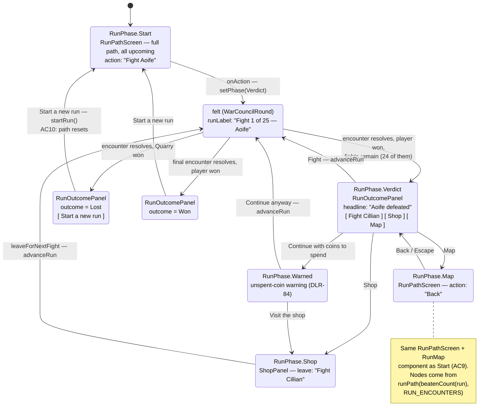

# Plan: Start screen and run map showing the path to the final boss

Plan folder: `.claude/contract/DLR-85-start-screen-and-run-map/`
Execution status: see `tasks.md` in this folder.

---

## Part 1 — Alignment

*(The shared understanding of what this task is doing. Restate it in your own words — this is how the developer confirms you read the brief correctly before any design happens. Mismatch here = stop and fix.)*

### Task reference

**Jira DLR-85** — "Start screen and run map showing the path to the final boss". Story under epic **DLR-81** ("Run slice — sequenced fights, a spendable charge, and a shop"). Labels `playable`, `ui`.

**Acceptance criteria, verbatim from the ticket:**

1. A start screen precedes the first fight and offers a single action to begin the run.
2. The path is drawn from the run's configuration rather than hardcoded — the number of stages, the number of ordinary opponents in each, and which entries are bosses all come from the same source the run itself reads.
3. Ordinary opponents render as ticks and bosses as filled blocks, laid out along one horizontal path in run order, matching the developer's sketch.
4. Every opponent on the path shows its name, taken from the roster below.
5. The run's goal is stated in words alongside the path (e.g. "Beat all 25").
6. Beaten opponents are marked as beaten and stay visible — they are struck out, not removed.
7. The next opponent is visually distinguishable from those beyond it.
8. The action to continue names the opponent it leads to — "Fight Aoife", then "Fight Cillian".
9. The map is reachable between fights as well as before the first one.
10. Losing the run returns to the start screen, and starting again resets the path.
11. The screen fits the viewport at the supported sizes without scrolling, per the `game-ux` standard.

**The name roster** (developer, 2026-08-15) — twenty ordinary opponents in run order: Aoife, Cillian, Niamh, Eoin, Saoirse, Rónán, Maeve, Fergus, Órla, Declan, Sinéad, Pádraig, Bríd, Lorcán, Clodagh, Tadhg, Róisín, Cormac, Aisling, Oisín. Five stage bosses in order: Bréanainn, Muireann, Conchobhar, Gráinne, Diarmuid. Diarmuid closes the run. Fadas are ordinary Unicode and need no special handling.

**Two scope extensions the ticket makes explicitly, and this plan honours:**

- **The DLR-82 verdict screen is in scope**, not a follow-on. The ticket states this directly: "Treat this as in scope for this ticket rather than a follow-on — shipping a named map beside an unnamed verdict is the same split-personality problem." Named surfaces are `src/app/run/RunOutcomePanel.tsx`, `src/app/run/runLabels.ts`, and the `runLabel` readout App threads into the felt's status band.
- **The fight screen's own generic copy is out of scope.** `HEALTH_BAR_LABEL` in `src/app/warCouncil/labels.ts` ("The Quarry's health") and `QuarryDossier` stay as they are; the ticket names that as a separate ticket.

**Follow-up decisions confirmed interactively, 2026-08-17:**

- **Map placement — third control on the verdict.** The map is its own surface, reached from a `Map` button beside DLR-84's existing `Continue` and `Shop` controls, and the same diagram component is what the start screen renders. This settles the DLR-84 overlap the ticket flags: DLR-84 landed first with an opt-in verdict, so DLR-85 inherits that pattern rather than reopening it.
- **Skills confirmed:** `react-frontend`, `game-ux`, `pixel-artist`. The `pixel-artist` selection is in tension with the ticket's "Art … out of scope" boundary — see Risks; the plan's default is CSS-drawn nodes and no `art/` tree.
- **Angled opponent names, not vertical.** Chosen from the mockup at both node counts. Names sit below the line rotated about -52°, right-aligned to their node.
- **Ship the full 25-fight, five-stage run, not the three-fight slice.** The developer asked directly whether there was a reason not to, and there was not a good one. `RUN_ENCOUNTERS` therefore carries all twenty-five entries — four ordinary opponents then a stage boss, five times over, ending on Diarmuid. This is a deliberate, developer-authorised widening of the ticket's "Tuning the run's actual length" out-of-scope line, taken because the map is the thing that makes the run's shape legible and a three-node map does not show the shape the ticket is about. Two consequences are recorded rather than discovered: the twenty-five health values need a source (see Assumptions), and a twenty-five-fight run is almost certainly not winnable on today's numbers (see Risks).

### Restated goal

Give the run a visible shape. Today the app opens straight into fight one and the player learns the run's length only from a "Fight 1 of 3" readout. This ticket adds a start screen that shows the whole path before anything begins, a reachable map of that same path between fights, and names on every opponent — so the player can see who is coming, who they have beaten, and how far there is to go. The path is generated from whatever the run's configuration actually says: stages are derived from where the bosses sit, so the same code renders a five-stage twenty-five-fight run and a flat three-fight one with no branch of its own. The run itself grows to the full twenty-five — twenty ordinary opponents and five stage bosses, closing on Diarmuid — because a three-node map does not show the shape this ticket exists to show. Alongside that, every run-level surface that currently addresses the opponent generically — the verdict headline, the continue controls, the shop's "next up" line, the felt's run readout — starts using the opponent's name, because a named map beside an unnamed verdict reads as two different games.

### In scope

- A start screen that precedes fight one, shows the path and the run's goal, and offers one action to begin (AC1, AC5).
- An opponent roster and a per-encounter run configuration in `src/hunt/config.ts`, carrying each opponent's name and whether it is ordinary or a boss, as the single source the run itself already reads for health (AC2, AC4).
- **The run extended to its full twenty-five entries** — four ordinary opponents then a stage boss, five times over — with the health curve generated from three named tunables so twenty-five numbers are not hand-invented (developer decision, 2026-08-17).
- A pure, unit-testable path model in `src/hunt/` that turns that configuration plus the run's position into stages of nodes, each marked beaten / current / upcoming (AC2, AC6, AC7).
- A `RunMap` component rendering one horizontal path: ticks for ordinary opponents, filled blocks for bosses, names on every node, beaten nodes struck out and still present, the current node distinguished from those beyond it (AC3, AC4, AC6, AC7).
- The same path surface reachable between fights, via a `Map` control on the run verdict (AC9).
- Every continue-style control named after the opponent it leads to: the start screen's begin action, the verdict's primary control, and the shop's leave control (AC8).
- The verdict headline naming the opponent just beaten, and the felt's `runLabel` readout naming the opponent being fought (the ticket's explicit scope extension).
- Losing the run returning to the start screen, with a fresh run resetting the path (AC10).
- A full-viewport, no-scroll shell for both new surfaces, per `game-ux` (AC11).
- Vitest coverage: exhaustive unit tests for the pure path model, component tests for the new surfaces and the changed verdict, and one App-level test that the start screen precedes the felt.

### Explicitly out of scope

- Branching paths, route choice, or any node the player picks between — the path is one line, in run order.
- Node types beyond ordinary and boss. No reward, shop, event, or rest nodes on the path.
- The shop screen itself (DLR-84, already landed). Its **leave-button label** changes here to name the next opponent; nothing else about it does.
- Any change to what a fight is, what an opponent does, or how difficulty scales.
- **Balancing the twenty-five-fight run.** The run's *length* is now in scope (developer decision above), but making it winnable is not. `PLAYER_START_HEALTH` stays 10, `COINS_PER_ENCOUNTER_WIN` stays 1, the shop's prices stay 1, and the health curve ships as a documented placeholder. The run is expected to be lost well before Diarmuid; DLR-82 already recorded that the answer to that is the shop and later stories, not raising player health.
- The fight screen's generic copy — `HEALTH_BAR_LABEL`, `QuarryDossier`, `QUARRY_CHARACTERS`, `QuarryCharacter`, `SLICE_QUARRY_CHARACTER`'s use as the `Hunt`'s character. Named by the ticket as a separate ticket.
- Art, animation, and visual treatment beyond matching the sketch's structure. No `art/` tree, no PNG pipeline.
- Converting `App.tsx`'s several `useState` calls to a reducer.

### Pattern Reference

The brief supplies its own pointers, and the codebase supplies the rest:

- **From the brief:** `src/app/run/RunOutcomePanel.tsx` and `src/app/run/runLabels.ts` (`runHeadline`, `NEXT_FIGHT_LABEL`) are named as the surfaces to update, plus the `runLabel` prop App threads into the felt's status band. `src/app/warCouncil/labels.ts`'s `HEALTH_BAR_LABEL` is named as the thing **not** to touch.
- **The developer's sketch, 2026-08-15:** one horizontal line, short ticks for ordinary opponents, filled blocks for bosses, five groups of four ticks each followed by a block. "Crude by the developer's own description — match the structure, not the proportions."
- **`src/app/run/ShopPanel.tsx` is the pattern for both new components.** It is the most recent full-viewport panel on disk and its own docblock states the discipline to copy: "Computes NOTHING … Every figure … arrive[s] as props". Its `Escape`-on-container keyboard handling is the pattern for the map screen's back control.
- **`src/app/run/run.css`'s `.run-shell`** is the full-viewport shell to reuse verbatim — `100dvh`, `width: 100%`, `overflow: hidden`, `env(safe-area-inset-*)` padding. Both new surfaces mount inside it rather than defining a second shell.
- **`src/hunt/config.ts`'s `quarryHealthForEncounter`** is the pattern for the new per-index accessor: throw a `RangeError` naming the index and the configured count rather than returning `undefined`, because an out-of-range read becomes `NaN` and vanishes silently.
- **`src/hunt/run.ts`'s `canAdvanceRun`** is the pattern for the new `beatenCount` derivation: one exported statement of a run fact, so a screen and a transition cannot disagree about it.
- **`.claude/contract/DLR-85-start-screen-and-run-map/mockup.html`** (built at this plan's approval gate) is the layout and interaction reference for both new surfaces.
- **`react-frontend`/SKILL.md** and **`game-ux`/SKILL.md** for conventions — loaded, not restated here.

### Constraints flagged on the brief

- **"Build it against configuration, not against 25 fights."** The ticket's own risk note: "this must render three ticks and no boss just as happily as it renders five stages. If it is written against the full shape it will block on a run that does not exist yet." This is the hardest constraint in the ticket and it shapes the whole design — stage grouping is *derived* from where bosses sit, never a `5 × 4 + 1` literal.
- **AC2's single-source requirement.** Stage count, ordinary-opponents-per-stage, and boss positions must come from "the same source the run itself reads" — i.e. not a second array beside `QUARRY_ENCOUNTER_HEALTH` that can drift out of step with it. `src/hunt/config.ts` already argues this point twice in its own comments (`ENCOUNTERS_PER_RUN`: "a free-standing number beside it is the second source that drifts"; `run.ts`: "a second copy beside it is a number that drifts the first time one is written without the other").
- **AC11 / `game-ux` hard floor.** `100dvh` never `100vh`, `100%` never `100vw`, `overflow: hidden` on the shell, safe-area insets, every state distinguishable without colour or motion alone.
- **The pure-core boundary is lint-enforced.** `eslint.config.js` forbids React imports and DOM globals in `src/hunt/**` and `src/warCouncil/**`. The path model goes in `src/hunt/` and must stay DOM-free.
- **Two runtime dependencies only.** Nothing here needs a third, and none is proposed.
- **The 400-line file budget.** `App.tsx` is at 208 lines and grows here; `RunOutcomePanel.tsx` is at 155 and grows.
- **Fadas render as ordinary Unicode.** No escaping, no transliteration layer. The plain anglicisations are recorded in the ticket as a fallback the plan does not build.
- **The deck-rank names' trade is knowing.** The ticket records that Swan/Fox/Woodcutter/Witch/Monarch were free to teach and human names are not, and that "the developer has taken that trade knowingly; it is recorded so it is not mistaken for an oversight." Nothing to do — noted so no reviewer re-litigates it.

### Assumptions made

- **`RUN_ENCOUNTERS` becomes the authoritative array and `QUARRY_ENCOUNTER_HEALTH` is derived from it** (`RUN_ENCOUNTERS.map((e) => e.health)`), rather than adding a second parallel array of names beside the existing health array. Rationale: two arrays that must stay the same length is precisely the drift AC2 forbids and `config.ts` argues against twice in its own comments. Deriving keeps all 28 existing `QUARRY_ENCOUNTER_HEALTH` references working unchanged while making one array the single source.
- **The run ships at its full twenty-five entries** (confirmed by the developer, 2026-08-17): `[4 × Ordinary, Boss] × 5`, ordinary names taken from `ORDINARY_OPPONENT_NAMES` in order and bosses from `STAGE_BOSS_NAMES` in order, closing on Diarmuid. Rationale: the map exists to make the run's shape legible, and three ticks with no block does not show a shape. The ticket's risk note — "this must render three ticks and no boss just as happily as it renders five stages" — is still honoured, but by `runPath`'s **unit tests** covering the three-ordinary case rather than by it being the live configuration. That is the stronger guarantee of the two: a shipped three-node config proves the code handles three nodes, whereas a test proves it while the shipped config proves it handles twenty-five.
- **The twenty-five health values are generated from three named tunables, not twenty-five hand-written literals.** `ORDINARY_HEALTH_BASE = 10`, `ORDINARY_HEALTH_STEP = 4`, `BOSS_HEALTH_MULTIPLIER = 1.5`. An ordinary opponent's health is `BASE + STEP × (how many ordinary opponents precede it)`; a boss's is that figure times the multiplier, rounded. Rationale: **twenty-five tuning values are twenty-five decisions that are not mine to make**, and the first three are already the developer's — this formula reproduces `10, 14, 18` exactly at indices 0–2, so DLR-82's measured entry-0 value and the existing curve survive untouched. The only genuinely new number is `BOSS_HEALTH_MULTIPLIER`, which is flagged in Risks as the developer's. `RUN_ENCOUNTERS` remains a plain array, so replacing the formula with twenty-five explicit literals later is a local edit with no consumer change.
- **Stages are derived by boss position, not configured.** A stage closes at each boss node; a trailing group of ordinary opponents with no boss after it forms a final stage. Rationale: AC2 requires stage count to come from the run's configuration, and boss positions *are* that configuration. With today's three ordinary opponents this yields one stage of three ticks and no block, which is exactly the risk note's requirement.
- **The start screen and the between-fights map are one component, `RunPathScreen`, with a title, an action label, and an action handler.** Rationale: both are the same layout — title, goal sentence, path, one button — and the only differences are copy and where the button goes. Two near-identical components would be the duplication `react-frontend` names first. The alternative is considered and named in Approach.
- **App's existing `BetweenPhase` union is widened to a `RunPhase` union carrying `Start` and `Map`,** rather than adding a sixth `useState`. Rationale: App.tsx's own comment already argues the union over booleans ("'in the shop AND warned' is a state that must not exist"), and folding `Start` in makes "in the shop before the run started" unrepresentable for free. `BetweenPhase` has 11 references, all inside `App.tsx`, so the rename is local.
- **Only the intermediate-win headline takes the opponent's name.** `FIGHT WON` becomes `Aoife defeated`; `YOU WIN` and `YOU LOSE` keep their current wording, with the opponent named in the supporting detail line instead. Rationale: the ticket specifies `Aoife defeated` for the beaten case and says nothing about the two terminal cases, and a run-level verdict is about the run, not one opponent.
- **The verdict's warned branch keeps DLR-84's `Visit the shop` / `Continue anyway` labels unchanged.** Rationale: DLR-84's component test distinguishes the warned verdict from the plain one *by button name*, and renaming both branches to name the opponent risks a collision. AC8 is satisfied on the unwarned primary control.
- **`CONTINUE_LABEL` (`'Continue'`) is deleted** rather than left exported and unread, since the unwarned primary control now reads `Fight Cillian`. Rationale: `react-frontend` forbids knowingly leaving debt silently; the audit below quotes its four-file reader set, all of which change in the same task.
- **The shop's leave control names the next opponent when one is known,** falling back to `NEXT_FIGHT_LABEL` (`'Next fight'`) when it is not. Rationale: the ticket names `NEXT_FIGHT_LABEL` as a surface to change and AC8 covers "the action to continue"; keeping the fallback means `ShopPanel`'s existing `nextOpponentName: string | undefined` prop contract and its test do not have to change shape.
- **Opponent names on the path render angled at about -52° below the line, right-aligned to their node** (chosen by the developer from the mockup, 2026-08-17). Rationale: AC4 requires a name on *every* node, and twenty-five horizontal names at a 1280px-wide viewport give each about 50px — "Conchobhar" does not fit at a readable size. The rejected alternative was a vertical writing mode, which also fits but reads worse. The exact angle and the name font size remain the developer's to retune.
- **The path is a non-interactive status display, not a set of controls.** An ordered list inside a labelled group, with `aria-current="step"` on the current node and a `<s>` element on beaten ones. Rationale: nothing on the path is clickable in this ticket (no route choice — explicitly out of scope), so `game-ux`'s roving-tabindex rule does not apply and adding 25 tab stops would breach it.
- **No `art/` tree and no PNG pipeline.** Nodes are CSS-drawn. Rationale: the ticket puts art out of scope, and `pixel-artist`'s own Calibration section says to hand off to `game-ux` when "the request is really about how a screen is laid out rather than what an asset looks like". The developer ticked `pixel-artist` at the skill gate, so this assumption is flagged in Risks for them to overturn at the approval gate rather than decided silently.

### Config and persisted-shape audit

Run against the real files with `Grep`/`Read` on 2026-08-17. Counts are `grep -rn <name> src .docs/game_rules | wc -l`.

- **`QUARRY_ENCOUNTER_HEALTH` — 28 hits across 9 files** (`src/hunt/config.ts`, `encounter.ts`, `index.ts`, `run.ts`, `__tests__/config.test.ts`, `__tests__/encounter.test.ts`, `__tests__/run.test.ts`, plus one comment in `src/app/warCouncil/warCouncilHealthBars.css` and one mention in `.docs/game_rules/the-hunt.md`). **Not renamed and not retyped** — it keeps the name and the `readonly Health[]` type, and is re-derived as `RUN_ENCOUNTERS.map((e) => e.health)`. Its **length grows from 3 to 25** and its values change from `[10, 14, 18]` to the generated curve (which still opens `10, 14, 18`). Every one of those 28 readers therefore needs **no change**. The one ordering constraint: `RUN_ENCOUNTERS` must be declared *above* `QUARRY_ENCOUNTER_HEALTH` in `config.ts`, because module-level `const` initialisation runs in declaration order and a forward reference would evaluate as `undefined` — which `.map` would then throw on. That is a real trap and the task step states it.
- **Run length is not hard-coded in any test — verified, and this is what makes shipping 25 nearly free.** Every assertion coupled to the run's length was read directly and is length-*relative*, not literal: `config.test.ts:37` (`ENCOUNTERS_PER_RUN === QUARRY_ENCOUNTER_HEALTH.length`), `:71` and `:102` (`quarryHealthForEncounter(QUARRY_ENCOUNTER_HEALTH.length)` throws), `:96` (`length >= 3`, still true at 25), `:97` (`new Set(...).size > 1`, still true), `:98` (a `for…of` over every entry); `encounter.test.ts:85,143` (index `0` only); `run.test.ts:39` (`encounterCount === QUARRY_ENCOUNTER_HEALTH.length`), `:50` (`>= 3`), `:51` (set size), `:78` (a loop to `encounterCount - 1`, which now iterates 24 times instead of 2 and still passes), `:82` (`encounterIndex === encounterCount - 1`). `RunOutcomePanel.test.tsx:18` passes a literal `encounterCount: 3` but that is a **component prop in a fixture**, not the configuration, and is unaffected. **Total test changes required by the length increase: zero.** The plan does not silently rely on that — Final verification runs the unfiltered suite.
- **`ENCOUNTERS_PER_RUN` — 5 hits across 4 files** (`config.ts`, `index.ts`, `__tests__/config.test.ts`, `the-hunt.md`). Unchanged: it stays `QUARRY_ENCOUNTER_HEALTH.length`, which is now transitively `RUN_ENCOUNTERS.length`.
- **`quarryHealthForEncounter` — 51 hits across 13 files.** Its **signature and behaviour are unchanged**; its body is rewritten to `runEncounterAt(index).health` so the range guard exists once rather than twice. No caller changes.
- **`CONTINUE_LABEL` — 10 hits across 4 files**: `src/app/run/runLabels.ts:65` (the definition), `src/app/run/RunOutcomePanel.tsx:5,144` (import + render), `src/app/run/__tests__/runLabels.test.ts:5,75`, `src/app/run/__tests__/RunOutcomePanel.test.tsx:8,32,47,98,121`. **Being deleted**, so all four files change in one task.
- **`runHeadline` — 11 hits across 3 files**: `runLabels.ts` (definition), `RunOutcomePanel.tsx` (import + call), `__tests__/runLabels.test.ts` (import + 3 assertions). **Signature widens** with an opponent-name parameter and the `InProgress` return string changes, so all three files change in one task. This is a **required-parameter addition**, so every caller is a compile error until updated — the compiler catches this one, unlike the string-bound cases.
- **`runVerdictDetail` — 8 hits across 3 files**: `runLabels.ts`, `RunOutcomePanel.tsx`, `__tests__/runLabels.test.ts` (3 assertions, all `toContain` on a fight-position substring). Signature widens the same way; the existing `toContain` assertions survive because the position substrings are preserved.
- **`NEXT_FIGHT_LABEL` — 7 hits across 3 files**: `runLabels.ts`, `ShopPanel.tsx:16,147`, `__tests__/runLabels.test.ts`. **Kept as the fallback**, so the constant's name and value do not change; only `ShopPanel`'s render conditionalises on it. `__tests__/ShopPanel.test.tsx` queries the leave control and is in the same task.
- **`BetweenPhase` — 11 hits, all inside `src/App.tsx`.** Renamed to `RunPhase` and widened with `Start` and `Map`. Zero external readers, so the rename cannot break a string-bound consumer.
- **`SLICE_QUARRY_CHARACTER` — 9 hits across 5 files.** **Kept.** Its `App.tsx` use as the `Hunt`'s character stays (fight screen, out of scope); its `App.tsx` use as the source of `ShopPanel`'s `nextOpponentName` is replaced by a roster read, which is a real defect fix — it currently prints "The Monarch" as the next opponent on every fight of the run.
- **`QUARRY_CHARACTERS` / `quarryCharacterInfo` / `QuarryCharacter` — 7 / 19 / 28 hits.** All **unchanged**. This leaves two opponent rosters coexisting: the new run roster for run-level surfaces, and the deck-rank characters for the fight screen's dossier. That is a real, deliberate residue of the ticket's own scope boundary and is raised in Risks with the follow-on the ticket already names.
- **`HEALTH_BAR_LABEL` — 4 hits across 2 files** (`src/app/warCouncil/labels.ts`, `DuelHealthBars.tsx`). **Deliberately untouched** — the ticket names this as a separate ticket, and confirming the count is how the plan proves it knows what it is leaving alone.
- **`RUN_HEADLINE` — 0 hits.** The ticket names `RUN_HEADLINE` as a constant in `runLabels.ts`; no such constant exists. The real surface is the `runHeadline(outcome)` **function** audited above. Recorded so nobody hunts for a constant that was never written.
- **New names, all 0 hits — confirmed unused, so no collision:** `RUN_ENCOUNTERS`, `OpponentKind`, `RunEncounterConfig`, `runEncounterAt`, `ORDINARY_OPPONENT_NAMES`, `STAGE_BOSS_NAMES`, `runPath`, `PathNode`, `PathStage`, `PathNodeStatus`, `beatenCount`, `fightLabel`, `runGoalText`, `RunPathScreen`, `RunMap`.
- **Nothing is persisted.** There is no save file, no `localStorage`, no `sessionStorage`, and no stored log anywhere in `src/` — `RunState` lives in a `useState` and dies with the tab, and `run.ts` states outright that coins are "NEVER persisted". So no migration, no stored-shape rejection, and no replay concern. **That window is still open**, and recording it here is what lets the first ticket that adds persistence know it has closed.
- **Type changes checked for loss:** `runHeadline` and `runVerdictDetail` each gain a **required** parameter (compiler-caught at every call site, all enumerated above). `ShopPanel`'s prop types are unchanged. `QUARRY_ENCOUNTER_HEALTH` keeps `readonly Health[]`, so no read changes from array to object or number to string. `RunPhase` is a **widened union** — App's three `if`/ternary branches on it are audited above and all three are in the same task. No required field becomes optional anywhere.
- **Boundary check:** the new `src/hunt/runPath.ts` and the `config.ts` additions are pure TypeScript — no `react` import, no DOM global. `eslint.config.js`'s existing `src/hunt/**` override covers them with no change, and Final verification greps the tree.

---

## Part 2 — Technical design

### Approach

The design turns on one decision: **`RUN_ENCOUNTERS` becomes the run's single authoritative sequence, and `QUARRY_ENCOUNTER_HEALTH` becomes a projection of it.** Each entry carries a name, a kind (`Ordinary` / `Boss`), and the health that entry's Quarry holds. `QUARRY_ENCOUNTER_HEALTH` is then `RUN_ENCOUNTERS.map((e) => e.health)`, which is what makes this cheap: all 28 existing references to it — `startEncounter`, `startRun`'s `encounterCount`, six test files — keep working untouched, while AC2's "the same source the run itself reads" becomes literally true rather than approximately true. The rejected alternative was a parallel `RUN_OPPONENTS` array beside the health array, and it was rejected for the reason `config.ts` already gives about `ENCOUNTERS_PER_RUN`: two arrays that must stay the same length is the second source of truth that drifts, and here the drift would be silent — a fourth name with only three healths would render a fourth node for a fight that throws a `RangeError` the moment the player reaches it. The one cost of deriving is an initialisation-order dependency inside `config.ts`, which the task step calls out explicitly.

**Stage structure is derived, never configured.** A new pure module `src/hunt/runPath.ts` exports `runPath(beatenCount, encounters)`, which walks the encounter list once, tags each entry `beaten` / `current` / `upcoming` from a single integer, and closes a stage every time it passes a `Boss` — with any trailing ordinary opponents forming a final unclosed stage. This is the direct answer to the ticket's sharpest constraint, and it is a stronger answer now that the shipped run is the full twenty-five: fed the twenty ordinaries interleaved with five bosses it returns five stages, and fed three ordinary opponents it returns one stage of three ticks and no block — **without a `5` or a `4` appearing anywhere in the code**. The three-node case is what the ticket's risk note demands the code handle happily, and it is covered by unit test rather than by being the live configuration, which is the better of the two proofs: the shipped config demonstrates twenty-five works while the test demonstrates three does. It is also why the module is pure and lives in `src/hunt/` behind the lint-enforced boundary — grouping and status assignment are exactly the "testable invariant" that `react-frontend` says to push out of a component, and every interesting case (empty stage, boss-first, boss-last, run fully beaten, run not started) is a function-in/value-out assertion needing no renderer.

The run's position collapses to **one integer**, `beatenCount(run)`, exported from `src/hunt/run.ts` beside `canAdvanceRun` and for the same stated reason: the screen showing the path and the transition advancing it must not each do their own arithmetic. The subtlety it hides is that a won-but-not-yet-advanced run sits at `encounterIndex` *n* with `encounter.winner === Player`, so "beaten" is `encounterIndex + (winner === Player ? 1 : 0)` — get that wrong and the map marks the opponent you just beat as the one you are about to fight. One exported statement, one test, one reader.

On the presentation side, **`RunMap` renders the stages and computes nothing**, following `ShopPanel`'s stated discipline. It is a status display rather than a control group — nothing on the path is clickable, since route choice is out of scope — so it is an `<ol>` inside a labelled group with `aria-current="step"` on the current node, no tab stops, and therefore no roving tabindex to build. Every state is carried in **form** as well as colour, per `game-ux`: a beaten node's name sits in an `<s>` element (AC6's "struck out"), a boss is a filled block against an ordinary opponent's thin tick (AC3), and the current node carries a distinct outline plus a caret that nodes beyond it do not have (AC7). `RunPathScreen` wraps it with a title, the goal sentence, and one button, mounted inside `run.css`'s existing `.run-shell` so there is one full-viewport shell in the codebase rather than a second one to keep in step. That one component serves both AC1 and AC9 — the start screen and the between-fights map differ only in their title and their button — and the alternative of two sibling components (`StartScreen` and `RunMapScreen`) was rejected as near-identical duplication for a two-string difference.

Finally, **naming spreads to every run-level surface in one pass**, because the ticket is explicit that a named map beside an unnamed verdict is the same defect it is fixing. `runLabels.ts` gains `fightLabel(name)` (`"Fight Cillian"`) and `runGoalText(total)` (`"Beat all 25"`), and `runHeadline`/`runVerdictDetail` each widen by one parameter so the compiler flags every call site. `App.tsx` is the only place that reads the roster and hands names down — the components stay prop-driven — and its existing `BetweenPhase` union widens to a `RunPhase` carrying `Start` and `Map`, so a start screen costs no new state variable and "in the shop before the run began" stays unrepresentable. Losing the run (AC10) becomes `handleNewRun` setting `RunPhase.Start` instead of dropping straight into fight one, which also makes "starting again resets the path" true by construction, since `startRun()` returns `encounterIndex: 0`.

### Skills to invoke during execution

- **`react-frontend`** — owns every file under `src/`: the new pure module and config keys, the two new components, the `App.tsx` state widening, the Vitest specs, the 400-line budget, and the strict-TypeScript and effect-cleanup contract. The normal entry, and the governing skill for all but one task below.
- **`game-ux`** — owns the screen layer for the two new surfaces: AC11's `100dvh`/`100%`/`overflow: hidden`/safe-area shell, zoning the start screen, the requirement that beaten / current / upcoming read without colour or motion alone, and the decision *not* to put 25 nodes in the tab order. Also owns the honest limit that no Vitest test can prove a screen does not scroll — that check is QA's, in a real browser, at named viewport sizes.
- **`pixel-artist`** — **confirmed by the developer at the skill gate but not exercised by this plan.** The ticket puts art out of scope and this skill's own Calibration section routes layout questions to `game-ux`; the plan therefore draws the path nodes in CSS and creates no `art/` tree. Raised in Risks so the developer can overturn this at the approval gate, in which case a phase is added rather than the decision being smuggled in.

The executor must also Read `.claude/workflow/web-project.md` (paths, runners, correctness traps). `.claude/rules/` was scanned via `Glob .claude/rules/*.md` and contains only `README.md` — **no rule files exist**, so there is nothing for the executor to load and no reject condition to satisfy.

No developer override was applied to the two exercised skills.

### Diagram



### Data shapes

#### `src/hunt/config.ts` — new keys and types

```ts
/** Whether a path entry is an ordinary opponent (a tick) or a stage boss (a filled block). */
export const OpponentKind = {
  Ordinary: 'ordinary',
  Boss: 'boss',
} as const
export type OpponentKind = (typeof OpponentKind)[keyof typeof OpponentKind]

/**
 * The full roster, DLR-85, developer 2026-08-15. Recorded in full so the list is not
 * re-invented later; only the first entries are wired into RUN_ENCOUNTERS today.
 * `as const` so an index read is a string literal rather than a possibly-undefined element.
 */
export const ORDINARY_OPPONENT_NAMES = [
  'Aoife', 'Cillian', 'Niamh', 'Eoin', 'Saoirse', 'Rónán', 'Maeve', 'Fergus', 'Órla', 'Declan',
  'Sinéad', 'Pádraig', 'Bríd', 'Lorcán', 'Clodagh', 'Tadhg', 'Róisín', 'Cormac', 'Aisling', 'Oisín',
] as const

/** The five stage bosses, in order. Diarmuid closes the run. */
export const STAGE_BOSS_NAMES = [
  'Bréanainn', 'Muireann', 'Conchobhar', 'Gráinne', 'Diarmuid',
] as const

/** One encounter of the run: who it is, what they are, and how much health they hold. */
export interface RunEncounterConfig {
  readonly name: string
  readonly kind: OpponentKind
  readonly health: Health
}

/** How many ordinary opponents precede each stage boss. The ONE number that decides the
 *  stage shape; `runPath` never reads it, so a stage is still derived from boss position.
 *  UNIT: ordinary opponents per stage. VALUE: the developer's. */
export const ORDINARY_PER_STAGE = 4

/**
 * The health curve's three tunables. PLACEHOLDER VALUES — twenty-five hand-written figures
 * would be twenty-five tuning decisions, so the SHAPE is here and the NUMBERS are the
 * DEVELOPER'S, listed under "Developer decides or observes" in this contract's tasks.md.
 *
 * BASE and STEP are chosen to reproduce DLR-82's existing curve exactly at indices 0..2:
 * 10, 14, 18. Entry 0's 10 is the developer's measured value (2026-08-14, PT-002) and this
 * formula does not disturb it. BOSS_HEALTH_MULTIPLIER is the only genuinely new number.
 * UNIT: health points; health points per ordinary step; unitless multiplier.
 */
export const ORDINARY_HEALTH_BASE: Health = 10
export const ORDINARY_HEALTH_STEP: Health = 4
export const BOSS_HEALTH_MULTIPLIER = 1.5

/**
 * THE run's sequence — AC2's "same source the run itself reads". Length is the run's length,
 * `kind` positions decide the stages, `health` is what QUARRY_ENCOUNTER_HEALTH projects.
 *
 * Built by `buildRunEncounters` from the roster and the four tunables above rather than
 * written out, so no health figure is invented per entry. Still a plain array: replacing this
 * with twenty-five explicit literals later is a local edit with no consumer change.
 * MUST be declared above QUARRY_ENCOUNTER_HEALTH — the projection reads it at module init.
 */
export const RUN_ENCOUNTERS: readonly RunEncounterConfig[] = buildRunEncounters()

/**
 * `[4 × Ordinary, Boss] × 5` — ordinary names in roster order, bosses in roster order,
 * closing on Diarmuid. An ordinary opponent's health is BASE + STEP × (ordinaries before it);
 * a boss's is that figure × BOSS_HEALTH_MULTIPLIER, rounded so no fractional health reaches
 * a heart row. Stops when either name list runs out, so the roster is the length's ceiling.
 */
function buildRunEncounters(): readonly RunEncounterConfig[]

/** Projection, not a second source. Was a hand-written literal until DLR-85. */
export const QUARRY_ENCOUNTER_HEALTH: readonly Health[] = RUN_ENCOUNTERS.map((e) => e.health)

/** THE range guard, in one place. Throws rather than returning undefined, for the reason
 *  quarryHealthForEncounter already states: a bad index becomes NaN and vanishes. */
export function runEncounterAt(index: number): RunEncounterConfig

/** Unchanged signature and behaviour; body becomes `runEncounterAt(index).health`. */
export function quarryHealthForEncounter(index: number): Health
```

#### `src/hunt/runPath.ts` — new pure module

```ts
export const PathNodeStatus = {
  Beaten: 'beaten',
  Current: 'current',
  Upcoming: 'upcoming',
} as const
export type PathNodeStatus = (typeof PathNodeStatus)[keyof typeof PathNodeStatus]

export interface PathNode {
  /** 0-based index into RUN_ENCOUNTERS — also the React key. */
  readonly index: number
  readonly name: string
  readonly kind: OpponentKind
  readonly status: PathNodeStatus
}

export interface PathStage {
  /** 1-based, for display. */
  readonly stageNumber: number
  readonly nodes: readonly PathNode[]
  /** `true` when this stage ends in a boss; `false` for a trailing group with no boss —
   *  which is every stage of today's three-ordinary-opponent slice. */
  readonly closedByBoss: boolean
}

/**
 * AC2/AC6/AC7 — the whole path, grouped into stages, each node tagged.
 * `beatenCount` must be an integer in 0..encounters.length; anything else is a RangeError
 * rather than a silently mis-tagged path. An empty `encounters` list is also a RangeError:
 * a run with no fights is a config error, and an empty path renders nothing with no log.
 */
export function runPath(
  beatenCount: number,
  encounters?: readonly RunEncounterConfig[], // defaults to RUN_ENCOUNTERS
): readonly PathStage[]
```

#### `src/hunt/run.ts` — one new export

```ts
/**
 * AC6/AC7 — how many encounters are behind the player, as one integer.
 * `encounterIndex` alone is wrong: a won-but-not-advanced run sits at index n with the
 * encounter already won, so the +1 is what stops the map marking the beaten opponent
 * as current. One statement, beside canAdvanceRun and for the same reason.
 */
export function beatenCount(run: RunState): number
```

#### `src/hunt/index.ts` — barrel additions

```ts
export type { RunEncounterConfig } from './config'
export {
  OpponentKind, RUN_ENCOUNTERS, ORDINARY_OPPONENT_NAMES, STAGE_BOSS_NAMES, runEncounterAt,
  ORDINARY_PER_STAGE, ORDINARY_HEALTH_BASE, ORDINARY_HEALTH_STEP, BOSS_HEALTH_MULTIPLIER,
} from './config'
export type { PathNode, PathStage } from './runPath'
export { PathNodeStatus, runPath } from './runPath'
export { beatenCount } from './run'
```

#### `src/app/run/runLabels.ts` — added, changed, removed

```ts
// ADDED
/** AC8 — every continue-style control's label. One function, three call sites. */
export function fightLabel(name: string): string        // `Fight ${name}`
/** AC5 — the run's goal in words, from the configured length. */
export function runGoalText(total: number): string      // `Beat all ${total}`
/** The felt's status-band readout, now naming the opponent (ticket scope extension). */
export function runPositionLabel(encounterIndex: number, encounterCount: number, name: string): string
export const START_TITLE = 'The Hunt'          // PLACEHOLDER COPY — developer's
export const MAP_TITLE = 'The path'            // PLACEHOLDER COPY — developer's
export const MAP_LABEL = 'Map'                 // the verdict's third control
export const MAP_BACK_LABEL = 'Back'           // the map screen's only action
export const RUN_MAP_GROUP_LABEL = 'The run’s path'   // the <ol>'s accessible name

// CHANGED — both gain a required parameter, so every call site is a compile error
export function runHeadline(outcome: RunOutcome, beatenName: string | undefined): string
export function runVerdictDetail(
  outcome: RunOutcome,
  encounterIndex: number,
  encounterCount: number,
  carriedHealth: Health,
  nextName: string | undefined,
): string

// REMOVED
// export const CONTINUE_LABEL = 'Continue'   — superseded by fightLabel(nextName)

// UNCHANGED (kept as ShopPanel's fallback): NEXT_FIGHT_LABEL, NEW_RUN_LABEL,
// VISIT_SHOP_LABEL, CONTINUE_ANYWAY_LABEL, CARRIED_HEALTH_LABEL, TRICKS_TAKEN_LABEL,
// runProgressText, tricksTakenText, unspentCoinsText, SHOP_LABEL
```

#### `src/app/run/RunMap.tsx` — new component

```ts
interface RunMapProps {
  /** From `runPath(beatenCount(run))`. Computed by the driver, never here. */
  readonly stages: readonly PathStage[]
  /** From `runGoalText(RUN_ENCOUNTERS.length)`. Already worded. */
  readonly goalText: string
}
export default function RunMap({ stages, goalText }: RunMapProps): JSX.Element
```

#### `src/app/run/RunPathScreen.tsx` — new component

```ts
interface RunPathScreenProps {
  readonly title: string
  readonly stages: readonly PathStage[]
  readonly goalText: string
  /** Already worded — `fightLabel(firstName)` on the start screen, `MAP_BACK_LABEL` on the map. */
  readonly actionLabel: string
  readonly onAction: () => void
}
export default function RunPathScreen(props: RunPathScreenProps): JSX.Element
```

#### `src/app/run/RunOutcomePanel.tsx` — prop changes

```ts
interface RunOutcomePanelProps {
  // ADDED
  /** The opponent just beaten — names the headline (AC8 / ticket scope extension).
   *  `undefined` only if the roster has no entry for the index, which config guards. */
  readonly beatenName: string | undefined
  /** The opponent the primary control leads to. `undefined` on a won or lost run,
   *  where there is no next fight and the control is `Start a new run`. */
  readonly nextName: string | undefined
  /** AC9 — opens the map. */
  readonly onMap: () => void
  // UNCHANGED: outcome, encounterIndex, encounterCount, carriedHealth, tricks,
  //            canContinue, coins, warning, onShop, onContinue, onDismissWarning, onNewRun
}
```

#### `src/app/run/ShopPanel.tsx` — no prop change

The leave control's rendered label changes from a bare `NEXT_FIGHT_LABEL` to
`nextOpponentName === undefined ? NEXT_FIGHT_LABEL : fightLabel(nextOpponentName)`.
`ShopPanelProps` is untouched — `nextOpponentName: string | undefined` already exists.

#### `src/App.tsx` — widened union

```ts
/** Was `BetweenPhase` (DLR-84). Widened on DLR-85 with Start and Map: folding the start
 *  screen into the same union costs no new state and makes "in the shop before the run
 *  began" unrepresentable. */
const RunPhase = {
  Start: 'start',
  Verdict: 'verdict',
  Warned: 'warned',
  Shop: 'shop',
  Map: 'map',
} as const
type RunPhase = (typeof RunPhase)[keyof typeof RunPhase]

// useState<RunPhase>(RunPhase.Start)   — was useState<BetweenPhase>(BetweenPhase.Verdict)
```

#### New CSS

`src/app/run/runMap.css` — the path's own classes. Reuses `.run-shell` and `.run-btn` from
`run.css` rather than redefining a shell. New classes: `.run-path`, `.run-path-stage`,
`.run-path-node`, `.run-path-tick`, `.run-path-block`, `.run-path-name`, `.run-path-goal`,
`.run-path-title`. **Every `clamp()` bound and every colour in it is the developer's to retune.**

#### No other contract changes

No `package.json` change, no new dependency, no `tsconfig.json` or `vite.config.ts` change —
the new `.test.tsx` specs are already collected by the existing `dom` Vitest project's
`src/**/__tests__/**/*.test.tsx` include, and the new `.test.ts` specs by the `node` project's.

### Runtime quality notes

- **Purity and adjudication.** All of the logic is pure and DOM-free: `runPath` (grouping, status tagging, guards) and `beatenCount` (the one won-but-not-advanced correction) live in `src/hunt/`, behind the existing lint-enforced `no-restricted-imports`/`no-restricted-globals` boundary, and are tested with no renderer. `RunMap` and `RunPathScreen` compute nothing — they map over `PathStage[]` and render already-worded strings, following `ShopPanel`'s stated discipline. No component decides whether a node is beaten, how stages divide, or what the run's goal is. Every value that a developer would retune — the health curve, the roster, the run's length, every `clamp()` bound and colour — is in `src/hunt/config.ts` or `runMap.css`, never inline in a component.
- **Effects, mount and teardown.** **This change adds no effect at all.** `App.tsx`'s docblock already records that it holds none, and everything here is a callback fired from a control: `setPhase`, `startRun`, `advanceRun`. So there is no listener, observer, timer, `requestAnimationFrame`, or `AbortController` to release, nothing to leak, and nothing to double-fire. StrictMode's development double-mount re-runs only the pure lazy initialisers (`useState(startRun)`), which is idempotent because `startRun` is pure. No module-level mutable state is introduced — `RUN_ENCOUNTERS`, the two name lists, and the derived `QUARRY_ENCOUNTER_HEALTH` are frozen-by-convention `readonly` consts that are never written, so nothing survives HMR or leaks between tests in a file. On a second mount the app returns to `RunPhase.Start`, which is the correct initial state. No pointer capture is taken, so there is no `pointerup`/`pointercancel` pair to get wrong.
- **Hot-path cost.** There is no pointer-move or per-frame path here — the map is rendered on a phase change, which is a click. `runPath` is a single O(n) pass over the encounter list with no nested scan and no repeated search; at today's n = 3 it is free, and at the eventual n = 25 it is still one pass allocating 25 node objects and up to 5 stage objects, once per map render. That is well inside the budget for a click-driven surface, so no memoisation is added — `react-frontend` forbids `useMemo` without profiling evidence, and there is none. Nothing high-frequency is put into state, and no value needs to be kept off the reconciler.
- **Determinism and numeric safety.** `runPath` and `beatenCount` are total functions of their inputs with **no `Math.random()` reachable from either** — the only randomness in the app stays where it already is, in `App.tsx`'s `dealRound(…, Math.random)`, which this change does not touch. There is **no division anywhere in the new code**, so there is no divisor to guard and no route for a `NaN` to reach a rendered value; the one arithmetic operation is `encounterIndex + 1`. The two guards that do exist are integer-range guards: `runPath` throws a `RangeError` on a non-integer or out-of-range `beatenCount` and on an empty encounter list, and `runEncounterAt` throws on an out-of-range index — each naming the offending value and the configured count, matching `quarryHealthForEncounter`'s existing message shape. No epsilon is needed: every comparison is between integers.
- **Error paths.** Three guards, all throwing a `RangeError` rather than returning a plausible-looking value, because every one of them is a caller or configuration bug and a silent fallback would render a wrong path forever: `runEncounterAt` on a bad index, `runPath` on a bad `beatenCount`, `runPath` on an empty encounter list. Nothing is caught, nothing is swallowed into a success shape, and there is no `catch { return DEFAULTS }` — there is no config *load* here, the configuration is a module import. The user-visible consequence of a genuine bug is React's error surface, which is the correct outcome for a state that should be unreachable; the reachable states are all guarded upstream instead — the verdict's primary control is only rendered when `canContinue`, and `nextName` is `undefined` precisely when there is no next fight, which is the case the label function handles rather than throws on. **No new async surface is introduced**, so the four async states do not apply; there is no fetch, no promise, and no loading state anywhere in this change.

### Risks and judgement calls

- **`pixel-artist` was confirmed at the skill gate but this plan does not exercise it.** The ticket puts "Art, animation, and the visual treatment beyond matching the sketch's structure" out of scope, and `pixel-artist`'s own Calibration section says to hand off to `game-ux` when the request is about layout rather than about what an asset looks like. So the path's ticks and blocks are CSS, and no `art/` or `public/art/` tree is created. **If you want pixel-art node glyphs, say so at this gate and a phase gets added** — it would mean creating `art/palette.mjs`, an art bible, and a generated-PNG step, which is a real addition to the repo's shape and to `web-project.md`'s Layout block.
- **The twenty-five-fight run is almost certainly not winnable, and that is expected.** On the placeholder curve the final ordinary opponent (Oisín) holds `10 + 4 × 19 = 86` health and Diarmuid holds `round(86 × 1.5) = 129`, against a player who starts on 10 health, earns 1 coin a fight, and buys a 4-point heal for 1 coin. DLR-82 already recorded the shape of this: "the answer is the shop and the flask in later stories, **NOT** raising `PLAYER_START_HEALTH`". So the run is expected to be lost somewhere in stage one or two, which is fine for judging the map — and it makes AC10 (losing returns to the start screen) *easier* to verify, not harder. **`YOU WIN` becomes effectively unreachable in play**, so its wording and layout can only be checked by temporarily shortening the run. Worth knowing before you sit down with it.
- **`BOSS_HEALTH_MULTIPLIER = 1.5` is the one number in this plan that nobody has chosen.** `ORDINARY_HEALTH_BASE` and `ORDINARY_HEALTH_STEP` are reverse-engineered from your existing `10, 14, 18` so they are not new decisions; the boss multiplier is. `ORDINARY_PER_STAGE = 4` comes from your sketch. All four are keys, so retuning is a one-line edit — but the multiplier in particular is a guess wearing a comment.
- **The health curve is a formula where the rest of `config.ts` is data.** `SKULL_RANK_WEIGHTS` and friends are explicit per-entry literals, and `QUARRY_ENCOUNTER_HEALTH`'s own comment says "the SHAPE is the ticket's, the NUMBERS are the DEVELOPER'S". A formula is a departure from that habit, taken because twenty-five literals would have meant me inventing twenty-two tuning values. If you would rather have twenty-five editable numbers on screen, say so — `RUN_ENCOUNTERS` is a plain array either way, so it is a swap with no consumer change.
- **Every `clamp()` bound and every colour in `runMap.css` is yours.** Tick width and height, block size, node spacing, the name font size, the -52° name angle, and the three state colours. The plan ships the mockup's values as transcribed placeholders and does not invent a tuning number; expect to retune them after looking at the real thing. The name angle and font size are the two that matter most, since they are what decide whether twenty-five names fit at a narrow viewport.
- **Twenty-five nodes at a narrow viewport is the AC11 risk.** The mockup reads well at desktop width. At a phone width the twenty-five ticks and their angled names have far less room, and `overflow: hidden` means anything that does not fit is *cropped*, not scrolled — a silent failure. QA must check named viewport sizes; if it crops, the honest fixes are a smaller name font, a steeper angle, or letting the path itself be the one region that scrolls horizontally (which `game-ux` permits if scoped and justified).
- **All new copy is placeholder and yours to rewrite.** `START_TITLE` (`'The Hunt'`), `MAP_TITLE` (`'The path'`), `MAP_LABEL` (`'Map'`), `MAP_BACK_LABEL` (`'Back'`), `runGoalText`'s `'Beat all 25'`, and the `'<name> defeated'` headline. Two are worth a specific look: **(a)** the start screen's button reads `Fight Aoife` rather than `Begin run` — AC1 asks for "a single action to begin the run" and AC8 asks that continue actions name their opponent, and the plan resolves that in AC8's favour with the title carrying the "this is the start" framing; **(b)** the `'<name> defeated'` headline replaces `FIGHT WON`, so it now carries the whole "you won that one" signal on its own — worth a read to check it still lands as a win.
- **Two opponent rosters now coexist, deliberately.** The new `RUN_ENCOUNTERS` names opponents on the map, the verdict, the shop, and the felt's status band; `QUARRY_CHARACTERS`/`QuarryCharacter` still name "The Monarch" in the fight screen's `QuarryDossier` and `HEALTH_BAR_LABEL` still says "The Quarry's health". That split is the ticket's own scope boundary — it names the fight screen as a separate ticket — but it means a player sees "Aoife" on the map and "The Monarch" in the dossier of the same fight. **This is more visible than the ticket's note implies**, and it is worth deciding now whether to pull that follow-on into this ticket or accept the seam for one release.
- **`CONTINUE_LABEL` is being deleted**, and with it the word "Continue" from the unwarned verdict, which becomes `Fight Cillian`. Four files change together. If you would rather keep a neutral "Continue" and satisfy AC8 elsewhere, this is the moment to say so.
- **AC10's full loop cannot be pinned by a Vitest test.** Losing a run requires playing a fight to a loss, which the component tests cannot drive. The plan covers AC10's *mechanism* (`handleNewRun` sets `RunPhase.Start`) with an App-level test that starts from the start screen, and routes the end-to-end "lose, land on the start screen, begin again, path is fresh" check to QA in a real browser. That is a functional question with a right answer, so it is QA's, not yours.
- **AC11 cannot be proven by any test — `jsdom` has no layout engine.** `game-ux` is explicit about this. QA must check both new surfaces for no page scroll in a real browser and **name the viewport sizes checked**. Whether the path *reads* at a glance is still yours.
- **`App.tsx` grows and its state is approaching reducer territory.** It is 208 lines now, will be roughly 240 after this, and holds five `useState` calls plus the widened `RunPhase`. That is still under the 400-line budget and `react-frontend`'s reducer guidance is not yet breached, but the next ticket that adds a surface should probably convert the driver to a reducer. Converting it here is not asked for and would bury this ticket's diff, so it is deliberately not done — flagged rather than left as a surprise.
- **The `config.ts` initialisation-order dependency is a real trap.** `QUARRY_ENCOUNTER_HEALTH` now reads `RUN_ENCOUNTERS` at module-evaluation time, so if a later edit moves `RUN_ENCOUNTERS` below it the projection throws on `undefined.map`. The task step states the ordering and Final verification runs the full suite, which would catch it immediately — but it is worth knowing the constraint exists.
