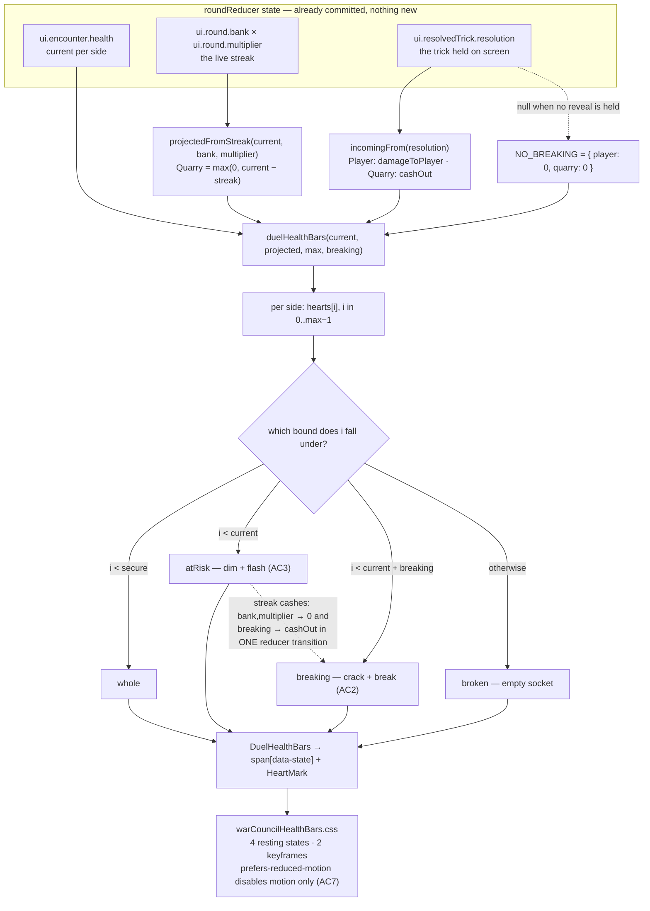

# Plan: Health as breakable hearts, with a pending-cash preview on the Quarry

Plan folder: `.claude/contract/DLR-86-hearts-with-pending-cash-preview/`
Execution status: see `tasks.md` in this folder.

---

## Part 1 — Alignment

*(The shared understanding of what this task is doing. Restate it in your own words — this is how the developer confirms the brief was read correctly before any design happens. Mismatch here = stop and fix.)*

### Task reference

**DLR-86** (Story, parent epic DLR-81 "Run slice — sequenced fights, a spendable charge, and a shop"), labels `playable` / `ui`. Moved `To Do → Planning` at the start of this run.

> **Problem statement.** From the new-player session on 2026-08-14: she didn't recognise the health bar as hers, didn't notice when she lost health, and had no way to read what a pending cash-out would do to the Quarry before it landed. The current bar is a percentage-width track with a text label already on screen (`HEALTH_BAR_LABEL` in `labels.ts`), and the label alone did not fix the recognition problem — see `.docs/design/Balatro-Forbidden-Solitaire/the-hunt-new-player-session-1.md`, findings F2, F3 and F4.
>
> **User story.** As a player, I want my health and the Quarry's health shown as discrete hearts that visibly break when damage lands, and I want to see which of the Quarry's hearts are at risk before I commit to a trick, so that I always know whose bar is whose, notice the moment I'm hit, and can read the stakes of my current streak.
>
> **Acceptance criteria.**
> 1. Each side's health renders as `maxHealth` individual heart icons rather than a continuous bar, one heart per health point.
> 2. When a health-changing event resolves, the hearts lost in that event visibly crack and break — a distinct animation, not just a value or width change.
> 3. While the player is mid-streak (`bank × multiplier > 0`), that many of the Quarry's hearts — clamped to the Quarry's remaining health, since surplus damage is discarded by the existing rules — render at reduced opacity and flash, previewing the damage that would land if the streak cashed right now.
> 4. The instant the streak actually cashes (on the player taking damage, or at the end of the sixth trick), the previewed hearts convert into the same break animation used in AC2 rather than a separate animation.
> 5. The preview resets to zero flashing hearts the moment the bank and multiplier reset to zero.
> 6. Each heart's state (whole, broken, previewed) is distinguishable without relying on colour alone, and the existing accessible name/value text (`HEALTH_BAR_LABEL`, `healthBarValueText`) continues to state the same current-of-max reading for assistive tech.
> 7. `prefers-reduced-motion` is respected for both the break and the flash animations, without losing the state information — whole/broken/at-risk must still read correctly at rest.
>
> **Scope boundaries — in scope:** `DuelHealthBars.tsx` and `duelHealthBars.ts` (the health-bar rendering and its derived view model), the CSS currently driving the bar (`warCouncilHealthBars.css`), and whatever view state is needed to compute the Quarry-side preview from the `bank` and `multiplier` fields already carried on `WarCouncilState`.
>
> **Out of scope:** any change to the damage rules themselves, the bank/multiplier arithmetic, or the `PLAYER_START_HEALTH` / `QUARRY_ENCOUNTER_HEALTH` values — this is a rendering change over state that already exists, not a rules change. Also out of scope: the skull-trick trick-well treatment, the intent-telegraph fixes, and the win/lose panel fixes recorded as separate findings in the same redesign doc.
>
> **Dependencies & risks.** No blocking dependency. `bank`, `multiplier`, and both sides' current/max health are already read by `WarCouncilRound.tsx` and `duelHealthBars.ts` today, so the pending preview is a new view over existing state rather than new state.
> Risk: `DuelHealthBars.tsx`'s own docblock records that its `--w` custom-property split is load-bearing — an inline `width` would permanently out-rank the stylesheet's own transition and lethal-state rules. A heart-grid layout needs to preserve that reasoning (or explicitly state why it no longer applies) rather than silently reintroducing an inline style.
> Risk: the Quarry's health total is `[provisional]` at 10 (`the-hunt.md` §8) and is expected to move. Hearts should render from `maxHealth` rather than assume a fixed count, so a later health retune doesn't require a matching UI change.
>
> **Design assets.** `.docs/design/Balatro-Forbidden-Solitaire/the-hunt-new-player-session-1.md` — findings F2, F3 and F4, whose options (F2-B, F3-A, F4-A) this ticket supersedes with the concrete hearts-and-animation treatment agreed in conversation on 2026-08-14/15. Glyph shape, animation timing, and colour are the developer's call per `game-ux`'s decision boundary — this ticket implements the agreed direction, not a fixed pixel spec.

### Restated goal

Replace both duel health bars' continuous percentage-width tracks with rows of discrete heart glyphs — one heart per health point, counted from `maxHealth`, so a total of 10, 14 or 18 needs no UI change. A heart is in exactly one of four states: whole, at-risk, breaking, or broken. "Breaking" is driven by the damage the trick currently held on screen actually dealt, so the moment a hit lands the hearts it took visibly crack instead of a width sliding by a tenth. "At-risk" is a new read of state that already exists: while the player is mid-streak, the Quarry's last `bank × multiplier` standing hearts (clamped by the array's own bound to what the Quarry actually has) render dimmed and flashing, so the cash-out figure finally sits on the thing it will empty. When the streak cashes, those same hearts — the same DOM elements, at the same indices — flip from at-risk to breaking in one render, so the preview converts into the break rather than being replaced by a second animation. All four states are carried on a `data-state` attribute and distinguished by glyph shape as well as colour, both animations are suppressed under `prefers-reduced-motion` with the resting appearance still carrying the state, and the meters keep their existing role, name and current-of-max value text.

### In scope

- `duelHealthBars.ts` derives a `readonly HeartState[]` of length `max` per side, replacing the `securePct` / `pendingPct` percentage geometry, which nothing renders once the track is gone.
- `duelHealthBars.ts` gains a pure `projectedFromStreak(current, bank, multiplier)` that produces the `projected` record the existing signature already takes — Quarry health minus the streak's cash-out, floored at zero, player untouched.
- `duelHealthBars()` takes a fourth, defaulted `breaking` record (damage dealt by the event currently on screen) and partitions the heart array from it.
- A new `HeartMark.tsx` supplying `HeartSymbolSheet` and `HeartMark`, mirroring the existing `SuitMark.tsx` `<symbol>` + `<use>` pattern — two glyphs, whole and broken, with the broken one a genuinely different shape rather than a recolour.
- `DuelHealthBars.tsx` renders each side as a row of hearts carrying `data-state`, with no inline style on any heart, and mounts the symbol sheet once.
- `warCouncilHealthBars.css` replaces the track/segment/`--w` rules with the heart row, the four resting states, a break keyframe, an at-risk flash keyframe, the lethal treatment, the narrow-viewport collapse, and the `prefers-reduced-motion` block.
- `warCouncil.css` token block: retire `--wc-hp-move-ms` and `--wc-hp-track` (nothing reads them once the track is gone), add heart size, gap, break duration, flash duration, at-risk opacity and a broken-heart colour, all as transcribed placeholders the developer retunes.
- `WarCouncilRound.tsx` passes the streak projection and the current event's damage into the one `duelHealthBars(...)` call it already makes.
- `labels.ts` — `healthBarValueText` appends an at-risk sentence when, and only when, `pending > 0`, so a screen-reader user gets the preview the sighted player gets; the no-pending reading is byte-identical to today's.
- Test coverage for the heart partition, the streak projection and its clamp, the guarded `max`, the rendered `data-state` counts, the absence of inline style, the value text in both shapes, and an integration assertion in `WarCouncilRound.duelHealthBars.test.tsx` that a live streak previews on the Quarry and that the preview clears when the streak resets.

### Explicitly out of scope

- Any change to `src/hunt/**` or `src/warCouncil/**` — the damage rules, the bank/multiplier arithmetic, `applyDamage`'s single clamp point, and both configured health totals stay exactly as they are. This contract touches `src/app/**` only.
- Moving the player's bar out of `RoundStatusBand` to sit beside the hand (F3-A). The Tekken mirror stays; this ticket answers F3 through recognition (a heart row that visibly breaks) rather than through relocation.
- Rendering a numeric cash-out figure against the Quarry's bar. F4-A's number is answered here by the at-risk hearts themselves; `BankMeter` keeps its own `Cashes for {n}` line unchanged.
- F1, F5, F6 and F7 from the same redesign doc — the skull trick-well treatment, the vocabulary alignment, the intent telegraph, and the win/lose panel. Separate tickets.
- Any new runtime dependency. The glyphs are inline SVG in the house `SuitMark` pattern; there is no icon library and no art asset.
- Retuning the `@media (max-width: 44rem), (max-height: 34rem)` breakpoint value, which is duplicated across sheets and documented as this split's one drift risk.

### Pattern Reference

Supplied by the brief:

- `.docs/design/Balatro-Forbidden-Solitaire/the-hunt-new-player-session-1.md` — F2-B ("make the bar's loss a countable object rather than a width"), F3, F4-A. The ticket supersedes their options with the agreed hearts treatment; the *risks* those options record still bind, in particular F4-A's warning that a pending figure on a bar can read as damage already dealt.
- `DuelHealthBars.tsx:42-51` — the `--w` custom-property docblock the brief names as load-bearing.
- `the-hunt.md` §8 — both health totals `[provisional]`; `QUARRY_ENCOUNTER_HEALTH` is `[10, 14, 18]`, so the Quarry side must render up to 18 hearts today.

Chosen here, not supplied:

- `src/app/warCouncil/SuitMark.tsx` — the project's existing glyph pattern (an `aria-hidden` `<symbol>` sheet mounted once, `<use href="#id">` per instance, `stroke="currentColor"` with `stroke-width` left unset so CSS controls weight). `HeartMark.tsx` follows it exactly, including the "the id map and the sheet are the only two places an id may be written" comment, because a symbol id is string-bound and a rename type-checks cleanly while rendering nothing.
- `src/app/warCouncil/QuarryShape.tsx` and `.wc-hp[data-side='quarry']` — the existing precedent for driving variant styling from a `data-*` attribute rather than a concatenated class string.
- `.claude/skills/react-frontend/SKILL.md` and `.claude/skills/game-ux/SKILL.md` for conventions; not restated here.

### Constraints flagged on the brief

- **No inline style on a heart.** The brief names the `--w` split as load-bearing and forbids silently reintroducing an inline style. This plan's answer is that nothing inline is written at all (see Approach) — and the docblock says so explicitly rather than deleting the reasoning.
- **Render from `maxHealth`, never a fixed count.** Both totals are `[provisional]` and `QUARRY_ENCOUNTER_HEALTH` already varies 10 → 14 → 18 within one run.
- **Not a rules change.** No damage arithmetic, no clamp, no config value moves.
- **`prefers-reduced-motion` must not cost state information** (AC7) — the resting appearance alone has to carry whole / at-risk / broken.
- **No colour-only state** (AC6, and `game-ux`'s hard floor: "state reads without motion or colour alone").
- **The existing meters keep their role, accessible names and current-of-max value text** (AC6). `WarCouncilRound.duelHealthBars.test.tsx` drives real play and reads both meters by `getByRole('meter', { name })` and `aria-valuenow`; that query surface must survive untouched.
- **Two runtime dependencies only** — no icon library, no animation library.

### Assumptions made

- **The heart array is derived in the pure module, not in the component.** `duelHealthBars.ts` returns `hearts: readonly HeartState[]` and `DuelHealthBars.tsx` maps over it. Rationale: the partition is the whole of this ticket's logic and has a real invariant (length, monotonic ordering, overkill behaviour); putting it in a `.tsx` file would make it untestable without a renderer, which `react-frontend` names as a design smell.
- **`securePct` and `pendingPct` are deleted rather than left in place.** Rationale: once no element has a width, they are dead fields whose only remaining effect is to keep the retired `--w` mechanism looking alive. The audit below shows all nine hits are inside this contract's own file set.
- **The break state is derived from the trick currently held on screen, not from a remembered previous health value.** `roundReducer` only ever applies damage in the same transition that sets `resolvedTrick`, so `incomingFrom(ui.resolvedTrick.resolution)` *is* the damage of the event on screen. Rationale: this keeps the whole feature a pure function of committed state — no `useState` mirror of last render's health, no effect, no StrictMode double-invocation hazard, and nothing to reset. Consequence the developer should know: the crack stays on screen for exactly as long as the player leaves the trick reveal up, and clears on the same tap that clears the reveal. That is a pacing choice and it is flagged under Risks.
- **The at-risk clamp is done by the array's own bound, not by a second `Math.min`.** A cash-out of 16 into a Quarry on 10 leaves `current = 0` and `breaking = 16`; indices `0..9` all satisfy `i < current + breaking`, so all ten hearts break and nothing overflows. Rationale: this reproduces `applyDamage`'s "surplus damage is discarded" (AC5 of DLR-70) without writing a second clamp that could drift from it. The `projectedFromStreak` helper still floors the Quarry's projected health at zero, because `duelHealthBars`'s documented precondition is `projected <= current` and a negative projection would produce a negative `pending`.
- **`max` is now guarded as a positive finite *integer*.** It stopped being a divisor and became an array length. Rationale: the existing `RangeError` guard is repurposed rather than removed, and integrality is a genuinely new requirement — `assertApplicable` in `src/hunt/encounter.ts` permits fractional *damage* under `DAMAGE_ROUNDING = None`, so a fractional total is expressible in the type even though every configured value is an integer today.
- **`healthBarValueText` gains an at-risk sentence, appended only when `pending > 0`.** Rationale: AC6 requires the current-of-max reading to survive, and it does — byte-identical in the no-pending case that every existing assertion covers. Withholding the preview from assistive tech while showing it to sighted players would make the meter's text less true than the picture. The exact wording is placeholder copy in the `TRICK_OUTCOME_MESSAGE` tradition and is listed as the developer's.
- **`.wc-hp-track` is renamed `.wc-hp-hearts`.** Rationale: the element is a row of countable glyphs, not a depletion track, and a stale name in a string-bound stylesheet is exactly the trap `web-project.md` warns about. All seven hits are enumerated in the audit and change in one task.
- **The symbol sheet mounts inside `DuelHealthBars`, not in `WarCouncilRound` beside `SuitSymbolSheet`.** Rationale: `DuelHealthBars` is the only consumer and renders exactly once, so the component stays self-contained and its own component test renders standalone without a host having to remember to mount a sheet.
- **Heart size, gap, both animation durations, the at-risk opacity and the broken-heart colour are transcribed from this contract's `mockup.html` as placeholders.** Rationale: the DLR-71 precedent, stated verbatim in `warCouncil.css`'s own token comment — "every value below is a placeholder transcribed from the mockup and is the developer's to retune". They are listed under Risks and in `tasks.md`'s "Developer decides or observes" so retuning them is a decision, not an oversight. No value is invented outside that transcription.
- **`flex-wrap: nowrap` with `min-width: 0`, so hearts shrink instead of the band growing.** Rationale: `game-ux`'s hard floor is a shell that never scrolls; a wrapping heart row would add height to a top band that is grid-sized `auto`. Whether 18 hearts stay legible when they shrink is a browser question and goes to QA at named viewports.

### Config and persisted-shape audit

- **Nothing in this app is persisted.** `grep -rn "localStorage\|sessionStorage\|JSON.parse" src/` returns **0 hits**. There is no save file, no stored log, no replay source, so no migration is owed and no stored record is invalidated by any shape change below. Recording that the window is still open is the point of stating it: a later contract that adds persistence inherits the heart states and `HealthBarView` as they land here.
- **`securePct` — 4 hits; `pendingPct` — 5 hits.** Both are confined to `duelHealthBars.ts` (declaration, docblock, two assignments), `DuelHealthBars.tsx` (two `SegmentStyle` reads), `__tests__/duelHealthBars.test.ts` (two assertions) and `__tests__/DuelHealthBars.test.tsx` (one assertion). Every hit is inside this contract's file set and is removed in the same task that removes the fields. Zero hits anywhere in `src/hunt/**` or `src/warCouncil/**`.
- **`HealthBarView` — 5 hits** (`duelHealthBars.ts` declaration, `DuelHealthBars.tsx`, `RoundStatusBand.tsx`, `labels.ts`, plus the test fixtures in `__tests__/labels.test.ts`). This is a widened-then-narrowed type change: two `number` fields leave and one `readonly HeartState[]` arrives, so it is a compile-visible break at every consumer — `npm run typecheck` catches any site this list missed, which is the property that makes this the safe half of the change. `RoundStatusBand.tsx` only forwards the array and needs no edit.
- **`healthBarValueText` — 13 combined hits with `HEALTH_BAR_LABEL`**, across `labels.ts`, `DuelHealthBars.tsx`, `__tests__/labels.test.ts`, `__tests__/DuelHealthBars.test.tsx` and `__tests__/WarCouncilRound.duelHealthBars.test.tsx`. The function's *existing* return value is unchanged for every input those tests use (all have `pending === 0`); only a new `pending > 0` branch is added. `HEALTH_BAR_LABEL` itself is not touched.
- **String-bound CSS names.** `wc-hp` 12 hits, `wc-hp-track` 7, `wc-hp-pending` 7, `wc-hp-secure` 4, `wc-hp-head` 3, `wc-hp-who` 2, `wc-hp-num` 2. `wc-hp-track` → `.wc-hp-hearts` and `wc-hp-secure` / `wc-hp-pending` are retired; `wc-hp`, `wc-hp-head`, `wc-hp-who` and `wc-hp-num` are untouched. Note two hits are documentation (`.docs/implementation/war-council-ui/*.md`) which `implementation-doc-writer` owns and `/fb-apply` updates — this contract does not hand-edit them — and one is a comment in `warCouncilHunt.css:331` recording a `.wc-hp` rule that was already deleted, which stays accurate.
- **CSS custom properties.** `--wc-hp-move-ms` 4 hits (declared in `warCouncil.css`, read twice in `warCouncilHealthBars.css`, once in docs) and `--wc-hp-track` 3 hits — both become dead when the width transition and the track background go, and both are removed in the same task. `--wc-hp-secure-fill`, `--wc-hp-pending-fill`, `--wc-hp-lethal-edge` and `--wc-hp-height` survive with new consumers.
- **Symbol ids are string-bound and invisible to the compiler.** `SuitMark.tsx`'s own comment states the rule: the id map and the `<symbol>` sheet are the only two places an id may be written. `HeartMark.tsx` inherits it — a mistyped `href` renders an empty `<svg>` with no error anywhere.
- **`data-testid`** — zero in this file set; every test queries by role and accessible name, which this change preserves.
- **Architectural boundary.** The pure-core boundary covers `src/warCouncil/**` and `src/hunt/**`, enforced by the `eslint.config.js` override. This contract touches neither tree, so the boundary is unchanged and no new grep target is created. `duelHealthBars.ts` lives under `src/app/` and is therefore outside the lint boundary — it is nonetheless DOM-free and React-free by convention, and stays that way here.

---

## Part 2 — Technical design

### Approach

The whole feature is a **pure function of committed state**, which is the single decision everything else follows from. There is no new React state, no ref, no effect, no timer and no memoisation anywhere in this change — and therefore nothing to clean up, nothing that double-fires under StrictMode, and no module-level `let` to reset between tests. That is possible because both new readings are already sitting in the reducer: the streak is `ui.round.bank × ui.round.multiplier`, and the damage of the event currently on screen is `incomingFrom(ui.resolvedTrick.resolution)`. `roundReducer` never applies damage without setting `resolvedTrick` in the same transition (`commit` calls `applyResolution` only when `deriveResolvedTrick` returned one), so the held reveal *is* the damage event, exactly.

The alternative worth naming is the one this rejects: mirroring last render's health in a `useState` and diffing it to find "what just broke". That is the conventional way to animate a delta, and it is worse here on three counts — it duplicates state the reducer already owns (`react-frontend`: never a parallel copy in a second hook), it needs the derive-during-render adjustment pattern to stay StrictMode-correct, and it would keep breaking hearts on screen after the player taps past the reveal, decoupling the animation from the beat that explains it. Reading the reveal instead ties the crack to the cards that caused it, which is F2's actual finding — the consequence should be visible where the cause is.

`duelHealthBars.ts` keeps its existing three-argument shape and gains a fourth, defaulted `breaking` record, so every existing call site compiles and only the one that wants cracks passes it. Its output swaps two percentages for a `readonly HeartState[]` of length `max`, partitioned by three comparisons per index: below `secure` is whole, below `current` is at-risk, below `current + breaking` is breaking, and the rest are broken. The partition needs no clamp — an overkill cash-out of 16 into a Quarry holding 10 leaves every index satisfying `i < 0 + 16`, so all ten hearts break and the array bound discards the surplus, which is the same "surplus damage is discarded" rule `applyDamage` already owns rather than a second copy of it. The module's `RangeError` guard is repurposed rather than deleted: `max` stopped being a divisor and became an array length, so it is now checked as a positive finite *integer* — the same guard-rather-than-diagnose reasoning, one failure mode along. A second small pure export, `projectedFromStreak`, builds the `projected` record from `bank` and `multiplier` and floors the Quarry at zero, which is what upholds the module's documented `projected <= current` precondition at the one new caller.

Rendering is a row of `<span data-state>` elements, each holding a `HeartMark` — an `<svg><use href="#…"></svg>` bound to one of two `<symbol>`s, following `SuitMark.tsx` exactly, with `stroke-width` left off the paths so CSS owns weight. **No inline style is written on any element in this component.** That is the deliberate replacement for the `--w` split, not an omission of it: the split existed because an inline `width` outranks an external rule with no `!important`, and with a fixed-size glyph row there is no per-element geometry to communicate at all, so the hazard is designed out rather than guarded against. The docblock says so in those terms, so the reasoning survives its mechanism. State goes on `data-state` rather than a concatenated class string, matching the `data-side` attribute already on `.wc-hp`, and every heart is `aria-hidden` because the meter above it already carries the whole reading — `role="meter"`, both accessible names, `aria-valuenow`/`max`/`text` are untouched, which is what keeps the existing integration tests' `getByRole('meter', …)` queries green.

CSS carries the four states and the two animations. Non-colour distinction (AC6) comes from glyph *shape* — whole and broken are two different `<symbol>`s, so a broken heart is a cracked outline rather than a dimmer red one — with opacity and a dashed ring as secondary channels for at-risk. Under `prefers-reduced-motion` both `@keyframes` are switched off and nothing else changes, so AC7 is satisfied by construction: the resting appearance was already carrying all three states before either animation ran. The break keyframe runs once on class arrival, and because health only ever decreases, a given index can never re-enter the breaking state — so there is no retrigger problem to engineer around. The row is `flex-wrap: nowrap` with `min-width: 0` and a `clamp()`ed heart size, so an 18-heart Quarry shrinks its hearts rather than growing a top band that `game-ux`'s no-scroll floor requires to stay `auto`-sized; whether it stays legible at that size is a browser measurement, and it goes to QA at named viewports rather than being asserted in jsdom, which has no layout engine.

### Skills to invoke during execution

- `react-frontend` — owns everything under `src/`: the pure-module-vs-component split, the no-inline-style and no-speculative-memoisation rules, the 400-line budget, the `as const` object-map form for `HeartState` (`erasableSyntaxOnly` forbids `enum`), the Vitest project split (`.test.ts` → node, `.test.tsx` → jsdom), and querying components by role and accessible name.
- `game-ux` — owns the game-screen layer for this change: that up to 18 hearts must fit a quiet, edge-anchored top band without the shell scrolling, that every state must read without colour or motion alone, that the browser check names its viewport sizes, and that glyph shape, colour and animation pacing are the developer's call rather than this plan's.
- `game-designer` — confirmed by the developer at the skill gate. It owns no code here; its live contribution is the F4 boundary, which this plan respects: `the-hunt.md` §9's visibility table says the tricks, the multiplier and what the streak would cash for are open on screen throughout, so the at-risk hearts must be *added to* `BankMeter`'s `Cashes for {n}` line and must not replace it — removing the standing figure would be a rules change routed to that skill, not a UI change. Invoke it only if execution turns up a reading that would move a rule.

The executor must also Read `.claude/workflow/web-project.md`. `.claude/rules/` was scanned (`Glob .claude/rules/*.md`) and contains only `README.md` — there are no domain rules to apply, which is the expected outcome for this project today.

### Diagram



### Data shapes

#### `src/app/warCouncil/duelHealthBars.ts`

```ts
/** The four readings a single heart can carry. `as const` object map rather than an `enum` —
 *  `erasableSyntaxOnly` is on in tsconfig.app.json. The VALUES are written into the DOM as
 *  `data-state`, so they are string-bound: this map and the stylesheet's attribute selectors
 *  are the only two places they may be written. */
export const HeartState = {
  Whole: 'whole',
  AtRisk: 'atRisk',
  Breaking: 'breaking',
  Broken: 'broken',
} as const
export type HeartState = (typeof HeartState)[keyof typeof HeartState]

export interface HealthBarView {
  readonly side: DuelSide
  /** Health that survives the streak currently banked — the whole hearts. */
  readonly secure: Health
  /** Health at risk but not yet lost — the dimmed, flashing hearts. */
  readonly pending: Damage
  readonly current: Health
  readonly max: Health
  /** The streak would empty this side. Rendered as a form change, never colour alone. */
  readonly lethal: boolean
  /** Exactly `max` entries, ordered from the anchored edge inward. `securePct`/`pendingPct`
   *  are gone: no element has a width any more. */
  readonly hearts: readonly HeartState[]
}

/** Zero damage on both sides — the shape passed whenever no damage event is on screen. */
export const NO_BREAKING: Readonly<Record<DuelSide, Damage>>

/**
 * Quarry health minus what the streak would cash, floored at zero; the player untouched.
 * The floor is what upholds this module's documented `projected <= current` precondition —
 * it is NOT a second damage clamp, and it performs no rounding.
 */
export function projectedFromStreak(
  current: Readonly<Record<DuelSide, Health>>,
  bank: number,
  multiplier: number,
): Readonly<Record<DuelSide, Health>>

/**
 * `breaking` is the damage the event currently on screen dealt, keyed by the side it depletes
 * (`incomingFrom` already performs that crossing). Defaulted to `NO_BREAKING` so every existing
 * three-argument call site compiles unchanged.
 *
 * Throws a `RangeError` when a side's `max` is not a positive finite integer — `max` is an array
 * length now rather than a divisor, so a NaN or fractional total would render a wrong count with
 * no error rather than a NaN width with no error.
 */
export function duelHealthBars(
  current: Readonly<Record<DuelSide, Health>>,
  projected: Readonly<Record<DuelSide, Health>>,
  max: Readonly<Record<DuelSide, Health>>,
  breaking?: Readonly<Record<DuelSide, Damage>>,
): readonly HealthBarView[]
```

Removed from `HealthBarView`: `securePct: number`, `pendingPct: number`.

#### `src/app/warCouncil/HeartMark.tsx` (new)

```ts
interface HeartMarkProps {
  readonly broken: boolean
}

/** Mounted once, by `DuelHealthBars`. Defines `#hp-heart` and `#hp-heart-broken`. */
export function HeartSymbolSheet(): JSX.Element

/** One heart glyph, tinted by the surrounding CSS `color`. Always `aria-hidden` — the meter
 *  above the row carries the whole reading. */
export function HeartMark({ broken }: HeartMarkProps): JSX.Element
```

#### `src/app/warCouncil/labels.ts`

```ts
/** Unchanged for every `pending === 0` view — byte-identical to today's output, which is what
 *  every existing assertion pins. Placeholder copy; the wording is the developer's. */
export function healthBarValueText(view: HealthBarView): string
// pending === 0, not lethal → "10 of 10."          (unchanged)
// pending === 0, lethal     → "0 of 10. Lethal."   (unchanged)
// pending  >  0, not lethal → "10 of 10. 6 at risk."
// pending  >  0, lethal     → "10 of 10. 12 at risk. Lethal."
```

#### `src/app/warCouncil/WarCouncilRound.tsx`

```ts
// replaces the single `duelHealthBars(ui.encounter.health, ui.encounter.health, maxHealth)` call
const bars = duelHealthBars(
  ui.encounter.health,
  projectedFromStreak(ui.encounter.health, ui.round.bank, ui.round.multiplier),
  maxHealth,
  ui.resolvedTrick ? incomingFrom(ui.resolvedTrick.resolution) : NO_BREAKING,
)
```

`incomingFrom` is already exported from `src/warCouncil` (`index.ts:25`); no engine change.

#### CSS custom properties — `src/app/warCouncil/warCouncil.css`

Removed (dead once the track and its width transition go): `--wc-hp-move-ms`, `--wc-hp-track`.

Added, all **placeholders transcribed from this contract's `mockup.html`**, all the developer's to retune, in the same tradition as the existing DLR-71 token comment:

| Key | Type / unit | What it does |
|---|---|---|
| `--wc-hp-heart-size` | `clamp()` length | one heart's box; the min bound is what decides whether 18 hearts fit |
| `--wc-hp-heart-gap` | length | spacing between hearts in a row |
| `--wc-hp-broken` | colour | the empty-socket stroke of a broken heart |
| `--wc-hp-atrisk-opacity` | unitless 0–1 | how far a previewed heart dims |
| `--wc-hp-break-ms` | ms | the one-shot crack-and-break duration |
| `--wc-hp-flash-ms` | ms | one cycle of the at-risk flash |

Retained with new consumers: `--wc-hp-secure-fill` (whole), `--wc-hp-pending-fill` (at-risk), `--wc-hp-lethal-edge` (lethal), `--wc-hp-height` (row height).

#### CSS class and attribute names

| Name | Change |
|---|---|
| `.wc-hp`, `.wc-hp-head`, `.wc-hp-who`, `.wc-hp-num` | unchanged |
| `.wc-hp-track` | **renamed** `.wc-hp-hearts` — a row, not a depletion track |
| `.wc-hp-secure`, `.wc-hp-pending` | **removed** |
| `.wc-hp-heart` | **new** — one glyph box, carrying `data-state` |
| `data-state="whole\|atRisk\|breaking\|broken"` | **new**, on `.wc-hp-heart` |
| `.wc-is-lethal` | retained, moves from the pending segment to `.wc-hp-hearts` |
| `@keyframes wc-hp-break`, `@keyframes wc-hp-flash` | **new** |

No `package.json`, `tsconfig.json`, `vite.config.ts` or ESLint change. No new dependency.

### Runtime quality notes

- **Purity and adjudication.** Every derivation — the heart partition, the streak projection, the lethal reading — lives in `duelHealthBars.ts`, which imports nothing from React and touches no DOM global. `DuelHealthBars.tsx` and `HeartMark.tsx` compute nothing: they map an array to elements and bind a `<use href>`. The component decides no rule; it does not know what a bank is. Every tunable — size, gap, both durations, the at-risk opacity, every colour — is a CSS custom property read from `warCouncil.css`, never a literal in a `.tsx` file. `duelHealthBars.ts` is outside the lint-enforced pure-core boundary (that override covers `src/warCouncil/**` and `src/hunt/**`), so this one is review-enforced; the Final verification phase greps it.
- **Effects, mount and teardown.** There are none, and that is the design rather than an accident. No `useEffect`, no `useState`, no `useRef`, no timer, no `requestAnimationFrame`, no listener, no observer, no `AbortController` is added anywhere in this contract — so there is nothing to release in a cleanup, nothing that double-fires under StrictMode's development double-mount, and no module-level mutable state to reset between tests in a file. Both animations are CSS `@keyframes` driven purely by attribute presence, so the browser owns their lifecycle. `HeartSymbolSheet` renders once because `DuelHealthBars` renders once; a second mount would duplicate the two `<symbol>` ids, and `SideBar` deliberately does not mount it for that reason. A second mount of the whole component (a remount between hands) re-renders an identical sheet and re-runs the break keyframe only if a reveal is held at that moment, which is correct.
- **Hot-path cost.** Nothing here runs per pointer event — the only inputs are a card tap and a carry-on tap, both of which already re-render the whole round. Per render the work is two `Array.from` calls of length `max`, so 10 + 10 to 10 + 18 elements at today's configured totals; each entry is three integer comparisons and one string. The heart array is the *only* new allocation and it is bounded by configuration, not by anything the player can grow. No search, no whole-collection rescan, no incremental-update machinery is warranted at this size. **No `memo`, `useMemo` or `useCallback` is added** — there is no profiling evidence and `react-frontend` forbids speculative memoisation.
- **Determinism and numeric safety.** No `Math.random()` is reachable from anything here; the render is a pure function of reducer state and configuration. **The division is gone** — `securePct`/`pendingPct` were the only two in the module — so the classic `NaN`-width failure is structurally absent rather than guarded. Its replacement failure is a bad array length, and the `RangeError` guard is repurposed to cover it: `max` must be a positive finite integer, rejecting `0`, negatives, `NaN`, `Infinity` and a fraction before `Array.from` is reached. `NaN` cannot arrive on `current` or `breaking` from the live path (`applyDamage`'s `assertApplicable` refuses non-finite damage upstream, and `resolveTrickBank` only adds integers), and a `NaN` reaching the partition would make every comparison false and paint every heart broken — visible, not silent, and named here so a reviewer looks for it. No epsilon is needed: every comparison is `<` against values that are integers on the live path, with no equality test on a float.
- **Error paths.** `duelHealthBars` throws its `RangeError` with the side and the offending value named, exactly as today — it is a programming-error guard on a configured total, not a user-facing path, and it must not be caught and turned into a default bar. Nothing in this contract adds a `try`/`catch`, so no failure can be swallowed into a success shape, and there is no `catch { return DEFAULTS }` anywhere near the config read. There is no new async surface, so the four async states do not arise. An invalid move still cannot commit — the engine's `playCard` rejection path is untouched and its reason still reaches `ILLEGAL_MOVE_MESSAGE`. A mistyped `<symbol>` id is the one silent failure mode this change introduces (an empty `<svg>`, no console error), which is why the id map carries `SuitMark.tsx`'s comment and why the component test asserts the rendered `href`.

### Risks and judgement calls

- **Eighteen hearts in a quiet top band is the real risk in this ticket, and it cannot be settled in a test.** `QUARRY_ENCOUNTER_HEALTH` is `[10, 14, 18]`, so the third encounter renders 18 glyphs on one side of a band that also holds the opponent plate, the run label and the `You · Trick · Them` trio. jsdom has no layout engine, so no Vitest assertion can prove the shell does not scroll. QA must load the app and check at named viewport sizes; whether the hearts stay *legible* once shrunk to fit is the developer's eye. If they do not, the fallback is a grouped or two-row treatment, which is a redesign and a separate ticket rather than a fix inside this one.
- **The at-risk preview reintroduces exactly the reading DLR-80 removed, and F4-A warns about it by name:** a pending mark on a bar can read as damage *already dealt*. This plan's mitigations are that the preview is Quarry-side only, dimmed and flashing rather than solid, and never touches the `aria-valuenow` figure. Whether it actually reads as "pending" rather than "done" has one right answer and one cheap measurement — F4-A's own: ask a player mid-hand what the flashing hearts will do.
- **The crack is on screen only while the trick reveal is held, and clears on the tap that clears the reveal.** That is a deliberate pacing choice (the consequence sits with its cause), but it means a player who taps through fast gets a very short break animation, and the animation's duration is a token they can retune. Only playing it settles whether that reads as punchy or as missed.
- **Every one of the six new tokens is a transcribed placeholder and none is chosen.** `--wc-hp-heart-size` (both `clamp()` bounds), `--wc-hp-heart-gap`, `--wc-hp-broken`, `--wc-hp-atrisk-opacity`, `--wc-hp-break-ms`, `--wc-hp-flash-ms`. The size min bound is the one that decides whether the 18-heart case fits, so it is the first to look at.
- **The heart glyph shape is the developer's.** The plan commits to two visually distinct `<symbol>`s — a filled heart and a cracked outline — because AC6 needs shape to carry state without colour. The actual path data is a placeholder in the `SuitMark` house style and should be judged by eye at final size.
- **The at-risk sentence appended to `healthBarValueText` is placeholder copy** ("`10 of 10. 6 at risk.`"). The wording is the developer's, and whether the preview should be announced to assistive tech at all is a call worth confirming — this plan says yes, on the grounds that the meter's text should not be less true than the picture, but it is an assumption the brief did not make.
- **Deleting `securePct` / `pendingPct` and renaming `.wc-hp-track` widens the diff beyond the minimum.** Both are defensible — dead fields and a stale string-bound class name — but they are the planner's call, not the ticket's, and reverting either is cheap if the developer would rather keep the blast radius small.
- **This ticket closes a question `the-hunt.md` §9 has open by name:** "whether the player's health bar reads well at 10 in 1-point steps", sharpened 2026-08-14. Whether hearts answer it is a play observation, and `implementation-doc-writer` should retire or update that entry once it has been played, not before.
