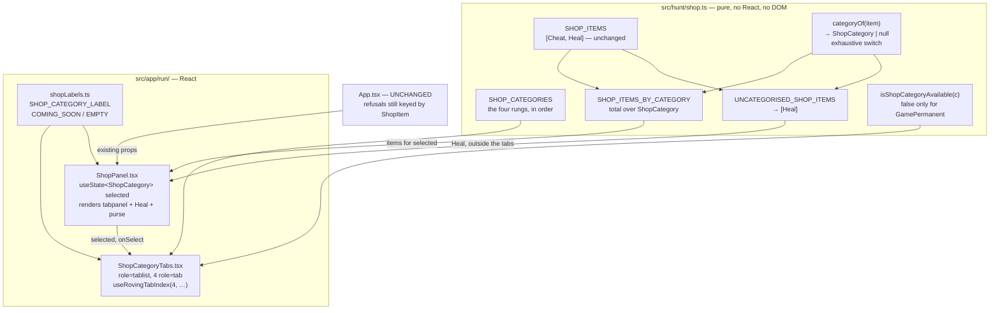

# Plan: Shop rebuild — four-category model and tab UI

Plan folder: `.claude/contract/DLR-89-shop-four-category-model-and-tab-ui/`
Execution status: see `tasks.md` in this folder.

---

## Part 1 — Alignment

### Task reference

**Jira DLR-89** — "Shop rebuild: four-category model and tab UI" (Story, Highest, labels `ui` + `playable`). Moved `To Do → Planning` at the start of this run.

Acceptance criteria, verbatim:

1. A `ShopCategory` type exists (`src/hunt/shop.ts`) with four values: one-time use, fight-long, run-permanent, game-permanent — named after the design doc's own terms, not Balatro's (deck / Joker / consumable), since this game has no deck-building layer to reuse those names for.
2. Every entry in `SHOP_ITEMS` carries a category. `ShopItem.Cheat` is one-time use. `ShopItem.Heal` carries **no** category — per the design doc's "What isn't touched," Heal is an instant transfer with no duration and stays outside the four-category ladder, rendered separately from the tabs.
3. `ShopPanel.tsx` renders four tabs in category order (one-time use, fight-long, run-permanent, game-permanent), each showing the items in that category. Heal renders outside the tabs, as it does today.
4. The game-permanent tab is visibly present and its control is `disabled`, matching this project's existing refusal-state convention (dashed edge, dimmed, `role="status"` reason) rather than a bare greyed box — reuse the pattern `ShopPanel.tsx` already uses for a refused purchase, not a new one. Its stated reason is a placeholder "Coming soon" sentence; the exact copy is the developer's.
5. With only Cheat and Heal wired, the one-time-use tab shows Cheat, fight-long and run-permanent tabs render empty (not broken — an empty state is expected until follow-on tickets land), and Heal still renders and purchases exactly as it does today.
6. Tab switching is keyboard-operable and matches `game-ux`'s tab-stop conventions — this is the first tabbed interaction this module has, so there is no existing pattern to copy verbatim.
7. `npm run typecheck`, `npm run lint`, and the scoped Vitest run for `shop.ts` and `ShopPanel.tsx` all pass.

**Scope boundaries (from the ticket).** In scope: the `ShopCategory` type and per-item category assignment; the four-tab UI; the disabled game-permanent tab; re-homing Cheat and Heal into the new layout with no behaviour change to either. Out of scope: the three new items (Envenom, Poison Guard, Whetstone); the flask, Apply Damage, quick-kill payout; the visual/interactive polish pass.

**Design source.** `.docs/design/Balatro-Forbidden-Solitaire/version-4-scope.md` §1 is the owning design section — it names the four rungs, states that game-permanent ships as a visible "Coming Soon" tab, and its "What isn't touched" paragraph is the authority for Heal sitting outside the ladder. §1's four sub-headings also fix the category order AC3 restates.

**Design assets.** The ticket says "N/A — no mockup exists yet for the four-tab layout. Flag at the plan-approval gate whether one is wanted before `/fb-apply` builds it from prose alone." One has been built — `mockup.html` in this folder — and is presented at the same gate as this plan.

### Restated goal

Replace the shop's flat two-item list with the persistence-length ladder version 4 is built around, using only the two items that exist today. `src/hunt/shop.ts` gains a `ShopCategory` type with the design doc's four rungs and a total item→category assignment in which Cheat is one-time-use and Heal is deliberately uncategorised. `ShopPanel.tsx` grows a four-tab widget over those categories: the one-time-use tab holds Cheat, fight-long and run-permanent render a stated empty shelf, and game-permanent is present-but-refused with a placeholder "Coming soon" reason using the same dashed-edge/`role="status"` treatment a refused purchase already gets. Heal keeps rendering outside the tabs and buying exactly as it does now. Nothing about pricing, refusal rules, or purchase behaviour changes — this ticket is the structure the three follow-on item tickets slot into.

### In scope

- `ShopCategory` as an `as const` object map with the four design-doc rungs, plus `SHOP_CATEGORIES` fixing the render order, in `src/hunt/shop.ts`.
- A total item→category assignment, `categoryOf(item): ShopCategory | null`, returning `ShopCategory.OneTimeUse` for Cheat and `null` for Heal.
- Derived catalogue groupings in `src/hunt/shop.ts` — `SHOP_ITEMS_BY_CATEGORY` (total over `ShopCategory`) and `UNCATEGORISED_SHOP_ITEMS` — so no component re-derives grouping.
- `isShopCategoryAvailable(category)` as the single statement of which rung is sellable, so no component hardcodes "game-permanent is the refused one".
- A new `ShopCategoryTabs.tsx` presentational component: the `role="tablist"` of four tabs, its roving tabindex, its ARIA wiring, and the refused game-permanent tab with its `role="status"` reason.
- `ShopPanel.tsx` holding the selected-category state and rendering the tablist, the selected category's `role="tabpanel"`, the stated empty state, and Heal outside the tabs.
- New copy constants in `shopLabels.ts`: the four tab labels, the tablist's group label, the "Coming soon" sentence, the empty-shelf sentence, and a `shopCategoryAccessibleName` helper mirroring `shopItemAccessibleName`.
- `shop.css` rules for the tablist, tabs, the refused tab, the panel, and the empty state — with the panel built as the one scoped scroll region and `.shop-grid` switched to `auto-fill`, so every list on the screen takes an arbitrary number of items without the page scrolling.
- Vitest coverage: category model and groupings in `src/hunt/__tests__/shop.test.ts`; copy totality in `shopLabels.test.ts`; tab rendering, selection, keyboard movement, the refused tab, the empty state, and unchanged Heal behaviour in `ShopPanel.test.tsx` and a new `ShopCategoryTabs.test.tsx`.
- New `src/hunt/index.ts` re-exports for every new public name.

### Explicitly out of scope

- Envenom, Poison Guard, and Whetstone — the three items that populate the empty tabs. Separate tickets, sequenced after this one.
- The flask, Apply Damage, and the quick-kill payout (version-4-scope §§2–4).
- Any change to pricing, `refusalFor`, `canBuyAnything`, `buyFromShop`, or `shopStockFor`. Purchase behaviour for both existing items is byte-for-byte unchanged in effect.
- Any change to `ShopPanelProps` or `App.tsx` — see the audit below; the design deliberately needs neither.
- The visual and interactive polish pass. This ships a functional default layout in the existing `shop.css` idiom, not a finished look.
- Designing anything for the game-permanent rung. version-4-scope §1 explicitly refuses to.
- Choosing the final tab labels or the "Coming soon" wording — placeholder copy, the developer's, exactly as `shopLabels.ts`'s header already declares for every string in it.

### Pattern Reference

The brief named `src/hunt/shop.ts`, `src/app/run/ShopPanel.tsx`, `shopLabels.ts`, and `.docs/implementation/run-ui/shop-screen.md`. All four are authoritative for this task. Additional references chosen here, with why:

- **`src/hunt/shop.ts`'s `priceOf`** — the house idiom for an item→value mapping in this module is an exhaustive `switch` over `ShopItem`, so that a new item is a compile error rather than an `undefined` at runtime. `categoryOf` follows it exactly.
- **`src/app/run/shopLabels.ts`'s `PURCHASE_REFUSAL_MESSAGE`** — the idiom for user-facing copy keyed by a domain union is a `Readonly<Record<…, string>>` total over that union. `SHOP_CATEGORY_LABEL` follows it.
- **`src/app/warCouncil/useRovingTabIndex.ts`** — the existing, shared roving-tabindex hook, already used by `HandFan` and `AbilityPrompt`. AC6 says "there is no existing pattern to copy verbatim"; that is true of a *tablist*, but not of the keyboard mechanism, which exists and must be reused rather than re-implemented.
- **`.shop-item:disabled` + `<p class="shop-refusal" role="status">` in `ShopPanel.tsx`/`shop.css`** — the exact refusal pattern AC4 requires be reused. The refused tab borrows `.shop-refusal` rather than inventing a second refusal treatment.
- **`src/app/run/RunMap.tsx` and `RunOutcomePanel.tsx`** — the "computes nothing, props only" discipline for this module's panels.
- `react-frontend` and `game-ux` per their `SKILL.md` files, confirmed with the developer at Step 1.5.

### Constraints flagged on the brief

- **No behaviour change to Cheat or Heal** (AC5, and the scope boundary's "with no behaviour change to either"). This is the constraint that shapes the whole design: the catalogue, prices, refusals and purchase path are untouched, and the existing tests that assert them must pass unedited.
- **Reuse the existing refusal-state convention for the refused tab, do not invent one** (AC4, explicit: "not a new one").
- **Keyboard operability is an acceptance criterion, not a nicety** (AC6), and `game-ux` makes it testable — focus movement, activation keys, and `Escape` are all assertable in a component test.
- **Follow-on tickets depend on this type and tab structure** (Dependencies & Risks). The model has to be the thing three later tickets slot an item into with no rework, which is why grouping and availability live in `src/hunt/` rather than in the component.
- **Every list on this screen will get long — build for N items, not for two** (developer, at the approval gate, 2026-08-18). This applies to each category's panel *and* to the uncategorised block Heal sits in. A two-item screen laid out as a fixed two-column grid in normal flow is exactly the thing that breaks on the fifth item, and `game-ux`'s hard floor forbids fixing it with a page scroll. Reflected in Approach, in the CSS under Data shapes, and in the hot-path and Risks notes — it is the constraint that decides the panel's structure rather than a note to remember later.
- **The two-dependency limit** (`react-frontend`): no new dependency is needed or proposed. No tab library.
- **`ShopPanelProps` and `shopLabels.ts` "both change shape"** was flagged as a risk. Half of it holds and half does not — see the audit.
- Placeholder-copy discipline: `shopLabels.ts` declares every string in it the developer's; the new strings inherit that and are listed for the developer rather than presented as chosen.

### Assumptions made

- **AC2's two sentences only reconcile as `ShopCategory | null`.** "Every entry in `SHOP_ITEMS` carries a category" and "`ShopItem.Heal` carries **no** category" are literally contradictory, since Heal is a `SHOP_ITEMS` entry. The reading taken: the assignment is *total over `ShopItem`* — every item is assigned — and Heal's assignment is `null`. This satisfies both halves and matches the design doc's "it stays outside the four categories rather than being forced into one". `SHOP_ITEMS` itself is unchanged, so `canBuyAnything` and the existing test asserting `[Cheat, Heal]` keep working. Reflected in Approach and Data shapes.
- **The refused tab uses `aria-disabled="true"`, not the native `disabled` attribute.** AC4 says "its control is `disabled`", and this is the one place the plan departs from the criterion's literal word — deliberately, and it is the first item under Risks for the developer to red-line. A native `disabled` button is removed from the tab order *and* from arrow-key traversal, so a keyboard or screen-reader user would never encounter the tab at all — which destroys the tab's entire purpose ("the shape of the full system reads"). `aria-disabled` keeps it focusable and announced while still refusing activation, and it satisfies everything AC4 actually asks for: the control cannot be activated, it renders dashed-and-dimmed via `[aria-disabled='true']` reusing `.shop-item`'s existing refusal styling, and its reason sits in a `role="status"`.
- **The tablist gets a roving tabindex despite holding only four controls.** `game-ux`'s threshold is "more than about five sibling controls", which four is under — but the threshold governs *when a loose collection must become one widget*, and a `role="tablist"` already is one by definition. WAI-ARIA's tabs pattern is one tab stop plus arrow keys, and a screen reader announcing "tab, 1 of 4" while arrow keys do nothing is a broken half-implementation. `game-ux` names the WAI-ARIA Authoring Practices as a preferred source, and the mechanism already exists as `useRovingTabIndex`. Reflected in Approach and Risks.
- **Manual activation, not selection-follows-focus.** Arrow keys move focus; `Enter`/`Space`/click selects. Chosen because the refused game-permanent tab must be reachable by arrow key without being selected — automatic activation would try to select it on arrival and need a special case.
- **Selected-category state is local `useState` in `ShopPanel`, not a reducer and not run state.** It is transient presentation state with one transition (select a category), so `react-frontend`'s "route state through a single reducer where state is non-trivial" does not bite. It deliberately does not persist across leaving and re-entering the shop — nothing in the brief asks it to.
- **The tablist is extracted into its own `ShopCategoryTabs.tsx`.** Keeps the ARIA and keyboard mechanism in one testable unit and keeps `ShopPanel.tsx` inside its size budget. It is presentational — state and the selection callback live in `ShopPanel`.
- **Default selected tab is one-time use** — first in category order and the only populated rung today.
- **A category's "availability" is a rule in `src/hunt/`, not emptiness in the component.** Fight-long and run-permanent are empty *and selectable*; game-permanent is empty *and refused*. Those are different facts, so `isShopCategoryAvailable` states the second one explicitly rather than letting the component infer refusal from a zero-length array — which would silently start refusing fight-long until DLR's Poison Guard ticket lands.
- **Only the selected category's panel is rendered**, per WAI-ARIA's tabs pattern, rather than rendering four panels and hiding three.
- **New CSS `clamp()` bounds and hues follow the neighbouring rules' scale** rather than being invented from nothing, and `shop.css`'s header already declares every such bound in the file the developer's to retune. Listed under developer-observes, not blocked on — consistent with how DLR-84 shipped the same file.
- **No new configuration key and no new tunable number.** Category order is fixed by the design doc, not chosen here.

### Config and persisted-shape audit

- **`SHOP_ITEMS` — 13 occurrences across 5 files** (`src/hunt/shop.ts` ×2 including the declaration, `src/hunt/index.ts` ×1, `src/app/run/ShopPanel.tsx` ×4 — one import, one render at line 121, two doc comments, `src/hunt/__tests__/shop.test.ts` ×3, `src/app/run/__tests__/shopLabels.test.ts` ×3). **Its value and order are unchanged by this plan**, so none of these is a breaking site. The only behavioural reader that moves is `ShopPanel.tsx:121`, whose flat `SHOP_ITEMS.map(...)` is replaced by a per-category read; both its doc comments are updated in the same task.
- **Every new name is genuinely new — zero hits in `src/`.** `ShopCategory`, `shop-tab`, `shop-panel`, and `shop-empty` return 0 occurrences across the whole `src/` tree. The 5 hits repo-wide are all in `.claude/contract/DLR-87-epic-breakdown/tasks.md`, which is the planning prose this ticket was written from, not code. So there is no rename in this contract — only additions — and no stale reader can survive it.
- **Nothing is persisted anywhere. Zero hits for `localStorage`, `sessionStorage`, and `indexedDB` across `src/`.** The only `JSON.stringify` hits (8, all in `src/hunt/__tests__/run.test.ts`) are immutability assertions comparing a value to itself, not serialisation. **No save file, no stored log, no replay derives from any shape this ticket touches, so `ShopCategory` can be introduced with no migration and no compatibility concern.** Recording that the window is open: the first contract that persists `RunState` closes it, and `ShopCategory` values will become stored strings at that moment.
- **Type changes: additive only, no loss.** No existing type is retyped, widened, or narrowed. `ShopItem`, `PurchaseRefusal`, `ShopStock`, `priceOf`, `refusalFor`, `canBuyAnything`, and `ShopPanelProps` all keep their current signatures. The one union that gains a member is nothing — `ShopCategory` is new, so no `switch` anywhere needs a new case. `categoryOf` returns `ShopCategory | null`, so its single caller must handle `null`; there is one caller and it is written in this contract.
- **Consumers of the changed exported surface, enumerated.** `ShopPanel.tsx` is the only non-test consumer of `SHOP_ITEMS` outside `src/hunt/`, and the only component this ticket edits. `App.tsx` consumes `ShopPanel` (line 207), `ShopItem`, `refusalFor`, and `canBuyAnything` — **and needs no edit**, because `refusals` stays keyed by `ShopItem` and categories are static catalogue data the component imports directly, exactly as it already imports `SHOP_ITEMS`. **This contradicts the ticket's own risk note** that "`ShopPanelProps` … change[s] shape": `shopLabels.ts` does change shape, `ShopPanelProps` does not, and adding a category prop would push catalogue knowledge into the driver for no gain. Flagged under Risks so the developer can overrule.
- **String-bound names align across the chain.** The new CSS class names bind by string in both directions: `.shop-grid`/`.shop-item`/`.shop-refusal` currently appear 6 times in `ShopPanel.tsx` and 12 times in `shop.css`. Every new class (`.shop-tabs`, `.shop-tab`, `.shop-panel`, `.shop-empty`) is introduced in the component and the stylesheet **in the same task**, and the refused tab is styled off the `[aria-disabled='true']` attribute rather than a state class so it cannot drift from the attribute that actually refuses activation — the same discipline `.shop-item:disabled` already uses. `ShopPanel.test.tsx` also binds `.shop-heart`, `.shop-next`, and `.shop` by string; none of those is touched.
- **The pure-core boundary is not crossed.** `eslint.config.js` enforces no-React/no-DOM on `src/hunt/**`. Everything added to `src/hunt/shop.ts` — a type, three constants, two functions — is plain TypeScript with no React import and no DOM global. All React, ARIA, and keyboard code lands in `src/app/run/`, outside the boundary. The Final verification phase greps `src/hunt/` to confirm.

---

## Part 2 — Technical design

### Approach

The split follows the boundary this repo already enforces: **the ladder is domain data, so it lives in `src/hunt/shop.ts`; the tabs are presentation, so they live in `src/app/run/`.** `shop.ts` gains `ShopCategory` (an `as const` object map, since `erasableSyntaxOnly` forbids `enum`), `SHOP_CATEGORIES` fixing the design doc's order once, `categoryOf` as an exhaustive `switch` mirroring `priceOf`, and two derived constants — `SHOP_ITEMS_BY_CATEGORY` (total over `ShopCategory`) and `UNCATEGORISED_SHOP_ITEMS`. Those two are computed at module load from `SHOP_ITEMS` and `categoryOf`, which means the catalogue is still stated exactly once and a follow-on ticket adds an item by adding one `ShopItem` member and one `categoryOf` case — the tab it appears in follows with no UI edit at all. That is the property the three dependent tickets need, and it is why grouping is not a `useMemo` in the component. `isShopCategoryAvailable` states separately that game-permanent is the refused rung, because "empty" and "refused" are different facts today and conflating them would make fight-long refuse itself until its item ships.

The alternative considered and rejected for the model was **a category field on a richer `ShopItemDefinition` record** — replacing the `ShopItem` string union with an array of objects carrying id, price, and category. It reads better in isolation and is where this module probably ends up once items have more attributes, but it would rewrite `priceOf`, `refusalFor`, `buyFromShop`, `SHOP_ITEM_NAME`, `SHOP_ITEM_BLURB`, and every existing test — a large diff whose entire risk lands on the "no behaviour change to Cheat or Heal" constraint, for a ticket whose job is to add a grouping. Deferred deliberately; noted under Risks as the refactor the next item ticket may want.

On the UI side, `ShopPanel` keeps its "computes nothing" discipline in the sense that matters — it re-derives no *rule*. It does gain one piece of genuinely presentational state, `useState<ShopCategory>` for the selected tab, which is exactly what belongs in a component and needs no reducer for its single transition. The tablist itself is extracted to **`ShopCategoryTabs.tsx`**, a presentational component taking the selected category and a select callback, owning the `role="tablist"`, the four `role="tab"` buttons, their `aria-selected`/`aria-controls`/`id` wiring, and the keyboard mechanism. `ShopPanel` renders it, then renders the one `role="tabpanel"` for the selected category — the items from `SHOP_ITEMS_BY_CATEGORY` in the existing `.shop-grid`/`.shop-item` markup, or the stated empty shelf when there are none — and then Heal, from `UNCATEGORISED_SHOP_ITEMS`, outside the tabs entirely, in the markup it uses today.

The keyboard mechanism **reuses `useRovingTabIndex`** rather than re-implementing it: arrow keys and `Home`/`End` move focus among the four tabs, activation is manual via the native button, and the hook's existing focusable-index filter is what lets the refused tab participate. Two traps in that reuse are designed around rather than discovered later. First, **the hook's `focusIndex` binds by `querySelectorAll('button')` on its group element** — an untyped, tag-name-bound contract its own doc comment flags — so the tablist container must be the roving group and must contain the four tab buttons and nothing else; the tabpanel and its purchase buttons sit *outside* that container, or arrow keys would start focusing purchase controls. Second, **the hook calls `onCancel` on `Escape` and does not stop propagation**, while `ShopPanel`'s `.shop` container already handles `Escape` by calling `onLeave` — which is wired to `advanceRun`. Passing `onLeave` as `onCancel` would therefore fire it twice from one keypress and **silently skip a fight**. `onCancel` is a documented no-op and `Escape` is left to bubble to the container that already owns it, so the screen's existing `Escape` contract is unchanged and fires exactly once.

**The panel is built to hold a long list, because every one of these lists will become one.** Three structural consequences, all of them cheap now and expensive to retrofit. First, the panel's grid is `repeat(auto-fill, minmax(<floor>, 1fr))` rather than the current hard `repeat(2, …)`, so item count drives the column count and a nine-item shelf packs instead of stretching two columns down the page. Second, **the panel is the one region on this screen allowed to scroll** — `overflow-y: auto` with a `max-height` bounded in viewport units, plus `overscroll-behavior: contain` so a flick at the end of the list does not scroll the shell behind it. `game-ux`'s hard floor is *the page* never scrolls and any genuinely scrolling region must be scoped and justified: this is that region, and the justification is that the catalogue is unbounded while the viewport is not. The purse, health, tablist, hint and leave control all stay fixed and visible, so nothing a purchase decision needs can scroll out of reach. Third, Heal's uncategorised block gets the same grid treatment for the same reason — "all the lists" includes that one, and it is the block most likely to be forgotten because it holds exactly one item today.

Two things deliberately *not* done for long lists, so the scope stays honest. The item cards inside a panel keep **plain tab stops** rather than gaining a second roving tabindex: there is one card in a panel today, and `game-ux`'s threshold is about five siblings, so building the mechanism now would be speculative and untestable against real behaviour. But the threshold *will* be crossed by these tickets, so it is named as an explicit obligation under Risks rather than left to be rediscovered — and the panel is already the right container to attach it to when it is. No virtualisation, either: `auto-fill` plus a bounded scroll region handles tens of items, and a prototype shop will not hold hundreds.

Copy goes in `shopLabels.ts` in that file's existing idiom: `SHOP_CATEGORY_LABEL` as a `Readonly<Record<ShopCategory, string>>` total over the union, so a fifth rung is a compile error rather than a blank tab; the tablist's group label, the "Coming soon" sentence, and the empty-shelf sentence as named constants; and `shopCategoryAccessibleName` folding the refusal reason into the refused tab's accessible name, mirroring `shopItemAccessibleName` so a screen-reader user hears *why* on focus. `shop.css` gains `.shop-tabs`, `.shop-tab`, `.shop-panel`, and `.shop-empty`, with the refused state hanging off `[aria-disabled='true']` — an attribute selector on the attribute that actually does the refusing, so styling cannot drift from behaviour, which is the same reason `.shop-item:disabled` is written that way.

### Skills to invoke during execution

- **`react-frontend`** — owns every file in this contract's file map: the `src/hunt/shop.ts` model, the `ShopPanel.tsx` and new `ShopCategoryTabs.tsx` components, `shopLabels.ts`, `shop.css`, and all four spec files. Carries the MUST/NEVER contract, the 400-line budget, the no-speculative-memoisation rule, the `erasableSyntaxOnly` constraint that forces the `as const` map over an `enum`, and the Vitest project split (`node` for `.test.ts`, `dom` for `.test.tsx`) that decides where each spec may live.
- **`game-ux`** — owns AC6 and AC4's presentation half: the roving-tabindex convention and its "about five" threshold (and therefore the judgement call recorded above), the group label on the container, the state-reads-without-colour-alone floor that the dashed refused tab satisfies, and the standing note that jsdom cannot prove a screen does not scroll — so the layout claim is QA's in a real browser, not a test's.

Developer override: none. Both proposed skills were confirmed at Step 1.5; `game-designer` and `implementation-doc-writer` were offered and declined — the former because version-4-scope §1 already settles the design, the latter because `/fb-apply` invokes it automatically at its own Step 6.5.

The executor must also Read `.claude/workflow/web-project.md` — it owns every path and runner command in `tasks.md`, and its `Select-String` recursion trap and `(Get-Content <path>).Count` line-count rule both apply to this contract's Final verification phase. `.claude/rules/` was scanned and is empty (only its `README.md` exists), so no rule file applies; re-scan rather than assuming that holds.

### Diagram



### Data shapes

#### `src/hunt/shop.ts` — additions

```ts
/** The persistence-length ladder (version-4-scope.md §1), named after the design doc's own rungs
 *  rather than Balatro's deck / Joker / consumable — this game has no deck-building layer for
 *  those names to mean anything against. `as const` object map, not an `enum`:
 *  `erasableSyntaxOnly` is on. */
export const ShopCategory = {
  OneTimeUse: 'oneTimeUse',
  FightLong: 'fightLong',
  RunPermanent: 'runPermanent',
  GamePermanent: 'gamePermanent',
} as const
export type ShopCategory = (typeof ShopCategory)[keyof typeof ShopCategory]

/** AC3 — the four rungs in the order the screen renders them, stated once. */
export const SHOP_CATEGORIES: readonly ShopCategory[]

/** AC2 — total over `ShopItem`, so a new item is a compile error here rather than an item that
 *  quietly appears in no tab. `null` is Heal's real answer, not a missing one: an instant
 *  transfer has no duration, so it sits outside the ladder (design doc, "What isn't touched"). */
export function categoryOf(item: ShopItem): ShopCategory | null

/** Derived from `SHOP_ITEMS` + `categoryOf` at module load, total over `ShopCategory` so a fifth
 *  rung is a compile error. THE statement of which items a tab holds — a screen reads this, it
 *  never groups the catalogue itself. */
export const SHOP_ITEMS_BY_CATEGORY: Readonly<Record<ShopCategory, readonly ShopItem[]>>

/** The items with no category — `[Heal]` today. Rendered outside the tabs (AC2/AC3). */
export const UNCATEGORISED_SHOP_ITEMS: readonly ShopItem[]

/** Whether a rung is sellable at all. `GamePermanent` is shown and refused rather than hidden, so
 *  the shape of the full ladder reads (design doc §1). DELIBERATELY not "is this tab empty":
 *  fight-long and run-permanent are empty today and still selectable. */
export function isShopCategoryAvailable(category: ShopCategory): boolean
```

No existing export in this file changes signature. `SHOP_ITEMS` keeps its value and order.

#### `src/hunt/index.ts` — re-exports added

```ts
export {
  ShopCategory,
  SHOP_CATEGORIES,
  SHOP_ITEMS_BY_CATEGORY,
  UNCATEGORISED_SHOP_ITEMS,
  categoryOf,
  isShopCategoryAvailable,
} from './shop'
```

`ShopCategory` is both a value and a type from the `as const` pattern, so it is re-exported from the value export list exactly as `ShopItem` and `PurchaseRefusal` already are — not via `export type`.

#### `src/app/run/shopLabels.ts` — additions (ALL placeholder copy, the developer's)

```ts
/** The tab labels. Total over `ShopCategory`, so a fifth rung is a compile error here rather than
 *  a blank tab on screen — the same guarantee `PURCHASE_REFUSAL_MESSAGE` gives. */
export const SHOP_CATEGORY_LABEL: Readonly<Record<ShopCategory, string>>
// One-time use / Fight-long / Run-permanent / Game-permanent

export const SHOP_TABLIST_LABEL: string        // the container's group label (game-ux)
export const SHOP_CATEGORY_COMING_SOON: string // AC4 — the refused tab's stated reason
export const SHOP_CATEGORY_EMPTY: string       // AC5 — the stated empty shelf
export const SHOP_ASIDE_LABEL: string          // heads Heal's block, outside the ladder

/** The tab's accessible name, folding in the refusal reason so a screen-reader user hears why on
 *  focus — mirrors `shopItemAccessibleName`. */
export function shopCategoryAccessibleName(category: ShopCategory, available: boolean): string
```

#### `src/app/run/ShopCategoryTabs.tsx` — new component

```tsx
interface ShopCategoryTabsProps {
  readonly selected: ShopCategory
  /** Called only for an available category — the refused tab's activation is a no-op. */
  readonly onSelect: (category: ShopCategory) => void
}
export default function ShopCategoryTabs(props: ShopCategoryTabsProps): JSX.Element
```

Renders `<div className="shop-tabs" role="tablist" aria-label={SHOP_TABLIST_LABEL}>` over `SHOP_CATEGORIES`, each tab a native `<button role="tab" className="shop-tab">` carrying `id={shopTabId(category)}`, `aria-controls={shopPanelId(category)}`, `aria-selected`, `tabIndex` from the hook, and `aria-disabled={!isShopCategoryAvailable(category)}`. The refused tab is followed by `<p className="shop-refusal" role="status">{SHOP_CATEGORY_COMING_SOON}</p>`, reusing the existing refusal class.

```ts
/** Both exported, because `ShopPanel` must pair its tabpanel with the same ids — a second
 *  hand-written `shop-tab-${category}` template at the call site is a string-bound duplicate
 *  the compiler cannot check. */
export const shopTabId: (category: ShopCategory) => string
export const shopPanelId: (category: ShopCategory) => string
```

#### `src/app/run/ShopPanel.tsx` — the one internal change

```tsx
const [selectedCategory, setSelectedCategory] = useState<ShopCategory>(ShopCategory.OneTimeUse)
```

**`ShopPanelProps` is unchanged** — no added, removed, or retyped prop. `refusals` stays `Readonly<Record<ShopItem, PurchaseRefusal | null>>`.

#### `src/app/run/shop.css` — new classes

`.shop-tabs` (the tablist row), `.shop-tab`, `.shop-tab[aria-selected='true']`, `.shop-tab[aria-disabled='true']` (dashed edge + dimmed, matching `.shop-item:disabled`), `.shop-tab:focus-visible`, `.shop-panel`, `.shop-empty`. Hover wrapped in `@media (hover: hover)` and paired with `:active`; `min-height: 44px` and `touch-action: manipulation` on `.shop-tab`, per `react-frontend`'s accessibility floor.

The long-list structure, per the constraint above:

```css
/* The ONE scoped scroll region on this screen. The catalogue is unbounded; the
   viewport is not. Everything a purchase decision needs — purse, health, tabs,
   the leave control — stays outside it and stays visible. */
.shop-panel {
  max-height: <bounded in vmin/dvh — a developer-owned bound>;
  overflow-y: auto;
  overscroll-behavior: contain;
}

/* Item count drives the column count, so a long shelf packs instead of
   stretching two columns down the page. Replaces the existing hard
   `repeat(2, minmax(0, 1fr))` and makes the `max-width: 30rem` single-column
   media query redundant — auto-fill already collapses to one column. */
.shop-grid {
  grid-template-columns: repeat(auto-fill, minmax(<floor>, 1fr));
}
```

The `max-height` bound and the `minmax()` floor are **tuning values the developer owns** — together they decide how many cards are visible before the shelf scrolls and how narrow a card may get. Handled the way `shop.css` already handles every bound in it and the way DLR-84 shipped: the executor writes a **documented placeholder in the neighbouring rules' scale** so nothing is blocked, marks it as placeholder in the file, and both are listed under "Developer decides or observes" for retuning by eye. The executor does not invent a *new* scale or justify a figure as chosen — these are explicitly provisional.

#### No configuration change

No new configuration key, no new tunable number, no `package.json`, `tsconfig.json`, `vite.config.ts`, or `eslint.config.js` change. Category order is fixed by version-4-scope §1, not chosen here. The new `clamp()` bounds and hues in `shop.css` are covered by that file's existing header declaring every such value the developer's to retune.

### Runtime quality notes

- **Purity and adjudication.** The whole ladder — the four rungs, their order, the item→category assignment, the two groupings, and which rung is refused — is plain TypeScript in `src/hunt/shop.ts`, unit-testable with no renderer and inside the ESLint-enforced no-React/no-DOM boundary. The components decide nothing: `ShopCategoryTabs` asks `isShopCategoryAvailable` whether a tab refuses rather than testing `category === ShopCategory.GamePermanent`, and `ShopPanel` reads `SHOP_ITEMS_BY_CATEGORY` rather than filtering the catalogue. No purchase rule is re-read — `refusals` still arrives from the driver's single `refusalFor` call, so the existing "a greyed button and a thrown `RangeError` cannot disagree" guarantee is untouched. No tunable is hard-coded because none is introduced.
- **Effects, mount and teardown.** **No `useEffect` is added anywhere in this contract.** There is no listener, no observer, no timer, no `requestAnimationFrame`, no `AbortController`, and therefore no cleanup to get wrong and nothing for StrictMode's double-invocation to break — `useRovingTabIndex` moves focus imperatively inside its keydown handler, never from an effect, which its own doc comment states as deliberate. All keyboard handling is an `onKeyDown` prop on an element React already owns, exactly as `ShopPanel`'s existing `Escape` handler is. No module-level mutable state is introduced: `SHOP_ITEMS_BY_CATEGORY` and `UNCATEGORISED_SHOP_ITEMS` are module-level but frozen-by-convention `readonly` derived constants with no writer, so they neither survive HMR as stale state nor leak between tests. A second mount re-derives identical values and starts with the one-time-use tab selected.
- **Hot-path cost.** Nothing here is a high-frequency surface — a tab is clicked or arrowed to a handful of times per shop visit, and there is no pointer-move or resize path. The hook's per-keypress work builds one four-element index array, bounded by a category count fixed at four. Per `react-frontend`, no `memo`, `useMemo`, or `useCallback` is added: there is no profiling evidence, and speculative memoisation is itself the anti-pattern. **The long-list constraint is why grouping is a module-load constant rather than a render-time filter**: `SHOP_ITEMS_BY_CATEGORY` is computed once from `SHOP_ITEMS`, so switching tabs never re-scans the catalogue no matter how long it grows, and a `useMemo` over a filter — the obvious alternative — would re-run per mount for no benefit and need profiling evidence it does not have. Only the selected panel's items are rendered, so cost scales with one shelf rather than the whole catalogue, and the panel's scroll is native and compositor-driven with no scroll listener attached.
- **Determinism and numeric safety.** No randomness is reachable from anything added — no `Math.random()`, no seed path, no shuffle. No arithmetic at all: no division, so no guarded divisor is needed and no `NaN` can reach a rendered value. The one numeric value in the design is the hook's index arithmetic, which is modular over a non-empty fixed-size array (`% focusableIndices.length`, guarded by the hook's existing `length === 0` early return) and therefore cannot produce `NaN` or an out-of-range index. No epsilon is involved.
- **Error paths.** Nothing added throws, and nothing is caught — there is no async surface, no I/O, no parse, and no config load, so there is no `catch` to swallow a failure into a success shape and no loading/error/empty triad to handle. The two states that *are* handled explicitly, and would otherwise be silent: **an empty category renders `SHOP_CATEGORY_EMPTY` rather than an empty div** (AC5 — a blank panel is indistinguishable from a broken one), and **the refused tab states `SHOP_CATEGORY_COMING_SOON` in a `role="status"` and folds it into the tab's accessible name** rather than being an inert control that ignores clicks (AC4). Activation of the refused tab is a no-op guarded by `isShopCategoryAvailable`, so an invalid selection cannot commit, and its refusal names a specific reason. `categoryOf`'s `null` is an explicit, documented return value handled at its one call site, not an absent case.

### Risks and judgement calls

- **`aria-disabled` on the refused tab instead of the native `disabled` attribute AC4 names.** The single most likely thing the developer wants to overrule, and the reasoning is in Assumptions: native `disabled` removes the tab from both the tab order and arrow-key traversal, so the one user who most needs the tab to announce "there is a fourth rung coming" is the one user who would never find it. Everything AC4 asks for is still delivered — unactivatable, dashed-and-dimmed via the existing `.shop-item` refusal treatment, `role="status"` reason. Say the word and it becomes `disabled`, at the cost of the keyboard path; the hook's `isFocusable` filter already handles either choice, so the change is small.
- **A roving tabindex for four controls, where `game-ux`'s letter says "more than about five".** Judgement call, reasoned in Assumptions. The alternative is four plain tab stops — simpler, closer to `CheatSlots`'s precedent, and defensible under the threshold's literal wording, but it produces a `role="tablist"` that announces itself as a tab widget and then does not respond to arrow keys.
- **`ShopPanelProps` and `App.tsx` are untouched, contradicting the ticket's own risk note.** The audit found no reason for either to change: `refusals` stays keyed by `ShopItem`, and categories are static catalogue data the component imports exactly as it already imports `SHOP_ITEMS`. If the developer intended the driver to own category selection — for example so a follow-on ticket can deep-link a tab, or preserve the selected tab across shop visits — that is a props change and this plan does not make it. Worth a look before approving.
- **The richer `ShopItemDefinition` refactor is deferred, not rejected.** Named in Approach with its cost. The first item ticket that needs a per-item attribute beyond price and category will probably want it, and doing it then rather than now keeps this ticket's diff off the "no behaviour change" constraint.
- **The tab labels, the "Coming soon" sentence, and the empty-shelf sentence are placeholder copy the developer owns.** The plan supplies functional defaults in `shopLabels.ts`'s declared-placeholder idiom so nothing is blocked. version-4-scope's own open-questions list already asks "whether the Game-permanent tab's 'Coming Soon' state needs any copy beyond that phrase" — that question is still open and this ticket does not close it.
- **The new `clamp()` bounds and hues in `shop.css` are tuning values, transcribed in the neighbouring rules' scale rather than chosen.** That file's header already declares every bound in it the developer's to retune, and DLR-84 shipped on the same footing. Nothing is blocked, but the tab row's proportions are a by-eye call.
- **The item cards inside a panel keep plain tab stops, and that becomes a `game-ux` breach the moment a shelf holds about five items.** Reasoned in Approach. Today a panel holds one card, so a roving tabindex over cards would be speculative — but the developer has stated these lists will get long, so this is a **named obligation on the follow-on item tickets, not a closed question**: the first ticket that pushes a category past roughly five cards must give the panel its own roving tabindex over its cards (the mechanism is already in `useRovingTabIndex`, and the panel is already the right container to attach it to). Worth confirming you want it deferred rather than built now — building it now costs one more component test and removes the chance that three separate item tickets each assume another one did it.
- **The panel's `max-height` and the card `minmax()` floor are the two new tuning values**, and together they decide how much of a long shelf is visible before it scrolls. Placeholders in the neighbouring scale ship so nothing blocks; both want your eye once a shelf actually has items in it, since a bound that shows one and a half cards reads as broken rather than scrollable.
- **Whether four tabs plus a purse row, a health row, a panel, and Heal still fit one viewport with no scroll is a real layout risk, and no test can answer it.** `game-ux` is explicit that jsdom has no layout engine. This is the tallest the shop screen has ever been, and the ticket's out-of-scope list defers the polish pass. It has a right answer, so it belongs to QA in a real browser at named viewport sizes — the Final verification phase says so — but *whether the result feels cramped* is the developer's eye.
- **Whether tab selection should survive leaving and re-entering the shop.** This plan says no: local state, reset on mount, defaulting to one-time use. Nothing in the brief asks otherwise, and the alternative means lifting the selection into `App.tsx`.
- **`Escape` in the shop still advances the run, and that predates this ticket.** `.docs/implementation/run-ui/shop-screen.md` records it as a flagged developer call from DLR-84 that was never resolved. This contract deliberately does not change it — and specifically avoids making it worse by passing a no-op `onCancel` to the hook, which would otherwise fire `advanceRun` twice from one keypress and skip a fight. Still the developer's call, still open.
