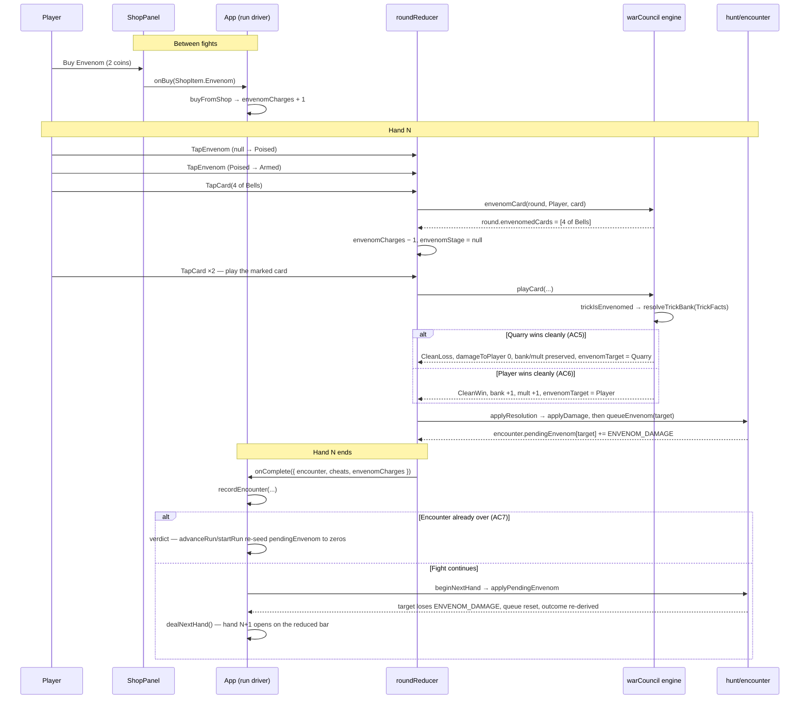

# Plan: Envenom — the poison consumable and the delayed-hit rule

Plan folder: `.claude/contract/DLR-90-envenom-and-the-delayed-hit-rule/`
Execution status: see `tasks.md` in this folder.

---

## Part 1 — Alignment

### Task reference

**Jira: DLR-90 — "Envenom: poison consumable and the delayed-hit rule"** (Story, labels `engine` + `playable`, parent epic DLR-87 "Shop rebuild: persistence categories, flask, Apply Damage, quick-kill payout"). Moved `To Do → Planning` at the start of this run.

Acceptance criteria, verbatim from the ticket:

1. A new `ShopItem` (placeholder name `Envenom`) is added to the one-time-use category at 2 coins (a new `ENVENOM_PRICE` key in `src/hunt/config.ts`, transcribed from the design doc, not derived).
2. Buying Envenom does not spend it immediately — it arms a "pick a card to poison" selection mode on the fight screen, mirroring the existing Cheat's arm/commit shape (`CheatSlots.tsx`, `roundReducer.ts`'s `TapCheat`/`CancelCheat`) rather than inventing a new interaction grammar. Selecting a card marks it poisoned; the marking is visible on that card wherever it renders, including once played (reuse the `skulled` prop's pattern on `PlayingCard.tsx` as the template for a second boolean marker, not a duplicate rendering path).
3. When a poisoned card is played into a trick, the trick resolves by the normal rules with no change to who wins it or what it banks. The delayed hit is queued separately, keyed to whichever side won that trick.
4. At the start of the **next** hand dealt after the poisoned trick resolved, the queued side takes 4 damage (a new `ENVENOM_DAMAGE` config key, set to 4, matching the design doc's "same figure as one fight's worth of damage and the shop's Heal").
5. If the **Quarry** won the poisoned trick: the player's outcome for that trick is replaced, not added to — no health lost, and bank/multiplier are preserved rather than reset, even though the trick was a loss by the normal rules. The Quarry still takes the delayed 4 damage next hand.
6. If the **player** won the poisoned trick: the trick resolves as an ordinary clean win (bank +1, multiplier +1) and the player takes the delayed 4 damage next hand instead of the Quarry — this is the symmetric case the design doc calls out explicitly, not a special branch.
7. If the encounter ends (either bar reaches zero) before the delayed hit would land, the queued hit is discarded rather than carried into the next encounter or the next run.
8. Vitest coverage exists for: queuing on each side, the Quarry-side no-reset override, the player-side symmetric case, and discard-on-encounter-end.

**Scope boundaries (ticket):** in scope — the Envenom purchase, the card-poisoning selection UI, the delayed-hit queue and its resolution at the next hand's deal, the Quarry-side outcome override. Out of scope — Poison Guard (a separate ticket); any change to skull mechanics.

**Dependencies & risks (ticket):** needs DLR-89's `ShopCategory` model (on disk, `tasks.md` reads `Status: COMPLETE`). The ticket names the queue's home as the open question and recommends `EncounterState` over `RunState`. Placeholder name "Envenom" is not final copy.

**Design assets (ticket):** "N/A — functional description only; no mockup for the card-selection interaction exists yet. Flag at the `/fb-plan` gate whether one is wanted before this ships from prose." → **A mockup was built** and is presented at this plan's approval gate: `mockup.html` in this folder.

**Upstream design source, cited not restated:** `.docs/design/Balatro-Forbidden-Solitaire/version-4-scope.md` §"One-time use — new item: *Envenom*, 2 coins" (lines 25–46) is where the mechanic, the 4-damage figure's justification, the no-cost-sacrifice framing and the symmetry argument all live. `.docs/game_rules/the-hunt.md` §1 records that rank 8's name "Poison" is an ordinary card with no rule and nothing to do with skulls — which is why this plan's identifiers avoid `poison` entirely (see Assumptions).

### Restated goal

Add a second one-time-use shop consumable that lets the player mark one card in their hand before playing it, so that the trick that card is played into pays out 4 damage to whichever side won it — but a hand later, not immediately. The mark costs 2 coins, is bought between fights and held as a charge across fights, and is spent by a two-tap arm on the fight screen followed by tapping the card to mark. The trick itself resolves under the existing rules, except in the one case the design doc singles out: when the Quarry wins the marked trick cleanly, the player pays nothing for the loss — no damage, and the bank and multiplier survive uncashed — which is what turns a card the player expected to throw away into a free strike. The delayed hit lands at the deal of the next hand, on the player if the player won the marked trick, and is thrown away rather than carried forward if the fight ends first.

### In scope

- `ENVENOM_PRICE = 2` and `ENVENOM_DAMAGE = 4` in `src/hunt/config.ts`, transcribed from `version-4-scope.md`, with `src/hunt/index.ts` exports. (AC1, AC4)
- `ShopItem.Envenom` in `src/hunt/shop.ts`, on the `ShopCategory.OneTimeUse` rung via `categoryOf`, priced via `priceOf`, listed in `SHOP_ITEMS`; every total-`Record` reader updated in the same task. (AC1)
- `RunState.envenomCharges` — a held count, credited by `buyFromShop`, carried across fights by `advanceRun`'s spread, decremented when a card is marked. (AC2)
- `EncounterState.pendingEnvenom` — the delayed-hit queue, an `IncomingDamage`-shaped per-side accumulator, zeroed by `startEncounter` so the encounter boundary discards it for free. (AC3, AC7)
- `queueEnvenom` / `applyPendingEnvenom` in `src/hunt/encounter.ts`, and `beginNextHand` in `src/hunt/run.ts` — the one place the queued hit is paid, at the deal of the next hand, re-deriving the run's outcome so a delayed kill ends the fight. (AC4, AC7)
- `RoundState.envenomedCards` and a new `src/warCouncil/envenom.ts` (`isEnvenomed`, `trickIsEnvenomed`, `envenomCard`) — the marker, mirroring `skulledCards`' shape and lifecycle exactly. (AC2, AC3)
- `TrickResolution.envenomTarget` and the replaced-outcome rule inside `resolveTrickBank`, plus its `TrickFacts` parameter object. (AC3, AC5, AC6)
- Reducer: `envenomCharges`, `envenomStage`, `TapEnvenom` / `CancelEnvenom`, the marking branch in `handleTapCard`, and the queue write inside `applyResolution`. (AC2, AC3)
- `roundReducer.ts` split — `roundUiState.ts` (state, actions, seed, predicates) and `roundHint.ts` (`deriveHint`) extracted, because the reducer is at 382 of its 400-line budget before a line of this work lands.
- `PlayingCard`'s `envenomed` prop and `cardAccessibleName`'s marks argument, with the marker rendered wherever a card renders: hand fan, trick well, ability prompt, decree pile. (AC2)
- `EnvenomCharge.tsx` in the felt rail beside `CheatSlots`, with the same arm/cancel keyboard contract. (AC2)
- `WarCouncilMountProps.envenomCharges`, `WarCouncilRoundResult.envenomCharges`, and `App.tsx`'s wiring of both plus `beginNextHand`. (AC2, AC4)
- Shop screen: Envenom's name, blurb interpolated from `ENVENOM_DAMAGE`, and a purse cell showing charges held. (AC1)
- Vitest coverage for all four cases AC8 names, plus the engine override, the marking interaction, and the keyboard path.

### Explicitly out of scope

- **Poison Guard** — DLR-87's separate ticket, which reacts to this hit landing on the player. Nothing here anticipates it beyond `pendingEnvenom` being a per-side record it can read.
- **Any change to skull mechanics** — `skulledCards`, `SKULL_RANK_WEIGHTS`, `trickIsSkulled` and `assignSkulls` are read but never written. The marker is a wholly separate list.
- **Renaming rank 8** — `the-hunt.md` §1's open question about `CardRank.Poison` and `RANK_NAME`. This plan sidesteps it by never using `poison` as an identifier; it does not resolve it.
- **On-screen announcement that the delayed hit landed.** No AC asks for one, and choosing the surface is a visual judgement. See Risks — after this ticket the 4 damage arrives with the hearts simply starting lower.
- **A cap on held Envenom charges.** No AC states one; coins are the limiter. See Assumptions and Risks.
- **The flask, Apply Damage, and quick-kill payout** — sibling tickets under DLR-87.
- **Any change to `ENCOUNTER_PLAYER_RESTORE`**, which stays deliberately unread.

### Pattern Reference

Named by the brief, and treated as authoritative:

- `src/app/warCouncil/CheatSlots.tsx` and `roundReducer.ts`'s `TapCheat` / `CancelCheat` / `CheatSelection` / `CheatStage` — the arm/commit interaction grammar to mirror rather than reinvent (AC2).
- `src/app/warCouncil/PlayingCard.tsx`'s `skulled` prop — the template for a second boolean marker, "not a duplicate rendering path" (AC2).
- `src/hunt/encounter.ts`'s `startEncounter` — named by the ticket as the reason `EncounterState` is the queue's natural home (Dependencies & Risks).

Chosen here, because the brief did not name them:

- `RoundState.skulledCards` + `src/warCouncil/skulls.ts`'s `isSkulled` / `trickIsSkulled` — the engine-side shape for "a list of cards carrying a marker, carried by every state spread, tested against the completed trick". `envenomedCards` and `src/warCouncil/envenom.ts` mirror it one-for-one.
- `src/hunt/cheats.ts`'s `addCheat` / `removeCheat` throwing rather than no-op'ing, with the reducer guarding first (`handleTapCheat` checks `hasCheat` before `removeCheat`) — the discipline `envenomCard` and its reducer guard follow.
- `src/warCouncil/bank.ts`'s `incomingFrom` docblock, "THE one `PlayerSide` → `DuelSide` crossing" — why `envenomTarget` is typed `DuelSide` and written inside `bank.ts` rather than crossed a second time in the reducer.
- `src/hunt/run.ts`'s `recordEncounter` docblock, which argues a hand-carried figure must be a **required** parameter because "a second transition the caller must remember to make beside this one is the transition that eventually gets forgotten" — why `envenomCharges` is required, not defaulted.
- `.claude/skills/react-frontend/SKILL.md` and `.claude/skills/game-ux/SKILL.md`, loaded during planning.
- `.claude/contract/DLR-89-shop-four-category-model-and-tab-ui/` — the shop-shelf model this slots into, and its `mockup.html` for the shop screen's existing layout.

### Constraints flagged on the brief

- **The queue must survive exactly one hand boundary, and no more.** The ticket calls this out as the risk: not an encounter boundary (AC7), not a run boundary. It recommends `EncounterState` over `RunState` precisely because `startEncounter` already resets it, and warns that a `RunState` queue "would need its own explicit clear-on-`startEncounter`, which is one more place to forget". Followed.
- **Both numbers are transcribed, not derived.** AC1 says `ENVENOM_PRICE` comes from the design doc; AC4 fixes `ENVENOM_DAMAGE` at 4 and states its justification. Neither is a tuning decision this plan makes or the developer needs to make now.
- **AC2's interaction grammar is prescribed** — mirror the Cheat, do not invent a new one; reuse the `skulled` prop's pattern, do not add a second rendering path.
- **AC6 is "not a special branch"** — the symmetric player-side case must fall out of the same code that handles the Quarry-side case, not from a mirrored rule.
- **"Envenom" is a placeholder name, the developer's to change.** All user-facing copy is placeholder, consistent with every other label file in this repo.
- **Two runtime dependencies only** — nothing here adds a third.
- **The pure-core boundary is lint-enforced** on `src/warCouncil/**` and `src/hunt/**` (`eslint.config.js` lines 24–46): no React import, no DOM global. Every new module in those trees stays inside it.

### Assumptions made

- **Identifiers use `Envenom`, never `poison`.** `CardRank.Poison = 8` already exists and `the-hunt.md` §1 records its name as actively misleading and an open question. `poisonedCards` beside `CardRank.Poison` would be a permanent reading trap in a codebase whose whole discipline is stating each fact once. AC1 and AC4 already commit the codebase to the `ENVENOM_*` stem, so this is consistent rather than novel. User-facing copy still says "poison" where that reads better; identifiers never do.
- **The queue is a per-side accumulator, `IncomingDamage`-shaped, not a single `DuelSide | null`.** Two marked cards can resolve in one hand, on either side. A record costs nothing extra, is the exact type `applyDamage` already takes, and makes AC5/AC6's symmetry structural — `applyPendingEnvenom` is one `applyDamage` call with no branch on which side is owed.
- **No cap on held charges; coins are the limiter.** No AC states a cap, and `refusalFor`'s existing structure lets Envenom fall through to the coin check with no edit. The Cheat's `SlotsFull` refusal exists because `CHEAT_SLOT_COUNT` is a designed inversion-preserving cap, which has no stated analogue here. Raised in Risks — adding a cap later is a config key plus one `refusalFor` clause.
- **AC5's override is keyed on `TrickOutcome.CleanLoss`, not on "the Quarry won".** `trickOutcomeFor` makes *Dodge* — the Quarry winning a skull trick — a trick the **player banks**. Reading AC5 as "any trick the Quarry won" would zero `bankAdded` on a Dodge and cost the player a bank they had already earned. `CleanLoss` is the only outcome where a Quarry win costs the player anything, so it is the only one with something to replace. The two readings agree everywhere the override does anything; this one cannot regress a Dodge.
- **A marked trick the player wins while it is *also* a skull trick still resolves as `SkullWin`** — the player eats the skull normally *and* takes the delayed hit next hand. AC5 waives only the Quarry-win case and AC6 says the player-side case is "not a special branch", so nothing suppresses a skull the player chose to eat. Flagged in Risks as a rule reading.
- **The marker is hand-scoped, and the charge is run-scoped.** `envenomedCards` lives on `RoundState`, which `dealRound` rebuilds every hand, so a mark cannot leak into the next hand. That is correct rather than a limitation: `HAND_SIZE` is 6 with six tricks, so every card dealt is played and a mark always resolves in the hand it was made. The one leak is a marked card the Woodcutter puts on the bottom of the draw pile or the Fox exchanges away and never takes back — that wastes the charge. Stated, not guarded.
- **Marking and arming a Cheat are mutually exclusive.** Both reinterpret a hand-card tap, so allowing both at once makes a tap ambiguous. Tapping either control clears the other's selection, and poising Envenom also drops a card armed-to-play.
- **While Envenom is armed, every card in hand is a legal target, including cards illegal to play.** Marking is not a move, and the design's whole point is marking a card the player expects to lose with. `HandFan` currently `disabled`s illegal cards, so it takes an explicit prop to make them tappable in this mode.
- **Envenom keeps the Cheat's full two-stage Poised → Armed arm before the card tap.** The mark is irreversible and the card tap is a new decision rather than one the player was making anyway, so the misclick guard AC2's own reference calls out is worth the third tap. Raised in Risks as a feel call.
- **`resolveTrickBank`'s flags become a `TrickFacts` parameter object.** A fifth positional boolean would make `resolveTrickBank(START, true, false, false, false)` unreadable, and a reviewer would reject it. Compiler-guided, one production caller. Raised in Risks — the smaller alternative is a plain fifth parameter.
- **`cardAccessibleName`'s `skulled` boolean becomes a `marks` object** for the same reason, and because a second positional boolean on an accessible-name builder is exactly how the wrong marker gets announced. One production call site changes.
- **The hit is paid in `src/hunt/run.ts`, by `beginNextHand`, called from `App.handleComplete`.** The run layer owns the hand boundary — it is where `dealNextHand` is decided — and putting the payment in a pure `hunt` function keeps it unit-testable with no renderer and lets it re-derive `outcome` through the same private `outcomeFor` the rest of the module uses. Seeding it inside `createRoundUiState` was the alternative and was rejected: a delayed kill would then resolve the encounter inside a component that had already mounted to play a hand.
- **`beginNextHand` is total and throw-free, returning the same object when nothing is queued.** Every other run transition throws on misuse, but this one is called on the common path with nothing pending, and an identity return is what lets `App` skip a state write.
- **`recordEncounter` gains a required fourth parameter** rather than a defaulted one, per its own docblock's stated reason. Its ~15 test call sites and `App.tsx`'s one production call site update mechanically, compiler-enumerated.
- **The marker's glyph is a placeholder.** `⚗` beside the skull's `☠`, chosen only so the mockup and the code have something to render. Glyph and colour are the developer's per `game-ux`. Raised in Risks.
- **New Vitest specs go in new files, not appended to existing ones.** `WarCouncilRound.test.tsx` is at 396 lines and `roundReducer.test.ts` at 379, both effectively at the 400-line budget. Appending to either would breach it on the first test written.

### Config and persisted-shape audit

Performed against the working tree with `grep`/`Read`, Step 1.6. Counts are real.

- **New configuration keys are genuinely new.** `grep -rn "ENVENOM\|Envenom\|envenom" src/` → **0 hits**. `grep -rn "poisonedCards\|poisonTrick\|pendingPoison" src/` → **0 hits**. Nothing to rename and nothing dead; every `ENVENOM_*` name and every `envenom*` identifier this plan introduces is unclaimed.
- **`ShopItem` is a total-`Record` key in five places, and adding a member breaks all five at compile time — which is the point.** `grep -rn "ShopItem\."` → **61 hits across 10 files**: `src/hunt/shop.ts`, `src/hunt/run.ts`, `src/hunt/index.ts`, `src/app/run/shopLabels.ts`, `src/app/run/ShopPanel.tsx`, `src/App.tsx`, and four spec files (`hunt/__tests__/shop.test.ts`, `hunt/__tests__/run.test.ts`, `app/run/__tests__/shopLabels.test.ts`, `app/run/__tests__/ShopPanel.test.tsx`). The exhaustive readers that must change in the *same* task as `ShopItem` itself are `priceOf`, `categoryOf` (both `switch` over `ShopItem`), `SHOP_ITEM_NAME`, `SHOP_ITEM_BLURB` (both `Readonly<Record<ShopItem, string>>` in `shopLabels.ts`), and `App.tsx:181`'s `refusals` object literal. `refusalFor` needs **no** clause: Envenom falls through its two item-specific guards to the coin check, which is the correct rule.
- **`buyFromShop` has a silent fallthrough that this change would corrupt.** `src/hunt/run.ts:220-236` branches `if (item === ShopItem.Cheat) {…}` and then **returns the heal unconditionally** as the fallback. Adding a third item without restructuring makes buying Envenom heal the player, type-checking cleanly. In scope as an in-scope defect: the function becomes explicitly total over `ShopItem`.
- **`RoundState` gains a required field, and 13 files construct one.** `grep -rn "tricksPlayed:"` → **21 hits**; two are the type declaration and a component prop, one is the producer (`src/warCouncil/deal.ts:36`), and the remaining 18 are literals across **12 spec files** — `app/warCouncil/__tests__/`: `roundFixture.ts`, `roundReducer.test.ts`, `roundReducer.bank.test.ts`, `WarCouncilRound.test.tsx`, `WarCouncilRound.duelHealthBars.test.tsx`; `warCouncil/__tests__/`: `abilities.test.ts`, `cpuPlayer.test.ts`, `legalMoves.test.ts`, `legalMovesQuarry.test.ts`, `playCard.test.ts`, `quarryIntent.test.ts`, `types.test.ts`. Several are partial overrides spreading a base literal and need no edit; the compiler enumerates exactly which. Required, not optional, matching `skulledCards` — "required → optional makes every consumer's assumption wrong" is the loss this avoids.
- **`EncounterState` gains a required field, and 5 sites construct one.** `grep -rn "winner: *\(null\|DuelSide\)"` → `src/hunt/encounter.ts:42` (`startEncounter`), `src/hunt/encounter.ts:74` (`applyDamage`'s return, which spreads), and **3 literals in `src/hunt/__tests__/run.test.ts` at lines 266, 278, 290**. All four non-declaration sites change in the same task as the field.
- **`TrickResolution` gains a required field, and 4 sites construct one.** `grep -rn "cashedAtHandEnd:"` outside `bank.ts` → **3 spec literals**: `app/warCouncil/__tests__/BankMeter.test.tsx:16`, `roundReducer.test.ts:118`, `TrickWell.test.tsx:23`, plus the producer at `bank.ts:96-105`. All change with the field.
- **`resolveTrickBank`'s signature has one production caller and 14 spec call sites.** `src/warCouncil/playCard.ts:106` is the only production call; `src/warCouncil/index.ts:26` re-exports it; `warCouncil/__tests__/bank.test.ts` calls it at lines 32, 42, 43, 52, 63, 64, 74, 76, 81, 89, 100, 102, 110, 115. The `TrickFacts` refactor touches exactly those, all compiler-enumerated.
- **`recordEncounter`'s signature has one production caller and ~15 spec call sites.** `src/App.tsx:124` is the only production call; `src/hunt/__tests__/run.test.ts` calls it at lines 66, 71, 80, 82, 91, 98, 103, 110, 117, 124, 133, 141, 152, 162, 170, 185, 194, 263, 275, 287.
- **`cardAccessibleName`'s signature change is small.** 1 definition (`labels.ts:32`), **6 production call sites** (`PlayingCard.tsx:63`, `TrickWell.tsx:113`, `WarCouncilRound.tsx:334`, `AbilityPrompt.tsx:84`, `AbilityPrompt.tsx:123`, and `WarCouncilRound.test.tsx:381`'s helper use), and one spec assertion that passes the boolean positionally (`labels.test.ts:37`). Only `PlayingCard.tsx:63` and `labels.test.ts:37` actually pass the second argument today, so only those two change.
- **`roundReducer.ts`'s exports are imported by 10 files** — production: `WarCouncilRound.tsx`, `CheatSlots.tsx`, `labels.ts`, `TrickWell.tsx`; specs: `roundReducer.test.ts`, `roundReducer.bank.test.ts`, `CheatSlots.test.tsx`, `labels.test.ts`, `TrickWell.test.tsx`, `WarCouncilRound.test.tsx`. All ten update their import paths when the state types move to `roundUiState.ts`.
- **Nothing is persisted anywhere, and the window is open.** `grep -rn "localStorage\|sessionStorage\|indexedDB\|JSON.parse\|JSON.stringify" src/` → **8 hits, all of them `JSON.stringify` immutability assertions inside `src/hunt/__tests__/run.test.ts`** (lines 163, 165, 236, 238, 243, 245, 250, 252). There is no save file, no storage key, and no serialisation of `RunState` or `EncounterState`. So adding a required field to either shape invalidates no stored record and needs no migration — recorded here because that window closes the moment a save feature ships, and a later change needs to know it was open now.
- **No `data-testid` anywhere.** `grep -rn "data-testid" src/` → **0 hits**. Every spec queries by accessible role and label, so the string-bound surface this change adds is the accessible-name strings in `labels.ts` / `shopLabels.ts` and the CSS class names — both changed in the same task as their readers.
- **The architectural boundary is not crossed.** `src/warCouncil/envenom.ts` and the `src/hunt/` additions import no React and touch no DOM global; `envenomTarget` is typed `DuelSide`, which `bank.ts` **already imports from `../hunt`** (`bank.ts:1`), so no new cross-module import and no import cycle is created. `src/hunt/` still never imports `src/warCouncil/`.

---

## Part 2 — Technical design

### Approach

**The queue lives on `EncounterState` and is shaped like the damage it will become.** `EncounterState.pendingEnvenom` is an `IncomingDamage` — `Readonly<Record<DuelSide, Damage>>` — the exact type `applyDamage` already consumes, keyed by the side the damage is *applied to*, which is the crossing convention `types.ts` and `incomingFrom` already share. `startEncounter` seeds it to zeros, so AC7 is satisfied by the existing encounter boundary rather than by a new clear step, exactly as the ticket predicted; `advanceRun` and `startRun` both route through `startEncounter`, so neither an encounter nor a run boundary can carry a hit forward. `queueEnvenom(encounter, target)` adds `ENVENOM_DAMAGE` to one side and returns the encounter unchanged if it is already resolved — which is AC7's other half, for the case where the marked trick's own damage empties a bar. `applyPendingEnvenom(encounter)` is one `applyDamage` call over the accumulated record plus a reset to zeros, and returns the input object identically when nothing is owed. A per-side *record* rather than a `DuelSide | null` is what makes AC5 and AC6 the same code path: two marked cards in one hand, or one on each side, need no branch and no second field, and Poison Guard's later ticket gets a shape it can read without reshaping.

**The hit is paid at the run layer's hand boundary, by a pure function.** `beginNextHand(run)` in `src/hunt/run.ts` applies the queue and re-derives `outcome` through the module's existing private `outcomeFor`, so a delayed kill ends the fight — and the run — through the same statement every other outcome goes through. `App.handleComplete` calls it between `recordEncounter` and `dealNextHand`, and checks resolution again afterwards, because a queued hit can end an encounter that the finished hand left alive. The rejected alternative was seeding the hit inside `createRoundUiState`: it reads as "the start of the next hand" more literally, but it would resolve an encounter inside a component that had already mounted to play a hand, leaving the felt to render a fight that is over — and it would put a rule in a lazy `useReducer` initialiser, where nothing can unit-test it without a renderer.

**The marker is engine state, because AC5 is a bank rule.** `RoundState.envenomedCards` mirrors `skulledCards` field-for-field: a `readonly Card[]` carried by every state spread, written by a named function, and tested against the *completed trick* rather than against a seat — which is what survives the Fox exchanging a marked card into the decree and the player taking it back. `src/warCouncil/envenom.ts` holds `isEnvenomed`, `trickIsEnvenomed` and `envenomCard`, deliberately a separate module from `skulls.ts` so the two markers never share a helper and the ticket's "wholly separate marker" boundary is visible in the file tree. Keeping the marker in `RoundUiState` instead was the alternative and was rejected on AC5: by the time the reducer sees a resolved trick, `playCard` has already written the reset `bank` and `multiplier` onto `RoundState`, so honouring "bank/multiplier are preserved" from the UI layer would mean the reducer rewriting engine state and re-deriving rules that `resolveTrickBank` owns — two readings of one rule, which is the drift this codebase is organised to prevent.

**AC3, AC5 and AC6 are three consequences of one change inside `resolveTrickBank`.** `playCard` already computes `trickIsSkulled(next.skulledCards, completedTrick)` and hands it down; it now computes `trickIsEnvenomed(next.envenomedCards, completedTrick)` the same way, and decides nothing itself. Inside `resolveTrickBank`, the flags become a `TrickFacts` parameter object — a fifth positional boolean would leave the call reading `(START, true, false, false, false)` — and the rule is a single guarded block: when the trick was marked *and* the outcome is `TrickOutcome.CleanLoss`, the hit half is skipped, so `damageToPlayer` stays 0, `cashOut` stays 0, and `bank`/`multiplier` pass through untouched. Everything else is unchanged, which is precisely why AC6 needs no branch: a marked trick the player wins is already a `CleanWin`, already banks 1 and climbs the multiplier, and the delayed hit already targets the winner. The resolution carries `envenomTarget: DuelSide | null` — written inside `bank.ts`, which is where the one `PlayerSide` → `DuelSide` crossing already lives and which already imports `DuelSide`, so the reducer receives a side it can hand straight to `queueEnvenom` with no second crossing to get backwards. The `finalTrick` cash still applies over the preserved bank, which is the existing AC8 rule acting on a bank that survived rather than a new rule.

**The interaction mirrors the Cheat, and the reducer file has to be split before it can.** `roundReducer.ts` is 382 lines against a blocking 400-line budget, so `roundUiState.ts` (the state, seed, action and selection types, `createRoundUiState`, and the `cheatArmed`/`envenomArmed` predicates) and `roundHint.ts` (`deriveHint`, extracted from `WarCouncilRound.tsx`, which is at 340) come out first as pure moves with no behaviour change — and `deriveHint` gains its first unit test on the way out, since it is a pure function of state that was previously untestable without a renderer. The selection itself is one nullable field, `envenomStage: EnvenomStage | null`, for the same reason `CheatSelection` is one field rather than two nullables: `poised` and `armed` are stages of one selection and two booleans would admit an invalid pair. `TapEnvenom` cycles null → Poised → Armed → null, giving the charge back unspent on the third tap exactly as `handleTapCheat` does. While armed, `handleTapCard` routes to a marking branch instead of the play branch, guarding membership in hand and the charge count before calling `envenomCard` — the same shape `handleTapCheat` uses when it checks `hasCheat` before `removeCheat`, because a reducer must not throw. Marking and Cheat-arming clear each other, since both reinterpret a hand-card tap. `HandFan` takes an `envenomArmed` prop that makes every held card tappable and focusable, including cards illegal to play, because marking is not a move and the design's whole point is marking a card the player expects to lose with.

**Rendering reuses `PlayingCard`'s existing marker path.** `envenomed` joins `skulled` as a second optional boolean with its own `<span>` mark and its own class, in the same component and the same `className` cascade — no second rendering path, per AC2. `cardAccessibleName` takes a `marks` object rather than a second positional boolean, so the announced name cannot silently pair the wrong flag with the wrong marker. Every surface that renders a `PlayingCard` gets the marker: `HandFan`, `TrickWell`, `AbilityPrompt`'s choice row, and `DecreePile` — the last because the Fox can exchange a marked card into the decree, and AC2 says "wherever it renders". `EnvenomCharge.tsx` sits in the felt rail beside `CheatSlots`, a new sibling rather than a generalisation of it, so `CheatSlots` stays at 77 lines and the two consumables keep independent copy; it stops click propagation for the same load-bearing reason `CheatSlots` does — the enclosing `.wc-table` fires `handleCarryOn` on click.

### Skills to invoke during execution

- `react-frontend` — owns everything under `src/`: the reducer split, the pure-module placement, the configuration keys, the component budgets, and the Vitest posture. Confirmed by the developer.
- `game-ux` — owns the fight screen as a played surface: where `EnvenomCharge` sits in the felt rail, the tap count of the arm/mark sequence, the roving-tabindex path through a hand where an illegal card must become focusable while marking, marker state readable without colour or motion alone, and the no-scroll shell staying intact. Confirmed by the developer.

The developer declined `implementation-doc-writer` as an explicit task; `/fb-apply` runs it after the gates go green, and `.docs/game_rules/the-hunt.md` plus `.docs/implementation/` are updated there rather than by a task in this contract.

Also Read before executing: `.claude/workflow/web-project.md` (paths, runners, the `Select-String` recursion trap, the `(Get-Content <path>).Count` line-count rule). `.claude/rules/` was scanned via `Glob .claude/rules/*.md` and holds only `README.md` — **no rule files exist, so none apply**; re-scan rather than trusting this line.

### Diagram



### Data shapes

#### `src/hunt/config.ts`

```ts
// AC1 — the Envenom price. TRANSCRIBED from version-4-scope.md's own heading ("2 coins"), which
// prices it at twice Poison Guard's cost because it is a guaranteed unconditional hit rather than
// insurance. NOT derived and NOT a developer decision open today.
// UNIT: coins per purchase.
export const ENVENOM_PRICE: Coins = 2

// AC4 — the delayed hit. TRANSCRIBED: version-4-scope.md states the 4 is "the same figure the doc
// already uses for 'one fight's worth of damage' (the-hunt.md §9) and for the shop's own Heal", so
// poison reads on a scale the player already knows. Equal to HEAL_HEALTH_RESTORED by design, and
// deliberately a SEPARATE key — the two move independently.
// UNIT: health points, applied once, to one side, at the start of the following hand.
export const ENVENOM_DAMAGE: Damage = 4
```

#### `src/hunt/shop.ts`

```ts
export const ShopItem = {
  Cheat: 'cheat',
  Envenom: 'envenom', // NEW
  Heal: 'heal',
} as const

export const SHOP_ITEMS: readonly ShopItem[] = [ShopItem.Cheat, ShopItem.Envenom, ShopItem.Heal]

// priceOf   — new case: ShopItem.Envenom → ENVENOM_PRICE
// categoryOf — new case: ShopItem.Envenom → ShopCategory.OneTimeUse
// refusalFor — UNCHANGED. Envenom falls through both item-specific guards to the coin check,
//              which is the correct rule: there is no cap on charges held.
```

#### `src/hunt/types.ts`

```ts
export interface EncounterState {
  readonly health: Readonly<Record<DuelSide, Health>>
  readonly damageEventsApplied: number
  readonly winner: DuelSide | null
  /** DLR-90 AC3/AC4/AC7 — damage owed to each side at the start of the NEXT hand, keyed by the
   *  side it is APPLIED TO, exactly as `IncomingDamage` is. An accumulator rather than a single
   *  side, so two marked tricks in one hand — or one on each side — need no second field.
   *  `startEncounter` seeds it to zeros, which is what discards it at an encounter boundary
   *  (AC7) with no explicit clear step to forget. */
  readonly pendingEnvenom: IncomingDamage
}
```

#### `src/hunt/encounter.ts`

```ts
/** Nothing owed. A shared frozen-by-type constant, the same pattern `duelHealthBars.ts`'s
 *  `NO_BREAKING` uses; never mutated, only spread from. */
export const NO_PENDING_ENVENOM: IncomingDamage = {
  [DuelSide.Player]: 0,
  [DuelSide.Quarry]: 0,
}

/** AC3 — book ENVENOM_DAMAGE against one side. Returns the encounter UNCHANGED when it is already
 *  resolved: that is AC7's other half, for a marked trick whose own damage emptied a bar. Never
 *  throws — the reducer calls it, and a throw inside a reducer unmounts the tree. */
export function queueEnvenom(encounter: EncounterState, target: DuelSide): EncounterState

/** AC4 — pay whatever is owed, once, and clear the queue. One `applyDamage` call over the
 *  accumulated record, so a hit on either side (or both) needs no branch. Returns the INPUT
 *  OBJECT IDENTICALLY when nothing is owed or the encounter is resolved, which is what lets
 *  `beginNextHand` skip a state write. */
export function applyPendingEnvenom(encounter: EncounterState): EncounterState

/** Whether anything is owed. One statement, so a queue check and a payment cannot disagree. */
export function hasPendingEnvenom(encounter: EncounterState): boolean
```

#### `src/hunt/run.ts`

```ts
export interface RunState {
  // …existing fields unchanged…
  /** AC2 — Envenom charges held, bought in the shop and carried across every fight by
   *  `advanceRun`'s spread. A COUNT, not an object list: unlike a Cheat a charge has no identity
   *  to spend by name — the card it marks is the identity. No cap; coins are the limiter. */
  readonly envenomCharges: number
}

// startRun          — envenomCharges: 0
// recordEncounter   — NEW REQUIRED 4th parameter, adopted onto the run:
export function recordEncounter(
  run: RunState,
  encounter: EncounterState,
  cheats: readonly CheatCard[],
  envenomCharges: number,
): RunState

// buyFromShop — restructured to be EXPLICITLY TOTAL over ShopItem. Today it returns the heal as an
// unconditional fallback, so a third item would silently heal. Envenom → envenomCharges + 1.

/** AC4 — the delayed hit, paid at the deal of the next hand and nowhere else. Total and
 *  throw-free: it is called on the common path with nothing pending, and returns the run object
 *  identically in that case. Re-derives `outcome` through the same private `outcomeFor` every
 *  other transition uses, so a delayed kill ends the fight and the run the same way any other
 *  killing blow does. */
export function beginNextHand(run: RunState): RunState
```

#### `src/warCouncil/types.ts`

```ts
export interface RoundState {
  // …existing fields unchanged…
  /** DLR-90 AC2 — cards the player has marked with Envenom this hand. Written by
   *  `envenomCard` and carried by every state spread thereafter, exactly as `skulledCards` is,
   *  so a mark cannot appear or vanish mid-hand and a card that changes hands keeps it —
   *  which is what `trickIsEnvenomed` tests against. A WHOLLY SEPARATE list from
   *  `skulledCards`, and nothing to do with `CardRank.Poison` (the-hunt.md §1). */
  readonly envenomedCards: readonly Card[]
}
```

#### `src/warCouncil/envenom.ts` (new)

```ts
/** Membership by suit and rank together, which identifies a card uniquely across the deck. */
export function isEnvenomed(envenomedCards: readonly Card[], card: Card): boolean

/** AC3's discriminator: a trick is marked iff ANY card played into it is marked. Tests the TRICK
 *  rather than a seat, so the Fox exchanging a marked card into the decree and the player taking
 *  it back needs no special case — the same reason `trickIsSkulled` is shaped this way. */
export function trickIsEnvenomed(
  envenomedCards: readonly Card[],
  trick: readonly TrickCard[],
): boolean

/** AC2 — the mark. Throws when the card is not in that side's hand or is already marked, rather
 *  than returning the state unchanged: a silent no-op would let the reducer spend a charge for
 *  nothing. The reducer guards both conditions before calling, exactly as `handleTapCheat`
 *  guards `hasCheat` before `removeCheat`. */
export function envenomCard(state: RoundState, side: PlayerSide, card: Card): RoundState
```

#### `src/warCouncil/bank.ts`

```ts
/** The four facts about a completed trick that decide its whole effect. A parameter object rather
 *  than four positional booleans: `resolveTrickBank(START, true, false, false, false)` is
 *  unreadable, and a transposed pair of booleans type-checks. */
export interface TrickFacts {
  readonly playerWon: boolean
  readonly skullTrick: boolean
  readonly finalTrick: boolean
  /** AC3 — a card marked with Envenom was played into this trick. */
  readonly envenomTrick: boolean
}

export interface TrickResolution extends BankState {
  // …outcome, bankAdded, cashOut, damageToPlayer, cashedAtHandEnd unchanged…
  /** AC3/AC6 — the side owed ENVENOM_DAMAGE at the start of the next hand, or `null` when the
   *  trick carried no mark. Typed `DuelSide`, not `PlayerSide`: this module is already THE one
   *  crossing between the two vocabularies (see `incomingFrom`), so the reducer receives a side
   *  it hands straight to `queueEnvenom` with no second crossing to get backwards. */
  readonly envenomTarget: DuelSide | null
}

export function resolveTrickBank(before: BankState, trick: TrickFacts): TrickResolution
```

The rule added inside it, stated once:

```ts
// AC5 — REPLACED, not added to. A marked trick the Quarry won CLEANLY costs the player nothing:
// no damage, and the bank and multiplier survive uncashed. Keyed on CleanLoss rather than on
// "the Quarry won" deliberately — a Dodge is also a Quarry win, and it is a trick the player
// BANKS, so treating it as replaced would zero a bankAdded the player had already earned.
// AC6 needs no counterpart: a marked trick the player wins is already a CleanWin.
const replaced = trick.envenomTrick && outcome === TrickOutcome.CleanLoss
```

#### `src/warCouncil/playCard.ts`

```ts
// The only change: the fifth fact, computed the same way trickIsSkulled already is. This function
// still decides nothing about the outcome.
const lastResolution = resolveTrickBank(
  { bank: next.bank, multiplier: next.multiplier },
  {
    playerWon: winner === PlayerSide.Player,
    skullTrick: trickIsSkulled(next.skulledCards, completedTrick),
    finalTrick,
    envenomTrick: trickIsEnvenomed(next.envenomedCards, completedTrick),
  },
)
```

#### `src/app/warCouncil/roundUiState.ts` (new — extracted from `roundReducer.ts`, plus the new fields)

```ts
// MOVED VERBATIM, no behaviour change: ResolvedTrick, CheatStage, CheatSelection, CpuFault,
// RoundUiActionKind, RoundUiAction, RoundUiState, RoundUiSeed, createRoundUiState, cheatArmed.

/** AC2 — the two stages of one Envenom selection, mirroring `CheatStage` exactly. */
export const EnvenomStage = {
  Poised: 'poised',
  Armed: 'armed',
} as const
export type EnvenomStage = (typeof EnvenomStage)[keyof typeof EnvenomStage]

export interface RoundUiState {
  // …existing fields unchanged…
  /** AC2 — charges held, mirrored from the mount's opening prop and decremented as a card is
   *  marked. Run state carried for the life of the hand, the same contract `cheats` documents. */
  readonly envenomCharges: number
  /** The hand's OWN transient — dies on remount, never touches `RunState`. ONE nullable field,
   *  not two booleans: `poised` and `armed` are stages of one selection, and two fields would
   *  admit the invalid pair "poised AND armed". */
  readonly envenomStage: EnvenomStage | null
}

export interface RoundUiSeed {
  readonly round: WarCouncilState
  readonly encounter: EncounterState
  readonly cheats: readonly CheatCard[]
  readonly envenomCharges: number
}

export const RoundUiActionKind = {
  // …existing kinds unchanged…
  TapEnvenom: 'tapEnvenom',
  CancelEnvenom: 'cancelEnvenom',
} as const

export type RoundUiAction =
  // …existing variants unchanged…
  | { readonly kind: typeof RoundUiActionKind.TapEnvenom }
  | { readonly kind: typeof RoundUiActionKind.CancelEnvenom }

/** `true` when the next tapped hand card should be MARKED rather than played. EXPORTED so the
 *  mount and the reducer read the same predicate — two readings of "is Envenom armed" is exactly
 *  how the fan's tappability and the reducer's branch drift apart. */
export function envenomArmed(state: RoundUiState): boolean
```

#### `src/app/warCouncil/roundHint.ts` (new — extracted from `WarCouncilRound.tsx`)

```ts
/** Priority mirrors the mockup's hint cascade. Extracted from `WarCouncilRound.tsx` so it is a
 *  pure function of state with its own unit test rather than a private helper only reachable
 *  through a renderer. */
export function deriveHint(ui: RoundUiState, interactive: boolean, quarryToLead: boolean): string
```

#### `src/app/warCouncil/EnvenomCharge.tsx` (new)

```ts
interface EnvenomChargeProps {
  /** Charges held. `0` renders the plate inert rather than hiding it, so the rail's shape is
   *  stable across a purchase — the same reason `CheatSlots` renders empty frames. */
  readonly charges: number
  readonly stage: EnvenomStage | null
  /** The same gate the fan and the Cheat rail use, so a charge cannot be armed into a moment
   *  where no card can be marked. */
  readonly interactive: boolean
  readonly onTap: () => void
  readonly onCancel: () => void
}
```

#### Component props changed

```ts
// PlayingCard.tsx
readonly envenomed?: boolean            // defaults false; second marker, same rendering path

// HandFan.tsx
readonly envenomedCards: readonly Card[]
readonly envenomArmed: boolean          // every held card becomes tappable AND focusable

// TrickWell.tsx      readonly envenomedCards?: readonly Card[]   // defaults []
// AbilityPrompt.tsx  readonly envenomedCards?: readonly Card[]   // defaults []
// DecreePile.tsx     readonly envenomed?: boolean                // defaults false

// ShopPanel.tsx
readonly envenomCharges: number
```

#### `src/app/warCouncilMount.ts`

```ts
export interface WarCouncilMountProps {
  // …existing props unchanged…
  /** AC2 — Envenom charges held at the START of this hand. Same contract `cheats` documents:
   *  an opening figure the reducer owns for the hand's life and hands back through
   *  `WarCouncilRoundResult`. REQUIRED, so the compiler enumerates every mount site. */
  readonly envenomCharges: number
}

export interface WarCouncilRoundResult {
  // …existing fields unchanged…
  /** AC2 — charges still held after this hand. One fewer per card marked; the run adopts it
   *  through `recordEncounter`'s fourth parameter. */
  readonly envenomCharges: number
}
```

#### `src/app/warCouncil/labels.ts` and `src/app/run/shopLabels.ts`

```ts
// labels.ts — the second positional boolean becomes a marks object, so the announced name cannot
// pair the wrong flag with the wrong marker. ALL PLACEHOLDER COPY, as this file's rest is.
export interface CardMarks {
  readonly skulled?: boolean
  readonly envenomed?: boolean
}
export function cardAccessibleName(card: Card, marks?: CardMarks): string
// → '4 of Bells, skulled, envenomed'

export const VENOM_MARK_LABEL = 'Poisoned'
export const ENVENOM_RAIL_LABEL = 'Envenom'
export const ENVENOM_EMPTY_LABEL = 'No Envenom held'
export const ENVENOM_POISED_HINT = 'Tap Envenom again to arm it'
export const ENVENOM_ARMED_HINT = 'Pick a card in your hand to poison'
export function envenomAccessibleName(stage: EnvenomStage | null, charges: number): string

// shopLabels.ts — total Records, so these are compile-error-driven additions.
SHOP_ITEM_NAME[ShopItem.Envenom]  = 'Envenom'
SHOP_ITEM_BLURB[ShopItem.Envenom] =
  `Poison a card in your hand. Whoever wins the trick it is played into takes ${ENVENOM_DAMAGE} damage next hand.`
export const SHOP_ENVENOM_LABEL = 'Envenom held'
```

#### CSS

`src/app/warCouncil/warCouncilCards.css` gains `.wc-venom-mark`, positioned so it cannot collide with `.wc-skull-mark` on a card carrying both. A new `src/app/warCouncil/warCouncilEnvenom.css` holds the charge plate, mirroring `warCouncilCheats.css`. `src/app/run/shop.css` needs no change — the new purse cell reuses `.shop-purse-cell`.

No `package.json`, `tsconfig.json`, `vite.config.ts` or `eslint.config.js` change: no new dependency, no new script, and both new pure modules sit inside the existing `src/warCouncil/**` / `src/hunt/**` boundary globs.

### Runtime quality notes

- **Purity and adjudication.** Every rule this ticket adds lives in a pure, DOM-free, React-free module: the queue and its payment in `src/hunt/encounter.ts` and `src/hunt/run.ts`, the marker and the replaced outcome in `src/warCouncil/envenom.ts` and `src/warCouncil/bank.ts`. All four are unit-testable with no renderer, and all four sit inside the lint-enforced boundary. No component decides anything: `playCard` computes `trickIsEnvenomed` and passes it down without judging it; the reducer reads `envenomTarget` and hands it to `queueEnvenom` without crossing a vocabulary; `App` calls `beginNextHand` without knowing what it pays; `EnvenomCharge` and `HandFan` compute nothing. Both new numbers are configuration keys read by name — `ENVENOM_DAMAGE` is never written as `4` outside `config.ts`, and the shop blurb interpolates it rather than quoting it, so re-tuning cannot leave the screen naming a figure the engine no longer uses. A Final-verification grep pins that.
- **Effects, mount and teardown.** **No effect is added anywhere, and none exists to extend** — `WarCouncilRound`'s docblock records that it holds no effect of any kind, and `App` holds none either; every transition here is a tap, a keypress, or a callback. So there is no listener, observer, timer, `requestAnimationFrame` or `AbortController` to release, and no pointer capture to free on `pointercancel`. StrictMode's development double-mount re-runs only the lazy `useReducer` initialiser, and `createRoundUiState` stays a pure restructuring of its seed — the new `envenomCharges` field is copied straight from the seed, so a second invocation recomputes an identical value. `NO_PENDING_ENVENOM` is the one new module-level object: it is `IncomingDamage`-typed (deeply `readonly`), only ever spread from and never assigned into, mirroring `duelHealthBars.ts`'s existing `NO_BREAKING`. No other module-level mutable state is introduced, so nothing survives HMR or leaks between tests in one file. On a second mount the reducer re-seeds `envenomStage` to `null` and `envenomCharges` from the prop, so an in-flight selection dies with the hand — which is correct, since the mark it would have made belongs to a `RoundState` that no longer exists.
- **Hot-path cost.** Nothing here runs per pointer move — the fastest surface is a card tap, at human speed. `isEnvenomed` and `trickIsEnvenomed` are `containsCard` scans over lists bounded by `HAND_SIZE` (6) and a two-card trick, so both are effectively constant and neither allocates. `HandFan` calls `isEnvenomed` once per card per render: 6 scans of a list that is at most 6 long, against a fan that already calls `containsCard(legal, card)` on every card for the same reason. `envenomCard` allocates one array of at most `HAND_SIZE` entries, once per mark. No search is unbounded, no repeated work is whole-collection where incremental would do, no high-frequency value needs to stay off the reconciler, and no memoisation is added — there is no profiling evidence for any, and `react-frontend` forbids speculative `memo`/`useMemo`/`useCallback`.
- **Determinism and numeric safety.** No `Math.random()` is reachable from anything this ticket adds. `ENVENOM_DAMAGE` is a configured integer; the queue accumulates by addition only; `applyPendingEnvenom` delegates to `applyDamage`, whose existing `assertApplicable` guard refuses a non-finite or negative figure with a `RangeError` before any subtraction, and whose `deplete` clamps at 0 — so no `NaN` can reach a rendered health bar and no bar can go negative. **There is no division anywhere in this change**, so no epsilon is needed and the classic `NaN` source is absent. The degenerate cases the code must survive, all covered by tests: nothing queued (identity return, `damageEventsApplied` not bumped); a hit larger than the target's remaining health (clamped, surplus discarded at the existing single clamp point); both sides owed at once (one `applyDamage`, both bars depleted before either is inspected, so `SIMULTANEOUS_DEPLETION_WINNER` stays reachable); a queue standing on an already-resolved encounter (discarded, AC7); `envenomCharges` at 0 with the control tapped (no-op, no negative count).
- **Error paths.** `envenomCard` throws a `RangeError` naming the card when it is not in hand or is already marked — the `addCheat` discipline, because a silent no-op would spend a charge for nothing — and the reducer guards both conditions with `containsCard` and `isEnvenomed` before calling, so the throw is reachable only from a driver bug and never from a reducer during an event handler, where it would unmount the tree. `queueEnvenom` and `applyPendingEnvenom` never throw: both return the encounter unchanged on a resolved encounter, because both are on the reducer's and the driver's common paths and the "unchanged" answer is the correct rule (AC7) rather than a swallowed failure. `beginNextHand` is total and throw-free for the same reason. No `catch` is added anywhere, nothing is swallowed into a success shape, and no configuration load is defaulted — the two new keys are module constants, not parsed input. An invalid action cannot commit: an out-of-charges tap, an armed selection with an empty hand, and a tap on an already-marked card all return state with the selection cleared rather than half-applying. **No new async surface is introduced**, so the four async states do not arise; the app remains a static build with no remote call.

### Risks and judgement calls

- **This is a four-module ticket and the plan is 5 phases / 17 tasks.** It reaches `src/hunt/`, `src/warCouncil/`, `src/app/warCouncil/` and `src/app/run/`, changes four required field shapes, and refactors two signatures. It is one Jira story, so it is planned as one contract — but if you would rather land the engine half (Phases 1–2, fully tested, no UI) before the interaction half, say so and I will split it into two contracts at that seam. It is a clean seam: Phases 1–2 type-check and pass with no UI change at all.
- **Nothing tells the player the delayed hit landed.** After this ticket the 4 damage arrives between hands and the hearts simply start lower — no line, no flash, no announcement. That is 40% of `PLAYER_START_HEALTH` appearing to vanish for no visible reason, and it will read as a bug in a play-test. No AC asks for a fix and choosing the surface is a visual judgement, so I have not invented one. **Your call:** the cheapest honest version is one mount prop carrying the landed figure plus a line in the hint cascade, roughly 15 lines; the alternative is a beat on the status band. Say which and I will add it to this contract.
- **The marker glyph is a placeholder, and two marks can land on one card.** `⚗` beside the skull's `☠`, chosen only so there is something to render. Glyph, colour and the position that keeps both marks legible on a card carrying each are yours per `game-ux`. The mockup shows the placeholder so you can judge it.
- **The arm sequence costs three taps to mark a card** (Envenom → Envenom → card), and then the usual two to play it. I kept the Cheat's full Poised → Armed guard because the mark is irreversible and the card tap is a *new* decision, not one the player was already making. Dropping to one tap to arm makes marking two taps but puts an irreversible mark one misclick away. Judge it in the mockup.
- **`ENVENOM_PRICE = 2` and `ENVENOM_DAMAGE = 4` are transcribed, not chosen** — from `version-4-scope.md` lines 25–31, which AC1 and AC4 both name. **No tuning value in this contract is unchosen**, so nothing here blocks the gate. Whether 2 coins is right against a 1-coin Cheat and a 1-coin-per-fight income is a play-test question, not a planning one.
- **No cap on held Envenom charges.** Coins are the only limiter, so a player who hoards can poison several cards in one hand. The per-side queue accumulator handles that correctly, and the design doc says nothing about a cap. If you want one, it is a config key plus one `refusalFor` clause plus a `PurchaseRefusal` code — tell me and I will plan it rather than leaving it to a later ticket.
- **A marked trick that is *also* a skull trick and that the player wins still costs them the skull's damage**, on top of the delayed hit. AC5 waives only the Quarry-win case and AC6 forbids a special branch, so this falls out of the existing rules. It is the harshest available reading of a case neither the AC nor the design doc names. Confirm it, or say the mark should suppress a `SkullWin` too.
- **AC5 is implemented as "replaces a `CleanLoss`", not "replaces any Quarry win."** A *Dodge* is also a trick the Quarry won, and it is one the player **banks** — so the literal wording, applied literally, would delete a bank the player had earned. I read AC5 as covering the only Quarry win that costs the player anything. Flagging it because it is a rule reading, not a coding detail.
- **Two signature refactors are scope beyond the literal ACs.** `resolveTrickBank`'s four booleans become a `TrickFacts` object (1 production caller, 14 spec call sites) and `cardAccessibleName`'s `skulled` boolean becomes a `marks` object (2 call sites). Both are driven by this change adding a fifth/second flag that would otherwise be an unreadable positional boolean a reviewer would reject. If you would rather keep the diff minimal, both can be plain extra positional parameters instead.
- **`roundReducer.ts` (382) and `WarCouncilRound.tsx` (340) must be split to stay under the blocking 400-line budget.** The splits are pure moves — `roundUiState.ts` and `roundHint.ts` — with no behaviour change, but they touch the import lines of 10 files and are the highest-churn, lowest-value part of this contract. They are unavoidable: the reducer cannot absorb the new handlers otherwise.
- **`recordEncounter` grows to four positional parameters**, two of which are hand-carried run figures. That is the pattern DLR-83 set for `cheats`, and its own docblock argues for required-not-defaulted, so I followed it — but the third consumable will make this a five-parameter call, and the right answer then is a single `HandOutcome` object. Noted as a follow-up, not done here.
- **The developer's eye is still needed on:** whether the felt rail reads well with a second consumable plate beside the Cheat rail at the viewport sizes you play at; whether the marked card is legible in the fan at a glance; whether the marking interaction *feels* deliberate rather than fiddly; and all placeholder copy — "Envenom", the blurb, `VENOM_MARK_LABEL`, and the two hint strings. QA can confirm the rail renders, the charge arms, the mark commits, the trick resolves and the hit lands; it cannot tell you whether any of it feels right.
- **A marked card can leave the hand without ever being played** — the Woodcutter puts it on the bottom of the draw pile, or the Fox exchanges it into the decree and the player never takes it back. The charge is simply wasted. That is a consequence of the design as written, not a defect, and nothing guards it.
- **The stale Jira project key is FIXED, 2026-08-18 — not by this contract, and not a task in it.** `plan-resolution.md` and seven other files stated the project key as `SCRUM`, and the `/fb-*` commands scanned for a `SCRUM-<n>` key that could never match `DLR-90`. The project was renamed `SCRUM` → `DLR` with issue numbers preserved (same project, id `10000`), so all 33 live references were corrected across `.claude/workflow/plan-resolution.md`, the four `/fb-*` command files, `.claude/commands/CLAUDE.md`, and the `management-jira`, `implementation-doc-writer` and `jira-epic-decomposition` skills. The rename is now recorded in `management-jira/SKILL.md` → *The DLR status model*. The `SCRUM-<n>` keys still in the DLR-44/45/46/47/65 contract folders were deliberately left alone as a record of what was true when written. **Nothing in this contract's tasks touches any of that** — noted here only so the executor is not surprised that the commands' key-scan wording changed between planning and execution.
