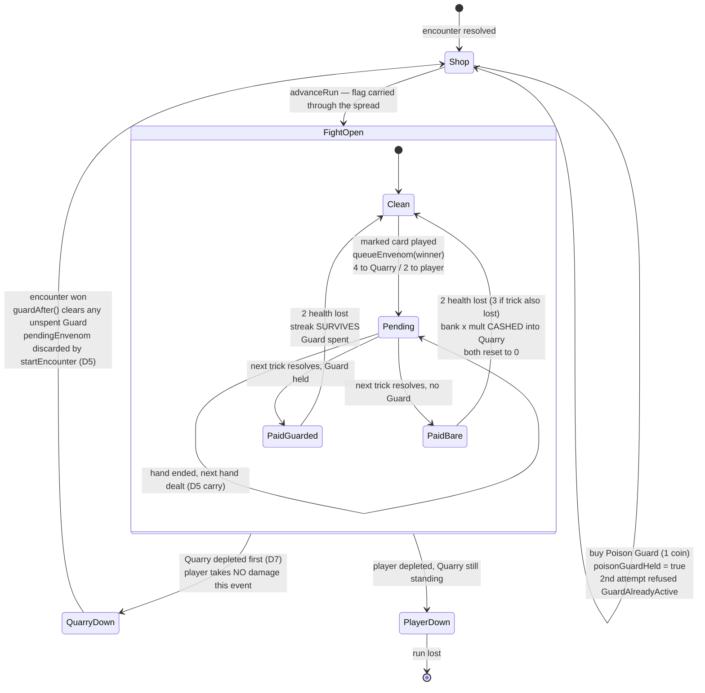

# Plan: Poison retimed to the next trick, plus Poison Guard

Plan folder: `.claude/contract/DLR-91-poison-guard-fight-long-backfire-protection/`
Execution status: see `tasks.md` in this folder.

---

## Part 1 — Alignment

### Task reference

**Jira:** `DLR-91` — "Poison Guard: fight-long backfire protection" (Story, labels `engine` + `playable`, parent epic `DLR-87`). Moved `To Do → Planning` at the start of this run.

**DLR-91's acceptance criteria, verbatim:**

1. A new `ShopItem` (placeholder name `Poison Guard`) is added to the fight-long category at 1 coin (a new `POISON_GUARD_PRICE` config key, transcribed from the design doc).
2. "Fight-long" is a real duration, not a label: the item is active only for the encounter it was bought during — it does **not** carry across `advanceRun` into the next fight the way Cheats and coins do. Confirm this against how `RunState` currently distinguishes encounter-scoped state (`encounter`) from run-scoped state (`cheats`, `coins`) and place the guard's flag accordingly.
3. Buying Poison Guard while the encounter already holds a bought-but-unused Guard is refused with a stated reason (matching the existing `refusalFor`/`PurchaseRefusal` pattern) — only one can be active at a time. State the refusal as `GuardAlreadyActive` or equivalent; do not silently overwrite or silently stack a second one.
4. The **next** time — and only the next time — Envenom's delayed hit lands on the **player**, the health is still lost but the bank and multiplier are **not** reset to zero by that hit. The Guard is then consumed regardless of whether a streak was actually in progress at the time.
5. Poison Guard has no effect on the Quarry-side case — that case already costs the player nothing, so there is nothing for the Guard to protect.
6. Vitest coverage exists for: purchase and its encounter-only scope, refusal on a second purchase while one is active, consumption on the player-side backfire, and no interaction with the Quarry-side case.

**Scope as the developer redefined it, 2026-08-19.** Planning found AC4 unbuildable against the code DLR-90 shipped: the delayed hit is paid at the **deal of the next hand**, and `resolveTrickBank` cashes and zeroes bank and multiplier on every hand's final trick, after which `dealRound` seeds the new hand at `bank: 0, multiplier: 0`. At the instant the hit landed there was no streak in existence, so AC4's protection had no subject. Rather than reinterpret AC4, the developer changed poison so that AC4 becomes true, and authorised **one contract** covering both the reshape and the Guard. The decisions, in the order they were given:

| # | Decision | Given |
|---|---|---|
| D1 | Poison damage is paid at the resolution of the **next trick**, not the deal of the next hand. | 2026-08-19 |
| D2 | Poison damage is **4 to the Quarry, 2 to the player** — the player-side hit is halved because it also costs a streak the Quarry does not have. So 2 on a trick the player wins, 3 total on a trick they also lose. | 2026-08-19 |
| D3 | Poison damage **kills the player's streak**, behaving exactly as ordinary damage already does — the bank **cashes out** into the Quarry and both reset. Not destroyed. | 2026-08-19 |
| D4 | Pending poison **stacks** rather than the later mark replacing the earlier. | 2026-08-19 |
| D5 | A poisoned trick that is the hand's last **carries** into the next hand; if the fight or the run ends first, the pending damage is **discarded**. | 2026-08-19 |
| D6 | **Apply Damage is disabled while poison is pending.** Recorded as a constraint on the unbuilt version-4 §3 ticket — no code in this contract. | 2026-08-19 |
| D7 | Damage is applied **Quarry first, then the player, and a Quarry that dies to it means the player takes no damage** — for **all** damage, not only poison. This overturns §9's dated simultaneous-depletion ruling (2026-08-11, the player loses the tie) and retires `SIMULTANEOUS_DEPLETION_WINNER`. | 2026-08-19, reconfirmed when the consequence was put to them |
| D8 | The interaction where holding a Guard suppresses the cash-out, so the Quarry survives and the player takes damage they would otherwise have dodged, is **accepted as a real decision** rather than smoothed out. *"That's fine, this is just a play test for buying items from the shop."* | 2026-08-19 |

**Design source:** `.docs/design/Balatro-Forbidden-Solitaire/version-4-scope.md` §1 (Envenom, Poison Guard, and §3's Apply Damage), and `hybrid-design.md` §9 for the ruling D7 overturns. Both need updating by this contract — see In scope.

### Restated goal

Make poison land where it can actually bite, then sell insurance against it. Poison stops being a hit paid quietly at the next deal and becomes a hit paid at the **next trick's resolution**, folded into that trick's own damage: 4 to the Quarry, 2 to the player, and — for the player — it forces the same cash-out-and-reset that any other hit already forces, so a streak in progress is spent at a moment the player did not choose. Damage across the whole game is resequenced Quarry-first, so a cash-out that kills the Quarry saves the player from the hit that would have followed it. Then the shop's empty **Fight-long** shelf gets its first item: a 1-coin Poison Guard, bought between fights, live for exactly the next fight, that lets the player take poison's 2 health without losing the streak — spent the first time it fires, gone when the fight ends either way.

### In scope

**The damage sequencing (D7)**

- `applyDamage` resequenced: deplete the Quarry, and if the Quarry is down, leave the player's health untouched and resolve in the player's favour.
- `SIMULTANEOUS_DEPLETION_WINNER` deleted from `config.ts` and every reader; `resolveWinner` rewritten without a tie branch.

**The poison retiming (D1–D5)**

- `ENVENOM_DAMAGE` renamed `ENVENOM_QUARRY_DAMAGE`, and a new `ENVENOM_PLAYER_DAMAGE: Damage = 2` beside it. Every one of the 36 hits across 9 files updated in the same task.
- `queueEnvenom` books the per-side amount rather than one shared figure, keyed off the target side.
- Pending poison stays on `EncounterState.pendingEnvenom` — already an accumulator (D4) and already discarded when `startEncounter` re-seeds a fight (D5's discard half), and it already survives a hand boundary because `EncounterState` outlives a hand (D5's carry half).
- `TrickFacts` gains the poison owed to each side at this trick; `resolveTrickBank` folds the player's share into `damageToPlayer` and treats it as a hit for the purpose of the forced cash-out (D3); `TrickResolution` carries the Quarry's share and `incomingFrom` sums it into the Quarry's total.
- `playCard`'s options widened so the reducer supplies the pending figures — the pending queue lives on the encounter and the bank rules live in the round, and this is the one place they meet.
- `roundReducer`'s `applyResolution` pays and clears the queue at the trick it resolves, then books this trick's own mark for the next one.
- `beginNextHand` and `applyPendingEnvenom` deleted; `App.tsx`'s `beginNextHand` call removed.

**Poison Guard (DLR-91's own six criteria)**

- `POISON_GUARD_PRICE: Coins = 1` in `config.ts`, transcribed from the design doc's heading.
- `ShopItem.PoisonGuard`, priced by `priceOf`, placed on `ShopCategory.FightLong` by `categoryOf`.
- `PurchaseRefusal.GuardAlreadyActive`, a `poisonGuardHeld` field on `ShopStock`, and the `refusalFor` branch that returns it.
- `RunState.poisonGuardHeld`, set by `buyFromShop`, seeded by `startRun`, carried through `advanceRun`, cleared by a shared private helper when the encounter it was carried into resolves.
- The flag threaded into and back out of the hand along the exact path `envenomCharges` already takes: mount prop → `RoundUiSeed` → `RoundUiState` → `WarCouncilRoundResult` → `recordEncounter`.
- `TrickFacts.poisonGuarded` suppressing the poison-driven cash-out only, and `TrickResolution.poisonGuardSpent` reporting the consumption so the reducer flips the flag.

**Copy, UI and docs**

- `shopLabels.ts`: the item's name and blurb, the `GuardAlreadyActive` sentence, and a held-Guard purse-cell label.
- `ShopPanel`: one `poisonGuardHeld` prop rendering a fourth purse cell. `App.tsx`: the fourth `refusals` entry and the two new props.
- `version-4-scope.md` §1 rewritten for D1–D6 and Poison Guard's actual effect; `hybrid-design.md` §9's simultaneous-depletion ruling marked overturned with today's date and D7's replacement recorded, plus D6 recorded against §3.
- Vitest coverage for every decision D1–D5, D7, and all six of DLR-91's criteria.

### Explicitly out of scope

- **Apply Damage itself.** D6 is recorded as a constraint on the unbuilt version-4 §3 ticket; no lock is coded, because there is no control to lock.
- **The buyable skull** the developer raised and then set aside. Not spec'd; no ticket.
- **Whetstone, the flask, and the quick-kill payout** — the rest of version-4, separate tickets under `DLR-87`.
- **Giving the Quarry a bank or a multiplier.** The asymmetry that only the player has a streak is what D2's halving prices in; it is not being removed.
- **Showing a held Guard or pending poison on the felt.** The shop's purse cell is the only new readout; `WarCouncilRound`'s rendering is untouched beyond the prop it forwards. Listed under Risks.
- **Final copy.** "Poison Guard" and its blurb are placeholders, marked as such exactly as every other string in `shopLabels.ts` already is.
- **`.docs/game_rules/the-hunt.md`.** `implementation-doc-writer` owns it and `/fb-apply` updates it on its own pass — never by hand, per `CLAUDE.md`.
- **Rebalancing anything else** now that mutual kills favour the player. D7 changes who wins a tie; no health total, damage figure or Quarry curve is retuned in response.

### Pattern Reference

The brief named `refusalFor`/`PurchaseRefusal` and `RunState`'s encounter-vs-run split. Everything else below was chosen during planning and read from the working tree, per the developer's "plan against the latest code":

- **`src/warCouncil/bank.ts`** — `TrickFacts` / `TrickResolution` / `resolveTrickBank` / `incomingFrom`. `TrickFacts` was already converted from positional booleans to a parameter object on DLR-90 for exactly this reason; the new facts join it. `incomingFrom` stays THE one `PlayerSide → DuelSide` crossing.
- **`src/warCouncil/playCard.ts:105-120`** — where `TrickFacts` is assembled and `resolveTrickBank` called. Its docblock already states that it "decides nothing about the outcome, it only reports the four facts"; the new facts arrive the same way.
- **`src/hunt/encounter.ts`** — `applyDamage`'s deplete-both-then-resolve shape is what D7 replaces, and its docblock states why it was written that way, so the change must overwrite that reasoning rather than sit beside it. `NO_PENDING_ENVENOM` stays the shared zero record.
- **`src/hunt/run.ts` → `envenomCharges`** — the template for `poisonGuardHeld`: added by `buyFromShop`, seeded by `startRun`, carried by `advanceRun`'s spread, threaded through the hand and adopted back by `recordEncounter`.
- **`src/app/warCouncil/roundUiState.ts` → `envenomCharges` / `RoundUiSeed`** and **`src/app/warCouncilMount.ts` → `WarCouncilMountProps.envenomCharges` / `WarCouncilRoundResult.envenomCharges`** — the four places the run-state-through-a-hand path is declared. `poisonGuardHeld` copies all four verbatim in shape.
- **`src/hunt/shop.ts`** — `priceOf`, `categoryOf`, `refusalFor`, `ShopStock`, `PurchaseRefusal`, all total over their unions so a new member is a compile error at each site.
- **`src/hunt/__tests__/envenom.test.ts`** and **`src/app/warCouncil/__tests__/roundReducer.envenom.test.ts`** — DLR-90's two specs for this mechanic. Both are rewritten rather than extended: they assert hand-start timing throughout.
- **`.claude/contract/DLR-89-shop-four-category-model-and-tab-ui/mockup.html`, screen B** — the shop layout `ShopPanel` implements. This contract's `mockup.html` extends it; it is not a redesign.
- **`react-frontend`/`SKILL.md`** and **`game-ux`/`SKILL.md`**, loaded during planning.

### Constraints flagged on the brief

- **AC3 — no silent overwrite, no silent stack.** A stated reason code in the existing pattern, read by both `buyFromShop` and the screen from one predicate.
- **AC4 — "the next time, and only the next time"**, consumed whether or not a streak was in progress.
- **AC5 — no effect on the Quarry-side case.** The Guard must not touch the Quarry's share.
- **AC6 — Vitest coverage** for purchase, scope, refusal, consumption, and the Quarry-side non-interaction.
- **The hard dependency on Envenom** — satisfied and then some: this contract reshapes it. DLR-90 is on disk with all 89 contract steps checked; the node suite ran clean at 37 files / 628 tests during planning.
- **Placeholder naming** — "Poison Guard" is a functional description, per the design doc's own open-questions list.
- **The two-dependency limit** — nothing here needs a third.
- **D8's explicit framing: this is a playtest for buying shop items.** Build it, play it, tune later — not a balance pass on paper.

### Assumptions made

- **A1 — On a trick the player wins while poisoned, the bank climbs first and the poison then cashes and resets it.** The one sub-decision of D3 the developer was asked about and did not answer. Taken this way because the trick *was* won so it should count, and because it pays the larger figure into the Quarry — a streak of 4 winning trick 5 cashes 25 rather than 16. It also reads correctly on screen: the streak visibly climbs and then dies, so the poison is legible as the cause. Reversible in one line if it plays wrong.
- **A2 — `ENVENOM_PLAYER_DAMAGE = 2` is developer-chosen, not transcribed, and therefore not an open tuning value.** D2 states it. `ENVENOM_QUARRY_DAMAGE` stays 4, still transcribed from the design doc.
- **A3 — `ENVENOM_DAMAGE` is renamed rather than kept as the Quarry's figure.** A bare `ENVENOM_DAMAGE` sitting beside `ENVENOM_PLAYER_DAMAGE` is precisely the ambiguity that produces a wrong-side bug that type-checks. 36 hits across 9 files, all enumerated in the audit and all changed in one task.
- **A4 — The Guard suppresses only the *poison-driven* cash-out, never a trick's own.** A trick the player loses still resets the streak while a Guard is held; the Guard is not consumed by it. Otherwise a 1-coin item would insure against every hit, which the ticket's scope boundary forbids.
- **A5 — The Guard is consumed when it actually suppresses a reset**, i.e. when poison was owed to the player at a trick and the Guard stopped the cash-out. Not on a trick with no poison, and not on a Quarry-side hit. This is AC4's "regardless of whether a streak was in progress" read against D3: it fires and is spent even when the bank was 0 and there was nothing to save.
- **A6 — The flag lives on `RunState`, not `EncounterState`, despite AC2's wording.** `EncounterState` is re-seeded by `startEncounter` inside every `advanceRun`, and the shop is reachable only *after* an encounter resolves and *before* `advanceRun` runs (`App.tsx:216`, `App.tsx:225-243`) — so a flag there would be bought onto the finished encounter and destroyed by the very transition that opens the fight it was bought for. `RunState` plus a clear-on-resolve gives AC2's actual intent: live for exactly one fight.
- **A7 — The clear lives in one private helper read by both `recordEncounter` and `beginNextHand`'s successor.** With `beginNextHand` deleted, `recordEncounter` is the only transition that adopts a hand's end state, so the helper has one caller today — but it is still written as a named private function beside `outcomeFor`, because a bare inline ternary is what gets forgotten when a second adopting transition appears.
- **A8 — Two marked cards in ONE trick still produce one hit.** `trickIsEnvenomed` is a boolean over the trick, so a trick containing two marked cards owes one payment. D4's stacking is honoured by keeping `pendingEnvenom` an accumulator that sums rather than overwrites; making a single trick owe double would need a count instead of a predicate, which is a different question from the one D4 answered. Flagged in Risks.
- **A9 — `SHOP_ITEMS` order is `[Cheat, Envenom, PoisonGuard, Heal]`.** Heal stays last because `UNCATEGORISED_SHOP_ITEMS` derives from this array's order.
- **A10 — The shop gains one purse cell for the held Guard**, mirroring DLR-90's `SHOP_ENVENOM_LABEL` cell. AC3 refuses a second purchase and a refusal with an invisible cause reads as a broken button.
- **A11 — Guard tests go in a new `src/hunt/__tests__/poisonGuard.test.ts`**, and the retiming rewrites the two existing envenom specs in place. `run.test.ts` is 343 lines and is not the place for either.
- **A12 — D6 is recorded in the design doc only.** Apply Damage does not exist, so there is no control to disable and no test to write. `hasPendingEnvenom` is kept exported specifically so that ticket has the predicate waiting.

### Config and persisted-shape audit

- **`ENVENOM_DAMAGE` — 36 hits across 9 files**, every one a site the rename must change in the same task: `src/hunt/config.ts` (declares it), `src/hunt/encounter.ts` (`queueEnvenom` reads it), `src/hunt/index.ts` (re-exports), `src/warCouncil/bank.ts`, `src/app/run/shopLabels.ts` (interpolates it into the Envenom blurb), `src/hunt/__tests__/config.test.ts`, `src/hunt/__tests__/envenom.test.ts`, `src/app/run/__tests__/shopLabels.test.ts`, `src/app/warCouncil/__tests__/roundReducer.envenom.test.ts`. The blurb hit matters most: it is user-facing copy quoting the figure, so a rename that missed it would leave the screen reading the wrong side's number.
- **`SIMULTANEOUS_DEPLETION_WINNER` — 11 hits across 7 files**, all of which lose the reference when it is deleted: `src/hunt/config.ts` (declares it), `src/hunt/encounter.ts` (`resolveWinner` reads it), `src/hunt/index.ts` (re-exports), `src/hunt/run.ts` (a docblock cites it), `src/hunt/types.ts` (a docblock cites it), `src/hunt/__tests__/config.test.ts`, `src/hunt/__tests__/encounter.test.ts`. Two of those are comments that would otherwise cite a constant that no longer exists — a stale explanation is worse than none, so both are rewritten.
- **`beginNextHand` / `applyPendingEnvenom` / `hasPendingEnvenom` — 5 files:** `src/App.tsx`, `src/hunt/encounter.ts`, `src/hunt/index.ts`, `src/hunt/run.ts`, `src/hunt/__tests__/envenom.test.ts`. `beginNextHand` and `applyPendingEnvenom` are deleted; `hasPendingEnvenom` survives for D6's future use (A12). `App.tsx:136-145` loses its call and the resolution re-check that followed it.
- **`POISON_GUARD_PRICE` — 0 hits. `ENVENOM_PLAYER_DAMAGE` — 0 hits. `poisonGuardHeld` — 0 hits. `GuardAlreadyActive` — 0 hits. `PoisonGuard` — 0 hits.** All five names are new, so no reader is being retargeted and there is no stale half to hunt. All must be added to `src/hunt/index.ts`, which exports every config key by name — a new key omitted there is invisible outside the module.
- **`ShopStock` — 9 hits across 4 files:** `src/hunt/shop.ts`, `src/hunt/run.ts`, `src/hunt/index.ts`, `src/hunt/__tests__/shop.test.ts`. Adding a **required** field breaks every construction site: `shopStockFor` and every literal in `shop.test.ts`. No component builds one by hand — `App.tsx:92` goes through `shopStockFor` — so the UI is unaffected by this field.
- **`PurchaseRefusal` — 38 hits across 8 files.** The union is **widened**, not retyped, so the one site that must grow a case is `PURCHASE_REFUSAL_MESSAGE` (`shopLabels.ts:45-49`), a total `Record` that becomes a missing-property compile error. `shopLabels.test.ts:39` already iterates the union, so its coverage widens automatically.
- **`ShopItem` widening — four total functions and maps that become compile errors:** `priceOf` (`shop.ts:57`), `categoryOf` (`shop.ts:73`), `SHOP_ITEM_NAME` (`shopLabels.ts:28`), `SHOP_ITEM_BLURB` (`shopLabels.ts:36`). Plus two `Record<ShopItem, …>` sites that are **not** compiler-total and must be found by name: `App.tsx:233-237`'s `refusals` and `ShopPanel.test.tsx:37-41`'s `noRefusals`. `SHOP_ITEMS` (`shop.ts:13`) is a plain array — nothing forces it, which is why `shop.test.ts:152` exists.
- **Existing assertions that go red and must change in the same task:** `shop.test.ts:29` (`SHOP_ITEMS` deep equality) and `shop.test.ts:175` (`SHOP_ITEMS_BY_CATEGORY[FightLong]` equals `[]`). Checked and **not** affected: `ShopPanel.test.tsx:191`'s empty-shelf test already uses `RunPermanent`, and `ShopPanel.test.tsx:206` only asserts the Cheat is absent from the Fight-long shelf, which stays true.
- **`envenomTrick` / `trickIsEnvenomed` — 7 files** (`bank.ts`, `envenom.ts`, `warCouncil/index.ts`, `playCard.ts`, `warCouncil/types.ts`, `__tests__/bank.test.ts`, `__tests__/envenom.test.ts`). Neither name changes; both keep their meaning. Recorded because A8's reading turns on `trickIsEnvenomed` being a predicate rather than a count, and a reviewer will want to see that was checked rather than assumed.
- **Nothing is persisted. `localStorage` — 0 hits. `sessionStorage` — 0 hits.** No save file, no stored log, no replay, so no migration is owed and no stored record is invalidated by any shape change here. Worth recording that this window is wide open and closing: this contract adds a field to `RunState`, two to `EncounterState`'s neighbourhood, and two to `TrickFacts`, and it deletes a config key — every one of those is free today and becomes a migration the first time a run is saved.
- **Type-loss check.** Two genuinely breaking changes, both deliberate and both confined to one task each: `ShopStock` gains a **required** boolean (four construction sites, enumerated), and `ENVENOM_DAMAGE` is **renamed** (36 hits, enumerated). Everything else is additive: two new config constants, one deleted config constant, one new `RunState` boolean, three new `TrickFacts` fields, two new `TrickResolution` fields, a widened `ShopItem`, a widened `PurchaseRefusal`. No `number → string`, no array → object, no required → optional.
- **Architectural boundary.** `src/hunt/**` and `src/warCouncil/**` are both lint-enforced pure — no React import, no DOM global (`eslint.config.js`). Every new rule here is a pure function or a plain field in one of those two trees. The direction of the existing dependency is unchanged: `warCouncil` imports `hunt`, never the reverse, so `playCard` reading pending figures handed *in* by the reducer is the only shape that avoids the cycle `hunt/types.ts:26-32` warns about — `hunt` must not learn about `RoundState`, and it does not.

---

## Part 2 — Technical design

### Approach

**The sequencing change is the smallest and goes first.** `applyDamage` currently depletes both bars before inspecting either, deliberately, so that the simultaneous case stays reachable and §9's tie ruling stays live code. D7 reverses that: deplete the Quarry, and if the Quarry is down, return the player's health untouched and resolve for the player. The tie becomes unreachable by construction rather than by a constant, so `SIMULTANEOUS_DEPLETION_WINNER` is deleted rather than left as a value nothing reads — a config key with no reader is a trap for the next person who tries to tune it. `resolveWinner` loses its both-down branch. This is one function and its two docblocks, and it lands as its own phase because every later phase's expected damage numbers depend on it.

**The retiming's hard problem is that the pending queue and the bank rules live on opposite sides of a module boundary.** `pendingEnvenom` is on `EncounterState` in `src/hunt/`; `bank` and `multiplier` are on `RoundState` in `src/warCouncil/`, and `resolveTrickBank` is called from deep inside `playCard`, which has no access to the encounter. `hunt` cannot import `warCouncil` — that is the cycle its own type docs warn about — so the encounter cannot reach into the round. Three ways out were considered. Moving pending poison onto `RoundState` was rejected: the round is re-dealt every hand, so D5's cross-hand carry would need a new `dealRound` parameter plus a new field on `WarCouncilRoundResult`, and the queue would stop being discarded for free at an encounter boundary. Post-processing the bank in the reducer after `resolveTrickBank` returned was rejected outright — that is two readings of one rule, and the two would drift. What ships is the third: **the reducer, which holds both the encounter and the round, passes the pending figures into `playCard` through its existing options parameter**, widened from `LegalMoveOptions` to a `PlayCardOptions` that extends it. `playCard` forwards them into `TrickFacts` and changes nothing else. The queue stays on `EncounterState`, which gives D4's accumulation and both halves of D5 with no new code: it sums rather than overwrites, it outlives a hand because it hangs off `RunState.encounter`, and `startEncounter` re-seeds it to zeros at every fight boundary.

**`resolveTrickBank` grows one new way to be hit, not a second rule.** Today a forced cash-out fires when the trick is not taken and is not an Envenom-replaced clean loss. D3 adds a second trigger — poison owed to the player at this trick — reaching the *same* branch: `cashOut = bank × multiplier`, both counters to zero. That is what makes D3 "behaves the same as the damage" true in code rather than by assertion. `damageToPlayer` moves out of that branch, because the health is owed whether or not the streak resets, and becomes `(trick's own hit ? DAMAGE_PER_HIT : 0) + poison owed to the player` — which is exactly D2's 2-or-3. The Quarry's poison share rides out on `TrickResolution` and is summed into the Quarry's total by `incomingFrom`, keeping that function the single `PlayerSide → DuelSide` crossing. On a trick the player wins while poisoned, the win banks first and the poison then cashes the larger figure (A1).

**The Guard is one more fact in, one more fact out.** `TrickFacts.poisonGuarded` gates only the poison trigger, never the trick's own (A4), and `TrickResolution.poisonGuardSpent` reports that it fired so the reducer can flip the flag. The flag itself travels the path `envenomCharges` already proved: `RunState.poisonGuardHeld` → `WarCouncilMountProps` → `RoundUiSeed` → `RoundUiState` → `WarCouncilRoundResult` → `recordEncounter`. Nothing new is invented for it, which is the point — a second mechanism for carrying run state through a hand is a second mechanism to keep in step. On the shop side the catalogue does the work: `priceOf` and `categoryOf` are total `switch`es so both become compile errors until the case is written, `SHOP_ITEMS_BY_CATEGORY` then derives the Fight-long shelf at module load with no UI edit, and `isShopCategoryAvailable` already returns `true` for that rung. The lifetime is a `RunState` field cleared by a private `guardAfter` on encounter resolution (A6, A7).

**No component decides anything, and the UI is nearly free.** `ShopPanel` gains one prop and renders a fourth purse cell from the existing classes — no new CSS, no new interactive control, so the tablist's single tab stop and the screen's tab order are unchanged, and the cell states "Held"/"None" in words rather than colour alone. `App.tsx` loses its `beginNextHand` call and the resolution re-check that followed it, and gains two props and a `refusals` entry. The two design docs are updated by a task of their own under `game-designer`, because §9's overturned ruling and §1's rewritten mechanic are design records, not implementation notes.

### Skills to invoke during execution

- **`react-frontend`** — owns everything under `src/`: the pure `hunt` and `warCouncil` changes, the reducer and its state shape, the copy maps, the component props, and every Vitest spec. Developer-confirmed. Its `erasableSyntaxOnly` rule is why every named set stays an `as const` map, and its configuration rule is why both damage figures and the price are config keys read by name rather than literals.
- **`game-ux`** — owns the shop screen layer: the fourth purse cell must not push the shop into a scroll, must read without colour alone, and must not add a sibling control that breaks the tablist's single tab stop. Developer-confirmed. Note its stated limit — jsdom has no layout engine, so no-scroll is QA's browser check.
- **`game-designer`** — owns `.docs/design/**` per `CLAUDE.md`'s ownership table, so the phase that records D7's overturned §9 ruling and rewrites §1 for D1–D6 runs under it. Not in the developer's confirmed list, because at confirmation time the contract was code-only; the doc work arrived with the scope change and this is the skill that owns that folder.

The executor must also Read `.claude/workflow/web-project.md` for paths, runners and the correctness traps.

`.claude/rules/` files to Read: **none** — the folder holds only `README.md` and its index is empty, re-scanned during this planning run.

### Diagram



### Data shapes

#### `src/hunt/config.ts`

```ts
// DLR-91 D2 — poison's two figures. TWO keys, not one: the player-side hit is halved because it
// ALSO forces the streak's cash-out, which the Quarry has no equivalent of. A single shared key is
// the bug that reads correctly and pays the wrong side.
// UNIT: health points, applied once, to one side, at the resolution of the next trick.
export const ENVENOM_QUARRY_DAMAGE: Damage = 4 // TRANSCRIBED — version-4-scope.md §1.
export const ENVENOM_PLAYER_DAMAGE: Damage = 2 // DEVELOPER-CHOSEN 2026-08-19. Not transcribed.

// DLR-91 AC1 — TRANSCRIBED from version-4-scope.md §1's heading ("Poison Guard, 1 coin"). Its own
// key for the reason CHEAT_PRICE and HEAL_PRICE are already separate.
// UNIT: coins per purchase.
export const POISON_GUARD_PRICE: Coins = 1
```

**Deleted:** `SIMULTANEOUS_DEPLETION_WINNER`. D7 makes the simultaneous case unreachable, so the constant has no reader; leaving it is a tunable that silently does nothing.

#### `src/hunt/encounter.ts`

```ts
/**
 * D7 — Quarry FIRST, then the player, and a Quarry that goes down means the player takes no damage
 * from this event. Replaces DLR-70's deplete-both-then-inspect, which existed to keep the
 * simultaneous case reachable; the developer overturned §9's tie ruling on 2026-08-19 and the tie
 * is now unreachable by construction.
 */
export function applyDamage(encounter: EncounterState, incoming: IncomingDamage): EncounterState
```

```ts
/** D2 — books the amount owed to THIS target. Keyed off the side, so the crossing cannot pay the
 *  wrong figure to the wrong bar. Accumulates (D4); still refuses a resolved encounter. */
export function queueEnvenom(encounter: EncounterState, target: DuelSide): EncounterState
```

`resolveWinner` loses its both-down branch: Quarry down → `Player`, player down → `Quarry`, else `null`. `hasPendingEnvenom` and `NO_PENDING_ENVENOM` unchanged. **Deleted:** `applyPendingEnvenom`.

#### `src/warCouncil/bank.ts`

```ts
export interface TrickFacts {
  readonly playerWon: boolean
  readonly skullTrick: boolean
  readonly finalTrick: boolean
  readonly envenomTrick: boolean
  /** D1/D3 — poison owed to the PLAYER from an earlier trick, being paid at this one. 0 when none. */
  readonly poisonToPlayer: Damage
  /** D1 — poison owed to the QUARRY from an earlier trick, being paid at this one. 0 when none. */
  readonly poisonToQuarry: Damage
  /** DLR-91 AC4 — a Poison Guard is held, so poison must not force the cash-out. Gates the POISON
   *  trigger only, never the trick's own hit (A4). */
  readonly poisonGuarded: boolean
}

export interface TrickResolution extends BankState {
  readonly outcome: TrickOutcome
  readonly bankAdded: number
  readonly cashOut: number
  readonly damageToPlayer: number
  readonly cashedAtHandEnd: boolean
  readonly envenomTarget: DuelSide | null
  /** D1 — carried through so `incomingFrom` sums it into the Quarry's total. */
  readonly poisonToQuarry: Damage
  /** AC4 — the Guard fired and suppressed a reset, so the reducer must spend it (A5). */
  readonly poisonGuardSpent: boolean
}
```

The changed core of `resolveTrickBank`:

```ts
const replaced = trick.envenomTrick && outcome === TrickOutcome.CleanLoss

if (isTaken(outcome)) {
  bankAdded = 1
  bank += bankAdded
  multiplier += 1
}

// TWO sources of a hit now (D3). `trickHit` is the pre-existing one; poison is the new one, and it
// reaches the SAME branch rather than getting a rule of its own.
const trickHit = !isTaken(outcome) && !replaced
const poisonResets = trick.poisonToPlayer > 0 && !trick.poisonGuarded

// Owed whether or not the streak resets — a Guard buys the streak, never the health.
damageToPlayer = (trickHit ? DAMAGE_PER_HIT : 0) + trick.poisonToPlayer

if (trickHit || poisonResets) {
  // A1 — the win above has already banked, so a won-but-poisoned trick cashes the LARGER figure.
  cashOut = bank * multiplier
  bank = 0
  multiplier = 0
}
```

`incomingFrom` sums the Quarry's two sources:

```ts
export function incomingFrom(resolution: TrickResolution): IncomingDamage {
  return {
    [DuelSide.Player]: resolution.damageToPlayer,
    [DuelSide.Quarry]: resolution.cashOut + resolution.poisonToQuarry,
  }
}
```

#### `src/warCouncil/legalMoves.ts` / `playCard.ts`

```ts
/** Widened so the reducer can hand `playCard` the pending figures it cannot reach itself — the
 *  queue is on `EncounterState` and `src/hunt/` must not learn about `RoundState`. Extends
 *  `LegalMoveOptions` so the same object still satisfies `legalMoves`. */
export interface PlayCardOptions extends LegalMoveOptions {
  readonly poisonToPlayer?: Damage
  readonly poisonToQuarry?: Damage
  readonly poisonGuarded?: boolean
}
```

`playCard`'s fifth parameter retypes from `LegalMoveOptions` to `PlayCardOptions`; the `TrickFacts` literal gains the three fields, defaulting to `0`/`0`/`false`.

#### `src/hunt/run.ts`

```ts
export interface RunState {
  // …existing fields unchanged…
  /** DLR-91 AC2 — a bought-but-unspent Poison Guard. Run-level like `coins` so it survives the
   *  `advanceRun` that opens the fight it was bought for, and cleared by `guardAfter` the moment
   *  that fight resolves — which is what makes "fight-long" a real duration (A6). NEVER persisted. */
  readonly poisonGuardHeld: boolean
}

/** A7 — ONE statement of "a Guard does not outlive the fight it was bought for". */
function guardAfter(encounter: EncounterState, held: boolean): boolean
```

- `startRun` adds `poisonGuardHeld: false`.
- `buyFromShop` adds `case ShopItem.PoisonGuard: return { ...paid, poisonGuardHeld: true }`.
- `shopStockFor` adds `poisonGuardHeld: run.poisonGuardHeld`.
- `recordEncounter` gains a fifth parameter `poisonGuardHeld: boolean` and returns `guardAfter(encounter, poisonGuardHeld)`.
- **Deleted:** `beginNextHand`.

#### `src/hunt/shop.ts`

```ts
export const ShopItem = { Cheat: 'cheat', Envenom: 'envenom', PoisonGuard: 'poisonGuard', Heal: 'heal' } as const
export const SHOP_ITEMS: readonly ShopItem[] = [ShopItem.Cheat, ShopItem.Envenom, ShopItem.PoisonGuard, ShopItem.Heal]
export const PurchaseRefusal = {
  SlotsFull: 'slotsFull',
  AlreadyFullHealth: 'alreadyFullHealth',
  GuardAlreadyActive: 'guardAlreadyActive',
  NotEnoughCoins: 'notEnoughCoins',
} as const

export interface ShopStock {
  readonly coins: Coins
  readonly cheatCount: number
  readonly playerHealth: Health
  readonly maxPlayerHealth: Health
  /** DLR-91 AC3 — a bought-but-unspent Guard is already held. */
  readonly poisonGuardHeld: boolean
}
```

`priceOf` → `POISON_GUARD_PRICE`; `categoryOf` → `ShopCategory.FightLong`; `refusalFor` gains one branch after the Heal branch and **before** the coin check, per that function's stated ordering rule:

```ts
if (item === ShopItem.PoisonGuard && stock.poisonGuardHeld) {
  return PurchaseRefusal.GuardAlreadyActive
}
```

#### The hand-boundary declarations

```ts
// src/app/warCouncilMount.ts
interface WarCouncilMountProps { /* … */ readonly poisonGuardHeld: boolean }
interface WarCouncilRoundResult { /* … */ readonly poisonGuardHeld: boolean }

// src/app/warCouncil/roundUiState.ts
interface RoundUiSeed  { /* … */ readonly poisonGuardHeld: boolean }
interface RoundUiState { /* … */ readonly poisonGuardHeld: boolean }
```

`createRoundUiState` copies it from the seed. `roundReducer`'s `commit` and `advanceQuarryFollow` pass `{ poisonToPlayer, poisonToQuarry, poisonGuarded }` derived from `state.encounter.pendingEnvenom` and `state.poisonGuardHeld` into `playCard`, and `applyResolution` becomes:

```ts
function applyResolution(encounter: EncounterState, resolution: TrickResolution): EncounterState {
  if (isEncounterResolved(encounter)) return encounter
  const incoming = incomingFrom(resolution)
  const hit =
    incoming[DuelSide.Player] === 0 && incoming[DuelSide.Quarry] === 0
      ? encounter
      : applyDamage(encounter, incoming)
  // The queue paid at this trick is cleared; THIS trick's own mark is booked for the NEXT one.
  const cleared = hasPendingEnvenom(hit) ? { ...hit, pendingEnvenom: NO_PENDING_ENVENOM } : hit
  return resolution.envenomTarget === null ? cleared : queueEnvenom(cleared, resolution.envenomTarget)
}
```

`commit` also sets `poisonGuardHeld: resolution.poisonGuardSpent ? false : state.poisonGuardHeld`.

#### `src/hunt/index.ts`

Added: `ENVENOM_QUARRY_DAMAGE`, `ENVENOM_PLAYER_DAMAGE`, `POISON_GUARD_PRICE`. Removed: `ENVENOM_DAMAGE`, `SIMULTANEOUS_DEPLETION_WINNER`, `applyPendingEnvenom`, `beginNextHand`. `src/warCouncil/index.ts` adds the `PlayCardOptions` type.

#### `src/app/run/shopLabels.ts`

```ts
export const SHOP_GUARD_LABEL = 'Poison Guard' // PLACEHOLDER copy.
export const SHOP_GUARD_HELD = 'Held'
export const SHOP_GUARD_NONE = 'None'
```

`SHOP_ITEM_NAME` gains `[ShopItem.PoisonGuard]: 'Poison Guard'`. `SHOP_ITEM_BLURB` gains the Guard's line and the Envenom line is rewritten for both figures — interpolated, never quoted:

```ts
[ShopItem.Envenom]: `Poison a card in your hand. The winner of the trick it is played into takes damage at the next trick — ${ENVENOM_QUARRY_DAMAGE} for the Quarry, ${ENVENOM_PLAYER_DAMAGE} for you, and yours cashes out your streak.`,
[ShopItem.PoisonGuard]: `Insurance for one fight. The next time your own poison lands on you, you still take the ${ENVENOM_PLAYER_DAMAGE} but your streak survives.`,
```

`PURCHASE_REFUSAL_MESSAGE` gains `[PurchaseRefusal.GuardAlreadyActive]: 'You are already holding a Poison Guard.'`

#### `src/app/run/ShopPanel.tsx` and `src/App.tsx`

`ShopPanel` gains `readonly poisonGuardHeld: boolean`, rendered as a fourth `shop-purse-cell` using the existing `shop-purse-label` / `shop-purse-value` classes — no new CSS. `App.tsx` gains the fourth `refusals` entry, `poisonGuardHeld={run.poisonGuardHeld}` on both `ShopPanel` and `WarCouncilRound`, passes `result.poisonGuardHeld` as `recordEncounter`'s fifth argument, and loses the `beginNextHand` call plus the resolution re-check at `App.tsx:136-145`.

#### No changes

No `package.json`, `tsconfig.json`, `vite.config.ts` or `eslint.config.js` change. No new dependency. No new CSS. No change to `envenom.ts`, `skulls.ts`, `deal.ts`, `resolveTrick.ts`, `abilities.ts`, `cheats.ts` or `runPath.ts`.

### Runtime quality notes

- **Purity and adjudication:** every rule is a pure function in `src/hunt/` or `src/warCouncil/` — `applyDamage` sequences, `resolveTrickBank` decides the cash-out, `refusalFor` decides the refusal, `guardAfter` decides expiry. The reducer composes and the components render. Both damage figures and the price are config keys, read by name; the Envenom and Guard blurbs interpolate them, so no number is written twice. Neither pure tree gains a React import or a DOM global, and `hunt` still imports nothing from `warCouncil` — which is exactly why the pending figures are handed *into* `playCard` rather than fetched by it.
- **Effects, mount and teardown:** **no effect is added or changed.** `App.tsx` holds none by design; every transition is a callback fired from a control; `ShopPanel` gains a rendered cell and no listener. So there is nothing to release in a cleanup, no pointer capture to drop on `pointercancel`, and nothing non-idempotent for StrictMode's double-mount — `createRoundUiState` stays a pure restructuring of its seed, so the lazy `useReducer` initialiser recomputes an identical value, and `useState`'s initialisers stay pure. No module-level mutable state is introduced: the new constants are `const`, and `SHOP_ITEMS_BY_CATEGORY` still derives once at load from frozen inputs.
- **Hot-path cost:** nothing runs on a pointer-move path. `resolveTrickBank` gains three property reads and one boolean per resolved trick — at most six tricks a hand. `applyDamage` does strictly *less* work than before in the Quarry-down case, since it skips the player's subtraction. `refusalFor` runs once per item per shop render: four items instead of three, each a couple of comparisons. `applyResolution` allocates one extra object only when a queue actually needs clearing, guarded by `hasPendingEnvenom` so the common path allocates nothing. No search, no whole-collection scan, no memoisation added and none warranted.
- **Determinism and numeric safety:** nothing here reads `Math.random()` or a clock — `dealRound`'s existing RNG injection is untouched, so a seeded hand stays reproducible. No division is introduced anywhere, so no epsilon is needed and no `NaN` is producible from these inputs. `applyDamage` keeps `assertApplicable` on **both** sides' incoming figures, so a non-finite total is refused before any subtraction rather than diagnosed later — and it must keep guarding the player's figure even on the Quarry-down path, or a poisoned `NaN` would pass unexamined on exactly the branch that skips it. `poisonToPlayer > 0` is `false` for `NaN`, so a poisoned figure fails safe by not firing the Guard rather than spending it. `poisonGuardHeld` and `poisonGuarded` are strict booleans with no arithmetic.
- **Error paths:** `buyFromShop` keeps its throw-on-refusal contract, so a Guard bought while one is held throws a `RangeError` naming `GuardAlreadyActive` — AC3's "no silent overwrite" is that throw plus the disabled control, and reaching it stays a driver bug because `App.tsx:181` re-derives the refusal inside the functional updater. Its `switch` has no `default`, so the new item is a compile error rather than a silent fall-through — the trap `run.ts:232-235` records having actually hit on DLR-90. `applyDamage` keeps throwing on a resolved encounter and on a non-finite figure; `queueEnvenom` keeps returning the encounter unchanged when resolved and still never throws, because the reducer calls it during an event handler and a throw there unmounts the tree. `guardAfter` cannot throw. No error is swallowed into a success shape, no `catch` is added, and there is no async surface, so the four async states do not arise. **Deleting `beginNextHand` removes a throw-free path rather than adding one**, and `App.tsx` must lose its downstream resolution re-check with it — a re-check against a call that no longer exists would read as dead code that once mattered.

### Risks and judgement calls

- **A1 is the one unanswered sub-decision.** On a trick the player wins while poisoned, the plan banks the win first and then cashes the larger figure. The alternative — poison lands before the climb, cashing the smaller one — is a one-line change and a different feel. Worth a look before approving, and worth re-judging in play.
- **D7 overturns a dated design ruling.** §9's 2026-08-11 decision that the player loses a mutual kill is reversed on the developer's explicit say-so, `SIMULTANEOUS_DEPLETION_WINNER` is deleted, and every mutual kill now favours the player. That makes the game measurably easier at exactly the moments that were previously fatal. No compensating retune is in scope, by decision — flagged so it is a choice rather than a side effect.
- **D8's accepted oddity: holding a Guard can cost the player health.** The Guard suppresses the cash-out, so the Quarry does not die from it, so the player takes the 2 they would otherwise have dodged under D7. Accepted as a real decision. It does mean the correct play is sometimes *not* to hold a Guard, which is the opposite of how insurance reads, and a player will meet it without warning — there is no UI hint and none is in scope.
- **A8 — two marked cards in one trick still owe one hit.** `trickIsEnvenomed` is a predicate over the trick, not a count. D4's stacking is honoured across *separate* pending bookings, which is the case it was asked about. If a single trick containing two marks should owe double, that is a count instead of a predicate and a small follow-up.
- **DLR-90's shipped behaviour changes under a DLR-91 slug.** One contract was the developer's call, and the ticket trail will not show that Envenom's timing, damage figures and streak interaction were rewritten here. The plan folder's slug no longer describes its scope either — cheap to rename now.
- **This is a large contract for one review pass.** Six phases spanning both pure trees, the reducer, the mount boundary, two components and two design docs, with two breaking changes (`ShopStock`'s required field, the `ENVENOM_DAMAGE` rename across 36 hits). The phase boundaries are drawn so each one type-checks, but the reviewers see the whole thing at once at the end.
- **Poison is now legible only through its effects.** Pending poison is invisible on the felt, a held Guard is invisible during a fight, and the moment poison fires shows as damage plus a vanished streak with nothing naming the cause. On DLR-90 that was survivable because the hit landed between hands; landing mid-hand makes it much easier to read as a bug. Out of scope, and the thing most likely to come back from the playtest.
- **`ENVENOM_PLAYER_DAMAGE = 2` is developer-chosen, not transcribed**, so nothing in this contract is an invented tuning value — but whether 2-and-3 is right, and whether a 1-coin Guard is priced correctly against it, only shows in play.
- **`config.ts` is 362 lines** and nets roughly +6 after the deletion — comfortably under the 400 blocking budget, but measure with `(Get-Content <path>).Count`, never `Measure-Object -Line`, which drops blank lines and hid a real breach on DLR-63.
- **QA must check the shop in a real browser** with the Fight-long shelf open and four purse cells present, at named viewport sizes. jsdom has no layout engine, so no test can prove the screen still does not scroll.
