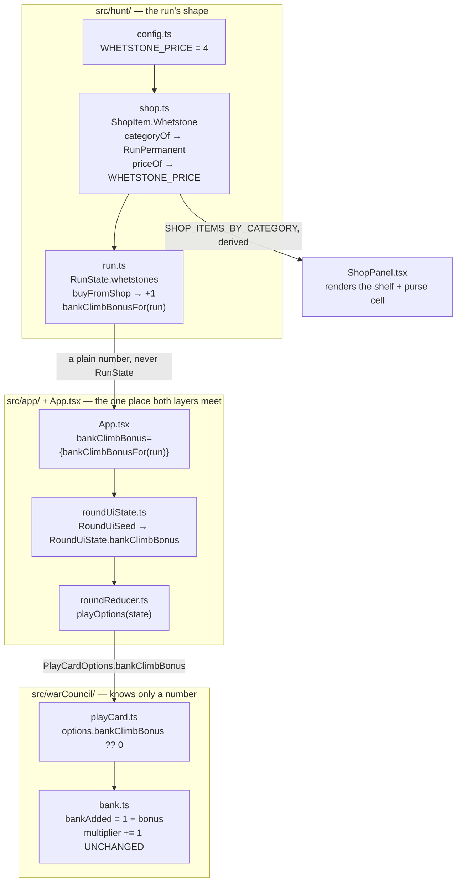

# Plan: Whetstone — run-permanent bank-climb buff

Plan folder: `.claude/contract/DLR-92-whetstone-run-permanent-bank-climb/`
Execution status: see `tasks.md` in this folder.

---

## Part 1 — Alignment

### Task reference

**DLR-92** — *Whetstone: run-permanent bank-climb buff* (Story, labels `engine` `playable`, parent epic **DLR-87** *Shop rebuild: persistence categories, flask, Apply Damage, quick-kill payout*). Transitioned `To Do → Planning` 2026-08-19 at the start of this run.

Problem statement, verbatim:

> The shop's run-permanent category needs its first item: something that stacks and lasts the whole run, filling the "Joker" role Balatro's own ladder uses. Whetstone permanently raises the bank's per-trick climb by 1, so a streak of `n` cashes for more than `n²`.

User story, verbatim:

> As a player, I want to spend coins on a permanent upgrade to how fast my bank climbs, so a good run compounds instead of resetting to the same baseline every fight.

Acceptance criteria, verbatim:

1. A new `ShopItem` (placeholder name `Whetstone`) is added to the run-permanent category at 4 coins (a new `WHETSTONE_PRICE` config key, transcribed from the design doc — "priced as the shop's one real splurge").
2. Whetstone is purchasable more than once in a run, and its effect **stacks** — each copy adds another +1 to the bank's per-trick climb. This is explicit in the design doc ("it stacks with itself") and must not be implemented as a one-shot flag.
3. The buff is carried on `RunState` (not `EncounterState`) and survives `advanceRun` exactly like coins and cheats do — it does not reset between fights.
4. `src/warCouncil/bank.ts`'s `resolveTrickBank` — currently `bankAdded = 1` on every taken trick, unconditionally — needs to read the owned Whetstone count and add `1 + whetstoneCount` instead. This function does not currently know about `RunState` at all; trace how the count reaches it without giving `src/warCouncil/` a dependency on `src/hunt/RunState`, consistent with the existing one-way import boundary.
5. The **multiplier** is unaffected — it still climbs by exactly 1 per taken trick. A multiplier-side twin item is a deliberate future addition, not this ticket's scope; do not build both under one item.
6. `bank.test.ts`'s existing `[1, 4, 9, 16, 25, 36]` spec for a bare streak (zero Whetstones owned) must still pass unchanged — this ticket adds a new parameterised case, it does not rewrite the existing one.
7. Vitest coverage exists for: one Whetstone's effect on the bank-added figure across a streak, two stacked, and confirmation the multiplier term never changes.

Scope boundaries, verbatim:

> **In scope:** the Whetstone purchase, its stacking run-permanent buff, and threading the owned count into `resolveTrickBank`'s bank-added arithmetic.
> **Out of scope:** a multiplier-side twin item (explicitly named as future scope in the design doc); any change to how the bank cashes out — only how fast it climbs.

Dependencies and risks, verbatim:

> Needs the shop-rebuild ticket's `ShopCategory` model to slot into the run-permanent tab. No dependency on the poison items — poison and Whetstone touch unrelated state. Risk — shares `bank.ts` with the Apply Damage ticket, which changes the cash-out branch of `resolveTrickBank`; this ticket changes the taken branch. They should not conflict, but verify against a fresh diff of `bank.ts` before starting the later one to avoid an awkward merge. Placeholder name "Whetstone" is not final copy — developer's call.

Design source: `.docs/design/Balatro-Forbidden-Solitaire/version-4-scope.md` §1 → *Run-permanent — new item: Whetstone (placeholder name), 4 coins*. That section is cited, not reproduced, for the item's price, its stacking, and the deferral of the multiplier twin.

The `ShopCategory` dependency is **already satisfied on disk**: DLR-89 shipped the four-rung model (`src/hunt/shop.ts` → `ShopCategory`, `SHOP_CATEGORIES`, `SHOP_ITEMS_BY_CATEGORY`), and `ShopCategory.RunPermanent` is a live, selectable, currently-empty shelf. Nothing in this contract has to build it.

### Restated goal

Fill the shop's empty run-permanent shelf with its first item. A Whetstone costs 4 coins, can be bought as many times as the purse allows, and each copy permanently raises how fast the bank climbs on a taken trick — one copy makes every taken trick bank 2 instead of 1, two copies bank 3, and so on for the rest of the run. The multiplier is untouched, so an unbroken streak of `n` tricks now cashes `(1 + copies) × n²` rather than `n²`. The owned count lives on `RunState` beside `coins` and `envenomCharges`, survives `advanceRun`, and reaches `resolveTrickBank` as a plain number threaded down the same route `poisonGuarded` already takes — so `src/warCouncil/` still knows nothing about `RunState`.

### In scope

- A new `WHETSTONE_PRICE: Coins = 4` config key in `src/hunt/config.ts`, transcribed from the design doc.
- `ShopItem.Whetstone` added to `src/hunt/shop.ts` — into `SHOP_ITEMS` (before `Heal`, which must stay last), `priceOf`, and `categoryOf` → `ShopCategory.RunPermanent`.
- `RunState.whetstones: number`, starting at 0, incremented by `buyFromShop`, carried through `advanceRun` and `recordEncounter`.
- `bankClimbBonusFor(run)` in `src/hunt/run.ts` — the one statement of "each copy adds +1".
- `TrickFacts.bankClimbBonus` and the `1 + bonus` arithmetic in `resolveTrickBank`'s taken branch, with the multiplier's `+= 1` left alone.
- `PlayCardOptions.bankClimbBonus`, threaded from `RunState` → `App` → `WarCouncilRound` mount prop → `RoundUiSeed` → `RoundUiState` → the reducer's play options.
- Shop screen: the Whetstone card renders on the run-permanent shelf (derived — no per-item markup), its name and blurb in `shopLabels.ts`, its `refusalFor` entry in `App.tsx`'s `refusals` record, and a "Whetstones held" purse cell so a stacking count is visible before buying another.
- Vitest coverage: one copy across a streak, two stacked, the multiplier term unchanged, a non-finite/negative bonus guarded, the count surviving `advanceRun`, stacked purchases, and the item's shelf assignment.
- Repointing the two existing assertions that state the run-permanent shelf is empty (`src/hunt/__tests__/shop.test.ts:217`, `src/app/run/__tests__/ShopPanel.test.tsx:198-200`).

### Explicitly out of scope

- **A multiplier-side twin item.** Named future scope by both the ticket (AC5) and the design doc. No `multiplierClimbBonus` field, no shared "climb bonus" abstraction built speculatively to host it later.
- **Any change to how the bank cashes out.** `cashOut`, `cashedAtHandEnd`, the poison branch, the hit branch, and `incomingFrom` are untouched. Only the taken branch's `bankAdded` changes.
- **A cap on Whetstones owned.** The design doc prices it as the limiter; no new `PurchaseRefusal` code, no new `ShopStock` field.
- **The felt showing the boosted climb.** `BankMeter` already renders whatever `bank`/`bankAdded` carry; no new fight-screen readout, no "+2 per trick" plate.
- **Final copy for the name "Whetstone" or its blurb.** Placeholder, marked as such, the developer's call — exactly as `SHOP_ITEM_NAME[ShopItem.PoisonGuard]` already is.
- **`src/__tests__/sim.test.ts`.** An untracked developer-authored simulation harness; it calls `buyFromShop` with strategy arrays and never touches `playCard` or `TrickFacts`, so nothing in this contract breaks it and nothing in this contract edits it.
- **The `SHOP_CATEGORY_EMPTY` copy and its label spec.** Kept as-is; see Risks for what this ticket does to its reachability.

### Pattern Reference

The brief supplied one code reference — `src/warCouncil/bank.ts`'s `resolveTrickBank` — and one architectural instruction (thread the count in without a `RunState` dependency). Both are authoritative. The references chosen to satisfy the second:

- **`poisonGuarded`, end to end, is the template for the whole threading route.** `src/hunt/run.ts` (`RunState.poisonGuardHeld`) → `src/App.tsx:227` → `src/app/warCouncilMount.ts` (`WarCouncilMountProps.poisonGuardHeld`) → `src/app/warCouncil/roundUiState.ts` (`RoundUiSeed` / `RoundUiState` / `createRoundUiState`) → `src/app/warCouncil/roundReducer.ts:235` (`poisonOptions`) → `src/warCouncil/legalMoves.ts` (`PlayCardOptions.poisonGuarded`) → `src/warCouncil/playCard.ts:117` → `TrickFacts.poisonGuarded`. Whetstone follows this exactly, with one deliberate difference (see Assumptions).
- **`PlayCardOptions`' own docblock** (`src/warCouncil/legalMoves.ts:38-45`) already states the rule AC4 is asking about: the figures are handed in rather than read, because the two layers must not learn each other's shapes and the reducer is the one place they meet.
- **`envenomCharges` is the template for an uncapped run-level count** — `RunState.envenomCharges`, its `buyFromShop` branch, and its `SHOP_ENVENOM_LABEL` purse cell (a count with no denominator, unlike `cheatCount` / `cheatSlotCount`).
- **`ShopItem.PoisonGuard`, added on DLR-91, is the template for adding an item** — the five total-map sites the compiler enumerates (`priceOf`, `categoryOf`, `SHOP_ITEM_NAME`, `SHOP_ITEM_BLURB`, `App.tsx`'s `refusals`) plus `SHOP_ITEMS`.
- `.claude/skills/react-frontend/SKILL.md` and `.claude/skills/game-ux/SKILL.md` for conventions; `.claude/workflow/web-project.md` for every command.

### Constraints flagged on the brief

- **AC4 — no `src/warCouncil/` → `src/hunt/run` dependency.** `bank.ts` already imports `DAMAGE_PER_HIT` and `DuelSide` from `../hunt`, so the boundary is not "no hunt imports"; it is the one `src/hunt/types.ts` documents — the card layer must not learn the run's shape, and `src/hunt/` must not learn `RoundState`. A plain `number` crossing satisfies it; importing `RunState` into `bank.ts` would not.
- **AC5 — the multiplier climbs by exactly 1.** The `multiplier += 1` line is not to be touched, and a test must assert this.
- **AC6 — the existing `[1, 4, 9, 16, 25, 36]` spec passes unchanged.** Its `it(...)` block is not edited. See Assumptions for the one line that does change in the file it lives in.
- **AC1 — the price is transcribed, not chosen.** 4 coins, from the design doc's own heading.
- **`bank.ts` is shared with the Apply Damage ticket** (also under DLR-87), which changes the cash-out branch. This ticket changes the taken branch. Nothing in this contract touches `cashOut`, and the merge risk is noted for whichever runs second.
- Two runtime dependencies stay two — nothing here needs a third.

### Assumptions made

- **The card layer's field is named `bankClimbBonus`, not `whetstoneCount`.** `src/warCouncil/` and `src/app/warCouncil/` are handed the *effect* as a number, never the shop item's name. Rationale: "Whetstone" is placeholder copy the developer may rename, and the card layer holding a shop item's name is the dependency AC4 forbids in spirit even where it type-checks. Renaming the item later then touches `src/hunt/` and `shopLabels.ts` only.
- **`RunState`'s field is named `whetstones: number`** — a count of copies owned, matching `envenomCharges`' precedent for an uncapped run-level count. Rationale: the shop and its purse cell need to say how many are owned, which a pre-multiplied bonus figure could not.
- **The "+1 per copy" mapping is stated once, in `src/hunt/run.ts`'s exported `bankClimbBonusFor(run)`.** Rationale: this repo states each fact once; `App.tsx` passing `run.whetstones` straight into a prop called `bankClimbBonus` would encode the rule at a wiring site where no reviewer would look for it, and a named function is where the multiplier twin's future contribution would be added.
- **No `WHETSTONE_BANK_BONUS` config key.** AC1 names exactly one new key, and AC2 states the per-copy figure as +1 — which is what "another +1 per copy" *means*, in the same way `bank.ts`'s existing comment defends its unconfigured `bankAdded = 1` ("1 is what counting a trick means"). An item granting +2 per copy is a different item, not a retuning of this one. **This is not a tuning value being invented — it is a definition being transcribed.**
- **`TrickFacts.bankClimbBonus` is required; `PlayCardOptions.bankClimbBonus` is optional with `?? 0`.** Rationale: exactly the split the existing poison fields use — required on `TrickFacts` so the compiler enumerates producers, optional on the options object so the Quarry's call sites pass nothing.
- **AC6 is read as "the existing `it(...)` block is not edited".** Adding a required field to `TrickFacts` means the shared `facts()` factory at `bank.test.ts:16` gains one line (`bankClimbBonus: 0`). The streak spec itself, its loop, and its `[1, 4, 9, 16, 25, 36]` expectation are untouched, and it must still pass. Flagged rather than assumed silently, because AC6 is explicit and this is the one line in that file that changes.
- **`bankClimbBonus` is seeded onto `RoundUiState` but is *not* returned in `WarCouncilRoundResult`.** Rationale: unlike `poisonGuardHeld` and `envenomCharges`, a hand cannot spend or change it, so handing it back would invite a second writer for a read-only value. `recordEncounter`'s signature does not grow a sixth parameter; `whetstones` rides its `...run` spread, exactly as `coins` does.
- **The reducer's `poisonOptions` helper is renamed `playOptions`.** Rationale: it becomes the one place every `PlayCardOptions` field is assembled, and a non-poison field inside a function called `poisonOptions` is the naming drift a reviewer would flag next month. A rename with no behaviour change.
- **A "Whetstones held" purse cell is in scope even though no AC names it.** Rationale: AC2 makes stacking the item's whole point, and `game-ux`'s floor is that state a decision needs is on the face of the screen — a player deciding whether to spend a fifth coin on a third copy needs to see they hold two. Follows `SHOP_ENVENOM_LABEL`'s precedent exactly (a count, no denominator). Red-line this if you would rather the shelf stay bare.
- **No new `PurchaseRefusal` code.** Uncapped stacking means the existing `NotEnoughCoins` check is the only refusal that can fire, so `refusalFor` gains no branch and `ShopStock` gains no field.
- **`ShopItem.Whetstone` is inserted into `SHOP_ITEMS` before `ShopItem.Heal`.** Rationale: that file's own comment states the Heal must stay last because `UNCATEGORISED_SHOP_ITEMS` derives from the order.

### Config and persisted-shape audit

- **`WHETSTONE_PRICE` — 0 hits** across `src/**` (`Get-ChildItem src -Recurse -Include *.ts,*.tsx | Select-String -Pattern "WHETSTONE"`). The key is new, not dead. It needs adding in `src/hunt/config.ts`, re-exporting from `src/hunt/index.ts` (which enumerates every config export by name — 3 hits for the sibling `POISON_GUARD_PRICE` across `config.ts`, `index.ts`, and `shop.ts`), and reading in `shop.ts`'s `priceOf`. No copy quotes it: `shopLabels.ts`'s `priceText` interpolates `priceOf`, so the screen cannot fall out of step with the number.
- **`Whetstone` / `whetstone` — 0 hits** in `src/**`; 4 hits in `.docs/**` (design doc §1, its placeholder-names note, `the-hunt.md`'s two "still to come" notes). Nothing on disk binds the name yet, so nothing to migrate.
- **Nothing is persisted.** No `localStorage`, no save file, no stored log anywhere in `src/**` (0 hits for `localStorage|sessionStorage|indexedDB` outside `eslint.config.js`'s own denylist). `RunState.coins`' docblock states the rule explicitly — "NEVER persisted". So `RunState` gaining a field invalidates no stored record and needs no migration. **Recording that this window is still open:** the moment a save file exists, adding a `RunState` field stops being free.
- **`ShopItem` is a widened union, and five total maps grow with it.** Enumerated: `priceOf` and `categoryOf` (`src/hunt/shop.ts`), `SHOP_ITEM_NAME` and `SHOP_ITEM_BLURB` (`src/app/run/shopLabels.ts`), and `App.tsx`'s hand-built `refusals` record (`src/App.tsx:246-251`). All five are `Record<ShopItem, …>` or exhaustive `switch`es with no `default`, so each is a compile error rather than a runtime `undefined` — this is the designed behaviour those files document. `buyFromShop`'s `switch` in `src/hunt/run.ts` is a sixth. One further consumer binds by literal: `noRefusals` in `src/app/run/__tests__/ShopPanel.test.tsx:42-45` is a total `Record<ShopItem, …>` fixture and will fail to compile until it gains an entry.
- **`TrickFacts` gains a required field — one producer, one test fixture.** `resolveTrickBank(` has 1 non-test call site (`src/warCouncil/playCard.ts:108`) and 30 in `bank.test.ts`, every one of which builds its facts through the single `facts()` factory at line 16. So the widening costs exactly two edits, not thirty-one.
- **Two existing assertions state the run-permanent shelf is empty and must be repointed in the same task that fills it.** `src/hunt/__tests__/shop.test.ts:217` — `expect(SHOP_ITEMS_BY_CATEGORY[ShopCategory.RunPermanent]).toEqual([])`; and `src/app/run/__tests__/ShopPanel.test.tsx:198-200` — selects the run-permanent tab and expects `SHOP_CATEGORY_EMPTY`. Neither is a compile error, so both would fail at runtime if missed. `shop.test.ts:222-228` also cross-checks that every `SHOP_ITEMS` member is on exactly one rung or uncategorised — that one is derived and passes unchanged, which is the point of it.
- **The purity boundary is not crossed.** `eslint.config.js`'s override on `src/warCouncil/**` and `src/hunt/**` restricts React imports and DOM globals only; this design adds neither. The `src/hunt/` ↔ `RoundState` cycle that `src/hunt/types.ts` documents is not created either: the crossing is a `number`, and `bankClimbBonusFor` lives on the `hunt` side of it.

---

## Part 2 — Technical design

### Approach

The arithmetic change is three lines; the design work is the route the number takes to reach them. `resolveTrickBank` is pure and knows only `BankState` and `TrickFacts`, so AC4's constraint resolves into a question already answered on this codebase: DLR-91 threaded `poisonGuardHeld` from `RunState` to the same function without either layer learning the other's shape, by widening `PlayCardOptions` with a primitive and letting the reducer — which holds both halves — do the assembly. Whetstone takes that identical route with a neutral name. `RunState` gains `whetstones: number`; `src/hunt/run.ts` exports `bankClimbBonusFor(run)` returning that count; `App.tsx` hands the result to `WarCouncilRound` as `bankClimbBonus`; the seed puts it on `RoundUiState`; the reducer's options helper passes it into `playCard`; `playCard` puts it on `TrickFacts`; `resolveTrickBank`'s taken branch reads it. Nothing in `src/warCouncil/` ever sees the word Whetstone or the type `RunState`.

The rejected alternative was **putting the bonus on `RoundState`** (`WarCouncilState`) as a per-hand constant, seeded by `dealRound`. It is superficially attractive — the value is fixed for the hand, so `TrickFacts` would not need to carry it and `playCard` would not need an option — but it makes the deal function responsible for a shop purchase, puts a run figure inside the state the card engine owns and mutates trick by trick, and gives a value with exactly one reader a home in the state object with the most readers. The options route keeps the run figure at the boundary where every other run figure already crosses. A second rejected alternative was **giving `bank.ts` the count directly as `whetstoneCount`**: it type-checks and needs no new import, but it names a shop item inside the card engine, which is the coupling AC4 exists to prevent and the thing a later rename would have to unpick.

The `1 + bonus` arithmetic gets one guard. `bankAdded` feeds `bank`, which feeds `bank * multiplier`, which becomes damage and then a rendered heart row — so a `NaN` or a fractional bonus would propagate silently into a health bar and vanish, which is precisely the trap `web-project.md` names. `resolveTrickBank` therefore floors the bonus to 0 unless it is a positive integer, in its own named local, and a spec covers `NaN`, a negative, and a fraction. There is still no division anywhere in the function, so no epsilon is needed.

Everything with an invariant stays pure and testable without a renderer: the price and the shelf assignment in `src/hunt/shop.ts`, the stacking purchase and `bankClimbBonusFor` in `src/hunt/run.ts`, the climb arithmetic in `src/warCouncil/bank.ts`. The only component work is what genuinely renders: two label-map entries, one purse cell, and the wiring props. The Whetstone's item card itself needs **no** markup — `ShopPanel` maps `SHOP_ITEMS_BY_CATEGORY[selectedCategory]`, so the item appears on the run-permanent shelf the moment `categoryOf` claims it, which is the payoff DLR-89's derived catalogue was built for.

### Skills to invoke during execution

- `react-frontend` — owns everything under `src/`: where the logic goes (pure `src/hunt/` and `src/warCouncil/` modules over components), the configuration-key discipline for `WHETSTONE_PRICE`, the 400-line budget, and the Vitest posture (pure specs with no renderer; component queries by role and label).
- `game-ux` — owns the shop screen surface: the "Whetstones held" purse cell's placement at the edge-anchored purse row, and the floor that a count a purchase decision depends on reads without colour or motion alone.

Developer confirmed both at the Step 1.5c gate and declined `game-designer` (the design doc already settles the item, its price and its stacking).

Also read before executing: `.claude/workflow/web-project.md` (paths, runners, the correctness traps). `.claude/rules/` was scanned — it holds only `README.md` with an empty index, so no rule file applies.

### Diagram



### Data shapes

#### `src/hunt/config.ts` — one new key

```ts
// DLR-92 AC1 — the Whetstone's price. TRANSCRIBED from version-4-scope.md §1's own heading
// ("Run-permanent — new item: Whetstone (placeholder name), 4 coins"), which prices it as "the
// shop's one real splurge": four times a Heal, and reachable early only via the quick-kill payout
// rather than by grinding 1-coin fight wins. NOT chosen here and NOT an open tuning value. Its own
// key for the reason every other item's price already has one: re-pricing one item must not move
// another.
// UNIT: coins per purchase.
export const WHETSTONE_PRICE: Coins = 4
```

Re-exported by name from `src/hunt/index.ts`'s existing config export block.

#### `src/hunt/shop.ts` — the item

```ts
export const ShopItem = {
  Cheat: 'cheat',
  Envenom: 'envenom',
  PoisonGuard: 'poisonGuard',
  Whetstone: 'whetstone',
  Heal: 'heal',
} as const

// SHOP_ITEMS: [Cheat, Envenom, PoisonGuard, Whetstone, Heal] — Heal stays LAST.
// priceOf:    case ShopItem.Whetstone: return WHETSTONE_PRICE
// categoryOf: case ShopItem.Whetstone: return ShopCategory.RunPermanent
```

No change to `ShopStock`, `PurchaseRefusal`, `refusalFor`, `isShopCategoryAvailable`, `SHOP_ITEMS_BY_CATEGORY`'s shape, or `UNCATEGORISED_SHOP_ITEMS` (all derived).

#### `src/hunt/run.ts` — the count and the one statement of its effect

```ts
export interface RunState {
  // …existing fields unchanged…
  /** DLR-92 AC2/AC3 — Whetstones owned. A COUNT, not a flag: each copy stacks. Run-level like
   *  `coins`, carried through `advanceRun`'s and `recordEncounter`'s spread, and NEVER handed back
   *  by a hand — a hand cannot spend one. NEVER persisted, exactly as `coins` above. */
  readonly whetstones: number
}

/** startRun(): whetstones: 0 */
/** buyFromShop(): case ShopItem.Whetstone: return { ...paid, whetstones: run.whetstones + 1 } */

/**
 * DLR-92 AC2 — THE statement of "each copy adds +1 to the bank's per-trick climb", so the rule is
 * stated once rather than at the wiring site that happens to need it. The multiplier twin named as
 * future scope would contribute its own figure here, not at a mount prop.
 */
export function bankClimbBonusFor(run: RunState): number
```

`recordEncounter`'s signature is unchanged — `whetstones` rides the `...run` spread. `advanceRun` is unchanged for the same reason.

#### `src/warCouncil/bank.ts` — the arithmetic

```ts
export interface TrickFacts {
  // …existing seven fields unchanged…
  /** DLR-92 AC4 — extra bank added by a taken trick, ON TOP of the trick's own 1. A plain number
   *  handed in, never a run figure read: this module must not learn what bought it. 0 means the
   *  bare rule. The MULTIPLIER is unaffected (AC5). */
  readonly bankClimbBonus: number
}

// In the isTaken() branch, replacing `bankAdded = 1`:
//   const bonus = Number.isInteger(trick.bankClimbBonus) && trick.bankClimbBonus > 0
//     ? trick.bankClimbBonus
//     : 0
//   bankAdded = 1 + bonus
//   bank += bankAdded
//   multiplier += 1        // UNCHANGED — AC5
```

`TrickResolution`, `BankState`, `trickOutcomeFor`, `isTaken`, and `incomingFrom` are unchanged.

#### `src/warCouncil/legalMoves.ts` — the options field

```ts
export interface PlayCardOptions extends LegalMoveOptions {
  readonly poisonToPlayer?: Damage
  readonly poisonToQuarry?: Damage
  readonly poisonGuarded?: boolean
  /** DLR-92 AC4 — the bank-climb bonus in force for this hand. Handed IN for the reason this
   *  interface already documents: the figure is a run figure and `src/warCouncil/` must not learn
   *  `RunState`. Absent means 0, so the Quarry's call sites stay untouched. */
  readonly bankClimbBonus?: number
}
```

`playCard` fills `bankClimbBonus: options?.bankClimbBonus ?? 0` alongside the three poison facts.

#### `src/app/warCouncilMount.ts`, `src/app/warCouncil/roundUiState.ts`, `roundReducer.ts`

```ts
// WarCouncilMountProps — required, so the compiler enumerates every mount site:
readonly bankClimbBonus: number

// RoundUiSeed:  readonly bankClimbBonus: number
// RoundUiState: readonly bankClimbBonus: number   // read-only for the hand's whole life
// createRoundUiState(): bankClimbBonus: seed.bankClimbBonus

// roundReducer.ts — `poisonOptions` renamed `playOptions`, gaining one field:
function playOptions(state: RoundUiState): PlayCardOptions {
  return {
    poisonToPlayer: state.encounter.pendingEnvenom[DuelSide.Player],
    poisonToQuarry: state.encounter.pendingEnvenom[DuelSide.Quarry],
    poisonGuarded: state.poisonGuardHeld,
    bankClimbBonus: state.bankClimbBonus,
  }
}
```

`WarCouncilRoundResult` is **unchanged** — no `bankClimbBonus` comes back up.

#### `src/app/run/ShopPanel.tsx` and `shopLabels.ts`

```ts
// ShopPanelProps gains:
/** DLR-92 AC2 — Whetstones owned, so the player can see what they already hold before buying
 *  another. A count with no denominator, exactly as `envenomCharges`: there is no cap. */
readonly whetstones: number

// shopLabels.ts:
export const SHOP_WHETSTONE_LABEL = 'Whetstones held'   // PLACEHOLDER copy
SHOP_ITEM_NAME[ShopItem.Whetstone]  = 'Whetstone'       // PLACEHOLDER copy — the developer's call
SHOP_ITEM_BLURB[ShopItem.Whetstone] =
  'Every trick you take banks one more, for the rest of the run. Buy it again to stack it.'
```

#### `src/App.tsx`

```tsx
// ShopPanel: whetstones={run.whetstones}
//            refusals: [ShopItem.Whetstone]: refusalFor(stock, ShopItem.Whetstone)
// WarCouncilRound: bankClimbBonus={bankClimbBonusFor(run)}
```

No `package.json`, `tsconfig.json`, `vite.config.ts`, or ESLint change. No new dependency.

### Runtime quality notes

- **Purity and adjudication.** Every rule this ticket adds lands in a pure module: the price in `config.ts`, the shelf in `shop.ts`, the count and the "+1 per copy" mapping in `run.ts`, the climb arithmetic in `bank.ts`. All four are unit-testable with no renderer and none imports React or touches a DOM global. `ShopPanel` continues to compute nothing — the item card is derived from `SHOP_ITEMS_BY_CATEGORY` and the purse cell renders a prop. The one number that could have been hard-coded, the price, is a config key read through `priceOf`, and the screen interpolates it via `priceText` rather than quoting `4`.
- **Effects, mount and teardown.** No effect, listener, observer, timer, `requestAnimationFrame`, or `AbortController` is added or changed anywhere in this contract. `bankClimbBonus` enters `RoundUiState` through the existing lazy `useReducer` initialiser, which stays a pure restructuring of its seed — so StrictMode's double invocation recomputes an identical value, as `createRoundUiState`'s docblock already promises. On a remount (a new hand, keyed by `hand` in `App.tsx`) the value is re-seeded from `RunState`, which is the correct behaviour for a run-permanent buff: no module-level mutable state is introduced and there is nothing to reset.
- **Hot-path cost.** `resolveTrickBank` runs once per completed trick — twelve times a hand at most, not per pointer event. The change adds two integer comparisons and one addition, allocates nothing, and scans no collection. `playOptions` builds the same single object it built before with one more property. `SHOP_ITEMS_BY_CATEGORY` is still derived once at module load, so the new item costs no per-render catalogue scan. No memoisation is added, and none is warranted.
- **Determinism and numeric safety.** No `Math.random()` is reachable from anything this contract touches — the only randomness in the app is `App.tsx`'s injected shuffle source, untouched here. There is no division added and none present in `resolveTrickBank`, so no epsilon is needed and no divisor needs guarding. The one numeric risk is the bonus itself: `bankAdded` feeds `bank`, then `bank * multiplier`, then damage, then a rendered heart row, so a `NaN` or fractional bonus would disappear into a health bar with nothing logged. The guard is explicit — a bonus that is not a positive integer floors to 0 — and specs cover `NaN`, `-1`, and `1.5`.
- **Error paths.** `buyFromShop` already throws a `RangeError` naming the `PurchaseRefusal` rather than returning the run unchanged, and the Whetstone branch inherits that unchanged: an unaffordable purchase cannot commit, and its rejection names `notEnoughCoins`. No `try`/`catch` is added, nothing is swallowed into a success shape, and no `catch { return DEFAULTS }` exists on any path here. The bonus guard is deliberately *not* a throw: `resolveTrickBank` is a total function over its inputs and mid-trick is the wrong place to abort a hand — flooring to 0 degrades to the bare rule, which is the pre-DLR-92 behaviour, and the specs pin it. No new async surface exists, so the four async states do not arise.

### Risks and judgement calls

- **The name "Whetstone" and its blurb are placeholder copy — yours to change.** Marked `PLACEHOLDER` in `shopLabels.ts` exactly as `Poison Guard` already is. A rename later touches `src/hunt/shop.ts`'s union member, two label maps, and the tests that name it — not the card layer, which is why the neutral `bankClimbBonus` naming is worth the extra indirection.
- **The "Whetstones held" purse cell is my call, not an AC.** Rationale in Assumptions: stacking is the item's point, and `game-ux`'s floor puts state a decision needs on the face of the screen. It makes the purse row five cells wide at the same viewport that already fits four — worth a look when you play it. Say so if you would rather it stayed at four.
- **`SHOP_CATEGORY_EMPTY` loses its only reachable subject.** After this ticket, three of the four shelves have items and the fourth (game-permanent) is a *refused* tab that cannot be selected — so "Nothing on this shelf yet." becomes unreachable by playing. The copy and its `shopLabels` spec stay (the branch is still correct and still needed the next time a rung is added), but the `ShopPanel` test that reached it via the run-permanent tab is repointed to assert the Whetstone card instead. This is a genuine coverage loss on a now-unreachable branch, flagged rather than papered over with a contrived test.
- **`roundReducer.ts` is 388 lines against a 400-line blocking budget.** The change is a rename plus one field and its docblock — roughly four lines, landing near 392. Real headroom, but thin: measured with `(Get-Content <path>).Count` in Final verification, not estimated, and `Measure-Object -Line` must not be used (it drops blank lines and hid a real breach on DLR-63). If it does breach, the fix is a split, not a trimmed comment — and that is a design change worth raising rather than absorbing.
- **`bank.ts` merge risk with the Apply Damage ticket**, per the brief. This contract touches only the taken branch (`bankAdded`) and `TrickFacts`; Apply Damage touches the cash-out branch. Whichever runs second should re-read `bank.ts` before starting rather than trusting either plan's quoted line numbers.
- **No tuning value is open on this ticket.** The price (4 coins) is transcribed from the design doc's heading, and the per-copy +1 is AC2's definition of the item, not a knob. If you want either to be retunable independently later, say so at this gate and `WHETSTONE_BANK_BONUS` becomes a second config key — but that is a design change, not a planning omission.
- **Playing it is the only way to judge the balance.** The design doc claims roughly +100% on an average hand for one copy; the arithmetic here makes an unbroken `n`-trick streak cash `(1 + copies) × n²` — so a full six-trick hand goes 36 → 72 → 108. Whether 4 coins is reachable often enough to matter, and whether two copies breaks the fight, is a feel question a test cannot answer. QA will confirm the purchase commits and the bank climbs; the pacing is yours.
