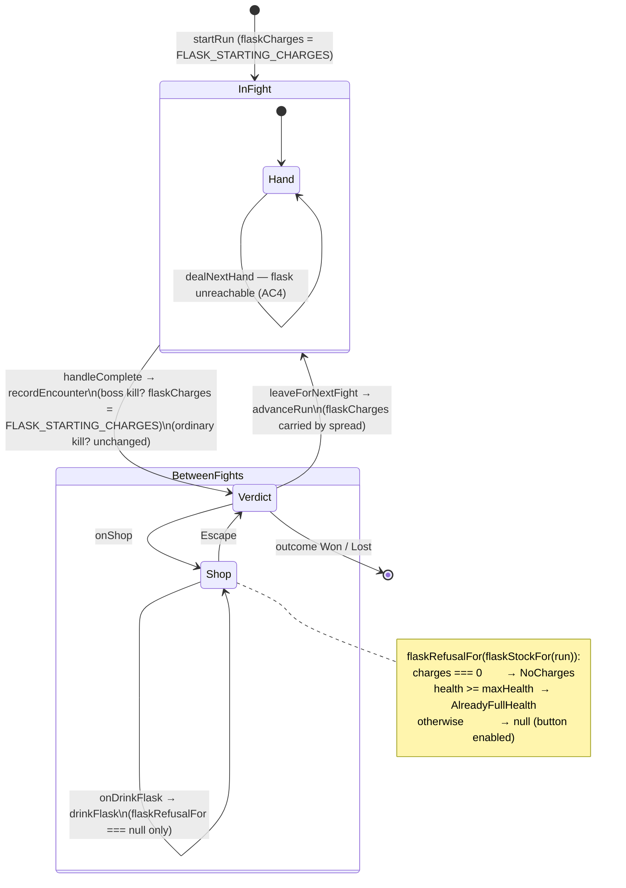

# Plan: The flask — a free heal that refills on a stage-boss kill

Plan folder: `.claude/contract/DLR-93-the-flask-a-free-heal-refilled-on-a-boss-kill/`
Execution status: see `tasks.md` in this folder.

---

## Part 1 — Alignment

### Task reference

**Jira: DLR-93** — *The flask: a free heal that refills on a stage-boss kill* (Story, parent epic DLR-87 *Shop rebuild: persistence categories, flask, Apply Damage, quick-kill payout*). Labels: `playable`, `ui`.

> **Problem Statement**
>
> DLR-82 named a flask as part of the intended answer to the run's brutal health curve and explicitly refused to build one ahead of its own design (`the-hunt.md` §10's `ENCOUNTER_PLAYER_RESTORE` tunable, deliberately unread, guarded by a grep). This ticket is that design landing: a single-charge free heal, separate from the shop's paid Heal, restoring 60% of max health and refilling once per stage-boss kill.
>
> **User Story**
>
> As a player, I want a free emergency heal I can drink when I choose, that comes back after I beat a boss, so the run's tightest moments have a safety valve that doesn't cost coins I'd rather spend at the shop.
>
> **Acceptance Criteria**
>
> 1. `RunState` gains a flask-charge field, starting at 1 charge on `startRun` (a new `FLASK_STARTING_CHARGES` config key).
> 2. A new action restores `Math.round(maxPlayerHealth * FLASK_HEAL_PERCENT)` health, clamped to the player's maximum exactly like `buyFromShop`'s Heal branch already clamps — reuse that clamp pattern rather than writing a second one. `FLASK_HEAL_PERCENT` is a new config key set to `0.6` (transcribed: "60%... 6 points at today's provisional 10").
> 3. Drinking the flask is refused with a stated reason when at zero charges or already at full health, following the exact refusal shape `src/hunt/shop.ts`'s `refusalFor` already establishes.
> 4. The flask is available **only** between fights (same phase the shop is reachable from), not mid-hand — confirm against `RunPhase` in `src/App.tsx` where the shop and map controls are gated.
> 5. On beating a **stage boss** specifically (an opponent whose `OpponentKind` is `Boss`, per `runEncounterAt`), the flask charge count resets to 1 — regardless of whether the player had 0 or 1 charge going in. Beating an ordinary opponent does not refill it.
> 6. The flask is visually distinct from the shop's paid Heal wherever both are reachable — a player must not be able to confuse "free, limited charges" with "paid, unlimited while you have coins."
> 7. Vitest coverage exists for: starting charge, drink-and-clamp, refusal at zero charges and at full health, refill on a boss kill, and no refill on an ordinary kill.
>
> **Scope Boundaries**
>
> **In scope:** the flask's charge state, the drink action and its heal/clamp math, the stage-boss refill trigger, and a control to drink it between fights.
> **Out of scope:** retuning the charge count past one per stage — the epic explicitly defers that ("revisit only if it plays too thin"). Any change to the shop's existing paid Heal.
>
> **Dependencies & Risks**
>
> No dependency on the shop-rebuild tickets — the design doc is explicit the flask is "separate from the shop's paid Heal," and this ticket can build and land independently. Risk — where the drink control lives: there is no existing "between fights, outside the shop" action surface; today the verdict panel (`RunOutcomePanel.tsx`) only offers go-on / shop / map. Decide whether the flask lives on the verdict panel directly or inside the shop screen (outside its four tabs, the way Heal is placed) before starting — a genuine open layout question, not a detail to improvise mid-implementation. `ENCOUNTER_PLAYER_RESTORE` stays exactly as unread as it is today — the flask is a separate, player-triggered mechanic, not that tunable finally being wired in.
>
> **Design Assets**
>
> N/A — the drink control's placement may warrant a quick mockup before `/fb-apply`; flag at the `/fb-plan` gate.

**Design source cited, not restated:** `.docs/design/Balatro-Forbidden-Solitaire/version-4-scope.md` §2 *The flask* — "Restores 60% of the player's maximum health — 6 points at today's provisional 10. Carried as a single charge, drunk whenever the player chooses, and refilled to one charge each time a stage boss is beaten — up to five charges across a full 25-fight run." §*Open questions the developer still owns* defers "the flask's charge count (currently one per stage) if that proves too thin once played."

**Developer decisions confirmed in this planning session (2026-08-20), settling the ticket's named open layout question:**

1. **The flask is accessed through the shop screen**, not the verdict panel. (Ticket's Dependencies & Risks asked for exactly this call before planning.)
2. **The drink control is a potion-icon button**, not a text-only card like the shop's item buttons.
3. **A UX design will be delivered before `/fb-apply`.** The mockup in this folder is therefore a *functional* placeholder — it settles what the control does, where it sits relative to the paid Heal, and what state it shows; the final visual treatment comes from the developer's UX design, and the implementing task cites both.

### Restated goal

Add a free, player-triggered emergency heal — the flask — to the run. It is one charge of run state, it restores 60% of the player's maximum health when drunk (clamped, overheal discarded), it is refused with a stated reason when the player has no charge or is already at full health, and it refills to one charge whenever a stage boss is beaten and never on an ordinary kill. The player drinks it from the shop screen — the surface already reachable only between fights — through a potion-icon button placed away from the priced Heal so free-and-limited cannot be mistaken for paid-and-unlimited. The charge state, the heal-and-clamp arithmetic, and the refill rule all live in pure `src/hunt/` modules with Vitest coverage; the shop screen and `App.tsx` gain only wiring and copy.

### In scope

- A new pure module `src/hunt/flask.ts` stating the flask's rules: its two refusal reason codes, the stock it reads, the refusal predicate, and the heal amount derived from a maximum.
- Two new configuration keys in `src/hunt/config.ts`: `FLASK_STARTING_CHARGES` (1) and `FLASK_HEAL_PERCENT` (0.6), both transcribed from the ticket and the design doc.
- `RunState.flaskCharges` in `src/hunt/run.ts`, seeded by `startRun`, carried through `advanceRun` and `recordEncounter`'s spreads.
- `drinkFlask(run, maxPlayerHealth)` in `src/hunt/run.ts` — the transition, writing through a clamp **shared with** `buyFromShop`'s Heal branch rather than duplicated beside it (AC2's explicit instruction).
- `flaskStockFor(run, maxPlayerHealth)` in `src/hunt/run.ts`, the sibling of `shopStockFor`.
- The stage-boss refill inside `recordEncounter`, reading `runEncounterAt(run.encounterIndex).kind`.
- Barrel exports for every new name in `src/hunt/index.ts`.
- A potion glyph component `src/app/run/FlaskMark.tsx`, following `HeartMark.tsx`'s `<symbol>`/`<use>` pattern and its symbol-id discipline.
- The drink control and the charge readout on `src/app/run/ShopPanel.tsx`, laid out per this folder's `mockup.html` and the developer's forthcoming UX design, with its copy in `src/app/run/shopLabels.ts` and its styles in `src/app/run/shop.css`.
- `App.tsx` wiring: pass `flaskCharges` and the flask refusal down, and a `handleDrinkFlask` functional-updater handler mirroring `handleBuy`.
- Vitest coverage for all seven AC7 cases plus the two new config keys, and updated component/label specs.
- Correcting the two now-false prose comments that assert no flask exists (`src/hunt/config.ts:215`, `src/hunt/encounter.ts:22`).

### Explicitly out of scope

- **Any behavioural change to the shop's paid Heal.** Its price, its restored amount, its refusal reason and its position in `UNCATEGORISED_SHOP_ITEMS` are all untouched. AC2 does require its clamp expression to move into a shared helper — a refactor with an identical result, called out under Assumptions.
- **Retuning the charge count past one per stage.** The epic defers it; `FLASK_STARTING_CHARGES` exists so a later change is one line.
- **Wiring `ENCOUNTER_PLAYER_RESTORE`.** It stays at `0` and read by nothing. Final verification greps for it.
- **Making the flask a `ShopItem`.** It is free and charge-limited; putting it in `SHOP_ITEMS` would force a price into `priceOf` and a category into `categoryOf`, and would put it on the shelf beside the Heal — the precise confusion AC6 forbids.
- **A drink control on the verdict panel, the map, or the felt.** The developer settled the shop as the single surface; `RunOutcomePanel.tsx` and `RunMap.tsx` are not touched.
- **The final visual treatment of the potion icon and the flask block.** The developer's UX design lands before `/fb-apply`; the shipped CSS and glyph path are placeholders marked as such, exactly as `HeartMark.tsx` marks its own `d` values.
- **The other three DLR-87 stories** — Apply Damage, the quick-kill payout, and the persistence-category work already landed.

### Pattern Reference

Verbatim from the brief: `src/hunt/shop.ts`'s `refusalFor` (AC3 — "the exact refusal shape"), `buyFromShop`'s Heal branch clamp (AC2), `runEncounterAt` and `OpponentKind` (AC5), `RunPhase` in `src/App.tsx` (AC4), `RunOutcomePanel.tsx` (named as the alternative placement, not chosen).

Chosen here, none supplied by the brief:

- `src/hunt/shop.ts` as the whole-module template for `src/hunt/flask.ts` — reason-code `as const` map, a narrow stock interface that deliberately is not `RunState`, one exported predicate that both the transition and the screen read.
- `src/hunt/run.ts`'s `shopStockFor` / `buyFromShop` pair as the template for `flaskStockFor` / `drinkFlask`, including the defaulted-`maxPlayerHealth` injectable parameter and the throw-rather-than-no-op discipline.
- `src/app/warCouncil/HeartMark.tsx` as the template for `FlaskMark.tsx` — a `HEART_SYMBOL_ID`-style id map, a sheet component mounted exactly once, `currentColor` throughout, `aria-hidden` on the glyph with the accessible reading carried by the control around it.
- `src/app/run/shopLabels.ts`'s `PURCHASE_REFUSAL_MESSAGE` as the template for `FLASK_REFUSAL_MESSAGE` — a total `Record` over the reason codes so a third code is a compile error rather than a blank sentence.
- `.docs/design/Balatro-Forbidden-Solitaire/version-4-scope.md` §2 for the mechanic's figures.
- `.claude/skills/react-frontend/SKILL.md` and `.claude/skills/game-ux/SKILL.md` for conventions — loaded, not restated.

### Constraints flagged on the brief

- **`ENCOUNTER_PLAYER_RESTORE` must stay unread.** Stated twice in the ticket. Guarded by an existing grep discipline (DLR-82's) which this plan re-runs in Final verification.
- **AC2's "reuse that clamp pattern rather than writing a second one"** is an explicit instruction about *how*, not just what — a second `Math.min(max, health + restored)` beside the first is a plan failure even if it computes correctly.
- **AC3's "the exact refusal shape"** — reason codes in `src/hunt/`, sentences in `src/app/run/`, one predicate read by both the transition (which throws on non-null) and the screen (which disables and prints).
- **AC6 is a hard requirement, not a styling nicety.** Free-and-limited must not read as paid-and-unlimited.
- **AC4 gates on phase**, and the plan must confirm the gate against `RunPhase` rather than assume it.
- **Two runtime dependencies only.** Nothing here needs a third; the potion glyph is inline SVG.
- No determinism or seeding concern: the flask is player-triggered and reads no randomness. No save-compatibility concern: nothing in this project is persisted (see audit).

### Assumptions made

- **A boss kill refills to `FLASK_STARTING_CHARGES`, not to a literal `1`.** AC5 says "resets to 1" and AC1 names the key as the *starting* charge count. Refilling to the same key states the run's full-flask figure exactly once; a literal `1` beside it is the second source that drifts the moment the deferred re-tune lands. Design doc §2's wording — "refilled to one charge" — is the same number, so today the two readings are indistinguishable.
- **`FlaskRefusal` is a new reason-code union, not two new members of `PurchaseRefusal`.** `PurchaseRefusal` has 49 hits across `src/`, including the total `PURCHASE_REFUSAL_MESSAGE` map and `refusalFor`'s item-specific branches. Widening it would force every shop item's exhaustive handling to grow a case that can never occur for a purchase, and would let a flask reason reach a shop card. `FlaskRefusal.AlreadyFullHealth` deliberately duplicates the *name* of `PurchaseRefusal.AlreadyFullHealth` because it is the same player-facing fact reached by a different rule.
- **The flask is not a `ShopItem`.** It is free and charge-limited; `priceOf` and `categoryOf` are total over `ShopItem`, so membership would demand a price and a rung it has neither of, and would place it on a shelf beside priced cards.
- **`drinkFlask` throws — it does not refuse — when the encounter is unresolved.** AC4's gate is a driver-level rule enforced by which phase mounts the shop; reaching `drinkFlask` mid-hand is a driver bug, so it gets `advanceRun`'s `RangeError` treatment rather than a third reason code the screen would have to word. The two AC3 refusals stay exactly the two the ticket names.
- **The clamp moves into one private helper in `src/hunt/run.ts`, read by both the Heal branch and `drinkFlask`.** This is AC2's instruction carried out, and it touches `buyFromShop` — which the Scope Boundaries call out-of-scope. Reading those together: the boundary forbids changing the paid Heal's *behaviour*, and AC2 requires sharing its clamp; the refactor produces an identical value for identical inputs and is covered by the existing `shop.test.ts` and `run.test.ts` heal specs.
- **The flask block sits directly beneath the shop's health meter row**, above the category tablist and far from the `Also for sale` block that holds the paid Heal. Rationale: the flask restores health, so it belongs with the health readout it acts on, and AC6's distinctness becomes structural (a different zone, no price line, an icon rather than a text card) rather than something copy has to carry. Provisional pending the developer's UX design.
- **The charge count is shown as a purse cell as well as on the button**, following `SHOP_ENVENOM_LABEL` / `SHOP_WHETSTONE_LABEL`, so the refusal at zero charges has a visible cause without hover — `game-ux` forbids hover-only state a decision needs.
- **All new copy is placeholder**, marked as such, exactly as every string in `shopLabels.ts` and `runLabels.ts` already is.
- **The potion `<path>` is a placeholder transcribed from this folder's `mockup.html`**, exactly as `HeartMark.tsx` marks its own heart paths, and is superseded by the developer's UX design.
- **`FLASK_HEAL_PERCENT` is a proportion (0..1), not a percentage (0..100).** AC2's formula `Math.round(maxPlayerHealth * FLASK_HEAL_PERCENT)` and its stated value `0.6` fix this; `SKULL_DENSITY = 0.3` is the existing precedent for a proportion key in this file.

### Config and persisted-shape audit

- **`FLASK_STARTING_CHARGES` / `FLASK_HEAL_PERCENT` — 0 hits.** `grep -rn "FLASK_" src/ .docs/` returns nothing. Both keys are genuinely new, so there is no rename to chase and no existing reader to update.
- **`ENCOUNTER_PLAYER_RESTORE` — 8 hits across 6 files in `src/`:** `config.ts:176` (the declaration), `config.ts:216` and `encounter.ts:21` and `run.ts:163` (prose comments recording that it is unread), `index.ts:24` (barrel export), `__tests__/config.test.ts:11,69,70`. **No production read.** This plan adds none; Final verification re-runs DLR-82's grep and expects exactly this set, with `run.ts:163`'s and `config.ts:216`'s wording refreshed by Task 1/Task 3 (see the flask-prose bullet below), not removed.
- **`flask` as prose in `src/` — 2 hits, both now false:** `src/hunt/config.ts:215` ("the ticket states there is no flask and no rest site") and `src/hunt/encounter.ts:22` ("the flask stories own it"). Neither is code, but both are load-bearing documentation that this ticket falsifies. Both are in the file map and change in the tasks that make them false.
- **`OpponentKind` — 16 hits in `src/` outside `config.ts`**, across `runPath.ts` (3), `RunMap.tsx` (2), `index.ts` (1) and 10 in specs. `src/hunt/run.ts` currently reads it **0 times**; this ticket adds the first read (`recordEncounter`'s refill). No existing consumer's behaviour changes, and no member of the union is added or renamed.
- **`PurchaseRefusal` — 49 hits in `src/`.** Deliberately untouched: see Assumptions. The new `FlaskRefusal` is a separate union with its own total message map, so none of those 49 sites changes.
- **Nothing is persisted anywhere.** `grep -rn "localStorage\|sessionStorage\|indexedDB" src/` → **0 hits**. There is no save file, no stored log, and no replay derived from stored state, so adding `RunState.flaskCharges` invalidates nothing and needs no migration. **Recording that this window is still open:** a `RunState` field added today costs nothing; the first ticket that persists `RunState` closes it, and every field added before then becomes a shape it must version.
- **No `data-testid` anywhere — 0 hits.** Component specs query by accessible role and label, so the new control's `aria-label` is its string-bound surface, and it is defined once in `shopLabels.ts` and asserted from there.
- **Type-change loss: none.** `RunState` gains an optional-free required `number` field; no existing field changes type, no array becomes an object, no union widens for an existing consumer. Every construction site of `RunState` is `startRun` (one literal) plus the spreads in `recordEncounter`, `advanceRun` and `buyFromShop`, all of which carry a new field through untouched — `startRun` is the one place that must be edited, and TypeScript's excess/missing-property check on that object literal makes forgetting it a compile error rather than an `undefined`.
- **Name alignment across the chain:** `FLASK_HEAL_PERCENT` (config) → `flaskHealAmount` (`flask.ts`, the only reader) → `drinkFlask` (`run.ts`) → `FLASK_BLURB` in `shopLabels.ts`, which **interpolates the computed figure rather than quoting "6"**, so re-tuning the key cannot leave the screen reading a number the engine no longer uses. `FlaskRefusal` members → `FLASK_REFUSAL_MESSAGE` keys (total `Record`, compiler-checked).
- **Architectural boundary:** `src/hunt/**` is lint-enforced React-free and DOM-free via `eslint.config.js`'s `no-restricted-imports` / `no-restricted-globals` override. `src/hunt/flask.ts` and the `run.ts` additions import only from `./config` and `./types`, and touch no global. `FlaskMark.tsx` is under `src/app/`, outside the boundary. Final verification greps the tree.

---

## Part 2 — Technical design

### Approach

**The rules go in a new pure module; the run holds the state; the screen holds nothing.** `src/hunt/flask.ts` is a deliberate clone of `shop.ts`'s shape: a `FlaskRefusal` reason-code map, a narrow `FlaskStock` interface that is pointedly *not* `RunState`, one exported predicate `flaskRefusalFor(stock)`, and one exported pure function `flaskHealAmount(maxPlayerHealth)`. That module is the single statement of the flask's rules, and it is the only place `FLASK_HEAL_PERCENT` is read. `src/hunt/run.ts` then does what it already does for the shop — projects a `RunState` into that stock via `flaskStockFor`, and performs the transition via `drinkFlask`, which re-derives the refusal and throws a `RangeError` naming it rather than silently returning the run unchanged.

The alternative shapes, and why not: **putting the rules straight into `run.ts`** would grow a 299-line file past 360 and would mean the refusal rules and the run's shape live in one module, which is exactly what `shop.ts`'s docblock says it exists to avoid ("this module states the shop's rules and must not learn the run's shape"). **Making the flask a fifth-and-a-half `ShopItem`** is the shape the ticket's own out-of-scope note and AC6 both push away from — `priceOf` and `categoryOf` are total over `ShopItem`, so it would need a price and a rung, and it would render on a shelf beside priced cards. **Adding the two reasons to `PurchaseRefusal`** would ripple through 49 hits and let a flask reason reach a shop card's `aria-label`.

**AC2's clamp instruction restructures one existing branch.** `buyFromShop`'s Heal branch currently inlines `Math.min(maxPlayerHealth, health + HEAL_HEALTH_RESTORED)` and its comment calls itself "THE clamp, and therefore also the single place overheal is discarded". Once the flask heals too, that sentence is only true if the expression moves: a private `healedBy(run, restored, maxPlayerHealth)` helper in `run.ts` becomes the single writer that raises player health, read by the Heal branch and by `drinkFlask`. Both callers pass a different restored amount; neither owns the clamp. The paid Heal's behaviour is byte-identical, and the existing heal specs in `run.test.ts` and `shop.test.ts` prove it.

**AC5's refill belongs in `recordEncounter` and nowhere else.** That function is already the one transition that adopts a hand's end state, already computes `wonThisEncounter`, and already holds the coin payout with a docblock explaining why the payout cannot live in `advanceRun` (which never runs for the final fight of a won run) or in a component. The refill has exactly the same shape and exactly the same reasoning: beating Diarmuid is a boss kill on the last fight of the run, and `advanceRun` would never see it. Following `guardAfter`'s precedent, the rule gets a named private function — `flaskAfter(run, wonThisEncounter, held)` — reading `runEncounterAt(run.encounterIndex).kind === OpponentKind.Boss`, so a reviewer finds one named rule rather than an inline ternary. This is `run.ts`'s first read of `OpponentKind`.

**The UI is wiring plus one new glyph.** `ShopPanel` computes nothing today and will continue to: it gains `flaskCharges: number`, `flaskRefusal: FlaskRefusal | null`, and `onDrinkFlask: () => void`, all derived in `App.tsx` from `flaskStockFor` / `flaskRefusalFor` — the same driver-derives-the-refusal discipline the five shop items already use, so the screen cannot disagree with the engine about availability. `handleDrinkFlask` mirrors `handleBuy` exactly, including the functional updater and the re-derivation of the refusal *inside* the updater: `disabled` only takes effect on the render following a drink, so a double-click would otherwise reach `drinkFlask`'s deliberate throw. The potion glyph is `src/app/run/FlaskMark.tsx`, built on `HeartMark.tsx`'s `<symbol>`/`<use>` pattern with its own single-source id map, mounted once by `ShopPanel` alongside `HeartSymbolSheet`. Per `game-ux`: the control is a single button (one tap for the most repeated action on this screen — drinking is at most once per stage), it is ≥44px, its state reads without colour or motion (the charge count is in the label, in the purse cell, and the button is `disabled` with a sentence beneath it in the `role="status"` pattern the shop cards already use), and nothing it needs is hover-only. `shop.css` gains one block; the shop shell's no-scroll grid is unchanged — the flask row is `flex: 0 0 auto` like `.shop-aside`, and `.shop-panel` remains the one region allowed to scroll.

### Skills to invoke during execution

- `react-frontend` — owns everything under `src/`: the pure-module placement, the reducer-vs-state call (neither: this is existing `useState` in the driver plus pure transitions), the 400-line budget on `run.ts` and `ShopPanel.tsx`, the config-over-literal rule, and Vitest posture including the `node`/`dom` project split in `vite.config.ts`.
- `game-ux` — owns the flask control as a game-screen surface: its placement within the shop's zoned no-scroll shell, AC6's distinctness from the paid Heal, the tap cost, the ≥44px target, and state reading without colour or motion alone.
- `game-designer` — **not invoked.** Every figure this ticket needs is transcribed from DLR-93's ACs or `version-4-scope.md` §2, and the one open figure (charge count past one per stage) is explicitly deferred by the epic. Nothing here is a design question to reopen.

Also read before executing: `.claude/workflow/web-project.md` (paths, runners, and the correctness traps). `.claude/rules/` — scanned, currently empty (`README.md` only, index empty), so no rule file applies; re-scan rather than trusting this line.

**Developer overrides applied:** the skill-confirmation `AskUserQuestion` was declined in favour of auto-loading the matched set, and the developer settled the ticket's open layout question in chat (shop screen, potion-icon button, UX design to follow). Both are recorded in Part 1 → Task reference.

### Diagram



### Data shapes

#### New configuration keys — `src/hunt/config.ts`

```ts
// DLR-93 AC1 — how many flask charges a run opens with, and the figure a stage-boss kill refills
// to. TRANSCRIBED from version-4-scope.md §2 ("Carried as a single charge ... refilled to one
// charge each time a stage boss is beaten"). NOT an open tuning value: the epic explicitly defers
// re-tuning the charge count ("revisit only if it plays too thin"). One key rather than a
// separate refill figure, because the run's full-flask amount is one number.
// UNIT: flask charges.
export const FLASK_STARTING_CHARGES = 1

// DLR-93 AC2 — the proportion of MAXIMUM health one flask restores, before the clamp. TRANSCRIBED
// from version-4-scope.md §2 ("Restores 60% of the player's maximum health — 6 points at today's
// provisional 10"). A PROPORTION in 0..1, exactly like SKULL_DENSITY above, not a 0..100
// percentage — AC2's formula is Math.round(maxPlayerHealth * FLASK_HEAL_PERCENT).
// Deliberately a percentage of the maximum rather than a flat figure like HEAL_HEALTH_RESTORED:
// it must stay an emergency heal if PLAYER_START_HEALTH moves again.
// UNIT: proportion of maximum health, 0..1.
export const FLASK_HEAL_PERCENT = 0.6
```

#### New pure module — `src/hunt/flask.ts`

```ts
/** Why the flask cannot be drunk. A reason CODE, not a sentence — `src/hunt/` holds no
 *  user-facing copy; `src/app/run/shopLabels.ts` maps these to words. A SEPARATE union from
 *  `PurchaseRefusal`: the flask is not a purchase, and widening that union would force every
 *  shop item's exhaustive handling to grow a case that can never occur for a purchase. */
export const FlaskRefusal = {
  NoCharges: 'noCharges',
  AlreadyFullHealth: 'alreadyFullHealth',
} as const
export type FlaskRefusal = (typeof FlaskRefusal)[keyof typeof FlaskRefusal]

/** Everything the flask's rules need, and nothing else. Deliberately NOT `RunState` — the
 *  sibling of `ShopStock`, for the reason that interface states. `run.ts`'s `flaskStockFor`
 *  builds it. */
export interface FlaskStock {
  readonly charges: number
  readonly playerHealth: Health
  readonly maxPlayerHealth: Health
}

/** AC2 — how much one flask restores, BEFORE the clamp. The ONLY reader of
 *  `FLASK_HEAL_PERCENT`. `Math.round` so no fractional health reaches a heart row that renders
 *  whole hearts — the same reason `config.ts`'s boss-health projection rounds. */
export function flaskHealAmount(maxPlayerHealth: Health): Health

/** AC3 — THE single statement of whether the flask can be drunk, read by `drinkFlask` (which
 *  throws on a non-null result) and by the screen (which disables the control and prints the
 *  reason). Two readings of one rule, never two rules — `shop.ts`'s `refusalFor` exactly.
 *  `NoCharges` comes FIRST: with no charge and full health, the empty flask is the reason that
 *  will still be true after the next hit. A non-finite charge count refuses rather than passing
 *  the comparison, so a poisoned figure cannot read as available. */
export function flaskRefusalFor(stock: FlaskStock): FlaskRefusal | null
```

#### `src/hunt/run.ts`

```ts
export interface RunState {
  // …every existing field unchanged…
  /** DLR-93 AC1 — flask charges held. A COUNT like `envenomCharges`, not a boolean: AC5 refills
   *  "regardless of whether the player had 0 or 1", and the epic's deferred re-tune raises the
   *  ceiling without changing this type. Run-level and carried by `advanceRun`'s and
   *  `recordEncounter`'s spreads. NEVER persisted, exactly as `coins`. */
  readonly flaskCharges: number
}

/** Projects a run into the three figures the flask's rules need — the sibling of `shopStockFor`,
 *  so no screen assembles a `FlaskStock` by hand. */
export function flaskStockFor(run: RunState, maxPlayerHealth?: Health): FlaskStock

/** AC2/AC3 — the drink. Throws a `RangeError` naming the `FlaskRefusal` rather than returning the
 *  run unchanged, exactly as `buyFromShop` does: reaching the throw is a driver bug, because the
 *  control is disabled whenever `flaskRefusalFor` is non-null.
 *
 *  Throws separately, and with a different message, when the encounter is UNRESOLVED (AC4): the
 *  flask is a between-fights action, reaching it mid-hand is a driver bug rather than something to
 *  word for the player, so it gets `advanceRun`'s treatment rather than a third reason code. */
export function drinkFlask(run: RunState, maxPlayerHealth?: Health): RunState

/** THE single writer that raises player health, and therefore the single place overheal is
 *  discarded — AC2's "reuse that clamp pattern rather than writing a second one", carried out by
 *  moving `buyFromShop`'s expression here rather than copying it. Private: both callers are in
 *  this module. Byte-identical result for the paid Heal. */
function healedBy(run: RunState, restored: Health, maxPlayerHealth: Health): RunState

/** AC5 — ONE statement of "a stage-boss kill refills the flask, an ordinary kill does not".
 *  Named rather than inlined, following `guardAfter`'s precedent. `run.encounterIndex` is the
 *  encounter just fought, so `runEncounterAt` on it names the opponent just beaten. */
function flaskAfter(run: RunState, wonThisEncounter: boolean): number
```

`recordEncounter`'s existing signature is **unchanged** — the refill reads `run` and the `wonThisEncounter` boolean it already computes, so no caller changes. `startRun`'s returned literal gains `flaskCharges: FLASK_STARTING_CHARGES`. `advanceRun` and `buyFromShop` carry it through their existing spreads with no edit.

#### `src/hunt/index.ts`

Added to the value export list from `./config`: `FLASK_STARTING_CHARGES`, `FLASK_HEAL_PERCENT`.
New export block: `export type { FlaskStock } from './flask'` and `export { FlaskRefusal, flaskHealAmount, flaskRefusalFor } from './flask'`.
Added to the `./run` value export list: `flaskStockFor`, `drinkFlask`.

#### `src/app/run/FlaskMark.tsx`

```ts
/** Single source of the potion glyph's symbol id — a rename here type-checks cleanly and renders
 *  an empty <svg> with no console error, exactly the trap `HEART_SYMBOL_ID` guards against. */
const FLASK_SYMBOL_ID = { potion: 'shop-flask-potion' } as const

/** Mounted ONCE, by `ShopPanel`, beside `HeartSymbolSheet`. */
export function FlaskSymbolSheet(): JSX.Element

/** The potion, tinted by the surrounding CSS `color` (`currentColor` throughout). Always
 *  `aria-hidden`: the button around it carries the accessible name. The `d` value is a
 *  PLACEHOLDER, superseded by the developer's UX design. */
export function FlaskMark(): JSX.Element
```

#### `src/app/run/ShopPanel.tsx` — added props

```ts
interface ShopPanelProps {
  // …every existing prop unchanged…
  /** DLR-93 AC1 — charges held, so the refusal at zero has a visible cause without hover. A count
   *  with no denominator, exactly as `envenomCharges`. */
  readonly flaskCharges: number
  /** Derived by the driver from `flaskRefusalFor` — never re-derived here, exactly as `refusals`.
   *  `null` means the flask can be drunk. */
  readonly flaskRefusal: FlaskRefusal | null
  readonly onDrinkFlask: () => void
}
```

#### `src/app/run/shopLabels.ts` — new copy (all PLACEHOLDER)

```ts
export const SHOP_FLASK_LABEL = 'Flask'
export const SHOP_FLASK_GROUP_LABEL = 'Your flask'
export const SHOP_FLASK_FREE_TAG = 'Free'
/** Interpolates the COMPUTED figure from `flaskHealAmount(maxPlayerHealth)`, never a quoted
 *  number, so re-tuning `FLASK_HEAL_PERCENT` cannot leave the screen lying. */
export function flaskBlurbText(healAmount: Health): string
export function flaskChargesText(charges: number): string
/** Total over `FlaskRefusal`, so a third code is a compile error rather than a blank sentence. */
export const FLASK_REFUSAL_MESSAGE: Readonly<Record<FlaskRefusal, string>>
/** The button's accessible name, folding in the refusal — mirrors `shopItemAccessibleName`. */
export function flaskAccessibleName(
  charges: number,
  healAmount: Health,
  refusal: FlaskRefusal | null,
): string
```

#### `src/App.tsx`

No new state. `handleDrinkFlask(): void` mirrors `handleBuy`'s functional updater. The `ShopPanel` call gains three props derived from `flaskStockFor(run)` and `flaskRefusalFor`.

#### No other contract changes

No `package.json`, `tsconfig.json`, `vite.config.ts`, or `eslint.config.js` change: no new dependency, and both new spec files are `.test.ts` under an existing `src/**/__tests__/` path already collected by the `node` project.

### Runtime quality notes

- **Purity and adjudication.** Every rule is in `src/hunt/`, inside the lint-enforced React-free, DOM-free boundary: the two refusal conditions and the heal amount in `flask.ts`, the clamp and the refill in `run.ts`. `ShopPanel` and `App.tsx` decide nothing — the driver *derives* the refusal from the engine's own predicate and hands it down, and `drinkFlask` re-derives it internally so the screen's copy can never be the authority. `FLASK_HEAL_PERCENT` is read in exactly one function; `FLASK_STARTING_CHARGES` in exactly two (`startRun`, `flaskAfter`). No literal `0.6`, `6`, or `1` charge appears in any component, and the blurb interpolates the computed figure rather than quoting it.
- **Effects, mount and teardown.** No effect is added. `App` holds none today and this ticket adds none — every transition is a callback fired from a control, so there is no listener, observer, timer, `requestAnimationFrame` or `AbortController` to release. StrictMode's development double-mount re-runs only pure lazy initialisers; `drinkFlask` is pure, so a double-invocation computes an identical value. No module-level mutable state is introduced: `FLASK_SYMBOL_ID` is a frozen `as const` map and the new config keys are constants. `FlaskSymbolSheet` is mounted **once**, by `ShopPanel` — the same discipline `HeartMark.tsx`'s docblock states about not mounting from `SideBar`, which renders twice and would duplicate the ids. `ShopPanel` unmounts and remounts whenever the phase leaves and re-enters the shop, which is idempotent: the sheet defines ids, it does not append to anything.
- **Hot-path cost.** No pointer, scroll or resize path exists here. The most-repeated action on this screen is a purchase; the flask is at most once per stage. Per drink: one `flaskStockFor` object literal, one `flaskRefusalFor` comparison chain, one `Math.round` and one `Math.min`, and one shallow `RunState` spread — all O(1), none allocating a collection. Nothing is re-scanned: `SHOP_ITEMS_BY_CATEGORY` is still derived once at module load. No `memo`/`useMemo`/`useCallback` is added, per `react-frontend`'s no-speculative-memoisation rule.
- **Determinism and numeric safety.** No randomness is reachable: `drinkFlask` reads no `Math.random()`, and the flask does not touch the deal. No epsilon is needed — every figure is an integer or the single 0..1 proportion, and `Math.round` on `maxPlayerHealth * FLASK_HEAL_PERCENT` is the only non-integer arithmetic. **No division anywhere in this change, so no divisor to guard.** The `NaN`-propagation trap is closed on the input side instead: `drinkFlask` rejects a non-finite or non-positive `maxPlayerHealth` with the same guard `buyFromShop` opens with, and `flaskRefusalFor` refuses on `!Number.isFinite(stock.charges)` rather than letting `NaN === 0` read as `false` and present a poisoned charge count as a drinkable flask — the same trick `refusalFor` plays on `stock.coins`.
- **Error paths.** `drinkFlask` throws a `RangeError` on a refused drink (naming the `FlaskRefusal`, the charges held, and the health of maximum) and a distinct `RangeError` on an unresolved encounter (AC4) — never returning the run unchanged, which would present "took the charge for nothing" as a success. Nothing is caught: there is no `try`/`catch` and no `catch { return DEFAULTS }` anywhere in the change. What the player sees is the disabled button plus its `FLASK_REFUSAL_MESSAGE` sentence in the existing `role="status"` slot; a throw is unreachable from the UI because `handleDrinkFlask` re-derives the refusal inside the functional updater and no-ops when non-null, so the throw stays reachable only from a genuine driver bug and stays loud when it is. Nothing is logged — no `console.*` is added. **No async surface is introduced**, so the four async states do not arise.

### Risks and judgement calls

- **The clamp refactor touches `buyFromShop`.** AC2 demands the flask reuse the Heal's clamp rather than duplicate it; the Scope Boundaries say "any change to the shop's existing paid Heal" is out of scope. This plan reads those together as *no behavioural change* and moves the expression into a shared private `healedBy`. If you meant `buyFromShop` must not be edited at all, say so and the plan writes a second clamp — worse, and against AC2, but yours to choose.
- **A boss kill refills to `FLASK_STARTING_CHARGES`, not a literal `1`.** Indistinguishable today (both are 1). It becomes visible only if the deferred re-tune raises the starting count, at which point a boss would refill to the new higher figure. Say so if a boss should always refill to exactly one regardless.
- **Placement: beneath the health meter, above the tablist.** Provisional, pending your UX design. It is the choice AC6 is cheapest to satisfy from — the flask sits with the health it restores and never beside a price — but it does add a row to a screen `shop.css` already tunes hard for a short viewport. The `.shop-panel` scroll cap (`max-height: min(20vmin, 10rem)`) may need re-tuning once the flask row is in; **that number is yours**, and QA will report the shop screen's fit at named viewport sizes so you have the measurement before choosing.
- **The potion glyph's `<path>` and every new CSS number are placeholders.** The glyph shape, the block's spacing, the icon's rendered size bounds, and whether the free/paid separation reads at a glance are all your judgement at final rendered size — and your UX design supersedes them wholesale.
- **All new copy is placeholder**, including whether "Flask" is the shipped name. `version-4-scope.md`'s open-questions list already treats the other item names as unchosen; this is the same call.
- **No tuning value is invented by this plan.** `FLASK_STARTING_CHARGES = 1` and `FLASK_HEAL_PERCENT = 0.6` are both transcribed — the first from `version-4-scope.md` §2 and DLR-93 AC1, the second from AC2's own text, which states the value. Nothing else in this change is a number a developer would want to retune. The one genuinely unchosen figure is the `.shop-panel` scroll cap above, and it is listed as yours.
- **`run.ts` grows from 299 lines to roughly 360.** Under the 400-line blocking budget but close to it, and it is measured with `(Get-Content <path>).Count` in Final verification, not estimated. If a later flask story pushes it over, the split is `run.ts` → a run-transitions module, not a suppression.
- **Whether the flask actually fixes the health curve is not this ticket's to answer.** DLR-82 recorded the run as unwinnable at the current curve and named the flask as part of the answer; five charges of 6 health across 25 fights is a measurement you take by playing, not one this plan can assert. `ENCOUNTER_PLAYER_RESTORE` stays at `0` and unread either way.
