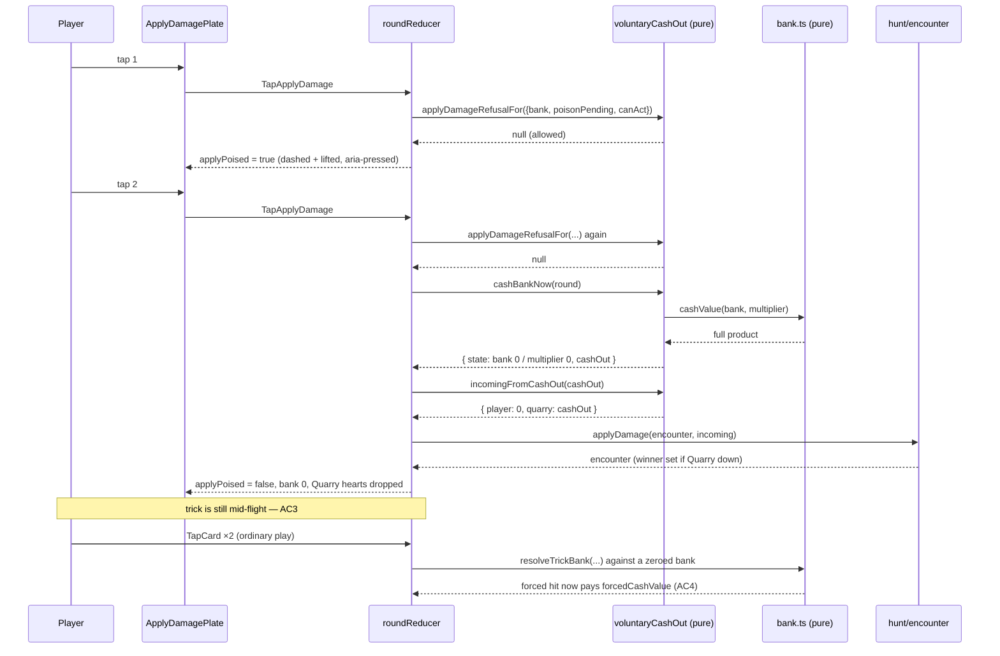

# Plan: Apply Damage — a player-triggered cash-out

Plan folder: `.claude/contract/DLR-94-apply-damage-a-player-triggered-cash-out/`
Execution status: see `tasks.md` in this folder.

---

## Part 1 — Alignment

### Task reference

**DLR-94** — *Apply Damage: a player-triggered cash-out* (Story, under epic **DLR-87** *Shop rebuild: persistence categories, flask, Apply Damage, quick-kill payout*). Labels: `engine`, `playable`.

> ## Problem Statement
>
> Today the bank only ever cashes out when the player is hit, or at the end of the sixth trick — never by choice. Apply Damage adds a pre-card player action that cashes `bank × multiplier` into the Quarry at will, resetting both, with no health cost. To make that a real decision rather than a button with no wrong answer, being hit _before_ choosing to apply now pays only two-thirds of `bank × multiplier` instead of the full amount — so holding a growing bank becomes a bet against being caught first.
>
> ## User Story
>
> As a player, I want to cash in my streak on my own terms instead of only when I'm hit, so that running up a big bank becomes a real press-your-luck decision instead of something the game always does for me at the worst moment.
>
> ## Acceptance Criteria
>
> 1. A new player action is available before playing a card each trick (not after, not mid-trick): "Apply Damage." It is enabled whenever `bank > 0`; with an empty bank it is disabled with a stated reason, consistent with this project's disabled-with-reason convention.
> 2. Choosing Apply Damage cashes the **current** `bank × multiplier` into the Quarry, resets both to zero, and deals **no** damage to the player — a new, third kind of cash-out event distinct from the two `resolveTrickBank` already models, so it needs its own resolution path that shares the underlying "cash bank × multiplier to the Quarry" arithmetic without going through a trick outcome.
> 3. After applying, the trick proceeds normally — the player still plays a card and the trick resolves by the ordinary rules, just against a freshly-zeroed bank/multiplier.
> 4. `resolveTrickBank`'s forced-hit branch changes from paying the full `bank * multiplier` to paying **two-thirds** of it — `Math.floor(bank * multiplier * (2 / 3))` or equivalent, rounding **down** so the Quarry is never overpaid by a rounding artefact. This applies to every forced hit (clean loss and eating a skull alike).
> 5. The end-of-hand cash-out is **unaffected** — it still pays the full `bank * multiplier`. The two-thirds penalty is specifically the "you got caught before you chose to apply" cost.
> 6. `bank.test.ts`'s existing forced-hit assertions need updating to the new two-thirds figure — this is an intentional behaviour change to an existing rule, not a regression to preserve.
> 7. Vitest coverage exists for: the new voluntary apply action's full payout and zero-damage property, the disabled-at-zero-bank state, the two-thirds forced-hit payout including a case where the result is not a whole number, and that the end-of-hand cash-out is untouched.
>
> ## Scope Boundaries
>
> **In scope:** the Apply Damage action, its pre-card availability, the new voluntary cash-out resolution, and the two-thirds forced-hit rule.
> **Out of scope:** any change to who wins a trick, to skull inversion, or to the end-of-hand cash-out's full-payout rule; any UI for previewing what applying now would be worth beyond checking whether the existing banked-streak heart preview (`duelHealthBars.ts` — `projectedFromStreak`) needs updating to reflect the two-thirds change.
>
> ## Dependencies & Risks
>
> No dependency on the shop-rebuild tickets. Risk — shares `bank.ts` with the Whetstone ticket, which changes the taken branch's `bankAdded`; this ticket changes the forced-hit branch's payout fraction — diff `bank.ts` fresh before starting the later one. Risk — the existing banked-streak heart preview currently previews a full cash-out; once forced hits only pay two-thirds, it either needs a second, dimmer preview for the two-thirds figure, or an explicit decision that it continues to show the (now theoretical) full amount — flag at the `/fb-plan` gate rather than choosing silently. This is the largest rules change in the epic — budget review time accordingly.
>
> ## Design Assets
>
> N/A — the new action's button/placement needs a design pass; flag at the `/fb-plan` gate.

**The design source the ticket did not cite, and which this plan treats as binding:** `.docs/design/Balatro-Forbidden-Solitaire/version-4-scope.md` §3 *Apply Damage* — the same feature, with one further decision the AC list omits:

> **D6, decided 2026-08-19, ahead of this control being built: Apply Damage must be disabled while poison is pending.** A player able to cash the bank out on demand while a poison hit is still owed could apply damage to dodge the interaction between the two systems in a way neither was designed to allow for; the control's implementation must read the pending-poison predicate before it commits to anything, not just the two-thirds/one-third split above.

`.docs/game_rules/the-hunt.md` records the same decision as `[not built]` under *"Applying damage cannot be delayed while poison is pending"*, and `src/hunt/encounter.ts`'s `hasPendingEnvenom` docblock names itself as the predicate reserved for exactly this control. This contract is the one that graduates that rule from `[not built]`.

**Whetstone note (DLR-92) is already landed**, not pending: `bank.ts` on disk carries `bankClimbBonus` in `TrickFacts` and `bankAdded = 1 + bonus`. The ticket's "diff `bank.ts` fresh" risk is discharged — this contract is the later of the two.

### Restated goal

Give the player a control they can press before committing a card that banks their streak on their own terms: it deals the full `bank × multiplier` to the Quarry, zeroes both counters, and costs no health. Then make the automatic cash-out worse, so that control is a real choice — a forced hit (a clean loss, an eaten skull, or a poison hit landing on the player) now pays only two-thirds of `bank × multiplier`, floored, while the end-of-hand cash-out and the new voluntary one keep paying the full figure. The result is that a growing bank is a bet: cash it early for certain full value, or push the streak and risk being caught and paid a third less.

### In scope

- A named constant pair in `src/hunt/config.ts` expressing the forced-hit fraction as a numerator and a denominator (2 and 3), and one reader of it.
- `resolveTrickBank`'s forced-hit branch paying `Math.floor((bank * multiplier * 2) / 3)` instead of `bank * multiplier`, for every forced hit — clean loss, skull eaten, and a poison hit that resets the streak.
- The end-of-hand cash-out left paying the full `bank * multiplier`, pinned by a test.
- A new pure module `src/warCouncil/voluntaryCashOut.ts` holding: the voluntary cash-out over `RoundState`, its `IncomingDamage` crossing, an `ApplyDamageRefusal` reason union, and the single `applyDamageRefusalFor` predicate that decides whether the control is live.
- A shared `cashValue(bank, multiplier)` in `bank.ts` that all three cash-outs compute through, plus `forcedCashValue` for the two-thirds one.
- A `RoundUiState` field and two reducer actions (`TapApplyDamage`, `CancelApplyDamage`) implementing the poise-then-commit two-tap grammar the Cheat rail and the Envenom plate already use.
- The reducer path that commits the voluntary cash-out: zero the engine's bank and multiplier, apply the damage to the encounter through `applyDamage`, and leave the trick in progress so the player still plays their card.
- A new `ApplyDamagePlate` component on the felt rail beside `CheatSlots` and `EnvenomCharge`, with its own CSS file, its disabled-with-reason copy, and `Escape` to cancel a poised state.
- `BankMeter` gaining a second figure — what the streak pays if the player is hit before applying.
- Copy for all of the above in `src/app/warCouncil/labels.ts`, and the Apply Damage hints in `roundHint.ts`.
- Refactor: extract the CPU-advance trio out of `roundReducer.ts` into `src/app/warCouncil/quarryAdvance.ts`, because that file is at 390 of its 400-line budget and this ticket adds a handler to it.
- Updating every existing assertion in `bank.test.ts`, `roundReducer.bank.test.ts`, `roundReducer.poison.test.ts` and `BankMeter.test.tsx` that reads a forced-hit payout.
- New Vitest coverage for the voluntary cash-out arithmetic, the refusal predicate, the reducer's commit path, the two-thirds figure including a non-integer case, and the untouched end-of-hand payout.

### Explicitly out of scope

- Any change to who wins a trick, to skull inversion, or to the end-of-hand full-payout rule.
- Any change to `projectedFromStreak` or the at-risk heart preview's arithmetic — the decision recorded below is that it keeps previewing the **full** figure, which is a no-code outcome for `duelHealthBars.ts`.
- A "breaking hearts" beat for the voluntary cash-out. The breaking hearts read off `ui.resolvedTrick`, and a voluntary apply resolves no trick; the hearts simply drop. Adding a second breaking-damage source is its own change.
- Any shop item, price, or persistence-category work from the rest of epic DLR-87.
- The quick-kill payout (version-4-scope §4) — a separate ticket.
- Reworking the `wc-is-waiting` click-to-carry-on affordance on `.wc-table`.
- Any change to `Escape`/roving-tabindex behaviour on the existing rails.

### Pattern Reference

The brief supplied no code references beyond `duelHealthBars.ts` → `projectedFromStreak`. The references chosen, all verified on disk:

- **`src/hunt/flask.ts`** — the disabled-with-reason convention AC1 names: a `FlaskRefusal` `as const` reason union, one `flaskRefusalFor` predicate that both the committing function and the screen read, and no user-facing copy in the pure module. `src/hunt/shop.ts`'s `PurchaseRefusal` / `refusalFor` is the same shape. `ApplyDamageRefusal` / `applyDamageRefusalFor` follows it exactly.
- **`src/app/warCouncil/EnvenomCharge.tsx`** — the felt-rail plate: a `role="group"` wrapper with `onClick` stopping propagation (load-bearing: `.wc-table` fires `handleCarryOn` on click), a single `<button>` carrying `aria-pressed`, an `aria-label` from `labels.ts`, `disabled` from an `interactive` gate, and `Escape` on the wrapper. `ApplyDamagePlate.tsx` mirrors it.
- **`src/app/warCouncil/warCouncilEnvenom.css`** — the plate's visual grammar: form-not-colour state (`:disabled` dashed + dimmed, `.is-poised` dashed brass + lift), `min-height: 2.75rem`, `:focus-visible`, `@media (hover: hover)`, `touch-action: manipulation`. `warCouncilApplyDamage.css` mirrors it.
- **`handleTapEnvenom` / `handleTapCheat` in `roundReducer.ts`** — the poise-then-act two-tap grammar and the `canAct` gate.
- **`src/warCouncil/bank.ts`'s `incomingFrom`** — the single `PlayerSide` → `DuelSide` crossing discipline; the voluntary cash-out gets its own named crossing rather than a hand-assembled record at the call site.
- **`.docs/design/Balatro-Forbidden-Solitaire/version-4-scope.md` §3** for the rule, including D6.
- `react-frontend`/`SKILL.md` and `game-ux`/`SKILL.md` for everything else.

### Constraints flagged on the brief

- **Round down, always.** AC4 is explicit that the Quarry must never be overpaid by a rounding artefact.
- **The end-of-hand cash-out is untouched** (AC5) and must be pinned by a test.
- **`bank.test.ts`'s forced-hit assertions are an intentional behaviour change**, not a regression to preserve (AC6).
- **The voluntary cash-out is a third kind of event**, not a fourth `TrickOutcome` and not a synthetic trick — it must share the arithmetic without going through a trick outcome (AC2).
- **No health cost** to the player on a voluntary apply (AC2).
- **The trick continues** after applying (AC3).
- **Two runtime dependencies only** — nothing here needs a third.
- Beyond the brief: **D6's pending-poison lock-out** is a design decision already taken and must be enforced, not re-decided.

### Assumptions made

- **"Before playing a card each trick (not after, not mid-trick)" means: whenever the player's own card is the next thing to be committed** — so on their lead *and* on their follow to a lead already on the table. Rationale: the reducer already has exactly this predicate (`canAct` / the component's `interactive`), it is what "before playing a card" describes from the player's side, and the stricter lead-only reading would make the control unavailable on half the tricks in a hand for no rule stated anywhere. The stricter reading is a real alternative and is raised in Risks.
- **The two-thirds penalty applies to the whole forced-cash-out branch, including a poison hit that resets the streak.** Rationale: the ticket enumerates "clean loss and eating a skull" but poison reaches the identical `if (trickHit || poisonResets)` branch in `resolveTrickBank`, and the stated rationale — "you got caught before you chose to apply" — is exactly what a poison hit is (the-hunt.md's own note: *"The moment you cannot choose is the whole point"*). Splitting the branch so poison pays full would make poison the *better* way to lose a streak, which inverts the item's design. Raised in Risks as the largest reading in the plan.
- **The at-risk heart preview keeps showing the FULL `bank × multiplier`.** This is the explicit decision the ticket asked for rather than choosing silently, and it means **no change to `projectedFromStreak`**. Rationale: the player can now realise the full figure on demand, so the full figure is what their streak is genuinely worth to them; the two-thirds figure is the penalty for *not* acting, and belongs beside the button that avoids it rather than in the Quarry's heart row. The two-thirds figure is surfaced instead as a second line on `BankMeter` (below). The alternative — a second, dimmer preview — is in Risks.
- **The control uses the poise-then-commit two-tap grammar**, one control, second tap commits (so its state is a single boolean, not a two-stage union). Rationale: the cash-out is irreversible, and both existing consumable controls on the same rail (`CheatSlots`, `EnvenomCharge`) guard a misclick with a poise stage; `game-ux`'s "confirmation belongs on the object being acted on" is satisfied by the second tap landing on the same plate. A single stage rather than `EnvenomStage`'s poised/armed pair because Apply Damage's second tap *is* the action — there is no third tap on a hand card to wait for.
- **`ApplyDamageRefusal` has three reasons** — `EmptyBank`, `PoisonPending`, `NotYourMove` — evaluated in that order, mirroring `flaskRefusalFor`'s "the reason that will still be true next" ordering. Rationale: AC1 names the empty bank; D6 names pending poison; the third exists because the plate stays mounted while the felt is not interactive and must say why rather than going quiet.
- **The plate sits on the felt rail** (`.wc-felt-rail`), third after the Cheat slots and the Envenom plate. Rationale: `game-ux` anchors status and consumables to the edges and away from the play area; the rail is where every other press-this-before-your-card control already lives, so this adds no new zone.
- **The voluntary cash-out does NOT write `round.lastResolution`.** Rationale: `lastResolution` is trick-scoped — `BankMeter` and `TrickWell` both read it as "what the last trick did" — and writing a non-trick event into it would make the felt announce a trick outcome that did not happen.
- **A voluntary apply that kills the Quarry ends the fight through the machinery that already exists.** `applyDamage` sets `winner`, `isEncounterResolved` goes true, `interactive` goes false, and `WarCouncilRound`'s `encounterOver` branch reports upward on the next tap. Rationale: no new terminal path; DLR-82 already made the fight's end a run-level concern.
- **New copy is placeholder copy**, flagged as such in `labels.ts` exactly as every other label in that file is. The wording is the developer's.
- **`roundReducer.ts` is refactored in this ticket rather than allowed to breach 400 lines.** It is at 390; the new handler plus the new action cases cannot fit. The extraction chosen is the CPU-advance trio (`deriveResolvedTrick`, `advanceQuarryFollow`, `advanceQuarryLead`) into `quarryAdvance.ts` — a clean seam mirroring DLR-90's `roundUiState.ts` split, and the block least entangled with the new handler.

### Config and persisted-shape audit

- **`FORCED_CASH_OUT_NUMERATOR` / `FORCED_CASH_OUT_DENOMINATOR`** — `grep -rn "FORCED_CASH_OUT" src/` returns **0 hits**. Both keys are new; nothing to migrate, and there is no dead predecessor. They join `src/hunt/config.ts` beside `DAMAGE_PER_HIT` (line 399), which is the same kind of value — a settled rule figure with a stated unit.
- **`cashOut`** — `grep -rn "cashOut" src/` returns **31 hits across 8 files**: `src/warCouncil/bank.ts`, `src/warCouncil/__tests__/bank.test.ts`, `src/app/warCouncil/__tests__/{BankMeter,TrickWell}.test.tsx`, and `src/app/warCouncil/__tests__/{roundHint,roundReducer,roundReducer.bank,roundReducer.envenom}.test.ts`. The **field is not renamed or retyped** — it stays `readonly cashOut: number` on `TrickResolution` — so no consumer changes shape. What changes is the *value* on the forced-hit branch, so every hit that asserts a forced-hit figure is a test edit. Fixture hits (`cashOut: 0`, `cashOut: 9`, `cashOut: 20` in `roundHint.test.ts`, `roundReducer.envenom.test.ts`, `roundReducer.test.ts`, `BankMeter.test.tsx`, `TrickWell.test.tsx`) are hand-built `TrickResolution` literals that assert nothing about the rule; they compile and pass unchanged, and are deliberately left alone except `BankMeter.test.tsx`, which gains coverage for the new second figure.
- **`cashedAtHandEnd`** — **11 hits**. Unchanged in name, type, and meaning: it is still `handEndCash > 0`, and the end-of-hand branch still computes the full `cashValue`. This is the field that keeps AC5 checkable.
- **`DAMAGE_PER_HIT`** — **26 hits**, all untouched. The voluntary cash-out deals no player damage, so nothing reads it differently.
- **Nothing is persisted.** `grep -rn "localStorage\|sessionStorage\|JSON.parse" src/` returns **0 hits**. There is no save file, no stored log, and no replay to invalidate — so the two-thirds change and the new `RoundUiState` field break no stored record. Recording that the window is still open: any future save format must know that a forced cash-out is fractional and that `applyPoised` is hand-transient and must not be serialised.
- **Type changes are additive only.** `RoundUiState` gains `readonly applyPoised: boolean` (a required field, so every construction site is a compile error rather than an `undefined` — `createRoundUiState` is the only one, plus test fixtures that call it). `RoundUiActionKind` gains two members and `RoundUiAction` two variants; the reducer's `switch` is exhaustive over the union, so a missing case is a compile error. `TrickFacts`, `TrickResolution`, `BankState`, `RoundState` and `PlayCardOptions` are **unchanged**.
- **`RoundUiActionKind` consumers** — `grep -rln "RoundUiActionKind" src/` returns **7 files**: `roundReducer.ts`, `roundUiState.ts`, `WarCouncilRound.tsx`, and four reducer specs. Widening the union is additive, so all seven compile unchanged; the two new kinds are read only by the reducer and by `WarCouncilRound`/`ApplyDamagePlate`.
- **String-bound names introduced.** Two CSS class families (`.wc-apply-rail`, `.wc-apply-plate`, `.is-poised`) written in `warCouncilApplyDamage.css` and nowhere else; the `ApplyDamageRefusal` string values (`emptyBank`, `poisonPending`, `notYourMove`) written in `voluntaryCashOut.ts` and keyed once by `APPLY_DAMAGE_REFUSAL_MESSAGE` in `labels.ts`, which is a total `Record` so a missing case is a compile error. No `data-testid` is introduced — component tests query by role and accessible name, per `react-frontend`.
- **Names align across the chain**: `FORCED_CASH_OUT_NUMERATOR`/`_DENOMINATOR` (config, typed `number`) → `forcedCashValue` in `bank.ts` (its only reader) → `resolveTrickBank`'s forced branch → `TrickResolution.cashOut` → `incomingFrom` → `applyDamage`. No copy quotes the two-thirds figure as a literal number; `BankMeter` computes it from `forcedCashValue`, so the label cannot drift from the constant.
- **The pure-core boundary holds.** `eslint.config.js` enforces no-React/no-DOM on `src/warCouncil/**` and `src/hunt/**`. `voluntaryCashOut.ts` imports only from `./bank`, `./types` and `../hunt` types; it touches no global. The refusal predicate takes plain values (`bank`, `poisonPending`, `canAct`) rather than an `EncounterState` or a `RoundUiState`, so the pure module never learns the app layer's shape — the same discipline `ShopStock` and `FlaskStock` document.

---

## Part 2 — Technical design

### Approach

**Three cash-outs, one arithmetic.** The change starts by naming the arithmetic AC2 says must be shared. `bank.ts` gains `cashValue(bank, multiplier)` — the plain product — and `forcedCashValue(bank, multiplier)`, which is `Math.floor((cashValue(...) * FORCED_CASH_OUT_NUMERATOR) / FORCED_CASH_OUT_DENOMINATOR)`. `resolveTrickBank`'s forced-hit branch calls the second; its end-of-hand branch calls the first; the new voluntary path calls the first. Three call sites, one product, and AC4/AC5's asymmetry is visible in two lines rather than inferred from a comment.

**The fraction is expressed as a numerator over a denominator, not as a float, and this is load-bearing.** `Math.floor(bank * multiplier * (2 / 3))` — the form the AC offers as one option — is wrong for a whole class of inputs: `2/3` is `0.6666666666666666`, so `3 * (2/3)` is `1.9999999999999998` and floors to **1** where the correct answer is 2. A streak of two (`bank 2 × multiplier 2 = 4` → 2) is unaffected, but `bank 1 × multiplier 3 = 3` and every other multiple of 3 is. Multiplying by 2 *before* dividing by 3 keeps the numerator an exact integer through the only division in the file, and `Math.floor` then rounds down as AC4 requires. `forcedCashValue` guards its denominator (a non-positive or non-finite value refuses rather than producing `NaN`) for the reason `web-project.md`'s numeric-safety trap gives: a `NaN` here would reach `applyDamage`, then a heart row, and vanish with nothing logged.

**The voluntary cash-out is its own pure module, not a fourth `TrickOutcome`.** `src/warCouncil/voluntaryCashOut.ts` exports `cashBankNow(state: RoundState)`, returning `{ state, cashOut }` where `state` is the round with `bank` and `multiplier` zeroed and **everything else — including `lastResolution`, `currentTrick`, `phase` and `leader` — untouched**. That is what makes AC3 free: the trick is mid-flight and stays mid-flight, so the player's next tap plays their card through the ordinary `playCard` path against a zeroed bank. Making it a `TrickOutcome` instead would have forced `trickOutcomeFor` to become partial, given every `isTaken` consumer a fifth case, and produced a `TrickResolution` describing a trick that did not happen — which `BankMeter` and `TrickWell` both read as "what the last trick did". Alongside it, `incomingFromCashOut(cashOut)` performs the `PlayerSide` → `DuelSide` crossing in one named place, exactly as `incomingFrom` does for a trick, so no caller hand-assembles an `IncomingDamage` and gets the sides backwards.

**Availability is one predicate, read twice.** `applyDamageRefusalFor({ bank, poisonPending, canAct })` returns an `ApplyDamageRefusal` or `null`, and it is the single statement of whether the control is live — read by the reducer before it commits anything (which is what D6 asks for: *"the control's implementation must read the pending-poison predicate before it commits to anything"*) and by the component to disable the plate and print the reason. This is `flaskRefusalFor` and `refusalFor`'s established shape, and it is the specific defence against the failure mode where a greyed control and a reducer branch drift apart — the same reason `cheatArmed` and `envenomArmed` are exported from `roundUiState.ts`. It takes plain values rather than an `EncounterState`, so the pure module never learns the app layer's shape; `WarCouncilRound` and the reducer both compute `poisonPending` from `hasPendingEnvenom(ui.encounter)`.

**The reducer's commit is three statements and no new machinery.** `handleTapApplyDamage` refuses when `applyDamageRefusalFor` returns a reason; poises when nothing is poised; and on the second tap calls `cashBankNow`, applies `incomingFromCashOut` through `applyDamage` (guarded by `isEncounterResolved`, as `applyResolution` already is), and clears the poise. `resolvedTrick` stays `null`, so no reveal is held and the felt does not enter its waiting state — the player is simply looking at a zeroed `BankMeter` and a shorter Quarry heart row, with their card still to play. Because `roundReducer.ts` is at 390 of 400 lines, the CPU-advance trio (`deriveResolvedTrick`, `advanceQuarryFollow`, `advanceQuarryLead`, plus the `CpuAdvanceResult` interface) moves out to `src/app/warCouncil/quarryAdvance.ts` first, in its own task, so the file that receives the new handler has room. That widen-before-cutting order is what keeps Phase 1's boundary type-checking.

**The screen adds one plate and one figure.** `ApplyDamagePlate.tsx` mirrors `EnvenomCharge.tsx` structurally — `role="group"`, `onClick` stopping propagation so a tap does not also fire `.wc-table`'s `handleCarryOn`, one button, `aria-pressed` for the poised state, `Escape` to cancel, `disabled` driven by the refusal, and the refusal sentence as the plate's accessible description so a player who cannot see the dimming still learns why. One control is far below `game-ux`'s roving-tabindex threshold, so it stays a plain tab stop. `BankMeter` gains one line — what the streak pays if the player is hit before applying, computed through `forcedCashValue` so the copy cannot drift from the constant — because that is precisely the number the new decision needs, and `game-ux` forbids hiding it behind hover. `projectedFromStreak` and the heart rows are deliberately unchanged, per the recorded decision in Assumptions.

### Skills to invoke during execution

- **`react-frontend`** — owns everything under `src/`: the `bank.ts` arithmetic, the new pure module, the config constants, the reducer action and refactor, the new component, and the Vitest posture (pure logic tested without a renderer, components queried by role and accessible name).
- **`game-ux`** — owns the new felt control: its placement on `.wc-felt-rail`, the poise-then-commit tap count, form-not-colour state, the disabled-with-reason sentence being on the face of the control rather than on hover, and `BankMeter` showing what the decision needs.
- **`implementation-doc-writer`** — owns `.docs/implementation/` and `.docs/game_rules/the-hunt.md`. This contract changes a `[settled]` rule (the forced cash-out's amount), adds a new procedure (Apply Damage), and graduates the D6 pending-poison rule from `[not built]`. Invoked by `/fb-apply` at its close; the affected sections are named in `tasks.md`'s Final verification phase so nothing is missed.
- **`game-designer`** — confirmed by the developer at the planning gate, but planning found no open design question for it: version-4-scope §3 settles the two-thirds figure and D6, and the AC list settles the rest. Listed so the execution session knows it was considered; if a reviewer surfaces a balance question, that skill owns it.
- **Rules to Read:** `.claude/rules/` is empty — `Glob .claude/rules/*.md` returned only `README.md`, whose own index says "(empty — no rules written yet)". Re-scan rather than trusting this line.
- **Always:** `.claude/workflow/web-project.md`.

### Diagram



### Data shapes

#### `src/hunt/config.ts` — two new constants

```ts
// version-4-scope §3 / DLR-94 AC4 — a forced cash-out (a hit you did not choose) pays this
// fraction of `bank × multiplier`; a cash-out you CHOSE, and the end-of-hand one, pay in full.
// SETTLED by the design on 2026-08-19; the fraction is two-thirds.
//
// A NUMERATOR AND A DENOMINATOR rather than a single float, deliberately: `2 / 3` is
// 0.6666666666666666, so `3 * (2 / 3)` is 1.9999999999999998 and floors to 1 where the rule says
// 2. Multiplying before dividing keeps the numerator exact. UNIT: dimensionless ratio.
export const FORCED_CASH_OUT_NUMERATOR: number = 2
export const FORCED_CASH_OUT_DENOMINATOR: number = 3
```

Both are exported from `src/hunt/index.ts`'s existing `./config` export block.

#### `src/warCouncil/bank.ts` — two new exports, one changed branch

```ts
/** The figure a streak of `multiplier` tricks over a bank of `bank` is worth, in full. THE one
 *  statement of the product, so the three cash-outs cannot disagree about it. */
export function cashValue(bank: number, multiplier: number): number

/** DLR-94 AC4 — what a FORCED cash-out pays: `cashValue` reduced to the configured fraction and
 *  floored, so the Quarry is never overpaid by a rounding artefact. */
export function forcedCashValue(bank: number, multiplier: number): number
```

`TrickResolution`, `TrickFacts`, `BankState`, `TrickOutcome`, `isTaken`, `trickOutcomeFor` and `incomingFrom` are **unchanged in name, shape and type**. Inside `resolveTrickBank`: the forced branch's `cashOut = bank * multiplier` becomes `cashOut = forcedCashValue(bank, multiplier)`; `const handEndCash = trick.finalTrick ? bank * multiplier : 0` becomes `trick.finalTrick ? cashValue(bank, multiplier) : 0`.

#### `src/warCouncil/voluntaryCashOut.ts` — new file

```ts
/** DLR-94 AC1 — why Apply Damage cannot be pressed. A reason CODE, not a sentence: `src/warCouncil/`
 *  holds no user-facing copy. `src/hunt/flask.ts`'s `FlaskRefusal` exactly. */
export const ApplyDamageRefusal = {
  EmptyBank: 'emptyBank',
  PoisonPending: 'poisonPending',
  NotYourMove: 'notYourMove',
} as const
export type ApplyDamageRefusal = (typeof ApplyDamageRefusal)[keyof typeof ApplyDamageRefusal]

/** Everything the rule needs and nothing else — plain values, never an `EncounterState` or a
 *  `RoundUiState`: this module must not learn the app layer's shape. `FlaskStock`'s discipline. */
export interface ApplyDamageStock {
  readonly bank: number
  readonly multiplier: number
  /** D6 (version-4-scope §3) — a poison hit is owed to either side. */
  readonly poisonPending: boolean
  /** The felt's own gate: the player's card is the next thing to be committed. */
  readonly canAct: boolean
}

/** THE single statement of whether Apply Damage is available, read by the reducer before it commits
 *  and by the plate to disable itself and print the reason. */
export function applyDamageRefusalFor(stock: ApplyDamageStock): ApplyDamageRefusal | null

/** AC2 — the round with bank and multiplier zeroed, and what that cost the Quarry. Everything else
 *  on the state — `lastResolution`, `currentTrick`, `phase`, `leader` — is carried through
 *  untouched, which is what makes AC3's "the trick proceeds normally" a no-op rather than a rule. */
export interface VoluntaryCashOut {
  readonly state: RoundState
  readonly cashOut: number
}
export function cashBankNow(state: RoundState): VoluntaryCashOut

/** The `PlayerSide` -> `DuelSide` crossing for a voluntary cash-out, in one named place for the
 *  reason `incomingFrom`'s docblock gives. The player takes nothing: AC2. */
export function incomingFromCashOut(cashOut: number): IncomingDamage
```

Refusal order: `NotYourMove` → `PoisonPending` → `EmptyBank`. The move gate first because it is true of the whole felt rather than of this control; poison before the bank because D6's lock-out is the reason that will still be true after the next trick banks.

#### `src/warCouncil/index.ts` — barrel additions

```ts
export { cashValue, forcedCashValue } from './bank'
export {
  ApplyDamageRefusal,
  applyDamageRefusalFor,
  cashBankNow,
  incomingFromCashOut,
} from './voluntaryCashOut'
export type { ApplyDamageStock, VoluntaryCashOut } from './voluntaryCashOut'
```

#### `src/app/warCouncil/roundUiState.ts` — one field, two actions

```ts
export interface RoundUiState {
  // …existing fields unchanged…
  /** DLR-94 — the Apply Damage plate has been tapped once and awaits its confirming second tap.
   *  The hand's OWN transient: dies on remount, never touches `RunState`. A single BOOLEAN rather
   *  than `EnvenomStage`'s two-stage union, because Apply Damage's second tap IS the action —
   *  there is no third tap on a hand card to wait for. */
  readonly applyPoised: boolean
}

export const RoundUiActionKind = {
  // …existing kinds unchanged…
  TapApplyDamage: 'tapApplyDamage',
  CancelApplyDamage: 'cancelApplyDamage',
} as const

export type RoundUiAction =
  // …existing variants unchanged…
  | { readonly kind: typeof RoundUiActionKind.TapApplyDamage }
  | { readonly kind: typeof RoundUiActionKind.CancelApplyDamage }
```

`createRoundUiState` seeds `applyPoised: false`. `RoundUiSeed` is **unchanged** — nothing about the control is run state.

#### `src/app/warCouncil/quarryAdvance.ts` — new file, moved code only

```ts
export interface CpuAdvanceResult {
  readonly round: WarCouncilState
  readonly resolvedTrick: ResolvedTrick | null
  readonly cpuFault: CpuFault | null
}
export function deriveResolvedTrick(
  before: WarCouncilState,
  after: WarCouncilState,
  playedCard: TrickCard,
): ResolvedTrick | null
export function advanceQuarryFollow(
  round: WarCouncilState,
  options: PlayCardOptions,
): CpuAdvanceResult
export function advanceQuarryLead(round: WarCouncilState): CpuAdvanceResult
```

Bodies and docblocks move verbatim from `roundReducer.ts`. No behaviour change.

#### `src/app/warCouncil/ApplyDamagePlate.tsx` — new component

```ts
interface ApplyDamagePlateProps {
  /** The figure applying now would deal, for the plate's own readout. */
  readonly cashValue: number
  readonly poised: boolean
  /** `null` when the control is live; otherwise the reason it is not. */
  readonly refusal: ApplyDamageRefusal | null
  readonly onTap: () => void
  readonly onCancel: () => void
}
export default function ApplyDamagePlate(props: ApplyDamagePlateProps): JSX.Element
```

#### `src/app/warCouncil/labels.ts` — new copy

```ts
export const APPLY_DAMAGE_RAIL_LABEL = 'Apply'
export const APPLY_DAMAGE_POISED_HINT = 'Tap Apply again to cash your streak'
export const APPLY_DAMAGE_REFUSAL_MESSAGE: Readonly<Record<ApplyDamageRefusal, string>>
/** The plate's accessible name — the four readings (live, poised, and each refusal) MUST differ:
 *  `getByRole('button', { name })` is how the spec tells them apart. */
export function applyDamageAccessibleName(
  cashValue: number,
  poised: boolean,
  refusal: ApplyDamageRefusal | null,
): string
```

All placeholder copy, as every other label in that file is.

#### `src/app/warCouncil/BankMeter.tsx` — one added figure

`cash` stays `bank * multiplier` (via `cashValue`); a new `forced = forcedCashValue(bank, multiplier)` renders as a second line and is folded into the existing `wc-bank-figures` `aria-label`. Props are **unchanged**.

#### No other contract changes

`PlayCardOptions`, `RoundState`, `TrickResolution`, `EncounterState`, `HealthBarView`, `projectedFromStreak`, `package.json`, `tsconfig.json`, `vite.config.ts` and `eslint.config.js` are all untouched. No new dependency.

### Runtime quality notes

- **Purity and adjudication.** Every rule this ticket adds lives in `src/warCouncil/` or `src/hunt/config.ts` — `cashValue`, `forcedCashValue`, `cashBankNow`, `incomingFromCashOut`, `applyDamageRefusalFor`. `ApplyDamagePlate` decides nothing: it renders a figure it is given and a refusal it is given, and calls back. The reducer decides nothing either — it asks `applyDamageRefusalFor` and obeys, which is what stops the plate's disabled state and the reducer's guard from drifting. Both new numbers are read from `src/hunt/config.ts`; no `2`, `3`, or `0.666` appears anywhere in `src/warCouncil/` or `src/app/`. The `1` in `bankAdded = 1 + bonus` stays a literal for the reason its existing comment gives — 1 is what counting a trick means.
- **Effects, mount and teardown.** **No effect is added anywhere.** `WarCouncilRound` has none today and gains none; `ApplyDamagePlate` is a pure render over props with two callbacks, exactly as `EnvenomCharge` is. No listener, observer, timer, `requestAnimationFrame` or `AbortController` is created, so there is no cleanup to write and nothing to leak or double-fire. `Escape` is handled by an `onKeyDown` prop on the plate's own wrapper — a React synthetic handler, not an `addEventListener`, so it is torn down with the element. `createRoundUiState` stays a pure restructuring of its seed (the new field is a literal `false`), so StrictMode's double-invocation of the lazy `useReducer` initialiser recomputes an identical value. No module-level mutable state is introduced in any new or edited file. On a second mount `applyPoised` is `false` again, which is correct: a poise is a hand-transient.
- **Hot-path cost.** There is no pointer-move or per-frame path here — the plate fires on discrete taps, at most twice per trick. `applyDamageRefusalFor` is four comparisons over four numbers and booleans and allocates one small object per render in `WarCouncilRound`; `forcedCashValue` is one multiply, one divide, one floor. Nothing scans a collection, nothing is memoised, and no profiling evidence exists that would justify memoising it (`react-frontend`'s NEVER). The reducer's commit path allocates one new `RoundState` and one new `EncounterState`, matching what every other action already does.
- **Determinism and numeric safety.** `Math.random()` is unreachable from everything this ticket adds — `cashBankNow` and both value functions are total over their integer inputs, and the shuffle's seeding is untouched. **There is exactly one division introduced in the whole change**, by `FORCED_CASH_OUT_DENOMINATOR`, and `forcedCashValue` guards it: a non-finite or non-positive denominator throws a `RangeError` naming the value rather than returning `NaN`, matching `flaskHealAmount` and `duelHealthBars`' guards. The numerator is multiplied in before the divide so it is an exact integer at the division, which is what makes `Math.floor` correct on every multiple of 3 (the float form gets 3, 6, 9, … wrong by one). `forcedCashValue` also floors a non-finite or negative `bank`/`multiplier` to 0 rather than propagating it, for the reason `bankAdded`'s own guard states: this figure feeds damage, then a rendered heart row, and a `NaN` there vanishes with nothing logged. No epsilon is needed — every value in this arithmetic is an integer.
- **Error paths.** `applyDamage` already throws on an encounter that is already resolved, so the reducer checks `isEncounterResolved` before calling it, exactly as `applyResolution` does — a resolved encounter makes `canAct` false anyway, so this is a guard rather than a live path. A refused tap returns state **unchanged and un-poised**: the reducer never half-applies, and the reason is already on the plate's face, so the player is never left with an inert control and no visible cause. Nothing is caught and turned into a success shape, and there is no `catch` anywhere in the change. No async surface is introduced, so the four async states do not arise. The reducer never throws — a throw inside a reducer during an event handler unmounts the tree, which is why every new branch guards rather than asserting.

### Risks and judgement calls

- **Does the two-thirds penalty apply to a poison hit?** The plan says yes (same branch, same rationale, and paying full would make poison the cheapest way to lose a streak). The ticket enumerates only "clean loss and eating a skull". If the answer is no, `resolveTrickBank`'s single `if (trickHit || poisonResets)` branch must split into two cash-out figures and the poison specs in `bank.test.ts` keep their current numbers. **This is the largest reading in the plan and the one to check first.**
- **Is Apply Damage available when following a lead, or only when leading?** The plan says whenever the player's card is next to be committed (both). The stricter lead-only reading is defensible — deciding before you see their lead is a purer bet — and would be a one-line change to the refusal predicate (`currentTrick.length === 0`) plus a fourth refusal reason. It halves how often the control is reachable.
- **The at-risk heart preview keeps showing the full figure.** This is the decision the ticket explicitly asked for. The alternative is a second, dimmer preview of the two-thirds figure inside `projectedFromStreak`'s output, which means widening `HealthBarView` with a third segment and a third `HeartState` — a materially larger change than this ticket's scope, and one that puts two competing numbers on the Quarry's bar at once. The two-thirds figure is surfaced on `BankMeter` instead. If the developer wants it on the hearts, that is a follow-up ticket.
- **Two taps or one?** The plan mirrors the rail's existing poise-then-commit grammar because the cash-out is irreversible. One tap is faster and Apply Damage is not a per-trick reflex, so the tap cost barely compounds — but a misclick permanently spends a streak. Judgement call; only felt by playing.
- **`FORCED_CASH_OUT_NUMERATOR` / `_DENOMINATOR` as two keys.** Correct and unambiguous, but two constants for one concept. The alternatives — a single float (arithmetically wrong, see Approach) or a tuple `[2, 3]` (less idiomatic here) — are both worse. Worth a look at the gate since it sets the pattern for any future fractional rule.
- **The two-thirds figure itself is settled, not open.** version-4-scope §3 and the ticket both state it; this plan invents no tuning value. If the developer wants a different fraction, the constants are the one place to change it and no test hard-codes the numbers independently of them — but the *tests* do assert derived figures (6 from 9, and so on), so retuning is a test edit as well as a config edit.
- **New copy is placeholder.** `APPLY_DAMAGE_RAIL_LABEL`, the poised hint, the three refusal sentences, the accessible name's wording, and `BankMeter`'s new line are all the developer's to write. Nothing about the rule depends on them.
- **Layout of a third plate on the felt rail.** `.wc-felt-rail` currently holds the decree pile, a split, the Cheat slots and the Envenom plate. A third plate may crowd it at a short viewport. `game-ux` forbids inventing size bounds; the mockup shows the intended arrangement and QA will check no-scroll at named viewport sizes, but whether it *reads* as crowded is the developer's eye.
- **No breaking-hearts beat on a voluntary apply.** The Quarry's hearts drop with no intermediate "breaking" frame, because that frame reads off `ui.resolvedTrick` and a voluntary apply resolves no trick. Functionally correct, possibly abrupt — judge by playing.
- **`roundReducer.ts`'s refactor is in-ticket.** Extracting the CPU-advance trio is a pure move with no behaviour change, but it touches the file every reducer spec exercises. If the extraction turns out to be the wrong seam, the alternative is extracting the Envenom handlers instead — say so at the gate rather than mid-phase.
- **`the-hunt.md` has a `[settled]` rule to change, not add.** *"Taking damage — a clean loss, or eating a skull"* currently states the cash-out pays `bank × multiplier` outright; the poison section states it too. Both change, the D6 note graduates out of `[not built]`, and a new Apply Damage section joins section 7 in playing order. That is `implementation-doc-writer`'s work at `/fb-apply`'s close, flagged here because a rules doc stating a stale number is worse than one omitting it.
