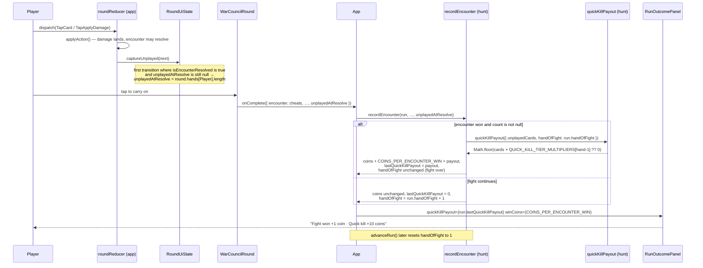

# Plan: Quick-kill payout (DLR-95)

Plan folder: `.claude/contract/DLR-95-quick-kill-payout/`
Execution status: see `tasks.md` in this folder.

---

## Part 1 — Alignment

*(The shared understanding of what this task is doing. Restate it in your own words — this is how the developer confirms you read the brief correctly before any design happens. Mismatch here = stop and fix.)*

### Task reference

**Jira:** [DLR-95 — Quick-kill payout](https://amazerbeam.atlassian.net/browse/DLR-95) · Story · labels `engine`, `playable` · parent epic DLR-87 (*Shop rebuild: persistence categories, flask, Apply Damage, quick-kill payout*).

**Problem statement (verbatim):** "Winning a fight currently pays a flat 1 coin regardless of how it was won. Quick-kill payout rewards ending a fight fast: 1 coin per card left unplayed in the player's hand at the moment the Quarry's health reaches zero, scaled by which hand of the *fight* (not the run) the kill happened in."

**Acceptance criteria (verbatim):**

1. A new payout is credited alongside the existing `COINS_PER_ENCOUNTER_WIN` (both apply — the design doc's worked example, "a first-hand, one-trick kill with five cards left pays 10 coins," is the quick-kill payout alone; confirm with the developer whether the flat win coin stacks on top or is superseded, since the design doc's Definition-of-Done doesn't say which — do not assume additive without flagging it).
2. The payout is `unplayedCards × tierMultiplier`, where `unplayedCards` is how many cards remain in the player's hand at the instant the Quarry's health reaches zero, and `tierMultiplier` is `2` in the fight's first hand, `1` in the second, `0.5` in the third, `0` from the fourth hand on.
3. "Which hand of the fight" requires new state: the existing `hand` counter in `App.tsx` is **run-global** (it never resets between encounters) and cannot answer this question as-is. Add a hand-within-encounter counter that resets to 1 whenever a new encounter starts, distinct from the existing run-global one used for dealer alternation — do not repurpose the existing counter.
4. Because `tierMultiplier` can be `0.5`, the raw payout can be fractional. `Coins` is documented as "a whole number... never fractional" (`src/hunt/types.ts`) — round down (`Math.floor`) before crediting, so the Quarry is never underpriced by a rounding artefact in the player's favour.
5. A kill on the fourth hand or later of a fight pays exactly 0 from this mechanic — a deliberate taper, not a bug, per the design doc ("to avoid a hard cliff a player learns to resent").
6. The payout is visible on the verdict screen when it fires (a nonzero quick-kill payout shown distinctly from the flat win coin, if AC1 resolves as additive) — a coin reward a player cannot see the reason for reads as arbitrary.
7. Vitest coverage exists for: the design doc's own worked example (first hand, one trick taken, five cards left → 10 coins) as a pinned regression test, each tier's multiplier, the zero-payout tier, and the fractional-rounding case.

**Scope boundaries (verbatim):** *In scope:* the hand-within-encounter counter, the unplayed-card count at the win instant, the tiered payout calculation, its crediting in `recordEncounter`, and its display on the verdict. *Out of scope:* any change to the flat per-win coin's own value; overkill/surplus-damage-as-currency (explicitly not built and out of scope per `the-hunt.md` §10 — a distinct mechanic from this one).

**Specification cited, not restated:** `.docs/design/Balatro-Forbidden-Solitaire/version-4-scope.md` §4 owns the tier curve, its taper rationale, and the worked example. `§1` of the same doc owns `WHETSTONE_PRICE`'s sizing against this payout.

**Developer decisions confirmed interactively, 2026-08-20:**

- **AC1 resolved as ADDITIVE.** A won fight pays `COINS_PER_ENCOUNTER_WIN` **plus** the quick-kill payout. Rationale the developer selected: the taper to `×0` at hand four must not make winning a long fight pay literally nothing, and the flat coin is what guarantees that floor. This closes the ticket's one flagged open question — it is no longer an assumption.
- **Skills confirmed:** `react-frontend`, `game-ux`, `game-designer`.

### Restated goal

Beating a Quarry should pay more when you beat them fast. On top of the flat coin a win already pays, credit one coin for every card still sitting unplayed in the player's hand at the instant the Quarry's bar empties, multiplied by a tier that depends on which hand *of that fight* the kill landed in — doubled in the first hand, unchanged in the second, halved in the third, and nothing from the fourth on. Doing that needs three things the code does not have: a counter that knows which hand of the current fight is being played (the existing one counts hands across the whole run and never resets), a snapshot of the player's hand size taken at the exact reducer transition where the encounter resolves, and a pure payout function that floors the fractional third tier before it ever reaches `Coins`. The credit is made in `recordEncounter`, the one place a fight is already known to have been won, and the verdict screen names what it paid so the coins do not appear from nowhere.

### In scope

- A new pure module `src/hunt/quickKill.ts` holding the `QuickKill` shape, the tier lookup, and `quickKillPayout` — with `Math.floor` applied there and nowhere else.
- A new configuration key `QUICK_KILL_TIER_MULTIPLIERS` in `src/hunt/config.ts` holding the transcribed `[2, 1, 0.5]` curve, with "beyond the array pays 0" as the taper.
- `RunState.handOfFight` — the hand-within-encounter counter (1-based), seeded by `startRun`, advanced by `recordEncounter` when the fight continues, and reset to 1 by `advanceRun`. The existing run-global `hand` in `App.tsx` is left completely untouched.
- `RunState.lastQuickKillPayout` — the receipt the verdict renders, written on every `recordEncounter`.
- `RoundUiState.unplayedAtResolve` — the player's hand size captured once, at the reducer transition where the encounter first becomes resolved, carried up through `WarCouncilRoundResult`.
- A sixth parameter on `recordEncounter` carrying that count, and additive crediting of `COINS_PER_ENCOUNTER_WIN + quickKillPayout(...)` on a won encounter.
- A reward line on `RunOutcomePanel` naming the flat coin and the quick-kill payout separately, with its copy in `runLabels.ts` and its style in `run.css`.
- Vitest coverage for AC7's four named cases plus the counter's reset behaviour, the additive credit, and the component-level "hand size at the kill instant" capture.
- Splitting `src/hunt/__tests__/run.test.ts` (currently 397 lines) so the 31 mechanical call-site edits below do not push it past the blocking 400-line budget.

### Explicitly out of scope

- Changing `COINS_PER_ENCOUNTER_WIN`'s value, or any other price or payout key.
- Overkill / surplus-damage-as-currency (`the-hunt.md` §10) — a different mechanic that this ticket explicitly excludes.
- Any change to how a hand is dealt, to `dealerForRound`'s parity, or to the run-global `hand` remount key.
- Re-pricing `WHETSTONE_PRICE` in light of the new income — the epic sizes it against this payout already, and re-tuning it is a play-session decision, not this ticket's.
- Persisting coins or the counter across runs — `RunState` is documented as never persisted, and this plan does not change that.
- Rendering the *reason* breakdown in full (how many cards were left, which hand it was) — see Risks; the reward line names the mechanic, not its arithmetic.

### Pattern Reference

The brief names `src/hunt/types.ts` (for `Coins` being whole), `src/hunt/runTransitions.ts` (`recordEncounter`), `src/App.tsx` (the run-global `hand`), `src/hunt/encounter.ts` (`applyDamage` has no notion of either side's hand), and `src/app/warCouncil/roundReducer.ts` (where `applyDamage`/`resolveWinner` fire). All are treated as authoritative.

Chosen references where the brief supplied none:

- **`src/hunt/flask.ts`** — the shape for a new small pure module in `src/hunt/`: a `*Stock`-style input interface, one exported rule function, `RangeError` guards on non-finite input rather than returning `NaN`.
- **`src/hunt/runTransitions.ts` → `flaskAfter` / `guardAfter`** — the shape for a named private helper stating one run-level rule, rather than an inline ternary in `recordEncounter`.
- **`src/hunt/__tests__/run.flask.test.ts` and `run.whetstone.test.ts`** — the naming and shape for a per-feature sibling spec beside `run.test.ts`.
- **`src/app/warCouncil/roundUiState.ts` → `openingEncounter`** — the precedent for a value frozen once inside `RoundUiState` rather than re-derived from a prop that goes stale.
- **`src/app/run/RunOutcomePanel.tsx` + `runLabels.ts`** — the panel computes nothing and every string lives in the labels module.

### Constraints flagged on the brief

- **`Coins` must stay whole** (`src/hunt/types.ts`). `Math.floor` before crediting, so the rounding artefact never favours the player (AC4).
- **`applyDamage` must not learn about hands.** `src/hunt/encounter.ts` has no notion of either side's hand and the brief says so explicitly; the count is captured in the app-layer reducer, which is the only place that holds both the encounter and the round.
- **The run-global `hand` counter must not be repurposed** (AC3) — it is the React remount `key` and feeds `dealerForRound`'s parity.
- **The pure-core boundary holds.** `src/hunt/**` and `src/warCouncil/**` are lint-enforced React-free and DOM-free (`eslint.config.js`); `quickKill.ts` lands inside that boundary and imports nothing but `./config` and `./types`.
- **The 400-line file budget is blocking** and `src/hunt/__tests__/run.test.ts` is already at 397 — measured with `(Get-Content <path>).Count`, per `web-project.md`, not `Measure-Object -Line`.
- **Two runtime dependencies only.** Nothing here adds one.

### Assumptions made

- **The count is the player's hand length *after* the killing trick's card has left it.** `playCard` removes the played card from `hands[side]` before the trick resolves, so at the resolving transition a first-trick kill leaves 5 of `HAND_SIZE` 6. That is exactly what makes the design doc's worked example arithmetic (5 × 2 = 10) come out right, so it is the reading the specification itself confirms rather than a free choice. *Confirmed by arithmetic against `version-4-scope.md` §4.*
- **The counter lives on `RunState`, not in `App.tsx`.** AC3 requires the counter reset "whenever a new encounter starts"; `advanceRun` and `startRun` are the two functions that start one, so putting it there makes the reset structural instead of something the driver must remember. It also removes the need to thread `handOfFight` through `recordEncounter` as a parameter — the transition reads it off the run it was handed.
- **`recordEncounter` advances the counter itself.** `App.handleComplete` calls it once per hand, resolved or not, so "the fight continues → the next hand is n+1" is a rule the same transition can own. No new transition and no new driver responsibility.
- **The captured count is `number | null`, not a defaulted `0`.** A hand that did not resolve the encounter genuinely has no such figure, and a fake zero on a paying path is the kind of value that reads correctly and pays wrong.
- **The new `recordEncounter` parameter is required, not optional.** This project's stated idiom is "REQUIRED so the compiler enumerates every call site"; a defaulted `null` would silently pay 0 forever if a future driver forgot it. The cost is 31 mechanical test-call edits, which is the point of the enumeration.
- **The tier multiplier IS the coins-per-card rate.** `[2, 1, 0.5]` is stated as coins per unplayed card, so the design doc's "1 coin per card" base rate is the second-hand tier rather than a separate `QUICK_KILL_COINS_PER_CARD` key. One key rather than two, because two numbers that must multiply to the documented figure is the pair that drifts.
- **`lastQuickKillPayout` is written on every `recordEncounter`, including a loss (as `0`).** A field written only on a win is a field that shows the previous fight's payout on the next verdict.
- **The verdict's reward line renders on any non-lost outcome**, not gated on `canContinue` — the final fight of a won run pays a quick kill too, and `canContinue` is false there.
- **Splitting `run.test.ts` moves the two shop-related describe blocks** (`buyFromShop`, `shopStockFor`) into a new `run.shop.test.ts`, following the existing `run.flask.test.ts` / `run.whetstone.test.ts` sibling convention. That is the largest self-contained cut and leaves the file comfortably under budget.

### Config and persisted-shape audit

- **`recordEncounter` — 33 call sites in `src/`.** Exactly **1 is production** (`src/App.tsx:handleComplete`); **31 are in tests** across five files — `run.test.ts` (21), `run.flask.test.ts` (4), `envenom.test.ts` (3), `poisonGuard.test.ts` (3), `run.whetstone.test.ts` (1). The remaining hit is the re-export in `src/hunt/index.ts`. Every one of the 31 gets the new sixth argument in the same task; the export line in `run.ts` and the barrel need no change (the name is unchanged).
- **`COINS_PER_ENCOUNTER_WIN` — 15 hits across `src/` and `.docs/`**, in `config.ts` (declaration), `index.ts` (barrel), `runTransitions.ts` (the one reader), `config.test.ts` and `run.test.ts`. **Its value and its type are unchanged by this plan** — the new payout is added beside it in the same expression, so no reader breaks.
- **`WarCouncilRoundResult` — 11 hits**, in `warCouncilMount.ts` (declaration), `src/app/index.ts` (re-export), `src/App.tsx` (the consumer), `runTransitions.ts` (a docblock mention). The two literal construction sites are both `onComplete({ … })` calls inside `WarCouncilRound.tsx`; the five component test files pass `onComplete` as a `vi.fn()` **prop** and never build a result object, so widening the interface touches exactly those two literals.
- **Nothing is persisted, anywhere.** `localStorage` / `sessionStorage` / `indexedDB` — **0 hits across `src/`**. `RunState`'s own docblocks state repeatedly that `coins`, `envenomCharges`, `poisonGuardHeld`, `whetstones` and `flaskCharges` are NEVER persisted. Adding `handOfFight` and `lastQuickKillPayout` therefore invalidates no stored record and needs no migration. **Recording explicitly that this window is still open**: the first ticket that persists a run will have to version this shape, and it will be adding versioning to a `RunState` that by then carries seven run-level fields.
- **No string-bound surface is renamed.** `data-testid` — **0 hits across `src/`**; component tests query by role and label only. One new CSS class (`.run-reward`) is created, not renamed, and its single consumer is created in the same task.
- **`quickKill` / `QUICK_KILL` / `handOfFight` / `unplayed` — 1 hit total across `src/`**, and it is the word "unplayed" inside an unrelated test name in `WarCouncilRound.envenom.test.tsx:73` ("leaves the trick unplayed once armed"). Every identifier this plan introduces is new; none collides.
- **Type changes are additive only.** Two new required fields on `RunState` (both `number`), one new required field on `RoundUiState` and on `WarCouncilRoundResult` (both `number | null`), two new required props on `RunOutcomePanel` (both `Coins`). No field changes type, none becomes optional, and no union widens — so no `switch` grows a case. `startRun` is the single constructor of `RunState` (51 `startRun(` hits across `src/`, all of which get both new fields for free), and `RunOutcomePanel.test.tsx` builds its props from one shared `baseProps` object, so the two new props are added once there.
- **The architectural boundary is not crossed.** `quickKill.ts` sits under `src/hunt/**`, which `eslint.config.js` already restricts to React-free, DOM-free code. It imports `./config` and `./types` only, and the count it consumes arrives as a plain `number` — `src/hunt/` never learns what a hand of cards is, exactly as `bankClimbBonusFor` hands the card layer a plain number rather than a `RunState`.
- **`src/hunt/__tests__/run.test.ts` is at 397 of 400 lines.** Appending a sixth argument to its 21 call sites — 17 of which Prettier formats multi-line — adds roughly 17 lines and would breach the blocking budget. The plan splits the file in the same phase rather than handing the breach back.

---

## Part 2 — Technical design

### Approach

The payout rule itself is pure arithmetic over two integers, so it goes in a new `src/hunt/quickKill.ts` beside `flask.ts` and `shop.ts` — a `QuickKill` input interface, a `quickKillTierMultiplier(handOfFight)` lookup into the configured `[2, 1, 0.5]` curve that returns `0` past the array's end, and a `quickKillPayout(kill)` that multiplies and floors. `Math.floor` lives there and nowhere else, so AC4's whole-`Coins` guarantee is enforced at one expression rather than at whichever caller happens to remember. The guards follow `flaskHealAmount`'s precedent exactly: a non-finite or negative `unplayedCards`, or a `handOfFight` that is not a positive integer, throws a `RangeError` rather than producing a `NaN` that would land in `coins` and vanish from the purse with nothing logged — the numeric-safety trap `web-project.md` names. The float arithmetic is safe without the two-constant treatment `FORCED_CASH_OUT_*` needed: `2`, `1` and `0.5` are all exactly representable in binary, so `unplayedCards × multiplier` is exact for every tier and `Math.floor` only ever removes a real `.5`.

The two pieces of state each go where the rule that resets them already lives. **`handOfFight` goes on `RunState`**, not in `App.tsx`, because AC3's requirement is a reset "whenever a new encounter starts" and `startRun` and `advanceRun` are exactly the two functions that start one — putting the counter there makes the reset structural rather than something the driver has to remember, and it means `recordEncounter` reads the hand number off the run it was handed instead of taking it as a second new parameter. `recordEncounter` also advances it: `App.handleComplete` calls that transition once per hand whether or not the fight ended, so "the fight continues, therefore the next hand is n+1" is a rule the same transition can own, stated in a named private helper (`handOfFightAfter`) following `guardAfter` and `flaskAfter`'s established precedent. The run-global `hand` in `App.tsx` is not touched at all — it stays the remount `key` and the `dealerForRound` parity source, exactly as AC3 requires. The alternative considered and rejected was a second `useState` in `App.tsx` beside `hand`: it works, but it puts the reset in three separate callbacks (`leaveForNextFight`, `handleNewRun`, and the continuation branch of `handleComplete`) and the fourth caller added later is the one that forgets.

**The unplayed count is captured in the app-layer reducer**, because that is the only place that holds both the encounter and the round — `src/hunt/`'s `applyDamage` genuinely has no notion of either side's hand, as the brief says. Rather than adding the capture at each of the three sites where the encounter can become resolved (`handleTapApplyDamage`, and `commit`'s two `applyResolution` calls), `roundReducer` is restructured into a thin wrapper: the existing `switch` becomes a private `applyAction`, and the exported reducer runs its result through `captureUnplayed`, which sets `unplayedAtResolve` exactly once — the first transition after which `isEncounterResolved` is true and the field is still `null`. One statement, one site, and a fourth way to resolve an encounter added later is covered for free. The field is deliberately *not* derived at `onComplete` time from the live hand length: that happens to give the same answer today only because `canAct` goes false once the encounter resolves, and a design whose correctness depends on an unrelated predicate staying false is a design that breaks silently. Freezing the figure at the transition is the same reasoning `openingEncounter` already documents in `roundUiState.ts`. It rides up through `WarCouncilRoundResult.unplayedAtResolve` as `number | null` — `null` meaning "this hand did not end the fight" — and `App` passes it straight into `recordEncounter`'s new sixth parameter without inspecting it, so the driver stays free of the rule.

**Crediting is additive in one expression** inside `recordEncounter`: `run.coins + COINS_PER_ENCOUNTER_WIN + quickKill`, guarded by the `wonThisEncounter` flag that function already computes. The payout is also written to `RunState.lastQuickKillPayout` — on every call, `0` included — so the verdict renders a figure the run itself recorded rather than recomputing the rule a second time from figures `App` would have to hold in parallel state. That receipt is what `RunOutcomePanel` renders as a new reward line, worded by a new `rewardText(winCoins, quickKillPayout)` in `runLabels.ts` and shown on any non-lost outcome. `game-ux`'s floor applies but is cheap here: the line is one more `<p>` inside an existing centred verdict column that already sizes everything with `clamp()`, it adds no interactive control and therefore no tap cost or tab stop, and it is distinguishable without colour because the words themselves differ. `RunOutcomePanel` keeps computing nothing.

### Skills to invoke during execution

- **`react-frontend`** — owns every file under `src/`: the new pure `quickKill.ts`, the `RunState` and `RoundUiState` shape changes, the reducer restructuring, the `App.tsx` wiring, the panel prop, and the Vitest placement (`node` project for `.test.ts`, `dom` for `.test.tsx`). It also owns the blocking 400-line budget that forces the `run.test.ts` split.
- **`game-ux`** — owns the verdict screen's new reward line: where it sits in the zone, that it reads without colour, and that it adds no interaction cost. AC6's "a player must see the reason" is its call.
- **`game-designer`** — confirmed by the developer. Owns the tier curve's design reading. The curve itself is settled in `version-4-scope.md` §4 ("Confirmed as final"), so its role here is to sanity-check that the additive AC1 resolution does not break the economy the epic sized `WHETSTONE_PRICE` against, and to note the arithmetic in the implementation doc — not to re-open the curve.

Rules the executor must Read: `.claude/rules/` — **scanned, and it is empty** (`README.md` only, index empty). Re-scan rather than trusting this line; a rule added after this plan was written still binds.
Always read: `.claude/workflow/web-project.md`.

No developer override was applied to the skill list — `game-designer` was ticked *in addition to* the two proposed as recommended.

### Diagram



### Data shapes

#### `src/hunt/config.ts` — one new key

```ts
// DLR-95 AC2 — the quick-kill payout's tier curve: COINS PER CARD left unplayed, indexed by
// (hand of the fight − 1). TRANSCRIBED from version-4-scope.md §4 ("×2 in the first hand, ×1 in
// the second, ×0.5 in the third, ×0 from the fourth on"), which marks the curve "Confirmed as
// final" — NOT an open tuning value.
//
// A hand beyond this array's length pays 0, which IS AC5's taper: the array's length is the rule,
// so extending the curve is one edit here and no code change. ONE key rather than a separate
// coins-per-card rate beside it — the ×1 second-hand tier IS the design's "1 coin per card" base,
// and two numbers that must multiply out to the documented figure is the pair that drifts.
//
// The three values are all exactly representable in binary, so `cards × multiplier` is exact and
// needs none of the numerator/denominator treatment FORCED_CASH_OUT_* required above.
// UNIT: coins per card left unplayed in the player's hand at the kill.
export const QUICK_KILL_TIER_MULTIPLIERS: readonly number[] = [2, 1, 0.5]
```

Exported from `src/hunt/index.ts`'s existing `from './config'` block.

#### `src/hunt/quickKill.ts` — new pure module

```ts
/** Everything the quick-kill rule needs, and nothing else — the sibling of `FlaskStock` and
 *  `ShopStock`, for their stated reason: this module holds the payout's rule and must not learn
 *  the run's shape or the card layer's. */
export interface QuickKill {
  /** Cards still in the player's hand at the instant the Quarry's bar emptied. */
  readonly unplayedCards: number
  /** Which hand OF THE FIGHT the kill landed in. 1-BASED: the first hand is 1, not 0. */
  readonly handOfFight: number
}

/** AC2/AC5 — the tier, as coins per unplayed card. Returns 0 for any hand past the configured
 *  curve, which is the taper rather than a cliff. THE only reader of
 *  `QUICK_KILL_TIER_MULTIPLIERS`. */
export function quickKillTierMultiplier(handOfFight: number): number

/** AC2/AC4 — the payout, floored. THE only place `Math.floor` is applied to this figure, so a
 *  fractional third-tier result can never reach `Coins`, which `types.ts` documents as whole. */
export function quickKillPayout(kill: QuickKill): Coins
```

Guards, following `flaskHealAmount`'s precedent — both throw `RangeError` rather than returning `NaN`:

- `quickKillTierMultiplier`: `!Number.isInteger(handOfFight) || handOfFight < 1`.
- `quickKillPayout`: `!Number.isFinite(unplayedCards) || unplayedCards < 0`.

Barrel: `export type { QuickKill } from './quickKill'` and `export { quickKillTierMultiplier, quickKillPayout } from './quickKill'` in `src/hunt/index.ts`.

#### `src/hunt/run.ts` — two new `RunState` fields

```ts
/** DLR-95 AC3 — which hand OF THE CURRENT FIGHT is being played. 1-BASED. Distinct from
 *  `App.tsx`'s run-global `hand`, which is the React remount key and `dealerForRound`'s parity
 *  source and never resets — AC3 forbids repurposing it. Lives HERE rather than in the driver
 *  because AC3's reset is "whenever a new encounter starts", and `startRun`/`advanceRun` are
 *  exactly the two functions that start one. NEVER persisted, exactly as `coins` above. */
readonly handOfFight: number

/** DLR-95 AC6 — the receipt: what the quick-kill payout paid for the encounter just recorded, so
 *  the verdict renders a figure the run RECORDED rather than re-deriving the rule from figures a
 *  component would have to hold in parallel. Written on EVERY `recordEncounter`, `0` included — a
 *  field written only on a win is the field that shows the last fight's payout on this one's
 *  verdict. NEVER persisted, exactly as `coins` above. */
readonly lastQuickKillPayout: Coins
```

`startRun` returns `handOfFight: 1, lastQuickKillPayout: 0`.

#### `src/hunt/runTransitions.ts` — signature and helper

```ts
export function recordEncounter(
  run: RunState,
  encounter: EncounterState,
  cheats: readonly CheatCard[],
  envenomCharges: number,
  poisonGuardHeld: boolean,
  /** DLR-95 AC2 — cards left in the player's hand at the instant the encounter resolved, or
   *  `null` when this hand did not resolve it. REQUIRED, not defaulted, so the compiler
   *  enumerates every call site — a defaulted `null` pays 0 forever the first time a driver
   *  forgets it. */
  unplayedCards: number | null,
): RunState
```

New fields on the returned object:

```ts
coins: wonThisEncounter ? run.coins + COINS_PER_ENCOUNTER_WIN + quickKill : run.coins,
lastQuickKillPayout: quickKill,
handOfFight: handOfFightAfter(run, encounter),
```

where `quickKill` is computed once above the return:

```ts
const quickKill: Coins =
  wonThisEncounter && unplayedCards !== null
    ? quickKillPayout({ unplayedCards, handOfFight: run.handOfFight })
    : 0
```

and the new private helper, following `guardAfter`/`flaskAfter`:

```ts
/** DLR-95 AC3 — ONE statement of "a fight that continues moves to its next hand; a fight that
 *  ended stays on the hand it ended in, and `advanceRun` is what resets it". */
function handOfFightAfter(run: RunState, encounter: EncounterState): number
```

`advanceRun` gains `handOfFight: 1` in its returned object. `lastQuickKillPayout` rides through `advanceRun`'s spread untouched — the verdict is never on screen at that point, and `recordEncounter` overwrites it on the next hand.

#### `src/app/warCouncilMount.ts` — one new result field

```ts
/** DLR-95 AC2 — how many cards were left in the player's hand at the instant the encounter
 *  resolved, or `null` when this hand did not resolve it. Frozen by the reducer at that
 *  transition, NOT read off the live hand at `onComplete` time: the two agree today only because
 *  `canAct` goes false once the encounter resolves, and correctness that depends on an unrelated
 *  predicate staying false is correctness that breaks silently. */
readonly unplayedAtResolve: number | null
```

#### `src/app/warCouncil/roundUiState.ts` — one new state field

```ts
/** DLR-95 AC2 — the player's hand size at the FIRST transition after which the encounter reads
 *  resolved, frozen thereafter. `null` until then. The same "freeze it rather than re-derive it"
 *  reasoning `openingEncounter` above already documents. */
readonly unplayedAtResolve: number | null
```

`createRoundUiState` seeds it `null`.

#### `src/app/warCouncil/roundReducer.ts` — restructuring, no behaviour change

```ts
export function roundReducer(state: RoundUiState, action: RoundUiAction): RoundUiState {
  return captureUnplayed(applyAction(state, action))
}

/** The existing switch, unchanged, renamed and made private. */
function applyAction(state: RoundUiState, action: RoundUiAction): RoundUiState

/** DLR-95 AC2 — ONE site, rather than one at each of the three places an encounter can become
 *  resolved (`handleTapApplyDamage`, and `commit`'s two `applyResolution` calls). Sets the figure
 *  exactly once: the first transition after which the encounter reads resolved and the field is
 *  still null. A FOURTH way to resolve an encounter is covered for free. Pure — no `before`
 *  state is needed, because the null check IS the "has it already been captured" test. */
function captureUnplayed(next: RoundUiState): RoundUiState
```

#### `src/app/run/RunOutcomePanel.tsx` — two new props

```ts
/** DLR-95 AC6 — what the quick kill paid, straight off `RunState.lastQuickKillPayout`. `0` when
 *  it did not fire; the reward line then names the flat coin alone. */
readonly quickKillPayout: Coins
/** DLR-95 AC1 — the flat per-win coin, handed in rather than imported, so this panel keeps
 *  computing nothing and reading no configuration. */
readonly winCoins: Coins
```

#### `src/app/run/runLabels.ts` — new copy

```ts
/** DLR-95 AC1/AC6 — the two payouts, named separately so a quick kill never reads as the flat
 *  coin having grown. The quick-kill clause is omitted entirely at 0 (AC5's taper), so a slow
 *  fight's verdict does not advertise a mechanic that paid nothing.
 *  PLACEHOLDER COPY, exactly as this file's header states. */
export function rewardText(winCoins: Coins, quickKillPayout: Coins): string

/** `1 coin` / `3 coins`. One statement of the plural, read by `rewardText` and
 *  `unspentCoinsText`. */
export function coinsText(coins: Coins): string
```

#### `src/app/run/run.css` — one new class

`.run-reward` — joins the existing `.run-carry, .run-position` uppercase-label rule group; no new layout, no new interactive element, sizes with the existing `clamp()` scale.

#### `src/App.tsx` — wiring only

`handleComplete` passes `result.unplayedAtResolve` as `recordEncounter`'s sixth argument. `RunOutcomePanel` gains `quickKillPayout={run.lastQuickKillPayout}` and `winCoins={COINS_PER_ENCOUNTER_WIN}` (a new named import from `./hunt`). **No new `useState`** — the run-global `hand` state is untouched.

#### No `package.json`, `tsconfig`, `vite.config` or ESLint change

No new dependency, no new script, no new lint override — `quickKill.ts` is already covered by the existing `src/hunt/**` purity block.

### Runtime quality notes

- **Purity and adjudication.** The whole rule is in `src/hunt/quickKill.ts` — no React import, no DOM global, imports only `./config` and `./types`, and covered by the existing lint boundary. `recordEncounter` decides *whether* a payout is owed (it already computes `wonThisEncounter`); `quickKillPayout` decides *how much*; the components decide neither. `RunOutcomePanel` keeps its documented "computes NOTHING" property — it renders `lastQuickKillPayout` rather than re-deriving it. The one place the app layer touches the mechanic is capturing a hand length, which is an observation, not a rule. The curve is configuration (`QUICK_KILL_TIER_MULTIPLIERS`); no literal `2`, `1`, `0.5` or `1` coin appears in any reader.
- **Effects, mount and teardown.** **No effect is added or changed anywhere in this plan.** `App.tsx` holds none today and gains none; `WarCouncilRound` holds none and gains none. There is no listener, observer, timer, `requestAnimationFrame` or `AbortController` in the diff, so there is no cleanup to write. Both the `useReducer` lazy initialiser (`createRoundUiState`) and the reducer itself stay pure — the new `captureUnplayed` is a pure function of one state object — so StrictMode's development double-invocation recomputes identical values, which is exactly the property the existing docblocks already claim. No module-level mutable state is introduced: `QUICK_KILL_TIER_MULTIPLIERS` is a frozen-by-convention `readonly` array of primitives, matching `QUARRY_ENCOUNTER_HEALTH`'s existing shape. A second mount of `WarCouncilRound` re-seeds `unplayedAtResolve` to `null`, which is correct — a remount is a new hand.
- **Hot-path cost.** Nothing here runs on a pointer-move or per-frame path. `captureUnplayed` runs once per reducer dispatch — one null check that short-circuits on every dispatch after the encounter resolves, and a `.length` read on the transition that does not. That is O(1) and allocates one object exactly once per hand. `quickKillPayout` runs once per encounter recorded: one array index and one multiply. No search, no whole-collection scan, no memoisation added — and per `react-frontend`, none is warranted without profiling evidence, which there is none of and no reason to seek.
- **Determinism and numeric safety.** No `Math.random()` is reachable from any new code; the payout is a pure function of two integers, so a given kill always pays the same. There is **no division anywhere in this plan**, so no divisor to guard and no `NaN` can arise that way. The one arithmetic hazard is float multiplication, and it is answered rather than assumed: `2`, `1` and `0.5` are exactly representable, so `cards × multiplier` is exact for every tier and `Math.floor` only ever removes a genuine `.5` — unlike `FORCED_CASH_OUT_*`, which needed splitting into a numerator and denominator precisely because `2/3` is not. Both entry points guard their inputs and throw a `RangeError` naming the bad value rather than letting a non-finite figure reach `coins`, where it would render as nothing with no error logged. No epsilon comparison exists in the diff, so none needs naming.
- **Error paths.** `quickKillTierMultiplier` and `quickKillPayout` throw `RangeError` on invalid input — the `flaskHealAmount` precedent — and nothing catches them: reaching one is a caller bug and must surface. Nothing is swallowed into a success shape; there is no `try`/`catch` in the diff at all. An out-of-curve hand is **not** an error — it is AC5's taper and returns `0` deliberately, which is why the array bound is a lookup miss rather than a guard. `recordEncounter`'s existing throw on an already-ended run is unchanged, and the new parameter is evaluated after it. A `null` count is a valid, expected value meaning "this hand did not end the fight", not a failure. No new async surface exists, so the four async states do not arise; no `console` call is added.

### Risks and judgement calls

- **The reward line's copy is placeholder and is the developer's.** `Fight won +1 coin · Quick kill +10 coins` names the mechanic but not its arithmetic. A richer line — `Quick kill — 5 cards left, first hand · +10 coins` — would answer AC6's "a player cannot see the reason" more fully, at the cost of two more `RunState` fields carrying the count and the hand number. **Recommendation: ship the short line, judge it in play.** Flagged rather than decided.
- **The `run.test.ts` split is a real restructuring inside this ticket.** Two describe blocks (`buyFromShop`, `shopStockFor`) move to a new `run.shop.test.ts`. No test's body changes — but the diff will look larger than the feature, and if the developer would rather split it a different way (by moving the Cheats block instead) that is a one-line change to the plan.
- **`recordEncounter` now takes six positional parameters.** That is at the edge of readable. The alternative — collapsing the trailing five into an options object — would touch all 31 test call sites *more* invasively and is a wider refactor than this ticket. Flagged as accepted debt: if a seventh parameter is ever needed, the options-object refactor is the answer rather than a seventh position.
- **The economy shifts and only play will say by how much.** A competent first-hand kill now pays up to 13 coins (6 cards × 2, plus the flat 1) where a fight paid 1. `WHETSTONE_PRICE` is 4 and the epic sizes it against exactly this, so the intent is met — but whether the shop is now *too* affordable is a play-session judgement, not an arithmetic one. **No price is retuned in this ticket.** What to watch: how many purchases are affordable at the first shop visit after a fast first fight.
- **The taper's floor depends on AC1 having resolved additive** (it did, 2026-08-20). Under the superseding reading a fourth-hand kill would have paid zero coins for winning a fight, which is the outcome the developer's choice avoids. Recorded here so a later reader does not "simplify" the additive expression back into a replacement.
- **No tuning value is invented by this plan.** `[2, 1, 0.5]` is transcribed from `version-4-scope.md` §4, which marks the curve "Confirmed as final". `COINS_PER_ENCOUNTER_WIN` keeps its value. There is nothing in this ticket for the developer to *choose* — only things to judge in play.
- **The "at the instant" behaviour is worth watching in the running app**, and it is QA's, not the developer's: a mid-hand Apply Damage kill and a last-trick kill should pay visibly different amounts, and the verdict's figure should match the purse's jump. A functional check with a right answer.
