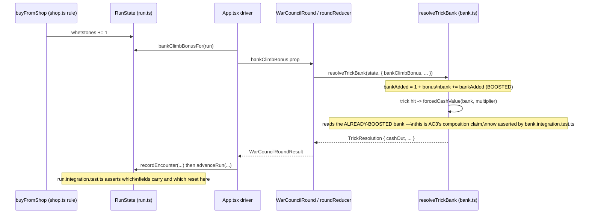

# Plan: Integration pass — shop, flask, Apply Damage and quick-kill payout together

Plan folder: `.claude/contract/DLR-96-integration-pass/`
Execution status: see `tasks.md` in this folder.

---

## Part 1 — Alignment

### Task reference

Jira DLR-96, "Integration pass: shop, flask, Apply Damage and quick-kill payout together." Acceptance criteria, verbatim:

1. A full run is played (or driven via QA's browser automation) with at least one purchase from every shop category, at least one flask drink and one stage-boss refill, at least one voluntary Apply Damage, and at least one quick-kill payout observed.
2. `RunState`'s new fields (flask charges, Whetstone count, Poison Guard active flag, any Envenom queue if it ended up here rather than on `EncounterState`) all survive `advanceRun` correctly — run-scoped state carries, encounter-scoped state resets, per each ticket's own stated scope.
3. `bank.ts`'s three concurrent changes (Whetstone's bank-added increment, Apply Damage's two-thirds forced-hit payout, the existing end-of-hand cash) compose without one silently overriding another — confirmed by a test that stacks a Whetstone purchase with a forced hit and checks the two-thirds figure is taken against the _boosted_ bank, not the un-boosted one.
4. Any interface mismatch found (a prop shape two tickets each assumed differently, a config key named twice, a refusal reason that doesn't fit the shared `PurchaseRefusal` pattern) is fixed here rather than left as a follow-up ticket.
5. `npm run typecheck`, `npm run lint`, and the full `npm test` suite all pass.

In scope: cross-ticket interface fixes, `RunState` field composition, `bank.ts` compositional correctness, a full-run playthrough. Out of scope: new features not already scoped in DLR-89 through DLR-95; visual polish; the epic-level Definition of Done sign-off.

Blocked by DLR-89 through DLR-95, all of which carry `Status: COMPLETE` in their own `tasks.md` as of this planning session (2026-08-21).

### Restated goal

DLR-89 through DLR-95 each built one piece of the run economy — the four-category shop, Envenom's delayed hit, Poison Guard, Whetstone's bank-climb bonus, the flask, Apply Damage's voluntary cash-out, and the quick-kill payout — largely in isolation. This ticket does not add a feature. It plays the whole economy at once (or has QA drive it through the browser), and it writes the specific composition-level tests the individual tickets had no reason to write, because each of those tests spans code two different tickets touched. Where that exercise turns up a genuine mismatch, this ticket fixes it directly rather than filing a follow-up.

### In scope

- A code + browser audit of every interface the seven build tickets share: `RunState`'s fields, `ShopStock`/`FlaskStock`/`ApplyDamageStock`, the three refusal unions (`PurchaseRefusal`, `FlaskRefusal`, `ApplyDamageRefusal`), and `bank.ts`'s `resolveTrickBank`/`forcedCashValue`/`cashValue` composition.
- A new test proving AC3's specific composition: a Whetstone purchase (`buyFromShop` → `RunState.whetstones` → `bankClimbBonusFor`) stacked with a forced hit, asserting the two-thirds figure is taken against the boosted bank.
- A new test proving AC2: every run-scoped field this epic added (`flaskCharges`, `whetstones`, `poisonGuardHeld`, `envenomCharges`, `cheats`, `coins`, `lastQuickKillPayout`) carries or resets correctly across one `recordEncounter` → `advanceRun` cycle, all populated simultaneously rather than one at a time.
- Fixing any concrete mismatch the audit or the playthrough surfaces.
- A scripted full-run QA playthrough (AC1) covering every named touchpoint, driven through the `chrome-devtools` MCP per `web-project.md`.
- Confirming `npm run typecheck`, `npm run lint`, and the full `npm test` suite are green on the final tree (AC5).
- A closing status report (developer request, 2026-08-21 chat) — not a numbered acceptance criterion, but explicit scope: a one-page, executive-readable summary of this contract's real results, republishing over the plan-stage draft already at `https://claude.ai/code/artifact/143f84e7-14b0-467a-aabe-36e3f6f976dd` rather than creating a second, disconnected page.

### Explicitly out of scope

- Any new game mechanic, shop item, or rule not already specified by DLR-89 through DLR-95.
- Re-tuning any price, percentage, or tier multiplier — a surprising number found in play is a Risk to flag to the developer (per the ticket's own "Dependencies & Risks"), never a quiet retune.
- Visual or copy polish.
- The epic-level Definition of Done sign-off — a separate ticket that checks the epic's own criteria, not the pieces' fit.
- Persisting run state across page reloads — every field this epic added is explicitly documented `NEVER persisted`, and that stays true.

### Pattern Reference

- `src/warCouncil/bank.ts` — `resolveTrickBank`, `cashValue`, `forcedCashValue`, `incomingFrom`. Every one of the three concurrent bank changes AC3 asks about already composes through this single module: `bankClimbBonus` is folded into `bankAdded` before any cash-out reads `bank`, so a forced hit's `forcedCashValue(bank, multiplier)` already reads the boosted figure. What is missing is the test proving it end-to-end, not a code fix.
- `src/hunt/run.ts` / `src/hunt/runTransitions.ts` — `RunState`, `advanceRun`, `recordEncounter`, `bankClimbBonusFor`. Every new field's survival rule is already individually documented and individually tested (`run.whetstone.test.ts`, `run.flask.test.ts`, `envenom.test.ts`, `poisonGuard.test.ts`, `run.quickKill.test.ts`); none of those tests populates every field at once.
- `src/hunt/shop.ts` (`PurchaseRefusal`), `src/hunt/flask.ts` (`FlaskRefusal`), `src/warCouncil/voluntaryCashOut.ts` (`ApplyDamageRefusal`) — three deliberately separate refusal unions sharing one naming and ordering convention, documented as deliberate in each file.
- `src/App.tsx` — the run driver; already wires `bankClimbBonusFor(run)`, `flaskStockFor`, `shopStockFor`, `run.lastQuickKillPayout` into every screen this ticket's AC1 needs to exercise.
- `.claude/workflow/web-project.md` → *Developer-owned work* and the QA chrome-devtools pattern, for how the AC1 playthrough is driven.

### Constraints flagged on the brief

- "Treat a surprising number as a reason to flag, not a reason to quietly retune a price mid-integration" — the ticket's own stated risk. Any payout figure that looks off during the playthrough goes to Risks, not to a config edit.
- AC3's test must specifically stack a Whetstone purchase with a forced hit and check the boosted bank — a generic Whetstone test or a generic forced-hit test does not satisfy this criterion on its own.
- AC5 requires the FULL `npm test` suite, not a scoped run — this is a Final-verification-phase command, not an Implementer-phase one, per `web-project.md`.

### Assumptions made

- **The audit found no interface mismatch to fix.** I read every shared interface named in the ticket body — `RunState`, `bank.ts`'s three cash-out paths, the three refusal unions, `ShopStock`/`FlaskStock`/`ApplyDamageStock`, `config.ts`'s exported constants (grepped for duplicate names — none found), and the full wiring in `App.tsx` and `runTransitions.ts` — against the current working tree (`npm run typecheck`, `npm run lint`, `npx vitest run --project node` and `--project dom` all pass clean: 48+24 files, 757+198 tests). I found the composition already correct in every case AC4 names as an example. This is stated as an assumption, not a fact, because AC4 is phrased as "any mismatch found is fixed here" — a conditional — and the developer should red-line this if the QA playthrough (which I have not run; it needs `npm run dev` and the `chrome-devtools` MCP) turns up something the static audit couldn't see, such as a rendering glitch or a control that stays enabled when it shouldn't. Confirmed as the working premise of this plan; tasks.md still schedules a task to fix anything QA does find.
- **`bank.ts` refers to `src/warCouncil/bank.ts`, not a same-named file under `src/hunt/`.** The ticket body's file references (`bank.ts`, `RunState`, `config.ts`) don't state their directories. `RunState` and `config.ts` are unambiguous (`src/hunt/run.ts`, `src/hunt/config.ts`); `bank.ts` exists only at `src/warCouncil/bank.ts` — there is no `src/hunt/bank.ts`. Confirmed by `Glob`.
- **The two new composition tests are the concrete, testable form of AC2 and AC3.** AC2 and AC3 ask for confirmation "by a test" — I am writing the specific tests those criteria describe rather than treating "the individual tickets' tests already cover this" as sufficient, because none of the existing tests populates every field simultaneously (AC2) or stacks the Whetstone-plus-forced-hit case specifically (AC3).
- **New composition tests get their own files rather than growing existing ones.** `src/warCouncil/__tests__/bank.test.ts` is already 394 lines — 6 lines under the 400-line blocking budget — so AC3's test goes in a new sibling file, `bank.integration.test.ts`, matching the project's own precedent of splitting `run.test.ts` into `run.flask.test.ts` / `run.whetstone.test.ts` / `run.quickKill.test.ts` when a file grows. AC2's test goes in a new `src/hunt/__tests__/run.integration.test.ts` for the same reason and the same precedent — `run.test.ts` is at 339 lines and a combined-fields test with real assertions would push it uncomfortably close to the budget.
- **The QA playthrough is scripted explicitly rather than left to QA's judgement**, because AC1 names five specific touchpoints (every shop category, a flask drink, a stage-boss refill, a voluntary Apply Damage, a quick-kill payout) that a generic "poke around the app" pass could easily miss — stage-boss refills and quick-kill payouts both require a specific hand shape to trigger.
- **`implementation-doc-writer` is not a task in `tasks.md`.** Per `CLAUDE.md`, it runs automatically on every `/fb-apply` run that changes a rule or module behaviour — it is not something a plan schedules as a step.

### Config and persisted-shape audit

- **Config key duplication (AC4's named example):** grepped `src/hunt/config.ts` for every top-level `export const NAME` and checked for duplicate names — zero found. All 27 exported constants are unique.
- **Persisted shape:** nothing this epic touches is persisted. `RunState`'s docblock states `coins`, `envenomCharges`, `poisonGuardHeld`, `whetstones`, `flaskCharges`, `handOfFight`, and `lastQuickKillPayout` are each `NEVER persisted`, confirmed by reading `src/hunt/run.ts:57-110`. This is still an open cheap window — nothing to migrate, nothing to guard.
- **Refusal-union consistency (AC4's other named example):** `PurchaseRefusal` (`shop.ts`), `FlaskRefusal` (`flask.ts`), and `ApplyDamageRefusal` (`voluntaryCashOut.ts`) are three deliberately separate `as const` unions. Each file's own docblock states why they are not merged (a shared union would force every consumer to handle cases that can never occur for it) and each follows the same ordering convention (report the reason that will still be true after the next state change). No mismatch found.
- **Shared-string surface (`data-testid`, CSS classes, `aria-*`):** out of scope for this audit — this ticket's own scope is engine composition (`RunState`, `bank.ts`), not UI markup, and no task below touches a `.tsx` file's rendered output.

---

## Part 2 — Technical design

### Approach

This is a verification ticket, not a feature ticket, so its "technical design" is mostly the audit already performed in Part 1 plus the shape of the two tests that make AC2 and AC3 checkable rather than merely asserted in a docblock comment.

The static audit (typecheck, lint, both Vitest projects, and a manual read of every interface AC4 names as an example) found the composition already correct. That is not surprising once the code is read: `resolveTrickBank`'s docblock in `bank.ts` explicitly documents the interaction AC3 asks about — `bankClimbBonus` is folded into `bank` before `forcedCashValue` reads it, and the file's own comments cite this exact scenario ("a bank of 3 at a multiplier of 3 ... which is precisely what AC2 asks for" and "cashOut = forcedCashValue(bank, multiplier)" reading the already-boosted `bank`). Each build ticket's own file already documents how it composes with the others rather than assuming isolation. The gap is therefore not a code defect but a missing **test artefact**: nothing currently exercises the full chain from a shop purchase through to a forced cash-out, or populates every `RunState` field from this epic at once and drives it through `advanceRun`.

Two new test files close that gap, both pure logic with no renderer:

1. `src/warCouncil/__tests__/bank.integration.test.ts` — imports `buyFromShop`, `startRun`, `bankClimbBonusFor` from `../../hunt` and `resolveTrickBank` from `../bank`, exactly as `bank.test.ts` already imports across that boundary. It buys a Whetstone (or several), reads `bankClimbBonusFor` off the resulting run, feeds that bonus through a sequence of taken tricks into `resolveTrickBank`, then resolves a hit and asserts the `cashOut` equals `forcedCashValue` of the boosted bank — never the bare (un-boosted) figure. This is AC3's exact scenario, run through the real run-level call chain rather than through `resolveTrickBank` alone (which `bank.test.ts` already covers at the unit level).
2. `src/hunt/__tests__/run.integration.test.ts` — builds one `RunState` with every epic-added field populated (whetstones > 0, flaskCharges != default, poisonGuardHeld true, envenomCharges > 0, cheats non-empty, coins > 0), resolves a winning encounter through `recordEncounter`, then calls `advanceRun`, and asserts field-by-field which figures carried (run-scoped: cheats, coins, envenomCharges survivors, whetstones, flaskCharges) and which reset (encounter-scoped: `encounter`, `handOfFight` back to 1, `poisonGuardHeld` cleared by `guardAfter` once the fight resolved). This directly tests AC2's "run-scoped state carries, encounter-scoped state resets, per each ticket's own stated scope" as one assertion block instead of trusting seven separate single-field tests to add up to the same guarantee.

No production code changes are planned, because the audit found nothing to fix. `tasks.md` still schedules an explicit fix task, gated on what the QA playthrough (AC1) actually finds — a scripted five-point browser pass is the one verification this static audit cannot perform, since it requires the running app and real card draws to reach a stage-boss refill and a quick-kill payout. If QA's pass surfaces a genuine interface mismatch, that task is where it gets fixed; if it does not, the task closes with nothing to do and says so.

### Skills to invoke during execution

- `react-frontend` — governs the two new test files: placement under `__tests__/`, the 400-line budget that is the reason they are new files rather than additions to existing ones, and "pure logic is tested without a renderer."
- `.claude/rules/` — scanned; the folder is empty, no rule file applies.
- `.claude/workflow/web-project.md` — always listed per this project's convention; owns the verification commands every task below uses, the QA chrome-devtools pattern for AC1, and the Vitest-cache-warming order (`--project node` then `--project dom` before `npm test`).
- `artifact-design` — governs the closing status report added at the developer's request: a polished-document treatment (real typographic hierarchy, a considered palette, flourishes kept tasteful), not an editorial one, per that skill's own read-the-request guidance for a status report.
- No developer override — the confirmed list matches the proposed list from Step 1.5c, plus the report scope added after this session's initial approval.

### Diagram



### Data shapes

No new type, config, or contract changes — every shape this ticket exercises (`RunState`, `BankState`, `TrickFacts`, `TrickResolution`, `ShopStock`, `FlaskStock`, `ApplyDamageStock`, the three refusal unions) already exists and is unchanged by this plan. The two new test files import existing exports only:

```ts
// bank.integration.test.ts imports
import { buyFromShop, startRun, bankClimbBonusFor } from '../../hunt'
import { resolveTrickBank, forcedCashValue, type BankState, type TrickFacts } from '../bank'

// run.integration.test.ts imports
import { startRun, recordEncounter, advanceRun } from '../run'
import { WHETSTONE_PRICE, ENVENOM_PRICE, POISON_GUARD_PRICE } from '../config'
```

If the QA playthrough (AC1) surfaces a genuine interface mismatch, the fix task in `tasks.md` records the actual shape change there — none is planned in advance because none is currently known to exist.

### Runtime quality notes

- **Purity and adjudication:** both new test files are pure-logic specs — no DOM, no renderer, function-in/value-out assertions exactly as `bank.test.ts` and `run.whetstone.test.ts` already are. No production module is touched unless the QA-driven fix task finds a real defect.
- **Effects, mount and teardown:** N/A — no component, no effect, in either new file.
- **Hot-path cost:** N/A — these are test-only additions with no runtime/production cost.
- **Determinism and numeric safety:** the composition test in `bank.integration.test.ts` uses fixed, hand-computed inputs (a known Whetstone count, a known number of taken tricks) so its expected `cashOut` is computed the same way `forcedCashValue`'s own existing tests compute theirs — no `Math.random()`, no floating epsilon needed since `forcedCashValue` multiplies before it divides (already documented in `bank.ts`).
- **Error paths:** N/A for the two test files. If the fix task (contingent on the QA pass) touches production code, its own task in `tasks.md` states the guard/throw it needs — not invented here in advance of knowing what, if anything, is wrong.

### Risks and judgement calls

- **AC1's playthrough is QA's to drive, and its outcome is unknown until it runs.** The static audit cannot substitute for actually reaching a stage-boss refill or a quick-kill payout in a live hand, both of which need a specific run state (fighting the encounter at a boss index; ending a fight with unplayed cards in hand). If QA cannot reach one of AC1's five touchpoints within a reasonable number of attempts, that is a developer judgement call — whether to accept a near-miss (e.g. a quick kill demonstrated via the pure-logic test instead of a live browser hand) or to have QA retry with a different hand.
- **A surprising payout number during the playthrough is a Risk to flag, never a quiet retune** — this is the ticket's own stated risk, restated here so the fix task inherits it: if Whetstone-plus-forced-hit or the quick-kill taper produces a figure that looks too large or too small in play, that goes back to the developer as a flagged number, not an in-flight config edit.
- **The audit's "no mismatch found" conclusion rests on a static read, not a running app.** It is possible the playthrough surfaces a purely visual or interaction-level issue (a control that stays enabled when its refusal should have fired, a stat that doesn't refresh) that no amount of reading `bank.ts` or `run.ts` would show. The contingent fix task exists for exactly this.
- **No new dependency, no config value, and no tuning number is introduced by this plan** — there is nothing here for the developer to pre-decide before `/fb-apply` runs; the only open question is what, if anything, the QA playthrough finds.
