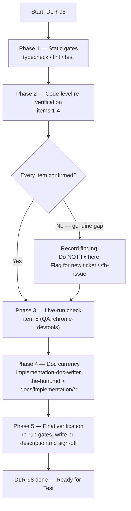

# Plan: Verification and sign-off against the epic's Definition of Done

Plan folder: `.claude/contract/DLR-98-verification-and-sign-off/`
Execution status: see `tasks.md` in this folder.

---

## Part 1 — Alignment

### Task reference

DLR-98 (Task, epic DLR-87's closing ticket):

> Nine other tickets under DLR-87 each verify their own acceptance criteria in isolation. This
> closing ticket checks the epic's own stated Definition of Done as a whole, end to end, against the
> real integrated result — not a re-statement of tests that already passed per-ticket.
>
> **Acceptance Criteria** (transcribed from DLR-87's own Definition of Done):
> 1. Shop UI shows all four categories, with existing Heal unaffected and sitting outside them.
> 2. Envenom, Poison Guard, and Whetstone are purchasable and their mechanics match the design doc.
> 3. The flask can be drunk for 60% max HP and refills on stage-boss kill.
> 4. Apply Damage is available as a player action pre-card, with the two-thirds-on-forced-hit rule
>    verified.
> 5. A first-hand, one-trick kill with five cards left pays 10 coins (re-confirm by hand in a live
>    run, not just by reading that the pinned regression test passes).
> 6. `npm run typecheck`, `npm run lint`, and `npm test` all pass; `.docs/game_rules/the-hunt.md`
>    reflects the new shop and mechanics as `[settled]` — this is `implementation-doc-writer`'s job,
>    not hand-edited.
>
> **In scope:** re-verifying the epic's own six-item Definition of Done end to end; triggering
> `implementation-doc-writer` to bring `the-hunt.md` and the relevant `.docs/implementation/`
> folders current.
> **Out of scope:** fixing anything found here beyond what re-running the relevant earlier ticket's
> scope covers — a genuine gap found at this stage is a new ticket, not a scope-creep fix bolted
> onto this one.
>
> Blocked by every other ticket in this epic (DLR-89 through DLR-96). If any Definition-of-Done
> item fails here after every prior ticket reported green, that is a finding for `/fb-issue`, not a
> silent fix — something in the per-ticket verification missed it.

### Restated goal

Re-verify, end to end against the real integrated codebase, that all six items of epic DLR-87's
Definition of Done actually hold — not by re-reading that each contributing ticket's own tests
passed, but by grepping and reading the shipped code and running the real gates and app. Where a
check confirms an item, record it; where a check finds a genuine gap, stop and name it as a new
ticket rather than patching it here. Separately, trigger `implementation-doc-writer` to bring
`.docs/game_rules/the-hunt.md` and the touched `.docs/implementation/` module folders current with
everything DLR-89 through DLR-97 (and, since it has since landed, DLR-100) actually shipped.

### In scope

- Re-verifying, by reading the current source and its tests, that each of DoD items 1–4 is
  implemented as described.
- Running the three static gates (`typecheck`, `lint`, `test`) fresh and recording their result
  (DoD item 6, first half).
- A live-run functional confirmation of the quick-kill payout scenario in DoD item 5 — a
  right-answer functional check, driven through the browser, not a feel judgement.
- Invoking `implementation-doc-writer` to confirm (and where stale, correct) that `the-hunt.md` and
  every module doc DLR-89 through DLR-97 touched are current and marked `[settled]` where the code
  now enforces the rule (DoD item 6, second half).
- Producing a sign-off summary (`pr-description.md` in this plan folder) stating, per DoD item,
  pass/fail and the evidence.

### Explicitly out of scope

- Fixing any gap this verification pass finds. A finding here is written up and left for a new
  ticket (or `/fb-issue`, if it looks like a hole in an earlier ticket's own verification) — never
  patched inside this contract.
- Re-deriving or re-litigating any design decision already marked `[settled]`/`[provisional]` in
  `the-hunt.md` — this ticket confirms the code matches the document, it does not revisit the
  document's own calls.
- Any change to `src/` — this contract's only writable surface is docs (`the-hunt.md`,
  `.docs/implementation/**`) and its own `pr-description.md`.
- Visual/copy polish — DLR-97 already covers that, and it is not part of the six-item DoD.

### Pattern Reference

- The DoD text itself, transcribed verbatim above from the ticket, is the checklist this plan
  builds against.
- `.docs/game_rules/the-hunt.md` — current ruleset, already reflects DLR-89 through DLR-100 per its
  own changelog blockquotes; used as the expected-behaviour reference for items 1–4.
- `.claude/skills/implementation-doc-writer/SKILL.md` — governs how the doc-currency half of item 6
  is executed (Step 1 "decide whether this contract changed a rule" does not apply here, since this
  contract makes no rule change; the relevant work is Step 1's staleness check, run against the
  cumulative DLR-89→DLR-97 diff instead of a single ticket's).
- Existing tests found for each item, used as the starting evidence for the code-level checks:
  - Item 1 (shop categories): `src/app/run/ShopCategoryTabs.tsx` + `.test.tsx`, `src/hunt/shop.ts`
    + `.test.ts`.
  - Item 2 (Envenom/Poison Guard/Whetstone): `src/hunt/__tests__/envenom.test.ts`,
    `src/hunt/__tests__/poisonGuard.test.ts`, `src/hunt/__tests__/run.whetstone.test.ts`,
    `src/warCouncil/envenom.ts`, `src/warCouncil/bank.ts`.
  - Item 3 (flask): `src/hunt/flask.ts` + `.test.ts`, `src/hunt/__tests__/run.flask.test.ts`,
    `src/app/run/FlaskMark.tsx`.
  - Item 4 (Apply Damage, two-thirds rule): `src/app/warCouncil/ApplyDamagePlate.tsx` +
    `.test.tsx`, `src/warCouncil/voluntaryCashOut.ts` + `.test.ts`,
    `src/app/warCouncil/__tests__/roundReducer.applyDamage.test.ts`.
  - Item 5 (quick-kill payout): `src/hunt/quickKill.ts`, `src/hunt/__tests__/quickKill.test.ts`,
    `src/hunt/__tests__/run.quickKill.test.ts`.

### Constraints flagged on the brief

- **No fix bolted onto this ticket.** Any real gap becomes a new ticket, named at the point it's
  found, not resolved in-line.
- **Item 5 must be re-confirmed by hand in a live run**, not by reading that the pinned regression
  test passes — the brief is explicit that the test alone does not satisfy this item.
- **`the-hunt.md` is never hand-edited** — only `implementation-doc-writer` writes it, per this
  project's standing rule (`CLAUDE.md` → "The three docs about the game").

### Assumptions made

- **The "live run" for item 5 is QA's functional pass, not a developer pause.** Per
  `.claude/workflow/web-project.md` → Developer-owned work, a question with a right answer (does
  the coin total read 10 after a specific play line) is QA's to verify by driving the app through
  `chrome-devtools`, not a feel judgement reserved for the developer. Confirmed by the brief's own
  phrasing — "re-confirm... in a live run" is a correctness check, not a taste call. *(Developer can
  red-line this if they'd rather do it themselves.)*
- **This contract writes no `src/` files**, so the standard three-reviewer dispatch
  (code-evaluator + defender + QA) at the end of `/fb-apply` has nothing to review beyond docs and
  gate output; QA's role narrows to running the gates and the one live-run scenario. This mirrors
  the "docs-only contracts" pattern already used elsewhere in this repo's contract history.
- **Doc-currency scope is the whole DLR-89→DLR-97 span, not just this ticket's own (nonexistent)
  code change.** The AC names "the new shop and mechanics" generically; the epic's children are
  DLR-89 through DLR-97, and `the-hunt.md`'s own changelog shows entries through DLR-100 already
  landed, so the doc-writer pass is a currency *audit* across that whole span rather than a diff off
  a single ticket.
- **A "genuine gap" is judged, not assumed, at each check** — a check that only reveals a value the
  developer has flagged as provisional (e.g. the discard budget of 3, or the skull rank curve) is
  not a DoD failure; the DoD items name specific mechanics being *present and correct*, not every
  open tuning question in the game being resolved.
- **Item 6's "npm test" means the unfiltered suite**, run once warm per
  `web-project.md`'s cold-cache guidance (run `--project node` then `--project dom` first if the
  cache is cold, then `npm test`).

### Config and persisted-shape audit

Skipped — this contract touches no configuration key, no persisted or stored shape, and renames or
adds nothing that binds by string. It reads and re-verifies existing code; no export, key, or field
is created, renamed, or removed.

---

## Part 2 — Technical design

### Approach

This contract has no production-code phase. It is a verification pass followed by a documentation
pass, and its two halves run in that order because the doc pass depends on the verification pass's
findings (an item marked `[settled]` in `the-hunt.md` must actually be settled by the time the doc
pass touches it).

**Verification half.** Each of DoD items 1–4 is checked the same way: read the current
implementation and its existing test coverage (already located and cited under Pattern Reference),
confirm the test coverage actually exercises the rule the AC states (not just that a test file with
a plausible name exists), and run the scoped tests fresh rather than trusting a stale CI badge. This
is read-and-run work, not implementation — no code is touched. Item 6's static-gate half
(`typecheck`/`lint`/`test`) is a direct run of the three commands.

**The live-run half (item 5)** is functionally distinct from 1–4: it needs the running app, so it
is QA's to execute (via `chrome-devtools`) rather than the Implementer's — the Implementer has no
browser tooling. The task names the exact scenario (first hand, one trick, five cards left, kill)
and the exact thing to read off screen (the coin total reads the pre-hit total + 10), so QA is
executing a scripted check rather than making a judgement call.

**Documentation half.** `implementation-doc-writer` is invoked once, scoped to the cumulative diff
DLR-89 through DLR-97 introduced (its own Step 1 "what changed" check normally works off one
contract's diff; here it is pointed at the whole epic's span, since that is what "the new shop and
mechanics" in the AC actually refers to). It runs its own Step 1–5 workflow unmodified: check what's
stale (including cross-module references), gather sources, validate against real code, write, then
verify. This plan does not pre-decide which module docs need touching — that decision belongs to
the skill's own Step 1, run at execution time against the actual current state of
`.docs/implementation/`.

**Sign-off half.** The Final-verification phase's own `pr-description.md` task (standard to every
contract) becomes, for this contract, the actual deliverable: a per-item pass/fail table with the
evidence for each, since there is no PR-worthy code diff otherwise.

No logic is pure-module vs. hook-vs-component here — nothing new is written. The only "data shape"
this contract produces is the sign-off report's structure.

### Skills to invoke during execution

- `implementation-doc-writer` — owns bringing `the-hunt.md` and the relevant
  `.docs/implementation/` module folders current; this is the ticket's own AC item 6, second half.
- `react-frontend` — developer-confirmed to also apply. There is no code to write, so its
  applicability here is narrow: its testing-posture conventions (query by role/label, pure logic
  tested without a renderer) inform how the Implementer judges whether an *existing* test for items
  1–4 genuinely exercises the rule, rather than governing any new code.
- No other skill from the confirmed roster applies — `game-designer`, `game-ux`, `pixel-artist`,
  `skill-creator`, `jira-epic-decomposition`, and `management-jira` (beyond the pipeline's own
  automatic transitions) own domains this contract does not touch.
- Also read: `.claude/workflow/web-project.md` (runner commands, the QA/browser boundary, the
  cold-cache Vitest note) and `.claude/rules/README.md` (scanned — currently empty, re-scan at
  execution time per its own instruction).

### Diagram



### Data shapes

No type, config, or contract changes. The one artefact this contract produces with a defined shape
is the sign-off report:

```markdown
<!-- pr-description.md structure -->
## DLR-98 sign-off

| DoD item | Status | Evidence |
|---|---|---|
| 1. Shop UI four categories, Heal outside them | PASS/FAIL | file:line + test run |
| 2. Envenom/Poison Guard/Whetstone purchasable, mechanics match design | PASS/FAIL | ... |
| 3. Flask 60% max HP, refills on stage-boss kill | PASS/FAIL | ... |
| 4. Apply Damage pre-card, two-thirds-on-forced-hit | PASS/FAIL | ... |
| 5. First-hand one-trick kill, 5 cards left, pays 10 (live run) | PASS/FAIL | QA browser evidence |
| 6. Gates green; the-hunt.md current | PASS/FAIL | gate output + doc-writer report |

## Findings routed elsewhere (if any)
[Ticket-worthy gaps found, explicitly NOT fixed in this contract]
```

### Runtime quality notes

- **Purity and adjudication:** N/A — no logic is written or changed.
- **Effects, mount and teardown:** N/A — no component or effect is written or changed.
- **Hot-path cost:** N/A — no runtime code changes.
- **Determinism and numeric safety:** N/A for new code. The verification itself must read the real
  constants (10-coin payout, 60% flask, two-thirds rounding-down rule) from source rather than from
  memory of the design doc, since a stale assumption here would produce a false PASS.
- **Error paths:** The one path that matters is contract-level, not runtime: a failed check must
  produce a named, evidenced finding in `pr-description.md`, never a silently-passed item and never
  an in-line fix. That is enforced by task structure (Phase 2/3 tasks require the evidence line to
  be filled before checking the item as done), not by code.

### Risks and judgement calls

- **QA executing the live-run scenario, rather than the developer, is a judgement call the
  developer should sanity-check.** The AC's own phrasing ("re-confirm by hand") could be read as
  wanting the developer specifically at the controls, not QA-via-automation. Flagged as an
  assumption above; easy to override by pulling item 5 into "Developer decides or observes" instead.
- **"Genuine gap" vs. "already-flagged open question" is a judgement call per item**, made at
  execution time against `the-hunt.md`'s own status markers. The plan cannot enumerate every
  possible finding in advance; the Final-verification task carries the instruction for how to route
  one when it appears.
- **No tuning value is at stake in this contract** — it verifies existing values, it does not choose
  any.
- **If the doc-writer pass finds `the-hunt.md` already accurate** (plausible, since its own
  changelog already documents DLR-89 through DLR-100), the "update" may be a no-op beyond the
  currency check itself — that is a pass, not a finding that the ticket did nothing; the skill's own
  Step 5 requires it to say so explicitly rather than silently skip.
