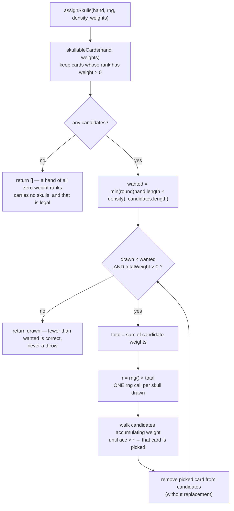

# Plan: Skull rank weighting — a tunable curve instead of a uniform draw

Plan folder: `.claude/contract/PT-001-skull-rank-weighting/`
Execution status: see `tasks.md` in this folder.

---

## Part 1 — Alignment

### Task reference

Verbatim, from the session of 2026-08-13/14:

> "So, should we have a weighting on the numbers that the ranks for the poision cards, where 1 = 0,
> 2=1, ...., 9=9, 10=10, 11=10. or something like that. Where the weighting is 0 never and 10 lilky?
> Someting like that ?"

And, on the folder name:

> "create a plan and taks for this call teh folder PT-xxx for (play test)"

**The problem this answers** is recorded in
`.docs/design/Balatro-Forbidden-Solitaire/the-hunt-play-test-2-feedback.md` §6 Q1, which ranks the
skull rank distribution as the open question the game's feel depends on most, and in
`.docs/game_rules/the-hunt.md` §3 → "How skulls are spread across ranks — **[open]**", which records
that skulls are drawn uniformly from ranks 2–11 today and that the skew is undecided.

Play-test 3 (`the-hunt-play-test-feedback.md` §6.6) established that this question was **blocked**
while the Quarry's rule-break existed; DLR-81 removed it, so it is now answerable.

### Restated goal

Replace the uniform "filter to rank ≥ 2, shuffle, take N" skull draw with a **weight-per-rank
table**, so which ranks carry skulls becomes a tunable curve rather than a fixed rule. Ship **four**
named curves — uniform, ramp, hump, and ambush — and make **hump the active curve**, which is a
deliberate change to how the game plays. The existing `SKULL_MIN_RANK` constant is absorbed into the
table (rank 1 gets weight 0) rather than kept alongside it. The three inactive curves stay in code,
exported and documented, because the developer's stated intent is to reuse them as a **difficulty
and variety lever** — a later opponent or boss can be handed a different curve instead of a rule-
break. Also record the mechanism, the four curves, and that boss-differentiation idea in `ideas.md`.

### In scope

- A `SkullRankWeights` type and **four** named curve constants in `src/hunt/config.ts` — `UNIFORM`,
  `RAMP`, `HUMP`, `AMBUSH` — plus the active `SKULL_RANK_WEIGHTS` reference, **set to `HUMP`**.
- A weighted, without-replacement draw in `src/warCouncil/skulls.ts`, using the injected `rng` so a
  seeded deal stays reproducible.
- `skullableCards` re-based from "rank ≥ minRank" to "rank has non-zero weight".
- Deletion of `SKULL_MIN_RANK` and every reader of it, in one task.
- Unit tests: zero-weight ranks are never drawn, the draw is deterministic under a seeded rng, the
  distribution actually skews toward high-weight ranks, and degenerate weight tables are safe.
- An `ideas.md` "Worth costing" entry recording the mechanism, the four curves and what each does to
  play, the two cases rank-weighting cannot fix, and the **curve-as-difficulty-lever** idea the
  developer raised — that a later opponent or boss can be differentiated by its skull curve rather
  than by a rule-break.

### Explicitly out of scope

- **Wiring the curve to the opponent.** The developer's stated reason for keeping all four is to use
  them per-encounter for difficulty and boss variety. That needs `Quarry`/`Hunt` to carry a curve and
  `dealRound` to receive it, which is a later contract. This one ships a single module-level active
  curve; the four constants exist so that later contract has something to select between.
- **Re-tuning the hump's numbers.** They are settled for this contract (see Assumptions) and the
  play-test may move them. Moving them later is a one-line edit, not a new contract.
- **Changing `SKULL_DENSITY`.** How many skulls a hand carries is a separate dial and is untouched.
- Any change to what the shape readout shows. Rank stays hidden — that is `the-hunt.md` §3 settled
  behaviour and this plan does not reopen it.
- The two cases rank-weighting demonstrably cannot fix — skulls in the trump suit, and the Quarry
  dumping a skull while void in the led suit. Both are recorded in `ideas.md` by this plan as known
  limitations, and neither is built here.
- Any CPU heuristic change, any UI change, and any `the-hunt.md` edit by hand (the
  `implementation-doc-writer` skill owns that file and `/fb-apply` invokes it automatically).

### Pattern Reference

- **`src/warCouncil/skulls.ts`** — the module being changed; its existing `assignSkulls` already
  takes `density` and `minRank` as **defaulted parameters** specifically so a skew could be tested
  at one call site. That injectable-parameter pattern is the one to keep.
- **`src/warCouncil/shuffle.ts`** — the existing `rng: () => number` injection contract. The new
  draw must consume the same injected `rng` and never reach for `Math.random`.
- **`src/hunt/config.ts`** — every tunable carries a `// UNIT:` line and a rationale comment naming
  its design source. New constants follow that shape.
- **`src/hunt/encounter.ts` → `startEncounter`'s `playerHealth`** — cited in `skulls.ts`'s own
  docblock as the precedent for defaulted-parameter injection.
- Conventions otherwise per `.claude/skills/react-frontend/SKILL.md`.

### Constraints flagged on the brief

- **Determinism is load-bearing.** `assignSkulls` draws through the injected `rng` so a seeded deal
  reproduces its skulls as well as its cards (`skulls.ts` docblock, and `deal.test.ts` asserts it).
  The weighted draw must preserve this — same seed, same skulls.
- **The pure-core boundary applies.** Both `src/warCouncil/**` and `src/hunt/**` are React-free and
  DOM-free, enforced by an ESLint override (`web-project.md` → Architectural boundaries). Everything
  in this plan stays inside those trees.
- **No new dependency.** Two runtime deps is deliberate; nothing here needs a third.
- **Never rank 1 must survive.** `the-hunt.md` §3 marks it `[settled]`: a skulled rank 1 cannot lose
  its trick, so it is an undodgeable tax. The weight table must express this and a test must pin it.

### Assumptions made

- **Folder slug is `PT-001-skull-rank-weighting`.** The developer asked for a `PT-xxx` prefix for
  play-test work. `PT-001` happens to satisfy `plan-resolution.md`'s existing `jira-key` slug shape
  (`[A-Z][A-Z0-9]+-[0-9]+`), so resolution works unchanged — but **`PT` is not a Jira project**, so
  no ticket transition is attempted for this plan. First in the series, hence `001`.
- **The weight table is keyed by rank, as an object literal** (`{ 1: 0, 2: 1, … }`) rather than an
  array indexed by rank. It reads exactly like the developer's sketch and removes the off-by-one
  risk an array carries; the cost is that `Record<number, number>` cannot force all eleven keys to
  be present, so a config test asserts that instead.
- **`SKULL_MIN_RANK` is deleted, not kept.** Once rank 1 has weight 0, keeping a separate min-rank
  constant states the same rule twice, which `CLAUDE.md`'s single-source-of-truth rule forbids. Six
  files reference it — see the audit.
- **`SKULL_DENSITY` stays and keeps its job.** Weights decide *which* ranks; density decides *how
  many*. Two orthogonal dials, and conflating them would make the count untunable.
- **Hump is the active curve, and this is the developer's decision, not an assumption — CONFIRMED
  2026-08-14.** They were shown all four curves rendered as charts plus a 300,000-hand simulation of
  the resulting per-rank skull rates, and chose hump. **So this contract deliberately changes how the
  game plays**; it is not behaviour-neutral, and that is the point rather than a risk.
- **The hump's specific weights are CONFIRMED for this contract:** `0,2,5,8,10,10,8,5,2,1,1`. These
  are the numbers the developer approved from the simulation, so they are transcribed rather than
  invented. Expect the play-test to move them.
- **The other three curves ship exported and unused**, because the developer's stated intent is to
  reuse them per-opponent for difficulty and boss variety. An unused export is normally a smell; here
  it is the deliverable, and the `ideas.md` entry records why so a future reader does not delete them
  as dead code.
- **Uniform's values are derived, not chosen:** every rank with a non-zero weight gets weight 1, and
  rank 1 gets 0. That is definitionally today's behaviour, so it is not a tuning value. It is kept as
  the reference point a play-test compares against.
- **The ramp curve is transcribed from the brief, using the `weight = rank − 1` reading.** The two
  possible readings were simulated and differ by 1–3 percentage points at every rank, so the
  ambiguity is not worth a decision. Recorded in Risks for the record only.
- **The ambush curve is the mirror of the ramp** (`0,10,9,8,7,6,5,4,3,2,1`), added at the developer's
  request after the comparison. Its derivation is mechanical, so it is not a tuning value either.
- **`weightedDraw` is exported from `skulls.ts`** so its invariants can be tested directly rather
  than only through `assignSkulls`. It is not added to `src/warCouncil/index.ts`'s barrel, because
  no other module needs it.

### Config and persisted-shape audit

Run against the working tree on 2026-08-14 with recursive greps.

- **`SKULL_MIN_RANK` — 10 hits across 6 files**, every one of which this plan changes:
  `src/hunt/config.ts:94` (the definition), `src/hunt/index.ts:7` (the re-export),
  `src/hunt/__tests__/config.test.ts:15,75` (import + `expect(SKULL_MIN_RANK).toBe(2)`),
  `src/warCouncil/skulls.ts:1,22,43` (import + two defaulted parameters),
  `src/warCouncil/__tests__/deal.test.ts:2,67` (import + `toBeGreaterThanOrEqual`),
  `src/warCouncil/__tests__/skulls.test.ts:2,26` (import + `every(c => c.rank >= SKULL_MIN_RANK)`).
- **`SKULL_DENSITY` — 11 hits across 6 files, and none of them change.** It keeps its name, type,
  and value; only its neighbour in the parameter list changes. Listed because a reader scanning
  `skulls.ts`'s signature will see both and must not assume symmetry.
- **`assignSkulls` has exactly one production caller** — `src/warCouncil/deal.ts:30`,
  `assignSkulls(cpuHand, rng)`, which passes two arguments and relies on defaults. It therefore
  needs **no change**, which is what makes the parameter swap safe.
- **`skullableCards` has one production caller** — `skulls.ts:45`, internal to the module — plus a
  barrel re-export at `src/warCouncil/index.ts:23` and three test call sites. Its signature's fourth
  concept changes from a rank floor to a weight table; the export name and arity are preserved.
- **Type change, and where it loses information:** `minRank: number` → `weights: SkullRankWeights`.
  This is a widening from a scalar to a table, so nothing is lost — every `minRank` value is
  expressible as a table — but it is **not** compiler-caught at call sites passing a positional
  fourth argument. Grep confirms **zero call sites pass a fourth argument** (the three test calls
  pass at most three), so there is no silent-coercion site.
- **Nothing is persisted.** There is no save file, no `localStorage`, and no stored log anywhere in
  `src/` — confirmed by grep for `localStorage`/`sessionStorage`/`indexedDB`: zero hits. Skulls live
  only in in-memory `RoundState`, rebuilt every deal. **That window is still open**, and recording
  it here is what lets a future save-format ticket know it was.
- **No string-bound surface is touched.** No `data-testid`, CSS class, `aria-*` id, or reason code
  is involved — the change is confined to two pure modules and their specs.
- **Boundary holds:** every file touched is inside `src/warCouncil/**` or `src/hunt/**`, both
  already React-free and DOM-free. Nothing in the design needs a DOM global or a React import.

---

## Part 2 — Technical design

### Approach

The change is a **substitution of the selection rule inside one function**, plus the configuration
that parameterises it. `assignSkulls` currently does `filter(rank ≥ minRank) → shuffle → slice(N)`.
That is a uniform draw without replacement, expressed as a shuffle. The replacement is a weighted
draw without replacement: repeatedly pick one candidate with probability proportional to its rank's
weight, remove it, repeat until `N` are drawn or no positive-weight candidate remains.

I chose **sequential weighted selection** over the two alternatives worth naming. *Rejection
sampling* (pick uniformly, keep with probability weight/maxWeight) is simpler to write but consumes
an unbounded number of `rng` calls, which would make a seeded deal's skulls depend on how many
rejections happened — determinism is a stated constraint, so that is disqualifying rather than
merely untidy. *Weight-expanded shuffling* (push each card into an array `weight` times, shuffle,
take distinct) is deterministic and very short, but its `rng` consumption scales with total weight
and it needs a de-duplication pass that quietly changes the distribution. Sequential selection
consumes **exactly one `rng` call per skull drawn** — two calls for a standard hand — which is the
tightest and most predictable contract of the three.

The weights themselves live in `src/hunt/config.ts` beside `SKULL_DENSITY`, because they are a
tunable and that module owns every tunable. **Four** curves ship as named constants: `UNIFORM`
reproduces today's behaviour exactly and is the reference point, `RAMP` is the developer's original
sketch, `AMBUSH` is its mirror, and `HUMP` concentrates weight on the middle ranks. `HUMP` is the
active curve, chosen by the developer from a rendered comparison of all four plus a 300,000-hand
simulation of the per-rank skull rates each produces.

**So this contract changes how the game plays, deliberately.** The reasoning behind hump is that the
extremes of the scale remove the player's decision: a very low skull is one the Quarry can only lose
with, so it gets dumped into a trick the player has already committed to winning and is eaten with no
counterplay, while a very high skull wins its own trick, which is a dodge the player did not earn.
Only the middle band leaves the outcome to the card the player chooses. Under hump a rank 5 or 6 in
the Quarry's hand is skulled about 60% of the time against 11% for a rank 10 or 11 — a signal strong
enough to read off the shape panel, pointed at the ranks where reading it changes what you play.

The three inactive curves are exported rather than commented out because the developer intends to use
them as a per-opponent difficulty and variety lever later — an opponent handed the ambush curve plays
very differently from one handed the ramp, with no new rule anywhere. That is a cheaper axis of
differentiation than the character rule-breaks DLR-81 removed, and Phase 2 records it so the
connection is not lost.

`SKULL_MIN_RANK` disappears into the table. This is the part worth being careful about: the "never
rank 1" rule is `[settled]` in the ruleset, so it must survive the refactor as an *enforced*
property rather than a convention. It survives as `weight[1] === 0` in every shipped curve, pinned
by a config test asserting exactly that across all three, and by a behavioural test asserting a
zero-weight rank is never drawn across many seeded trials. That is stronger than the current filter,
because it now also covers any future curve someone adds.

All logic stays in the two pure modules — no component, hook, or DOM access is involved anywhere in
this plan, so every invariant is unit-testable with plain function-in/value-out assertions under the
`node` Vitest project.

### Skills to invoke during execution

- **`react-frontend`** — owns everything under `src/`. Governs the pure-module placement, the
  defaulted-parameter injection pattern, the `// UNIT:` comment shape on new config keys, the
  no-hard-coded-tunable rule, and the Vitest posture (specs beside the logic, no renderer needed).
  This is the skill for Phase 1's three tasks.
- **`game-designer`** — owns `.docs/design/`. Governs Phase 2's single task: the `ideas.md` entry
  must follow that file's "Worth costing" contract (which problem it solves, what it costs in new
  rules, what would prove it wrong) and the skill's rule that every proposal is scored by rules
  added. Confirmed by the developer at the Step 1.5 gate.

Also read before executing: `.claude/workflow/web-project.md` (paths, runners, the
`Select-String` recursion trap, the `Measure-Object` undercount). `.claude/rules/` was scanned and
is empty apart from its `README.md` — no rule file applies.

Developer override at the skill gate: `game-designer` was added to the proposed list, and
`implementation-doc-writer` was deliberately not ticked because `/fb-apply` invokes it
unconditionally at the end of every run.

### Diagram



### Data shapes

#### New in `src/hunt/config.ts`

```ts
/**
 * How likely each rank is to carry a skull, keyed by rank. Weight 0 means never; higher means
 * likelier. Only the ratios matter, not the absolute scale.
 * UNIT: relative weight, >= 0, unitless.
 */
export type SkullRankWeights = Readonly<Record<number, number>>

/** Today's behaviour, expressed as weights: every rank 2-11 equally likely, rank 1 never.
 *  0,1,1,1,1,1,1,1,1,1,1 — the reference point a play-test compares against. */
export const SKULL_WEIGHTS_UNIFORM: SkullRankWeights

/** Weight climbs with rank, so skulls land on high cards — which mostly win their own tricks and
 *  hand the player a dodge. The gentlest curve. 0,1,2,3,4,5,6,7,8,9,10 */
export const SKULL_WEIGHTS_RAMP: SkullRankWeights

/** ACTIVE. Weight on the middle ranks, where the player's own card decides who takes the trick.
 *  0,2,5,8,10,10,8,5,2,1,1 */
export const SKULL_WEIGHTS_HUMP: SkullRankWeights

/** The ramp mirrored: weight on low cards, which the Quarry can only lose with, so it dumps them
 *  into tricks the player has already won. The harshest curve. 0,10,9,8,7,6,5,4,3,2,1 */
export const SKULL_WEIGHTS_AMBUSH: SkullRankWeights

/** The curve in force — `SKULL_WEIGHTS_HUMP`. Change this one reference to play a different shape.
 *  A later contract may move this from a module constant to a per-opponent field. */
export const SKULL_RANK_WEIGHTS: SkullRankWeights
```

**Deleted from `src/hunt/config.ts`:** `export const SKULL_MIN_RANK = 2` — absorbed into every
curve's `1: 0` entry. Its re-export in `src/hunt/index.ts` goes with it.

#### Changed in `src/warCouncil/skulls.ts`

```ts
// BEFORE
export function skullableCards(hand: readonly Card[], minRank?: number): readonly Card[]
export function assignSkulls(
  hand: readonly Card[], rng: () => number, density?: number, minRank?: number,
): readonly Card[]

// AFTER
export function skullableCards(hand: readonly Card[], weights?: SkullRankWeights): readonly Card[]
export function assignSkulls(
  hand: readonly Card[], rng: () => number, density?: number, weights?: SkullRankWeights,
): readonly Card[]

/**
 * Draw `count` distinct cards, each picked with probability proportional to its rank's weight.
 * Consumes exactly one `rng` call per card drawn. Cards whose rank has weight 0 (or no entry) are
 * never drawn. Returns fewer than `count` when candidates or positive weight run out.
 */
export function weightedDraw(
  candidates: readonly Card[], rng: () => number, weights: SkullRankWeights, count: number,
): readonly Card[]
```

`assignSkulls`'s name, arity, and first three parameters are unchanged, so
`src/warCouncil/deal.ts:30`'s two-argument call needs no edit.

#### Unchanged, listed to be explicit

`SKULL_DENSITY`, `SuitShape`, `suitShape`, `isSkulled`, `trickIsSkulled`, `RoundState.skulledCards`,
and every signature in `src/warCouncil/deal.ts`. No `package.json`, `tsconfig.json`,
`vite.config.ts`, or `eslint.config.js` change.

### Runtime quality notes

- **Purity and adjudication:** every line added is in `src/warCouncil/skulls.ts` or
  `src/hunt/config.ts`, both already React-free and DOM-free under the ESLint boundary. No component
  decides anything here. The curve is read from configuration, never written inline — the whole
  point of the change is to move a hard-coded rule (`rank >= 2`) into a table.
- **Effects, mount and teardown:** trivial — no concerns. No effect, listener, observer, timer,
  `requestAnimationFrame`, or `AbortController` is added; nothing here runs in React at all.
- **Hot-path cost:** `assignSkulls` runs **once per deal**, not per pointer event or per frame, so
  this is not a hot path. The draw is O(count × candidates) — at most 2 × 6 = 12 weight comparisons
  per hand — and allocates one candidate array plus one result array. No memoisation is warranted
  and none is added.
- **Determinism and numeric safety:** the draw consumes only the injected `rng`; `Math.random` must
  not appear in `skulls.ts` and a Final-verification grep checks that. One rng call per card drawn
  makes the consumption count fixed for a given `(hand, density)`, so a seeded deal reproduces its
  skulls exactly — pinned by an equality test on two identically-seeded draws. **The divisor risk is
  the total weight**: `r = rng() * total` with `total === 0` yields `r === 0` and the accumulate loop
  would pick nothing, so the loop guards on `total > 0` and exits rather than looping forever or
  returning `undefined`. A rank with no entry in the table reads as `undefined`; it is coerced to 0
  through an explicit `?? 0` at the single lookup point, never left to become `NaN` in the sum.
- **Error paths:** an all-zero weight table returns an empty skull set rather than throwing — a legal
  deal must never crash, and "this Quarry carries no skulls" is a coherent configuration. A hand
  shorter than the wanted count clamps, as it does today. Nothing is caught and swallowed into a
  success shape; there is no async surface, no I/O, and nothing to log.

### Risks and judgement calls

- **This contract changes how the game plays the moment it lands**, because hump is active rather
  than uniform. That is the developer's decision, taken from a rendered comparison and a simulation,
  and it is recorded here so nobody later reads the change as a refactor. The falsifier is a play
  session: if a hand under hump does not feel more decision-heavy than one under uniform, switch
  `SKULL_RANK_WEIGHTS` back and the claim in Approach is wrong.
- **The ramp's two readings differ by less than the play-test can detect.** The brief's
  "1 = 0, 2=1, …, 9=9, 10=10, 11=10" supports either **weight = rank − 1** or **weight = rank**
  capped at 10; simulated, they differ by 1–3 percentage points at every rank. The plan takes
  `weight = rank − 1`. Recorded for the record, not as a decision needing attention.
- **Three exported constants will have no reader when this lands.** `UNIFORM`, `RAMP`, and `AMBUSH`
  are referenced only by their own tests. A reviewer or a future contributor could reasonably delete
  them as dead code, which would quietly destroy the difficulty lever they exist to enable — so the
  `ideas.md` entry and the config comments both have to state their purpose plainly. Flagged because
  it is the most likely way this work gets undone by accident.
- **Hump concentrates skulls where the Quarry's cards are most contested**, which may make hands feel
  busier as well as more decision-heavy. Under hump a held rank 5 or 6 is skulled ~60% of the time.
  Whether that reads as tense or as noisy is a feel question and only playing answers it.
- **Rank-weighting cannot fix two of the three cases that make skulls unfair**, and shipping it may
  read as having solved more than it has. Skulls in the **trump suit** are near-harmless at any rank
  (a trump wins its trick, and a skull trick they win is a dodge for the player), and a Quarry
  **void in the led suit** dumps an undodgeable skull whatever its rank. Both are observed in
  play-test 4 and both are recorded as limitations by Phase 2's task rather than silently left out.
- **`Record<number, number>` cannot force all eleven ranks to be present.** A curve missing rank 7
  type-checks and silently makes rank 7 unskullable. Mitigated by a config test asserting every rank
  in `RANKS` has an entry in every shipped curve, but it is a real weakness of the chosen shape —
  the alternative (a fixed-length tuple) trades that safety for the off-by-one risk described in
  Assumptions.
- **The distribution test needs a seed, not a probability.** Asserting "high ranks are drawn more
  often" against a real RNG would be flaky. The test uses a deterministic seeded generator and
  asserts an exact count, which pins behaviour but will need updating if the draw algorithm ever
  changes — that is the intended trade and is noted in the test.
- **Whether any of this improves the game is judgement, and only playing answers it.** The contract
  builds the dial; it does not claim a setting is better. `the-hunt.md` §3's `[open]` marker should
  stay open until the developer has played the curves.
