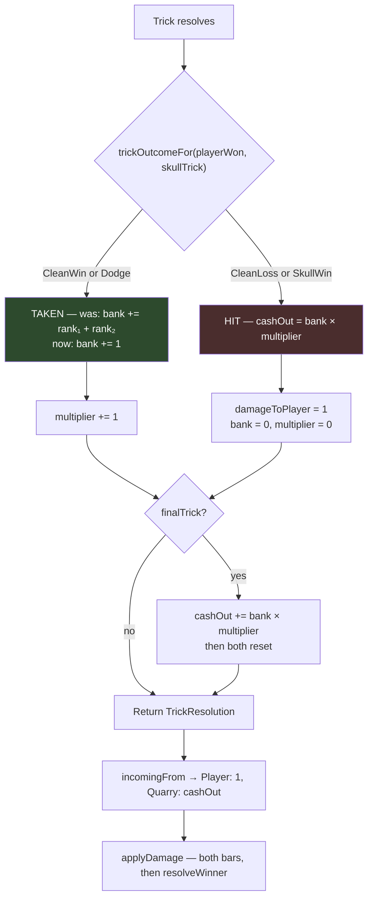

# Plan: The bank counts tricks, not card values — a cash-out of `n × n`

Plan folder: `.claude/contract/PT-002-trick-count-bank/`
Execution status: see `tasks.md` in this folder.

---

## Part 1 — Alignment

_(The shared understanding of what this task is doing. Restate it in your own words — this is how the developer confirms you read the brief correctly before any design happens. Mismatch here = stop and fix.)_

### Task reference

The brief is **this conversation**, filed as **PT-002** (`PT-xxx` is this project's local "play test" folder
convention, established by `PT-001-skull-rank-weighting`; it is not a Jira project and there is no ticket
to transition).

Verbatim, from the session of 2026-08-14, in the order the decisions were made:

> "I feel like the damage numbers are pointless, the ones that come from the card values. I can't really
> do anything about them, they're either good or bad, the only skill expression I have is keeping the
> streak alive."

> "what if the players damage starts at 0, then the win it turns to 1 X 2 then the win another it's 2 X 2
> then the wint another it's 3X3, then 4x4 then 5x5 then 6x6 with the first emeopy at 10 hp and later the
> extra damage is paied back as money for the shop?"

> "I like the idea of a X in the UI, I think that'll feel good, so if we can figure out the number with a
> X to match 1, 4, 9, 16, 25, 36 that'd be great. I know it doesn't scale, we're working on the early game
> right now and the shop will increase the players damage to solve that problem later. The left over
> damage won't be the only way to get money we'll pay the player flat money for winning … it's just an
> extra to give the player something back! We can tweak the health numbers after."

> "yes I might want to do a +1 x one time use item"

**The measurement that produced this ticket** is recorded in
`.docs/design/Balatro-Forbidden-Solitaire/ideas.md` → "Worth costing" → _"Replace the rank-sum bank with a
trick-count bank"_, written the same day from a simulation driving the real `src/warCouncil` engine. The
load-bearing figure: per-hand damage regressed against `Σn²` gives **R² = 0.938**, and for a fixed streak
structure the printed ranks still swing the payout by roughly ±20% with no decision controlling it —
1,251 hands that all took the identical shape of tricks paid anywhere between **20 and 93**.

The developer's own `n × max(n,2)` table (2, 4, 9, 16, 25, 36) was raised and **dropped in the same
session**, because its second trick paid the same as its first (+2, +2) so compounding did not begin until
the third trick. The settled table is **`n × n`** — 1, 4, 9, 16, 25, 36 — which is the "1, 4, 9, 16, 25, 36"
the developer then asked for explicitly.

### Restated goal

Change **what the bank counts**. Today `resolveTrickBank` adds both cards' printed ranks to the bank on
every trick taken, and cashes `bank × multiplier` when the player takes damage. After this ticket the bank
adds **1 per trick taken**, so both terms of that equation are the streak length and a cash-out is `n × n`
— 1, 4, 9, 16, 25, 36 across a six-trick hand. The equation itself, the four outcomes, the streak reset,
and the end-of-hand cash are all unchanged; only the quantity being banked changes.

The `× ` readout stays on screen and keeps two **separate** terms. That separation is load-bearing rather
than cosmetic: the developer wants a one-time-use "+1 ×" item, so the shop needs a term it can push
independently of the trick count. The engine already models these as two distinct fields, so this ticket
preserves that shape rather than collapsing them into one number.

Because a hand now pays ~7 instead of ~84, the Quarry's 400 health would make a fight last roughly 55
hands. The Quarry's encounter health therefore drops to the **10** the developer named in the same message.
Player health is already 10 and does not move.

### In scope

- `resolveTrickBank` banks **1 per trick taken** instead of the two cards' printed ranks, making a
  cash-out `n × n`.
- The now-unused `trickCards` parameter and its `TrickCard` import are removed from `resolveTrickBank`,
  and its one call site in `playCard.ts` is updated.
- `QUARRY_ENCOUNTER_HEALTH` moves from `[400]` to `[10]`, the figure the developer named.
- The bank readout keeps its `× ` form and its two separate terms; the left term's **player-facing label**
  changes from "Bank" to a word that describes a trick count.
- The four `TRICK_OUTCOME_MESSAGE` strings stop saying "Both cards banked", which becomes false the moment
  cards are no longer what is banked.
- Every test that encodes a rank-derived bank or cash figure, or a hand-built `TrickResolution` the new
  rule can no longer produce, is updated in the same task as the code that changes it — `bank.test.ts`,
  `roundReducer.test.ts`, `roundReducer.bank.test.ts`, `WarCouncilRound.test.tsx`, `BankMeter.test.tsx`.
  **`playCard.test.ts` and `config.test.ts` are deliberately not in that list**: the first asserts
  outcomes and `null`-ness with a `bank: 0` fixture, the second asserts the health array's *shape*
  (`toHaveLength(1)`) rather than its value. Both stay green untouched.

### Explicitly out of scope

- **Money, the shop, and leftover damage as currency.** The developer's own word for this was "later", and
  there is no shop to spend it on — `the-hunt.md` §10 records Forage as `[not built]`. A currency with no
  consumer is a number that goes up and does nothing. See Risks for the measurement that says what it
  would be worth.
- **A flat payout for winning an encounter.** Same reason; it is part of the same unbuilt economy.
- **Shop items that modify either term**, including the "+1 ×" item. This ticket only guarantees the two
  terms stay separately addressable so that item is buildable later.
- **Renaming the `bank` engine field** to something that says "trick count". Argued in Risks — it is a
  ~20-file rename for a naming improvement, and this is a play-test ticket.
- **Any further health rebalance.** 10 is the developer's stated number and is expected to move after
  playing; the consequence table is in Risks.
- **Rank 8's "Poison" name, the Quarry's skull-leading behaviour, the telegraph, and the skull rank
  curve** — all open questions in `the-hunt.md`, none touched here.
- **Hand-editing `.docs/game_rules/the-hunt.md` or `.docs/implementation/`.** §7 changes substantially,
  but `CLAUDE.md` assigns both to `implementation-doc-writer`, which `/fb-apply` runs at the end. No task
  here edits them by hand.

### Pattern Reference

No file was named in the brief, so these were chosen:

- **`src/warCouncil/bank.ts`** — the module that owns the whole of `the-hunt.md` §7. Every rule this
  ticket changes lives in `resolveTrickBank`, and `playCard.ts:103-111` already documents that it
  "decides nothing about the outcome". That comment stays true.
- **`src/hunt/config.ts`** — the existing pattern for a tuning value: an exported constant carrying a
  comment that records who set it, when, and from what evidence. `QUARRY_ENCOUNTER_HEALTH`'s current
  comment (set from play on 2026-08-13, trimmed 2026-08-14) is the shape to follow.
- **`src/app/warCouncil/labels.ts`** — the single owner of player-facing strings, already carrying
  `/** … Placeholder copy: the wording is the developer's. */` on `TRICK_OUTCOME_MESSAGE`.
- **`<plan>/mockup.html`** — the approved wording and layout of the readout in its three states.
- `.docs/design/Balatro-Forbidden-Solitaire/ideas.md` → "Replace the rank-sum bank with a trick-count
  bank" — cited for every number in this plan rather than re-deriving them.

### Constraints flagged on the brief

- **The `× ` must stay on screen.** "I like the idea of a X in the UI, I think that'll feel good."
- **The two terms must stay separately addressable**, because a "+1 ×" one-time-use item is planned. A
  design that computes the readout from a single stored number would foreclose that.
- **The payout table is exactly 1, 4, 9, 16, 25, 36.** Not the 2, 4, 9, … variant, which was considered
  and dropped in the same session.
- **Not scaling is accepted, deliberately.** "I know it doesn't scale, we're working on the early game
  right now and the shop will increase the players damage to solve that problem later." So no task here
  may add scaling machinery to compensate.
- **The health numbers are expected to move** after playing — "We can tweak the health numbers after."
- Standing project constraints: two runtime dependencies only, strict TypeScript, the pure-core boundary
  on `src/warCouncil/**` and `src/hunt/**` (no React, no DOM), files under 400 lines.

### Assumptions made

- **`n × n`, not `n × max(n,2)`** — the developer raised the `max(n,2)` floor, was shown that it makes the
  second trick pay the same as the first, and then asked for "1, 4, 9, 16, 25, 36". Treated as decided,
  not assumed. _(developer-confirmed)_
- **Quarry health `[10]`** — "the first emeopy at 10 hp", transcribed rather than chosen by the planner.
  Its consequence is flagged in Risks. _(developer-confirmed)_
- **Player health stays 10.** The developer said "the cpu and the player had 10 health" and
  `PLAYER_START_HEALTH` is already 10, so nothing moves.
- **"1 per trick" is a literal in `resolveTrickBank`, not a new config key.** What the bank counts is
  tricks, and "1 per trick" is what counting means — a future "+2 tricks" item would add a bonus to the
  bank, not redefine a trick's worth. Adding a `BANK_PER_TRICK` key would invent a tunable nobody asked
  for. Red-line this if you would rather retune it without a code edit.
- **The `trickCards` parameter is removed rather than kept and lint-silenced.** After this change nothing
  in `resolveTrickBank` reads a card, so keeping the parameter would need an `_`-prefix to pass lint and
  would leave a signature that lies about what the function depends on. The compiler finds the single
  call site.
- **The engine field stays named `bank`; only the player-facing label changes.** Argued in Risks.
- **The `.wc-bank-*` CSS class names are left alone.** They are string-bound to a stylesheet and renaming
  them buys nothing a player can see.
- **The left-term label becomes "Tricks" and the outcome copy loses "banked"** — placeholder wording only.
  `labels.ts` already marks this copy as the developer's, and the mockup exists to have it red-lined.
- **Money is out of scope**, on the developer's own "later" and on the absence of any shop.

### Config and persisted-shape audit

Run against the working tree on 2026-08-14.

- **`QUARRY_ENCOUNTER_HEALTH` — 3 production hits, all indirect.** The constant itself is read only by
  `quarryHealthForEncounter` (`src/hunt/config.ts`), re-exported by `src/hunt/index.ts`, and reached by
  production code exclusively through that function (`src/hunt/encounter.ts:37`, `src/App.tsx:33`). **No
  production file hard-codes 400**, so changing the value is a one-line edit. Test files reach it the same
  way — `duelHealthBars.test.ts`, `DuelHealthBars.test.tsx`, `roundFixture.ts`, `roundReducer.bank.test.ts`,
  `WarCouncilRound.test.tsx`, `encounter.test.ts` all call `quarryHealthForEncounter(0)` rather than
  quoting a number, so they follow the value automatically. The single exception is
  `src/hunt/__tests__/config.test.ts`, which asserts shape (`toHaveLength(1)`) but not the value — it needs
  no edit for the health change.
- **`PLAYER_START_HEALTH` is asserted literally once** — `config.test.ts:83`, `expect(PLAYER_START_HEALTH).toBe(10)`.
  The value does not move in this ticket, so that assertion stays green.
- **Two tests hard-code a rank-derived cash figure and will fail.** `roundReducer.bank.test.ts:61`
  (`quarryHealthForEncounter(0) - 40`) and `WarCouncilRound.test.tsx:315` (`- 40`) both encode a cash-out
  of 40 produced by `bank: 20, multiplier: 2`. Under the new rule that fixture cashes `20 × 2` still — the
  fixtures set `bank` directly — so the arithmetic survives, but 40 damage against a 10-health Quarry now
  **empties the bar and resolves the encounter**, changing what those tests observe. Both are in scope.
- **`bank.test.ts` encodes rank sums in 5 assertions** — `bankAdded).toBe(20)` (line 42), `cashOut).toBe(129)`
  (62), `cashOut).toBe(44)` (92, 98), plus the `dodge/clean` equality pair. All are computed from
  `leadRank`/`followRank` fixtures and every one changes.
- **`bankAdded` has no production consumer.** 3 hits outside `bank.ts`, all test fixtures
  (`BankMeter.test.tsx:11`, `roundReducer.test.ts:110`, `TrickWell.test.tsx:18`). It stays on
  `TrickResolution` as a display/debug figure; only its documented meaning changes (ranks → 1).
- **Type changes are additive-free and lossless.** No field is added, removed, retyped, or widened on
  `BankState`, `TrickResolution`, or `RoundState`. `bank` stays `number`; only the quantity it holds
  changes. No union grows, so no `switch` needs a new case.
- **`resolveTrickBank`'s signature loses one parameter** — from 5 to 4. Exactly **1 production call site**
  (`src/warCouncil/playCard.ts:105`) and it is exported from `src/warCouncil/index.ts:26`. Every caller is
  compiler-checked; there is no string-bound dispatch to it.
- **String-bound surfaces: `BANK_LABEL` has 6 hits in `labels.ts` + `BankMeter.tsx`**, and the
  `.wc-bank-*` CSS classes have **13 hits across `BankMeter.tsx` and `warCouncilHunt.css`**. The CSS
  classes are deliberately not renamed, so that pairing stays intact. `BankMeter.test.tsx` queries by
  `aria-label` text (`/cashes for 129/i`), which is string-bound to the aria copy and must change with it.
- **Nothing is persisted.** There is no save file, no `localStorage`, no stored log anywhere in `src/` —
  confirmed by the absence of any storage global under the pure-core ESLint boundary and by no persistence
  module existing. **The window for changing state shape without a migration is still open**, and this
  ticket does not close it.
- **The architectural boundary is not crossed.** Every changed engine file (`bank.ts`, `playCard.ts`,
  `config.ts`) stays inside `src/warCouncil/**` / `src/hunt/**` and gains no React import and no DOM
  global; the label and component changes stay in `src/app/**`, outside the boundary.

---

## Part 2 — Technical design

### Approach

**The whole mechanical change is one branch of one function.** `resolveTrickBank` currently computes
`bankAdded = trickCards[0].card.rank + trickCards[1].card.rank` on a taken trick; it becomes
`bankAdded = 1`. Everything downstream — `bank += bankAdded`, `multiplier += 1`, `cashOut = bank * multiplier`,
the reset to zero on damage, and the `finalTrick` fold that cashes at the end of the sixth trick — is
already correct for the new model and is not touched. Because both terms then climb by exactly 1 per trick
taken, a streak of length _n_ cashes `n × n`, which is the 1, 4, 9, 16, 25, 36 table. The `finalTrick`
fold's own invariant still holds for the same reason it held before: a hit zeroes both terms, so the
end-of-hand `bank * multiplier` is `0 × 0`, and exactly one cash-out can fire per trick.

**The alternative shapes were rejected for stated reasons.** Cashing the multiplier alone (the developer's
first phrasing) collapses to a linear count — streak lengths partition the tricks taken, so `{4,2}` and
`{6}` both pay 6 — which deletes the compounding the ticket exists to keep. Introducing a separate
`streakLength` field alongside `bank` would give the readout two sources for the same quantity and a way
for them to disagree; `bank` and `multiplier` are **already** two independent fields, so the "+1 ×" item
the developer wants is buildable by adding to `multiplier` without any restructuring here. Keeping
`trickCards` as an unused parameter was rejected because a signature that names a dependency it does not
have is a lie the next reader has to disprove.

**The pure/impure split is unchanged and already correct.** All of the rule lives in `src/warCouncil/bank.ts`
— no React, no DOM, unit-testable with plain function-in/value-out assertions, and it is the file the
existing `bank.test.ts` already targets. `BankMeter.tsx` computes `bank * multiplier` for display only and
keeps doing so; that duplication is deliberate and documented in the component, because the engine owns
the cash-out that actually lands and the component only restates its two inputs. No logic moves into a
component and no new hook is needed — there is no new state, no new effect, no listener, and no async
surface anywhere in this change.

**The config change is a value edit, not a shape edit.** The audit found no production file hard-codes 400
and every test reaches the number through `quarryHealthForEncounter(0)`, so `[400] → [10]` propagates on
its own. What does not propagate is the *comment*: the current one justifies 400 from a measurement taken
under the rank-sum bank, and leaving it would leave the file asserting evidence that no longer applies.
It is rewritten in the same task, which is also where the `n × n` mean of ~7 per hand gets recorded so the
next person retuning has the figure.

**The UI change is copy, not layout.** The readout keeps its three spans and its `× ` glyph exactly where
they are, and the `.wc-bank-*` classes are untouched — so nothing about the full-viewport shell, zoning, or
tap cost moves, and `game-ux`'s hard floor is unaffected by construction. What changes is the words: the
left term is labelled as a trick count, the `aria-label` restates the same figures, and the two "Both cards
banked" outcome messages become false the moment cards stop being banked. Because copy is the developer's
call, `mockup.html` carries the proposed wording in all three of the component's states rather than the
plan asserting it.

### Skills to invoke during execution

- **`react-frontend`** — owns everything under `src/`. Governs the `bank.ts` edit and its test, the
  `config.ts` value and comment, the `labels.ts` and `BankMeter.tsx` changes, and the testing posture
  (pure logic tested without a renderer; component tests queried by role and label).
- **`game-ux`** — owns the game-screen layer. Governs the `× ` readout: that both terms stay legible
  without hover, that state reads without colour alone, and that nothing about the no-scroll shell
  regresses. Also owns the standing rule that a layout claim is verified in a browser, never in jsdom.

Developer override at the Step 1.5c gate: `implementation-doc-writer` and `game-designer` were offered and
**not** selected. `implementation-doc-writer` still runs automatically at the end of `/fb-apply` per
`CLAUDE.md`, which is what updates `the-hunt.md` §7 and `.docs/implementation/` — no task here edits them.
`game-designer` was declined because `ideas.md` already carries this session's analysis.

Also read before executing: `.claude/workflow/web-project.md` (paths, runners, and the `Select-String`
recursion and `Measure-Object` traps). `.claude/rules/` was scanned and contains only its `README.md` —
no project rule applies.

### Diagram



The only edited node is the green one. Everything downstream of it — including the `finalTrick` fold and
the whole damage-application path — is unchanged, which is why a streak of _n_ now cashes exactly `n × n`.

### Data shapes

#### `src/warCouncil/bank.ts` — the signature loses one parameter

```ts
// BEFORE (5 parameters)
export function resolveTrickBank(
  before: BankState,
  trickCards: readonly [TrickCard, TrickCard],
  playerWon: boolean,
  skullTrick: boolean,
  finalTrick: boolean,
): TrickResolution

// AFTER (4 parameters — `trickCards` removed, and with it `import { type TrickCard }`)
export function resolveTrickBank(
  before: BankState,
  playerWon: boolean,
  skullTrick: boolean,
  finalTrick: boolean,
): TrickResolution
```

`BankState`, `TrickResolution`, and `RoundState` are **structurally unchanged** — no field added, removed,
retyped, or widened. Two documented meanings change:

```ts
export interface TrickResolution extends BankState {
  /** WAS: "Ranks added to the bank by this trick — both cards on a take, 0 on a hit."
   *  NOW: "Tricks added to the bank by this trick — 1 on a take, 0 on a hit." */
  readonly bankAdded: number
  // …every other field unchanged
}

export interface BankState {
  /** WAS: the summed printed ranks of every card in every trick taken since the last cash-out.
   *  NOW: the number of tricks taken since the last cash-out. Equal to `multiplier` until an
   *  item modifies one of them independently. */
  readonly bank: number
  readonly multiplier: number
}
```

The taken branch's body:

```ts
if (isTaken(outcome)) {
  // The bank counts TRICKS, not card values (PT-002). A streak of n therefore cashes n × n.
  bankAdded = 1
  bank += bankAdded
  multiplier += 1
} else {
  // unchanged
}
```

#### `src/hunt/config.ts` — one value, and its comment

```ts
// The Quarry's health for encounter 0.
// UNIT: health points, encounter 0.
export const QUARRY_ENCOUNTER_HEALTH: readonly Health[] = [10]
```

Value set by the developer, 2026-08-14 ("the first emeopy at 10 hp"). The existing comment justifies 400
from a 136-damage hand measured under the rank-sum bank and **must be rewritten**, not merely re-numbered:
under `n × n` a hand pays a mean of ~7.2 (range 0–36), measured over 6,000 simulated hands and recorded in
`ideas.md`. No other key in this file changes; `PLAYER_START_HEALTH` stays 10 and `DAMAGE_PER_HIT` stays 1.

#### `src/app/warCouncil/labels.ts` — player-facing strings only

```ts
// BEFORE
export const BANK_LABEL = 'Bank'
export const MULTIPLIER_LABEL = 'Streak'

// AFTER — identifier renamed with its value, so the constant does not lie about what it holds
export const TRICKS_LABEL = 'Tricks'
export const MULTIPLIER_LABEL = 'Multiplier'

// BEFORE — "banked" describes cards, which are no longer what is banked
export const TRICK_OUTCOME_MESSAGE: Readonly<Record<TrickOutcome, string>> = {
  [TrickOutcome.CleanWin]: 'Clean trick, taken. Both cards banked.',
  [TrickOutcome.Dodge]: 'Skull dodged. Both cards banked.',
  [TrickOutcome.CleanLoss]: 'Clean trick lost. 1 damage — the bank cashes.',
  [TrickOutcome.SkullWin]: 'You ate the skull. 1 damage — the bank cashes.',
}

// AFTER — placeholder wording; the developer's call, shown in mockup.html
export const TRICK_OUTCOME_MESSAGE: Readonly<Record<TrickOutcome, string>> = {
  [TrickOutcome.CleanWin]: 'Clean trick, taken. The streak climbs.',
  [TrickOutcome.Dodge]: 'Skull dodged. The streak climbs.',
  [TrickOutcome.CleanLoss]: 'Clean trick lost. 1 damage — the streak cashes.',
  [TrickOutcome.SkullWin]: 'You ate the skull. 1 damage — the streak cashes.',
}
```

#### `src/app/warCouncil/BankMeter.tsx` — props and classes unchanged

Props stay `{ bank: number; multiplier: number; lastResolution: TrickResolution | null }`. The `.wc-bank-*`
class names are **not** renamed. Only the imported label constant and the `aria-label` template change:

```ts
aria-label={`${TRICKS_LABEL} ${bank}, ${MULTIPLIER_LABEL} ${multiplier}, cashes for ${cash}`}
```

No `package.json`, `tsconfig.json`, `vite.config.ts`, or ESLint change. No new dependency.

### Runtime quality notes

- **Purity and adjudication.** The entire rule change lives in `src/warCouncil/bank.ts`, inside the
  pure-core boundary — no React import, no DOM global, and it stays a total function over integers.
  `BankMeter.tsx` decides nothing: it recomputes `bank * multiplier` purely for display, which the
  component's own doc comment already records as deliberate, and `resolveTrickBank` remains the only
  owner of the cash-out that actually lands. The one literal introduced (`1`) is the definition of
  counting a trick rather than a tunable — flagged as an assumption for red-lining, not hidden.
- **Effects, mount and teardown.** Trivial — no concerns, and this is honestly true rather than a skip.
  This change adds no effect, no listener, no observer, no timer, no `requestAnimationFrame`, and no
  `AbortController`. `BankMeter` is a pure function component with no `useEffect` today and gains none, so
  there is nothing to clean up and nothing StrictMode's double-invoke can break. No module-level mutable
  state is introduced anywhere.
- **Hot-path cost.** `resolveTrickBank` runs once per trick — at most six times a hand, driven by a tap,
  never per pointer-move or per frame. Replacing an addition of two ranks with an addition of `1` strictly
  reduces work and allocates nothing new. No memoisation is added, and none would have profiling evidence
  behind it.
- **Determinism and numeric safety.** No `Math.random()` is reachable from any changed file; the deal's
  RNG is injected and untouched by this ticket. There is **no division anywhere** in `resolveTrickBank`
  — the existing doc comment says exactly this — so no epsilon is required and no `NaN` is producible from
  its inputs. `bank` and `multiplier` are integers incremented by 1, and their product is an integer, so
  the cash-out cannot go fractional; `applyDamage`'s existing single clamp keeps health non-negative. The
  new maximum cash-out is 36 (a six-trick streak), well inside safe integer range.
- **Error paths.** Nothing new can fail. `resolveTrickBank` is total over its inputs and has no throw path;
  removing a parameter cannot introduce one. `quarryHealthForEncounter` keeps its existing `RangeError` on
  a bad index — deliberately a throw rather than an `undefined` that would become `NaN` and vanish from a
  health bar — and that behaviour is unchanged by editing the array's contents. No `catch` is added, no
  error is swallowed into a success shape, and no async surface is introduced, so the four async states do
  not arise.

### Risks and judgement calls

- **A 10-health Quarry is a walkover, and the developer already knows.** Simulated over 3,000 encounters
  at `Σn²` with the player at 10: **random legal play wins 63.8%**, ordinary play 73.3%, strong play 85.0%,
  and the fight lasts **1.9 hands**. About a quarter of hands pay ≥10 on their own, so a single good hand
  ends it and the top of the curve (a 16, 25 or 36 cash-out) is invisible because everything above 10 is
  discarded. This is the developer's stated number and "we can tweak the health numbers after", so it is
  not blocking — but the consequence table is here so the choice is informed:

  | Quarry HP | random wins | ordinary play | strong play | hands | damage wasted as overkill |
  | --------- | ----------- | ------------- | ----------- | ----- | ------------------------- |
  | **10**    | 63.8%       | 73.3%         | 85.0%       | 1.9   | **36.6%**                 |
  | 15        | 48.4%       | 61.0%         | 73.7%       | 2.4   | 30.5%                     |
  | 20        | 33.9%       | 43.5%         | 63.3%       | 2.8   | 25.3%                     |
  | 25        | 21.6%       | 28.8%         | 52.3%       | 3.0   | 18.9%                     |
  | 30        | 13.8%       | 20.5%         | 42.7%       | 3.3   | 14.1%                     |

  Changing it later is a one-line edit to `QUARRY_ENCOUNTER_HEALTH`. **Name a different number at the gate
  if you want one; otherwise the ticket ships 10.**

- **Keeping the engine field named `bank` is a deliberate trade.** After this change `bank` holds a trick
  count, which its name no longer describes. Renaming it (`streakTricks`, say) would touch `bank.ts`,
  `playCard.ts`, `types.ts`, `deal.ts`, `roundReducer.ts`, `WarCouncilRound.tsx`, `BankMeter.tsx` and about
  ten test files — roughly doubling a ticket whose point is to get the new feel on screen and judged. Every
  one of those is compiler-checked, so the rename is safe whenever it happens. **Pull it into this ticket
  if you would rather not read `bank` as "tricks" for the next few tickets.**

- **The copy is placeholder and needs your eye.** "Tricks × Multiplier" and the four rewritten outcome
  messages are the planner's wording, not yours — `labels.ts` already flags this copy as the developer's.
  The mockup shows all of it in context. Red-line it there rather than after it is built.

- **Money is out of scope, and here is what it would have been worth.** Overkill can only occur on the
  cash-out that kills, so it fires **~0.8 times per encounter** regardless of the Quarry's size; at Quarry
  20 it pays a median of **2**, and **19% of wins pay nothing at all**. If money is wanted as an economy
  rather than a flourish, the measured alternative is a fixed share of every cash-out. Both figures are in
  `ideas.md`; neither is built here. **Say so at the gate if you want the overkill→money conversion pulled
  into this ticket anyway** — it is a small change to `roundReducer`, but it has no consumer yet.

- **`the-hunt.md` §7 will be substantially wrong until `/fb-apply` finishes.** The whole "the bank and the
  streak" section, plus §8's health figures and the Status register's "Card value = printed rank" row,
  describe the retired model. `implementation-doc-writer` owns that update and `/fb-apply` runs it — no
  task here touches the file. Flagged so its staleness mid-run is expected rather than alarming.

- **Two contracts still read `Status: IN PROGRESS` that `the-hunt.md` records as landed** —
  `DLR-80-skull-and-bank-redesign` and `PT-001-skull-rank-weighting`. Not this ticket's work, but stale
  statuses misroute `/fb-apply` and `/fb-archive`, and PT-002 sits directly downstream of both. Worth
  running `/fb-archive` on them before starting.

- **Whether `n × n` actually feels better is the thing only playing answers.** The measured claim is that
  the payout becomes predictable — the same tricks always pay the same number. The risk is that predictable
  reads as *flat*: the ±20% rank jitter may have been doing work as spectacle. The cheapest disproof is to
  call the next cash-out before it fires; if you are right most of the time and it feels dull rather than
  readable, the finding was wrong and the rank sum was load-bearing.
