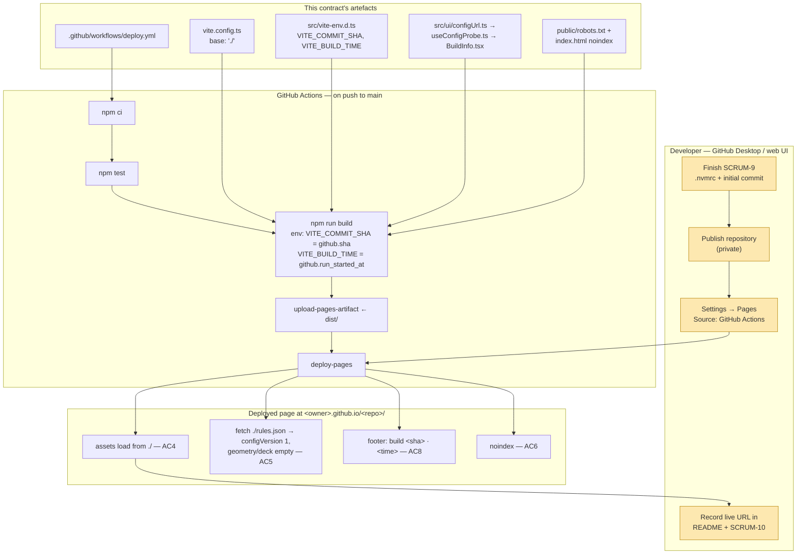

# Plan: Deploy the prototype to a hosted URL for play-testing

Plan folder: `.claude/contract/SCRUM-10-deploy-prototype-to-hosted-url/`
Execution status: see `tasks.md` in this folder.

---

## Part 1 — Alignment

### Task reference

**Developer brief, 2026-07-31, verbatim:**

> https://amazerbeam.atlassian.net/browse/SCRUM-10 we want to host the "String Railway Prototype shell. The board, the station deck and the fixed-length string drag arrive in later stories." so we can publish further updates as they are built

The quoted phrase is the current copy of `src/ui/AppShell.tsx:8-9`. The brief is therefore explicit: host **the shell as it stands today**, so that every later story publishes automatically as it lands. It is not asking for the game to exist first.

**Jira SCRUM-10** — "Deploy the prototype to a hosted URL for play-testing". Task, parent epic SCRUM-1, status `In Progress`, project `DeLorean 1.21`. Acceptance criteria as written on the ticket:

1. A production build is deployed to a hosted URL and a full 4-player game can be played there start to finish.
2. Deployment is automated from the default branch — a merge publishes the new version with no manual upload step.
3. GitHub Pages is used, published from a GitHub Actions workflow. Netlify or Vercel are acceptable substitutes if Pages proves awkward with the chosen access model.
4. Asset paths resolve correctly under the deployment's base path; the build must not assume it is served from a domain root.
5. `rules.json` is fetched correctly by the deployed build, so a tuning change reaches the hosted version through a normal deploy.
6. Access is restricted rather than openly published. An unlisted URL, GitHub Pages private to the organisation, or a Netlify or Vercel password-protected site all satisfy this.
7. The hosted URL is recorded in the README and on this ticket once live.
8. The deployed build carries a visible version or commit indicator, so play-test feedback can be attributed to a specific build and set of constants.
9. Hosting incurs no cost.

The ticket's out-of-scope list: custom domain, any server-side component, analytics or telemetry, multi-environment promotion, in-app feedback collection, uptime monitoring.

The ticket's own Dependencies note states it "depends in practice on the GitHub repository task for the remote and Actions workflow, and on enough of the epic being complete that a full game is playable", and records the access rationale: String Railway is a published game credited to Hisashi Hayashi with art, development and design by named contributors at Forgenext, so a privately shared prototype is an ordinary internal tool while a publicly discoverable playable version is not.

**Follow-up decisions confirmed interactively, 2026-07-31:**

- **Deploy target** — developer: *"Whatever you recommend as long as I can open in github desktop"*. Recommendation taken: GitHub Pages published by GitHub Actions, preceded by an account-plan check. Nothing in this contract requires the `gh` CLI (which is not installed on this machine — `Get-Command gh` returns nothing in both PowerShell and bash); repository creation and pushing are done by the developer in GitHub Desktop.
- **AC5 scope** — developer chose *"Minimal fetch probe in the shell"*: `AppShell` fetches `rules.json` from the deployment base path and renders its state, so AC5 is demonstrated at runtime on the live site rather than argued.
- **Skills** — developer: *"This is git work so I don't think we need a skill"*. Partially applied; see Part 2 → Skills to invoke during execution for exactly where and why.

### Restated goal

Turn the repository into something that publishes itself. Today `npm run build` produces a `dist/` that assumes it is served from a domain root, nothing reads `public/rules.json`, and the built page carries no indication of which commit produced it. This contract fixes all three and adds a GitHub Actions workflow that builds and publishes to GitHub Pages on every push to `main` — so the placeholder shell goes live now, and every subsequent story reaches the play-testers by merging. The deployed page will show which commit it was built from, will prove that `rules.json` resolves under the deployment's base path, and will ask search engines not to index it. Creating the GitHub repository, enabling Pages, and recording the resulting URL remain the developer's, done through GitHub Desktop and the GitHub web UI.

### In scope

- `vite.config.ts` — set a deployment-location-agnostic `base` so `dist/` carries no root-absolute asset path.
- A build indicator in the shell showing the commit the build came from and when it was built (AC8), fed by build-time environment variables the workflow sets.
- A minimal `rules.json` fetch probe in the shell resolving the URL from the deployment base path, handling all four async states, demonstrating AC5 on the live site.
- `src/vite-env.d.ts` — type the two new `VITE_*` build variables so neither read is an implicit `any`.
- `public/robots.txt` and a `noindex` meta tag in `index.html` — the access posture for AC6.
- `.github/workflows/deploy.yml` — install, test, build, publish to GitHub Pages on push to `main` and on manual dispatch (AC2, AC3).
- A `## Deployment` section in `README.md` describing the workflow, the base-path decision, the access posture, and where the developer records the live URL (AC7).
- A preflight that stops the contract if SCRUM-9 has not yet produced `.nvmrc` and the initial commit.

### Explicitly out of scope

- **AC1's "a full 4-player game can be played there start to finish."** No board, no deck, and no drag exist yet — `src/rules/` contains only `__tests__/scaffold.test.ts`. The brief scopes this contract to hosting the shell so later stories publish automatically. AC1 becomes true when the epic's gameplay stories land on `main` and deploy through the pipeline this contract builds; it is not a defect in this contract and should be noted on the ticket rather than silently claimed.
- **Creating the GitHub repository, adding the remote, and pushing.** `.claude/workflow/web-project.md` puts git remote creation with the developer, and `git log` confirms the repository has zero commits and `git remote -v` returns nothing. Developer action in GitHub Desktop.
- **Enabling GitHub Pages and selecting "GitHub Actions" as its source.** A repository-settings action with no CLI available here.
- **Recording the live URL** in the README and on SCRUM-10 — the URL does not exist until the developer has done the two items above.
- **Everything SCRUM-9 owns**: `.nvmrc`, `.gitattributes`, `.github/workflows/ci.yml`, `engines.node`, the README's `## Continuous integration` and `## Repository visibility` sections, and the initial commit. This contract consumes them and must not re-create or edit them.
- **The real `rules.json` config loader and its validation** — deck counts summing to a total, positive lengths, long string longer than short. That is the configuration story's shape to choose. The probe here reads `configVersion` and whether the two sections are populated; nothing more.
- Custom domain, server-side anything, analytics, multi-environment promotion, in-app feedback, uptime monitoring — the ticket's own exclusions.
- Password-protected hosting. Both Netlify's and Vercel's password protection are paid features, which AC9 forbids.

### Pattern Reference

None supplied in the brief. References chosen here:

- **`.claude/contract/SCRUM-9-github-repo-and-ci/tasks.md` Task 6** — the in-flight CI workflow, at `.github/workflows/ci.yml`. `deploy.yml` matches its conventions exactly: `actions/checkout@v5`, `actions/setup-node@v5` with `node-version-file: .nvmrc` and `cache: npm`, `npm ci` rather than `npm install`, separately named `run` steps, an explicit `permissions` block, and a `concurrency` group. Its Step 2 verification technique — `npx prettier --check` on the YAML, the only dependency-free parse check available on this machine — is reused.
- **`.claude/contract/SCRUM-9-github-repo-and-ci/tasks.md` Task 7** — the README-editing pattern: confirm the heading list first, append rather than duplicate, then `npx prettier --write` because `.prettierignore` does not cover `README.md`.
- **`src/ui/AppShell.tsx` + `src/ui/AppShell.css`** — the one existing component pair. `BuildInfo.tsx` + `BuildInfo.css` follows its naming, its default export, and its plain-CSS-per-component approach.
- **`.claude/skills/react-frontend/references/engineering-standards.md` "Four async states"** (lines 97-108) — loading / success / error / empty, and the explicit instruction not to skip them on `rules.json`. Line 108 names "whatever the deployed build fetches" as in-scope for this rule.

No rulebook section governs deployment; no `[MADE UP — M#]` decision is touched. This contract adds no tunable and reads no geometry or deck value.

### Constraints flagged on the brief

- **Access must be restricted, not openly published** (AC6), for the copyright reason the ticket records and SCRUM-9's `## Repository visibility` section restates.
- **Zero cost** (AC9) — rules out paid Pages access control and paid Netlify/Vercel password protection.
- **No manual upload step** (AC2) — publication must be a consequence of merging to `main`.
- **The build must not assume a domain root** (AC4).
- **A tuning change must reach the hosted build through a normal deploy** (AC5) — `public/rules.json` is copied into `dist/` by Vite and must be fetchable from the deployed base path.
- **The build indicator matters more than it looks** — the ticket's own risk note: without it, feedback like "the strings felt too short" cannot be tied to the constants live at the time, and §12's symptom-to-cause table becomes guesswork.
- **Two runtime dependencies only.** This contract adds none — the probe uses `fetch`, the indicator uses `import.meta.env`, both platform features.
- **`erasableSyntaxOnly` is on** (`tsconfig.app.json:23`), so no `enum` and no `namespace`; the probe state uses a discriminated union of `as const` string literals.
- **`.claude/skills/react-frontend/references/engineering-standards.md:147`** — "anything in `VITE_*` is shipped to the browser. This project should need none." This contract introduces two, and that line requires an explicit justification: see Runtime quality notes → Error paths.

### Assumptions made

- **`base: './'` rather than a hard-coded `/string-railway/`.** A relative base is correct under a Pages project site, a Netlify or Vercel root, and `npm run preview` alike, so AC4 holds without the plan needing to know the repository name — which it cannot, since no remote exists. Safe here specifically because the app is a single view with no router (`react-frontend` SKILL.md, "Project layout": *"Single view — no routes"*); relative bases break under client-side routing at nested paths, and that constraint is recorded in the README section so a future router story knows to revisit.
- **The deploy workflow runs `npm test` before `npm run build`.** `npm run build` already chains `lint` then `tsc -b` (`package.json:8`), so lint and typecheck are covered, but nothing would stop a failing test suite from publishing. This duplicates SCRUM-9's CI job on pushes to `main`; that is deliberate — cross-workflow gating via `workflow_run` is materially harder to reason about, and publishing untested code is the worse failure.
- **The build indicator and the config probe live in one component, `src/ui/BuildInfo.tsx`.** Both exist for the same reason — letting a play-tester's feedback be attributed to a specific build and a specific set of constants. Splitting them into two components would be abstraction ahead of need (`engineering-standards.md`, "Prefer duplication over premature abstraction").
- **The URL-joining logic is extracted to a pure module, `src/ui/configUrl.ts`, and unit-tested; the fetch hook is not unit-tested.** A wrong base/filename join is precisely the silent 404 AC5 exists to prevent, and it is pure and DOM-free, so it runs under the existing `environment: 'node'` Vitest config with no change. The hook needs a DOM and a React renderer, which `vite.config.ts:8-9` does not provide — the known debt recorded in `react-frontend` SKILL.md, "Known debt". Adding an environment split belongs to the story that needs a real component test, not to this one.
- **The test lives at `src/ui/__tests__/configUrl.test.ts`, not under `src/rules/__tests__/`.** `CLAUDE.md` defaults tests to `src/rules/__tests__/` for rules-engine specs; resolving a static-asset URL is not game logic and does not belong in `src/rules/`, where `fetch` and `location` are lint-denied anyway (`eslint.config.js:45-46`). The Vitest `include` glob is `src/**/__tests__/**/*.test.ts` (`vite.config.ts:9`) — `src/**`, not `src/rules/**` — so the file is collected today with no config change.
- **`src/vite-env.d.ts` is created rather than the reads being cast.** The file does not exist (SCRUM-8 did not generate it) and `vite/client`'s `ImportMetaEnv` carries an index signature, so an untyped `import.meta.env.VITE_COMMIT_SHA` reads as `any` — which `react-frontend` SKILL.md requires be justified out loud. Declaration merging is cheaper than a justification.
- **The `noindex` meta tag is the load-bearing half of the access posture; `robots.txt` is defence in depth.** A `robots.txt` served at `/<repo>/robots.txt` is ignored by crawlers, which only honour it at the domain root — and the domain root of `*.github.io` is not ours. The meta tag is honoured wherever the page is served. Both ship, and the README states this ranking plainly so nobody later mistakes the file for protection it does not provide.
- **The workflow triggers on `push` to `main` plus `workflow_dispatch`.** SCRUM-9 sets `main` as the default branch (`git init -b main`, its Task 2, already done). `workflow_dispatch` costs one line and makes a re-publish possible without an empty commit.
- **`github.run_started_at` supplies the build timestamp**, rather than a shell `date` call — it is an Actions context value, so the workflow needs no shell portability assumption.
- **The `empty` async state is the one the deployed build will actually show.** `public/rules.json` ships `geometry: {}` and `deck: {}` deliberately, so "loaded, but no tuning values set yet" is today's true state and is genuinely distinct from both an error and a success. This is what makes the four-state requirement real here rather than ceremonial.
- **This contract does not run after itself.** Its own success is only observable once the developer has created the repository and enabled Pages; every step here is verified locally by build output and grep.

### Config and persisted-shape audit

Run against the working tree on 2026-07-31.

- **`rules.json` keys renamed, retyped, or removed: none.** No key changes. Grep for `rules\.json` across `src/`, `index.html`, and `vite.config.ts` returns **zero hits** — nothing reads the file today, which matches `CLAUDE.md` ("Nothing reads it yet; the configuration story adds the loader"). This contract adds the first reader and reads exactly two things: `configVersion` (present, value `1`) and whether `geometry` and `deck` are empty objects (both are, `public/rules.json:4-5`). No tuning value is read, invented, or hard-coded.
- **Persisted shapes affected: none, and nothing is persisted yet.** Grep for `localStorage`, `sessionStorage`, and `indexedDB` across `src/` returns **zero hits**; there is no `Move` type, no move log, and no save format — `src/rules/` contains only `__tests__/scaffold.test.ts`. Recording it here while the window is open: any later save-format or move-log change has no stored data to migrate as of this contract.
- **Type changes causing loss: none.** No existing type is widened, narrowed, or retyped. Three new types are added and nothing consumes them yet. `ImportMetaEnv` is *extended* by declaration merging, not replaced — every existing member (`BASE_URL`, `MODE`, `DEV`, `PROD`, `SSR`) survives, and the two additions are `string | undefined` so an unset variable in a local build is a type-level fact rather than a runtime surprise.
- **Consumers of changed exported constants or predicates: none.** No exported constant or predicate exists to change — `src/constants/` has not been created. Every export this contract introduces (`resolveConfigUrl`, `useConfigProbe`, `BuildInfo`, `ConfigProbeState`) is new, with exactly one consumer each, named in the tasks that create them.
- **Names align across the chain.** Four string-bound names are introduced and each must match at every site: `VITE_COMMIT_SHA` and `VITE_BUILD_TIME` bind `.github/workflows/deploy.yml` ↔ `src/vite-env.d.ts` ↔ `src/ui/BuildInfo.tsx` with no compiler check between them; the literal `rules.json` binds `src/ui/configUrl.ts` ↔ `public/rules.json` ↔ `src/ui/__tests__/configUrl.test.ts`; the CSS class names bind `BuildInfo.tsx` ↔ `BuildInfo.css`. Grep confirms **zero** pre-existing hits for `VITE_`, `import.meta.env`, `BASE_URL`, `fetch(`, and `data-testid` anywhere under `src/`, so no name collides with something already there. Each is created in a single task alongside all of its sites, and Final verification greps both ends.
- **The `src/rules/` boundary is not crossed.** Every file this contract creates or modifies under `src/` is in `src/ui/` or is `src/vite-env.d.ts`; **no file under `src/rules/` is touched**. The design needs `fetch` and `import.meta.env`, both of which `eslint.config.js:38-63` denies under `src/rules/` — which is the correct signal that this belongs in `src/ui/`, not a rule to work around. The boundary grep runs in Final verification and must stay at zero hits.
- **`index.html` carries the one existing root-absolute path.** `index.html:5` is `href="/favicon.svg"`. Vite rewrites root-absolute public paths in `index.html` according to `base` at build time, so setting `base: './'` turns it into `./favicon.svg` in `dist/index.html` — this is verified by grepping the built output rather than assumed, in Phase 1.

---

## Part 2 — Technical design

### Approach

The contract is four small, independent pieces plus documentation, and the ordering matters only in that the base path must be settled before anything is built and verified against it.

**The base path is the whole of AC4, and the design choice is to make it a non-question.** Vite's `base` defaults to `/`, which bakes root-absolute URLs into `dist/index.html` and into every emitted asset reference — served from `https://<owner>.github.io/<repo>/`, every one of them 404s. The two alternatives are hard-coding `base: '/string-railway/'`, or threading a `BASE_PATH` environment variable from the workflow into `vite.config.ts`. The first requires knowing the repository name, which cannot be known here — no remote exists — and silently breaks if the repository is ever renamed or moved to Netlify. The second adds a third string-bound name across the workflow/config boundary for no gain. `base: './'` makes the bundle correct at any depth on any host, and is safe specifically because this is a single-view app with no router. The cost is recorded honestly: if a router is ever added, relative bases stop working for nested routes, and the README says so.

**AC5 is proven at runtime rather than argued, and the proof is deliberately smaller than the config loader.** `import.meta.env.BASE_URL` is Vite's build-time-substituted view of `base`, so `resolveConfigUrl(import.meta.env.BASE_URL)` yields `./rules.json` in the deployed build and `/rules.json` under a root-served preview — the same code path in both. The join itself goes in `src/ui/configUrl.ts` as a pure function with no DOM reference, because a wrong join (a doubled or missing slash) is exactly the silent 404 AC5 exists to catch, and it is the one part of this feature with a testable invariant. It runs under the existing `environment: 'node'` Vitest config untouched. The fetch itself lives in `src/ui/useConfigProbe.ts` — a hook, per the skill's "components render UI, hooks hold logic" — which owns an `AbortController`, aborts it in the effect's cleanup, and returns a four-variant discriminated union. It reads `configVersion` and whether `geometry` and `deck` are populated; it does not validate deck totals or string lengths, because choosing that shape is the configuration story's job, and this probe is explicitly replaced when the real loader lands. Critically, a failed fetch produces the `error` variant with a human-readable message — never a defaulted config object, which `engineering-standards.md:113` names as the worst version of swallowing an error, since it plays a game with constants nobody chose.

**AC8 is two build-time environment variables and a footer.** `VITE_COMMIT_SHA` and `VITE_BUILD_TIME` are set by the workflow's build step from `github.sha` and `github.run_started_at`; Vite exposes any `VITE_`-prefixed variable on `import.meta.env` with no `define` entry in `vite.config.ts`, so the config change stays to the single `base` line. Both fall back to a literal `'local'` / `'—'` for a developer's own `npm run build`, which is a truthful statement about a local build rather than a fabricated SHA. `src/ui/BuildInfo.tsx` renders the indicator and the probe state together in a `<footer>` and is the only consumer of the hook; `AppShell.tsx` composes it below the existing prose. This is the only change to an existing component, and it is one import plus one element.

**The workflow is a two-job Pages deployment and mirrors SCRUM-9's CI conventions rather than inventing its own.** `build` checks out, sets Node from `.nvmrc` — the same single source of the version SCRUM-9 establishes, never restated inline — installs with `npm ci`, runs `npm test`, runs `npm run build` with the two `VITE_*` variables in its `env:` block, then `actions/configure-pages` and `actions/upload-pages-artifact` against `dist`. `deploy` consumes the artifact through `actions/deploy-pages` in the `github-pages` environment. Permissions are the minimum Pages requires: `contents: read`, `pages: write`, `id-token: write`. The access posture (AC6) is a `noindex, nofollow` meta tag in `index.html` plus `public/robots.txt`, with the plan explicit that the meta tag is the effective one — a `robots.txt` under a project-site subpath is not read by crawlers, which only fetch it from the domain root. Neither is authentication; AC6's own text accepts an unlisted URL, which is the only reading compatible with AC9's zero-cost constraint, since GitHub's access-controlled Pages requires Enterprise Cloud and both Netlify's and Vercel's password protection are paid tiers.

Nothing in this contract goes near `src/rules/`, adjudicates a rule, or touches a tunable. The rulebook is not consulted because deployment is outside its scope.

### Skills to invoke during execution

- **`react-frontend`** — owns `vite.config.ts`, `src/vite-env.d.ts`, `src/ui/configUrl.ts`, `src/ui/useConfigProbe.ts`, `src/ui/BuildInfo.tsx`, `src/ui/BuildInfo.css`, `src/ui/AppShell.tsx`, `index.html`, and `README.md`. Load it with `references/engineering-standards.md` — the four-async-states table (lines 97-108) and the "never swallow an error into a success shape" rule (line 113) are the two the probe is judged against, and line 147's "anything in `VITE_*` is shipped to the browser" is the one this contract knowingly departs from and must justify.
- **`none` — GitHub Actions configuration.** `.github/workflows/deploy.yml` and `public/robots.txt`. No skill on disk covers CI/CD, and `react-frontend`'s own "Do not use when" excludes non-`src/` infrastructure. This matches SCRUM-9 Task 6's precedent verbatim.

Also Read before executing: `.claude/workflow/web-project.md` — the runner table, the `src/rules/` boundary grep, the `Select-String`-on-one-physical-line trap, and the Developer-owned work list.

`.claude/rules/` was scanned (Glob `.claude/rules/*.md`): it contains only `README.md` with an empty index, so no shared rule constrains this plan. Its three candidate future rules — save/move-log versioning, determinism and seeding, `rules.json` schema validation — none apply: this contract persists nothing, generates nothing random, and reads no tunable.

**Developer override, partially applied.** The developer answered *"This is git work so I don't think we need a skill"*. Honoured for the workflow YAML and `robots.txt`, which take `Skill: none`. **Not** honoured for the seven tasks that write TypeScript, TSX, CSS, or README prose: `/fb-plan`'s own contract makes `Skill: none` on a TypeScript-writing task a plan failure, and the developer separately chose the fetch-probe option, which necessarily writes `.ts` and `.tsx`. Flagged at the approval gate rather than applied silently.

### Diagram



Amber nodes are developer-owned and cannot be executed by this pipeline.

### Data shapes

#### `vite.config.ts` — one added key

```ts
export default defineConfig({
  base: './', // AC4: deployment-location agnostic. Safe only while this is a single view with no router.
  plugins: [react()],
  test: {
    environment: 'node',
    include: ['src/**/__tests__/**/*.test.ts'],
  },
})
```

No change to `plugins` or `test`. The `environment: 'node'` debt recorded in `react-frontend` SKILL.md is deliberately left alone.

#### `src/vite-env.d.ts` — new ambient declaration file

```ts
/// <reference types="vite/client" />

interface ImportMetaEnv {
  /** Full commit SHA the build came from. Set by .github/workflows/deploy.yml; undefined in a local build. */
  readonly VITE_COMMIT_SHA?: string
  /** ISO 8601 timestamp of the deploying workflow run. Set by .github/workflows/deploy.yml; undefined in a local build. */
  readonly VITE_BUILD_TIME?: string
}
```

Declaration merging against `vite/client`'s `ImportMetaEnv` — no member is replaced. The file must contain no top-level `import` or `export` or it stops being ambient. `tsconfig.app.json:7` already lists `vite/client` in `types`, so the triple-slash reference is redundant but is the conventional Vite form and is kept.

#### `src/ui/configUrl.ts` — new module

```ts
/** The tuning surface's filename under public/. Bound by string to public/rules.json. */
export const CONFIG_FILENAME = 'rules.json'

/**
 * Join Vite's BASE_URL to the config filename without doubling or dropping a slash.
 * AC4/AC5: a wrong join is a silent 404 on the deployed site.
 */
export function resolveConfigUrl(baseUrl: string): string
```

Pure, no DOM reference, no React import. Runs under the existing `environment: 'node'` Vitest config.

#### `src/ui/useConfigProbe.ts` — new hook

```ts
export type ConfigProbeState =
  | { readonly status: 'loading' }
  | { readonly status: 'success'; readonly configVersion: number }
  | { readonly status: 'empty'; readonly configVersion: number }
  | { readonly status: 'error'; readonly message: string }

/**
 * Fetches rules.json once from the deployment base path and reports which of the four
 * async states applies. Deployment smoke-check only — NOT the config loader.
 * `empty` means the file parsed but `geometry` and `deck` hold no entries, which is
 * public/rules.json's deliberate current state. Never returns a defaulted config.
 */
export function useConfigProbe(): ConfigProbeState
```

A discriminated union of string literals rather than an `enum` — `erasableSyntaxOnly` is on (`tsconfig.app.json:23`). `success` and `empty` both carry `configVersion` so the footer can state the schema version either way.

#### `src/ui/BuildInfo.tsx` — new component

```tsx
/** No props — reads import.meta.env directly and calls useConfigProbe(). */
declare function BuildInfo(): React.JSX.Element
export default BuildInfo
```

Default export, matching `AppShell.tsx:15`. Consumes `useConfigProbe()` and both `VITE_*` variables. Falls back to the literals `'local'` and `'—'` when a variable is undefined.

#### `src/ui/BuildInfo.css` — new stylesheet

Plain CSS, imported at the top of `BuildInfo.tsx`, mirroring `AppShell.tsx:1`'s `import './AppShell.css'`. Class names — `build-info`, `build-info__item`, `build-info__error` — are string-bound to the TSX and are created in the same task.

#### `.github/workflows/deploy.yml` — new workflow

Two jobs. Contract surface that binds by string:

| Name | Value | Bound to |
|---|---|---|
| `VITE_COMMIT_SHA` | `${{ github.sha }}` | `src/vite-env.d.ts`, `src/ui/BuildInfo.tsx` |
| `VITE_BUILD_TIME` | `${{ github.run_started_at }}` | `src/vite-env.d.ts`, `src/ui/BuildInfo.tsx` |
| artifact `path` | `dist` | Vite's `build.outDir` default |
| Node version | `node-version-file: .nvmrc` | SCRUM-9 Task 5 — never restated inline |
| `permissions` | `contents: read`, `pages: write`, `id-token: write` | GitHub Pages OIDC deployment |
| `concurrency.group` | `pages` | `cancel-in-progress: false` |

#### `public/robots.txt` — new static file

```
User-agent: *
Disallow: /
```

#### `index.html` — one added line

`<meta name="robots" content="noindex, nofollow" />` in `<head>`. No other line changes; `href="/favicon.svg"` at `index.html:5` stays as-is because Vite rewrites it per `base` at build time.

#### `package.json`, `package-lock.json`, `public/rules.json` — no change

No dependency is added, so the lockfile is untouched. No `rules.json` key is added, renamed, retyped, or removed, and no tuning value is chosen — there is no developer-decision config value in this contract.

### Runtime quality notes

- **Purity and adjudication:** No file under `src/rules/` is created, modified, or deleted, and nothing here adjudicates a rule or reads a tunable. `fetch` and `import.meta.env` are both denied under `src/rules/` by `eslint.config.js:38-63`, which is why the probe lives in `src/ui/`. `ColourId`/`PlayerId` does not arise — no game entity is touched. The probe reads `configVersion` and section emptiness only; every M2 and M17 value stays unread and unchosen.
- **Effects, mount and teardown:** `useConfigProbe` runs one `useEffect` with an empty dependency array. It creates exactly one `AbortController`, passes its `signal` to `fetch`, and calls `abort()` in the effect's cleanup — the only listener-shaped resource in the contract; there is no `addEventListener`, no timer, no `requestAnimationFrame`, no observer. Under StrictMode the effect mounts, cleans up, and mounts again in development: the first fetch is aborted, the second resolves, and because the only side effect is a `setState` on the surviving mount, the double-invocation is idempotent. The abort must be filtered before it reaches the `error` state — an `AbortError` from a StrictMode teardown is not a load failure and must not render one, so the rejection handler checks `signal.aborted` and returns without setting state. No module-level mutable state is introduced anywhere in this contract. There is no "new game" path yet, so nothing remounts other than via StrictMode.
- **Hot-path cost:** No pointer handler, no drag, no per-frame work exists in this contract. `BuildInfo` renders once on mount and once per probe transition — at most three renders for the life of the page. No `memo`, `useMemo`, or `useCallback` is added: there is no profiling evidence, and `react-frontend` SKILL.md forbids adding them without it. `resolveConfigUrl` is called once per render of a 40-line component and allocates one string.
- **Determinism and numeric safety:** No randomness — `Math.random()` appears nowhere in this contract and no generation path exists yet. No arithmetic, no coordinate, no divisor, so no `NaN` path and no epsilon decision. `VITE_BUILD_TIME` is rendered as the opaque string the workflow supplied and is never parsed into a `Date`, so a malformed value degrades to odd-looking text rather than an `Invalid Date`. The ±2% arc-length tolerance (M6) is not touched.
- **Error paths:** The probe's failure modes are enumerated and each maps to a distinct rendered state — network failure, a non-OK HTTP status, and a JSON parse failure all produce `{ status: 'error', message }` with a human-readable message; a parsed body whose `configVersion` is not a number is also an error, not a guess. **No `catch` returns a config object**, defaulted or otherwise (`engineering-standards.md:113`). Nothing is written to `console` — the message renders in the footer, per the no-`console.log` rule. All four async states are handled and `empty` is genuinely reachable: `public/rules.json:4-5` ships `geometry: {}` and `deck: {}`, so `empty` is what the deployed build shows today. Nothing throws. On the `VITE_*` justification that `engineering-standards.md:147` demands: a commit SHA and a build timestamp are **not secrets** — both are already visible to anyone who can see the repository, which is the same audience as the unlisted deployment, and AC8 requires them to be visible in the shipped bundle by design. No credential, token, or key is introduced; the workflow defines no secret and requests `contents: read` only.

### Risks and judgement calls

- **SCRUM-9 is `IN PROGRESS`, and this contract cannot land without it.** Its Tasks 1-2 are done (`git init -b main`), but `.nvmrc`, `.gitattributes`, `.github/workflows/ci.yml`, the README sections, and the **initial commit** are not — `git log` reports *"your current branch 'main' does not have any commits yet"* and `git remote -v` is empty. `deploy.yml` reads `node-version-file: .nvmrc`, so it fails on the first run if SCRUM-9 has not created it. Phase 1 Task 1 asserts this and stops the contract rather than inventing the file. **Finish SCRUM-9 first.**
- **GitHub Pages may not be available on the account's plan, and this is the single assumption that can invalidate the whole contract.** SCRUM-9's README section commits the repository to being **private**, for a stated copyright reason. GitHub Pages publishes from a private repository only on Pro, Team, or Enterprise Cloud — **not on Free**. Phase 1 Task 2 is a developer check at `github.com/settings/billing` before anything is written. If the account is Free, the choice is: upgrade, make the repository public (which SCRUM-9's `## Repository visibility` section argues against, and which would republish `.docs/Game_Rules/Rules.pdf` from history), or switch to Netlify or Vercel. Everything under `src/` and `vite.config.ts` is host-agnostic by design, so only `deploy.yml` and the README section would change.
- **AC6 is satisfied by obscurity, not by authentication, and the plan should not pretend otherwise.** The deployed site will be reachable by anyone with the URL. AC6's own text accepts "an unlisted URL", and it is the only reading compatible with AC9 — GitHub's access-controlled Pages needs Enterprise Cloud, and Netlify's and Vercel's password protection are both paid. If the developer wants genuine authentication, that is a cost decision and a different contract. **Developer's call.**
- **AC1 will be false when this contract completes.** No full 4-player game can be played on the deployed site, because no game exists — the brief scoped this to hosting the shell. Recommend commenting the narrowing on SCRUM-10 so the criterion is knowingly deferred rather than quietly failed. **Developer's call on whether to split AC1 into a later ticket.**
- **`base: './'` is a bet that this stays a single-view app.** Relative bases break for nested client-side routes. `react-frontend` SKILL.md already says *"Single view — no routes. If a second screen ever appears, question it before adding a router."* — so the bet aligns with an existing decision, and the README records the coupling. If the developer expects a router, say so now and the plan switches to a `BASE_PATH` environment variable.
- **The `rules.json` probe is a smoke check that will be deleted.** It is deliberately smaller than the real loader — no deck-total validation, no positive-length checks, no long-versus-short comparison. When the configuration story lands, `useConfigProbe.ts` and `configUrl.ts` should be absorbed into the real loader rather than left as a parallel second reader of the same file. **Flagging so the configuration story's planner knows to remove it, not extend it.**
- **The deploy workflow re-runs `npm test` that SCRUM-9's CI also runs on `main`.** Deliberate duplication, roughly a minute of Actions time per push. The alternative — gating deploy on CI via `workflow_run` — is harder to reason about and fails open in ways that publish untested code. **Sanity-check the trade if Actions minutes matter.**
- **The Actions workflow schema cannot be validated on this machine.** `npx prettier --check` proves the YAML *parses*; it does not prove the Actions schema is valid, and no YAML schema validator is installed. GitHub reports schema errors on the developer's first push. This ceiling is inherited from SCRUM-9 Task 6 and is stated rather than papered over.
- **`src/ui/__tests__/` is a new test location for this project.** `CLAUDE.md` defaults tests to `src/rules/__tests__/`. Justified above — the helper is not game logic and `src/rules/` lint-denies `fetch` — but it is a convention this contract introduces, and it should be a deliberate precedent rather than a surprise. **Worth an explicit yes or no.**
- **Two developer actions this contract cannot perform, both blocking the site going live:** publishing the repository from GitHub Desktop, and setting Settings → Pages → Source to "GitHub Actions". Neither has a CLI path here — `gh` is not installed.
- **The live URL, and recording it.** Unknown until Pages runs. The README's `## Deployment` section is written with the workflow, base-path, and access explanation complete, and the developer adds the URL line plus a comment on SCRUM-10 afterwards (AC7). No placeholder URL is committed.
- **No tuning value is required by this contract.** Stated explicitly because it is the usual content of this section: nothing in `rules.json` is added, read for its value, or chosen here.
