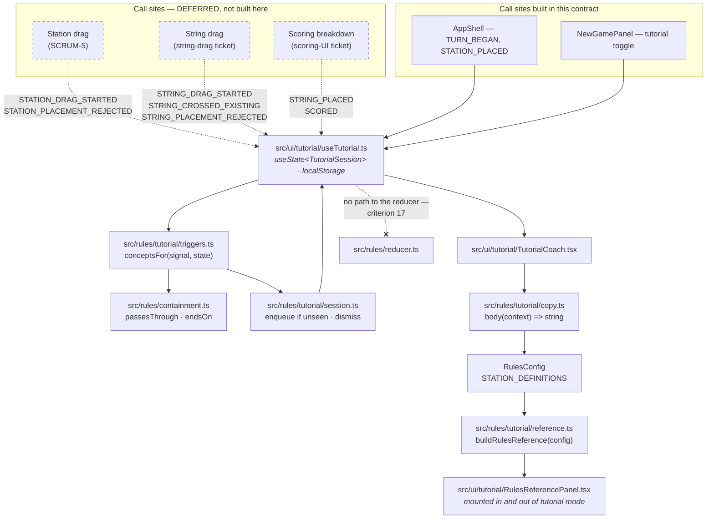

# Plan: Tutorial mode — the concept engine, the rules reference, and the coaching surfaces that exist today

Plan folder: `.claude/contract/SCRUM-11-tutorial-mode-core/`
Execution status: see `tasks.md` in this folder.

---

## Part 1 — Alignment

*(The shared understanding of what this task is doing. Restate it in your own words — this is how the developer confirms you read the brief correctly before any design happens. Mismatch here = stop and fix.)*

### Task reference

**Jira:** [SCRUM-11 — Tutorial mode — learn to play while playing](https://amazerbeam.atlassian.net/browse/SCRUM-11) (Story, parent epic SCRUM-1, status To Do).

**Problem statement, verbatim from the ticket:**

> String Railway is not a game you can work out by looking at it. A new player faces a fixed-length string they cannot stretch, three separate legality constraints on every station placement, connection values that differ depending on whether someone reached the station before them, crossing penalties that are sometimes free, and player limits counted in a unit that is not "people". The prototype enforces all of this correctly and explains none of it.
>
> That directly undermines the epic's purpose. The prototype exists to find out whether M6 and M2 make a good game, but feedback from someone who never understood that wiggling a string costs reach is feedback about confusion, not about the design. Every play-tester currently needs a person sitting next to them translating the rulebook.

**User story, verbatim:**

> As someone who has never played String Railway, I want the game to teach me as I take my first turns, so that I can form a real opinion about whether it is fun rather than spending my first game guessing what is legal.

**Acceptance criteria, verbatim:**

1. Tutorial mode is a toggle on the New Game screen, defaulting to on for a first-ever session and off once a game has been completed.
2. Tutorial mode works at every supported player count, including 2 players, and coaches the real generated board — it does not require a special scripted scenario.
3. On the first turn, the three turn steps are introduced in sequence — draw and place a station, place a railway string, score — with the current step indicated and the others visibly pending.
4. During the first station placement, the three §5.2 constraints are explained as the card moves: it may not touch any string, it may not touch another station, and must sit fully inside the border. When a position is illegal, the coaching names which constraint is being violated.
5. During the first string drag, the length budget is explained explicitly: the string is a fixed length, the whole thing must be laid, and curving to reach a nearer station spends the same length as going straight (M6). The remaining-length gauge is pointed at.
6. The first time the player's drag crosses an existing string, the −1 penalty is explained, along with the fact that a crossing on top of a station card costs nothing.
7. The first time a string passes through a station rather than ending on it, the tutorial explains that pass-through still counts as a connection and still consumes one of that station's player-limit slots (M15).
8. The first time a Terminus is on the board, the tutorial explains that strings must start or end on it and may never pass through.
9. The first scoring breakdown explains black versus grey values — black if you were the first colour to reach that station, grey otherwise — pointing at the lines in the breakdown rather than describing them abstractly.
10. Player limits are explained as counting distinct **colours**, not humans, the first time a limit blocks a placement. Rural's limit of 1 is called out as permanent lock-out for everyone else.
11. In a 2-player game, the first time a marker trigger fires between one owner's own two colours, the tutorial explains that each colour counts as a separate player, so this is correct rather than a bug (§9).
12. The first time a Scenic station sits inside the mountain, the +2 Mountain Bonus is explained.
13. The first time a Landmark or Depot is placed, the mandatory marker and its later side effect on other colours is explained; Depot's inverted 0/2 values are called out as a bait.
14. Each concept is explained at most once per session and is dismissible; dismissing one does not disable the rest.
15. A rules reference panel is reachable at any time, in or out of tutorial mode, summarising turn structure, the station glossary values from §8 and the crossing rules.
16. Every number the tutorial states — string lengths, card size, station values, deck counts — is read from `rules.json` and the station definitions, never hard-coded in tutorial copy.
17. Tutorial mode changes no rules and grants no leniency: an illegal placement is still illegal, and scores are identical to a non-tutorial game.

**Scope boundaries the ticket declared out of scope:** a scripted tutorial level with a fixed deck; suggesting or scoring move *quality*; an AI opponent; voice-over, video or animated demonstrations; localisation; persisting tutorial progress between sessions beyond the first-session default; onboarding for the debug panel.

**Risks the ticket flagged:** coaching copy written against an unstable interaction churns — *"Do not start the copy until the string drag has settled"*; criterion 16 exists because the tuning levers move; if the ticket must be trimmed, criteria 4, 5 and 9 are the irreducible core.

**Design assets:** N/A — no comps. Content derives from `.docs/Game_Rules/Rules.md` §5.2, §5.3, §5.4, §7, §8 and §9.

**Follow-up decision confirmed interactively, 2026-08-01.** The ticket's own dependency note (*"It should therefore be built after the scoring story"*) is currently unsatisfied: SCRUM-5 (station placement) is `PLANNED` and unapplied, and the string drag and the scoring-breakdown UI have no plan folder at all. Presented with four scope options, the developer chose **"Core now, wiring later"** — build the whole tutorial engine as pure `src/rules/` code plus every surface that exists today, and leave the three call sites to be wired by the tickets that create them. The developer also confirmed `react-frontend` as the only skill for execution.

### Restated goal

Build the machinery of tutorial mode now, and defer only the three call sites that cannot exist yet. Concretely: a pure, DOM-free tutorial engine under `src/rules/tutorial/` that owns the registry of teachable concepts, the copy for each one rendered as a function of `RulesConfig` and `STATION_DEFINITIONS` (so criterion 16 is structural rather than a review promise), the trigger logic that decides which concepts a given interaction should teach against the *real* generated board, and the once-per-session seen-state with dismissal. On top of it, the surfaces that are buildable against today's repo: the New Game tutorial toggle with its first-session default, the turn-step guide driven by `GameState.phase`, the dismissible coach card, and the rules reference panel — which is fully deliverable now because everything it summarises already exists in `rules.json` and `src/constants/stations.ts`. The station-placement drag, the string drag and the scoring breakdown do not exist, so this contract does not pretend to annotate them: it defines the exact signals those three tickets will emit, writes and tests the trigger logic and the copy for all of criteria 4–13, and stops at the boundary where a component would have to be invented.

### In scope

- `src/constants/tutorial.ts` — the `TUTORIAL_CONCEPT` id map (15 concepts covering criteria 3–13) and the single `localStorage` key backing the first-session default.
- `src/constants/stations.ts` — a `STATION_LABEL` map giving each `StationType` its human §8 name, used by the reference panel.
- `src/rules/tutorial/copy.ts` — the copy registry. Every body is a `(context) => string` function taking `RulesConfig` and the station definitions, so no tutorial sentence can contain a tuning literal (criterion 16), enforced by a test that renders every concept under two differently-tuned configs.
- `src/rules/tutorial/triggers.ts` — the `TutorialSignal` union (the contract the three future call sites will emit against) and `conceptsFor(signal, state)`, the pure mapping from an interaction to the concepts it should teach. Covers criteria 3–13.
- `src/rules/tutorial/session.ts` — `TutorialSession` and its pure transitions: enqueue-if-unseen, dismiss, active-concept. Criterion 14.
- `src/rules/tutorial/reference.ts` — `buildRulesReference(config)`, the pure data structure behind criterion 15: turn structure, string lengths and tolerance, crossing rules, and the §8 station glossary with deck counts.
- `src/ui/tutorial/useTutorial.ts` — the hook owning the session in local `useState`, the guarded `localStorage` read/write for the first-session default, and the signal/dismiss API. Criteria 1 and 14.
- `src/ui/tutorial/TutorialCoach.tsx` (+ CSS) — the dismissible coaching card, `aria-live` polite, ≥44px dismiss target.
- `src/ui/tutorial/TurnStepGuide.tsx` (+ CSS) — the three turn steps with current/pending state, driven by `GameState.phase`. Criterion 3.
- `src/ui/tutorial/RulesReferencePanel.tsx` (+ CSS) — reachable in and out of tutorial mode. Criterion 15.
- `src/ui/NewGamePanel.tsx` — the tutorial toggle. Criterion 1.
- `src/ui/AppShell.tsx` — wiring: mount the hook, the guide, the coach and the reference panel; mark the game completed when `state.status` becomes `ENDED`.
- Vitest coverage under `src/rules/__tests__/` for the copy registry, the triggers, the session and the reference builder — including criterion 2 (2-player and 5-player) and criterion 11 (the §9 same-owner marker trigger).

### Explicitly out of scope

- **The three deferred call sites.** No component in this contract emits `STATION_PLACEMENT_REJECTED`, `STRING_DRAG_STARTED`, `STRING_CROSSED_EXISTING`, `STRING_PLACEMENT_REJECTED`, `STRING_PLACED` or `SCORED`, because the station drag, the string drag and the scoring breakdown do not exist. The signals are defined and tested; the `useTutorial().signal(…)` calls land with SCRUM-5, the string-drag ticket, and the scoring-UI ticket. Part 2 → Approach lists each hook point precisely.
- **Visual anchoring.** Criterion 5's *"the remaining-length gauge is pointed at"* and criterion 9's *"pointing at the lines in the breakdown"* need those elements to exist. The copy names them; the coach card renders in a fixed region and does not anchor to an SVG node.
- **Component tests and the Vitest DOM environment split.** `vite.config.ts` sets `environment: 'node'` and includes only `src/**/__tests__/**/*.test.ts`, so a `.test.tsx` is neither collected nor given a DOM. Flipping that is the debt item recorded in `react-frontend/SKILL.md`; this contract deliberately keeps every test pure and in `src/rules/__tests__/`, which is why the reference panel is split into a tested pure builder plus a thin renderer.
- **Retrofitting `StationCard.tsx` to use `STATION_LABEL`.** The board currently renders the raw type key; changing board text is SCRUM-15's territory.
- Everything the ticket itself declared out of scope: a scripted tutorial level, move-quality advice, an AI opponent, voice-over/video/animation, localisation, cross-session tutorial progress beyond the one first-session flag, and debug-panel onboarding.
- Any change to `.docs/Game_Rules/Rules.md`, to `public/rules.json` values, or to the rules engine's behaviour. Criterion 17 is achieved by the tutorial having no path to the reducer at all.

### Pattern Reference

The brief supplied no code reference (Design Assets: N/A), so the references below were chosen here:

- **`.claude/skills/react-frontend/SKILL.md`** — the governing convention set; its "Tutorial copy" section already states this feature's contract.
- **`src/rules/config.ts`** — the model for a pure module that validates and exposes data with no DOM reach; `buildRulesReference` follows its shape.
- **`src/ui/useRulesConfig.ts`** — the model for a hook that owns a browser-API side effect (fetch + `AbortController` cleanup) while the pure logic sits in `src/rules/`. `useTutorial` follows it for `localStorage`.
- **`src/constants/game.ts`** — the model for an `UPPER_SNAKE_CASE` id map with a doc comment citing its rulebook section; `TUTORIAL_CONCEPT` follows it.
- **`src/rules/validate.ts`** — the source of the rejection reason codes the triggers switch on, and the model for citing §-numbers inline.

Rulebook sections the copy derives from, cited rather than restated: §5.1 (turn structure), §5.2 (the three station constraints), §5.3 + §5.3.1 (string placement, M6 fixed length), §5.3.2 (M7, M8), §5.4 (scoring, black/grey, crossings, the page-7 worked example), §7.1 (player limit counts distinct players, M15 pass-through), §7.2 (black/grey connection bonus), §7.3 (icon glossary, M16 mandatory marker), §8 (card values and the Depot/Rural notes), §8.1 (M17 deck composition), §9 (two-player variant, each colour a separate player).

### Constraints flagged on the brief

- **Criterion 16 is a hard constraint, not a preference.** Every number the tutorial states comes from `rules.json` or `STATION_DEFINITIONS`. The ticket's own risk note: *"Copy saying 'you have 350 units of string' becomes a lie the first time M2 is retuned, and a tutorial that misstates the rules is worse than none."*
- **Criterion 17 is a hard constraint.** Tutorial mode changes no rule and grants no leniency; scores must be identical to a non-tutorial game.
- **Criterion 2** — must work at every player count including 2, on the real generated board, with no scripted scenario.
- **Criterion 14** — at most once per session per concept; dismissible; dismissing one does not disable the rest.
- **The copy-churn risk** — *"Do not start the copy until the string drag has settled, or it will churn."* Addressed structurally: copy lives in a data registry keyed by concept id, so a drag redesign edits one string in one file rather than JSX scattered across components.
- **`react-frontend` standards**: `src/rules/` stays pure (lint-enforced), limits and triggers key on `ColourId`, ≥44px interactive targets, `:focus-visible`, no new runtime dependency, files under 400 lines measured not estimated.

### Assumptions made

- **Pure logic under `src/rules/tutorial/`, components under `src/ui/tutorial/`.** The skill's layout sketch shows `ui/Tutorial/`; every existing directory under `src/` is lowercase (`rules/`, `ui/`, `constants/`, `styles/`), so lowercase `tutorial/` is used for consistency. A subfolder rather than flat files because this adds six UI files to a currently flat `src/ui/`.
- **The concept id map lives in `src/constants/tutorial.ts`, not in the rules module.** Precedent: `REJECTION_REASON` and `MOVE_KIND` live in `src/constants/game.ts` while their types live in `src/rules/types.ts`. Concept ids are string-bound names referenced from both trees.
- **`TutorialSession` is local UI state in a `useState`, not a second store.** It is not game state, derives nothing from `GameState`, and never dispatches a `Move` — it is the "local UI" row of the skill's state-placement table. Calling it out because "a second `useReducer`" is an explicit NEVER and a reviewer will look here first.
- **The first-session default is one boolean in `localStorage`**, written when `GameState.status` first becomes `ENDED`. The ticket puts cross-session tutorial *progress* out of scope but criterion 1 requires exactly this one flag.
- **A `localStorage` read that throws (private mode, storage disabled) falls back to "no game completed", i.e. tutorial on.** This is not the forbidden `catch { return DEFAULTS }`: no rule value is being defaulted, only an unavailable user preference, and defaulting toward *more* teaching is the safe direction. Stated because a reviewer will otherwise flag the `catch`.
- **15 concepts, with criteria 4, 10 and 13 split into multiple ids.** Criterion 4 requires the coaching to *name which* §5.2 constraint was violated, so it becomes three concepts keyed to the three `STATION_REJECTION_REASON` codes. Criterion 10 becomes two (colour-not-humans, Rural lock-out) and criterion 13 two (mandatory marker, Depot bait) because each sentence fires on a different condition.
- **`conceptsFor` takes `(signal, state)` and not `config`.** Trigger *selection* never depends on a tuning value; only copy *rendering* does. Keeping config out of the trigger signature makes it obvious that retuning cannot change which concepts fire.
- **A concept is marked seen when it is enqueued, not when it is dismissed.** Otherwise a fast second trigger before dismissal enqueues a duplicate, which criterion 14 forbids.
- **The turn-step guide renders only in tutorial mode.** Criterion 3 sits inside the tutorial criteria and the ticket does not ask for a permanent turn tracker; the reference panel (criterion 15) is the always-available surface.
- **`STATION_LABEL` is added to `src/constants/stations.ts`** rather than a new file, because that module is already the single owner of station facts (`STATION_TYPE`, `STATION_DEFINITIONS`, `DECK_SIZE`).
- **No new `rules.json` key is required.** Audited below — every number the tutorial states already exists as a config key or a `STATION_DEFINITIONS` field. There is therefore no tuning value for the developer to choose in this contract.

### Config and persisted-shape audit

Performed against the working tree on 2026-08-01 with `Grep`, `Glob` and `Read`.

- **`rules.json` keys renamed, retyped or removed: none.** This contract is purely additive to the config surface. All eight `geometry` keys and `deck.composition` are read, never written. `Grep` for the five geometry key names across `src/**/*.{ts,tsx}` returns **82 hits**, every one a read of `RulesConfig` — the reference builder and the copy registry add to that count and change none of it. **No new key is needed**, so nothing in this contract requires a developer tuning decision.
- **Persisted shapes affected: none exist yet, and this contract opens the first one.** `Grep -rn "localStorage|sessionStorage" src` returns **0 hits** — nothing in this repo persists anything today. This contract introduces exactly one key, `TUTORIAL_STORAGE_KEY = 'stringRailway.hasCompletedGame'`, holding the string `'true'` or nothing. Recording that the window is currently open: **no saved game, no stored move log, and no other stored key exists**, so no migration is possible or needed. The `Move` union in `src/rules/types.ts:100-114` is untouched — the tutorial emits `TutorialSignal`s, which are transient UI events deliberately *not* added to `Move`, following the precedent `GAME_ACTION` set in `src/constants/game.ts:96-106`.
- **Type changes causing loss: none.** Every type introduced is new. No existing type is widened, narrowed, made optional, or changed from `number` to `string`. No existing `switch` gains a case: `TutorialSignal` and `TutorialConceptId` are new unions with no prior consumers.
- **Consumers of changed exported constants or predicates: zero changed, four reused read-only.** `STATION_DEFINITIONS` currently has **7 consumers** (`src/constants/stations.ts`, `src/rules/deck.ts`, `src/rules/scoring.ts`, `src/rules/setup.ts`, and three test files); the copy registry and the reference builder become consumers 8 and 9 without altering it. `src/rules/containment.ts`'s `passesThrough` and `endsOn`, and `src/rules/validate.ts`'s reason codes, are imported by the triggers and are not modified.
- **Name alignment across the string-bound chain.** The new names are `TUTORIAL_CONCEPT` keys (15 ids), `TutorialSignal.kind` values (8), and one storage key. Each is declared once — concept ids in `src/constants/tutorial.ts`, signal kinds inline in the `TutorialSignal` union in `src/rules/tutorial/triggers.ts` — and every consumer imports rather than restating. The copy registry is typed `Readonly<Record<TutorialConceptId, TutorialCopyEntry>>`, so a concept id with no copy is a compile error rather than a blank card at runtime. `STATION_REJECTION_REASON` and `REJECTION_REASON` are imported by the triggers, not re-spelled.
- **The `src/rules/` boundary is not crossed.** The boundary grep (`Select-String -Path src\rules\*.ts,src\rules\**\*.ts -Pattern "from 'react'|\bwindow\.|\bdocument\.|localStorage"`) returns zero hits today and must still do so afterwards. The design puts the only browser-API reach — `localStorage` — in `src/ui/tutorial/useTutorial.ts`, mirroring how `useRulesConfig.ts` owns the only `fetch`. No tutorial module under `src/rules/` imports React or touches a DOM global; `src/rules/tutorial/` contains no `.tsx` file.
- **Pre-existing literal noted, not touched.** `Grep -rnE "\b(350|700|4000|120|1400)\b" src` outside `__tests__` returns **1 hit**: `src/ui/HeroScene.tsx:22`, a decorative SVG path in the hero banner. Not a tunable, not in this contract's file set.

---

## Part 2 — Technical design

### Approach

The design turns criterion 16 from a rule reviewers must remember into a property of the type system. A concept's copy is not a string — it is `(context: TutorialCopyContext) => string`, where the context carries the loaded `RulesConfig` and the `STATION_DEFINITIONS` table. There is no way to state the short-string length except by reading `context.config.shortStringLength`, and the test that proves it renders the whole registry twice under two differently-tuned configs and asserts that every entry declaring `dependsOnConfig: true` produces different text. A hard-coded `350` fails that test rather than surviving to a play-test. The same discipline covers station values: Scenic's mountain bonus is `STATION_DEFINITIONS.SCENIC.mountainBonusValue`, Depot's bait is its `bonusFirst`/`bonusLater` pair, Rural's lock-out is its `playerLimit`, and the deck counts in the reference panel come from `config.deckComposition`.

The engine splits into four pure modules because they change for different reasons. `copy.ts` changes when the wording changes — the ticket's stated churn risk, isolated to one file so a drag redesign edits data, not JSX. `triggers.ts` changes when a rule reading changes; it is a single pure function `conceptsFor(signal, state)` over a `TutorialSignal` union, and it is the contract the three deferred call sites will code against. `session.ts` changes only if criterion 14's semantics change; it holds an immutable `TutorialSession` with enqueue/dismiss transitions and no notion of what a concept *says*. `reference.ts` changes when §8 changes; it builds a plain data structure so the panel component has no logic to test. Every one of them is DOM-free and React-free, so all of criteria 3–16's decision-making is covered by node-environment Vitest with no renderer — which is the point of the `src/rules/` boundary and the reason this contract can meaningfully land before the interactions do.

The alternative considered and rejected was putting trigger detection inside the components that own each interaction — a `useEffect` in the future `StringDrag.tsx` deciding "this is the first crossing, show the crossing card". That reads simpler at each site, but it scatters "have we taught this yet" across three components, makes criterion 14 an emergent property of three independent `useRef`s, and makes the whole feature untestable without a DOM. It would also have made this contract unbuildable, since two of the three components do not exist. The signal-based split means each future call site adds one line — `tutorial.signal({ kind: 'STRING_CROSSED_EXISTING', onCard })` — and inherits once-per-session, dismissal and copy for free. The precise hook points are: **SCRUM-5's station drag** emits `STATION_DRAG_STARTED` on pointer-down and `STATION_PLACEMENT_REJECTED` with the `StationRejectionReason` that `validateStationPlacement` already returns (criterion 4); **the string-drag ticket** emits `STRING_DRAG_STARTED` on pointer-down (criterion 5), `STRING_CROSSED_EXISTING` when incremental crossing detection first reports a hit (criterion 6), and `STRING_PLACEMENT_REJECTED` with the `RejectionReason` and `stationId` that `validateStringPlacement` already returns (criteria 8 and 10); **the scoring-UI ticket** emits `STRING_PLACED` with the committed `PlacedPath` (criterion 7) and `SCORED` with the `ScoringBreakdown` (criteria 9, 11, 12).

Trigger logic reuses the engine rather than re-deriving it, which is what keeps criterion 17 honest. Pass-through detection (criterion 7) calls `passesThrough` and `endsOn` from `src/rules/containment.ts` against `state.stations`. The §9 same-owner marker trigger (criterion 11) reads `MarkerEffectLine.sameOwner`, which `resolveScoring` already computes — the tutorial does not decide whether the trigger fired, it explains a trigger the engine reports, and consequently it works at 2 players without a single player-count branch. Black-versus-grey (criterion 9) reads `ConnectionLine.tier`; the mountain bonus (criterion 12) reads `ConnectionLine.mountainBonus > 0`. Everything is keyed on `ColourId` because every field it reads already is. Criterion 17 holds structurally: no module under `src/rules/tutorial/` imports `reducer.ts` or `turn.ts`, `useTutorial` exposes no dispatch, and `TutorialSignal` is deliberately not part of the `Move` union, so the move log — and therefore undo, replay and scoring — is byte-identical with tutorial mode on or off.

On the UI side, `useTutorial` is the only place a browser API is touched, following `useRulesConfig`'s precedent: it owns the guarded `localStorage` read for criterion 1's first-session default and the write that fires when `GameState.status` first becomes `ENDED`. The session itself is a `useState<TutorialSession>` — local UI state, not a parallel copy of `GameState`, and explicitly not a second store. `TutorialCoach` renders the head of the queue into a fixed region with `aria-live="polite"` and a ≥44px dismiss control; `TurnStepGuide` maps `GameState.phase` onto the three §5.1 steps; `RulesReferencePanel` renders `buildRulesReference(config)` and is mounted regardless of whether tutorial mode is on, per criterion 15. All three are thin by construction, because everything worth testing was pushed into `src/rules/`.

### Skills to invoke during execution

- **`react-frontend`** — owns every file in this contract. Specifically: the `src/rules/` purity boundary that the four tutorial modules must respect, the constants-versus-tunables distinction that criterion 16 rests on, colour-first keying, the ≥44px / `:focus-visible` / semantic-ARIA requirements for the coach and the reference panel, the 400-line file budget measured with `(Get-Content <file> | Measure-Object -Line).Lines`, and the "never claim a test passed without running it" posture. Its own **Tutorial copy** section is this feature's contract; its **Known debt** table is why no component test appears here. Confirmed by the developer on 2026-08-01 with no override.

Rule files the executor must Read: **none** — `Glob .claude/rules/*.md` returns only `README.md`, whose index is empty by design. Re-scan at execution time rather than trusting this line; a determinism or config-schema rule landing in the interim would constrain the copy registry.

Workflow reference the executor must Read: **`.claude/workflow/web-project.md`** — the authority on paths, the runner table, the `src/rules/` boundary grep, and the developer-owned work that must not be dispatched.

### Diagram



### Data shapes

#### `src/constants/tutorial.ts` (new)

```ts
/**
 * The teachable concepts, one id per SCRUM-11 acceptance criterion clause.
 * Criteria 4, 10 and 13 split because each clause fires on a different
 * condition and must name its own constraint.
 */
export const TUTORIAL_CONCEPT = {
  TURN_STEPS: 'TURN_STEPS', // AC 3  — §5.1
  STATION_TOUCHES_STRING: 'STATION_TOUCHES_STRING', // AC 4  — §5.2
  STATION_TOUCHES_STATION: 'STATION_TOUCHES_STATION', // AC 4  — §5.2
  STATION_NOT_INSIDE_BORDER: 'STATION_NOT_INSIDE_BORDER', // AC 4  — §5.2
  STRING_LENGTH_BUDGET: 'STRING_LENGTH_BUDGET', // AC 5  — §5.3.1 (M6)
  CROSSING_PENALTY: 'CROSSING_PENALTY', // AC 6  — §5.4
  PASS_THROUGH_CONNECTION: 'PASS_THROUGH_CONNECTION', // AC 7  — §7.1 (M15)
  TERMINUS_NO_PASS_THROUGH: 'TERMINUS_NO_PASS_THROUGH', // AC 8  — §5.3
  BLACK_VERSUS_GREY: 'BLACK_VERSUS_GREY', // AC 9  — §7.2
  PLAYER_LIMIT_IS_COLOURS: 'PLAYER_LIMIT_IS_COLOURS', // AC 10 — §7.1, §9
  RURAL_LOCKOUT: 'RURAL_LOCKOUT', // AC 10 — §8
  SAME_OWNER_MARKER: 'SAME_OWNER_MARKER', // AC 11 — §9
  SCENIC_MOUNTAIN_BONUS: 'SCENIC_MOUNTAIN_BONUS', // AC 12 — §8
  MARKER_MANDATORY: 'MARKER_MANDATORY', // AC 13 — §7.3 (M16)
  DEPOT_BAIT: 'DEPOT_BAIT', // AC 13 — §8
} as const

/**
 * AC 1 — the ONLY persisted key in this application. Holds the string 'true'
 * once any game has reached status ENDED; absent otherwise. Deliberately not a
 * record of tutorial progress: cross-session progress is out of scope.
 */
export const TUTORIAL_STORAGE_KEY = 'stringRailway.hasCompletedGame'
```

#### `src/constants/stations.ts` (modified — additive)

```ts
/** §8 display names. The board renders the raw type key; the reference panel
 *  and the tutorial copy render this. */
export const STATION_LABEL: Readonly<Record<StationType, string>> = {
  STARTING: 'Starting Station',
  HAMLET: 'Hamlet Station',
  VILLAGE: 'Village Station',
  TOWN: 'Town Station',
  SCENIC: 'Scenic Station',
  RURAL: 'Rural Station',
  TERMINUS: 'Terminus',
  RAILYARD: 'Railyard',
  LANDMARK: 'Landmark Station',
  DEPOT: 'Depot',
}
```

#### `src/rules/tutorial/copy.ts` (new)

```ts
export type TutorialConceptId = (typeof TUTORIAL_CONCEPT)[keyof typeof TUTORIAL_CONCEPT]

/** Everything a copy body is allowed to read. No literal tuning number may
 *  appear in a body; it comes from here or it does not appear (AC 16). */
export interface TutorialCopyContext {
  readonly config: RulesConfig
  readonly definitions: Readonly<Record<StationType, StationDefinition>>
}

export interface TutorialCopyEntry {
  readonly title: string
  readonly body: (context: TutorialCopyContext) => string
  /** True when the body interpolates a rules.json value. Drives the
   *  two-config differential test that enforces AC 16. */
  readonly dependsOnConfig: boolean
  /** Rulebook section shown as provenance on the coach card. */
  readonly section: string
}

/** Record, not Partial — a concept with no copy is a compile error. */
export const TUTORIAL_COPY: Readonly<Record<TutorialConceptId, TutorialCopyEntry>>

export function renderConcept(
  id: TutorialConceptId,
  context: TutorialCopyContext,
): { readonly title: string; readonly body: string; readonly section: string }
```

#### `src/rules/tutorial/triggers.ts` (new)

```ts
/**
 * The contract the three deferred call sites emit against. Transient UI events,
 * deliberately NOT added to the Move union in types.ts: Move is the persisted
 * move log that undo and replay derive from, and "the player started dragging"
 * is not an event in a game's history (AC 17). Follows the precedent
 * GAME_ACTION set in constants/game.ts.
 */
export type TutorialSignal =
  | { readonly kind: 'TURN_BEGAN' }
  | { readonly kind: 'STATION_DRAG_STARTED' }
  | { readonly kind: 'STATION_PLACEMENT_REJECTED'; readonly reason: StationRejectionReason }
  | { readonly kind: 'STATION_PLACED'; readonly card: StationCard }
  | { readonly kind: 'STRING_DRAG_STARTED' }
  | { readonly kind: 'STRING_CROSSED_EXISTING'; readonly onCard: boolean }
  | {
      readonly kind: 'STRING_PLACEMENT_REJECTED'
      readonly reason: RejectionReason
      readonly stationId?: StationId
    }
  | { readonly kind: 'STRING_PLACED'; readonly path: PlacedPath }
  | { readonly kind: 'SCORED'; readonly breakdown: ScoringBreakdown }

/**
 * Which concepts this interaction should teach, in display order. Pure and
 * config-free: retuning rules.json can change what the copy SAYS but never
 * which concepts FIRE.
 */
export function conceptsFor(
  signal: TutorialSignal,
  state: GameState,
): readonly TutorialConceptId[]
```

#### `src/rules/tutorial/session.ts` (new)

```ts
export interface TutorialSession {
  readonly enabled: boolean
  /** A concept enters `seen` when it is ENQUEUED, not when dismissed —
   *  otherwise a second trigger before dismissal duplicates it (AC 14). */
  readonly seen: ReadonlySet<TutorialConceptId>
  readonly queue: readonly TutorialConceptId[]
}

export function openTutorialSession(enabled: boolean): TutorialSession
export function noteSignal(
  session: TutorialSession,
  signal: TutorialSignal,
  state: GameState,
): TutorialSession
export function dismissConcept(session: TutorialSession, id: TutorialConceptId): TutorialSession
export function activeConcept(session: TutorialSession): TutorialConceptId | null
```

#### `src/rules/tutorial/reference.ts` (new)

```ts
export interface ReferenceStationRow {
  readonly type: StationType
  readonly label: string
  readonly first: number
  readonly later: number
  readonly playerLimit: number
  /** null for STARTING — §2 ships the five starting stations outside the deck. */
  readonly deckCount: number | null
  readonly special: string
}

export interface RulesReference {
  /** §5.1, in order. */
  readonly turnSteps: readonly string[]
  readonly stringLengths: {
    readonly short: number
    readonly long: number
    /** config.arcLengthTolerance rendered as a percentage (M6). */
    readonly tolerancePercent: number
  }
  readonly cardSize: number
  /** §5.4 + M10 + M11, one sentence each. */
  readonly crossingRules: readonly string[]
  readonly stations: readonly ReferenceStationRow[]
  readonly deckTotal: number
}

export function buildRulesReference(config: RulesConfig): RulesReference
```

#### `src/ui/tutorial/useTutorial.ts` (new)

```ts
export interface UseTutorialResult {
  readonly enabled: boolean
  readonly active: {
    readonly id: TutorialConceptId
    readonly title: string
    readonly body: string
    readonly section: string
  } | null
  setEnabled(enabled: boolean): void
  signal(signal: TutorialSignal, state: GameState): void
  dismiss(id: TutorialConceptId): void
}

/** `defaultEnabled` is read once from localStorage by the caller-facing helper
 *  below; the hook itself takes it as a plain boolean so it stays testable. */
export function useTutorial(config: RulesConfig, defaultEnabled: boolean): UseTutorialResult

/** Guarded — a throwing localStorage (private mode, storage disabled) falls back
 *  to "no game completed", i.e. tutorial on. No rule value is defaulted here. */
export function readTutorialDefault(): boolean
export function markGameCompleted(): void
```

#### Component props

```ts
interface TutorialCoachProps {
  active: UseTutorialResult['active']
  onDismiss: (id: TutorialConceptId) => void
}

interface TurnStepGuideProps {
  phase: TurnPhase
}

interface RulesReferencePanelProps {
  reference: RulesReference
}

/** src/ui/NewGamePanel.tsx — two added props, existing two unchanged. */
interface NewGamePanelProps {
  onNewGame: (playerCount: PlayerCount) => void
  disabled: boolean
  tutorialEnabled: boolean
  onTutorialEnabledChange: (enabled: boolean) => void
}
```

#### Config, dependency and script changes

No `rules.json` key added, renamed, retyped or removed — every value the tutorial states already exists. No `package.json` dependency and no new script. No `tsconfig.json`, `vite.config.ts` or `eslint.config.js` change: all tests stay `.test.ts` under `src/rules/__tests__/`, which the existing `include: ['src/**/__tests__/**/*.test.ts']` and `environment: 'node'` already cover.

### Runtime quality notes

- **Purity and adjudication:** all four `src/rules/tutorial/` modules are plain TypeScript — no `react`, no `react-dom`, no DOM global, no `.tsx`. The only browser API in the contract is `localStorage`, confined to `src/ui/tutorial/useTutorial.ts`, mirroring `useRulesConfig.ts`'s ownership of the only `fetch`. No tutorial module decides legality: `conceptsFor` consumes rejection reasons the engine already produced and calls `passesThrough`/`endsOn` from `containment.ts` rather than re-deriving containment. Every read is `ColourId`-keyed because `ConnectionLine`, `MarkerEffectLine.sameOwner` and `PlacedStation.connections` already are; no `PlayerId` enters the tutorial at all. Criterion 16 is enforced by `TutorialCopyEntry.body` being a function of `TutorialCopyContext` plus the two-config differential test.
- **Effects, mount and teardown:** two effects, both idempotent under StrictMode's double mount. (1) `useTutorial` writes `TUTORIAL_STORAGE_KEY` when `state.status` becomes `ENDED` — writing the same key twice is harmless, and it is guarded so it fires on the transition, not on every render. (2) `TutorialCoach` moves focus to the dismiss control when a new concept becomes active, cleaned up by React's own unmount. No listener, observer, timer, `requestAnimationFrame` or `AbortController` is created by this contract, so there is nothing to leak — the coach is a plain rendered card, not a floating anchored popover. No module-level mutable state anywhere: `TutorialSession` is an immutable value threaded through `useState`, so a second new game creates a fresh session with an empty `seen` set and every concept becomes teachable again. Session state is *not* reset by `newGame` implicitly — `AppShell` calls `setEnabled` / re-opens the session explicitly on NEW\_GAME so the behaviour is visible rather than emergent.
- **Hot-path cost:** the drag does not exist yet, so nothing here runs per pointer event — but the signal API is designed for it. `STRING_CROSSED_EXISTING` carries only `{ onCard: boolean }`, so the future drag emits it once at the first crossing rather than passing geometry per frame, and `conceptsFor` for that signal is a constant-time lookup with no allocation beyond the returned array. `conceptsFor` for `STRING_PLACED` is the one linear pass — over `state.stations` (≈60 at a full board) calling `passesThrough`/`endsOn` — and it runs once on commit, not during the drag. `noteSignal` returns early when the session is disabled or every candidate concept is already in `seen`, so a repeated signal costs one `Set` lookup. No `memo`, `useMemo` or `useCallback` is added: there is no profiling evidence, and adding it without evidence is itself flagged as an anti-pattern.
- **Determinism and numeric safety:** no `Math.random()`, no `Date.now()`, no seeding — the tutorial reads state, it never generates. `conceptsFor` iterates `state.stations` (an array) and `breakdown.connections` / `.markerEffects` (arrays), never object keys or a `Set`, so ordering is deterministic and the returned concept list is stable for identical input; `TutorialSession.seen` is a `Set` used only for membership, never iterated for output. The one division is `arcLengthTolerance * 100` for the reference panel's tolerance percentage — `parseRulesConfig` already guarantees that value is finite and strictly between 0 and 1, so no `NaN` can reach the rendered copy. Nothing here evaluates the ±2% check itself; `validateStringPlacement:96` remains the only place that does, and the copy describes it rather than reimplementing it.
- **Error paths:** `renderConcept` cannot miss an entry — `TUTORIAL_COPY` is typed `Record<TutorialConceptId, …>`, so an unhandled concept is a compile error, not a blank card. `readTutorialDefault` wraps its `localStorage` access in `try`/`catch` and falls back to "no game completed"; this is a genuinely unavailable *preference*, not a rule value, and it is the one place in the contract a `catch` appears — it is not a `catch { return DEFAULTS }` on config, and it is called out in the assumptions so review can judge it deliberately. `markGameCompleted` is guarded the same way and is fire-and-forget: failing to record completion means the tutorial defaults on again next session, which is the safe direction. No new async surface is introduced, so the four-state requirement is unchanged — `useRulesConfig` still owns the only one, and `RulesReferencePanel` renders only once `configState.status === 'ready'`, so it can never display a half-loaded number. Criterion 17's error path is the absence of one: the tutorial has no route to the reducer, so it cannot make an illegal placement commit.

### Risks and judgement calls

- **The copy itself is developer judgement and cannot be signed off by an agent.** Fifteen concepts of authored prose, plus the reference panel's per-station "special rules" sentences, are written in this contract from §5, §7, §8 and §9. Wording, tone and length are visual/copy judgement — explicitly developer-owned in `web-project.md`. The developer must read `src/rules/tutorial/copy.ts` and `reference.ts` and red-line the prose; that is a review step, not a blocker on landing the structure.
- **Whether the coaching lands at the right moment can only be judged by playing**, and two of the three interactions that would trigger it do not exist. What is verifiable now is that the right concept id is selected for a given signal — that is what the tests assert. Whether a card popping up mid-drag is helpful or infuriating is a play-test question deferred until the drag ships.
- **The deferred wiring is the risk this contract is trading against.** Criteria 4–13 are implemented and tested as trigger logic and copy, but nothing calls them until three other tickets add one line each. If those tickets land without wiring the signals, this feature is dead code that type-checks. Recommend adding the hook point to each of those tickets' acceptance criteria when they are planned. Named precisely in Approach paragraph 3 so nothing has to be rediscovered.
- **Criterion 5's "the remaining-length gauge is pointed at" and criterion 9's "pointing at the lines in the breakdown" are only half-delivered.** The copy names both, but there is nothing to anchor to and the coach renders in a fixed region. If the developer wants literal visual anchoring (a leader line, a highlighted element), that is a design decision for the ticket that builds the gauge, not a shortfall to fix here.
- **No component test covers the toggle, the coach or the reference panel.** `vite.config.ts` has `environment: 'node'` and a `*.test.ts`-only include, so a component test needs the DOM-environment split recorded as debt in `react-frontend/SKILL.md`. This contract deliberately does not open that; the mitigation is that the panel and coach are thin renderers over tested pure builders. If the developer would rather pay for the split now, say so at the approval gate — it is one `vite.config.ts` change plus a test-library dependency, and adding a dependency needs their yes.
- **`localStorage` is being introduced to this codebase for the first time.** One key, one boolean, guarded reads and writes. It is worth a deliberate yes because it is the first persisted surface and every later one (saved games, move logs) will follow whatever pattern this sets — including the `stringRailway.` prefix.
- **Splitting three acceptance criteria into multiple concept ids is a judgement call.** Criterion 4 becomes three ids, 10 becomes two, 13 becomes two. The alternative is one card per criterion with branching text, which would make "explained at most once per session" ambiguous when only one of the three §5.2 constraints has been hit. Worth confirming the split reads correctly.
- **The turn-step guide is tutorial-only.** If the developer wants a permanent turn tracker visible outside tutorial mode, that is a different (small) change and should be said now rather than after the wiring lands.
- **No tuning value is required by this contract.** Stated positively because it is unusual: the audit confirmed every number the tutorial states already exists in `rules.json` or `STATION_DEFINITIONS`, so there is nothing here for the developer to choose and nothing an executor could invent.
- **No rulebook ambiguity is resolved and no `[MADE UP — M#]` decision is overturned.** The copy explains M6, M8, M10, M11, M15 and M16 as the rules the engine already implements. If reading any of that copy makes the developer want to change one of those decisions, that is a design call raised against `Rules.md`, not a code change here.
