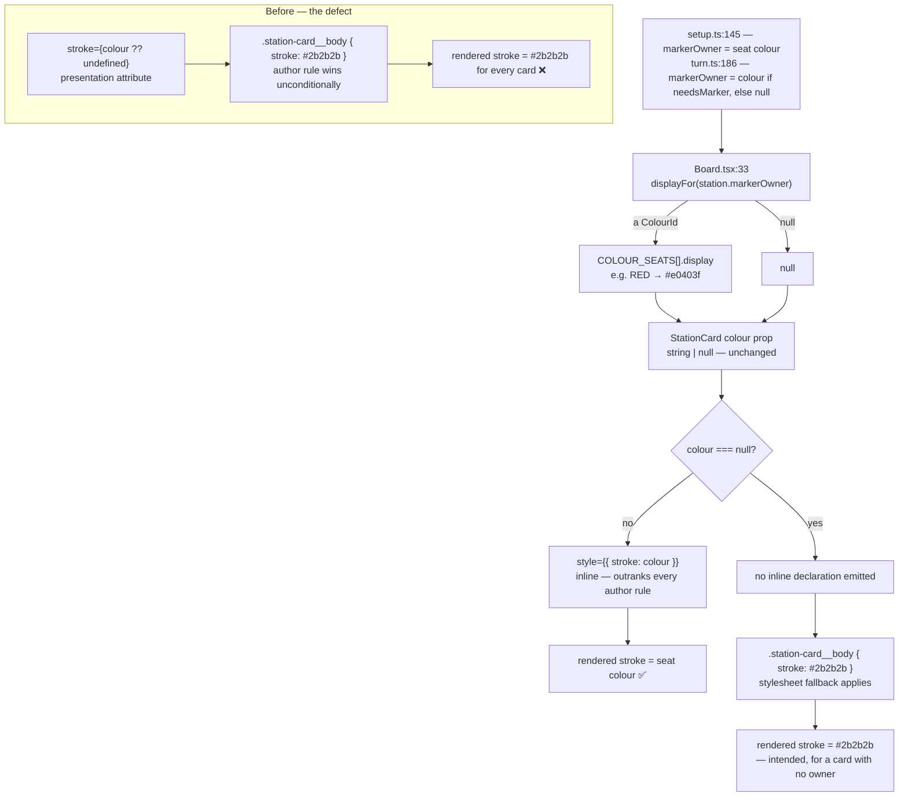

# Plan: Station cards render with no seat colour — CSS stroke overrides the per-seat colour

Plan folder: `.claude/contract/SCRUM-12-station-card-seat-colour/`
Execution status: see `tasks.md` in this folder.

---

## Part 1 — Alignment

*(The shared understanding of what this task is doing. Restate it in your own words — this is how the developer confirms you read the brief correctly before any design happens. Mismatch here = stop and fix.)*

### Task reference

**Jira:** [SCRUM-12](https://amazerbeam.atlassian.net/browse/SCRUM-12) — Bug, Medium, status `To Do`, labels `prototype-playtest` / `ui`, parent epic SCRUM-1, "relates to" SCRUM-4 and SCRUM-15.

Verbatim from the ticket:

> **Problem Statement**
>
> Every starting station renders with the same near-black outline, so the board carries no indication of which colour-seat owns which corner. The code to colour them exists and is correctly wired end to end — it is simply overridden by a stylesheet rule and never reaches the screen.
>
> This blocks SCRUM-4 acceptance criterion 12 ("in a 2-player game the board makes seat ownership readable at a glance"). In a 2-player game there is currently no way to tell from the board which two colours belong to which human. The `SeatLegend` beneath the board is unaffected and does show the colours correctly, because its swatches use `background` rather than `stroke`.
>
> It also blocks the developer's own judgement call on the `COLOUR_SEATS` palette: mutual distinguishability and WCAG AA contrast cannot be assessed while the colours are invisible on the board.
>
> **Affected Product**
>
> String Railway browser prototype — `src/ui/StationCard.css`, `src/ui/StationCard.tsx`, `src/ui/Board.tsx`.
>
> **Steps to Reproduce**
>
> 1. `npm run dev`
> 2. Open http://localhost:5173/
> 3. Click **2** to start a two-player game.
> 4. Look at the four starting station cards on the board, then at the seat legend beneath it.
>
> **Expected Behaviour**
>
> Each starting station's outline is drawn in its own seat colour (Red, Blue, Yellow, Green, Pink), matching the swatch shown for that colour in the seat legend. `Board.tsx` passes exactly this via `displayFor(station.markerOwner)`.
>
> **Actual Behaviour**
>
> All station cards are drawn in `#2b2b2b`. The `colour` prop, the `displayFor` helper and its doc comment are all effectively dead code.
>
> Cause: `StationCard.tsx` sets the colour as an SVG **presentation attribute** (`stroke={colour ?? undefined}`), while `StationCard.css` declares `.station-card__body { stroke: #2b2b2b; }`. In SVG, presentation attributes have the specificity of a rule at the very start of the author stylesheet, so any author CSS rule beats them unconditionally.
>
> Note `BoardTerrain.css` deliberately sets only `stroke-width` and lets the presentation attribute through, so this is an inconsistency between two files written in the same change, not a house style.
>
> **Environment**
>
> Chrome (driven via chrome-devtools MCP), Vite 8.2.0 dev server on localhost:5173, Windows 11, branch `SCRUM-2-4`. Confirmed visually; no console errors.
>
> **Dependencies & Risks**
>
> * Found while play-testing the SCRUM-3 / SCRUM-4 implementation.
> * Blocks SCRUM-4 AC12 and the developer's palette review.
> * Two candidate fixes: drop `stroke` from `.station-card__body` (keeping a fallback via a CSS custom property), or pass the colour as `style={{ stroke: colour }}` so it wins on specificity.
> * Low blast radius — one CSS rule and one component. No engine impact.

The ticket carries no separate acceptance-criteria field; its **Expected Behaviour** paragraph is the acceptance bar, and SCRUM-4 AC12 is the criterion it unblocks.

**Follow-up decisions confirmed interactively (2026-08-01):**

1. **Fix shape — inline style on the rect.** `style={colour === null ? undefined : { stroke: colour }}`, with `.station-card__body { stroke: #2b2b2b; }` retained as the no-owner fallback. Chosen from three options over (a) a CSS custom property, which needs an `as CSSProperties` cast, and (b) an attribute-guarded `:not([stroke])` fallback, which re-breaks silently the moment a plain `stroke:` returns to the class.
2. **Skills — `react-frontend` only.** `management-jira` was offered and declined; this contract does not transition or comment on SCRUM-12.
3. **Plan-folder collision — replace.** A concurrent session wrote a competing `plan.md` into this same folder at 08:50 while this audit was running, designing the *other* fix (drop `stroke` from the CSS, add an `UNOWNED_STATION_STROKE` constant, keep the presentation attribute). The developer chose to replace it with this plan. Two findings from that plan are carried forward here rather than discarded: the third `displayFor` copy in `DebugPanel.tsx:143`, and the "decoy CSS declaration" objection to the inline-style approach, answered in Approach and Risks.

### Restated goal

Make each station card's outline actually render in its owning colour-seat's hex, so the board shows at a glance who owns which corner. The colour is already computed correctly and passed correctly — `setup.ts:145` sets each starting station's `markerOwner` to its seat colour, `Board.tsx:33` maps that through `displayFor` to a `COLOUR_SEATS[].display` value, and `StationCard.tsx:30` receives it — but it is applied as an SVG presentation attribute, which loses unconditionally to `.station-card__body { stroke: #2b2b2b; }` in the author stylesheet. So the colour is computed, passed, written to the DOM, and then discarded by the cascade, and every card draws near-black. The fix moves the seat colour up one cascade level, onto the element's inline `style`, where it outranks any author rule, and leaves the stylesheet's `#2b2b2b` in place as a genuine fallback for a card with no `markerOwner`. No engine change, no new dependency, no config change, no type change.

### In scope

- `src/ui/StationCard.tsx` — replace the `stroke={colour ?? undefined}` presentation attribute on the `.station-card__body` rect with an inline `style` that carries the seat colour only when `colour` is non-null, so the stylesheet fallback still applies when it is null.
- `src/ui/StationCard.tsx` — correct the `colour` prop's doc comment. It currently reads "for a starting station, else null", but `turn.ts:186` sets `markerOwner: card.flags.needsMarker ? colour : null`, so a *drawn* marker station carries a colour too. The prop is per-`markerOwner`, not per-starting-station.
- `src/ui/StationCard.css` — add a comment on `.station-card__body` recording that its `stroke` is the no-owner fallback and that an owned card's colour arrives as an inline style, so the next editor neither relies on it for the seat colour nor "tidies" the two back into conflict. No declaration changes; every existing declaration stays byte-identical.
- Verification: `npm run typecheck`, `npm run lint`, `npm run format:check`, `npm test`, `npm run build`, plus scoped greps proving the presentation attribute is gone, the inline style is present, and the CSS fallback is intact.
- A `pr-description.md` in this plan folder naming everything the developer must judge by eye — chiefly the `COLOUR_SEATS` palette review that this fix unblocks.

### Explicitly out of scope

- **`src/ui/Board.tsx`.** The ticket names it as affected, but only as the caller: `displayFor` and the value it passes are already correct, and the ticket's own Expected Behaviour cites `displayFor(station.markerOwner)` as the intended source. Nothing in it changes.
- **Harmonising `BoardTerrain.css` and `HeroScene.tsx` onto one stroke-application pattern.** Both render correctly today because their stylesheets declare no competing `stroke`. Rewriting working code to erase a stylistic inconsistency has no user-visible effect and widens the diff.
- **De-duplicating `displayFor`.** Three near-identical copies exist — `Board.tsx:43` (returns `null`), `SeatLegend.tsx:73` and `DebugPanel.tsx:143` (both return `'#888888'`). A real DRY smell, raised under Risks as a follow-up, but consolidating it would touch two further components for no behaviour change and would not guard the defect being fixed here.
- **A component test for this rendering.** `vite.config.ts:11-14` sets `environment: 'node'` with `include: ['src/**/__tests__/**/*.test.ts']` — no DOM, and a `.test.tsx` is not even collected. Covering this needs `jsdom` + `@testing-library/react` plus a Vitest environment split, which is the known-debt row in `react-frontend/SKILL.md` and a dependency approval. Declined on the same grounds in SCRUM-3-4 and SCRUM-5; see Risks.
- **A source-text assertion test** (a `.test.ts` that regexes `StationCard.tsx` / `.css` to prove the attribute is gone). It asserts on implementation rather than behaviour and would fail on innocuous reformatting. The Final-verification grep does the same job without dressing up as a behavioural test.
- **Adding the owning colour's name to the station card's `aria-label`.** A genuine gap — see Risks — but SCRUM-5 Task 7 already restructures that exact label into a shared `describeStationCard()`, so doing it here creates a conflicting edit to the same lines.
- **Changing any `COLOUR_SEATS` hex.** Reviewing the palette is what this fix unblocks; changing it is the developer's visual judgement.
- **SCRUM-15** (station card text and overlay marks are fixed world units, so they do not scale with `cardSize`). Linked "relates to" and touches the same two files, but it is its own ticket with its own plan folder.
- **Anything under `src/rules/`.** No engine impact, exactly as the ticket states.

### Pattern Reference

- **`src/ui/SeatLegend.tsx:31-35`** — the in-repo precedent for a dynamic seat colour applied through React's `style` prop (`style={{ background: displayFor(seat.colour) }}`). The chosen fix is the SVG-stroke analogue, and the ticket names the legend as the one surface where these colours already render correctly.
- **`src/ui/BoardTerrain.tsx:34` + `src/ui/BoardTerrain.css`** — the presentation-attribute pattern the ticket cites as the contrast case. Read to confirm *why* it works there: `BoardTerrain.css` declares only `stroke-width`, `stroke-linejoin`, `stroke-linecap` and `stroke-dasharray`, never `stroke`. That is why it is not a template for a class which also needs a colour fallback.
- **`src/constants/setup.ts:16-22`** — `COLOUR_SEATS`, the single source of a colour's display hex, with the file header (`:1-7`) and the block comment (`:9-15`) stating why a colour is a fixed-meaning constant and not a `rules.json` tunable, and that the palette itself is the developer's visual call. Unchanged; named because getting its `display` values onto the screen is the entire point of the fix.
- **`src/rules/turn.ts:186`** — `markerOwner: card.flags.needsMarker ? colour : null` is why the null branch must keep a visible fallback rather than being treated as unreachable.
- **`src/rules/setup.ts:141-145`** — starting stations get `markerOwner: colour`; this is the data the board is currently failing to show.
- **`.claude/skills/react-frontend/SKILL.md`** — plain per-component CSS, file order (imports → constants → component → helpers → export), the 400-line budget, the accessibility expectations, and the no-new-dependency-without-justification rule.
- **Spec:** §2 (five colours of components) and §9 (each colour is a separate player for every limit and trigger) are why a per-seat outline is the right visual encoding, and why it matters most in the 2-player variant. §7.3 is the player marker that `markerOwner` represents.

### Constraints flagged on the brief

- **Low blast radius is a requirement, not an observation** — the ticket sets the expectation at "one CSS rule and one component. No engine impact." The design touches two files inside `src/ui/` and adds no constant, no module, and no key.
- **No engine impact** — nothing under `src/rules/` is changed, and no new import into it is created.
- **The fix must unblock the palette review.** Afterwards the five `COLOUR_SEATS` hexes must be visible on the board and directly comparable against the legend swatches, so mutual distinguishability and WCAG AA contrast can be assessed by eye.
- **The rendered colour must match `SeatLegend`'s swatch for the same colour.** Both resolve through `COLOUR_SEATS[].display` — there must be no second palette.
- **`SeatLegend` must keep working.** The ticket calls it out as unaffected; nothing in this change touches it.
- **Two runtime dependencies stay two,** and no devDependency is added either.
- **SCRUM-4 AC12 is the acceptance bar** — "in a 2-player game the board makes seat ownership readable at a glance" — and "at a glance" is confirmable only by the developer looking at the running app.

### Assumptions made

- **Fix shape: inline style on the rect — developer-confirmed 2026-08-01, not assumed.** Recorded here so execution does not re-litigate it against the two rejected alternatives.
- **The CSS fallback stays in the stylesheet rather than moving into a TypeScript constant.** `#2b2b2b` is already there (`StationCard.css:3`), it is a colour with fixed meaning rather than a tunable, and a stylesheet cannot import a TS constant. Leaving it put means no pixel changes for an unowned card and no new export.
- **The fallback keeps its exact current value, `#2b2b2b`.** This is a transcription of what is on screen today, not a chosen value — so it is not a tuning decision routed to the developer. Any change to it would be.
- **The null branch is written as an explicit `colour === null` conditional** rather than relying on React dropping `style={{ stroke: undefined }}`. Both render identically; the conditional makes the two-state intent legible and guarantees no inline declaration exists in the fallback case, which is what lets the stylesheet apply cleanly.
- **`StationCardProps` keeps its exact name and type, `colour: string | null`.** SCRUM-5 Task 7 (status `PLANNED`, not yet applied) adds a `.station-card__marker` circle that reads this same prop; renaming or retyping it would invalidate that contract's code snippets.
- **`Board.tsx` is treated as correct and left untouched,** narrowing the ticket's three named files to two. The ticket's own Expected Behaviour endorses what `Board.tsx` already passes.
- **The CSS comment is in scope as part of the fix, not as tidying.** Splitting the seat colour and its fallback across two files creates a stylesheet declaration that no longer controls an owned card's outline. The comment is what stops that reading as the live value — the mitigation for the one real objection to the chosen approach.
- **No automated test is added, and the contract says so plainly.** There is no DOM environment and no `.tsx` collection in the suite, and the defect is a cascade behaviour only a renderer can observe. The regression guard is a Final-verification grep plus the developer's visual check.
- **The doc-comment correction on the `colour` prop is in scope.** The ticket itself names the prop's doc comment as part of the dead code the fix revives, and the comment is factually wrong about drawn marker stations.

### Config and persisted-shape audit

- **`rules.json` keys — none touched.** The eight `geometry` keys (`borderPerimeter`, `cardSize`, `shortStringLength`, `longStringLength`, `mountainLength`, `riverLength`, `arcLengthTolerance`, `tangencyTolerance`) and nine `deck.composition` keys in `public/rules.json` are neither read nor renamed by this change. No key is added, so no unchosen tuning value arises and nothing is routed to the developer on that axis.
- **Persisted / stored shapes — none exist, and none is affected.** `Grep "localStorage|sessionStorage|indexedDB"` across `src/**` returns **0 hits**. Nothing is persisted, no move log is written to storage, and no `Move` kind or field changes — so no save-migration concern applies. Recorded explicitly because that window is still open; the first story that persists a move log closes it.
- **Type changes — none, and the no-loss case is the reason.** `colour` stays `string | null`. None of the four loss cases applies: no `number` → `string`, no array → object, no required → optional, no widened union, so no `switch` grows a case and no consumer's assumption changes. Holding this signature fixed is a deliberate constraint, not an accident — see the SCRUM-5 note above.
- **String-bound CSS class names — all five enumerated, none renamed.** `Grep "station-card"` returns **13 hits in `src/`**: 6 in `StationCard.tsx`, 7 in `StationCard.css`, and 0 elsewhere in `src/`. (A further 22 hits sit inside two `.claude/contract/` plan documents — historical SCRUM-3-4 snippets and SCRUM-5's pending `.station-card__marker` — which are planning prose, not code.) `.station-card__body` specifically: **1 hit in the TSX, 1 in the CSS**, both preserved verbatim, so there is no class-name rename risk.
- **Consumers of changed exported symbols — none, because nothing exported changes.** `StationCard` has exactly **1 consumer** (`Board.tsx:3` imports it; `Board.tsx:30-34` renders it) and its props are unchanged. `COLOUR_SEATS` has **3 consumers** (`Board.tsx:4`, `SeatLegend.tsx:1`, `DebugPanel.tsx:2`), all untouched. `displayFor` is a module-private function in **3 separate files** (`Board.tsx:43`, `SeatLegend.tsx:73`, `DebugPanel.tsx:143`) — none exported, none called across a module boundary, and only `Board.tsx`'s feeds this render path.
- **Names align across the chain.** `COLOUR_SEATS[].display` → `Board.displayFor()` → `StationCard` `colour` prop → the rendered inline `stroke`. `SeatLegend.displayFor()` and `DebugPanel.displayFor()` resolve against the same `COLOUR_SEATS[].id`, so the board, the legend and the debug panel cannot diverge on a colour. No `data-testid` exists anywhere in `src/` (**0 hits**), and no `aria-*` id, SVG id, or rejection reason code changes.
- **The `src/rules/` boundary is not crossed.** `Select-String -Path src\rules\*.ts,src\rules\**\*.ts -Pattern "from 'react'|\bwindow\.|\bdocument\.|localStorage"` returns **0 hits** on the pre-change tree, and this contract creates no file under `src/rules/` and no new import into it. The change is confined to `src/ui/`.

---

## Part 2 — Technical design

### Approach

The defect is a cascade fact, not a logic error. In SVG a presentation attribute such as `stroke="#e0403f"` participates in the cascade as though it were a rule at the very start of the author stylesheet, so *any* author rule of any specificity beats it. `StationCard.css:3` declares `.station-card__body { stroke: #2b2b2b; }` and wins over the attribute on `StationCard.tsx:30` every single time. Everything upstream is already correct — `setup.ts:145` assigns each starting station's `markerOwner`, `Board.tsx:33` maps it through `displayFor` to a `COLOUR_SEATS[].display` hex, and the prop arrives at the rect intact. Only the final hop fails, which is exactly why the bug is invisible to the type checker, the linter and every existing test.

The fix moves the colour one level up the cascade into the element's inline `style`, which outranks author rules regardless of specificity. `StationCard.tsx:30` becomes `style={colour === null ? undefined : { stroke: colour }}` and the `stroke` attribute is deleted. The explicit null test is deliberate: `style={{ stroke: undefined }}` would also work, since React omits undefined declarations, but the conditional states the two-state intent and guarantees that in the fallback case no inline declaration exists at all, so the stylesheet applies cleanly rather than by omission. That branch is live code, not defensive padding — `turn.ts:186` gives a drawn station `markerOwner: null` unless its card sets `needsMarker`, so once SCRUM-5's placement flow lands, unowned cards become the common case and they must keep a visible outline.

Two alternatives were considered and rejected. **A CSS custom property** — `stroke: var(--station-card-stroke, #2b2b2b)` fed by `style={{ '--station-card-stroke': colour } as CSSProperties}` — keeps the fallback declarative in the stylesheet, which is genuinely tidier, but `@types/react`'s `CSSProperties` has no index signature for `--*` keys, so it requires a type assertion, and the house rule wants a stated justification for every cast. Trading a cast for a comment is the wrong direction on a two-line fix. **An attribute-guarded fallback** — `.station-card__body:not([stroke]) { stroke: #2b2b2b; }`, keeping the presentation attribute — would be literally consistent with `BoardTerrain.css`, but it makes correctness depend on a subtlety no reader would infer: the next person who adds a plain `stroke:` to that class reintroduces this exact bug with no visible cause. A third design, considered because a concurrent planning session chose it, **drops `stroke` from the CSS entirely and has the component always supply one** via a new `UNOWNED_STATION_STROKE` constant. Its strongest argument is real and worth answering rather than dismissing: with the inline-style fix, `stroke: #2b2b2b` remains in `StationCard.css` looking like it controls the outline when for an owned card it no longer does — a decoy. The mitigation is the in-scope CSS comment naming it as the no-owner fallback; the reason for preferring the inline style anyway is that it adds no exported constant, keeps a colour literal in the stylesheet where every other card colour in that file already lives (`fill: #fdfaf3`, three text fills, the pawn stroke), and has a direct precedent in `SeatLegend.tsx:33`.

None of this is rules-engine work. There is no invariant, no geometry, no adjudication and no state transition — the component renders a colour it was handed. So all of it stays in `src/ui/`, and none of it can be unit-tested in this repo today: `vite.config.ts:11-14` runs the suite under `environment: 'node'` with an `include` glob of `*.test.ts` only. That is deliberate — it is half of what enforces the `src/rules/` purity contract at runtime — and `react-frontend/SKILL.md` records paying it off as the job of the story that adds the first component test. Verification here is therefore the four static gates plus the full existing suite, two scoped greps proving the attribute is gone and the fallback intact, and the developer's eyes on the running board. The contract states that plainly instead of manufacturing a test that would assert on source text.

### Skills to invoke during execution

- **`react-frontend`** — owns everything under `src/ui/`: the plain per-component CSS convention, the file order (imports → constants → component → helpers → export), the 400-line budget, the accessibility expectations on board elements, and the no-new-dependency-without-justification rule. Developer-confirmed on 2026-08-01 as the only skill for this contract.
- **`management-jira`** — offered and **explicitly declined** by the developer. No SCRUM-12 transition or comment is part of this contract; closing the ticket is the developer's.

Files the executor must Read: `.claude/workflow/web-project.md` (paths, runners, correctness traps). `.claude/rules/` was scanned and contains only `README.md` with an empty index (**0 rule files**), so no shared rule constrains this design — re-scan rather than trusting this line, since rules may have been added since.

### Diagram



### Data shapes

No type, config, or contract changes. `StationCardProps` keeps its exact shape — held fixed deliberately, because SCRUM-5 Task 7 (`PLANNED`) adds a marker glyph reading the same `colour` prop. Only the doc comment changes:

```ts
interface StationCardProps {
  station: PlacedStation
  /** The display hex of the colour owning this card's §7.3 player marker, or
   *  null when the card carries no marker. */
  colour: string | null
}
```

The one expression that changes is the stroke application on the `.station-card__body` rect:

```tsx
// before — src/ui/StationCard.tsx:30
stroke={colour ?? undefined}

// after
style={colour === null ? undefined : { stroke: colour }}
```

Inferred as `React.CSSProperties | undefined` from the `rect` element's `style` prop — no annotation, no cast, no `any`.

`src/ui/StationCard.css` gains a comment only; every declaration in the file stays byte-identical:

```css
/* stroke here is the fallback for a card with no markerOwner. An owned card's
   seat colour arrives as an inline style from StationCard.tsx, which outranks
   this rule — do not re-apply the colour as an SVG presentation attribute, it
   loses to any author rule (SCRUM-12). */
.station-card__body {
  fill: #fdfaf3;
  stroke: #2b2b2b;
  stroke-width: 3;
}
```

No `rules.json` key, no `src/constants/` entry, no new export, no `Move` variant, no reducer action, no `package.json` script or dependency change.

### Runtime quality notes

- **Purity and adjudication:** Nothing under `src/rules/` is touched, imported, or newly depended on — the change is two files inside `src/ui/`. No rule is adjudicated: the component renders a colour it was handed and decides no legality. Keying stays on `ColourId` throughout — `station.markerOwner` is `ColourId | null` (`types.ts:56`) and `Board.displayFor` resolves it against `COLOUR_SEATS[].id`; no `PlayerId` enters this path, and `SeatLegend.tsx:53-71` remains the only `PlayerId` read in `src/ui/`, untouched. No tunable is involved: the two hexes in play are `COLOUR_SEATS[].display` (a fixed-meaning constant per §2) and the CSS fallback `#2b2b2b`. Neither is an M2 or M17 lever, and since a stylesheet cannot import a TypeScript constant, the literal remaining in CSS is correct rather than a hard-coded tunable.
- **Effects, mount and teardown:** No effect, listener, observer, timer, `requestAnimationFrame`, `AbortController`, ref, or module-level mutable state is added or changed. `StationCard` stays a pure function of its props, so StrictMode's double-invocation is a no-op for it, there is no cleanup to write, no pointer capture is involved, and starting a second new game re-renders from fresh `GameState` with nothing to reset.
- **Hot-path cost:** Not on the drag path — `StringDrag` does not exist yet (SCRUM-6), and station cards re-render only when committed state changes, roughly once per turn. The change allocates one small object literal per owned card per render (at most 5 starting cards, ~35 at a full board) in place of one string attribute; immaterial. No memoisation is added and none is warranted, so the "no `memo`/`useMemo` without profiling evidence" rule is not engaged. No search, no crossing detection, no per-pointer-event work.
- **Determinism and numeric safety:** No arithmetic, division, epsilon, or coordinate is computed, so no `NaN` can reach a coordinate and no divisor needs guarding. No randomness: `COLOUR_SEATS` is a fixed ordered tuple and `Math.random()` is not reachable from this path. Rendering stays a pure function of `GameState`, so an identical seed still produces an identical board — now with visible colours, which makes a seeded board easier to verify by eye, not harder. The M6 ±2% arc-length check is not in scope.
- **Error paths:** No new failure mode and no new async surface, so the four async states do not arise and there is nothing to `catch`. The single branch is `colour === null`, handled explicitly rather than swallowed: it emits no inline declaration and the stylesheet draws a visible `#2b2b2b` outline, so an unowned card can never render strokeless and invisible. `Board.displayFor`'s existing `?? null` on an unrecognised colour id continues to land in that same visible-fallback branch rather than crashing or drawing nothing — a degraded-but-legible failure, which is the right shape for a rendering path.

### Risks and judgement calls

- **The fix leaves a decoy declaration in the stylesheet, and a comment is the whole mitigation.** After this change, `stroke: #2b2b2b` in `StationCard.css` governs only unowned cards, yet reads like the outline colour. This is the strongest argument for the rejected "drop `stroke` from CSS, add an `UNOWNED_STATION_STROKE` constant" design, and it is a judgement call rather than a settled matter. If you would rather the fallback and the live colour sit together in one file, say so and the constant-based variant is a small rewrite of this plan.
- **The palette is yours to judge, and this fix is what makes judging it possible.** Once the outlines render, check the five `COLOUR_SEATS[].display` hexes (`src/constants/setup.ts:16-22`) for mutual distinguishability, for contrast against the terrain strokes — border `#2b2b2b`, river `#3f9fd0`, mountain `#3f7d4a` — against the card fill `#fdfaf3`, and for WCAG AA. Green `#3aa757` beside mountain green `#3f7d4a` is the pair I would look at first. Changing any hex is your call, not the executor's.
- **The no-owner fallback `#2b2b2b` is the same hex as the border terrain stroke.** Pre-existing and not introduced here, and invisible until SCRUM-5 puts unowned drawn cards on the board — but worth a look then, because an unowned card outlined in border-black may read as terrain rather than as a card.
- **Colour becomes the only channel carrying seat ownership on the board.** The station card's `aria-label` (`StationCard.tsx:20`) names the type, bonuses and player limit but not the owning colour, so ownership is unavailable to a screen reader and to anyone who cannot separate two of the five hexes — WCAG 1.4.1. Deliberately not fixed here because SCRUM-5 Task 7 restructures that exact label into a shared `describeStationCard()`, so folding the colour name in there is one clean change instead of two conflicting ones. Say if you would rather it land now.
- **This class of bug is only catchable by eye, and will stay that way.** Every static gate and all existing tests pass on the *broken* code — that is precisely what let it ship. Reversing that means approving `jsdom` + `@testing-library/react` and a Vitest environment split, which would also pay off the known-debt row in `react-frontend/SKILL.md`. Declined on the same grounds in SCRUM-3-4 and SCRUM-5; two new devDependencies remain your decision, not the executor's.
- **`displayFor` is duplicated three times** — `Board.tsx:43` (returns `null`), `SeatLegend.tsx:73` and `DebugPanel.tsx:143` (both return `'#888888'`) — with divergent null behaviour. Left alone to hold the blast radius at one component, but a reviewer will flag it. Extracting a shared `src/ui/` helper is a small follow-up ticket if you want it.
- **SCRUM-5 is `PLANNED` and edits both of these files.** Its Task 7 adds a `.station-card__marker` circle reading this same `colour` prop plus a CSS block. This contract holds `StationCardProps` byte-identical so those snippets still apply, but whichever lands second needs a trivial reconcile in `StationCard.tsx` and `StationCard.css`. Order affects the diff, not correctness.
- **A concurrent session's competing `plan.md` for this folder was replaced on your instruction.** If that session is still running it may write a `tasks.md` matching *its* design, which would contradict this plan. Worth a glance at the folder before `/fb-apply`.
- **Confirming the fix requires you to run the app.** `npm run dev`, start a 2-player game, and check each of the four starting cards' outlines against the legend swatch for the same colour name. No agent can perform this step and no test in this repo covers it.
- **SCRUM-15 touches the same two files.** Not addressed here. If you would rather batch both into one pass through `StationCard.tsx`, say so before execution starts.
