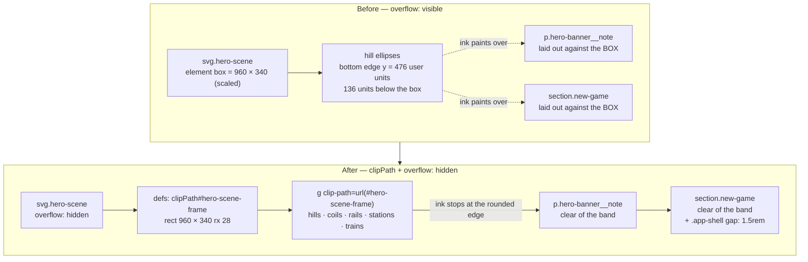

# Plan: Hero banner artwork overlaps and sits behind the New Game panel

Plan folder: `.claude/contract/SCRUM-13-hero-banner-artwork-overlap/`
Execution status: see `tasks.md` in this folder.

---

## Part 1 — Alignment

### Task reference

**SCRUM-13** — *Hero banner artwork overlaps and sits behind the New Game panel* (Bug, Medium, labels `prototype-playtest` / `ui`, child of epic SCRUM-1). Fetched from Jira 2026-08-01.

> **Problem Statement**
> The decorative artwork in `HeroScene` extends below its intended area and collides with the New Game panel and the "Early prototype" caption. The player-count buttons render on top of the hero's green ellipses, and at narrow widths the caption text sits directly over the artwork. It is the first thing seen on page load and reads as broken layout.
>
> **Affected Product**
> String Railway browser prototype — `src/ui/HeroScene.tsx` / `HeroScene.css`, `src/ui/HeroBanner.css`, `src/ui/AppShell.css`.
>
> **Steps to Reproduce**
> 1. `npm run dev`
> 2. Open http://localhost:5173/ at a wide viewport (around 1440px) and look at the area between the hero artwork and the "New game" heading.
> 3. Resize the window to roughly 520px wide and look at the "Early prototype — the board, the station deck and the fixed-length string drag are on their way." caption.
>
> **Expected Behaviour**
> The hero artwork occupies its own bounded band. The caption and the New Game panel sit clearly below it against the page background, with no overlap at any viewport width.
>
> **Actual Behaviour**
> The hero's decorative ellipses bleed downward past the banner. At 1440px the New Game buttons and heading overlap them; at 520px the caption text renders over the artwork, hurting legibility.
>
> **Environment**
> Chrome (driven via chrome-devtools MCP), Vite 8.2.0 dev server on localhost:5173, Windows 11, branch `SCRUM-2-4`. Reproduced at 1440x900 and 520x760.
>
> **Dependencies & Risks**
> * Pre-existing from the SCRUM-8 scaffold; not introduced by SCRUM-3 / SCRUM-4, but first made visible by them because the New Game panel now sits directly beneath the banner.
> * `AppShell` deliberately keeps `HeroBanner` so the scaffold work is not discarded — the fix should preserve that.
> * Presentation only. No engine or state impact.

Skill confirmation, 2026-08-01: developer selected `react-frontend` only; `management-jira` was offered and declined, so this contract does not transition the ticket.

### Restated goal

The hero SVG paints outside its own box. `src/ui/HeroScene.css` sets `overflow: visible` on the `<svg>`, and three decorative "hill" ellipses are positioned deliberately below the `viewBox` bottom edge — the largest reaches 136 user units past it. Nothing clips them, so they paint over whatever follows in the page flow: the "Early prototype" caption inside `HeroBanner`, and the New Game panel below it. This task bounds the artwork to the rounded banner rectangle it already draws as its own background, so the scene ends where its background ends, and gives the shell explicit vertical spacing so the caption and the panel sit clearly below the band on the page background. It is a presentation-only fix — no component API, no engine, no state, no config.

### In scope

- Clip every painted element of `HeroScene` to the rounded rectangle it already draws (`960 × 340`, `rx="28"`), via an SVG `clipPath` defined in the same `<defs>` block as the existing `hero-sky` gradient.
- Replace `overflow: visible` in `src/ui/HeroScene.css` with an explicit `overflow: hidden`, so nothing added to the scene later can bleed out of the element box even if the clip is edited.
- Add explicit vertical rhythm to `.app-shell` in `src/ui/AppShell.css` (a flex `gap`) so the hero band, the New Game panel, the status/error blocks and the game section are separated by one owned value rather than by per-child margins that produce no space between the banner and the panel at all.
- Keep `HeroBanner` mounted and unchanged in `AppShell.tsx`, per the ticket's dependency note.
- Confirm the fix by static gates plus a developer visual check at the two repro viewports (1440×900 and 520×760).

### Explicitly out of scope

- Redesigning the hero scene — hill positions, colours, train paths, station cards, sparkles and every animation stay exactly as they are. Only the clip changes what is visible.
- Removing or replacing `HeroBanner`, or moving it out of `AppShell`.
- Any change to `src/rules/`, `public/rules.json`, the reducer, the board, or the New Game panel's own markup and styling.
- Adding component-test infrastructure (`jsdom`, a Testing Library, a Vitest environment split). The `react-frontend` skill's Known-debt table already records this gap and pins it to the first story that needs a component test; SCRUM-13 is not that story.
- `justify-content: center` on `.app-shell`, which will make the top of the page unreachable once a tall board renders. Real, adjacent, and a separate behaviour change — raised under Risks rather than fixed here.
- Horizontal bleed of the trains as a *design* question. The clip incidentally stops trains flying over the page margins; whether they should instead fade at the edges is a visual judgement, not a defect.

### Pattern Reference

None supplied by the ticket beyond the four affected files. References chosen:

- `src/ui/HeroScene.tsx:80-88` — the existing `<defs>` + `<linearGradient id="hero-sky">` + background `<rect width="960" height="340" rx="28">`. The new `clipPath` is defined alongside the gradient and reuses that rect's exact geometry, so the clip and the background can never disagree about where the band is.
- `src/ui/AppShell.css:1-9` — the existing `.app-shell` flex column; the spacing change is a `gap` on that same rule, not a new wrapper.
- `.claude/skills/react-frontend/SKILL.md` — plain CSS per component, file order (imports → constants → component → helpers → export), the 400-line budget, and the Known-debt entry that explains why no component test is planned.
- No rulebook section applies. `HeroScene.tsx:5-6` states in a comment that its geometry is decorative and not game geometry; that remains true, and none of these numbers is an M-value.

### Constraints flagged on the brief

- **Presentation only.** "No engine or state impact" — nothing under `src/rules/` and no `GameState` change.
- **Keep `HeroBanner`.** The scaffold work is deliberately retained; the fix must not delete it to make the overlap go away.
- **No overlap at *any* viewport width** — not just the two reproduced. The fix must be scale-independent, which rules out pixel-valued spacers tuned to one breakpoint.
- **Verification is visual and is the developer's.** The bug was found in Chrome via the chrome-devtools MCP at 1440×900 and 520×760; those are the checks that close it.

### Assumptions made

- **The root cause is `overflow: visible` plus out-of-`viewBox` hills, not the flex layout.** Measured from source: `viewBox="0 0 960 340"`, hills at `cy=352 ry=96` (bottom 448), `cy=366 ry=110` (bottom 476), `cy=356 ry=84` (bottom 440) — up to 136 user units below the box. Flex centring does not compress anything; the overlap is pure overflow paint.
- **Clipping is the fix, not repositioning the ellipses.** The hills are drawn as arcs meant to be cut off by the band edge; raising them inside the `viewBox` would change the composition and still leave the rails (`x` from −60 to 1020) and their trains painting outside horizontally.
- **An SVG `clipPath` is used rather than CSS `border-radius` + `overflow: hidden`.** The band's corner radius is `rx="28"` in user units and therefore scales with the element; a CSS `28px` radius would not, and the clip would visibly disagree with the painted background at narrow widths.
- **A static `clipPath` id (`hero-scene-frame`) is acceptable.** SVG ids are document-global, so two mounted `HeroScene`s would collide — but the component is mounted exactly once, and the file already relies on this with `id="hero-sky"`. Matching the existing convention beats introducing `useId` for a single-instance decorative component.
- **`HeroBanner.css` needs no change.** Inspected: the caption's separation is the `.hero-banner` flex `gap: 0.75rem`, which is real space once the artwork stops painting over it. Listed on the ticket as an affected file, but the defect is not in it. If 12px reads tight after the fix, that gap is the value to change — routed to the developer, not guessed at now.
- **Spacing belongs on `.app-shell` as a `gap`, with the children's now-redundant vertical margins zeroed in the same edit.** Leaving `margin: 1rem 0` on the status and error blocks and `margin-top: 1.2rem` on the game section alongside a new `gap` would stack two spacing systems; one owned value is the simplest thing that works.
- **`gap: 1.5rem` is a layout rhythm value, not a tunable.** `rules.json` owns game geometry (M2) and deck composition (M17). Stylesheet spacing is not in that surface and does not belong there.
- **No automated test accompanies this change.** `vite.config.ts` sets `environment: 'node'` and includes only `src/**/__tests__/**/*.test.ts`; there is no DOM, no Testing Library, and no `.test.tsx` collection. A meaningful test would also have to assert *paint overflow*, which jsdom does not compute. Verification is the static gates plus the developer's eyes.

### Config and persisted-shape audit

- **`rules.json` keys:** none touched. `Grep "hero"` across `src/` returns 60 hits in 6 files, all under `src/ui/`; `HeroScene.tsx:5-6` documents that its geometry is decorative and not read by `src/rules/`. No key is renamed, retyped, or removed.
- **Persisted shapes:** nothing is persisted. `Grep "localStorage|sessionStorage|data-testid"` across `src/` → **0 hits in 0 files**. No saved game, no move log on disk, no test-id surface to keep in step. Recording this while it is still true: the window for changing stored shapes freely is open as of 2026-08-01.
- **Type changes:** none. No exported type, function signature, or component prop changes; `HeroScene` takes no props before or after.
- **Consumers of changed exports:** none — nothing is exported or renamed. `HeroScene` has exactly one importer (`HeroBanner.tsx:2`), and `HeroBanner` exactly one (`AppShell.tsx:4`); both call sites are unchanged.
- **String-bound names:** the new SVG id `hero-scene-frame` is introduced, **0 existing hits** in `src/`, so no collision. The existing `id="hero-sky"` has **2 hits** (definition at `HeroScene.tsx:81`, reference at `:88`) and is untouched. `Grep "clipPath|clip-path"` → **0 hits**, so this is the first clip in the codebase. CSS class names changed: none — `.hero-scene__hills` (declared at `HeroScene.tsx:90`, **0 hits in any stylesheet**) is a pre-existing grouping hook with no rule attached and stays as-is. `.app-shell`, `.app-shell__status`, `.app-shell__error`, `.app-shell__game` keep their names; only their declarations change.
- **The `src/rules/` boundary:** not crossed. No file under `src/rules/` is in the change set, and the design needs no DOM global or React import there. The boundary grep is re-run in Final verification as a cheap regression check.

---

## Part 2 — Technical design

### Approach

The defect has one cause with two symptoms. `src/ui/HeroScene.css:5` sets `overflow: visible` on the root `<svg>`, overriding the user-agent default of `hidden`, and the scene's three hill ellipses are authored deliberately below the `viewBox` bottom edge so they read as arcs cut off by the horizon. With overflow visible, "cut off by the horizon" never happens: the largest ellipse (`cx=620 cy=366 ry=110`) paints 136 user units past the box. The element's rendered height is `340 × scale`, but its ink extends `136 × scale` further, and the browser lays out the following content against the *box*. At the ticket's wide repro the shell's content width is 976px (`max-width: 64rem` less `1.5rem` padding each side), so scale ≈ 1.02 and the ink runs ~138px into the New Game panel; the buttons have their own `background: #fdfaf3` and paint later in tree order, so they land on top of green — exactly what the ticket describes. At 520px the content width is 472px, scale ≈ 0.49, the ink runs ~67px down, and the `.hero-banner` flex `gap` of 12px is nowhere near enough to keep the caption off it. Same cause; the two symptoms differ only because text paints over the artwork while a backgrounded button paints over it opaquely.

The fix bounds the ink to the box. `HeroScene` already draws its own band — `<rect width="960" height="340" rx="28" fill="url(#hero-sky)">` — so the band's shape is already stated once in the file. A `<clipPath id="hero-scene-frame">` holding a rect with those same four values goes into the existing `<defs>` next to the `hero-sky` gradient, and every painted element after `<defs>` moves inside a single `<g clipPath="url(#hero-scene-frame)">`. The hills then terminate exactly at the rounded edge of their own sky, which is what the composition was drawn for. `overflow: visible` becomes `overflow: hidden` in the same change — not because the clip needs it, but so a future element added outside the `viewBox` cannot reintroduce this bug while the clip quietly does nothing about it.

Two alternatives were rejected. **Repositioning the ellipses inside the `viewBox`** treats the symptom in the one place the design is deliberate, flattens the horizon arcs, and leaves the rails — authored from `x = −60` to `x = 1020` so trains enter and exit off-scene — still painting over the page margins. **CSS `border-radius: 28px` with `overflow: hidden`** clips the element box correctly but in CSS pixels, while the painted background's `rx="28"` is in user units and scales with the element; at 520px wide the CSS corner would be 28px against a painted corner of ~14px, and the mismatch shows as a pale sliver at each corner. The `clipPath` is in the same coordinate system as the rect it mirrors, so the two cannot drift.

The second, smaller half of the fix is vertical rhythm. `.app-shell` is a flex column with no `gap`; `HeroBanner` and `NewGamePanel` are adjacent flex items with no margin between them, so even with the artwork clipped the panel sits flush against the band. A `gap: 1.5rem` on `.app-shell` gives every child the same separation, and the per-child vertical margins that exist today (`margin: 1rem 0` on `.app-shell__status` and `.app-shell__error`, `margin-top: 1.2rem` on `.app-shell__game`) are zeroed in the same edit so one rule owns the spacing rather than two systems adding up. Nothing here goes near `src/rules/`: there is no logic, no predicate, and no state — the whole change is one JSX wrapper element, one `defs` entry, and three CSS rules, which is why no module moves and no hook is introduced.

### Skills to invoke during execution

- `react-frontend` — owns everything under `src/`. For this task specifically: plain per-component CSS (no modules, no CSS-in-JS), the file order in `HeroScene.tsx`, the 400-line budget, the accessibility posture on anything interactive, and the Known-debt entry explaining why no component test is added.

Developer override: `management-jira` was offered at the classification gate and declined, so no Jira transition task appears in `tasks.md`.

Also Read before executing: `.claude/workflow/web-project.md` (paths, runners, the `Select-String` and Vitest traps). `.claude/rules/` was scanned — it contains only `README.md`, so no shared rule applies to this change.

### Diagram

### Data shapes

No type, config, or contract changes. `HeroScene` takes no props before or after; nothing is exported, renamed, or removed; no `rules.json` key, `Move` variant, or `package.json` entry is touched.

The change introduces exactly one new name — an SVG element id, which is string-bound and therefore listed here rather than left implicit:

#### New SVG id

| Name | Kind | Referenced from | Geometry |
|---|---|---|---|
| `hero-scene-frame` | `clipPath` id, document-global | `clip-path="url(#hero-scene-frame)"` on the single wrapping `<g>` in `HeroScene.tsx` | `<rect width="960" height="340" rx="28" />` — identical to the background rect at `HeroScene.tsx:88` |

#### CSS declarations changed

| Selector | File | Change |
|---|---|---|
| `.hero-scene` | `src/ui/HeroScene.css:5` | `overflow: visible` → `overflow: hidden` |
| `.app-shell` | `src/ui/AppShell.css:1-9` | add `gap: 1.5rem` |
| `.app-shell__status` | `src/ui/AppShell.css:11-15` | `margin: 1rem 0` → `margin: 0` |
| `.app-shell__error` | `src/ui/AppShell.css:17-26` | `margin: 1rem 0` → `margin: 0` |
| `.app-shell__game` | `src/ui/AppShell.css:44-46` | `margin-top: 1.2rem` → rule's margin removed |

### Runtime quality notes

- **Purity and adjudication:** no file under `src/rules/` is touched and no logic is added anywhere — the change is one JSX wrapper, one `defs` entry, and five CSS declarations. Nothing decides legality, nothing is keyed on any id, and no tunable is involved: the hero's numbers are decorative (documented at `HeroScene.tsx:5-6`) and `1.5rem` is stylesheet rhythm, not an M-value. `rules.json` is neither read nor changed.
- **Effects, mount and teardown:** no effect is added or altered. `usePrefersReducedMotion` keeps its single `matchMedia` listener with its matching `removeEventListener` cleanup (`usePrefersReducedMotion.ts:13-19`), which is StrictMode-safe as written. The `clipPath` is declarative markup with no lifecycle. No timer, observer, `requestAnimationFrame`, or `AbortController` is introduced, and no module-level mutable state exists in either file.
- **Hot-path cost:** none. This is the static banner, not the drag; nothing here runs per pointer event. The clip adds one `<g>` and one `<clipPath>` to a scene that already has ~60 nodes, and clipping to a rounded rect is a compositor-level operation the browser already performs for the painted background. No memoisation is added, consistent with the skill's no-`useMemo`-without-evidence rule. Note the SMIL `<animateMotion>` trains now animate partly outside a clip region — the elements are still animated and still cheap; only their visible portion changes.
- **Determinism and numeric safety:** no randomness, no seed, no division, no epsilon, no coordinate arithmetic. Every number in the change is a literal already present in the file (`960`, `340`, `28`) or a CSS length. No `NaN` path exists.
- **Error paths:** nothing can fail at runtime. The one degradation mode worth naming is a *typo* in the clip id: an unresolvable `url(#…)` reference makes the `clip-path` a no-op in Chrome, which restores today's bug silently rather than throwing. That is why the id appears in the Data shapes table and why Final verification greps for the definition and the reference as a matched pair. No async surface is added, so the four async states do not apply; `AppShell`'s existing `loading` / `load-failed` / `invalid` / `ready` handling (`AppShell.tsx:17-51`) is untouched, including the `.app-shell__status` and `.app-shell__error` blocks whose margins move to the parent `gap`.

### Risks and judgement calls

- **Trains and coils are now clipped at the band edges.** The rails run from `x = −60` to `x = 1020` inside a 960-wide `viewBox`, so trains currently fly past the banner over the page margins and will now vanish at a hard rounded edge instead. I judge this an improvement — a scene window the trains enter and leave — but it is a visible change to artwork nobody asked me to restyle, and it is the developer's call at the gate. Reverting it is not possible without reverting the fix; softening it (a gradient fade at the edges) would be a follow-up.
- **`gap: 1.5rem` is a value I chose.** It is stylesheet rhythm rather than a tuning constant, so it does not belong in `rules.json`, but the developer may want more or less air between the band and the New Game panel. Easy to change in one place after seeing it.
- **`.hero-banner`'s `gap: 0.75rem` (12px) between the artwork and the "Early prototype" caption is left as-is.** Once the ink stops at the band edge, 12px is genuine whitespace rather than an overlap — but the ticket's expected behaviour says the caption should sit *clearly* below. If it still reads tight at 520px, that gap in `HeroBanner.css` is the single value to raise. Deliberately not guessed at now.
- **`.app-shell { justify-content: center }` with `min-height: 100vh` is a separate latent defect.** Once a board renders and the page exceeds the viewport, centring pushes overflow off *both* ends and the top of the hero becomes unreachable by scrolling. It shares a stylesheet with this fix and one line (`safe center`, or `flex-start`) would harden it — but it changes how the pre-game page is composed, which is a design decision on a bug ticket. Say the word at the gate and it goes into Phase 1; otherwise it stays out and wants its own ticket.
- **No automated regression guard.** `vite.config.ts` runs the suite under `environment: 'node'` with an `include` glob of `*.test.ts` only, so there is no component test today, and even with jsdom a "does ink escape its box" assertion is not something jsdom can compute — it does no layout or paint. Adding a Testing Library and a Vitest environment split is a dependency decision the developer owns and belongs to whichever story genuinely needs a component test, per the skill's Known-debt table. This fix is closed by eyes at 1440×900 and 520×760.
- **Coordination with in-flight contracts.** `SCRUM-3-4-config-setup-and-board` is `IN PROGRESS` and `SCRUM-5-station-placement-workflow` is `PLANNED`; both touch `AppShell.tsx`. Neither touches `AppShell.css` (grepped: 0 hits) and neither touches the hero files, so the change sets do not collide — but `SCRUM-5` will add children to the shell, and those children inherit the new `gap` rather than carrying their own top margin.
- **Only the reduced-motion path is checked by reasoning, not by eye, in the plan.** The three `park` transforms (`translate(410 152)`, `translate(300 176)`, `translate(400 258)`) place parked trains between `y ≈ 114` and `y ≈ 253` in a 340-tall box, so all three stay fully inside the clip. Worth a glance with the OS reduce-motion setting on, since it is one toggle away and a clipped-in-half parked train would be an obvious regression.
