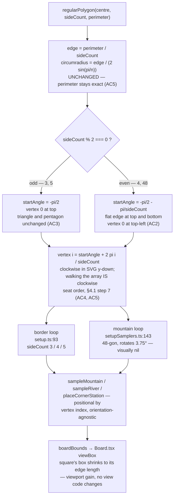

# Plan: Decide border polygon orientation — even-sided borders present a flat edge at the top

Plan folder: `.claude/contract/SCRUM-14-border-polygon-orientation/`
Execution status: see `tasks.md` in this folder.

---

## Part 1 — Alignment

*(The shared understanding of what this task is doing. Restate it in your own words — this is how the developer confirms you read the brief correctly before any design happens. Mismatch here = stop and fix.)*

### Task reference

**SCRUM-14** — "Decide border polygon orientation — the 4-player square currently renders as a diamond" (Task under epic SCRUM-1, labels `prototype-playtest`, `ui`, status To Do). Source: <https://amazerbeam.atlassian.net/browse/SCRUM-14>.

**Problem statement (verbatim from the ticket):** `regularPolygon` places vertex 0 at the top (angle `-pi/2`) for every player count. For odd-sided borders that is the natural orientation — the triangle and pentagon both look correct. For the 4-sided border it puts corners at top, right, bottom and left, so the square renders as a **diamond** rotated 45 degrees. This is geometrically a square and mechanically identical: SCRUM-4 AC2 ("regular polygon matching the player count, total perimeter preserved") is still satisfied, and every legality check passes. But it reads oddly against the rulebook's "square" wording, and it wastes a large amount of viewport — the axis-aligned bounding box of a rotated square is about 41% larger per side than the square itself, so the board is drawn noticeably smaller within the same space. Raising this as a decision rather than a defect: the fix is small, but it changes how every 2-player and 4-player board looks, which is a visual judgement the developer owns.

**User story:** As a play-tester, I want the square board to read as a square, so that the board matches the rulebook's description and uses the available screen area efficiently.

**Acceptance criteria (verbatim):**

1. A decision is recorded on whether even-sided borders should be rotated to present a flat edge at the top.
2. If rotation is adopted: the 4-player border renders axis-aligned, with a flat edge at top and bottom.
3. If rotation is adopted: the triangle and pentagon are unchanged, keeping a vertex at top.
4. Whichever is chosen, `regularPolygon`'s doc comment states the orientation rule and why, since "clockwise seat order" (rulebook section 4.1 step 7) is defined by walking the returned vertex array.
5. Perimeter remains exact and all existing `setup.test.ts` assertions still pass, including the clockwise-winding test.

**Scope boundaries (verbatim).** *In scope:* the vertex-0 starting angle in `regularPolygon`, its doc comment, and any test whose expectations encode the current orientation. *Out of scope:* irregular border shapes (rulebook section 4.2, out of scope for the whole epic); pan and zoom; any change to perimeter, inradius or seat assignment logic.

**Dependencies & risks (verbatim).** `regularPolygon` is the single place regularity is assumed, so the change is contained to one function. It is also used to build the mountain loop (48-gon), where orientation is visually irrelevant — confirm the change is conditional on side count, or harmless for large N. Starting stations are placed per corner by index, so rotating the border rotates which screen position each seat occupies. Turn order and the 2-player opposite-corner property (AC4) are unaffected, being defined by index rather than position.

**Design assets.** N/A — observed directly in the running prototype at <http://localhost:5173/>.

**Follow-up decision confirmed interactively (2026-08-01).** AC1 is the decision itself, and it is a visual judgement the developer owns (`.claude/workflow/web-project.md` → Developer-owned work). Asked at planning time and answered: **rotate all even side counts** — the start angle becomes `-pi/2 - pi/n` for even `n` and stays `-pi/2` for odd `n`. The developer chose this over the narrower `sideCount === 4` special case, accepting that the 48-gon mountain loop also rotates by 3.75° and that a given seed therefore regenerates a marginally different mountain than today's build. Skills confirmed in the same call: `react-frontend` only; `management-jira` was explicitly **not** ticked, so this contract does not touch Jira.

### Restated goal

Change one expression in `regularPolygon` so that polygons with an even number of sides are rotated by half a step, putting a flat edge at the top and bottom instead of a vertex — which makes the 4-player (and therefore 2-player) border render as an axis-aligned square rather than a diamond, and shrinks its bounding box from the circumradius-driven box to the edge length itself. Odd-sided borders keep a vertex at the top and are byte-identical to today. The orientation rule and the reason for it get written into the function's doc comment, because walking the returned vertex array is what "clockwise seat order" means (§4.1 step 7), so the array's starting position is a documented contract rather than an accident. The one existing assertion that encodes "vertex 0 is topmost" is replaced by assertions that encode the new rule per parity, and the clockwise-winding and exact-perimeter guarantees are re-asserted unchanged.

### In scope

- The vertex-0 starting angle in `regularPolygon` (`src/rules/setupSamplers.ts:81`): a parity-conditional half-step rotation, `-pi/2 - pi/n` for even `n`, `-pi/2` for odd `n`.
- `regularPolygon`'s doc comment (`src/rules/setupSamplers.ts:51-65`): state the orientation rule per parity, why even counts are rotated (the "square" reading of §4.1 step 2 plus the viewport gain), and that clockwise seat order is defined by walking the array from vertex 0 (AC4).
- `src/rules/__tests__/setup.test.ts:78-90` — the one test whose expectations encode the current orientation. Replace the "vertex 0 is topmost" assertion with parity-specific orientation specs; keep the clockwise-winding assertion (AC5).
- New specs proving AC2 and AC3 concretely: the 4-gon is axis-aligned with a flat top edge and a bounding box equal to its edge length; the 3-gon and 5-gon still have a single topmost vertex on the vertical centre line.
- Re-confirm that the exact-perimeter identity (AC5) and every other existing `setup.test.ts` and `setupValidation.test.ts` assertion still hold, including the 30-seed × 4-player-count legality sweep and the shipped-`rules.json` sweep, since the rotation perturbs the rejection samplers' inputs.
- Record the AC1 decision durably: in this plan, in the doc comment, and in `pr-description.md`.

### Explicitly out of scope

- Irregular border shapes (§4.2) — out of scope for the whole epic per the ticket.
- Pan and zoom, and any other change to how `Board.tsx` maps `boardBounds` to a viewBox. The viewport gain here comes free from the smaller bounding box; no view code changes.
- Any change to perimeter, `inradius`, `sideCountFor`, seat assignment, corner-station placement, or turn order.
- Any change to `rules.json` — no tunable is involved, and no new key is needed. The rotation is a fixed geometric consequence of the side count, not a tuning value.
- Editing `.docs/Game_Rules/Rules.md` to record the orientation under §4.3 / §14. Rules.md is the specification and editing it is a developer decision (raised in Risks).
- Transitioning SCRUM-14 or commenting the decision on the ticket — `management-jira` was deliberately not ticked.
- Any change to the mountain's shape parameters. It rotates as a side effect of the shared primitive; `MOUNTAIN_SEGMENTS` is untouched.

### Pattern Reference

- **`src/rules/setupSamplers.ts:51-88`** — the function being changed, and its own doc-comment style is the pattern for the AC4 comment: a rulebook citation, then the reason the choice was made, then what downstream depends on it.
- **`src/rules/__tests__/setup.test.ts:43-100`** — the existing `describe('regularPolygon')` block is the pattern for the new specs: one behaviour per `it`, `toBeCloseTo(…, 6)` for exactness, an AC reference in the test name where it maps to one.
- **§4.1 step 2** — "**4 players** — a **square**". The rulebook's own word for the shape, and the reason the diamond reads oddly.
- **§4.1 step 7** — "In clockwise order, the remaining players choose a **different** corner" — the contract AC4 says the doc comment must pin down.
- **§4.3 (M3)** — "Border: regular polygon per player count, centred on the play area." The prototype-setup decision this function implements. M3 specifies side count and centring; it does not specify orientation, so this decision refines M3 rather than overturning it.
- `.claude/skills/react-frontend/SKILL.md` for everything else.

### Constraints flagged on the brief

- **Perimeter must remain exact** (AC5, SCRUM-4 AC2). The rotation touches only the angle of the first vertex, not the circumradius derivation, so the perimeter identity is untouched by construction — and the existing 6-decimal-place assertion re-proves it.
- **All existing `setup.test.ts` assertions must still pass, including the clockwise-winding test** (AC5). Winding is preserved: rotating every vertex by the same angle cannot change the sign of the signed area.
- **The change must be conditional on side count, or harmless for large N** (ticket risk 2). It is conditional on *parity*, so the 48-gon mountain does rotate — by `pi/48` = 3.75°, which is below the visual resolution of a polygonised circle. The plan states this explicitly rather than leaving it to be discovered.
- **Turn order and the 2-player opposite-corner property must be unaffected** (ticket risk 3, SCRUM-4 AC4). Both are defined by vertex index, and the rotation preserves index order.
- **Determinism** (SCRUM-4 AC8). Same seed + same player count + same build must still produce an identical board. It does — nothing here reads the clock or `Math.random()`. But the boards themselves change relative to the current build, which is a distinct property, addressed in the audit.
- **`src/rules/` purity.** The edit is inside the rules engine; no React, no DOM.

### Assumptions made

- **The half-step rotation is expressed as a `startAngle` local, not by mutating the loop body's expression inline.** Rationale: the parity test and the reason for it need a name and a comment anchor; folding a conditional into the `angle` expression inside the loop recomputes the same constant `n` times and reads worse.
- **Parity is tested with `sideCount % 2 === 0`, and the rotation is `Math.PI / sideCount` (half of the `2 * Math.PI / sideCount` step).** Rationale: half a step is exactly what moves a vertex-at-top to an edge-centred-at-top; any other constant would not be axis-aligned.
- **Vertex 0 lands at the top-*left* corner for even counts, i.e. the rotation is `-pi/2 - pi/n` rather than `-pi/2 + pi/n`.** Rationale: both are axis-aligned squares, but subtracting puts vertex 0 at the top-left so that walking the array clockwise starts at the top-left corner and traverses the top edge first — the reading order a developer will assume when debugging seat order. Confirmed against the developer's chosen preview, which shows vertex 0 at top-left.
- **The rotation applies to every even side count, not just 4.** Rationale: developer-confirmed. One stated rule ("even counts present a flat edge") documents better than a special case ("the square is special"), and the only other even caller is the 48-gon mountain where 3.75° is invisible.
- **No `[MADE UP — M#]` marker is created for this decision.** Rationale: inventing a new M-number would mean editing `.docs/Game_Rules/Rules.md`, which is developer-owned. The decision is recorded in this plan, in the doc comment, and in `pr-description.md`; whether §4.3/§14 should absorb it is raised in Risks.
- **The existing test at `setup.test.ts:78-90` is edited in place rather than deleted and re-added elsewhere.** Rationale: the ticket's in-scope list names "any test whose expectations encode the current orientation", and that `it` block is the only one; keeping it where it sits preserves the `describe` block's narrative order.
- **The stale comment on `setup.test.ts:82` ("Signed area is negative for clockwise winding") is corrected while that block is being edited.** Rationale: it contradicts the assertion two lines below it (`toBeGreaterThan(0)`), which is the correct check for clockwise winding in a y-down system. It is inside the exact lines this task rewrites, so leaving a known-wrong comment there would be a deliberate omission, not restraint.
- **No new `rules.json` key, no new `src/constants/` entry.** Rationale: the rotation is derived from `sideCount`, which the function already receives. A constant would imply it is tunable; it is not.

### Config and persisted-shape audit

- **`rules.json` keys renamed, retyped, or removed: none.** The change reads no config key. `regularPolygon`'s three parameters are unchanged, and `config.borderPerimeter` continues to flow in from `setup.ts:93` untouched. No tutorial or UI copy quotes an orientation.
- **Persisted shapes affected: none — and nothing is persisted yet.** `Select-String` for `localStorage|sessionStorage|JSON.stringify|indexedDB` across `src/**/*.ts*` returns **1 hit**, and it is `src/rules/__tests__/reducer.test.ts:226` — a `JSON.parse(JSON.stringify(...))` round-trip of a move log *inside a test*. There is no save/load surface, no storage key, and no stored board or move log anywhere in the app. Recording that explicitly: this is a free window. Board geometry can change with zero migration cost today, and it cannot once a saved game exists, because a stored move log's coordinates were validated against the old border.
- **Type changes: none.** `regularPolygon(centre: Point, sideCount: number, perimeter: number): Polyline` is unchanged in name, arity, parameter types and return type. No union widens, nothing becomes optional, no array becomes an object. The only change is the numeric *value* of the returned vertices for even `sideCount`.
- **Consumers of the changed function enumerated.** `regularPolygon` has **2 production call sites**: `src/rules/setup.ts:93` (the border loop, `sideCount` 3/4/5) and `src/rules/setupSamplers.ts:143` (the mountain loop, `MOUNTAIN_SEGMENTS` = 48). Plus **1 definition** (`setupSamplers.ts:66`), **1 re-export** (`setup.ts:39`), and **12 references in `setup.test.ts`**. Of the two production call sites, the border is the intended target; the mountain is affected for even 48 and is visually unaffected. Downstream of the border loop, `sampleMountain`, `sampleRiver` and `placeCornerStation` all consume the vertex list positionally and are correct for any orientation — none contains a hard-coded corner position. `boardBounds` (1 production consumer, `src/ui/Board.tsx:18`) derives from vertices with no orientation assumption; it is where the viewport gain materialises.
- **Assertions that encode the current orientation: exactly 1 line.** `setup.test.ts:81` — `expect(loop[0].y).toBeLessThan(loop[1].y)` with the comment "First vertex is topmost". Under the rotated 4-gon both vertices sit on the top edge at the same height, so a strict `toBeLessThan` fails and this line must change. **The replacement must use `toBeCloseTo`, not `toBe` or `===`:** the two y-values are equal in exact arithmetic but not in floating point, because they come from `Math.sin(-3*pi/4)` and `Math.sin(-pi/4)`, which differ in the last bits. Verified numerically at planning time — the pair prints as `-500.000` and `-500.000` while `===` returns `false`. An exact-equality assertion here is a test that fails for a reason that has nothing to do with the behaviour. Every other assertion in the `regularPolygon`, `inradius` and `boardBounds` blocks is orientation-independent: the perimeter, edge-length, self-intersection, centroid, throw-guard, circumradius-comparison and padding checks are all rotation-invariant, and the `inradius` spec at `setup.test.ts:103-107` measures the midpoint of the `loop[0]`–`loop[1]` edge, which sits at the inradius distance regardless of which edge that is. The signed-area assertion at `setup.test.ts:89` also survives, because a uniform rotation preserves winding sign.
- **`src/rules/` boundary not crossed.** `setupSamplers.ts` imports only `../constants/*`, sibling rules modules and types; the boundary grep from `web-project.md` returns zero hits and the design adds no import. The change is arithmetic inside an existing pure function.
- **Seeded boards change relative to the current build, and that is accepted, not overlooked.** Determinism (AC8) is a *within-build* property and holds: the RNG draw order is untouched, so the same seed still yields an identical board from an identical build. But rotating the border and the 48-gon changes the geometry the three rejection samplers test against, so a given seed's mountain, river and station positions will differ from today's. Nothing is stored, so nothing migrates; the consequence is that the 30-seed legality sweep and the shipped-`rules.json` sweep in `setup.test.ts` are re-running against genuinely new boards and must be observed to pass rather than assumed to.

---

## Part 2 — Technical design

### Approach

The whole change is one hoisted local and one conditional inside `regularPolygon`. Today the loop computes `const angle = -Math.PI / 2 + (2 * Math.PI * i) / sideCount`, which places vertex 0 at `-pi/2` — straight up — for every side count. The step between vertices is `2 * Math.PI / sideCount`; rotating the entire polygon by *half* a step moves the configuration from "a vertex at the top" to "an edge centred on the top". For odd side counts a vertex at the top is already the natural presentation (and the triangle and pentagon look right today), so the rotation is applied only when `sideCount % 2 === 0`. Extracting `startAngle` above the loop gives the rule a name and somewhere for the comment to live, and computes the parity test once instead of `n` times.

The direction of the rotation is a real choice with a wrong answer. `-pi/2 - pi/n` and `-pi/2 + pi/n` both produce an axis-aligned square; they differ in which corner vertex 0 occupies. Subtracting puts vertex 0 at the **top-left**, so walking the array clockwise starts at the top-left corner and traverses the top edge first. That matters precisely because §4.1 step 7's "clockwise order" is *defined* by this array's order (AC4): a developer debugging seat assignment reads the vertex list and expects it to start where reading starts. Adding would put vertex 0 at the top-right, which is equally correct geometrically and worse to reason about. This is the design's one non-obvious commitment, and it is what the doc comment must pin down.

Everything stays in `src/rules/` — this is pure arithmetic inside an already-pure module, and nothing about it wants a hook or a component. No UI file changes at all: `Board.tsx` computes its viewBox from `boardBounds(state, config)`, which derives from the vertices it is handed, so the ~41% bounding-box reduction for the square arrives without a single line of view code. That is the payoff of the existing `boardBounds` design and the reason the ticket's viewport claim needs no view work. The alternative shape — adding an `orientation` parameter or a `rules.json` key so the rotation could be toggled — was rejected: orientation is a determined consequence of side count, not a tuning lever, and a key implies a play-tester should experiment with it. The other alternative, special-casing `sideCount === 4`, was put to the developer and declined in favour of the general parity rule.

Two consequences are followed through rather than assumed. First, the mountain loop is a 48-gon built through the same primitive, so it rotates by `pi/48` = 3.75° — invisible on a polygonised circle, but real, and it means the rejection samplers see different input geometry. Second, because `sampleMountain`, `sampleRiver` and `placeCornerStation` are rejection samplers driven by a fixed RNG draw order, changing the border geometry changes which candidates they accept: the same seed now produces a different (still legal) board. Determinism per SCRUM-4 AC8 is unaffected — it is a same-build property — and nothing is persisted, so there is no migration. But the existing 30-seed × 4-player-count `validateSetup` sweep and the shipped-`rules.json` sweep in `setup.test.ts` are the guard that no player count became unsamplable, so the contract runs the full `setup.test.ts` and `setupValidation.test.ts` files rather than only the `regularPolygon` block. If a seed genuinely fails, that is a finding about how cramped the shipped constants are (a §12 conversation for the developer), not a licence to change the seed in the test.

Test shape is test-first: the orientation assertions are rewritten to encode the new rule and expected to fail on the current implementation before the one-line change makes them pass. Three behaviours get their own `it`, because they are three separate claims the ACs make — even counts are axis-aligned with a flat top edge (AC2), odd counts still have a single topmost vertex on the centre line (AC3), and winding is still clockwise for both parities (AC5). The AC2 spec also asserts the concrete viewport consequence: the 4-gon's axis-aligned bounding box is exactly its edge length (`perimeter / 4`), which is the ticket's "~41% larger per side" claim stated as an equality rather than a ratio. The expected values were verified numerically at planning time against the proposed expression — for `perimeter` 4000 the 4-gon's box goes from 1414.214 to 1000.000 (a ratio of exactly √2), vertex 0 lands at `(-500, -500)`, and the signed area stays positive for 3, 4, 5 and 48 sides — so the tasks assert measured numbers rather than derived ones. Every cross-vertex comparison uses `toBeCloseTo`, for the floating-point reason recorded in the audit.

### Skills to invoke during execution

- **`react-frontend`** — owns everything under `src/`: the `src/rules/` purity boundary this edit sits inside, the no-hard-coded-tunable rule, the Vitest posture for rules-engine specs (`src/rules/__tests__/`, no DOM), the 400-line file budget, and the requirement to actually run the tests and report numbers. Confirmed by the developer.
- Developer override to note: **`management-jira` was offered and deliberately not ticked**, so the execution session must not transition SCRUM-14 or post the AC1 decision as a Jira comment. Recording the decision is done in the doc comment and `pr-description.md`.
- Workflow reference the executor must Read: **`.claude/workflow/web-project.md`** (paths, runner table, PowerShell chaining, the boundary grep, the Vitest `run`-subcommand constraint).
- Shared rules: **none apply — `.claude/rules/` is empty.** Scanned `.claude/rules/README.md`; the index is empty by design and its two most relevant candidate rules (determinism/seeding, save-data versioning) are unwritten. The determinism and no-persistence findings are covered in the audit above instead.

### Diagram



### Data shapes

No type, config, or contract changes. The signature, parameter types, return type and error messages of `regularPolygon` are all unchanged; no `rules.json` key, `src/constants/` entry, `Move` variant, reason code or `data-testid` is added, renamed or retyped. The only change is the numeric value of the returned vertices when `sideCount` is even.

For precision, the unchanged signature the tasks refer to:

```ts
// src/rules/setupSamplers.ts — signature UNCHANGED, body's start angle changes
export function regularPolygon(centre: Point, sideCount: number, perimeter: number): Polyline
```

And the one new local introduced inside its body:

```ts
// Even side counts are rotated by half a step (pi / sideCount) so an EDGE, not a
// vertex, is centred at the top. Odd counts keep a vertex at the top.
const startAngle = -Math.PI / 2 - (sideCount % 2 === 0 ? Math.PI / sideCount : 0)
```

### Runtime quality notes

- **Purity and adjudication:** The entire change is inside `src/rules/setupSamplers.ts`, a pure module that imports only `../constants/*`, sibling rules modules and types. No React, no DOM global, no new import of any kind. No component gains any adjudication — no UI file is touched. Nothing here is keyed on `PlayerId` or `ColourId`; `regularPolygon` knows only about geometry, and seat assignment in `setup.ts:116-163` (which keys on `ColourId` via `COLOUR_SEATS`) is untouched. No tunable is introduced: the rotation is derived from `sideCount`, and `config.borderPerimeter` remains the only config value on this path.
- **Effects, mount and teardown:** Trivial — no concerns. No effect, listener, observer, timer, `requestAnimationFrame`, `AbortController` or pointer capture is created, changed or removed; no React file is touched. No module-level mutable state is added — `startAngle` is a `const` inside the function body, so it cannot survive HMR or leak between tests in a file. A second new game re-enters `generateSetup` and recomputes everything from the seed, exactly as today.
- **Hot-path cost:** Trivial — no concerns, and marginally cheaper than today. `regularPolygon` runs during setup generation, not per pointer event; the drag hot path is untouched. Hoisting `startAngle` out of the loop replaces `n` additions of a constant with one, and evaluates the parity test once instead of never (it did not exist) — no allocation is added, the vertex array is built exactly as before. No memoisation is introduced, correctly, since there is no profiling evidence and no need.
- **Determinism and numeric safety:** No `Math.random()` is reachable — the change adds no randomness, and the RNG draw order in `generateSetup` / the three samplers is untouched, so the same seed and player count still produce an identical board from the same build (AC8). Boards *do* differ from the current build's boards for a given seed, because the samplers reject against rotated geometry; that is stated in the audit and has no migration cost since nothing is persisted. Numerically, the new expression adds only `Math.PI / sideCount` to an angle: `sideCount` is already guarded to be an integer ≥ 3 by the existing throw at `setupSamplers.ts:67-69`, so the divisor cannot be zero and no `NaN` can reach a coordinate. The existing `circumradius` divisor `2 * Math.sin(Math.PI / sideCount)` is untouched and still guarded by the same check. No epsilon is introduced or changed; `EPSILON` and `config.tangencyTolerance` keep their current meanings, and the ±2% arc-length check (M6) is not on this path.
- **Error paths:** Both existing guards are preserved verbatim and both remain covered — `sideCount` not an integer ≥ 3 throws with `sideCount` in the message (`setup.test.ts:92-95`), non-positive `perimeter` throws with `perimeter` in the message (`setup.test.ts:97-99`). No new failure mode is introduced: for any `sideCount` that passes the guard, the rotation is a finite number. Nothing is caught or swallowed, no success-shaped fallback is added, and no async surface exists here. Downstream, a rotated border that somehow made a board unsamplable would surface as the existing `SetupGenerationError` carrying the seed and player count (`setup.ts:48-63`) — a named, reproducible failure, not a silent partial board — and the 30-seed sweep in Phase 1 Task 2 is what proves that path is not being hit.

### Risks and judgement calls

- **The orientation decision itself (AC1) is developer-owned and was answered at planning time (2026-08-01): rotate all even side counts.** Recorded here, in the doc comment, and in `pr-description.md`. If the developer changes their mind after seeing it on screen, the revert is one expression.
- **Vertex 0 moves to the top-left for even counts.** Every 2-player and 4-player board therefore rotates 45°, so each seat's starting station occupies a different screen position than it did — the corner *index* is unchanged, so turn order and the 2-player opposite-corner property are safe (SCRUM-4 AC4), but a play-tester who has built a mental picture of "blue is at the top" will see blue at the top-left. Worth a look on the running app.
- **The 48-gon mountain rotates 3.75°, and every seeded board changes.** Judged harmless and accepted by the developer when choosing the general parity rule over a `sideCount === 4` special case. The consequence to be aware of: a bug previously reproduced by quoting a seed no longer reproduces from that seed on this build. Nothing is persisted, so there is no data to migrate — and this contract is the record that the window was still open on 2026-08-01.
- **The 30-seed × 4-player-count legality sweep and the shipped-`rules.json` sweep are re-running against genuinely new boards.** If a seed now fails, that is real information about how cramped the shipped M2 constants are, and it routes to the developer via §12 — the fix is a `rules.json` decision, not a changed seed in the test. Phase 1 Task 2 exists specifically to surface this rather than let it appear as a mystery failure in Final verification.
- **No `[MADE UP — M#]` marker is created, and `.docs/Game_Rules/Rules.md` is not edited.** §4.3 (M3) specifies the border's side count and centring but is silent on orientation, so this decision refines M3 rather than overturning it. Whether §4.3 or §14 should absorb a sentence about it is the developer's call, since Rules.md is the specification and agents do not edit it. Flagging it because the alternative — an orientation rule documented only in a doc comment — is the kind of thing that gets re-litigated in six months.
- **The stale comment at `setup.test.ts:82` is corrected in passing.** It claims clockwise winding gives a negative signed area while the assertion below it checks `> 0`; the assertion is right for a y-down system. It sits inside the exact lines this task rewrites. Called out so it is a decision rather than an unexplained diff line.
- **No tuning value is needed and none is invented.** Nothing in this contract wants a `rules.json` change.
- **Behaviours only judgeable by playing:** whether the axis-aligned square genuinely reads better and uses the space better on screen (the ticket's whole premise), whether the larger effective board changes how cramped the M2 constants feel, and whether the triangle and pentagon still look right beside it. All three need `npm run dev` and the developer's eyes.
