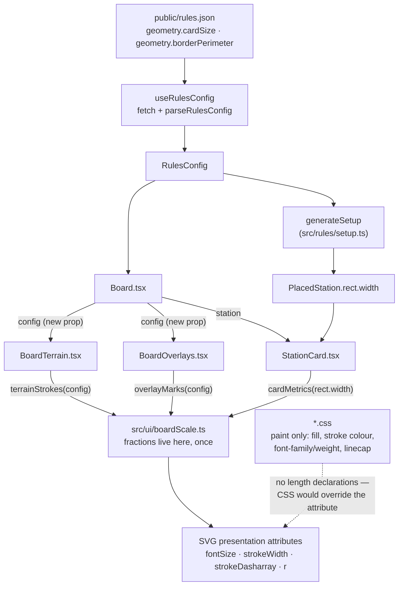

# Plan: Station card text and overlay marks scale with the geometry constants

Plan folder: `.claude/contract/SCRUM-15-scale-board-text-and-marks/`
Execution status: see `tasks.md` in this folder.

---

## Part 1 — Alignment

*(The shared understanding of what this task is doing. Restate it in your own words — this is how the developer confirms you read the brief correctly before any design happens. Mismatch here = stop and fix.)*

### Task reference

**Jira:** [SCRUM-15](https://amazerbeam.atlassian.net/browse/SCRUM-15) — *"Station card text and overlay marks are fixed world units, so they do not scale with cardSize"* · Task · parent epic SCRUM-1 · labels `prototype-playtest`, `ui` · status To Do · **relates to** SCRUM-12 (*"Station cards render with no seat colour — CSS stroke overrides the per-seat colour"*).

**Problem statement (verbatim from the ticket):**

> `StationCard.tsx` documents its layout as "fractions of the card's own size, so the layout scales with cardSize (M2) rather than assuming a pixel footprint" — and the positions genuinely are fractional. But the **font sizes** live in `StationCard.css` as fixed world units (16 / 26 / 20), as do the overlay marker radii in `BoardOverlays.tsx` (4 and 7) and the terrain stroke widths in `BoardTerrain.css` (6 to 8).
>
> At the shipped `cardSize` of 120 this happens to work, though the text is already cramped — "STARTING" is barely readable and the black connection bonus nearly touches the grey one beneath it. Change `cardSize` or `borderPerimeter` in `rules.json` — which is precisely the tuning workflow this epic exists to support — and the card text overflows its own rect or the overlays become invisible.
>
> This quietly defeats the tuning loop: a constant can be retuned and the render silently becomes wrong rather than scaling with it.

**User story (verbatim):**

> As a play-tester tuning the geometry constants, I want the board's text and marks to scale with the constants, so that retuning `cardSize` produces a correct render rather than a broken one.

**Acceptance criteria (verbatim):**

1. Station card text scales with the card's own size, so halving `cardSize` in `rules.json` halves the text rather than overflowing the card.
2. At the shipped `cardSize` of 120 the card is legible without zooming: the type name is readable, and the black connection bonus is clearly separated from and visually dominant over the grey one (rulebook section 7.2).
3. The player-limit pawn count remains countable at a glance (rulebook section 7.1).
4. Overlay vertex and crossing radii, and terrain stroke widths, scale with the board so they remain visible across the plausible range of `borderPerimeter`.
5. No tuning value is hard-coded to achieve this — everything derives from `RulesConfig` or from the element's own dimensions.
6. `StationCard.tsx`'s doc comment matches what the code actually does.

**Scope boundaries (verbatim):**

> **In scope:** `StationCard.tsx` / `.css`, `BoardOverlays.tsx` / `.css`, `BoardTerrain.css`. Either drive sizes as SVG attributes computed from `rect.width`, or wrap card contents in a scaled `g` element.
>
> **Out of scope:** final art and typography; the colour palette; pan and zoom; any change to `rules.json` values.

**Dependencies & risks (verbatim):**

> * Related to the station-colour defect in the same component; worth doing together if both are picked up.
> * Verification is visual, and the prototype has no automated renderer coverage by design (jsdom and testing-library were declined).
> * Low risk — presentation only, no engine impact.

**Design assets:** N/A — observed directly in the running prototype at `http://localhost:5173/`.

**Skill confirmation (2026-08-01, interactive):** the developer confirmed `react-frontend` as the only skill for this contract and declined `management-jira` — no ticket transition or comment is part of this work.

### Restated goal

Every mark the board draws is currently sized in fixed SVG world units, while the things those marks decorate are sized from `rules.json`. The card's *positions* scale with `cardSize` but its *type sizes and stroke widths* do not, and the terrain strokes and debug-overlay dots are pinned to world constants that only look right because `borderPerimeter` happens to be 4000. This contract makes every rendered dimension proportional to the tunable it belongs to: card text, card border and pawn strokes become fractions of the card's own `rect.width`; terrain stroke widths, dash patterns and overlay radii become fractions of `config.borderPerimeter`. The fractions are extracted into one pure, unit-tested module so the proportionality is provable without a renderer, and the card's type sizes and vertical rhythm are retuned so the shipped `cardSize` of 120 reads clearly — the black connection bonus visually dominant over and clearly separated from the grey. No value in `rules.json` changes.

### In scope

- A new pure module `src/ui/boardScale.ts` holding every render-size fraction and the three derivation functions that turn a tunable into world-unit sizes — `cardMetrics(size)`, `terrainStrokes(config)`, `overlayMarks(config)`.
- Vitest coverage for that module at `src/ui/__tests__/boardScale.test.ts`, asserting proportionality (halving the driving tunable halves every derived size) and that the board-relative fractions reproduce today's shipped appearance exactly at `borderPerimeter` 4000.
- `src/ui/StationCard.tsx` — derive `fontSize` and `strokeWidth` as computed SVG attributes from `rect.width` via `cardMetrics`; retune the type sizes and vertical positions for AC2/AC3 legibility at `cardSize` 120; correct the doc comment (AC6).
- `src/ui/StationCard.css` — delete every `font-size` and `stroke-width` declaration, leaving only paint and typeface concerns.
- `src/ui/BoardOverlays.tsx` — accept a `config: RulesConfig` prop; replace the `VERTEX_RADIUS` / `CROSSING_RADIUS` module constants with values from `overlayMarks`; set the crossing and rect stroke widths and the rect dash pattern as computed attributes.
- `src/ui/BoardOverlays.css` — delete the `stroke-width` and `stroke-dasharray` declarations.
- `src/ui/BoardTerrain.tsx` — accept a `config: RulesConfig` prop; set each terrain path's `strokeWidth`, and the mountain's `strokeDasharray`, as computed attributes from `terrainStrokes`.
- `src/ui/BoardTerrain.css` — delete the three per-kind stroke widths and the mountain dash pattern, leaving the shared `fill`/`linejoin`/`linecap` rule.
- `src/ui/Board.tsx` — pass the `config` it already holds down to `BoardTerrain` and `BoardOverlays`.

### Explicitly out of scope

- **Any change to `public/rules.json`.** The ticket says so directly, and the shipped values already exercise the bug.
- **SCRUM-12, the station seat-colour defect.** The ticket notes the two are "worth doing together if both are picked up" — they have not both been picked up here. This contract touches `StationCard.tsx`'s size attributes and `StationCard.css`'s `font-size` / `stroke-width` declarations; it does not touch `.station-card__body`'s `stroke` colour declaration, which is where SCRUM-12 lives. Kept deliberately disjoint so both can land in either order.
- **Final art and typography** — typeface choice, the colour palette, letter-spacing polish, iconography. The retuned fractions are a legibility fix, not a design pass.
- **Pan and zoom.** The viewBox stays `boardBounds` with `preserveAspectRatio="xMidYMid meet"`.
- **A DOM test environment.** jsdom and testing-library were declined; `vite.config.ts` stays on `environment: 'node'` and the `*.test.ts` include glob is not widened. No component test is planned.
- **Any change under `src/rules/`.** This is presentation only; the engine is untouched.
- **The `HeroScene.tsx` SVG constants.** It is decorative marketing art with its own private viewBox, driven by no tunable.

### Pattern Reference

The brief names the two candidate techniques — "drive sizes as SVG attributes computed from `rect.width`, or wrap card contents in a scaled `g` element" — and the six files in scope. Beyond that:

- **`src/ui/StationCard.tsx:4-9`** is the pattern to extend: named `UPPER_SNAKE_CASE` fractions of the card's own size, applied as computed SVG attributes. This contract keeps that convention and completes it, rather than replacing it.
- **`src/constants/setup.ts:31-53`** is the house pattern for a documented presentation constant that is deliberately *not* a `rules.json` tunable (`MOUNTAIN_OFFSET_FRACTION`, `RIVER_EDGE_MARGIN`), with a comment stating why. The new fractions follow it.
- **`src/rules/setup.ts:222-263` (`boardBounds`)** is the precedent for pulling a pure numeric derivation out of a component so it is unit-testable without a renderer. `boardScale.ts` is the same move for presentation sizing.
- **`.claude/skills/react-frontend/SKILL.md`** governs everything under `src/` — invoke it, do not work from a summary.
- **Rulebook §7.1** (one pawn per allowed distinct player) and **§7.2** (black first-connection bonus vs grey later bonus) are the two card-face requirements AC2 and AC3 restate. **M2** is the M-number for `cardSize` and `borderPerimeter`; §14 indexes it.

### Constraints flagged on the brief

- **No `rules.json` value may change** (scope boundary, and the pipeline's standing pause condition — tuning values are the developer's).
- **AC5: nothing hard-coded.** Every size must derive from `RulesConfig` or from the element's own dimensions. The `react-frontend` success criterion is stricter and is the gate: `Grep -nE "\b(350|700|4000|120|1400)\b" src` must return no hits outside `rules.json` and its types.
- **AC2/AC3 are visual judgements** and the brief says so: "Verification is visual, and the prototype has no automated renderer coverage by design (jsdom and testing-library were declined)." The developer confirms legibility by eye; the plan must not fake that with a test.
- **Presentation only — no engine impact.** Nothing under `src/rules/` changes and no `GameState` shape moves.
- **The two-runtime-dependency limit holds.** This change needs no new dependency.

### Assumptions made

- **`rect.width` is the card's driving dimension, not `config.cardSize`.** AC5 explicitly permits "the element's own dimensions", `StationCard` already reads `const size = rect.width`, and generation sets `rect.width` from `config.cardSize`. Using `rect.width` keeps `StationCard` config-free and means the same metrics serve a future ghost/preview card at any size.
- **`config.borderPerimeter` is the divisor for board-relative marks, not the rendered `boardBounds`.** Bounds vary with the generated geometry, so scaling off them would make two boards at identical config render different stroke weights. `borderPerimeter` gives one stable scale per config. The trade-off is stated under Risks.
- **Sizes move to SVG presentation attributes rather than a scaled `<g>` wrapper.** The brief offers both. Attributes are the smaller diff, they leave the existing fractional-position convention intact, they keep `x`/`y` in world coordinates so hit-testing and the SCRUM-5 ghost card are unaffected, and a `scale()` transform on a `<g>` would also scale the card's stroke widths by the transform — coupling two things this ticket wants controlled independently.
- **CSS `font-size` / `stroke-width` declarations must be deleted, not merely superseded.** A CSS declaration beats an SVG presentation attribute in the cascade, so leaving `font-size: 16px` in place would silently defeat the computed `fontSize`. This is the single correctness trap of the change and it is why each `.css` file is in the same task as its `.tsx`.
- **The retuned card fractions are documented presentation defaults, not tuning values.** They live in source alongside the existing `TITLE_Y = 0.28`, they are not `rules.json` keys, and AC2 demands a change to them because the shipped layout is already cramped. Per project memory the developer defers documented plan defaults — but legibility remains theirs to confirm by eye, so it is listed under Risks and in the `tasks.md` File map.
- **The board-relative fractions are chosen to reproduce the shipped appearance exactly at `borderPerimeter` 4000** (8 → 0.002, 7 → 0.00175, 6 → 0.0015, 4 → 0.001, 3 → 0.00075, 2 → 0.0005, dash `18 10` → 0.0045/0.0025, dash `6 4` → 0.0015/0.001). Nothing about the current board's appearance changes; only its behaviour under retuning does. This makes AC4 testable as an exact equality rather than a judgement.
- **`src/ui/boardScale.ts` is the right home, not `src/rules/`.** It is presentation sizing, and putting render dimensions into the rules engine would breach the boundary the epic rests on. It is still pure TypeScript with no React and no DOM, so its spec runs under the existing `environment: 'node'` Vitest config — `vite.config.ts:13` already collects `src/**/__tests__/**/*.test.ts`, not just `src/rules/`. This is a pure unit test of a pure module, not the component test the brief declined.
- **`BoardTerrain` and `BoardOverlays` gain a `config` prop rather than reading a context.** Both are rendered only from `Board.tsx` (confirmed by grep), which already receives `config`. A context would be new machinery for two call sites.
- **The now-styleless `board-terrain__path--*` modifier classes stay on the elements.** They cost nothing, they are the devtools handle for identifying a terrain path, and removing them would change the rendered DOM for no benefit. Their empty CSS rules are deleted.

### Config and persisted-shape audit

Run because the change is name-bound in three ways: CSS class names, a `RulesConfig` field read at a new call site, and a new component prop.

- **`rules.json` keys renamed, retyped or removed: none.** No key changes. The two keys newly *read* by presentation code are `geometry.cardSize` — `\bcardSize\b` → **37 hits across 12 files** (`src/rules/setup.ts` 4, `search.ts` 4, `setupSamplers.ts` 5, `config.ts` 3, `setupValidation.ts` 2, `src/ui/StationCard.tsx` 1 — a doc-comment mention only — plus 18 in `src/rules/__tests__/`) — and `geometry.borderPerimeter` — `\bborderPerimeter\b` → **17 hits across 7 files** (`setupSamplers.ts` 4, `config.ts` 3, `setupValidation.ts` 2, `setup.ts` 1, plus 7 in `src/rules/__tests__/`). Every existing hit is a *read*; none is modified by this contract, so no consumer needs updating.
- **Persisted shapes affected: none, and nothing is persisted yet.** `Grep "localStorage|sessionStorage|data-testid"` over `src/` returns **zero hits** (the only occurrences of the storage names in the repo are the `eslint.config.js:45-46` denylist entries) — there is no save file, no stored move log, and no `Move` kind on disk. Recording that here because the window is still open: the first story that persists a game closes it.
- **Type changes and loss: none.** No field changes type, no array becomes an object, no required field becomes optional, no union widens. The three new exported interfaces (`CardMetrics`, `TerrainStrokes`, `OverlayMarks`) are additive and have no prior consumers.
- **Consumers of every changed component signature, enumerated.** `BoardTerrain` and `BoardOverlays` each gain a required `config` prop. Grepping `src/**/*.tsx` for both names gives their definition sites plus **exactly one** call site each — `src/ui/Board.tsx:28` and `src/ui/Board.tsx:36`. `DebugPanel.tsx:5` and `AppShell.tsx:11` import only `type { OverlayFlags }` from `BoardOverlays`, which is unaffected. `StationCard`'s props are unchanged; its one call site is `src/ui/Board.tsx:30`.
- **String-bound render names align across the chain.** `station-card__*` appears in exactly two source files (`StationCard.tsx`, `StationCard.css`); `board-overlays__*` in two (`BoardOverlays.tsx`, `BoardOverlays.css`); `board-terrain__*` in two (`BoardTerrain.tsx`, `BoardTerrain.css`). No `data-testid` exists anywhere in `src/`, and no test references any of these class names — the only other hits are two `.claude/contract/**/tasks.md` files, which are plan documents, not code. **No class name is renamed by this contract**, so the string binding is not disturbed; only declarations *inside* the existing rules are deleted.
- **The `src/rules/` boundary is not crossed.** `Select-String -Path src\rules\*.ts,src\rules\**\*.ts -Pattern "from 'react'|\bwindow\.|\bdocument\.|localStorage"` is expected to stay at zero hits: nothing under `src/rules/` is edited. The new `src/ui/boardScale.ts` imports `type { RulesConfig }` from `src/rules/config` — a UI module importing a rules *type* is the direction the boundary permits, and it is exactly what `Board.tsx:8` already does. `boardScale.ts` imports no React and touches no DOM, which is what lets its spec run in the `node` environment.

---

## Part 2 — Technical design

### Approach

The defect is one missing indirection: the board's *positions* are derived from tunables and its *sizes* are not. The fix is to give sizes the same treatment, and to put every fraction that does the deriving in one pure module rather than scattering them across three components and three stylesheets. `src/ui/boardScale.ts` exports three functions — `cardMetrics(size: number)`, `terrainStrokes(config: RulesConfig)` and `overlayMarks(config: RulesConfig)` — each returning a frozen record of world-unit numbers (and two pre-formatted dash strings). The fractions are module constants in that file, documented with what they reproduce at the shipped configuration. Because the module is plain arithmetic over a `RulesConfig` type, it is unit-testable with no renderer under the existing `environment: 'node'` Vitest setup, which is what turns AC1 and AC4 from "looks right on my screen" into an assertion that halving the tunable halves every derived number.

Card sizes divide by `rect.width`; board marks divide by `config.borderPerimeter`. That split matters and is the design's one real judgement call. The SVG viewBox is `boardBounds` (`src/rules/setup.ts:231`), which tracks `borderPerimeter` plus one `cardSize` of padding on each side, and `preserveAspectRatio="xMidYMid meet"` fits that box to the element — so a mark given a fixed world size renders *smaller* as the board grows and *fatter* as it shrinks. Scaling terrain strokes and overlay dots by `borderPerimeter` holds their apparent size constant across the tuning range, which is precisely AC4. The rejected alternative was to divide by the rendered `boardBounds` instead: it would compensate for the `cardSize` padding term too, but it would make stroke weight depend on the *generated* board, so two boards at the same seed-independent config would draw differently — a presentation layer that is not a pure function of the config is a worse bug than the one being fixed. Card sizes, meanwhile, must follow the card and not the board: a card is legible or not on its own terms.

Sizes become SVG presentation attributes (`fontSize`, `strokeWidth`, `strokeDasharray`, `r`) rather than the scaled-`<g>` wrapper the brief offers as the alternative. A `transform="scale(k)"` would be fewer lines, but it scales stroke widths along with geometry — so the card border and the type would be locked to one ratio — and it moves the card's contents into a local coordinate system, which would need unpicking again for the SCRUM-5 ghost card and for any future hit-testing. Attributes keep every coordinate in world space. The **load-bearing consequence** is that each stylesheet must have its `font-size` and `stroke-width` declarations *deleted* in the same edit: a CSS declaration wins over an SVG presentation attribute in the cascade, so a leftover `font-size: 16px` would silently override the computed value and the change would appear to do nothing while type-checking and linting clean. That is why each `.css` file is paired with its `.tsx` in one task rather than split across a phase boundary. What stays in CSS is everything that is not a length: `fill`, `stroke` colour, `font-family`, `font-weight`, `text-anchor`, `letter-spacing` (an `em` value, already proportional), `paint-order`, `stroke-linejoin`, `stroke-linecap`.

The card's fractions are also retuned, because AC2 and AC3 ask for legibility and the shipped layout does not have it — at `cardSize` 120 the black bonus's baseline sits 4-5 world units above the grey bonus's cap height, which is what the ticket means by "nearly touches". The new layout moves the type up and enlarges it, widens the gap between the two bonus numbers to roughly 9 world units at 120, keeps the black bonus at ~1.7× the grey one so §7.2's black-versus-grey hierarchy reads at a glance, and drops the pawn row to the bottom margin the old layout was wasting. All of it is expressed as fractions of the card, so the same relationships hold at any `cardSize` — which is the whole point of the ticket. Nothing here touches `src/rules/`, no `GameState` shape moves, and the reducer is not involved: this is committed-state rendering only.

### Skills to invoke during execution

- **`react-frontend`** — owns everything under `src/`. For this task specifically: the "never hard-code a tunable" rule that AC5 restates, the constants taxonomy that decides where the new fractions live, the 400-line file budget, the per-component plain-CSS pattern, and the testing posture that makes a pure `src/ui/` module's spec legitimate while a component test is not. Confirmed by the developer on 2026-08-01; `management-jira` was offered and declined, so no ticket transition is part of this contract.

Also Read before executing:
- `.claude/workflow/web-project.md` — paths, the runner table, the `src/rules/` boundary grep, and the correctness traps (hard-coded tunables, string-bound names).
- `.claude/rules/` — scanned during planning via `.claude/rules/README.md`; the folder contains **no rule files**, so nothing applies. Re-scan rather than trusting this line.

### Diagram



### Data shapes

#### New module — `src/ui/boardScale.ts`

```ts
import type { RulesConfig } from '../rules/config'

/** World-unit render sizes for one station card, derived from its own footprint. */
export interface CardMetrics {
  /** Card border stroke width. */
  readonly bodyStroke: number
  /** Baseline offset from rect.y for the station type name. */
  readonly typeY: number
  readonly typeSize: number
  /** §7.2 — the black first-connection bonus. */
  readonly bonusFirstY: number
  readonly bonusFirstSize: number
  /** §7.2 — the grey later-connection bonus. */
  readonly bonusLaterY: number
  readonly bonusLaterSize: number
  /** §7.1 — the player-limit pawn row. */
  readonly pawnY: number
  readonly pawnRadius: number
  readonly pawnStroke: number
}

/** World-unit stroke sizes for the three terrain paths. */
export interface TerrainStrokes {
  readonly border: number
  readonly mountain: number
  readonly river: number
  /** Pre-formatted `strokeDasharray` value, e.g. "18 10". */
  readonly mountainDash: string
}

/** World-unit sizes for the debug overlay layer. */
export interface OverlayMarks {
  readonly vertexRadius: number
  readonly crossingRadius: number
  readonly crossingStroke: number
  readonly rectStroke: number
  /** Pre-formatted `strokeDasharray` value, e.g. "6 4". */
  readonly rectDash: string
}

export function cardMetrics(size: number): CardMetrics
export function terrainStrokes(config: RulesConfig): TerrainStrokes
export function overlayMarks(config: RulesConfig): OverlayMarks
```

#### Fractions — module constants in `src/ui/boardScale.ts`

Card fractions multiply `rect.width`. Values shown are the world units they produce at the shipped `cardSize` of 120; the three type sizes and the three lower `*_Y` values are **retuned** for AC2/AC3, the rest reproduce today's render.

| Constant | Fraction | At `cardSize` 120 | Was | Note |
|---|---|---|---|---|
| `BODY_STROKE` | 0.025 | 3 | 3 (CSS) | unchanged |
| `TYPE_Y` | 0.24 | 28.8 | 33.6 | retuned |
| `TYPE_SIZE` | 0.15 | 18 | 16 (CSS) | retuned — AC2 |
| `BONUS_FIRST_Y` | 0.56 | 67.2 | 69.6 | retuned |
| `BONUS_FIRST_SIZE` | 0.26 | 31.2 | 26 (CSS) | retuned — AC2 |
| `BONUS_LATER_Y` | 0.75 | 90 | 88.8 | retuned |
| `BONUS_LATER_SIZE` | 0.155 | 18.6 | 20 (CSS) | retuned — AC2, black now ~1.7× grey |
| `PAWN_Y` | 0.90 | 108 | 100.8 | retuned — AC3 |
| `PAWN_RADIUS` | 0.055 | 6.6 | 6 | retuned — AC3 |
| `PAWN_STROKE` | 0.0125 | 1.5 | 1.5 (CSS) | unchanged |

Board fractions multiply `config.borderPerimeter`. Every one reproduces the shipped world unit exactly at 4000, so the current board's appearance is unchanged.

| Constant | Fraction | At `borderPerimeter` 4000 | Replaces |
|---|---|---|---|
| `BORDER_STROKE` | 0.002 | 8 | `BoardTerrain.css` `stroke-width: 8` |
| `MOUNTAIN_STROKE` | 0.0015 | 6 | `BoardTerrain.css` `stroke-width: 6` |
| `RIVER_STROKE` | 0.00175 | 7 | `BoardTerrain.css` `stroke-width: 7` |
| `MOUNTAIN_DASH_ON` | 0.0045 | 18 | `BoardTerrain.css` `stroke-dasharray: 18 10` |
| `MOUNTAIN_DASH_OFF` | 0.0025 | 10 | ″ |
| `VERTEX_RADIUS` | 0.001 | 4 | `BoardOverlays.tsx:16` |
| `CROSSING_RADIUS` | 0.00175 | 7 | `BoardOverlays.tsx:17` |
| `CROSSING_STROKE` | 0.00075 | 3 | `BoardOverlays.css` `stroke-width: 3` |
| `RECT_STROKE` | 0.0005 | 2 | `BoardOverlays.css` `stroke-width: 2` |
| `RECT_DASH_ON` | 0.0015 | 6 | `BoardOverlays.css` `stroke-dasharray: 6 4` |
| `RECT_DASH_OFF` | 0.001 | 4 | ″ |

#### Changed component props

```ts
// src/ui/BoardTerrain.tsx — `config` is new
interface BoardTerrainProps {
  paths: readonly PlacedPath[]
  config: RulesConfig
}

// src/ui/BoardOverlays.tsx — `config` is new
interface BoardOverlaysProps {
  state: GameState
  flags: OverlayFlags
  config: RulesConfig
}

// src/ui/StationCard.tsx — unchanged
interface StationCardProps {
  station: PlacedStation
  colour: string | null
}
```

#### Unchanged

No `rules.json` key is added, renamed, removed or retyped. No `RulesConfig` field changes. No `GameState`, `Move`, `PlacedStation` or `PlacedPath` shape changes. No `package.json` script or dependency change. No CSS class name changes.

### Runtime quality notes

- **Purity and adjudication:** nothing under `src/rules/` is edited, so the boundary is untouched and the closing grep must stay at zero hits. `src/ui/boardScale.ts` is pure arithmetic — no React import, no DOM global — which is what lets its spec run in the existing `environment: 'node'` Vitest config; it imports only `type { RulesConfig }`, and a type-only import from `src/rules/` into `src/ui/` is the permitted direction (`Board.tsx:8` already does it). No component decides legality here; this is render sizing only, and no limit, trigger or connection map is involved, so the `ColourId`-versus-`PlayerId` hazard does not arise. Every size derives from `rect.width` or `config.borderPerimeter` — AC5 — and the closing tunable-literal grep is the gate.
- **Effects, mount and teardown:** trivial — no concerns. No effect, listener, observer, timer, `requestAnimationFrame`, `AbortController` or pointer capture is added or removed. `cardMetrics`, `terrainStrokes` and `overlayMarks` are called during render and allocate a plain object each; they hold no state, so StrictMode's double invocation is a no-op and a second new game re-renders identically. `boardScale.ts` declares only `const` fractions at module scope — no mutable module state, so nothing survives HMR or leaks between tests in one file.
- **Hot-path cost:** trivial for this change — the drag is SCRUM-6's and does not exist yet. The three derivations run once per component render, i.e. once per committed-state change (once per turn), not per pointer event. Each allocates one small frozen record; `BoardTerrain` calls `terrainStrokes` once for three paths, `BoardOverlays` calls `overlayMarks` once for all marks, and `StationCard` calls `cardMetrics` once per card — roughly 35 calls at a full board, against the ~60 SVG nodes React already reconciles there. `allCrossings` is untouched and remains the overlay layer's only real cost, gated behind a flag that defaults off. No `memo`, `useMemo` or `useCallback` is added: there is no profiling evidence and the skill forbids it without one.
- **Determinism and numeric safety:** no `Math.random()`, no `Date.now()`, no seed path is touched — generation is not involved. Every derivation is a multiplication by a positive constant, so there is **no divisor and no `NaN` route**: `parseRulesConfig` (`src/rules/config.ts:126-135`) already rejects any non-finite or non-positive `cardSize` / `borderPerimeter` before a config reaches the board, so a bad value fails at startup with a named reason rather than reaching a coordinate. `rect.width` originates from `config.cardSize` through the same validated path. `pawns()` divides by `count + 1` where `count` is `card.playerLimit` from `STATION_DEFINITIONS` (1-5, `src/constants/stations.ts:62-133`) — the divisor is at least 2 and cannot be zero. The ±2% arc-length check (M6) is not touched by this contract. The `boardScale` spec pins each fraction to the exact world unit it must produce at the shipped config, so a mistyped fraction fails a test rather than shipping as a slightly-wrong board.
- **Error paths:** nothing new can throw and nothing is caught, so there is no swallowing hazard and no `catch { return DEFAULTS }` — the `rules.json` load path in `useRulesConfig` is not edited. No new async surface, so the four async states do not apply. `BoardTerrain` keeps its existing `path.path.length < 2` guard, which renders nothing rather than emitting malformed path data. The two dash values are formatted as a plain `` `${on} ${off}` `` string from two positive numbers, so no malformed `strokeDasharray` can be produced. No placement is validated or committed here, so §10.2's reject order is not in play. The `aria-label` on the card and `aria-hidden` on the overlay layer are preserved verbatim.

### Risks and judgement calls

- **AC2 and AC3 can only be settled by the developer's eyes.** The retuned fractions are argued from cap-height arithmetic at `cardSize` 120 — black bonus at 31.2 world units against grey at 18.6, roughly 9 units of clear air between them, "STARTING" at 18 units in a 120-wide card with ~10 units of side margin. That is a defensible prediction, not a verification. **Run the app and look at a generated board**; the type sizes are one line each in `boardScale.ts` if they are wrong.
- **"STARTING" is the widest label and sets the type-size ceiling.** At `TYPE_SIZE = 0.15` it should occupy about 80% of the card's inner width. If it overhangs on the developer's font stack, the alternatives are to drop `TYPE_SIZE` to 0.135, or to add `textLength` + `lengthAdjust="spacingAndGlyphs"` so any label is forced to fit at any card size. The second is more robust and slightly distorts wide labels; it is not planned by default because it trades legibility for guaranteed fit and the brief puts typography out of scope. Raise it if the overhang is real.
- **`borderPerimeter` as the divisor ignores the `cardSize` padding term in `boardBounds`.** `boardBounds` pads by one `cardSize` on every side, so at an extreme ratio — a very large `cardSize` against a small `borderPerimeter` — the viewBox grows faster than the divisor and terrain strokes would render slightly thinner than intended. Across any plausible tuning range this is a few percent. The alternative, dividing by the rendered bounds, was rejected because it would make stroke weight depend on the generated board rather than on the config. Flagging it as a known, bounded approximation.
- **The card fractions are presentation defaults chosen by the planner, not tuning values.** They are deliberately *not* promoted to `rules.json`: the ticket puts rules.json changes out of scope, and a font size is not a difficulty lever. If the developer would rather have card typography be tunable, that is a different (and larger) story — say so before execution rather than after.
- **SCRUM-5 is `PLANNED` and its tasks already edit `StationCard.tsx` and `StationCard.css`.** Its `tasks.md` plans a marker glyph, a shared `describeStationCard` description, and a `StationGhost.tsx` that copies StationCard's fraction constants by hand ("Fractions of the card's own size, matching StationCard.tsx's convention"). If SCRUM-15 lands first, those SCRUM-5 steps go stale — the ghost should import `cardMetrics` rather than re-declare fractions, and its `**Files:**` line ranges will have moved. **Decide the order.** Landing SCRUM-15 first is the cheaper sequence and improves SCRUM-5, but SCRUM-5's contract will need a refresh pass before `/fb-apply`.
- **SCRUM-12 is deliberately left alone even though the ticket suggests pairing.** This contract does not touch `.station-card__body { stroke: #2b2b2b }`, which is the line SCRUM-12 exists to fix. If the developer wants them together, say so now and the CSS task absorbs it — otherwise the two land independently and neither conflicts.
- **A pure unit test under `src/ui/__tests__/` is a first for this repo.** Every existing spec lives in `src/rules/__tests__/`. The Vitest include glob (`vite.config.ts:13`) already collects it and the `node` environment already suits it, so this needs no toolchain change — but it is a new convention and the reviewers will notice. It is not the component test the brief declined; if the developer would rather have no test at all here, AC1 and AC4 fall back to visual verification only.
- **Deleting the CSS length declarations is the step that can silently no-op the whole change.** If a `font-size` or `stroke-width` survives in a stylesheet, the cascade beats the presentation attribute, everything type-checks and lints clean, and the board renders exactly as before. The Final verification phase greps all three stylesheets for zero `font-size` / `stroke-width` / `stroke-dasharray` hits for this reason.
